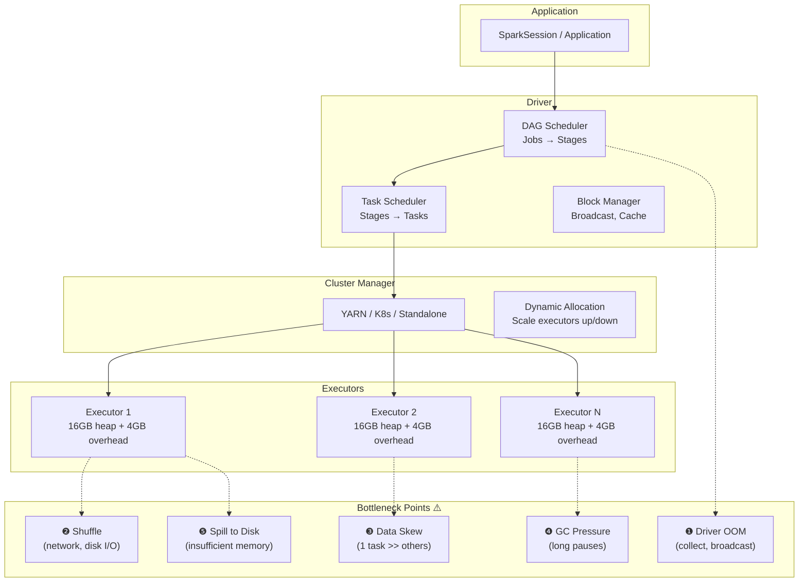
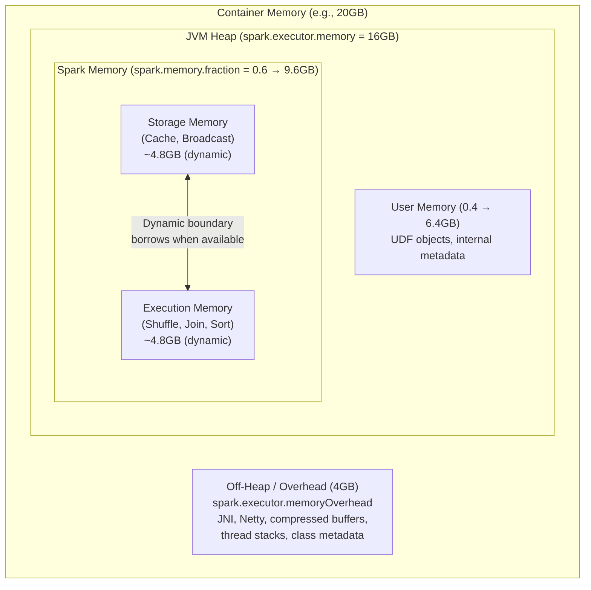
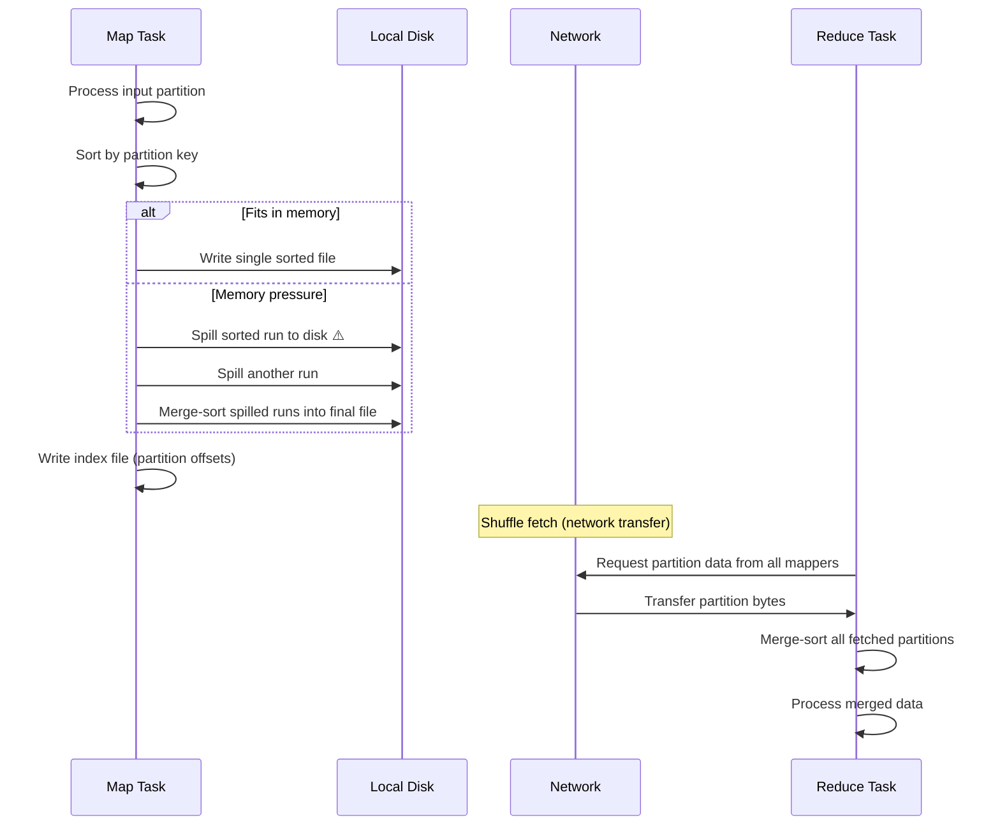
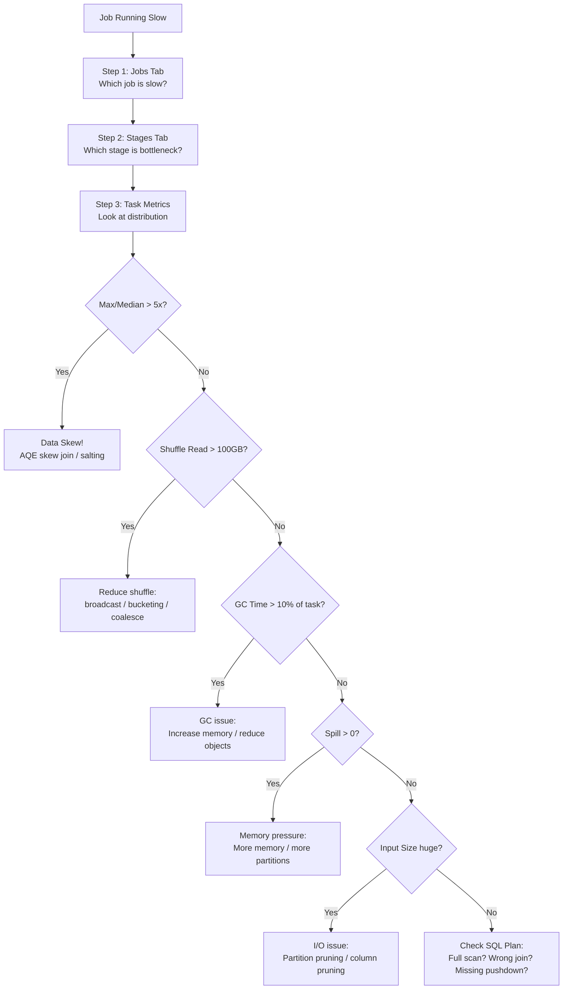

# Spark Performance Tuning at Billion Scale: Memory, Shuffle, AQE & Production Optimization

> **Production Pattern**: Systematic performance tuning methodology for Spark jobs processing 10-100TB with billions of records, reducing execution time by 5-10x and costs by 50%.

---

## 1. Problem Statement

| Problem | Before | After Tuning | Improvement |
|---------|--------|--------------|-------------|
| 50TB daily ETL | 12 hours | 2.5 hours | 5x faster |
| OOM on shuffle stages | Job fails | Completes reliably | 100% success |
| Data skew in joins | 1 task takes 3 hours | All tasks < 10 min | 18x faster |
| Compute costs | $2M/month | $900K/month | 55% reduction |
| Dynamic allocation | 15 min to scale up | 3 min to scale | 5x faster |
| Small file listing | 30 min planning | 30 seconds | 60x faster |

---

## 2. Architecture Diagrams

### Spark Execution Model



### Memory Layout (Per Executor)



### Shuffle Architecture



---

## 3. Memory Management Deep Dive

### Unified Memory Model

```python
# Executor memory calculation:
# Total container = spark.executor.memory + spark.executor.memoryOverhead
# Example: 16g + 4g = 20GB container

# Within JVM Heap (16GB):
# Reserved = 300MB (Spark internal)
# Usable = 16GB - 300MB = 15.7GB
# Spark Memory = Usable * spark.memory.fraction(0.6) = 9.42GB
#   - Storage = Spark Memory * spark.memory.storageFraction(0.5) = 4.71GB
#   - Execution = Spark Memory * (1 - 0.5) = 4.71GB
# User Memory = Usable * 0.4 = 6.28GB

# Key insight: Storage and Execution share a pool with DYNAMIC boundary
# - Execution can evict cached data from Storage if needed (for shuffles/joins)
# - Storage can use Execution memory only if Execution isn't using it
# - Execution memory can NEVER be evicted (would corrupt running operations)

spark = SparkSession.builder \
    .config("spark.executor.memory", "16g") \
    .config("spark.executor.memoryOverhead", "4g") \
    .config("spark.memory.fraction", "0.6") \
    .config("spark.memory.storageFraction", "0.5") \
    .config("spark.memory.offHeap.enabled", "true") \
    .config("spark.memory.offHeap.size", "4g") \
    .getOrCreate()
```

### OOM Diagnosis

```python
"""
TYPE 1: DRIVER OOM
Symptoms: "java.lang.OutOfMemoryError: Java heap space" in driver logs
Causes:
  - collect() on large dataset
  - Broadcasting table too large for driver memory
  - Too many partitions tracked in driver (>100K partitions)
  - Large query plan compilation

Fix:
  spark.driver.memory = 8g  (increase driver memory)
  NEVER use .collect() on production data
  Use .take(N) or .show() for debugging
  Increase broadcast threshold judiciously
"""

"""
TYPE 2: EXECUTOR OOM  
Symptoms: "java.lang.OutOfMemoryError" in executor, task fails and retries
Causes:
  - Single partition too large (data skew)
  - Too many cached RDDs competing for memory
  - Large UDF objects per task
  - Explode/flatMap creating too many rows from one partition

Fix:
  spark.executor.memory = 16g → 32g
  Repartition to reduce partition size (target 128-256MB per partition)
  Fix data skew (see Section 5)
  Reduce cache usage (.unpersist() when done)
"""

"""
TYPE 3: CONTAINER KILLED (YARN/K8s OOM)
Symptoms: "Container killed by YARN for exceeding memory limits"
          OR "OOMKilled" in K8s pod status
Causes:
  - Off-heap memory growth (JNI, Netty buffers, compression)
  - Python UDF memory (PySpark worker processes)
  - Memory leak in custom code

Fix:
  spark.executor.memoryOverhead = max(spark.executor.memory * 0.1, 4g)
  For PySpark: spark.executor.pyspark.memory = 2g
  For heavy UDFs: increase overhead to 6-8g
"""
```

### GC Tuning

```python
# G1GC (recommended for most Spark workloads)
spark.conf.set("spark.executor.extraJavaOptions",
    "-XX:+UseG1GC "
    "-XX:G1HeapRegionSize=16m "      # Region size (auto-tuned if not set)
    "-XX:InitiatingHeapOccupancyPercent=35 "  # Start GC earlier
    "-XX:ConcGCThreads=4 "           # Parallel GC threads
    "-XX:+PrintGCDetails "           # Log GC for debugging
    "-XX:+PrintGCTimeStamps "
    "-Xloggc:/var/log/spark/gc.log"
)

# ZGC (for very large heaps > 64GB, Java 17+)
# Lower pause times but slightly more CPU
spark.conf.set("spark.executor.extraJavaOptions",
    "-XX:+UseZGC "
    "-XX:ZCollectionInterval=30"  # Force GC every 30 seconds
)

# Key principle: If GC time > 10% of task time, you have a GC problem
# Check: Spark UI → Stages → GC Time column
# If high:
# 1. Reduce object creation (use DataFrames not RDDs)
# 2. Use serialized caching (MEMORY_ONLY_SER)
# 3. Increase executor memory
# 4. Use off-heap memory for caching
```

---

## 4. Shuffle Optimization

### When Shuffle Occurs

```python
# These operations trigger a shuffle:
df.groupBy("key").agg(...)           # Wide transformation
df.join(other_df, "key")             # Unless broadcast
df.repartition(200, "key")           # Explicit repartition
df.distinct()                        # Requires shuffle
df.orderBy("col")                    # Global sort
df.coalesce(10)                      # Only if INCREASING partitions

# These do NOT shuffle:
df.filter(...)                       # Narrow transformation
df.select(...)                       # Narrow transformation
df.map(...)                          # Narrow transformation
df.coalesce(10)                      # If DECREASING partitions (no shuffle)
df.join(broadcast(small_df), "key")  # Broadcast avoids shuffle on small side
```

### Partition Tuning Formula

```python
# Formula: num_shuffle_partitions = total_shuffle_data / target_partition_size
#
# target_partition_size = 128MB to 256MB (sweet spot)
#
# Example: 
#   shuffle_data = 500GB
#   target = 200MB per partition
#   num_partitions = 500,000MB / 200MB = 2,500 partitions
#
# spark.sql.shuffle.partitions = 2500

# DEFAULT OF 200 IS ALMOST ALWAYS WRONG!
# For 500GB shuffle: 200 partitions = 2.5GB per partition = OOM!
# For 10MB shuffle: 200 partitions = 50KB per partition = too small!

# Solution 1: Set manually based on data size
spark.conf.set("spark.sql.shuffle.partitions", "2500")

# Solution 2: Use AQE (auto-coalescing) - RECOMMENDED
spark.conf.set("spark.sql.adaptive.enabled", "true")
spark.conf.set("spark.sql.adaptive.coalescePartitions.enabled", "true")
spark.conf.set("spark.sql.adaptive.coalescePartitions.initialPartitionNum", "4096")
spark.conf.set("spark.sql.adaptive.advisoryPartitionSizeInBytes", "128MB")
spark.conf.set("spark.sql.adaptive.coalescePartitions.minPartitionSize", "64MB")
# Start with many partitions, AQE merges small ones together
```

### Eliminating Unnecessary Shuffles

```python
# Strategy 1: Broadcast Join (eliminates shuffle on large table)
from pyspark.sql.functions import broadcast

# If dimension < 500MB, broadcast it
result = fact_table.join(broadcast(dim_table), "dim_key")

# Or use SQL hint
spark.sql("""
    SELECT /*+ BROADCAST(d) */ f.*, d.name
    FROM fact_table f JOIN dim_table d ON f.dim_key = d.dim_key
""")

# Increase threshold for modern clusters with lots of memory
spark.conf.set("spark.sql.autoBroadcastJoinThreshold", "500MB")

# Strategy 2: Bucketing (pre-sorts data for shuffle-free joins)
# Write tables bucketed by join key
df.write.bucketBy(256, "customer_id").sortBy("customer_id") \
    .saveAsTable("catalog.bucketed_transactions")

# Subsequent joins on customer_id: NO SHUFFLE!
t1 = spark.table("bucketed_transactions")
t2 = spark.table("bucketed_customers")  # Also bucketed by customer_id, 256 buckets
result = t1.join(t2, "customer_id")  # No Exchange in plan!

# Strategy 3: Coalesce instead of Repartition (when reducing partitions)
# repartition(100) = full shuffle to 100 partitions
# coalesce(100) = merge adjacent partitions without shuffle (if going DOWN)
df.coalesce(100).write.parquet("output/")  # No shuffle!
```

---

## 5. Data Skew Handling

### Identifying Skew from Spark UI

```
Spark UI → Stages → Click on slow stage → Summary Metrics

Look for:
┌─────────────────┬───────────┬───────────┬───────────┬───────────┬───────────┐
│ Metric          │ Min       │ 25th %ile │ Median    │ 75th %ile │ Max       │
├─────────────────┼───────────┼───────────┼───────────┼───────────┼───────────┤
│ Duration        │ 2 s       │ 5 s       │ 8 s       │ 12 s      │ 45 min ⚠️│
│ Shuffle Read    │ 10 MB     │ 50 MB     │ 80 MB     │ 120 MB    │ 15 GB ⚠️ │
│ Records Read    │ 100K      │ 500K      │ 800K      │ 1.2M      │ 500M ⚠️  │
└─────────────────┴───────────┴───────────┴───────────┴───────────┴───────────┘

SKEW INDICATOR: Max / Median ratio
- Duration: 45 min / 8 s = 337x → SEVERE SKEW
- Shuffle Read: 15GB / 80MB = 192x → SEVERE SKEW

Rule of thumb: If max/median > 5x, you have skew.
```

### AQE Skew Join

```python
# AQE automatically handles skew by splitting large partitions
spark.conf.set("spark.sql.adaptive.enabled", "true")
spark.conf.set("spark.sql.adaptive.skewJoin.enabled", "true")

# A partition is "skewed" if:
# size > skewedPartitionFactor * median_size AND size > threshold
spark.conf.set("spark.sql.adaptive.skewJoin.skewedPartitionFactor", "5")
spark.conf.set("spark.sql.adaptive.skewJoin.skewedPartitionThresholdInBytes", "256MB")

# How it works:
# 1. After shuffle, collect partition sizes
# 2. Identify skewed partition (e.g., partition for hot_key has 15GB)
# 3. Split skewed partition into N sub-partitions
# 4. Replicate the other side's matching data to each sub-partition
# 5. Join in parallel across sub-partitions
# 6. Union results

# Limitation: Only works for SortMergeJoin
# Does NOT work for: aggregate skew, window function skew
```

### Salting Technique (Manual Skew Handling)

```python
from pyspark.sql import functions as F
import random

def salted_join(df_large, df_small, join_key, salt_factor=10):
    """
    Handle skewed joins by salting the hot key.
    
    Approach:
    1. Add random salt (0-N) to large table's join key
    2. Explode small table to have copies for each salt value
    3. Join on (original_key + salt)
    4. This spreads hot key across N partitions
    """
    
    # Salt the large table (add random number to key)
    df_large_salted = df_large.withColumn(
        "salt", (F.rand() * salt_factor).cast("int")
    ).withColumn(
        "salted_key", F.concat(F.col(join_key), F.lit("_"), F.col("salt"))
    )
    
    # Explode small table (create N copies of each row, one per salt value)
    salt_values = spark.range(salt_factor).withColumnRenamed("id", "salt")
    df_small_exploded = df_small.crossJoin(salt_values).withColumn(
        "salted_key", F.concat(F.col(join_key), F.lit("_"), F.col("salt"))
    )
    
    # Join on salted key (spreads hot key across salt_factor partitions)
    result = df_large_salted.join(
        df_small_exploded,
        "salted_key",
        "inner"
    ).drop("salt", "salted_key")
    
    return result

# Example: customer_id = "AMAZON" has 50M transactions (hot key)
# Without salting: 1 task processes all 50M rows (OOM or 3-hour task)
# With salt_factor=10: 10 tasks each process 5M rows (completes in 3 min)
```

### Two-Phase Aggregation

```python
def two_phase_aggregation(df, group_key, agg_expressions):
    """
    Handle aggregate skew with two-phase approach.
    
    Phase 1: Partial aggregation with added salt (reduces data per partition)
    Phase 2: Final aggregation on partial results (small data, no skew)
    """
    salt_factor = 100
    
    # Phase 1: Partial aggregation with salt
    partial = (
        df
        .withColumn("salt", (F.rand() * salt_factor).cast("int"))
        .groupBy(group_key, "salt")
        .agg(*agg_expressions)  # e.g., F.sum("amount").alias("partial_sum")
    )
    
    # Phase 2: Final aggregation (much smaller dataset)
    final = (
        partial
        .groupBy(group_key)
        .agg(
            F.sum("partial_sum").alias("total_sum")
            # Adjust aggregation function based on type
            # SUM → SUM of partials
            # COUNT → SUM of partial counts
            # AVG → SUM of partial sums / SUM of partial counts
        )
    )
    
    return final
```

---

## 6. AQE Complete Guide

### How AQE Works

```
1. Spark compiles initial query plan based on ESTIMATED statistics
2. When query hits a shuffle boundary (Exchange), execution pauses
3. AQE collects ACTUAL runtime statistics (partition sizes, row counts)
4. Catalyst re-optimizes remaining plan stages with real data
5. Execution continues with optimized plan

This means: AQE only helps AFTER the first shuffle stage
```

### Configuration Reference

```python
# Master switch
spark.conf.set("spark.sql.adaptive.enabled", "true")

# === Coalescing Partitions ===
# Merges small post-shuffle partitions into larger ones
spark.conf.set("spark.sql.adaptive.coalescePartitions.enabled", "true")
spark.conf.set("spark.sql.adaptive.coalescePartitions.parallelismFirst", "false")
spark.conf.set("spark.sql.adaptive.coalescePartitions.initialPartitionNum", "4096")
spark.conf.set("spark.sql.adaptive.advisoryPartitionSizeInBytes", "128MB")
spark.conf.set("spark.sql.adaptive.coalescePartitions.minPartitionSize", "64MB")

# === Dynamic Join Selection ===
# Convert SortMergeJoin to BroadcastHashJoin at runtime
spark.conf.set("spark.sql.adaptive.autoBroadcastJoinThreshold", "100MB")
# Triggers when: runtime_size < threshold (even if compile-time estimate was larger)

# === Skew Join Handling ===
spark.conf.set("spark.sql.adaptive.skewJoin.enabled", "true")
spark.conf.set("spark.sql.adaptive.skewJoin.skewedPartitionFactor", "5")
spark.conf.set("spark.sql.adaptive.skewJoin.skewedPartitionThresholdInBytes", "256MB")
```

---

## 7. Join Optimization

### Strategy Selection Table

```
┌──────────────────────┬───────────────────┬──────────────┬────────────────────┐
│ Strategy             │ When Used         │ Shuffle?     │ Performance        │
├──────────────────────┼───────────────────┼──────────────┼────────────────────┤
│ Broadcast Hash Join  │ One side < thresh │ No (broadcast)│ O(n) - fastest    │
│ Sort Merge Join      │ Both sides large  │ Yes (both)   │ O(n log n)         │
│ Shuffle Hash Join    │ One side smaller  │ Yes (both)   │ O(n) but needs mem │
│ Bucket Join          │ Pre-bucketed      │ No shuffle   │ O(n) - no shuffle! │
│ Cartesian/NL Join    │ No join condition │ Maybe        │ O(n × m) - avoid!  │
└──────────────────────┴───────────────────┴──────────────┴────────────────────┘
```

```python
# Raise broadcast threshold for modern clusters
spark.conf.set("spark.sql.autoBroadcastJoinThreshold", "500MB")
# Default 10MB is too conservative for clusters with 16GB+ executor memory

# Force broadcast with hint (override auto-detection)
spark.sql("SELECT /*+ BROADCAST(dim) */ * FROM fact JOIN dim ON fact.key = dim.key")

# Force sort-merge (when broadcast would be too large)
spark.sql("SELECT /*+ MERGE(large_table) */ * FROM t1 JOIN t2 ON t1.key = t2.key")

# Force shuffle hash join
spark.sql("SELECT /*+ SHUFFLE_HASH(t2) */ * FROM t1 JOIN t2 ON t1.key = t2.key")
```

---

## 8. I/O Optimization

### Read Optimization

```python
# 1. Predicate Pushdown (push filters to storage layer)
# Good: Spark pushes filter to Parquet reader, skips row groups
df = spark.read.parquet("s3://...").filter("date = '2024-01-01'")

# Verify pushdown in plan:
df.explain()
# Look for: PushedFilters: [IsNotNull(date), EqualTo(date,2024-01-01)]

# 2. Column Pruning (only read needed columns)
# Bad: Read all 200 columns then select 5
df = spark.read.parquet("s3://...").select("col1", "col2", "col3")
# Good: Same code - Spark automatically pushes column selection to reader

# 3. Partition Pruning (skip entire directories)
# Table partitioned by date, query filters on date → only reads matching partitions
df = spark.read.table("catalog.db.events").filter("event_date = '2024-01-01'")

# 4. Vectorized reader (batch column processing)
spark.conf.set("spark.sql.parquet.enableVectorizedReader", "true")  # Default: true
spark.conf.set("spark.sql.parquet.columnarReaderBatchSize", "4096")
```

### Write Optimization

```python
# Target file sizes: 256MB - 1GB for analytical workloads
# Smaller files (< 10MB) = too much overhead per file
# Larger files (> 2GB) = less parallelism for readers

# Control output file count:
target_size_mb = 512
data_size_mb = estimate_dataframe_size(df)  # Approximate
num_files = max(1, int(data_size_mb / target_size_mb))

df.repartition(num_files).write.format("iceberg").mode("append").save("table")

# Sort within partitions for better compression
df.repartition(num_files, "partition_col") \
  .sortWithinPartitions("sort_col") \
  .write.format("iceberg").save("table")
# Sorting improves compression because similar values are adjacent
```

---

## 9. Caching Strategy

```python
# WHEN TO CACHE:
# ✓ DataFrame used more than once in the same job
# ✓ Iterative algorithms (ML training, graph processing)
# ✓ Small reference tables used in multiple joins

# WHEN NOT TO CACHE:
# ✗ One-pass processing (read → transform → write)
# ✗ Memory pressure (caching evicts execution memory)
# ✗ Streaming (data changes every micro-batch)
# ✗ Very large DataFrames (won't fit, spills to disk)

from pyspark import StorageLevel

# Persistence levels:
df.persist(StorageLevel.MEMORY_ONLY)           # Fastest, most memory
df.persist(StorageLevel.MEMORY_ONLY_SER)       # Compact, needs deserialization
df.persist(StorageLevel.MEMORY_AND_DISK)       # Spills to disk if needed
df.persist(StorageLevel.MEMORY_AND_DISK_SER)   # Compact + disk spill
df.persist(StorageLevel.OFF_HEAP)              # Outside JVM (no GC impact)
df.persist(StorageLevel.DISK_ONLY)             # Only disk (slowest)

# ALWAYS unpersist when done!
df.unpersist()

# Check cache effectiveness: Spark UI → Storage tab
# Shows: RDD name, storage level, size in memory, size on disk, fraction cached
```

---

## 10. Production Configuration Templates

### Small Job (< 1TB)

```properties
# spark-defaults.conf for small jobs
spark.master=yarn
spark.submit.deployMode=cluster

spark.driver.memory=4g
spark.driver.cores=2
spark.executor.memory=8g
spark.executor.memoryOverhead=2g
spark.executor.cores=4
spark.executor.instances=10

spark.sql.shuffle.partitions=200
spark.sql.adaptive.enabled=true
spark.sql.adaptive.coalescePartitions.enabled=true
spark.sql.autoBroadcastJoinThreshold=100MB

spark.dynamicAllocation.enabled=true
spark.dynamicAllocation.minExecutors=2
spark.dynamicAllocation.maxExecutors=20
spark.dynamicAllocation.executorIdleTimeout=60s
```

### Medium Job (1-10TB)

```properties
spark.driver.memory=8g
spark.driver.cores=4
spark.executor.memory=16g
spark.executor.memoryOverhead=4g
spark.executor.cores=4
spark.executor.instances=50

spark.sql.shuffle.partitions=1000
spark.sql.adaptive.enabled=true
spark.sql.adaptive.coalescePartitions.enabled=true
spark.sql.adaptive.advisoryPartitionSizeInBytes=192MB
spark.sql.adaptive.skewJoin.enabled=true
spark.sql.autoBroadcastJoinThreshold=256MB

spark.dynamicAllocation.enabled=true
spark.dynamicAllocation.minExecutors=10
spark.dynamicAllocation.maxExecutors=100
spark.dynamicAllocation.executorIdleTimeout=120s

spark.shuffle.compress=true
spark.shuffle.spill.compress=true
spark.io.compression.codec=zstd
```

### Large Job (10-100TB)

```properties
spark.driver.memory=16g
spark.driver.memoryOverhead=4g
spark.driver.cores=8
spark.executor.memory=32g
spark.executor.memoryOverhead=8g
spark.executor.cores=8
spark.executor.instances=200

spark.sql.shuffle.partitions=4000
spark.sql.adaptive.enabled=true
spark.sql.adaptive.coalescePartitions.enabled=true
spark.sql.adaptive.coalescePartitions.initialPartitionNum=8000
spark.sql.adaptive.advisoryPartitionSizeInBytes=256MB
spark.sql.adaptive.skewJoin.enabled=true
spark.sql.adaptive.skewJoin.skewedPartitionFactor=5
spark.sql.adaptive.skewJoin.skewedPartitionThresholdInBytes=512MB
spark.sql.autoBroadcastJoinThreshold=500MB

spark.dynamicAllocation.enabled=true
spark.dynamicAllocation.minExecutors=50
spark.dynamicAllocation.maxExecutors=500
spark.dynamicAllocation.executorIdleTimeout=300s
spark.dynamicAllocation.schedulerBacklogTimeout=5s

spark.shuffle.compress=true
spark.shuffle.spill.compress=true
spark.io.compression.codec=zstd
spark.shuffle.file.buffer=1MB
spark.unsafe.sorter.spill.reader.buffer.size=1MB
spark.shuffle.io.maxRetries=10
spark.shuffle.io.retryWait=60s
spark.network.timeout=800s

spark.memory.offHeap.enabled=true
spark.memory.offHeap.size=8g
spark.sql.columnVector.offheap.enabled=true
```

### Streaming Job

```properties
spark.driver.memory=8g
spark.executor.memory=16g
spark.executor.memoryOverhead=4g
spark.executor.cores=4
spark.executor.instances=20

# Streaming-specific
spark.sql.streaming.stateStore.providerClass=org.apache.spark.sql.execution.streaming.state.RocksDBStateStoreProvider
spark.sql.streaming.stateStore.rocksdb.compactOnCommit=false
spark.sql.streaming.stateStore.rocksdb.blockCacheSizeMB=256
spark.sql.shuffle.partitions=200
spark.sql.adaptive.enabled=true

# Kafka source tuning
spark.streaming.kafka.maxRatePerPartition=10000
spark.sql.streaming.kafka.useDeprecatedOffsetFetching=false

# Checkpointing
spark.sql.streaming.checkpointLocation=s3://checkpoints/
spark.sql.streaming.forceDeleteTempCheckpointLocation=true

# Graceful shutdown
spark.streaming.stopGracefullyOnShutdown=true
```

---

## 11. Performance Debugging Workflow



---

## 12. Cost Optimization

```python
# Cost reduction strategies and their impact:

cost_strategies = {
    "right_sizing": {
        "action": "Reduce executor memory/cores to actual usage (70-80% target)",
        "typical_savings": "20-30%",
        "risk": "LOW - monitor for OOM after change"
    },
    "spot_instances": {
        "action": "Run executors on spot, driver on on-demand",
        "typical_savings": "60-70% on executor cost",
        "risk": "MEDIUM - need checkpointing and retry logic"
    },
    "graviton_arm64": {
        "action": "Use ARM instances (r6g, m6g, c6g on AWS)",
        "typical_savings": "30% cost, 20% performance improvement",
        "risk": "LOW - fully compatible with Spark"
    },
    "dynamic_allocation": {
        "action": "Scale executors up/down based on load",
        "typical_savings": "30-50%",
        "risk": "LOW - well tested, enable always"
    },
    "compression_zstd": {
        "action": "Switch from Snappy to ZSTD (level 3)",
        "typical_savings": "30% storage, slight CPU increase",
        "risk": "LOW - transparent to applications"
    },
    "s3_express": {
        "action": "Use S3 Express One Zone for hot data",
        "typical_savings": "10x lower latency, 50% cost for frequent access",
        "risk": "MEDIUM - single AZ, higher per-GB cost"
    }
}
```

---

## 13. Benchmarks

```
┌─────────────────────────────┬──────────────┬──────────────┬─────────────┐
│ Scenario                    │ Default Conf │ Tuned Conf   │ Improvement │
├─────────────────────────────┼──────────────┼──────────────┼─────────────┤
│ 50TB Join (no skew)         │ 8 hours      │ 2 hours      │ 4x          │
│ 50TB Join (skewed key)      │ 12 hours     │ 1.5 hours    │ 8x          │
│ 10TB Aggregation            │ 3 hours      │ 45 min       │ 4x          │
│ 1TB with 500K small files   │ 1 hour       │ 10 min       │ 6x          │
│ Streaming 100K events/sec   │ 30s latency  │ 5s latency   │ 6x          │
├─────────────────────────────┼──────────────┼──────────────┼─────────────┤
│ Monthly cost (100 node)     │ $2.1M        │ $950K        │ 55% savings │
└─────────────────────────────┴──────────────┴──────────────┴─────────────┘

Key tuning actions applied:
- AQE enabled (skew handling + partition coalescing)
- Broadcast threshold raised to 500MB
- Graviton instances + spot for executors
- ZSTD compression
- Proper shuffle partition count (formula-based)
- Dynamic allocation with aggressive scale-down
```

---

## Summary

| Problem | Detection Method | Solution | Config |
|---------|-----------------|----------|--------|
| **OOM** | Task failures in UI | More memory or smaller partitions | `spark.executor.memory` |
| **Skew** | Max/Median task ratio > 5x | AQE skew join or salting | `spark.sql.adaptive.skewJoin.enabled` |
| **Shuffle** | Large Exchange in plan | Broadcast or bucketing | `spark.sql.autoBroadcastJoinThreshold` |
| **GC** | GC Time > 10% | More memory, Off-heap, SerDe cache | `spark.memory.offHeap.enabled` |
| **Spill** | Spill metrics > 0 | More memory or more partitions | `spark.sql.shuffle.partitions` |
| **Planning** | 30+ min before first task | Reduce files, use Iceberg | Compaction |
| **I/O** | Full scan in plan | Predicate/partition/column pruning | Proper partitioning |
