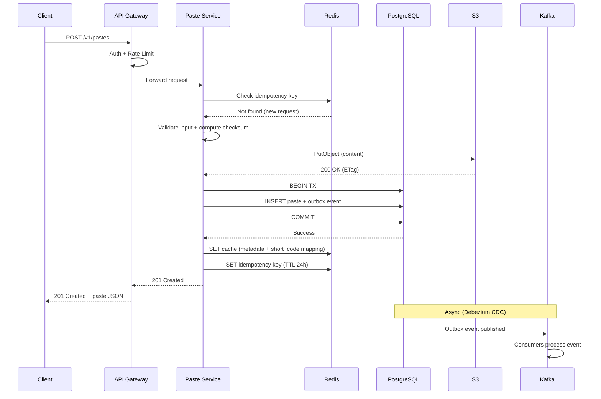
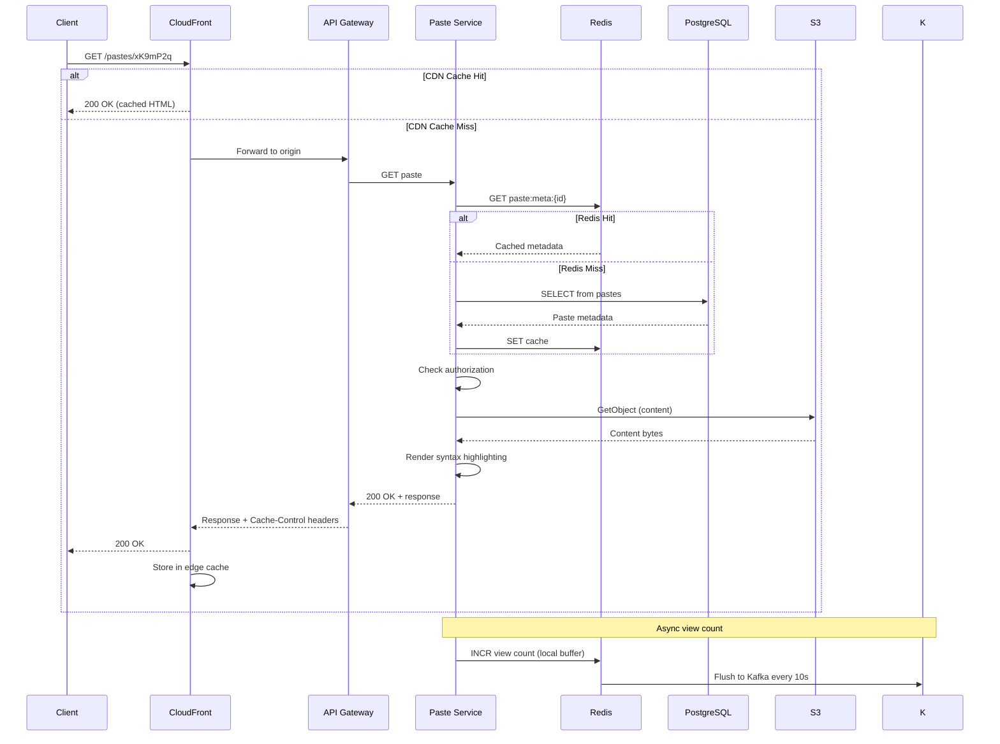

# Pastebin / GitHub Gist - System Design (Staff/Principal Level)

---

## 1. Functional Requirements

| # | Requirement | Description |
|---|---|---|
| FR-1 | Create Paste | Users can create text/code snippets with optional title, language tag, expiration, and privacy setting |
| FR-2 | Read Paste | Anyone (or authorized users) can read a paste via its unique short URL |
| FR-3 | Edit/Update Paste | Authenticated owners can modify paste content (creates new version) |
| FR-4 | Delete Paste | Owner or admin can soft-delete a paste |
| FR-5 | Expiration | Pastes auto-expire after a configurable TTL (1 hour, 1 day, 1 week, 1 month, never) |
| FR-6 | Privacy Controls | Public (discoverable), Unlisted (link-only), Private (owner + explicit shares) |
| FR-7 | Syntax Highlighting | Server-side rendering of syntax-highlighted HTML for 200+ languages |
| FR-8 | Versioning | Track edit history with diff support |
| FR-9 | User Accounts | Optional registration; anonymous pastes allowed with stricter rate limits |
| FR-10 | Share Links | Generate time-limited share tokens for private pastes |
| FR-11 | Search | Full-text search across user's own pastes; public paste discovery |
| FR-12 | Spam/Abuse Detection | Block malware links, credential leaks, illegal content |
| FR-13 | Raw Content API | Serve raw text without HTML wrapper (for curl/wget/scripts) |
| FR-14 | Fork/Clone | Users can fork public/unlisted pastes into their own account |

---

## 2. Non-Functional Requirements

| Requirement | Target | Justification |
|---|---|---|
| **Availability** | 99.99% (52 min downtime/year) | Content sharing is real-time; outages break integrations |
| **Read Latency** | p50 < 20ms, p99 < 100ms | Paste reads are often embedded/linked; must feel instant |
| **Write Latency** | p50 < 50ms, p99 < 200ms | Create operations must be snappy for developer workflow |
| **Durability** | Zero acknowledged write loss | Users trust us with code, configs, secrets |
| **Consistency** | Strong for writes, eventual for search/analytics | Paste must be readable immediately after creation |
| **Scalability** | Horizontal; handle 10x growth without re-architecture | |
| **Data Retention** | Configurable per paste; platform default 10 years for non-expired | |
| **Security** | Encryption at rest (AES-256) and in transit (TLS 1.3) | |
| **Compliance** | GDPR right-to-erasure, DMCA takedown support | |
| **Global** | Multi-region read replicas; single-region writes with failover | |

---

## 3. Capacity Estimation

### User and Traffic Assumptions

```
DAU: 10M users
MAU: 80M users
Read:Write ratio: 25:1
Average paste size: 10 KB (median), 50 KB (p95), 500 KB (max)
```

### QPS Calculations

```
Writes:
  - 10M DAU x 0.2 pastes/user/day = 2M pastes/day
  - Average write QPS = 2,000,000 / 86,400 = ~23 QPS
  - Peak write QPS = 23 x 5 (peak multiplier) = ~115 QPS
  - Design for: 2K QPS (10x headroom for viral events + API integrations)

Reads:
  - Read:Write = 25:1 => 50M reads/day
  - Average read QPS = 50,000,000 / 86,400 = ~580 QPS
  - Peak read QPS = 580 x 5 = ~2,900 QPS
  - Design for: 50K QPS (with CDN/cache absorbing 90%+ of reads)
  - Origin read QPS after cache: ~5K QPS
```

### Storage Calculations

```
Daily paste storage:
  - 2M pastes/day x 10 KB avg = 20 GB/day raw content
  - With 3x replication: 60 GB/day
  - With rendered HTML cache (~3x raw): 60 GB/day additional

Annual storage:
  - Raw content: 20 GB/day x 365 = 7.3 TB/year
  - Metadata: 2M x 500 bytes x 365 = 365 GB/year
  - Total with replication + rendered: ~25 TB/year

5-year projection: ~125 TB total storage (object storage)
```

### Network Bandwidth

```
Read bandwidth:
  - 50K QPS peak x 10 KB avg response = 500 MB/s = 4 Gbps
  - After CDN (90% hit rate): 50 MB/s = 400 Mbps at origin

Write bandwidth:
  - 2K QPS peak x 50 KB avg upload = 100 MB/s = 800 Mbps ingress
```

### Cache Sizing

```
Hot paste set: Top 1% of pastes = 20K pastes accessed frequently
Cache memory: 20,000 x 50 KB (rendered) = 1 GB (trivial)

Working set (last 24h pastes + popular): 2M x 10KB = 20 GB
Redis cluster: 3 nodes x 32 GB = 96 GB total (comfortable)
```

### Infrastructure Summary

| Component | Count/Size |
|---|---|
| Application servers | 10-20 instances (auto-scaled) |
| Redis cluster | 3 primary + 3 replica nodes, 32 GB each |
| PostgreSQL | 1 primary + 2 read replicas (metadata) |
| Object storage (S3) | ~25 TB/year growth |
| Kafka cluster | 3 brokers, 5 partitions per topic |
| CDN | CloudFront/Fastly with global PoPs |

---

## 4. Data Modeling

### Database Choice Justification

| Data Type | Store | Justification |
|---|---|---|
| Paste metadata | **PostgreSQL** (Aurora) | ACID transactions, rich querying, mature ecosystem, JSON support for flexible attributes |
| Paste content (body) | **Amazon S3** | Immutable blobs, unlimited scale, 11 nines durability, cost-effective for large text |
| Cache layer | **Redis Cluster** | Sub-ms latency, TTL support, pub/sub for invalidation |
| Search index | **OpenSearch** | Full-text search, language-aware analyzers, aggregations |
| Event stream | **Kafka** | Ordered event log, replay capability, consumer groups |
| Analytics | **ClickHouse** | Columnar, fast aggregations over billions of events |

### PostgreSQL Schema

```sql
-- Tenants / Users
CREATE TABLE users (
    id              UUID PRIMARY KEY DEFAULT gen_random_uuid(),
    username        VARCHAR(64) UNIQUE,
    email           VARCHAR(255) UNIQUE,
    password_hash   VARCHAR(255),
    plan            VARCHAR(20) DEFAULT 'free' CHECK (plan IN ('free', 'pro', 'enterprise')),
    state           VARCHAR(20) DEFAULT 'active' CHECK (state IN ('active', 'suspended', 'deleted')),
    storage_used_bytes BIGINT DEFAULT 0,
    paste_count     INTEGER DEFAULT 0,
    created_at      TIMESTAMPTZ NOT NULL DEFAULT NOW(),
    updated_at      TIMESTAMPTZ NOT NULL DEFAULT NOW()
);

CREATE INDEX idx_users_email ON users(email);
CREATE INDEX idx_users_username ON users(username);
CREATE INDEX idx_users_state_created ON users(state, created_at);

-- Core Pastes table (metadata only; content in S3)
CREATE TABLE pastes (
    id              UUID PRIMARY KEY DEFAULT gen_random_uuid(),
    short_code      VARCHAR(8) UNIQUE NOT NULL,          -- Base62 encoded unique ID
    owner_id        UUID REFERENCES users(id),            -- NULL for anonymous
    title           VARCHAR(255),
    language        VARCHAR(50) DEFAULT 'plaintext',
    visibility      VARCHAR(10) NOT NULL DEFAULT 'public'
                    CHECK (visibility IN ('public', 'unlisted', 'private')),
    content_ref     VARCHAR(512) NOT NULL,                -- S3 key: s3://bucket/pastes/{id}/v{version}
    content_size    INTEGER NOT NULL,                     -- bytes
    checksum        VARCHAR(64) NOT NULL,                 -- SHA-256 of content
    version         INTEGER NOT NULL DEFAULT 1,
    state           VARCHAR(20) NOT NULL DEFAULT 'active'
                    CHECK (state IN ('active', 'expired', 'quarantined', 'deleted')),
    expires_at      TIMESTAMPTZ,                          -- NULL = never expires
    view_count      BIGINT DEFAULT 0,
    fork_of         UUID REFERENCES pastes(id),
    created_at      TIMESTAMPTZ NOT NULL DEFAULT NOW(),
    updated_at      TIMESTAMPTZ NOT NULL DEFAULT NOW(),
    deleted_at      TIMESTAMPTZ
);

-- Partition by created_at (monthly range partitions)
-- In production, use declarative partitioning:
-- CREATE TABLE pastes (...) PARTITION BY RANGE (created_at);

CREATE INDEX idx_pastes_short_code ON pastes(short_code) WHERE state = 'active';
CREATE INDEX idx_pastes_owner_created ON pastes(owner_id, created_at DESC);
CREATE INDEX idx_pastes_visibility_created ON pastes(visibility, created_at DESC)
    WHERE state = 'active';
CREATE INDEX idx_pastes_expires_at ON pastes(expires_at)
    WHERE expires_at IS NOT NULL AND state = 'active';
CREATE INDEX idx_pastes_language ON pastes(language) WHERE state = 'active';
CREATE INDEX idx_pastes_state_updated ON pastes(state, updated_at);

-- Paste versions (edit history)
CREATE TABLE paste_versions (
    id              UUID PRIMARY KEY DEFAULT gen_random_uuid(),
    paste_id        UUID NOT NULL REFERENCES pastes(id),
    version         INTEGER NOT NULL,
    content_ref     VARCHAR(512) NOT NULL,
    content_size    INTEGER NOT NULL,
    checksum        VARCHAR(64) NOT NULL,
    author_id       UUID REFERENCES users(id),
    diff_ref        VARCHAR(512),                         -- S3 key for unified diff
    created_at      TIMESTAMPTZ NOT NULL DEFAULT NOW(),
    UNIQUE(paste_id, version)
);

CREATE INDEX idx_paste_versions_paste_id ON paste_versions(paste_id, version DESC);

-- Share tokens for private pastes
CREATE TABLE share_tokens (
    id              UUID PRIMARY KEY DEFAULT gen_random_uuid(),
    token_hash      VARCHAR(64) UNIQUE NOT NULL,          -- SHA-256 of actual token
    paste_id        UUID NOT NULL REFERENCES pastes(id),
    created_by      UUID NOT NULL REFERENCES users(id),
    scope           VARCHAR(20) DEFAULT 'read' CHECK (scope IN ('read', 'read_write')),
    max_uses        INTEGER,                              -- NULL = unlimited
    use_count       INTEGER DEFAULT 0,
    expires_at      TIMESTAMPTZ NOT NULL,
    revoked_at      TIMESTAMPTZ,
    created_at      TIMESTAMPTZ NOT NULL DEFAULT NOW()
);

CREATE INDEX idx_share_tokens_paste_id ON share_tokens(paste_id)
    WHERE revoked_at IS NULL;
CREATE INDEX idx_share_tokens_expires ON share_tokens(expires_at)
    WHERE revoked_at IS NULL;

-- Abuse reports
CREATE TABLE abuse_reports (
    id              UUID PRIMARY KEY DEFAULT gen_random_uuid(),
    paste_id        UUID NOT NULL REFERENCES pastes(id),
    reporter_id     UUID REFERENCES users(id),
    reason          VARCHAR(50) NOT NULL,
    description     TEXT,
    evidence_ref    VARCHAR(512),
    state           VARCHAR(20) DEFAULT 'pending'
                    CHECK (state IN ('pending', 'investigating', 'actioned', 'dismissed')),
    decided_by      UUID REFERENCES users(id),
    decision_note   TEXT,
    created_at      TIMESTAMPTZ NOT NULL DEFAULT NOW(),
    resolved_at     TIMESTAMPTZ
);

CREATE INDEX idx_abuse_reports_state ON abuse_reports(state, created_at);
CREATE INDEX idx_abuse_reports_paste ON abuse_reports(paste_id);

-- Idempotency store
CREATE TABLE idempotency_keys (
    scope           VARCHAR(50) NOT NULL,
    key             VARCHAR(128) NOT NULL,
    request_hash    VARCHAR(64) NOT NULL,
    response_status INTEGER,
    response_body   JSONB,
    created_at      TIMESTAMPTZ NOT NULL DEFAULT NOW(),
    expires_at      TIMESTAMPTZ NOT NULL,
    PRIMARY KEY (scope, key)
);

CREATE INDEX idx_idempotency_expires ON idempotency_keys(expires_at);

-- Transactional outbox for events
CREATE TABLE outbox_events (
    id              BIGSERIAL PRIMARY KEY,
    event_id        UUID NOT NULL UNIQUE,
    event_type      VARCHAR(100) NOT NULL,
    aggregate_type  VARCHAR(50) NOT NULL,
    aggregate_id    UUID NOT NULL,
    payload         JSONB NOT NULL,
    published       BOOLEAN DEFAULT FALSE,
    created_at      TIMESTAMPTZ NOT NULL DEFAULT NOW()
);

CREATE INDEX idx_outbox_unpublished ON outbox_events(created_at)
    WHERE published = FALSE;

-- Rate limiting counters (Redis-backed, but schema for reference)
-- Key pattern: rate:{user_id}:{window}:{action}
-- Value: counter with TTL = window size
```

### S3 Object Layout

```
s3://pastebin-content-{region}/
  pastes/
    {paste_id}/
      v1/content.txt          -- raw content
      v1/rendered.html        -- syntax-highlighted HTML (generated lazily)
      v2/content.txt
      v2/rendered.html
      v2/diff-from-v1.patch   -- unified diff
  exports/
    {user_id}/{export_id}.tar.gz
```

### Partitioning Strategy

| Table | Strategy | Key |
|---|---|---|
| pastes | Range by `created_at` (monthly) | Enables efficient time-range queries and partition pruning |
| paste_versions | Range by `created_at` (monthly) | Aligns with parent partition lifecycle |
| outbox_events | Range by `created_at` (daily) | Fast cleanup of published events |
| abuse_reports | None (small table) | |

### Sharding Strategy (at extreme scale)

```
Shard key: hash(paste_id) % num_shards
Lookup: short_code -> paste_id mapping in Redis (consistent hashing)

Sharding dimensions:
  - Metadata DB: shard by paste_id hash (uniform distribution)
  - S3: naturally sharded by prefix (paste_id provides good distribution)
  - Redis: hash slots (16384 slots across cluster)
```

---

## 5. High-Level Design (HLD)

### Architecture Diagram

```
                                   CLIENTS
                    (Browser, CLI, API Integrations, Mobile)
                                      |
                                      v
                    +----------------------------------+
                    |         Route53 / DNS            |
                    |   (Latency-based routing,        |
                    |    health checks, failover)      |
                    +----------------------------------+
                                      |
                                      v
                    +----------------------------------+
                    |     CDN (CloudFront / Fastly)    |
                    |   - Static assets (JS/CSS)       |
                    |   - Rendered paste HTML cache     |
                    |   - Raw content cache             |
                    |   - Geographic distribution       |
                    +----------------------------------+
                                      |
                              Cache MISS only
                                      |
                                      v
                    +----------------------------------+
                    |         WAF + DDoS Shield        |
                    |   - Rate limiting (IP-level)      |
                    |   - Bot detection                 |
                    |   - SQL injection prevention      |
                    |   - Request size limits           |
                    +----------------------------------+
                                      |
                                      v
                    +----------------------------------+
                    |    Application Load Balancer      |
                    |   - Health checks                 |
                    |   - TLS termination               |
                    |   - Request routing               |
                    |   - Connection draining           |
                    +----------------------------------+
                                      |
                    +-----------------+-----------------+
                    |                                   |
                    v                                   v
        +-----------------+              +-----------------------+
        |  API Gateway    |              |   Web Serving Layer   |
        |  (Kong/Custom)  |              |   (Next.js SSR)       |
        | - Auth/AuthZ    |              | - Server-side render  |
        | - Rate limiting |              | - SEO optimization    |
        | - Request valid |              | - Paste preview cards |
        | - API versioning|              +-----------------------+
        | - Throttling    |
        +-----------------+
                    |
        +-----------+-----------+-----------+
        |           |           |           |
        v           v           v           v
+----------+  +----------+  +----------+  +----------+
|  Paste   |  |  User    |  |  Search  |  |  Admin   |
|  Service |  |  Service |  |  Service |  |  Service |
+----------+  +----------+  +----------+  +----------+
        |           |           |           |
        +-----+-----+-----+----+-----------+
              |           |
              v           v
    +------------------+  +------------------+
    | Redis Cluster    |  | PostgreSQL       |
    | - Paste cache    |  | (Aurora)         |
    | - Rate limits    |  | - Metadata       |
    | - Sessions       |  | - Users          |
    | - Short code map |  | - Outbox         |
    +------------------+  +------------------+
              |                    |
              |                    v
              |           +------------------+
              |           | Outbox Relay     |
              |           | (Debezium/CDC)   |
              |           +------------------+
              |                    |
              v                    v
    +------------------+  +------------------+
    | Amazon S3        |  | Kafka Cluster    |
    | - Paste content  |  | - Domain events  |
    | - Rendered HTML  |  | - CDC events     |
    | - Diffs/exports  |  | - DLQ topics     |
    +------------------+  +------------------+
                                   |
              +--------------------+--------------------+
              |                    |                    |
              v                    v                    v
    +------------------+  +------------------+  +------------------+
    | Expiration       |  | Search Indexer   |  | Analytics        |
    | Worker           |  | (OpenSearch)     |  | Pipeline         |
    | - TTL cleanup    |  | - Full text idx  |  | (ClickHouse)     |
    | - Storage reclaim|  | - Language facet |  | - View counts    |
    +------------------+  +------------------+  | - Usage metrics  |
                                                +------------------+
              +------------------+
              | Spam/Abuse       |
              | Detection Worker |
              | - Link scanning  |
              | - Secret detect  |
              | - ML classifier  |
              +------------------+
```

### Microservice Patterns Used

| Pattern | Where Applied | Purpose |
|---|---|---|
| **CQRS** | Paste Service (write) vs CDN/Cache (read) | Separate write model (normalized PG) from read model (denormalized cache/CDN) |
| **Transactional Outbox** | Paste creation/update | Guarantee events are published after DB commit without 2PC |
| **Saga** | Not needed (single aggregate boundary) | Operations are single-service; no distributed transactions |
| **Event Sourcing (partial)** | Paste versions | Full edit history maintained; can reconstruct any version |
| **Circuit Breaker** | S3 calls, spam detection | Graceful degradation when dependencies fail |
| **Bulkhead** | Per-tenant rate limits, separate thread pools | Noisy neighbor isolation |

### Service Decomposition

| Service | Owns | Depends On |
|---|---|---|
| **Paste Service** | Paste CRUD, versioning, content storage | PostgreSQL, S3, Redis, Kafka |
| **User Service** | Authentication, profiles, API keys | PostgreSQL, Redis |
| **Search Service** | Full-text search, discovery | OpenSearch, Kafka (consumer) |
| **Admin Service** | Moderation, quarantine, reports | PostgreSQL, Kafka |
| **Expiration Worker** | TTL enforcement, cleanup | PostgreSQL, S3, Kafka |
| **Spam Detection Worker** | Content scanning, link analysis | Kafka, ML model, PostgreSQL |
| **Analytics Service** | View counts, usage metrics | ClickHouse, Kafka |
| **Rendering Service** | Syntax highlighting, HTML generation | S3, Redis (optional; can be in-process) |

---

## 6. Low-Level Design (LLD)

### API Endpoints - Complete Contract

#### POST /v1/pastes - Create Paste

```http
POST /v1/pastes HTTP/1.1
Host: api.pastebin.com
Authorization: Bearer eyJhbGc...  (optional for anonymous)
Idempotency-Key: 550e8400-e29b-41d4-a716-446655440000
Content-Type: application/json

{
  "title": "My Python Script",
  "content": "def hello():\n    print('Hello, World!')\n\nhello()",
  "language": "python",
  "visibility": "unlisted",
  "expires_in": "24h"
}
```

**Response (201 Created):**
```json
{
  "data": {
    "id": "a1b2c3d4-e5f6-7890-abcd-ef1234567890",
    "short_code": "xK9mP2q",
    "url": "https://pastebin.com/xK9mP2q",
    "raw_url": "https://pastebin.com/raw/xK9mP2q",
    "title": "My Python Script",
    "language": "python",
    "visibility": "unlisted",
    "content_size": 52,
    "checksum": "sha256:a7ffc6f8bf1ed76651c14756a061d662...",
    "version": 1,
    "state": "active",
    "expires_at": "2026-05-29T14:30:00Z",
    "view_count": 0,
    "owner": {
      "id": "user_123",
      "username": "devuser"
    },
    "created_at": "2026-05-28T14:30:00Z",
    "updated_at": "2026-05-28T14:30:00Z"
  },
  "meta": {
    "request_id": "req_abc123",
    "idempotency_key": "550e8400-e29b-41d4-a716-446655440000"
  }
}
```

**Error Responses:**

```json
// 400 Bad Request - Validation failure
{
  "error": {
    "code": "VALIDATION_FAILED",
    "message": "Content exceeds maximum size",
    "details": [
      {"field": "content", "issue": "Must be under 512 KB", "max_bytes": 524288}
    ]
  },
  "meta": {"request_id": "req_xyz789"}
}

// 401 Unauthorized
{
  "error": {
    "code": "AUTHENTICATION_REQUIRED",
    "message": "Valid authentication is required for private pastes"
  },
  "meta": {"request_id": "req_xyz789"}
}

// 429 Too Many Requests
{
  "error": {
    "code": "RATE_LIMIT_EXCEEDED",
    "message": "Anonymous paste creation limit reached",
    "details": [{"limit": 10, "window": "1h", "retry_after": 1832}]
  },
  "meta": {"request_id": "req_xyz789", "retry_after": 1832}
}
```

#### GET /v1/pastes/{short_code} - Read Paste

```http
GET /v1/pastes/xK9mP2q HTTP/1.1
Host: api.pastebin.com
Authorization: Bearer eyJhbGc...  (required for private)
Accept: application/json
```

**Response (200 OK):**
```json
{
  "data": {
    "id": "a1b2c3d4-e5f6-7890-abcd-ef1234567890",
    "short_code": "xK9mP2q",
    "title": "My Python Script",
    "content": "def hello():\n    print('Hello, World!')\n\nhello()",
    "language": "python",
    "visibility": "unlisted",
    "version": 1,
    "state": "active",
    "expires_at": "2026-05-29T14:30:00Z",
    "view_count": 42,
    "owner": {
      "id": "user_123",
      "username": "devuser"
    },
    "created_at": "2026-05-28T14:30:00Z",
    "updated_at": "2026-05-28T14:30:00Z"
  },
  "meta": {
    "request_id": "req_def456",
    "cache": "HIT",
    "cache_age_seconds": 12
  }
}
```

#### GET /v1/pastes/{short_code}/raw - Raw Content

```http
GET /v1/pastes/xK9mP2q/raw HTTP/1.1
Host: api.pastebin.com
```

**Response (200 OK):**
```
Content-Type: text/plain; charset=utf-8
Cache-Control: public, max-age=300
ETag: "sha256:a7ffc6f8..."

def hello():
    print('Hello, World!')

hello()
```

#### PATCH /v1/pastes/{short_code} - Update Paste

```http
PATCH /v1/pastes/xK9mP2q HTTP/1.1
Host: api.pastebin.com
Authorization: Bearer eyJhbGc...
Idempotency-Key: 660e8400-e29b-41d4-a716-446655440001
Content-Type: application/json

{
  "expected_version": 1,
  "changes": {
    "content": "def hello(name='World'):\n    print(f'Hello, {name}!')\n\nhello('Pastebin')",
    "title": "My Updated Python Script"
  }
}
```

**Response (200 OK):**
```json
{
  "data": {
    "id": "a1b2c3d4-e5f6-7890-abcd-ef1234567890",
    "short_code": "xK9mP2q",
    "title": "My Updated Python Script",
    "version": 2,
    "content_size": 71,
    "checksum": "sha256:b8ffc7g9...",
    "updated_at": "2026-05-28T15:00:00Z"
  },
  "meta": {"request_id": "req_ghi789"}
}
```

**Error (409 Conflict):**
```json
{
  "error": {
    "code": "VERSION_CONFLICT",
    "message": "Paste has been modified since your last read",
    "details": [{"expected_version": 1, "current_version": 2}]
  }
}
```

#### GET /v1/pastes - List User Pastes

```http
GET /v1/pastes?cursor=eyJjIjoiMjAyNi0wNS0yOFQxNDowMDowMFoifQ&limit=20&visibility=public&language=python HTTP/1.1
Host: api.pastebin.com
Authorization: Bearer eyJhbGc...
```

**Response (200 OK):**
```json
{
  "data": [
    {
      "id": "a1b2c3d4...",
      "short_code": "xK9mP2q",
      "title": "My Python Script",
      "language": "python",
      "visibility": "public",
      "content_size": 52,
      "view_count": 42,
      "created_at": "2026-05-28T14:30:00Z"
    }
  ],
  "meta": {
    "request_id": "req_jkl012",
    "pagination": {
      "cursor": "eyJjIjoiMjAyNi0wNS0yOFQxNTowMDowMFoifQ",
      "has_more": true,
      "total": 156
    }
  }
}
```

#### DELETE /v1/pastes/{short_code}

```http
DELETE /v1/pastes/xK9mP2q HTTP/1.1
Host: api.pastebin.com
Authorization: Bearer eyJhbGc...
```

**Response (204 No Content)**

#### POST /v1/pastes/{short_code}/share - Create Share Token

```http
POST /v1/pastes/xK9mP2q/share HTTP/1.1
Host: api.pastebin.com
Authorization: Bearer eyJhbGc...
Content-Type: application/json

{
  "scope": "read",
  "expires_in": "7d",
  "max_uses": 10
}
```

**Response (201 Created):**
```json
{
  "data": {
    "token": "stk_live_a1b2c3d4e5f6g7h8i9j0",
    "share_url": "https://pastebin.com/s/xK9mP2q?token=stk_live_a1b2c3d4e5f6g7h8i9j0",
    "scope": "read",
    "expires_at": "2026-06-04T14:30:00Z",
    "max_uses": 10,
    "use_count": 0
  }
}
```

### Design Patterns Used

| Pattern | Application |
|---|---|
| **Strategy** | Content storage backend (S3, GCS, Azure Blob) selected at runtime |
| **Factory** | `PasteFactory` creates paste aggregates with proper defaults per plan |
| **Observer** | Event publishing after paste mutations (via outbox + Kafka consumers) |
| **Template Method** | Base `ContentProcessor` with language-specific rendering subclasses |
| **Chain of Responsibility** | Request validation pipeline: Auth -> RateLimit -> Validation -> Spam -> Execute |
| **Repository** | Abstract data access behind `PasteRepository` interface |
| **Decorator** | Caching decorator wraps repository for read-through caching |
| **Builder** | `PasteResponseBuilder` constructs API responses with optional fields |

### Short Code Generation (Key Design Decision)

```python
# Strategy: Pre-generated short codes using Base62 encoding
# Avoids collision checking at write time

class ShortCodeService:
    """
    Pre-generates batches of unique short codes using a counter-based approach.
    Counter is backed by a distributed sequence (e.g., ZooKeeper or DB sequence).
    
    Range allocation:
    - Each app instance reserves a range of 10,000 codes
    - Converts counter to Base62 (a-z, A-Z, 0-9) = 62^7 = 3.5 trillion unique codes
    - 7 characters: enough for centuries at current rate
    """
    
    ALPHABET = "abcdefghijklmnopqrstuvwxyzABCDEFGHIJKLMNOPQRSTUVWXYZ0123456789"
    CODE_LENGTH = 7
    
    def encode(self, counter: int) -> str:
        code = []
        while counter > 0:
            code.append(self.ALPHABET[counter % 62])
            counter //= 62
        return ''.join(reversed(code)).rjust(self.CODE_LENGTH, 'a')
    
    def allocate_range(self, instance_id: str) -> tuple[int, int]:
        """Atomically claim next 10K range from distributed counter."""
        # Uses PostgreSQL advisory lock or ZooKeeper
        pass
```

---

## 7. Architecture Components

### Full Infrastructure Path

```
User Request
    |
    v
[Route53 - DNS]
    | Latency-based routing to nearest edge
    | Health check failover (30s TTL)
    | Alias records to CloudFront
    v
[CloudFront CDN]
    | Cache-Control header based caching
    | TTL: 5min for rendered pastes, 1h for static assets
    | Origin shield to reduce origin load
    | Lambda@Edge for token validation on private content
    v
[AWS WAF]
    | IP reputation filtering
    | Rate limiting: 1000 req/min per IP
    | SQL injection / XSS rules
    | Request body size limit: 512KB
    | Geographic blocking (sanctioned regions)
    v
[Application Load Balancer]
    | Round-robin with health checks
    | TLS termination (ACM certificates)
    | Sticky sessions disabled (stateless app)
    | Cross-zone load balancing enabled
    | Target group: ECS Fargate tasks
    v
[API Gateway Layer (Kong)]
    | JWT validation + API key auth
    | Per-user rate limiting (Redis-backed)
    | Request/response transformation
    | API versioning (path-based: /v1/, /v2/)
    | Request logging + correlation ID injection
    | Circuit breaker for downstream services
    v
[Application Services - ECS Fargate]
    | Auto-scaling: CPU 60% target
    | Min 4 tasks, Max 50 tasks per service
    | Health check: /health (process) + /ready (dependencies)
    | Graceful shutdown: 30s drain
    v
[Data Layer]
    |
    +-- PostgreSQL (Aurora) ---- Primary (writer) + 2 read replicas
    |                            Multi-AZ, auto-failover
    |                            Connection pooling via PgBouncer
    |
    +-- Redis Cluster ---------- 3 primary + 3 replica (6 nodes)
    |                            Cluster mode enabled
    |                            Persistence: AOF + RDB snapshots
    |
    +-- Amazon S3 -------------- Standard tier for hot content
    |                            Intelligent-Tiering for old pastes
    |                            Lifecycle: Standard -> IA (90d) -> Glacier (365d)
    |
    +-- Kafka (MSK) ------------ 3 brokers, 3 AZs
    |                            Topics: paste-events, abuse-events, analytics
    |                            Retention: 7 days (paste-events), 30 days (analytics)
    |
    +-- OpenSearch ------------- 3 data nodes + 2 dedicated masters
    |                            Index per month, rollover policy
    |
    +-- ClickHouse ------------- 3-node cluster
                                 ReplicatedMergeTree engine
                                 TTL: 2 years for analytics data
```

### Network Architecture

```
VPC (10.0.0.0/16)
  |
  +-- Public Subnets (10.0.0.0/20, 10.0.16.0/20, 10.0.32.0/20)
  |     ALB, NAT Gateway
  |
  +-- Private Subnets - App (10.0.48.0/20, 10.0.64.0/20, 10.0.80.0/20)
  |     ECS Tasks, API Gateway
  |
  +-- Private Subnets - Data (10.0.96.0/20, 10.0.112.0/20, 10.0.128.0/20)
        Aurora, Redis, OpenSearch, Kafka
```

---

## 8. Deep Dive of Each Component/Service

### 8.1 Paste Service (Core Domain Service)

**Responsibilities:**
- Create, read, update, delete paste metadata
- Manage content upload to S3
- Generate and allocate short codes
- Enforce paste size limits and quotas
- Optimistic concurrency control (version-based)
- Emit domain events via transactional outbox

**Internal Architecture:**
```
PasteController
    |
    v
PasteApplicationService
    |-- IdempotencyGuard (check/reserve/complete)
    |-- PolicyEvaluator (quota, visibility rules)
    |-- ShortCodeAllocator (pre-generated ranges)
    |
    v
PasteDomainModel (aggregate root)
    |-- validate state transitions
    |-- enforce invariants (size, expiry rules)
    |
    v
PasteRepository + ContentStore
    |-- PostgreSQL (metadata + outbox in same TX)
    |-- S3 (content blob, upload first)
    |
    v
EventPublisher (outbox relay via Debezium)
```

**Failure Modes:**
| Failure | Impact | Mitigation |
|---|---|---|
| S3 upload fails | Create/update fails | Retry 3x with exponential backoff; return 503 |
| PostgreSQL down | All mutations fail | Aurora auto-failover (< 30s); circuit breaker returns 503 |
| Redis down | Cache miss; higher DB load | Fallback to DB reads; performance degrades but not availability |
| Short code exhaustion | Cannot create new pastes | Alert at 80% range; codes are practically infinite (62^7) |

### 8.2 Content Storage Engine

**Design Decision: Separate metadata from content.**

Why:
1. Paste content is immutable per version (write-once, read-many)
2. Content can be 1 byte to 512 KB; doesn't belong in RDBMS rows
3. S3 provides 11 nines durability, unlimited scale, and cheap storage
4. CDN can cache S3 objects directly (signed URLs or CloudFront OAI)

**Write Path:**
```
1. Client sends content in POST body
2. Service computes SHA-256 checksum
3. Deduplication check: if checksum exists AND same owner -> reuse content_ref
4. Upload to S3: PUT s3://bucket/pastes/{paste_id}/v{version}/content.txt
5. On S3 success: INSERT metadata into PostgreSQL (with outbox event)
6. On PG success: return 201 to client
7. On PG failure: S3 object is orphaned (background cleanup via lifecycle rule)
```

**Read Path:**
```
1. Lookup short_code -> paste_id in Redis (cache) or PostgreSQL (miss)
2. Check authorization (visibility + owner + share token)
3. If content in Redis hot cache: return immediately
4. If CDN cache hit (via Cache-Control headers): served at edge
5. Otherwise: generate S3 pre-signed URL or fetch content
6. Increment view_count asynchronously (Kafka event, not synchronous DB write)
```

### 8.3 Expiration Worker

**Responsibilities:**
- Scan for expired pastes (expires_at < NOW())
- Transition state to 'expired'
- Optionally delete S3 content after grace period (7 days)
- Publish `pastes.deleted_or_expired.v1` events

**Implementation:**
```
Schedule: Every 5 minutes via cron/CloudWatch Events

Algorithm:
1. SELECT id, content_ref FROM pastes
   WHERE expires_at < NOW() - INTERVAL '5 minutes'
   AND state = 'active'
   ORDER BY expires_at ASC
   LIMIT 1000
   FOR UPDATE SKIP LOCKED;

2. For each batch:
   - UPDATE pastes SET state = 'expired', updated_at = NOW()
   - INSERT outbox event
   - COMMIT

3. Separate cleanup job (daily):
   - DELETE S3 objects for pastes expired > 7 days ago
   - Hard-delete metadata rows expired > 30 days ago (configurable)
```

**Why SKIP LOCKED:** Multiple worker instances can run concurrently without blocking each other. Each picks up different rows.

### 8.4 Spam/Abuse Detection Worker

**Architecture:**
```
Kafka (paste-events topic)
    |
    v
Spam Detection Consumer
    |
    +-- URL Scanner (check against threat intelligence feeds)
    |     - VirusTotal API
    |     - Google Safe Browsing
    |     - Internal blocklist
    |
    +-- Secret Detector (regex patterns)
    |     - AWS keys, GitHub tokens, private keys
    |     - Credit card numbers (Luhn check)
    |
    +-- Content Classifier (ML model)
    |     - Spam probability score
    |     - Malware signature detection
    |     - Phishing template matching
    |
    v
Decision Engine
    | score > 0.95 -> auto-quarantine
    | score 0.7-0.95 -> flag for human review
    | score < 0.7 -> pass
    v
Update paste state + notify admin
```

### 8.5 Search Service

**OpenSearch Index Mapping:**
```json
{
  "mappings": {
    "properties": {
      "paste_id": {"type": "keyword"},
      "short_code": {"type": "keyword"},
      "title": {"type": "text", "analyzer": "standard"},
      "content_preview": {"type": "text", "analyzer": "code_analyzer"},
      "language": {"type": "keyword"},
      "visibility": {"type": "keyword"},
      "owner_id": {"type": "keyword"},
      "tags": {"type": "keyword"},
      "created_at": {"type": "date"},
      "view_count": {"type": "long"}
    }
  },
  "settings": {
    "analysis": {
      "analyzer": {
        "code_analyzer": {
          "type": "custom",
          "tokenizer": "standard",
          "filter": ["lowercase", "code_token_filter"]
        }
      }
    }
  }
}
```

**Indexing Strategy:**
- Only index first 5 KB of content (preview) to keep index size manageable
- Separate indexes per month: `pastes-2026-05`, `pastes-2026-06`
- Alias `pastes-current` points to latest index
- ILM policy: hot (7d) -> warm (30d) -> delete (365d)

### 8.6 Rendering Service (Syntax Highlighting)

**Strategy: Lazy generation with cache.**

```
Read Request for rendered paste:
1. Check Redis: rendered:{paste_id}:v{version}:{format}
2. If hit: return cached HTML
3. If miss:
   a. Fetch raw content from S3
   b. Detect language (if not specified): use linguist/highlight.js heuristics
   c. Apply syntax highlighting (server-side: highlight.js or Pygments)
   d. Cache rendered HTML in Redis (TTL: 24h) AND upload to S3
   e. Return rendered HTML
```

**Why not pre-render on write:**
- Would add latency to write path (100-500ms for large files)
- Many pastes are never read (write-heavy anonymous use)
- Language detection may be wrong; user might edit

---

## 9. Component Optimization

### 9.1 Caching Strategy (Multi-Layer)

```
Layer 1: CDN (CloudFront)
  - Public pastes: Cache-Control: public, max-age=300
  - Unlisted pastes: Cache-Control: private, max-age=60
  - Private pastes: Cache-Control: no-store
  - Static assets: Cache-Control: public, max-age=31536000, immutable
  - Invalidation: On paste update, invalidate CDN path

Layer 2: Application Cache (Redis)
  - Paste metadata: TTL 5 min, invalidate on write (pub/sub)
  - Short code -> paste_id mapping: TTL 1 hour
  - Rendered HTML: TTL 24 hours
  - User session/auth: TTL 15 min
  - Rate limit counters: TTL = window size
  
  Key patterns:
    paste:meta:{paste_id}       -> JSON metadata
    paste:content:{paste_id}:v{ver} -> raw content (for small pastes < 1KB)
    paste:rendered:{paste_id}:v{ver} -> HTML
    short:{short_code}          -> paste_id
    rate:{user_id}:{action}:{window} -> counter
    user:session:{token}        -> user_id + claims

Layer 3: Local In-Process Cache (Caffeine/Guava)
  - Language definitions and regex patterns
  - Configuration and feature flags (TTL 30s)
  - DNS resolution cache
```

**Cache Invalidation Strategy:**
```
On paste update/delete:
1. Write to PostgreSQL + outbox (single transaction)
2. Debezium picks up outbox event -> Kafka
3. Cache invalidation consumer:
   - DEL paste:meta:{paste_id}
   - DEL paste:content:{paste_id}:*
   - DEL paste:rendered:{paste_id}:*
   - DEL short:{short_code}
4. CDN invalidation (async, batched every 5s):
   - POST CloudFront invalidation: /pastes/{short_code}*
```

**Cache Stampede Prevention:**
```python
# Stale-while-revalidate pattern
def get_paste_cached(paste_id: str) -> Paste:
    cached = redis.get(f"paste:meta:{paste_id}")
    if cached:
        data = json.loads(cached)
        if data['_stale_at'] > time.time():
            return Paste.from_dict(data)
        else:
            # Serve stale, trigger async refresh
            refresh_paste_cache.delay(paste_id)
            return Paste.from_dict(data)
    
    # Cache miss: fetch from DB with request coalescing
    paste = singleflight.do(f"paste:{paste_id}", lambda: db.get_paste(paste_id))
    if paste:
        redis.setex(
            f"paste:meta:{paste_id}",
            ttl=300,
            value=json.dumps({**paste.to_dict(), '_stale_at': time.time() + 240})
        )
    return paste
```

### 9.2 Async Processing (Kafka)

**Topic Design:**
```
Topics:
  paste-events (partitions: 12, replication: 3, retention: 7d)
    Key: paste_id (ensures ordering per paste)
    Events: created, updated, deleted, expired, quarantined
    
  paste-analytics (partitions: 6, replication: 3, retention: 30d)
    Key: paste_id
    Events: viewed, forked, shared, downloaded
    
  abuse-events (partitions: 3, replication: 3, retention: 90d)
    Key: paste_id
    Events: flagged, scanned, quarantined, cleared

  DLQ topics (one per consumer group):
    paste-events.search-indexer.dlq
    paste-events.cache-invalidator.dlq
    paste-analytics.clickhouse-sink.dlq
```

**Consumer Groups:**
```
search-indexer:      consumes paste-events -> updates OpenSearch
cache-invalidator:   consumes paste-events -> invalidates Redis/CDN
analytics-sink:      consumes paste-analytics -> writes to ClickHouse
spam-detector:       consumes paste-events (created only) -> runs ML
notification-sender: consumes paste-events -> emails/webhooks
```

### 9.3 Database Optimization

**Connection Pooling:**
```
PgBouncer configuration:
  pool_mode = transaction
  max_client_conn = 1000
  default_pool_size = 50
  reserve_pool_size = 10
  reserve_pool_timeout = 3
```

**Query Optimization:**
```sql
-- Hot query: lookup by short_code (indexed, single row)
-- Execution plan: Index Scan on idx_pastes_short_code
EXPLAIN ANALYZE
SELECT id, short_code, owner_id, title, language, visibility,
       content_ref, content_size, version, state, expires_at, view_count,
       created_at, updated_at
FROM pastes
WHERE short_code = 'xK9mP2q' AND state = 'active';

-- User's pastes (cursor pagination, no OFFSET)
SELECT id, short_code, title, language, visibility, content_size,
       view_count, created_at
FROM pastes
WHERE owner_id = $1
  AND state = 'active'
  AND created_at < $2  -- cursor value
ORDER BY created_at DESC
LIMIT 21;  -- fetch limit+1 to determine has_more

-- Expiration scan (partition-pruned, SKIP LOCKED for concurrency)
SELECT id, content_ref
FROM pastes
WHERE expires_at < NOW() - INTERVAL '5 minutes'
  AND state = 'active'
ORDER BY expires_at ASC
LIMIT 1000
FOR UPDATE SKIP LOCKED;
```

**Partitioning Maintenance:**
```sql
-- Auto-create future partitions (run weekly via cron)
DO $$
DECLARE
    partition_date DATE;
    partition_name TEXT;
BEGIN
    FOR i IN 0..3 LOOP
        partition_date := DATE_TRUNC('month', NOW() + (i || ' months')::INTERVAL);
        partition_name := 'pastes_' || TO_CHAR(partition_date, 'YYYY_MM');
        
        EXECUTE format(
            'CREATE TABLE IF NOT EXISTS %I PARTITION OF pastes
             FOR VALUES FROM (%L) TO (%L)',
            partition_name,
            partition_date,
            partition_date + INTERVAL '1 month'
        );
    END LOOP;
END $$;
```

### 9.4 Storage Optimization

**Content Deduplication:**
```
Strategy: Content-addressable storage for identical pastes

1. Compute SHA-256 of content
2. Check if content_ref with same checksum exists for same owner
3. If yes: reuse S3 object, increment reference count
4. If no: upload new object

Savings estimate: ~15% storage reduction (common snippets, hello world, etc.)
```

**S3 Lifecycle Policy:**
```json
{
  "Rules": [
    {
      "ID": "TransitionToIA",
      "Status": "Enabled",
      "Filter": {"Prefix": "pastes/"},
      "Transitions": [
        {"Days": 90, "StorageClass": "STANDARD_IA"},
        {"Days": 365, "StorageClass": "GLACIER_IR"}
      ]
    },
    {
      "ID": "DeleteExpiredContent",
      "Status": "Enabled",
      "Filter": {"Tag": {"Key": "expired", "Value": "true"}},
      "Expiration": {"Days": 30}
    }
  ]
}
```

**Compression:**
```
- Content > 1KB: compress with zstd before S3 upload
- Store Content-Encoding: zstd in S3 metadata
- Decompress on read (transparent to client)
- Average compression ratio for code: 3-5x
- Storage savings: ~60-70% for text content
```

---

## 10. Observability

### SLIs and SLOs

| Service | SLI | SLO | Measurement |
|---|---|---|---|
| Paste Create | Success rate | 99.95% of creates succeed within 200ms | `success_count / total_count` per 5-min window |
| Paste Read | Latency | p99 < 100ms (cache hit), p99 < 300ms (cache miss) | Histogram buckets at edge |
| Paste Read | Availability | 99.99% of reads return 2xx or 404 (not 5xx) | Error budget: 4.3 min/month |
| Search | Freshness | 95% of new pastes searchable within 30s | Lag metric from Kafka consumer |
| Expiration | Timeliness | 99% of expired pastes removed within 10 min of TTL | `actual_expiry - expected_expiry` |
| CDN | Hit Rate | > 85% cache hit ratio for public pastes | CloudFront metrics |

### Metrics (Prometheus/Datadog)

```yaml
# Application Metrics
- pastebin_paste_created_total{visibility, language, plan}
- pastebin_paste_read_total{visibility, cache_status, region}
- pastebin_paste_deleted_total{reason}  # expired, user, admin
- pastebin_request_duration_seconds{method, endpoint, status}
- pastebin_request_size_bytes{endpoint}
- pastebin_active_pastes_gauge{visibility}
- pastebin_content_size_bytes_histogram{language}

# Infrastructure Metrics
- pastebin_db_query_duration_seconds{query_type, table}
- pastebin_db_connections_active
- pastebin_redis_hit_ratio{key_type}
- pastebin_redis_memory_used_bytes
- pastebin_s3_request_duration_seconds{operation}
- pastebin_kafka_consumer_lag{topic, consumer_group}
- pastebin_kafka_produce_duration_seconds{topic}

# Business Metrics
- pastebin_spam_detected_total{action}
- pastebin_share_token_created_total
- pastebin_user_registered_total{plan}
- pastebin_storage_used_bytes{tier}  # hot, warm, cold
```

### Structured Logging

```json
{
  "timestamp": "2026-05-28T14:30:00.123Z",
  "level": "INFO",
  "service": "paste-service",
  "instance": "paste-svc-7f8d9-abc12",
  "trace_id": "4bf92f3577b34da6a3ce929d0e0e4736",
  "span_id": "00f067aa0ba902b7",
  "request_id": "req_abc123",
  "user_id": "user_123",
  "method": "POST",
  "path": "/v1/pastes",
  "status": 201,
  "duration_ms": 45,
  "paste_id": "a1b2c3d4...",
  "content_size": 52,
  "language": "python",
  "visibility": "unlisted",
  "cache_status": "MISS",
  "db_query_count": 3,
  "db_query_time_ms": 12
}
```

### Distributed Tracing (OpenTelemetry)

```
Trace: Create Paste (total: 45ms)
|
+-- [5ms] API Gateway: auth + rate limit check
|
+-- [2ms] Idempotency check (Redis GET)
|
+-- [8ms] S3 PutObject (content upload)
|
+-- [15ms] PostgreSQL transaction
|     +-- [3ms] INSERT pastes
|     +-- [2ms] INSERT paste_versions
|     +-- [2ms] INSERT outbox_events
|     +-- [8ms] COMMIT
|
+-- [3ms] Redis SET (cache warm)
|
+-- [2ms] Response serialization
```

### Alerting Rules

```yaml
# P1 - Pages on-call immediately
- alert: PasteCreateErrorRate
  expr: rate(pastebin_request_duration_seconds_count{endpoint="/v1/pastes",status=~"5.."}[5m]) / rate(pastebin_request_duration_seconds_count{endpoint="/v1/pastes"}[5m]) > 0.01
  for: 2m
  severity: critical
  runbook: https://wiki.internal/runbooks/paste-create-errors

- alert: DatabaseConnectionPoolExhausted
  expr: pastebin_db_connections_active / pastebin_db_connections_max > 0.9
  for: 1m
  severity: critical

- alert: KafkaConsumerLagCritical
  expr: pastebin_kafka_consumer_lag{consumer_group="search-indexer"} > 100000
  for: 5m
  severity: critical

# P2 - Slack alert, investigate within 1 hour
- alert: CacheHitRateLow
  expr: pastebin_redis_hit_ratio{key_type="paste_meta"} < 0.7
  for: 15m
  severity: warning

- alert: S3LatencyElevated
  expr: histogram_quantile(0.99, pastebin_s3_request_duration_seconds) > 1.0
  for: 10m
  severity: warning

- alert: ExpirationWorkerBehind
  expr: pastebin_expired_pastes_pending > 10000
  for: 15m
  severity: warning
```

### Dashboards

```
Dashboard 1: Service Health Overview
  - Request rate (by endpoint, status code)
  - Error rate (5xx only, excluding 4xx)
  - Latency percentiles (p50, p95, p99)
  - Active paste count
  - Storage utilization

Dashboard 2: Infrastructure
  - Database: connections, query time, replication lag
  - Redis: memory, hit ratio, evictions
  - Kafka: consumer lag per group, produce rate
  - S3: request count, latency, error rate
  - ECS: CPU, memory, task count

Dashboard 3: Business Intelligence
  - Pastes created per hour (by language, visibility)
  - Top languages this week
  - Spam detection rate
  - User registrations
  - Storage growth curve

Dashboard 4: Security and Abuse
  - Rate limit hits per IP/user
  - Quarantined pastes
  - Failed authentication attempts
  - Abuse reports pending review
  - Data export/deletion requests
```

---

## 11. Considerations and Assumptions

### Key Trade-offs

| Decision | Choice Made | Alternative | Rationale |
|---|---|---|---|
| Content in S3 vs DB | S3 | PostgreSQL BYTEA/TEXT | S3 scales independently, cheaper, CDN-friendly, 11-nines durability |
| Short code generation | Counter-based (pre-allocated ranges) | Random + collision check, hash-based | Zero collision probability, no DB lookup on generate, deterministic |
| Consistency model | Strong for writes, eventual for reads | Full strong consistency | Paste is readable via same DB immediately; search/analytics can lag |
| Rendering | Lazy (on first read) | Eager (on write) | Saves write latency; many pastes never read; language might be wrong |
| View count | Async (Kafka event) | Synchronous DB increment | Avoids write contention on hot pastes; acceptable to be slightly delayed |
| Multi-region | Active-passive | Active-active | Simpler; no conflict resolution needed; failover < 60s with Route53 |

### Security Considerations

1. **Content Security:**
   - Scan all pastes for secrets (API keys, credentials) before making public
   - Rate limit anonymous paste creation (10/hour per IP)
   - CAPTCHA for rapid successive creates from same IP
   - Content size limit: 512 KB (prevents abuse as free file hosting)

2. **Access Control:**
   - Private pastes: only owner + explicit share token holders
   - Share tokens: hashed in DB (never stored plaintext), short-lived, revocable
   - API keys: scoped permissions (read-only vs read-write)
   - Admin access: requires MFA + audit logged + break-glass approval

3. **Data Protection:**
   - Encryption at rest: S3 SSE-KMS, Aurora encrypted
   - Encryption in transit: TLS 1.3 everywhere
   - PII minimization: don't log paste content, only metadata
   - GDPR: right to erasure deletes all content + metadata within 72 hours

4. **Abuse Prevention:**
   ```
   Anonymous users:  10 pastes/hour, 50/day, max 64 KB each
   Free plan:        100 pastes/hour, 1000/day, max 256 KB each
   Pro plan:         1000 pastes/hour, unlimited/day, max 512 KB each
   Enterprise:       Custom limits, dedicated capacity
   ```

### Cost Analysis (Monthly Estimate at Scale)

```
Compute (ECS Fargate):
  20 tasks x 2 vCPU x 4GB x 730h = $2,400/month

Database (Aurora PostgreSQL):
  Primary: db.r6g.xlarge = $700/month
  2 Read Replicas: $1,400/month
  Storage: 500 GB x $0.10 = $50/month
  Subtotal: $2,150/month

Redis (ElastiCache):
  6 nodes x cache.r6g.large = $1,800/month

S3 Storage:
  25 TB x $0.023/GB = $575/month
  Requests: 50M GETs x $0.0004/1000 = $20/month
  Subtotal: $595/month

Kafka (MSK):
  3 brokers x kafka.m5.large = $900/month
  Storage: 1 TB = $100/month
  Subtotal: $1,000/month

CDN (CloudFront):
  10 TB transfer x $0.085/GB = $850/month
  100M requests x $0.01/10000 = $100/month
  Subtotal: $950/month

OpenSearch:
  3 data nodes x m6g.large = $600/month
  Storage: 500 GB = $60/month
  Subtotal: $660/month

Total: ~$10,555/month (~$127K/year)
```

### Future Scalability Roadmap

1. **10x Scale (100M DAU):**
   - Shard PostgreSQL by paste_id hash (Citus or manual sharding)
   - Add read replicas per region
   - Increase Kafka partitions (12 -> 48)
   - Multi-region active-active with CRDTs for view counts

2. **Real-time Collaboration:**
   - WebSocket gateway for live editing (OT/CRDT)
   - Separate service with its own data model
   - Eventual merge back to paste versions

3. **AI Features:**
   - Code completion suggestions
   - Automatic language detection improvement
   - Smart paste summarization
   - Vulnerability detection in shared code

### Assumptions Made

1. Read:Write ratio is 25:1 (typical for content sharing platforms)
2. Average paste size is 10 KB (code snippets, not full files)
3. 80% of reads hit cache (most pastes are accessed shortly after creation)
4. Anonymous usage accounts for 60% of creates
5. Only 10% of pastes are actively accessed after 7 days
6. Peak traffic is 5x average (not extreme viral spikes)
7. Single-region primary with multi-region read replicas is sufficient
8. GDPR/compliance requires soft-delete with 30-day hard-delete cycle

---

## Appendix: Mermaid Diagrams

### Write Flow Sequence



### Read Flow Sequence


