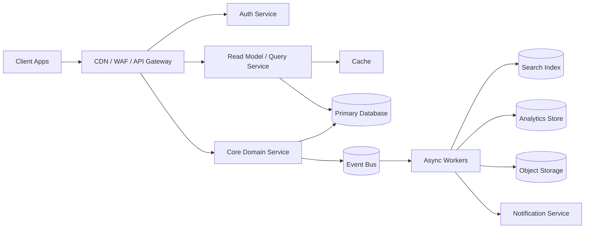
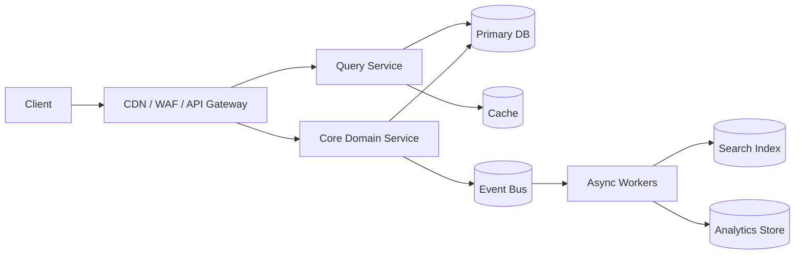

# HLD Interview Template - How To Solve Any System Design Problem

Use this as a live interview script. The goal is not to recite every section. The goal is to show structured thinking, make trade-offs explicit, and deep dive into the riskiest part of the system.

## 0. The Interview Mindset

A strong HLD answer is built in layers:

1. Start with scope and success metrics.
2. Quantify scale before choosing technology.
3. Design APIs and data models from access patterns.
4. Draw the high-level architecture.
5. Explain service responsibilities.
6. Walk through the critical flows.
7. Deep dive into bottlenecks, consistency, failures, and security.
8. Close with trade-offs, cost, observability, and evolution.

Do not start by naming databases, Kafka, Redis, Kubernetes, or microservices. Start from product behavior, correctness requirements, traffic, and failure modes.

## 1. Time Allocation

### 45-Minute Interview

| Time | What To Do | Output |
|---|---|---|
| 0-5 min | Clarify scope | Actors, use cases, non-goals |
| 5-10 min | Requirements and NFRs | Functional, latency, availability, consistency |
| 10-15 min | Capacity estimation | QPS, storage, bandwidth, hot keys |
| 15-25 min | APIs and data model | REST/gRPC APIs, entities, indexes |
| 25-35 min | HLD architecture | Diagram, service responsibilities, data stores |
| 35-42 min | Deep dive | Bottleneck, consistency, scaling, failure mode |
| 42-45 min | Wrap up | Trade-offs, monitoring, cost, next improvements |

### 60-Minute Interview

Use the same structure, but spend more time on:

- detailed data modeling,
- critical flow sequencing,
- multi-region design,
- failure recovery,
- security and compliance,
- cost and capacity evolution.

## 2. Step-By-Step Solving Framework

### Step 1: Clarify Scope

Start with 3-5 questions. Do not ask 20 questions. Pick the questions that change the architecture.

#### Questions To Ask

- Who are the primary actors?
- What are the top 2-3 user journeys?
- Is the system read-heavy, write-heavy, or balanced?
- What consistency is required for the core operation?
- What is explicitly out of scope?
- Are there compliance, privacy, money, safety, or latency constraints?

#### Example

For "Design Instagram":

- In scope: upload photos/videos, view feed, follow users, like/comment, stories, notifications.
- Out of scope: ad ranking, creator monetization, full ML recommendation internals.
- Core path: media upload and home feed generation.
- Risky areas: media processing, feed fanout, celebrity users, CDN delivery, moderation.

#### Interview Script

```text
I will scope this to the core product first. I will design the main user-facing paths, then cover scale, data model, architecture, reliability, security, and trade-offs. I will keep secondary analytics and admin workflows asynchronous unless they affect correctness.
```

### Step 2: Define Requirements

#### Functional Requirements

Write 5-7 bullets.

Template:

```text
The system should:
- Allow <actor> to <core action>.
- Support <read/query workflow>.
- Support <state-changing workflow>.
- Publish events for downstream consumers.
- Provide admin/audit/reconciliation workflows.
- Handle notifications/search/analytics asynchronously.
```

Examples:

- Users can create, update, delete, and view resources.
- Users can search/filter/list resources with pagination.
- The system supports idempotent writes.
- The system emits domain events for downstream systems.
- Admins can investigate, block, replay, or correct bad states.

#### Non-Functional Requirements

Write the NFRs that actually shape design.

| NFR | What To State |
|---|---|
| Availability | 99.9%, 99.99%, or 99.999% depending on criticality |
| Latency | p50, p95, p99 for read/write paths |
| Consistency | strong, bounded stale, eventual, monotonic reads |
| Durability | data loss tolerance, RPO, RTO |
| Scale | DAU, QPS, storage growth, bandwidth |
| Security | auth, authorization, encryption, abuse controls |
| Compliance | PCI, SOC2, GDPR, HIPAA, regional rules |
| Operability | observability, deployability, rollback, incident response |

#### Non-Goals

Non-goals prevent the interview from becoming too broad.

Examples:

- I will not design every UI screen.
- I will not implement the full ML ranking model.
- I will not design every third-party integration in detail.
- I will not optimize rare admin flows before the hot path.

### Step 3: Capacity And Traffic Estimation

Always estimate before selecting storage and caching strategy.

#### Baseline Formulas

```text
Average QPS = daily operations / 86,400
Peak QPS = average QPS x peak multiplier
Storage per day = writes/day x average record size x replication factor
Event volume per day = events/day x event size x retention multiplier
Cache memory = hot keys x average value size x overhead factor
Bandwidth = requests/sec x response size
```

#### Estimation Template

| Dimension | Assumption | Derived Number |
|---|---:|---:|
| DAU | <N> | - |
| Read operations/user/day | <N> | reads/day |
| Write operations/user/day | <N> | writes/day |
| Average read QPS | reads/day / 86,400 | <N> |
| Peak read QPS | average x <multiplier> | <N> |
| Average write QPS | writes/day / 86,400 | <N> |
| Peak write QPS | average x <multiplier> | <N> |
| Average object size | <bytes/KB/MB> | storage/day |
| Retention | <days/months/years> | total storage |

#### What Interviewers Look For

- You separate read QPS from write QPS.
- You calculate peak load, not only average load.
- You identify hot keys, celebrity users, viral objects, or large tenants.
- You use estimates to justify cache, partitioning, replication, queues, and CDN.
- You state assumptions and adjust when the interviewer changes numbers.

### Step 4: API Design

APIs show whether your architecture is usable.

#### Public API Template

```http
POST /v1/<resources>
Idempotency-Key: <uuid>
Authorization: Bearer <token>
Content-Type: application/json

{
  "client_request_id": "req_123",
  "field": "value"
}
```

```http
GET /v1/<resources>/{id}
Authorization: Bearer <token>
```

```http
GET /v1/<resources>?cursor=<cursor>&limit=50&filter=<filter>&sort=<sort>
Authorization: Bearer <token>
```

```http
PATCH /v1/<resources>/{id}
Idempotency-Key: <uuid>
Content-Type: application/json

{
  "expected_version": 12,
  "changes": {}
}
```

```http
POST /v1/<resources>/{id}/actions/<action>
Idempotency-Key: <uuid>
Content-Type: application/json

{
  "reason": "user_or_operator_reason"
}
```

#### Internal API Template

```protobuf
service <Domain>Service {
  rpc Create<CreateRequest>(CreateRequest) returns (CreateResponse);
  rpc Get<GetRequest>(GetRequest) returns (GetResponse);
  rpc Update<UpdateRequest>(UpdateRequest) returns (UpdateResponse);
  rpc Execute<CommandRequest>(CommandRequest) returns (CommandResponse);
  rpc ListEvents(ListEventsRequest) returns (stream DomainEvent);
}
```

#### API Design Checklist

- Idempotency key for every mutation.
- Cursor pagination for lists.
- Stable sorting for pagination.
- Version or `expected_version` for concurrent updates.
- Clear error model: `400`, `401`, `403`, `404`, `409`, `429`, `5xx`.
- Request ID and trace ID in every response.
- Rate-limit headers for throttled APIs.
- Backward-compatible versioning strategy.

### Step 5: Data Modeling And Database Design

Design the data model from access patterns.

#### Access Pattern Questions

- What entities are read by ID?
- What lists need pagination?
- What queries need filtering or sorting?
- What joins are required on the hot path?
- Which data must be strongly consistent?
- Which data can be eventually consistent?
- What needs audit history?
- What needs retention, archival, or deletion?

#### Entity Template

| Entity | Important Fields | Notes |
|---|---|---|
| `<resource>` | `id, owner_id, status, version, created_at, updated_at` | Source of truth |
| `<resource_event>` | `id, resource_id, event_type, payload, created_at` | Audit/event history |
| `<resource_index>` | `resource_id, searchable_fields, ranking_fields` | Search/read model |
| `<resource_counter>` | `resource_id, count_type, value, updated_at` | Derived counter |
| `<idempotency_key>` | `key, actor_id, request_hash, response_ref, expires_at` | Dedupes retries |

#### Database Selection Heuristics

| Requirement | Good Fit |
|---|---|
| Strong transactions, relational integrity | PostgreSQL, MySQL, CockroachDB, Spanner |
| Massive key-value access | DynamoDB, Cassandra, Bigtable |
| Search and ranking | Elasticsearch, OpenSearch, Solr |
| Time-series metrics | Prometheus, Mimir, InfluxDB, TimescaleDB |
| Event streaming | Kafka, Pulsar, Kinesis |
| Analytics | ClickHouse, Druid, BigQuery, Snowflake |
| Object/media storage | S3/GCS/Azure Blob |
| Cache | Redis, Memcached |

#### Database Technology Choice Template

Do not say only "use SQL" or "use NoSQL." Name the database for each workload and explain why it fits.

| Workload / Data | Database / Store To Choose | Why |
|---|---|---|
| Source of truth / primary store | <PostgreSQL/MySQL/CockroachDB/Spanner/Cassandra/etc.> | <transactions, scale, access pattern, correctness> |
| Hot cache / serving path | <Redis/Memcached/CDN/local cache> | <latency, offload, hot keys> |
| Event stream / outbox | <Kafka/Pulsar/Kinesis> | <fanout, replay, async projections> |
| Search / analytics | <OpenSearch/Elasticsearch/ClickHouse/Druid/warehouse> | <query shape not suited to OLTP> |
| Object/blob payloads | <S3/GCS/Azure Blob> | <large immutable payloads, durability, lifecycle> |

#### Replication, Sharding, Partitioning, And Indexing

Always state:

- primary key,
- partition key,
- secondary indexes,
- uniqueness constraints,
- replication strategy,
- shard split/merge strategy,
- retention policy,
- archival strategy,
- hot partition mitigation.

Example:

```text
Partition orders by merchant_id or user_id depending on access pattern. For global order lookup, keep order_id as the primary key and add a secondary index on user_id + created_at for order history. Use time bucketing for high-volume event tables.
```

#### CAP And Consistency

State what happens during a network partition.

| Data / Operation | CAP Bias | Consistency |
|---|---|---|
| Core command path | CP when correctness matters | strong/serializable/linearizable where required |
| Cache/read model | AP or bounded stale | eventual consistency with TTL/version metadata |
| Search/analytics | AP/eventual | asynchronous ingestion and replay/backfill |
| Audit/event log | CP for append acceptance | immutable, durable, replayable |

Use strong consistency for money, scarce inventory, authorization, entitlement, ledger, and state transitions that cannot diverge. Use eventual consistency for feeds, counters, search, analytics, notifications, recommendations, dashboards, and derived projections.

### Step 6: High-Level Architecture

The architecture should make ownership clear.

#### Architecture Diagram Template



#### Core Architecture Layers

| Layer | Responsibility |
|---|---|
| Client | Web, mobile, SDK, partner integrations |
| Edge | CDN, WAF, TLS, routing, rate limits, request shaping |
| API Gateway | Auth enforcement, quotas, request validation, routing |
| Domain Services | Business rules, state transitions, idempotency |
| Data Stores | Source of truth, read models, indexes, object storage |
| Async Platform | Event bus, queues, stream processing, retries, DLQ |
| Background Workers | Fanout, indexing, notifications, reconciliation, cleanup |
| Observability | Metrics, logs, traces, audits, alerts |
| Admin/Ops | Support tooling, manual correction, replay, compliance reports |

### Step 7: Service Responsibility Matrix

This is where many candidates are weak. Do not just draw boxes. Explain what every service owns.

| Service | Owns | Does Not Own | Data Store | Scaling Key |
|---|---|---|---|---|
| API Gateway | Auth checks, routing, quotas, request validation | Business state | Config/cache | Region, tenant, route |
| Core Domain Service | Commands, invariants, state transitions, idempotency | Analytics queries | Primary DB | Tenant/user/resource |
| Query Service | Read APIs, projections, cache lookup | Source-of-truth writes | Read replicas/cache | Query type, region |
| Event Processor | Consumes domain events, builds projections | Synchronous user response | Event log/checkpoints | Partition key |
| Search Service | Search index, ranking features, query parsing | Source-of-truth state | Search index | Index shard |
| Notification Service | Preferences, templates, delivery attempts | Business decision ownership | Notification DB/queue | User/channel |
| Reconciliation Service | Detects and repairs mismatches | Online request latency | Audit DB/object store | Time bucket |
| Admin Service | Investigation, replay, manual correction | Normal user workflow | Audit DB | Tenant/operator |

#### Responsibility Rules

- One service should own each source-of-truth state transition.
- Other services can build read models from events.
- Avoid two services writing the same core table independently.
- Every async consumer needs idempotency and checkpointing.
- Every critical state transition needs auditability.

### Step 8: Critical Flow Walkthroughs

Walk through at least two flows:

1. The main write path.
2. The main read path.
3. One failure or retry path.

#### Write Flow Template

```text
1. Client sends request with auth token and idempotency key.
2. API Gateway authenticates, authorizes, rate-limits, and validates shape.
3. Domain service loads required state and checks business invariants.
4. Domain service writes state transactionally with idempotency record.
5. Domain service publishes domain event through outbox or event log.
6. Async workers update search, cache, analytics, notifications, and read models.
7. Client receives response with request ID and resource version.
```

#### Read Flow Template

```text
1. Client sends read request with filters and cursor.
2. API Gateway validates identity, authorization, and quotas.
3. Query service checks cache or read model.
4. On cache miss, query service reads from replica/search/index store.
5. Query service returns data with cursor, version, and cache headers.
6. Metrics track latency, cache hit ratio, and stale-read rate.
```

#### Retry/Failure Flow Template

```text
1. Client retries using the same idempotency key.
2. Domain service detects duplicate request.
3. If the original succeeded, return stored response.
4. If the original is in progress, return 409/202 depending on API semantics.
5. If the original failed safely, allow retry after timeout.
6. Async failures go to retry queue, then DLQ after max attempts.
7. Reconciliation jobs detect partial failures and repair or alert.
```

### Step 9: Deep Dive Areas

Pick one or two. Do not shallowly cover ten.

| Problem Type | Best Deep Dive |
|---|---|
| URL shortener | Key generation, redirects, abuse, analytics |
| Chat/messaging | Ordering, offline delivery, presence, E2E encryption |
| Social feed | Fanout, ranking, celebrity users, cache invalidation |
| Media platform | Upload, transcoding, CDN, metadata, moderation |
| Booking | Inventory locking, payment timeout, oversell prevention |
| Payment | Idempotency, ledger, reconciliation, PCI, retries |
| Trading | Order matching, risk checks, market data, latency |
| Search | Crawling, indexing, ranking, freshness |
| Analytics | Ingestion, aggregation, OLAP storage, freshness |
| Collaboration | CRDT/OT, presence, snapshots, conflict resolution |
| Marketplace | Matching, pricing, availability, trust and safety |
| AI/LLM backend | Streaming inference, context, tools, safety, quotas |

#### Deep Dive Structure

```text
For this system, the hardest part is <risk>. I will deep dive into it.

Problem:
- What can go wrong?
- Why naive design fails?

Design:
- Data structures
- Algorithms
- Consistency model
- Scaling plan
- Failure handling
- Observability

Trade-off:
- What this design optimizes
- What it sacrifices
- When I would choose an alternative
```

### Step 10: Consistency And Correctness

Always name the consistency model.

| Use Case | Consistency Model |
|---|---|
| Payment/ledger/trading | Strong consistency, transactional writes, immutable audit |
| Booking/inventory | Strong consistency for reservation, eventual for search |
| Feed/timeline | Eventual consistency with freshness SLO |
| Search index | Eventually consistent with rebuild path |
| Metrics/analytics | Eventually consistent, approximate allowed if stated |
| Chat ordering | Per-conversation ordering, not global ordering |
| Collaboration | Convergent consistency using CRDT/OT |

#### Correctness Checklist

- What is the source of truth?
- What is the state machine?
- What transitions are allowed?
- How are duplicate requests handled?
- How are partial failures repaired?
- What must be strongly consistent?
- What can be stale?
- What audit trail exists?

### Step 11: Scaling Strategy

#### Scaling Levers

| Bottleneck | Mitigation |
|---|---|
| High read QPS | Cache, CDN, read replicas, materialized views |
| High write QPS | Partitioning, batching, async processing, sharded writes |
| Hot key | Key splitting, local aggregation, request coalescing |
| Large payload | Object storage, CDN, multipart upload, compression |
| Fanout | Async fanout, hybrid push/pull, priority queues |
| Slow dependency | Timeout, circuit breaker, fallback, bulkhead |
| Database contention | Better partition key, optimistic locking, queue serialization |
| Expensive queries | Precomputation, search index, OLAP store |

#### Scaling Script

```text
The first version can run with stateless services behind a load balancer and a primary database. At higher scale, I would shard by <key>, add read replicas for query traffic, introduce cache for hot reads, move expensive fanout/indexing to async workers, and use an event log for decoupling and replay.
```

### Step 12: Security, Privacy, And Abuse Prevention

#### Security Checklist

- TLS everywhere.
- Authentication using OAuth/JWT/session tokens.
- Authorization at object and tenant boundary.
- Least-privilege service-to-service auth.
- Encryption at rest for sensitive data.
- Secrets in a secret manager with rotation.
- Rate limits at user, tenant, IP, device, and API key levels.
- Audit logs for admin and sensitive actions.
- PII minimization, retention, deletion, and export flows.
- Abuse detection, spam controls, fraud rules, and manual review.

#### Domain-Specific Security

| Domain | Extra Controls |
|---|---|
| Payments | PCI scope isolation, tokenization, reconciliation, fraud checks |
| Finance | Immutable ledger, maker-checker ops, regulatory audit |
| Healthcare | HIPAA controls, consent, access logs |
| Messaging | E2E encryption, device keys, metadata minimization |
| Media/social | Moderation, copyright, child safety, reporting |
| Enterprise SaaS | Tenant isolation, SSO/SAML, SCIM, audit exports |
| AI/LLM | Prompt injection defense, tool permissioning, output safety |

### Step 13: Reliability And Failure Modes

#### Reliability Checklist

- Timeouts on every remote call.
- Retries only for safe/idempotent operations.
- Exponential backoff with jitter.
- Circuit breakers for unhealthy dependencies.
- Bulkheads to isolate tenants, routes, and workers.
- DLQ for async poison messages.
- Idempotent consumers.
- Outbox pattern for DB + event publishing.
- Health checks and readiness checks.
- Graceful degradation for non-critical features.
- Backups, restore tests, RPO/RTO.

#### Failure Mode Table

| Failure | Impact | Mitigation |
|---|---|---|
| Primary DB unavailable | Writes fail | failover, queue safe commands, degrade reads |
| Cache unavailable | Higher DB load | circuit breaker, request coalescing, fallback |
| Event bus lag | Stale projections | lag alerts, autoscale consumers, replay |
| Third-party outage | Partial workflow failure | retries, fallback provider, pending state |
| Region outage | Availability loss | multi-region failover, DNS/traffic shift |
| Hot partition | Latency spike | shard split, key salting, rate limits |
| Bad deploy | Error spike | canary, rollback, feature flag disable |

### Step 14: Observability

#### SLIs

- Availability by API and region.
- p50/p95/p99 latency by route.
- Error rate by route and dependency.
- Queue lag and DLQ count.
- Cache hit ratio.
- Database CPU, locks, replication lag.
- Event processing delay.
- Business correctness metrics.
- Cost per request or per tenant.

#### Alerts

Alert on symptoms first:

- user-facing error rate,
- p99 latency,
- successful operation rate,
- payment/order/booking failure rate,
- queue lag above SLO,
- reconciliation mismatch rate,
- security anomaly rate.

Avoid only alerting on CPU or memory unless they correlate with user impact.

### Step 15: Deployment And Operations

#### Deployment Strategy

- Containerized stateless services.
- Kubernetes or equivalent scheduler for service deployment.
- Blue/green or canary deployments.
- Feature flags for risky behavior.
- Backward-compatible API and schema changes.
- Database migrations with expand-contract pattern.
- IaC for environments and reproducibility.
- Separate dev, staging, and production.
- Runbooks for known incidents.

#### Schema Migration Pattern

```text
1. Add nullable/new column or table.
2. Deploy code that writes both old and new shape.
3. Backfill historical data.
4. Switch reads to new shape.
5. Stop old writes.
6. Drop old column/table after validation.
```

### Step 16: Cost Model

Cost awareness separates strong candidates from average candidates.

#### Cost Drivers

| Area | Cost Driver |
|---|---|
| Compute | service QPS, CPU-heavy processing, autoscaling headroom |
| Storage | source data, replicas, backups, retention, indexes |
| Network | CDN egress, cross-region replication, media delivery |
| Queue/stream | event volume, retention, partitions |
| Search/analytics | index size, query rate, retention |
| Third-party providers | SMS, email, payment, KYC, fraud, maps |
| Observability | logs, traces, metrics cardinality |

#### Cost Trade-Off Script

```text
The biggest cost driver is likely <storage/egress/compute/provider>. I would control it with lifecycle policies, caching, compression, batching, sampling, and tiered retention. I would not over-optimize cost on the critical user path if it risks correctness or availability.
```

### Step 17: Trade-Offs

Always close with trade-offs.

#### Common Trade-Offs

| Choice | Benefit | Cost |
|---|---|---|
| SQL database | transactions, joins, constraints | harder horizontal scaling |
| NoSQL database | scale, flexible schema | weaker joins/transactions |
| Cache | latency, lower DB load | stale data, invalidation complexity |
| Event-driven design | decoupling, replay, scale | eventual consistency, debugging complexity |
| Microservices | team autonomy, independent scaling | ops overhead, distributed failures |
| Monolith/modular monolith | simplicity, fast development | harder independent scaling |
| Strong consistency | correctness | latency, lower availability |
| Eventual consistency | availability, scale | stale reads, conflict handling |
| Push fanout | fast reads | expensive writes, celebrity problem |
| Pull fanout | cheaper writes | slower reads |

#### Trade-Off Script

```text
I chose <option> because <requirement>. The trade-off is <cost>. If the scale or requirement changed to <condition>, I would switch to <alternative>.
```

### Step 18: Final Wrap-Up

Use the last 1-2 minutes to summarize.

```text
To summarize, the design uses <core architecture> with <source of truth>, <cache/read model>, and <async event processing>. The main correctness boundary is <service/state machine>. The system scales by <partitioning/cache/CDN/queue strategy>. The main risks are <risk 1> and <risk 2>, handled through <mitigation>. I would monitor <SLIs> and evolve the design by <next improvement>.
```

## 3. Copy/Paste HLD Answer Template

Use this section to write a full HLD answer for any problem.

````markdown
# Design <System Name> - HLD Interview Answer

## 0. Interview Framing

<One paragraph describing scope, core path, and hardest design risk.>

## 1. Requirements

### Functional Requirements

- <Requirement 1>
- <Requirement 2>
- <Requirement 3>
- <Requirement 4>
- <Requirement 5>

### Non-Functional Requirements

- Availability: <target>
- Latency: <target>
- Scale: <DAU/QPS/storage>
- Consistency: <strong/eventual/bounded stale>
- Durability: <RPO/RTO/data loss tolerance>
- Security/compliance: <requirements>

### Non-Goals

- <Out of scope 1>
- <Out of scope 2>
- <Out of scope 3>

## 2. Capacity, Traffic, And Size Estimation

| Dimension | Assumption | Derived Number |
|---|---:|---:|
| DAU | <N> | - |
| Reads/user/day | <N> | <reads/day> |
| Writes/user/day | <N> | <writes/day> |
| Avg read QPS | reads/day / 86,400 | <N> |
| Peak read QPS | avg x <multiplier> | <N> |
| Avg write QPS | writes/day / 86,400 | <N> |
| Peak write QPS | avg x <multiplier> | <N> |
| Storage/day | writes/day x avg object size | <N> |
| Retention | <duration> | <total storage> |

## 3. API Design

### Public APIs

```http
POST /v1/<resources>
Idempotency-Key: <uuid>
Authorization: Bearer <token>

{ "field": "value" }
```

```http
GET /v1/<resources>/{id}
Authorization: Bearer <token>
```

```http
GET /v1/<resources>?cursor=<cursor>&limit=50
Authorization: Bearer <token>
```

### Error Model

- `400`: invalid request.
- `401/403`: authentication or authorization failure.
- `404`: not found or hidden.
- `409`: conflict or duplicate mutation.
- `429`: quota exceeded.
- `5xx`: dependency/internal failure.

## 4. Async Event Contracts

| Event | Producer | Consumers | Purpose |
|---|---|---|---|
| `<ResourceCreated>` | Core service | Search, analytics, notifications | Build projections |
| `<ResourceUpdated>` | Core service | Cache invalidation, audit | Keep read models fresh |
| `<ResourceFailed>` | Worker | Alerting, reconciliation | Repair failed workflow |

## 5. High-Level Architecture

### Architecture Design



### Service Responsibility Matrix

| Service | Responsibility | Data Owned | Scaling Strategy |
|---|---|---|---|
| API Gateway | Auth, routing, rate limits | Config/cache | Scale by route/region |
| Core Service | Business invariants and writes | Source-of-truth tables | Partition by <key> |
| Query Service | Read APIs and read models | Read projections/cache | Scale by query type |
| Worker Service | Async processing | Checkpoints/DLQ | Scale by partition lag |
| Reconciliation Service | Detect and repair mismatch | Audit/reconciliation data | Scale by time bucket |

## 6. Low-Level Design

### State Machine

```text
<state_1> -> <state_2> -> <state_3>
        \-> <failure_state>
```

### Idempotency

- Every mutation requires an idempotency key.
- Store request hash, actor, status, response reference, and expiry.
- Same key and same payload returns the original response.
- Same key and different payload returns `409`.

## 7. Database Design

| Table/Collection | Fields | Indexes |
|---|---|---|
| `<resources>` | `id, owner_id, status, version, created_at, updated_at` | `owner_id + created_at`, `status` |
| `<resource_events>` | `id, resource_id, type, payload, created_at` | `resource_id + created_at` |
| `<idempotency_keys>` | `key, actor_id, request_hash, response_ref, expires_at` | `actor_id + key` |

### Database Technology Choice

| Workload / Data | Database / Store | Why |
|---|---|---|
| Source of truth | <database> | <transaction/scale/correctness reason> |
| Cache | <database/cache> | <latency/hot-key reason> |
| Event log | <stream/log> | <fanout/replay reason> |
| Search/analytics | <search/OLAP store> | <query reason> |
| Object payloads | <object store> | <large payload/lifecycle reason> |

### Partitioning

- Partition key: `<key>`.
- Hot key mitigation: `<strategy>`.
- Retention: `<policy>`.
- Backups: `<RPO/RTO>`.

### Replication, Sharding, Indexing, And CAP

- Replication: <multi-AZ/quorum/cross-region plan>.
- Sharding: <shard key, virtual shard, split/merge plan>.
- Indexing: <primary lookup, secondary indexes, search indexes>.
- CAP: <CP for core correctness, AP/eventual for derived views>.
- Eventual consistency: <which projections can lag and how users see pending/stale state>.

## 8. Critical Flows

### Main Write Flow

1. Client sends mutation with auth token and idempotency key.
2. Gateway authenticates, authorizes, validates, and rate-limits.
3. Core service checks invariants and current state.
4. Core service writes source-of-truth state and idempotency record.
5. Core service publishes event through outbox/event bus.
6. Workers update read models, cache, search, notifications, and analytics.

### Main Read Flow

1. Client sends read request with cursor/filter.
2. Gateway validates identity and quota.
3. Query service checks cache/read model.
4. On miss, query service reads from replica/search/source store.
5. Response includes cursor, version, request ID, and cache hints.

## 9. Deep Dive

### Deep Dive Topic: <Hardest Area>

- Problem: <why naive design fails>
- Data structure: <choice>
- Algorithm: <choice>
- Consistency: <model>
- Scaling: <plan>
- Failure handling: <plan>
- Trade-off: <benefit and cost>

## 10. Scaling Bottlenecks And Mitigations

| Bottleneck | Mitigation |
|---|---|
| <bottleneck> | <mitigation> |
| <bottleneck> | <mitigation> |

## 11. Security, Privacy, And Abuse Prevention

- Authentication and authorization.
- Tenant/object-level access control.
- Encryption in transit and at rest.
- Rate limiting and abuse detection.
- Audit logs for sensitive actions.
- PII retention, deletion, and export.
- Secrets management and rotation.

## 12. Reliability And Failure Recovery

| Failure | Mitigation |
|---|---|
| DB outage | Failover, degraded reads, queue safe commands |
| Cache outage | Fallback to DB, circuit breaker |
| Event lag | Lag alerts, autoscale consumers, replay |
| Bad deploy | Canary, rollback, feature flag disable |

## 13. Deployment And Operations

- Stateless services on Kubernetes or equivalent.
- Canary/blue-green deployment.
- Feature flags for risky behavior.
- Backward-compatible schema migrations.
- IaC-managed environments.
- Runbooks and incident response.

## 14. Observability

- SLIs: availability, latency, error rate, queue lag, cache hit ratio.
- Business metrics: successful <core operation>, failed <core operation>, stale reads.
- Alerts: user-facing error rate, p99 latency, dependency failures, DLQ growth.
- Dashboards by region, tenant, route, and dependency.

## 15. Cost Model

- Compute: <main driver>.
- Storage: <main driver>.
- Network: <main driver>.
- Third-party: <main driver>.
- Observability: log/trace cardinality and retention.

## 16. Trade-Offs

| Decision | Why | Trade-Off |
|---|---|---|
| <choice> | <benefit> | <cost> |
| <choice> | <benefit> | <cost> |

## 17. Final Interview Summary

<Short summary of architecture, source of truth, scaling strategy, reliability plan, and biggest trade-offs.>
````

## 4. Quick Pattern Map

Use this to recognize the problem family quickly.

| If The Problem Sounds Like | Use These Patterns |
|---|---|
| TinyURL, rate limiter, API gateway | stateless services, cache, distributed counters, edge controls |
| WhatsApp, Slack, Discord | WebSocket, presence, queues, ordering, offline delivery |
| Instagram, Twitter, TikTok | feed fanout, ranking, graph, media pipeline, CDN |
| YouTube, Netflix, Spotify | object storage, transcoding, CDN, catalog, recommendations |
| Google Search, autocomplete | crawler/indexer, inverted index, ranking, freshness |
| S3, Dropbox, Drive | metadata service, chunking, object storage, sync, versioning |
| Amazon, cart, orders | inventory, checkout, saga, idempotency, payment |
| Uber, DoorDash, Zomato | geo indexing, matching, dispatch, ETA, marketplace state |
| Hotel, airline, BookMyShow | reservation holds, inventory locks, payment timeout |
| Stripe, wallet, banking, UPI | ledger, idempotency, reconciliation, fraud, compliance |
| Kafka, queue, scheduler | partitioning, leases, retries, DLQ, ordering |
| Metrics, tracing, logs | ingestion, sampling, indexing, retention, query serving |
| Google Docs, whiteboard | CRDT/OT, presence, snapshots, conflict resolution |
| LLM backend | model gateway, streaming, context, tools, safety, quotas |

## 5. Interview Scoring Rubric

Use this after practice.

| Area | Weak | Strong |
|---|---|---|
| Scope | jumps into tech | clarifies actors, goals, non-goals |
| Requirements | generic list | requirements tied to architecture |
| Estimation | skipped or vague | calculates QPS/storage/peak/hotspots |
| API | hand-wavy | concrete APIs, idempotency, errors |
| Data model | names DB only | entities, indexes, partitions, retention |
| Architecture | box diagram only | responsibilities, flows, ownership |
| Scaling | says "use cache" | explains hot keys, sharding, fanout, queues |
| Correctness | ignored | consistency, state machines, retries, repair |
| Security | late generic notes | built into auth, privacy, abuse, audit |
| Reliability | says "replication" | timeouts, retries, failover, DLQ, RPO/RTO |
| Observability | absent | SLIs, alerts, dashboards, business metrics |
| Trade-offs | no alternatives | explains why and when to change design |

## 6. Common Mistakes To Avoid

- Starting with Kubernetes, Kafka, Redis, or microservices before requirements.
- Designing for average QPS and ignoring peak QPS.
- Forgetting idempotency on mutations.
- Using one database table for every access pattern.
- Ignoring hot users, celebrity accounts, viral content, or large tenants.
- Treating cache as source of truth.
- Saying "eventual consistency" without explaining user impact.
- Drawing services without explaining responsibilities.
- Ignoring retries, partial failures, and reconciliation.
- Skipping security until the end.
- Not choosing a deep dive.
- Covering too many topics shallowly.

## 7. One-Page Live Checklist

```text
[ ] Scope: actors, core workflows, non-goals
[ ] Requirements: functional + non-functional
[ ] Scale: DAU, QPS, peak, storage, bandwidth
[ ] APIs: mutations, reads, idempotency, errors
[ ] Data model: entities, indexes, partitions, retention
[ ] HLD: edge, services, stores, event bus, workers
[ ] Responsibilities: what each service owns
[ ] Flows: main write, main read, retry/failure
[ ] Deep dive: hardest correctness/scaling area
[ ] Consistency: source of truth, state machine, stale reads
[ ] Scaling: cache, sharding, queues, CDN, read models
[ ] Security: auth, ACLs, encryption, audit, abuse
[ ] Reliability: timeouts, retries, DLQ, failover, RPO/RTO
[ ] Observability: SLIs, alerts, dashboards
[ ] Cost: top cost drivers and controls
[ ] Trade-offs: why this design, when to change it
```
