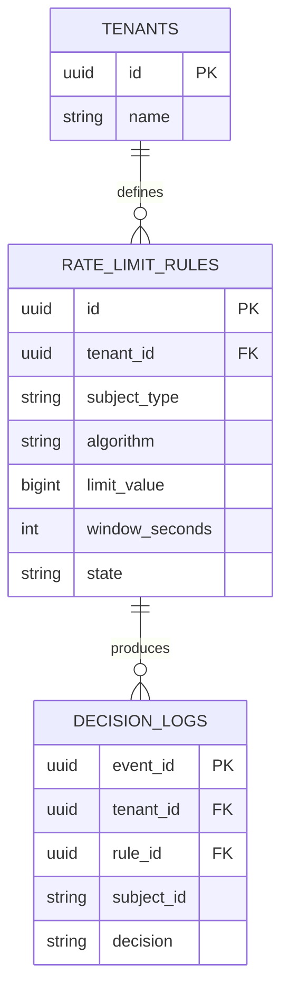
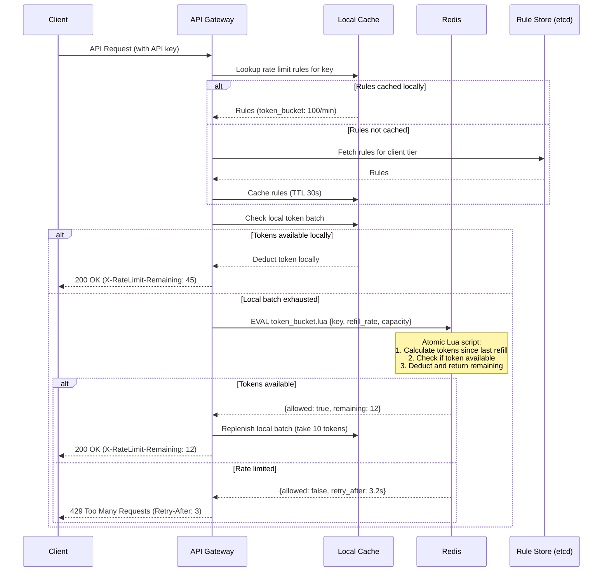
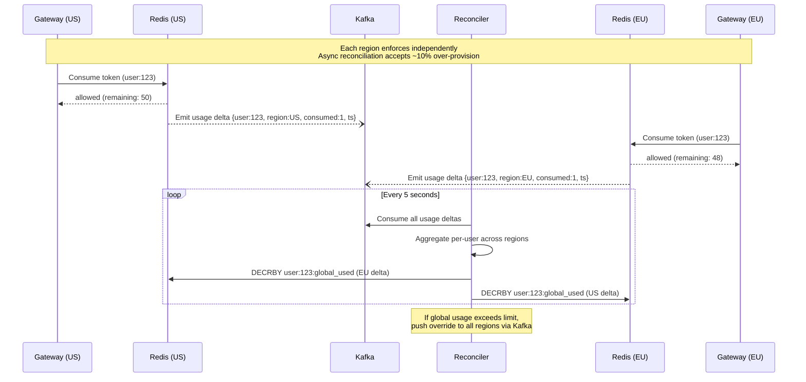

# Distributed Rate Limiter - System Design (Staff/Principal Level)

## 1. Functional Requirements

### Core Features

| Feature | Description |
|---------|-------------|
| **Multi-algorithm support** | Token Bucket, Sliding Window Log, Sliding Window Counter, Fixed Window, Leaky Bucket |
| **Multi-dimension limiting** | Per-user, per-IP, per-API-key, per-route, per-tenant, per-region, global |
| **Hierarchical limits** | Global -> Tenant -> User -> API-key with cascading enforcement |
| **Burst handling** | Allow controlled bursts above sustained rate for token bucket |
| **Quota metadata** | Return `X-RateLimit-Limit`, `X-RateLimit-Remaining`, `X-RateLimit-Reset`, `Retry-After` |
| **Dynamic configuration** | Hot-reload rate limit rules without deployment |
| **Distributed rate limiting** | Consistent enforcement across multiple nodes/regions |
| **Admin operations** | CRUD on rules, quarantine abusive clients, override limits |
| **Graceful degradation** | Fail-open or fail-closed configurable per route/tier |
| **Domain events** | Publish throttle events for analytics, billing, abuse detection |

### Algorithm Selection Matrix

| Algorithm | Use Case | Burst Tolerance | Memory | Accuracy |
|-----------|----------|-----------------|--------|----------|
| Token Bucket | API gateway default, burst-friendly | High | O(1) per key | Approximate |
| Leaky Bucket | Smooth output rate (video streaming, queue processing) | None | O(1) per key | Exact output rate |
| Fixed Window | Simple counting (billing cycles, daily caps) | Edge burst (2x at boundary) | O(1) per key | Approximate |
| Sliding Window Log | Strict per-request accuracy (financial APIs) | None | O(N) per key | Exact |
| Sliding Window Counter | Balance of accuracy and memory | Low | O(1) per key | ~99.x% accurate |

---

## 2. Non-Functional Requirements

| Requirement | Target | Justification |
|-------------|--------|---------------|
| **Latency (p50)** | < 0.5ms | Rate limiter is on the critical path of every API call |
| **Latency (p99)** | < 2ms | Must not become the bottleneck; Redis RTT budget |
| **Latency (p99.9)** | < 5ms | Tail latency during GC pauses or network jitter |
| **Availability** | 99.99% (52.6 min/year downtime) | Every API depends on this; if it goes down, everything does |
| **Throughput** | 1M+ decisions/sec per cluster | Must handle peak traffic without queuing |
| **Consistency** | Per-key linearizable within a region; eventually consistent cross-region | Prevent exact double-spending of quota |
| **Scalability** | Horizontal, linear with traffic growth | Add nodes without re-architecture |
| **Fault tolerance** | No single point of failure; survive node, AZ, region failures | Data plane must survive control plane outages |
| **Clock accuracy** | NTP-synced within 10ms across nodes | Window boundaries depend on time agreement |

### Consistency Model

```
Within a single Redis shard:     Linearizable (single-threaded execution)
Across Redis cluster shards:     Per-key linearizable (key maps to one shard)
Across regions:                  Eventually consistent with bounded lag (~100-500ms)
During network partition:        Configurable fail-open (allow) or fail-closed (deny)
```

---

## 3. Capacity Estimation

### Assumptions

| Parameter | Value |
|-----------|-------|
| DAU | 50M |
| MAU | 200M |
| Avg requests per user per day | 200 |
| Total daily requests | 50M x 200 = 10B |
| Average QPS | 10B / 86400 = ~115,740 QPS |
| Peak QPS (5x multiplier) | ~580,000 QPS |
| Flash sale/viral peak (20x) | ~2.3M QPS |
| Unique rate limit keys (active) | 50M users + 10M IPs + 500K API keys = ~60.5M |
| Rate limit rules configured | ~10,000 |

### Storage Estimation

**Per-key storage (Token Bucket in Redis):**
```
Key: "rl:{user_id}:{route_hash}" = ~40 bytes
Value (hash): {tokens: 8B, last_refill: 8B, limit: 4B, rate: 4B} = ~24 bytes
Redis overhead per key: ~80 bytes (dict entry, SDS, robj)
Total per key: ~144 bytes
```

**Total active key storage:**
```
60.5M keys x 144 bytes = ~8.7 GB
With 2x replication = ~17.4 GB
With overhead (fragmentation, buffers) x 1.5 = ~26 GB
```

**Sliding Window Log (worst case):**
```
Per request timestamp: 8 bytes
Window = 60 seconds, rate = 100 req/min
Max entries per key: 100 x 8 = 800 bytes
For 1M high-volume keys: 1M x 800 = 800 MB
```

### Network Bandwidth

**Inbound (rate limit check requests):**
```
Per request payload: ~200 bytes (headers + key + metadata)
At 580K QPS: 580,000 x 200 = 116 MB/s = ~928 Mbps
```

**Outbound (responses):**
```
Per response: ~100 bytes (allow/deny + headers)
At 580K QPS: 580,000 x 100 = 58 MB/s = ~464 Mbps
```

**Redis network:**
```
Command: EVALSHA + 3-4 args = ~150 bytes
Response: integer/array = ~50 bytes
At 580K QPS: 580,000 x 200 = 116 MB/s per Redis cluster
```

### Compute Estimation

```
Rate limiter service instances:
  - Each instance handles ~50K decisions/sec (CPU bound on serialization)
  - Peak 580K QPS -> 12 instances minimum
  - With 2x headroom: 24 instances
  - Instance size: 4 vCPU, 8 GB RAM

Redis cluster:
  - Each shard handles ~100K ops/sec (with Lua scripts)
  - Peak 580K QPS -> 6 primary shards minimum
  - With replicas: 6 primaries + 6 replicas = 12 nodes
  - Node size: 8 vCPU, 32 GB RAM (r6g.xlarge equivalent)
```

### Summary Table

| Resource | Quantity | Cost Driver |
|----------|----------|-------------|
| Rate Limiter Service | 24 instances (4C/8G) | Compute |
| Redis Cluster | 12 nodes (8C/32G) | Memory + Network |
| Config DB (PostgreSQL) | 2 nodes (HA) | Rules storage |
| Kafka (events) | 6 brokers | Event volume |
| Total RAM | 24x8 + 12x32 = 576 GB | - |
| Network | ~3 Gbps sustained | - |

---

## 4. Data Modeling

### Entity-Relationship Diagram



### Rate Limit Rules (PostgreSQL)

```sql
CREATE TABLE rate_limit_rules (
    id              UUID PRIMARY KEY DEFAULT gen_random_uuid(),
    tenant_id       UUID NOT NULL REFERENCES tenants(id),
    name            VARCHAR(255) NOT NULL,
    description     TEXT,
    
    -- Matching criteria
    subject_type    VARCHAR(50) NOT NULL,  -- 'user', 'ip', 'api_key', 'tenant', 'route'
    route_pattern   VARCHAR(500),          -- '/api/v1/orders/*'
    method          VARCHAR(10),           -- 'GET', 'POST', '*'
    priority        INT NOT NULL DEFAULT 0,
    
    -- Algorithm configuration
    algorithm       VARCHAR(30) NOT NULL,  -- 'token_bucket', 'sliding_window_log', 
                                           -- 'sliding_window_counter', 'fixed_window', 'leaky_bucket'
    limit_value     BIGINT NOT NULL,       -- max tokens / max requests
    window_seconds  INT NOT NULL,          -- time window in seconds
    burst_size      BIGINT,                -- max burst (token_bucket only)
    refill_rate     DOUBLE PRECISION,      -- tokens per second (token_bucket)
    drain_rate      DOUBLE PRECISION,      -- requests per second (leaky_bucket)
    
    -- Behavior
    fail_strategy   VARCHAR(10) NOT NULL DEFAULT 'open', -- 'open' or 'closed'
    response_code   INT NOT NULL DEFAULT 429,
    retry_after_mode VARCHAR(20) DEFAULT 'dynamic', -- 'dynamic', 'fixed', 'none'
    
    -- State
    state           VARCHAR(20) NOT NULL DEFAULT 'active',
    version         BIGINT NOT NULL DEFAULT 1,
    
    -- Audit
    created_by      UUID NOT NULL,
    created_at      TIMESTAMPTZ NOT NULL DEFAULT now(),
    updated_at      TIMESTAMPTZ NOT NULL DEFAULT now(),
    
    CONSTRAINT valid_algorithm CHECK (algorithm IN (
        'token_bucket', 'sliding_window_log', 'sliding_window_counter', 
        'fixed_window', 'leaky_bucket'
    )),
    CONSTRAINT valid_state CHECK (state IN ('active', 'paused', 'archived', 'deleted'))
);

CREATE INDEX idx_rules_tenant_state ON rate_limit_rules(tenant_id, state);
CREATE INDEX idx_rules_route ON rate_limit_rules(route_pattern, method, state);
CREATE INDEX idx_rules_priority ON rate_limit_rules(priority DESC, created_at);
```

### Redis Data Structures (Per Algorithm)

**Token Bucket:**
```
Key:    rl:tb:{subject_type}:{subject_id}:{rule_id}
Type:   Hash
Fields: {
    tokens:      <float>       -- current available tokens
    last_refill: <unix_ms>     -- last refill timestamp
    capacity:    <int>         -- max burst capacity
    refill_rate: <float>       -- tokens added per second
}
TTL: window_seconds * 2 (auto-expire inactive keys)
```

**Fixed Window:**
```
Key:    rl:fw:{subject_type}:{subject_id}:{rule_id}:{window_start}
Type:   String (integer counter)
Value:  <count>
TTL:    window_seconds + grace_period
```

**Sliding Window Log:**
```
Key:    rl:swl:{subject_type}:{subject_id}:{rule_id}
Type:   Sorted Set
Members: {request_id}  (or unique timestamp with counter)
Score:   <unix_timestamp_ms>
TTL:    window_seconds * 2
```

**Sliding Window Counter:**
```
Key (current window): rl:swc:{subject_type}:{subject_id}:{rule_id}:{current_window}
Key (previous window): rl:swc:{subject_type}:{subject_id}:{rule_id}:{previous_window}
Type:   String (integer counter)
TTL:    window_seconds * 2
```

**Leaky Bucket:**
```
Key:    rl:lb:{subject_type}:{subject_id}:{rule_id}
Type:   Hash
Fields: {
    queue_size:  <int>        -- current items in bucket
    last_drain:  <unix_ms>    -- last drain timestamp
    capacity:    <int>        -- max bucket size
    drain_rate:  <float>      -- items drained per second
}
TTL:    capacity / drain_rate * 2
```

### Decision Audit Log (Kafka -> ClickHouse)

```sql
CREATE TABLE decision_logs (
    event_id        UUID,
    timestamp       DateTime64(3),
    tenant_id       UUID,
    subject_type    LowCardinality(String),
    subject_id      String,
    rule_id         UUID,
    algorithm       LowCardinality(String),
    route           String,
    method          LowCardinality(String),
    decision        LowCardinality(String),  -- 'allow', 'deny', 'throttle'
    remaining       Int64,
    retry_after_ms  Int64,
    latency_us      Int32,
    node_id         String,
    region          LowCardinality(String)
) ENGINE = MergeTree()
PARTITION BY toYYYYMMDD(timestamp)
ORDER BY (tenant_id, subject_id, timestamp)
TTL timestamp + INTERVAL 30 DAY;
```

### Database Choice Justification

| Store | Technology | Justification |
|-------|-----------|---------------|
| Rate limit counters | Redis Cluster 7.x | Sub-millisecond latency, atomic Lua scripts, built-in TTL, cluster mode for sharding |
| Rule configuration | PostgreSQL 16 | ACID for rule CRUD, strong consistency, rich querying, mature tooling |
| Decision audit | ClickHouse | Column-oriented, high write throughput, excellent compression, fast analytical queries |
| Event streaming | Apache Kafka | Durable, ordered, replayable, exactly-once semantics |
| Local cache (rules) | In-process (Caffeine/Guava) | Zero-latency rule lookups, invalidated via Kafka events |

---

## 5. High-Level Design (HLD)

### System Architecture

```
                                    Control Plane
                                    +-----------------------+
                                    |  Admin Dashboard      |
                                    |  Rule Management API  |
                                    |  Policy Engine        |
                                    +-----------+-----------+
                                                |
                                    +-----------v-----------+
                                    |   PostgreSQL (Rules)  |
                                    |   + Config Cache      |
                                    +-----------+-----------+
                                                |
                                    Rule change events (Kafka)
                                                |
         +----------------------------------+---+---+----------------------------------+
         |                                  |       |                                  |
+--------v--------+              +----------v-------v----------+              +--------v--------+
| Rate Limiter    |              | Rate Limiter                |              | Rate Limiter    |
| Node 1          |              | Node 2                      |              | Node N          |
| +-------------+ |              | +-------------+             |              | +-------------+ |
| | Local Cache | |              | | Local Cache |             |              | | Local Cache | |
| | (Rules)     | |              | | (Rules)     |             |              | | (Rules)     | |
| +-------------+ |              | +-------------+             |              | +-------------+ |
+---------+-------+              +------+-------+--------------+              +--------+--------+
          |                             |       |                                      |
          +-----------------------------+       +--------------------------------------+
                                        |
                              +---------v---------+
                              |  Redis Cluster    |
                              |  (Counters/State) |
                              |  6 Primary +      |
                              |  6 Replica shards |
                              +---------+---------+
                                        |
                              Decision events (async)
                                        |
                              +---------v---------+
                              |  Kafka Cluster    |
                              |  (Audit + Events) |
                              +---------+---------+
                                        |
                    +-------------------+-------------------+
                    |                                       |
          +---------v---------+                   +--------v--------+
          |  ClickHouse       |                   |  Flink          |
          |  (Analytics)      |                   |  (Stream Proc)  |
          +-------------------+                   +-----------------+
```

### Data Flow Per Algorithm

**Token Bucket Flow:**
```
1. Request arrives -> extract subject (user_id, IP, API key)
2. Load rule from local cache (refreshed via Kafka)
3. Execute Lua script on Redis:
   a. Calculate tokens to add since last_refill
   b. new_tokens = min(capacity, current_tokens + elapsed * refill_rate)
   c. If new_tokens >= cost: deduct, return ALLOW
   d. Else: return DENY with retry_after
4. Set response headers and forward/reject request
```

**Sliding Window Flow:**
```
1. Request arrives -> extract subject + current timestamp
2. Execute Lua script on Redis:
   a. Remove entries older than (now - window_size) from sorted set
   b. Count remaining entries
   c. If count < limit: add current timestamp, return ALLOW
   d. Else: return DENY with retry_after = oldest_entry + window - now
3. Set response headers
```

**Fixed Window Flow:**
```
1. Request arrives -> compute window_key = floor(now / window_size)
2. INCR on key "rl:fw:{subject}:{window_key}"
3. If count <= limit: ALLOW
4. Else: DENY with retry_after = (window_key + 1) * window_size - now
5. Set TTL on first increment
```

### Middleware Integration Pattern

```
Client -> DNS -> CDN -> WAF -> Load Balancer -> API Gateway
                                                    |
                                          +---------v---------+
                                          | Rate Limit        |
                                          | Middleware        |
                                          | (pre-handler)     |
                                          +---------+---------+
                                                    |
                                          ALLOW?    |    DENY?
                                          +---------+---------+
                                          |                   |
                                  +-------v-------+   +-------v-------+
                                  | Application   |   | 429 Response  |
                                  | Service       |   | + Retry-After |
                                  +---------------+   +---------------+
```

---

## 6. Low-Level Design (LLD)

### API Endpoints

#### Check Rate Limit (Internal - Hot Path)

```http
POST /internal/v1/rate-limit/check
Content-Type: application/json

{
    "subject": {
        "type": "user",
        "id": "usr_abc123"
    },
    "resource": {
        "route": "/api/v1/orders",
        "method": "POST"
    },
    "context": {
        "ip": "192.168.1.100",
        "tenant_id": "tenant_xyz",
        "api_key": "key_def456",
        "region": "us-east-1",
        "cost": 1
    },
    "request_id": "req_789"
}
```

**Response (ALLOW):**
```json
{
    "decision": "allow",
    "rule_id": "rule_001",
    "algorithm": "token_bucket",
    "headers": {
        "X-RateLimit-Limit": "1000",
        "X-RateLimit-Remaining": "742",
        "X-RateLimit-Reset": "1716883200",
        "X-RateLimit-Policy": "1000;w=3600"
    },
    "metadata": {
        "tokens_consumed": 1,
        "bucket_capacity": 1000,
        "refill_rate_per_sec": 16.67,
        "evaluated_at_ms": 1716879600123,
        "latency_us": 340
    }
}
```

**Response (DENY):**
```json
{
    "decision": "deny",
    "rule_id": "rule_001",
    "algorithm": "token_bucket",
    "headers": {
        "X-RateLimit-Limit": "1000",
        "X-RateLimit-Remaining": "0",
        "X-RateLimit-Reset": "1716883200",
        "Retry-After": "23"
    },
    "metadata": {
        "tokens_available": 0,
        "next_token_at_ms": 1716879623456,
        "retry_after_seconds": 23,
        "evaluated_at_ms": 1716879600123,
        "latency_us": 280
    }
}
```

#### CRUD - Rate Limit Rules (Admin)

**Create Rule:**
```http
POST /api/v1/admin/rate-limit-rules
Authorization: Bearer <admin_token>
Idempotency-Key: idem_abc123

{
    "name": "Orders API - Standard Tier",
    "description": "Rate limit for standard tier users on orders endpoint",
    "subject_type": "user",
    "route_pattern": "/api/v1/orders*",
    "method": "POST",
    "priority": 100,
    "algorithm": "token_bucket",
    "limit_value": 1000,
    "window_seconds": 3600,
    "burst_size": 50,
    "refill_rate": 16.67,
    "fail_strategy": "open",
    "tenant_id": "tenant_xyz"
}
```

**Response:**
```json
{
    "data": {
        "id": "rule_abc123",
        "name": "Orders API - Standard Tier",
        "state": "active",
        "version": 1,
        "created_at": "2026-05-28T10:00:00Z"
    },
    "meta": {
        "request_id": "req_xyz789"
    }
}
```

**List Rules:**
```http
GET /api/v1/admin/rate-limit-rules?tenant_id=tenant_xyz&state=active&cursor=eyJpZCI6...&limit=20
Authorization: Bearer <admin_token>
```

**Response:**
```json
{
    "data": [
        {
            "id": "rule_abc123",
            "name": "Orders API - Standard Tier",
            "subject_type": "user",
            "algorithm": "token_bucket",
            "limit_value": 1000,
            "window_seconds": 3600,
            "state": "active",
            "version": 3,
            "created_at": "2026-05-28T10:00:00Z",
            "updated_at": "2026-05-28T12:30:00Z"
        }
    ],
    "meta": {
        "cursor": "eyJpZCI6InJ1bGVfZGVmNDU2In0=",
        "has_more": true,
        "total": 47
    }
}
```

**Get Usage Metrics:**
```http
GET /api/v1/admin/rate-limit-rules/rule_abc123/metrics?from=2026-05-28T00:00:00Z&to=2026-05-28T12:00:00Z&granularity=5m
Authorization: Bearer <admin_token>
```

**Response:**
```json
{
    "data": {
        "rule_id": "rule_abc123",
        "period": {
            "from": "2026-05-28T00:00:00Z",
            "to": "2026-05-28T12:00:00Z"
        },
        "summary": {
            "total_requests": 1847293,
            "allowed": 1823456,
            "denied": 23837,
            "deny_rate_percent": 1.29
        },
        "timeseries": [
            {
                "timestamp": "2026-05-28T00:00:00Z",
                "allowed": 12453,
                "denied": 34,
                "p50_latency_us": 210,
                "p99_latency_us": 890
            }
        ],
        "top_throttled_subjects": [
            {"subject_id": "usr_heavy_user", "denied_count": 4521},
            {"subject_id": "usr_bot_suspect", "denied_count": 3892}
        ]
    }
}
```

### Algorithm Implementations (Pseudocode)

#### Token Bucket (Redis Lua Script)

```lua
-- KEYS[1] = rate limit key
-- ARGV[1] = capacity (max tokens)
-- ARGV[2] = refill_rate (tokens per second)
-- ARGV[3] = now (current time in milliseconds)
-- ARGV[4] = cost (tokens to consume, usually 1)

local key = KEYS[1]
local capacity = tonumber(ARGV[1])
local refill_rate = tonumber(ARGV[2])
local now = tonumber(ARGV[3])
local cost = tonumber(ARGV[4])

-- Get current state
local bucket = redis.call('HMGET', key, 'tokens', 'last_refill')
local tokens = tonumber(bucket[1])
local last_refill = tonumber(bucket[2])

-- Initialize if new key
if tokens == nil then
    tokens = capacity
    last_refill = now
end

-- Calculate tokens to add based on elapsed time
local elapsed_ms = now - last_refill
local tokens_to_add = (elapsed_ms / 1000.0) * refill_rate
tokens = math.min(capacity, tokens + tokens_to_add)

-- Try to consume
local allowed = 0
local remaining = 0
local retry_after_ms = 0

if tokens >= cost then
    tokens = tokens - cost
    allowed = 1
    remaining = math.floor(tokens)
else
    allowed = 0
    remaining = 0
    -- Calculate when enough tokens will be available
    local deficit = cost - tokens
    retry_after_ms = math.ceil((deficit / refill_rate) * 1000)
end

-- Update state
redis.call('HMSET', key, 'tokens', tostring(tokens), 'last_refill', tostring(now))

-- Set TTL (2x window to handle idle keys)
local ttl = math.ceil(capacity / refill_rate) * 2
redis.call('EXPIRE', key, ttl)

return {allowed, remaining, retry_after_ms, math.floor(tokens * 1000)}
```

#### Sliding Window Log (Redis Lua Script)

```lua
-- KEYS[1] = sorted set key
-- ARGV[1] = now (timestamp in ms)
-- ARGV[2] = window_ms (window size in ms)
-- ARGV[3] = limit (max requests in window)
-- ARGV[4] = request_id (unique identifier for this request)

local key = KEYS[1]
local now = tonumber(ARGV[1])
local window_ms = tonumber(ARGV[2])
local limit = tonumber(ARGV[3])
local request_id = ARGV[4]

-- Remove expired entries (older than window)
local window_start = now - window_ms
redis.call('ZREMRANGEBYSCORE', key, '-inf', window_start)

-- Count current entries in window
local count = redis.call('ZCARD', key)

local allowed = 0
local remaining = 0
local retry_after_ms = 0

if count < limit then
    -- Add this request
    redis.call('ZADD', key, now, request_id)
    allowed = 1
    remaining = limit - count - 1
else
    -- Get the oldest entry to calculate retry_after
    local oldest = redis.call('ZRANGE', key, 0, 0, 'WITHSCORES')
    if #oldest > 0 then
        local oldest_time = tonumber(oldest[2])
        retry_after_ms = oldest_time + window_ms - now
        if retry_after_ms < 0 then retry_after_ms = 0 end
    end
    allowed = 0
    remaining = 0
end

-- Set TTL
redis.call('EXPIRE', key, math.ceil(window_ms / 1000) + 10)

return {allowed, remaining, retry_after_ms, count}
```

#### Sliding Window Counter (Redis Lua Script)

```lua
-- KEYS[1] = current window key
-- KEYS[2] = previous window key
-- ARGV[1] = now (timestamp in ms)
-- ARGV[2] = window_ms (window size in ms)
-- ARGV[3] = limit (max requests in window)
-- ARGV[4] = window_start_ms (current window start)

local current_key = KEYS[1]
local previous_key = KEYS[2]
local now = tonumber(ARGV[1])
local window_ms = tonumber(ARGV[2])
local limit = tonumber(ARGV[3])
local window_start = tonumber(ARGV[4])

-- Get counts from current and previous windows
local current_count = tonumber(redis.call('GET', current_key) or '0')
local previous_count = tonumber(redis.call('GET', previous_key) or '0')

-- Calculate weighted count
-- Weight = proportion of previous window that overlaps with current sliding window
local elapsed_in_current = now - window_start
local weight = 1.0 - (elapsed_in_current / window_ms)
if weight < 0 then weight = 0 end

local estimated_count = math.floor(previous_count * weight + current_count)

local allowed = 0
local remaining = 0
local retry_after_ms = 0

if estimated_count < limit then
    -- Increment current window counter
    redis.call('INCR', current_key)
    redis.call('EXPIRE', current_key, math.ceil(window_ms / 1000) * 2)
    allowed = 1
    remaining = limit - estimated_count - 1
else
    allowed = 0
    remaining = 0
    -- Estimate when a slot opens (when previous window weight reduces enough)
    local needed_reduction = estimated_count - limit + 1
    if previous_count > 0 then
        local weight_needed = (previous_count * weight - needed_reduction) / previous_count
        if weight_needed > 0 then
            retry_after_ms = math.ceil((1 - weight_needed) * window_ms - elapsed_in_current)
        else
            retry_after_ms = math.ceil(window_ms - elapsed_in_current)
        end
    else
        retry_after_ms = math.ceil(window_ms - elapsed_in_current)
    end
    if retry_after_ms < 0 then retry_after_ms = 1000 end
end

return {allowed, remaining, retry_after_ms, estimated_count}
```

#### Fixed Window Counter (Redis Lua Script)

```lua
-- KEYS[1] = window key
-- ARGV[1] = limit (max requests in window)
-- ARGV[2] = window_seconds (window size)
-- ARGV[3] = now_seconds (current unix timestamp)

local key = KEYS[1]
local limit = tonumber(ARGV[1])
local window_seconds = tonumber(ARGV[2])
local now = tonumber(ARGV[3])

-- Increment counter
local count = redis.call('INCR', key)

-- Set TTL on first request in window
if count == 1 then
    redis.call('EXPIRE', key, window_seconds)
end

local allowed = 0
local remaining = 0
local retry_after_ms = 0

if count <= limit then
    allowed = 1
    remaining = limit - count
else
    allowed = 0
    remaining = 0
    local ttl = redis.call('TTL', key)
    retry_after_ms = ttl * 1000
end

local window_reset = now + (redis.call('TTL', key) or window_seconds)

return {allowed, remaining, retry_after_ms, window_reset}
```

#### Leaky Bucket (Redis Lua Script)

```lua
-- KEYS[1] = bucket key
-- ARGV[1] = capacity (max queue size)
-- ARGV[2] = drain_rate (items per second)
-- ARGV[3] = now (current time in ms)
-- ARGV[4] = cost (items to add, usually 1)

local key = KEYS[1]
local capacity = tonumber(ARGV[1])
local drain_rate = tonumber(ARGV[2])
local now = tonumber(ARGV[3])
local cost = tonumber(ARGV[4])

-- Get current state
local bucket = redis.call('HMGET', key, 'queue_size', 'last_drain')
local queue_size = tonumber(bucket[1])
local last_drain = tonumber(bucket[2])

-- Initialize if new
if queue_size == nil then
    queue_size = 0
    last_drain = now
end

-- Drain items based on elapsed time
local elapsed_ms = now - last_drain
local drained = (elapsed_ms / 1000.0) * drain_rate
queue_size = math.max(0, queue_size - drained)

-- Try to add to bucket
local allowed = 0
local remaining = 0
local retry_after_ms = 0

if queue_size + cost <= capacity then
    queue_size = queue_size + cost
    allowed = 1
    remaining = math.floor(capacity - queue_size)
else
    allowed = 0
    remaining = 0
    -- Time until enough space opens
    local excess = queue_size + cost - capacity
    retry_after_ms = math.ceil((excess / drain_rate) * 1000)
end

-- Update state
redis.call('HMSET', key, 'queue_size', tostring(queue_size), 'last_drain', tostring(now))

-- TTL
local ttl = math.ceil(capacity / drain_rate) * 2
redis.call('EXPIRE', key, ttl)

return {allowed, remaining, retry_after_ms, math.floor(queue_size * 1000)}
```

### Design Patterns Used

| Pattern | Application |
|---------|-------------|
| **Middleware/Chain of Responsibility** | Rate limiter as pre-handler middleware in request pipeline |
| **Strategy Pattern** | Pluggable algorithm implementations behind a common interface |
| **Circuit Breaker** | Fallback to local/degraded mode when Redis is unreachable |
| **Observer** | Publish decision events for analytics consumers |
| **Singleton** | Redis connection pool, Lua script SHA cache |
| **Factory** | Create appropriate algorithm handler based on rule config |
| **Decorator** | Wrap rate limiter with metrics, logging, caching layers |

---

## 7. Architecture Components

### Full Infrastructure Layout

```
                          Internet
                             |
                    +--------v--------+
                    |   Route 53      |
                    |   (DNS + LB)    |
                    |   Latency-based |
                    +--------+--------+
                             |
                    +--------v--------+
                    |   CloudFront    |
                    |   (CDN/Edge)    |
                    |   - Static      |
                    |   - Cache 429s  |
                    +--------+--------+
                             |
                    +--------v--------+
                    |   AWS WAF       |
                    |   - IP blocklist|
                    |   - Geo block   |
                    |   - SQL inject  |
                    |   - Bot detect  |
                    +--------+--------+
                             |
                    +--------v--------+
                    |   NLB / ALB     |
                    |   (L4/L7 LB)   |
                    |   Multi-AZ     |
                    +--------+--------+
                             |
              +--------------+---------------+
              |                              |
    +---------v---------+          +---------v---------+
    |   API Gateway     |          |   API Gateway     |
    |   (Kong/Envoy)    |          |   (Kong/Envoy)    |
    |   Instance A      |          |   Instance B      |
    |                   |          |                   |
    | +---------------+ |          | +---------------+ |
    | | Rate Limiter  | |          | | Rate Limiter  | |
    | | Middleware    | |          | | Middleware    | |
    | | (Plugin)      | |          | | (Plugin)      | |
    | +-------+-------+ |          | +-------+-------+ |
    +---------+---------+          +---------+---------+
              |                              |
              +--------------+---------------+
                             |
                    +--------v--------+
                    |  Redis Cluster  |
                    |  (ElastiCache)  |
                    |  6 shards x 2  |
                    |  Multi-AZ      |
                    +--------+--------+
                             |
              +--------------+---------------+
              |              |               |
    +---------v----+ +-------v------+ +------v--------+
    | App Service  | | App Service  | | App Service   |
    | (Orders)     | | (Users)      | | (Payments)    |
    +--------------+ +--------------+ +---------------+
```

### Component Responsibilities

| Component | Responsibility | Failure Mode |
|-----------|---------------|--------------|
| **Route 53** | DNS resolution, latency-based routing, health checks | Failover to secondary region |
| **CloudFront** | Edge caching, DDoS absorption, TLS termination | Serve stale, bypass to origin |
| **WAF** | IP/geo blocking, signature attacks, bot management | Fail-open (configurable) |
| **NLB/ALB** | Connection distribution, health checks, TLS offload | Multi-AZ automatic failover |
| **API Gateway** | Auth, routing, request validation, rate limit enforcement | Circuit breaker to backends |
| **Rate Limiter Middleware** | Per-request limit evaluation, header injection | Fail-open with local cache |
| **Redis Cluster** | Counter storage, atomic Lua execution | Replica promotion, cluster failover |
| **Application Services** | Business logic execution | Independent scaling per service |
| **PostgreSQL** | Rule configuration, tenant metadata | Multi-AZ failover, read replicas |
| **Kafka** | Decision event streaming, rule change propagation | Multi-broker replication |

---

## 8. Deep Dive of Each Component/Service

### 8.1 Rate Limiter Middleware (Core Engine)

The rate limiter executes as a middleware in the API Gateway (Kong plugin, Envoy filter, or custom sidecar).

**Request Processing Pipeline:**

```
1. Extract identity: user_id > api_key > IP (priority order)
2. Build rate limit key: {subject_type}:{subject_id}:{route}:{method}
3. Match applicable rules (cached locally, sorted by priority)
4. For each matching rule (highest priority first):
   a. Select algorithm handler
   b. Execute Redis Lua script atomically
   c. If DENY: short-circuit, return 429
   d. If ALLOW: continue to next rule
5. If all rules pass: forward request, inject headers
6. Async: emit decision event to Kafka
```

**Multi-rule evaluation:**
```python
class RateLimiterMiddleware:
    def evaluate(self, request: Request) -> Decision:
        subject = self.extract_subject(request)
        rules = self.rule_cache.match(
            subject_type=subject.type,
            route=request.path,
            method=request.method,
            tenant_id=request.tenant_id
        )
        
        # Evaluate rules in priority order (highest first)
        most_restrictive_headers = {}
        for rule in sorted(rules, key=lambda r: -r.priority):
            handler = self.algorithm_factory.get(rule.algorithm)
            result = handler.check(subject, rule)
            
            if result.decision == Decision.DENY:
                self.emit_event(subject, rule, result, "deny")
                return DenyResponse(
                    status=rule.response_code,
                    headers=result.headers,
                    retry_after=result.retry_after
                )
            
            # Track most restrictive remaining across all rules
            most_restrictive_headers = self.merge_headers(
                most_restrictive_headers, result.headers
            )
        
        self.emit_event(subject, rules, result, "allow")
        return AllowResponse(headers=most_restrictive_headers)
```

### 8.2 Redis Cluster (Counter Store)

**Cluster topology:**
```
Shard 0: slots 0-2730      | Primary: AZ-a | Replica: AZ-b
Shard 1: slots 2731-5460   | Primary: AZ-b | Replica: AZ-c
Shard 2: slots 5461-8191   | Primary: AZ-c | Replica: AZ-a
Shard 3: slots 8192-10922  | Primary: AZ-a | Replica: AZ-c
Shard 4: slots 10923-13652 | Primary: AZ-b | Replica: AZ-a
Shard 5: slots 13653-16383 | Primary: AZ-c | Replica: AZ-b
```

**Key distribution strategy:**
- Rate limit keys are hashed using CRC16 to distribute across slots
- Use hash tags `{subject_id}` to co-locate all counters for a subject on one shard
- Prevents cross-slot operations for multi-algorithm checks on same subject

**Script caching:**
```
On startup:
  1. SCRIPT LOAD all Lua scripts -> get SHA hashes
  2. Store SHA in local cache
  3. Use EVALSHA for all operations (saves bandwidth)
  4. On NOSCRIPT error: re-LOAD and retry
```

### 8.3 Control Plane (Rule Management)

**Rule propagation flow:**
```
Admin API -> PostgreSQL (write) -> CDC/Outbox -> Kafka topic "rate-limit-rules"
                                                        |
                                      +-----------------+------------------+
                                      |                 |                  |
                                  Node 1            Node 2             Node N
                                  (update           (update            (update
                                   local cache)      local cache)       local cache)
```

**Rule cache structure (local, per-node):**
```java
// In-memory rule index for O(1) matching
class RuleCache {
    // Primary lookup: exact route + method
    Map<String, List<Rule>> exactRouteIndex;       // "/api/v1/orders:POST" -> [rules]
    
    // Prefix matching for wildcard routes
    TrieNode<List<Rule>> prefixRouteIndex;         // "/api/v1/*" matches
    
    // Subject-type specific rules
    Map<SubjectType, List<Rule>> subjectTypeIndex;  // USER -> [rules]
    
    // Global rules (applied to all)
    List<Rule> globalRules;
    
    // Version for cache coherence
    long version;
    Instant lastUpdated;
}
```

**Cache invalidation:**
- Kafka consumer updates local cache within 50-100ms of change
- Fallback: periodic full-sync every 60 seconds from PostgreSQL
- Version check: if local version < remote version, pull delta

### 8.4 Distributed Synchronization

**Problem:** Multiple API gateway nodes checking the same rate limit key simultaneously.

**Solution: Redis single-threaded guarantee + Lua atomicity**

```
Node A: EVALSHA token_bucket_script "rl:user:123" ...
Node B: EVALSHA token_bucket_script "rl:user:123" ...
Node C: EVALSHA token_bucket_script "rl:user:123" ...

Redis executes scripts sequentially for the same key (same hash slot).
No distributed locks needed. Redis IS the coordination point.
```

**Cross-region synchronization:**
```
Region US-East:  Redis Cluster (primary)  -----+
Region EU-West:  Redis Cluster (primary)  -----+---> Async reconciliation
Region AP-South: Redis Cluster (primary)  -----+     every 1-5 seconds

Strategy: Each region has independent counters.
Global limit = regional_limit * (1 / num_regions) + burst_buffer

Example: Global limit 1000/hr, 3 regions
  - Per-region limit: 400/hr (total 1200, 20% over-provisioned)
  - Async sync: every 5 sec, publish consumed count to other regions
  - If one region is hot: steal quota from underutilized regions
```

### 8.5 Shard Manager

**Responsibilities:**
- Map subject keys to Redis shards
- Detect and mitigate hot shards
- Handle shard splits and rebalancing

**Hot key detection:**
```python
class ShardManager:
    def detect_hot_keys(self):
        """Run every 10 seconds"""
        for shard in self.shards:
            stats = shard.info("commandstats")
            hot_keys = shard.execute("HOTKEYS")  # Redis 7+ HOTKEYS command
            
            for key, ops_per_sec in hot_keys:
                if ops_per_sec > HOT_KEY_THRESHOLD:  # e.g., 10K ops/sec
                    self.apply_mitigation(key, shard)
    
    def apply_mitigation(self, key, shard):
        """Options for hot key mitigation"""
        # 1. Local caching with short TTL (10-50ms)
        self.local_cache.put(key, value, ttl_ms=20)
        
        # 2. Key splitting: distribute across N sub-keys
        # rl:user:123 -> rl:user:123:{0..7}
        # Each node uses a consistent sub-key, reconcile periodically
        
        # 3. Read from replica for non-critical reads
        self.route_reads_to_replica(key)
```

### 8.6 Failure Handling

**Redis unavailable (circuit breaker):**
```python
class RateLimiterWithCircuitBreaker:
    def __init__(self):
        self.circuit_breaker = CircuitBreaker(
            failure_threshold=5,
            recovery_timeout_seconds=30,
            half_open_max_calls=3
        )
        self.local_counter = LocalSlidingWindow(window_seconds=10)
    
    def check(self, subject, rule) -> Decision:
        try:
            result = self.circuit_breaker.call(
                lambda: self.redis_check(subject, rule)
            )
            return result
        except CircuitOpenError:
            # Fallback: use local approximate counter
            return self.local_fallback(subject, rule)
    
    def local_fallback(self, subject, rule):
        """
        Local counter per node. Less accurate but prevents
        complete loss of rate limiting during Redis outage.
        Adjusted limit = global_limit / num_nodes * safety_factor
        """
        local_limit = rule.limit_value / self.num_nodes * 0.8
        count = self.local_counter.increment(subject.key)
        
        if count <= local_limit:
            return Decision.ALLOW
        else:
            return Decision.DENY
```

---

## 9. Component Optimization

### 9.1 Redis Lua Scripts - Atomic Operations

All rate limit operations MUST be atomic. Without Lua scripts, race conditions occur:

**Race condition without atomicity:**
```
Time T1: Node A reads counter = 99, limit = 100
Time T2: Node B reads counter = 99, limit = 100
Time T3: Node A increments: counter = 100 (allows)
Time T4: Node B increments: counter = 101 (should deny, but allowed!)
```

**Solution: Single Lua script execution is atomic in Redis.**

**Script optimization techniques:**
```lua
-- 1. Minimize Redis calls within script
-- BAD: Multiple GET/SET
local tokens = redis.call('GET', key .. ':tokens')
local ts = redis.call('GET', key .. ':ts')
-- GOOD: Single HMGET
local data = redis.call('HMGET', key, 'tokens', 'ts')

-- 2. Use EVALSHA instead of EVAL (saves script bytes on every call)
-- Client side:
--   sha = redis.script_load(script)
--   redis.evalsha(sha, keys, args)

-- 3. Avoid table.insert in hot loops (pre-allocate)
-- BAD:
local results = {}
for i = 1, n do table.insert(results, val) end
-- GOOD:
local results = {0, 0, 0, 0}  -- pre-sized
```

### 9.2 Local Caching Layer

```python
class TwoTierRateLimiter:
    """
    Tier 1: Local in-process cache (sub-microsecond)
    Tier 2: Redis cluster (sub-millisecond)
    
    Strategy: Pre-fetch token batches from Redis to local cache.
    Each node "checks out" N tokens and decrements locally until exhausted.
    """
    
    def __init__(self, batch_size=10, refill_interval_ms=100):
        self.local_tokens = {}  # key -> available local tokens
        self.batch_size = batch_size
        self.refill_interval_ms = refill_interval_ms
    
    def check(self, key, rule) -> Decision:
        # Fast path: check local tokens first
        local = self.local_tokens.get(key, 0)
        if local > 0:
            self.local_tokens[key] = local - 1
            return Decision.ALLOW  # ~1 microsecond
        
        # Slow path: fetch batch from Redis
        result = self.redis_fetch_batch(key, rule, self.batch_size)
        if result.granted > 0:
            self.local_tokens[key] = result.granted - 1
            return Decision.ALLOW  # ~0.5ms (Redis RTT)
        
        return Decision.DENY
    
    def redis_fetch_batch(self, key, rule, batch_size):
        """Atomically deduct batch_size tokens from Redis"""
        # Lua script that tries to deduct `batch_size` tokens
        # Returns actual number granted (may be less than requested)
        return self.redis.evalsha(
            BATCH_DEDUCT_SHA, [key],
            [rule.capacity, rule.refill_rate, now_ms(), batch_size]
        )
```

**Trade-off:** Local batching reduces Redis calls by 10x but allows temporary over-limit (by up to batch_size * num_nodes tokens). Acceptable for high-throughput APIs, not for financial/billing limits.

### 9.3 Race Condition Handling

| Race Condition | Cause | Mitigation |
|----------------|-------|------------|
| Double-count | Two nodes increment same counter simultaneously | Lua script atomicity in Redis |
| Stale rule | Rule updated but node has old cached version | Kafka event propagation < 100ms; version check |
| Clock skew | Nodes disagree on current window boundary | Use Redis server time (TIME command) in Lua scripts |
| Counter drift | Local batch tokens diverge from global state | Periodic reconciliation (every 100ms) + small batches |
| TTL race | Key expires between read and write | Set TTL inside Lua script after write |

### 9.4 Clock Synchronization

**Problem:** Fixed and sliding window algorithms depend on consistent timestamps.

**Solutions:**

```python
# Option 1: Use Redis server time (recommended)
# All decisions use Redis TIME, not client time
# Eliminates client clock skew entirely

# Inside Lua script:
local server_time = redis.call('TIME')
local now_ms = tonumber(server_time[1]) * 1000 + math.floor(tonumber(server_time[2]) / 1000)

# Option 2: NTP synchronization with tolerance
# Configure chrony/ntpd with < 10ms drift
# Window calculations include a grace period:
window_start = floor(now / window_size) * window_size
# Accept requests in [window_start - 10ms, window_end + 10ms]

# Option 3: Hybrid - client time with server correction
class ClockCorrector:
    def __init__(self):
        self.offset = 0  # ms difference from Redis server
    
    def calibrate(self):
        """Run every 30 seconds"""
        t1 = local_time_ms()
        server_time = redis.time()  # [seconds, microseconds]
        t2 = local_time_ms()
        rtt = t2 - t1
        server_ms = server_time[0] * 1000 + server_time[1] // 1000
        self.offset = server_ms - (t1 + rtt // 2)
    
    def now(self):
        return local_time_ms() + self.offset
```

### 9.5 Pipeline Optimization

```python
# When checking multiple rules for one request, pipeline Redis calls
class PipelinedChecker:
    def check_all_rules(self, subject, rules):
        pipe = self.redis.pipeline(transaction=False)
        
        for rule in rules:
            key = self.build_key(subject, rule)
            handler = self.get_handler(rule.algorithm)
            handler.enqueue_check(pipe, key, rule)
        
        # Single round trip for all rules
        results = pipe.execute()
        
        # Process results
        for i, (rule, result) in enumerate(zip(rules, results)):
            if self.is_denied(result):
                return DenyDecision(rule, result)
        
        return AllowDecision(results)
```

---

## 10. Observability

### Metrics (Prometheus)

```yaml
# Counter: total rate limit decisions
rate_limiter_decisions_total:
  labels: [tenant_id, subject_type, algorithm, decision, rule_id, region]
  # decision: allow | deny

# Histogram: evaluation latency
rate_limiter_evaluation_duration_seconds:
  labels: [algorithm, tier]  # tier: local_cache | redis
  buckets: [0.0001, 0.0005, 0.001, 0.002, 0.005, 0.01, 0.05]

# Gauge: current token availability (sampled)
rate_limiter_tokens_remaining:
  labels: [rule_id, subject_type]

# Counter: Redis errors
rate_limiter_redis_errors_total:
  labels: [error_type, shard]
  # error_type: timeout | connection_refused | script_error

# Gauge: circuit breaker state
rate_limiter_circuit_breaker_state:
  labels: [backend]
  # 0=closed, 1=half-open, 2=open

# Counter: local fallback activations
rate_limiter_local_fallback_total:
  labels: [reason]
  # reason: redis_unavailable | circuit_open | timeout

# Histogram: Redis Lua script execution time (server-side)
rate_limiter_redis_script_duration_seconds:
  labels: [algorithm, shard]

# Counter: rule cache hits/misses
rate_limiter_rule_cache_total:
  labels: [result]
  # result: hit | miss | stale
```

### Dashboards

**Operational Dashboard:**
```
Row 1: [Allow Rate] [Deny Rate] [Total QPS] [Error Rate]
Row 2: [p50 Latency] [p95 Latency] [p99 Latency] [Redis RTT]
Row 3: [Deny Rate by Rule] [Top Throttled Users] [Top Throttled IPs]
Row 4: [Redis Memory] [Redis Ops/sec] [Circuit Breaker State] [Rule Cache Hit%]
```

**Abuse Detection Dashboard:**
```
Row 1: [Deny spike alerts] [New IPs hitting limits] [Repeat offenders]
Row 2: [Geographic anomalies] [Unusual API patterns] [Credential stuffing indicators]
Row 3: [Per-tenant deny rates] [Sudden traffic shifts] [Bot score distribution]
```

### Alerting Rules

```yaml
# P1 - Pages on-call
- alert: RateLimiterHighErrorRate
  expr: rate(rate_limiter_redis_errors_total[5m]) > 100
  for: 2m
  severity: critical
  annotation: "Rate limiter Redis errors spiking - risk of fail-open"

- alert: RateLimiterCircuitOpen
  expr: rate_limiter_circuit_breaker_state == 2
  for: 1m
  severity: critical
  annotation: "Circuit breaker OPEN - rate limiting degraded to local mode"

- alert: RateLimiterLatencyHigh
  expr: histogram_quantile(0.99, rate(rate_limiter_evaluation_duration_seconds_bucket[5m])) > 0.005
  for: 3m
  severity: critical
  annotation: "Rate limiter p99 > 5ms - blocking request pipeline"

# P2 - Slack notification
- alert: RateLimiterHighDenyRate
  expr: rate(rate_limiter_decisions_total{decision="deny"}[5m]) / rate(rate_limiter_decisions_total[5m]) > 0.1
  for: 10m
  severity: warning
  annotation: "Over 10% of requests being rate limited"

- alert: RateLimiterRuleCacheStale
  expr: time() - rate_limiter_rule_cache_last_update_timestamp > 300
  for: 5m
  severity: warning
  annotation: "Rule cache not updated in 5 minutes - may have stale rules"
```

### Structured Logging

```json
{
    "timestamp": "2026-05-28T10:15:30.123Z",
    "level": "INFO",
    "service": "rate-limiter",
    "request_id": "req_abc123",
    "trace_id": "trace_xyz789",
    "event": "rate_limit_decision",
    "subject_type": "user",
    "subject_id": "usr_456",
    "rule_id": "rule_001",
    "algorithm": "token_bucket",
    "decision": "deny",
    "remaining": 0,
    "retry_after_ms": 23000,
    "latency_us": 340,
    "tier": "redis",
    "redis_shard": 3,
    "route": "/api/v1/orders",
    "method": "POST",
    "client_ip": "192.168.1.100",
    "region": "us-east-1",
    "node_id": "gateway-pod-7f8d9"
}
```

---

## 11. Considerations and Assumptions

### Algorithm Trade-offs

| Dimension | Token Bucket | Sliding Window Log | Sliding Window Counter | Fixed Window | Leaky Bucket |
|-----------|-------------|-------------------|----------------------|--------------|-------------|
| **Accuracy** | Approximate (burst) | Exact | ~99.x% | Approximate (2x boundary) | Exact output rate |
| **Memory** | O(1) - 2 values | O(N) - all timestamps | O(1) - 2 counters | O(1) - 1 counter | O(1) - 2 values |
| **CPU** | Low | Medium (ZRANGEBYSCORE) | Low | Lowest | Low |
| **Burst** | Allows bursts up to capacity | No burst | Minimal | 2x burst at boundary | No burst (smooth) |
| **Best for** | API gateways, general use | Financial APIs, strict SLAs | High-traffic general use | Billing, daily caps | Streaming, queue processing |
| **Redis ops** | 1 EVALSHA (HMGET+HMSET) | 1 EVALSHA (ZREM+ZCARD+ZADD) | 1 EVALSHA (GET+GET+INCR) | 1 EVALSHA (INCR+EXPIRE) | 1 EVALSHA (HMGET+HMSET) |

### Consistency vs Performance Trade-offs

| Scenario | Consistency Choice | Rationale |
|----------|-------------------|-----------|
| Single-region rate limiting | Strong (Redis atomic) | Lua scripts give linearizable per-key |
| Cross-region global limits | Eventually consistent | Network latency makes strong consistency too expensive; accept ~10% over-limit |
| Financial/billing limits | Strong (single Redis shard) | Money correctness > latency; small user base for these APIs |
| DDoS protection | Local approximate | Speed matters more than exact count during attacks |
| Free tier enforcement | Strong per-region, eventually consistent global | Prevent abuse within a region; reconcile across regions |

### Distributed Clock Issues

| Issue | Impact | Mitigation |
|-------|--------|-----------|
| NTP drift between app nodes | Window boundaries shift per node | Use Redis TIME in Lua scripts (authoritative clock) |
| Redis cluster nodes clock skew | Minimal (single-threaded, per-key consistent) | Redis uses monotonic clock for TTL; timestamps from primary only |
| Leap seconds | Window duration briefly wrong | Use TAI or ignore (1 second error per 18 months) |
| Daylight saving | None (use UTC everywhere) | All timestamps in UTC; never local time |
| Cross-region clock difference | 10-100ms typical | Per-region counters; async reconciliation tolerates this |

### Failure Mode Decisions

| Failure | Default Behavior | Configurable? | Reasoning |
|---------|-----------------|---------------|-----------|
| Redis timeout (> 5ms) | Fail-OPEN (allow) | Yes, per rule | Better to over-serve than block all traffic |
| Redis connection refused | Fail-OPEN + local counter | Yes, per rule | Local counting provides approximate limiting |
| All Redis nodes down | Fail-OPEN for reads, fail-CLOSED for writes | Yes, per tier | Protect write endpoints, allow reads |
| Rule cache empty | Fail-OPEN (no limits) | No (safety) | Cannot rate limit without rules; alert immediately |
| Lua script error | Fail-OPEN + alert | No (safety) | Script bugs should not block production traffic |

### Key Assumptions

1. **Redis is the source of truth for counters** - not the application layer.
2. **Rules change infrequently** (~10 changes/day) vs decisions (~500K/sec). Optimize for read-heavy decision path.
3. **Most requests are ALLOWED** (>95%). Optimize the allow path, not the deny path.
4. **Subjects are bounded** - active rate limit keys fit in Redis memory (~60M keys, ~26 GB).
5. **Regional deployment** - each region has independent Redis clusters; global limits use async reconciliation.
6. **Clock precision of 1ms is sufficient** - sub-millisecond precision not needed for rate limiting windows.
7. **Burst tolerance is acceptable** - for most APIs, allowing 5-10% over-limit during Redis failover is preferable to blocking all traffic.

### Scaling Limits and When to Re-architect

| Scale Point | Current Design Limit | Re-architecture Needed |
|-------------|---------------------|----------------------|
| > 2M QPS per region | Redis cluster saturates | Add local token batching, edge-level limiting |
| > 500M active keys | Redis memory exceeds cost tolerance | Tiered storage: hot keys in Redis, warm in Aerospike/ScyllaDB |
| > 50 regions | Cross-region reconciliation overhead | Hierarchical: regional clusters + global aggregator |
| Single celebrity key > 100K QPS | Redis hot slot | Key splitting + local caching + replica reads |
| > 100K rules | Rule matching latency | Pre-compiled rule trees, bloom filters for fast rejection |

---

## Sequence Diagrams

### 1. Rate Limit Check Flow



### 2. Distributed Sync Flow (Cross-Region)



---

## Summary: Interview Talking Points

1. **Start with Token Bucket** as the default algorithm. Walk through the Lua script, explain atomicity.
2. **Redis is the coordination point** - no distributed locks needed; single-threaded execution gives linearizability per-key.
3. **Two-tier architecture**: local cache (rules + token batches) for speed, Redis for coordination.
4. **Fail-open by default** for availability; fail-closed only for financial/security-critical endpoints.
5. **Cross-region**: independent regional limits with async reconciliation (accept ~10% over-provision).
6. **Observability**: every decision is metered; anomaly detection flags abuse patterns.
7. **Control plane vs data plane**: rule changes are slow/safe (Kafka propagation); decisions are fast/stateless (cached rules + Redis).
