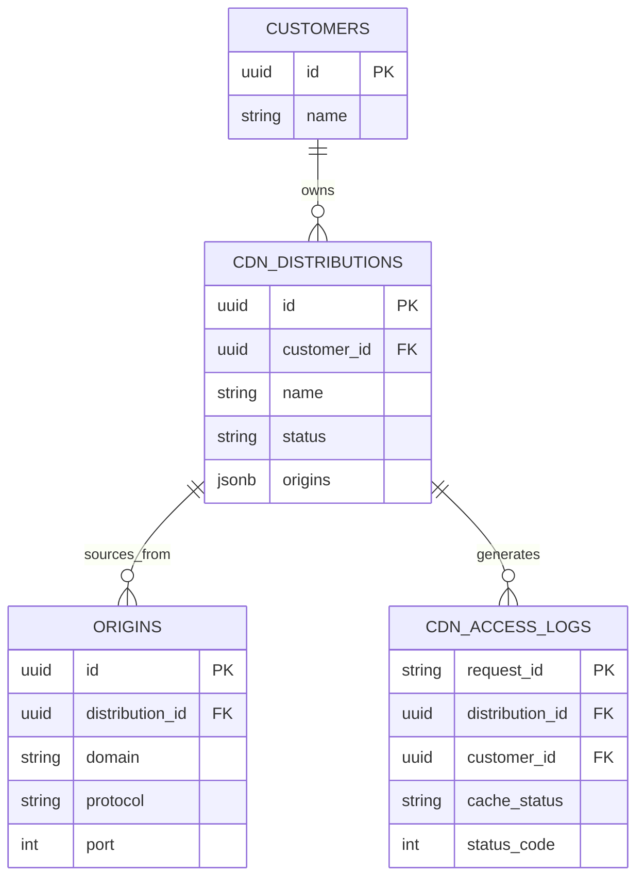
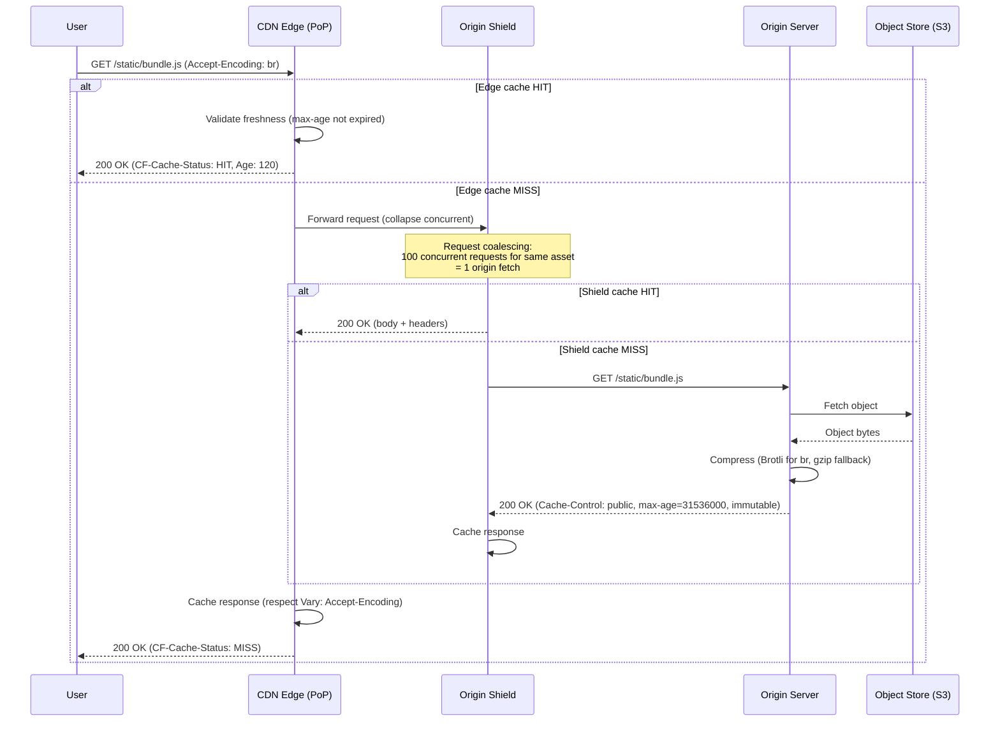
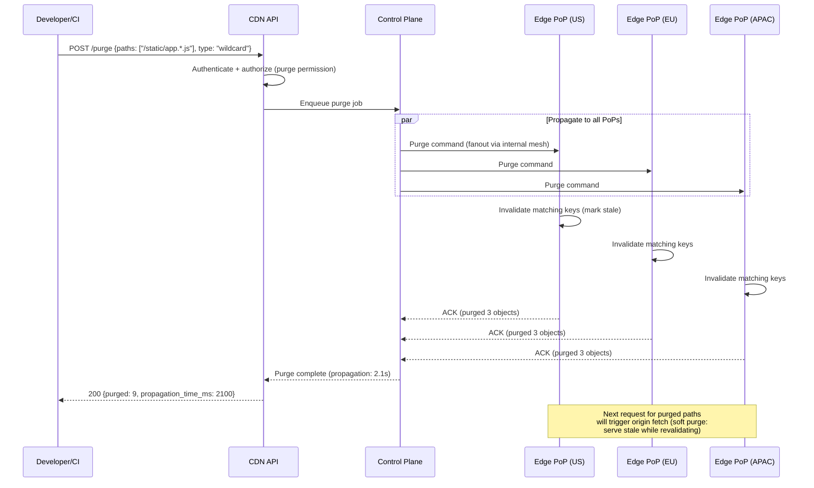

# Design a CDN and Static Asset Platform

## 1. Functional Requirements

- **Content Distribution**: Serve static assets (images, CSS, JS, fonts, videos) from edge servers closest to users
- **Edge Caching**: Cache content at globally distributed Points of Presence (PoPs) with configurable TTL and cache policies
- **Origin Shield**: Intermediate cache layer that consolidates cache misses before reaching origin, reducing origin load
- **Cache Invalidation/Purge**: Instantly or near-instantly purge cached content globally via API (single URL, prefix, tag-based)
- **Signed URLs/Tokens**: Generate time-limited, IP-restricted URLs for access control on private content
- **Geo-Routing**: Route users to nearest PoP based on geographic location and network latency
- **Custom Domain & SSL**: Support custom domains with automated TLS certificate provisioning (ACME/Let's Encrypt)
- **Image/Video Optimization**: On-the-fly image resizing, format conversion (WebP, AVIF), quality adjustment, video transcoding
- **Compression**: Automatic Brotli/gzip compression based on Accept-Encoding header
- **Edge Compute**: Run lightweight logic at edge (Lambda@Edge / Workers) for A/B testing, header manipulation, redirects
- **Real-time Analytics**: Per-URL, per-region, per-status-code metrics with sub-minute granularity
- **DDoS Protection**: Absorb volumetric attacks at edge; rate limiting per IP/region
- **Multi-Origin Support**: Route to different origins based on path patterns (e.g., /images → S3, /api → backend)
- **Failover**: Automatic origin failover when primary origin is unhealthy
- **Streaming**: HTTP Live Streaming (HLS) and DASH segment caching for video delivery
- **Range Requests**: Support byte-range requests for large file downloads and video seeking
- **Upload Acceleration**: Optimize uploads from edge to origin using persistent connections and TCP tuning
- **Versioned Assets**: Support content-addressed URLs (hash in filename) for infinite caching
- **HTTP/2 & HTTP/3**: Modern protocol support including QUIC for reduced connection latency
- **Admin API**: Configure origins, cache rules, purge content, manage SSL, view analytics

## 2. Non-Functional Requirements

| NFR | Target |
|-----|--------|
| **Availability** | 99.99% globally (52.6 min downtime/year) |
| **Latency (cache hit)** | < 20ms globally (served from edge) |
| **Latency (cache miss)** | < 200ms (shield hit) or < 500ms (origin fetch) |
| **Cache Hit Ratio** | > 95% for static assets, > 80% for dynamic-cacheable content |
| **Throughput** | 100+ Tbps aggregate capacity across all PoPs |
| **Purge Propagation** | < 5 seconds global purge completion |
| **TLS Handshake** | < 50ms (edge termination) |
| **Scalability** | 200+ PoPs globally, auto-scaling per PoP |
| **Durability** | Zero content loss at origin; edge is cache only |
| **Bandwidth** | 10+ Gbps per PoP sustained, 100+ Gbps burst |

## 3. Capacity Estimation

### Assumptions
| Dimension | Value |
|-----------|-------|
| Total requests served/day | 50 billion |
| Unique objects cached | 10 billion |
| Average object size | 100 KB |
| Number of PoPs | 200 globally |
| Storage per PoP | 500 TB SSD + 2 PB HDD |
| Origin servers | 50 (behind origin shield) |
| Customers (websites/apps) | 100,000 |
| Custom domains | 500,000 |
| Cache hit ratio | 95% |

### QPS/RPS Calculation
```
Total daily requests: 50 billion
Average RPS: 50B / 86,400 = 578,703 RPS (global)
Peak RPS: 578K × 5 = ~3 million RPS
Per PoP average: 578K / 200 PoPs = 2,894 RPS
Per PoP peak: ~15,000 RPS

Cache hits: 95% × 3M = 2.85M RPS served from edge
Cache misses to shield: 5% × 3M = 150K RPS
Shield hits (90%): 135K RPS served from shield cache
Origin fetches: 15K RPS reaching actual origin
```

### Network Bandwidth Estimation
```
Edge egress (cache hits): 2.85M RPS × 100 KB = 285 GB/s = 2.28 Tbps
Per-PoP average egress: 285 GB/s / 200 = 1.425 GB/s = 11.4 Gbps
Per-PoP peak egress: ~50 Gbps

Origin → Shield bandwidth: 15K RPS × 100 KB = 1.5 GB/s = 12 Gbps
Shield → Edge (miss backfill): 150K × 100 KB = 15 GB/s = 120 Gbps

Total CDN egress: ~2.4 Tbps sustained, ~10 Tbps peak
```

### Storage Estimation
```
Total unique content: 10B objects × 100 KB = 1 PB (if all stored)
Hot content (20% = 80% traffic): 2B objects × 100 KB = 200 TB
Per-PoP hot storage: 200 TB / 200 PoPs = 1 TB (fits in SSD!)
Per-PoP warm storage: ~50 TB (HDD tier)

Metadata per object: 512 bytes × 10B objects = 5 TB global metadata
Per-PoP metadata: ~25 GB (fits in RAM for fast lookup)

Log data/day: 50B requests × 200 bytes = 10 TB/day
Retained: 30 days = 300 TB log storage
```

### Infrastructure Sizing
```
Per PoP:
  - Edge servers: 20-100 (depending on traffic)
  - SSD storage: 500 TB (NVMe)
  - HDD storage: 2 PB (cold tier)
  - RAM per server: 256 GB (metadata + hot cache)
  - Network: 400 Gbps total PoP capacity
  - DNS resolver: 2 local resolvers

Global:
  - 200 PoPs × 50 servers avg = 10,000 edge servers
  - Origin shields: 10 locations × 20 servers = 200 shield servers
  - Control plane: 5 regions × 3 nodes = 15 control nodes
  - Analytics pipeline: Kafka (30 brokers), ClickHouse (20 nodes), Flink (10 nodes)
```

## 4. Data Modeling

### Entity-Relationship Diagram



### Database Choice
| Data | Store | Why |
|------|-------|-----|
| CDN configuration (origins, rules, domains) | PostgreSQL (control plane) | Strong consistency, complex queries |
| Cached objects | Local SSD/HDD + RAM (per PoP) | Ultra-low latency serving |
| Cache metadata/index | In-memory hash map + SSD index | O(1) lookup for billions of keys |
| TLS certificates | Vault + edge distribution | Secure storage, fast edge access |
| Analytics (access logs) | Kafka → ClickHouse | High-volume append, OLAP queries |
| Real-time metrics | Prometheus/Mimir (per PoP) + Grafana | Time-series, alerting |
| Purge coordination | Redis Pub/Sub + Kafka | Fast global propagation |
| DNS records | Custom DNS infra (Anycast) | Ultra-low latency resolution |

### Schema Design

#### `cdn_distributions` (PostgreSQL - Control Plane)
```sql
CREATE TABLE cdn_distributions (
    id UUID PRIMARY KEY DEFAULT gen_random_uuid(),
    customer_id UUID NOT NULL REFERENCES customers(id),
    name VARCHAR(255) NOT NULL,
    status VARCHAR(20) DEFAULT 'deploying', -- deploying, active, suspended, deleted
    domains TEXT[] NOT NULL,                 -- ["cdn.example.com", "assets.example.com"]
    origins JSONB NOT NULL,
    -- [{"id":"orig_1","domain":"origin.example.com","protocol":"https",
    --   "port":443,"path":"/","weight":100,"backup":false,
    --   "health_check":{"path":"/health","interval_s":30}}]
    cache_behaviors JSONB NOT NULL DEFAULT '[]',
    -- [{"path_pattern":"/images/*","ttl_s":86400,"compress":true,
    --   "allowed_methods":["GET","HEAD"],"cache_key":{"include_query":false}}]
    default_cache_behavior JSONB NOT NULL,
    ssl_config JSONB,
    -- {"certificate_id":"cert_xxx","min_protocol":"TLSv1.2","http2":true,"http3":true}
    security_config JSONB,
    -- {"waf_enabled":true,"geo_restrictions":{"type":"whitelist","countries":["US","EU"]},
    --  "signed_url":{"enabled":true,"key_id":"key_xxx","expiry_s":3600}}
    edge_compute JSONB,                    -- Lambda@Edge function references
    custom_error_pages JSONB,
    logging_config JSONB,                  -- {"enabled":true,"bucket":"s3://logs/","prefix":"cdn/"}
    version INT DEFAULT 1,
    created_at TIMESTAMPTZ DEFAULT NOW(),
    updated_at TIMESTAMPTZ DEFAULT NOW()
);

CREATE INDEX idx_distributions_customer ON cdn_distributions(customer_id);
CREATE INDEX idx_distributions_domains ON cdn_distributions USING GIN(domains);
CREATE INDEX idx_distributions_status ON cdn_distributions(status) WHERE status = 'active';
```

#### `cache_entries` (Per-PoP In-Memory/SSD Index)
```
// In-memory hash map structure per PoP
struct CacheEntry {
    cache_key: [u8; 32],        // SHA-256 of (host + path + vary_key)
    content_hash: [u8; 20],     // SHA-1 of actual content (dedup)
    size_bytes: u64,
    content_type: u16,          // Enum: image/jpeg, text/css, etc.
    encoding: u8,               // none, gzip, br
    status_code: u16,           // 200, 301, 404 (negative caching)
    ttl_expires_at: u64,        // Unix timestamp
    stale_while_revalidate: u32,// Seconds past TTL to serve stale
    created_at: u64,
    last_accessed_at: u64,      // For LRU eviction
    access_count: u32,          // For LFU/popularity tracking
    storage_tier: u8,           // 0=RAM, 1=SSD, 2=HDD
    disk_offset: u64,           // Offset in storage file
    vary_headers: u16,          // Bitmap of Vary header combinations
    flags: u16,                 // immutable, no-store, private, etc.
}
// Size per entry: ~128 bytes
// 10B objects globally, ~50M per PoP = 6.4 GB RAM for index (fits!)
```

#### `purge_events` (Kafka topic / Redis)
```json
{
    "purge_id": "purge_abc123",
    "distribution_id": "dist_xyz",
    "type": "prefix",           // exact, prefix, tag, wildcard, all
    "pattern": "/images/product/*",
    "tags": ["product-123"],
    "issued_at": "2024-01-15T10:00:00Z",
    "issued_by": "customer_api",
    "soft_purge": false,        // true = mark stale but serve while revalidate
    "priority": "high"
}
```

#### `access_logs` (ClickHouse)
```sql
CREATE TABLE cdn_access_logs (
    timestamp DateTime64(3),
    pop_id LowCardinality(String),
    distribution_id UUID,
    customer_id UUID,
    request_id String,
    client_ip IPv4,
    client_country LowCardinality(String),
    client_city String,
    method LowCardinality(String),
    host String,
    path String,
    query_string String,
    protocol LowCardinality(String),     -- HTTP/1.1, HTTP/2, HTTP/3
    status_code UInt16,
    bytes_sent UInt64,
    request_time_ms UInt32,
    cache_status LowCardinality(String), -- HIT, MISS, STALE, BYPASS, ERROR
    cache_tier LowCardinality(String),   -- ram, ssd, hdd, shield, origin
    origin_time_ms Nullable(UInt32),
    tls_version LowCardinality(String),
    user_agent String,
    referer String,
    content_type LowCardinality(String),
    edge_function_time_ms Nullable(UInt16)
) ENGINE = MergeTree()
PARTITION BY toYYYYMMDD(timestamp)
ORDER BY (customer_id, distribution_id, timestamp)
TTL timestamp + INTERVAL 30 DAY
SETTINGS index_granularity = 8192;

-- Materialized views for real-time dashboards
CREATE MATERIALIZED VIEW cdn_traffic_per_minute
ENGINE = SummingMergeTree()
PARTITION BY toYYYYMMDD(minute)
ORDER BY (customer_id, pop_id, minute, cache_status, status_code)
AS SELECT
    customer_id,
    pop_id,
    toStartOfMinute(timestamp) AS minute,
    cache_status,
    status_code,
    count() AS requests,
    sum(bytes_sent) AS bytes,
    avg(request_time_ms) AS avg_latency
FROM cdn_access_logs
GROUP BY customer_id, pop_id, minute, cache_status, status_code;
```

#### `origin_configs` (PostgreSQL)
```sql
CREATE TABLE origins (
    id UUID PRIMARY KEY DEFAULT gen_random_uuid(),
    distribution_id UUID NOT NULL REFERENCES cdn_distributions(id),
    domain VARCHAR(500) NOT NULL,
    protocol VARCHAR(10) DEFAULT 'https',
    port INT DEFAULT 443,
    path_prefix VARCHAR(255) DEFAULT '/',
    weight INT DEFAULT 100,
    is_backup BOOLEAN DEFAULT false,
    custom_headers JSONB,                   -- Headers to send to origin
    timeout_connect_ms INT DEFAULT 5000,
    timeout_read_ms INT DEFAULT 30000,
    keepalive_connections INT DEFAULT 64,
    health_check_config JSONB,
    retry_config JSONB DEFAULT '{"attempts":3,"codes":[502,503,504]}',
    ssl_verify BOOLEAN DEFAULT true,
    enabled BOOLEAN DEFAULT true,
    created_at TIMESTAMPTZ DEFAULT NOW()
);

CREATE INDEX idx_origins_distribution ON origins(distribution_id, enabled);
```

## 5. High-Level Design

### Architecture Diagram

```
┌─────────────────────────────────────────────────────────────────────────────────┐
│                              END USERS (Global)                                   │
└──────────────────────────────────────┬──────────────────────────────────────────┘
                                       │
                                       ▼
┌─────────────────────────────────────────────────────────────────────────────────┐
│                     DNS RESOLUTION (Anycast + GeoDNS)                             │
│                                                                                  │
│  ┌─────────────────┐  ┌─────────────────┐  ┌─────────────────┐                │
│  │ Authoritative   │  │ Anycast DNS     │  │ EDNS Client     │                │
│  │ DNS Servers     │  │ (BGP Anycast)   │  │ Subnet (ECS)    │                │
│  │ (per-PoP)       │  │                 │  │ For geo-accuracy │                │
│  └─────────────────┘  └─────────────────┘  └─────────────────┘                │
│                                                                                  │
│  Resolution: cdn.example.com → IP of nearest PoP (based on latency/geo)        │
└──────────────────────────────────────┬──────────────────────────────────────────┘
                                       │
         ┌─────────────────────────────┼─────────────────────────────┐
         │                             │                             │
         ▼                             ▼                             ▼
┌─────────────────┐         ┌─────────────────┐         ┌─────────────────┐
│   PoP: NYC      │         │   PoP: London   │         │   PoP: Tokyo    │
│   (US-East)     │         │   (EU-West)     │         │   (AP-East)     │
└────────┬────────┘         └────────┬────────┘         └────────┬────────┘
         │                           │                           │
         ▼                           ▼                           ▼
┌─────────────────────────────────────────────────────────────────────────────────┐
│                           EDGE PoP ARCHITECTURE                                   │
│                                                                                  │
│  ┌──────────────────────────────────────────────────────────────────────────┐  │
│  │                         EDGE SERVER (per PoP × N servers)                  │  │
│  │                                                                            │  │
│  │  ┌────────────┐  ┌────────────┐  ┌────────────┐  ┌────────────┐        │  │
│  │  │ TLS Engine │  │ HTTP/2/3   │  │ Edge       │  │ WAF/DDoS   │        │  │
│  │  │ (BoringSSL)│  │ Processor  │  │ Compute    │  │ Filter     │        │  │
│  │  │            │  │ (QUIC)     │  │ (V8/Wasm)  │  │            │        │  │
│  │  └────────────┘  └────────────┘  └────────────┘  └────────────┘        │  │
│  │                                                                            │  │
│  │  ┌─────────────────────────────────────────────────────────────────────┐ │  │
│  │  │                    CACHE LOOKUP ENGINE                                │ │  │
│  │  │                                                                       │ │  │
│  │  │  ┌───────────┐    ┌───────────┐    ┌───────────┐                   │ │  │
│  │  │  │  L1 RAM   │───>│  L2 SSD   │───>│  L3 HDD   │                   │ │  │
│  │  │  │  Cache    │    │  Cache    │    │  Cache    │                   │ │  │
│  │  │  │  (64 GB)  │    │  (500 TB) │    │  (2 PB)  │                   │ │  │
│  │  │  │  ~1ms     │    │  ~5ms     │    │  ~20ms   │                   │ │  │
│  │  │  └───────────┘    └───────────┘    └───────────┘                   │ │  │
│  │  │         │                                                            │ │  │
│  │  │         │ MISS                                                       │ │  │
│  │  │         ▼                                                            │ │  │
│  │  │  ┌───────────────────────────────────────────┐                      │ │  │
│  │  │  │         REQUEST COLLAPSING                 │                      │ │  │
│  │  │  │  (Coalesce multiple cache misses for      │                      │ │  │
│  │  │  │   same object into single origin fetch)   │                      │ │  │
│  │  │  └───────────────────────────────────────────┘                      │ │  │
│  │  └─────────────────────────────────────────────────────────────────────┘ │  │
│  └──────────────────────────────────────────────────────────────────────────┘  │
│                                                                                  │
│  Telemetry: metrics + logs shipped async to central analytics                   │
└──────────────────────────────────────┬──────────────────────────────────────────┘
                                       │ CACHE MISS
                                       ▼
┌─────────────────────────────────────────────────────────────────────────────────┐
│                          ORIGIN SHIELD TIER                                       │
│                                                                                  │
│  ┌─────────────────┐  ┌─────────────────┐  ┌─────────────────┐                │
│  │ Shield: US-East │  │ Shield: EU-West  │  │ Shield: AP-South│                │
│  │ (Virginia)      │  │ (Frankfurt)      │  │ (Mumbai)        │                │
│  │                 │  │                 │  │                 │                │
│  │ 200 TB cache    │  │ 200 TB cache    │  │ 200 TB cache    │                │
│  │ Consolidates    │  │ Consolidates    │  │ Consolidates    │                │
│  │ misses from     │  │ misses from     │  │ misses from     │                │
│  │ 60+ edge PoPs   │  │ 50+ edge PoPs   │  │ 40+ edge PoPs   │                │
│  └────────┬────────┘  └────────┬────────┘  └────────┬────────┘                │
│           │                    │                    │                           │
│  Shield hit ratio: ~90% (only 10% of edge misses reach origin)                 │
└──────────────────────────────────────┬──────────────────────────────────────────┘
                                       │ SHIELD MISS (~15K RPS)
                                       ▼
┌─────────────────────────────────────────────────────────────────────────────────┐
│                         CUSTOMER ORIGINS                                          │
│                                                                                  │
│  ┌─────────────────┐  ┌─────────────────┐  ┌─────────────────┐                │
│  │ AWS S3 Bucket   │  │ Custom Origin   │  │ Cloud Storage   │                │
│  │ (Static Assets) │  │ (App Server)    │  │ (GCS/Azure Blob)│                │
│  └─────────────────┘  └─────────────────┘  └─────────────────┘                │
└─────────────────────────────────────────────────────────────────────────────────┘

┌─────────────────────────────────────────────────────────────────────────────────┐
│                         CONTROL PLANE (Global)                                    │
│                                                                                  │
│  ┌──────────────┐  ┌──────────────┐  ┌──────────────┐  ┌──────────────┐      │
│  │ Config API   │  │ Certificate  │  │ Purge        │  │ Analytics    │      │
│  │ Service      │  │ Manager      │  │ Orchestrator │  │ Pipeline     │      │
│  │              │  │ (ACME/Vault) │  │              │  │              │      │
│  │ CRUD configs │  │ Auto-renewal │  │ Fan-out to   │  │ Kafka →      │      │
│  │ Validate     │  │ Provisioning │  │ all PoPs     │  │ Flink →      │      │
│  │ Propagate    │  │ Distribution │  │ within 5s    │  │ ClickHouse   │      │
│  └──────────────┘  └──────────────┘  └──────────────┘  └──────────────┘      │
│                                                                                  │
│  ┌──────────────┐  ┌──────────────┐  ┌──────────────┐                        │
│  │ DNS Manager  │  │ Health       │  │ Billing      │                        │
│  │              │  │ Monitor      │  │ Metering     │                        │
│  │ Zone mgmt   │  │              │  │              │                        │
│  │ Geo routing  │  │ Origin checks│  │ Usage agg.   │                        │
│  │ Failover     │  │ PoP health   │  │ Invoice gen  │                        │
│  └──────────────┘  └──────────────┘  └──────────────┘                        │
└─────────────────────────────────────────────────────────────────────────────────┘
```

### Microservice Patterns

| Pattern | Application |
|---------|-------------|
| **Hierarchical Caching** | L1 (RAM) → L2 (SSD) → L3 (HDD) → Shield → Origin |
| **Request Collapsing/Coalescing** | Single origin fetch for concurrent cache misses of same URL |
| **Sidecar** | Metrics agent, log shipper as sidecars on edge servers |
| **Fan-out/Fan-in** | Purge command fans out to all PoPs; health aggregates fan in |
| **CQRS** | Control plane (writes) separate from data plane (reads/serving) |
| **Event-Driven** | Config changes → event → all PoPs subscribe and apply |
| **Circuit Breaker** | Origin circuit breaker on repeated failures |
| **Stale-While-Revalidate** | Serve stale content while fetching fresh in background |

## 6. Low-Level Design (LLD)

### Public APIs

**Create Distribution**
```http
POST /api/v1/distributions
Authorization: Bearer <token>
Idempotency-Key: <uuid>

Request:
{
    "name": "my-app-assets",
    "domains": ["cdn.myapp.com", "assets.myapp.com"],
    "origins": [{
        "domain": "my-origin.s3.amazonaws.com",
        "protocol": "https",
        "port": 443,
        "path": "/",
        "shield_region": "us-east-1"
    }],
    "default_cache_behavior": {
        "ttl_default_s": 86400,
        "ttl_max_s": 31536000,
        "ttl_min_s": 0,
        "compress": true,
        "allowed_methods": ["GET", "HEAD", "OPTIONS"],
        "cache_key": {
            "include_query_strings": true,
            "query_string_whitelist": ["v", "w", "h"],
            "include_headers": ["Accept-Encoding"],
            "include_cookies": []
        },
        "viewer_protocol_policy": "redirect-to-https"
    },
    "cache_behaviors": [{
        "path_pattern": "/images/*",
        "ttl_default_s": 2592000,
        "image_optimization": {
            "enabled": true,
            "webp_auto": true,
            "avif_auto": true,
            "quality": 85,
            "resize_on_demand": true
        }
    }],
    "ssl": {
        "auto_certificate": true,
        "min_protocol": "TLSv1.2",
        "http2": true,
        "http3": true
    },
    "security": {
        "waf_enabled": true,
        "signed_urls": {
            "enabled": true,
            "expiry_seconds": 3600
        },
        "geo_restriction": {
            "type": "none"
        }
    },
    "logging": {
        "enabled": true,
        "real_time": true,
        "fields": ["timestamp", "client_ip", "method", "uri", "status", "bytes", "cache_status"]
    }
}

Response: 201 Created
{
    "id": "dist_7f8g9h0j",
    "name": "my-app-assets",
    "status": "deploying",
    "domain_name": "d1a2b3c4.cdn.platform.net",
    "custom_domains": ["cdn.myapp.com", "assets.myapp.com"],
    "ssl_status": "provisioning",
    "estimated_deploy_time_s": 120,
    "created_at": "2024-01-15T10:00:00Z"
}
```

**Purge Cache**
```http
POST /api/v1/distributions/{dist_id}/purge
Authorization: Bearer <token>

Request:
{
    "type": "prefix",
    "paths": ["/images/product/123*"],
    "soft_purge": false
}

Response: 202 Accepted
{
    "purge_id": "purge_abc123",
    "status": "propagating",
    "estimated_completion_s": 5,
    "affected_pops": 200,
    "created_at": "2024-01-15T10:00:00Z"
}
```

**Generate Signed URL**
```http
POST /api/v1/distributions/{dist_id}/signed-url
Authorization: Bearer <token>

Request:
{
    "url": "https://cdn.myapp.com/videos/premium/movie.mp4",
    "expires_at": "2024-01-15T12:00:00Z",
    "ip_restriction": "203.0.113.0/24",
    "custom_policy": {
        "allow_range_requests": true,
        "max_views": 5
    }
}

Response: 200 OK
{
    "signed_url": "https://cdn.myapp.com/videos/premium/movie.mp4?Expires=1705320000&Signature=abc123&Key-Pair-Id=KXYZ",
    "expires_at": "2024-01-15T12:00:00Z"
}
```

**Get Real-Time Analytics**
```http
GET /api/v1/distributions/{dist_id}/analytics?from=2024-01-15T09:00:00Z&to=2024-01-15T10:00:00Z&granularity=1m&metrics=requests,bytes,cache_hit_ratio,p95_latency&group_by=pop,status_code

Response: 200 OK
{
    "distribution_id": "dist_7f8g9h0j",
    "period": {"from": "...", "to": "..."},
    "granularity": "1m",
    "data": [{
        "timestamp": "2024-01-15T09:00:00Z",
        "requests": 125000,
        "bytes": 12500000000,
        "cache_hit_ratio": 0.96,
        "p95_latency_ms": 15,
        "breakdown": {
            "by_pop": {"NYC": 35000, "LON": 28000, "TKY": 22000},
            "by_status": {"200": 120000, "304": 3000, "404": 1500, "5xx": 500},
            "by_cache": {"HIT": 120000, "MISS": 5000, "STALE": 250}
        }
    }]
}
```

**Image Optimization (On-the-fly)**
```http
GET /images/product/123.jpg?w=400&h=300&format=webp&quality=80
Host: cdn.myapp.com

Response: 200 OK
Content-Type: image/webp
Cache-Control: public, max-age=31536000, immutable
X-Cache: HIT
X-Cache-Tier: ssd
X-Image-Original-Size: 2048x1536
X-Image-Transformed-Size: 400x300
CF-Cache-Status: HIT

<optimized image bytes>
```

### Internal APIs (Edge ↔ Control Plane)

```protobuf
syntax = "proto3";
package cdn.edge.v1;

// Config distribution to edge nodes
service ConfigService {
    rpc WatchConfigs(WatchRequest) returns (stream ConfigUpdate);
    rpc GetConfig(GetConfigRequest) returns (DistributionConfig);
    rpc AckConfig(AckConfigRequest) returns (AckResponse);
}

// Purge propagation
service PurgeService {
    rpc SubscribePurges(SubscribeRequest) returns (stream PurgeCommand);
    rpc AckPurge(AckPurgeRequest) returns (AckResponse);
    rpc ReportPurgeStatus(PurgeStatusReport) returns (AckResponse);
}

// Health reporting
service HealthService {
    rpc ReportHealth(stream HealthReport) returns (stream HealthCommand);
    rpc GetPopStatus(PopStatusRequest) returns (PopStatus);
}

// Telemetry
service TelemetryService {
    rpc StreamMetrics(stream MetricsBatch) returns (AckResponse);
    rpc StreamLogs(stream LogBatch) returns (AckResponse);
}
```

### Design Patterns

| Pattern | Where Applied |
|---------|--------------|
| **Strategy** | Eviction algorithms (LRU, LFU, ARC, SLRU) configurable per tier |
| **Proxy** | Edge acts as reverse proxy to origin |
| **Observer** | Config/purge events push to all edge nodes |
| **Decorator** | Image optimization, compression as decorators on response |
| **Flyweight** | Shared metadata for duplicate content across distributions |
| **Command** | Purge operations as commands with undo capability (soft purge) |
| **Template Method** | Cache key computation with customizable components |
| **Builder** | Signed URL builder with policy composition |

## 7. Architecture Components Deep Dive

### 7.1 DNS (Anycast + GeoDNS)
```
Resolution strategy:
1. User queries cdn.myapp.com
2. CNAME to d1a2b3c4.cdn.platform.net
3. Platform authoritative DNS (anycast):
   - Check EDNS Client Subnet (ECS) for user's actual subnet
   - If no ECS: use resolver's IP for geo estimation
   - Map to nearest healthy PoP IP
   - Return A/AAAA record with TTL=60s

Anycast implementation:
- Same IP prefix (/24) announced from all PoPs via BGP
- Internet routing naturally directs to nearest PoP
- On PoP failure: BGP withdrawal → traffic shifts in seconds
- For fine-grained control: GeoDNS overrides Anycast

Performance:
- DNS resolution time: < 10ms (resolved at local PoP)
- TTL strategy: 60s for failover flexibility vs DNS query reduction
```

### 7.2 Edge Cache Engine
```
Multi-tier cache architecture per server:

Tier 0 - Kernel page cache (OS-managed):
  - Frequently accessed file data cached by OS
  - Size: available RAM after application
  - Latency: < 0.5ms

Tier 1 - Application RAM cache (hot objects):
  - Capacity: 64 GB per server
  - Objects: ~640K objects at 100 KB average
  - Eviction: ARC (Adaptive Replacement Cache)
  - Latency: < 1ms
  - Use case: HTML, small images, API responses

Tier 2 - NVMe SSD (warm objects):
  - Capacity: 500 TB per PoP (~25 TB per server)
  - Eviction: SLRU (Segmented LRU)
  - Latency: 1-5ms
  - Use case: Large images, CSS/JS bundles, video segments

Tier 3 - HDD (cold objects):
  - Capacity: 2 PB per PoP
  - Eviction: LRU
  - Latency: 10-30ms
  - Use case: Long-tail content, large video files

Promotion/demotion:
  - On access: HDD → SSD if accessed 2+ times in 1 hour
  - On access: SSD → RAM if accessed 5+ times in 5 minutes
  - Demotion: TTL-based or LRU pressure
```

### 7.3 Cache Key Construction
```
Standard cache key = SHA-256(
    host +
    path +
    sorted_included_query_params +
    vary_header_values +
    protocol_flag +
    encoding_preference
)

Examples:
  URL: https://cdn.myapp.com/images/cat.jpg?w=400&h=300&v=2
  Vary: Accept-Encoding
  
  Cache key = SHA-256("cdn.myapp.com/images/cat.jpg?h=300&w=400&v=2|br")
  
  Different keys for:
  - Different dimensions (w, h)
  - Different encoding (br vs gzip vs identity)
  - Same URL with different Vary header values
```

### 7.4 Origin Shield
```
Purpose: Reduce origin load by 90%
  Without shield: 200 PoPs × 5% miss rate = 200 origin requests per object
  With shield: 3 shields × 10% miss rate = ~3 origin requests per object

Architecture:
- 3-10 shield locations worldwide (major cloud regions)
- Each edge PoP assigned to nearest shield
- Shield maintains large cache (200+ TB each)
- Shield-to-origin: persistent connections, connection pooling

Request flow on cache miss:
  1. Edge server misses in local cache
  2. Edge checks: is this PoP the assigned shield? 
     - If yes: fetch from origin directly
     - If no: forward to assigned shield
  3. Shield checks its cache
     - HIT: return to edge (populate edge cache)
     - MISS: fetch from origin, cache, return to edge
  4. Request collapsing at shield: only 1 in-flight request per URL

Shield selection:
  - Static mapping: each PoP → nearest shield (configured)
  - Dynamic: based on latency measurements (updated hourly)
  - Override: customer can pin shield location for data residency
```

### 7.5 Purge System
```
Purge types:
1. Exact URL purge: delete single cached object
2. Prefix purge: delete all objects matching path prefix
3. Tag purge: delete all objects tagged with specific key (surrogate keys)
4. Wildcard purge: regex-based purge (expensive, rate-limited)
5. Soft purge: mark stale (serve stale-while-revalidate)
6. Full purge: delete everything for a distribution

Global purge propagation:
  1. API receives purge request → validate → persist to Kafka
  2. Purge orchestrator reads from Kafka
  3. Fan-out via Redis Pub/Sub to all PoPs (parallel)
  4. Each PoP's purge agent processes:
     - Exact: O(1) hash table lookup and delete
     - Prefix: scan index by prefix (bloom filter pre-check)
     - Tag: reverse index (tag → list of cache keys)
  5. PoP acknowledges completion
  6. Orchestrator tracks: complete when all PoPs ack
  
Performance:
  - Target: < 5 seconds for global propagation
  - Exact purge: < 1 second (just hash lookup)
  - Prefix purge: < 5 seconds (parallel scan)
  - Tag purge: < 2 seconds (index lookup)

Tag (Surrogate Key) implementation:
  - Objects tagged at origin via headers: Surrogate-Key: product-123 category-shoes
  - Reverse index per PoP: tag → Set<cache_key>
  - On purge by tag: lookup set, delete all matching entries
  - Used by e-commerce: purge all pages showing product X when price changes
```

### 7.6 Image Optimization Pipeline
```
On-the-fly processing pipeline:
  1. Parse transformation params from URL (w, h, format, quality, fit)
  2. Cache key includes transform params
  3. On cache miss:
     a. Fetch original from cache or origin
     b. Apply transformations:
        - Resize (lanczos/bicubic resampling)
        - Format convert (JPEG → WebP/AVIF based on Accept header)
        - Quality adjustment (85 default, configurable)
        - Crop/fit modes (cover, contain, fill, inside, outside)
        - Filters (blur, sharpen, grayscale)
     c. Cache transformed result
  4. Serve optimized version

Technology: libvips (40x faster than ImageMagick, low memory)
  - Process in streaming mode (no full image in memory)
  - Parallel processing: 1 image per CPU core
  - Max image size: 100 MP (safety limit)
  - Timeout: 10 seconds per transformation

Smart format selection:
  Client sends: Accept: image/avif, image/webp, image/*
  Decision tree:
    1. AVIF if supported AND image has transparency/gradients → smallest
    2. WebP if supported → 30% smaller than JPEG
    3. JPEG for photos (if no alpha) → universal support
    4. PNG for graphics with transparency → lossless
```

### 7.7 Edge Compute Runtime
```
Technology: V8 Isolates (like Cloudflare Workers) or WebAssembly

Capabilities:
- Run on every request at edge (sub-millisecond cold start)
- Modify request: rewrite URL, add headers, A/B test routing
- Modify response: add security headers, inject HTML
- Generate response: serve entirely from edge logic
- Subrequests: fetch from cache or origin within worker

Isolation:
- V8 isolate per request (not full container/VM)
- Memory limit: 128 MB per execution
- CPU time limit: 50ms (wall time can be higher with I/O)
- No file system access, limited APIs

Use cases:
- A/B testing: route to different origins based on cookie/hash
- Geolocation-based content: different content per country
- Bot detection: challenge suspicious traffic
- Authentication: validate JWT at edge before forwarding
- URL rewriting: clean URLs → S3 paths
- Rate limiting: per-IP counters at edge
```

## 8. Deep Dive: Cache Eviction & Admission

### 8.1 Adaptive Replacement Cache (ARC)
```
ARC maintains 4 lists:
  T1: Recently used (one-hit wonders)
  T2: Frequently used (popular items)
  B1: Ghost list of recently evicted from T1
  B2: Ghost list of recently evicted from T2

Adaptation:
  - If access in B1 (was recent, got evicted): increase T1 target size
  - If access in B2 (was frequent, got evicted): increase T2 target size
  - Self-tuning: adapts to workload without manual tuning

Why ARC for CDN:
  - Handles mixed workloads (one-shot + repeated access)
  - Resistant to scan pollution (bulk crawlers)
  - No tuning parameters required
  - O(1) operations
```

### 8.2 Cache Admission Policy
```
Problem: Large objects with single access waste cache space
Solution: TinyLFU admission policy

Implementation:
  - Approximate frequency counter: Count-Min Sketch (4 rows × 2M counters = 8 MB)
  - New item admitted only if estimated frequency > victim's frequency
  - Window for fresh items: 1% of cache (gives new items a chance)

CDN-specific admission rules:
  1. Never cache if response has Cache-Control: no-store
  2. Don't cache > 100MB objects in RAM tier (go to SSD directly)
  3. Don't cache if origin returned Vary: * 
  4. Negative cache 404s for 60s (prevent origin hammering)
  5. Minimum cache time: 5s (don't cache sub-second TTL objects)
```

### 8.3 Stale-While-Revalidate
```
Cache-Control: max-age=300, stale-while-revalidate=600

Behavior:
  0-300s: serve from cache (FRESH)
  300-900s: serve from cache (STALE) + async revalidate in background
  900s+: block, fetch from origin, then serve

Implementation:
  - On stale hit: start background revalidation goroutine
  - Dedup: only one revalidation per key (singleflight)
  - If origin returns 304: extend TTL, keep cached body
  - If origin returns 200: replace cached object, reset TTL
  - If origin fails: continue serving stale (increase stale window)

Benefits for CDN:
  - Users never see latency spike on TTL expiry
  - Origin traffic smoothed (no thundering herd on popular items)
  - Graceful degradation if origin goes down
```

## 9. Component Optimization

### 9.1 Request Collapsing (Coalescing)
```
Problem: Popular URL expires → 10,000 requests hit simultaneously → all miss → 10,000 origin fetches

Solution: Request collapsing
  1. First request for URL → fetch from origin (leader)
  2. Subsequent requests for same URL (within window) → queue behind leader
  3. When leader gets response → fan out to all waiters
  4. Only 1 origin fetch instead of 10,000

Implementation:
  - Concurrent hashmap: URL → Promise<Response>
  - Lock-free: CAS operation to become leader
  - Timeout: if leader takes > 30s, next waiter becomes new leader
  - Max waiters: 10,000 per URL (shed excess with 503)

Performance impact:
  - Reduces origin load by 99% during thundering herd
  - Adds 0ms for cache hits, ~origin_latency for collapsed misses
  - Memory: ~1 KB per outstanding collapsed request
```

### 9.2 TCP/TLS Optimization
```
TCP optimizations:
  - Initial congestion window: 10 MSS (instead of default 3)
  - TCP Fast Open: reduce connection latency by 1 RTT
  - BBR congestion control: better bandwidth utilization
  - Keepalive: 60s idle timeout (reuse connections)
  - Connection coalescing: HTTP/2 over single connection

TLS optimizations:
  - TLS 1.3: 1-RTT handshake (vs 2-RTT for TLS 1.2)
  - 0-RTT resumption: zero additional latency for repeat visitors
  - OCSP stapling: avoid client-side revocation check
  - Session tickets: distributed across PoP (shared key)
  - Early Hints (103): send preload headers before response

QUIC/HTTP/3:
  - UDP-based: no head-of-line blocking at transport layer
  - 0-RTT connection: first packet carries data
  - Connection migration: seamless on network change (mobile)
  - Built-in encryption: always encrypted
  - Multiplexing without HoL blocking
```

### 9.3 Compression Pipeline
```
Content negotiation:
  Accept-Encoding: br, gzip, deflate
  
Decision:
  1. Brotli (br): 20-26% better compression than gzip
     - Use for text/* content (HTML, CSS, JS, SVG, JSON)
     - Pre-compress at quality 11 (max) for static assets
     - On-the-fly at quality 4-6 for dynamic content
  2. Gzip: universal fallback
     - Level 6 for dynamic, level 9 for pre-compressed static
  3. No compression for: images, videos, already-compressed (zip/gz)

Pre-compression strategy:
  - On cache store: generate both br and gzip variants
  - Store 3 copies: identity, gzip, brotli
  - Serve based on Accept-Encoding (variant selection)
  
Savings:
  - JavaScript: ~70% smaller with Brotli
  - HTML: ~60% smaller
  - CSS: ~65% smaller
  - JSON: ~75% smaller
```

### 9.4 Consistent Hashing for PoP-Internal Distribution
```
Within a PoP (20-100 servers), distribute URLs across servers:

Consistent hash ring:
  - Each server has 100 virtual nodes on ring
  - URL hash maps to ring position → nearest server
  - Benefits: same URL always hits same server → higher per-server hit rate
  - On server failure: only 1/N URLs remap

Tiered hashing:
  Layer 1: L4 LB routes to any L7 server (ECMP)
  Layer 2: L7 server checks local cache
  Layer 3: On local miss, hash URL to "owner" server within PoP
  Layer 4: Owner checks its cache (higher hit rate due to consistent hashing)
  Layer 5: If all PoP misses, go to shield/origin
```

### 9.5 Async Log Pipeline
```
┌──────────┐    ┌──────────┐    ┌──────────┐    ┌──────────────┐
│  Edge    │───>│  Vector  │───>│  Kafka   │───>│  ClickHouse  │
│  Server  │    │  (Agent) │    │  (Buffer)│    │  (Analytics) │
│          │    │          │    │          │    │              │
│ In-memory│    │ Batch    │    │ 12 broker│    │ 20 nodes     │
│ ring buf │    │ compress │    │ 100 part │    │ 30 day retain│
│ 16MB     │    │ send     │    │ 7d retain│    │              │
└──────────┘    └──────────┘    └──────────┘    └──────────────┘
                                      │
                                      ▼
                              ┌──────────────┐
                              │  S3/Iceberg  │
                              │  (Archive)   │
                              │              │
                              │ Parquet files│
                              │ 1 year retain│
                              │ Athena query │
                              └──────────────┘

Volume handling:
  - 50B requests/day × 200 bytes = 10 TB/day
  - Edge buffering: 16 MB ring buffer (drop oldest on overflow)
  - Vector batching: 64 KB batches or 1s flush interval
  - Kafka: 100 partitions, 3x replication, zstd compression → ~3 TB/day stored
  - ClickHouse: columnar compression → ~1 TB/day stored on disk
  - Iceberg on S3: ~500 GB/day (Parquet, high compression)
```

### 9.6 Bandwidth Optimization
```
HTTP Range requests (video seeking):
  - Support byte-range requests for partial content
  - Cache partial responses (slice storage)
  - Slice size: 1 MB chunks for video content
  - On seek: serve from cached slice, don't re-fetch entire file
  
Slice caching:
  Large file (1 GB video) → 1024 × 1 MB slices
  Each slice cached independently
  Benefits:
    - Partial cache: first 10% of video cached (most users don't finish)
    - Parallel fetch: multiple slices from origin simultaneously
    - Memory efficient: don't buffer entire file

Delta encoding / Edge Side Includes (ESI):
  - Cache page template at edge
  - Only fetch dynamic fragments from origin
  - Assemble at edge before serving
  - Reduces origin bandwidth by 80% for semi-dynamic pages
```

## 10. Observability

### 10.1 Metrics
```yaml
# Traffic metrics
cdn_requests_total{pop, distribution, cache_status, status_code, protocol}    # Counter
cdn_bytes_sent_total{pop, distribution, cache_status}                         # Counter
cdn_request_duration_seconds{pop, distribution, tier}                         # Histogram

# Cache performance
cdn_cache_hit_ratio{pop, distribution}                                       # Gauge
cdn_cache_objects{pop, tier}                                                  # Gauge
cdn_cache_bytes{pop, tier}                                                   # Gauge
cdn_cache_evictions_total{pop, tier, reason}                                 # Counter
cdn_cache_admissions_total{pop, tier}                                        # Counter

# Origin metrics
cdn_origin_requests_total{distribution, origin, status}                      # Counter
cdn_origin_latency_seconds{distribution, origin}                             # Histogram
cdn_origin_bytes_total{distribution, origin, direction}                      # Counter
cdn_origin_errors_total{distribution, origin, error_type}                    # Counter
cdn_shield_hit_ratio{shield_region}                                          # Gauge

# Purge metrics
cdn_purge_requests_total{distribution, type}                                 # Counter
cdn_purge_propagation_seconds{type}                                          # Histogram
cdn_purge_objects_deleted_total{pop, type}                                   # Counter

# TLS/Protocol
cdn_tls_handshakes_total{pop, version, resumed}                             # Counter
cdn_quic_connections_total{pop}                                              # Counter
cdn_http_version_requests{pop, version}                                      # Counter

# Edge compute
cdn_edge_function_invocations_total{distribution, function}                  # Counter
cdn_edge_function_duration_ms{distribution, function}                        # Histogram
cdn_edge_function_errors_total{distribution, function, error}                # Counter

# System
cdn_pop_bandwidth_bps{pop, direction}                                        # Gauge
cdn_pop_cpu_usage{pop, server}                                               # Gauge
cdn_pop_disk_usage{pop, tier}                                                # Gauge
cdn_pop_connections_active{pop}                                              # Gauge
```

### 10.2 Alerting
```yaml
# Critical
- alert: PopDown
  expr: cdn_pop_healthy == 0
  for: 1m
  severity: critical
  description: "PoP {{ $labels.pop }} is completely down"

- alert: CacheHitRatioLow
  expr: cdn_cache_hit_ratio < 0.7
  for: 10m
  severity: critical
  description: "Cache hit ratio below 70% - possible cache poisoning or config error"

- alert: OriginOverload
  expr: rate(cdn_origin_requests_total[5m]) > 50000
  for: 5m
  severity: critical
  description: "Origin receiving > 50K RPS - cache miss storm"

- alert: HighErrorRate
  expr: rate(cdn_requests_total{status_code=~"5.."}[5m]) / rate(cdn_requests_total[5m]) > 0.01
  for: 2m
  severity: critical

# Warning
- alert: DiskNearFull
  expr: cdn_pop_disk_usage > 0.9
  for: 30m
  severity: warning

- alert: PurgeSlowPropagation
  expr: cdn_purge_propagation_seconds > 10
  for: 5m
  severity: warning

- alert: CertExpiryApproaching
  expr: cdn_cert_expiry_seconds < 14 * 24 * 3600
  severity: warning
```

### 10.3 Dashboards
```
Dashboard 1: Global CDN Overview
- World map: RPS heatmap by PoP location
- Total bandwidth (Tbps)
- Global cache hit ratio
- Error rate by region
- Top 10 distributions by traffic

Dashboard 2: Per-Distribution Performance
- RPS and bandwidth trend
- Cache hit ratio by content type
- Origin health and latency
- Popular URLs (top-N)
- Error breakdown

Dashboard 3: PoP Health
- Per-PoP: CPU, disk, memory, bandwidth
- Cache tier fill rates
- Eviction rates
- Connection counts
- Failover events

Dashboard 4: Origin Protection
- Requests reaching origin (should be low)
- Origin error rate
- Shield hit ratio
- Request collapsing effectiveness
- Origin bandwidth savings
```

## 11. Considerations and Assumptions

### Assumptions
1. **Global presence**: Company can deploy or lease PoP infrastructure in 200+ locations
2. **BGP capable**: Can announce IP prefixes via BGP for anycast
3. **Peering agreements**: Established peering with major ISPs for optimal routing
4. **Hardware ownership**: Own or lease physical hardware at edge (not running on public cloud at edge)
5. **Origin varies**: Customers have diverse origins (S3, GCS, custom servers, multiple origins)
6. **Traffic profile**: 80% of traffic served by 20% of content (power law)
7. **Content type**: Primarily static (images, JS, CSS, video segments); some dynamic-cacheable

### Design Decisions

| Decision | Chosen | Alternative | Rationale |
|----------|--------|-------------|-----------|
| Edge caching | Custom cache engine (Varnish-inspired) | Nginx proxy cache | Better control over eviction, tiering, and admission policies |
| Storage tier | RAM → SSD → HDD | RAM + SSD only | HDD cost-effective for long-tail content at scale |
| Purge mechanism | Kafka + Redis Pub/Sub | HTTP push to every PoP | Kafka for durability + reliability; Redis for speed |
| Image optimization | libvips at edge | Centralized image service | Reduces origin load, lower latency for users |
| Edge compute | V8 Isolates | Containers (Docker) | Sub-millisecond cold start, better isolation density |
| DNS | Anycast + GeoDNS hybrid | Pure anycast | Anycast for speed, GeoDNS for precision |
| Protocol | HTTP/3 (QUIC) priority | HTTP/2 only | 0-RTT, no HoL blocking, mobile connection migration |

### Trade-offs

| Trade-off | Benefit | Cost |
|-----------|---------|------|
| Multi-tier cache | Cost-effective storage of long-tail | Complexity, occasional HDD latency |
| Origin shield | 90% less origin load | Additional hop latency on shield miss |
| Request collapsing | Protects origin from thundering herd | Slight added latency for collapsed requests |
| Aggressive edge caching | Low latency, low origin load | Stale content risk, purge complexity |
| Edge compute | Low latency personalization | Security surface, resource limits |
| HTTP/3 (QUIC) | Better mobile experience | UDP firewalling issues, CPU overhead |
| Pre-compression | Optimal compression ratio | 3x storage (identity + gzip + brotli) |

### Failure Modes

| Failure | Impact | Mitigation |
|---------|--------|------------|
| PoP hardware failure | Reduced capacity at location | Anycast → traffic auto-routes to next PoP |
| Entire PoP offline | Users routed to next nearest | BGP withdrawal in < 30s; DNS update |
| Origin unavailable | New content can't be fetched | Serve stale-if-error, show cached version |
| Cache corruption | Wrong content served | Content verification (ETag/checksum), automatic purge |
| DNS failure | Users can't resolve CDN domain | Anycast DNS HA, multiple NS records |
| Purge failure | Stale content persists | Retry mechanism, alerting, manual intervention |
| DDoS attack | PoP saturation | Anycast absorption, rate limiting, upstream scrubbing |
| Certificate expiry | TLS errors for all users | Auto-renewal 30 days early, multiple alerting |
| Config propagation failure | Incorrect routing at edge | Rollback mechanism, canary deployment to 1 PoP first |

### Cost Model
```
Major cost drivers:
1. Bandwidth egress (60% of cost): $0.02-0.08 per GB depending on region
   - Monthly: 285 GB/s × 86400 × 30 × $0.04 = ~$29.5M/month
   - Optimization: peering agreements reduce cost 50-80%

2. Infrastructure (25% of cost): 
   - 10,000 servers × $500/month amortized = $5M/month
   - Colocation fees: $2M/month across 200 PoPs

3. Storage (10% of cost):
   - SSD: 200 PoPs × 500 TB × $0.10/GB/month = $10M/month amortized
   - But SSD is capital expense, not per-GB monthly

4. Operations (5% of cost):
   - Engineering team, NOC, support
   
Revenue model:
  - Per-GB egress pricing to customers
  - Per-request pricing
  - Feature tiers (optimization, edge compute, WAF)
  - Committed use discounts
```

---

## Sequence Diagrams

### 1. Cache Hit/Miss Flow



### 2. Cache Invalidation Flow


