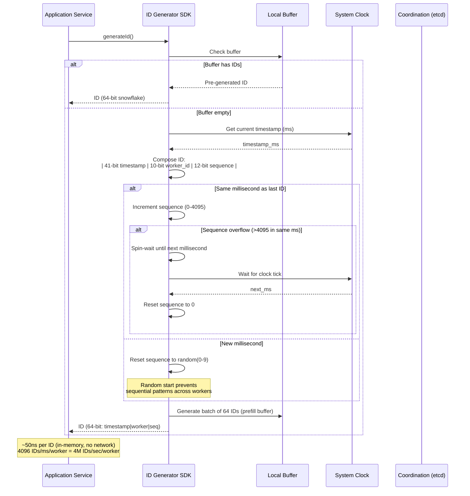
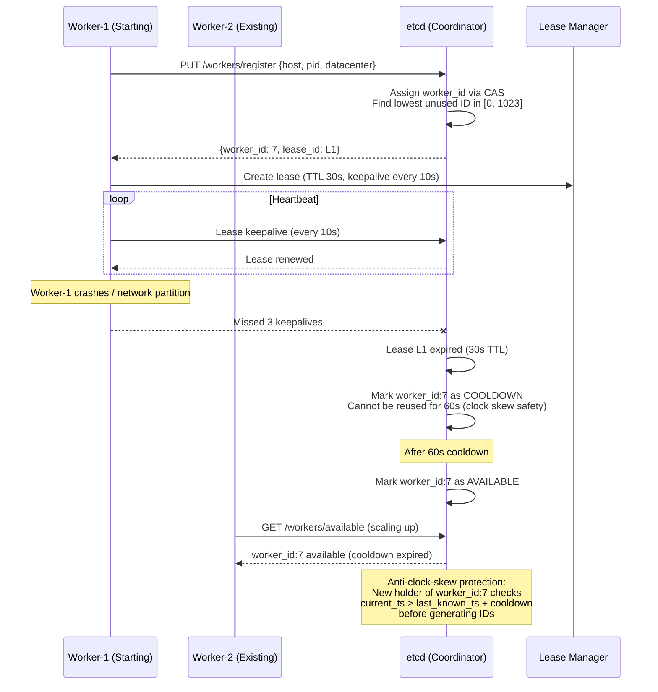

# Design a Unique ID Generator (like Snowflake)

## 1. Functional Requirements

| # | Requirement | Description |
|---|---|---|
| FR-1 | Generate globally unique IDs | Produce 64-bit IDs that are guaranteed unique across all data centers, regions, and workers without coordination at generation time |
| FR-2 | Time-sortable (roughly ordered) | IDs embed a timestamp so that sorting by ID approximates chronological order (k-sorted within clock skew bounds) |
| FR-3 | High-throughput generation | Each worker node must generate up to 4,096 IDs per millisecond (12-bit sequence) without blocking |
| FR-4 | Worker identity allocation | Assign and lease unique worker IDs (10-bit = 1,024 workers) with automatic reclamation on failure |
| FR-5 | Clock drift detection and handling | Detect backward clock jumps, refuse to generate IDs during drift, and alert operators |
| FR-6 | ID decomposition / parsing | Given an ID, extract timestamp, datacenter, worker, and sequence for debugging and routing |
| FR-7 | Multi-region support | Operate independently per region with non-overlapping worker ID spaces |
| FR-8 | Batch ID generation | Allow clients to request N IDs in a single call for bulk ingestion workloads |
| FR-9 | Admin operations | Register/deregister workers, view allocation map, quarantine misbehaving workers, force epoch bump |
| FR-10 | Audit and telemetry | Publish generation metrics, clock drift events, and allocation changes for observability |

---

## 2. Non-Functional Requirements

| # | Requirement | Target |
|---|---|---|
| NFR-1 | Latency | p50 < 1 ms, p99 < 5 ms for single ID generation (in-process); p99 < 10 ms for network call to ID service |
| NFR-2 | Availability | 99.999% for the data-plane (generation path); 99.99% for control-plane (worker registration) |
| NFR-3 | Throughput | 4M+ IDs/sec per cluster (1,024 workers × 4,096 IDs/ms) |
| NFR-4 | Uniqueness guarantee | Zero collisions — mathematically guaranteed by design (non-overlapping bit partitions) |
| NFR-5 | Monotonicity | Strictly monotonic per-worker; roughly time-ordered globally (k-sorted within max clock skew) |
| NFR-6 | Scalability | Horizontal scaling by adding workers; no single coordination point during generation |
| NFR-7 | Fault tolerance | Worker crash does not block other workers; lease expiry reclaims worker IDs |
| NFR-8 | Clock drift tolerance | Handle up to 5 seconds of backward drift via wait-out; alert and halt beyond threshold |
| NFR-9 | Durability of allocation | Worker ID assignments survive control-plane restarts (persisted in quorum store) |
| NFR-10 | Operational transparency | Full visibility into allocation map, clock health, generation rates, and drift events |

---

## 3. Estimation

### Assumptions

| Dimension | Value |
|---|---|
| DAU (services requesting IDs) | 500 internal services |
| Peak ID generation rate | 4M IDs/sec cluster-wide |
| Average ID generation rate | 500K IDs/sec |
| Workers per region | 256 (using 10-bit space across 4 regions) |
| Regions | 4 (us-east, us-west, eu-west, ap-south) |
| ID size | 8 bytes (64-bit integer) |
| Epoch duration | 69 years from custom epoch (2^41 ms) |

### QPS / RPS Estimation

```
Per-worker capacity:
  - 4,096 IDs/ms × 1,000 ms = 4,096,000 IDs/sec per worker
  - Practical target: 50% utilization = 2M IDs/sec per worker

Cluster capacity (256 workers per region):
  - 256 × 4,096,000 = ~1.05B IDs/sec theoretical max per region
  - Practical: 256 × 500K = 128M IDs/sec per region at low utilization

Network service mode (gRPC):
  - Single ID request: 50K RPS per service instance
  - Batch (100 IDs): 5K RPS per instance = 500K IDs/sec per instance
```

### Storage Estimation

```
Worker allocation metadata:
  - 1,024 workers × 256 bytes/record = 256 KB (trivial)

Audit/telemetry events:
  - 1M events/day × 512 bytes = 512 MB/day
  - 30-day retention: ~15 GB

Generated IDs are NOT stored centrally:
  - IDs flow to downstream services that store them as primary keys
  - No central ID registry needed
```

### Bandwidth Estimation

```
Single ID response: 8 bytes (ID) + 50 bytes (headers) ≈ 58 bytes
Batch response (100 IDs): 800 bytes + 50 bytes ≈ 850 bytes

At 500K IDs/sec average:
  - Single mode: 500K × 58 = 29 MB/sec
  - Batch mode: 5K × 850 = 4.25 MB/sec

Network overhead is negligible for this service.
```

---

## 4. Data Modeling

### Entity-Relationship Diagram

```mermaid
erDiagram
    WORKER_LEASES {
        smallint datacenter_id PK
        smallint worker_id PK
        string hostname
        uuid lease_token
        string state
        timestamp lease_expires_at
    }
    CLOCK_DRIFT_EVENTS {
        bigint id PK
        smallint worker_id FK
        smallint datacenter_id FK
        int drift_ms
        string action_taken
    }
    ALLOCATION_HISTORY {
        bigint id PK
        smallint worker_id FK
        smallint datacenter_id FK
        string event_type
        uuid lease_token
    }

    WORKER_LEASES ||--o{ CLOCK_DRIFT_EVENTS : experiences
    WORKER_LEASES ||--o{ ALLOCATION_HISTORY : tracked_in
```



### ID Bit Layout (64-bit Snowflake Format)

```
┌─────────────────────────────────────────────────────────────────────┐
│  0  │  1-41 (41 bits)  │ 42-46 (5 bits) │ 47-51 (5 bits) │ 52-63 (12 bits) │
│sign │   timestamp_ms   │  datacenter_id │   worker_id    │    sequence     │
└─────────────────────────────────────────────────────────────────────┘

- Bit 0: Sign bit (always 0 for positive IDs)
- Bits 1-41: Milliseconds since custom epoch (supports ~69.7 years)
- Bits 42-46: Datacenter ID (0-31, supports 32 data centers)
- Bits 47-51: Worker ID within datacenter (0-31, supports 32 workers/DC)
- Bits 52-63: Sequence number (0-4095, supports 4096 IDs/ms/worker)

Alternative layout (Twitter's original):
- 1 bit: unused sign
- 41 bits: timestamp (ms since epoch)
- 10 bits: machine ID (1024 machines total)
- 12 bits: sequence (4096 per ms per machine)
```

### Custom Epoch

```
Custom epoch: 2024-01-01T00:00:00Z (1704067200000 ms Unix)
Duration: 2^41 ms = 2,199,023,255,552 ms ≈ 69.73 years
Expiry: ~2093 (plenty of runway)
```

### Database Schema

#### Worker Registry (PostgreSQL / etcd)

```sql
CREATE TABLE worker_leases (
    worker_id       SMALLINT NOT NULL,          -- 0-1023 (10-bit space)
    datacenter_id   SMALLINT NOT NULL,          -- 0-31 (5-bit space)
    region          VARCHAR(20) NOT NULL,
    hostname        VARCHAR(255) NOT NULL,
    ip_address      INET NOT NULL,
    service_name    VARCHAR(100) NOT NULL,
    lease_token     UUID NOT NULL,              -- Fencing token
    lease_granted_at TIMESTAMPTZ NOT NULL DEFAULT NOW(),
    lease_expires_at TIMESTAMPTZ NOT NULL,
    last_heartbeat  TIMESTAMPTZ NOT NULL DEFAULT NOW(),
    clock_offset_ms INTEGER DEFAULT 0,          -- Detected NTP offset
    state           VARCHAR(20) NOT NULL DEFAULT 'ACTIVE',  -- ACTIVE, SUSPENDED, EXPIRED
    version         INTEGER NOT NULL DEFAULT 1,
    created_at      TIMESTAMPTZ NOT NULL DEFAULT NOW(),
    updated_at      TIMESTAMPTZ NOT NULL DEFAULT NOW(),
    
    PRIMARY KEY (datacenter_id, worker_id),
    CONSTRAINT unique_lease_token UNIQUE (lease_token),
    CONSTRAINT valid_state CHECK (state IN ('ACTIVE', 'SUSPENDED', 'EXPIRED', 'DRAINING'))
);

-- Index for lease expiry scanning
CREATE INDEX idx_worker_leases_expires ON worker_leases (lease_expires_at) WHERE state = 'ACTIVE';
-- Index for heartbeat monitoring
CREATE INDEX idx_worker_leases_heartbeat ON worker_leases (last_heartbeat) WHERE state = 'ACTIVE';
-- Index for region queries
CREATE INDEX idx_worker_leases_region ON worker_leases (region, state);
```

#### Clock Drift Events

```sql
CREATE TABLE clock_drift_events (
    id              BIGSERIAL PRIMARY KEY,
    worker_id       SMALLINT NOT NULL,
    datacenter_id   SMALLINT NOT NULL,
    detected_at     TIMESTAMPTZ NOT NULL DEFAULT NOW(),
    drift_ms        INTEGER NOT NULL,           -- Negative = backward jump
    action_taken    VARCHAR(50) NOT NULL,        -- WAITED, HALTED, EPOCH_BUMPED
    resolution_at   TIMESTAMPTZ,
    details_json    JSONB,
    
    CONSTRAINT fk_worker FOREIGN KEY (datacenter_id, worker_id) 
        REFERENCES worker_leases(datacenter_id, worker_id)
) PARTITION BY RANGE (detected_at);

-- Monthly partitions for retention management
CREATE TABLE clock_drift_events_2024_01 PARTITION OF clock_drift_events
    FOR VALUES FROM ('2024-01-01') TO ('2024-02-01');
```

#### Allocation History (Audit)

```sql
CREATE TABLE allocation_history (
    id              BIGSERIAL PRIMARY KEY,
    worker_id       SMALLINT NOT NULL,
    datacenter_id   SMALLINT NOT NULL,
    event_type      VARCHAR(30) NOT NULL,       -- ALLOCATED, RENEWED, RELEASED, EXPIRED, SUSPENDED
    actor           VARCHAR(100) NOT NULL,       -- service_name or admin_user
    lease_token     UUID NOT NULL,
    occurred_at     TIMESTAMPTZ NOT NULL DEFAULT NOW(),
    metadata_json   JSONB,
    
    CONSTRAINT fk_worker_alloc FOREIGN KEY (datacenter_id, worker_id) 
        REFERENCES worker_leases(datacenter_id, worker_id)
) PARTITION BY RANGE (occurred_at);

CREATE INDEX idx_alloc_history_worker ON allocation_history (datacenter_id, worker_id, occurred_at DESC);
```

### Indexing Strategy

| Index | Purpose | Type |
|---|---|---|
| `PK(datacenter_id, worker_id)` | Primary lookup for lease checks | Clustered |
| `idx_worker_leases_expires` | Lease reaper finds expired leases | Partial (state=ACTIVE) |
| `idx_worker_leases_heartbeat` | Health monitor finds stale workers | Partial (state=ACTIVE) |
| `idx_worker_leases_region` | Region-scoped admin queries | Composite |
| `idx_alloc_history_worker` | Audit trail per worker | Composite, DESC |
| `idx_clock_drift_worker_time` | Drift analysis per worker | Composite |

---

## 5. High-Level Design (HLD)

### Architecture Overview

```
┌─────────────────────────────────────────────────────────────────────────┐
│                          CLIENT SERVICES                                  │
│  (Order Service, Payment Service, Message Service, Event Service, etc.)  │
└────────────────────────────┬────────────────────────────────────────────┘
                             │
              ┌──────────────┼──────────────┐
              │              │              │
              ▼              ▼              ▼
┌─────────────────┐ ┌─────────────────┐ ┌─────────────────┐
│   ID Service    │ │   ID Service    │ │   ID Service    │
│   Instance 1    │ │   Instance 2    │ │   Instance N    │
│                 │ │                 │ │                 │
│ ┌─────────────┐ │ │ ┌─────────────┐ │ │ ┌─────────────┐ │
│ │ ID Generator│ │ │ │ ID Generator│ │ │ │ ID Generator│ │
│ │ (in-memory) │ │ │ │ (in-memory) │ │ │ │ (in-memory) │ │
│ │             │ │ │ │             │ │ │ │             │ │
│ │ worker_id=1 │ │ │ │ worker_id=2 │ │ │ │ worker_id=N │ │
│ │ sequence=0  │ │ │ │ sequence=0  │ │ │ │ sequence=0  │ │
│ │ last_ts=... │ │ │ │ last_ts=... │ │ │ │ last_ts=... │ │
│ └─────────────┘ │ │ └─────────────┘ │ │ └─────────────┘ │
│                 │ │                 │ │                 │
│ ┌─────────────┐ │ │ ┌─────────────┐ │ │ ┌─────────────┐ │
│ │Clock Monitor│ │ │ │Clock Monitor│ │ │ │Clock Monitor│ │
│ └─────────────┘ │ │ └─────────────┘ │ │ └─────────────┘ │
└────────┬────────┘ └────────┬────────┘ └────────┬────────┘
         │                   │                   │
         │    Heartbeat / Lease Renewal          │
         ▼                   ▼                   ▼
┌─────────────────────────────────────────────────────────────┐
│                    CONTROL PLANE                              │
│                                                              │
│  ┌──────────────┐  ┌──────────────┐  ┌──────────────────┐  │
│  │Worker Registry│  │Lease Manager │  │Clock Drift Handler│  │
│  │(etcd/ZK/PG)  │  │              │  │                   │  │
│  └──────────────┘  └──────────────┘  └──────────────────┘  │
│                                                              │
│  ┌──────────────┐  ┌──────────────┐  ┌──────────────────┐  │
│  │Lease Reaper  │  │Health Monitor│  │  Admin API        │  │
│  └──────────────┘  └──────────────┘  └──────────────────┘  │
└──────────────────────────────┬──────────────────────────────┘
                               │
                               ▼
┌─────────────────────────────────────────────────────────────┐
│                    OBSERVABILITY                              │
│                                                              │
│  ┌────────────┐  ┌────────────┐  ┌────────────────────┐    │
│  │Prometheus  │  │  Grafana   │  │  AlertManager      │    │
│  │(metrics)   │  │(dashboards)│  │  (clock drift,     │    │
│  │            │  │            │  │   lease expiry)     │    │
│  └────────────┘  └────────────┘  └────────────────────┘    │
│                                                              │
│  ┌────────────┐  ┌────────────────────────────────────┐    │
│  │  Kafka     │  │  ClickHouse (drift analytics,      │    │
│  │(events)    │  │   generation patterns, auditing)    │    │
│  └────────────┘  └────────────────────────────────────┘    │
└─────────────────────────────────────────────────────────────┘
```

### Component Breakdown

| Component | Responsibility |
|---|---|
| **ID Service (Data Plane)** | Generates IDs in-memory using assigned worker_id; no coordination per ID |
| **ID Generator Core** | Bit manipulation: combines timestamp + datacenter + worker + sequence |
| **Clock Monitor** | Polls NTP, detects drift, triggers halt or wait-out logic |
| **Worker Registry** | Stores worker_id assignments with lease tokens in quorum store |
| **Lease Manager** | Grants, renews, and revokes worker ID leases with fencing tokens |
| **Lease Reaper** | Background job that expires stale leases (missed heartbeats) |
| **Health Monitor** | Checks heartbeat freshness, clock sync status, generation rate anomalies |
| **Admin API** | Manual allocation, suspension, force-release, epoch management |
| **Kafka (Event Bus)** | Publishes allocation events, drift events, and generation telemetry |
| **Prometheus + Grafana** | Metrics collection and dashboards for generation rate, drift, latency |
| **ClickHouse** | Analytics on ID generation patterns, collision detection, audit queries |

### Deployment Modes

```
Mode 1: Embedded Library (Preferred for lowest latency)
┌───────────────────────────┐
│  Application Service      │
│  ┌─────────────────────┐  │
│  │  Snowflake Library  │  │  ← In-process, sub-microsecond
│  │  (worker_id=7)      │  │
│  └─────────────────────┘  │
└───────────────────────────┘

Mode 2: Sidecar (Container/Pod co-located)
┌───────────────────────────┐
│  Pod                      │
│  ┌───────┐ ┌───────────┐ │
│  │ App   │ │ ID Sidecar│ │  ← Unix socket, <1ms
│  │       │◄┤ worker=7  │ │
│  └───────┘ └───────────┘ │
└───────────────────────────┘

Mode 3: Network Service (Centralized, easiest to operate)
┌───────────┐     gRPC      ┌────────────────┐
│ App       │──────────────►│ ID Service     │  ← 2-5ms network
│ Service   │               │ (pool of       │
└───────────┘               │  workers)      │
                            └────────────────┘
```

### Multi-Region Architecture

```
┌─────────────────────────────────────────────────────────────┐
│                    GLOBAL CONTROL PLANE                       │
│              (Worker ID Range Allocation)                     │
│                                                              │
│  us-east: workers 0-255    │  us-west: workers 256-511      │
│  eu-west: workers 512-767  │  ap-south: workers 768-1023    │
└─────────────────────────────────────────────────────────────┘

Each region operates independently after receiving its worker ID range.
No cross-region coordination during ID generation.
```

---

## 6. Low-Level Design (LLD)

### Core ID Generation Algorithm

```java
public class SnowflakeGenerator {
    // Bit allocation
    private static final int TIMESTAMP_BITS = 41;
    private static final int DATACENTER_BITS = 5;
    private static final int WORKER_BITS = 5;
    private static final int SEQUENCE_BITS = 12;

    // Max values
    private static final long MAX_DATACENTER_ID = (1L << DATACENTER_BITS) - 1; // 31
    private static final long MAX_WORKER_ID = (1L << WORKER_BITS) - 1;         // 31
    private static final long MAX_SEQUENCE = (1L << SEQUENCE_BITS) - 1;        // 4095

    // Bit shifts
    private static final int WORKER_SHIFT = SEQUENCE_BITS;                      // 12
    private static final int DATACENTER_SHIFT = SEQUENCE_BITS + WORKER_BITS;    // 17
    private static final int TIMESTAMP_SHIFT = SEQUENCE_BITS + WORKER_BITS + DATACENTER_BITS; // 22

    // Custom epoch: 2024-01-01T00:00:00Z
    private static final long CUSTOM_EPOCH = 1704067200000L;

    // State
    private final long datacenterId;
    private final long workerId;
    private long lastTimestamp = -1L;
    private long sequence = 0L;

    // Clock drift config
    private static final long MAX_BACKWARD_DRIFT_MS = 5000; // 5 seconds
    private static final long WAIT_THRESHOLD_MS = 2;         // Wait out small drifts

    public SnowflakeGenerator(long datacenterId, long workerId) {
        if (datacenterId < 0 || datacenterId > MAX_DATACENTER_ID)
            throw new IllegalArgumentException("Datacenter ID out of range");
        if (workerId < 0 || workerId > MAX_WORKER_ID)
            throw new IllegalArgumentException("Worker ID out of range");
        this.datacenterId = datacenterId;
        this.workerId = workerId;
    }

    public synchronized long nextId() {
        long currentTimestamp = currentTimeMs();

        // Clock moved backward
        if (currentTimestamp < lastTimestamp) {
            long drift = lastTimestamp - currentTimestamp;
            if (drift <= WAIT_THRESHOLD_MS) {
                // Small drift: spin-wait
                while (currentTimestamp <= lastTimestamp) {
                    currentTimestamp = currentTimeMs();
                }
            } else if (drift <= MAX_BACKWARD_DRIFT_MS) {
                // Medium drift: wait with sleep
                try { Thread.sleep(drift); } catch (InterruptedException e) {
                    Thread.currentThread().interrupt();
                    throw new IdGenerationException("Interrupted during clock drift wait");
                }
                currentTimestamp = currentTimeMs();
                if (currentTimestamp < lastTimestamp) {
                    throw new ClockDriftException(drift);
                }
            } else {
                // Large drift: refuse to generate
                throw new ClockDriftException(drift);
            }
        }

        // Same millisecond: increment sequence
        if (currentTimestamp == lastTimestamp) {
            sequence = (sequence + 1) & MAX_SEQUENCE;
            if (sequence == 0) {
                // Sequence exhausted for this ms, wait for next ms
                currentTimestamp = waitNextMillis(lastTimestamp);
            }
        } else {
            // New millisecond: reset sequence
            sequence = 0L;
        }

        lastTimestamp = currentTimestamp;

        // Compose the 64-bit ID
        return ((currentTimestamp - CUSTOM_EPOCH) << TIMESTAMP_SHIFT)
             | (datacenterId << DATACENTER_SHIFT)
             | (workerId << WORKER_SHIFT)
             | sequence;
    }

    public long[] nextIds(int count) {
        long[] ids = new long[count];
        for (int i = 0; i < count; i++) {
            ids[i] = nextId();
        }
        return ids;
    }

    private long waitNextMillis(long lastTs) {
        long ts = currentTimeMs();
        while (ts <= lastTs) {
            ts = currentTimeMs();
        }
        return ts;
    }

    private long currentTimeMs() {
        return System.currentTimeMillis();
    }
}
```

### ID Parser / Decomposer

```java
public class SnowflakeParser {
    private static final long CUSTOM_EPOCH = 1704067200000L;

    public record IdComponents(
        long timestamp,      // Unix timestamp in ms
        long datacenterId,
        long workerId,
        long sequence,
        Instant generatedAt
    ) {}

    public static IdComponents parse(long id) {
        long timestamp = (id >> 22) + CUSTOM_EPOCH;
        long datacenterId = (id >> 17) & 0x1F;  // 5 bits
        long workerId = (id >> 12) & 0x1F;       // 5 bits
        long sequence = id & 0xFFF;              // 12 bits

        return new IdComponents(
            timestamp,
            datacenterId,
            workerId,
            sequence,
            Instant.ofEpochMilli(timestamp)
        );
    }
}
```

### Worker Lease Manager

```java
public class WorkerLeaseManager {
    private static final Duration LEASE_DURATION = Duration.ofMinutes(5);
    private static final Duration HEARTBEAT_INTERVAL = Duration.ofSeconds(30);
    private static final Duration RENEWAL_BUFFER = Duration.ofMinutes(1);

    private final WorkerRegistryStore store; // etcd or PostgreSQL
    private final String hostname;
    private final String serviceName;
    private volatile WorkerLease currentLease;
    private final ScheduledExecutorService scheduler;

    public WorkerLease acquireLease(int datacenterId) {
        // 1. Find available worker_id in this datacenter
        List<Integer> available = store.findAvailableWorkerIds(datacenterId);
        if (available.isEmpty()) {
            throw new NoAvailableWorkerException(datacenterId);
        }

        // 2. Try to claim with CAS (compare-and-swap)
        for (int candidateId : available) {
            UUID leaseToken = UUID.randomUUID();
            boolean claimed = store.tryClaimWorker(
                datacenterId, candidateId, hostname, serviceName,
                leaseToken, LEASE_DURATION
            );
            if (claimed) {
                WorkerLease lease = new WorkerLease(
                    datacenterId, candidateId, leaseToken,
                    Instant.now(), Instant.now().plus(LEASE_DURATION)
                );
                this.currentLease = lease;
                startHeartbeat();
                return lease;
            }
        }
        throw new NoAvailableWorkerException(datacenterId);
    }

    private void startHeartbeat() {
        scheduler.scheduleAtFixedRate(() -> {
            try {
                WorkerLease lease = currentLease;
                if (lease == null) return;

                // Renew before expiry
                if (Instant.now().isAfter(lease.expiresAt().minus(RENEWAL_BUFFER))) {
                    boolean renewed = store.renewLease(
                        lease.datacenterId(), lease.workerId(),
                        lease.leaseToken(), LEASE_DURATION
                    );
                    if (!renewed) {
                        // Lease lost! Stop generating IDs immediately
                        currentLease = null;
                        throw new LeaseLostException(lease);
                    }
                    currentLease = lease.withNewExpiry(Instant.now().plus(LEASE_DURATION));
                }

                // Report heartbeat
                store.heartbeat(lease.datacenterId(), lease.workerId(), lease.leaseToken());
            } catch (Exception e) {
                // Alert and stop generation
                alertOnLeaseFault(e);
            }
        }, 0, HEARTBEAT_INTERVAL.toSeconds(), TimeUnit.SECONDS);
    }

    public void releaseLease() {
        WorkerLease lease = currentLease;
        if (lease != null) {
            store.releaseLease(lease.datacenterId(), lease.workerId(), lease.leaseToken());
            currentLease = null;
        }
    }
}
```

### Clock Drift Detector

```java
public class ClockDriftDetector {
    private static final long CHECK_INTERVAL_MS = 1000;
    private static final long DRIFT_ALERT_THRESHOLD_MS = 50;
    private static final long DRIFT_HALT_THRESHOLD_MS = 5000;

    private final NtpClient ntpClient;
    private final MetricsRegistry metrics;
    private final EventPublisher eventPublisher;
    private volatile long lastKnownOffset = 0;
    private volatile ClockHealth health = ClockHealth.HEALTHY;

    public enum ClockHealth { HEALTHY, DRIFTING, HALTED }

    public void startMonitoring(int workerId, int datacenterId) {
        ScheduledExecutorService scheduler = Executors.newSingleThreadScheduledExecutor();
        scheduler.scheduleAtFixedRate(() -> {
            try {
                long ntpTime = ntpClient.getCurrentTimeMs();
                long localTime = System.currentTimeMillis();
                long offset = localTime - ntpTime;

                lastKnownOffset = offset;
                metrics.gauge("clock.offset_ms", offset,
                    "worker", String.valueOf(workerId));

                if (Math.abs(offset) > DRIFT_HALT_THRESHOLD_MS) {
                    health = ClockHealth.HALTED;
                    eventPublisher.publish(new ClockDriftEvent(
                        workerId, datacenterId, offset, "HALTED"));
                } else if (Math.abs(offset) > DRIFT_ALERT_THRESHOLD_MS) {
                    health = ClockHealth.DRIFTING;
                    eventPublisher.publish(new ClockDriftEvent(
                        workerId, datacenterId, offset, "DRIFTING"));
                } else {
                    health = ClockHealth.HEALTHY;
                }
            } catch (Exception e) {
                // NTP unreachable — don't change state, alert
                metrics.counter("clock.ntp_failure", 1);
            }
        }, 0, CHECK_INTERVAL_MS, TimeUnit.MILLISECONDS);
    }

    public ClockHealth getHealth() { return health; }
    public long getOffset() { return lastKnownOffset; }
}
```

### API Design

#### gRPC Service (Internal)

```protobuf
syntax = "proto3";
package idgen.v1;

service IdGeneratorService {
    // Generate a single unique ID
    rpc GenerateId(GenerateIdRequest) returns (GenerateIdResponse);
    
    // Generate a batch of unique IDs
    rpc GenerateBatchIds(GenerateBatchRequest) returns (GenerateBatchResponse);
    
    // Parse/decompose an existing ID
    rpc ParseId(ParseIdRequest) returns (ParseIdResponse);
    
    // Health check including clock status
    rpc HealthCheck(HealthCheckRequest) returns (HealthCheckResponse);
}

service WorkerManagementService {
    // Register a new worker
    rpc RegisterWorker(RegisterWorkerRequest) returns (RegisterWorkerResponse);
    
    // Renew a worker lease
    rpc RenewLease(RenewLeaseRequest) returns (RenewLeaseResponse);
    
    // Release a worker lease
    rpc ReleaseLease(ReleaseLeaseRequest) returns (ReleaseLeaseResponse);
    
    // List all workers and their status
    rpc ListWorkers(ListWorkersRequest) returns (ListWorkersResponse);
    
    // Suspend a misbehaving worker
    rpc SuspendWorker(SuspendWorkerRequest) returns (SuspendWorkerResponse);
}

message GenerateIdRequest {
    string client_request_id = 1;  // For tracing
}

message GenerateIdResponse {
    int64 id = 1;
    int64 timestamp_ms = 2;
    int32 datacenter_id = 3;
    int32 worker_id = 4;
    int32 sequence = 5;
    string request_id = 6;
}

message GenerateBatchRequest {
    int32 count = 1;               // Max 1000
    string client_request_id = 2;
}

message GenerateBatchResponse {
    repeated int64 ids = 1;
    int32 count = 2;
    string request_id = 3;
}

message ParseIdResponse {
    int64 original_id = 1;
    int64 timestamp_ms = 2;
    string generated_at = 3;       // ISO-8601
    int32 datacenter_id = 4;
    int32 worker_id = 5;
    int32 sequence = 6;
}
```

#### REST API (Admin / External)

```http
POST /v1/ids
Authorization: Bearer <token>
Content-Type: application/json

{"count": 1}

Response 200:
{
  "ids": [7089641906798592001],
  "metadata": {
    "datacenter_id": 1,
    "worker_id": 5,
    "generated_at": "2025-01-15T10:30:00.123Z"
  }
}
```

```http
POST /v1/ids/batch
Authorization: Bearer <token>
Content-Type: application/json

{"count": 100}

Response 200:
{
  "ids": [7089641906798592001, 7089641906798592002, ...],
  "count": 100,
  "request_id": "req_abc123"
}
```

```http
GET /v1/ids/{id}/parse
Authorization: Bearer <token>

Response 200:
{
  "id": 7089641906798592001,
  "timestamp_ms": 1705312200123,
  "generated_at": "2025-01-15T10:30:00.123Z",
  "datacenter_id": 1,
  "worker_id": 5,
  "sequence": 1
}
```

```http
GET /v1/admin/workers
Authorization: Bearer <admin-token>

Response 200:
{
  "workers": [
    {
      "worker_id": 5,
      "datacenter_id": 1,
      "hostname": "id-gen-pod-5.us-east-1",
      "state": "ACTIVE",
      "lease_expires_at": "2025-01-15T10:35:00Z",
      "last_heartbeat": "2025-01-15T10:30:15Z",
      "clock_health": "HEALTHY",
      "ids_generated_last_min": 245000
    }
  ],
  "total": 256,
  "active": 248,
  "suspended": 2,
  "available": 6
}
```

### Design Patterns Used

| Pattern | Application |
|---|---|
| **Lease-based ownership** | Worker IDs are leased, not permanently assigned; prevents zombie workers |
| **Fencing tokens** | Each lease has a UUID token to detect stale lease holders |
| **Epoch-based timestamping** | Custom epoch extends ID lifetime and reduces bit waste |
| **Bit partitioning** | Non-overlapping bit spaces guarantee uniqueness without coordination |
| **Monotonic clock fallback** | Use monotonic clock for sequence ordering within a worker |
| **Circuit breaker** | Halt generation on large clock drift rather than produce bad IDs |
| **Sidecar pattern** | Deploy ID generator as a sidecar for low-latency local access |
| **CAS (Compare-and-Swap)** | Atomic worker ID claim without distributed locks |

---

## 7. Architecture Components

### Full Infrastructure Stack

```
┌─────────────────────────────────────────────────────────────────┐
│                        CLIENTS                                    │
│  (Internal services, API consumers, batch jobs)                  │
└───────────────────────────────┬─────────────────────────────────┘
                                │
                                ▼
┌─────────────────────────────────────────────────────────────────┐
│  ROUTE 53 (DNS)                                                  │
│  - Latency-based routing to nearest region                       │
│  - Health-checked endpoints                                      │
│  - Failover to secondary region on health check failure          │
└───────────────────────────────┬─────────────────────────────────┘
                                │
                                ▼
┌─────────────────────────────────────────────────────────────────┐
│  WAF (Web Application Firewall)                                  │
│  - Rate limiting per client/API key                              │
│  - Block malicious patterns (ID enumeration attacks)             │
│  - IP reputation filtering                                       │
│  - Request size validation                                       │
└───────────────────────────────┬─────────────────────────────────┘
                                │
                                ▼
┌─────────────────────────────────────────────────────────────────┐
│  NLB (Network Load Balancer)                                     │
│  - L4 load balancing for gRPC (HTTP/2)                           │
│  - Connection-level balancing                                    │
│  - Health checks on /healthz                                     │
│  - Cross-AZ distribution                                         │
└───────────────────────────────┬─────────────────────────────────┘
                                │
                                ▼
┌─────────────────────────────────────────────────────────────────┐
│  API GATEWAY (Kong / Envoy / AWS API Gateway)                    │
│  - Authentication (mTLS for service-to-service, JWT for REST)    │
│  - Request validation                                            │
│  - Per-service rate limiting and quotas                           │
│  - Request/response logging                                      │
│  - gRPC transcoding (REST ↔ gRPC)                                │
│  - Circuit breaker for downstream services                       │
└───────────────────────────────┬─────────────────────────────────┘
                                │
                    ┌───────────┼───────────┐
                    │                       │
                    ▼                       ▼
┌──────────────────────────┐  ┌──────────────────────────────┐
│  ID GENERATION SERVICE   │  │  CONTROL PLANE SERVICE        │
│  (Data Plane)            │  │                               │
│                          │  │  - Worker registration         │
│  - In-memory generator   │  │  - Lease management           │
│  - gRPC endpoint         │  │  - Lease reaper (cron)        │
│  - Batch support         │  │  - Admin API                  │
│  - Clock drift guard     │  │  - Health aggregation         │
│  - Metrics emission      │  │                               │
│                          │  │  Store: PostgreSQL (HA) or    │
│  No DB calls on hot path │  │         etcd cluster          │
└──────────────────────────┘  └──────────────────────────────┘
                                           │
                                           ▼
                              ┌──────────────────────────────┐
                              │  QUORUM STORE                 │
                              │  (etcd / PostgreSQL + Patroni)│
                              │                               │
                              │  - Worker lease table          │
                              │  - Allocation history          │
                              │  - Clock drift events          │
                              │  - Configuration               │
                              │                               │
                              │  3-node quorum, sync repl     │
                              └──────────────────────────────┘
```

### Component Details

| Component | Technology | Purpose |
|---|---|---|
| **Route 53** | AWS Route 53 | Latency-based DNS routing; health-checked failover |
| **CDN** | Not needed | IDs are not cacheable static assets |
| **WAF** | AWS WAF / Cloudflare | Rate limiting, abuse prevention, request validation |
| **Load Balancer** | AWS NLB | L4 balancing for gRPC/HTTP2; low latency |
| **API Gateway** | Envoy / Kong | Auth, rate limiting, gRPC transcoding, observability |
| **ID Gen Service** | Go / Java (data plane) | Stateless ID generation with in-memory state |
| **Control Plane** | Go / Java | Worker lifecycle, lease management, admin |
| **Quorum Store** | etcd (preferred) or PostgreSQL+Patroni | Worker leases, fencing tokens, config |
| **Event Bus** | Kafka | Telemetry events, drift alerts, allocation changes |
| **Metrics** | Prometheus + Grafana | Generation rates, latency, clock offset, capacity |
| **Alerting** | AlertManager / PagerDuty | Clock drift, lease expiry, generation failures |

---

## 8. Deep Dive of Each Component

### 8.1 ID Generator Core (Data Plane)

**Purpose:** Generate unique IDs with zero coordination at generation time.

**Implementation Details:**
- Runs entirely in-memory after receiving worker_id from control plane
- Single `synchronized` method (or atomic CAS loop in Go) for thread safety
- No network I/O on the hot path — purely CPU-bound bit manipulation
- Maintains three pieces of mutable state: `lastTimestamp`, `sequence`, `workerId`

**Performance Characteristics:**
```
Operation: nextId()
  - 1 call to System.currentTimeMillis() or clock_gettime()
  - 1 comparison (clock drift check)
  - 1 increment or reset (sequence)
  - 3 bit shifts + 3 OR operations (composition)
  - Total: ~50-100 nanoseconds per ID

Throughput per worker:
  - Single-threaded: 10-20M IDs/sec (CPU-bound)
  - Bottleneck: 4096 IDs/ms per millisecond (sequence exhaustion)
  - If exhausted: spin-wait until next millisecond (~avg 0.5ms wait)
```

**Failure Modes:**
- Clock goes backward → refuse/wait/halt depending on magnitude
- Sequence exhaustion → wait for next millisecond (sub-ms delay)
- Worker lease expires → stop generating, re-acquire lease

### 8.2 Clock Drift Handling

**The hardest problem in distributed ID generation.**

```
┌────────────────────────────────────────────────────┐
│              Clock Drift Decision Tree               │
│                                                      │
│  drift = lastTimestamp - currentTimestamp             │
│                                                      │
│  if drift ≤ 0:                                       │
│    → Normal: generate ID (clock moved forward)       │
│                                                      │
│  if 0 < drift ≤ 2ms:                                │
│    → Spin-wait: busy loop until clock catches up     │
│    → Metric: clock.small_drift_count++               │
│                                                      │
│  if 2ms < drift ≤ 100ms:                            │
│    → Sleep-wait: Thread.sleep(drift)                 │
│    → Metric: clock.medium_drift_ms histogram         │
│    → Event: publish clock_drift_event                │
│                                                      │
│  if 100ms < drift ≤ 5000ms:                         │
│    → Halt + Alert: stop generation, alert ops        │
│    → Wait for NTP sync confirmation                  │
│    → Resume only after clock verified healthy        │
│    → Event: publish clock_halt_event                 │
│                                                      │
│  if drift > 5000ms:                                  │
│    → Critical Halt: refuse all generation            │
│    → Page on-call immediately                        │
│    → Require manual intervention                     │
│    → Consider: NTP daemon restart, hardware issue    │
│                                                      │
└────────────────────────────────────────────────────┘
```

**NTP Synchronization Architecture:**
- Each worker node runs `chrony` or `ntpd` with multiple NTP sources
- Clock monitor thread checks offset every 1 second
- Acceptable steady-state offset: ±10ms
- Alarm threshold: ±50ms
- Halt threshold: ±5000ms

**Prevention Strategies:**
- Use AWS Time Sync Service (clock_gettime with CLOCK_REALTIME)
- Configure chrony with `makestep 0.1 3` (max 3 big jumps, then slew only)
- Monitor NTP peer reachability and stratum
- Alert on NTP daemon failures before they cause clock drift

### 8.3 Worker ID Allocation (Control Plane)

**Lease-Based Allocation Protocol:**

```
┌──────────┐                    ┌──────────────┐                 ┌─────────┐
│ ID Service│                    │Control Plane │                 │  etcd   │
│ (startup) │                    │              │                 │         │
└─────┬─────┘                    └──────┬───────┘                 └────┬────┘
      │                                 │                              │
      │  1. RegisterWorker(dc=1,        │                              │
      │     host="pod-5")               │                              │
      │────────────────────────────────►│                              │
      │                                 │                              │
      │                                 │  2. GET /workers/dc1/        │
      │                                 │     (find available)         │
      │                                 │─────────────────────────────►│
      │                                 │                              │
      │                                 │  3. Available: [3,7,12,...]  │
      │                                 │◄─────────────────────────────│
      │                                 │                              │
      │                                 │  4. CAS: claim worker_id=3   │
      │                                 │     with lease_token=uuid    │
      │                                 │     if version matches       │
      │                                 │─────────────────────────────►│
      │                                 │                              │
      │                                 │  5. OK (claimed)             │
      │                                 │◄─────────────────────────────│
      │                                 │                              │
      │  6. LeaseGranted(worker=3,      │                              │
      │     token=uuid, expires=+5m)    │                              │
      │◄────────────────────────────────│                              │
      │                                 │                              │
      │  7. Start generating IDs        │                              │
      │     with worker_id=3            │                              │
      │                                 │                              │
      │  ... every 30s ...              │                              │
      │                                 │                              │
      │  8. Heartbeat(token=uuid)       │                              │
      │────────────────────────────────►│                              │
      │                                 │  9. Update last_heartbeat    │
      │                                 │─────────────────────────────►│
```

**Lease Reaper Logic:**
```
Every 30 seconds:
  1. SELECT * FROM worker_leases 
     WHERE state = 'ACTIVE' 
     AND last_heartbeat < NOW() - INTERVAL '2 minutes';
  
  2. For each stale lease:
     - Set state = 'EXPIRED'
     - Publish allocation_expired event
     - Wait safety_window (10 seconds) before making available
       (ensures no in-flight IDs from old worker)
  
  3. Log and alert on expired leases
```

**Fencing Token Enforcement:**
- Every lease has a UUID fencing token
- Heartbeat and renewal require presenting the correct token
- If a network partition causes split-brain, the old holder's token is invalidated
- New holder gets a new token; old holder's next heartbeat fails → it stops generating

### 8.4 Sequence Management

```
Per-millisecond sequence behavior:

ms=1000: sequence = 0, 1, 2, ..., 4095
  → If all 4096 used, wait for ms=1001

ms=1001: sequence resets to 0

Special cases:
  - Sequence randomization (optional): start at random offset 
    to prevent ID patterns leaking traffic info
  - Sequence pre-allocation: reserve blocks for batch requests
```

**Sequence Exhaustion Handling:**
```java
// If sequence wraps to 0, we've exhausted this millisecond
if (sequence == 0) {
    // Option 1: Spin-wait (default, low latency)
    currentTimestamp = waitNextMillis(lastTimestamp);
    
    // Option 2: Borrow from next ms (reduces jitter but adds complexity)
    // Not recommended — breaks monotonicity guarantees
}
```

### 8.5 Multi-Region Coordination

```
Global Allocation Strategy:
┌─────────────────────────────────────────────────────────┐
│  REGION        │  DC_ID  │  WORKER_RANGE  │  CAPACITY   │
├─────────────────────────────────────────────────────────┤
│  us-east-1     │    0    │   0-31         │  128K/ms    │
│  us-east-2     │    1    │   0-31         │  128K/ms    │
│  us-west-2     │    2    │   0-31         │  128K/ms    │
│  eu-west-1     │    3    │   0-31         │  128K/ms    │
│  ap-south-1    │    4    │   0-31         │  128K/ms    │
└─────────────────────────────────────────────────────────┘

Total theoretical: 5 DCs × 32 workers × 4096/ms = 655,360 IDs/ms
                                                 = 655M IDs/sec
```

**Cross-Region Independence:**
- Each region has its own control plane instance
- No cross-region calls during ID generation
- datacenter_id bits guarantee no collision across regions
- Global control plane only needed for initial DC_ID assignment (one-time)

### 8.6 Quorum Store (etcd)

**Why etcd over PostgreSQL:**
- Built-in lease primitives (TTL-based key expiry)
- Watch API for real-time allocation changes
- Linearizable reads by default
- Designed for small metadata (not large datasets)
- Raft consensus with 3 or 5 nodes

**Key Space Design:**
```
/idgen/workers/{dc_id}/{worker_id} → JSON lease record
/idgen/config/epoch → custom epoch configuration
/idgen/config/dc_ranges → datacenter ID assignments
/idgen/locks/{dc_id}/{worker_id} → distributed lock for claim
```

**etcd Lease Integration:**
```go
// Grant a lease with TTL
lease, _ := client.Grant(ctx, 300) // 5 minutes

// Attach key to lease (auto-deleted on expiry)
client.Put(ctx, "/idgen/workers/1/5", workerJSON,
    clientv3.WithLease(lease.ID))

// Keep alive (heartbeat)
keepAliveCh, _ := client.KeepAlive(ctx, lease.ID)
```

---

## 9. Optimization

### 9.1 Kafka (Event Streaming)

**Use Cases:**
- Publish `worker.registered`, `worker.expired`, `clock.drift_detected` events
- Generation telemetry sampling (1% of IDs for analytics)
- Consumer: alerting system, analytics pipeline, audit store

**Topic Design:**
```
idgen.worker.events     — partition by datacenter_id (5 partitions)
idgen.clock.events      — partition by worker_id (32 partitions)  
idgen.telemetry.sampled — partition by worker_id (32 partitions)
```

**Configuration:**
```properties
# Low-latency producer for events
acks=1                          # Don't wait for full quorum on telemetry
batch.size=16384
linger.ms=5
compression.type=lz4
retries=3

# Critical events (drift, allocation)
acks=all
min.insync.replicas=2
```

### 9.2 Caching Strategy

**ID generation has NO cache on the hot path** — IDs are generated, not looked up.

**Where caching applies:**
- **Worker allocation map** (control plane): Cache in-memory with etcd watch invalidation
- **Configuration** (epoch, DC ranges): Cache with 60s TTL, refreshed on startup
- **Client-side ID pool**: Clients can pre-fetch batch of IDs and use locally

**Client-Side Buffering Pattern:**
```java
public class IdBuffer {
    private final BlockingQueue<Long> buffer;
    private final IdGeneratorClient client;
    private static final int LOW_WATERMARK = 100;
    private static final int REFILL_SIZE = 500;

    public long nextId() {
        Long id = buffer.poll();
        if (id != null) {
            if (buffer.size() < LOW_WATERMARK) {
                triggerAsyncRefill();
            }
            return id;
        }
        // Buffer empty — synchronous fetch
        return client.generateId();
    }

    private void triggerAsyncRefill() {
        CompletableFuture.runAsync(() -> {
            long[] ids = client.generateBatch(REFILL_SIZE);
            for (long id : ids) buffer.offer(id);
        });
    }
}
```

### 9.3 Connection Optimization

**gRPC Connection Pooling:**
- Use HTTP/2 multiplexing (single connection, many streams)
- Client-side load balancing with `round_robin` or `pick_first`
- Connection keep-alive: 30s pings to detect dead connections
- Max concurrent streams per connection: 100

**Unix Domain Sockets (Sidecar Mode):**
```
# When ID generator runs as sidecar in same pod:
# Use UDS instead of TCP for ~30% latency reduction

grpc.server.address=unix:///var/run/idgen/idgen.sock
```

### 9.4 Database Indexing and Partitioning

**Worker Leases Table:**
- Tiny table (max 1024 rows) — fits entirely in memory
- No partitioning needed
- Indexes on (state, lease_expires_at) for reaper queries

**Audit/History Tables:**
- Partition by month (time-based range partitioning)
- 90-day hot retention, then archive to S3/Iceberg
- Composite index: (datacenter_id, worker_id, occurred_at DESC)

**ClickHouse for Analytics:**
```sql
CREATE TABLE idgen_telemetry (
    event_time DateTime64(3),
    datacenter_id UInt8,
    worker_id UInt8,
    ids_generated UInt64,
    sequence_exhaustions UInt32,
    clock_offset_ms Int32,
    p99_latency_us UInt32
) ENGINE = MergeTree()
PARTITION BY toYYYYMM(event_time)
ORDER BY (datacenter_id, worker_id, event_time)
TTL event_time + INTERVAL 90 DAY;
```

### 9.5 Zero-Allocation Generation Path

**Go Implementation (Zero-alloc hot path):**
```go
type Generator struct {
    mu           sync.Mutex
    datacenterId int64
    workerId     int64
    sequence     int64
    lastTs       int64
    epoch        int64
}

func (g *Generator) NextID() (int64, error) {
    g.mu.Lock()
    defer g.mu.Unlock()

    ts := time.Now().UnixMilli()
    
    if ts < g.lastTs {
        drift := g.lastTs - ts
        if drift <= 2 {
            // Spin wait (no allocation)
            for ts <= g.lastTs {
                ts = time.Now().UnixMilli()
            }
        } else {
            return 0, ErrClockDrift
        }
    }

    if ts == g.lastTs {
        g.sequence = (g.sequence + 1) & 0xFFF
        if g.sequence == 0 {
            for ts <= g.lastTs {
                ts = time.Now().UnixMilli()
            }
        }
    } else {
        g.sequence = 0
    }

    g.lastTs = ts

    id := ((ts - g.epoch) << 22) |
          (g.datacenterId << 17) |
          (g.workerId << 12) |
          g.sequence

    return id, nil
}
```

### 9.6 Batch Optimization

```
Single ID:    1 mutex lock + 1 clock read + bit ops
Batch of 100: 1 mutex lock + 1 clock read + 100× (increment + bit ops)

Batch amortizes:
  - Lock acquisition overhead
  - System call for clock read
  - gRPC request/response overhead

Batch within same ms: all 100 IDs get same timestamp, sequential sequences
Batch spanning ms boundary: some IDs get ts=T, rest get ts=T+1
```

### 9.7 Alternative ID Schemes (When Snowflake Doesn't Fit)

| Scheme | Bits | Sorted? | Coordination? | Use Case |
|---|---|---|---|---|
| **Snowflake** | 64 | Yes (time) | Worker lease only | Default for most systems |
| **UUID v4** | 128 | No | None | Simple, no infra needed |
| **UUID v7** | 128 | Yes (time) | None | Time-sorted, no infra, larger |
| **ULID** | 128 | Yes (time) | None | Like UUIDv7, lexicographic sort |
| **TSID** | 64 | Yes (time) | Worker assignment | Like Snowflake, simpler |
| **Sonyflake** | 64 | Yes (time) | Worker assignment | 10ms resolution, more workers |
| **DB sequence** | 64 | Yes | Central DB | Simple, not distributed |
| **Leaf (Meituan)** | 64 | Yes | Segment pre-alloc | DB-backed with buffering |

---

## 10. Observability

### Metrics (Prometheus)

```yaml
# Generation metrics
idgen_ids_generated_total{dc, worker, service}          # Counter
idgen_generation_latency_seconds{dc, worker, quantile}  # Histogram
idgen_sequence_exhaustions_total{dc, worker}            # Counter
idgen_batch_size{dc, worker, quantile}                  # Histogram

# Clock metrics
idgen_clock_offset_ms{dc, worker}                       # Gauge
idgen_clock_drift_events_total{dc, worker, severity}    # Counter
idgen_clock_health{dc, worker}                          # Gauge (0=halt, 1=drift, 2=healthy)
idgen_ntp_check_failures_total{dc, worker}              # Counter

# Lease metrics
idgen_lease_renewals_total{dc, worker}                  # Counter
idgen_lease_renewal_latency_seconds{dc, quantile}       # Histogram
idgen_lease_expiry_events_total{dc}                     # Counter
idgen_active_workers{dc}                                # Gauge
idgen_available_worker_slots{dc}                        # Gauge

# Service metrics
idgen_grpc_requests_total{method, status}               # Counter
idgen_grpc_latency_seconds{method, quantile}            # Histogram
idgen_grpc_connections_active                            # Gauge
```

### SLIs and SLOs

| SLI | SLO | Measurement |
|---|---|---|
| ID generation availability | 99.999% | Successful generates / total attempts |
| Generation latency (p99) | < 5ms (in-process), < 10ms (network) | Histogram percentile |
| Uniqueness | 0 collisions | Sampled duplicate detection in analytics |
| Clock health | < 0.01% time in DRIFTING state | Time-weighted health gauge |
| Lease renewal success | 99.99% | Successful renewals / attempts |
| Worker allocation latency | < 500ms (p99) | Time from request to lease granted |

### Dashboards

**Dashboard 1: Generation Overview**
- Total IDs/sec across cluster (by region, DC, worker)
- Generation latency percentiles (p50, p95, p99)
- Sequence exhaustion rate
- Active workers vs capacity

**Dashboard 2: Clock Health**
- Clock offset per worker (time series)
- NTP sync status per worker
- Drift event timeline
- Workers in non-HEALTHY state

**Dashboard 3: Control Plane**
- Lease allocation map (visual grid)
- Lease renewal latency
- Worker registration/deregistration events
- etcd cluster health

**Dashboard 4: Capacity Planning**
- Peak utilization per worker (% of 4096/ms used)
- Growth trend of ID generation rate
- Hottest workers (potential rebalancing needed)
- Projected epoch exhaustion date

### Alerting Rules

```yaml
# Critical: Generation halted
- alert: IdGenClockHalted
  expr: idgen_clock_health == 0
  for: 5s
  labels: {severity: critical}
  annotations:
    summary: "Worker {{$labels.worker}} in DC {{$labels.dc}} halted due to clock drift"
    runbook: "https://runbooks/idgen/clock-halt"

# Critical: No active workers in DC
- alert: IdGenNoActiveWorkers
  expr: idgen_active_workers == 0
  for: 10s
  labels: {severity: critical}

# Warning: Clock drifting
- alert: IdGenClockDrifting
  expr: abs(idgen_clock_offset_ms) > 50
  for: 30s
  labels: {severity: warning}

# Warning: High sequence exhaustion
- alert: IdGenSequenceExhaustion
  expr: rate(idgen_sequence_exhaustions_total[5m]) > 10
  for: 1m
  labels: {severity: warning}
  annotations:
    summary: "Worker {{$labels.worker}} frequently exhausting sequence space"

# Warning: Lease renewal failures
- alert: IdGenLeaseRenewalFailing
  expr: rate(idgen_lease_renewals_total{status="failed"}[5m]) > 0
  for: 30s
  labels: {severity: warning}

# Info: Capacity approaching limit
- alert: IdGenHighUtilization
  expr: idgen_ids_generated_total / (4096 * 1000 * idgen_active_workers) > 0.7
  for: 5m
  labels: {severity: info}
```

### Distributed Tracing

```
Trace: GenerateId
├── [50ns] acquire_lock
├── [200ns] read_clock
├── [10ns] drift_check
├── [20ns] sequence_increment
├── [30ns] compose_id
└── [50ns] release_lock
Total: ~360ns (in-process)

Trace: GenerateId (network)
├── [1ms] grpc_transport
├── [0.5ms] auth_check
├── [0.001ms] generate_id (core)
├── [0.5ms] serialize_response
└── [1ms] grpc_response
Total: ~3ms (network path)

Trace: RegisterWorker
├── [5ms] validate_request
├── [20ms] etcd_find_available
├── [30ms] etcd_cas_claim
├── [5ms] publish_event
└── [2ms] respond
Total: ~62ms
```

---

## 11. Considerations and Assumptions

### Key Assumptions

1. **NTP is available and mostly reliable** — Workers have access to NTP servers with ≤50ms typical accuracy. Without NTP, the system cannot detect clock drift.

2. **Worker count fits in 10 bits (1024)** — Sufficient for most deployments. If more workers needed, steal bits from sequence (reduce per-ms capacity) or timestamp (reduce epoch lifetime).

3. **Millisecond precision is sufficient** — If microsecond-level ordering is needed, use a different scheme (128-bit with μs timestamp).

4. **IDs don't need to be cryptographically random** — Snowflake IDs are predictable (you can infer generation time and worker). If unpredictability is needed, use UUID v4 or encrypt the Snowflake output.

5. **Custom epoch is acceptable** — Using 2024-01-01 as epoch. All consumers must agree on the epoch or ID parsing breaks.

6. **Monotonicity is per-worker only** — Global ordering is approximate (k-sorted by clock skew). If strict global ordering is needed, use a single-node sequence (trades availability for ordering).

### Trade-offs Made

| Decision | Chosen | Alternative | Rationale |
|---|---|---|---|
| 64-bit vs 128-bit | 64-bit | UUID/ULID (128-bit) | Fits in a long, better DB index performance, less storage |
| Custom epoch | Yes | Unix epoch | Extends useful lifetime by not wasting bits on pre-2024 timestamps |
| 5+5 vs 10 bit machine ID | 5 DC + 5 worker | 10-bit flat | Explicit region separation prevents cross-DC collision even with misconfiguration |
| Lease-based worker ID | Lease (5 min TTL) | Static assignment | Handles dynamic scaling, pod restarts, and failure recovery |
| etcd vs PostgreSQL | etcd | PostgreSQL | Purpose-built for lease/lock coordination; lighter for small metadata |
| In-process vs network | Both supported | Network only | In-process for lowest latency; network for operational simplicity |
| Clock drift: halt vs generate | Halt (safety) | Generate with warning | Generating during drift risks duplicate IDs — correctness > availability |

### Security Considerations

1. **ID information leakage** — Snowflake IDs reveal generation time, datacenter, and worker. Mitigate by encrypting IDs (format-preserving encryption) if exposed to untrusted clients.

2. **Worker ID exhaustion attack** — Malicious service registers many workers to exhaust pool. Mitigate with per-service quotas and admin approval for new allocations.

3. **Timing attacks** — Sequential IDs reveal traffic patterns. Mitigate by randomizing sequence start (use random initial sequence per ms).

4. **mTLS for all internal communication** — ID service is a critical infrastructure primitive; all callers must be authenticated.

### Failure Scenarios and Recovery

| Scenario | Impact | Recovery |
|---|---|---|
| Single worker crash | Other workers unaffected; crashed worker's lease expires in 5 min | New pod starts, acquires new (or same) worker_id |
| etcd quorum loss | No new worker registrations; existing workers continue generating | etcd auto-recovers; workers generate from cached lease until renewal needed |
| Network partition (worker ↔ etcd) | Worker can't renew lease; eventually stops generating | Worker detects renewal failure, drains, and stops; reconnects and re-registers |
| NTP source failure | Clock drift detection degrades | Multiple NTP sources configured; alert on NTP unreachability |
| All workers in a DC fail | That DC produces no IDs | Route 53 health check fails; traffic routed to other DCs |
| Clock jumps forward 1 hour | IDs generated with future timestamp; k-sort violation | IDs are still unique; downstream systems see "future" IDs temporarily |
| Clock jumps backward 1 hour | Halt triggered; no IDs generated until resolved | Alert ops; restart NTP; consider epoch bump as last resort |

### Comparison with Alternatives

| Feature | Snowflake | UUID v7 | DB Auto-Increment | Leaf (Meituan) |
|---|---|---|---|---|
| Size | 64-bit | 128-bit | 64-bit | 64-bit |
| Time-sorted | Yes | Yes | Yes (single node) | Yes |
| Coordination | Lease (startup) | None | Per-insert | Periodic DB call |
| Throughput | 4096/ms/worker | Unlimited | ~10K/sec (DB bound) | Buffered from DB |
| Uniqueness | Guaranteed (bit partition) | Probabilistic | Guaranteed (single DB) | Guaranteed (range alloc) |
| Infrastructure | etcd + NTP | None | Database | Database |
| Failure mode | Clock drift = halt | None (random bits) | DB down = no IDs | Buffer empty = DB call |

### Production Readiness Checklist

- [ ] NTP configured with multiple sources and monitoring
- [ ] etcd cluster deployed with 3+ nodes across AZs
- [ ] Worker lease TTL tuned (default 5 min, heartbeat every 30s)
- [ ] Clock drift alerting configured (warn at 50ms, halt at 5s)
- [ ] Grafana dashboards deployed (generation, clock, capacity)
- [ ] Runbooks written (clock halt recovery, worker exhaustion, etcd recovery)
- [ ] Load tested at 2x expected peak
- [ ] Chaos tested: clock jump, network partition, etcd failure, worker crash
- [ ] Client libraries published for all internal languages (Go, Java, Python, Node)
- [ ] ID parsing utility available for debugging
- [ ] Epoch exhaustion date documented and monitored (alert 5 years before)
- [ ] Backup worker allocation strategy (static config file fallback)

---

## Sequence Diagrams

### 1. ID Generation Flow



### 2. Range Allocation Flow



### Caching Strategy

#### Multi-Tier Caching for ID Generation
- **L1 (In-Process Buffer)**: Pre-generated batch of 64-256 IDs per thread; zero network latency
- **L2 (Worker-local)**: Worker ID and range assignments cached locally; refreshed on lease renewal
- **L3 (Coordination cache)**: etcd's built-in watch cache for worker registry; linearizable reads optional

#### Cache Eviction Policies
- **ID buffer**: FIFO (oldest IDs used first to maintain rough ordering); refill at 25% remaining
- **Worker mapping cache**: TTL = lease TTL (30s); force-refresh on lease renewal or clock drift detection
- **Configuration**: Watch-based invalidation (etcd watches push config changes immediately)

#### Cache Invalidation Patterns
- **Lease expiry**: Worker ID cache invalidated immediately on lease loss (fencing token pattern)
- **Clock drift**: If NTP adjustment > 10ms detected, invalidate all buffered IDs (timestamps may be stale)
- **Event-driven**: etcd watch on `/workers/` prefix pushes topology changes to all workers

#### Thundering Herd Prevention
- **Staggered registration**: Workers add random jitter (0-5s) to startup registration
- **Batch allocation**: Workers pre-allocate 64 IDs at a time (amortizes the rare coordination needed)
- **No shared state in hot path**: Each worker generates IDs independently (no thundering herd by design)
