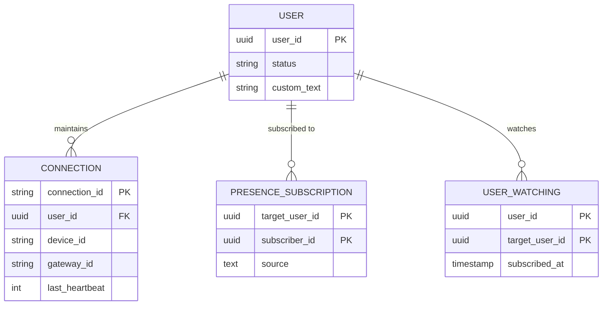
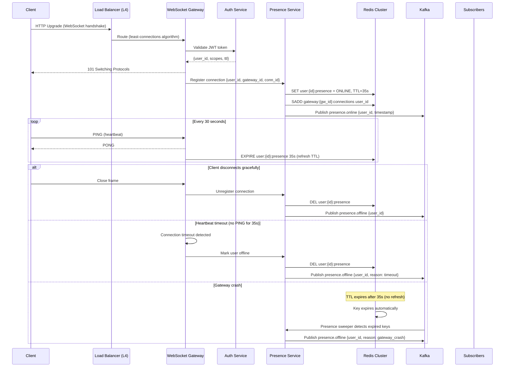
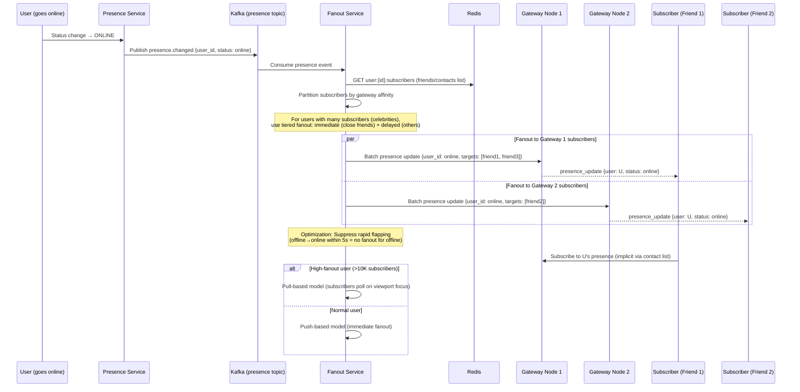

# Design WebSocket Presence Service - World-Class System Design

## 1. Functional Requirements

| # | Requirement | Description |
|---|---|---|
| FR1 | Real-time presence tracking | Track user states: online, idle, away, busy, offline across all connected devices |
| FR2 | Multi-device support | Aggregate presence from multiple devices (phone, desktop, tablet) into a unified user presence |
| FR3 | Heartbeat mechanism | Clients send periodic heartbeats; server expires stale connections after missed heartbeats |
| FR4 | Presence subscription | Users subscribe to presence updates of friends/contacts/channel members |
| FR5 | Presence fanout | Broadcast presence changes to all subscribers in near-real-time |
| FR6 | Custom status | Users can set custom status messages (text + emoji + expiry) |
| FR7 | Last seen timestamp | Store and serve "last seen at" for offline users |
| FR8 | Presence query API | Bulk query presence for a list of user IDs (e.g., loading a contact list) |
| FR9 | Admin controls | Force-disconnect users, view connection stats, throttle misbehaving clients |
| FR10 | Graceful degradation | If presence service is overloaded, degrade to polling mode instead of failing entirely |

## 2. Non-Functional Requirements

| # | NFR | Target |
|---|---|---|
| NFR1 | Availability | 99.99% (52 min downtime/year) |
| NFR2 | Latency - presence update delivery | p50 < 100ms, p95 < 200ms, p99 < 500ms |
| NFR3 | Latency - presence query | p50 < 20ms, p95 < 50ms |
| NFR4 | Heartbeat interval | 30 seconds (configurable per client type) |
| NFR5 | Stale detection | Detect offline within 60-90 seconds of actual disconnect |
| NFR6 | Concurrent connections | Support 10M+ concurrent WebSocket connections |
| NFR7 | Fanout scale | Single presence change fans out to up to 5,000 subscribers |
| NFR8 | Consistency | Eventual consistency acceptable (presence is ephemeral) |
| NFR9 | Durability | Presence data is ephemeral; last_seen is durable |
| NFR10 | Security | TLS 1.3, token-based auth, rate limiting per connection |

## 3. Capacity Estimation

### 3.1 User Metrics

| Metric | Value |
|---|---|
| DAU | 100M |
| MAU | 500M |
| Concurrent connections (peak) | 20M |
| Concurrent connections (steady) | 8M |
| Average friends/contacts per user | 200 |
| Average online friends at any time | 40 |

### 3.2 QPS / RPS Estimation

| Operation | Calculation | QPS |
|---|---|---|
| Heartbeat messages | 20M connections × (1/30s) | ~667K/s |
| Presence changes (online/offline) | 100M logins + 100M logoffs / 86400 | ~2,300/s avg, 25K/s peak |
| Presence fanout events | 25K changes × 200 avg subscribers | 5M fanout events/s peak |
| Presence query (bulk) | 10M queries/day / 86400 | ~115/s avg, 2K/s peak |
| Subscription management | 100M subscribe/unsubscribe per day | ~1,150/s |

### 3.3 Storage Estimation

| Data | Calculation | Storage |
|---|---|---|
| Active presence records | 20M × 256 bytes | ~5 GB (in Redis) |
| Connection registry | 20M × 512 bytes | ~10 GB (in Redis) |
| Subscription graph | 500M users × 200 contacts × 16 bytes | ~1.6 TB (distributed) |
| Last seen records | 500M × 64 bytes | ~32 GB |
| Custom status | 100M × 512 bytes | ~50 GB |

### 3.4 Network Bandwidth Estimation

| Direction | Calculation | Bandwidth |
|---|---|---|
| Heartbeat ingress | 667K/s × 64 bytes | ~42 MB/s |
| Presence fanout egress | 5M/s × 128 bytes (peak) | ~640 MB/s peak |
| WebSocket frame overhead | 20M connections × 2 frames/min × 20 bytes | ~13 MB/s |
| Total egress (peak) | | ~700 MB/s |
| Total ingress (peak) | | ~100 MB/s |

## 4. Data Modeling

### Entity-Relationship Diagram



### 4.1 Database Selection

| Workload | Database | Justification |
|---|---|---|
| Connection Registry | Redis Cluster (hash slots) | Sub-ms latency, TTL support, ephemeral data |
| Presence State | Redis Cluster | Key-value with TTL, sorted sets for subscribers |
| Subscription Graph | Redis + Cassandra | Redis for hot path, Cassandra for persistence |
| Last Seen | Cassandra / ScyllaDB | Write-heavy, time-series-like, partition by user_id |
| Custom Status | PostgreSQL | Relational, needs ACID for updates |
| Connection Metadata | Redis | Ephemeral, maps connection_id → user/device |
| Analytics/Audit | ClickHouse | Columnar, time-series analytics |
| Event Stream | Apache Kafka | Durable event log for fanout |

### 4.2 Schema Design

#### Redis: Connection Registry
```
Key: conn:{connection_id}
Value: {
  "user_id": "u_123",
  "device_id": "d_456",
  "device_type": "mobile",
  "gateway_id": "gw_us_east_1_03",
  "connected_at": 1716000000,
  "last_heartbeat": 1716003600,
  "ip": "192.168.1.1",
  "user_agent": "..."
}
TTL: 90 seconds (auto-expire if no heartbeat refresh)

Key: user_conns:{user_id}
Type: SET
Members: [connection_id_1, connection_id_2, ...]
```

#### Redis: Presence State
```
Key: presence:{user_id}
Value: {
  "status": "online",         // online|idle|away|busy|offline
  "custom_text": "In a meeting",
  "custom_emoji": "📅",
  "custom_expiry": 1716007200,
  "last_active": 1716003600,
  "device_states": {
    "d_456": "online",
    "d_789": "idle"
  }
}
TTL: 90 seconds (refreshed by heartbeat)

Key: presence_version:{user_id}
Type: INT (monotonically increasing version to prevent stale updates)
```

#### Redis: Subscription Graph (Hot)
```
Key: subs:{user_id}
Type: SET
Members: [subscriber_user_id_1, subscriber_user_id_2, ...]
// "Who is subscribed to MY presence changes?"

Key: watching:{user_id}
Type: SET
Members: [target_user_id_1, target_user_id_2, ...]
// "Whose presence am I watching?"
```

#### Cassandra: Subscription Graph (Persistent)
```sql
CREATE TABLE presence_subscriptions (
    target_user_id  UUID,
    subscriber_id   UUID,
    subscribed_at   TIMESTAMP,
    source          TEXT,        -- 'friend', 'channel', 'manual'
    PRIMARY KEY ((target_user_id), subscriber_id)
) WITH default_time_to_live = 0;

CREATE TABLE user_watching (
    user_id         UUID,
    target_user_id  UUID,
    subscribed_at   TIMESTAMP,
    PRIMARY KEY ((user_id), target_user_id)
);
```

#### Cassandra: Last Seen
```sql
CREATE TABLE last_seen (
    user_id       UUID,
    last_seen_at  TIMESTAMP,
    last_device   TEXT,
    last_ip       TEXT,
    PRIMARY KEY ((user_id))
);
```

#### PostgreSQL: Custom Status
```sql
CREATE TABLE custom_status (
    user_id       UUID PRIMARY KEY,
    status_text   VARCHAR(128),
    status_emoji  VARCHAR(8),
    expires_at    TIMESTAMP WITH TIME ZONE,
    updated_at    TIMESTAMP WITH TIME ZONE DEFAULT NOW(),
    version       INT DEFAULT 1
);

CREATE INDEX idx_custom_status_expiry ON custom_status(expires_at) WHERE expires_at IS NOT NULL;
```

#### ClickHouse: Presence Analytics
```sql
CREATE TABLE presence_events (
    event_id       UUID,
    user_id        UUID,
    event_type     Enum8('connect'=1,'disconnect'=2,'idle'=3,'away'=4,'heartbeat'=5),
    device_id      String,
    gateway_id     String,
    region         LowCardinality(String),
    timestamp      DateTime64(3),
    duration_ms    UInt32
) ENGINE = MergeTree()
PARTITION BY toYYYYMMDD(timestamp)
ORDER BY (user_id, timestamp)
TTL timestamp + INTERVAL 90 DAY;
```

### 4.3 Indexing Strategy

| Table/Store | Index | Purpose |
|---|---|---|
| Redis connection registry | conn:{id} key lookup | O(1) connection lookup |
| Redis presence | presence:{user_id} | O(1) presence check |
| Redis subscriptions | subs:{user_id} SET | O(1) membership check, O(n) fanout |
| Cassandra subscriptions | Partition by target_user_id | Efficient fanout reads |
| Cassandra last_seen | Partition by user_id | Single-partition reads |
| ClickHouse analytics | ORDER BY (user_id, timestamp) | Time-range queries per user |
| PostgreSQL custom_status | PK on user_id, partial index on expires_at | Expiry cleanup jobs |

## 5. High-Level Design (HLD)

### 5.1 Architecture Diagram

```
┌─────────────────────────────────────────────────────────────────────────────────┐
│                              CLIENT LAYER                                         │
│  [Mobile App] [Desktop App] [Web Browser] [IoT Device]                           │
└───────────────────────────────────┬─────────────────────────────────────────────┘
                                    │ WebSocket + HTTPS
                                    ▼
┌─────────────────────────────────────────────────────────────────────────────────┐
│                           EDGE / NETWORKING LAYER                                 │
│                                                                                   │
│  ┌──────────┐  ┌──────────┐  ┌──────────────┐  ┌────────────────┐              │
│  │ Route 53 │→ │CloudFront│→ │  AWS WAF /   │→ │ Network Load   │              │
│  │  (DNS)   │  │  (CDN)   │  │  Shield Adv  │  │  Balancer (L4) │              │
│  └──────────┘  └──────────┘  └──────────────┘  └───────┬────────┘              │
│                                                          │                        │
└──────────────────────────────────────────────────────────┼────────────────────────┘
                                                           │
┌──────────────────────────────────────────────────────────┼────────────────────────┐
│                     WEBSOCKET GATEWAY LAYER               │                        │
│                                                           ▼                        │
│  ┌─────────────────────────────────────────────────────────────────────────┐     │
│  │              WebSocket Gateway Fleet (Stateful)                           │     │
│  │  ┌─────────┐ ┌─────────┐ ┌─────────┐ ┌─────────┐ ┌─────────┐          │     │
│  │  │  GW-1   │ │  GW-2   │ │  GW-3   │ │  GW-4   │ │  GW-N   │          │     │
│  │  │ 500K    │ │ 500K    │ │ 500K    │ │ 500K    │ │ 500K    │          │     │
│  │  │ conns   │ │ conns   │ │ conns   │ │ conns   │ │ conns   │          │     │
│  │  └────┬────┘ └────┬────┘ └────┬────┘ └────┬────┘ └────┬────┘          │     │
│  └───────┼────────────┼────────────┼────────────┼────────────┼─────────────┘     │
│          │            │            │            │            │                     │
└──────────┼────────────┼────────────┼────────────┼────────────┼─────────────────────┘
           │            │            │            │            │
           ▼            ▼            ▼            ▼            ▼
┌─────────────────────────────────────────────────────────────────────────────────┐
│                        APPLICATION SERVICE LAYER                                  │
│                                                                                   │
│  ┌──────────────────┐  ┌──────────────────┐  ┌──────────────────┐              │
│  │ Presence Service  │  │ Subscription     │  │ Heartbeat        │              │
│  │ (State Machine)   │  │ Service          │  │ Processor        │              │
│  └────────┬─────────┘  └────────┬─────────┘  └────────┬─────────┘              │
│           │                      │                      │                         │
│  ┌──────────────────┐  ┌──────────────────┐  ┌──────────────────┐              │
│  │ Fanout Service    │  │ Connection       │  │ Status Service   │              │
│  │ (Pub/Sub Engine)  │  │ Registry Service │  │ (Custom Status)  │              │
│  └────────┬─────────┘  └────────┬─────────┘  └────────┬─────────┘              │
│           │                      │                      │                         │
│  ┌──────────────────┐  ┌──────────────────┐  ┌──────────────────┐              │
│  │ Query Service     │  │ Gateway Router   │  │ Stale Cleanup    │              │
│  │ (Bulk Presence)   │  │ Service          │  │ Service          │              │
│  └──────────────────┘  └──────────────────┘  └──────────────────┘              │
│                                                                                   │
└───────────────────────────────────┬─────────────────────────────────────────────┘
                                    │
┌───────────────────────────────────┼─────────────────────────────────────────────┐
│                     EVENT STREAMING LAYER              │                           │
│                                                        ▼                          │
│  ┌─────────────────────────────────────────────────────────────┐                │
│  │                    Apache Kafka Cluster                       │                │
│  │  ┌──────────────┐ ┌──────────────┐ ┌──────────────────┐    │                │
│  │  │ presence-    │ │ heartbeat-   │ │ presence-        │    │                │
│  │  │ changes      │ │ events       │ │ fanout           │    │                │
│  │  │ (32 parts)   │ │ (64 parts)   │ │ (128 parts)      │    │                │
│  │  └──────────────┘ └──────────────┘ └──────────────────┘    │                │
│  └─────────────────────────────────────────────────────────────┘                │
│                                                                                   │
└───────────────────────────────────┬─────────────────────────────────────────────┘
                                    │
┌───────────────────────────────────┼─────────────────────────────────────────────┐
│                         DATA LAYER                     │                           │
│                                                        ▼                          │
│  ┌──────────────┐  ┌──────────────┐  ┌──────────────┐  ┌──────────────┐        │
│  │ Redis Cluster │  │ Cassandra    │  │ PostgreSQL   │  │ ClickHouse   │        │
│  │ (Presence +   │  │ (Last Seen + │  │ (User Mgmt + │  │ (Analytics)  │        │
│  │  Connections  │  │  Subs Graph) │  │  Custom Stat) │  │              │        │
│  │  + Hot Subs)  │  │              │  │              │  │              │        │
│  └──────────────┘  └──────────────┘  └──────────────┘  └──────────────┘        │
│                                                                                   │
└─────────────────────────────────────────────────────────────────────────────────┘
```

### 5.2 Microservice Patterns Used

| Pattern | Application |
|---|---|
| **CQRS** | Write path (presence updates) separated from read path (bulk queries) |
| **Event Sourcing** | Presence changes published to Kafka for audit and replay |
| **Pub/Sub** | Fanout of presence changes to subscribers via Redis Pub/Sub + Kafka |
| **Saga** | Multi-step connection setup: auth → register → subscribe → confirm |
| **Circuit Breaker** | Gateway → Presence Service communication |
| **Bulkhead** | Separate thread pools for heartbeat processing vs. presence queries |
| **Sidecar** | Envoy proxy for mTLS, observability, load balancing |
| **Service Mesh** | Istio for inter-service communication, traffic shaping |

## 6. Low-Level Design (LLD)

### 6.1 WebSocket Gateway Service

#### Connection Lifecycle API

```
// WebSocket Handshake
WS CONNECT wss://presence.example.com/ws/v1/connect
Headers:
  Authorization: Bearer <JWT>
  X-Device-Id: d_456
  X-Device-Type: mobile
  X-Client-Version: 2.3.1
  X-Request-Id: req_789

// Server Response (101 Switching Protocols)
Response Headers:
  X-Connection-Id: conn_abc123
  X-Gateway-Id: gw_us_east_1_03
  X-Heartbeat-Interval: 30
  X-Session-Timeout: 90
```

#### WebSocket Message Protocol (JSON over WS frames)

```json
// Client → Server: Heartbeat
{
  "type": "heartbeat",
  "seq": 1234,
  "ts": 1716003600000,
  "device_state": "active"
}

// Server → Client: Heartbeat ACK
{
  "type": "heartbeat_ack",
  "seq": 1234,
  "server_ts": 1716003600005
}

// Client → Server: Status Update
{
  "type": "status_update",
  "status": "away",
  "custom_text": "In a meeting",
  "custom_emoji": "📅",
  "expires_in_seconds": 3600
}

// Server → Client: Presence Update (fanout)
{
  "type": "presence_update",
  "user_id": "u_789",
  "status": "online",
  "custom_text": "",
  "timestamp": 1716003600000,
  "version": 42
}

// Client → Server: Subscribe to presence
{
  "type": "subscribe_presence",
  "user_ids": ["u_101", "u_102", "u_103"]
}

// Server → Client: Bulk Presence Response
{
  "type": "presence_snapshot",
  "presences": [
    {"user_id": "u_101", "status": "online", "last_active": 1716003500},
    {"user_id": "u_102", "status": "offline", "last_seen": 1716000000},
    {"user_id": "u_103", "status": "idle", "last_active": 1716003000}
  ]
}
```

### 6.2 Presence Service APIs

#### REST API (for non-realtime clients and internal services)

```http
POST /api/v1/presence/query
Authorization: Bearer <token>
Content-Type: application/json
X-Request-Id: req_001

Request:
{
  "user_ids": ["u_101", "u_102", "u_103", ...],  // max 500
  "include_custom_status": true
}

Response (200 OK):
{
  "presences": {
    "u_101": {
      "status": "online",
      "last_active": "2025-05-18T10:00:00Z",
      "custom_status": {"text": "Available", "emoji": "✅", "expires_at": null},
      "version": 42
    },
    "u_102": {
      "status": "offline",
      "last_seen": "2025-05-18T08:30:00Z",
      "custom_status": null,
      "version": 38
    }
  },
  "request_id": "req_001",
  "cached": true,
  "cache_age_ms": 1200
}
```

```http
PUT /api/v1/presence/status
Authorization: Bearer <token>
Idempotency-Key: <uuid>

Request:
{
  "status_text": "On vacation",
  "status_emoji": "🏖️",
  "expires_at": "2025-05-25T00:00:00Z"
}

Response (200 OK):
{
  "user_id": "u_123",
  "custom_status": {
    "text": "On vacation",
    "emoji": "🏖️",
    "expires_at": "2025-05-25T00:00:00Z",
    "updated_at": "2025-05-18T10:00:00Z"
  },
  "version": 5
}
```

```http
GET /api/v1/presence/{user_id}
Authorization: Bearer <token>

Response (200 OK):
{
  "user_id": "u_123",
  "status": "online",
  "last_active": "2025-05-18T10:00:00Z",
  "devices": [
    {"device_id": "d_456", "type": "mobile", "state": "active"},
    {"device_id": "d_789", "type": "desktop", "state": "idle"}
  ],
  "custom_status": {"text": "Working", "emoji": "💻"},
  "version": 42
}
```

#### Internal gRPC APIs

```protobuf
syntax = "proto3";
package presence.v1;

service PresenceService {
  rpc GetPresence(GetPresenceRequest) returns (GetPresenceResponse);
  rpc GetBulkPresence(GetBulkPresenceRequest) returns (GetBulkPresenceResponse);
  rpc UpdatePresence(UpdatePresenceRequest) returns (UpdatePresenceResponse);
  rpc RegisterConnection(RegisterConnectionRequest) returns (RegisterConnectionResponse);
  rpc DeregisterConnection(DeregisterConnectionRequest) returns (DeregisterConnectionResponse);
  rpc ProcessHeartbeat(HeartbeatRequest) returns (HeartbeatResponse);
  rpc SubscribePresenceStream(SubscribeRequest) returns (stream PresenceEvent);
}

service FanoutService {
  rpc GetSubscribers(GetSubscribersRequest) returns (GetSubscribersResponse);
  rpc FanoutPresenceChange(FanoutRequest) returns (FanoutResponse);
  rpc AddSubscription(AddSubscriptionRequest) returns (AddSubscriptionResponse);
  rpc RemoveSubscription(RemoveSubscriptionRequest) returns (RemoveSubscriptionResponse);
}

service GatewayRouterService {
  rpc RouteToUser(RouteToUserRequest) returns (RouteToUserResponse);
  rpc RouteToConnection(RouteToConnectionRequest) returns (RouteToConnectionResponse);
  rpc GetUserGateways(GetUserGatewaysRequest) returns (GetUserGatewaysResponse);
}
```

### 6.3 Design Patterns

| Pattern | Usage |
|---|---|
| **State Pattern** | Presence state machine (Online → Idle → Away → Offline) with transition rules |
| **Observer Pattern** | Subscription-based fanout notifications |
| **Strategy Pattern** | Different fanout strategies (small group vs. large channel) |
| **Factory Pattern** | Connection handler creation based on client type |
| **Singleton** | Redis connection pool, Kafka producer pool |
| **Command Pattern** | Presence commands queued for processing |
| **Flyweight** | Shared presence objects for users with same status |

### 6.4 Presence State Machine

```
                    ┌─────────────────────────────┐
                    │                             │
                    ▼                             │
    ┌──────────┐  connect   ┌──────────┐       timeout
    │ OFFLINE  │───────────→│  ONLINE  │─────────┐
    └──────────┘            └──────────┘         │
         ▲                    │       ▲          │
         │                    │       │          │
         │              idle  │       │ active   │
    disconnect            timeout │       │ event    │
         │                    ▼       │          │
         │                 ┌──────────┐          │
         │                 │   IDLE   │          │
         │                 └──────────┘          │
         │                    │       ▲          │
         │              away  │       │ back     │
         │             timeout│       │          │
         │                    ▼       │          │
         │                 ┌──────────┐          │
         └─────────────────│   AWAY   │──────────┘
                           └──────────┘
```

**Transition Rules:**
- ONLINE → IDLE: No user activity for 5 minutes (heartbeat still active)
- IDLE → AWAY: No user activity for 15 minutes
- AWAY → OFFLINE: No heartbeat for 90 seconds
- Any → ONLINE: User activity event received
- Any → OFFLINE: Connection closed / heartbeat timeout

## 7. Architecture Components Deep Dive

### 7.1 Route 53 (DNS Layer)

- **Latency-based routing**: Route users to nearest regional presence cluster
- **Health checks**: Monitor WebSocket gateway fleet health, failover in 30s
- **Weighted routing**: Gradual traffic migration during deployments
- **Geolocation routing**: Compliance requirements (data residency)

### 7.2 CloudFront / CDN

- **WebSocket pass-through**: CloudFront supports WS connections to origin
- **Static asset caching**: Presence SDK, client libraries
- **Edge functions**: Token validation at edge, reject unauthenticated before reaching origin
- **Connection coalescing**: Reduce origin connections

### 7.3 AWS WAF / Shield

- **Rate limiting rules**: Max 10 WS connections per IP, max 5 per user
- **Bot detection**: Block automated presence manipulation
- **DDoS protection**: Shield Advanced for volumetric attacks
- **Geo-blocking**: Block traffic from sanctioned regions
- **Custom rules**: Block heartbeat flooding (>2/s per connection)

### 7.4 Network Load Balancer (L4)

- **Why L4 (not L7)**: WebSocket is long-lived; NLB preserves connections without HTTP parsing overhead
- **Sticky sessions**: Route by source IP to same gateway (connection affinity)
- **Cross-zone load balancing**: Distribute across AZs
- **Target group health**: TCP health checks every 10s
- **Connection draining**: 300s drain period during deployments

### 7.5 WebSocket Gateway Fleet

```
┌─────────────────────────────────────────────────────────────┐
│                   WebSocket Gateway Node                      │
│                                                               │
│  ┌─────────────────────────────────────────────────────┐    │
│  │  Connection Manager (epoll/kqueue - 500K conns)      │    │
│  │  ┌──────────┐ ┌──────────┐ ┌──────────────────┐    │    │
│  │  │ Acceptor │ │ Reader   │ │ Writer Pool      │    │    │
│  │  │ Pool     │ │ Pool     │ │ (per-conn queue) │    │    │
│  │  └──────────┘ └──────────┘ └──────────────────┘    │    │
│  └─────────────────────────────────────────────────────┘    │
│                                                               │
│  ┌───────────────┐  ┌───────────────┐  ┌───────────────┐   │
│  │ Auth Module   │  │ Rate Limiter  │  │ Protocol      │   │
│  │ (JWT verify)  │  │ (Token bucket)│  │ Parser        │   │
│  └───────────────┘  └───────────────┘  └───────────────┘   │
│                                                               │
│  ┌───────────────┐  ┌───────────────┐  ┌───────────────┐   │
│  │ Heartbeat     │  │ Local Conn    │  │ Kafka         │   │
│  │ Timer Wheel   │  │ Registry      │  │ Producer      │   │
│  └───────────────┘  └───────────────┘  └───────────────┘   │
│                                                               │
│  ┌─────────────────────────────────────────────────────┐    │
│  │  Internal gRPC Server (receives fanout pushes)       │    │
│  └─────────────────────────────────────────────────────┘    │
│                                                               │
│  Tech: Go / Rust | 64GB RAM | 16 cores | Linux 5.x epoll   │
└─────────────────────────────────────────────────────────────┘
```

**Key Design Decisions:**
- Written in Go or Rust for low-latency, high-concurrency
- Each node handles 500K concurrent connections using epoll
- Timer wheel for heartbeat expiration (O(1) insert/delete)
- Local connection registry (in-memory hash map) + remote registration in Redis
- Backpressure: per-connection write queue with bounded size; drop presence updates if queue full

### 7.6 Presence Service

- **State management**: Evaluates presence transitions based on heartbeats + activity signals
- **Aggregate presence**: Merges multi-device states into single user presence
  - Priority: online > busy > idle > away > offline
  - User is "online" if ANY device is online
- **Version vector**: Each presence update increments version; clients reject stale updates
- **Idempotency**: Same heartbeat/event with same seq number is deduplicated

### 7.7 Fanout Service

```
┌─────────────────────────────────────────────────────────┐
│                  Fanout Service                           │
│                                                           │
│  ┌─────────────┐    ┌──────────────────────────────┐   │
│  │ Kafka       │    │ Fanout Strategy Selector      │   │
│  │ Consumer    │───→│                                │   │
│  │ Group       │    │  ├─ SmallGroupFanout (<100)   │   │
│  └─────────────┘    │  ├─ MediumFanout (100-5000)  │   │
│                      │  └─ LargeFanout (>5000)      │   │
│                      └──────────────┬───────────────┘   │
│                                     │                    │
│                                     ▼                    │
│  ┌──────────────────────────────────────────────────┐   │
│  │          Gateway Router (Find target gateways)    │   │
│  │                                                    │   │
│  │  subscriber_user_ids → lookup Redis              │   │
│  │  → group by gateway_id                            │   │
│  │  → batch gRPC push to each gateway               │   │
│  └──────────────────────────────────────────────────┘   │
│                                                           │
└─────────────────────────────────────────────────────────┘
```

**Fanout Strategies:**
- **Small Group (<100 subscribers)**: Direct push via gateway gRPC; inline processing
- **Medium (100-5000)**: Kafka partition-based parallel fanout; batch by gateway
- **Large (>5000)**: Hierarchical fanout with intermediate aggregation; staggered delivery; lazy pull for less-active subscribers

### 7.8 Heartbeat Processor

- **Timer Wheel**: Hashed timing wheel with 1-second granularity, 128 slots
- **Processing**: Each heartbeat refreshes TTL in Redis, resets timer wheel slot
- **Batch processing**: Aggregate heartbeats within 1s window, batch Redis EXPIRE commands
- **Missed heartbeat detection**: Timer wheel fires callback → mark connection stale → wait one more interval → expire

### 7.9 Stale Connection Cleanup Service

- Runs as a background process on each gateway + centralized cleanup service
- **Local cleanup**: Gateway detects TCP RST/FIN or timer wheel expiry → local cleanup
- **Central cleanup**: Scans Redis for entries where `last_heartbeat < now() - 90s` → deregisters
- **Consistency**: Uses Redis `WATCH` + `MULTI` for compare-and-delete to avoid race conditions

## 8. Deep Dive of Each Component

### 8.1 WebSocket Connection Lifecycle (Deep Dive)

```
Client                    NLB           Gateway         Redis        Presence Svc
  │                        │               │              │              │
  │──WS Upgrade Request───→│               │              │              │
  │                        │──TCP Forward──→│              │              │
  │                        │               │──Verify JWT──→│(Auth Cache)  │
  │                        │               │←─Valid────────│              │
  │                        │               │              │              │
  │                        │               │──SADD user_conns:{uid}──────→│
  │                        │               │──SET conn:{cid} (TTL 90s)──→│
  │                        │               │              │              │
  │                        │               │──RegisterConn─────────────→│
  │                        │               │              │  Calculate   │
  │                        │               │              │  aggregate   │
  │                        │               │              │  presence    │
  │                        │               │←──────────────────ACK───────│
  │                        │               │              │              │
  │←──101 Switching Proto──│               │              │              │
  │                        │               │              │              │
  │  (Heartbeat Loop starts)               │              │              │
  │──heartbeat {seq:1}────→│──────────────→│              │              │
  │                        │               │──EXPIRE conn:{cid} 90s────→│
  │                        │               │──EXPIRE presence:{uid} 90s─→│
  │←──heartbeat_ack {seq:1}│←──────────────│              │              │
  │                        │               │              │              │
```

### 8.2 Presence Change Fanout (Deep Dive)

```
User A goes online
         │
         ▼
┌─────────────────────┐
│ Presence Service    │
│ 1. Compute new state│
│ 2. Compare old/new  │
│ 3. If changed:      │
│    - Update Redis   │
│    - Bump version   │
│    - Publish event  │
└─────────┬───────────┘
          │
          ▼ Kafka: presence-changes topic
┌─────────────────────┐
│ Event: {            │
│   user_id: "u_A",   │
│   old: "offline",   │
│   new: "online",    │
│   version: 43,      │
│   ts: 171600...     │
│ }                   │
└─────────┬───────────┘
          │
          ▼
┌─────────────────────────────────────────────┐
│ Fanout Service                               │
│                                               │
│ 1. Read subscribers: SMEMBERS subs:{u_A}    │
│    → [u_B, u_C, u_D, ... u_Z] (200 users)  │
│                                               │
│ 2. For each subscriber, find their gateway: │
│    HGET conn:{user_conns:{u_B}} → gw_id     │
│    (Batch: MGET for all subscribers)         │
│                                               │
│ 3. Group by gateway:                         │
│    gw_1: [u_B, u_C, u_F]                    │
│    gw_2: [u_D, u_E]                         │
│    gw_3: [u_G, u_H, u_I, u_J]              │
│                                               │
│ 4. Batch gRPC push to each gateway:         │
│    FanoutToConnections(gateway_id, [msgs])   │
│                                               │
└─────────────────────────────────────────────┘
          │
          ▼ (per gateway)
┌─────────────────────────────────────────────┐
│ Gateway Node                                 │
│                                               │
│ 1. Receive gRPC batch                        │
│ 2. For each target user:                     │
│    - Find local connection(s)                │
│    - Enqueue presence_update frame           │
│    - Write to WebSocket                      │
│ 3. If connection not found (stale):          │
│    - Log, skip (cleanup will handle)         │
│                                               │
└─────────────────────────────────────────────┘
```

### 8.3 Heartbeat Storm Protection (Deep Dive)

**Problem**: 20M clients all heartbeating every 30s = 667K heartbeats/second. If clients reconnect simultaneously after an outage, this becomes 20M heartbeats in a few seconds.

**Solutions:**

1. **Jittered heartbeat interval**: Client heartbeat = 30s ± random(0-5s)
2. **Gateway-local batching**: Batch heartbeat Redis operations every 1 second
3. **Hierarchical heartbeats**: Gateway sends aggregate "I'm alive with N connections" to central system
4. **Exponential backoff on reconnect**: After mass disconnect, clients wait random(0-60s) before reconnecting
5. **Adaptive throttling**: If heartbeat processing latency > 500ms, increase client interval to 60s
6. **Redis pipelining**: Batch 1000 EXPIRE commands in single pipeline

```go
// Timer Wheel Implementation (Go)
type TimerWheel struct {
    slots       [128]*list.List  // 128 slots × 1s = 128s cycle
    currentSlot int
    mu          sync.Mutex
    ticker      *time.Ticker
}

type TimerEntry struct {
    connectionID string
    expiresAt    time.Time
    callback     func(connID string)
}

func (tw *TimerWheel) Schedule(connID string, timeout time.Duration, cb func(string)) {
    slot := (tw.currentSlot + int(timeout.Seconds())) % 128
    tw.slots[slot].PushBack(&TimerEntry{
        connectionID: connID,
        expiresAt:    time.Now().Add(timeout),
        callback:     cb,
    })
}

func (tw *TimerWheel) Tick() {
    tw.currentSlot = (tw.currentSlot + 1) % 128
    expired := tw.slots[tw.currentSlot]
    // Process all expired entries
    for e := expired.Front(); e != nil; e = e.Next() {
        entry := e.Value.(*TimerEntry)
        if time.Now().After(entry.expiresAt) {
            go entry.callback(entry.connectionID) // async cleanup
        }
    }
    expired.Init() // clear slot
}
```

### 8.4 Subscription Management (Deep Dive)

**Challenge**: 500M users × 200 friends = 100B subscription edges. Cannot store all in Redis.

**Solution: Lazy Subscription Loading**

1. When user connects, load only online friends' subscriptions into Redis
2. Use Cassandra as persistent store, Redis as hot cache
3. When user A comes online:
   - Load A's friend list from social graph service
   - For each friend F who is currently online (check Redis):
     - Add A to `subs:{F}` (A wants updates about F)
     - Add F to `subs:{A}` (F wants updates about A)
4. When user A goes offline:
   - Remove A from all `subs:{F}` sets
   - Delete `subs:{A}` (no one needs to push to offline user)

**Memory optimization**: Only 20M concurrent users × average 40 online friends = 800M subscription edges in Redis = ~12.8 GB (16 bytes per edge)

## 9. Component Optimization

### 9.1 Kafka Optimization

```yaml
# Kafka Topic Configuration
presence-changes:
  partitions: 32
  replication_factor: 3
  retention_ms: 86400000          # 24 hours
  segment_bytes: 536870912         # 512 MB
  min.insync.replicas: 2
  compression.type: lz4
  partition_strategy: hash(user_id) # Ensures ordering per user

heartbeat-events:
  partitions: 64                   # Higher parallelism for volume
  replication_factor: 2            # Acceptable to lose some heartbeat history
  retention_ms: 3600000            # 1 hour only
  compression.type: snappy
  cleanup.policy: delete

presence-fanout:
  partitions: 128                  # High parallelism for fanout work
  replication_factor: 3
  retention_ms: 43200000           # 12 hours for replay
  max.message.bytes: 1048576       # 1 MB (batched fanout)
```

**Producer Optimization:**
- `linger.ms = 5`: Batch heartbeats for 5ms before sending
- `batch.size = 64KB`: Larger batches for throughput
- `acks = 1` for heartbeats (acceptable loss), `acks = all` for presence changes
- `compression.type = lz4`: Fast compression for high throughput

**Consumer Optimization:**
- Consumer group per service (fanout, analytics, cleanup)
- `max.poll.records = 500`: Process in batches
- `enable.auto.commit = false`: Manual commit after processing
- Parallel processing within partition using worker pool

### 9.2 Redis Optimization

```
# Redis Cluster Configuration (6 nodes: 3 primary + 3 replica)
# Each node: 64 GB RAM, dedicated NVMe for persistence

# Connection Registry: 20M keys × 512 bytes = 10 GB
# Presence State: 20M keys × 256 bytes = 5 GB
# Subscriptions: 800M edges × 16 bytes = 12.8 GB
# Total active data: ~28 GB per cluster

# Key Design Patterns:
# 1. Use HASH instead of STRING for presence (saves overhead)
HSET presence:u_123 status "online" last_active "1716003600" version "42"
EXPIRE presence:u_123 90

# 2. Pipeline heartbeat operations (batch per gateway per second)
PIPELINE:
  EXPIRE conn:c_001 90
  EXPIRE conn:c_002 90
  ...
  EXPIRE conn:c_999 90
  HSET presence:u_123 last_active "1716003600"
EXEC

# 3. Use Redis Cluster hash tags for co-location
# All data for user u_123 in same slot:
{u_123}.presence
{u_123}.connections
{u_123}.subscriptions

# 4. Pub/Sub for same-node fanout (bypass network for local subscribers)
SUBSCRIBE presence_channel:{gateway_id}
```

**Redis Memory Optimization:**
- Use `ziplist` encoding for small sets (<128 elements)
- `maxmemory-policy: volatile-ttl` (evict keys closest to expiry)
- Disable persistence (RDB/AOF) for presence data (ephemeral)
- Use Redis Streams for ordered presence event logs

### 9.3 WebSocket Optimization

```
# Connection Management (per gateway node)
# OS Tuning:
net.core.somaxconn = 65535
net.ipv4.tcp_max_syn_backlog = 65535
net.core.netdev_max_backlog = 65535
fs.file-max = 2000000
net.ipv4.ip_local_port_range = 1024 65535

# Application-level optimizations:
1. Use epoll (Linux) / kqueue (macOS) for I/O multiplexing
2. Frame compression (permessage-deflate) for text messages
3. Binary protocol (MessagePack/Protobuf) instead of JSON for internal
4. Connection pooling for upstream services
5. Write coalescing: batch multiple presence updates into single frame
```

**Write Coalescing Example:**
```json
// Instead of 5 separate frames:
{"type":"presence_update","user_id":"u_1","status":"online"}
{"type":"presence_update","user_id":"u_2","status":"offline"}
{"type":"presence_update","user_id":"u_3","status":"idle"}

// Send single batched frame:
{
  "type": "presence_batch",
  "updates": [
    {"user_id":"u_1","status":"online","v":42},
    {"user_id":"u_2","status":"offline","v":38},
    {"user_id":"u_3","status":"idle","v":55}
  ]
}
```

### 9.4 Database Indexing, Partitioning & Sharding

#### Cassandra Partitioning Strategy
```
# Subscription table partitioned by target_user_id
# This optimizes the fanout read pattern:
# "Give me all subscribers of user X"

# Partition size target: < 100 MB, < 100K rows
# For users with >5000 subscribers, use bucket suffix:
# Partition key: (target_user_id, bucket)
# bucket = subscriber_id.hashCode() % num_buckets

CREATE TABLE presence_subscriptions_v2 (
    target_user_id UUID,
    bucket         INT,
    subscriber_id  UUID,
    subscribed_at  TIMESTAMP,
    PRIMARY KEY ((target_user_id, bucket), subscriber_id)
);
```

#### ClickHouse Partitioning
```sql
-- Partition by day, order by user for fast user-level analytics
-- Use ReplicatedMergeTree for HA

CREATE TABLE presence_events ON CLUSTER 'analytics_cluster' (
    event_id       UUID,
    user_id        UUID,
    event_type     Enum8('connect'=1,'disconnect'=2,'idle'=3,'away'=4),
    device_type    LowCardinality(String),
    gateway_id     LowCardinality(String),
    region         LowCardinality(String),
    timestamp      DateTime64(3),
    session_duration_ms UInt64
) ENGINE = ReplicatedMergeTree('/clickhouse/tables/{shard}/presence_events', '{replica}')
PARTITION BY toYYYYMMDD(timestamp)
ORDER BY (user_id, timestamp)
TTL timestamp + INTERVAL 90 DAY
SETTINGS index_granularity = 8192;

-- Materialized view for real-time aggregates
CREATE MATERIALIZED VIEW presence_hourly_stats
ENGINE = SummingMergeTree()
PARTITION BY toYYYYMMDD(hour)
ORDER BY (region, hour)
AS SELECT
    toStartOfHour(timestamp) AS hour,
    region,
    count() AS total_events,
    countIf(event_type = 'connect') AS connects,
    countIf(event_type = 'disconnect') AS disconnects,
    uniqExact(user_id) AS unique_users
FROM presence_events
GROUP BY hour, region;
```

### 9.5 Caching Strategy

```
┌─────────────────────────────────────────────────────┐
│               Multi-Layer Cache Architecture          │
│                                                       │
│  Layer 1: Gateway Local Cache (in-process)           │
│  ┌─────────────────────────────────────────────┐    │
│  │ LRU Cache: 100K entries per gateway          │    │
│  │ TTL: 5 seconds                               │    │
│  │ Use: Presence queries for locally-connected  │    │
│  │      users (instant response, no Redis hop)  │    │
│  └─────────────────────────────────────────────┘    │
│                                                       │
│  Layer 2: Redis Cluster (distributed)                │
│  ┌─────────────────────────────────────────────┐    │
│  │ All active presence states                    │    │
│  │ TTL: 90 seconds (heartbeat-refreshed)        │    │
│  │ Use: Cross-gateway presence lookups           │    │
│  └─────────────────────────────────────────────┘    │
│                                                       │
│  Layer 3: Cassandra (persistent)                     │
│  ┌─────────────────────────────────────────────┐    │
│  │ Last seen timestamps, subscription graph     │    │
│  │ Use: Fallback for cache misses, cold starts  │    │
│  └─────────────────────────────────────────────┘    │
│                                                       │
└─────────────────────────────────────────────────────┘
```

**Cache Invalidation Strategy:**
- Heartbeat → Refresh TTL (extend, not invalidate)
- Status change → Write-through (update Redis + publish event)
- Disconnect → Delete key (immediate invalidation)
- Cache stampede protection: Probabilistic early expiration (PER algorithm)

### 9.6 Apache Flink (Stream Processing)

```java
// Real-time presence analytics and anomaly detection
StreamExecutionEnvironment env = StreamExecutionEnvironment.getExecutionEnvironment();

DataStream<PresenceEvent> events = env
    .addSource(new FlinkKafkaConsumer<>("presence-changes", schema, properties))
    .assignTimestampsAndWatermarks(
        WatermarkStrategy.<PresenceEvent>forBoundedOutOfOrderness(Duration.ofSeconds(5))
            .withTimestampAssigner((event, ts) -> event.getTimestamp())
    );

// 1. Detect heartbeat storms (anomaly detection)
events
    .filter(e -> e.getType() == EventType.HEARTBEAT)
    .keyBy(PresenceEvent::getGatewayId)
    .window(TumblingEventTimeWindows.of(Time.seconds(10)))
    .aggregate(new CountAggregator())
    .filter(count -> count.getValue() > STORM_THRESHOLD)
    .addSink(new AlertSink());

// 2. Real-time concurrent user count per region
events
    .filter(e -> e.getType() == EventType.CONNECT || e.getType() == EventType.DISCONNECT)
    .keyBy(PresenceEvent::getRegion)
    .process(new ConcurrentCountProcess())
    .addSink(new PrometheusSink("presence_concurrent_users"));

// 3. Session duration calculation
events
    .keyBy(PresenceEvent::getUserId)
    .process(new SessionDurationProcess())  // stateful: tracks connect/disconnect pairs
    .addSink(new ClickHouseSink("session_durations"));

// 4. Celebrity user detection (high fanout users)
events
    .keyBy(PresenceEvent::getUserId)
    .window(SlidingEventTimeWindows.of(Time.minutes(5), Time.minutes(1)))
    .aggregate(new SubscriberCountAggregator())
    .filter(agg -> agg.getSubscriberCount() > 5000)
    .addSink(new CelebrityRegistrySink());
```

### 9.7 S3 / Data Lake Integration

```
┌─────────────────────────────────────────────┐
│  Presence Event Data Lake (S3 + Iceberg)    │
│                                               │
│  Raw Events (Kafka → S3):                    │
│  s3://presence-lake/raw/                     │
│    year=2025/month=05/day=18/hour=10/        │
│      events-partition-00.parquet             │
│      events-partition-01.parquet             │
│                                               │
│  Iceberg Tables:                             │
│  ┌─────────────────────────────────────┐    │
│  │ presence.events (partitioned by day)│    │
│  │ presence.sessions (partitioned)     │    │
│  │ presence.aggregates (hourly/daily)  │    │
│  └─────────────────────────────────────┘    │
│                                               │
│  Use Cases:                                   │
│  - Long-term audit trail (7 years)           │
│  - ML training data (user activity patterns) │
│  - Compliance reporting                       │
│  - Capacity planning analytics               │
│                                               │
└─────────────────────────────────────────────┘
```

## 10. Observability

### 10.1 Metrics (Prometheus + Grafana)

```yaml
# Key Metrics to Track

# Connection Metrics
presence_connections_total{gateway, region, device_type}          # Gauge
presence_connections_established_total{gateway, region}           # Counter
presence_connections_dropped_total{gateway, region, reason}       # Counter
presence_connection_duration_seconds{device_type}                 # Histogram

# Heartbeat Metrics
presence_heartbeat_received_total{gateway}                        # Counter
presence_heartbeat_processing_duration_ms{gateway}               # Histogram
presence_heartbeat_missed_total{gateway}                          # Counter
presence_stale_connections_expired_total{gateway}                 # Counter

# Fanout Metrics
presence_fanout_latency_ms{strategy}                             # Histogram
presence_fanout_batch_size{gateway}                               # Histogram
presence_fanout_failures_total{reason}                            # Counter
presence_fanout_queue_depth{partition}                            # Gauge

# State Transition Metrics
presence_state_transitions_total{from_state, to_state}           # Counter
presence_active_users{region, status}                             # Gauge

# Redis Metrics
presence_redis_latency_ms{command, node}                         # Histogram
presence_redis_pipeline_size{gateway}                             # Histogram
presence_redis_connection_pool_usage{node}                        # Gauge

# Kafka Metrics
presence_kafka_consumer_lag{topic, partition, consumer_group}     # Gauge
presence_kafka_produce_latency_ms{topic}                         # Histogram
presence_kafka_produce_failures_total{topic}                      # Counter

# Business Metrics
presence_dau{region}                                              # Gauge
presence_peak_concurrent{region}                                  # Gauge
presence_avg_session_duration_minutes{device_type}               # Gauge
```

### 10.2 Distributed Tracing (Jaeger/OpenTelemetry)

```
Trace: User A comes online

Span 1: ws_gateway.connection_accept (2ms)
  └─ Span 2: auth_service.verify_token (5ms)
  └─ Span 3: redis.register_connection (1ms)
  └─ Span 4: presence_service.update_state (3ms)
       └─ Span 5: redis.get_presence (0.5ms)
       └─ Span 6: redis.set_presence (0.5ms)
       └─ Span 7: kafka.produce_event (2ms)
  └─ Span 8: subscription_service.activate (4ms)
       └─ Span 9: redis.load_online_friends (2ms)
       └─ Span 10: redis.register_subscriptions (3ms)

Total trace duration: ~15ms

---

Trace: Presence fanout to 200 subscribers

Span 1: fanout_service.consume_event (1ms)
  └─ Span 2: redis.get_subscribers (2ms)
  └─ Span 3: redis.batch_get_gateways (3ms)
  └─ Span 4: fanout.group_by_gateway (0.1ms)
  └─ Span 5: grpc.push_to_gateway_1 (5ms)
  └─ Span 6: grpc.push_to_gateway_2 (4ms)
  └─ Span 7: grpc.push_to_gateway_3 (6ms)

Total: p99 < 50ms for fanout processing
```

### 10.3 Logging (ELK Stack / Loki)

```json
// Structured log format
{
  "timestamp": "2025-05-18T10:00:00.123Z",
  "level": "INFO",
  "service": "presence-gateway",
  "instance": "gw-us-east-1-03",
  "trace_id": "abc123def456",
  "span_id": "span_789",
  "user_id": "u_123",
  "connection_id": "conn_abc",
  "event": "connection_established",
  "device_type": "mobile",
  "client_version": "2.3.1",
  "duration_ms": 15,
  "metadata": {
    "ip": "192.168.x.x",
    "region": "us-east-1",
    "az": "us-east-1a"
  }
}
```

### 10.4 Alerting Rules

| Alert | Condition | Severity | Action |
|---|---|---|---|
| High connection drop rate | >5% drops in 5min window | P1 | Page on-call, check NLB/gateway health |
| Heartbeat processing lag | p99 > 5s | P1 | Scale gateway fleet, check Redis |
| Fanout queue depth | >100K pending events for >2min | P2 | Scale fanout consumers |
| Redis cluster latency | p99 > 10ms | P2 | Check hot keys, cluster rebalance |
| Kafka consumer lag | >50K messages for >5min | P2 | Scale consumers, check processing errors |
| Gateway memory > 80% | Memory usage high | P3 | Drain connections, scale horizontally |
| Stale connection count | >10K stale connections | P3 | Investigate cleanup service |

### 10.5 Dashboards

```
┌─────────────────────────────────────────────────────────────────┐
│ PRESENCE SERVICE - OPERATIONAL DASHBOARD                         │
├─────────────────────────────────────────────────────────────────┤
│                                                                   │
│  ┌─────────────────────┐  ┌─────────────────────┐              │
│  │ Active Connections  │  │ Presence by Status   │              │
│  │    8.2M / 20M cap   │  │ Online:  5.1M        │              │
│  │ ████████░░░░░░░░░░  │  │ Idle:    1.8M        │              │
│  │         41%          │  │ Away:    0.8M        │              │
│  └─────────────────────┘  │ Busy:    0.5M        │              │
│                            └─────────────────────┘              │
│  ┌─────────────────────┐  ┌─────────────────────┐              │
│  │ Heartbeat Rate      │  │ Fanout Latency p99  │              │
│  │    245K/s            │  │    42ms              │              │
│  │ ▁▂▃▄▅▆▇█▇▆▅▄▃▂▁   │  │ ▁▁▂▂▂▃▃▂▂▁▁▁▂▂▁   │              │
│  └─────────────────────┘  └─────────────────────┘              │
│                                                                   │
│  ┌─────────────────────────────────────────────────────────┐    │
│  │ Connection Events Over Time (24h)                         │    │
│  │ ▁▂▃▄▅▆▇█▇▆▅▄▃▂▁▂▃▄▅▆▇█▇▆▅▄▃▂▁▂▃▄▅▆▇█▇▆▅▄▃▂▁        │    │
│  │ ──connects  ──disconnects  --stale_expires               │    │
│  └─────────────────────────────────────────────────────────┘    │
│                                                                   │
│  ┌───────────────────────────────┐  ┌────────────────────────┐  │
│  │ Redis Cluster Health           │  │ Kafka Consumer Lag     │  │
│  │ Nodes: 6/6 healthy            │  │ presence-changes: 120  │  │
│  │ Memory: 42 GB / 384 GB        │  │ heartbeats: 5,420      │  │
│  │ Ops/s: 1.2M                   │  │ fanout: 890            │  │
│  │ Latency p99: 1.2ms            │  │                        │  │
│  └───────────────────────────────┘  └────────────────────────┘  │
│                                                                   │
└─────────────────────────────────────────────────────────────────┘
```

## 11. Considerations and Assumptions

### 11.1 Key Assumptions

| # | Assumption | Impact |
|---|---|---|
| 1 | Presence is ephemeral - loss is acceptable | No need for WAL or disk persistence for live state |
| 2 | Eventual consistency is acceptable | Presence may show stale state for up to 5s |
| 3 | Average 200 friends per user | Bounds subscription graph size |
| 4 | 30s heartbeat interval | Balances freshness vs. bandwidth |
| 5 | 90s timeout for stale detection | Users appear offline within 90s of actual disconnect |
| 6 | Presence changes are not retroactive | No need to process historical corrections |
| 7 | Mobile clients can batch heartbeats | Reduces battery drain on mobile |
| 8 | Celebrity users (>5000 subscribers) are <0.1% | Special handling for fanout |

### 11.2 Design Considerations

| Consideration | Decision | Rationale |
|---|---|---|
| WebSocket vs SSE vs Long Polling | WebSocket primary, SSE fallback | Full-duplex needed for heartbeats + updates |
| Single presence vs per-device | Aggregated presence with device-level detail | Users expect unified status |
| Push vs Pull for presence | Push for small groups, Pull for large channels | Scalability vs freshness tradeoff |
| Consistency model | Eventual (AP in CAP) | Presence is non-critical ephemeral data |
| Gateway language | Go/Rust | C10K+ problem requires low-level control |
| Timer implementation | Hashed timer wheel | O(1) operations for millions of timers |
| Subscription storage | Lazy loading (only online users in Redis) | Memory efficiency |
| Fanout strategy | Adaptive (small/medium/large) | One-size doesn't fit all |

### 11.3 Failure Scenarios & Mitigations

| Failure | Impact | Mitigation |
|---|---|---|
| Gateway node crash | 500K connections lost | Clients auto-reconnect to different gateway; NLB detects unhealthy in 10s |
| Redis cluster partition | Presence state unavailable | Local gateway cache (5s TTL) serves stale data; degrade to query-on-demand |
| Kafka broker failure | Fanout events delayed | Replication factor 3; automatic partition reassignment; clients see delayed updates |
| Network partition (cross-region) | Regional presence isolation | Each region operates independently; reconcile after partition heals |
| Thundering herd (mass reconnect) | System overload | Exponential backoff with jitter; admission control; queue-based connection acceptance |
| Hot user (celebrity with 1M subscribers) | Fanout overload | Hierarchical fanout; rate-limited delivery; lazy pull for inactive subscribers |

### 11.4 Security Considerations

| Concern | Implementation |
|---|---|
| Authentication | JWT token verified on WS handshake; token refresh via side-channel HTTP |
| Authorization | Presence visibility respects privacy settings (block list, privacy mode) |
| Rate limiting | Per-connection: 2 msgs/s; Per-user: 10 connections; Per-IP: 50 connections |
| Encryption | TLS 1.3 for all connections; no plaintext presence data |
| Privacy | Users can opt-out of presence; "invisible" mode hides from all |
| Abuse prevention | Detect presence spoofing (heartbeat without activity); automated disconnect |
| Data minimization | Store only user_id + status; no PII in presence system |

### 11.5 Multi-Region Architecture

```
┌──────────────────────────────────────────────────────────┐
│                   GLOBAL ARCHITECTURE                      │
│                                                            │
│  ┌────────────────┐  ┌────────────────┐  ┌────────────┐ │
│  │  US-EAST-1     │  │  EU-WEST-1     │  │  AP-SOUTH-1│ │
│  │                 │  │                 │  │            │ │
│  │  Gateway Fleet │  │  Gateway Fleet │  │  Gateway   │ │
│  │  Redis Cluster │  │  Redis Cluster │  │  Fleet     │ │
│  │  Kafka Cluster │  │  Kafka Cluster │  │  Redis     │ │
│  │  Presence Svc  │  │  Presence Svc  │  │  Kafka     │ │
│  │  Fanout Svc    │  │  Fanout Svc    │  │  Services  │ │
│  └───────┬────────┘  └───────┬────────┘  └──────┬─────┘ │
│          │                    │                    │       │
│          └────────────────────┼────────────────────┘       │
│                               │                            │
│                    ┌──────────┴──────────┐                │
│                    │ Cross-Region Sync    │                │
│                    │ (Kafka MirrorMaker2) │                │
│                    │                      │                │
│                    │ Sync: presence of    │                │
│                    │ users with cross-    │                │
│                    │ region friends only  │                │
│                    └─────────────────────┘                │
│                                                            │
└──────────────────────────────────────────────────────────┘
```

**Cross-region sync rules:**
- Each region is authoritative for its locally-connected users
- Cross-region presence propagation via Kafka MirrorMaker2 (async, 100-500ms lag)
- If friend is in same region, presence updates are instant (<50ms)
- If friend is cross-region, presence may lag by 200-500ms (acceptable)

### 11.6 Capacity Planning & Growth

| Metric | Current | 6 Months | 1 Year |
|---|---|---|---|
| Peak concurrent | 20M | 30M | 50M |
| Gateway nodes | 40 | 60 | 100 |
| Redis memory | 28 GB | 42 GB | 70 GB |
| Kafka throughput | 1M events/s | 1.5M | 2.5M |
| Fanout capacity | 5M deliveries/s | 7.5M | 12.5M |

**Scaling triggers:**
- Gateway: Scale when avg connections > 400K per node
- Redis: Scale when memory > 70% or latency p99 > 2ms
- Kafka: Scale when consumer lag > 10K for > 2 minutes
- Fanout: Scale when queue depth > 50K

---

## Sequence Diagrams

### 1. Connection Lifecycle + Heartbeat



### 2. Presence Fanout to Subscribers



