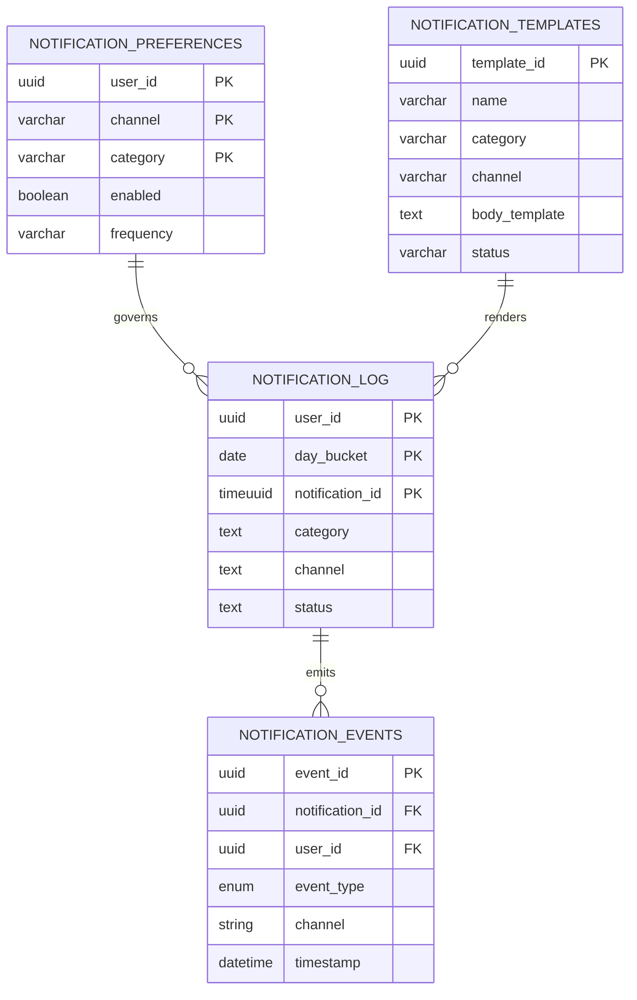
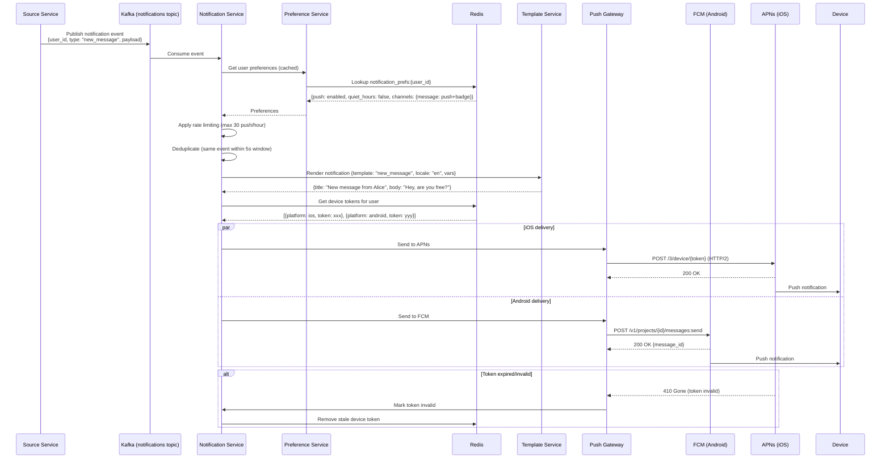
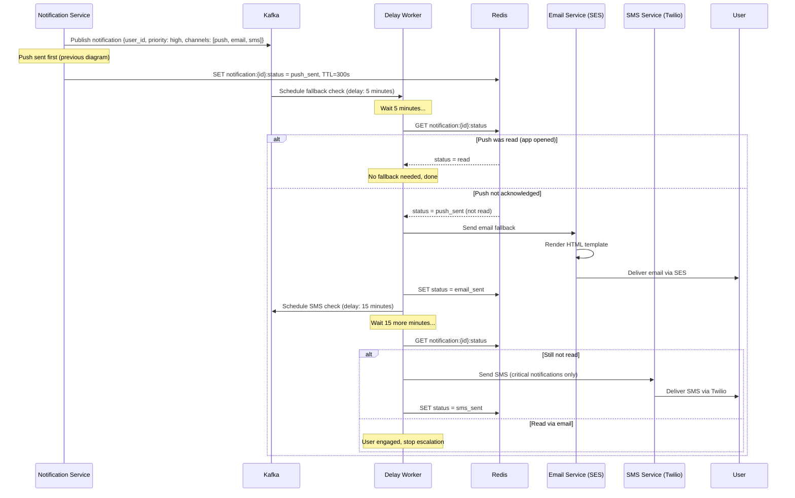
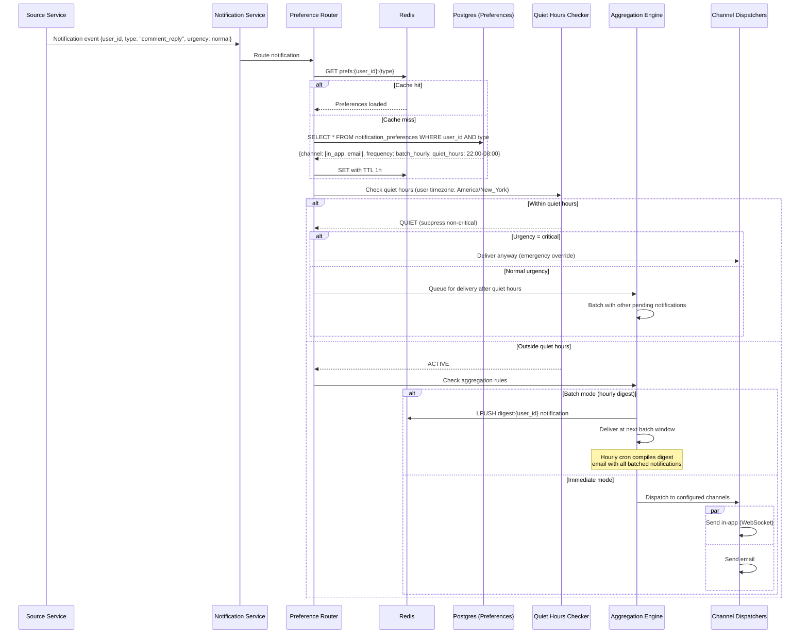

# Design Notification System - World-Class System Design

## 1. Functional Requirements

| # | Requirement | Description |
|---|---|---|
| FR1 | Multi-channel delivery | Push notifications (iOS APNs, Android FCM), SMS, Email, In-app, WebSocket, Webhook |
| FR2 | Template management | Create, version, and localize notification templates with variable interpolation |
| FR3 | User preferences | Per-user, per-channel, per-category opt-in/opt-out with quiet hours |
| FR4 | Priority levels | Critical (always deliver), High (bypass quiet hours), Normal, Low (batch) |
| FR5 | Rate limiting | Per-user rate limits to prevent notification fatigue |
| FR6 | Delivery tracking | Track sent, delivered, opened, clicked, bounced, failed states |
| FR7 | Scheduling | Schedule notifications for future delivery; timezone-aware |
| FR8 | Batching & digest | Aggregate low-priority notifications into periodic digests |
| FR9 | A/B testing | Test different templates/channels for engagement optimization |
| FR10 | Retry with backoff | Automatic retry for failed deliveries with exponential backoff |
| FR11 | Transactional notifications | OTP, password reset, order confirmations - guaranteed delivery |
| FR12 | Bulk/campaign notifications | Send to millions of users (marketing campaigns) |

## 2. Non-Functional Requirements

| # | NFR | Target |
|---|---|---|
| NFR1 | Availability | 99.99% for transactional, 99.9% for marketing |
| NFR2 | Latency - transactional | p99 < 3 seconds end-to-end (trigger → device) |
| NFR3 | Latency - in-app | p99 < 500ms |
| NFR4 | Throughput | 1M notifications/minute sustained, 10M/min burst |
| NFR5 | Delivery rate | >99.5% for transactional, >95% for marketing |
| NFR6 | Ordering | Per-user ordering for same-priority notifications |
| NFR7 | Deduplication | Same notification not delivered twice within 1 hour |
| NFR8 | Scale | 500M registered devices, 200M DAU |
| NFR9 | Data retention | Delivery logs: 90 days hot, 2 years cold |
| NFR10 | Compliance | GDPR, CAN-SPAM, TCPA for SMS |

## 3. Capacity Estimation

### 3.1 Traffic Metrics

| Metric | Value |
|---|---|
| DAU | 200M |
| Registered devices | 500M (avg 2.5 devices/user) |
| Notifications generated/day | 2B |
| Push notifications/day | 1.5B |
| Emails/day | 300M |
| SMS/day | 50M |
| In-app/day | 500M |
| Webhooks/day | 100M |

### 3.2 QPS Estimation

| Operation | Calculation | QPS |
|---|---|---|
| Notification ingestion | 2B / 86400 | ~23K/s avg, 100K/s peak |
| Push delivery | 1.5B / 86400 | ~17K/s avg, 200K/s peak (campaigns) |
| Email dispatch | 300M / 86400 | ~3.5K/s |
| SMS dispatch | 50M / 86400 | ~580/s |
| Delivery status updates | 2B × 3 states / 86400 | ~70K/s |
| Preference reads | 200M logins × 5 / 86400 | ~11.5K/s |
| Template renders | 2B / 86400 | ~23K/s |

### 3.3 Storage Estimation

| Data | Calculation | Storage |
|---|---|---|
| Device tokens | 500M × 256 bytes | ~128 GB |
| User preferences | 200M × 1 KB | ~200 GB |
| Templates | 10K × 10 KB | ~100 MB |
| Notification logs (hot) | 2B/day × 90 days × 512 bytes | ~90 TB |
| Notification logs (cold) | 2B/day × 730 days × 256 bytes (compressed) | ~365 TB |
| Delivery tracking | 2B × 3 events × 128 bytes / day | ~67 TB/month |

### 3.4 Bandwidth Estimation

| Channel | Calculation | Bandwidth |
|---|---|---|
| Kafka ingestion | 100K/s × 1 KB | ~100 MB/s |
| Push to APNs/FCM | 200K/s × 4 KB | ~800 MB/s peak |
| Email to SMTP | 3.5K/s × 50 KB | ~175 MB/s |
| Status webhooks | 70K/s × 256 bytes | ~18 MB/s |

## 4. Data Modeling

### Entity-Relationship Diagram



### 4.1 Database Selection

| Workload | Database | Justification |
|---|---|---|
| User preferences | PostgreSQL (partitioned) | Relational, complex queries, ACID |
| Device registry | DynamoDB / Cassandra | High write throughput, lookup by user_id + device_id |
| Templates | PostgreSQL + Redis cache | Versioned, needs transactions for publishing |
| Notification logs | Cassandra (time-series) | Massive write volume, time-bucketed reads |
| Delivery tracking | Kafka + ClickHouse | Event stream for real-time + analytics |
| Scheduled notifications | Redis Sorted Sets + PostgreSQL | Priority queue with persistence |
| Rate limit counters | Redis | Atomic increments, TTL-based windows |
| Idempotency store | Redis | Fast dedup with TTL expiry |

### 4.2 Schema Design

#### PostgreSQL: User Preferences
```sql
CREATE TABLE notification_preferences (
    user_id           UUID NOT NULL,
    channel           VARCHAR(20) NOT NULL,  -- push, email, sms, in_app, webhook
    category          VARCHAR(50) NOT NULL,  -- marketing, transactional, social, etc.
    enabled           BOOLEAN DEFAULT TRUE,
    quiet_hours_start TIME,
    quiet_hours_end   TIME,
    timezone          VARCHAR(50) DEFAULT 'UTC',
    frequency         VARCHAR(20) DEFAULT 'immediate', -- immediate, hourly, daily
    updated_at        TIMESTAMP DEFAULT NOW(),
    PRIMARY KEY (user_id, channel, category)
);

CREATE INDEX idx_prefs_user ON notification_preferences(user_id);
CREATE INDEX idx_prefs_channel_category ON notification_preferences(channel, category);

CREATE TABLE notification_templates (
    template_id       UUID PRIMARY KEY DEFAULT gen_random_uuid(),
    name              VARCHAR(100) NOT NULL UNIQUE,
    version           INT NOT NULL DEFAULT 1,
    category          VARCHAR(50) NOT NULL,
    channel           VARCHAR(20) NOT NULL,
    subject_template  TEXT,
    body_template     TEXT NOT NULL,
    locale            VARCHAR(10) DEFAULT 'en',
    variables         JSONB,           -- schema of expected variables
    status            VARCHAR(20) DEFAULT 'draft', -- draft, active, archived
    created_at        TIMESTAMP DEFAULT NOW(),
    updated_at        TIMESTAMP DEFAULT NOW(),
    created_by        UUID,
    UNIQUE(name, version, locale, channel)
);

CREATE INDEX idx_templates_active ON notification_templates(name, channel, locale) WHERE status = 'active';
```

#### DynamoDB: Device Registry
```json
{
  "TableName": "device_registry",
  "KeySchema": [
    {"AttributeName": "user_id", "KeyType": "HASH"},
    {"AttributeName": "device_id", "KeyType": "RANGE"}
  ],
  "Attributes": {
    "user_id": "UUID",
    "device_id": "UUID",
    "platform": "ios|android|web|desktop",
    "push_token": "String (APNs/FCM token)",
    "token_updated_at": "Timestamp",
    "app_version": "String",
    "os_version": "String",
    "locale": "String",
    "last_active_at": "Timestamp",
    "is_active": "Boolean",
    "created_at": "Timestamp"
  },
  "GSI": [
    {"name": "token-index", "hash": "push_token", "projection": "user_id,device_id,platform"}
  ]
}
```

#### Cassandra: Notification Logs
```sql
CREATE TABLE notification_log (
    user_id         UUID,
    day_bucket      DATE,
    notification_id TIMEUUID,
    category        TEXT,
    channel         TEXT,
    template_name   TEXT,
    title           TEXT,
    body_preview    TEXT,
    status          TEXT,     -- pending, sent, delivered, opened, failed
    priority        TINYINT,
    metadata        MAP<TEXT, TEXT>,
    created_at      TIMESTAMP,
    sent_at         TIMESTAMP,
    delivered_at    TIMESTAMP,
    opened_at       TIMESTAMP,
    PRIMARY KEY ((user_id, day_bucket), notification_id)
) WITH CLUSTERING ORDER BY (notification_id DESC)
  AND default_time_to_live = 7776000; -- 90 days

CREATE TABLE notification_by_status (
    status          TEXT,
    hour_bucket     TIMESTAMP,
    notification_id TIMEUUID,
    user_id         UUID,
    channel         TEXT,
    error_code      TEXT,
    PRIMARY KEY ((status, hour_bucket), notification_id)
) WITH CLUSTERING ORDER BY (notification_id DESC)
  AND default_time_to_live = 604800; -- 7 days
```

#### ClickHouse: Delivery Analytics
```sql
CREATE TABLE notification_events ON CLUSTER 'analytics' (
    event_id          UUID,
    notification_id   UUID,
    user_id           UUID,
    event_type        Enum8('created'=1,'sent'=2,'delivered'=3,'opened'=4,'clicked'=5,'bounced'=6,'failed'=7,'unsubscribed'=8),
    channel           LowCardinality(String),
    category          LowCardinality(String),
    template_name     LowCardinality(String),
    provider          LowCardinality(String),
    error_code        Nullable(String),
    latency_ms        UInt32,
    timestamp         DateTime64(3),
    metadata          Map(String, String)
) ENGINE = ReplicatedMergeTree('/clickhouse/tables/{shard}/notification_events', '{replica}')
PARTITION BY toYYYYMMDD(timestamp)
ORDER BY (channel, category, timestamp, user_id)
TTL timestamp + INTERVAL 2 YEAR;

-- Materialized view: Hourly delivery metrics
CREATE MATERIALIZED VIEW notification_hourly_metrics
ENGINE = SummingMergeTree()
PARTITION BY toYYYYMMDD(hour)
ORDER BY (channel, category, template_name, hour)
AS SELECT
    toStartOfHour(timestamp) AS hour,
    channel, category, template_name,
    countIf(event_type = 'sent') AS sent,
    countIf(event_type = 'delivered') AS delivered,
    countIf(event_type = 'opened') AS opened,
    countIf(event_type = 'clicked') AS clicked,
    countIf(event_type = 'failed') AS failed,
    avgIf(latency_ms, event_type = 'delivered') AS avg_delivery_latency_ms,
    quantileIf(0.99)(latency_ms, event_type = 'delivered') AS p99_delivery_latency_ms
FROM notification_events
GROUP BY hour, channel, category, template_name;
```

## 5. High-Level Design (HLD)

### 5.1 Architecture Diagram

```
┌────────────────────────────────────────────────────────────────────────────┐
│                           PRODUCERS / TRIGGERS                               │
│  [Order Service] [Auth Service] [Social Service] [Marketing Platform]       │
│  [Payment Service] [Scheduler] [Campaign Engine] [Webhook Triggers]         │
└───────────────────────────────────┬────────────────────────────────────────┘
                                    │ gRPC / Kafka Events
                                    ▼
┌────────────────────────────────────────────────────────────────────────────┐
│                        INGESTION LAYER                                       │
│                                                                              │
│  ┌──────────────────────────────────────────────────────────────────────┐  │
│  │                  Notification API Gateway                              │  │
│  │  ┌───────────┐ ┌───────────┐ ┌─────────────┐ ┌──────────────────┐  │  │
│  │  │Rate Limit │ │Dedup Check│ │ Validate &  │ │ Priority Router  │  │  │
│  │  │(Redis)    │ │(Redis)    │ │ Enrich      │ │                  │  │  │
│  │  └───────────┘ └───────────┘ └─────────────┘ └──────────────────┘  │  │
│  └──────────────────────────────────────────────────────────────────────┘  │
│                                    │                                         │
└────────────────────────────────────┼────────────────────────────────────────┘
                                     ▼
┌────────────────────────────────────────────────────────────────────────────┐
│                      KAFKA EVENT BUS                                         │
│                                                                              │
│  ┌──────────────┐ ┌──────────────┐ ┌──────────────┐ ┌──────────────┐     │
│  │notifications │ │notifications │ │notifications │ │notification  │     │
│  │.high_priority│ │.normal       │ │.low_priority │ │.bulk         │     │
│  │(16 parts)    │ │(32 parts)    │ │(16 parts)    │ │(64 parts)    │     │
│  └──────────────┘ └──────────────┘ └──────────────┘ └──────────────┘     │
│  ┌──────────────┐ ┌──────────────┐ ┌──────────────┐                      │
│  │delivery      │ │notification  │ │notification  │                      │
│  │.status       │ │.scheduled    │ │.dlq          │                      │
│  │(32 parts)    │ │(8 parts)     │ │(8 parts)     │                      │
│  └──────────────┘ └──────────────┘ └──────────────┘                      │
└────────────────────────────────────┬───────────────────────────────────────┘
                                     │
                                     ▼
┌────────────────────────────────────────────────────────────────────────────┐
│                   PROCESSING LAYER                                           │
│                                                                              │
│  ┌─────────────────┐  ┌─────────────────┐  ┌─────────────────────────┐   │
│  │ Preference       │  │ Template        │  │ Channel Router          │   │
│  │ Evaluator        │  │ Renderer        │  │ (decides which channels)│   │
│  │ - Check opt-in   │  │ - Handlebars    │  │ - Multi-channel split   │   │
│  │ - Quiet hours    │  │ - i18n/l10n     │  │ - Fallback chain        │   │
│  │ - Frequency cap  │  │ - A/B variant   │  │                         │   │
│  │ - Category rules │  │ - Personalize   │  │                         │   │
│  └─────────────────┘  └─────────────────┘  └─────────────────────────┘   │
│                                                                              │
└────────────────────────────────────┬───────────────────────────────────────┘
                                     │
                                     ▼
┌────────────────────────────────────────────────────────────────────────────┐
│                    DELIVERY LAYER (Channel Workers)                          │
│                                                                              │
│  ┌─────────────┐ ┌─────────────┐ ┌─────────────┐ ┌─────────────┐        │
│  │ Push Worker │ │ Email Worker│ │ SMS Worker  │ │ In-App      │        │
│  │             │ │             │ │             │ │ Worker      │        │
│  │ ┌─────────┐│ │ ┌─────────┐│ │ ┌─────────┐│ │ ┌─────────┐│        │
│  │ │APNs Pool││ │ │SES/SMTP ││ │ │Twilio   ││ │ │WebSocket││        │
│  │ │FCM Pool ││ │ │SendGrid ││ │ │Vonage   ││ │ │SSE      ││        │
│  │ │WebPush  ││ │ │Mailgun  ││ │ │AWS SNS  ││ │ │Poll API ││        │
│  │ └─────────┘│ └─────────────┘ │ └─────────┘│ │ └─────────┘│        │
│  └─────────────┘                  └─────────────┘ └─────────────┘        │
│                                                                              │
│  ┌─────────────┐ ┌───────────────────────────────────────────────┐        │
│  │ Webhook     │ │ Retry Queue (exponential backoff)              │        │
│  │ Worker      │ │ ┌─────┐ ┌─────┐ ┌─────┐ ┌─────┐ ┌─────┐   │        │
│  │ ┌─────────┐│ │ │ 1s  │ │ 5s  │ │ 30s │ │ 5m  │ │ 30m │   │        │
│  │ │HTTP POST││ │ └─────┘ └─────┘ └─────┘ └─────┘ └─────┘   │        │
│  │ └─────────┘│ └───────────────────────────────────────────────┘        │
│  └─────────────┘                                                           │
└────────────────────────────────────┬───────────────────────────────────────┘
                                     │
                                     ▼
┌────────────────────────────────────────────────────────────────────────────┐
│                      DATA LAYER                                              │
│                                                                              │
│  ┌──────────────┐  ┌──────────────┐  ┌──────────────┐  ┌──────────────┐ │
│  │ PostgreSQL   │  │ DynamoDB     │  │ Cassandra    │  │ Redis        │ │
│  │ (Preferences │  │ (Device      │  │ (Notif Logs  │  │ (Rate Limits │ │
│  │  + Templates)│  │  Registry)   │  │  + Delivery) │  │  + Dedup     │ │
│  └──────────────┘  └──────────────┘  └──────────────┘  │  + Scheduled)│ │
│                                                          └──────────────┘ │
│  ┌──────────────┐  ┌──────────────┐  ┌──────────────┐                    │
│  │ ClickHouse   │  │ S3           │  │ ElasticSearch│                    │
│  │ (Analytics)  │  │ (Archives +  │  │ (Search Logs)│                    │
│  │              │  │  Attachments)│  │              │                    │
│  └──────────────┘  └──────────────┘  └──────────────┘                    │
└────────────────────────────────────────────────────────────────────────────┘
```

### 5.2 Microservice Patterns

| Pattern | Application |
|---|---|
| **Event-Driven Architecture** | All notifications flow through Kafka events |
| **Priority Queue** | Separate topics for different priority levels |
| **Chain of Responsibility** | Preference → Template → Channel → Delivery pipeline |
| **Strategy Pattern** | Multiple delivery providers per channel with failover |
| **Circuit Breaker** | Per-provider circuit breakers (APNs, FCM, SES) |
| **Outbox Pattern** | Producers write notification + outbox row atomically |
| **Saga Pattern** | Multi-channel delivery coordination with compensation |
| **Bulkhead** | Isolated thread pools per channel/provider |
| **Dead Letter Queue** | Failed notifications after max retries → DLQ for investigation |

## 6. Low-Level Design (LLD)

### 6.1 Notification Ingestion API

```http
POST /api/v1/notifications
Authorization: Bearer <service_token>
Idempotency-Key: <uuid>
X-Request-Id: <trace_id>
Content-Type: application/json

Request:
{
  "notification_id": "notif_abc123",     // optional, server generates if missing
  "recipient": {
    "user_id": "u_456",                  // required for targeted
    "segment_id": "seg_marketing_active" // for bulk campaigns
  },
  "template": {
    "name": "order_confirmation",
    "version": 3,                        // optional, uses latest active
    "variables": {
      "order_id": "ORD-789",
      "amount": "$49.99",
      "delivery_date": "May 20, 2025"
    }
  },
  "channels": ["push", "email", "in_app"],  // optional, uses defaults
  "priority": "high",                         // critical, high, normal, low
  "category": "transactional",
  "scheduling": {
    "send_at": null,                          // null = immediate
    "timezone_aware": true,
    "respect_quiet_hours": false              // false for transactional
  },
  "options": {
    "ttl_seconds": 86400,
    "collapse_key": "order_ORD-789",         // replaces previous with same key
    "sound": "default",
    "badge_count": 5,
    "action_url": "myapp://orders/ORD-789",
    "image_url": "https://cdn.example.com/order-confirmed.png"
  },
  "metadata": {
    "source_service": "order-service",
    "trace_id": "trace_xyz"
  }
}

Response (202 Accepted):
{
  "notification_id": "notif_abc123",
  "status": "accepted",
  "estimated_channels": ["push", "email", "in_app"],
  "request_id": "req_def456",
  "trace_id": "trace_xyz"
}
```

### 6.2 Preference Management API

```http
GET /api/v1/users/{user_id}/notification-preferences
Authorization: Bearer <token>

Response (200 OK):
{
  "user_id": "u_456",
  "global_enabled": true,
  "quiet_hours": {
    "enabled": true,
    "start": "22:00",
    "end": "08:00",
    "timezone": "America/New_York"
  },
  "channels": {
    "push": {"enabled": true, "categories": {"marketing": false, "social": true, "transactional": true}},
    "email": {"enabled": true, "frequency": "daily_digest", "categories": {"marketing": true}},
    "sms": {"enabled": false},
    "in_app": {"enabled": true}
  },
  "rate_limits": {
    "push_per_hour": 20,
    "email_per_day": 5,
    "sms_per_day": 3
  }
}

PUT /api/v1/users/{user_id}/notification-preferences
Authorization: Bearer <token>
Content-Type: application/json

Request:
{
  "channel": "push",
  "category": "marketing",
  "enabled": false
}

Response (200 OK):
{
  "updated": true,
  "channel": "push",
  "category": "marketing",
  "enabled": false,
  "effective_at": "2025-05-18T10:00:00Z"
}
```

### 6.3 Delivery Status Webhook

```http
POST /internal/v1/delivery-status
X-Provider: apns
X-Signature: <hmac_signature>

Request:
{
  "notification_id": "notif_abc123",
  "device_id": "d_789",
  "status": "delivered",
  "provider_message_id": "apns_msg_xyz",
  "timestamp": "2025-05-18T10:00:05Z",
  "metadata": {
    "apns_id": "...",
    "http_status": 200
  }
}
```

### 6.4 Internal gRPC Services

```protobuf
syntax = "proto3";
package notification.v1;

service NotificationIngestionService {
  rpc SendNotification(SendNotificationRequest) returns (SendNotificationResponse);
  rpc SendBulkNotification(SendBulkRequest) returns (SendBulkResponse);
  rpc ScheduleNotification(ScheduleRequest) returns (ScheduleResponse);
  rpc CancelNotification(CancelRequest) returns (CancelResponse);
}

service PreferenceService {
  rpc GetPreferences(GetPreferencesRequest) returns (PreferencesResponse);
  rpc EvaluateDelivery(EvaluateDeliveryRequest) returns (EvaluateDeliveryResponse);
  rpc CheckRateLimit(RateLimitRequest) returns (RateLimitResponse);
}

service TemplateService {
  rpc RenderTemplate(RenderRequest) returns (RenderResponse);
  rpc GetTemplate(GetTemplateRequest) returns (TemplateResponse);
  rpc ValidateVariables(ValidateRequest) returns (ValidateResponse);
}

service DeviceRegistryService {
  rpc RegisterDevice(RegisterDeviceRequest) returns (RegisterDeviceResponse);
  rpc GetUserDevices(GetUserDevicesRequest) returns (GetUserDevicesResponse);
  rpc InvalidateToken(InvalidateTokenRequest) returns (InvalidateTokenResponse);
  rpc UpdateLastActive(UpdateLastActiveRequest) returns (UpdateLastActiveResponse);
}

service DeliveryService {
  rpc DeliverPush(PushRequest) returns (PushResponse);
  rpc DeliverEmail(EmailRequest) returns (EmailResponse);
  rpc DeliverSMS(SMSRequest) returns (SMSResponse);
  rpc GetDeliveryStatus(StatusRequest) returns (StatusResponse);
}
```

## 7. Architecture Components Deep Dive

### 7.1 Route 53 + CloudFront + WAF

- **Route 53**: Latency-based routing to nearest notification API region
- **CloudFront**: Cache static assets (notification images, templates CSS for emails)
- **WAF Rules**:
  - Rate limit: 100 requests/second per service API key
  - Block known bad actors / bot signatures
  - Payload size limit: 256 KB per notification request
  - SQL injection / XSS protection on template variables

### 7.2 API Gateway (Kong / AWS API Gateway)

- **Authentication**: Mutual TLS for service-to-service, JWT for admin APIs
- **Throttling**: Per-service quotas (Order Service: 50K/s, Marketing: 10K/s)
- **Request validation**: JSON schema validation before processing
- **Versioning**: API versioning (v1, v2) with backward compatibility
- **Request transformation**: Normalize different producer formats

### 7.3 Notification Processing Pipeline

```
┌─────────────────────────────────────────────────────────────────┐
│                NOTIFICATION PROCESSING PIPELINE                   │
│                                                                   │
│  Stage 1: INGESTION & VALIDATION                                 │
│  ┌─────────────────────────────────────────────────────────┐    │
│  │ • Validate schema & required fields                      │    │
│  │ • Check idempotency key (Redis SETNX with TTL)          │    │
│  │ • Enrich with user locale, timezone from profile cache   │    │
│  │ • Assign priority queue based on category + priority     │    │
│  │ • Produce to appropriate Kafka topic                     │    │
│  └─────────────────────────────────────────────────────────┘    │
│                         │                                         │
│  Stage 2: PREFERENCE EVALUATION                                  │
│  ┌─────────────────────────────────────────────────────────┐    │
│  │ • Load user preferences (Redis cache → PostgreSQL)      │    │
│  │ • Check global opt-out                                   │    │
│  │ • Check channel + category opt-in                        │    │
│  │ • Evaluate quiet hours (timezone-aware)                  │    │
│  │ • Check rate limits (sliding window in Redis)            │    │
│  │ • Check frequency caps (hourly/daily per channel)        │    │
│  │ • Decision: deliver / defer / suppress / digest          │    │
│  └─────────────────────────────────────────────────────────┘    │
│                         │                                         │
│  Stage 3: TEMPLATE RENDERING                                     │
│  ┌─────────────────────────────────────────────────────────┐    │
│  │ • Resolve template by name + version + locale + channel │    │
│  │ • Interpolate variables using Handlebars/Mustache        │    │
│  │ • Apply A/B test variant if enrolled                     │    │
│  │ • Generate channel-specific payload:                     │    │
│  │   - Push: title, body, data, badge, sound               │    │
│  │   - Email: subject, HTML body, text body, headers       │    │
│  │   - SMS: text body (160 char segments)                   │    │
│  │   - In-app: structured card data                         │    │
│  └─────────────────────────────────────────────────────────┘    │
│                         │                                         │
│  Stage 4: CHANNEL ROUTING & DELIVERY                             │
│  ┌─────────────────────────────────────────────────────────┐    │
│  │ • Route to channel-specific worker queues                │    │
│  │ • Resolve device tokens (DeviceRegistry)                 │    │
│  │ • Apply channel-specific optimizations                   │    │
│  │ • Execute delivery with provider SDK                     │    │
│  │ • Handle provider responses (success/failure/retry)      │    │
│  │ • Update delivery status in tracking store               │    │
│  └─────────────────────────────────────────────────────────┘    │
│                                                                   │
└─────────────────────────────────────────────────────────────────┘
```

### 7.4 Push Notification Worker (Deep Dive)

```
┌─────────────────────────────────────────────────────────────────┐
│                  PUSH NOTIFICATION WORKER                         │
│                                                                   │
│  ┌─────────────┐                                                │
│  │ Kafka       │   Consumer Group: push-workers (32 instances)  │
│  │ Consumer    │                                                │
│  └──────┬──────┘                                                │
│         │                                                        │
│         ▼                                                        │
│  ┌─────────────────────────────────────────────────────┐        │
│  │  Device Resolution                                    │        │
│  │  user_id → [device_1(iOS), device_2(Android), ...]  │        │
│  │  Filter: only active devices, valid tokens           │        │
│  └──────────────────────────┬──────────────────────────┘        │
│                              │                                    │
│         ┌────────────────────┼────────────────────┐              │
│         ▼                    ▼                    ▼              │
│  ┌─────────────┐     ┌─────────────┐     ┌─────────────┐      │
│  │ APNs Client │     │ FCM Client  │     │ WebPush     │      │
│  │             │     │             │     │ Client      │      │
│  │ HTTP/2 conn │     │ HTTP/2 conn │     │             │      │
│  │ pool (100)  │     │ pool (100)  │     │ HTTP conn   │      │
│  │             │     │             │     │ pool (50)   │      │
│  │ Rate: 5K/s  │     │ Rate: 10K/s │     │             │      │
│  └──────┬──────┘     └──────┬──────┘     └──────┬──────┘      │
│         │                    │                    │              │
│         ▼                    ▼                    ▼              │
│  ┌─────────────────────────────────────────────────────┐        │
│  │  Response Handler                                     │        │
│  │  • 200: Mark delivered, emit status event            │        │
│  │  • 400: Invalid token → invalidate in registry       │        │
│  │  • 410: Token expired → remove from registry         │        │
│  │  • 429: Rate limited → backoff + retry               │        │
│  │  • 500: Server error → retry with exponential backoff│        │
│  └─────────────────────────────────────────────────────┘        │
│                                                                   │
└─────────────────────────────────────────────────────────────────┘
```

### 7.5 Email Delivery Worker

- **Connection pooling**: Maintain SMTP connection pools to SES/SendGrid
- **Warm-up**: Gradually increase sending volume on new IPs (reputation)
- **Bounce handling**: Process bounce/complaint webhooks from provider
- **DKIM/SPF/DMARC**: Proper authentication headers for deliverability
- **Rendering**: MJML → HTML conversion with inline CSS for email clients
- **Tracking pixels**: Inject open-tracking pixel, wrap links for click tracking
- **Unsubscribe headers**: RFC 8058 List-Unsubscribe-Post header

### 7.6 Scheduling Service

```
┌─────────────────────────────────────────────────────────┐
│              SCHEDULING SERVICE                           │
│                                                           │
│  Data Structure: Redis Sorted Set                        │
│  Key: scheduled_notifications                             │
│  Score: delivery_timestamp (unix epoch)                   │
│  Member: notification_id                                  │
│                                                           │
│  ZADD scheduled_notifications 1716024000 "notif_abc"     │
│                                                           │
│  ┌─────────────────────────────────────────────────┐    │
│  │  Scheduler Worker (runs every 1 second):         │    │
│  │                                                   │    │
│  │  1. ZRANGEBYSCORE scheduled_notifications        │    │
│  │     -inf <current_timestamp> LIMIT 0 1000        │    │
│  │                                                   │    │
│  │  2. For each notification:                        │    │
│  │     - Load full payload from PostgreSQL           │    │
│  │     - Publish to Kafka ingestion topic            │    │
│  │     - ZREM from sorted set                        │    │
│  │                                                   │    │
│  │  3. Distributed lock (Redlock) prevents           │    │
│  │     multiple workers processing same batch        │    │
│  └─────────────────────────────────────────────────┘    │
│                                                           │
│  Quiet Hours Deferral:                                   │
│  - If notification arrives during quiet hours:           │
│  - Calculate next window open time                       │
│  - ZADD with deferred timestamp                          │
│  - Mark as "deferred" in notification log               │
│                                                           │
└─────────────────────────────────────────────────────────┘
```

## 8. Deep Dive of Each Component

### 8.1 Rate Limiting (Deep Dive)

**Multi-level rate limiting using Redis:**

```lua
-- Sliding window rate limiter (Redis Lua script)
-- Key: ratelimit:{user_id}:{channel}:{window}
-- Returns: 1 if allowed, 0 if denied

local key = KEYS[1]
local window_size = tonumber(ARGV[1])  -- e.g., 3600 for hourly
local max_requests = tonumber(ARGV[2]) -- e.g., 20 push/hour
local now = tonumber(ARGV[3])
local window_start = now - window_size

-- Remove expired entries
redis.call('ZREMRANGEBYSCORE', key, '-inf', window_start)

-- Count current requests in window
local current_count = redis.call('ZCARD', key)

if current_count < max_requests then
    -- Allow and record
    redis.call('ZADD', key, now, now .. ':' .. math.random(1000000))
    redis.call('EXPIRE', key, window_size)
    return 1
else
    return 0
end
```

**Rate limit hierarchy:**
1. Global system limit: 1M notifications/minute
2. Per-service limit: Based on service SLA agreement
3. Per-user limit: Channel-specific (20 push/hour, 5 email/day, 3 SMS/day)
4. Per-category limit: Max 2 marketing notifications/day
5. Anti-abuse: Detect notification bombing (>100 notifs to same user in 1 min)

### 8.2 Deduplication (Deep Dive)

```
Dedup Strategy:
1. Idempotency Key (Producer-level):
   - Redis: SETNX idempotency:{key} "" EX 3600
   - If key exists → return cached response (no reprocessing)

2. Content-based dedup (System-level):
   - Hash: SHA256(user_id + template + variables + channel)
   - Redis: SETNX dedup:{hash} "" EX 3600
   - Prevents same content sent twice even with different idempotency keys

3. Collapse Key (Device-level):
   - APNs: apns-collapse-id header
   - FCM: collapse_key field
   - New notification replaces previous with same collapse key on device
```

### 8.3 Digest/Batching Engine (Deep Dive)

```
┌─────────────────────────────────────────────────────────┐
│              DIGEST ENGINE                                │
│                                                           │
│  Trigger: User preference = "daily_digest" for email    │
│                                                           │
│  1. Low-priority notifications accumulated in:           │
│     Redis List: digest:{user_id}:{channel}:{date}       │
│                                                           │
│  2. Digest Scheduler (runs daily per timezone bucket):   │
│     - Group users by timezone                            │
│     - For each user with pending digest items:           │
│       a. LRANGE digest:{user_id}:email:{today} 0 -1     │
│       b. Group by category                               │
│       c. Render digest template with all items           │
│       d. Send single email with all notifications        │
│       e. DEL digest key                                  │
│                                                           │
│  3. Digest Template Structure:                           │
│     - Header: "Your daily summary - 12 new updates"     │
│     - Section: Social (3 items)                          │
│     - Section: Activity (5 items)                        │
│     - Section: Marketing (4 items)                       │
│     - Footer: Preference management link                 │
│                                                           │
│  Timezone-bucketed execution:                            │
│  - Bucket users by UTC offset (24 buckets)              │
│  - Trigger digest at 8:00 AM local time                 │
│  - Spread execution over the hour (jitter)              │
│                                                           │
└─────────────────────────────────────────────────────────┘
```

### 8.4 Provider Failover (Deep Dive)

```
Provider Selection Strategy:

Primary/Fallback Chain per Channel:
- Push (iOS): APNs (primary) → no fallback (Apple-only)
- Push (Android): FCM (primary) → Huawei Push Kit (fallback for Huawei devices)
- Email: SES (primary) → SendGrid (secondary) → Mailgun (tertiary)
- SMS: Twilio (primary) → Vonage (secondary) → AWS SNS (tertiary)

Circuit Breaker Configuration:
┌────────────────────────────────────────┐
│ Provider Circuit Breaker               │
│                                        │
│ States: CLOSED → OPEN → HALF_OPEN     │
│                                        │
│ CLOSED → OPEN:                         │
│   - 50% failure rate in 30s window     │
│   - OR p99 latency > 10s for 1 min    │
│   - OR 5xx rate > 10% for 30s         │
│                                        │
│ OPEN duration: 60 seconds              │
│                                        │
│ HALF_OPEN:                             │
│   - Allow 10 probe requests            │
│   - If >80% succeed → CLOSED           │
│   - If <50% succeed → OPEN again       │
│                                        │
│ On OPEN: Route to fallback provider    │
└────────────────────────────────────────┘
```

## 9. Component Optimization

### 9.1 Kafka Optimization

```yaml
# Topic: notifications.high_priority
partitions: 16
replication.factor: 3
min.insync.replicas: 2
retention.ms: 86400000          # 24 hours
compression.type: lz4
max.message.bytes: 1048576      # 1 MB

# Producer Config (Notification API):
acks: all                        # Guaranteed delivery for transactional
linger.ms: 0                     # No batching delay for high priority
enable.idempotence: true
max.in.flight.requests: 5

# Topic: notifications.bulk (campaign)
partitions: 64
compression.type: zstd           # Better ratio for large batches
batch.size: 262144               # 256 KB batches
linger.ms: 50                    # Allow batching for throughput
acks: 1                          # Acceptable for marketing
```

**Consumer optimization:**
- Use cooperative sticky partition assignment
- Process messages in micro-batches (100 at a time)
- Parallel processing within consumer using thread pool
- Manual offset commit after successful delivery confirmation
- Pause partitions when downstream is slow (backpressure)

### 9.2 Redis Optimization

```
# Rate Limiting: Use Redis Cluster with read replicas
# Dedup: Use separate Redis instance (less critical)
# Scheduled: Use Redis with AOF persistence (crash recovery)

# Memory optimization:
# - Use Redis Streams for notification event log (compact)
# - Use Hash encoding for preferences (ziplist for small hashes)
# - Pipeline commands: batch 100 operations per pipeline
# - Connection pooling: 50 connections per service instance

# Lua scripts for atomic operations:
# - Rate limit check + increment (single round trip)
# - Dedup check + set (single round trip)
# - Schedule check + remove (single round trip)

# Cluster topology: 6 shards × (1 primary + 2 replicas) = 18 nodes
# Total memory: 6 × 32 GB = 192 GB cluster capacity
```

### 9.3 Push Notification Optimization

```
APNs Optimization:
- HTTP/2 multiplexing: 500 concurrent streams per connection
- Connection pool: 100 persistent connections per worker
- Token-based auth (not certificate) - no connection re-auth needed
- Batch by priority: immediate notifications skip queue
- Device token validation: pre-filter invalid tokens before sending

FCM Optimization:
- HTTP v1 API (not legacy) for better features
- Topic messaging for broadcast scenarios
- Message batching: up to 500 messages per batch request
- Condition-based targeting for segment campaigns
- Analytics integration for delivery receipts

Payload Optimization:
- Push payload < 4 KB (APNs limit)
- Use data-only messages for background updates
- Mutable content flag for client-side modification
- Critical alerts for high-priority (iOS Critical Alerts)
```

### 9.4 Database Optimization

```sql
-- Cassandra: Optimize for time-series notification log
-- Use TimeWindowCompactionStrategy for time-bucketed data
ALTER TABLE notification_log WITH compaction = {
  'class': 'TimeWindowCompactionStrategy',
  'compaction_window_unit': 'DAYS',
  'compaction_window_size': 1
};

-- Partition sizing: Keep partitions < 100MB
-- user_id + day_bucket ensures manageable partitions
-- Heavy users (>1000 notifs/day) may need hourly buckets

-- ClickHouse: Pre-aggregate for dashboard queries
CREATE MATERIALIZED VIEW delivery_funnel
ENGINE = AggregatingMergeTree()
PARTITION BY toYYYYMMDD(hour)
ORDER BY (channel, category, hour)
AS SELECT
    toStartOfHour(timestamp) AS hour,
    channel, category,
    uniqState(user_id) AS unique_users,
    countState() AS total_events,
    countIfState(event_type = 'delivered') AS delivered,
    countIfState(event_type = 'opened') AS opened
FROM notification_events
GROUP BY hour, channel, category;
```

### 9.5 Bulk Campaign Optimization

```
Campaign sending 10M notifications:

Strategy: Segmented parallel processing
1. Campaign service creates segment query
2. Segment resolved into user_id batches (10K per batch)
3. Each batch published to Kafka notifications.bulk topic
4. 64 partitions × 4 consumers = 256 parallel workers
5. Each worker processes 10K users → 2.56M concurrent

Throttling:
- Campaign throughput cap: 100K/minute (prevents overwhelming providers)
- Provider-specific rate limits respected per worker
- Gradual ramp: Start at 10K/min, increase 10x every 10 minutes
- Auto-pause if bounce rate > 5% (protect sender reputation)

Optimization:
- Pre-resolve all device tokens in batch (single DynamoDB query per batch)
- Pre-render template once per locale (don't re-render per user)
- Use FCM topic messaging for common content (single API call → millions of devices)
- Schedule across timezones: send at optimal time per user timezone
```

### 9.6 Flink Stream Processing

```java
// Real-time notification analytics with Flink
StreamExecutionEnvironment env = StreamExecutionEnvironment.getExecutionEnvironment();

DataStream<DeliveryEvent> events = env
    .addSource(new FlinkKafkaConsumer<>("delivery.status", schema, props));

// 1. Real-time delivery rate monitoring
events
    .keyBy(DeliveryEvent::getChannel)
    .window(SlidingEventTimeWindows.of(Time.minutes(5), Time.minutes(1)))
    .aggregate(new DeliveryRateAggregator())
    .filter(rate -> rate.getFailureRate() > 0.05)  // >5% failure
    .addSink(new PagerDutyAlertSink());

// 2. User engagement scoring (real-time)
events
    .filter(e -> e.getType() == EventType.OPENED || e.getType() == EventType.CLICKED)
    .keyBy(DeliveryEvent::getUserId)
    .process(new EngagementScoreFunction())  // Stateful: tracks engagement over time
    .addSink(new UserProfileUpdateSink());

// 3. Anomaly detection (notification bombing)
events
    .keyBy(DeliveryEvent::getUserId)
    .window(TumblingEventTimeWindows.of(Time.minutes(1)))
    .aggregate(new CountAggregator())
    .filter(count -> count.getValue() > 100)  // >100 notifications in 1 min
    .addSink(new AbuseDetectionSink());
```

## 10. Observability

### 10.1 Key Metrics

```yaml
# Ingestion Metrics
notification_ingested_total{source, priority, category}           # Counter
notification_ingestion_latency_ms{source}                         # Histogram
notification_rejected_total{reason}                                # Counter (validation, rate_limit, dedup)

# Processing Metrics
notification_preference_evaluated_total{decision}                  # Counter (deliver, suppress, defer, digest)
notification_template_rendered_total{template, channel}           # Counter
notification_template_render_latency_ms{template}                 # Histogram

# Delivery Metrics
notification_delivery_attempted_total{channel, provider}          # Counter
notification_delivery_success_total{channel, provider}            # Counter
notification_delivery_failed_total{channel, provider, error_code} # Counter
notification_delivery_latency_ms{channel, provider}               # Histogram
notification_delivery_e2e_latency_ms{channel, priority}           # Histogram

# Provider Health
notification_provider_circuit_state{provider}                      # Gauge (0=closed, 1=open, 2=half_open)
notification_provider_error_rate{provider}                         # Gauge (ratio)
notification_provider_latency_p99{provider}                        # Gauge

# User Engagement
notification_opened_total{channel, category}                       # Counter
notification_clicked_total{channel, category}                      # Counter
notification_unsubscribed_total{channel, category}                 # Counter

# Queue Health
notification_kafka_consumer_lag{topic, consumer_group}            # Gauge
notification_retry_queue_depth{channel}                            # Gauge
notification_dlq_depth{channel}                                    # Gauge
notification_scheduled_pending{channel}                            # Gauge
```

### 10.2 Distributed Tracing

```
Trace: Order Confirmation Notification (end-to-end)

Span 1: order-service.emit_notification (1ms)
  └─ Span 2: notification-api.ingest (3ms)
       └─ Span 3: redis.dedup_check (0.5ms)
       └─ Span 4: redis.rate_limit_check (0.5ms)
       └─ Span 5: kafka.produce (2ms)
  └─ Span 6: preference-evaluator.evaluate (5ms)
       └─ Span 7: redis.get_preferences (1ms)
       └─ Span 8: decision: deliver to [push, email, in_app]
  └─ Span 9: template-renderer.render (4ms)
       └─ Span 10: redis.get_template (0.5ms)
       └─ Span 11: render_push_payload (1ms)
       └─ Span 12: render_email_html (2ms)
  └─ Span 13: push-worker.deliver (150ms)
       └─ Span 14: dynamodb.get_devices (5ms)
       └─ Span 15: apns.send (120ms)
       └─ Span 16: fcm.send (80ms)
  └─ Span 17: email-worker.deliver (500ms)
       └─ Span 18: ses.send_email (450ms)
  └─ Span 19: inapp-worker.deliver (10ms)
       └─ Span 20: websocket.push_to_user (5ms)

Total e2e: 1.2 seconds (push), 2.1 seconds (email)
```

### 10.3 Alerting

| Alert | Condition | Severity | Runbook |
|---|---|---|---|
| Delivery failure rate spike | >5% failures for any channel in 5min | P1 | Check provider status, circuit breaker state |
| Kafka consumer lag | >100K messages for >5min | P1 | Scale consumers, check processing errors |
| Provider circuit open | Any provider circuit breaker opens | P2 | Verify failover active, monitor fallback |
| E2E latency SLO breach | p99 > 5s for transactional notifications | P2 | Check pipeline bottleneck |
| DLQ growth | >1000 messages in DLQ | P2 | Investigate poison messages |
| Rate limit spikes | >10K rate-limited requests/min | P3 | Check for abuse or misconfigured producer |
| Token invalidation spike | >10K invalid tokens in 1 hour | P3 | Check app update or certificate rotation |

## 11. Considerations and Assumptions

### 11.1 Key Assumptions

| # | Assumption | Impact on Design |
|---|---|---|
| 1 | 80% of notifications are push, 15% email, 5% SMS | Push workers scaled 4x relative to SMS |
| 2 | Average user has 2.5 registered devices | Device resolution returns 2-3 results typically |
| 3 | 60% of users have default preferences | Cache default preferences separately |
| 4 | Transactional = 30%, Marketing = 50%, Social = 20% | Priority queue sizing |
| 5 | Email rendering is the slowest step | Pre-render templates, cache rendered HTML |
| 6 | Provider APIs have 99.9% availability | Circuit breakers + fallback required |
| 7 | Peak traffic is 10x average (campaigns + natural) | Autoscaling headroom |
| 8 | Mobile tokens rotate every 30-90 days | Token refresh mechanism needed |

### 11.2 Design Decisions

| Decision | Choice | Alternative | Rationale |
|---|---|---|---|
| Message broker | Kafka | RabbitMQ/SQS | Kafka: replay, ordering, high throughput for 2B msgs/day |
| Notification log store | Cassandra | DynamoDB | Write-heavy, time-series pattern, cost at scale |
| Preference store | PostgreSQL | DynamoDB | Complex queries for admin, ACID for preference changes |
| Rate limiting | Redis + Lua | Token bucket in-memory | Distributed rate limiting across all service instances |
| Template engine | Handlebars | Custom/Jinja2 | Well-supported, logic-less, secure (no injection) |
| Push provider | Direct APNs/FCM | Firebase (wrapper) | Lower latency, full control, no vendor lock-in |

### 11.3 Failure Modes

| Failure | Impact | Mitigation |
|---|---|---|
| Kafka cluster failure | All notifications queued/lost | Multi-AZ brokers, producer retry buffer (local disk queue) |
| APNs outage | iOS push fails | Retry queue, fallback to in-app notification |
| Redis cluster failure | Rate limits/dedup unavailable | Allow-by-default with local in-memory fallback |
| Campaign explosion | System overwhelmed | Per-campaign rate limits, admission control, separate bulk topic |
| Template corruption | Notifications sent with wrong content | Template versioning, deployment approval workflow, canary |
| Device token storm | Mass token invalidation | Batch invalidation, don't block delivery on token cleanup |

### 11.4 Compliance & Privacy

| Regulation | Implementation |
|---|---|
| GDPR | Right to deletion: purge all notification history for user; Data export: include notification log |
| CAN-SPAM | Unsubscribe link in every marketing email; Honor unsubscribe within 10 days |
| TCPA | Explicit opt-in for SMS; Time restrictions (no SMS 9pm-8am local) |
| Apple/Google policies | Clear purpose for push permission; No silent push for ads |
| Data minimization | Don't store notification body long-term; Purge PII after retention period |

---

## Sequence Diagrams

### 1. Push Notification Delivery



### 2. Email/SMS Fallback Chain



### 3. Preference-Based Routing



