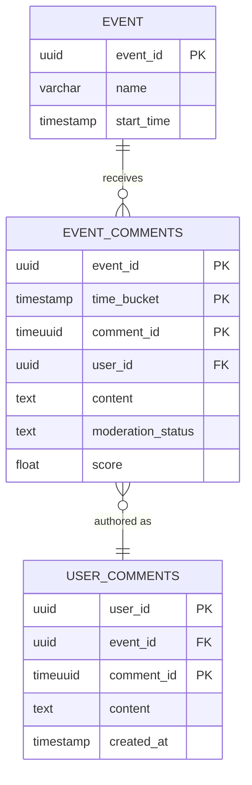
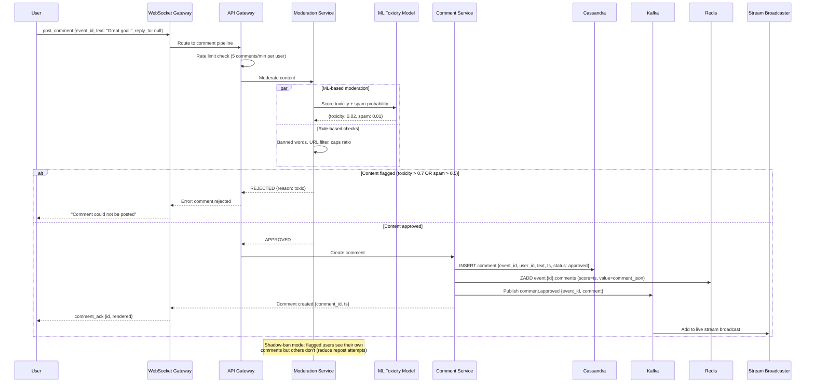
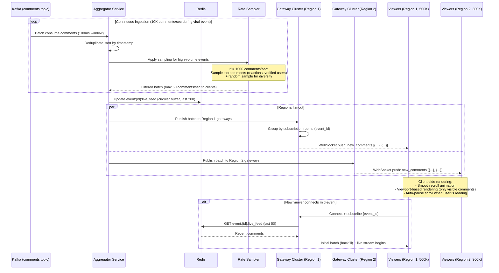

# Design Live Comments System for a Viral Event - World-Class System Design

## 1. Functional Requirements

| # | Requirement | Description |
|---|---|---|
| FR1 | Real-time comment streaming | Display comments in real-time as they are posted (< 500ms) |
| FR2 | High-throughput ingestion | Handle 1M+ comments/second during viral events |
| FR3 | Comment types | Text, emoji reactions, stickers, short video replies, polls |
| FR4 | Pinned/highlighted comments | Host can pin important comments, system highlights popular ones |
| FR5 | Top comments ranking | ML-based ranking for relevance, engagement, recency |
| FR6 | Thread/reply support | Reply to specific comments creating threads |
| FR7 | Moderation | AI-powered auto-moderation + human review queue |
| FR8 | Rate limiting | Per-user comment rate limits to prevent spam |
| FR9 | Emoji/reaction counters | Real-time aggregated reaction counts (like, love, laugh, etc.) |
| FR10 | Comment search | Search within event comments |
| FR11 | Multi-language | Auto-translate comments, language-based filtering |
| FR12 | Replay | View comments at specific timestamp during event replay |

## 2. Non-Functional Requirements

| # | NFR | Target |
|---|---|---|
| NFR1 | Availability | 99.99% during live events |
| NFR2 | Latency - comment delivery | p50 < 200ms, p99 < 1s |
| NFR3 | Latency - comment post | p99 < 500ms (acknowledged) |
| NFR4 | Write throughput | 1M comments/second peak (viral event) |
| NFR5 | Read throughput | 50M users reading simultaneously |
| NFR6 | Comment ordering | Approximate time-ordering (not strict global) |
| NFR7 | Moderation latency | Auto-mod < 100ms, human escalation < 30 seconds |
| NFR8 | Graceful degradation | Under extreme load: batch delivery, hide low-quality |
| NFR9 | Scale | 500M total users, 50M concurrent during major events |
| NFR10 | Retention | Live event comments: 30 days hot, 2 years cold |

## 3. Capacity Estimation

### 3.1 Traffic Metrics (During Viral Event)

| Metric | Value |
|---|---|
| Concurrent viewers | 50M |
| Active commenters (5% of viewers) | 2.5M |
| Comments per active user per minute | 2 |
| Peak comments/second | 1M (5M burst during key moments) |
| Emoji reactions per second | 10M |
| Comment reads/second | 50M viewers × 10 updates/s = 500M reads/s |

### 3.2 Storage Estimation

| Data | Calculation | Storage |
|---|---|---|
| Comments per event | 1M/s × 3600s × 3h event | 10.8B comments per major event |
| Comment size | 500 bytes avg (text + metadata) | 5.4 TB per major event |
| Reactions | 10M/s × 10800s × 32 bytes | 3.5 TB per event |
| Events per year | 1000 major events | 5.4 PB/year |

### 3.3 Bandwidth Estimation

| Flow | Calculation | Bandwidth |
|---|---|---|
| Comment ingestion | 1M/s × 500 bytes | 500 MB/s |
| Comment fanout (all viewers) | Not feasible! Use sampling + batching | |
| Batched delivery (10/s batches) | 50M users × 10/s × 200 bytes/batch | 100 GB/s |
| Reaction counter updates | 50M × 1/s × 64 bytes | 3.2 GB/s |

### 3.4 Key Insight: Cannot Fan Out Every Comment to Every Viewer

At 1M comments/second with 50M viewers, true fanout = 50 trillion deliveries/second. **Impossible.**

**Solution: Sampling + Windowed Batching + Client-side Rendering**
- Each viewer sees a curated subset (50-100 comments/second max)
- Server samples and ranks, client renders with animation
- Different viewers may see slightly different comment streams (acceptable)

## 4. Data Modeling

### Entity-Relationship Diagram



### 4.1 Database Selection

| Workload | Database | Justification |
|---|---|---|
| Comment ingestion (hot) | Kafka + Redis Streams | Extreme write throughput, append-only |
| Comment persistence | Cassandra / ScyllaDB | Time-series, high write throughput, partitioned by event |
| Reaction counters | Redis Cluster (CRDT counters) | Atomic increments, millions/second |
| Moderation queue | Redis Sorted Sets + PostgreSQL | Priority queue + review tracking |
| Comment ranking | Redis + Flink (real-time ML scoring) | Real-time feature computation |
| Search | Elasticsearch | Full-text search within event |
| Analytics | ClickHouse | OLAP queries on comment patterns |
| Event metadata | PostgreSQL | Relational, transactional |

### 4.2 Schema Design

#### Kafka Topics
```yaml
live-comments-raw:          # Ingestion: all incoming comments
  partitions: 256           # High parallelism for 1M+/s
  replication: 3
  retention: 24h
  partition_key: event_id + shard_id  # Distribute within event

live-comments-moderated:    # Post-moderation approved comments
  partitions: 128
  retention: 72h

live-reactions-raw:         # Raw reaction events
  partitions: 512           # Higher volume than comments
  retention: 6h

comment-rankings:           # Scored/ranked comments for delivery
  partitions: 64
  retention: 6h
```

#### Cassandra: Comment Storage
```sql
CREATE TABLE event_comments (
    event_id        UUID,
    time_bucket     TIMESTAMP,    -- 1-minute buckets
    comment_id      TIMEUUID,
    user_id         UUID,
    user_name       TEXT,
    content         TEXT,
    comment_type    TEXT,          -- text, emoji, sticker, poll
    reply_to_id     UUID,
    language        TEXT,
    moderation_status TEXT,        -- approved, pending, rejected
    score           FLOAT,        -- ML ranking score
    reactions       MAP<TEXT, COUNTER>,
    created_at      TIMESTAMP,
    PRIMARY KEY ((event_id, time_bucket), comment_id)
) WITH CLUSTERING ORDER BY (comment_id DESC)
  AND default_time_to_live = 2592000  -- 30 days
  AND compaction = {'class': 'TimeWindowCompactionStrategy', 'compaction_window_size': 1, 'compaction_window_unit': 'HOURS'};

-- For user's comment history
CREATE TABLE user_comments (
    user_id         UUID,
    event_id        UUID,
    comment_id      TIMEUUID,
    content         TEXT,
    created_at      TIMESTAMP,
    PRIMARY KEY ((user_id), created_at, comment_id)
) WITH CLUSTERING ORDER BY (created_at DESC)
  AND default_time_to_live = 7776000; -- 90 days
```

#### Redis: Real-time State
```
# Reaction counters (per comment)
Key: reactions:{event_id}:{comment_id}
Type: HASH
Fields: {like: 15234, love: 3421, laugh: 8921, wow: 1234}

# Event-level aggregate reactions
Key: event:reactions:{event_id}
Type: HASH
Fields: {like: 5000000, love: 1200000, ...}
TTL: 86400s

# Top comments (ranked by ML score)
Key: top_comments:{event_id}:{window_id}
Type: SORTED SET
Score: ML ranking score
Members: comment_ids (top 1000)
TTL: 300s (5 min windows)

# Pinned comments
Key: pinned:{event_id}
Type: LIST
Members: [comment_id_1, comment_id_2] (max 5)

# Rate limiting per user per event
Key: rate:{event_id}:{user_id}
Type: STRING (counter)
TTL: 60s
```

## 5. High-Level Design (HLD)

### 5.1 Architecture Diagram

```
┌─────────────────────────────────────────────────────────────────────────────┐
│                         VIEWERS (50M concurrent)                              │
│  [Mobile] [Web] [Smart TV] [Embedded Player]                                │
│                                                                               │
│  Client Architecture:                                                        │
│  ┌────────────────┐ ┌────────────────┐ ┌────────────────────────────────┐  │
│  │ Comment Stream │ │ Virtual Scroll │ │ WebSocket/SSE Client            │  │
│  │ Renderer      │ │ (show 50-100   │ │ (receive batched updates)       │  │
│  │ (animation)   │ │  at a time)    │ │                                  │  │
│  └────────────────┘ └────────────────┘ └────────────────────────────────┘  │
└───────────────────────────────────┬─────────────────────────────────────────┘
                                    │
┌───────────────────────────────────┼─────────────────────────────────────────┐
│                    EDGE LAYER      │                                          │
│                                    ▼                                          │
│  ┌──────────┐ ┌──────────┐ ┌──────────────┐ ┌──────────────────────────┐  │
│  │ Route53  │ │ CDN/Edge │ │ WAF + Shield │ │ L7 Load Balancer         │  │
│  │ (Latency │ │ (Serve   │ │ (DDoS, Bot  │ │ (Comment write vs read   │  │
│  │  routing)│ │  comment │ │  protection) │ │  path separation)        │  │
│  │          │ │  batches)│ │              │ │                          │  │
│  └──────────┘ └──────────┘ └──────────────┘ └──────────────────────────┘  │
└───────────────────────────────────┬─────────────────────────────────────────┘
                                    │
                    ┌───────────────┴───────────────┐
                    │                               │
                    ▼ WRITE PATH                    ▼ READ PATH
┌─────────────────────────────────┐  ┌────────────────────────────────────────┐
│    COMMENT INGESTION LAYER      │  │     COMMENT DELIVERY LAYER              │
│                                  │  │                                          │
│  ┌───────────────────────────┐  │  │  ┌────────────────────────────────────┐│
│  │ Ingestion Gateway         │  │  │  │ Delivery Gateway (SSE/WebSocket)    ││
│  │ • Auth + rate limit       │  │  │  │ • 50M concurrent connections        ││
│  │ • Schema validation       │  │  │  │ • Send batched comment updates     ││
│  │ • Spam/abuse pre-filter   │  │  │  │ • Server-Sent Events (primary)     ││
│  │ • Async write to Kafka    │  │  │  │ • Long polling (fallback)          ││
│  │                            │  │  │  │ • 10 updates/sec per client        ││
│  │ Capacity: 1M+ writes/sec  │  │  │  └────────────────────────────────────┘│
│  └───────────────────────────┘  │  │                                          │
│              │                    │  │  ┌────────────────────────────────────┐│
│              ▼                    │  │  │ Comment Stream Service              ││
│  ┌───────────────────────────┐  │  │  │ • Curate stream per viewer segment ││
│  │ Kafka: live-comments-raw  │  │  │  │ • Mix: top + recent + personalized ││
│  │ (256 partitions)          │  │  │  │ • Different streams per language   ││
│  └───────────────────────────┘  │  │  │ • Dedup across batches              ││
│              │                    │  │  └────────────────────────────────────┘│
│              ▼                    │  │                                          │
│  ┌───────────────────────────┐  │  └────────────────────────────────────────┘
│  │ MODERATION PIPELINE       │  │
│  │ ┌──────────────────────┐  │  │
│  │ │ Auto-Mod (ML)        │  │  │
│  │ │ • Toxicity detection │  │  │
│  │ │ • Spam detection     │  │  │
│  │ │ • Profanity filter   │  │  │
│  │ │ • 50ms p99 latency   │  │  │
│  │ └──────────┬───────────┘  │  │
│  │            │               │  │
│  │ PASS (95%)│ FAIL(3%) UNSURE(2%)
│  │            │     │         │  │
│  │            ▼     ▼         │  │
│  │ ┌─────────┐ ┌──────────┐  │  │
│  │ │Approved │ │ Human    │  │  │
│  │ │→ Kafka  │ │ Review   │  │  │
│  │ │moderated│ │ Queue    │  │  │
│  │ └─────────┘ └──────────┘  │  │
│  └───────────────────────────┘  │
│              │                    │
│              ▼                    │
│  ┌───────────────────────────┐  │
│  │ RANKING & SCORING         │  │
│  │ (Flink Stream Processing) │  │
│  │ • Engagement score        │  │
│  │ • Recency score           │  │
│  │ • User reputation score   │  │
│  │ • Diversity score         │  │
│  │ → Output: Top comments    │  │
│  └───────────────────────────┘  │
│              │                    │
│              ▼                    │
│  ┌───────────────────────────┐  │
│  │ PERSISTENCE               │  │
│  │ • Cassandra (comments)    │  │
│  │ • Redis (counters, top)   │  │
│  │ • ClickHouse (analytics)  │  │
│  └───────────────────────────┘  │
│                                  │
└─────────────────────────────────┘
```

### 5.2 Key Design Pattern: Comment Sampling

```
┌─────────────────────────────────────────────────────────────────┐
│         WHY SAMPLING IS NECESSARY                                │
│                                                                   │
│  Input:  1,000,000 comments/second                               │
│  Output: 50M viewers × max 100 comments/viewer/second            │
│                                                                   │
│  If we showed ALL comments to ALL viewers:                       │
│  = 1M × 50M = 50 TRILLION operations/second (impossible!)       │
│                                                                   │
│  Solution: TIERED COMMENT DELIVERY                               │
│                                                                   │
│  Tier 1: Top/Pinned (seen by ALL viewers)                        │
│    - Host pinned comments                                        │
│    - System-ranked top comments (top 0.1%)                       │
│    - Celebrity/verified user comments                            │
│    - Push to all via CDN-cached SSE                              │
│                                                                   │
│  Tier 2: Segment-based (seen by segment of viewers)              │
│    - Randomly sample 100-200 comments per second per segment    │
│    - Segments: by language, by region, by interest               │
│    - 1000 segments × 200 comments/segment = manageable          │
│                                                                   │
│  Tier 3: Personalized (unique per viewer)                        │
│    - Friends' comments always shown                              │
│    - Comments user replied to                                     │
│    - Thread context                                               │
│                                                                   │
│  Client-side rendering:                                          │
│    - Receive ~50-100 comments per batch (every 1-2 seconds)     │
│    - Animate scroll (waterfall effect)                            │
│    - Virtual scrolling for performance                           │
│                                                                   │
└─────────────────────────────────────────────────────────────────┘
```

## 6. Low-Level Design (LLD)

### 6.1 Comment Submission API

```http
POST /api/v1/events/{event_id}/comments
Authorization: Bearer <token>
X-Device-Id: <device_id>
Idempotency-Key: <uuid>

Request:
{
  "content": "What an amazing goal! ⚽🔥",
  "type": "text",
  "reply_to": null,
  "metadata": {
    "timestamp_ms": 5423000,   // timestamp in event timeline
    "client_ts": 1716003600000
  }
}

Response (202 Accepted):
{
  "comment_id": "cmt_abc123",
  "status": "pending_moderation",
  "estimated_visibility_ms": 200,
  "request_id": "req_xyz"
}
```

### 6.2 Comment Stream API (SSE)

```http
GET /api/v1/events/{event_id}/stream
Authorization: Bearer <token>
Accept: text/event-stream

Query params:
  segment=en_us           # language segment
  quality=high            # high (more comments), low (fewer, top only)
  last_event_id=evt_123   # resume from last seen

Response (SSE stream):
event: comments
id: evt_124
data: {
  "batch_id": "batch_001",
  "comments": [
    {"id":"cmt_1","user":"Alice","content":"Amazing!","score":0.95,"reactions":{"❤️":1234}},
    {"id":"cmt_2","user":"Bob","content":"Let's go!","score":0.88,"reactions":{"🔥":567}},
    ...
  ],
  "pinned": [{"id":"cmt_pin_1","user":"Host","content":"Welcome everyone!"}],
  "reaction_totals": {"❤️":5234567,"🔥":2345678,"😂":1234567},
  "viewer_count": 48234567,
  "comments_per_second": 892345
}

event: reactions
id: evt_125
data: {
  "reaction_deltas": {"❤️": +1234, "🔥": +567, "😂": +234},
  "top_reactions": [{"comment_id":"cmt_1","❤️":+89}]
}

event: system
id: evt_126
data: {
  "type": "highlight",
  "comment_id": "cmt_special",
  "reason": "most_liked_this_minute"
}
```

### 6.3 Reaction API

```http
POST /api/v1/events/{event_id}/comments/{comment_id}/reactions
Authorization: Bearer <token>

Request:
{
  "reaction": "❤️"
}

Response (200 OK):
{
  "acknowledged": true,
  "new_count": 15235
}

// Event-level floating reaction (not tied to a comment)
POST /api/v1/events/{event_id}/reactions
{
  "reaction": "🔥",
  "timestamp_ms": 5423000
}
```

## 7. Deep Dive Components

### 7.1 Moderation Pipeline (Deep Dive)

```
┌─────────────────────────────────────────────────────────────────┐
│                AUTO-MODERATION PIPELINE                           │
│                                                                   │
│  Stage 1: Pre-filter (< 5ms)                                    │
│  ┌─────────────────────────────────────────────────────────┐    │
│  │ • Regex blocklist (banned words/phrases)                  │    │
│  │ • User ban check (Redis SET lookup)                      │    │
│  │ • Rate limit check (sliding window)                       │    │
│  │ • Content length validation                               │    │
│  │ • Character set validation (no invisible chars)           │    │
│  │ Result: BLOCK (immediate) or PASS (to ML)                │    │
│  └─────────────────────────────────────────────────────────┘    │
│                                                                   │
│  Stage 2: ML Scoring (< 50ms)                                   │
│  ┌─────────────────────────────────────────────────────────┐    │
│  │ Models (running on GPU inference cluster):                │    │
│  │ • Toxicity classifier (BERT-based, 0-1 score)            │    │
│  │ • Spam classifier (logistic regression, fast)             │    │
│  │ • Language detection (fastText)                           │    │
│  │ • Personal info detector (NER for phone/email/address)   │    │
│  │                                                           │    │
│  │ Decision matrix:                                          │    │
│  │ • toxicity > 0.9 → REJECT (auto-block)                  │    │
│  │ • toxicity > 0.7 → REVIEW (human queue)                  │    │
│  │ • spam > 0.8 → REJECT                                    │    │
│  │ • PII detected → REJECT + notify user                    │    │
│  │ • All scores low → APPROVE                               │    │
│  └─────────────────────────────────────────────────────────┘    │
│                                                                   │
│  Stage 3: Post-moderation (async, < 30 seconds)                 │
│  ┌─────────────────────────────────────────────────────────┐    │
│  │ • Human review queue for borderline cases                 │    │
│  │ • Appeal processing                                       │    │
│  │ • Retroactive removal (if reported by multiple users)    │    │
│  │ • Moderator tools: bulk actions, regex rules, user ban   │    │
│  └─────────────────────────────────────────────────────────┘    │
│                                                                   │
└─────────────────────────────────────────────────────────────────┘
```

### 7.2 Reaction Counter System (Deep Dive)

```
Problem: 10M reactions/second, each must increment a counter

Naive approach: Direct Redis INCR → 10M commands/s to same keys → hot key problem

Solution: Hierarchical Aggregation

┌─────────────────────────────────────────────────────────────────┐
│                HIERARCHICAL REACTION COUNTERS                    │
│                                                                   │
│  Layer 1: Client-side batching                                   │
│  • Batch reactions locally for 1 second                          │
│  • Send aggregated: {event: "evt_1", reactions: {❤️: 3, 🔥: 1}} │
│  • Reduces 10M/s → 5M/s (batching on client)                   │
│                                                                   │
│  Layer 2: Ingestion gateway local counters                       │
│  • Each gateway instance has local counter map                   │
│  • Aggregate for 1 second, then flush to Redis                   │
│  • 100 gateway instances × 1 flush/s = 100 Redis ops/s         │
│  • HINCRBY reactions:{event_id} ❤️ 12345                         │
│                                                                   │
│  Layer 3: Redis Cluster (sharded by event_id)                    │
│  • Final aggregated counts                                       │
│  • Separate counters: per-event, per-comment                     │
│  • Read: client polls every 2 seconds for latest counts         │
│                                                                   │
│  Alternative: Redis + CRDTs (Grow-only counters)                │
│  • Each node maintains local G-Counter                           │
│  • Merge on read: sum of all node contributions                 │
│  • Eventually consistent but always increasing                   │
│                                                                   │
└─────────────────────────────────────────────────────────────────┘
```

## 8. Component Optimization

### 8.1 Kafka Optimization for 1M+/s Writes

```yaml
# Broker configuration
num.partitions: 256
log.segment.bytes: 1073741824        # 1 GB segments
log.retention.hours: 24
replica.fetch.max.bytes: 10485760    # 10 MB
socket.send.buffer.bytes: 1048576    # 1 MB
socket.receive.buffer.bytes: 1048576

# Producer (Ingestion Gateway):
batch.size: 524288                    # 512 KB batches
linger.ms: 10                         # Wait 10ms for batch fill
compression.type: lz4                 # Fast compression
buffer.memory: 268435456              # 256 MB buffer
acks: 1                               # Single ack (acceptable for comments)
max.in.flight.requests.per.connection: 10

# Consumer (Moderation/Ranking):
max.poll.records: 10000
fetch.min.bytes: 1048576              # 1 MB min fetch
fetch.max.wait.ms: 100
```

### 8.2 Server-Sent Events (SSE) Optimization

```
Why SSE over WebSocket for Read-heavy:
• Simpler (HTTP/2 multiplexed)
• Better CDN compatibility
• Auto-reconnect built into browser EventSource API
• One-directional (server→client) which is our pattern
• HTTP/2 server push for related data

Optimization:
• HTTP/2 multiplexing: single TCP connection for SSE + API calls
• Compression: gzip/brotli on SSE stream
• Batch comments into groups of 10-50 per SSE event
• Heartbeat every 15 seconds (: keepalive\n\n)
• Edge caching: CDN caches last N events for new joiners (catch-up)
• Connection pooling at edge: 1000 viewer connections → 1 origin connection

CDN Edge Architecture:
┌─────────────────────────────────────────┐
│  CDN Edge Node                           │
│                                           │
│  Shared SSE connection to origin         │
│  (1 per event per edge node)             │
│              │                            │
│              ▼                            │
│  ┌───────────────────────────┐          │
│  │ Edge Fan-out Buffer        │          │
│  │ (Ring buffer of last 100  │          │
│  │  events for catch-up)      │          │
│  └───────────────────────────┘          │
│       │         │         │              │
│       ▼         ▼         ▼              │
│  [10K viewers] [10K] [10K] ...          │
│                                           │
│  Total per edge: 50K-200K viewers       │
│  Total edges: 500 global                 │
│  = 25M-100M viewers served               │
│                                           │
└─────────────────────────────────────────┘
```

### 8.3 Flink Real-time Ranking

```java
// Comment ranking pipeline
StreamExecutionEnvironment env = StreamExecutionEnvironment.getExecutionEnvironment();
env.setStreamTimeCharacteristic(TimeCharacteristic.EventTime);

DataStream<Comment> comments = env
    .addSource(new FlinkKafkaConsumer<>("live-comments-moderated", schema, props))
    .assignTimestampsAndWatermarks(
        WatermarkStrategy.<Comment>forBoundedOutOfOrderness(Duration.ofSeconds(2))
    );

// Real-time scoring
DataStream<ScoredComment> scored = comments
    .keyBy(Comment::getEventId)
    .process(new CommentScoringFunction())  // Stateful: tracks engagement signals
    .uid("comment-scorer");

// Windowed top-K per event
scored
    .keyBy(ScoredComment::getEventId)
    .window(SlidingEventTimeWindows.of(Time.seconds(30), Time.seconds(5)))
    .process(new TopKCommentFunction(100))  // Keep top 100 per window
    .addSink(new RedisSink("top_comments"));

// Scoring function details:
class CommentScoringFunction extends KeyedProcessFunction<String, Comment, ScoredComment> {
    // Score = w1*recency + w2*engagement + w3*user_reputation + w4*diversity
    // recency: exponential decay from post time
    // engagement: reactions count (normalized)
    // user_reputation: historical behavior score
    // diversity: penalize same user appearing too often
}
```

### 8.4 Redis Optimization

```
# Use Redis Cluster with 30 shards for the event
# Distribute load across shards using hash tags

# Counter operations: Use pipelining
PIPELINE (per gateway, per second):
  HINCRBY event:reactions:{event_id} ❤️ 1234
  HINCRBY event:reactions:{event_id} 🔥 567
  HINCRBY reactions:{event_id}:{cmt_1} ❤️ 89
  HINCRBY reactions:{event_id}:{cmt_2} 🔥 23
  ZADD top_comments:{event_id}:window_123 0.95 cmt_1
  ZADD top_comments:{event_id}:window_123 0.88 cmt_2
EXEC

# Hot key mitigation for viral events:
# Shard the event counter across N sub-keys
# reactions:{event_id}:shard_0, reactions:{event_id}:shard_1, ...
# Read = sum of all shards (fan-out read, infrequent)
# Write = hash(writer) % N → write to specific shard
```

## 9. Observability

### 9.1 Key Metrics

```yaml
# Ingestion Metrics
comments_ingested_total{event_id, region}                  # Counter
comments_ingestion_latency_ms                              # Histogram
comments_rejected_total{reason}                            # Counter (spam, rate_limit, moderation)
comments_per_second{event_id}                              # Gauge

# Delivery Metrics
comments_delivered_total{event_id, segment}                # Counter
delivery_latency_ms{tier}                                  # Histogram (pinned, segment, personal)
sse_connections_active{edge_node}                          # Gauge
sse_events_sent_total{edge_node}                           # Counter
client_catch_up_duration_ms                                # Histogram

# Moderation Metrics
moderation_latency_ms{model, decision}                    # Histogram
moderation_decisions_total{decision}                        # Counter (approve, reject, review)
human_review_queue_depth                                    # Gauge
false_positive_rate                                         # Gauge (user appeals)

# Reaction Metrics
reactions_per_second{event_id, type}                        # Gauge
reaction_counter_flush_latency_ms                          # Histogram
hot_key_redistribution_count                               # Counter

# System Health
kafka_consumer_lag{topic, group}                            # Gauge
flink_checkpoint_duration_ms                                # Histogram
redis_memory_usage_pct{cluster}                            # Gauge
```

### 9.2 Real-time Dashboard (During Live Event)

```
┌─────────────────────────────────────────────────────────────┐
│  LIVE EVENT DASHBOARD: FIFA World Cup Final                  │
├─────────────────────────────────────────────────────────────┤
│  Viewers: 48.2M  │  Comments/sec: 892K  │  Reactions/sec: 8.2M │
├─────────────────────────────────────────────────────────────┤
│  Moderation: 95.2% auto-approved │ 3.1% rejected │ 1.7% review │
│  Queue depth: 234 (human review) │ Avg review time: 12s       │
├─────────────────────────────────────────────────────────────┤
│  Delivery latency p50: 120ms │ p99: 890ms │ Error rate: 0.01% │
│  Kafka lag: 1,234 │ Redis memory: 42% │ SSE connections: 48.2M │
└─────────────────────────────────────────────────────────────┘
```

## 10. Considerations and Assumptions

### 10.1 Key Design Decisions

| Decision | Choice | Rationale |
|---|---|---|
| Delivery mechanism | SSE (not WebSocket) | Read-heavy (viewers >> commenters), CDN-friendly |
| Comment visibility | Sampled (not all-to-all) | Physical impossibility of full fanout at scale |
| Moderation timing | Pre-delivery (synchronous ML) | Prevent harmful content from being seen |
| Counter architecture | Hierarchical aggregation | Avoid Redis hot keys at 10M reactions/s |
| Ranking | Real-time Flink scoring | Balance recency, engagement, diversity |
| Storage | Cassandra (time-bucketed) | Write-optimized, natural time-series fit |

### 10.2 Graceful Degradation Levels

| Load Level | Strategy |
|---|---|
| Normal (< 100K comments/s) | Full processing, all features enabled |
| High (100K - 500K/s) | Reduce ML model complexity, increase batch size |
| Very High (500K - 1M/s) | Sample comments for moderation (approve by default for trusted users) |
| Extreme (> 1M/s) | Only show top/pinned + verified users, drop anonymous comments |
| Emergency | Static "Comments paused" message, queue for later |

### 10.3 Multi-language Support

```
Translation Pipeline:
1. Detect language (fastText, < 1ms)
2. Group comments by language segment
3. Each segment receives comments in their language
4. Top comments auto-translated to all languages (batch translate)
5. Translation cache: common phrases pre-translated

Delivery by language:
- English segment: 40% of viewers → English comments + translated top
- Spanish segment: 15% → Spanish comments + translated top
- etc.
```

---

## Sequence Diagrams

### 1. Comment Post + Moderation



### 2. Real-Time Streaming to Viewers



### Caching Strategy

| Layer | Store | Content | TTL | Eviction |
|-------|-------|---------|-----|----------|
| Live Comment Feed | Redis (Sorted Set) | Last 200 comments per event (circular buffer) | Event duration + 1h | ZREMRANGEBYRANK (keep top 200) |
| Comment Count | Redis Counter | Total comments per event | Event duration | Reset post-event |
| User Rate Limit | Redis | Comment count per user per minute | 60s sliding window | Auto-expire |
| Hot Comments | Redis | Top 20 by reactions (real-time leaderboard) | 30s refresh | Re-score on reaction event |
| Viewer Count | Redis HyperLogLog | Approximate unique viewers | Event duration | Merge across gateways |
| Blocked Users | Redis Set | Banned/shadow-banned user IDs | Event duration | Admin removes |

**Cache Patterns:**
- **Circular buffer**: Fixed-size sorted set prevents unbounded growth during viral events
- **Sampling with cache**: Aggregator caches sampled output; reduces re-computation
- **Regional cache replication**: Each region has local Redis replica for low-latency reads
- **Warm-up on event start**: Pre-populate cache with event metadata, participant lists

### Infrastructure Components

| Component | Technology | Configuration | Purpose |
|-----------|-----------|---------------|---------|
| WebSocket Gateway | Envoy + Custom (Rust) | 500K connections/node, 20 nodes/region | Real-time comment delivery |
| Load Balancer | L4 (NLB) | Connection-aware, regional | Distribute WebSocket connections |
| API Gateway | Kong/Custom | 100K RPS, rate limiting per user | Comment submission endpoint |
| CDN | CloudFront/Fastly | Edge SSE fallback for WebSocket-blocked clients | Static assets + fallback streaming |
| Kafka Cluster | 12 brokers | Partitioned by event_id, retention 24h | Comment event bus |
| Aggregator | Custom (Go) | Horizontally scaled per event | Batch, sample, dedupe comments |
| ML Moderation | GPU cluster (K8s) | Auto-scale on queue depth | Real-time toxicity scoring |

**Scaling for Viral Events (1M+ concurrent viewers):**
- **Gateway tier**: Auto-scale to 50+ nodes per region; each handles 500K WebSocket connections
- **Tiered fanout**: Gateway nodes subscribe to regional pub/sub; local broadcast to connected clients
- **Backpressure**: If viewers > capacity, degrade to 2s batching (vs 100ms normal)
- **SSE fallback**: For mobile web clients or restrictive networks

