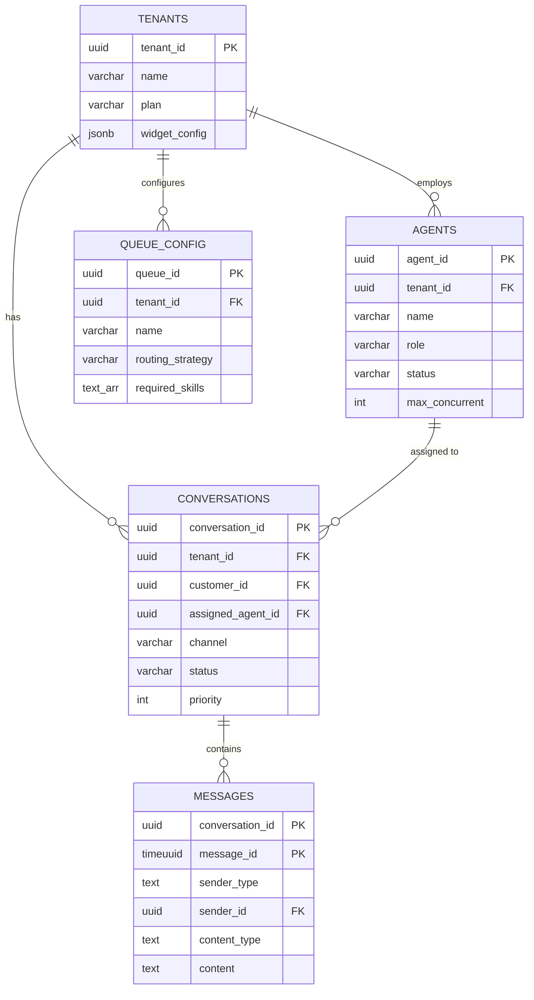
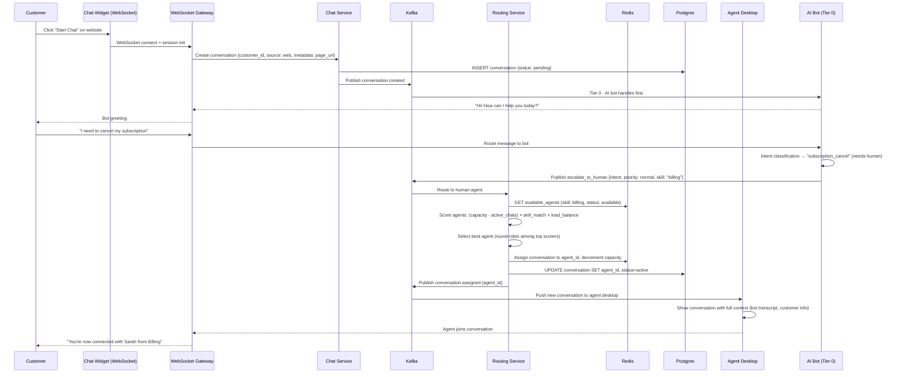
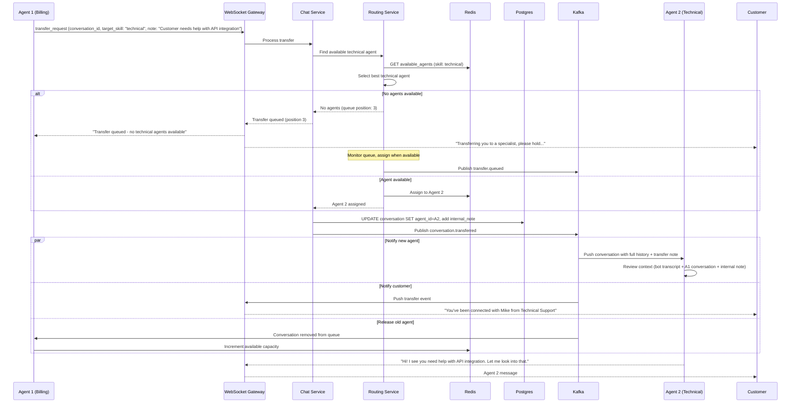
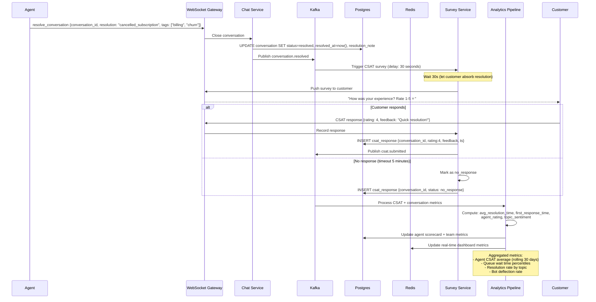

# Design Customer Support Chat Platform - World-Class System Design

## 1. Functional Requirements

| # | Requirement | Description |
|---|---|---|
| FR1 | Real-time chat | Bi-directional messaging between customer and support agent |
| FR2 | Queue management | Route customers to appropriate agents based on skill, load, priority |
| FR3 | Multi-channel | Web widget, mobile SDK, WhatsApp, Facebook Messenger, email |
| FR4 | AI chatbot | First-line automated responses, intent detection, handoff to human |
| FR5 | Canned responses | Pre-built response templates with variable insertion |
| FR6 | File sharing | Images, documents, screenshots within chat |
| FR7 | Conversation history | Full history per customer across all interactions |
| FR8 | Agent workspace | Multi-conversation handling (5-10 simultaneous chats per agent) |
| FR9 | Typing indicators | Show when agent/customer is typing |
| FR10 | CSAT/feedback | Post-chat satisfaction surveys |
| FR11 | Escalation | Transfer between agents, teams, supervisors |
| FR12 | Analytics & reporting | Response time, resolution time, CSAT, agent utilization |
| FR13 | Knowledge base integration | Suggest articles to agents and customers |
| FR14 | SLA management | Track and alert on SLA breaches |

## 2. Non-Functional Requirements

| # | NFR | Target |
|---|---|---|
| NFR1 | Availability | 99.99% |
| NFR2 | Message delivery latency | p99 < 300ms |
| NFR3 | Typing indicator latency | p99 < 100ms |
| NFR4 | Queue wait time visibility | Real-time position updates |
| NFR5 | Concurrent conversations | 1M simultaneous active chats |
| NFR6 | Agent capacity | 50K concurrent agents |
| NFR7 | Message throughput | 100K messages/second |
| NFR8 | Bot response time | < 2 seconds for AI-generated responses |
| NFR9 | Data retention | 3 years for compliance |
| NFR10 | Multi-tenancy | Support 10K+ business tenants securely isolated |

## 3. Capacity Estimation

### 3.1 Traffic Metrics

| Metric | Value |
|---|---|
| Business tenants | 10K |
| Total end users (across all tenants) | 500M |
| DAU (customers initiating chats) | 5M |
| Concurrent active chats | 1M |
| Concurrent agents online | 50K |
| Messages per chat session | 15 average |
| Average chat duration | 12 minutes |
| Total messages per day | 5M chats × 15 msgs = 75M |
| Bot-resolved (no human) | 40% = 2M chats/day |
| Agent-handled chats/day | 3M |

### 3.2 QPS Estimation

| Operation | QPS |
|---|---|
| Message send/receive | 75M / 86400 = 870/s avg, 5K/s peak |
| Chat creation (new conversations) | 5M / 86400 = 58/s avg, 500/s peak |
| Typing indicators | 2 × active chats × 0.3/s = 600K/s |
| Presence updates | 50K agents × 0.1/s = 5K/s |
| Queue position updates | 100K waiting × 0.2/s = 20K/s |
| Bot API calls | 2M × 3 turns / 86400 = 70/s avg |
| Analytics writes | 75M events / 86400 = 870/s |

### 3.3 Storage Estimation

| Data | Calculation | Storage |
|---|---|---|
| Messages (3 years) | 75M/day × 1095 days × 1 KB | ~82 TB |
| Attachments | 5% of messages have files × 2 MB avg | ~8 TB/year |
| Chat metadata | 5M chats/day × 2 KB × 1095 | ~11 TB |
| Analytics events | 75M/day × 256 bytes × 365 | ~7 TB/year |
| Knowledge base articles | 10K tenants × 1000 articles × 50 KB | ~500 GB |

## 4. Data Modeling

### Entity-Relationship Diagram



### 4.1 Database Selection

| Workload | Database | Justification |
|---|---|---|
| Messages | Cassandra / ScyllaDB | High write throughput, partitioned by conversation |
| Conversation metadata | PostgreSQL (multi-tenant) | Relational queries, queue management |
| Agent state & routing | Redis Cluster | Sub-ms routing decisions, presence |
| Queue management | Redis Sorted Sets | Priority queue with fast operations |
| Knowledge base | PostgreSQL + Elasticsearch | CRUD + full-text search |
| Analytics | ClickHouse | Time-series analytics, fast aggregations |
| File storage | S3 + CDN | Object storage with access control |
| Bot conversation state | Redis + DynamoDB | Session state for AI context |
| Tenant configuration | PostgreSQL + Redis cache | Multi-tenant config with caching |

### 4.2 Schema Design

#### PostgreSQL: Multi-tenant Core
```sql
-- Tenant isolation via schema or row-level security
CREATE TABLE tenants (
    tenant_id         UUID PRIMARY KEY,
    name              VARCHAR(255) NOT NULL,
    plan              VARCHAR(50) DEFAULT 'pro',
    settings          JSONB DEFAULT '{}',
    custom_domain     VARCHAR(255),
    widget_config     JSONB,
    created_at        TIMESTAMP DEFAULT NOW()
);

CREATE TABLE conversations (
    conversation_id   UUID PRIMARY KEY DEFAULT gen_random_uuid(),
    tenant_id         UUID NOT NULL REFERENCES tenants(tenant_id),
    customer_id       UUID NOT NULL,
    channel           VARCHAR(20) NOT NULL,     -- web, mobile, whatsapp, email, messenger
    status            VARCHAR(20) DEFAULT 'queued', -- queued, assigned, active, waiting, resolved, closed
    priority          INT DEFAULT 3,            -- 1=critical, 2=high, 3=normal, 4=low
    assigned_agent_id UUID,
    assigned_team_id  UUID,
    queue_id          UUID,
    subject           VARCHAR(500),
    tags              TEXT[],
    sla_policy_id     UUID,
    sla_breach_at     TIMESTAMP WITH TIME ZONE,
    first_response_at TIMESTAMP WITH TIME ZONE,
    resolved_at       TIMESTAMP WITH TIME ZONE,
    csat_score        SMALLINT,                 -- 1-5
    bot_handled       BOOLEAN DEFAULT FALSE,
    message_count     INT DEFAULT 0,
    created_at        TIMESTAMP DEFAULT NOW(),
    updated_at        TIMESTAMP DEFAULT NOW()
);

CREATE INDEX idx_conv_tenant_status ON conversations(tenant_id, status, priority, created_at);
CREATE INDEX idx_conv_agent ON conversations(assigned_agent_id, status) WHERE status IN ('active', 'waiting');
CREATE INDEX idx_conv_customer ON conversations(customer_id, created_at DESC);
CREATE INDEX idx_conv_sla_breach ON conversations(sla_breach_at) WHERE status NOT IN ('resolved', 'closed');

CREATE TABLE agents (
    agent_id          UUID PRIMARY KEY,
    tenant_id         UUID NOT NULL REFERENCES tenants(tenant_id),
    name              VARCHAR(255) NOT NULL,
    email             VARCHAR(255) NOT NULL,
    role              VARCHAR(50) DEFAULT 'agent', -- agent, supervisor, admin
    teams             UUID[],
    skills            TEXT[],                     -- billing, technical, sales, etc.
    max_concurrent    INT DEFAULT 5,
    status            VARCHAR(20) DEFAULT 'offline', -- online, away, busy, offline
    current_load      INT DEFAULT 0,
    created_at        TIMESTAMP DEFAULT NOW()
);

CREATE INDEX idx_agents_tenant_status ON agents(tenant_id, status);
CREATE INDEX idx_agents_skills ON agents USING GIN(skills);

CREATE TABLE queue_config (
    queue_id          UUID PRIMARY KEY,
    tenant_id         UUID NOT NULL,
    name              VARCHAR(100) NOT NULL,
    routing_strategy  VARCHAR(50) DEFAULT 'round_robin', -- round_robin, least_busy, skill_based, priority
    required_skills   TEXT[],
    priority_boost    INT DEFAULT 0,
    sla_policy_id     UUID,
    business_hours    JSONB,
    overflow_queue_id UUID,
    created_at        TIMESTAMP DEFAULT NOW()
);
```

#### Cassandra: Messages
```sql
CREATE TABLE messages (
    conversation_id UUID,
    message_id      TIMEUUID,
    sender_type     TEXT,          -- customer, agent, bot, system
    sender_id       UUID,
    sender_name     TEXT,
    content_type    TEXT,          -- text, image, file, card, quick_reply
    content         TEXT,
    attachments     LIST<FROZEN<attachment>>,
    metadata        MAP<TEXT, TEXT>,
    created_at      TIMESTAMP,
    PRIMARY KEY ((conversation_id), message_id)
) WITH CLUSTERING ORDER BY (message_id ASC);

CREATE TYPE attachment (
    file_id     UUID,
    file_name   TEXT,
    file_type   TEXT,
    file_size   INT,
    url         TEXT,
    thumbnail   TEXT
);
```

#### Redis: Agent Routing & Queue
```
# Agent availability and load
Key: agent:state:{tenant_id}:{agent_id}
Type: HASH
Fields:
  status: "online"
  current_load: "3"
  max_load: "5"
  skills: "billing,technical"
  last_active: "1716003600"

# Available agents per queue (sorted by load)
Key: queue:agents:{queue_id}
Type: SORTED SET
Score: current_load / max_load (0.0 to 1.0)
Members: agent_ids

# Waiting customers queue (priority queue)
Key: queue:waiting:{queue_id}
Type: SORTED SET
Score: priority * 1000000 + timestamp (higher priority = lower score)
Members: conversation_ids

# Conversation routing state
Key: conv:route:{conversation_id}
Type: HASH
Fields:
  status: "queued"
  queue_id: "q_123"
  position: "5"
  estimated_wait_seconds: "120"
  assigned_at: ""

# Typing indicators
Key: typing:{conversation_id}
Type: HASH
Fields:
  u_123: "1716003600"  # timestamp of last typing event
TTL: 5s (auto-expire)
```

## 5. High-Level Design (HLD)

### 5.1 Architecture Diagram

```
┌─────────────────────────────────────────────────────────────────────────────┐
│                          CLIENT LAYER                                         │
│                                                                               │
│  CUSTOMER SIDE:                         AGENT SIDE:                          │
│  ┌────────────────────────────────┐    ┌────────────────────────────────┐  │
│  │ Web Widget │ Mobile SDK │ API  │    │ Agent Desktop  │ Mobile App   │  │
│  │ WhatsApp   │ Messenger  │ Email│    │ (React SPA)   │ (React Nat.) │  │
│  └────────────────────────────────┘    └────────────────────────────────┘  │
└───────────────────────────────────┬─────────────────────────────────────────┘
                                    │ WebSocket + HTTPS
                                    ▼
┌─────────────────────────────────────────────────────────────────────────────┐
│                         EDGE LAYER                                            │
│  ┌──────────┐  ┌──────────┐  ┌──────────────┐  ┌─────────────────────┐    │
│  │ Route 53 │  │ CDN      │  │ WAF          │  │ ALB (L7)            │    │
│  │ (DNS)    │  │(widget + │  │(tenant rate  │  │ (path-based routing │    │
│  │          │  │ assets)  │  │ limits, DDoS)│  │  WS-aware)          │    │
│  └──────────┘  └──────────┘  └──────────────┘  └─────────────────────┘    │
└───────────────────────────────────┬─────────────────────────────────────────┘
                                    │
┌───────────────────────────────────┼─────────────────────────────────────────┐
│               GATEWAY LAYER        │                                         │
│                                    ▼                                          │
│  ┌──────────────────────────────────────────────────────────────────────┐  │
│  │                API Gateway + WebSocket Gateway                         │  │
│  │  ┌──────────────┐ ┌──────────────┐ ┌──────────────┐                 │  │
│  │  │ Auth/Tenant  │ │ WS Connection│ │ Rate Limiter │                 │  │
│  │  │ Resolution   │ │ Manager      │ │ (per-tenant) │                 │  │
│  │  └──────────────┘ └──────────────┘ └──────────────┘                 │  │
│  └──────────────────────────────────────────────────────────────────────┘  │
└───────────────────────────────────┬─────────────────────────────────────────┘
                                    │
┌───────────────────────────────────┼─────────────────────────────────────────┐
│              APPLICATION LAYER     │                                          │
│                                    ▼                                          │
│  ┌──────────────────┐  ┌──────────────────┐  ┌──────────────────┐         │
│  │ Chat Service     │  │ Routing Engine   │  │ Bot Service      │         │
│  │ • Message CRUD   │  │ • Skill matching │  │ • NLU/Intent     │         │
│  │ • Delivery track │  │ • Load balancing │  │ • Response gen   │         │
│  │ • History        │  │ • Queue mgmt     │  │ • Handoff logic  │         │
│  │ • Typing events  │  │ • SLA tracking   │  │ • KB search      │         │
│  └──────────────────┘  └──────────────────┘  └──────────────────┘         │
│                                                                               │
│  ┌──────────────────┐  ┌──────────────────┐  ┌──────────────────┐         │
│  │ Agent Service    │  │ Notification Svc │  │ Analytics Service│         │
│  │ • Status mgmt   │  │ • Push/Email     │  │ • Real-time      │         │
│  │ • Load tracking │  │ • SLA alerts     │  │ • Reporting      │         │
│  │ • Presence      │  │ • Assignment     │  │ • CSAT tracking  │         │
│  └──────────────────┘  └──────────────────┘  └──────────────────┘         │
│                                                                               │
│  ┌──────────────────┐  ┌──────────────────┐  ┌──────────────────┐         │
│  │ Channel Adapter  │  │ Knowledge Base   │  │ SLA Service      │         │
│  │ • WhatsApp API  │  │ Service          │  │ • Policy engine  │         │
│  │ • FB Messenger  │  │ • Article CRUD   │  │ • Breach alerts  │         │
│  │ • Email gateway │  │ • Smart suggest  │  │ • Escalation     │         │
│  └──────────────────┘  └──────────────────┘  └──────────────────┘         │
│                                                                               │
└───────────────────────────────────┬─────────────────────────────────────────┘
                                    │
┌───────────────────────────────────┼─────────────────────────────────────────┐
│                   EVENT BUS         │                                         │
│                                    ▼                                          │
│  ┌──────────────────────────────────────────────────────────────────────┐  │
│  │                        Apache Kafka                                    │  │
│  │  [chat-messages] [routing-events] [agent-events] [analytics-events]  │  │
│  │  [bot-interactions] [sla-events] [notification-events]               │  │
│  └──────────────────────────────────────────────────────────────────────┘  │
└───────────────────────────────────┬─────────────────────────────────────────┘
                                    │
┌───────────────────────────────────┼─────────────────────────────────────────┐
│                    DATA LAYER       │                                         │
│                                    ▼                                          │
│  ┌──────────────┐ ┌──────────────┐ ┌──────────────┐ ┌──────────────┐      │
│  │ PostgreSQL   │ │ Cassandra    │ │ Redis Cluster│ │ S3           │      │
│  │ (Tenants,    │ │ (Messages,   │ │ (Routing,    │ │ (Attachments,│      │
│  │  Agents,     │ │  History)    │ │  Queue,      │ │  Exports)    │      │
│  │  Config)     │ │              │ │  Presence)   │ │              │      │
│  └──────────────┘ └──────────────┘ └──────────────┘ └──────────────┘      │
│  ┌──────────────┐ ┌──────────────┐ ┌──────────────┐                       │
│  │ ClickHouse   │ │ Elasticsearch│ │ OpenAI/LLM   │                       │
│  │ (Analytics)  │ │ (KB Search + │ │ (Bot Brain)  │                       │
│  │              │ │  Chat Search)│ │              │                       │
│  └──────────────┘ └──────────────┘ └──────────────┘                       │
└─────────────────────────────────────────────────────────────────────────────┘
```

### 5.2 Routing Engine Deep Dive

```
┌─────────────────────────────────────────────────────────────────┐
│                  INTELLIGENT ROUTING ENGINE                       │
│                                                                   │
│  Input: New conversation (customer, channel, context, history)  │
│                                                                   │
│  Step 1: BOT TRIAGE                                              │
│  ┌─────────────────────────────────────────────────────────┐    │
│  │ • Intent classification (NLU model)                      │    │
│  │ • Check if bot can resolve (FAQ, password reset, etc.)  │    │
│  │ • If bot confidence > 0.85 → handle by bot              │    │
│  │ • If bot confidence < 0.85 → route to human             │    │
│  │ • Customer can request human at any time                 │    │
│  └─────────────────────────────────────────────────────────┘    │
│                                                                   │
│  Step 2: PRIORITY ASSIGNMENT                                     │
│  ┌─────────────────────────────────────────────────────────┐    │
│  │ Factors:                                                  │    │
│  │ • Customer tier (enterprise=P1, pro=P2, free=P3)        │    │
│  │ • Issue severity (order stuck=high, general inquiry=low)│    │
│  │ • SLA policy (response time obligation)                  │    │
│  │ • Returning customer (previous unresolved = boost)       │    │
│  │ • Channel (phone/WhatsApp = higher urgency)             │    │
│  └─────────────────────────────────────────────────────────┘    │
│                                                                   │
│  Step 3: QUEUE SELECTION                                         │
│  ┌─────────────────────────────────────────────────────────┐    │
│  │ • Match required skills (billing, technical, sales)     │    │
│  │ • Language matching                                       │    │
│  │ • Business hours check (route to available timezone)     │    │
│  │ • Overflow rules if primary queue full                   │    │
│  └─────────────────────────────────────────────────────────┘    │
│                                                                   │
│  Step 4: AGENT ASSIGNMENT                                        │
│  ┌─────────────────────────────────────────────────────────┐    │
│  │ Strategies:                                               │    │
│  │ • Least-busy: Agent with lowest load/max ratio           │    │
│  │ • Round-robin: Fair distribution                          │    │
│  │ • Skill-weighted: Best skill match for issue type        │    │
│  │ • Affinity: Same agent for returning customer            │    │
│  │ • Hybrid: skill_match * 0.4 + availability * 0.4 +      │    │
│  │           affinity * 0.2                                  │    │
│  └─────────────────────────────────────────────────────────┘    │
│                                                                   │
└─────────────────────────────────────────────────────────────────┘
```

## 6. Low-Level Design (LLD)

### 6.1 Chat WebSocket Protocol

```json
// Customer → Server: Send Message
{
  "type": "message.send",
  "conversation_id": "conv_abc123",
  "content": "I need help with my order",
  "content_type": "text",
  "client_message_id": "client_msg_001",
  "timestamp": 1716003600000
}

// Server → Customer: Message Delivered
{
  "type": "message.delivered",
  "conversation_id": "conv_abc123",
  "message_id": "msg_server_001",
  "client_message_id": "client_msg_001",
  "timestamp": 1716003600050
}

// Server → Agent: New Message from Customer
{
  "type": "message.received",
  "conversation_id": "conv_abc123",
  "message": {
    "id": "msg_server_001",
    "sender_type": "customer",
    "sender_name": "John Doe",
    "content": "I need help with my order",
    "content_type": "text",
    "timestamp": "2025-05-18T10:00:00Z"
  },
  "conversation_context": {
    "customer_tier": "pro",
    "order_id": "ORD-12345",
    "previous_interactions": 3
  }
}

// Typing indicator
{
  "type": "typing.start",
  "conversation_id": "conv_abc123",
  "user_type": "agent",
  "user_name": "Support Agent Sarah"
}

// Queue position update
{
  "type": "queue.update",
  "conversation_id": "conv_abc123",
  "position": 3,
  "estimated_wait_seconds": 45,
  "message": "You are #3 in queue. Estimated wait: ~45 seconds"
}

// Agent assignment notification
{
  "type": "agent.assigned",
  "conversation_id": "conv_abc123",
  "agent": {
    "name": "Sarah",
    "avatar_url": "https://...",
    "title": "Senior Support Engineer"
  }
}
```

### 6.2 REST APIs

```http
POST /api/v1/conversations
Authorization: Bearer <customer_token>
X-Tenant-Id: tenant_abc

Request:
{
  "channel": "web_widget",
  "subject": "Order delivery issue",
  "initial_message": "My order hasn't arrived",
  "customer_context": {
    "page_url": "https://store.example.com/orders/12345",
    "browser": "Chrome 125",
    "os": "macOS"
  },
  "metadata": {
    "order_id": "ORD-12345"
  }
}

Response (201 Created):
{
  "conversation_id": "conv_abc123",
  "status": "queued",
  "queue_position": 5,
  "estimated_wait_seconds": 90,
  "bot_greeting": "Hi! I'm looking into your order ORD-12345. Let me check the status...",
  "websocket_url": "wss://chat.example.com/ws?token=ws_token_xyz"
}
```

```http
// Agent API: Get assigned conversations
GET /api/v1/agent/conversations?status=active&limit=10
Authorization: Bearer <agent_token>

Response (200 OK):
{
  "conversations": [
    {
      "conversation_id": "conv_abc123",
      "customer_name": "John Doe",
      "subject": "Order delivery issue",
      "priority": 2,
      "last_message": {"content": "My order hasn't arrived", "at": "..."},
      "unread_count": 1,
      "sla": {"first_response_deadline": "...", "breached": false},
      "tags": ["order", "delivery"],
      "customer_context": {"tier": "pro", "lifetime_value": "$2,400"}
    }
  ]
}
```

### 6.3 Bot Service Integration

```http
POST /internal/v1/bot/process
Content-Type: application/json

Request:
{
  "conversation_id": "conv_abc123",
  "tenant_id": "tenant_abc",
  "message": "My order hasn't arrived",
  "context": {
    "customer_id": "cust_456",
    "conversation_history": [...],  // last 10 messages
    "customer_metadata": {"order_id": "ORD-12345", "order_status": "shipped"}
  },
  "bot_config": {
    "model": "gpt-4",
    "knowledge_base_ids": ["kb_orders", "kb_shipping"],
    "personality": "friendly_professional",
    "allowed_actions": ["check_order_status", "create_ticket", "offer_refund"]
  }
}

Response (200 OK):
{
  "response": {
    "message": "I can see your order ORD-12345 was shipped on May 15th and is currently in transit. The tracking shows it's expected to arrive by May 20th. Would you like me to send you the tracking link?",
    "suggested_actions": [
      {"label": "Show tracking", "action": "show_tracking"},
      {"label": "Talk to human", "action": "handoff_human"}
    ],
    "confidence": 0.92
  },
  "decision": "bot_handle",  // bot_handle, handoff_human, escalate
  "intent": "order_tracking",
  "actions_taken": ["check_order_status"]
}
```

## 7. Deep Dive Components

### 7.1 Multi-Tenancy Architecture

```
┌─────────────────────────────────────────────────────────────────┐
│              MULTI-TENANCY ISOLATION MODEL                        │
│                                                                   │
│  Tier 1: Shared Infrastructure (Small/Medium tenants)            │
│  ┌─────────────────────────────────────────────────────────┐    │
│  │ • Shared database with row-level security (tenant_id)    │    │
│  │ • Shared Redis cluster (key prefix: {tenant_id}:...)    │    │
│  │ • Shared Kafka topics (message key includes tenant_id)   │    │
│  │ • Shared application instances                           │    │
│  │ • Resource quotas enforced at application layer          │    │
│  └─────────────────────────────────────────────────────────┘    │
│                                                                   │
│  Tier 2: Dedicated Compute (Large tenants)                       │
│  ┌─────────────────────────────────────────────────────────┐    │
│  │ • Dedicated application pods (isolated thread pools)     │    │
│  │ • Shared database with dedicated connection pool         │    │
│  │ • Dedicated Kafka partitions                             │    │
│  │ • Higher rate limits and quotas                          │    │
│  └─────────────────────────────────────────────────────────┘    │
│                                                                   │
│  Tier 3: Fully Isolated (Enterprise tenants)                     │
│  ┌─────────────────────────────────────────────────────────┐    │
│  │ • Dedicated database instance                            │    │
│  │ • Dedicated Redis cluster                                │    │
│  │ • Dedicated application cluster                          │    │
│  │ • Custom domain, SSO, compliance                         │    │
│  │ • Data residency (region-specific)                       │    │
│  └─────────────────────────────────────────────────────────┘    │
│                                                                   │
└─────────────────────────────────────────────────────────────────┘
```

### 7.2 SLA Engine

```python
class SLAEngine:
    """Tracks and enforces SLA policies for conversations"""
    
    def __init__(self):
        self.policies = {}  # policy_id → SLAPolicy
        self.timers = {}    # conversation_id → SLATimer
    
    def on_conversation_created(self, conversation):
        policy = self.get_policy(conversation.tenant_id, conversation.priority)
        
        # Start SLA timers
        timers = {
            'first_response': Timer(
                deadline=now() + policy.first_response_time,
                callback=self.on_breach,
                context={'type': 'first_response', 'conv_id': conversation.id}
            ),
            'resolution': Timer(
                deadline=now() + policy.resolution_time,
                callback=self.on_breach,
                context={'type': 'resolution', 'conv_id': conversation.id}
            )
        }
        
        # Pause during non-business hours
        if not self.is_business_hours(conversation.tenant_id):
            timers['first_response'].pause()
        
        self.timers[conversation.id] = timers
    
    def on_agent_response(self, conversation_id):
        """First response received - stop first_response timer"""
        timers = self.timers.get(conversation_id)
        if timers and 'first_response' in timers:
            timers['first_response'].cancel()
            # Record first response time for analytics
    
    def on_breach(self, context):
        """SLA breached - escalate"""
        # 1. Notify supervisor
        # 2. Boost priority in queue
        # 3. Log breach event
        # 4. Update conversation metadata
```

## 8. Component Optimization

### 8.1 Kafka Configuration

```yaml
chat-messages:
  partitions: 32
  replication.factor: 3
  retention.ms: 604800000       # 7 days
  compression.type: lz4
  partition_key: conversation_id  # Ordering per conversation

routing-events:
  partitions: 16
  retention.ms: 86400000        # 1 day

analytics-events:
  partitions: 32
  retention.ms: 2592000000      # 30 days
  compression.type: zstd
```

### 8.2 WebSocket Optimization

```
Connection Management:
• Sticky sessions via ALB (connection_id cookie)
• Heartbeat: 25 second ping/pong
• Auto-reconnect with exponential backoff (client-side)
• Connection multiplexing: single WS for all agent's conversations
• Message batching: aggregate typing indicators (send max 3/s)

Scaling:
• Each WS gateway handles 100K connections
• 10 gateway instances = 1M concurrent connections
• Connection registry in Redis for cross-node delivery
• If recipient on different gateway → inter-node gRPC push
```

### 8.3 Redis Optimization for Routing

```lua
-- Atomic agent assignment (Lua script)
-- Finds best available agent and assigns conversation
local queue_key = KEYS[1]           -- queue:agents:{queue_id}
local conv_key = KEYS[2]            -- conv:route:{conversation_id}
local agent_key_prefix = ARGV[1]    -- "agent:state:{tenant_id}:"

-- Get least loaded available agent
local agents = redis.call('ZRANGEBYSCORE', queue_key, '-inf', '0.99', 'LIMIT', 0, 5)

for _, agent_id in ipairs(agents) do
    local state_key = agent_key_prefix .. agent_id
    local status = redis.call('HGET', state_key, 'status')
    local load = tonumber(redis.call('HGET', state_key, 'current_load'))
    local max_load = tonumber(redis.call('HGET', state_key, 'max_load'))
    
    if status == 'online' and load < max_load then
        -- Assign
        redis.call('HINCRBY', state_key, 'current_load', 1)
        redis.call('HSET', conv_key, 'status', 'assigned', 'agent_id', agent_id)
        -- Update sorted set score
        redis.call('ZADD', queue_key, (load + 1) / max_load, agent_id)
        return agent_id
    end
end

return nil  -- No agent available, stay in queue
```

### 8.4 Bot Service Optimization

```
Bot Response Pipeline:
1. Intent classification: Lightweight model (< 50ms)
2. Entity extraction: NER model (< 30ms)
3. Knowledge base search: Elasticsearch (< 100ms)
4. Response generation: LLM API call (< 2s)
5. Response validation: Safety filter (< 20ms)

Optimization:
• Cache common Q&A pairs (Redis, 5-min TTL)
• Pre-compute embeddings for KB articles
• Streaming response (show typing indicator while LLM generates)
• Fallback to template responses if LLM is slow/unavailable
• Batch similar questions for efficient LLM calls
```

## 9. Observability

### 9.1 Key Metrics

```yaml
# Conversation Metrics
support_conversations_active{tenant_id, channel, status}     # Gauge
support_conversations_created_total{channel}                  # Counter
support_resolution_time_seconds                                # Histogram
support_first_response_time_seconds                            # Histogram
support_csat_score{tenant_id}                                  # Histogram

# Agent Metrics
support_agents_online{tenant_id, team}                        # Gauge
support_agent_utilization_pct{agent_id}                       # Gauge
support_agent_response_time_ms                                 # Histogram
support_agent_concurrent_chats                                 # Histogram

# Queue Metrics
support_queue_depth{queue_id}                                  # Gauge
support_queue_wait_time_seconds{queue_id}                      # Histogram
support_sla_breaches_total{tenant_id, type}                   # Counter

# Bot Metrics
support_bot_resolution_rate{tenant_id}                         # Gauge
support_bot_handoff_rate                                        # Gauge
support_bot_response_time_ms                                    # Histogram
support_bot_confidence_score                                    # Histogram

# System Metrics
support_ws_connections_active{node}                            # Gauge
support_message_delivery_latency_ms                            # Histogram
support_kafka_consumer_lag{topic}                              # Gauge
```

### 9.2 Business Dashboard

```
┌─────────────────────────────────────────────────────────────┐
│  SUPPORT DASHBOARD - Tenant: Acme Corp                       │
├─────────────────────────────────────────────────────────────┤
│  Active Chats: 234 │ Queue: 12 │ Agents Online: 45/60      │
│  Avg Wait: 32s │ First Response: 28s │ Resolution: 8.5 min │
│  CSAT: 4.2/5.0 │ Bot Resolution: 42% │ SLA Compliance: 97% │
├─────────────────────────────────────────────────────────────┤
│  SLA Breaches Today: 3 │ Escalations: 7 │ Transfers: 15    │
│  Top Issues: Billing (35%), Technical (28%), Shipping (22%) │
└─────────────────────────────────────────────────────────────┘
```

## 10. Considerations and Assumptions

### 10.1 Key Assumptions

| # | Assumption | Impact |
|---|---|---|
| 1 | 40% of chats resolved by bot | Reduces agent load significantly |
| 2 | Average agent handles 5 concurrent chats | Agent capacity planning |
| 3 | Peak hours: 9 AM - 5 PM per timezone | Stagger agent shifts globally |
| 4 | 80% of conversations are < 15 minutes | Queue sizing |
| 5 | Tenant sizes follow power law (few large, many small) | Multi-tenancy tiers |
| 6 | WhatsApp/Messenger have 24-hour response windows | Queue priority for expiring conversations |

### 10.2 Security & Compliance

| Concern | Implementation |
|---|---|
| Tenant isolation | Row-level security, encryption with tenant-scoped keys |
| PII handling | Mask sensitive data in logs, encrypt at rest |
| GDPR | Right to deletion, data export, consent tracking |
| HIPAA | BAA with customers, PHI encryption, audit logs |
| Data residency | Regional deployments, prevent cross-border data flow |
| Agent authentication | SSO/SAML, MFA, session management |
| Customer authentication | JWT tokens, anonymous with rate limits |

---

## Sequence Diagrams

### 1. Customer Initiates Chat + Agent Routing



### 2. Agent Transfer (Warm Handoff)



### 3. CSAT Collection + Analytics



### Caching Strategy

| Layer | Store | Content | TTL | Eviction |
|-------|-------|---------|-----|----------|
| Agent Availability | Redis Sorted Set | Available agents scored by capacity | Real-time | Update on assign/release |
| Conversation State | Redis Hash | Active conversation metadata + routing info | Until resolved | Delete on resolve |
| Customer Context | Redis | Customer history, account info, previous tickets | 1h | LRU, refresh on new conversation |
| Canned Responses | Redis | Pre-built agent reply templates by category | 24h | Invalidate on admin update |
| Queue Metrics | Redis | Wait times, queue depth per skill group | 10s refresh | Overwrite |
| Bot Context | Redis | Active bot conversation state + intent history | Session | Delete on handoff or timeout |
| Agent Typing | Redis | Typing indicators per conversation | 5s | Auto-expire |

**Cache Patterns:**
- **Write-through for agent state**: Every assignment/release immediately updates Redis
- **Event-driven invalidation**: Kafka consumers update cache on conversation lifecycle events
- **Read-aside with preload**: Customer context loaded from CRM on conversation start
- **Pub/sub for real-time metrics**: Dashboard subscribes to metric updates

### Infrastructure Components

| Component | Technology | Configuration | Purpose |
|-----------|-----------|---------------|---------|
| WebSocket Gateway | Node.js (ws) + Envoy | 50K connections/node | Customer + agent real-time messaging |
| Load Balancer | L4 (NLB) | Sticky sessions by conversation_id | Route messages to correct gateway |
| API Gateway | Kong | Rate limiting, JWT auth | REST API for admin, integrations |
| CDN | CloudFront | Edge-cached widget JS, static assets | Chat widget delivery |
| Kafka | 6 brokers | Topics: conversations, messages, routing, analytics | Event backbone |
| Routing Engine | Custom (Go) | Skill-based, priority-weighted | Agent assignment algorithm |
| AI Bot | Python (LangChain) | GPU-backed, auto-scale on queue | Tier 0 deflection |

**WebSocket Gateway Details:**
- **Dual connection types**: Customers connect via widget (ephemeral), agents via desktop app (persistent)
- **Connection draining**: On deploy, in-progress conversations maintain connection; new ones route to new nodes
- **Heartbeat**: 15s interval for customers, 30s for agents
- **Reconnection**: Customers get 5-minute grace period; conversation state preserved in Redis

