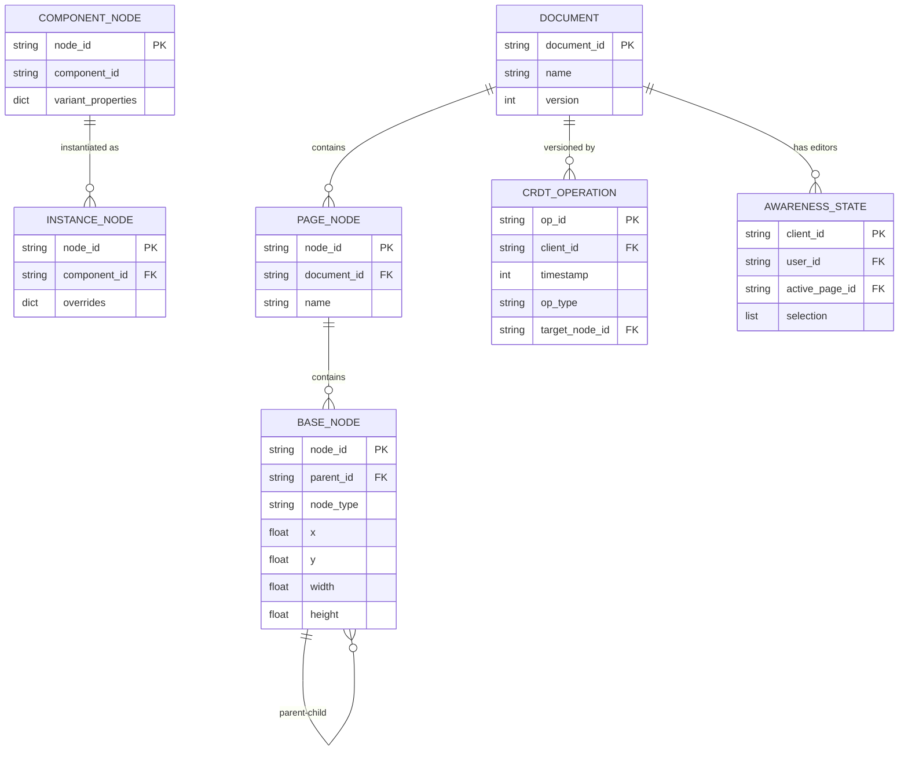
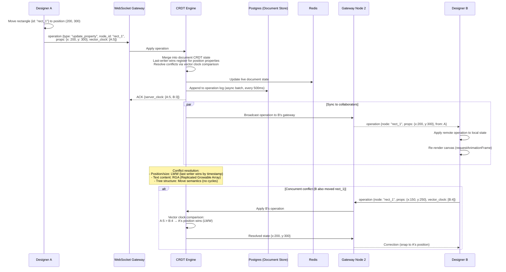
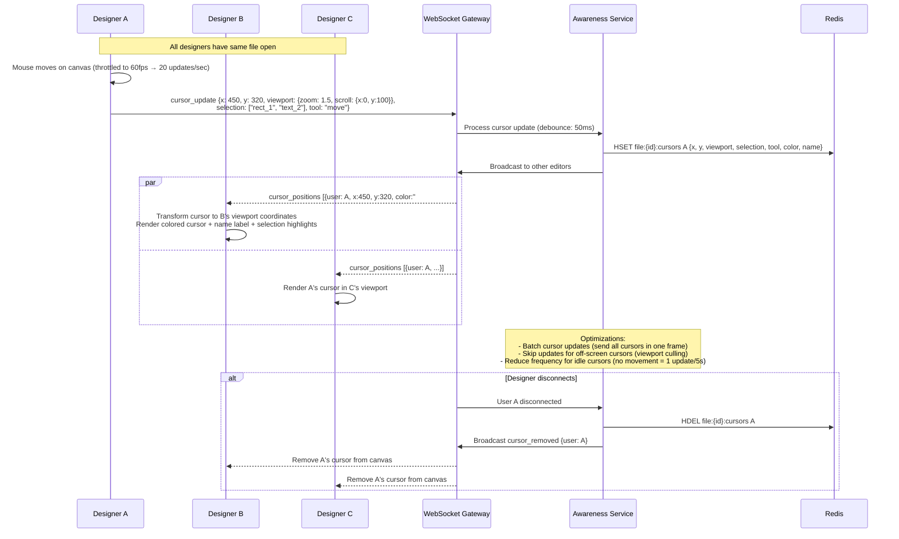
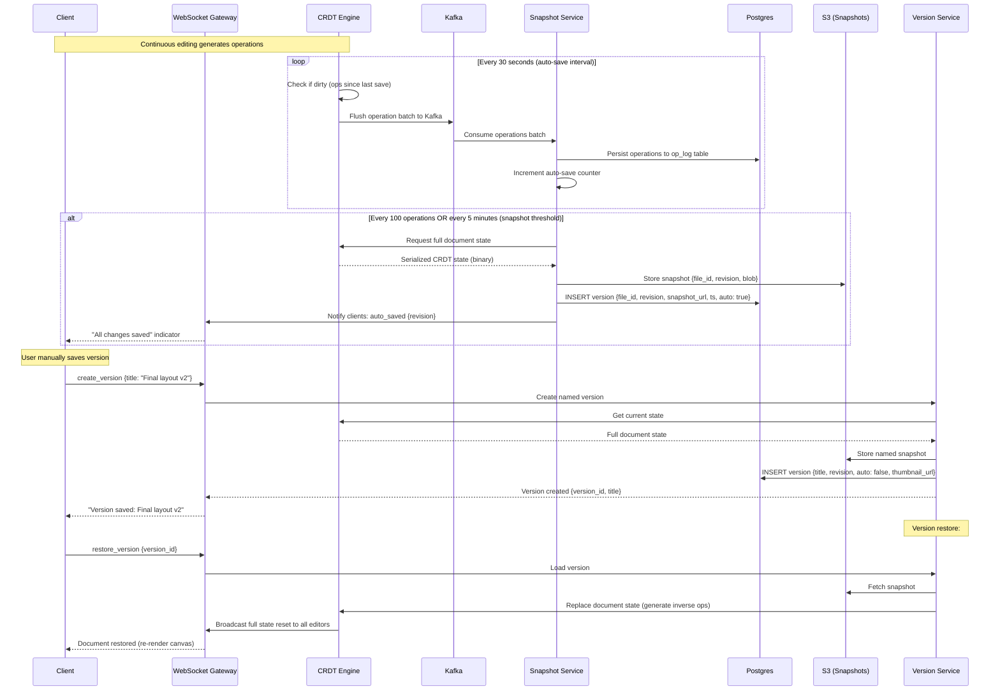

# Solution 129: Figma (Real-Time Collaborative Design Tool)

## 1. Requirements Clarification

### Functional Requirements
- Real-time collaborative canvas editing with multiple simultaneous users
- Vector graphics operations (shapes, text, images, masks, effects)
- Component system with instances and overrides
- Version history with undo/redo per user
- Cursor and selection sharing
- Plugin extensibility

### Non-Functional Requirements
- 100+ simultaneous editors per file
- <100ms perceived edit latency for collaborators
- Millions of objects per canvas
- Sub-16ms render frame time
- Offline editing with sync on reconnect
- 99.9% availability

### Out of Scope
- Prototyping/interaction design
- Design-to-code export
- Asset management system
- User authentication details

## 2. Back-of-the-Envelope Estimation

### Document Size
- Large file: 1M objects × 200 bytes avg properties = 200 MB
- Tree structure overhead: ~50 bytes/node = 50 MB
- Total document with history: up to 1 GB

### Real-time Sync
- Active editing: 10 ops/sec per user × 100 users = 1000 ops/sec per file
- Operation size: avg 100 bytes = 100 KB/sec per file
- Cursor updates: 100 users × 30 Hz = 3000 updates/sec (lightweight)

### Rendering
- Viewport: typically 2000×1500 pixels
- Objects in viewport: 100-10,000 at typical zoom
- Target: 60fps = 16.67ms per frame budget

### Infrastructure
- 1M concurrent files being edited
- 10M total users, 500K concurrent
- Operational transform/CRDT state per file: ~10 MB

## 3. High-Level Architecture

```
┌──────────────────────────────────────────────────────────────────┐
│                    Figma Architecture                              │
├──────────────────────────────────────────────────────────────────┤
│                                                                  │
│  ┌─────────────────────────────────────────────────────────────┐ │
│  │                     Client (Browser/Desktop)                 │ │
│  │  ┌──────────┐  ┌───────────┐  ┌─────────┐  ┌───────────┐  │ │
│  │  │ Renderer │  │  CRDT     │  │ Plugin  │  │ UI Layer  │  │ │
│  │  │ (WebGL)  │  │  Engine   │  │ Runtime │  │ (React)   │  │ │
│  │  └──────────┘  └───────────┘  └─────────┘  └───────────┘  │ │
│  └───────────────────────┬─────────────────────────────────────┘ │
│                          │ WebSocket                              │
│  ┌───────────────────────▼─────────────────────────────────────┐ │
│  │                   Multiplayer Service                        │ │
│  │  ┌──────────────┐  ┌──────────────┐  ┌─────────────────┐   │ │
│  │  │  Session Mgr │  │  CRDT Sync   │  │  Presence       │   │ │
│  │  │  (per file)  │  │  Engine      │  │  (cursors/sel)  │   │ │
│  │  └──────────────┘  └──────────────┘  └─────────────────┘   │ │
│  └─────────────────────────────────────────────────────────────┘ │
│                                                                  │
│  ┌──────────────┐  ┌──────────────┐  ┌──────────────────────┐  │
│  │  Document    │  │  Version     │  │  Asset Storage       │  │
│  │  Storage     │  │  History     │  │  (images/fonts)      │  │
│  │  (S3+Cache)  │  │  Service     │  │                      │  │
│  └──────────────┘  └──────────────┘  └──────────────────────┘  │
│                                                                  │
│  ┌──────────────┐  ┌──────────────┐  ┌──────────────────────┐  │
│  │  Component   │  │  Plugin      │  │  Export/Render       │  │
│  │  Library Svc │  │  Registry    │  │  Service             │  │
│  └──────────────┘  └──────────────┘  └──────────────────────┘  │
└──────────────────────────────────────────────────────────────────┘
```

## 4. Data Model / Schema Design

### Entity-Relationship Diagram



### Document Tree Model
```python
@dataclass
class Document:
    """Root of the design file. Tree structure: Document → Pages → Frames → Nodes."""
    document_id: str
    name: str
    pages: List[PageNode]
    component_sets: Dict[str, ComponentSet]
    styles: Dict[str, Style]       # Shared paint/text/effect styles
    variables: Dict[str, Variable]  # Design tokens
    version: int
    
@dataclass
class BaseNode:
    """Base class for all nodes in the document tree."""
    node_id: str                   # Unique within document
    name: str
    node_type: NodeType            # FRAME, RECTANGLE, ELLIPSE, TEXT, GROUP, COMPONENT, INSTANCE
    parent_id: Optional[str]
    children_ids: List[str]        # Ordered list (fractional indexing)
    
    # Transform
    x: float
    y: float
    width: float
    height: float
    rotation: float                # Degrees
    transform: Matrix2D            # Full 2D affine transform
    
    # Visual properties
    visible: bool
    locked: bool
    opacity: float
    blend_mode: str
    
    # Fills & strokes
    fills: List[Paint]
    strokes: List[Paint]
    stroke_weight: float
    stroke_align: str              # "inside", "outside", "center"
    
    # Effects
    effects: List[Effect]          # Drop shadow, blur, etc.
    
    # Constraints (for responsive resize)
    constraints: Constraints
    
    # Auto-layout
    auto_layout: Optional[AutoLayout]

@dataclass
class FrameNode(BaseNode):
    """Container node with clipping and auto-layout."""
    clip_content: bool = True
    background: List[Paint] = field(default_factory=list)
    padding: Padding = Padding(0, 0, 0, 0)
    item_spacing: float = 0
    layout_mode: str = "NONE"      # "NONE", "HORIZONTAL", "VERTICAL"

@dataclass
class VectorNode(BaseNode):
    """Vector shape with path data."""
    vector_paths: List[VectorPath]
    corner_radius: float = 0
    
@dataclass
class TextNode(BaseNode):
    """Text with rich formatting."""
    characters: str
    style_ranges: List[TextStyleRange]  # Per-character styling
    text_auto_resize: str          # "NONE", "WIDTH_AND_HEIGHT", "HEIGHT"
    
@dataclass
class ComponentNode(BaseNode):
    """Master component that can be instantiated."""
    component_id: str
    variant_properties: Dict[str, str]  # {"Size": "Large", "State": "Active"}

@dataclass
class InstanceNode(BaseNode):
    """Instance of a component with overrides."""
    component_id: str              # Reference to master component
    overrides: Dict[str, Dict[str, Any]]  # node_path → {property: value}
    
@dataclass
class Paint:
    type: str                      # "SOLID", "GRADIENT_LINEAR", "IMAGE"
    color: Optional[RGBA]
    gradient_stops: Optional[List[GradientStop]]
    image_ref: Optional[str]       # Asset hash
    opacity: float = 1.0

# Fractional indexing for ordering children
@dataclass
class FractionalIndex:
    """
    Enables inserting between any two siblings without reindexing.
    Uses a string-based fractional position (e.g., "a0", "a0V", "a1").
    """
    value: str
    
    @staticmethod
    def between(a: Optional[str], b: Optional[str]) -> str:
        """Generate a key between a and b."""
        if a is None and b is None:
            return "a0"
        if a is None:
            return _decrement(b)
        if b is None:
            return _increment(a)
        return _midpoint(a, b)
```

### CRDT Operations
```python
@dataclass
class CRDTOperation:
    """Atomic operation in the CRDT document model."""
    op_id: str                     # Lamport timestamp + client_id
    client_id: str
    timestamp: int                 # Lamport clock
    
    op_type: str                   # "set_property", "insert_node", "delete_node", "move_node"
    target_node_id: str
    
    # For set_property
    property_path: Optional[str]   # "fills.0.color.r"
    value: Optional[Any]
    
    # For insert_node
    node_data: Optional[Dict]
    parent_id: Optional[str]
    position: Optional[str]        # Fractional index
    
    # For move_node
    new_parent_id: Optional[str]
    new_position: Optional[str]
    
    # For delete
    tombstone: bool = False

@dataclass
class AwarenessState:
    """Presence information for each connected user."""
    client_id: str
    user_id: str
    user_name: str
    user_color: str                # Assigned cursor color
    cursor_position: Optional[Point]
    selection: List[str]           # Selected node IDs
    viewport: Viewport             # {x, y, zoom} - what they're looking at
    active_page_id: str
    last_update: datetime
```

## 5. API Design

### WebSocket Protocol
```python
# Client → Server messages
class ClientMessage:
    """Wire protocol for client-to-server communication."""
    
    # Apply operations (edits)
    # {"type": "ops", "ops": [...], "clock": 42}
    
    # Awareness update (cursor/selection)
    # {"type": "awareness", "state": {"cursor": {x, y}, "selection": [...]}}
    
    # Subscribe to document
    # {"type": "subscribe", "doc_id": "file-123", "since_version": 100}
    
    # Undo/Redo
    # {"type": "undo"} / {"type": "redo"}

# Server → Client messages
class ServerMessage:
    """Wire protocol for server-to-client communication."""
    
    # Sync operations from other clients
    # {"type": "ops", "ops": [...], "from_client": "client-456", "version": 101}
    
    # Awareness updates from others
    # {"type": "awareness", "states": {"client-456": {...}}}
    
    # Initial document state
    # {"type": "doc_state", "snapshot": {...}, "version": 100}
    
    # Acknowledgment
    # {"type": "ack", "clock": 42, "version": 101}

# REST API for non-realtime operations
# GET /v1/files/{file_id} - Get file metadata
# POST /v1/files/{file_id}/versions - Create named version
# GET /v1/files/{file_id}/versions - List versions
# POST /v1/files/{file_id}/export - Export to PNG/SVG/PDF
# GET /v1/files/{file_id}/components - List components
```

### Plugin API
```typescript
// Plugin sandbox API (runs in iframe/worker)
interface FigmaPluginAPI {
  // Document access
  readonly root: DocumentNode;
  currentPage: PageNode;
  
  // Selection
  readonly selection: SceneNode[];
  
  // Create nodes
  createRectangle(): RectangleNode;
  createFrame(): FrameNode;
  createText(): TextNode;
  createComponent(): ComponentNode;
  
  // Modify nodes
  // node.x = 100; node.fills = [{type: 'SOLID', color: {r:1, g:0, b:0}}];
  
  // UI
  showUI(html: string, options?: ShowUIOptions): void;
  
  // Events
  on(event: 'selectionchange' | 'currentpagechange', callback: () => void): void;
  
  // Storage
  clientStorage: ClientStorage;
}
```

## 6. Core Algorithm: CRDT for Collaborative Editing

```python
class DocumentCRDT:
    """
    CRDT-based document model for conflict-free collaborative editing.
    Uses:
    - Tree CRDT (YATA-based) for document structure
    - LWW (Last-Writer-Wins) registers for node properties
    - Fractional indexing for child ordering
    """
    
    def __init__(self, client_id: str):
        self.client_id = client_id
        self.clock = 0
        self.nodes: Dict[str, CRDTNode] = {}
        self.tombstones: Set[str] = set()
        self.pending_ops: List[CRDTOperation] = []  # Unacknowledged
        
    def apply_local_operation(self, op: CRDTOperation):
        """Apply a local edit and queue for sync."""
        self.clock += 1
        op.timestamp = self.clock
        op.client_id = self.client_id
        op.op_id = f"{self.clock}:{self.client_id}"
        
        self._apply(op)
        self.pending_ops.append(op)
        
    def apply_remote_operation(self, op: CRDTOperation):
        """Apply an operation from another client."""
        # Update vector clock
        self.clock = max(self.clock, op.timestamp) + 1
        self._apply(op)
    
    def _apply(self, op: CRDTOperation):
        if op.op_type == "set_property":
            self._apply_set_property(op)
        elif op.op_type == "insert_node":
            self._apply_insert(op)
        elif op.op_type == "delete_node":
            self._apply_delete(op)
        elif op.op_type == "move_node":
            self._apply_move(op)
    
    def _apply_set_property(self, op: CRDTOperation):
        """
        LWW Register: last write wins based on (timestamp, client_id).
        Each property tracks its own timestamp for independent convergence.
        """
        node = self.nodes.get(op.target_node_id)
        if not node or op.target_node_id in self.tombstones:
            return
        
        prop_key = op.property_path
        current_stamp = node.property_stamps.get(prop_key, (0, ""))
        new_stamp = (op.timestamp, op.client_id)
        
        # LWW: higher timestamp wins; tie-break by client_id
        if new_stamp > current_stamp:
            node.set_property(prop_key, op.value)
            node.property_stamps[prop_key] = new_stamp
    
    def _apply_insert(self, op: CRDTOperation):
        """Insert a new node into the tree."""
        if op.target_node_id in self.nodes:
            return  # Idempotent: already inserted
        
        node = CRDTNode(
            node_id=op.target_node_id,
            data=op.node_data,
            parent_id=op.parent_id,
            position=op.position,  # Fractional index
            created_at=op.op_id
        )
        self.nodes[op.target_node_id] = node
        
        # Add to parent's children (sorted by fractional index)
        if op.parent_id and op.parent_id in self.nodes:
            parent = self.nodes[op.parent_id]
            parent.children.append(op.target_node_id)
            parent.children.sort(key=lambda cid: self.nodes[cid].position)
    
    def _apply_delete(self, op: CRDTOperation):
        """Tombstone deletion (mark as deleted, don't remove from tree)."""
        self.tombstones.add(op.target_node_id)
    
    def _apply_move(self, op: CRDTOperation):
        """
        Move node to new parent/position.
        Conflict resolution for concurrent moves:
        - Last writer wins (by timestamp)
        - Cycle detection: reject if would create cycle
        """
        node = self.nodes.get(op.target_node_id)
        if not node:
            return
        
        # Check for cycle
        if self._would_create_cycle(op.target_node_id, op.new_parent_id):
            return  # Reject move that creates cycle
        
        # LWW for move operations
        current_move_stamp = node.move_stamp or (0, "")
        new_stamp = (op.timestamp, op.client_id)
        
        if new_stamp > current_move_stamp:
            # Remove from old parent
            old_parent = self.nodes.get(node.parent_id)
            if old_parent:
                old_parent.children = [c for c in old_parent.children if c != op.target_node_id]
            
            # Add to new parent
            node.parent_id = op.new_parent_id
            node.position = op.new_position
            node.move_stamp = new_stamp
            
            new_parent = self.nodes.get(op.new_parent_id)
            if new_parent:
                new_parent.children.append(op.target_node_id)
                new_parent.children.sort(key=lambda cid: self.nodes[cid].position)
    
    def _would_create_cycle(self, node_id: str, new_parent_id: str) -> bool:
        """Check if moving node_id under new_parent_id creates a cycle."""
        current = new_parent_id
        while current:
            if current == node_id:
                return True
            parent_node = self.nodes.get(current)
            current = parent_node.parent_id if parent_node else None
        return False


class MultiplayerSyncServer:
    """
    Server-side sync engine for a single document.
    Maintains authoritative operation log and broadcasts to clients.
    """
    
    def __init__(self, doc_id: str):
        self.doc_id = doc_id
        self.operation_log: List[CRDTOperation] = []
        self.version = 0
        self.connected_clients: Dict[str, WebSocket] = {}
        self.awareness_states: Dict[str, AwarenessState] = {}
        self.document_crdt = DocumentCRDT("server")
        
    async def handle_client_ops(self, client_id: str, ops: List[CRDTOperation]):
        """Receive ops from client, apply, and broadcast."""
        for op in ops:
            # Apply to server CRDT state
            self.document_crdt.apply_remote_operation(op)
            self.operation_log.append(op)
            self.version += 1
        
        # Broadcast to all other clients
        for other_id, ws in self.connected_clients.items():
            if other_id != client_id:
                await ws.send(json.dumps({
                    "type": "ops",
                    "ops": [op.to_dict() for op in ops],
                    "from_client": client_id,
                    "version": self.version
                }))
        
        # Acknowledge to sender
        await self.connected_clients[client_id].send(json.dumps({
            "type": "ack",
            "version": self.version
        }))
    
    async def handle_new_client(self, client_id: str, ws: WebSocket, since_version: int):
        """New client connects: send document state or missed operations."""
        self.connected_clients[client_id] = ws
        
        if since_version == 0:
            # Send full snapshot
            snapshot = self.document_crdt.get_snapshot()
            await ws.send(json.dumps({
                "type": "doc_state",
                "snapshot": snapshot,
                "version": self.version
            }))
        else:
            # Send missed operations
            missed_ops = self.operation_log[since_version:]
            await ws.send(json.dumps({
                "type": "ops",
                "ops": [op.to_dict() for op in missed_ops],
                "version": self.version
            }))
        
        # Send current awareness states
        await ws.send(json.dumps({
            "type": "awareness",
            "states": {k: v.to_dict() for k, v in self.awareness_states.items()}
        }))
```

## 7. Deep Dive: Rendering Engine

```python
class WebGLRenderer:
    """
    GPU-accelerated rendering for the design canvas.
    Key strategies:
    - Spatial index for viewport culling
    - Dirty-region invalidation (only repaint what changed)
    - Layer caching (cache rendered subtrees as textures)
    - Level-of-detail (simplify at low zoom)
    """
    
    def __init__(self, canvas_element):
        self.gl = canvas_element.getContext('webgl2')
        self.spatial_index = RTree()        # For fast viewport queries
        self.layer_cache = LayerCache()     # Cached GPU textures
        self.dirty_regions: List[Rect] = [] # Regions needing repaint
        self.scene_graph = SceneGraph()
        
    def render_frame(self, viewport: Viewport):
        """
        Main render loop (called at 60fps via requestAnimationFrame).
        Budget: 16.67ms total.
        """
        # 1. Determine visible nodes (< 1ms with spatial index)
        visible_nodes = self.spatial_index.query(viewport.bounds)
        
        # 2. Level-of-detail: simplify far-away objects
        render_list = self._apply_lod(visible_nodes, viewport.zoom)
        
        # 3. Check dirty regions (skip repaint if nothing changed)
        if not self.dirty_regions and not viewport.changed:
            return  # Nothing to render
        
        # 4. Sort by z-order (painter's algorithm or depth buffer)
        render_list.sort(key=lambda n: n.z_index)
        
        # 5. Render with layer caching
        for node in render_list:
            if self.layer_cache.has_valid(node.id):
                # Use cached texture (fast path)
                self._draw_cached_layer(node)
            else:
                # Render node and cache
                texture = self._render_node(node)
                self.layer_cache.set(node.id, texture)
                self._draw_texture(texture, node.transform)
        
        # 6. Render overlay (selections, cursors, guides)
        self._render_overlay(viewport)
        
        # Clear dirty regions
        self.dirty_regions.clear()
    
    def _apply_lod(self, nodes: List[Node], zoom: float) -> List[RenderNode]:
        """
        Level-of-detail rendering:
        - At low zoom: replace complex shapes with bounding boxes
        - At medium zoom: simplify paths (reduce control points)
        - At high zoom: full fidelity
        """
        render_nodes = []
        for node in nodes:
            screen_size = node.bounds.width * zoom
            
            if screen_size < 2:
                # Sub-pixel: skip entirely
                continue
            elif screen_size < 10:
                # Tiny: render as solid rectangle
                render_nodes.append(RenderNode(node, detail="bbox"))
            elif screen_size < 50:
                # Small: simplified path
                render_nodes.append(RenderNode(node, detail="simplified"))
            else:
                # Full detail
                render_nodes.append(RenderNode(node, detail="full"))
        
        return render_nodes
    
    def _render_node(self, node: RenderNode) -> GPUTexture:
        """Render a single node to a GPU texture."""
        if node.type == "rectangle":
            return self._render_rectangle(node)
        elif node.type == "ellipse":
            return self._render_ellipse(node)
        elif node.type == "vector":
            return self._render_vector_path(node)
        elif node.type == "text":
            return self._render_text(node)
        elif node.type == "image":
            return self._render_image(node)
        elif node.type == "frame":
            return self._render_frame_with_children(node)
    
    def _render_vector_path(self, node: RenderNode) -> GPUTexture:
        """
        GPU-accelerated vector path rendering.
        Uses tessellation (triangulation) for fills.
        Uses instanced line rendering for strokes.
        """
        # Tessellate fill path into triangles
        if node.fills:
            triangles = tessellate_path(node.vector_paths)
            self._draw_triangles(triangles, node.fills)
        
        # Render stroke with GPU line shader
        if node.strokes:
            # Expand stroke into quad strip
            stroke_mesh = expand_stroke(node.vector_paths, node.stroke_weight)
            self._draw_mesh(stroke_mesh, node.strokes)
        
        # Apply effects (blur, shadow) via post-processing shaders
        for effect in node.effects:
            if effect.type == "drop_shadow":
                self._apply_drop_shadow(effect)
            elif effect.type == "blur":
                self._apply_gaussian_blur(effect)


class SpatialIndex:
    """
    R-tree spatial index for fast viewport queries.
    Supports millions of objects with O(log n) query time.
    """
    
    def __init__(self):
        self.tree = RTree(max_entries=16)
    
    def insert(self, node_id: str, bounds: Rect):
        self.tree.insert(node_id, bounds)
    
    def query_viewport(self, viewport: Rect) -> List[str]:
        """Return all node IDs whose bounds intersect the viewport."""
        return self.tree.search(viewport)
    
    def update(self, node_id: str, old_bounds: Rect, new_bounds: Rect):
        """Update node position in index (O(log n))."""
        self.tree.remove(node_id, old_bounds)
        self.tree.insert(node_id, new_bounds)


class DirtyRegionTracker:
    """
    Track which regions of the canvas need repainting.
    Minimizes GPU work by only re-rendering changed areas.
    """
    
    def __init__(self):
        self.dirty_rects: List[Rect] = []
        
    def mark_dirty(self, node_id: str, old_bounds: Rect, new_bounds: Rect):
        """Mark both old and new position as dirty."""
        self.dirty_rects.append(old_bounds)
        self.dirty_rects.append(new_bounds)
    
    def get_merged_regions(self) -> List[Rect]:
        """Merge overlapping dirty rects to minimize draw calls."""
        if not self.dirty_rects:
            return []
        
        # Merge overlapping rectangles
        merged = []
        sorted_rects = sorted(self.dirty_rects, key=lambda r: r.x)
        
        current = sorted_rects[0]
        for rect in sorted_rects[1:]:
            if current.intersects(rect):
                current = current.union(rect)
            else:
                merged.append(current)
                current = rect
        merged.append(current)
        
        return merged
```

## 8. Deep Dive: Component System

```python
class ComponentSystem:
    """
    Component system with master components and instances.
    Changes to master propagate to all instances (unless overridden).
    """
    
    def __init__(self, document_crdt: DocumentCRDT):
        self.crdt = document_crdt
        self.component_registry: Dict[str, ComponentNode] = {}
        self.instance_registry: Dict[str, List[str]] = {}  # component_id -> [instance_ids]
    
    def create_component(self, node_id: str) -> ComponentNode:
        """Convert a node (frame/group) into a reusable component."""
        node = self.crdt.nodes[node_id]
        component = ComponentNode(
            **node.__dict__,
            component_id=generate_id(),
            variant_properties={}
        )
        self.component_registry[component.component_id] = component
        return component
    
    def create_instance(self, component_id: str, position: Point) -> InstanceNode:
        """Create an instance of a component."""
        component = self.component_registry[component_id]
        
        instance = InstanceNode(
            node_id=generate_id(),
            component_id=component_id,
            overrides={},
            # Copy all properties from component
            x=position.x,
            y=position.y,
            width=component.width,
            height=component.height,
            # ... other properties inherited
        )
        
        # Track instance
        self.instance_registry.setdefault(component_id, []).append(instance.node_id)
        return instance
    
    def get_effective_properties(self, instance: InstanceNode, node_path: str) -> Dict:
        """
        Resolve effective properties for an instance node.
        Property resolution order:
        1. Instance override (if set)
        2. Component master value
        """
        component = self.component_registry[instance.component_id]
        
        # Get master node at path
        master_node = self._resolve_path(component, node_path)
        master_props = master_node.get_all_properties()
        
        # Apply overrides
        overrides = instance.overrides.get(node_path, {})
        effective = {**master_props, **overrides}
        
        return effective
    
    def propagate_component_change(self, component_id: str, changed_property: str):
        """
        When master component changes, update all instances
        (except where overridden).
        """
        instances = self.instance_registry.get(component_id, [])
        component = self.component_registry[component_id]
        new_value = getattr(component, changed_property)
        
        for instance_id in instances:
            instance = self.crdt.nodes[instance_id]
            # Only propagate if not overridden
            if changed_property not in instance.overrides.get("", {}):
                self.crdt.apply_local_operation(CRDTOperation(
                    op_type="set_property",
                    target_node_id=instance_id,
                    property_path=changed_property,
                    value=new_value
                ))
```

## 9. Offline Support

```python
class OfflineManager:
    """
    Enable editing while offline, sync when reconnecting.
    Uses the CRDT's conflict-free merge properties.
    """
    
    def __init__(self, local_storage, crdt_engine: DocumentCRDT):
        self.storage = local_storage  # IndexedDB
        self.crdt = crdt_engine
        self.offline_ops: List[CRDTOperation] = []
        self.is_online = True
        
    def go_offline(self):
        """Transition to offline mode."""
        self.is_online = False
        # Save current document state to local storage
        self.storage.save_snapshot(self.crdt.get_snapshot())
    
    def apply_offline_edit(self, op: CRDTOperation):
        """Apply edit locally while offline."""
        self.crdt.apply_local_operation(op)
        self.offline_ops.append(op)
        # Persist to IndexedDB for crash recovery
        self.storage.append_op(op)
    
    async def reconnect(self, server_ws):
        """Sync offline changes when reconnecting."""
        self.is_online = True
        
        # 1. Get server version we last synced
        last_synced_version = self.storage.get_last_synced_version()
        
        # 2. Get missed operations from server
        server_ops = await server_ws.get_ops_since(last_synced_version)
        
        # 3. Apply server ops to local state (CRDT handles conflicts)
        for op in server_ops:
            self.crdt.apply_remote_operation(op)
        
        # 4. Send our offline ops to server
        await server_ws.send_ops(self.offline_ops)
        
        # 5. Clear offline buffer
        self.offline_ops.clear()
        self.storage.clear_pending_ops()
```

## 10. Production Configuration

```yaml
# Multiplayer service deployment
apiVersion: apps/v1
kind: Deployment
metadata:
  name: multiplayer-service
spec:
  replicas: 100  # Each handles ~10K concurrent connections
  template:
    spec:
      containers:
      - name: multiplayer
        image: figma/multiplayer:4.2.0
        resources:
          requests:
            memory: "8Gi"
            cpu: "4"
        env:
        - name: MAX_CONNECTIONS_PER_POD
          value: "10000"
        - name: MAX_USERS_PER_FILE
          value: "200"
        - name: OP_LOG_RETENTION_HOURS
          value: "168"
        - name: SNAPSHOT_INTERVAL_OPS
          value: "1000"
        - name: AWARENESS_BROADCAST_INTERVAL_MS
          value: "50"
        ports:
        - containerPort: 8080
          name: websocket

---
# Document storage configuration
storage:
  snapshots:
    backend: "s3"
    bucket: "figma-documents"
    compression: "zstd"
    encryption: "AES-256-GCM"
  
  op_log:
    backend: "dynamodb"
    table: "document-operations"
    ttl_days: 30
    
  cache:
    backend: "redis-cluster"
    nodes: 20
    memory_per_node_gb: 64
    eviction_policy: "allkeys-lfu"

---
# CDN for static assets (images, fonts)
cdn:
  provider: "cloudfront"
  origins:
    - "s3://figma-assets"
  cache_policy:
    default_ttl: 86400
    max_ttl: 31536000
  image_optimization:
    enabled: true
    formats: ["webp", "avif"]
    
---
# WebSocket routing (sticky sessions per file)
ingress:
  annotations:
    nginx.ingress.kubernetes.io/affinity: "cookie"
    nginx.ingress.kubernetes.io/session-cookie-name: "figma-ws-session"
    nginx.ingress.kubernetes.io/proxy-read-timeout: "3600"
    nginx.ingress.kubernetes.io/proxy-send-timeout: "3600"
    nginx.ingress.kubernetes.io/websocket-services: "multiplayer-service"
```

## 11. Failure Scenarios and Mitigations

| Failure | Impact | Mitigation |
|---------|--------|------------|
| Multiplayer server crash | Users disconnected | Stateless servers; client reconnects to another pod; ops replayed from log |
| Network partition between users | Divergent document states | CRDT guarantees eventual convergence; no conflicts by design |
| WebSocket disconnect | User edits not synced | Client buffers ops locally; reconnects and sends batch |
| Document too large for memory | Cannot load file | Lazy loading (load only visible page); streaming sync |
| Rendering too slow (complex scene) | Frame drops below 60fps | LOD, layer caching, viewport culling; offscreen canvas for heavy ops |
| CRDT op log too large | Slow client join | Periodic snapshots; new clients load snapshot + recent ops |
| Component propagation storm | Many instances update at once | Batch propagation; debounce renders; progressive update |
| Plugin crashes | Plugin UI broken | Sandboxed iframe; plugin crash doesn't affect editor |
| Concurrent move conflicts | Node appears in wrong place | CRDT move semantics with LWW + cycle detection |
| Version history corruption | Cannot restore old versions | Immutable snapshots in object storage; op log is append-only |

### Wire Protocol Efficiency
```
Operation encoding (binary protocol):
┌─────┬────────┬────────┬───────────┬──────────────┐
│ Op  │ Clock  │ Node   │ Property  │ Value        │
│ Type│ (VarInt)│ ID     │ Path      │ (msgpack)    │
│ 1B  │ 1-5B   │ 16B    │ 1-20B     │ Variable     │
└─────┴────────┴────────┴───────────┴──────────────┘

Typical operation: ~50-100 bytes
Cursor update: ~20 bytes
Batch of 10 property changes: ~500 bytes
```

### Observability
- **Collaboration health**: ops/sec per file, sync latency, conflict rate
- **Rendering**: frame time (p50/p99), draw calls, GPU memory
- **Document health**: node count, tree depth, component instance count
- **Client metrics**: WebSocket reconnection rate, offline duration, op queue depth

---

## Sequence Diagrams

### 1. Component Edit + CRDT Sync



### 2. Multiplayer Cursor (Awareness)



### 3. Auto-Save + Version History



### Async Processing Architecture

| Pipeline Stage | Technology | Input | Output | SLA |
|---------------|-----------|-------|--------|-----|
| Operation Persistence | Kafka → Postgres | CRDT operations (batched) | Durable op log | < 500ms (batch interval) |
| Snapshot Generation | Go workers | Op log + previous snapshot | Full state snapshot (S3) | < 2s |
| Thumbnail Generation | Headless renderer (Skia) | Document snapshot | PNG thumbnails (S3) | < 5s |
| Export (PDF/SVG/PNG) | Rendering pipeline | Document state | Export file | < 10s |
| Asset Processing | Image pipeline | Uploaded images | Optimized + thumbnails | < 3s |
| Component Library Sync | Background workers | Published components | Library index update | < 1s |

**Kafka Topics:**
- `design.operations` — real-time CRDT ops (high throughput, 7-day retention)
- `design.snapshots` — snapshot triggers (low throughput)
- `design.exports` — export job queue
- `design.assets` — uploaded image/asset processing
- `design.events` — file open/close, comment, share events

**Worker Scaling:**
- Snapshot workers: Scale on op_log lag (target: < 1000 pending ops)
- Export workers: Scale on queue depth (burst capacity for team exports)
- Thumbnail workers: Fire-and-forget, best-effort delivery

