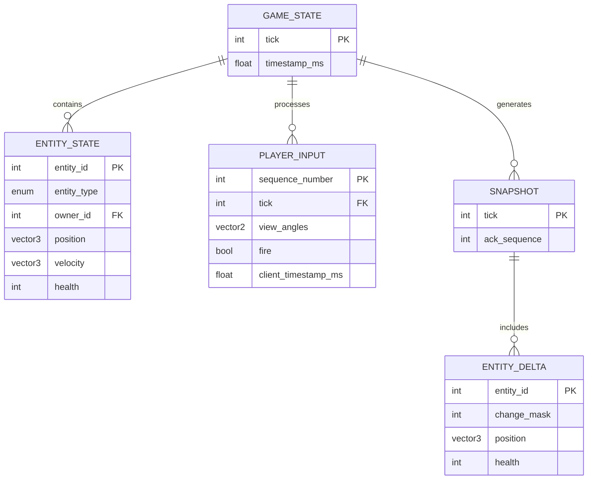
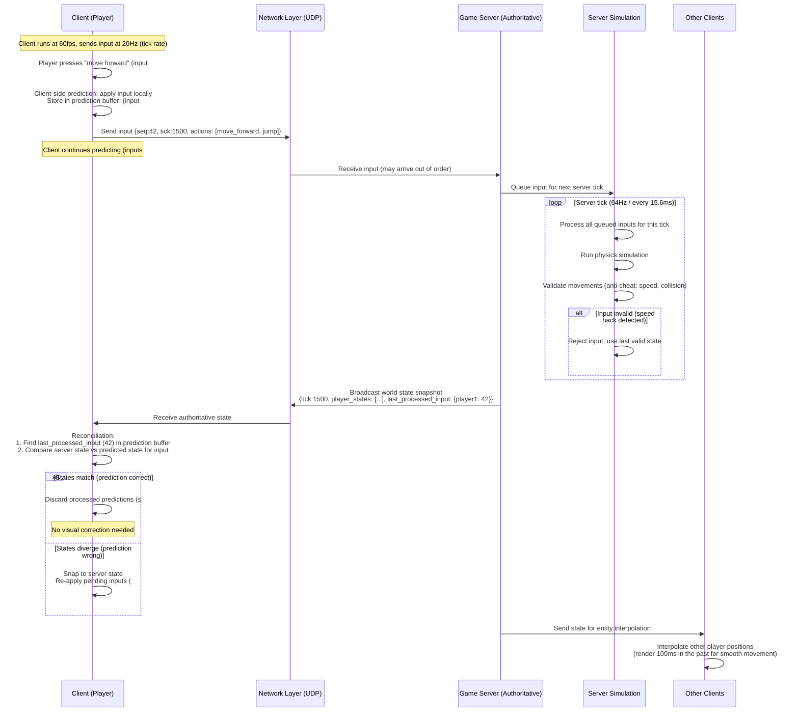
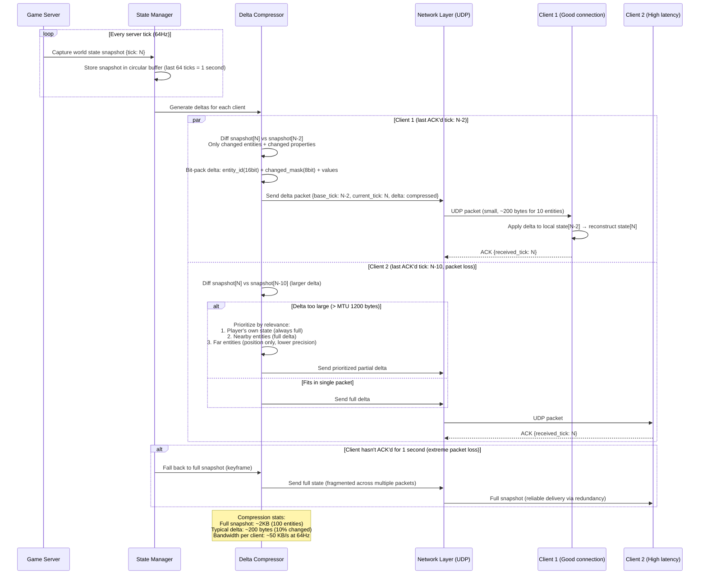

# Solution 130: Multiplayer Game State Synchronization

## 1. Requirements Clarification

### Functional Requirements
- Authoritative server simulation at fixed tick rate
- Client-side prediction for responsive input
- Server reconciliation to correct mispredictions
- Entity interpolation for smooth rendering of other players
- Lag compensation for fair hit detection
- Interest management for bandwidth efficiency

### Non-Functional Requirements
- 64-100 players per session
- 60Hz server tick rate (16.67ms per tick)
- <50ms perceived input latency
- <200ms total round-trip tolerance
- Bandwidth: <100 Kbps per player
- 1000+ concurrent sessions per server

### Out of Scope
- Matchmaking system
- Game logic specifics (physics engine)
- Voice chat
- Account/progression systems

## 2. Back-of-the-Envelope Estimation

### Bandwidth per Player
- State update: 100 entities × 20 bytes delta = 2 KB per tick
- At 20Hz client receive rate: 2KB × 20 = 40 KB/s = 320 Kbps
- With delta compression: ~80 Kbps per player
- Input upload: 60Hz × 10 bytes = 600 bytes/s

### Server Compute per Session
- 64 players × 60Hz = 3840 input packets/sec to process
- Simulation: 60 ticks/sec × (physics + game logic) < 5ms per tick target
- State broadcast: 64 players × 20Hz = 1280 packets/sec out
- Total bandwidth out: 64 × 80Kbps = 5 Mbps per session

### Memory per Session
- Game state: 1000 entities × 200 bytes = 200 KB current
- State history (for lag comp): 200KB × 60 ticks × 3 sec = 36 MB
- Per-player input buffer: 64 × 1KB = 64 KB

## 3. High-Level Architecture

```
┌────────────────────────────────────────────────────────────────┐
│              Multiplayer Game Architecture                      │
├────────────────────────────────────────────────────────────────┤
│                                                                │
│  ┌──────────────────────────────────────────────────────────┐  │
│  │                    Game Client                            │  │
│  │  ┌──────────┐  ┌────────────┐  ┌────────────────────┐   │  │
│  │  │ Input    │  │ Prediction │  │ Interpolation      │   │  │
│  │  │ Sampler  │  │ Engine     │  │ Buffer             │   │  │
│  │  └──────────┘  └────────────┘  └────────────────────┘   │  │
│  │  ┌──────────┐  ┌────────────┐  ┌────────────────────┐   │  │
│  │  │ Renderer │  │ Reconciler │  │ Network Layer      │   │  │
│  │  │          │  │            │  │ (UDP)              │   │  │
│  │  └──────────┘  └────────────┘  └────────────────────┘   │  │
│  └──────────────────────────────────┬───────────────────────┘  │
│                                     │ UDP                       │
│  ┌──────────────────────────────────▼───────────────────────┐  │
│  │                  Game Server (per session)                │  │
│  │  ┌──────────────┐  ┌──────────────┐  ┌──────────────┐   │  │
│  │  │ Input Queue  │  │ Simulation   │  │ State History │   │  │
│  │  │ & Validation │  │ (60Hz tick)  │  │ (Ring Buffer) │   │  │
│  │  └──────────────┘  └──────────────┘  └──────────────┘   │  │
│  │  ┌──────────────┐  ┌──────────────┐  ┌──────────────┐   │  │
│  │  │ Lag Comp     │  │ Interest     │  │ Snapshot     │   │  │
│  │  │ (Rewind)     │  │ Manager      │  │ Broadcaster  │   │  │
│  │  └──────────────┘  └──────────────┘  └──────────────┘   │  │
│  └──────────────────────────────────────────────────────────┘  │
│                                                                │
│  ┌──────────────────────────────────────────────────────────┐  │
│  │                   Infrastructure                          │  │
│  │  ┌────────────┐  ┌────────────┐  ┌──────────────────┐   │  │
│  │  │ Session    │  │ Anti-Cheat │  │ Metrics/Replay   │   │  │
│  │  │ Manager    │  │ Service    │  │ Storage          │   │  │
│  │  └────────────┘  └────────────┘  └──────────────────┘   │  │
│  └──────────────────────────────────────────────────────────┘  │
└────────────────────────────────────────────────────────────────┘
```

## 4. Data Model / Schema Design

### Entity-Relationship Diagram



### Game State
```python
@dataclass
class GameState:
    """Complete game state at a single tick."""
    tick: int
    timestamp_ms: float
    entities: Dict[int, EntityState]
    
@dataclass
class EntityState:
    entity_id: int
    entity_type: EntityType        # PLAYER, PROJECTILE, VEHICLE, ITEM
    owner_id: int                  # Player who owns/controls this entity
    
    # Transform
    position: Vector3              # x, y, z
    velocity: Vector3
    rotation: Quaternion           # Or euler angles
    angular_velocity: Vector3
    
    # Gameplay state (varies by entity type)
    health: int
    state_flags: int               # Bitfield: crouching, sprinting, reloading, etc.
    animation_state: int
    
    # For delta compression
    last_changed_tick: int
    change_mask: int               # Bitfield: which fields changed

@dataclass
class PlayerInput:
    """Input command from a client for one tick."""
    sequence_number: int           # Client-side sequence for reconciliation
    tick: int                      # Server tick this input is for
    
    # Movement
    move_forward: float            # -1.0 to 1.0
    move_right: float
    jump: bool
    crouch: bool
    sprint: bool
    
    # Aim
    view_angles: Vector2           # pitch, yaw
    
    # Actions
    fire: bool
    reload: bool
    use: bool
    weapon_slot: int
    
    # Timing
    client_timestamp_ms: float     # For lag compensation

@dataclass  
class Snapshot:
    """State snapshot sent to a specific player."""
    tick: int
    ack_sequence: int              # Last input sequence server processed
    entities: List[EntityDelta]    # Only entities relevant to this player
    events: List[GameEvent]        # Kills, explosions, etc.

@dataclass
class EntityDelta:
    """Delta-compressed entity state."""
    entity_id: int
    change_mask: int               # Which fields are included
    # Only included fields follow (variable length)
    position: Optional[QuantizedVector3]
    velocity: Optional[QuantizedVector3]
    rotation: Optional[QuantizedQuat]
    health: Optional[int]
    state_flags: Optional[int]
```

### Network Protocol
```python
# Packet format (UDP)
@dataclass
class PacketHeader:
    """
    Fixed 4-byte header for all packets.
    """
    protocol_id: int               # 2 bytes: magic number for validation
    packet_type: int               # 1 byte: INPUT, SNAPSHOT, RELIABLE, ACK
    sequence: int                  # 1 byte: rolling sequence for ordering

# Input packet (client → server)
@dataclass
class InputPacket:
    header: PacketHeader
    client_tick: int               # 4 bytes
    ack_snapshot_tick: int         # 4 bytes: last snapshot received
    input_count: int               # 1 byte: redundant inputs included
    inputs: List[PlayerInput]      # Variable: recent inputs (for packet loss)

# Snapshot packet (server → client)  
@dataclass
class SnapshotPacket:
    header: PacketHeader
    server_tick: int               # 4 bytes
    ack_input_sequence: int        # 4 bytes
    baseline_tick: int             # 4 bytes: delta base
    entity_count: int              # 2 bytes
    compressed_data: bytes         # Delta + bit-packed entity states
```

## 5. API Design

### Server Tick Loop
```python
# Game server main loop (pseudo-code)
class GameServer:
    TICK_RATE = 60  # Hz
    TICK_DURATION_MS = 1000.0 / TICK_RATE  # 16.67ms
    
    def run(self):
        while self.running:
            tick_start = time.perf_counter_ns()
            
            # 1. Process incoming inputs
            self.process_inputs()
            
            # 2. Run simulation
            self.simulate()
            
            # 3. Broadcast state to clients
            self.broadcast_snapshots()
            
            # 4. Store state history (for lag comp)
            self.save_state_history()
            
            # 5. Sleep remaining tick time
            elapsed = (time.perf_counter_ns() - tick_start) / 1_000_000
            sleep_ms = self.TICK_DURATION_MS - elapsed
            if sleep_ms > 0:
                time.sleep(sleep_ms / 1000)
            else:
                self.metrics.record_tick_overrun(elapsed)
            
            self.current_tick += 1
```

### Session Management API (REST)
```python
# Create game session
POST /api/v1/sessions
{
    "game_mode": "battle_royale",
    "max_players": 64,
    "map": "island_v2",
    "region": "us-east-1",
    "settings": {"tick_rate": 60, "friendly_fire": false}
}
Response: {"session_id": "gs-123", "server_addr": "10.0.1.5:27015", "token": "..."}

# Join session
POST /api/v1/sessions/{session_id}/join
{
    "player_id": "player-456",
    "token": "..."
}
Response: {"player_slot": 3, "encryption_key": "...", "server_time_ms": 1705000000}
```

## 6. Core Algorithm: Client-Side Prediction and Reconciliation

```python
class ClientPrediction:
    """
    Client-side prediction: apply inputs immediately without waiting for server.
    Maintains input buffer for reconciliation when server confirms.
    
    Flow:
    1. Sample input → apply locally (prediction) → send to server
    2. Receive server state with ack_sequence
    3. Discard inputs up to ack_sequence
    4. Re-simulate remaining unacked inputs on top of server state
    """
    
    def __init__(self):
        self.input_buffer: Deque[PlayerInput] = deque(maxlen=128)
        self.predicted_state: EntityState = None
        self.sequence_number = 0
        
    def process_local_input(self, raw_input: RawInput) -> PlayerInput:
        """Sample input, predict locally, send to server."""
        self.sequence_number += 1
        
        player_input = PlayerInput(
            sequence_number=self.sequence_number,
            tick=self.estimated_server_tick,
            move_forward=raw_input.w - raw_input.s,
            move_right=raw_input.d - raw_input.a,
            jump=raw_input.space,
            view_angles=raw_input.mouse_angles,
            fire=raw_input.mouse1,
            client_timestamp_ms=time.time() * 1000
        )
        
        # Store in buffer for reconciliation
        self.input_buffer.append(player_input)
        
        # Apply prediction locally
        self.predicted_state = self.simulate_input(self.predicted_state, player_input)
        
        # Send to server (include last few inputs for redundancy)
        self.send_input_packet(player_input)
        
        return player_input
    
    def reconcile(self, server_state: EntityState, ack_sequence: int):
        """
        Server sent authoritative state. Reconcile with our prediction.
        
        1. Set authoritative state from server
        2. Discard acknowledged inputs
        3. Re-apply unacknowledged inputs (re-prediction)
        4. Smooth any visible correction
        """
        # Discard inputs the server has already processed
        while self.input_buffer and self.input_buffer[0].sequence_number <= ack_sequence:
            self.input_buffer.popleft()
        
        # Start from server's authoritative state
        reconciled_state = server_state
        
        # Re-simulate all unacknowledged inputs
        for unacked_input in self.input_buffer:
            reconciled_state = self.simulate_input(reconciled_state, unacked_input)
        
        # Check if prediction was correct
        prediction_error = self.calculate_error(self.predicted_state, reconciled_state)
        
        if prediction_error > SNAP_THRESHOLD:
            # Large error: snap to correct position
            self.predicted_state = reconciled_state
        elif prediction_error > SMOOTH_THRESHOLD:
            # Small error: smoothly interpolate to correct position
            self.predicted_state = self.smooth_correction(
                self.predicted_state, reconciled_state, smoothing=0.1
            )
        # else: prediction was correct, no correction needed
    
    def smooth_correction(self, current: EntityState, target: EntityState, 
                          smoothing: float) -> EntityState:
        """Gradually correct position to avoid visual pop."""
        corrected = EntityState()
        corrected.position = lerp(current.position, target.position, smoothing)
        corrected.velocity = target.velocity  # Velocity snaps immediately
        corrected.rotation = slerp(current.rotation, target.rotation, smoothing)
        return corrected
    
    def simulate_input(self, state: EntityState, input: PlayerInput) -> EntityState:
        """
        Deterministic simulation of one input on a state.
        Must match server simulation exactly.
        """
        new_state = state.clone()
        
        # Movement
        move_dir = Vector3(input.move_right, 0, input.move_forward).normalized()
        move_speed = SPRINT_SPEED if input.sprint else WALK_SPEED
        
        # Apply movement relative to view direction
        forward = Vector3.from_yaw(input.view_angles.yaw)
        right = forward.cross(Vector3.UP)
        
        wish_velocity = (forward * move_dir.z + right * move_dir.x) * move_speed
        
        # Ground check and gravity
        if new_state.on_ground:
            new_state.velocity.x = wish_velocity.x
            new_state.velocity.z = wish_velocity.z
            if input.jump:
                new_state.velocity.y = JUMP_VELOCITY
        else:
            # Air control (reduced)
            new_state.velocity += wish_velocity * AIR_CONTROL * TICK_DT
            new_state.velocity.y -= GRAVITY * TICK_DT
        
        # Integrate position
        new_state.position += new_state.velocity * TICK_DT
        
        # Collision detection (simplified)
        new_state = self.collide_and_slide(new_state)
        
        return new_state


class EntityInterpolation:
    """
    Interpolation for remote entities (other players).
    Renders entities between two known server states for smooth motion.
    Introduces one tick of visual delay but eliminates jitter.
    """
    
    def __init__(self, interpolation_delay_ms: float = 100):
        self.delay = interpolation_delay_ms
        self.state_buffer: Dict[int, Deque[TimestampedState]] = defaultdict(
            lambda: deque(maxlen=32)
        )
    
    def add_state(self, entity_id: int, state: EntityState, server_time_ms: float):
        """Buffer incoming state update."""
        self.state_buffer[entity_id].append(
            TimestampedState(state=state, time=server_time_ms)
        )
    
    def get_interpolated_state(self, entity_id: int, 
                                render_time_ms: float) -> EntityState:
        """
        Get interpolated state at render_time - delay.
        Finds two bracketing states and lerps between them.
        """
        target_time = render_time_ms - self.delay
        buffer = self.state_buffer[entity_id]
        
        if len(buffer) < 2:
            return buffer[-1].state if buffer else None
        
        # Find two states that bracket target_time
        before = None
        after = None
        
        for i in range(len(buffer) - 1):
            if buffer[i].time <= target_time <= buffer[i + 1].time:
                before = buffer[i]
                after = buffer[i + 1]
                break
        
        if before is None or after is None:
            # Extrapolate if no bracketing states (packet loss)
            if target_time > buffer[-1].time:
                return self._extrapolate(buffer[-1], target_time)
            return buffer[0].state
        
        # Interpolation factor (0.0 = before, 1.0 = after)
        duration = after.time - before.time
        t = (target_time - before.time) / duration if duration > 0 else 0
        
        # Lerp position, slerp rotation
        interpolated = EntityState()
        interpolated.position = lerp(before.state.position, after.state.position, t)
        interpolated.rotation = slerp(before.state.rotation, after.state.rotation, t)
        interpolated.velocity = lerp(before.state.velocity, after.state.velocity, t)
        
        return interpolated
    
    def _extrapolate(self, last_state: TimestampedState, 
                      target_time: float) -> EntityState:
        """Dead reckoning when server data is late."""
        dt = (target_time - last_state.time) / 1000.0
        
        # Cap extrapolation to prevent entities flying off
        dt = min(dt, 0.25)  # Max 250ms extrapolation
        
        extrapolated = last_state.state.clone()
        extrapolated.position += extrapolated.velocity * dt
        return extrapolated
```

## 7. Deep Dive: Lag Compensation (Rewind and Replay)

```python
class LagCompensation:
    """
    Server-side lag compensation for hit detection.
    
    Problem: When player A shoots at player B, on A's screen B was at position X.
    But by the time the server processes this, B has moved to position Y.
    
    Solution: Server rewinds game state to what A saw, performs hit detection there.
    """
    
    def __init__(self, max_rewind_ms: float = 200):
        self.max_rewind = max_rewind_ms
        self.state_history: Deque[GameState] = deque(maxlen=256)  # ~4 sec at 60Hz
        
    def save_tick_state(self, state: GameState):
        """Save a copy of the game state after each tick."""
        self.state_history.append(state.deep_copy())
    
    def process_shot(self, shooter_id: int, shot_input: PlayerInput, 
                      current_state: GameState) -> Optional[HitResult]:
        """
        Process a shot with lag compensation:
        1. Determine what the shooter saw (rewind to their time)
        2. Perform hit detection against rewound state
        3. Apply damage to current state
        """
        # Calculate the shooter's perceived time
        shooter_rtt = self.get_player_rtt(shooter_id)
        rewind_ms = shooter_rtt / 2 + self.get_interpolation_delay()
        
        # Cap rewind to prevent abuse
        rewind_ms = min(rewind_ms, self.max_rewind)
        
        # Find the historical state closest to what shooter saw
        target_tick = current_state.tick - int(rewind_ms / TICK_DURATION_MS)
        historical_state = self._get_state_at_tick(target_tick)
        
        if historical_state is None:
            # Too far back, use current state (disadvantages high-ping players)
            historical_state = current_state
        
        # Perform ray cast against historical entity positions
        ray_origin = current_state.entities[shooter_id].position + EYE_OFFSET
        ray_direction = Vector3.from_angles(shot_input.view_angles)
        
        hit = self._raycast(ray_origin, ray_direction, historical_state, shooter_id)
        
        if hit:
            # Validate hit is reasonable (anti-cheat)
            if self._validate_hit(hit, shooter_id, current_state):
                return HitResult(
                    target_id=hit.entity_id,
                    hit_position=hit.position,
                    hit_bone=hit.bone,
                    damage=self._calculate_damage(hit),
                    rewound_ticks=current_state.tick - target_tick
                )
        
        return None
    
    def _get_state_at_tick(self, target_tick: int) -> Optional[GameState]:
        """Get historical state, interpolating between ticks if needed."""
        for state in self.state_history:
            if state.tick == target_tick:
                return state
        
        # Interpolate between two nearest ticks
        before = None
        after = None
        for state in self.state_history:
            if state.tick <= target_tick:
                before = state
            elif state.tick > target_tick and after is None:
                after = state
                break
        
        if before and after:
            t = (target_tick - before.tick) / (after.tick - before.tick)
            return self._interpolate_states(before, after, t)
        
        return before
    
    def _raycast(self, origin: Vector3, direction: Vector3, 
                  state: GameState, exclude_id: int) -> Optional[RayHit]:
        """
        Raycast against entity hitboxes in historical state.
        Uses capsule/AABB hierarchy for efficiency.
        """
        closest_hit = None
        closest_dist = float('inf')
        
        for entity_id, entity in state.entities.items():
            if entity_id == exclude_id:
                continue
            if entity.entity_type != EntityType.PLAYER:
                continue
            
            # Broad phase: AABB test
            if not ray_aabb_intersect(origin, direction, entity.get_aabb()):
                continue
            
            # Narrow phase: per-bone capsule test
            hitboxes = entity.get_hitboxes()  # Head, torso, limbs
            for bone, capsule in hitboxes.items():
                t = ray_capsule_intersect(origin, direction, capsule)
                if t and t < closest_dist:
                    closest_dist = t
                    closest_hit = RayHit(
                        entity_id=entity_id,
                        position=origin + direction * t,
                        bone=bone,
                        distance=t
                    )
        
        return closest_hit
    
    def _validate_hit(self, hit: RayHit, shooter_id: int, 
                       current_state: GameState) -> bool:
        """Anti-cheat validation for lag-compensated hits."""
        shooter = current_state.entities[shooter_id]
        target = current_state.entities[hit.entity_id]
        
        # Check if target is still alive
        if target.health <= 0:
            return False
        
        # Check if distance is reasonable
        if hit.distance > MAX_WEAPON_RANGE:
            return False
        
        # Check if angle is reasonable (not shooting behind walls)
        # ... additional server-side validation
        
        return True
```

## 8. Deep Dive: Interest Management and Bandwidth Optimization

```python
class InterestManager:
    """
    Determine which entities are relevant to each player.
    Only send updates for relevant entities to save bandwidth.
    """
    
    def __init__(self, world_size: float, cell_size: float = 50.0):
        self.cell_size = cell_size
        self.grid_size = int(world_size / cell_size)
        self.spatial_grid: Dict[Tuple[int, int], Set[int]] = defaultdict(set)
        
    def update_entity_cell(self, entity_id: int, position: Vector3):
        """Update entity's position in the spatial grid."""
        cell = self._get_cell(position)
        # Remove from old cell, add to new
        self._remove_from_grid(entity_id)
        self.spatial_grid[cell].add(entity_id)
    
    def get_relevant_entities(self, player_id: int, player_pos: Vector3,
                               all_entities: Dict[int, EntityState]) -> List[int]:
        """
        Get entities relevant to this player based on:
        1. Distance (area of interest)
        2. Line of sight (optional, expensive)
        3. Game-specific rules (teammates always relevant)
        """
        relevant = set()
        player_cell = self._get_cell(player_pos)
        
        # Check cells within area of interest
        aoi_radius_cells = int(self.aoi_radius / self.cell_size) + 1
        
        for dx in range(-aoi_radius_cells, aoi_radius_cells + 1):
            for dy in range(-aoi_radius_cells, aoi_radius_cells + 1):
                cell = (player_cell[0] + dx, player_cell[1] + dy)
                for entity_id in self.spatial_grid.get(cell, set()):
                    if entity_id == player_id:
                        continue
                    entity = all_entities[entity_id]
                    dist = (entity.position - player_pos).magnitude()
                    if dist <= self.aoi_radius:
                        relevant.add(entity_id)
        
        # Always include: teammates, important game objects
        for entity_id, entity in all_entities.items():
            if entity.entity_type == EntityType.OBJECTIVE:
                relevant.add(entity_id)
            if self._is_teammate(player_id, entity_id):
                relevant.add(entity_id)
        
        return list(relevant)


class PriorityAccumulator:
    """
    Bandwidth allocation using priority accumulator.
    Each entity accumulates priority over time.
    Entities with highest accumulated priority get sent first.
    
    Ensures fair bandwidth distribution while prioritizing important updates.
    """
    
    def __init__(self, max_bandwidth_bytes: int = 1200):  # ~MTU per tick
        self.max_bytes = max_bandwidth_bytes
        # Per-player priority accumulators: player_id -> entity_id -> accumulated priority
        self.accumulators: Dict[int, Dict[int, float]] = defaultdict(lambda: defaultdict(float))
    
    def select_entities_to_send(self, player_id: int, 
                                  relevant_entities: List[int],
                                  game_state: GameState,
                                  player_state: EntityState) -> List[int]:
        """
        Select which entities to include in this tick's snapshot.
        Limited by bandwidth budget.
        """
        acc = self.accumulators[player_id]
        
        # Accumulate priority for each relevant entity
        for entity_id in relevant_entities:
            entity = game_state.entities[entity_id]
            priority = self._calculate_priority(entity, player_state)
            acc[entity_id] = acc.get(entity_id, 0) + priority
        
        # Sort by accumulated priority (highest first)
        sorted_entities = sorted(relevant_entities, key=lambda eid: -acc.get(eid, 0))
        
        # Select entities until bandwidth budget is exhausted
        selected = []
        bytes_used = 0
        
        for entity_id in sorted_entities:
            entity_size = self._estimate_entity_size(entity_id, game_state)
            if bytes_used + entity_size > self.max_bytes:
                break
            selected.append(entity_id)
            bytes_used += entity_size
            # Reset accumulator for sent entities
            acc[entity_id] = 0
        
        return selected
    
    def _calculate_priority(self, entity: EntityState, 
                             player: EntityState) -> float:
        """
        Priority based on:
        - Distance (closer = higher priority)
        - Velocity (moving entities need more updates)
        - Entity type (players > projectiles > items)
        - In player's view frustum (seen entities = higher)
        """
        distance = (entity.position - player.position).magnitude()
        
        # Base priority by type
        type_priority = {
            EntityType.PLAYER: 10.0,
            EntityType.PROJECTILE: 8.0,
            EntityType.VEHICLE: 7.0,
            EntityType.ITEM: 2.0,
        }
        base = type_priority.get(entity.entity_type, 1.0)
        
        # Distance falloff (inverse square)
        distance_factor = 1.0 / max(1.0, (distance / 10.0) ** 2)
        
        # Velocity factor (fast-moving entities need more updates)
        speed = entity.velocity.magnitude()
        velocity_factor = 1.0 + min(speed / 10.0, 2.0)
        
        # View frustum bonus
        in_view = self._in_player_fov(entity.position, player)
        view_factor = 2.0 if in_view else 1.0
        
        return base * distance_factor * velocity_factor * view_factor


class DeltaCompressor:
    """
    Delta compression: only send fields that changed since last acknowledged state.
    Combined with quantization and bit-packing for minimal bandwidth.
    """
    
    def __init__(self):
        # Per-player baselines: what state they last acknowledged
        self.baselines: Dict[int, Dict[int, EntityState]] = {}
    
    def compress_snapshot(self, player_id: int, entities: List[EntityState],
                           current_tick: int) -> bytes:
        """Compress entity states as deltas from player's baseline."""
        baseline = self.baselines.get(player_id, {})
        writer = BitWriter()
        
        writer.write_uint(current_tick, 32)
        writer.write_uint(len(entities), 10)  # Max 1024 entities
        
        for entity in entities:
            writer.write_uint(entity.entity_id, 10)
            
            base = baseline.get(entity.entity_id)
            if base is None:
                # Full state (no baseline)
                writer.write_bit(1)  # Flag: full state
                self._write_full_state(writer, entity)
            else:
                # Delta state
                writer.write_bit(0)  # Flag: delta
                change_mask = self._compute_change_mask(base, entity)
                writer.write_uint(change_mask, 8)
                
                if change_mask & 0x01:  # Position changed
                    # Delta position (quantized to 0.01 units)
                    dx = int((entity.position.x - base.position.x) * 100)
                    dy = int((entity.position.y - base.position.y) * 100)
                    dz = int((entity.position.z - base.position.z) * 100)
                    writer.write_sint(dx, 16)
                    writer.write_sint(dy, 16)
                    writer.write_sint(dz, 16)
                
                if change_mask & 0x02:  # Rotation changed
                    # Smallest-three quaternion compression (29 bits)
                    self._write_quaternion(writer, entity.rotation)
                
                if change_mask & 0x04:  # Health changed
                    writer.write_uint(entity.health, 8)
                
                if change_mask & 0x08:  # State flags changed
                    writer.write_uint(entity.state_flags, 16)
        
        return writer.to_bytes()
    
    def _write_quaternion(self, writer: BitWriter, quat: Quaternion):
        """
        Smallest-three quaternion compression:
        - Omit largest component (it can be derived)
        - Encode which component was largest (2 bits)
        - Encode 3 remaining as 9-bit each (27 bits)
        - Total: 29 bits (vs 128 bits uncompressed)
        """
        components = [quat.x, quat.y, quat.z, quat.w]
        largest_idx = max(range(4), key=lambda i: abs(components[i]))
        
        writer.write_uint(largest_idx, 2)
        
        # Write the three non-largest components
        # Range [-0.707, 0.707] mapped to [0, 511] (9 bits)
        for i in range(4):
            if i != largest_idx:
                normalized = int((components[i] + 0.7071068) * 360.56)  # Map to 0-511
                writer.write_uint(max(0, min(511, normalized)), 9)
    
    def update_baseline(self, player_id: int, acked_tick: int, 
                         state_at_tick: GameState):
        """Update player's baseline when they acknowledge a snapshot."""
        self.baselines[player_id] = {
            eid: entity.clone() for eid, entity in state_at_tick.entities.items()
        }
```

## 9. Anti-Cheat Server Validation

```python
class ServerSideAntiCheat:
    """
    Server-side validation to prevent common cheats.
    All game state changes must pass validation.
    """
    
    def __init__(self):
        self.player_stats: Dict[int, PlayerStats] = {}
        
    def validate_input(self, player_id: int, input: PlayerInput, 
                        current_state: GameState) -> ValidationResult:
        """Validate player input before processing."""
        player = current_state.entities[player_id]
        stats = self.player_stats.setdefault(player_id, PlayerStats())
        
        # Speed hack detection: input timing
        time_since_last = input.client_timestamp_ms - stats.last_input_time
        if time_since_last < TICK_DURATION_MS * 0.5:
            stats.speed_violations += 1
            if stats.speed_violations > 5:
                return ValidationResult(valid=False, reason="speed_hack_suspected")
        
        # Movement validation: max speed check
        if player.velocity.magnitude() > MAX_POSSIBLE_SPEED * 1.1:
            return ValidationResult(valid=False, reason="impossible_speed")
        
        # View angle validation: maximum turn rate
        if stats.last_view_angles:
            angle_delta = abs(input.view_angles.yaw - stats.last_view_angles.yaw)
            if angle_delta > MAX_TURN_RATE_PER_TICK:
                stats.aim_violations += 1
        
        stats.last_input_time = input.client_timestamp_ms
        stats.last_view_angles = input.view_angles
        
        return ValidationResult(valid=True)
    
    def detect_aimbot(self, player_id: int, hit_history: List[HitResult]):
        """
        Statistical aimbot detection.
        Analyzes accuracy patterns that are humanly impossible.
        """
        stats = self.player_stats[player_id]
        
        if len(hit_history) < 20:
            return  # Need enough samples
        
        recent_hits = hit_history[-50:]
        
        # Headshot ratio (suspicious if > 80% over many shots)
        headshots = sum(1 for h in recent_hits if h.hit_bone == "head")
        headshot_ratio = headshots / len(recent_hits)
        
        # Reaction time analysis (time between target becoming visible and shot)
        avg_reaction_time = np.mean([h.reaction_time_ms for h in recent_hits])
        
        # Angle snap detection (instant aim corrections)
        angle_changes = [h.angle_change for h in recent_hits if h.angle_change > 5]
        if angle_changes:
            snap_ratio = sum(1 for a in angle_changes if a > 45) / len(angle_changes)
        else:
            snap_ratio = 0
        
        # Score (higher = more suspicious)
        suspicion_score = 0
        if headshot_ratio > 0.7:
            suspicion_score += 30
        if avg_reaction_time < 100:  # < 100ms is superhuman
            suspicion_score += 40
        if snap_ratio > 0.5:
            suspicion_score += 30
        
        if suspicion_score > 70:
            self._flag_player(player_id, "aimbot_suspected", suspicion_score)
    
    def mitigate_wallhack(self, player_id: int, game_state: GameState) -> Set[int]:
        """
        Wall-hack mitigation: don't send entity data for players
        that are definitely not visible (behind walls/occlusion).
        """
        player = game_state.entities[player_id]
        hidden_entities = set()
        
        for entity_id, entity in game_state.entities.items():
            if entity_id == player_id:
                continue
            if entity.entity_type != EntityType.PLAYER:
                continue
            
            # Broad check: is entity potentially visible?
            if not self._could_be_visible(player, entity, game_state.map):
                hidden_entities.add(entity_id)
        
        return hidden_entities  # These entities are NOT sent to the player
```

## 10. Production Configuration

```yaml
# Game server deployment
apiVersion: agones.dev/v1
kind: Fleet
metadata:
  name: game-servers
spec:
  replicas: 100
  template:
    spec:
      ports:
      - name: game
        portPolicy: Dynamic
        containerPort: 27015
        protocol: UDP
      template:
        spec:
          containers:
          - name: game-server
            image: game/server:2.5.0
            resources:
              requests:
                memory: "2Gi"
                cpu: "2000m"
              limits:
                memory: "4Gi"
                cpu: "3000m"
            env:
            - name: TICK_RATE
              value: "60"
            - name: MAX_PLAYERS
              value: "64"
            - name: MAX_REWIND_MS
              value: "200"
            - name: SNAPSHOT_RATE
              value: "20"  # Client receive rate
            - name: ANTICHEAT_ENABLED
              value: "true"

---
# Network configuration
network:
  protocol: UDP
  encryption: DTLS  # For anti-tamper
  
  # Traffic shaping
  max_packet_size: 1200  # Stay under typical MTU
  send_rate_per_player_hz: 20  # Snapshot send rate
  
  # Quality of service
  dscp_marking: "EF"  # Expedited forwarding
  
  # Regions
  regions:
    - name: "us-east-1"
      capacity: 500  # Sessions
    - name: "eu-west-1"
      capacity: 400
    - name: "ap-northeast-1"
      capacity: 300

---
# Monitoring
monitoring:
  metrics:
    - name: "tick_duration_ms"
      type: histogram
      buckets: [5, 8, 10, 12, 14, 16, 20, 30]
    - name: "player_rtt_ms"
      type: histogram
      buckets: [10, 20, 30, 50, 75, 100, 150, 200]
    - name: "prediction_error_units"
      type: histogram
    - name: "bandwidth_per_player_kbps"
      type: gauge
    - name: "entities_per_snapshot"
      type: gauge
    - name: "anticheat_violations"
      type: counter
      labels: ["type", "severity"]
      
  alerts:
    - name: TickOverrun
      condition: "p99(tick_duration_ms) > 16"
      severity: critical
    - name: HighPlayerLatency
      condition: "p95(player_rtt_ms) > 150"
      severity: warning
    - name: BandwidthExceeded
      condition: "avg(bandwidth_per_player_kbps) > 120"
      severity: warning
```

## 11. Failure Scenarios and Mitigations

| Failure | Impact | Mitigation |
|---------|--------|------------|
| Server tick overrun (>16ms) | Simulation slows down, rubber-banding | Reduce entity count, simplify physics, alert on p99 > 14ms |
| Packet loss (client → server) | Inputs missed, character stutters | Redundant inputs: send last 3 inputs in each packet |
| Packet loss (server → client) | Missing snapshots, jerky interpolation | Interpolation buffer absorbs loss; extrapolate if needed |
| Player disconnect | Ghost entity remains | Timeout detection (3s no packets); graceful disconnect protocol |
| Server crash mid-game | Entire session lost | Periodic state snapshots for session migration to backup server |
| Network congestion | Latency spike, prediction errors increase | Adaptive send rate; reduce snapshot detail; jitter buffer |
| Clock desync (client/server) | Incorrect lag compensation | NTP-based clock sync at connect; periodic re-sync |
| Cheater flooding inputs | Server CPU spike | Rate limit: max 2 inputs per tick per player; drop excess |
| State history memory overflow | Cannot rewind for lag comp | Fixed ring buffer (4 sec); drop oldest; cap rewind window |
| Split brain (dual servers for same session) | Conflicting game states | Single authoritative server per session; agones allocation guarantees |

### Tick Loop Timing Diagram
```
Server Tick N:
├─ Receive inputs (0-2ms)
│  └─ Validate, queue by tick
├─ Simulate (2-8ms)
│  ├─ Apply player inputs
│  ├─ Physics step
│  ├─ Game logic (spawns, scoring)
│  └─ Collision resolution
├─ Lag compensation hits (0-2ms)
├─ Interest management (0-1ms)
├─ Snapshot encoding (1-3ms)
│  ├─ Delta compression per player
│  ├─ Priority accumulator selection
│  └─ Bit-packing
├─ Send snapshots (0-1ms)
├─ Save state history (0-1ms)
└─ Sleep remaining time
Total budget: 16.67ms
```

### Key Performance Metrics
- **Server tick utilization**: % of 16.67ms budget used (target < 80%)
- **Player RTT distribution**: p50, p95, p99 per region
- **Prediction error rate**: % of frames requiring correction
- **Bandwidth per player**: should stay < 100 Kbps
- **Interpolation buffer health**: % of frames with valid interpolation states
- **Lag compensation rewind**: average ticks rewound per hit

---

## Sequence Diagrams

### 1. Client Prediction + Server Reconciliation



### 2. State Snapshot + Delta Compression



### Caching Strategy

| Layer | Store | Content | TTL | Eviction |
|-------|-------|---------|-----|----------|
| Snapshot Buffer | In-memory (ring buffer) | Last 64 world state snapshots | ~1 second | Circular overwrite |
| Player Session | Redis | Player auth, matchmaking state, current server | Session duration | Cleanup on disconnect |
| Matchmaking Queue | Redis Sorted Set | Players waiting, scored by MMR + wait time | 60s | Pop on match or timeout |
| Leaderboard | Redis Sorted Set | Player rankings (real-time) | Indefinite | Update on match result |
| Game Config | Redis | Maps, weapon stats, balance values | Until deploy | Invalidate on config push |
| Replay Segments | Redis + S3 | Recent match state (hot) + archived (cold) | Hot: 1h, Cold: 30d | Move to S3 after match |
| Anti-cheat State | In-memory | Player velocity history, action frequency | Match duration | Clear on match end |

**Cache Patterns:**
- **Ring buffer for snapshots**: Zero-allocation, predictable memory usage (64 × snapshot_size)
- **Write-through for session state**: Redis updated on every meaningful state change
- **Lazy load for game assets**: Stream assets to clients on first request, cache locally
- **Predictive preload**: Load next map/zone data based on player position + velocity

### Infrastructure Components

| Component | Technology | Configuration | Purpose |
|-----------|-----------|---------------|---------|
| Game Server | Custom (C++ / Rust) | Dedicated per match, 64Hz tick rate | Authoritative simulation |
| Load Balancer | L4 (UDP-aware) | Region-based routing | Route players to nearest server |
| Matchmaking Service | Go + Redis | MMR-based, skill brackets | Form balanced matches |
| WebSocket Gateway | Node.js | For lobby, chat, social features | Non-gameplay real-time |
| CDN | CloudFront | Game assets, patches, replays | Asset delivery |
| Fleet Manager | Kubernetes + Agones | Auto-scale game server pods | Server lifecycle management |
| Relay/TURN | Custom UDP relay | For players behind strict NAT | NAT traversal fallback |

**Game Server Details:**
- **Dedicated servers**: One process per match (no shared state between matches)
- **Tick rate**: 64Hz (competitive FPS), 20Hz (battle royale with 100 players)
- **Connection**: UDP with custom reliability layer (selective ACK, no head-of-line blocking)
- **Anti-DDoS**: Anycast IP, rate limiting, player IP hidden behind relay

### Async Processing Architecture

| Pipeline Stage | Technology | Input | Output | SLA |
|---------------|-----------|-------|--------|-----|
| Match Result Processing | Kafka consumers | Match end event | Updated MMR, stats, rewards | < 5s |
| Replay Recording | Kafka → S3 | State snapshots (sampled at 10Hz) | Replay file (.dem) | Real-time record, async compress |
| Anti-cheat Analysis | ML Pipeline (batch) | Player telemetry + actions | Ban/flag decisions | < 1 hour |
| Analytics Ingestion | Kafka → ClickHouse | Game events (kills, deaths, items) | Queryable analytics | < 30s |
| Leaderboard Update | Kafka → Redis | Match results | Global/regional rankings | < 2s |

**Kafka Topics:**
- `game.inputs` — raw player inputs (debugging, replay)
- `game.events` — kills, deaths, objectives, items (analytics)
- `game.match-results` — end-of-match summary (MMR, rewards)
- `game.telemetry` — server performance, tick time, bandwidth
- `game.anticheat` — suspicious activity reports

**Server Scaling:**
- Fleet auto-scales based on matchmaking queue depth
- Peak: spin up 1000+ game server pods in < 2 minutes (Agones + pre-warmed pools)
- Off-peak: scale to zero (no idle servers consuming resources)
- Regional failover: redirect players to next-nearest region if primary overloaded

