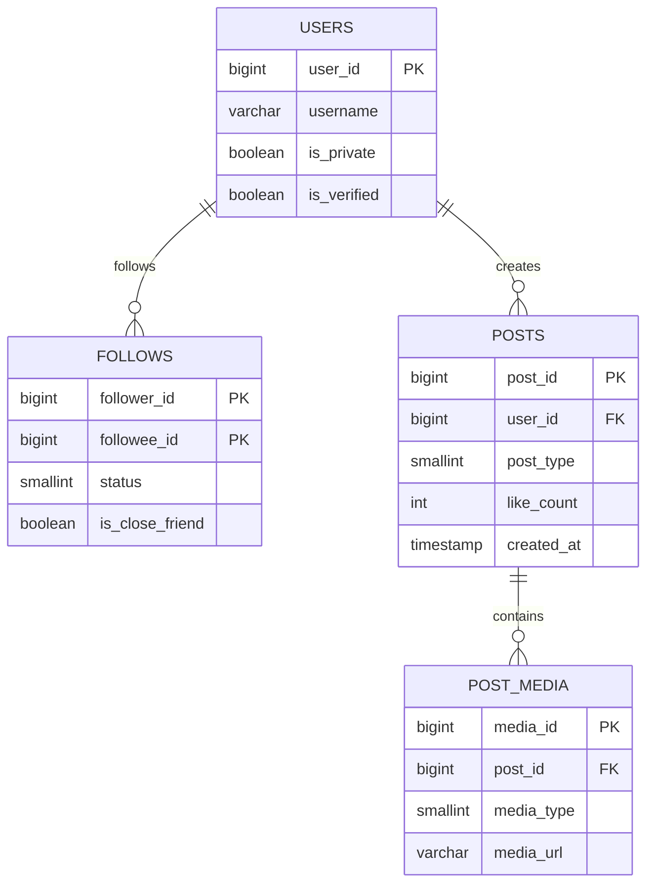
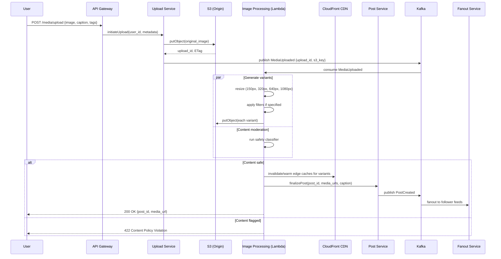
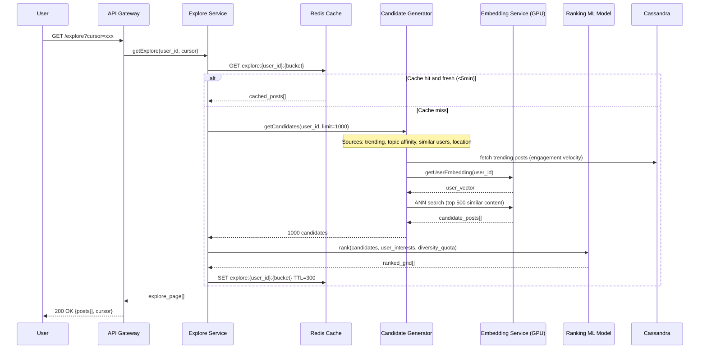
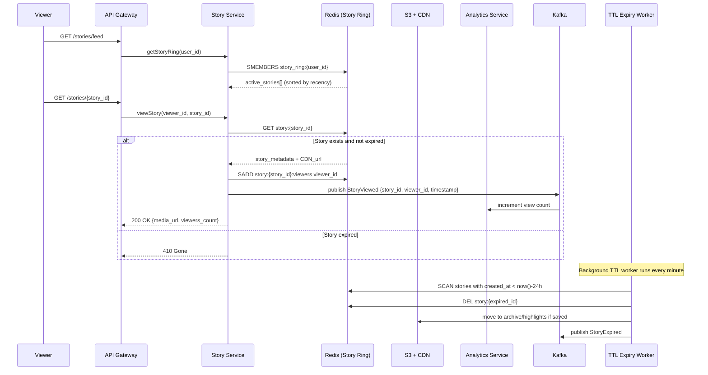

# Instagram System Design

## 1. Functional Requirements

### Core Features

| Feature | Description |
|---------|-------------|
| **Photo/Video Upload** | Upload photos/videos with filters, captions, tags, location |
| **Stories** | 24-hour ephemeral content (photos/videos up to 15s) with stickers, polls, Q&A |
| **Reels** | Short-form video (up to 90s) with audio, effects, AR filters |
| **Feed** | Personalized timeline of posts from followed accounts + suggested content |
| **Explore/Discover** | Algorithmically curated content grid based on interests |
| **Direct Messages** | 1:1 and group messaging with text, media, reactions, disappearing messages |
| **Likes/Comments** | Engage with posts; nested replies, like counts (hideable) |
| **Follow Graph** | Follow/unfollow, followers/following lists, close friends, restricted accounts |
| **Hashtags** | Tag posts for discovery; trending hashtags; follow hashtags |
| **Location Tags** | Geotag posts; browse posts by location; location stories |

### Detailed Feature Breakdown

**Photo/Video Upload Pipeline:**
- Multi-photo carousel (up to 10 images)
- Video up to 60 minutes (IGTV legacy), 90s reels, 15s stories
- 40+ built-in filters (Clarendon, Juno, Lark, etc.)
- Editing tools: crop, rotate, brightness, contrast, saturation, tilt-shift
- Alt text for accessibility
- Collab posts (shared authorship)
- Tagged users, location, hashtags in caption

**Stories Features:**
- Auto-delete after 24 hours
- View tracking (who viewed your story)
- Reply via DM
- Interactive stickers: polls, quizzes, questions, countdowns, sliders
- Music integration
- Close friends list for restricted visibility
- Story highlights (persist beyond 24h)

**Reels Features:**
- Audio library with trending sounds
- AR effects and green screen
- Speed controls, timer, align tool
- Remix (duet-style with another reel)
- Templates from popular reels
- Full-screen immersive vertical video player

---

## 2. Non-Functional Requirements

| Requirement | Target |
|-------------|--------|
| Availability | 99.99% (< 52.6 min downtime/year) |
| Image upload latency | < 3 seconds end-to-end |
| Feed load time | < 200ms (P99) |
| Story load time | < 150ms |
| Total users | 2 Billion registered |
| DAU | 500 Million |
| Photo uploads/day | 100 Million |
| Story uploads/day | 500 Million |
| Consistency | Eventual (feed), Strong (DMs, follow graph mutations) |
| Durability | 99.999999999% (11 nines) for media |
| Content delivery | < 50ms from edge (CDN cache hit) |
| Search latency | < 100ms |
| Geo-distribution | 6 regions minimum |
| Data compliance | GDPR, CCPA, COPPA |

### Availability Strategy
- Multi-region active-active deployment
- Circuit breakers on all service boundaries
- Graceful degradation: serve cached feed if ranking service is down
- Canary deployments with automatic rollback
- Chaos engineering (randomly kill instances in production)

---

## 3. Capacity Estimation

### Traffic
```
DAU:                    500M users
Peak concurrent:        50M users (10% DAU)
Photo uploads/day:      100M
Story uploads/day:      500M
Reel uploads/day:       50M
Feed requests/day:      500M users x 10 opens = 5B
Feed QPS:               5B / 86400 = ~58K QPS (avg), ~175K peak
Upload QPS:             (100M + 500M + 50M) / 86400 = ~7,500 QPS avg
Like events/day:        4B (avg 8 likes/user/day)
Comment events/day:     500M
DM messages/day:        2B
```

### Storage
```
Average photo size (original):          3 MB
Resized versions (6 sizes):             3 MB additional
Per photo total:                        6 MB
Photos/day storage:                     100M x 6 MB = 600 TB/day
Story video (avg 5s, 720p):             2 MB
Stories/day storage:                    500M x 2 MB = 1 PB/day
Reels (avg 20s, 1080p):                15 MB
Reels/day storage:                      50M x 15 MB = 750 TB/day

Daily new media storage:                ~2.35 PB/day
Annual media storage:                   ~860 PB/year
Metadata storage (posts, users, etc):   ~50 TB total
```

### Bandwidth
```
CDN egress (feed loads):
  500M users x 10 sessions x 20 images x 200KB = 20 PB/day egress
  Peak bandwidth: ~2.5 Tbps

Upload ingress:
  2.35 PB/day = ~220 Gbps average
```

### Infrastructure
```
Application servers:        ~50,000 instances (auto-scaled)
Cache nodes (Redis):        ~10,000 nodes
Database nodes:             ~5,000 (across all stores)
CDN PoPs:                   200+ globally
Object storage:             Exabyte-scale (S3/custom)
Kafka brokers:              ~2,000
GPU instances (ML):         ~5,000 (recommendations, content moderation)
```

---

## 4. Data Modeling

### Entity-Relationship Diagram



### PostgreSQL - Users & Relationships (Sharded by user_id)

```sql
-- Users table (sharded by user_id, ~2B rows)
CREATE TABLE users (
    user_id         BIGINT PRIMARY KEY,  -- Snowflake ID
    username        VARCHAR(30) UNIQUE NOT NULL,
    email           VARCHAR(255) UNIQUE,
    phone           VARCHAR(20) UNIQUE,
    full_name       VARCHAR(150),
    bio             TEXT,
    profile_pic_url VARCHAR(512),
    is_private      BOOLEAN DEFAULT false,
    is_verified     BOOLEAN DEFAULT false,
    is_business     BOOLEAN DEFAULT false,
    follower_count  INT DEFAULT 0,
    following_count INT DEFAULT 0,
    post_count      INT DEFAULT 0,
    created_at      TIMESTAMP DEFAULT NOW(),
    last_active_at  TIMESTAMP,
    country_code    VARCHAR(3),
    language        VARCHAR(10) DEFAULT 'en'
);

CREATE INDEX idx_users_username ON users(username);
CREATE INDEX idx_users_email ON users(email);
CREATE INDEX idx_users_phone ON users(phone);

-- Follow relationships (sharded by follower_id)
CREATE TABLE follows (
    follower_id     BIGINT NOT NULL,
    followee_id     BIGINT NOT NULL,
    status          SMALLINT DEFAULT 1, -- 1=active, 2=requested, 3=blocked
    is_close_friend BOOLEAN DEFAULT false,
    created_at      TIMESTAMP DEFAULT NOW(),
    PRIMARY KEY (follower_id, followee_id)
);

CREATE INDEX idx_follows_followee ON follows(followee_id, follower_id);
CREATE INDEX idx_follows_status ON follows(follower_id, status);

-- Posts metadata
CREATE TABLE posts (
    post_id         BIGINT PRIMARY KEY,  -- Snowflake ID
    user_id         BIGINT NOT NULL,
    post_type       SMALLINT NOT NULL, -- 1=photo, 2=video, 3=carousel, 4=reel
    caption         TEXT,
    location_id     BIGINT,
    like_count      INT DEFAULT 0,
    comment_count   INT DEFAULT 0,
    share_count     INT DEFAULT 0,
    save_count      INT DEFAULT 0,
    is_comments_disabled BOOLEAN DEFAULT false,
    is_likes_hidden      BOOLEAN DEFAULT false,
    created_at      TIMESTAMP DEFAULT NOW(),
    updated_at      TIMESTAMP
);

CREATE INDEX idx_posts_user_created ON posts(user_id, created_at DESC);
CREATE INDEX idx_posts_location ON posts(location_id, created_at DESC);

-- Media items (for carousel support)
CREATE TABLE post_media (
    media_id        BIGINT PRIMARY KEY,
    post_id         BIGINT NOT NULL,
    media_type      SMALLINT NOT NULL, -- 1=image, 2=video
    media_url       VARCHAR(512) NOT NULL,
    thumbnail_url   VARCHAR(512),
    width           INT,
    height          INT,
    duration_ms     INT, -- for video
    filter_applied  VARCHAR(50),
    alt_text        VARCHAR(500),
    position        SMALLINT DEFAULT 0,
    created_at      TIMESTAMP DEFAULT NOW()
);

CREATE INDEX idx_post_media_post ON post_media(post_id, position);

-- Comments (sharded by post_id)
CREATE TABLE comments (
    comment_id      BIGINT PRIMARY KEY,
    post_id         BIGINT NOT NULL,
    user_id         BIGINT NOT NULL,
    parent_id       BIGINT, -- NULL for top-level, comment_id for replies
    text            TEXT NOT NULL,
    like_count      INT DEFAULT 0,
    created_at      TIMESTAMP DEFAULT NOW()
);

CREATE INDEX idx_comments_post ON comments(post_id, created_at DESC);
CREATE INDEX idx_comments_parent ON comments(parent_id, created_at ASC);

-- Hashtags
CREATE TABLE hashtags (
    hashtag_id      BIGINT PRIMARY KEY,
    name            VARCHAR(100) UNIQUE NOT NULL,
    post_count      BIGINT DEFAULT 0,
    is_banned       BOOLEAN DEFAULT false
);

CREATE TABLE post_hashtags (
    post_id         BIGINT NOT NULL,
    hashtag_id      BIGINT NOT NULL,
    PRIMARY KEY (post_id, hashtag_id)
);

CREATE INDEX idx_post_hashtags_tag ON post_hashtags(hashtag_id, post_id DESC);
```

### Cassandra - Feed & Stories (Optimized for write-heavy, time-series)

```cql
-- User feed (fan-out on write for users with < 10K followers)
CREATE TABLE user_feed (
    user_id     BIGINT,
    created_at  TIMEUUID,
    post_id     BIGINT,
    author_id   BIGINT,
    post_type   TINYINT,
    media_url   TEXT,
    caption     TEXT,
    score       FLOAT,      -- ranking score from ML model
    PRIMARY KEY (user_id, created_at)
) WITH CLUSTERING ORDER BY (created_at DESC)
  AND default_time_to_live = 2592000; -- 30 days TTL

-- Stories (24h TTL)
CREATE TABLE stories (
    user_id     BIGINT,
    story_id    BIGINT,
    media_url   TEXT,
    media_type  TINYINT,
    sticker_data TEXT,      -- JSON blob for interactive elements
    music_id    BIGINT,
    created_at  TIMESTAMP,
    expires_at  TIMESTAMP,
    view_count  COUNTER,
    PRIMARY KEY (user_id, created_at)
) WITH CLUSTERING ORDER BY (created_at DESC)
  AND default_time_to_live = 86400; -- 24h TTL

-- Story views
CREATE TABLE story_views (
    story_id    BIGINT,
    viewer_id   BIGINT,
    viewed_at   TIMESTAMP,
    PRIMARY KEY (story_id, viewer_id)
) WITH default_time_to_live = 172800; -- 48h TTL

-- User activity feed (notifications)
CREATE TABLE activity_feed (
    user_id       BIGINT,
    activity_time TIMEUUID,
    activity_type TINYINT, -- 1=like, 2=comment, 3=follow, 4=mention
    actor_id      BIGINT,
    post_id       BIGINT,
    preview_text  TEXT,
    PRIMARY KEY (user_id, activity_time)
) WITH CLUSTERING ORDER BY (activity_time DESC)
  AND default_time_to_live = 7776000; -- 90 days
```

### Redis - Caching & Real-time Counters

```
# Feed cache (sorted set: score = ranking_score * time_decay)
ZADD feed:{user_id} {score} {post_id}
ZREVRANGE feed:{user_id} 0 19  -- top 20 posts

# Stories tray (sorted set of users with active stories)
ZADD stories_tray:{user_id} {timestamp} {author_id}
ZREVRANGE stories_tray:{user_id} 0 -1

# Like counts (HyperLogLog for approximate unique counts on viral posts)
PFADD likes:{post_id} {user_id}
PFCOUNT likes:{post_id}

# Exact like counts for normal posts
INCR like_count:{post_id}

# User session cache
HSET user:{user_id} username "john" followers 1500 following 300

# Rate limiting
INCR rate:{user_id}:{action}:{minute}
EXPIRE rate:{user_id}:{action}:{minute} 60

# Online presence
SETEX online:{user_id} 300 1  -- 5 min TTL

# Trending hashtags (sorted set)
ZINCRBY trending:hashtags:{hour} 1 "#sunset"

# Feed position (cursor for pagination)
SET feed_cursor:{user_id} {last_seen_post_id} EX 3600
```

### S3 - Media Storage Structure

```
Bucket: instagram-media-{region}
├── photos/
│   ├── {year}/{month}/{day}/
│   │   ├── {post_id}/
│   │   │   ├── original.jpg          (preserved, not served)
│   │   │   ├── 1080w.jpg             (feed full-width)
│   │   │   ├── 640w.jpg              (feed thumbnail)
│   │   │   ├── 320w.jpg              (grid thumbnail)
│   │   │   ├── 150w.jpg              (notification/tiny)
│   │   │   └── 1080w.webp            (modern browsers)
├── videos/
│   ├── {year}/{month}/{day}/
│   │   ├── {post_id}/
│   │   │   ├── original.mp4
│   │   │   ├── 1080p.mp4  (H.265)
│   │   │   ├── 720p.mp4   (H.264)
│   │   │   ├── 480p.mp4   (low bandwidth)
│   │   │   ├── thumbnail.jpg
│   │   │   └── hls/       (adaptive streaming segments)
├── stories/
│   └── {user_id}/{story_id}/...
├── reels/
│   └── {user_id}/{reel_id}/...
├── profile_pics/
│   └── {user_id}/{size}.jpg
└── dm_media/
    └── {thread_id}/{message_id}/...
```

### Elasticsearch - Search & Explore

```json
// Users index
{
  "mappings": {
    "properties": {
      "user_id": { "type": "long" },
      "username": { "type": "keyword", "copy_to": "suggest" },
      "full_name": { "type": "text", "analyzer": "standard" },
      "bio": { "type": "text" },
      "suggest": { "type": "completion", "analyzer": "simple" },
      "follower_count": { "type": "integer" },
      "is_verified": { "type": "boolean" },
      "category": { "type": "keyword" },
      "location": { "type": "geo_point" }
    }
  }
}

// Posts index (for explore/search)
{
  "mappings": {
    "properties": {
      "post_id": { "type": "long" },
      "user_id": { "type": "long" },
      "caption_text": { "type": "text", "analyzer": "instagram_analyzer" },
      "hashtags": { "type": "keyword" },
      "location": { "type": "geo_point" },
      "location_name": { "type": "text" },
      "engagement_score": { "type": "float" },
      "content_embedding": { "type": "dense_vector", "dims": 512 },
      "visual_tags": { "type": "keyword" }, // ML-detected: "beach", "food", "sunset"
      "created_at": { "type": "date" },
      "media_type": { "type": "keyword" }
    }
  }
}
```

---

## 5. High-Level Design

### System Architecture (ASCII)

```
                                    ┌─────────────────────────────────────┐
                                    │         Global DNS (Route53)         │
                                    │    Latency-based / Geo routing       │
                                    └──────────────────┬──────────────────┘
                                                       │
                              ┌─────────────────────────┼─────────────────────────┐
                              │                         │                         │
                    ┌─────────▼────────┐    ┌─────────▼────────┐    ┌──────────▼───────┐
                    │  CDN Edge PoP    │    │  CDN Edge PoP    │    │  CDN Edge PoP    │
                    │  (CloudFront)    │    │  (US-West)       │    │  (Asia)          │
                    │  - Image resize  │    │                  │    │                  │
                    │  - WebP convert  │    │                  │    │                  │
                    │  - Video segment │    │                  │    │                  │
                    └─────────┬────────┘    └────────┬─────────┘    └────────┬─────────┘
                              │                      │                       │
                              └──────────────────────┼───────────────────────┘
                                                     │
                    ┌────────────────────────────────▼────────────────────────────────┐
                    │                    L7 Load Balancer (ALB/Envoy)                  │
                    │              Rate Limiting │ Auth │ SSL Termination              │
                    └────────────────────────────────┬────────────────────────────────┘
                                                     │
           ┌───────────────┬──────────────┬─────────┼────────┬──────────────┬─────────────┐
           │               │              │         │        │              │             │
    ┌──────▼─────┐  ┌──────▼─────┐ ┌─────▼────┐ ┌──▼───┐ ┌──▼──────┐ ┌────▼────┐ ┌─────▼────┐
    │  Upload    │  │   Feed     │ │  Story   │ │ Reel │ │ Explore │ │   DM    │ │  Search  │
    │  Service   │  │  Service   │ │ Service  │ │ Svc  │ │ Service │ │ Service │ │  Service │
    └──────┬─────┘  └──────┬─────┘ └─────┬────┘ └──┬───┘ └──┬──────┘ └────┬────┘ └─────┬────┘
           │               │              │         │        │              │             │
           │          ┌────▼────┐         │         │   ┌────▼─────┐       │             │
           │          │ Ranking │         │         │   │  ML/Rec  │       │             │
           │          │ Service │         │         │   │  Engine  │       │             │
           │          └────┬────┘         │         │   └────┬─────┘       │             │
           │               │              │         │        │              │             │
    ┌──────▼───────────────▼──────────────▼─────────▼────────▼──────────────▼─────────────▼──┐
    │                              Apache Kafka (Event Bus)                                    │
    │  Topics: uploads, feed-fanout, story-events, likes, comments, dm-messages,              │
    │          notifications, content-moderation, analytics, trending                          │
    └───┬──────────────┬──────────────┬──────────────┬──────────────┬──────────────┬─────────┘
        │              │              │              │              │              │
 ┌──────▼──────┐ ┌────▼─────┐ ┌─────▼─────┐ ┌─────▼─────┐ ┌─────▼─────┐ ┌─────▼──────┐
 │   Media     │ │  Feed    │ │ Notif     │ │ Content   │ │ Analytics │ │  Trending  │
 │ Processing  │ │ Fan-out  │ │ Service   │ │ Moderation│ │  (Flink)  │ │  (Flink)   │
 │  Pipeline   │ │ Workers  │ │ (Push)    │ │  (ML)     │ │           │ │            │
 └──────┬──────┘ └────┬─────┘ └─────┬─────┘ └─────┬─────┘ └─────┬─────┘ └─────┬──────┘
        │              │              │              │              │              │
    ┌───▼───┐    ┌─────▼─────┐  ┌────▼────┐   ┌────▼────┐  ┌─────▼─────┐  ┌────▼────┐
    │  S3   │    │ Cassandra │  │  APNs/  │   │  GPU    │  │  ClickHouse│  │  Redis  │
    │ + CDN │    │  (Feed)   │  │  FCM    │   │ Cluster │  │  (OLAP)   │  │ Sorted  │
    └───────┘    └───────────┘  └─────────┘   └─────────┘  └───────────┘  │  Sets   │
                                                                            └─────────┘
    ┌────────────────────────────────────────────────────────────────────────────────────┐
    │                            Data Stores Layer                                        │
    ├────────────┬────────────┬──────────────┬─────────────┬────────────┬────────────────┤
    │ PostgreSQL │ Cassandra  │    Redis     │     S3      │Elasticsearch│  Neo4j/TAO    │
    │ (Users,    │ (Feed,     │  (Cache,     │  (Media     │ (Search,   │ (Social Graph │
    │  Posts,    │  Stories,  │   Counters,  │   Objects)  │  Explore)  │  Traversal)   │
    │  Comments) │  Activity) │   Sessions)  │             │            │               │
    └────────────┴────────────┴──────────────┴─────────────┴────────────┴────────────────┘
```

### Feed Generation Strategy (Hybrid Push/Pull)

```
For users with < 10K followers (99% of users): PUSH (fan-out on write)
  - On post creation, write to all followers' feed in Cassandra
  - Async via Kafka consumers
  - Pre-computed, fast reads

For users with > 10K followers (celebrities): PULL (fan-out on read)
  - Store post in author's timeline only
  - On feed read, merge celebrity posts with pre-computed feed
  - Avoids writing to millions of feeds

Feed Assembly:
  1. Read pre-computed feed from Cassandra (followed accounts)
  2. Fetch celebrity posts (pull-based)
  3. Inject suggested posts from Explore/Rec engine
  4. Apply ML ranking model (engagement prediction)
  5. Apply diversity rules (no 2 posts from same author adjacent)
  6. Cache final ranked feed in Redis (TTL 5 min)
```

---

## 6. Low-Level Design - APIs

### Upload Media

```
POST /v1/media/upload
Authorization: Bearer {token}
Content-Type: multipart/form-data

Request:
  file:           <binary>          (required)
  media_type:     "photo"|"video"   (required)
  caption:        "Sunset vibes #nature"
  location_id:    12345678
  tagged_users:   [111, 222, 333]
  filter:         "clarendon"
  alt_text:       "A golden sunset over the ocean"
  disable_comments: false
  hide_likes:     false
  carousel_id:    null | "uuid"     (for multi-image posts)
  carousel_position: 0

Response 202 Accepted:
{
  "upload_id": "up_7f3k9x2m",
  "status": "processing",
  "estimated_completion_ms": 2000,
  "polling_url": "/v1/media/up_7f3k9x2m/status"
}

-- After processing completes:
GET /v1/media/up_7f3k9x2m/status
Response 200:
{
  "upload_id": "up_7f3k9x2m",
  "status": "completed",
  "post": {
    "post_id": "3201948573021",
    "media": [{
      "media_id": "m_8x2j3k",
      "urls": {
        "1080w": "https://cdn.ig.com/p/3201948573021/1080w.jpg",
        "640w": "https://cdn.ig.com/p/3201948573021/640w.jpg",
        "320w": "https://cdn.ig.com/p/3201948573021/320w.jpg"
      },
      "dimensions": { "width": 1080, "height": 1350 }
    }],
    "permalink": "https://instagram.com/p/BxK3j2lA9"
  }
}
```

### Get Feed

```
GET /v1/feed?cursor={cursor}&limit=20
Authorization: Bearer {token}
X-Device-Info: iPhone14,2;iOS17.1;3x

Response 200:
{
  "items": [
    {
      "post_id": "3201948573021",
      "author": {
        "user_id": "1001",
        "username": "natgeo",
        "profile_pic_url": "https://cdn.ig.com/pp/1001/150.jpg",
        "is_verified": true
      },
      "post_type": "photo",
      "media": [{
        "url": "https://cdn.ig.com/p/3201948573021/1080w.webp",
        "width": 1080,
        "height": 1080,
        "type": "image"
      }],
      "caption": {
        "text": "The northern lights over Iceland #aurora",
        "hashtags": ["aurora"],
        "mentions": []
      },
      "engagement": {
        "like_count": 245831,
        "comment_count": 1892,
        "has_liked": false,
        "has_saved": false
      },
      "location": {
        "id": "456",
        "name": "Reykjavik, Iceland"
      },
      "created_at": "2024-01-15T14:30:00Z",
      "ranking_reason": "following"
    },
    {
      "post_id": "3201948573099",
      "ranking_reason": "suggested_for_you",
      "suggestion_context": "Based on posts you've liked"
      // ... similar structure
    }
  ],
  "next_cursor": "eyJsYXN0X2lkIjoiMzIwMTk0ODU3MzAyMSJ9",
  "has_more": true
}
```

### Post Story

```
POST /v1/stories
Authorization: Bearer {token}
Content-Type: multipart/form-data

Request:
  file:           <binary>
  media_type:     "photo"|"video"
  duration_ms:    5000              (for photos, display duration)
  stickers:       [
    { "type": "poll", "question": "Beach or Mountains?", "options": ["Beach", "Mountains"], "x": 0.5, "y": 0.7 },
    { "type": "mention", "user_id": "1001", "x": 0.3, "y": 0.4 },
    { "type": "music", "track_id": "tk_9x2", "start_ms": 15000, "end_ms": 30000 }
  ]
  audience:       "everyone"|"close_friends"
  allow_replies:  "everyone"|"following"|"off"

Response 201:
{
  "story_id": "st_28x9k2m",
  "media_url": "https://cdn.ig.com/stories/1001/st_28x9k2m/720.mp4",
  "expires_at": "2024-01-16T14:30:00Z",
  "sticker_responses_enabled": true
}
```

### Explore Endpoint

```
GET /v1/explore?category=all&cursor={cursor}&grid_size=30
Authorization: Bearer {token}

Response 200:
{
  "items": [
    {
      "post_id": "320194857301",
      "media_type": "reel",
      "thumbnail_url": "https://cdn.ig.com/r/320194857301/thumb.jpg",
      "preview_url": "https://cdn.ig.com/r/320194857301/preview_3s.mp4",
      "view_count": 2400000,
      "author": { "username": "creator1", "is_verified": true },
      "grid_position": { "row": 0, "col": 0, "span_rows": 2, "span_cols": 2 },
      "explore_reason": "trending_in_your_area"
    }
    // ... 29 more items
  ],
  "topics": [
    { "id": "travel", "name": "Travel", "icon_url": "..." },
    { "id": "food", "name": "Food", "icon_url": "..." }
  ],
  "next_cursor": "...",
  "has_more": true
}
```

### DM Send

```
POST /v1/direct/threads/{thread_id}/messages
Authorization: Bearer {token}

Request:
{
  "message_type": "text"|"media"|"post_share"|"reel_share"|"voice"|"reaction",
  "text": "Check this out!",
  "shared_post_id": "3201948573021",  // for post_share type
  "reply_to_message_id": null,
  "disappearing": false
}

Response 201:
{
  "message_id": "msg_9x2k3m",
  "thread_id": "thr_5j2k8x",
  "sender_id": "1001",
  "timestamp": "2024-01-15T14:35:22Z",
  "status": "sent",
  "message": {
    "type": "post_share",
    "text": "Check this out!",
    "shared_post": {
      "post_id": "3201948573021",
      "thumbnail_url": "https://cdn.ig.com/p/3201948573021/320w.jpg",
      "author_username": "natgeo"
    }
  }
}

-- Real-time delivery via WebSocket:
WS /v1/direct/realtime
{
  "type": "message",
  "thread_id": "thr_5j2k8x",
  "message": { ... }  // same as above
}
```

---

## 7. Deep Dive: Media Processing Pipeline

### Architecture

```
┌──────────┐     ┌──────────┐     ┌───────────┐     ┌──────────────┐     ┌──────────┐
│  Client  │────▶│  Upload  │────▶│   Kafka   │────▶│   Media      │────▶│   S3     │
│  (App)   │     │  Service │     │  (topic:  │     │  Processing  │     │ (multi-  │
│          │     │          │     │  uploads) │     │  Workers     │     │  region) │
└──────────┘     └─────┬────┘     └───────────┘     └──────┬───────┘     └─────┬────┘
                       │                                    │                    │
                       │ (presigned URL                     │                    │
                       │  direct to S3)                     ▼                    ▼
                       │                            ┌──────────────┐     ┌──────────────┐
                       └───────────────────────────▶│  S3 (raw     │     │    CDN       │
                                                    │  uploads)    │     │  Invalidation│
                                                    └──────────────┘     └──────────────┘
```

### Processing Pipeline Steps

```python
class MediaProcessingPipeline:
    """
    Processes uploaded media through a series of stages.
    Each stage is idempotent and can be retried independently.
    """

    async def process(self, upload_event: UploadEvent):
        media_id = upload_event.media_id
        raw_path = upload_event.s3_path

        # Stage 1: Virus/Malware Scan
        scan_result = await self.virus_scan(raw_path)
        if scan_result.is_infected:
            await self.quarantine(media_id, scan_result)
            return ProcessingResult.REJECTED

        # Stage 2: EXIF/Metadata Stripping (privacy)
        stripped_path = await self.strip_metadata(raw_path)
        # Remove GPS coords, camera serial, timestamps
        # Preserve orientation data for correct display

        # Stage 3: Content Safety Check (CSAM, nudity, violence)
        safety_result = await self.content_safety_check(stripped_path)
        if safety_result.score > BLOCK_THRESHOLD:
            await self.flag_and_block(media_id, safety_result)
            return ProcessingResult.BLOCKED
        if safety_result.score > REVIEW_THRESHOLD:
            await self.queue_human_review(media_id, safety_result)

        # Stage 4: Deduplication Check
        perceptual_hash = await self.compute_phash(stripped_path)
        duplicate = await self.check_duplicate(perceptual_hash)
        if duplicate and duplicate.is_copyright_violation:
            return ProcessingResult.COPYRIGHT_BLOCKED

        # Stage 5: Filter Application (if requested)
        if upload_event.filter:
            filtered_path = await self.apply_filter(
                stripped_path, upload_event.filter
            )
        else:
            filtered_path = stripped_path

        # Stage 6: Generate Multiple Resolutions
        variants = await self.generate_variants(filtered_path, upload_event.media_type)
        """
        For images:
          - 1080w (feed full)
          - 640w  (feed compressed)
          - 320w  (grid/thumbnail)
          - 150w  (notification)
          - WebP versions of each (30% smaller)
          - AVIF versions for supported clients

        For videos:
          - 1080p H.265 (high quality)
          - 720p H.264  (standard)
          - 480p H.264  (low bandwidth)
          - HLS segments (4s each) for adaptive streaming
          - Thumbnail at 1s mark
          - Preview clip (first 3s, muted, for autoplay)
        """

        # Stage 7: Upload to Multi-Region S3
        urls = await self.distribute_to_regions(variants)
        # Write to primary region, async replicate to 3+ regions

        # Stage 8: CDN Warm-up (pre-cache for followers likely to see it)
        await self.cdn_warmup(urls, upload_event.user_id)

        # Stage 9: Update Database & Notify
        await self.update_post_status(media_id, urls, ProcessingResult.SUCCESS)
        await self.emit_event('media.processed', media_id)

        return ProcessingResult.SUCCESS

    async def generate_variants(self, source_path: str, media_type: str):
        if media_type == 'image':
            return await asyncio.gather(
                self.resize_image(source_path, width=1080, format='jpeg', quality=85),
                self.resize_image(source_path, width=1080, format='webp', quality=80),
                self.resize_image(source_path, width=640, format='jpeg', quality=80),
                self.resize_image(source_path, width=640, format='webp', quality=75),
                self.resize_image(source_path, width=320, format='jpeg', quality=75),
                self.resize_image(source_path, width=150, format='jpeg', quality=70),
            )
        elif media_type == 'video':
            return await asyncio.gather(
                self.transcode_video(source_path, resolution='1080p', codec='h265', bitrate='4M'),
                self.transcode_video(source_path, resolution='720p', codec='h264', bitrate='2.5M'),
                self.transcode_video(source_path, resolution='480p', codec='h264', bitrate='1M'),
                self.generate_hls(source_path, segment_duration=4),
                self.extract_thumbnail(source_path, at_second=1),
                self.generate_preview(source_path, duration=3, muted=True),
            )

    async def compute_phash(self, image_path: str) -> str:
        """
        Perceptual hash using DCT-based algorithm:
        1. Resize to 32x32 grayscale
        2. Apply DCT
        3. Take top-left 8x8 (low frequencies)
        4. Compute median
        5. Set bits above/below median → 64-bit hash
        Hamming distance < 5 = likely duplicate
        """
        img = await load_image_grayscale(image_path, size=(32, 32))
        dct = apply_dct(img)
        low_freq = dct[:8, :8]
        median = np.median(low_freq)
        return ''.join(['1' if v > median else '0' for v in low_freq.flatten()])
```

### Filter Application Engine

```python
FILTERS = {
    'clarendon': {
        'brightness': 1.1,
        'contrast': 1.2,
        'saturation': 1.35,
        'shadows_tint': (70, 50, 120),  # cool purple shadows
        'highlights_tint': (255, 230, 180),  # warm highlights
        'vignette': 0.2
    },
    'juno': {
        'brightness': 1.05,
        'contrast': 1.1,
        'saturation': 1.4,
        'warmth': 1.15,
        'shadows_tint': (50, 40, 80),
        'highlights_tint': (255, 245, 200),
        'vignette': 0.1
    },
    # ... 40+ filters
}

async def apply_filter(self, image_path: str, filter_name: str) -> str:
    """GPU-accelerated filter application using custom shaders."""
    params = FILTERS[filter_name]
    img = await load_image(image_path)

    # Apply adjustments in pipeline order
    img = adjust_brightness(img, params.get('brightness', 1.0))
    img = adjust_contrast(img, params.get('contrast', 1.0))
    img = adjust_saturation(img, params.get('saturation', 1.0))
    img = adjust_warmth(img, params.get('warmth', 1.0))

    if 'shadows_tint' in params:
        img = tint_shadows(img, params['shadows_tint'])
    if 'highlights_tint' in params:
        img = tint_highlights(img, params['highlights_tint'])
    if params.get('vignette', 0) > 0:
        img = apply_vignette(img, strength=params['vignette'])

    output_path = f"{image_path}_filtered_{filter_name}"
    await save_image(img, output_path, quality=90)
    return output_path
```

---

## 8. Deep Dive: Explore & Discovery

### Recommendation Architecture

```
┌─────────────────────────────────────────────────────────────────────┐
│                     Explore Recommendation Engine                     │
├─────────────────────────────────────────────────────────────────────┤
│                                                                       │
│  ┌──────────────┐    ┌──────────────────┐    ┌──────────────────┐   │
│  │  Candidate   │    │    Ranking        │    │   Post-Ranking   │   │
│  │  Generation  │───▶│    Model          │───▶│   Filters        │   │
│  │  (1000s)     │    │    (top 100)      │    │   (final 30)     │   │
│  └──────────────┘    └──────────────────┘    └──────────────────┘   │
│         │                     │                        │             │
│    ┌────┴────┐          ┌────┴────┐             ┌─────┴─────┐      │
│    │CF Model │          │ Deep NN │             │ Diversity  │      │
│    │ANN Index│          │(scoring)│             │ De-dup     │      │
│    │Trending │          │         │             │ Safety     │      │
│    │Graph    │          │         │             │ Freshness  │      │
│    └─────────┘          └─────────┘             └───────────┘      │
└─────────────────────────────────────────────────────────────────────┘
```

### Candidate Generation Strategies

```python
class ExploreCandiateGenerator:
    """
    Multi-strategy candidate generation producing ~5000 candidates
    that get ranked down to 30 displayed items.
    """

    async def generate_candidates(self, user_id: str, context: RequestContext) -> List[Candidate]:
        candidates = await asyncio.gather(
            self.collaborative_filtering(user_id),      # ~1500 candidates
            self.content_based(user_id),                # ~1000 candidates
            self.graph_based(user_id),                  # ~1000 candidates
            self.trending_global(context.country),      # ~500 candidates
            self.trending_topic(user_id),               # ~500 candidates
            self.serendipity_injection(),               # ~500 candidates (diversity)
        )
        return self.deduplicate(flatten(candidates))

    async def collaborative_filtering(self, user_id: str) -> List[Candidate]:
        """
        Two-tower model:
        - User tower: encodes user features → 128-dim embedding
        - Item tower: encodes post features → 128-dim embedding
        - Trained on (user, post, engagement) triplets

        At serving time:
        1. Compute user embedding from latest features
        2. ANN search (FAISS/ScaNN) for nearest post embeddings
        3. Return top-K nearest posts not already seen
        """
        user_embedding = await self.user_tower.encode(user_id)

        # Features: last 100 liked posts, followed accounts' categories,
        # time-of-day engagement patterns, device type
        user_features = await self.get_user_features(user_id)
        user_vec = self.user_tower.predict(user_features)  # 128-dim

        # ANN search in post embedding index (updated hourly)
        # Index contains ~500M eligible posts
        neighbors = await self.ann_index.search(
            vector=user_vec,
            top_k=1500,
            filter=f"created_at > now() - 7d AND NOT seen_by({user_id})"
        )
        return [Candidate(post_id=n.id, score=n.similarity, source='cf') for n in neighbors]

    async def content_based(self, user_id: str) -> List[Candidate]:
        """
        Based on visual and textual content similarity:
        1. Get user's recent engagement history (liked/saved/shared posts)
        2. Extract content embeddings (CLIP model for images, BERT for text)
        3. Find similar content in embedding space
        """
        recent_engagements = await self.get_recent_engagements(user_id, limit=50)

        # Average embedding of recently engaged content
        engagement_embeddings = [
            await self.get_content_embedding(post_id)
            for post_id in recent_engagements
        ]
        centroid = np.mean(engagement_embeddings, axis=0)

        # Search for similar content
        similar = await self.content_ann_index.search(
            vector=centroid, top_k=1000
        )
        return [Candidate(post_id=s.id, score=s.similarity, source='content') for s in similar]

    async def graph_based(self, user_id: str) -> List[Candidate]:
        """
        Social graph exploration:
        - Posts liked by accounts you follow (2nd degree)
        - Posts from accounts followed by accounts you follow
        - Posts popular among users similar to you
        """
        # 2-hop traversal in social graph (TAO/Neo4j)
        second_degree = await self.graph.query(f"""
            MATCH (u:User {{id: '{user_id}'}})-[:FOLLOWS]->(f)-[:LIKED]->(p:Post)
            WHERE p.created_at > datetime() - duration('P7D')
              AND NOT (u)-[:SEEN]->(p)
              AND NOT (u)-[:FOLLOWS]->(p.author)
            RETURN p.id, count(f) as social_proof
            ORDER BY social_proof DESC
            LIMIT 1000
        """)
        return [Candidate(post_id=r.id, score=r.social_proof, source='graph') for r in second_degree]

    async def trending_global(self, country: str) -> List[Candidate]:
        """Real-time trending from Flink pipeline."""
        trending = await self.redis.zrevrange(f"trending:posts:{country}", 0, 499)
        return [Candidate(post_id=pid, score=score, source='trending') for pid, score in trending]
```

### Ranking Model

```python
class ExploreRankingModel:
    """
    Multi-task deep neural network predicting multiple engagement types.
    Architecture: Shared bottom layers → task-specific towers

    Input features (~1000 dimensions):
    - User features: demographics, engagement history, session context
    - Post features: media type, engagement rates, author stats, content embeddings
    - Cross features: user-author affinity, topic relevance
    - Context: time of day, day of week, device, network quality
    """

    def score(self, candidates: List[Candidate], user_context: UserContext) -> List[ScoredCandidate]:
        features = self.extract_features(candidates, user_context)

        # Multi-task predictions
        p_like = self.like_tower(features)           # P(user likes this)
        p_comment = self.comment_tower(features)     # P(user comments)
        p_save = self.save_tower(features)           # P(user saves)
        p_share = self.share_tower(features)         # P(user shares)
        p_dwell = self.dwell_tower(features)         # Expected dwell time (seconds)
        p_negative = self.negative_tower(features)   # P(user reports/hides)

        # Weighted combination (tuned via online A/B experiments)
        final_score = (
            0.3 * p_like +
            0.2 * p_comment +
            0.15 * p_save +
            0.15 * p_share +
            0.25 * p_dwell / 30.0 +  # normalize dwell time
            -2.0 * p_negative         # heavy penalty for negative signals
        )

        # Value model: estimate long-term user satisfaction (not just engagement)
        ltv_adjustment = self.value_model(features)  # prevents clickbait optimization
        final_score = final_score * (1 + 0.3 * ltv_adjustment)

        return sorted(
            [ScoredCandidate(c, score=s) for c, s in zip(candidates, final_score)],
            key=lambda x: x.score, reverse=True
        )[:100]
```

### Real-Time Trending Detection (Flink)

```java
// Flink streaming job for real-time trending content detection
DataStream<EngagementEvent> events = env
    .addSource(new KafkaSource<>("engagement-events"))
    .keyBy(event -> event.getPostId());

// Sliding window: engagement velocity over last 30 min vs. baseline
DataStream<TrendingPost> trending = events
    .window(SlidingEventTimeWindows.of(Time.minutes(30), Time.minutes(5)))
    .aggregate(new EngagementVelocityAggregator())
    .filter(post -> post.getVelocity() > post.getBaselineVelocity() * 3.0)
    .process(new TrendingScorer());

// Output to Redis sorted set for serving
trending.addSink(new RedisSortedSetSink("trending:posts:{country}"));
```

---

## 9. Component Optimization

### Kafka Configuration

```yaml
# Upload events topic
upload-events:
  partitions: 256
  replication-factor: 3
  retention.ms: 604800000  # 7 days
  max.message.bytes: 1048576
  compression.type: lz4

# Feed fanout topic (high throughput)
feed-fanout:
  partitions: 1024  # high parallelism for celebrity posts
  replication-factor: 3
  retention.ms: 86400000   # 1 day
  compression.type: snappy

# Consumer groups: feed-fanout-workers (1024 instances, 1:1 with partitions)
```

### Redis Feed Implementation

```python
class FeedCache:
    """
    Redis sorted sets for feed caching.
    Score = ranking_score (from ML model, decayed by time).
    """

    FEED_SIZE = 500  # max posts cached per user
    FEED_TTL = 3600  # 1 hour

    async def add_to_feed(self, user_id: str, post_id: str, score: float):
        key = f"feed:{user_id}"
        pipe = self.redis.pipeline()
        pipe.zadd(key, {post_id: score})
        pipe.zremrangebyrank(key, 0, -(self.FEED_SIZE + 1))  # trim to max size
        pipe.expire(key, self.FEED_TTL)
        await pipe.execute()

    async def get_feed(self, user_id: str, offset: int = 0, limit: int = 20) -> List[str]:
        key = f"feed:{user_id}"
        post_ids = await self.redis.zrevrange(key, offset, offset + limit - 1)
        if not post_ids:
            # Cache miss: rebuild from Cassandra
            post_ids = await self.rebuild_feed_from_db(user_id)
        return post_ids

    async def fan_out_post(self, author_id: str, post_id: str, score: float):
        """Fan-out to followers' feeds. Only for non-celebrity accounts."""
        follower_ids = await self.get_follower_ids(author_id)
        if len(follower_ids) > 10_000:
            return  # Celebrity: use pull-based approach

        # Batch pipeline for efficiency
        BATCH_SIZE = 1000
        for batch in chunked(follower_ids, BATCH_SIZE):
            pipe = self.redis.pipeline()
            for fid in batch:
                pipe.zadd(f"feed:{fid}", {post_id: score})
            await pipe.execute()
```

### Database Sharding Strategy

```
PostgreSQL Sharding (Vitess/Citus):
├── Users: hash(user_id) % 256 shards
├── Posts: hash(user_id) % 256 (co-located with user for profile queries)
├── Comments: hash(post_id) % 128 shards
├── Follows: hash(follower_id) % 256 (fast "who do I follow?" queries)
│   └── Secondary index on followee_id (separate shard set) for "who follows me?"
└── Likes: hash(post_id) % 128

Cassandra:
├── user_feed: partition key = user_id (natural distribution)
├── stories: partition key = user_id
└── activity_feed: partition key = user_id

Shard splits:
- Monitor partition size; split when > 10GB
- Hot shard detection via query latency P99 monitoring
- Resharding via double-write + backfill pattern
```

### Image CDN with On-the-Fly Resizing

```
CDN Edge Configuration (CloudFront + Lambda@Edge):

URL pattern: https://cdn.ig.com/p/{post_id}/{width}x{height}.{format}?q={quality}

Lambda@Edge (Origin Request):
  1. Parse requested dimensions from URL
  2. Check if pre-generated variant exists in S3
  3. If yes → serve from S3
  4. If no → resize on-the-fly from nearest available size
     - Use sharp/libvips for sub-100ms resize
     - Cache result in S3 for future requests
  5. Content-Negotiate: serve WebP/AVIF if Accept header supports it

Cache-Control: public, max-age=31536000, immutable
  (Media URLs are content-addressed, never change)

CDN Tiering:
  L1: Edge PoP (200+ locations, 30-day TTL, hot content)
  L2: Regional cache (12 locations, 90-day TTL, warm content)
  L3: Origin shield (1 location per region, reduces origin load)
  Origin: S3 (multi-region replicated)
```

### Flink Real-Time Analytics

```java
// Real-time engagement aggregation for trending + analytics
StreamExecutionEnvironment env = StreamExecutionEnvironment.getExecutionEnvironment();
env.setParallelism(512);
env.enableCheckpointing(60000, CheckpointingMode.EXACTLY_ONCE);

DataStream<EngagementEvent> stream = env
    .addSource(new FlinkKafkaConsumer<>("engagement-events", schema, kafkaProps))
    .assignTimestampsAndWatermarks(
        WatermarkStrategy.<EngagementEvent>forBoundedOutOfOrderness(Duration.ofSeconds(10))
            .withTimestampAssigner((event, ts) -> event.getTimestamp())
    );

// Per-post engagement counters (tumbling 1-min windows → ClickHouse)
stream
    .keyBy(EngagementEvent::getPostId)
    .window(TumblingEventTimeWindows.of(Time.minutes(1)))
    .aggregate(new EngagementCounter())
    .addSink(new ClickHouseSink("post_engagement_minutes"));

// Per-hashtag velocity (sliding 30min window → Redis for trending)
stream
    .flatMap(new HashtagExtractor())
    .keyBy(HashtagEvent::getHashtag)
    .window(SlidingEventTimeWindows.of(Time.minutes(30), Time.minutes(1)))
    .aggregate(new VelocityCalculator())
    .filter(v -> v.getVelocity() > TRENDING_THRESHOLD)
    .addSink(new RedisSortedSetSink("trending:hashtags"));
```

---

## 10. Observability, Security & Considerations

### Observability

```yaml
# Key SLIs/SLOs
SLOs:
  feed_latency_p99: 200ms
  upload_success_rate: 99.9%
  story_delivery_latency_p99: 500ms
  dm_delivery_latency_p99: 200ms
  availability: 99.99%

# Metrics (Prometheus/Datadog)
Metrics:
  - feed_request_duration_seconds (histogram)
  - upload_processing_duration_seconds (histogram)
  - media_pipeline_stage_duration_seconds{stage} (histogram)
  - feed_cache_hit_ratio (gauge)
  - active_websocket_connections (gauge)
  - kafka_consumer_lag{topic, group} (gauge)
  - content_moderation_decisions{action} (counter)
  - cdn_cache_hit_ratio{region} (gauge)

# Distributed Tracing (Jaeger/OpenTelemetry)
- Trace every request through all microservices
- Sample 1% of normal traffic, 100% of errors
- Trace media processing pipeline end-to-end

# Logging (structured JSON → Elasticsearch)
- Request/response logs (sanitized, no PII)
- Media processing stage transitions
- Content moderation decisions with reasoning
- Alert on: error rate > 1%, latency spike, Kafka lag > 10K
```

### Security

#### Content Moderation Pipeline

```python
class ContentModerationPipeline:
    """
    Multi-stage content moderation run on every uploaded media.
    Must complete before post is visible to other users.
    """

    async def moderate(self, media_path: str, post_metadata: dict) -> ModerationResult:
        # Stage 1: CSAM Detection (PhotoDNA / proprietary hash matching)
        csam_result = await self.csam_detector.check(media_path)
        if csam_result.is_match:
            # Mandatory: report to NCMEC, disable account, preserve evidence
            await self.report_to_ncmec(media_path, post_metadata)
            await self.disable_account(post_metadata['user_id'])
            return ModerationResult.BLOCKED_CSAM

        # Stage 2: Nudity/Sexual Content Detection (CNN classifier)
        nudity_score = await self.nudity_classifier.predict(media_path)
        if nudity_score > 0.95:
            return ModerationResult.BLOCKED_NUDITY
        if nudity_score > 0.7:
            return ModerationResult.QUEUE_HUMAN_REVIEW

        # Stage 3: Violence/Gore Detection
        violence_score = await self.violence_classifier.predict(media_path)
        if violence_score > 0.9:
            return ModerationResult.BLOCKED_VIOLENCE

        # Stage 4: Copyright Detection (audio fingerprinting for reels)
        if post_metadata['media_type'] == 'video':
            copyright_result = await self.audio_fingerprint.check(media_path)
            if copyright_result.is_match and not copyright_result.is_licensed:
                return ModerationResult.MUTE_AUDIO  # or block depending on policy

        # Stage 5: Text Analysis (caption, OCR on image text)
        text_content = post_metadata.get('caption', '') + await self.ocr(media_path)
        text_result = await self.text_classifier.analyze(text_content)
        if text_result.contains_hate_speech or text_result.contains_terrorism:
            return ModerationResult.BLOCKED_TEXT

        # Stage 6: Spam/Engagement Bait Detection
        spam_score = await self.spam_detector.score(post_metadata)
        if spam_score > 0.9:
            return ModerationResult.SHADOW_BAN  # reduce distribution

        return ModerationResult.APPROVED
```

#### Authentication & Authorization

```
- OAuth 2.0 with PKCE for mobile apps
- Short-lived access tokens (1 hour), long-lived refresh tokens (90 days)
- Device fingerprinting for suspicious login detection
- 2FA: SMS, authenticator app, hardware key
- Login activity log with IP, device, location
- Suspicious activity: velocity checks on follows, likes, DMs (anti-bot)
- Rate limiting per endpoint:
    - Feed: 200 req/min
    - Upload: 50/hour
    - DM send: 100/min
    - Follow: 60/hour
    - Like: 300/hour
```

#### Data Privacy & Encryption

```
At rest:
  - S3: AES-256 server-side encryption (SSE-S3)
  - Databases: TDE (Transparent Data Encryption)
  - DM messages: application-level encryption (AES-256-GCM)
  - Encryption keys in AWS KMS with automatic rotation

In transit:
  - TLS 1.3 everywhere (client→CDN, service→service, service→DB)
  - Certificate pinning on mobile apps
  - mTLS between internal services

DM end-to-end encryption (opt-in, like "Vanish Mode"):
  - Signal Protocol (Double Ratchet)
  - Key exchange via X3DH
  - Server cannot read message content
  - Forward secrecy: compromise of long-term keys doesn't expose past messages

GDPR Compliance:
  - Right to erasure: delete all user data within 30 days
  - Data portability: export all data in machine-readable format
  - Purpose limitation: separate consent for each data usage
  - Data minimization: auto-delete story views after 48h, DMs after read
```

### Additional Considerations

**Abuse Prevention:**
- IP-based rate limiting at edge (WAF)
- CAPTCHA on suspicious actions
- Shadow banning: reduce post visibility without notifying user
- Coordinated inauthentic behavior detection (network analysis)
- Bot detection: behavioral biometrics (tap patterns, scroll speed)

**Scalability Patterns:**
- Cell-based architecture: isolate blast radius to user cohorts
- Feature flags: gradual rollout of new features (1% → 5% → 25% → 100%)
- Graceful degradation: disable explore/recommendations under extreme load
- Backpressure: Kafka consumer lag triggers autoscaling

**Disaster Recovery:**
- RPO: 0 (synchronous replication for critical data)
- RTO: < 5 minutes (automated failover)
- Chaos testing: weekly game days simulating region failures
- Regular DR drills with full region failover

**Cost Optimization:**
- Intelligent tiering for S3 (hot → warm → cold after 90 days)
- Spot instances for media processing workers (fault-tolerant)
- Reserved capacity for baseline load, on-demand for peaks
- CDN cost: negotiate committed-use contracts at PB scale
- Estimated infrastructure cost: ~$500M-$800M/year at scale

---

## Sequence Diagrams

### 1. Photo Upload + CDN Distribution



### 2. Explore Page Generation



### 3. Story View + Expiry



---

## Summary

| Component | Technology | Why |
|-----------|-----------|-----|
| Feed Store | Cassandra | Write-optimized, time-series, TTL support |
| User/Post metadata | PostgreSQL (sharded) | ACID for critical data, rich indexing |
| Cache | Redis Cluster | Sub-ms latency, sorted sets for feeds |
| Media Storage | S3 + multi-region | 11-nines durability, infinite scale |
| CDN | CloudFront + Lambda@Edge | On-the-fly resize, global edge |
| Event Bus | Kafka | High throughput, exactly-once, replay |
| Search | Elasticsearch | Full-text + vector search |
| Real-time Analytics | Flink + ClickHouse | Streaming aggregation, trending |
| ML Serving | TensorFlow Serving + GPU | Ranking, recommendations |
| Social Graph | TAO (custom) / Neo4j | Efficient graph traversal |
| DM Real-time | WebSocket + Redis Pub/Sub | Low-latency message delivery |
| Content Moderation | GPU cluster + ML models | Real-time safety classification |
