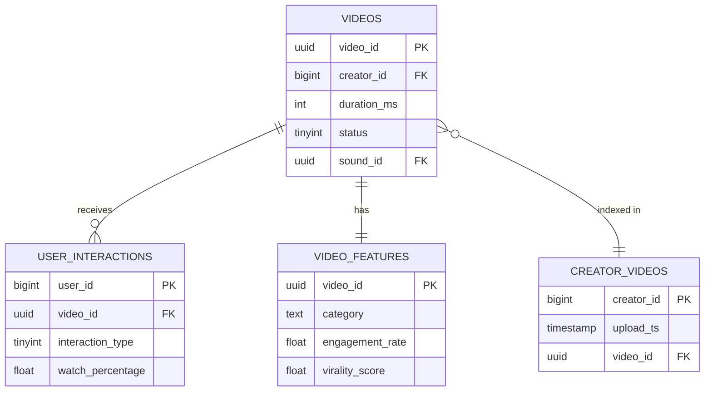
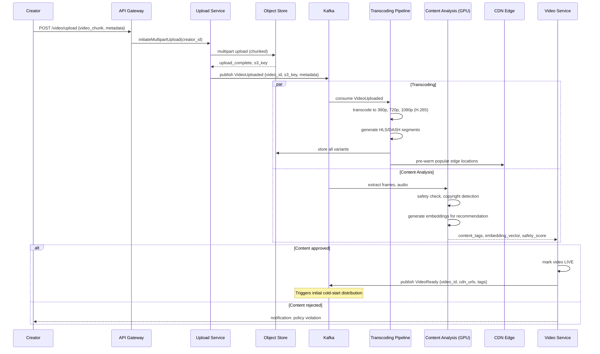
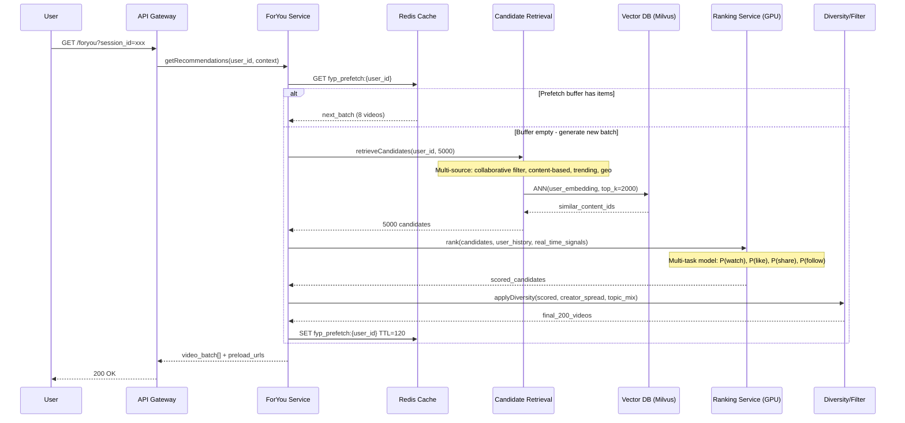
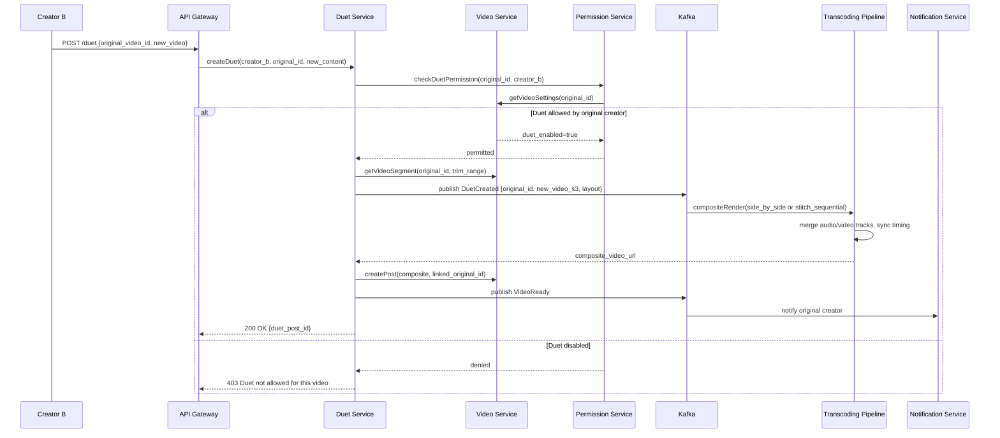

# TikTok - Short Video Platform System Design

## 1. Functional Requirements

### Core Features
- **Video Upload & Editing**: Upload short videos (15s-10min), in-app trimming, speed control, filters
- **For You Page (FYP)**: AI-driven personalized infinite-scroll feed (primary engagement surface)
- **Following Feed**: Chronological feed from followed creators
- **Duets & Stitches**: Side-by-side or sequential collaborative video creation
- **Comments & Interactions**: Like, comment, share, save, report
- **Live Streaming**: Real-time broadcast with gifts, comments, co-hosting
- **Effects & Filters**: AR effects, green screen, beauty filters, transitions
- **Sounds/Music Library**: Licensed music catalog, original sounds, trending audio
- **Search & Discovery**: Hashtags, trending topics, user/sound/effect search
- **Creator Tools**: Analytics, promote, monetization dashboard

### User Flows
```
Upload: Record/Select → Edit → Add Sound → Add Effects → Add Caption/Tags → Publish
Consume: Open App → FYP loads → Swipe up → Next video (pre-buffered) → Interact
Discover: Search → Results (Videos/Users/Sounds/Hashtags) → Consume
Live: Go Live → Stream → Receive Gifts → End → VOD saved
```

---

## 2. Non-Functional Requirements

| Requirement | Target |
|---|---|
| Availability | 99.99% (< 52 min downtime/year) |
| Video Start Latency | < 300ms (P95) |
| Feed Load Time | < 500ms first video ready |
| Upload Processing | < 2 min for standard video |
| Scroll Smoothness | 60fps, zero jank between videos |
| Scale | 1B+ DAU, 150M+ MAU in US alone |
| Recommendation Freshness | New interactions reflected in < 5 min |
| Content Moderation | 99%+ harmful content caught pre-publish |
| Global Reach | <50ms to nearest edge PoP |
| Data Consistency | Eventual (interaction counts), Strong (payments/gifts) |

### Design Principles
- **AI-First**: Recommendation engine is THE product differentiator
- **Mobile-First**: Optimize for vertical video, cellular networks
- **Pre-fetch Aggressively**: Buffer next 3-5 videos before user swipes
- **Edge-Heavy**: Push compute and cache as close to user as possible

---

## 3. Capacity Estimation

### Traffic
```
DAU:                    1B users
Videos watched/hour:    1B (peak), ~500M average
Average session:        95 min/day
Videos per session:     ~200 (avg 15-30s each)
Total daily views:      200B video views
Uploads per day:        3M new videos
Likes per day:          15B
Comments per day:       2B
Shares per day:         1B
```

### Storage
```
Average video size (raw upload):      50MB
Average video size (transcoded, all bitrates): 200MB (multiple codecs/resolutions)
Daily upload storage:   3M × 200MB = 600TB/day
Annual storage growth:  ~200PB/year
Total video storage:    2+ Exabytes (multi-year)
Metadata per video:     ~5KB
Metadata total:         ~5TB (all videos)
User profiles:          2B users × 2KB = 4TB
Interaction logs:       ~50TB/day (raw events)
```

### Bandwidth
```
Average video bitrate served:   3 Mbps (adaptive)
Peak concurrent viewers:        300M
Peak CDN bandwidth:             300M × 3Mbps = 900 Tbps (theoretical)
Actual with caching/PoP:        10-15 Tbps at origin
CDN edge bandwidth:             100+ Tbps globally
Upload bandwidth:               3M × 50MB / 86400s ≈ 14 Gbps
```

### Compute
```
ML inference (recommendations):  1B requests/hour peak → 280K QPS
Video transcoding:               3M jobs/day, ~100K concurrent GPU tasks
Content moderation:              3M videos + 2B comments/day
Feature computation (Flink):     200B events/day → 2.3M events/sec
```

---

## 4. Data Modeling

### Entity-Relationship Diagram



### Video Metadata (Cassandra - wide column)
```sql
CREATE TABLE videos (
    video_id        UUID,          -- Snowflake ID
    creator_id      BIGINT,
    upload_ts       TIMESTAMP,
    duration_ms     INT,
    description     TEXT,
    hashtags        LIST<TEXT>,
    sound_id        UUID,
    privacy         TINYINT,       -- 0=public, 1=friends, 2=private
    status          TINYINT,       -- 0=processing, 1=live, 2=removed
    width           INT,
    height          INT,
    cdn_manifest    TEXT,          -- HLS/DASH manifest URL
    thumbnail_url   TEXT,
    transcoding_profile TEXT,      -- codec/quality info
    moderation_status   TINYINT,
    language        TEXT,
    location_code   TEXT,
    PRIMARY KEY (video_id)
) WITH CLUSTERING ORDER BY (upload_ts DESC);

-- Timeline index for creator's videos
CREATE TABLE creator_videos (
    creator_id  BIGINT,
    upload_ts   TIMESTAMP,
    video_id    UUID,
    PRIMARY KEY (creator_id, upload_ts)
) WITH CLUSTERING ORDER BY (upload_ts DESC);
```

### User Interactions (Redis + Cassandra)
```sql
-- Hot data in Redis (last 7 days)
-- Key: user:{uid}:likes → Sorted Set (video_id, timestamp)
-- Key: user:{uid}:watch_history → List (last 1000 videos with watch %)
-- Key: video:{vid}:counts → Hash {likes, comments, shares, views}

-- Cold storage in Cassandra
CREATE TABLE user_interactions (
    user_id         BIGINT,
    interaction_type TINYINT,  -- 0=view, 1=like, 2=comment, 3=share, 4=save
    event_ts        TIMESTAMP,
    video_id        UUID,
    watch_duration_ms INT,     -- for views
    watch_percentage  FLOAT,
    PRIMARY KEY ((user_id), event_ts, video_id)
) WITH CLUSTERING ORDER BY (event_ts DESC);
```

### Recommendation Feature Store (Redis + Cassandra + Object Store)
```sql
-- User embedding (updated every few minutes)
-- Key: user_emb:{uid} → 256-dim float vector (Redis/Milvus)

-- Video embedding (computed at upload time, refreshed daily)
-- Key: video_emb:{vid} → 256-dim float vector

-- Real-time user features (Redis Hash)
-- Key: user_features:{uid}
--   recent_categories: [dance:0.3, comedy:0.25, food:0.2, ...]
--   recent_creators_watched: [uid1, uid2, ...]
--   session_watch_time: 1200s
--   session_swipe_away_rate: 0.4
--   last_liked_ts: 1700000000
--   device_type: "iphone14"
--   network_type: "wifi"

-- Video features (Redis/Cassandra)
CREATE TABLE video_features (
    video_id        UUID,
    category        TEXT,
    quality_score   FLOAT,       -- ML-predicted quality
    engagement_rate FLOAT,       -- likes+comments+shares / views
    completion_rate FLOAT,       -- avg watch %
    freshness_hours FLOAT,
    creator_tier    TINYINT,
    virality_score  FLOAT,
    PRIMARY KEY (video_id)
);
```

### Social Graph (Cassandra + Redis)
```sql
CREATE TABLE follows (
    follower_id  BIGINT,
    followee_id  BIGINT,
    follow_ts    TIMESTAMP,
    PRIMARY KEY (follower_id, followee_id)
);

CREATE TABLE followers (
    followee_id  BIGINT,
    follower_id  BIGINT,
    follow_ts    TIMESTAMP,
    PRIMARY KEY (followee_id, follower_id)
);

-- Redis: user:{uid}:following_count, user:{uid}:follower_count
```

---

## 5. High-Level Architecture

```
┌─────────────────────────────────────────────────────────────────────────────────┐
│                              CLIENTS (iOS/Android/Web)                           │
└────────────────────────────────────┬────────────────────────────────────────────┘
                                     │
                          ┌──────────▼──────────┐
                          │   Global Load Balancer│
                          │   (Anycast DNS + L4) │
                          └──────────┬──────────┘
                                     │
              ┌──────────────────────┼──────────────────────┐
              │                      │                      │
    ┌─────────▼────────┐  ┌─────────▼────────┐  ┌─────────▼────────┐
    │  API Gateway      │  │  CDN Edge PoPs   │  │  Live Streaming  │
    │  (Rate Limit,     │  │  (Video Serve)   │  │  Edge (WebRTC/   │
    │   Auth, Route)    │  │  10K+ locations   │  │   RTMP ingest)   │
    └─────────┬────────┘  └─────────┬────────┘  └─────────┬────────┘
              │                      │                      │
    ┌─────────▼─────────────────────────────────────────────▼────────┐
    │                        SERVICE MESH (Istio/Envoy)               │
    └───┬──────────┬──────────┬──────────┬──────────┬───────────┬────┘
        │          │          │          │          │           │
  ┌─────▼───┐ ┌───▼────┐ ┌───▼────┐ ┌───▼─────┐ ┌─▼──────┐ ┌─▼──────┐
  │ Feed    │ │ Upload │ │ User   │ │ Social  │ │Comment │ │ Live   │
  │ Service │ │ Service│ │ Service│ │ Graph   │ │Service │ │ Service│
  └────┬────┘ └───┬────┘ └───┬────┘ └───┬─────┘ └───┬────┘ └───┬────┘
       │          │          │          │           │          │
  ┌────▼──────────▼──────────▼──────────▼───────────▼──────────▼────┐
  │                    EVENT BUS (Kafka Clusters)                     │
  │  Topics: video.uploaded, interaction.*, user.action, moderation   │
  └───┬──────────┬──────────┬──────────┬──────────┬─────────────────┘
      │          │          │          │          │
┌─────▼───┐ ┌───▼─────┐ ┌──▼──────┐ ┌─▼───────┐ ┌▼──────────────┐
│Video    │ │Recommend│ │Feature  │ │Content  │ │Analytics      │
│Process  │ │Engine   │ │Compute  │ │Moderate │ │Pipeline       │
│Pipeline │ │(ML)     │ │(Flink)  │ │(AI+Human│ │(Spark/Flink)  │
└────┬────┘ └───┬─────┘ └──┬──────┘ └─┬───────┘ └───────────────┘
     │          │          │          │
┌────▼──────────▼──────────▼──────────▼─────────────────────────────┐
│                         DATA LAYER                                  │
│  ┌──────────┐ ┌────────┐ ┌──────────┐ ┌───────┐ ┌─────────────┐  │
│  │Cassandra │ │Redis   │ │Object    │ │Milvus │ │Feature Store│  │
│  │(metadata)│ │Cluster │ │Store(S3) │ │(Vector│ │(Feast/      │  │
│  │          │ │(hot)   │ │(videos)  │ │Search)│ │ custom)     │  │
│  └──────────┘ └────────┘ └──────────┘ └───────┘ └─────────────┘  │
└───────────────────────────────────────────────────────────────────┘

┌───────────────────────────────────────────────────────────────────┐
│                    GPU CLUSTER (ML Training + Inference)            │
│  ┌────────────┐ ┌────────────────┐ ┌──────────────────────────┐   │
│  │Training    │ │Online Inference│ │Content Understanding     │   │
│  │(A100 pods) │ │(T4/A10 fleet)  │ │(Video/Audio/NLP models)  │   │
│  └────────────┘ └────────────────┘ └──────────────────────────┘   │
└───────────────────────────────────────────────────────────────────┘
```

### Video Processing Pipeline Detail
```
┌──────┐    ┌──────────┐    ┌───────────┐    ┌───────────────┐
│Client│───▶│Chunked   │───▶│Object     │───▶│Transcoding    │
│Upload│    │Upload API │    │Store(raw) │    │Workers (GPU)  │
└──────┘    └──────────┘    └───────────┘    └──────┬────────┘
                                                     │
            ┌────────────────────────────────────────┼────────┐
            │                                        │        │
     ┌──────▼──────┐  ┌──────────────┐  ┌───────────▼──────┐ │
     │Content      │  │Thumbnail     │  │Manifest Generator│ │
     │Moderation   │  │Extraction    │  │(HLS/DASH)        │ │
     │(AI scan)    │  │+ Sprite Sheet│  └──────────────────┘ │
     └──────┬──────┘  └──────────────┘                       │
            │                                                 │
     ┌──────▼──────┐                              ┌──────────▼──┐
     │Approve/     │                              │CDN Push      │
     │Reject       │                              │(Pre-warm)    │
     └─────────────┘                              └─────────────┘
```

---

## 6. Low-Level Design - APIs

### Upload Video
```
POST /api/v1/videos/upload/init
Headers: Authorization: Bearer <token>
Body: {
    "file_size": 52428800,
    "duration_ms": 15000,
    "description": "Dance challenge #fyp",
    "hashtags": ["fyp", "dance", "viral"],
    "sound_id": "snd_abc123",
    "privacy": "public",
    "allow_duet": true,
    "allow_stitch": true
}
Response: {
    "upload_id": "upl_xyz789",
    "video_id": "vid_def456",
    "chunk_size": 5242880,
    "upload_urls": [
        "https://upload.tiktok-cdn.com/chunk/0?token=...",
        "https://upload.tiktok-cdn.com/chunk/1?token=...",
        ...
    ]
}

PUT /api/v1/videos/upload/{upload_id}/chunk/{index}
Headers: Content-Type: application/octet-stream
Body: <binary chunk data>
Response: { "chunk_index": 0, "status": "received", "md5": "abc..." }

POST /api/v1/videos/upload/{upload_id}/complete
Body: { "chunk_checksums": ["abc...", "def...", ...] }
Response: { "video_id": "vid_def456", "status": "processing", "eta_seconds": 90 }
```

### Get For You Feed
```
GET /api/v1/feed/foryou?count=10&session_id=sess_123
Headers: Authorization: Bearer <token>
         X-Device-Id: dev_abc
         X-Network-Type: wifi
         X-Client-Timestamp: 1700000000
Response: {
    "videos": [
        {
            "video_id": "vid_001",
            "creator": { "user_id": "u_123", "username": "dancer99", "avatar_url": "..." },
            "description": "New move! #dance",
            "sound": { "id": "snd_456", "title": "Original Sound", "author": "dancer99" },
            "stats": { "likes": 1200000, "comments": 45000, "shares": 89000, "views": 5000000 },
            "playback": {
                "manifest_url": "https://cdn.tiktok.com/vid_001/master.m3u8",
                "preload_url": "https://cdn.tiktok.com/vid_001/720p_first2s.mp4",
                "duration_ms": 15000,
                "width": 1080,
                "height": 1920
            },
            "interaction_state": { "liked": false, "following_creator": false },
            "recommendation_reason": "based_on_watch_history"
        },
        ...
    ],
    "next_cursor": "cur_abc",
    "prefetch_urls": ["https://cdn.tiktok.com/vid_002/720p_first2s.mp4", ...]
}
```

### Interaction Events
```
POST /api/v1/interactions
Body: {
    "events": [
        {
            "type": "view",
            "video_id": "vid_001",
            "watch_duration_ms": 14500,
            "watch_percentage": 0.97,
            "replayed": true,
            "timestamp": 1700000000
        },
        {
            "type": "like",
            "video_id": "vid_001",
            "timestamp": 1700000015
        }
    ],
    "session_id": "sess_123",
    "batch_id": "bat_789"
}
Response: { "status": "accepted", "batch_id": "bat_789" }
```

### Go Live
```
POST /api/v1/live/start
Body: {
    "title": "Friday vibes!",
    "category": "music",
    "scheduled": false
}
Response: {
    "stream_id": "live_abc",
    "rtmp_url": "rtmp://live-push.tiktok.com/stream",
    "stream_key": "sk_xyz...",
    "webrtc_offer_url": "https://live.tiktok.com/whip/live_abc",
    "playback_url": "https://live.tiktok.com/watch/live_abc",
    "chat_ws_url": "wss://live-chat.tiktok.com/ws/live_abc"
}
```

---

## 7. Deep Dive: Recommendation Algorithm

### Architecture Overview
```
┌─────────────────────────────────────────────────────────────┐
│                   RECOMMENDATION SYSTEM                       │
│                                                              │
│  ┌──────────┐     ┌──────────────┐     ┌────────────────┐   │
│  │Candidate │────▶│  Ranking     │────▶│  Re-ranking &  │   │
│  │Generation│     │  (Scoring)   │     │  Diversity     │   │
│  │(1000s)   │     │  (100s)      │     │  (Final 10-30) │   │
│  └──────────┘     └──────────────┘     └────────────────┘   │
│       │                  │                      │            │
│  ┌────▼────┐       ┌────▼─────┐          ┌─────▼─────┐     │
│  │Two-Tower│       │Deep      │          │Business   │     │
│  │Retrieval│       │Ranking   │          │Rules +    │     │
│  │+ ANN    │       │Network   │          │Exploration│     │
│  └─────────┘       └──────────┘          └───────────┘     │
└─────────────────────────────────────────────────────────────┘
```

### Two-Tower Model (Candidate Generation)

```python
# Pseudocode: Two-Tower Retrieval Model

class UserTower(nn.Module):
    """Encodes user context into embedding space"""
    def __init__(self, config):
        self.user_id_embedding = nn.Embedding(NUM_USERS, 64)
        self.category_prefs = nn.Linear(NUM_CATEGORIES, 32)
        self.recent_interactions = TransformerEncoder(
            d_model=128, nheads=4, num_layers=2
        )  # Encodes last N watched video embeddings
        self.context_mlp = nn.Sequential(
            nn.Linear(CONTEXT_DIM, 128),  # time_of_day, device, network, country
            nn.ReLU(),
            nn.Linear(128, 64)
        )
        self.fusion = nn.Sequential(
            nn.Linear(64 + 32 + 128 + 64, 512),
            nn.ReLU(),
            nn.Linear(512, 256),
            nn.LayerNorm(256)
        )

    def forward(self, user_id, category_hist, recent_videos, context):
        u_emb = self.user_id_embedding(user_id)
        cat_emb = self.category_prefs(category_hist)
        seq_emb = self.recent_interactions(recent_videos)  # [B, 128]
        ctx_emb = self.context_mlp(context)
        combined = torch.cat([u_emb, cat_emb, seq_emb, ctx_emb], dim=-1)
        return F.normalize(self.fusion(combined), dim=-1)  # L2 normalized


class VideoTower(nn.Module):
    """Encodes video into same embedding space"""
    def __init__(self, config):
        self.video_id_embedding = nn.Embedding(NUM_VIDEOS, 64)
        self.creator_embedding = nn.Embedding(NUM_CREATORS, 32)
        self.content_encoder = nn.Linear(CONTENT_FEATURE_DIM, 128)
        # content features: visual CNN features, audio features, NLP from caption
        self.engagement_mlp = nn.Linear(ENGAGEMENT_DIM, 32)  # historical stats
        self.fusion = nn.Sequential(
            nn.Linear(64 + 32 + 128 + 32, 512),
            nn.ReLU(),
            nn.Linear(512, 256),
            nn.LayerNorm(256)
        )

    def forward(self, video_id, creator_id, content_features, engagement_stats):
        v_emb = self.video_id_embedding(video_id)
        c_emb = self.creator_embedding(creator_id)
        content = self.content_encoder(content_features)
        eng = self.engagement_mlp(engagement_stats)
        combined = torch.cat([v_emb, c_emb, content, eng], dim=-1)
        return F.normalize(self.fusion(combined), dim=-1)


# Training: contrastive loss (in-batch negatives + hard negatives)
def train_step(user_batch, positive_videos, hard_negatives):
    user_emb = user_tower(user_batch)       # [B, 256]
    pos_emb = video_tower(positive_videos)  # [B, 256]
    neg_emb = video_tower(hard_negatives)   # [B, K, 256]

    pos_score = (user_emb * pos_emb).sum(dim=-1)  # [B]
    neg_scores = torch.bmm(neg_emb, user_emb.unsqueeze(-1)).squeeze(-1)  # [B, K]

    logits = torch.cat([pos_score.unsqueeze(-1), neg_scores], dim=-1)  # [B, K+1]
    labels = torch.zeros(B, dtype=torch.long)  # positive is index 0
    loss = F.cross_entropy(logits / temperature, labels)
    return loss


# Serving: ANN search for candidate generation
def generate_candidates(user_context, num_candidates=1000):
    user_embedding = user_tower.inference(user_context)  # 256-dim

    # Multi-source retrieval
    candidates = []

    # Source 1: ANN search in video embedding index (Milvus/Faiss)
    ann_results = milvus.search(
        collection="video_embeddings",
        vector=user_embedding,
        top_k=500,
        filter="status == 'live' AND upload_ts > now() - 30d"
    )
    candidates.extend(ann_results)

    # Source 2: Trending/viral videos (high engagement in last 6h)
    trending = redis.zrevrange("trending:global", 0, 100)
    candidates.extend(trending)

    # Source 3: Following feed candidates
    following_videos = get_recent_from_following(user_context.user_id, limit=100)
    candidates.extend(following_videos)

    # Source 4: Same-sound / same-hashtag as recently liked
    similar = get_similar_content(user_context.recent_likes, limit=200)
    candidates.extend(similar)

    # Source 5: Exploration pool (random sample for cold start / diversity)
    explore = sample_exploration_pool(user_context, count=100)
    candidates.extend(explore)

    return deduplicate(candidates)[:num_candidates]
```

### Ranking Network (Scoring)

```python
class RankingModel(nn.Module):
    """Multi-task ranking: predicts multiple engagement signals"""
    def __init__(self):
        self.user_features = nn.Linear(USER_FEAT_DIM, 128)
        self.video_features = nn.Linear(VIDEO_FEAT_DIM, 128)
        self.cross_features = nn.Linear(CROSS_FEAT_DIM, 64)

        self.shared_bottom = nn.Sequential(
            nn.Linear(128 + 128 + 64, 512),
            nn.ReLU(), nn.Dropout(0.1),
            nn.Linear(512, 256),
            nn.ReLU()
        )

        # Multi-task heads (MMoE or shared-bottom)
        self.head_completion = nn.Linear(256, 1)   # P(watch > 80%)
        self.head_like = nn.Linear(256, 1)         # P(like)
        self.head_comment = nn.Linear(256, 1)      # P(comment)
        self.head_share = nn.Linear(256, 1)        # P(share)
        self.head_follow = nn.Linear(256, 1)       # P(follow creator)
        self.head_watch_time = nn.Linear(256, 1)   # E[watch_time]
        self.head_negative = nn.Linear(256, 1)     # P(report/not_interested)

    def forward(self, user_feat, video_feat, cross_feat):
        u = self.user_features(user_feat)
        v = self.video_features(video_feat)
        c = self.cross_features(cross_feat)
        shared = self.shared_bottom(torch.cat([u, v, c], dim=-1))

        return {
            "p_completion": torch.sigmoid(self.head_completion(shared)),
            "p_like": torch.sigmoid(self.head_like(shared)),
            "p_comment": torch.sigmoid(self.head_comment(shared)),
            "p_share": torch.sigmoid(self.head_share(shared)),
            "p_follow": torch.sigmoid(self.head_follow(shared)),
            "e_watch_time": F.relu(self.head_watch_time(shared)),
            "p_negative": torch.sigmoid(self.head_negative(shared)),
        }


# Final score combines predictions with business-tuned weights
def compute_final_score(predictions):
    score = (
        0.30 * predictions["p_completion"] +
        0.20 * predictions["p_like"] +
        0.10 * predictions["p_comment"] +
        0.15 * predictions["p_share"] +
        0.05 * predictions["p_follow"] +
        0.15 * predictions["e_watch_time"] / MAX_DURATION +
        -0.30 * predictions["p_negative"]  # strong penalty
    )
    return score
```

### Exploration vs Exploitation

```python
def rerank_with_exploration(scored_candidates, user_context):
    """Apply diversity and exploration after scoring"""
    final_feed = []
    seen_creators = set()
    seen_sounds = set()
    seen_categories = Counter()

    # Sort by score
    scored_candidates.sort(key=lambda x: x.score, reverse=True)

    for candidate in scored_candidates:
        # Diversity rules
        if candidate.creator_id in seen_creators and len(final_feed) < 5:
            continue  # No back-to-back same creator early in feed
        if seen_categories[candidate.category] >= 3:
            candidate.score *= 0.7  # Penalize over-represented categories

        final_feed.append(candidate)
        seen_creators.add(candidate.creator_id)
        seen_sounds.add(candidate.sound_id)
        seen_categories[candidate.category] += 1

    # Inject exploration slots (every ~10th video)
    for i in range(0, len(final_feed), 10):
        explore_video = sample_exploration(user_context)
        final_feed.insert(i + random.randint(7, 10), explore_video)

    return final_feed[:30]  # Return batch


def sample_exploration(user_context):
    """Epsilon-greedy + Thompson sampling for cold-start content"""
    if random.random() < 0.05:
        # Pure random from quality-filtered pool
        return random_from_pool("high_quality_new_uploads")
    else:
        # Thompson sampling: sample from posterior of uncertain videos
        uncertain_videos = get_low_confidence_predictions(user_context)
        return thompson_sample(uncertain_videos)
```

### Cold Start Strategy
```
New User:
  1. Onboarding: Select interests (optional, ~30% skip)
  2. First 50 videos: Heavy exploration, popular content, diverse categories
  3. After 50 views: Enough signal to narrow; user tower warm
  4. After 200 views: Full personalization kicks in

New Video:
  1. Upload → Content understanding (visual/audio/NLP embeddings)
  2. Initial distribution: Show to small random sample (~500 users)
  3. Measure early engagement (first 30 min): completion rate, like rate
  4. If engagement > threshold: expand distribution exponentially
  5. If low engagement: reduce distribution, classify as niche
  6. Viral detection: if engagement spikes, fast-track to trending pool
```

---

## 8. Deep Dive: Video Processing Pipeline

### Chunked Upload Protocol
```
Client                          Upload Service               Object Store
  │                                  │                            │
  │── POST /upload/init ────────────▶│                            │
  │◀── {upload_id, chunk_urls} ──────│                            │
  │                                  │                            │
  │── PUT chunk/0 (5MB) ───────────────────────────────────────▶│
  │── PUT chunk/1 (5MB) ───────────────────────────────────────▶│
  │── PUT chunk/2 (5MB) ───────────────────────────────────────▶│
  │   (parallel uploads)             │                            │
  │◀── 200 OK (per chunk) ──────────────────────────────────────│
  │                                  │                            │
  │── POST /upload/complete ────────▶│                            │
  │                                  │── Verify checksums ───────▶│
  │                                  │── Emit video.uploaded ─────│
  │◀── {status: processing} ─────────│                            │
```

### Transcoding Pipeline

```
Input: Raw video (H.264/HEVC, various resolutions, 30-60fps)

Transcoding Matrix:
┌─────────────┬──────────┬─────────┬──────────┬──────────────┐
│ Resolution  │ H.264    │ H.265   │ AV1      │ Target       │
├─────────────┼──────────┼─────────┼──────────┼──────────────┤
│ 2160p (4K)  │ 12 Mbps  │ 8 Mbps  │ 5 Mbps   │ WiFi/5G      │
│ 1080p       │ 5 Mbps   │ 3 Mbps  │ 2 Mbps   │ WiFi/LTE     │
│ 720p        │ 2.5 Mbps │ 1.5 Mbps│ 1 Mbps   │ LTE          │
│ 480p        │ 1 Mbps   │ 700 Kbps│ 500 Kbps │ 3G/poor LTE  │
│ 360p        │ 500 Kbps │ 350 Kbps│ 250 Kbps │ 2G/very poor │
└─────────────┴──────────┴─────────┴──────────┴──────────────┘

Total renditions per video: 15 (5 resolutions × 3 codecs)
+ Audio: AAC 128kbps, AAC 64kbps, Opus 96kbps
```

### Transcoding Worker (GPU-accelerated)
```python
# Transcoding job processor
def transcode_video(job):
    raw_path = object_store.download(job.raw_video_key)

    # 1. Probe input
    probe = ffprobe(raw_path)
    source_resolution = probe.video.resolution
    source_fps = probe.video.fps

    # 2. Generate transcoding plan (skip resolutions higher than source)
    profiles = generate_profiles(source_resolution, source_fps)

    # 3. Parallel GPU transcoding (one GPU per rendition or batched)
    futures = []
    for profile in profiles:
        futures.append(
            gpu_pool.submit(transcode_rendition, raw_path, profile)
        )

    renditions = await asyncio.gather(*futures)

    # 4. Generate HLS/DASH manifests
    hls_manifest = generate_hls_master_playlist(renditions)
    dash_manifest = generate_dash_mpd(renditions)

    # 5. Upload all to object store + CDN origin
    for rendition in renditions:
        object_store.upload(rendition.segments, prefix=f"videos/{job.video_id}/")
    object_store.upload(hls_manifest, f"videos/{job.video_id}/master.m3u8")
    object_store.upload(dash_manifest, f"videos/{job.video_id}/manifest.mpd")

    # 6. Extract thumbnail + preview sprite sheet
    thumbnail = extract_frame(raw_path, at_percent=0.3)
    sprite = generate_sprite_sheet(raw_path, interval_ms=1000)

    # 7. Pre-warm CDN for likely popular content
    if job.creator_follower_count > 100000:
        cdn.prewarm([hls_manifest.url], regions=["us", "eu", "sea"])

    # 8. Update status
    emit_event("video.transcoded", {
        "video_id": job.video_id,
        "manifest_url": hls_manifest.url,
        "thumbnail_url": thumbnail.url
    })
```

### Adaptive Bitrate Streaming (Client-Side)
```
HLS Master Playlist:
#EXTM3U
#EXT-X-VERSION:6
#EXT-X-STREAM-INF:BANDWIDTH=5000000,RESOLUTION=1920x1080,CODECS="avc1.640028"
1080p_h264/playlist.m3u8
#EXT-X-STREAM-INF:BANDWIDTH=3000000,RESOLUTION=1920x1080,CODECS="hev1.1.6.L120"
1080p_h265/playlist.m3u8
#EXT-X-STREAM-INF:BANDWIDTH=2000000,RESOLUTION=1920x1080,CODECS="av01.0.08M.08"
1080p_av1/playlist.m3u8
#EXT-X-STREAM-INF:BANDWIDTH=2500000,RESOLUTION=1280x720,CODECS="avc1.4d401f"
720p_h264/playlist.m3u8
...

Client ABR Logic:
- Measure throughput over last 3 segments
- If throughput > 1.5x current bitrate for 3+ segments → upgrade
- If buffer < 2s or throughput < 0.8x current → downgrade immediately
- For first segment: start at 720p H.264 (universal codec, fast start)
- Short videos (<30s): pre-download entire video at best quality
```

---

## 9. Component Optimization

### Kafka: Interaction Event Pipeline
```
Cluster: 500+ brokers, 10K+ partitions
Topics:
  - interaction.views:     100K msg/s, partitioned by video_id
  - interaction.likes:     50K msg/s, partitioned by video_id
  - interaction.shares:    10K msg/s
  - user.session:          200K msg/s, partitioned by user_id
  - video.uploaded:        35 msg/s
  - moderation.results:    100 msg/s
  - recommendation.refresh: 50K msg/s

Config:
  - Retention: 7 days (interaction), 30 days (uploads)
  - Replication factor: 3
  - Compression: LZ4
  - Batch size: 64KB, linger.ms: 5ms (latency-optimized)
```

### Flink: Real-Time Feature Computation
```java
// Sliding window engagement features
DataStream<InteractionEvent> events = kafka.source("interaction.*");

// Per-video real-time engagement rate (5-min tumbling window)
events
    .keyBy(e -> e.videoId)
    .window(TumblingEventTimeWindows.of(Time.minutes(5)))
    .aggregate(new EngagementAggregator())  // completion_rate, like_rate
    .addSink(new RedisSink("video_features:{video_id}"));

// Per-user session features (session window, 30min gap)
events
    .filter(e -> e.type == VIEW)
    .keyBy(e -> e.userId)
    .window(SessionWindows.withGap(Time.minutes(30)))
    .process(new SessionFeatureProcessor())
    // Outputs: categories_watched, avg_watch_time, swipe_rate, session_depth
    .addSink(new RedisSink("user_features:{user_id}"));

// Trending detection (count-min sketch + top-K)
events
    .filter(e -> e.type in [LIKE, SHARE, COMMENT])
    .keyBy(e -> e.videoId)
    .window(SlidingEventTimeWindows.of(Time.hours(1), Time.minutes(5)))
    .aggregate(new TrendingScoreAggregator())
    .filter(score -> score.velocity > TRENDING_THRESHOLD)
    .addSink(new KafkaSink("trending.candidates"));
```

### Redis: Session Context & Hot Data
```
Architecture: 100+ Redis Cluster shards, ~50TB total memory

Key patterns:
  user:{uid}:session          → Hash (current session features, TTL 30min)
  user:{uid}:feed_buffer      → List (pre-computed next 30 video_ids)
  user:{uid}:seen             → Bloom Filter (seen video_ids, TTL 24h)
  video:{vid}:counts          → Hash {views, likes, comments, shares}
  video:{vid}:engagement_5m   → String (real-time engagement score)
  trending:global             → Sorted Set (video_id → trend_score)
  trending:{country}          → Sorted Set
  sound:{sid}:videos          → Sorted Set (recent videos using this sound)

Eviction: allkeys-lfu
Persistence: AOF with fsync every second (acceptable loss window)
```

### GPU Clusters: ML Inference
```
Fleet:
  - Training: 2000+ A100 GPUs (model training, daily refresh)
  - Inference: 10000+ T4/A10G GPUs (online serving)
  - Content Understanding: 5000+ GPUs (video/audio feature extraction)

Inference serving:
  - Framework: Triton Inference Server
  - Batching: Dynamic batching (max_batch=64, max_delay=5ms)
  - Model format: TensorRT (2-4x speedup over PyTorch)
  - Latency budget: <20ms P99 for ranking model
  - Throughput: ~5000 inferences/sec per GPU

Deployment:
  - Canary: 1% traffic → 10% → 50% → 100% (over 24h)
  - A/B testing: Hold-out groups for each model version
  - Shadow mode: New models score in parallel, no serving
```

### CDN Optimization & Pre-fetching
```
Strategy:
  1. Client pre-fetches next 3 videos while current plays
  2. Pre-fetch priority: first 2 seconds at highest quality
  3. Full video download for short clips (<15s) on WiFi
  4. Edge PoP serves 95%+ of video requests (cache hit)
  5. Regional mid-tier cache for 99%+ coverage
  6. Origin only for long-tail / new content

Cache warming:
  - New video from popular creator → push to top 20 PoPs immediately
  - Trending videos → push to all PoPs in relevant regions
  - Predictive warming based on time-of-day patterns

Client-side:
  - Maintain 3-video buffer (prev + current + next)
  - On swipe: promote next→current, start loading next+1
  - Decode first frame before transition for instant display
  - Cancel in-progress downloads for videos scrolled past
```

---

## 10. Observability, Content Moderation & Considerations

### Observability Stack
```
Metrics:     Prometheus + Thanos (global federation)
Tracing:     Jaeger (sampled, 1% of requests)
Logging:     Fluentd → Kafka → ClickHouse (structured logs)
Dashboards:  Grafana

Key SLOs:
  - Feed API P99 latency < 200ms
  - Video start time P95 < 300ms
  - Upload success rate > 99.5%
  - Recommendation model inference P99 < 20ms
  - CDN cache hit ratio > 95%

Alerts:
  - Feed latency P99 > 500ms for 2 min
  - Video processing queue depth > 100K
  - Model serving error rate > 0.1%
  - CDN origin bandwidth spike > 2x normal
```

### Content Moderation at Scale
```
Pipeline (3M videos/day + 2B comments/day):

Layer 1 - Pre-publish AI (< 30 seconds):
  - Visual: nudity, violence, self-harm (CNN classifier, 99.2% accuracy)
  - Audio: hate speech, copyright (Whisper transcription + NLP)
  - Text: caption/hashtag policy check (transformer classifier)
  - Result: auto-approve (85%), auto-reject (5%), human review queue (10%)

Layer 2 - Post-publish continuous:
  - Re-score videos as engagement grows (viral = higher scrutiny)
  - User reports (2M/day) → priority queue for human review
  - Cross-reference with known harmful content hashes (CSAM, terrorism)

Layer 3 - Human review:
  - 10K+ moderators globally, 24/7
  - Average review time: 30 seconds
  - Appeals process with senior reviewer escalation

Architecture:
  - Moderation models run on dedicated GPU fleet
  - Results cached per content hash (dedup for reposts)
  - Regional policy engine (different rules per jurisdiction)
```

### Additional Considerations

**Data Privacy & Compliance**:
- GDPR: Right to deletion (cascade delete across all stores within 30 days)
- COPPA: Age-gating, restricted content for minors
- Data residency: Region-specific storage for EU, China, etc.
- Differential privacy for recommendation training data

**Fault Tolerance**:
- Feed service: pre-computed fallback feed per user cohort if recommendation fails
- Video serving: multi-CDN (Akamai + CloudFront + in-house) with automatic failover
- Database: multi-region replication with automatic leader election
- Circuit breakers between all services (Hystrix/Resilience4j pattern)

**Cost Optimization**:
- Tiered storage: hot (SSD) for <30-day videos, warm (HDD) for older, cold (Glacier) for rarely-accessed
- Spot instances for transcoding (fault-tolerant, restartable)
- AV1 encoding: 40% bandwidth savings vs H.264 justifies higher encoding cost
- Aggressive cache TTLs: popular videos cached indefinitely at edge

**Live Streaming Infrastructure**:
- Ingest: RTMP/WebRTC → media server (SRS/Janus)
- Transcoding: Real-time to multiple ABR ladders
- Distribution: Low-latency HLS (< 3s) or WebRTC (< 1s) for interactive
- Chat: WebSocket fan-out via pub/sub (Redis Streams)
- Gifts: Strong consistency via distributed transaction (Saga pattern)

**Anti-Gaming & Integrity**:
- Bot detection: device fingerprinting, behavioral analysis
- Engagement fraud: statistical anomaly detection on like/view patterns
- Recommendation manipulation: down-rank videos with suspicious engagement
- Rate limiting: per-user, per-IP, per-device interaction caps

---

## Sequence Diagrams

### 1. Video Upload + Processing Pipeline



### 2. For You Page Recommendation



### 3. Duet/Stitch Creation



---

## Caching Strategy

### Multi-Tier Cache Architecture

| Tier | Technology | TTL | Use Case |
|------|-----------|-----|----------|
| L1 - Edge | CDN PoP (local SSD) | 5-60s | Video segments, thumbnails |
| L2 - Regional | Redis Cluster | 2-10 min | FYP prefetch, user session, trending |
| L3 - Central | Redis + Memcached | 30 min-24h | Video metadata, creator profiles |
| L4 - Persistent | RocksDB (embedded) | Days | ML feature cache, embeddings |

### Eviction & Invalidation

- **FYP cache**: LRU with 120s TTL; invalidated on explicit "Not Interested" signal
- **Video metadata**: Write-through on edit; event-driven invalidation via Kafka
- **Trending cache**: Rebuilt every 30s by Flink streaming job; no explicit invalidation
- **Creator profile**: Cache-aside with 5min TTL; invalidated on profile update event
- **Edge video segments**: TTL-based (60s for new videos, 24h for viral); purge API for takedowns

---

## Async Processing - Kafka Topic Design

| Topic | Partitions | Key | Consumers |
|-------|-----------|-----|-----------|
| `video.uploaded` | 128 | video_id | Transcoding, Content Analysis, Metadata |
| `video.ready` | 64 | creator_id | Feed fanout, Notification, Analytics |
| `engagement.events` | 256 | video_id | Recommendation update, Counter, Anti-fraud |
| `recommendation.feedback` | 128 | user_id | Model retraining, A/B metrics |
| `content.moderation` | 32 | video_id | Review queue, Appeal processing |
| `creator.events` | 64 | creator_id | Profile update, Follower notify |

**Processing guarantees**: Exactly-once via idempotent producers + transactional consumers. Consumer lag monitored with alerting at >10s for engagement topics.

---

## Infrastructure Components

| Component | Technology | Purpose |
|-----------|-----------|---------|
| CDN | Multi-CDN (Akamai + CloudFront + own PoPs) | Video delivery, 98%+ cache hit ratio |
| Load Balancer | L4 (DPDK-based) + L7 (Envoy) | 10M+ concurrent connections |
| API Gateway | Custom (Go) | Auth, rate limit, geo-routing, A/B assignment |
| Edge Computing | Edge PoPs with GPU | Video pre-processing, thumbnail generation |
| Service Mesh | Istio/Envoy | mTLS, traffic splitting, circuit breaking |
| DNS | GeoDNS + Anycast | <10ms DNS resolution, failover |
| Object Storage | Multi-region S3 + own HDFS | Video origin, ML training data |
