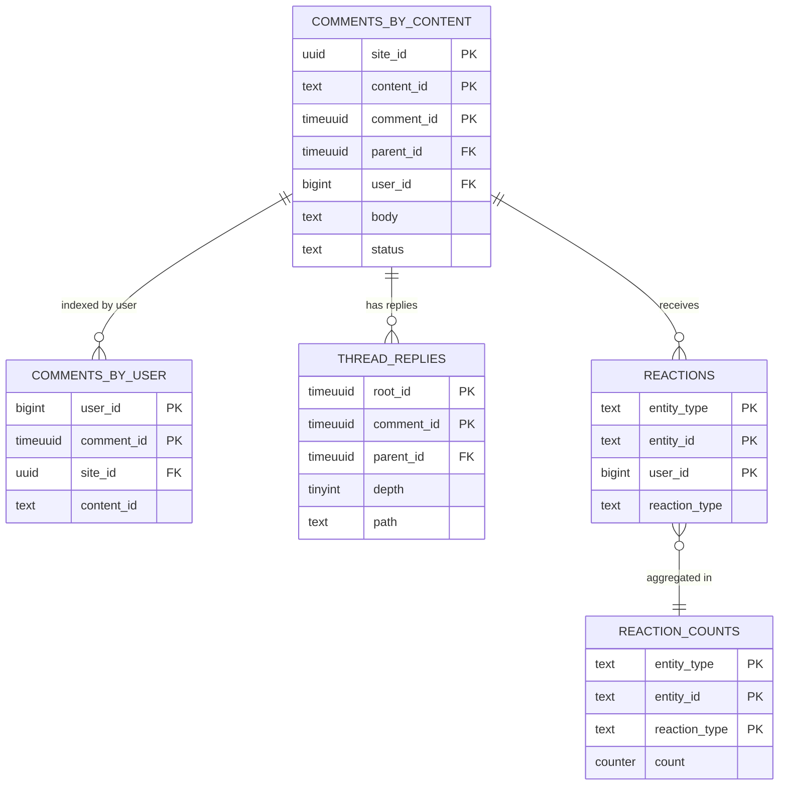
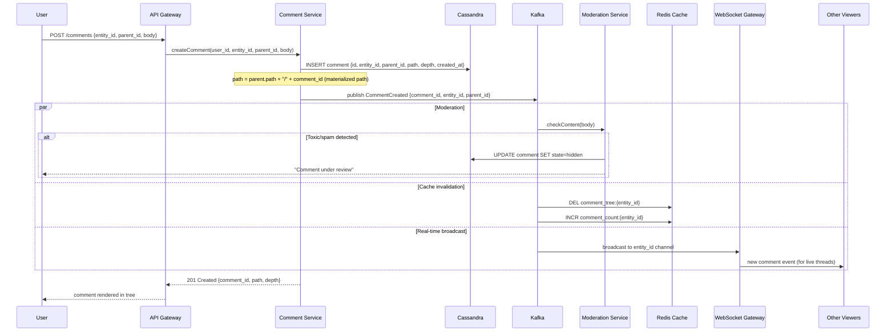
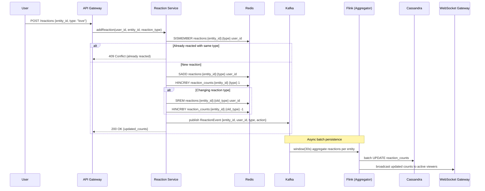

# Design Comments & Reactions Platform

## 1. Problem Statement

Design a universal comment and reaction system that can be embedded on any content (articles, videos, products, posts). Support threaded replies, multiple reaction types, real-time updates, content moderation, spam detection, mentions, and embeddable widgets. The system must handle massive scale while maintaining low latency for real-time interactions.

---

## 2. Functional Requirements

1. **Comments**: Create, edit, delete comments on any content entity
2. **Threaded Replies**: Nested replies with configurable depth (up to 10 levels)
3. **Reactions**: 6+ reaction types (like, love, laugh, wow, sad, angry) on comments and content
4. **Real-time Updates**: Live comment streaming, reaction count updates
5. **Mentions**: @mention users, trigger notifications
6. **Rich Content**: Markdown, images, GIFs, links with preview
7. **Moderation**: Auto-mod (ML), manual review queue, user reporting
8. **Spam Detection**: ML-based spam filtering, rate limiting, ban management
9. **Sorting**: Sort by newest, oldest, top (votes), controversial
10. **Embed Widget**: JavaScript widget for third-party sites
11. **Notifications**: Replies to your comments, mentions, reactions
12. **Admin Controls**: Per-site settings (moderation level, allowed reactions, word filters)

---

## 3. Non-Functional Requirements

| Requirement | Target |
|---|---|
| Availability | 99.99% |
| Comment Post Latency | < 200ms (p95) |
| Real-time Delivery | < 500ms to all subscribers |
| Reaction Update | < 100ms (optimistic) |
| Scale | 10B comments, 500B reactions stored |
| Throughput | 100K comments/sec peak |
| Moderation Latency | < 2s for auto-mod decision |
| Widget Load Time | < 300ms (above fold) |

---

## 4. Capacity Estimation

### 4.1 Traffic

```
Content entities with comments: 5B
Daily active commenters: 200M
Comments posted/day: 500M
Reactions added/day: 5B
Comment reads/day: 50B (most users read, few write)
Real-time subscriptions (concurrent): 50M

Write QPS:
  Comments: 500M / 86400 ≈ 5,800
  Reactions: 5B / 86400 ≈ 58,000
  Total writes: ~64,000 QPS (peak 3x: ~192,000)

Read QPS:
  Comment threads: 50B / 86400 ≈ 580,000
  Reaction counts: 100B / 86400 ≈ 1,160,000
  Total reads: ~1.7M QPS (peak 3x: ~5.1M)
```

### 4.2 Storage

```
Comments:
  10B comments × 1KB avg (text + metadata) = 10 TB
  Growth: 500M/day × 1KB = 500 GB/day

Reactions:
  500B reactions × 20 bytes (user_id + entity_id + type) = 10 TB
  Aggregated counts: 5B entities × 6 types × 8 bytes = 240 GB

Comment Tree Structure:
  10B comments × 40 bytes (parent pointers + materialized path) = 400 GB

User Comment History:
  Index: 2B users × avg 5 comments × 16 bytes = 160 GB

Media (embedded images/GIFs):
  5% of comments have media: 500M × 200KB = 100 TB (object storage)

Total: ~25 TB structured + 100 TB media
```

### 4.3 Bandwidth

```
Ingress (writes): 500M comments × 1KB + 5B reactions × 20B = 600 GB/day = 56 Mbps
Egress (reads): 50B × 500B avg response = 25 PB/day
CDN/Cache offload: 95% → Origin: 1.25 PB/day = 116 Gbps

WebSocket connections: 50M concurrent × 1KB/min avg = 50 GB/min = 6.7 Gbps
```

---

## 5. Data Modeling

### Entity-Relationship Diagram



### 5.1 Comment Schema (ScyllaDB - Primary Store)

```sql
-- Comments by content (primary access pattern: load thread for content)
CREATE TABLE comments_by_content (
    site_id         UUID,              -- Tenant (multi-tenant)
    content_id      TEXT,              -- External content identifier
    comment_id      TIMEUUID,          -- Time-ordered UUID
    parent_id       TIMEUUID,          -- NULL for root comments
    root_id         TIMEUUID,          -- Root comment of thread
    path            TEXT,              -- Materialized path: "root/parent1/parent2"
    depth           TINYINT,           -- 0 = root, max 10
    user_id         BIGINT,
    username        TEXT,
    avatar_url      TEXT,
    body            TEXT,
    body_html       TEXT,              -- Pre-rendered
    media_urls      LIST<TEXT>,
    mentions        LIST<BIGINT>,      -- Mentioned user IDs
    reaction_counts MAP<TEXT, INT>,    -- {'like': 42, 'love': 5, ...}
    reply_count     INT,
    status          TEXT,              -- 'active','deleted','hidden','spam'
    mod_score       FLOAT,            -- ML moderation confidence
    edited_at       TIMESTAMP,
    created_at      TIMESTAMP,
    PRIMARY KEY ((site_id, content_id), comment_id)
) WITH CLUSTERING ORDER BY (comment_id DESC);

-- Comments by user (for user profile / history)
CREATE TABLE comments_by_user (
    user_id         BIGINT,
    comment_id      TIMEUUID,
    site_id         UUID,
    content_id      TEXT,
    body_preview    TEXT,              -- First 200 chars
    created_at      TIMESTAMP,
    PRIMARY KEY (user_id, comment_id)
) WITH CLUSTERING ORDER BY (comment_id DESC);

-- Thread view (get all replies to a root comment)
CREATE TABLE thread_replies (
    site_id         UUID,
    content_id      TEXT,
    root_id         TIMEUUID,
    comment_id      TIMEUUID,
    parent_id       TIMEUUID,
    depth           TINYINT,
    path            TEXT,
    user_id         BIGINT,
    username        TEXT,
    body            TEXT,
    reaction_counts MAP<TEXT, INT>,
    status          TEXT,
    created_at      TIMESTAMP,
    PRIMARY KEY ((site_id, content_id, root_id), path, comment_id)
) WITH CLUSTERING ORDER BY (path ASC, comment_id ASC);
```

### 5.2 Reaction Schema

```sql
-- Individual reactions (for "who reacted" and dedup)
CREATE TABLE reactions (
    entity_type     TEXT,              -- 'comment' or 'content'
    entity_id       TEXT,              -- comment_id or content_id
    user_id         BIGINT,
    reaction_type   TEXT,              -- 'like','love','laugh','wow','sad','angry'
    created_at      TIMESTAMP,
    PRIMARY KEY ((entity_type, entity_id), user_id)
);

-- Aggregated reaction counts (denormalized for fast reads)
CREATE TABLE reaction_counts (
    entity_type     TEXT,
    entity_id       TEXT,
    reaction_type   TEXT,
    count           COUNTER,
    PRIMARY KEY ((entity_type, entity_id), reaction_type)
);

-- User's reactions (for showing "you reacted" state)
CREATE TABLE user_reactions (
    user_id         BIGINT,
    entity_type     TEXT,
    entity_id       TEXT,
    reaction_type   TEXT,
    created_at      TIMESTAMP,
    PRIMARY KEY (user_id, created_at)
) WITH CLUSTERING ORDER BY (created_at DESC)
  AND default_time_to_live = 7776000; -- 90 day TTL for old reactions
```

### 5.3 Moderation Schema (PostgreSQL)

```sql
CREATE TABLE moderation_queue (
    id              BIGSERIAL PRIMARY KEY,
    site_id         UUID NOT NULL,
    comment_id      TEXT NOT NULL,
    content_id      TEXT NOT NULL,
    user_id         BIGINT NOT NULL,
    body            TEXT,
    reason          VARCHAR(50),           -- 'ml_flagged','user_reported','word_filter'
    ml_scores       JSONB,                 -- {spam: 0.9, toxic: 0.7, ...}
    reporter_ids    BIGINT[],
    status          VARCHAR(20) DEFAULT 'pending',  -- pending, approved, removed, escalated
    moderator_id    BIGINT,
    decision_at     TIMESTAMP,
    created_at      TIMESTAMP DEFAULT NOW(),
    INDEX idx_site_status (site_id, status, created_at)
);

CREATE TABLE banned_users (
    site_id         UUID,
    user_id         BIGINT,
    ban_type        VARCHAR(20),           -- 'shadow','hard','timeout'
    reason          TEXT,
    expires_at      TIMESTAMP,             -- NULL = permanent
    banned_by       BIGINT,
    created_at      TIMESTAMP,
    PRIMARY KEY (site_id, user_id)
);

CREATE TABLE word_filters (
    site_id         UUID,
    pattern         TEXT,                  -- Regex pattern
    action          VARCHAR(20),           -- 'block','flag','replace'
    replacement     TEXT,
    created_at      TIMESTAMP
);
```

### 5.4 Site Configuration (PostgreSQL)

```sql
CREATE TABLE sites (
    site_id             UUID PRIMARY KEY,
    name                VARCHAR(200),
    domain              VARCHAR(255),
    api_key             VARCHAR(64) UNIQUE,
    plan                VARCHAR(20),        -- 'free','pro','enterprise'
    settings            JSONB,
    -- Settings include:
    -- moderation_level: 'none','pre','post','ai_only'
    -- allowed_reactions: ['like','love',...]
    -- max_comment_depth: 10
    -- max_comment_length: 10000
    -- require_auth: true/false
    -- rate_limits: {comments_per_min: 5, reactions_per_min: 30}
    created_at          TIMESTAMP
);
```

---

## 6. High-Level Architecture

```
┌──────────────────────────────────────────────────────────────────────┐
│                          CLIENTS                                       │
│   (Embed Widget / Mobile SDK / Web App / Third-party integrations)    │
└────────────────────────────┬─────────────────────────────────────────┘
                             │
                   ┌─────────▼─────────┐
                   │   CDN + Edge      │  Widget JS, cached comments
                   └─────────┬─────────┘
                             │
                ┌────────────▼────────────┐
                │     API Gateway         │
                │  (Auth, Rate Limit,     │
                │   Tenant Routing)       │
                └────────────┬────────────┘
                             │
      ┌──────────────────────┼───────────────────────────┐
      │                      │                           │
┌─────▼──────┐     ┌────────▼────────┐      ┌──────────▼──────────┐
│  Comment   │     │   Reaction      │      │   Real-time         │
│  Service   │     │   Service       │      │   Service           │
└─────┬──────┘     └────────┬────────┘      │  (WebSocket/SSE)    │
      │                     │               └──────────┬──────────┘
      │                     │                          │
┌─────▼──────┐     ┌───────▼────────┐      ┌──────────▼──────────┐
│ Moderation │     │   Counter      │      │   Pub/Sub           │
│  Service   │     │   Service      │      │   (Redis Streams)   │
└─────┬──────┘     └───────┬────────┘      └──────────┬──────────┘
      │                     │                          │
┌─────▼─────────────────────▼──────────────────────────▼──────────┐
│                        DATA LAYER                                 │
│  ┌──────────┐  ┌─────────┐  ┌──────────┐  ┌─────────────────┐ │
│  │ ScyllaDB │  │  Redis  │  │  Kafka   │  │  PostgreSQL     │ │
│  │(Comments)│  │(Counters│  │ (Events) │  │  (Config/Mod)   │ │
│  │          │  │ + PubSub│  │          │  │                 │ │
│  └──────────┘  └─────────┘  └──────────┘  └─────────────────┘ │
│  ┌──────────┐  ┌─────────┐  ┌──────────┐                     │
│  │   S3     │  │  Flink  │  │   ML     │                     │
│  │ (Media)  │  │(Stream) │  │ (Moderation)                   │
│  └──────────┘  └─────────┘  └──────────┘                     │
└──────────────────────────────────────────────────────────────────┘
```

---

## 7. Low-Level Design & APIs

### 7.1 Comment Service APIs

```
POST /v1/sites/{site_id}/content/{content_id}/comments
  Headers: Authorization: Bearer <token>, X-Widget-Key: <api_key>
  Body: {
    body: "Great article! @john what do you think?",
    parent_id: null,           -- or comment_id for reply
    media: [{type: "gif", url: "..."}],
    metadata: {}               -- Client-defined extra data
  }
  Response: {
    comment_id, body, body_html, user, created_at, 
    status: "active"|"pending_review",
    mentions: [{user_id, username}]
  }
  
GET /v1/sites/{site_id}/content/{content_id}/comments
  Params: sort=newest|oldest|top, cursor, limit=20, depth=2
  Response: {
    comments[]: {
      comment_id, body_html, user, created_at, 
      reaction_counts, reply_count, replies[]: {...recursive to depth}
    },
    total_count, next_cursor
  }

GET /v1/sites/{site_id}/content/{content_id}/comments/{comment_id}/replies
  Params: cursor, limit=20
  Response: {replies[], next_cursor}

PUT /v1/comments/{comment_id}
  Body: {body}
  Response: {comment updated}
  Rules: Only within 15 min of creation, or by moderator

DELETE /v1/comments/{comment_id}
  Response: {deleted: true}
  Rules: Owner (soft delete, shows "[deleted]") or moderator (hard remove)
```

### 7.2 Reaction Service APIs

```
POST /v1/reactions
  Body: {entity_type: "comment", entity_id: "...", reaction_type: "like"}
  Response: {reaction_id, new_counts: {like: 43, love: 5}}
  Behavior: Toggle - if same reaction exists, remove it

GET /v1/reactions/{entity_type}/{entity_id}
  Response: {counts: {like: 42, love: 5, ...}, user_reaction: "like"|null}

GET /v1/reactions/{entity_type}/{entity_id}/users?type=like&cursor=&limit=20
  Response: {users[]: {user_id, username, avatar_url}, next_cursor}
```

### 7.3 Real-time APIs

```
WebSocket: wss://rt.comments.io/v1/subscribe
  Connect: {site_id, content_id, auth_token}
  
  Server → Client Events:
    {type: "comment.new", data: {comment}}
    {type: "comment.edited", data: {comment_id, body_html, edited_at}}
    {type: "comment.deleted", data: {comment_id}}
    {type: "reaction.updated", data: {entity_id, counts}}
    {type: "typing", data: {user_id, username}}

  Client → Server Events:
    {type: "typing.start"}
    {type: "typing.stop"}
    {type: "presence.ping"}

SSE Fallback: GET /v1/stream/{site_id}/{content_id}
  -- For environments that don't support WebSocket
```

### 7.4 Moderation APIs

```
POST /v1/comments/{comment_id}/report
  Body: {reason: "spam"|"harassment"|"misinformation", details: "..."}
  Response: {report_id}

GET /v1/admin/{site_id}/moderation/queue?status=pending&page=
  Response: {items[]: {comment, reports, ml_scores}, total}

POST /v1/admin/{site_id}/moderation/{id}/decide
  Body: {action: "approve"|"remove"|"shadow_ban_user", reason}
  Response: {decided: true}
```

---

## 8. Deep Dive: Efficient Tree Storage

### 8.1 Tree Representation Strategies

```
Strategy Comparison for Comment Trees:

┌─────────────────────┬──────────────┬──────────────┬──────────────┐
│ Approach            │ Read Thread  │ Write Comment│ Move/Delete  │
├─────────────────────┼──────────────┼──────────────┼──────────────┤
│ Adjacency List      │ O(n) queries │ O(1)         │ O(1)         │
│ (parent_id)         │ (recursive)  │              │              │
├─────────────────────┼──────────────┼──────────────┼──────────────┤
│ Materialized Path   │ O(1) query   │ O(1)         │ O(n) updates │
│ ("/1/5/23/")        │ (prefix scan)│              │              │
├─────────────────────┼──────────────┼──────────────┼──────────────┤
│ Nested Sets         │ O(1) query   │ O(n) updates │ O(n) updates │
│ (left/right nums)   │              │              │              │
├─────────────────────┼──────────────┼──────────────┼──────────────┤
│ Closure Table       │ O(1) query   │ O(depth)     │ O(subtree)   │
│ (ancestor/descendant│              │              │              │
└─────────────────────┴──────────────┴──────────────┴──────────────┘

CHOSEN: Materialized Path + Adjacency List (hybrid)
Reason: Read-heavy workload (50B reads vs 500M writes/day)
         Single query fetches entire thread sorted correctly
         Write is just append (no tree restructuring)
         Delete is soft (no path updates needed)
```

### 8.2 Materialized Path Implementation

```python
class CommentTree:
    """
    Path format: "{root_id}/{parent1_id}/{parent2_id}/{comment_id}"
    Max depth: 10 levels
    """
    
    def create_comment(self, site_id, content_id, user_id, body, parent_id=None):
        comment_id = generate_timeuuid()
        
        if parent_id is None:
            # Root comment
            path = str(comment_id)
            depth = 0
            root_id = comment_id
        else:
            # Reply - fetch parent to build path
            parent = self.get_comment(parent_id)
            if parent.depth >= 10:
                raise MaxDepthExceeded()
            path = f"{parent.path}/{comment_id}"
            depth = parent.depth + 1
            root_id = parent.root_id
        
        comment = Comment(
            site_id=site_id,
            content_id=content_id,
            comment_id=comment_id,
            parent_id=parent_id,
            root_id=root_id,
            path=path,
            depth=depth,
            user_id=user_id,
            body=body,
        )
        
        # Write to ScyllaDB (multiple tables for different access patterns)
        batch = BatchStatement()
        batch.add(INSERT_COMMENTS_BY_CONTENT, comment)
        batch.add(INSERT_THREAD_REPLIES, comment)
        batch.add(INSERT_COMMENTS_BY_USER, comment)
        batch.add(INCREMENT_REPLY_COUNT, (root_id if depth > 0 else None))
        execute(batch)
        
        return comment
    
    def get_thread(self, site_id, content_id, sort='newest', limit=20, cursor=None):
        """Fetch root comments with first N replies each."""
        
        if sort == 'newest':
            # Clustering order is DESC on comment_id (time-based)
            roots = query(
                "SELECT * FROM comments_by_content WHERE site_id=? AND content_id=? AND depth=0",
                [site_id, content_id],
                limit=limit, paging_state=cursor
            )
        elif sort == 'top':
            # Need secondary index or separate table sorted by score
            roots = query(
                "SELECT * FROM comments_by_score WHERE site_id=? AND content_id=?",
                [site_id, content_id],
                limit=limit, paging_state=cursor
            )
        
        # For each root, fetch first 3 replies (expand on demand)
        for root in roots:
            root.replies = query(
                "SELECT * FROM thread_replies WHERE site_id=? AND content_id=? AND root_id=? LIMIT 3",
                [site_id, content_id, root.comment_id]
            )
            # Path ordering gives natural thread order
        
        return roots
    
    def get_full_thread(self, site_id, content_id, root_id):
        """Fetch all replies in a thread (for 'show all replies')."""
        replies = query(
            "SELECT * FROM thread_replies WHERE site_id=? AND content_id=? AND root_id=?",
            [site_id, content_id, root_id]
        )
        # Path-based sorting gives correct nested order
        return self.build_tree(replies)
    
    def build_tree(self, flat_comments):
        """Convert flat path-sorted list into nested tree structure."""
        tree = []
        lookup = {}
        
        for comment in flat_comments:
            comment.children = []
            lookup[comment.comment_id] = comment
            
            if comment.parent_id is None or comment.parent_id not in lookup:
                tree.append(comment)
            else:
                lookup[comment.parent_id].children.append(comment)
        
        return tree
```

### 8.3 Pagination in Trees

```python
class TreePaginator:
    """
    Two-level pagination:
    1. Root comments: Standard cursor-based pagination
    2. Replies within thread: "Load more replies" with thread cursor
    """
    
    def paginate_roots(self, site_id, content_id, cursor, limit):
        """Page through root-level comments."""
        # cursor = last_comment_id from previous page
        if cursor:
            roots = query(
                "SELECT * FROM comments_by_content "
                "WHERE site_id=? AND content_id=? AND depth=0 AND comment_id < ? "
                "LIMIT ?",
                [site_id, content_id, cursor, limit]
            )
        else:
            roots = query(
                "SELECT * FROM comments_by_content "
                "WHERE site_id=? AND content_id=? AND depth=0 LIMIT ?",
                [site_id, content_id, limit]
            )
        
        next_cursor = roots[-1].comment_id if len(roots) == limit else None
        return roots, next_cursor
    
    def paginate_replies(self, site_id, content_id, root_id, cursor, limit):
        """Page through replies in a single thread."""
        if cursor:
            replies = query(
                "SELECT * FROM thread_replies "
                "WHERE site_id=? AND content_id=? AND root_id=? AND path > ? "
                "LIMIT ?",
                [site_id, content_id, root_id, cursor, limit]
            )
        else:
            replies = query(
                "SELECT * FROM thread_replies "
                "WHERE site_id=? AND content_id=? AND root_id=? LIMIT ?",
                [site_id, content_id, root_id, limit]
            )
        
        next_cursor = replies[-1].path if len(replies) == limit else None
        return replies, next_cursor
```

---

## 9. Deep Dive: Real-Time Comment Streaming

### 9.1 Architecture

```
┌──────────┐    ┌───────────┐    ┌────────────┐    ┌──────────────┐
│  Comment │───►│   Kafka   │───►│  Fan-out   │───►│ Redis Pub/Sub│
│  Created │    │  Topic    │    │  Service   │    │  Channels    │
└──────────┘    └───────────┘    └────────────┘    └──────┬───────┘
                                                          │
                                                   ┌──────▼───────┐
                                                   │  WebSocket   │
                                                   │  Servers     │
                                                   │  (Clustered) │
                                                   └──────┬───────┘
                                                          │
                                                   ┌──────▼───────┐
                                                   │   Clients    │
                                                   │  (Browsers)  │
                                                   └──────────────┘
```

### 9.2 WebSocket Server Design

```python
class WebSocketServer:
    """
    Handles 500K concurrent connections per server instance.
    50M total connections across 100 WebSocket server instances.
    """
    
    def __init__(self):
        self.connections = {}          # ws_id → WebSocket
        self.subscriptions = {}        # (site_id, content_id) → set(ws_ids)
        self.redis_pubsub = RedisPubSub()
    
    async def on_connect(self, ws, site_id, content_id, auth_token):
        """Client subscribes to a content's comment stream."""
        user = authenticate(auth_token)
        ws_id = generate_id()
        
        self.connections[ws_id] = ws
        
        channel = f"comments:{site_id}:{content_id}"
        if channel not in self.subscriptions:
            self.subscriptions[channel] = set()
            # Subscribe to Redis channel for this content
            await self.redis_pubsub.subscribe(channel, self.on_message)
        
        self.subscriptions[channel].add(ws_id)
        
        # Send recent comments (catch-up for late joiners)
        recent = get_recent_comments(site_id, content_id, limit=5)
        await ws.send(json.dumps({
            'type': 'catch_up',
            'data': recent
        }))
    
    async def on_message(self, channel, message):
        """Received message from Redis Pub/Sub, fan out to WebSocket clients."""
        ws_ids = self.subscriptions.get(channel, set())
        
        # Fan out to all connected clients watching this content
        dead_connections = []
        for ws_id in ws_ids:
            ws = self.connections.get(ws_id)
            if ws and ws.open:
                try:
                    await ws.send(message)
                except:
                    dead_connections.append(ws_id)
            else:
                dead_connections.append(ws_id)
        
        # Clean up dead connections
        for ws_id in dead_connections:
            self.subscriptions[channel].discard(ws_id)
            self.connections.pop(ws_id, None)
    
    async def on_disconnect(self, ws_id):
        """Client disconnected."""
        self.connections.pop(ws_id, None)
        for channel, ws_ids in self.subscriptions.items():
            ws_ids.discard(ws_id)
```

### 9.3 Fan-out Service (Kafka → Redis Pub/Sub)

```python
class CommentFanoutService:
    """
    Consumes comment events from Kafka and publishes to Redis Pub/Sub
    channels that WebSocket servers subscribe to.
    """
    
    def __init__(self):
        self.kafka_consumer = KafkaConsumer(
            'comment.events',
            group_id='fanout-service',
            auto_offset_reset='latest'
        )
        self.redis = RedisCluster()
    
    async def run(self):
        async for message in self.kafka_consumer:
            event = json.loads(message.value)
            await self.process_event(event)
    
    async def process_event(self, event):
        channel = f"comments:{event['site_id']}:{event['content_id']}"
        
        # Check if anyone is listening (avoid unnecessary publishes)
        subscriber_count = await self.redis.pubsub_numsub(channel)
        if subscriber_count[channel] == 0:
            return  # No active viewers, skip
        
        # Format event for clients
        client_event = {
            'type': event['event_type'],  # comment.new, comment.edited, etc.
            'data': self.format_for_client(event)
        }
        
        # Publish to Redis Pub/Sub
        await self.redis.publish(channel, json.dumps(client_event))
    
    def format_for_client(self, event):
        """Strip internal fields, format for client consumption."""
        if event['event_type'] == 'comment.new':
            return {
                'comment_id': event['comment_id'],
                'parent_id': event['parent_id'],
                'user': {'id': event['user_id'], 'name': event['username']},
                'body_html': event['body_html'],
                'created_at': event['created_at'],
            }
        elif event['event_type'] == 'reaction.updated':
            return {
                'entity_id': event['entity_id'],
                'counts': event['counts'],
            }
```

### 9.4 Scaling WebSocket Connections

```
Challenge: 50M concurrent WebSocket connections

Strategy:
1. Horizontal scaling: 100 WebSocket server instances
   - Each handles 500K connections
   - Stateless (subscription state in Redis)

2. Connection routing:
   - Client connects to any server via load balancer (Layer 4)
   - Sticky sessions not needed (Redis Pub/Sub handles fan-out)

3. Redis Pub/Sub scaling:
   - Shard channels across Redis Cluster nodes
   - Channel: "comments:{site_id}:{content_id}" → hash slot routing
   - Hot channels (viral content): Dedicated Redis instances

4. Backpressure:
   - If client can't keep up, buffer last 100 events
   - Beyond buffer, drop old events (client will re-fetch on reconnect)
   - Server-side rate limit: Max 50 events/sec per channel

5. Graceful degradation:
   - If Redis Pub/Sub overloaded → fall back to polling (5s interval)
   - If WebSocket server overloaded → reject new connections with 503
   - Client auto-falls back to SSE, then long-polling
```

---

## 10. Deep Dive: Counter Aggregation at Scale

### 10.1 The Challenge

```
Problem: 5B reactions/day = 58K writes/sec to counters
         Each reaction updates: reaction_counts on the comment + global counts
         Hot comments can get 10K+ reactions/sec (viral content)

Naive approach: UPDATE counter = counter + 1 WHERE id = X
  → Hot partition problem in distributed DB
  → Write amplification with denormalized counters
```

### 10.2 Multi-Layer Counter Architecture

```
┌──────────────┐     ┌──────────────┐     ┌──────────────┐
│   Client     │────►│  API Server  │────►│   Redis      │
│  (Optimistic │     │  (Validate)  │     │  (Counters)  │
│   Update)    │     └──────────────┘     └──────┬───────┘
└──────────────┘                                  │
                                           ┌──────▼───────┐
                                           │    Kafka     │
                                           │  (Events)    │
                                           └──────┬───────┘
                                                  │
                                           ┌──────▼───────┐
                                           │   Flink      │
                                           │ (Aggregate)  │
                                           └──────┬───────┘
                                                  │
                                           ┌──────▼───────┐
                                           │  ScyllaDB   │
                                           │ (Persist)    │
                                           └──────────────┘
```

### 10.3 Implementation

```python
class ReactionCounterService:
    """
    Three-tier counter system:
    1. Redis: Real-time approximate counts (source of truth for display)
    2. Flink: Windowed aggregation to batch writes
    3. ScyllaDB: Durable counters (reconciliation source)
    """
    
    def __init__(self):
        self.redis = RedisCluster()
        self.kafka = KafkaProducer()
    
    async def add_reaction(self, entity_id, user_id, reaction_type):
        # Step 1: Check if user already reacted (dedup)
        existing = await self.redis.hget(
            f"user_reactions:{entity_id}", str(user_id)
        )
        
        if existing == reaction_type:
            # Toggle off (remove reaction)
            await self.redis.hdel(f"user_reactions:{entity_id}", str(user_id))
            await self.redis.hincrby(
                f"reaction_counts:{entity_id}", reaction_type, -1
            )
            event_type = "reaction.removed"
        elif existing:
            # Change reaction type
            await self.redis.hset(
                f"user_reactions:{entity_id}", str(user_id), reaction_type
            )
            await self.redis.hincrby(
                f"reaction_counts:{entity_id}", existing, -1
            )
            await self.redis.hincrby(
                f"reaction_counts:{entity_id}", reaction_type, 1
            )
            event_type = "reaction.changed"
        else:
            # New reaction
            await self.redis.hset(
                f"user_reactions:{entity_id}", str(user_id), reaction_type
            )
            await self.redis.hincrby(
                f"reaction_counts:{entity_id}", reaction_type, 1
            )
            event_type = "reaction.added"
        
        # Step 2: Emit event to Kafka for durable processing
        await self.kafka.send('reaction.events', {
            'event_type': event_type,
            'entity_id': entity_id,
            'user_id': user_id,
            'reaction_type': reaction_type,
            'previous_type': existing,
            'timestamp': now_ms()
        })
        
        # Step 3: Return updated counts immediately (from Redis)
        counts = await self.redis.hgetall(f"reaction_counts:{entity_id}")
        return counts
    
    def get_counts(self, entity_id):
        """Fast read from Redis."""
        return self.redis.hgetall(f"reaction_counts:{entity_id}")


class ReactionAggregator:
    """Flink job that batches reaction events and persists to ScyllaDB."""
    
    def process(self):
        """
        Tumbling window: 10 seconds
        Groups by entity_id
        Computes net change per reaction type
        Single batch write to ScyllaDB counters
        """
        # Flink SQL equivalent:
        # SELECT entity_id, reaction_type, SUM(delta) as net_change
        # FROM reaction_events
        # GROUP BY TUMBLE(event_time, INTERVAL '10' SECOND), entity_id, reaction_type
        
        # On window close:
        # UPDATE reaction_counts SET count = count + net_change
        # WHERE entity_type = ? AND entity_id = ? AND reaction_type = ?
        pass


class CounterReconciler:
    """Periodic job to reconcile Redis counters with ScyllaDB truth."""
    
    async def reconcile(self):
        """Run every hour for all active entities."""
        # For entities with high activity:
        # 1. Read ScyllaDB counter value
        # 2. Compare with Redis value
        # 3. If drift > threshold (5%), recount from reactions table
        # 4. Update both Redis and ScyllaDB
        pass
```

### 10.4 Hot Counter Mitigation

```
Problem: Viral comment gets 50K reactions/sec → single Redis key bottleneck

Solution: Sharded counters

class ShardedCounter:
    SHARD_COUNT = 16  # For hot entities
    
    async def increment(self, entity_id, reaction_type, delta=1):
        # Determine if entity is "hot" (>1000 reactions/min)
        is_hot = await self.redis.get(f"hot:{entity_id}")
        
        if is_hot:
            # Write to random shard
            shard = random.randint(0, self.SHARD_COUNT - 1)
            key = f"reaction_counts:{entity_id}:shard:{shard}"
            await self.redis.hincrby(key, reaction_type, delta)
        else:
            # Write to single key (normal path)
            key = f"reaction_counts:{entity_id}"
            await self.redis.hincrby(key, reaction_type, delta)
    
    async def get_count(self, entity_id, reaction_type):
        is_hot = await self.redis.get(f"hot:{entity_id}")
        
        if is_hot:
            # Sum across all shards
            total = 0
            pipe = self.redis.pipeline()
            for shard in range(self.SHARD_COUNT):
                pipe.hget(f"reaction_counts:{entity_id}:shard:{shard}", reaction_type)
            results = await pipe.execute()
            return sum(int(r or 0) for r in results)
        else:
            return await self.redis.hget(
                f"reaction_counts:{entity_id}", reaction_type
            )
    
    async def detect_hot_entities(self):
        """Flink job: detect entities exceeding rate threshold."""
        # If entity gets >1000 writes/min, mark as hot
        # If hot entity drops below 100 writes/min, consolidate shards
        pass
```

---

## 11. Deep Dive: Content Moderation Pipeline

### 11.1 Multi-Stage Pipeline

```
┌───────────┐   ┌───────────────┐   ┌───────────────┐   ┌─────────────┐
│  Comment  │──►│  Pre-filter   │──►│  ML Models    │──►│  Decision   │
│  Created  │   │  (Fast Rules) │   │  (Deep Check) │   │  Engine     │
└───────────┘   └───────────────┘   └───────────────┘   └──────┬──────┘
                                                                │
                         ┌──────────────────────────────────────┘
                         │
              ┌──────────▼──────────┐
              │                     │
        ┌─────▼─────┐    ┌─────────▼────────┐    ┌────────────┐
        │  ALLOW    │    │  QUEUE FOR       │    │   BLOCK    │
        │  (Publish)│    │  HUMAN REVIEW    │    │  (Hide)    │
        └───────────┘    └──────────────────┘    └────────────┘
```

### 11.2 Implementation

```python
class ModerationPipeline:
    def __init__(self):
        self.word_filter = WordFilter()
        self.spam_model = SpamClassifier()
        self.toxicity_model = ToxicityClassifier()
        self.pii_detector = PIIDetector()
    
    async def moderate(self, comment, site_config) -> ModerationResult:
        """
        Returns decision in <2 seconds.
        Pipeline short-circuits on high-confidence decisions.
        """
        
        # Stage 0: Bypass for trusted users
        if comment.user.reputation > 10000 and site_config.trust_high_rep:
            return ModerationResult(action='ALLOW', reason='trusted_user')
        
        # Stage 1: Fast rule-based pre-filter (< 5ms)
        rule_result = self.apply_rules(comment, site_config)
        if rule_result.action == 'BLOCK':
            return rule_result  # Obvious violations caught fast
        
        # Stage 2: Spam detection (< 50ms)
        spam_score = await self.spam_model.predict(comment.body)
        if spam_score > 0.95:
            return ModerationResult(
                action='BLOCK', reason='spam', 
                scores={'spam': spam_score}
            )
        
        # Stage 3: Toxicity analysis (< 200ms)
        toxicity = await self.toxicity_model.predict(comment.body)
        # toxicity = {toxic: 0.8, severe_toxic: 0.1, insult: 0.7, ...}
        
        # Stage 4: PII detection (< 50ms)
        pii_found = self.pii_detector.detect(comment.body)
        # Phone numbers, emails, SSNs, etc.
        
        # Stage 5: Decision engine
        scores = {
            'spam': spam_score,
            **toxicity,
            'pii': 1.0 if pii_found else 0.0
        }
        
        max_score = max(scores.values())
        
        if max_score > 0.9:
            return ModerationResult(action='BLOCK', reason='ml_high_confidence', scores=scores)
        elif max_score > 0.6:
            return ModerationResult(action='REVIEW', reason='ml_moderate', scores=scores)
        elif spam_score > 0.4 and comment.user.comment_count < 5:
            return ModerationResult(action='REVIEW', reason='new_user_suspect', scores=scores)
        else:
            return ModerationResult(action='ALLOW', scores=scores)
    
    def apply_rules(self, comment, site_config):
        """Fast rule-based checks."""
        
        # Banned user check
        if is_banned(comment.user_id, comment.site_id):
            return ModerationResult(action='SHADOW_BAN', reason='banned_user')
        
        # Word filter (site-specific blocked words)
        if self.word_filter.matches(comment.body, site_config.blocked_words):
            return ModerationResult(action='BLOCK', reason='word_filter')
        
        # Link spam (too many links for new user)
        link_count = count_links(comment.body)
        if link_count > 3 and comment.user.comment_count < 10:
            return ModerationResult(action='REVIEW', reason='link_spam_suspect')
        
        # Rate limiting (user posting too fast)
        if exceeds_rate_limit(comment.user_id, site_config.rate_limits):
            return ModerationResult(action='BLOCK', reason='rate_limited')
        
        # Duplicate content (exact same text posted multiple times)
        if is_duplicate_recent(comment.body, comment.user_id, window_minutes=60):
            return ModerationResult(action='BLOCK', reason='duplicate')
        
        return ModerationResult(action='CONTINUE')  # Pass to next stage


class ShadowBanHandler:
    """
    Shadow-banned users see their own comments, but others don't.
    This prevents ban evasion (user doesn't know they're banned).
    """
    
    def filter_comments(self, comments, viewer_id):
        filtered = []
        for comment in comments:
            if comment.status == 'shadow_banned':
                if comment.user_id == viewer_id:
                    filtered.append(comment)  # Show to author
                # else: hide from everyone else
            else:
                filtered.append(comment)
        return filtered
```

### 11.3 Moderation Analytics

```sql
-- ClickHouse table for moderation analytics
CREATE TABLE moderation_events (
    site_id         UUID,
    comment_id      String,
    action          Enum8('allow'=1,'block'=2,'review'=3,'shadow_ban'=4),
    reason          String,
    spam_score      Float32,
    toxicity_score  Float32,
    processing_ms   UInt16,
    user_id         UInt64,
    user_age_days   UInt32,
    timestamp       DateTime64(3)
) ENGINE = MergeTree()
PARTITION BY toYYYYMMDD(timestamp)
ORDER BY (site_id, timestamp);

-- Dashboard queries:
-- False positive rate (blocked content that was appealed and restored)
-- Model accuracy over time
-- Spam volume by site
-- Average time in review queue
```

---

## 12. Embed Widget Architecture

### 12.1 Widget Loading

```html
<!-- Third-party site embeds this: -->
<div id="comments-widget" data-site-id="abc123" data-content-id="article-456"></div>
<script src="https://cdn.comments.io/widget.js" async></script>
```

```javascript
// widget.js (< 30KB gzipped)
(function() {
    const container = document.getElementById('comments-widget');
    const siteId = container.dataset.siteId;
    const contentId = container.dataset.contentId;
    
    // Load comments via iframe (security isolation)
    const iframe = document.createElement('iframe');
    iframe.src = `https://widget.comments.io/embed?site=${siteId}&content=${contentId}`;
    iframe.style.width = '100%';
    iframe.style.border = 'none';
    iframe.setAttribute('loading', 'lazy');
    
    // Dynamic height adjustment via postMessage
    window.addEventListener('message', (e) => {
        if (e.origin !== 'https://widget.comments.io') return;
        if (e.data.type === 'resize') {
            iframe.style.height = e.data.height + 'px';
        }
    });
    
    container.appendChild(iframe);
})();
```

### 12.2 Performance Optimization

```
Widget Performance Budget:
  - JS bundle: < 30KB gzipped
  - First paint: < 300ms
  - Interactive: < 500ms
  - Comment load: < 200ms API response

Strategies:
1. Edge caching: Comment HTML cached at CDN edge (30s TTL)
2. Skeleton loading: Show placeholder while fetching
3. Lazy load: Only load when widget scrolls into viewport
4. Incremental hydration: SSR first 10 comments, hydrate interactions
5. Optimistic updates: Show comment immediately, confirm async
```

---

## 13. Kafka & Flink Configuration

### 13.1 Kafka Topics

```
Topics:
  - comment.created (500M/day) → partitions: 256, retention: 7d
  - comment.updated → partitions: 64, retention: 3d
  - comment.deleted → partitions: 32, retention: 7d
  - reaction.events (5B/day) → partitions: 512, retention: 3d
  - moderation.decisions → partitions: 64, retention: 30d
  - notification.triggers → partitions: 128, retention: 1d
  - realtime.fanout → partitions: 256, retention: 1h

Partitioning:
  - comment.* → partition by content_id (co-locate per content)
  - reaction.* → partition by entity_id
  - notification.* → partition by user_id (aggregate per user)
```

### 13.2 Flink Jobs

```
Jobs:
1. reaction-aggregator:
   - Window: 10s tumbling
   - Input: reaction.events
   - Output: Batch counter updates to ScyllaDB
   - Parallelism: 64

2. hot-entity-detector:
   - Window: 1min sliding, 10s advance
   - Input: reaction.events + comment.created
   - Output: Mark entities as "hot" in Redis
   - Parallelism: 16

3. notification-batcher:
   - Window: 30s tumbling
   - Input: notification.triggers
   - Output: Batched notifications (avoid spam)
   - Logic: "5 people reacted to your comment" instead of 5 separate notifs
   - Parallelism: 32

4. spam-pattern-detector:
   - Window: 5min sliding
   - Input: comment.created
   - Output: Ban recommendations for review
   - Logic: Detect coordinated spam campaigns
   - Parallelism: 8
```

---

## 14. Observability

### 14.1 Metrics

```
Business:
  - Comments/sec by site (tenant monitoring)
  - Reaction counts by type (sentiment indicator)
  - Moderation queue depth and processing time
  - Widget load performance (Core Web Vitals)
  - Real-time connection count

System:
  - ScyllaDB latency per table (p50/p95/p99)
  - Redis memory usage and hit rates
  - Kafka consumer lag per group
  - WebSocket server connection count and memory
  - Flink checkpoint duration and backpressure

SLOs:
  - Comment post: 99.9% < 200ms
  - Comment read: 99.9% < 50ms (cached), < 100ms (uncached)
  - Real-time delivery: 99% < 500ms
  - Moderation decision: 99% < 2s
  - Widget first paint: 95% < 300ms
```

### 14.2 Alerting Rules

```yaml
alerts:
  - name: high_moderation_queue
    condition: queue_depth > 10000 AND processing_rate < 100/min
    severity: P2
    
  - name: realtime_delivery_degraded
    condition: p95_delivery_latency > 2s for 5min
    severity: P1
    
  - name: hot_partition_detected
    condition: scylla_partition_size > 100MB
    severity: P2
    
  - name: spam_wave_detected
    condition: blocked_comments_rate > 10% for 5min
    severity: P1
```

---

## 15. Key Considerations

### 15.1 Multi-Tenancy
- Tenant isolation at data level (site_id in all partition keys)
- Rate limits per tenant based on plan
- Noisy neighbor protection: Per-tenant Kafka quotas
- Data residency: Regional ScyllaDB clusters for GDPR compliance

### 15.2 GDPR / Data Deletion
- User requests deletion → soft delete all comments (show "[deleted]")
- Hard delete user_reactions after 30-day grace period
- Export: API to download all user's comments and reactions

### 15.3 Anti-Abuse
- CAPTCHAs for anonymous commenting
- Progressive rate limiting (stricter for new accounts)
- IP-based throttling at edge (WAF)
- Honeypot fields in widget form

### 15.4 Consistency Trade-offs
- Comment creation: Strongly consistent (write-then-read)
- Reaction counts: Eventually consistent (Redis → ScyllaDB async)
- Real-time delivery: Best-effort (may miss events, client re-fetches)
- Moderation: Pre-moderation is consistent, post-moderation is eventual

---

## 16. Summary

| Component | Technology | Scale |
|---|---|---|
| Comment Storage | ScyllaDB | 10B comments, 10 TB |
| Reaction Counters | Redis + ScyllaDB | 500B reactions, 58K writes/sec |
| Real-time | WebSocket + Redis Pub/Sub | 50M concurrent connections |
| Event Streaming | Kafka | 5.5B events/day |
| Stream Processing | Flink | Counter aggregation, spam detection |
| Moderation ML | TorchServe | <2s decision latency |
| Config/Admin | PostgreSQL | Tenant management |
| Media | S3 + CDN | 100 TB images/GIFs |
| Widget | CDN Edge | <300ms first paint |

---

## Sequence Diagrams

### 1. Nested Comment Post + Tree Update



### 2. Reaction Counter Aggregation



---

## Caching Strategy

### Multi-Tier Cache Architecture

| Tier | Technology | TTL | Use Case |
|------|-----------|-----|----------|
| L1 - Edge/Widget | CDN + ServiceWorker | 30s | Initial comment load for embedded widgets |
| L2 - Application | Redis Cluster | 60s-5min | Comment trees, reaction counts, user sessions |
| L3 - Counter | Redis (dedicated) | Real-time | Reaction counters (HINCRBY), membership sets |
| L4 - Read-through | Cassandra replicas | N/A | Full comment data on cache miss |

### Eviction & Invalidation

- **Comment trees**: Event-driven invalidation on new comment/delete; rebuild on next read
- **Reaction counts**: Write-through (Redis is source of truth); async persist to Cassandra
- **User reaction state**: SET membership check; TTL 24h for inactive entities
- **Widget embed cache**: 30s TTL at CDN; stale-while-revalidate for seamless UX

---

## Infrastructure Components

| Component | Technology | Purpose |
|-----------|-----------|---------|
| CDN | CloudFront + Lambda@Edge | Widget JS delivery, comment page caching |
| Load Balancer | AWS ALB | WebSocket support, path-based routing |
| API Gateway | Custom (Go) | Multi-tenant auth, rate limiting per tenant |
| WebSocket | Clustered WS (Redis Pub/Sub backplane) | Real-time comment/reaction updates |
| Widget SDK | Embedded iframe + postMessage | Cross-origin comment widget for customers |
| Anti-Spam | ML pipeline + rate limiter | Bot detection, content quality scoring |

