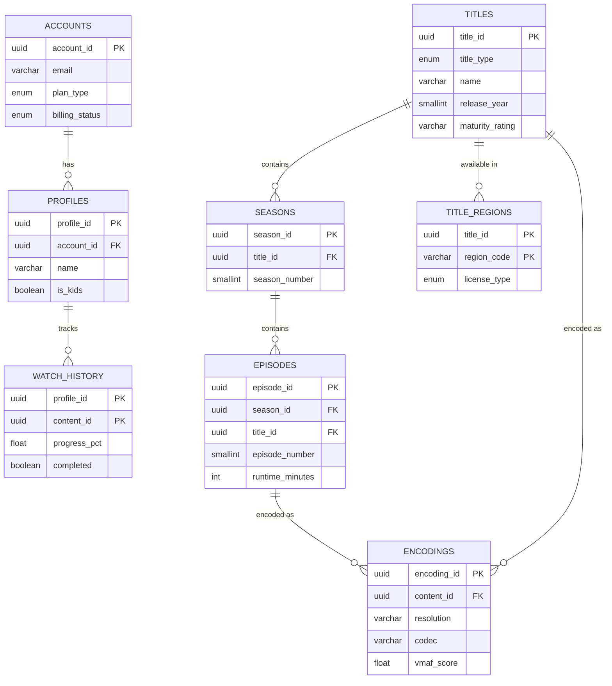
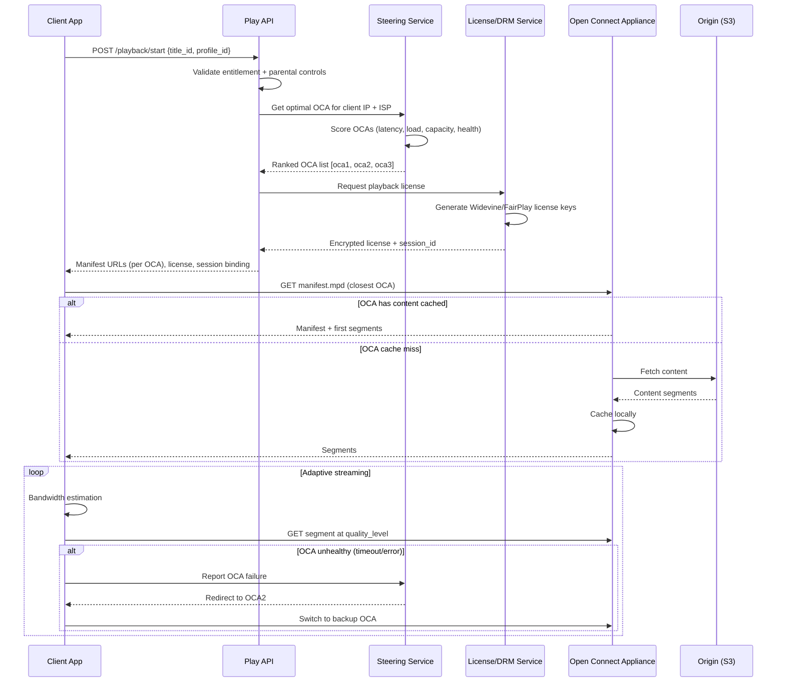
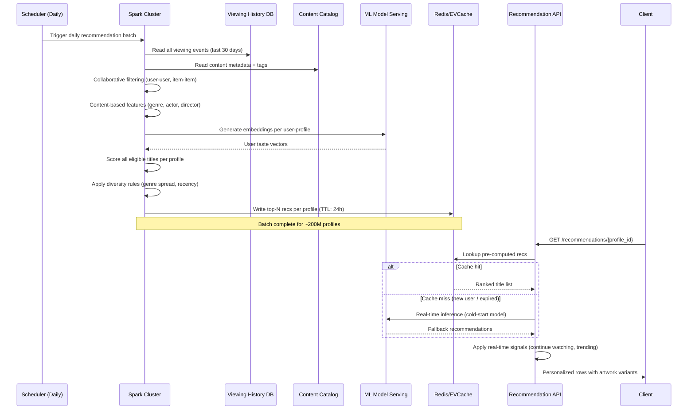
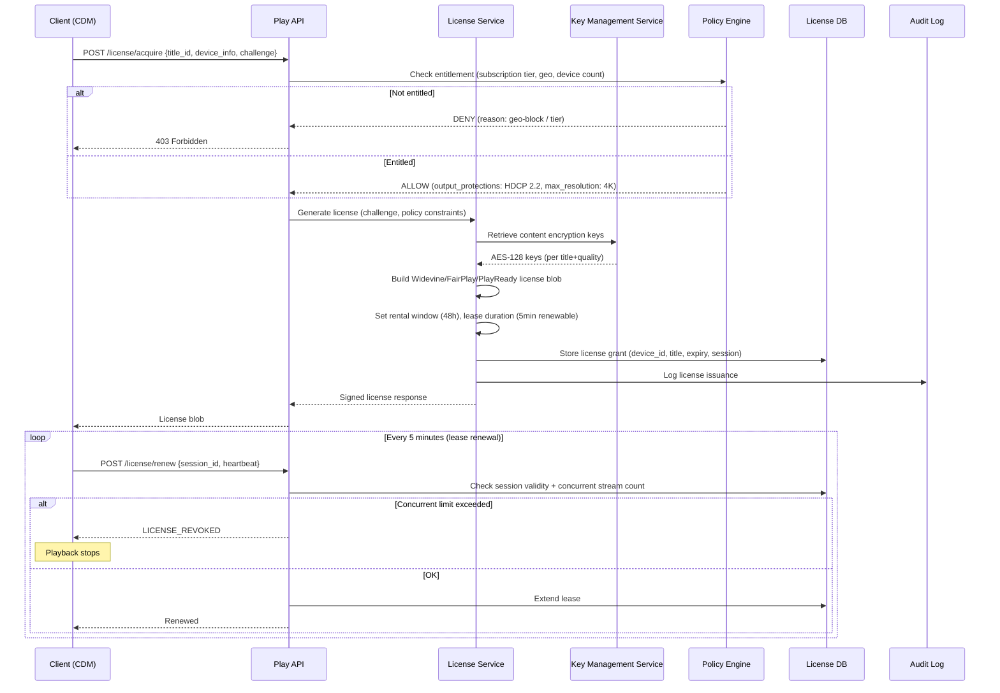

# System Design: Netflix (OTT Streaming Platform)

## 1. Functional Requirements

1. **Content Catalog Management**: Store/manage movies, series, episodes with rich metadata
2. **Video Streaming**: Adaptive bitrate streaming across all devices (TV, mobile, web, console)
3. **User Profiles**: Multiple profiles per account with individual preferences and watch history
4. **Recommendation Engine**: Hyper-personalized content suggestions (drives 80% of views)
5. **Offline Download**: Download content for offline viewing with DRM protection
6. **Multi-Device Support**: Seamless handoff between devices; concurrent stream limits
7. **DRM Protection**: Widevine/FairPlay/PlayReady content protection
8. **A/B Testing**: Continuous experimentation on UI, artwork, recommendations, encoding
9. **Search & Browse**: Fast search with autocomplete, genre browsing, categories
10. **Playback Controls**: Resume from where left off, skip intro, language/subtitle selection

## 2. Non-Functional Requirements

| Requirement | Target |
|-------------|--------|
| Availability | 99.99% (control plane), 99.999% (streaming) |
| Streaming Start Time | <2s on all devices |
| Rebuffer Ratio | <0.1% of play time |
| Recommendation Latency | <100ms p99 |
| Search Latency | <150ms p99 |
| Content Catalog Freshness | New titles available within 5 min of publish |
| Download Speed | Saturate user bandwidth |
| Regional Compliance | Geo-restricted content enforcement |
| Concurrent Streams | Enforce per-plan limits (1/2/4 screens) |
| Scalability | 250M+ subscribers, 100M+ concurrent streams during peaks |

## 3. Capacity Estimation

### Traffic
- **Total Subscribers**: 250M
- **DAU**: 150M (60% of subscribers active daily)
- **Concurrent Streams (peak)**: 100M (evening peak, globally distributed)
- **Average Session**: 1.5 hours
- **API calls/day**: 150M × 50 interactions = 7.5B → ~87K QPS (peak: ~250K)
- **Stream starts/second (peak)**: ~200K

### Storage
- **Content Library**: 15,000 titles
- **Encoded variants per title**: ~1,200 files (resolutions × codecs × audio tracks × subtitles)
- **Average encoded size per title**: 100GB (all variants)
- **Total content storage**: 15,000 × 100GB = 1.5PB
- **With 3x replication across regions**: 4.5PB
- **Metadata**: 15K titles × 50KB = 750MB (trivial)
- **User data**: 250M users × 5 profiles × 10KB = 12.5TB
- **Watch history**: 250M × 1000 entries × 100B = 25TB

### Bandwidth
- **Streaming egress**: 100M concurrent × 5Mbps avg = 500Tbps peak (served by CDN)
- **Netflix traffic**: ~15% of global internet downstream traffic
- **CDN capacity**: Deployed in 1000+ ISP locations

### Memory
- **Session state**: 100M concurrent × 1KB = 100GB
- **Content metadata cache**: 15K × 50KB = 750MB (fits single node, replicated)
- **Personalization cache**: 250M × 2KB = 500GB distributed

## 4. Data Modeling

### Entity-Relationship Diagram



### Content Catalog (PostgreSQL + Elasticsearch)
```sql
CREATE TABLE titles (
    title_id        UUID PRIMARY KEY,
    title_type      ENUM('movie', 'series') NOT NULL,
    name            VARCHAR(500) NOT NULL,
    original_name   VARCHAR(500),
    synopsis        TEXT,
    release_year    SMALLINT,
    runtime_minutes INT,  -- For movies; NULL for series
    maturity_rating VARCHAR(10),  -- 'PG', 'PG-13', 'R', 'TV-MA'
    imdb_id         VARCHAR(20),
    default_artwork_id UUID,
    studio_id       UUID,
    original_language VARCHAR(10),
    available_since TIMESTAMP,
    leaving_on      TIMESTAMP,
    popularity_score FLOAT,  -- Computed daily
    quality_score   FLOAT,   -- Internal quality metric
    created_at      TIMESTAMP DEFAULT NOW(),
    updated_at      TIMESTAMP DEFAULT NOW(),
    
    INDEX idx_type_popularity (title_type, popularity_score DESC),
    INDEX idx_release_year (release_year DESC),
    INDEX idx_maturity (maturity_rating)
);

CREATE TABLE seasons (
    season_id       UUID PRIMARY KEY,
    title_id        UUID NOT NULL REFERENCES titles(title_id),
    season_number   SMALLINT NOT NULL,
    name            VARCHAR(200),
    episode_count   SMALLINT,
    release_date    DATE,
    
    UNIQUE INDEX idx_title_season (title_id, season_number)
);

CREATE TABLE episodes (
    episode_id      UUID PRIMARY KEY,
    season_id       UUID NOT NULL REFERENCES seasons(season_id),
    title_id        UUID NOT NULL,
    episode_number  SMALLINT NOT NULL,
    name            VARCHAR(300),
    synopsis        TEXT,
    runtime_minutes INT,
    release_date    DATE,
    
    UNIQUE INDEX idx_season_episode (season_id, episode_number),
    INDEX idx_title_episodes (title_id)
);

CREATE TABLE title_genres (
    title_id        UUID,
    genre_id        SMALLINT,
    PRIMARY KEY (title_id, genre_id),
    INDEX idx_genre (genre_id)
);

CREATE TABLE title_regions (
    title_id        UUID,
    region_code     VARCHAR(5),  -- 'US', 'GB', 'JP'
    available_from  TIMESTAMP,
    available_until TIMESTAMP,
    license_type    ENUM('owned', 'licensed'),
    
    PRIMARY KEY (title_id, region_code),
    INDEX idx_region_availability (region_code, available_from)
);

CREATE TABLE encodings (
    encoding_id     UUID PRIMARY KEY,
    content_id      UUID NOT NULL,  -- title_id or episode_id
    resolution      VARCHAR(10),    -- '3840x2160', '1920x1080', etc.
    codec           VARCHAR(20),    -- 'h264_high', 'h265_main10', 'vp9_profile2', 'av1'
    bitrate_kbps    INT,
    vmaf_score      FLOAT,          -- Quality metric (0-100)
    file_size_bytes BIGINT,
    storage_key     VARCHAR(500),   -- S3/GCS path
    drm_key_id      UUID,
    audio_tracks    JSONB,          -- [{"lang":"en","codec":"eac3","channels":5.1}]
    subtitle_tracks JSONB,
    segment_map_url VARCHAR(500),   -- Byte-range map for streaming
    
    INDEX idx_content_quality (content_id, vmaf_score DESC),
    INDEX idx_content_codec (content_id, codec, resolution)
);

-- User & Profile tables
CREATE TABLE accounts (
    account_id      UUID PRIMARY KEY,
    email           VARCHAR(320) UNIQUE NOT NULL,
    plan_type       ENUM('basic', 'standard', 'premium') NOT NULL,
    max_streams     SMALLINT NOT NULL DEFAULT 1,
    max_resolution  VARCHAR(10) DEFAULT '1080p',
    country         VARCHAR(5),
    created_at      TIMESTAMP DEFAULT NOW(),
    billing_status  ENUM('active', 'past_due', 'cancelled') DEFAULT 'active',
    
    INDEX idx_billing (billing_status)
);

CREATE TABLE profiles (
    profile_id      UUID PRIMARY KEY,
    account_id      UUID NOT NULL REFERENCES accounts(account_id),
    name            VARCHAR(100) NOT NULL,
    avatar_id       SMALLINT,
    is_kids         BOOLEAN DEFAULT FALSE,
    maturity_level  SMALLINT DEFAULT 4,  -- 1=kids, 4=all
    language        VARCHAR(10) DEFAULT 'en',
    subtitle_pref   VARCHAR(10),
    autoplay_next   BOOLEAN DEFAULT TRUE,
    
    INDEX idx_account (account_id)
);

CREATE TABLE watch_history (
    profile_id      UUID,
    content_id      UUID,  -- episode_id or title_id (movie)
    watched_at      TIMESTAMP,
    progress_pct    FLOAT,
    runtime_watched_sec INT,
    completed       BOOLEAN DEFAULT FALSE,
    device_type     VARCHAR(30),
    
    PRIMARY KEY (profile_id, content_id),
    INDEX idx_profile_recent (profile_id, watched_at DESC)
);

CREATE TABLE my_list (
    profile_id      UUID,
    title_id        UUID,
    added_at        TIMESTAMP DEFAULT NOW(),
    PRIMARY KEY (profile_id, title_id),
    INDEX idx_profile_list (profile_id, added_at DESC)
);

-- A/B Testing
CREATE TABLE experiments (
    experiment_id   UUID PRIMARY KEY,
    name            VARCHAR(200) NOT NULL,
    description     TEXT,
    status          ENUM('draft', 'running', 'concluded') DEFAULT 'draft',
    start_date      TIMESTAMP,
    end_date        TIMESTAMP,
    traffic_pct     FLOAT DEFAULT 0.01,  -- % of users in experiment
    success_metric  VARCHAR(100),
    
    INDEX idx_status (status)
);

CREATE TABLE experiment_assignments (
    profile_id      UUID,
    experiment_id   UUID,
    variant         VARCHAR(50),  -- 'control', 'treatment_a', 'treatment_b'
    assigned_at     TIMESTAMP DEFAULT NOW(),
    
    PRIMARY KEY (profile_id, experiment_id),
    INDEX idx_experiment (experiment_id, variant)
);
```

### Cassandra (Viewing Activity / Analytics)
```sql
CREATE TABLE viewing_activity (
    profile_id  UUID,
    date        DATE,
    content_id  UUID,
    start_time  TIMESTAMP,
    end_time    TIMESTAMP,
    duration_sec INT,
    device_type TEXT,
    quality     TEXT,
    rebuffers   INT,
    PRIMARY KEY ((profile_id), date, start_time)
) WITH CLUSTERING ORDER BY (date DESC, start_time DESC)
  AND default_time_to_live = 63072000;  -- 2 years retention
```

## 5. High-Level Design

```
┌──────────────────────────────────────────────────────────────────────────────────┐
│                              CLIENT DEVICES                                       │
│   [Smart TV]  [iOS]  [Android]  [Web]  [PS5/Xbox]  [Chromecast]  [Roku]        │
└────────────────────────────────────┬─────────────────────────────────────────────┘
                                     │
                          ┌──────────▼──────────┐
                          │    AWS CloudFront    │
                          │    (Static assets,   │
                          │     API acceleration)│
                          └──────────┬──────────┘
                                     │
          ┌──────────────────────────┼──────────────────────────┐
          │                          │                          │
┌─────────▼──────────┐   ┌──────────▼──────────┐   ┌──────────▼──────────┐
│   Zuul API Gateway  │   │  Open Connect CDN   │   │  Download Service   │
│  (Auth, Routing,    │   │  (Video Streaming)  │   │  (Offline Content)  │
│   Rate Limiting)    │   │  1000+ ISP PoPs     │   │                     │
└─────────┬──────────┘   └──────────┬──────────┘   └──────────┬──────────┘
          │                          │                          │
          │              ┌───────────┴───────────┐              │
          │              │  Origin (S3)          │              │
          │              │  Multi-region         │              │
          │              └───────────────────────┘              │
          │                                                     │
┌─────────┴──────────────────────────────────────────────────────────────┐
│                        MICROSERVICES LAYER                              │
│                                                                        │
│  ┌──────────────┐  ┌──────────────┐  ┌──────────────┐  ┌───────────┐│
│  │  Playback    │  │  Discovery   │  │  User        │  │  Search   ││
│  │  Service     │  │  Service     │  │  Service     │  │  Service  ││
│  │ (Stream URL, │  │ (Homepage,   │  │ (Profiles,   │  │ (ES)      ││
│  │  DRM tokens) │  │  Recommend)  │  │  Prefs)      │  │           ││
│  └──────┬───────┘  └──────┬───────┘  └──────┬───────┘  └───────────┘│
│         │                  │                  │                        │
│  ┌──────┴───────┐  ┌──────┴───────┐  ┌──────┴───────┐               │
│  │  Steering    │  │  Recommend   │  │  A/B Test    │               │
│  │  Service     │  │  Engine      │  │  Service     │               │
│  │ (CDN PoP     │  │ (ML models)  │  │ (Experiment  │               │
│  │  selection)  │  │              │  │  allocation) │               │
│  └──────────────┘  └──────────────┘  └──────────────┘               │
│                                                                        │
│  ┌──────────────┐  ┌──────────────┐  ┌──────────────┐               │
│  │  Encoding    │  │  Content     │  │  Billing     │               │
│  │  Pipeline    │  │  Delivery    │  │  Service     │               │
│  │ (Per-title   │  │  (Manifest   │  │              │               │
│  │  encoding)   │  │   generation)│  │              │               │
│  └──────────────┘  └──────────────┘  └──────────────┘               │
└────────────────────────────────────────────────────────────────────────┘
          │
┌─────────┴──────────────────────────────────────────────────────────────┐
│                           DATA LAYER                                    │
│                                                                        │
│  ┌──────────┐ ┌──────────┐ ┌───────────┐ ┌──────────┐ ┌───────────┐ │
│  │CockroachDB│ │Cassandra │ │ EVCache   │ │  Kafka   │ │  S3/GCS   │ │
│  │(Catalog,  │ │(Activity,│ │ (Redis    │ │(Events,  │ │(Encoded   │ │
│  │ Accounts) │ │ Metrics) │ │  fork)    │ │ ML data) │ │ Content)  │ │
│  └──────────┘ └──────────┘ └───────────┘ └──────────┘ └───────────┘ │
└────────────────────────────────────────────────────────────────────────┘
```

## 6. Low-Level Design: API Contracts

### Playback Manifest Request
```
POST /api/v1/playback/manifest
Authorization: Bearer <token>
X-Device-Type: smart-tv
X-Device-Id: abc-123

Request:
{
  "content_id": "80100172",
  "profile_id": "p-uuid-123",
  "resume": true,
  "preferred_audio": "en",
  "preferred_subtitles": "off",
  "max_resolution": "2160p",
  "supported_codecs": ["h265", "vp9", "h264"],
  "supported_drm": ["widevine_l1"],
  "network_type": "wifi"
}

Response (200):
{
  "playback_session_id": "sess-uuid-456",
  "manifest_url": "https://oc.nflxvideo.net/manifest/80100172.mpd",
  "license_url": "https://license.nflx.com/widevine/v1",
  "drm_config": {
    "system": "widevine",
    "license_type": "streaming",
    "security_level": "L1",
    "hdcp_version": "2.2"
  },
  "resume_position_ms": 1823400,
  "encoding_profiles": [
    {"bitrate": 15000, "resolution": "3840x2160", "codec": "h265", "vmaf": 97.2},
    {"bitrate": 8000, "resolution": "2560x1440", "codec": "h265", "vmaf": 95.1},
    {"bitrate": 5800, "resolution": "1920x1080", "codec": "h265", "vmaf": 93.8},
    {"bitrate": 3000, "resolution": "1920x1080", "codec": "h264", "vmaf": 91.2},
    {"bitrate": 1500, "resolution": "1280x720", "codec": "h264", "vmaf": 88.5},
    {"bitrate": 750, "resolution": "854x480", "codec": "h264", "vmaf": 82.3}
  ],
  "audio_tracks": [
    {"lang": "en", "codec": "eac3", "channels": "5.1", "bitrate": 640},
    {"lang": "en", "codec": "aac", "channels": "2.0", "bitrate": 192}
  ],
  "subtitle_tracks": [
    {"lang": "en", "format": "webvtt", "url": "..."},
    {"lang": "es", "format": "webvtt", "url": "..."}
  ],
  "cdn_urls": {
    "primary": "https://oc-edge-1.nflxvideo.net/range/80100172/",
    "fallback": "https://oc-edge-2.nflxvideo.net/range/80100172/"
  },
  "session_config": {
    "heartbeat_interval_sec": 60,
    "max_pause_duration_sec": 300,
    "concurrent_stream_check": true
  }
}
```

### Homepage / Recommendations
```
GET /api/v1/discovery/homepage?profile_id={id}

Response (200):
{
  "rows": [
    {
      "row_id": "continue-watching",
      "title": "Continue Watching",
      "type": "continue_watching",
      "items": [
        {
          "title_id": "80100172",
          "name": "Stranger Things",
          "episode": "S4:E7",
          "progress_pct": 0.45,
          "artwork_url": "https://cdn.nflx.com/art/80100172/row.webp",
          "match_score": null
        }
      ]
    },
    {
      "row_id": "top-10",
      "title": "Top 10 in Your Country",
      "type": "ranked",
      "items": [...]
    },
    {
      "row_id": "because-you-watched-123",
      "title": "Because You Watched: Breaking Bad",
      "type": "recommendation",
      "algorithm": "byw",
      "items": [
        {
          "title_id": "80025172",
          "name": "Better Call Saul",
          "artwork_url": "...",
          "match_score": 0.96
        }
      ]
    }
  ],
  "experiment_tags": ["artwork_v2", "row_order_ml_v3"]
}
```

### Concurrent Stream Enforcement
```
POST /api/v1/playback/heartbeat
{
  "session_id": "sess-uuid-456",
  "profile_id": "p-uuid-123",
  "position_ms": 2100000,
  "buffer_health_sec": 25,
  "current_bitrate": 8000,
  "rebuffer_count": 0
}

Response (200): { "status": "ok", "next_heartbeat_sec": 60 }

Response (403 - too many streams):
{
  "error": "concurrent_stream_limit",
  "active_streams": [
    {"device": "Living Room TV", "content": "Stranger Things S4:E7", "started": "..."}
  ],
  "max_allowed": 2
}
```

## 7. Deep Dive: Open Connect CDN

### Architecture
```
┌─────────────────────────────────────────────────────────────────────────┐
│                        OPEN CONNECT APPLIANCE (OCA)                      │
│                                                                         │
│  Hardware: 100TB-200TB SSD/HDD, 100Gbps NIC, 256GB RAM                │
│  Deployed: Inside ISP network (peering) or at IXP                      │
│                                                                         │
│  ┌───────────────────────────────────────────────────────────────────┐ │
│  │  NGINX (custom) → serves video byte-ranges                        │ │
│  │  - Kernel bypass (DPDK) for packet processing                    │ │
│  │  - Sendfile() for zero-copy serving from disk                    │ │
│  │  - 90Gbps+ from a single server                                 │ │
│  └───────────────────────────────────────────────────────────────────┘ │
│                                                                         │
│  ┌───────────────────────────────────────────────────────────────────┐ │
│  │  Content Population (Fill):                                       │ │
│  │  - Proactive: Popular content pre-positioned during off-peak     │ │
│  │  - Reactive: Cache miss → fetch from origin/peer OCA             │ │
│  │  - Tiered: Hot content on SSD, warm on HDD                      │ │
│  └───────────────────────────────────────────────────────────────────┘ │
└─────────────────────────────────────────────────────────────────────────┘

                         STEERING SERVICE
┌─────────────────────────────────────────────────────────────────────────┐
│  For each play request, determine optimal OCA:                          │
│                                                                         │
│  Inputs:                                                                │
│  - Client IP → ISP, city, BGP prefix                                   │
│  - OCA health: CPU, disk I/O, network utilization, error rates         │
│  - Content availability: which OCAs have the content cached            │
│  - Network conditions: latency, packet loss between client and OCAs    │
│  - Historical performance: past quality for this client ↔ OCA pair     │
│                                                                         │
│  Algorithm: Multi-objective optimization                                │
│  minimize(latency + rebuffer_probability)                               │
│  subject_to: OCA_load < capacity × 0.85                                │
└─────────────────────────────────────────────────────────────────────────┘

Content Population Pipeline:
┌──────────┐     ┌──────────────┐     ┌────────────────┐     ┌─────────┐
│  Encode  │────▶│  Origin S3   │────▶│  Manifest      │────▶│  Fill   │
│  Pipeline│     │  (us-east,   │     │  (what content │     │  OCAs   │
│          │     │   eu-west)   │     │   goes where)  │     │         │
└──────────┘     └──────────────┘     └────────────────┘     └─────────┘
                                             │
                                      Content Popularity
                                      + Regional demand
                                      + OCA capacity
                                      → Placement decision
```

### OCA Fill Algorithm
```python
# cdn/content_placement.py
from dataclasses import dataclass
from typing import List, Dict
import numpy as np

@dataclass
class OCA:
    oca_id: str
    isp: str
    region: str
    capacity_tb: float
    used_tb: float
    bandwidth_gbps: float
    current_load_pct: float

@dataclass
class ContentItem:
    content_id: str
    size_gb: float
    popularity_by_region: Dict[str, float]  # region → expected views/hour
    
class ContentPlacementOptimizer:
    """
    Determines which content to pre-position on which OCAs.
    Runs nightly with hourly incremental updates.
    """
    
    def __init__(self, ocas: List[OCA], content: List[ContentItem]):
        self.ocas = ocas
        self.content = content
    
    def optimize_placement(self) -> Dict[str, List[str]]:
        """Returns: {oca_id: [content_ids to store]}"""
        placements = {oca.oca_id: [] for oca in self.ocas}
        
        for oca in self.ocas:
            available_space = (oca.capacity_tb - oca.used_tb) * 1024  # GB
            
            # Score each content item for this OCA
            scored_content = []
            for item in self.content:
                regional_demand = item.popularity_by_region.get(oca.region, 0)
                # Score = demand × bandwidth_saved / size
                # (maximize cache hits per GB stored)
                score = regional_demand / max(item.size_gb, 0.1)
                scored_content.append((score, item))
            
            # Greedy: fill OCA with highest-scored content
            scored_content.sort(key=lambda x: x[0], reverse=True)
            remaining_space = available_space
            
            for score, item in scored_content:
                if item.size_gb <= remaining_space:
                    placements[oca.oca_id].append(item.content_id)
                    remaining_space -= item.size_gb
                if remaining_space < 1:  # Less than 1GB remaining
                    break
        
        return placements
```

## 8. Deep Dive: Recommendation Engine

### System Overview
```
┌────────────────────────────────────────────────────────────────────────────┐
│                    NETFLIX RECOMMENDATION ARCHITECTURE                       │
│                                                                            │
│  OFFLINE (Batch Processing - Spark/Flink)                                  │
│  ┌──────────────────────────────────────────────────────────────────────┐ │
│  │                                                                      │ │
│  │  ┌─────────────┐  ┌──────────────┐  ┌────────────────────────────┐ │ │
│  │  │ Matrix      │  │ Deep Neural  │  │ Content-Based Filtering    │ │ │
│  │  │ Factorization│  │ Network      │  │ (NLP on descriptions,     │ │ │
│  │  │ (SVD++)     │  │ (Embeddings) │  │  genre taxonomy, cast)    │ │ │
│  │  └──────┬──────┘  └──────┬───────┘  └────────────┬───────────────┘ │ │
│  │         │                 │                       │                  │ │
│  │         └─────────────────┼───────────────────────┘                  │ │
│  │                           ▼                                          │ │
│  │              ┌─────────────────────────┐                            │ │
│  │              │  Candidate Generation   │                            │ │
│  │              │  (~2000 per user)       │                            │ │
│  │              └────────────┬────────────┘                            │ │
│  │                           │                                          │ │
│  │              ┌────────────▼────────────┐                            │ │
│  │              │  Row Selection +        │                            │ │
│  │              │  Ranking per Row        │                            │ │
│  │              └────────────┬────────────┘                            │ │
│  │                           │                                          │ │
│  │              ┌────────────▼────────────┐                            │ │
│  │              │  Pre-computed Results   │                            │ │
│  │              │  → EVCache             │                            │ │
│  │              └─────────────────────────┘                            │ │
│  └──────────────────────────────────────────────────────────────────────┘ │
│                                                                            │
│  ONLINE (Real-time Adjustments)                                            │
│  ┌──────────────────────────────────────────────────────────────────────┐ │
│  │  - Re-rank based on time of day, device, recent activity            │ │
│  │  - Inject "Continue Watching" row                                   │ │
│  │  - Apply A/B test variant (row order, artwork selection)            │ │
│  │  - Diversity injection (avoid all same genre)                       │ │
│  └──────────────────────────────────────────────────────────────────────┘ │
└────────────────────────────────────────────────────────────────────────────┘
```

### Matrix Factorization Model
```python
# recommendation/matrix_factorization.py
import numpy as np
from scipy.sparse import csr_matrix

class SVDPlusPlus:
    """
    SVD++ model for collaborative filtering.
    Predicts rating r_ui = μ + b_u + b_i + q_i^T(p_u + |N(u)|^{-0.5} Σ y_j)
    """
    def __init__(self, n_users, n_items, n_factors=200, lr=0.005, reg=0.02):
        self.n_factors = n_factors
        self.lr = lr
        self.reg = reg
        self.global_mean = 0.0
        
        # Learnable parameters
        self.user_bias = np.zeros(n_users)
        self.item_bias = np.zeros(n_items)
        self.user_factors = np.random.normal(0, 0.01, (n_users, n_factors))
        self.item_factors = np.random.normal(0, 0.01, (n_items, n_factors))
        self.implicit_factors = np.random.normal(0, 0.01, (n_items, n_factors))  # y_j
    
    def fit(self, ratings: csr_matrix, n_epochs=20):
        """Train on implicit feedback (watch completion %)."""
        self.global_mean = ratings.data.mean()
        
        for epoch in range(n_epochs):
            total_loss = 0
            for u in range(ratings.shape[0]):
                # Items user has interacted with (implicit feedback)
                interacted = ratings[u].indices
                if len(interacted) == 0:
                    continue
                
                sqrt_nu = 1.0 / np.sqrt(len(interacted))
                implicit_sum = np.sum(self.implicit_factors[interacted], axis=0) * sqrt_nu
                
                for idx in range(len(interacted)):
                    i = interacted[idx]
                    r_ui = ratings[u, i]
                    
                    # Prediction
                    pred = (self.global_mean + self.user_bias[u] + self.item_bias[i] +
                            np.dot(self.item_factors[i], self.user_factors[u] + implicit_sum))
                    
                    error = r_ui - pred
                    total_loss += error ** 2
                    
                    # SGD updates
                    self.user_bias[u] += self.lr * (error - self.reg * self.user_bias[u])
                    self.item_bias[i] += self.lr * (error - self.reg * self.item_bias[i])
                    
                    self.user_factors[u] += self.lr * (
                        error * self.item_factors[i] - self.reg * self.user_factors[u])
                    self.item_factors[i] += self.lr * (
                        error * (self.user_factors[u] + implicit_sum) - self.reg * self.item_factors[i])
                    
                    # Update implicit factors for all items user interacted with
                    for j in interacted:
                        self.implicit_factors[j] += self.lr * (
                            error * self.item_factors[i] * sqrt_nu - self.reg * self.implicit_factors[j])
            
            print(f"Epoch {epoch}: RMSE = {np.sqrt(total_loss / ratings.nnz):.4f}")
    
    def predict(self, user_id: int, item_ids: np.ndarray) -> np.ndarray:
        """Predict scores for a batch of items."""
        scores = (self.global_mean + self.user_bias[user_id] + self.item_bias[item_ids] +
                  self.item_factors[item_ids] @ self.user_factors[user_id])
        return scores
```

### Personalized Artwork Selection
```python
# recommendation/artwork_selection.py
class ArtworkSelector:
    """
    Select the best artwork variant for a title based on user preferences.
    Netflix has multiple artwork options per title; different users see different ones.
    E.g., a romance fan sees the love interest on the poster; an action fan sees explosions.
    """
    def __init__(self, artwork_embeddings, user_preference_model):
        self.artwork_embeddings = artwork_embeddings  # {title_id: {artwork_id: embedding}}
        self.user_model = user_preference_model
    
    def select_artwork(self, profile_id: str, title_id: str, context: dict) -> str:
        """Select best artwork for this user-title pair using contextual bandit."""
        artworks = self.artwork_embeddings.get(title_id, {})
        if not artworks:
            return "default"
        
        user_features = self.user_model.get_features(profile_id)
        context_features = self._encode_context(context)  # device, time_of_day, row_position
        
        best_artwork = None
        best_score = -float('inf')
        
        for artwork_id, art_embedding in artworks.items():
            # Thompson Sampling with neural network reward model
            features = np.concatenate([user_features, art_embedding, context_features])
            score = self._thompson_sample(features, artwork_id, title_id)
            if score > best_score:
                best_score = score
                best_artwork = artwork_id
        
        return best_artwork
    
    def _thompson_sample(self, features, artwork_id, title_id):
        """Sample from posterior distribution of click-through rate."""
        # Use stored alpha/beta (successes/failures) for this artwork
        alpha = self._get_successes(artwork_id, title_id) + 1
        beta = self._get_failures(artwork_id, title_id) + 1
        return np.random.beta(alpha, beta)
```

## 9. Deep Dive: Per-Title Encoding Optimization

### Concept
```
Traditional: Fixed encoding ladder (same bitrates for all content)
Netflix: Per-title optimization → each title gets its own encoding ladder
         optimized for its complexity (animation ≠ action movie)

Goal: Maximum VMAF quality per bit spent
```

### Per-Title Encoding Algorithm
```python
# encoding/per_title_optimization.py
import subprocess
import json
from dataclasses import dataclass
from typing import List, Tuple

@dataclass
class EncodingPoint:
    resolution: str
    bitrate_kbps: int
    vmaf_score: float
    file_size_bytes: int

class PerTitleOptimizer:
    """
    Determine the optimal encoding ladder for a specific title.
    Uses convex hull analysis on the bitrate-quality curve.
    """
    
    RESOLUTIONS = ['3840x2160', '2560x1440', '1920x1080', '1280x720', '854x480', '640x360']
    
    def __init__(self, target_vmaf_points: List[float] = None):
        # Target quality levels in the ladder
        self.target_vmaf = target_vmaf_points or [97, 95, 93, 90, 85, 80, 70]
    
    def analyze_title(self, input_path: str) -> List[EncodingPoint]:
        """
        Run encoding probes at various bitrate-resolution combos,
        compute VMAF, find the convex hull (Pareto-optimal points).
        """
        all_points = []
        
        for resolution in self.RESOLUTIONS:
            # Probe at multiple bitrates for this resolution
            bitrates = self._get_probe_bitrates(resolution)
            
            for bitrate in bitrates:
                vmaf = self._encode_and_measure(input_path, resolution, bitrate)
                all_points.append(EncodingPoint(
                    resolution=resolution,
                    bitrate_kbps=bitrate,
                    vmaf_score=vmaf,
                    file_size_bytes=0  # Computed later
                ))
        
        # Find convex hull: points where increasing bitrate gives best VMAF gain
        optimal_ladder = self._compute_convex_hull(all_points)
        return optimal_ladder
    
    def _encode_and_measure(self, input_path: str, resolution: str, bitrate: int) -> float:
        """Encode a sample (first 2 min) and compute VMAF score."""
        output_path = f"/tmp/probe_{resolution}_{bitrate}.mp4"
        
        # Encode sample
        cmd = (
            f"ffmpeg -y -i {input_path} -t 120 "
            f"-vf scale={resolution} -c:v libx264 -b:v {bitrate}k "
            f"-preset medium -an {output_path}"
        )
        subprocess.run(cmd, shell=True, capture_output=True)
        
        # Compute VMAF
        vmaf_cmd = (
            f"ffmpeg -i {output_path} -i {input_path} "
            f"-lavfi '[0:v]scale={resolution}[dist];[1:v]scale={resolution}[ref];"
            f"[dist][ref]libvmaf=model_path=/usr/share/vmaf/model/vmaf_v0.6.1.json' "
            f"-f null -"
        )
        result = subprocess.run(vmaf_cmd, shell=True, capture_output=True, text=True)
        # Parse VMAF score from output
        vmaf_score = self._parse_vmaf(result.stderr)
        return vmaf_score
    
    def _compute_convex_hull(self, points: List[EncodingPoint]) -> List[EncodingPoint]:
        """
        Find Pareto-optimal encoding points (convex hull on bitrate vs VMAF).
        For each VMAF target, find the minimum bitrate that achieves it.
        """
        # Sort by bitrate
        points.sort(key=lambda p: p.bitrate_kbps)
        
        # Build convex hull: remove points where you can get same quality at lower bitrate
        hull = [points[0]]
        for p in points[1:]:
            # Only add if it achieves higher VMAF than current best
            while len(hull) > 1:
                # Check if the slope from hull[-2] to p is better than hull[-2] to hull[-1]
                slope_new = ((p.vmaf_score - hull[-2].vmaf_score) / 
                            (p.bitrate_kbps - hull[-2].bitrate_kbps))
                slope_old = ((hull[-1].vmaf_score - hull[-2].vmaf_score) / 
                            (hull[-1].bitrate_kbps - hull[-2].bitrate_kbps))
                if slope_new >= slope_old:
                    hull.pop()
                else:
                    break
            hull.append(p)
        
        # Select points closest to target VMAF levels
        ladder = []
        for target in self.target_vmaf:
            best = min(hull, key=lambda p: abs(p.vmaf_score - target))
            if best not in ladder:
                ladder.append(best)
        
        return sorted(ladder, key=lambda p: p.bitrate_kbps, reverse=True)
    
    def _get_probe_bitrates(self, resolution: str) -> List[int]:
        """Return bitrate probe points based on resolution."""
        base_rates = {
            '3840x2160': [6000, 8000, 10000, 12000, 15000, 20000],
            '2560x1440': [4000, 6000, 8000, 10000, 12000],
            '1920x1080': [2000, 3000, 4000, 5800, 8000],
            '1280x720': [1000, 1500, 2000, 2500, 3500],
            '854x480': [500, 750, 1000, 1500],
            '640x360': [200, 400, 600, 800],
        }
        return base_rates.get(resolution, [1000, 2000, 4000])
```

## 10. Component Optimization

### EVCache (Netflix's Redis Fork)
```yaml
# EVCache configuration for different use cases
evcache_clusters:
  recommendation_cache:
    cluster_size: 48 nodes
    memory_per_node: 64GB
    total_capacity: 3TB
    replication: 2 (cross-zone)
    ttl: 3600  # 1 hour
    serialization: protobuf
    consistency: eventual (read-any-replica)
    
  session_cache:
    cluster_size: 24 nodes
    memory_per_node: 32GB
    total_capacity: 768GB
    replication: 2
    ttl: 86400
    eviction: lru
    
  playback_state:
    cluster_size: 16 nodes
    memory_per_node: 32GB
    total_capacity: 512GB
    replication: 3  # Higher replication for resume position
    ttl: 604800  # 7 days
    write_concern: quorum
```

### Kafka (Event Bus)
```yaml
kafka_topics:
  viewing-activity:
    partitions: 1024
    replication: 3
    retention: 7d
    compression: zstd
    throughput: 2M events/sec
    consumer_groups:
      - recommendation-trainer
      - analytics-pipeline
      - billing-calculator
      
  playback-events:
    partitions: 512
    replication: 3
    retention: 3d
    key: session_id  # Ensures ordering per session
    
  content-updates:
    partitions: 32
    replication: 3
    retention: 30d
    compaction: enabled  # Keep latest state per content_id
```

### DRM Implementation
```python
# drm/license_service.py
class DRMLicenseService:
    """Handles DRM license requests for Widevine/FairPlay/PlayReady."""
    
    def issue_license(self, request: dict) -> dict:
        """
        Validates entitlement and issues DRM license.
        Called by client player when starting playback.
        """
        # 1. Validate session
        session = self.validate_session(request['session_id'])
        
        # 2. Check entitlement
        account = self.get_account(session.account_id)
        if account.billing_status != 'active':
            raise EntitlementError("Subscription not active")
        
        # 3. Check concurrent streams
        active_streams = self.get_active_streams(account.account_id)
        if len(active_streams) >= account.max_streams:
            raise ConcurrentStreamError(active_streams)
        
        # 4. Determine allowed resolution based on plan + device security level
        max_resolution = self._determine_max_resolution(
            plan=account.plan_type,
            security_level=request['security_level'],
            hdcp_version=request.get('hdcp_version')
        )
        
        # 5. Issue license with constraints
        license_config = {
            'content_key_id': request['key_id'],
            'max_resolution': max_resolution,
            'license_duration_sec': 86400,  # 24 hours
            'playback_duration_sec': 172800,  # 48 hours from first play
            'renewal_allowed': True,
            'output_protection': {
                'hdcp': 'hdcp_v2_2' if max_resolution == '2160p' else 'hdcp_v1',
                'cgms_a': 'copy_never'
            }
        }
        
        return self.drm_backend.generate_license(license_config)
    
    def _determine_max_resolution(self, plan, security_level, hdcp_version):
        if plan == 'premium' and security_level == 'L1' and hdcp_version >= '2.2':
            return '2160p'
        elif plan in ('premium', 'standard') and security_level == 'L1':
            return '1080p'
        elif security_level == 'L3':  # Software DRM (browser)
            return '720p'  # Limit for software DRM
        return '1080p'
```

## 11. Observability

### Key Metrics (Netflix SPS - Streaming Performance Score)
```yaml
streaming_metrics:
  # Quality of Experience (QoE)
  - play_start_time_ms{device, region, isp}
  - rebuffer_ratio{device, region, content_type}
  - bitrate_switches_per_hour{device}
  - average_bitrate_kbps{device, plan, content_type}
  - vmaf_delivered{device, region}
  
  # Infrastructure
  - oca_throughput_gbps{oca_id, isp}
  - oca_cache_hit_ratio{oca_id}
  - oca_disk_io_util{oca_id}
  - origin_requests_per_sec{region}
  
  # Business
  - stream_starts_per_second{region}
  - concurrent_streams{region, plan}
  - content_hours_viewed{title_id, region}
  - churn_prediction_score{account_id}  # ML model output
  
  # Reliability
  - error_rate{error_type, device, region}
  - api_latency_p99{service, endpoint}
  - circuit_breaker_trips{service}

alerts:
  - name: PlayStartDegradation
    expr: histogram_quantile(0.95, play_start_time_ms) > 5000
    severity: P1
    
  - name: RebufferSpike
    expr: rate(rebuffer_events[5m]) / rate(play_events[5m]) > 0.02
    severity: P1
    
  - name: OCAOverloaded
    expr: oca_throughput_gbps > oca_capacity_gbps * 0.9
    severity: P2
```

## 12. Key Considerations & Trade-offs

| Decision | Choice | Rationale |
|----------|--------|-----------|
| CDN | Own (Open Connect) vs third-party | At Netflix scale, own CDN is 10x cheaper; better control |
| Encoding | Per-title vs fixed ladder | 20% bandwidth savings; worth extra compute |
| Consistency | Eventual for most services | Availability > consistency for streaming; strong only for billing |
| Recommendation | Offline batch + online re-rank | Full model too expensive real-time; pre-compute + adjust |
| Storage | S3 + OCA tiering | S3 for durability; OCA for latency |
| Microservices | Hundreds of services | Organizational scaling (two-pizza teams); deployment independence |
| Chaos Engineering | Chaos Monkey, Simian Army | Proactively find weaknesses; justify cost by avoiding outages |
| Multi-region | Active-active (3 regions) | Survive full region failure; latency optimization |

### Failure Handling
- **OCA failure**: Steering service redirects to next-closest OCA in <1s
- **Region failure**: Zuul routes to surviving region; stateless services scale up
- **Recommendation service down**: Serve cached recommendations (stale but available)
- **License service down**: Grace period on existing licenses; degrade gracefully
- **Database failure**: CockroachDB survives node loss; read replicas for reads

---

## Sequence Diagrams

### 1. Content Playback Start + CDN Selection



### 2. Recommendation Generation Pipeline



### 3. License / DRM Validation Flow



---

## Expanded Async Processing

### Async Pipeline Architecture

Netflix's async processing underpins several critical non-real-time workflows:

**Content Ingestion Pipeline (Async)**:
1. Studio uploads mezzanine file → S3 event triggers Step Function
2. Step Function orchestrates: quality validation → audio normalization → per-title encoding analysis → parallel transcode (100+ renditions) → packaging (DASH/HLS) → DRM encryption → QC validation → catalog publish
3. Each stage writes to SQS between steps; failures retry with exponential backoff
4. Entire pipeline: 4-8 hours per title; fully async with status callbacks

**Viewing Event Processing**:
- Client sends playback events (start, pause, seek, stop, quality changes) → Kafka
- Stream processing (Apache Flink): sessionization, engagement scoring, A/B metric computation
- Sink to: data warehouse (BigQuery), real-time dashboards, recommendation feature store
- Throughput: ~500K events/second globally

**Artwork Personalization (Async Batch)**:
- For each title × user cluster: select optimal artwork variant
- Multi-armed bandit offline computation on Spark
- Results cached in EVCache; refreshed every 6 hours
