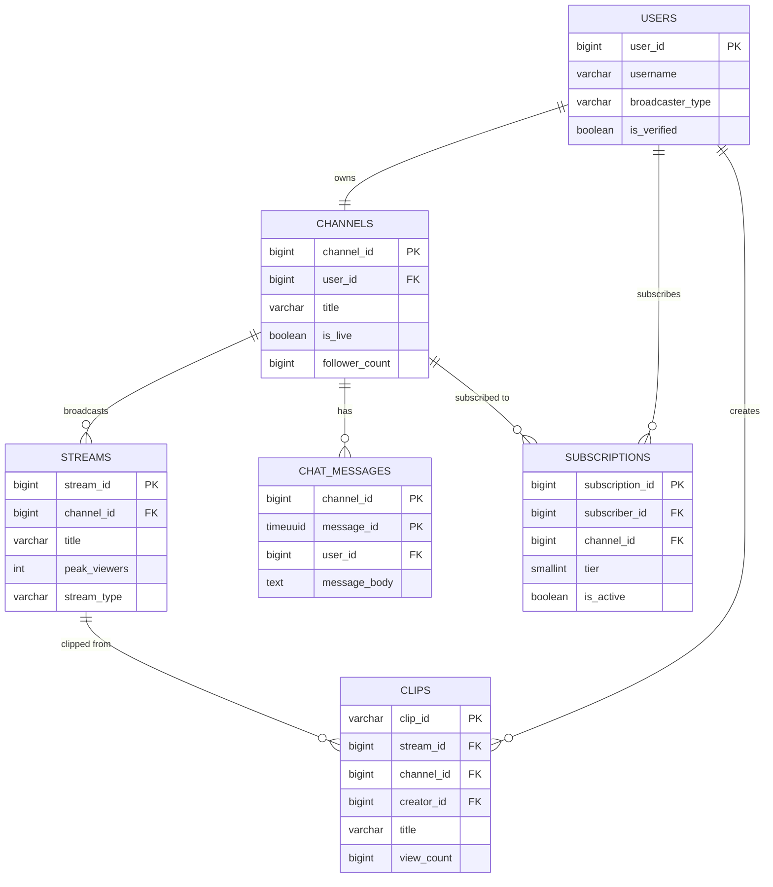
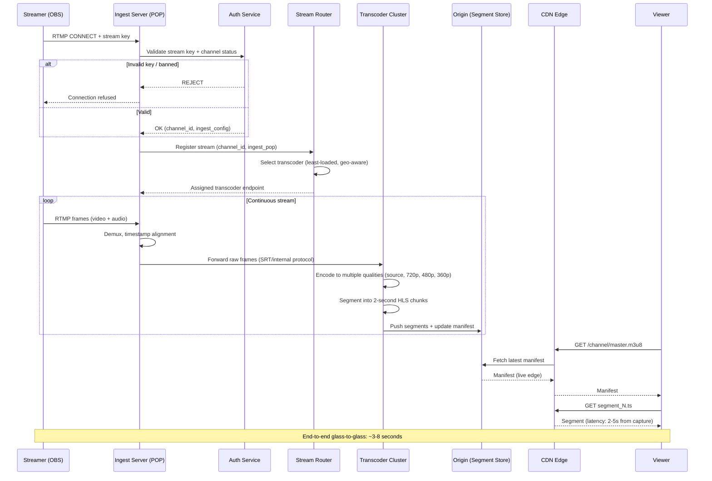
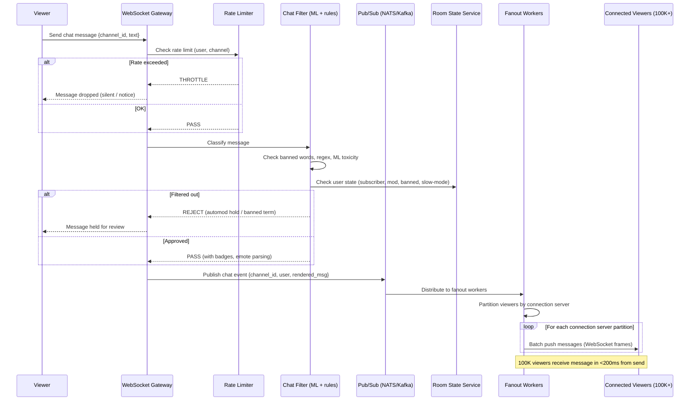
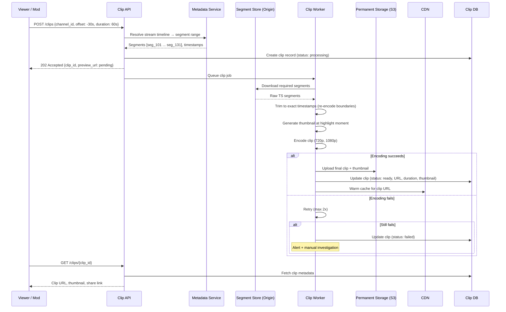

# Twitch Live Streaming Platform - System Design

## 1. Problem Statement

Design a live streaming platform supporting millions of concurrent viewers per stream, real-time chat at scale, and sub-5-second glass-to-glass latency with 99.99% availability.

---

## 2. Functional Requirements

| # | Requirement | Description |
|---|-------------|-------------|
| FR1 | Live Video Ingest | Accept RTMP/SRT streams from broadcasters |
| FR2 | Real-time Transcoding | Multi-bitrate ABR ladder (1080p60, 720p, 480p, 360p, 160p) |
| FR3 | Viewer Delivery | HLS/DASH adaptive streaming to millions of concurrent viewers |
| FR4 | Live Chat | Millions of messages/sec across channels |
| FR5 | Subscriptions & Bits | Paid subscriptions, virtual currency (bits) for cheering |
| FR6 | Clips | Viewers create 5-60 second clips from live streams |
| FR7 | VOD | Automatic recording and on-demand playback of past broadcasts |
| FR8 | Raids | Redirect entire viewer audience to another channel |
| FR9 | Channel Points | Loyalty rewards system with predictions and redemptions |
| FR10 | Notifications | Real-time alerts when followed channels go live |

---

## 3. Non-Functional Requirements

| Requirement | Target |
|-------------|--------|
| Availability | 99.99% (52 min downtime/year) |
| Glass-to-glass latency | < 5 seconds (low-latency mode < 2s) |
| Concurrent viewers/stream | Millions (peak: 2M+ on single stream) |
| Total concurrent viewers | 30M+ platform-wide |
| Chat message latency | < 500ms from send to display |
| Video start time | < 2 seconds |
| VOD availability | Within 5 minutes of stream end |
| Clip creation | < 3 seconds to generate |
| Geographic coverage | Global with < 100ms to nearest edge |

---

## 4. Capacity Estimation

### Traffic Estimates

```
Concurrent streamers:           150,000
Concurrent viewers:             30,000,000
Average stream bitrate (ingest): 6 Mbps (1080p60)
ABR ladder output per stream:    ~12 Mbps total (all qualities)
Peak chat messages/sec:          5,000,000
Average viewers per stream:      200 (heavily skewed, top 0.1% has 100K+)

Ingest bandwidth:  150,000 × 6 Mbps = 900 Gbps
Egress bandwidth:  30,000,000 × 4 Mbps (avg quality) = 120 Tbps
```

### Storage Estimates

```
VOD storage per day:
  150,000 streams × 3 hrs avg × 6 Mbps = 1.2 PB/day (raw)
  After transcoding + retention policy: ~500 TB/day retained

Chat messages per day:
  5M msg/sec × 86400 sec × 100 bytes avg = 43 TB/day

Clips per day:
  2,000,000 clips × 30 sec × 4 Mbps = 30 TB/day
```

### Compute Estimates

```
Transcoding nodes:
  150,000 streams × 5 quality levels = 750,000 transcode jobs
  Each 1080p60 transcode ≈ 1 GPU or 8 CPU cores
  ~20,000 GPU nodes (NVIDIA T4/A10) or 100,000 CPU nodes

Chat servers:
  5M msg/sec ÷ 100K msg/sec per node = 50 chat nodes

Edge CDN nodes:
  120 Tbps ÷ 100 Gbps per PoP = 1,200 PoPs minimum
```

---

## 5. Data Modeling

### Entity-Relationship Diagram



### 5.1 Users Table (PostgreSQL - Sharded by user_id)

```sql
CREATE TABLE users (
    user_id         BIGINT PRIMARY KEY,          -- Snowflake ID
    username        VARCHAR(25) UNIQUE NOT NULL,
    display_name    VARCHAR(50) NOT NULL,
    email           VARCHAR(255) UNIQUE NOT NULL,
    password_hash   VARCHAR(255) NOT NULL,
    profile_image   VARCHAR(512),
    bio             TEXT,
    broadcaster_type VARCHAR(20) DEFAULT 'none', -- 'none', 'affiliate', 'partner'
    user_type       VARCHAR(20) DEFAULT 'normal',
    created_at      TIMESTAMPTZ NOT NULL DEFAULT NOW(),
    updated_at      TIMESTAMPTZ NOT NULL DEFAULT NOW(),
    is_verified     BOOLEAN DEFAULT FALSE,
    two_factor      BOOLEAN DEFAULT FALSE,
    country_code    CHAR(2)
);

CREATE INDEX idx_users_username ON users(username);
CREATE INDEX idx_users_email ON users(email);
CREATE INDEX idx_users_broadcaster_type ON users(broadcaster_type);
CREATE INDEX idx_users_created_at ON users(created_at DESC);
```

### 5.2 Channels Table (PostgreSQL - Sharded by channel_id)

```sql
CREATE TABLE channels (
    channel_id      BIGINT PRIMARY KEY,
    user_id         BIGINT NOT NULL REFERENCES users(user_id),
    title           VARCHAR(140),
    game_id         BIGINT REFERENCES categories(category_id),
    language        VARCHAR(10) DEFAULT 'en',
    is_live         BOOLEAN DEFAULT FALSE,
    stream_key      VARCHAR(128) NOT NULL,
    delay_seconds   INT DEFAULT 0,
    chat_mode       VARCHAR(20) DEFAULT 'everyone', -- 'everyone','followers','subscribers'
    follower_count  BIGINT DEFAULT 0,
    subscriber_count BIGINT DEFAULT 0,
    total_views     BIGINT DEFAULT 0,
    mature_content  BOOLEAN DEFAULT FALSE,
    panel_data      JSONB,
    schedule        JSONB,
    created_at      TIMESTAMPTZ NOT NULL DEFAULT NOW(),
    updated_at      TIMESTAMPTZ NOT NULL DEFAULT NOW()
);

CREATE UNIQUE INDEX idx_channels_user_id ON channels(user_id);
CREATE INDEX idx_channels_is_live ON channels(is_live) WHERE is_live = TRUE;
CREATE INDEX idx_channels_game_live ON channels(game_id, is_live) WHERE is_live = TRUE;
CREATE INDEX idx_channels_follower_count ON channels(follower_count DESC);
```

### 5.3 Streams Table (PostgreSQL - Partitioned by started_at)

```sql
CREATE TABLE streams (
    stream_id       BIGINT PRIMARY KEY,
    channel_id      BIGINT NOT NULL REFERENCES channels(channel_id),
    title           VARCHAR(140) NOT NULL,
    game_id         BIGINT,
    language        VARCHAR(10),
    started_at      TIMESTAMPTZ NOT NULL DEFAULT NOW(),
    ended_at        TIMESTAMPTZ,
    peak_viewers    INT DEFAULT 0,
    avg_viewers     INT DEFAULT 0,
    total_views     BIGINT DEFAULT 0,
    duration_secs   INT,
    thumbnail_url   VARCHAR(512),
    is_mature       BOOLEAN DEFAULT FALSE,
    stream_type     VARCHAR(20) DEFAULT 'live', -- 'live', 'rerun', 'premiere'
    ingest_server   VARCHAR(255),
    ingest_protocol VARCHAR(10) DEFAULT 'rtmp', -- 'rtmp', 'srt'
    resolution      VARCHAR(20),
    fps             INT,
    bitrate_kbps    INT
) PARTITION BY RANGE (started_at);

CREATE INDEX idx_streams_channel_started ON streams(channel_id, started_at DESC);
CREATE INDEX idx_streams_game_viewers ON streams(game_id, peak_viewers DESC);
CREATE INDEX idx_streams_active ON streams(ended_at) WHERE ended_at IS NULL;
```

### 5.4 Chat Messages (ScyllaDB - Wide column for time-series)

```sql
CREATE TABLE chat_messages (
    channel_id      BIGINT,
    bucket          TEXT,           -- '2024-01-15_14' (hourly bucket)
    message_id      TIMEUUID,
    user_id         BIGINT,
    username        TEXT,
    display_name    TEXT,
    message_body    TEXT,
    emotes          FROZEN<LIST<FROZEN<map<text, text>>>>,
    badges          FROZEN<LIST<TEXT>>,
    color           TEXT,
    bits_amount     INT,
    is_action       BOOLEAN,
    is_deleted      BOOLEAN,
    sent_at         TIMESTAMP,
    PRIMARY KEY ((channel_id, bucket), message_id)
) WITH CLUSTERING ORDER BY (message_id DESC)
  AND gc_grace_seconds = 86400
  AND compaction = {'class': 'TimeWindowCompactionStrategy',
                    'compaction_window_unit': 'HOURS',
                    'compaction_window_size': 1};
```

### 5.5 Subscriptions Table (PostgreSQL)

```sql
CREATE TABLE subscriptions (
    subscription_id BIGINT PRIMARY KEY,
    subscriber_id   BIGINT NOT NULL REFERENCES users(user_id),
    channel_id      BIGINT NOT NULL REFERENCES channels(channel_id),
    tier            SMALLINT NOT NULL DEFAULT 1, -- 1, 2, 3
    is_gift         BOOLEAN DEFAULT FALSE,
    gifter_id       BIGINT REFERENCES users(user_id),
    started_at      TIMESTAMPTZ NOT NULL DEFAULT NOW(),
    expires_at      TIMESTAMPTZ NOT NULL,
    streak_months   INT DEFAULT 1,
    cumulative_months INT DEFAULT 1,
    is_active       BOOLEAN DEFAULT TRUE,
    payment_method  VARCHAR(50),
    amount_cents    INT NOT NULL
);

CREATE UNIQUE INDEX idx_subs_subscriber_channel ON subscriptions(subscriber_id, channel_id) WHERE is_active = TRUE;
CREATE INDEX idx_subs_channel_active ON subscriptions(channel_id) WHERE is_active = TRUE;
CREATE INDEX idx_subs_expires ON subscriptions(expires_at) WHERE is_active = TRUE;
```

### 5.6 Clips Table (PostgreSQL)

```sql
CREATE TABLE clips (
    clip_id         VARCHAR(36) PRIMARY KEY,
    stream_id       BIGINT NOT NULL,
    channel_id      BIGINT NOT NULL,
    creator_id      BIGINT NOT NULL REFERENCES users(user_id),
    title           VARCHAR(100) NOT NULL,
    game_id         BIGINT,
    offset_seconds  INT NOT NULL,
    duration_secs   DECIMAL(4,1) NOT NULL,
    view_count      BIGINT DEFAULT 0,
    thumbnail_url   VARCHAR(512),
    video_url       VARCHAR(512),
    vod_offset      INT,
    created_at      TIMESTAMPTZ NOT NULL DEFAULT NOW()
);

CREATE INDEX idx_clips_channel_views ON clips(channel_id, view_count DESC);
CREATE INDEX idx_clips_stream ON clips(stream_id, created_at DESC);
CREATE INDEX idx_clips_game_views ON clips(game_id, view_count DESC);
CREATE INDEX idx_clips_created ON clips(created_at DESC);
```

### 5.7 Channel Points (Redis + PostgreSQL)

```sql
CREATE TABLE channel_point_balances (
    user_id         BIGINT NOT NULL,
    channel_id      BIGINT NOT NULL,
    balance         BIGINT DEFAULT 0,
    lifetime_earned BIGINT DEFAULT 0,
    last_updated    TIMESTAMPTZ DEFAULT NOW(),
    PRIMARY KEY (user_id, channel_id)
);

CREATE TABLE channel_point_rewards (
    reward_id       BIGINT PRIMARY KEY,
    channel_id      BIGINT NOT NULL,
    title           VARCHAR(45) NOT NULL,
    cost            INT NOT NULL,
    prompt          VARCHAR(200),
    is_enabled      BOOLEAN DEFAULT TRUE,
    max_per_stream  INT,
    max_per_user    INT,
    cooldown_secs   INT DEFAULT 0,
    requires_input  BOOLEAN DEFAULT FALSE,
    image_url       VARCHAR(512),
    background_color VARCHAR(7)
);

CREATE INDEX idx_rewards_channel ON channel_point_rewards(channel_id) WHERE is_enabled = TRUE;
```

### 5.8 VODs Table (PostgreSQL)

```sql
CREATE TABLE vods (
    vod_id          BIGINT PRIMARY KEY,
    stream_id       BIGINT UNIQUE,
    channel_id      BIGINT NOT NULL,
    title           VARCHAR(140) NOT NULL,
    description     TEXT,
    duration_secs   INT NOT NULL,
    view_count      BIGINT DEFAULT 0,
    game_id         BIGINT,
    language        VARCHAR(10),
    thumbnail_url   VARCHAR(512),
    manifest_url    VARCHAR(512),
    status          VARCHAR(20) DEFAULT 'processing', -- 'processing','ready','error'
    muted_segments  JSONB,           -- [{offset: 120, duration: 30}]
    published_at    TIMESTAMPTZ NOT NULL,
    expires_at      TIMESTAMPTZ,     -- auto-delete after retention
    created_at      TIMESTAMPTZ DEFAULT NOW()
);

CREATE INDEX idx_vods_channel_published ON vods(channel_id, published_at DESC);
CREATE INDEX idx_vods_status ON vods(status) WHERE status = 'processing';
```

---

## 6. High-Level Design (HLD)

```
┌─────────────────────────────────────────────────────────────────────────────────────┐
│                              BROADCASTER SIDE                                         │
│  ┌──────────┐     RTMP/SRT      ┌───────────────────────────────────────────┐       │
│  │ OBS/XSplit├──────────────────►│         INGEST CLUSTER                    │       │
│  │ Streamlabs│                   │  ┌─────────┐  ┌──────────┐  ┌────────┐  │       │
│  └──────────┘                    │  │ RTMP    │  │ SRT      │  │ Health │  │       │
│                                  │  │ Servers │  │ Servers  │  │ Check  │  │       │
│                                  │  └────┬────┘  └────┬─────┘  └────────┘  │       │
│                                  └───────┼────────────┼─────────────────────┘       │
└──────────────────────────────────────────┼────────────┼─────────────────────────────┘
                                           │            │
                                           ▼            ▼
┌─────────────────────────────────────────────────────────────────────────────────────┐
│                           MEDIA PROCESSING PIPELINE                                   │
│                                                                                       │
│  ┌──────────────┐    ┌──────────────────┐    ┌─────────────────────────────┐        │
│  │  Segmenter   │    │   Transcoder     │    │      Packager (CMAF)        │        │
│  │              │    │                  │    │                             │        │
│  │ Split into   ├───►│ GPU Farm         ├───►│  HLS manifests (.m3u8)     │        │
│  │ 2-sec chunks │    │ x264/NVENC/SVT   │    │  DASH manifests (.mpd)     │        │
│  │              │    │                  │    │  Low-latency CMAF chunks   │        │
│  │ Keyframe     │    │ ABR Ladder:      │    │                             │        │
│  │ alignment    │    │  1080p60 @ 6Mbps │    └──────────────┬──────────────┘        │
│  └──────────────┘    │  720p60  @ 3Mbps │                   │                       │
│                      │  480p30  @ 1.5Mb │                   │                       │
│                      │  360p30  @ 800Kb │                   │                       │
│                      │  160p30  @ 250Kb │                   │                       │
│                      └──────────────────┘                   │                       │
└─────────────────────────────────────────────────────────────┼───────────────────────┘
                                                              │
                                                              ▼
┌─────────────────────────────────────────────────────────────────────────────────────┐
│                              CDN DISTRIBUTION                                         │
│                                                                                       │
│  ┌──────────┐     ┌──────────┐     ┌──────────┐     ┌──────────┐                   │
│  │  Origin  │     │  Shield  │     │  Mid-Tier│     │  Edge    │                   │
│  │  Storage │────►│  Cache   │────►│  Cache   │────►│  PoPs   │──► Viewers        │
│  │  (S3)   │     │  (Few)   │     │  (Dozens)│     │ (1200+) │                   │
│  └──────────┘     └──────────┘     └──────────┘     └──────────┘                   │
│                                                                                       │
│  Strategy: Pull-through caching, hot streams pushed to edge proactively              │
└─────────────────────────────────────────────────────────────────────────────────────┘

┌─────────────────────────────────────────────────────────────────────────────────────┐
│                              CHAT SYSTEM                                              │
│                                                                                       │
│  ┌──────────────┐    ┌─────────────────┐    ┌───────────────────────┐               │
│  │  WebSocket   │    │  Chat Service   │    │   Chat Delivery       │               │
│  │  Gateway     │◄──►│  (Partitioned   │◄──►│   (Fan-out/Sampling)  │               │
│  │              │    │   by channel)   │    │                       │               │
│  │  10M conns  │    │                 │    │  Popular channels:    │               │
│  │  per cluster │    │  Rate limiting  │    │   Sample at 30 msg/s │               │
│  └──────────────┘    │  Moderation     │    │   per viewer bucket  │               │
│                      │  Emote parsing  │    │                       │               │
│                      └─────────────────┘    └───────────────────────┘               │
└─────────────────────────────────────────────────────────────────────────────────────┘

┌─────────────────────────────────────────────────────────────────────────────────────┐
│                              APPLICATION SERVICES                                     │
│                                                                                       │
│  ┌─────────┐ ┌────────────┐ ┌──────────┐ ┌─────────┐ ┌──────────────┐             │
│  │ Auth    │ │ Channel    │ │ Clip     │ │ VOD     │ │ Notification │             │
│  │ Service │ │ Service    │ │ Service  │ │ Service │ │ Service      │             │
│  └─────────┘ └────────────┘ └──────────┘ └─────────┘ └──────────────┘             │
│                                                                                       │
│  ┌─────────┐ ┌────────────┐ ┌──────────┐ ┌─────────┐ ┌──────────────┐             │
│  │ Payment │ │ Sub        │ │ Points   │ │ Raid    │ │ Moderation   │             │
│  │ Service │ │ Service    │ │ Service  │ │ Service │ │ Service      │             │
│  └─────────┘ └────────────┘ └──────────┘ └─────────┘ └──────────────┘             │
└─────────────────────────────────────────────────────────────────────────────────────┘

┌─────────────────────────────────────────────────────────────────────────────────────┐
│                              DATA STORES                                              │
│                                                                                       │
│  ┌──────────────┐  ┌──────────────┐  ┌────────────┐  ┌──────────────────┐          │
│  │ PostgreSQL   │  │ ScyllaDB     │  │ Redis      │  │ Elasticsearch    │          │
│  │ (Users,      │  │ (Chat msgs,  │  │ (Sessions, │  │ (Search, stream  │          │
│  │  Channels,   │  │  View events,│  │  Viewers,  │  │  discovery)      │          │
│  │  Subs, VODs) │  │  Analytics)  │  │  Leaderbd) │  │                  │          │
│  └──────────────┘  └──────────────┘  └────────────┘  └──────────────────┘          │
│                                                                                       │
│  ┌──────────────┐  ┌──────────────┐  ┌────────────┐                                │
│  │ Kafka        │  │ S3/Object    │  │ ClickHouse │                                │
│  │ (Events,     │  │ (Video segs, │  │ (Analytics,│                                │
│  │  Chat log)   │  │  VODs, clips)│  │  Revenue)  │                                │
│  └──────────────┘  └──────────────┘  └────────────┘                                │
└─────────────────────────────────────────────────────────────────────────────────────┘
```

---

## 7. Low-Level Design (LLD) - APIs

### 7.1 Start Stream (Ingest Authentication)

```
POST /api/v1/streams/ingest/auth
Authorization: Bearer <stream_key>

Request:
{
    "stream_key": "live_abc123def456",
    "ingest_protocol": "rtmp",
    "client_ip": "203.0.113.42",
    "encoder": "obs/29.1.3"
}

Response (200 OK):
{
    "channel_id": 12345678,
    "stream_id": 98765432,
    "ingest_endpoint": "ingest-us-west-2.twitch.tv",
    "transcoding_profile": "partner_source",
    "recording_enabled": true,
    "allowed_bitrate_max": 8000,
    "settings": {
        "keyframe_interval": 2,
        "audio_codec": "aac",
        "audio_bitrate": 160
    }
}
```

### 7.2 Get Live Streams

```
GET /api/v1/streams?game_id=12345&first=20&after=cursor_abc
Authorization: Bearer <user_token>

Response (200 OK):
{
    "data": [
        {
            "stream_id": "98765432",
            "user_id": "12345678",
            "user_login": "shroud",
            "user_name": "shroud",
            "game_id": "12345",
            "game_name": "Valorant",
            "title": "Ranked grind day 5",
            "viewer_count": 45230,
            "started_at": "2024-01-15T14:30:00Z",
            "language": "en",
            "thumbnail_url": "https://static-cdn.twitch.tv/previews/98765432-{width}x{height}.jpg",
            "tags": ["English", "FPS", "Competitive"],
            "is_mature": false
        }
    ],
    "pagination": {
        "cursor": "cursor_def456"
    }
}
```

### 7.3 Send Chat Message

```
WebSocket Frame (Client → Server):
{
    "type": "chat.message",
    "data": {
        "channel_id": "12345678",
        "message": "PogChamp that play was insane!",
        "nonce": "uuid-for-dedup",
        "reply_parent_msg_id": null
    }
}

WebSocket Frame (Server → Client - Broadcast):
{
    "type": "chat.message",
    "data": {
        "message_id": "f47ac10b-58cc-4372-a567-0e02b2c3d479",
        "channel_id": "12345678",
        "user_id": "87654321",
        "username": "viewer99",
        "display_name": "Viewer99",
        "color": "#FF4500",
        "badges": ["subscriber/12", "premium/1"],
        "message": "PogChamp that play was insane!",
        "emotes": [{"id": "305954156", "start": 0, "end": 8}],
        "sent_at": "2024-01-15T14:35:22.123Z"
    }
}
```

### 7.4 Create Clip

```
POST /api/v1/clips
Authorization: Bearer <user_token>

Request:
{
    "broadcaster_id": "12345678",
    "title": "Insane 1v5 clutch",
    "duration": 30,
    "offset_from_live": -15
}

Response (202 Accepted):
{
    "data": {
        "clip_id": "AbCdEfGhIj",
        "edit_url": "https://clips.twitch.tv/AbCdEfGhIj/edit",
        "status": "processing",
        "estimated_ready": "2024-01-15T14:35:25Z"
    }
}
```

### 7.5 Subscribe to Channel

```
POST /api/v1/subscriptions
Authorization: Bearer <user_token>

Request:
{
    "channel_id": "12345678",
    "tier": 1,
    "is_gift": false,
    "gift_recipient_id": null,
    "payment_method_id": "pm_stripe_abc123"
}

Response (201 Created):
{
    "data": {
        "subscription_id": "sub_9876543210",
        "channel_id": "12345678",
        "tier": 1,
        "started_at": "2024-01-15T14:36:00Z",
        "expires_at": "2024-02-15T14:36:00Z",
        "emote_sets": ["301234", "301235"],
        "badge": "subscriber/1"
    }
}
```

### 7.6 Raid Channel

```
POST /api/v1/raids
Authorization: Bearer <broadcaster_token>

Request:
{
    "from_channel_id": "12345678",
    "to_channel_id": "87654321"
}

Response (200 OK):
{
    "data": {
        "raid_id": "raid_abc123",
        "from_channel": "streamer_a",
        "to_channel": "streamer_b",
        "viewer_count": 15420,
        "countdown_seconds": 10,
        "created_at": "2024-01-15T18:00:00Z"
    }
}
```

---

## 8. Deep Dive: Live Video Pipeline

### 8.1 Ingest Layer

```
RTMP/SRT Ingest Flow:
━━━━━━━━━━━━━━━━━━━━

Broadcaster ──RTMP/SRT──► Ingest PoP (nearest) ──► Origin Ingest Cluster
                              │
                              ▼
                    ┌─────────────────┐
                    │ Stream Key Auth  │
                    │ Bitrate Check    │
                    │ Codec Validation │
                    │ Keyframe Enforce │
                    └────────┬────────┘
                             │
                             ▼
                    ┌─────────────────┐
                    │   Segmenter     │
                    │                 │
                    │ Splits on GOP   │
                    │ boundaries      │
                    │ (2-sec segments)│
                    │                 │
                    │ Outputs:        │
                    │  - fMP4 chunks  │
                    │  - Init segment │
                    └────────┬────────┘
                             │
              ┌──────────────┼──────────────┐
              ▼              ▼              ▼
    ┌──────────────┐ ┌──────────────┐ ┌──────────────┐
    │ Transcoder 1 │ │ Transcoder 2 │ │ Transcoder N │
    │ (1080p60)    │ │ (720p60)     │ │ (360p30)     │
    │              │ │              │ │              │
    │ NVENC GPU    │ │ x264 CPU     │ │ x264 CPU     │
    │ CRF 23       │ │ CRF 25       │ │ CRF 28       │
    └──────┬───────┘ └──────┬───────┘ └──────┬───────┘
           │                │                │
           └────────────────┼────────────────┘
                            ▼
                   ┌─────────────────┐
                   │  CMAF Packager  │
                   │                 │
                   │ Generates:      │
                   │  - HLS .m3u8    │
                   │  - DASH .mpd    │
                   │  - LL-HLS parts │
                   │  - CMAF chunks  │
                   └────────┬────────┘
                            │
                            ▼
                   ┌─────────────────┐
                   │  Origin Shield  │──► CDN Edge ──► Viewers
                   │  + S3 (VOD)     │
                   └─────────────────┘
```

### 8.2 Transcoding Configuration

```python
# ABR Ladder Configuration
ABR_LADDER = {
    "source": {
        "resolution": "passthrough",
        "fps": "passthrough",
        "bitrate": "passthrough",
        "codec": "copy",  # No re-encode for source quality
    },
    "1080p60": {
        "resolution": "1920x1080",
        "fps": 60,
        "bitrate_kbps": 6000,
        "codec": "h264",
        "profile": "high",
        "level": "4.2",
        "preset": "medium",  # GPU: p4 (NVENC)
        "keyframe_interval": 2,
        "b_frames": 3,
        "ref_frames": 4,
    },
    "720p60": {
        "resolution": "1280x720",
        "fps": 60,
        "bitrate_kbps": 3000,
        "codec": "h264",
        "profile": "high",
        "level": "4.1",
        "preset": "fast",
        "keyframe_interval": 2,
        "b_frames": 2,
    },
    "480p30": {
        "resolution": "854x480",
        "fps": 30,
        "bitrate_kbps": 1500,
        "codec": "h264",
        "profile": "main",
        "level": "3.1",
        "preset": "fast",
        "keyframe_interval": 2,
    },
    "360p30": {
        "resolution": "640x360",
        "fps": 30,
        "bitrate_kbps": 800,
        "codec": "h264",
        "profile": "main",
        "level": "3.0",
        "preset": "fast",
        "keyframe_interval": 2,
    },
    "160p30": {
        "resolution": "284x160",
        "fps": 30,
        "bitrate_kbps": 250,
        "codec": "h264",
        "profile": "baseline",
        "level": "3.0",
        "preset": "ultrafast",
        "keyframe_interval": 2,
    },
}


class TranscodeScheduler:
    """Assigns incoming streams to transcoding nodes based on priority."""
    
    def __init__(self, gpu_pool, cpu_pool):
        self.gpu_pool = gpu_pool  # NVIDIA T4/A10 nodes
        self.cpu_pool = cpu_pool  # x264 on bare metal
        self.assignments = {}
    
    def assign_stream(self, stream_id: str, channel: dict) -> dict:
        """
        Priority-based assignment:
        - Partners: Full ABR ladder on GPU (lowest latency)
        - Affiliates: 3 quality options on CPU
        - Regular: Source + 1 transcode on CPU (or transcoding off)
        """
        if channel['broadcaster_type'] == 'partner':
            node = self.gpu_pool.get_least_loaded()
            qualities = ['source', '1080p60', '720p60', '480p30', '360p30', '160p30']
        elif channel['broadcaster_type'] == 'affiliate':
            node = self.cpu_pool.get_least_loaded()
            qualities = ['source', '720p60', '480p30', '360p30']
        else:
            node = self.cpu_pool.get_least_loaded()
            qualities = ['source', '480p30']
        
        assignment = {
            'stream_id': stream_id,
            'node_id': node.id,
            'qualities': qualities,
            'priority': self._get_priority(channel),
        }
        self.assignments[stream_id] = assignment
        return assignment
    
    def _get_priority(self, channel: dict) -> int:
        """Higher viewer count = higher priority for resource allocation."""
        if channel['viewer_count'] > 100000:
            return 1  # Critical
        elif channel['viewer_count'] > 10000:
            return 2  # High
        elif channel['viewer_count'] > 1000:
            return 3  # Medium
        return 4  # Normal
```

### 8.3 Low-Latency HLS (LL-HLS) Implementation

```python
class LowLatencyHLSPackager:
    """Generates LL-HLS manifests with partial segments for sub-3s latency."""
    
    PART_DURATION = 0.5  # 500ms partial segments
    SEGMENT_DURATION = 2.0  # Full segment = 4 parts
    PLAYLIST_WINDOW = 5  # Keep last 5 segments in live playlist
    
    def generate_master_playlist(self, stream_id: str, qualities: list) -> str:
        lines = ['#EXTM3U']
        for q in qualities:
            cfg = ABR_LADDER[q]
            lines.append(f'#EXT-X-STREAM-INF:BANDWIDTH={cfg["bitrate_kbps"]*1000},'
                        f'RESOLUTION={cfg["resolution"]},'
                        f'FRAME-RATE={cfg["fps"]},'
                        f'CODECS="avc1.640028,mp4a.40.2"')
            lines.append(f'{stream_id}/{q}/playlist.m3u8')
        return '\n'.join(lines)
    
    def generate_media_playlist(self, stream_id: str, quality: str, 
                                 segments: list, parts: list) -> str:
        lines = [
            '#EXTM3U',
            '#EXT-X-VERSION:9',
            f'#EXT-X-TARGETDURATION:{int(self.SEGMENT_DURATION)}',
            f'#EXT-X-PART-INF:PART-TARGET={self.PART_DURATION}',
            f'#EXT-X-SERVER-CONTROL:CAN-BLOCK-RELOAD=YES,'
            f'PART-HOLD-BACK={self.PART_DURATION * 3},'
            f'CAN-SKIP-UNTIL={self.SEGMENT_DURATION * 6}',
            f'#EXT-X-MEDIA-SEQUENCE:{segments[0].sequence}',
        ]
        
        for seg in segments:
            for part in seg.parts:
                independent = ',INDEPENDENT=YES' if part.is_independent else ''
                lines.append(
                    f'#EXT-X-PART:DURATION={part.duration:.3f},'
                    f'URI="{part.uri}"{independent}'
                )
            lines.append(f'#EXTINF:{seg.duration:.3f},')
            lines.append(seg.uri)
        
        # Preload hint for next part
        if parts:
            next_part = parts[-1]
            lines.append(f'#EXT-X-PRELOAD-HINT:TYPE=PART,URI="{next_part.uri}"')
        
        return '\n'.join(lines)
```

---

## 9. Deep Dive: Chat at Scale

### 9.1 Architecture

```
Chat Architecture for Millions of Messages/Second:
━━━━━━━━━━━━━━━━━━━━━━━━━━━━━━━━━━━━━━━━━━━━━━━━

┌────────────┐     ┌──────────────────────────────────────────┐
│  Viewers   │     │           WebSocket Gateway              │
│ (Millions) │◄───►│                                          │
│            │     │  - Connection pooling (epoll/kqueue)     │
│            │     │  - 500K connections per node             │
│            │     │  - Auth on connect (JWT validation)      │
│            │     │  - Channel subscription management       │
└────────────┘     └──────────────┬───────────────────────────┘
                                  │
                    ┌─────────────┼─────────────┐
                    ▼             ▼             ▼
          ┌──────────────┐ ┌──────────────┐ ┌──────────────┐
          │ Chat Proc    │ │ Chat Proc    │ │ Chat Proc    │
          │ Partition A  │ │ Partition B  │ │ Partition N  │
          │              │ │              │ │              │
          │ Channels:    │ │ Channels:    │ │              │
          │ hash(ch_id)  │ │ hash(ch_id)  │ │              │
          │ % N == 0     │ │ % N == 1     │ │              │
          └──────┬───────┘ └──────┬───────┘ └──────┬───────┘
                 │                │                │
                 ▼                ▼                ▼
          ┌──────────────────────────────────────────────┐
          │              Kafka (Chat Events)              │
          │  Topic: chat.messages (partitioned by ch_id) │
          │  Topic: chat.moderation                      │
          │  Topic: chat.events (subs, raids, bits)      │
          └──────────────────────────────────────────────┘
                                  │
                    ┌─────────────┼─────────────┐
                    ▼             ▼             ▼
          ┌──────────────┐ ┌──────────────┐ ┌──────────────┐
          │  Delivery    │ │  ScyllaDB    │ │  Analytics   │
          │  Fan-out     │ │  (Persist)   │ │  (Flink)     │
          └──────────────┘ └──────────────┘ └──────────────┘
```

### 9.2 Sampled Delivery for Popular Streams

```python
class ChatDeliveryEngine:
    """
    For channels with >50K viewers, full fan-out of every message is wasteful.
    Instead, we sample messages for delivery while keeping all messages in the
    scrollback buffer.
    
    Strategy:
    - Small channels (<1K viewers): Deliver all messages to all viewers
    - Medium channels (1K-50K): Deliver all, but batch in 100ms windows
    - Large channels (50K+): Sample messages, prioritize subs/mods/bits
    """
    
    SMALL_THRESHOLD = 1000
    MEDIUM_THRESHOLD = 50000
    TARGET_MSG_RATE = 30  # messages/sec displayed to each viewer
    
    def __init__(self, redis_client, kafka_producer):
        self.redis = redis_client
        self.kafka = kafka_producer
        self.channel_rates = {}  # channel_id -> current msg/sec
    
    async def process_message(self, channel_id: str, message: dict):
        """Process incoming chat message and decide delivery strategy."""
        viewer_count = await self.redis.get(f"viewers:{channel_id}")
        current_rate = self.channel_rates.get(channel_id, 0)
        
        if viewer_count < self.SMALL_THRESHOLD:
            await self._deliver_all(channel_id, message)
        elif viewer_count < self.MEDIUM_THRESHOLD:
            await self._deliver_batched(channel_id, message)
        else:
            await self._deliver_sampled(channel_id, message, current_rate)
    
    async def _deliver_sampled(self, channel_id: str, message: dict, rate: float):
        """Prioritized sampling for mega-channels."""
        priority = self._calculate_priority(message)
        
        # Always deliver: moderator actions, bits, highlighted messages
        if priority >= Priority.HIGH:
            await self._deliver_all(channel_id, message)
            return
        
        # Subscriber messages: higher chance of delivery
        if priority >= Priority.MEDIUM:
            if rate < self.TARGET_MSG_RATE * 2:
                await self._deliver_all(channel_id, message)
                return
        
        # Regular messages: probabilistic delivery
        delivery_probability = min(1.0, self.TARGET_MSG_RATE / max(rate, 1))
        
        # Each viewer gets a consistent subset (seeded by viewer_id)
        # This ensures a viewer sees a coherent conversation thread
        await self._deliver_probabilistic(channel_id, message, delivery_probability)
    
    def _calculate_priority(self, message: dict) -> int:
        """Assign priority score to messages."""
        if message.get('bits_amount', 0) > 0:
            return Priority.CRITICAL  # Always show bits
        if 'moderator' in message.get('badges', []):
            return Priority.HIGH
        if 'broadcaster' in message.get('badges', []):
            return Priority.CRITICAL
        if any(b.startswith('subscriber') for b in message.get('badges', [])):
            return Priority.MEDIUM
        if message.get('is_highlighted'):
            return Priority.HIGH
        return Priority.LOW
    
    async def _deliver_probabilistic(self, channel_id: str, message: dict, prob: float):
        """
        Deliver to viewer buckets based on hash.
        Viewers are divided into 100 buckets; we deliver to ceil(prob * 100) buckets.
        Each viewer is consistently assigned to a bucket, so they see coherent chat.
        """
        num_buckets_to_deliver = max(1, int(prob * 100))
        message_hash = hash(message['message_id']) % 100
        
        # Deliver to buckets [message_hash, message_hash + num_buckets) mod 100
        target_buckets = [
            (message_hash + i) % 100 
            for i in range(num_buckets_to_deliver)
        ]
        
        await self.kafka.produce(
            topic='chat.delivery',
            key=channel_id,
            value={
                'channel_id': channel_id,
                'message': message,
                'target_buckets': target_buckets,
                'delivery_mode': 'sampled',
            }
        )
```

### 9.3 Rate Limiting & Moderation

```python
class ChatRateLimiter:
    """Multi-level rate limiting using Redis."""
    
    LIMITS = {
        'normal': {'messages': 20, 'window_secs': 30},
        'subscriber': {'messages': 35, 'window_secs': 30},
        'moderator': {'messages': 100, 'window_secs': 30},
        'broadcaster': {'messages': 1000, 'window_secs': 30},
    }
    
    async def check_rate_limit(self, user_id: str, channel_id: str, 
                                user_type: str) -> bool:
        """Sliding window rate limit check."""
        key = f"ratelimit:chat:{channel_id}:{user_id}"
        limit = self.LIMITS[user_type]
        
        now = time.time()
        pipe = self.redis.pipeline()
        pipe.zremrangebyscore(key, 0, now - limit['window_secs'])
        pipe.zcard(key)
        pipe.zadd(key, {str(now): now})
        pipe.expire(key, limit['window_secs'])
        
        results = await pipe.execute()
        current_count = results[1]
        
        return current_count < limit['messages']
```

---

## 10. Component Optimization

### 10.1 Kafka Configuration

```yaml
# Kafka cluster for live streaming events
kafka:
  brokers: 48
  topics:
    chat.messages:
      partitions: 512
      replication_factor: 3
      retention_ms: 86400000  # 24 hours
      segment_bytes: 1073741824  # 1GB
      cleanup_policy: delete
      min_insync_replicas: 2
      compression_type: lz4
      max_message_bytes: 10485760  # 10MB
    
    stream.events:
      partitions: 256
      replication_factor: 3
      retention_ms: 604800000  # 7 days
      cleanup_policy: compact,delete
    
    viewer.presence:
      partitions: 128
      replication_factor: 2
      retention_ms: 3600000  # 1 hour
      cleanup_policy: delete
      compression_type: snappy
    
    video.segments:
      partitions: 1024
      replication_factor: 3
      retention_ms: 7200000  # 2 hours
      max_message_bytes: 52428800  # 50MB (video chunks)
  
  producer:
    acks: 1  # For chat (latency over durability)
    linger_ms: 5
    batch_size: 65536
    buffer_memory: 268435456
    compression_type: lz4
  
  consumer:
    fetch_min_bytes: 1
    fetch_max_wait_ms: 10  # Low latency
    max_poll_records: 1000
    auto_offset_reset: latest
```

### 10.2 Redis Configuration

```yaml
redis:
  cluster:
    nodes: 30
    replicas_per_master: 2
    
  instances:
    session_store:
      maxmemory: 64gb
      maxmemory_policy: volatile-lru
      databases: 1
      
    viewer_counts:
      maxmemory: 32gb
      maxmemory_policy: allkeys-lru
      # HyperLogLog for unique viewer counting
      # Sorted sets for leaderboards
      
    chat_presence:
      maxmemory: 128gb
      maxmemory_policy: volatile-ttl
      # Sets for channel membership
      # Used for delivery fan-out
      
    channel_points:
      maxmemory: 16gb
      maxmemory_policy: noeviction
      # Atomic balance operations
      appendonly: yes
      appendfsync: everysec
      
  data_structures:
    viewer_count: "PFADD viewers:{channel_id} {user_id}"
    channel_chatters: "SADD chatters:{channel_id} {user_id}"
    stream_metadata: "HSET stream:{stream_id} title viewers game_id"
    rate_limit: "ZADD ratelimit:{channel_id}:{user_id} {timestamp} {msg_id}"
    leaderboard: "ZINCRBY bits_leaderboard:{channel_id} {amount} {user_id}"
```

### 10.3 Flink Stream Processing

```java
// Real-time viewer count aggregation
public class ViewerCountPipeline {
    
    public static void main(String[] args) throws Exception {
        StreamExecutionEnvironment env = StreamExecutionEnvironment.getExecutionEnvironment();
        env.setParallelism(64);
        env.enableCheckpointing(10000, CheckpointingMode.AT_LEAST_ONCE);
        
        // Source: viewer heartbeat events from Kafka
        DataStream<ViewerEvent> events = env
            .addSource(new FlinkKafkaConsumer<>(
                "viewer.presence",
                new ViewerEventSchema(),
                kafkaProperties))
            .assignTimestampsAndWatermarks(
                WatermarkStrategy
                    .<ViewerEvent>forBoundedOutOfOrderness(Duration.ofSeconds(5))
                    .withTimestampAssigner((event, ts) -> event.getTimestamp()));
        
        // Tumbling window: count unique viewers every 15 seconds
        DataStream<ChannelViewerCount> counts = events
            .keyBy(ViewerEvent::getChannelId)
            .window(TumblingEventTimeWindows.of(Time.seconds(15)))
            .aggregate(new UniqueViewerCounter())
            .name("viewer-count-aggregation");
        
        // Sink to Redis for real-time display
        counts.addSink(new RedisSink<>(redisConfig, new ViewerCountRedisMapper()));
        
        // Also sink to ClickHouse for analytics
        counts.addSink(new ClickHouseSink<>(clickhouseConfig));
        
        env.execute("Viewer Count Pipeline");
    }
}

// Chat analytics: trending emotes, spam detection
public class ChatAnalyticsPipeline {
    
    public static DataStream<TrendingEmote> buildEmoteTrendPipeline(
            DataStream<ChatMessage> messages) {
        
        return messages
            .flatMap(new EmoteExtractor())
            .keyBy(EmoteEvent::getEmoteId)
            .window(SlidingEventTimeWindows.of(Time.minutes(5), Time.seconds(30)))
            .aggregate(new EmoteFrequencyCounter())
            .filter(count -> count.getFrequency() > 100)
            .keyBy(count -> "global")
            .window(TumblingEventTimeWindows.of(Time.seconds(30)))
            .process(new TopNEmoteFunction(10))
            .name("trending-emotes");
    }
}
```

### 10.4 CDN Multi-Tier Strategy

```python
class CDNRoutingStrategy:
    """
    Multi-tier CDN for live video delivery:
    
    Tier 1: Origin (transcoder output) - 3 regions
    Tier 2: Shield cache - absorbs origin load, 10 locations
    Tier 3: Mid-tier cache - regional distribution, 50 locations  
    Tier 4: Edge PoPs - last mile delivery, 1200+ locations
    """
    
    def route_viewer(self, viewer_ip: str, channel_id: str, quality: str) -> str:
        """Select best edge PoP for viewer."""
        viewer_location = self.geoip.lookup(viewer_ip)
        stream_popularity = self.get_stream_popularity(channel_id)
        
        # For popular streams (>10K viewers), content is proactively
        # pushed to all edge PoPs in active regions
        if stream_popularity == 'hot':
            return self._nearest_edge(viewer_location)
        
        # For medium streams (1K-10K), content is at mid-tier
        # Edge pulls on first request, then caches
        if stream_popularity == 'warm':
            edge = self._nearest_edge(viewer_location)
            if not self._edge_has_content(edge, channel_id, quality):
                self._trigger_prefetch(edge, channel_id, quality)
            return edge
        
        # For small streams (<1K), pull-through from shield
        return self._nearest_edge_with_fallback(viewer_location, channel_id)
    
    def _calculate_ttl(self, segment_type: str) -> int:
        """
        Segment caching strategy:
        - Live segments: TTL = segment duration (2s) - prevents stale content
        - LL-HLS parts: TTL = part duration (0.5s)  
        - Manifests: No cache (or 0.5s with stale-while-revalidate)
        - VOD segments: TTL = 24 hours
        """
        ttls = {
            'live_segment': 2,
            'live_part': 0,  # No cache, use push
            'manifest': 0,
            'vod_segment': 86400,
            'thumbnail': 60,
        }
        return ttls.get(segment_type, 5)
```

---

## 11. Observability

### 11.1 Key Metrics

```yaml
metrics:
  video_pipeline:
    - name: glass_to_glass_latency_ms
      type: histogram
      buckets: [1000, 2000, 3000, 5000, 8000, 15000]
      labels: [region, quality, protocol]
    
    - name: transcode_queue_depth
      type: gauge
      labels: [quality, priority]
    
    - name: segment_output_rate
      type: counter
      labels: [stream_id, quality]
    
    - name: ingest_bitrate_kbps
      type: gauge
      labels: [stream_id, protocol]
    
    - name: dropped_frames_total
      type: counter
      labels: [stream_id, stage]
  
  chat:
    - name: chat_messages_per_second
      type: gauge
      labels: [channel_id]
    
    - name: chat_delivery_latency_ms
      type: histogram
      buckets: [10, 50, 100, 200, 500, 1000]
    
    - name: chat_connections_active
      type: gauge
      labels: [gateway_node]
    
    - name: messages_dropped_rate_limit
      type: counter
      labels: [channel_id, reason]
  
  cdn:
    - name: cache_hit_ratio
      type: gauge
      labels: [tier, pop_id]
    
    - name: origin_bandwidth_gbps
      type: gauge
      labels: [region]
    
    - name: viewer_rebuffer_ratio
      type: gauge
      labels: [quality, region, isp]
    
    - name: time_to_first_frame_ms
      type: histogram
      buckets: [500, 1000, 2000, 3000, 5000]

alerting:
  rules:
    - alert: HighGlassToGlassLatency
      expr: histogram_quantile(0.95, glass_to_glass_latency_ms) > 5000
      for: 2m
      severity: critical
    
    - alert: TranscodeQueueBacklog
      expr: transcode_queue_depth > 100
      for: 1m
      severity: warning
    
    - alert: ChatDeliveryDegraded
      expr: histogram_quantile(0.99, chat_delivery_latency_ms) > 1000
      for: 30s
      severity: critical
    
    - alert: HighRebufferRate
      expr: viewer_rebuffer_ratio > 0.02
      for: 5m
      severity: warning
```

### 11.2 Distributed Tracing

```
Trace: Viewer requests stream
━━━━━━━━━━━━━━━━━━━━━━━━━━━━

[Viewer Client] ──► [CDN Edge] ──► [Shield] ──► [Origin]
     │                  │              │            │
     │  DNS: 20ms       │              │            │
     │  TCP+TLS: 30ms   │              │            │
     │                  │              │            │
     │  Manifest: 50ms  │  Miss: 5ms   │            │
     │                  │              │  Hit: 2ms  │
     │  First seg: 80ms │              │            │
     │                  │              │            │
     │  Playback start  │              │            │
     │  Total: ~180ms   │              │            │
```

---

## 12. Considerations & Trade-offs

### 12.1 Latency vs Quality Trade-offs

| Mode | Latency | Buffer | Use Case |
|------|---------|--------|----------|
| Normal | 5-10s | 4 segments | Best quality, fewer rebuffers |
| Low-latency | 2-4s | 2 parts | Interactive streams |
| Ultra-low | <1s | WebRTC | Co-streaming, interviews |

### 12.2 Consistency Model

- **Viewer counts**: Eventually consistent (15s window), approximate (HyperLogLog ±2%)
- **Chat**: At-most-once delivery for normal messages, at-least-once for bits/events
- **Subscriptions**: Strongly consistent (financial transactions)
- **Channel points**: Serializable (Redis atomic operations)

### 12.3 Failure Scenarios

| Failure | Impact | Mitigation |
|---------|--------|------------|
| Ingest node crash | Stream drops | Auto-reconnect to backup ingest, SRT bonding |
| Transcoder failure | Quality degradation | Failover to source-only, queue redistribution |
| CDN edge down | Viewers rebuffer | DNS failover to next nearest PoP (<30s) |
| Chat partition crash | Messages lost | Kafka replay from last offset, reconnect WebSocket |
| Redis cluster split | Stale viewer counts | Merge on heal, HyperLogLog union |

### 12.4 Cost Optimization

```
Monthly cost breakdown (estimated):
━━━━━━━━━━━━━━━━━━━━━━━━━━━━━━━━━━
Transcoding GPU farm:     $15M  (20K GPUs @ $750/mo)
CDN bandwidth (120 Tbps): $80M  (blended $0.005/GB at scale)
Storage (S3):             $5M   (500 PB @ $0.01/GB)
Compute (app services):   $8M   
Kafka + ScyllaDB:         $3M
Total infrastructure:     ~$110M/month

Revenue offset: 
- Subscriptions: $200M+/month
- Bits: $50M+/month  
- Ads: $100M+/month
```

### 12.5 Future Considerations

1. **AV1 codec migration**: 30% bandwidth savings, but 10x encode cost - viable as hardware encoders mature
2. **Edge compute for transcoding**: Reduce origin bandwidth by transcoding at edge PoPs
3. **WebTransport**: Replace WebSocket for chat with QUIC-based transport for better mobile performance
4. **AI moderation**: Real-time toxicity detection using transformer models at chat pipeline
5. **Interactive extensions**: WebAssembly overlays running on client, synchronized with stream timestamps
6. **Multi-view**: Allow viewers to watch 4 streams simultaneously with synchronized audio switching

---

---

## Sequence Diagrams

### 1. Go Live + Ingest + Transcode



### 2. Chat Message at Scale



### 3. Clip Creation from Live Stream


