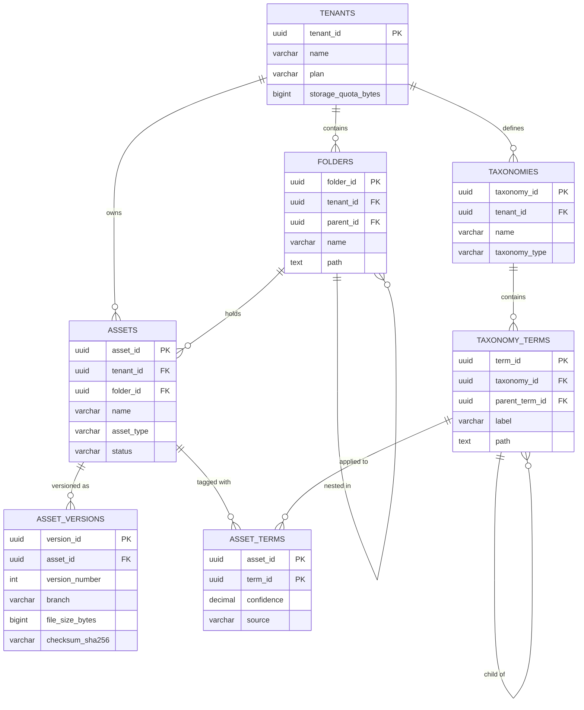
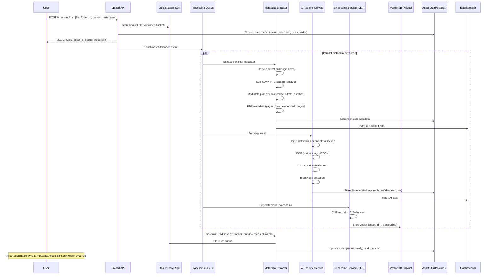
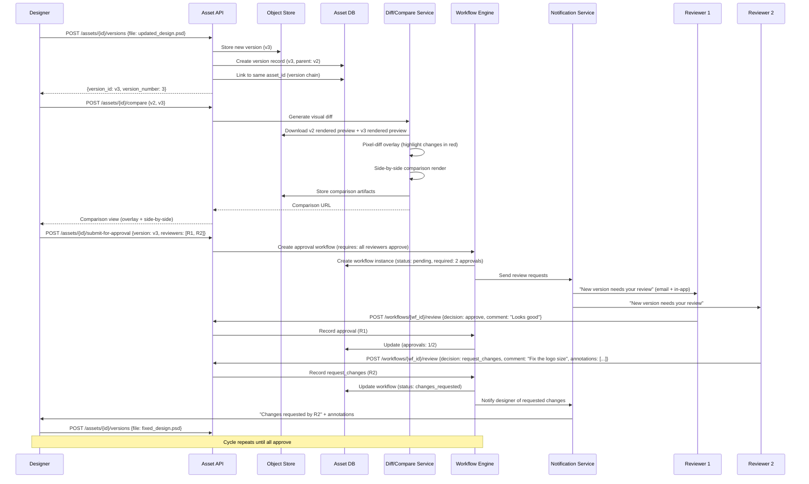
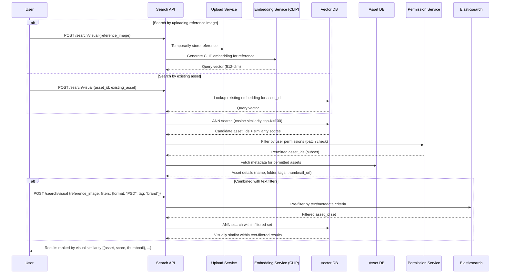

# Digital Asset Management (DAM) Platform - System Design

## 1. Requirements

### 1.1 Functional Requirements
- Upload and store any asset type (images, videos, documents, 3D models, audio, fonts, design files)
- Rich metadata with custom taxonomies (hierarchical tags, controlled vocabularies)
- Version control with branching (main/draft/review branches per asset)
- Role-based access control (viewer/editor/admin per folder/collection/asset)
- Advanced search: visual similarity, faceted metadata, full-text in documents
- Format conversion on-the-fly (image resize, video transcode, document PDF)
- Approval workflows (submit → review → approve/reject with comments)
- CDN distribution with signed URLs and geo-restrictions
- Usage analytics (downloads, views, embeds, license tracking)

### 1.2 Non-Functional Requirements
- 99.99% availability (52 min downtime/year)
- Upload latency < 5s for 100MB files
- Search response < 200ms at P95
- Support millions of assets per tenant (multi-tenant SaaS)
- Storage efficient: deduplication, tiered storage
- GDPR/CCPA compliant: data residency, right to deletion

---

## 2. Capacity Estimation

### 2.1 Traffic
- 10K tenants, average 500K assets each = 5B total assets
- Peak uploads: 50K/min across all tenants
- Peak searches: 500K/min
- Peak downloads: 200K/min
- Average asset size: 15MB (weighted across types)

### 2.2 Storage
- Total binary storage: 5B × 15MB = 75 PB
- With versions (avg 3 versions): 225 PB raw → with dedup ~150 PB
- Metadata store: 5B assets × 5KB avg metadata = 25 TB in PostgreSQL
- Search index: 5B documents × 2KB = 10 TB in Elasticsearch
- Vector embeddings: 5B × 512 floats × 4 bytes = 10 TB in vector DB
- Thumbnails/previews: 5B × 3 sizes × 50KB = 750 TB

### 2.3 Compute
- Upload processing pipeline: 50K/min × 5 operations = 250K tasks/min
- Search: 500K/min × 10ms avg = ~85 CPU cores sustained
- Image transformation: 200K/min on-the-fly = dedicated fleet
- ML inference (CLIP): 50K/min embeddings = ~50 GPUs

### 2.4 Network
- Upload ingress: 50K/min × 15MB = 12.5 GB/s
- Download egress: 200K/min × 15MB = 50 GB/s (CDN offloads 95%)
- Inter-service: ~5 GB/s

---

## 3. Data Modeling

### Entity-Relationship Diagram



### 3.1 PostgreSQL - Core Metadata

```sql
-- Tenants
CREATE TABLE tenants (
    tenant_id       UUID PRIMARY KEY DEFAULT gen_random_uuid(),
    name            VARCHAR(255) NOT NULL,
    plan            VARCHAR(50) NOT NULL DEFAULT 'standard',
    storage_quota_bytes BIGINT NOT NULL DEFAULT 1099511627776, -- 1TB default
    storage_used_bytes BIGINT NOT NULL DEFAULT 0,
    settings        JSONB DEFAULT '{}',
    created_at      TIMESTAMPTZ NOT NULL DEFAULT NOW(),
    updated_at      TIMESTAMPTZ NOT NULL DEFAULT NOW()
);

-- Assets (core entity)
CREATE TABLE assets (
    asset_id        UUID PRIMARY KEY DEFAULT gen_random_uuid(),
    tenant_id       UUID NOT NULL REFERENCES tenants(tenant_id),
    folder_id       UUID REFERENCES folders(folder_id),
    name            VARCHAR(500) NOT NULL,
    slug            VARCHAR(500) NOT NULL,
    asset_type      VARCHAR(50) NOT NULL, -- image, video, document, audio, 3d, font, design
    mime_type       VARCHAR(255) NOT NULL,
    status          VARCHAR(30) NOT NULL DEFAULT 'processing',
    -- processing, active, archived, deleted
    current_version_id UUID, -- points to latest approved version
    created_by      UUID NOT NULL,
    created_at      TIMESTAMPTZ NOT NULL DEFAULT NOW(),
    updated_at      TIMESTAMPTZ NOT NULL DEFAULT NOW(),
    deleted_at      TIMESTAMPTZ, -- soft delete
    UNIQUE(tenant_id, folder_id, slug)
);

CREATE INDEX idx_assets_tenant ON assets(tenant_id, status) WHERE deleted_at IS NULL;
CREATE INDEX idx_assets_folder ON assets(folder_id, name) WHERE deleted_at IS NULL;
CREATE INDEX idx_assets_type ON assets(tenant_id, asset_type, created_at DESC);
CREATE INDEX idx_assets_created ON assets(tenant_id, created_at DESC);

-- Asset versions (immutable once created)
CREATE TABLE asset_versions (
    version_id      UUID PRIMARY KEY DEFAULT gen_random_uuid(),
    asset_id        UUID NOT NULL REFERENCES assets(asset_id),
    tenant_id       UUID NOT NULL,
    version_number  INTEGER NOT NULL,
    branch          VARCHAR(100) NOT NULL DEFAULT 'main',
    parent_version_id UUID REFERENCES asset_versions(version_id),
    storage_key     VARCHAR(1024) NOT NULL, -- S3 key
    file_size_bytes BIGINT NOT NULL,
    checksum_sha256 VARCHAR(64) NOT NULL,
    width           INTEGER, -- for images/video
    height          INTEGER,
    duration_ms     BIGINT, -- for video/audio
    color_space     VARCHAR(50),
    dpi             INTEGER,
    pages           INTEGER, -- for documents
    metadata_extracted JSONB DEFAULT '{}', -- EXIF, XMP, IPTC
    ai_tags         JSONB DEFAULT '[]', -- auto-generated tags
    embedding_id    VARCHAR(100), -- reference to vector DB
    created_by      UUID NOT NULL,
    created_at      TIMESTAMPTZ NOT NULL DEFAULT NOW(),
    comment         TEXT,
    UNIQUE(asset_id, branch, version_number)
);

CREATE INDEX idx_versions_asset ON asset_versions(asset_id, branch, version_number DESC);
CREATE INDEX idx_versions_checksum ON asset_versions(checksum_sha256);

-- Folders (hierarchical via ltree or materialized path)
CREATE TABLE folders (
    folder_id       UUID PRIMARY KEY DEFAULT gen_random_uuid(),
    tenant_id       UUID NOT NULL REFERENCES tenants(tenant_id),
    parent_id       UUID REFERENCES folders(folder_id),
    name            VARCHAR(255) NOT NULL,
    path            TEXT NOT NULL, -- materialized path: /root/marketing/campaigns/
    depth           INTEGER NOT NULL DEFAULT 0,
    asset_count     INTEGER NOT NULL DEFAULT 0,
    created_by      UUID NOT NULL,
    created_at      TIMESTAMPTZ NOT NULL DEFAULT NOW(),
    UNIQUE(tenant_id, path)
);

CREATE INDEX idx_folders_parent ON folders(tenant_id, parent_id);
CREATE INDEX idx_folders_path ON folders(tenant_id, path text_pattern_ops);

-- Custom taxonomy definitions
CREATE TABLE taxonomies (
    taxonomy_id     UUID PRIMARY KEY DEFAULT gen_random_uuid(),
    tenant_id       UUID NOT NULL,
    name            VARCHAR(255) NOT NULL,
    taxonomy_type   VARCHAR(50) NOT NULL, -- hierarchical, flat, controlled
    settings        JSONB DEFAULT '{}',
    created_at      TIMESTAMPTZ NOT NULL DEFAULT NOW(),
    UNIQUE(tenant_id, name)
);

CREATE TABLE taxonomy_terms (
    term_id         UUID PRIMARY KEY DEFAULT gen_random_uuid(),
    taxonomy_id     UUID NOT NULL REFERENCES taxonomies(taxonomy_id),
    parent_term_id  UUID REFERENCES taxonomy_terms(term_id),
    label           VARCHAR(255) NOT NULL,
    slug            VARCHAR(255) NOT NULL,
    path            TEXT NOT NULL, -- /brand/sub-brand/product
    metadata        JSONB DEFAULT '{}',
    UNIQUE(taxonomy_id, path)
);

-- Asset-taxonomy associations
CREATE TABLE asset_terms (
    asset_id        UUID NOT NULL REFERENCES assets(asset_id),
    term_id         UUID NOT NULL REFERENCES taxonomy_terms(term_id),
    confidence      DECIMAL(4,3) DEFAULT 1.0, -- 1.0 for manual, <1 for AI
    source          VARCHAR(20) DEFAULT 'manual', -- manual, ai_auto, ai_suggested
    created_at      TIMESTAMPTZ DEFAULT NOW(),
    PRIMARY KEY (asset_id, term_id)
);

CREATE INDEX idx_asset_terms_term ON asset_terms(term_id);

-- Permissions (RBAC)
CREATE TABLE permissions (
    permission_id   UUID PRIMARY KEY DEFAULT gen_random_uuid(),
    tenant_id       UUID NOT NULL,
    principal_type  VARCHAR(20) NOT NULL, -- user, group, role
    principal_id    UUID NOT NULL,
    resource_type   VARCHAR(20) NOT NULL, -- asset, folder, collection
    resource_id     UUID NOT NULL,
    access_level    VARCHAR(20) NOT NULL, -- view, download, edit, admin
    inherited       BOOLEAN DEFAULT FALSE,
    granted_by      UUID NOT NULL,
    created_at      TIMESTAMPTZ DEFAULT NOW(),
    expires_at      TIMESTAMPTZ,
    UNIQUE(principal_type, principal_id, resource_type, resource_id)
);

CREATE INDEX idx_permissions_resource ON permissions(resource_type, resource_id);
CREATE INDEX idx_permissions_principal ON permissions(principal_type, principal_id);

-- Approval workflows
CREATE TABLE approval_workflows (
    workflow_id     UUID PRIMARY KEY DEFAULT gen_random_uuid(),
    tenant_id       UUID NOT NULL,
    name            VARCHAR(255) NOT NULL,
    stages          JSONB NOT NULL, -- [{name, approvers: [], require_all: bool}]
    auto_publish    BOOLEAN DEFAULT FALSE,
    created_at      TIMESTAMPTZ DEFAULT NOW()
);

CREATE TABLE approval_requests (
    request_id      UUID PRIMARY KEY DEFAULT gen_random_uuid(),
    workflow_id     UUID NOT NULL REFERENCES approval_workflows(workflow_id),
    asset_id        UUID NOT NULL REFERENCES assets(asset_id),
    version_id      UUID NOT NULL REFERENCES asset_versions(version_id),
    current_stage   INTEGER NOT NULL DEFAULT 0,
    status          VARCHAR(20) NOT NULL DEFAULT 'pending',
    -- pending, in_review, approved, rejected, cancelled
    submitted_by    UUID NOT NULL,
    submitted_at    TIMESTAMPTZ DEFAULT NOW(),
    resolved_at     TIMESTAMPTZ,
    comments        JSONB DEFAULT '[]'
);

CREATE INDEX idx_approvals_status ON approval_requests(status, submitted_at);

-- Usage analytics (partitioned by month)
CREATE TABLE asset_events (
    event_id        UUID DEFAULT gen_random_uuid(),
    tenant_id       UUID NOT NULL,
    asset_id        UUID NOT NULL,
    version_id      UUID,
    event_type      VARCHAR(30) NOT NULL, -- view, download, embed, share, transform
    user_id         UUID,
    ip_address      INET,
    user_agent      TEXT,
    metadata        JSONB DEFAULT '{}',
    created_at      TIMESTAMPTZ NOT NULL DEFAULT NOW()
) PARTITION BY RANGE (created_at);

CREATE INDEX idx_events_asset ON asset_events(asset_id, created_at DESC);
CREATE INDEX idx_events_tenant ON asset_events(tenant_id, event_type, created_at DESC);
```

### 3.2 Elasticsearch - Search Index

```json
{
  "mappings": {
    "properties": {
      "asset_id": {"type": "keyword"},
      "tenant_id": {"type": "keyword"},
      "name": {"type": "text", "analyzer": "standard", "fields": {"keyword": {"type": "keyword"}}},
      "description": {"type": "text", "analyzer": "standard"},
      "asset_type": {"type": "keyword"},
      "mime_type": {"type": "keyword"},
      "file_extension": {"type": "keyword"},
      "folder_path": {"type": "keyword"},
      "tags": {"type": "keyword"},
      "taxonomy_terms": {
        "type": "nested",
        "properties": {
          "taxonomy": {"type": "keyword"},
          "term_path": {"type": "keyword"},
          "label": {"type": "text"}
        }
      },
      "metadata": {
        "properties": {
          "camera_make": {"type": "keyword"},
          "camera_model": {"type": "keyword"},
          "lens": {"type": "keyword"},
          "focal_length": {"type": "float"},
          "iso": {"type": "integer"},
          "aperture": {"type": "float"},
          "color_profile": {"type": "keyword"},
          "orientation": {"type": "keyword"}
        }
      },
      "dimensions": {
        "properties": {
          "width": {"type": "integer"},
          "height": {"type": "integer"},
          "aspect_ratio": {"type": "float"}
        }
      },
      "file_size_bytes": {"type": "long"},
      "duration_ms": {"type": "long"},
      "colors_dominant": {"type": "keyword"},
      "ai_labels": {"type": "keyword"},
      "ai_description": {"type": "text"},
      "ocr_text": {"type": "text", "analyzer": "standard"},
      "created_at": {"type": "date"},
      "updated_at": {"type": "date"},
      "created_by": {"type": "keyword"},
      "status": {"type": "keyword"}
    }
  },
  "settings": {
    "number_of_shards": 20,
    "number_of_replicas": 2,
    "index.mapping.nested_fields.limit": 50,
    "analysis": {
      "analyzer": {
        "filename_analyzer": {
          "type": "custom",
          "tokenizer": "standard",
          "filter": ["lowercase", "word_delimiter_graph"]
        }
      }
    }
  }
}
```

### 3.3 Vector DB (Milvus/FAISS) - Visual Similarity

```python
# Collection schema for CLIP embeddings
collection_schema = {
    "collection_name": "asset_embeddings",
    "fields": [
        {"name": "embedding_id", "type": "VARCHAR", "max_length": 100, "is_primary": True},
        {"name": "asset_id", "type": "VARCHAR", "max_length": 36},
        {"name": "tenant_id", "type": "VARCHAR", "max_length": 36},
        {"name": "version_id", "type": "VARCHAR", "max_length": 36},
        {"name": "asset_type", "type": "VARCHAR", "max_length": 20},
        {"name": "embedding", "type": "FLOAT_VECTOR", "dim": 512},  # CLIP ViT-B/32
    ],
    "index": {
        "field_name": "embedding",
        "index_type": "IVF_PQ",  # Inverted File with Product Quantization
        "metric_type": "COSINE",
        "params": {"nlist": 4096, "m": 64, "nbits": 8}
    },
    "partition_key": "tenant_id"  # Tenant isolation
}
```

---

## 4. High-Level Design

```
┌─────────────────────────────────────────────────────────────────────────────────┐
│                              CLIENTS                                             │
│         Web App │ Desktop Sync │ Mobile │ API Integrations │ Plugins            │
└───────┬──────────────────┬───────────────────────┬──────────────────────────────┘
        │                  │                       │
        ▼                  ▼                       ▼
┌─────────────────────────────────────────────────────────────────────────────────┐
│                       API GATEWAY (Kong)                                         │
│          Auth (JWT/OAuth2) │ Rate Limit │ Tenant Routing │ CORS                 │
└────┬──────────┬──────────────┬───────────────┬──────────────┬───────────────────┘
     │          │              │               │              │
     ▼          ▼              ▼               ▼              ▼
┌─────────┐ ┌─────────┐ ┌──────────┐ ┌────────────┐ ┌─────────────────┐
│ UPLOAD  │ │ SEARCH  │ │ ASSET    │ │ WORKFLOW   │ │ TRANSFORM       │
│ SERVICE │ │ SERVICE │ │ SERVICE  │ │ SERVICE    │ │ SERVICE          │
│         │ │         │ │          │ │            │ │                  │
│-Chunked │ │-ES query│ │-CRUD     │ │-Approvals  │ │-Resize/crop     │
│-Dedup   │ │-Vector  │ │-Versions │ │-Routing    │ │-Format convert  │
│-Virus   │ │ search  │ │-Perms    │ │-Notify     │ │-Watermark       │
│ scan    │ │-Facets  │ │-Share    │ │-Deadlines  │ │-Video transcode │
└────┬────┘ └────┬────┘ └────┬─────┘ └─────┬──────┘ └────────┬────────┘
     │           │            │             │                  │
     │           │            ▼             │                  │
     │           │     ┌────────────┐       │                  │
     │           │     │ PostgreSQL │◄──────┘                  │
     │           │     │ (Primary)  │                          │
     │           │     └────────────┘                          │
     │           │                                             │
     │           ▼                                             │
     │     ┌──────────────┐    ┌──────────────────┐           │
     │     │Elasticsearch │    │  Milvus/FAISS    │           │
     │     │(Search Index)│    │ (Vector Search)  │           │
     │     └──────────────┘    └──────────────────┘           │
     │                                                         │
     ▼                                                         ▼
┌──────────────────────────────────────────────────────────────────────────┐
│                         KAFKA (Event Bus)                                 │
│  Topics: asset.uploaded, asset.processed, metadata.extracted,            │
│          embedding.computed, search.index, transform.request             │
└──────┬──────────────┬──────────────┬──────────────┬──────────────────────┘
       │              │              │              │
       ▼              ▼              ▼              ▼
┌────────────┐ ┌────────────┐ ┌────────────┐ ┌────────────────────┐
│ METADATA   │ │ AI TAGGING │ │ THUMBNAIL  │ │ EMBEDDING          │
│ EXTRACTOR  │ │ SERVICE    │ │ GENERATOR  │ │ SERVICE            │
│            │ │            │ │            │ │                    │
│-EXIF/XMP   │ │-CLIP labels│ │-Image thumbs│ │-CLIP ViT-B/32     │
│-IPTC       │ │-BLIP desc  │ │-Video poster│ │-Store in Milvus   │
│-PDF text   │ │-OCR        │ │-Doc preview │ │-Batch inference    │
│-Video probe│ │-Face detect│ │-3D render   │ │                    │
└────────────┘ └────────────┘ └────────────┘ └────────────────────┘
                                    │
                                    ▼
┌──────────────────────────────────────────────────────────────────────────┐
│                            S3 STORAGE                                     │
│  ┌──────────┐  ┌───────────┐  ┌────────────┐  ┌──────────────────┐     │
│  │ Originals│  │ Thumbnails│  │ Transformed│  │ Temp/Processing  │     │
│  │ (S3 IA)  │  │ (S3 Std)  │  │ (S3 Std)   │  │ (lifecycle:24h) │     │
│  └──────────┘  └───────────┘  └────────────┘  └──────────────────┘     │
└──────────────────────────────────────────────────────────────────────────┘
                                    │
                                    ▼
┌──────────────────────────────────────────────────────────────────────────┐
│                         CDN (CloudFront)                                  │
│            Signed URLs │ Geo-restrict │ Image Optimization               │
└──────────────────────────────────────────────────────────────────────────┘
```

---

## 5. Low-Level Design - APIs

### 5.1 Upload Asset

```
POST /v1/assets/upload
Authorization: Bearer {token}
Content-Type: multipart/form-data

-- For large files, use chunked upload:
POST /v1/assets/upload/initiate
{
  "filename": "brand_hero_4k.psd",
  "file_size": 524288000,
  "mime_type": "image/vnd.adobe.photoshop",
  "folder_id": "f47ac10b-...",
  "metadata": {
    "title": "Brand Hero Image 2024",
    "description": "Main hero image for Q1 campaign",
    "tags": ["brand", "hero", "campaign-q1"],
    "custom_fields": {"project": "summer-launch", "license": "exclusive"}
  },
  "branch": "main",
  "workflow_id": "wf-approval-123"
}

Response 200:
{
  "upload_id": "upl_abc123",
  "asset_id": "a_550e8400-...",
  "parts": [
    {"part_number": 1, "upload_url": "https://s3.../part1?X-Amz-Signature=..."},
    {"part_number": 2, "upload_url": "https://s3.../part2?X-Amz-Signature=..."},
    ...
  ],
  "part_size": 10485760,
  "expires_at": "2024-01-15T11:00:00Z"
}

-- Complete upload after all parts uploaded:
POST /v1/assets/upload/{upload_id}/complete
{
  "parts": [
    {"part_number": 1, "etag": "abc123"},
    {"part_number": 2, "etag": "def456"}
  ]
}

Response 202:
{
  "asset_id": "a_550e8400-...",
  "version_id": "v_660f9500-...",
  "status": "processing",
  "processing_steps": ["virus_scan", "metadata_extract", "thumbnail", "ai_tag", "index"]
}
```

### 5.2 Search Assets

```
POST /v1/assets/search
Authorization: Bearer {token}
Content-Type: application/json

{
  "query": "sunset beach",
  "filters": {
    "asset_type": ["image", "video"],
    "mime_type": ["image/jpeg", "image/png"],
    "created_at": {"gte": "2024-01-01", "lte": "2024-06-30"},
    "dimensions": {"width": {"gte": 1920}},
    "tags": {"all": ["brand"], "any": ["summer", "beach"]},
    "taxonomy": {"category": "/campaigns/summer-2024"},
    "folder_path": "/marketing/*",
    "color_dominant": ["#FF6B35", "#4ECDC4"]
  },
  "sort": [
    {"field": "relevance", "order": "desc"},
    {"field": "created_at", "order": "desc"}
  ],
  "page": {"size": 50, "cursor": "eyJvZmZzZXQiOjUwfQ=="},
  "facets": ["asset_type", "tags", "camera_make", "color_dominant"],
  "include_similar": true,
  "similarity_threshold": 0.85
}

Response 200:
{
  "results": [
    {
      "asset_id": "a_550e8400-...",
      "name": "sunset_beach_hero.jpg",
      "asset_type": "image",
      "thumbnail_url": "https://cdn.example.com/thumb/...",
      "preview_url": "https://cdn.example.com/preview/...",
      "dimensions": {"width": 4000, "height": 2667},
      "file_size_bytes": 8500000,
      "relevance_score": 0.94,
      "highlights": {"description": "Beautiful <em>sunset</em> on tropical <em>beach</em>"},
      "tags": ["sunset", "beach", "tropical", "brand"],
      "created_at": "2024-03-15T10:00:00Z"
    }
  ],
  "facets": {
    "asset_type": [{"value": "image", "count": 234}, {"value": "video", "count": 45}],
    "tags": [{"value": "beach", "count": 180}, {"value": "sunset", "count": 156}]
  },
  "total": 279,
  "cursor": "eyJvZmZzZXQiOjEwMH0="
}
```

### 5.3 Visual Similarity Search

```
POST /v1/assets/search/similar
Authorization: Bearer {token}
Content-Type: application/json

{
  "reference_asset_id": "a_550e8400-...",
  "top_k": 20,
  "threshold": 0.80,
  "filters": {"asset_type": ["image"]}
}

-- OR search by uploaded image:
POST /v1/assets/search/similar
Content-Type: multipart/form-data
image: [binary data]
top_k: 20
```

### 5.4 Get Asset Versions

```
GET /v1/assets/{asset_id}/versions?branch=main
Authorization: Bearer {token}

Response 200:
{
  "asset_id": "a_550e8400-...",
  "branches": ["main", "draft-redesign"],
  "versions": [
    {
      "version_id": "v_003",
      "version_number": 3,
      "branch": "main",
      "parent_version_id": "v_002",
      "file_size_bytes": 8500000,
      "created_by": {"id": "u_123", "name": "Jane Designer"},
      "created_at": "2024-03-15T10:00:00Z",
      "comment": "Updated color grading per brand guidelines",
      "approval_status": "approved",
      "changes": {"dimensions": false, "content": true}
    }
  ]
}
```

### 5.5 Request Transformation

```
GET /v1/assets/{asset_id}/transform?w=800&h=600&format=webp&quality=85&fit=cover
Authorization: Bearer {token}

Response 302: Location: https://cdn.example.com/transform/{hash}.webp

-- Or explicit API:
POST /v1/assets/{asset_id}/convert
{
  "output_format": "png",
  "transformations": [
    {"type": "resize", "width": 1200, "height": 800, "fit": "contain"},
    {"type": "watermark", "text": "PREVIEW", "opacity": 0.3},
    {"type": "color_space", "target": "sRGB"}
  ]
}
```

---

## 6. Deep Dive: Metadata Extraction Pipeline

### 6.1 Pipeline Architecture

```python
import asyncio
from dataclasses import dataclass, field
from typing import Dict, List, Optional
from PIL import Image
from PIL.ExifTags import TAGS, GPSTAGS
import subprocess
import json

@dataclass
class ExtractedMetadata:
    exif: Dict = field(default_factory=dict)
    xmp: Dict = field(default_factory=dict)
    iptc: Dict = field(default_factory=dict)
    technical: Dict = field(default_factory=dict)
    ai_tags: List[Dict] = field(default_factory=list)
    ai_description: str = ""
    ocr_text: str = ""
    faces: List[Dict] = field(default_factory=list)
    colors: List[str] = field(default_factory=list)

class MetadataExtractionPipeline:
    """
    Multi-stage metadata extraction pipeline.
    
    Stage 1: Technical metadata (EXIF, XMP, IPTC) - synchronous, fast
    Stage 2: AI-based tagging (CLIP, BLIP, OCR) - async, GPU
    Stage 3: Custom taxonomy mapping - rule-based + ML
    """
    
    def __init__(self, clip_service, blip_service, ocr_service):
        self.clip = clip_service
        self.blip = blip_service
        self.ocr = ocr_service
    
    async def extract_all(self, asset_path: str, asset_type: str) -> ExtractedMetadata:
        metadata = ExtractedMetadata()
        
        # Stage 1: Technical metadata (always runs)
        if asset_type == 'image':
            metadata.exif = self._extract_exif(asset_path)
            metadata.xmp = self._extract_xmp(asset_path)
            metadata.iptc = self._extract_iptc(asset_path)
            metadata.colors = self._extract_dominant_colors(asset_path)
            metadata.technical = self._extract_image_technical(asset_path)
        elif asset_type == 'video':
            metadata.technical = self._extract_video_technical(asset_path)
        elif asset_type == 'document':
            metadata.technical = self._extract_document_technical(asset_path)
        
        # Stage 2: AI-based extraction (parallel)
        ai_tasks = []
        if asset_type in ('image', 'video'):
            ai_tasks.append(self._ai_tag(asset_path, asset_type))
            ai_tasks.append(self._ai_describe(asset_path))
            ai_tasks.append(self._detect_faces(asset_path))
        if asset_type in ('image', 'document'):
            ai_tasks.append(self._extract_ocr(asset_path))
        
        results = await asyncio.gather(*ai_tasks, return_exceptions=True)
        
        for result in results:
            if isinstance(result, Exception):
                continue  # Log and continue; AI failures are non-fatal
            if 'tags' in result:
                metadata.ai_tags = result['tags']
            elif 'description' in result:
                metadata.ai_description = result['description']
            elif 'faces' in result:
                metadata.faces = result['faces']
            elif 'text' in result:
                metadata.ocr_text = result['text']
        
        return metadata
    
    def _extract_exif(self, path: str) -> Dict:
        """Extract EXIF data from images."""
        try:
            img = Image.open(path)
            exif_data = img._getexif()
            if not exif_data:
                return {}
            
            parsed = {}
            for tag_id, value in exif_data.items():
                tag_name = TAGS.get(tag_id, str(tag_id))
                # Handle GPS data specially
                if tag_name == 'GPSInfo':
                    gps = {}
                    for gps_tag_id, gps_value in value.items():
                        gps_tag_name = GPSTAGS.get(gps_tag_id, str(gps_tag_id))
                        gps[gps_tag_name] = str(gps_value)
                    parsed['gps'] = gps
                else:
                    parsed[tag_name] = str(value)[:500]  # Limit value length
            
            return parsed
        except Exception:
            return {}
    
    def _extract_xmp(self, path: str) -> Dict:
        """Extract XMP metadata using exiftool."""
        cmd = ['exiftool', '-json', '-xmp:all', path]
        result = subprocess.run(cmd, capture_output=True, text=True)
        if result.returncode == 0:
            data = json.loads(result.stdout)
            return data[0] if data else {}
        return {}
    
    def _extract_iptc(self, path: str) -> Dict:
        """Extract IPTC metadata."""
        cmd = ['exiftool', '-json', '-iptc:all', path]
        result = subprocess.run(cmd, capture_output=True, text=True)
        if result.returncode == 0:
            data = json.loads(result.stdout)
            return data[0] if data else {}
        return {}
    
    def _extract_dominant_colors(self, path: str, n_colors: int = 5) -> List[str]:
        """Extract dominant colors using k-means clustering."""
        from sklearn.cluster import KMeans
        import numpy as np
        
        img = Image.open(path).resize((150, 150)).convert('RGB')
        pixels = np.array(img).reshape(-1, 3)
        
        kmeans = KMeans(n_clusters=n_colors, random_state=42, n_init=10)
        kmeans.fit(pixels)
        
        colors = []
        for center in kmeans.cluster_centers_:
            hex_color = '#{:02x}{:02x}{:02x}'.format(int(center[0]), int(center[1]), int(center[2]))
            colors.append(hex_color)
        
        return colors
    
    async def _ai_tag(self, path: str, asset_type: str) -> Dict:
        """Generate tags using CLIP zero-shot classification."""
        # Predefined label candidates (expanded per tenant taxonomy)
        candidates = [
            "landscape", "portrait", "product", "food", "architecture",
            "nature", "technology", "sports", "fashion", "travel",
            "indoor", "outdoor", "people", "animal", "abstract",
            "diagram", "chart", "screenshot", "logo", "text-heavy"
        ]
        
        scores = await self.clip.classify(path, candidates)
        
        tags = [{"label": label, "confidence": score} 
                for label, score in zip(candidates, scores) 
                if score > 0.25]
        tags.sort(key=lambda t: t['confidence'], reverse=True)
        
        return {"tags": tags[:15]}  # Top 15 tags
    
    async def _ai_describe(self, path: str) -> Dict:
        """Generate natural language description using BLIP-2."""
        description = await self.blip.caption(path)
        return {"description": description}


class TaxonomyMapper:
    """Maps AI-generated tags to tenant-specific taxonomy terms."""
    
    def __init__(self, tenant_id: str, db_session):
        self.tenant_id = tenant_id
        self.db = db_session
        self._rules = None
    
    async def map_to_taxonomy(self, ai_tags: List[Dict], 
                              metadata: Dict) -> List[Dict]:
        """
        Map extracted metadata/tags to taxonomy terms.
        
        Uses:
        1. Direct mapping rules (tag "sunset" → /nature/sky/sunset)
        2. EXIF-based rules (camera Canon → /equipment/canon)
        3. ML-based fuzzy matching for unmapped tags
        """
        rules = await self._load_rules()
        mapped_terms = []
        
        for tag in ai_tags:
            label = tag['label'].lower()
            confidence = tag['confidence']
            
            # Direct rule match
            if label in rules['direct']:
                term_path = rules['direct'][label]
                mapped_terms.append({
                    'term_path': term_path,
                    'confidence': confidence,
                    'source': 'ai_auto'
                })
            
            # Fuzzy match against taxonomy terms
            elif confidence > 0.7:
                best_match = await self._fuzzy_match(label)
                if best_match and best_match['score'] > 0.8:
                    mapped_terms.append({
                        'term_path': best_match['path'],
                        'confidence': confidence * best_match['score'],
                        'source': 'ai_suggested'
                    })
        
        return mapped_terms
```

---

## 7. Deep Dive: Visual Similarity Search

### 7.1 CLIP Embedding Pipeline

```python
import torch
import clip
import numpy as np
from PIL import Image
from typing import List, Tuple
from milvus import MilvusClient

class VisualSimilarityService:
    """
    Visual similarity search using CLIP embeddings + Milvus ANN.
    
    Architecture:
    1. On upload: compute CLIP embedding → store in Milvus
    2. On search: compute query embedding → ANN search in Milvus
    3. Post-filter by tenant permissions and metadata filters
    """
    
    def __init__(self):
        self.device = "cuda" if torch.cuda.is_available() else "cpu"
        self.model, self.preprocess = clip.load("ViT-B/32", device=self.device)
        self.milvus = MilvusClient(uri="milvus-cluster:19530")
        self.COLLECTION = "asset_embeddings"
        self.EMBEDDING_DIM = 512
    
    def compute_embedding(self, image_path: str) -> np.ndarray:
        """Compute CLIP embedding for an image."""
        image = self.preprocess(Image.open(image_path)).unsqueeze(0).to(self.device)
        
        with torch.no_grad():
            embedding = self.model.encode_image(image)
            # L2 normalize for cosine similarity
            embedding = embedding / embedding.norm(dim=-1, keepdim=True)
        
        return embedding.cpu().numpy().flatten()
    
    def compute_text_embedding(self, text: str) -> np.ndarray:
        """Compute CLIP embedding for text query (cross-modal search)."""
        tokens = clip.tokenize([text]).to(self.device)
        
        with torch.no_grad():
            embedding = self.model.encode_text(tokens)
            embedding = embedding / embedding.norm(dim=-1, keepdim=True)
        
        return embedding.cpu().numpy().flatten()
    
    async def index_asset(self, asset_id: str, tenant_id: str, 
                          version_id: str, image_path: str):
        """Index an asset's visual embedding."""
        embedding = self.compute_embedding(image_path)
        
        self.milvus.insert(
            collection_name=self.COLLECTION,
            data=[{
                "embedding_id": f"{asset_id}_{version_id}",
                "asset_id": asset_id,
                "tenant_id": tenant_id,
                "version_id": version_id,
                "asset_type": "image",
                "embedding": embedding.tolist()
            }]
        )
    
    async def search_similar(self, tenant_id: str, query_embedding: np.ndarray,
                            top_k: int = 20, threshold: float = 0.8,
                            asset_type_filter: List[str] = None) -> List[dict]:
        """
        Search for visually similar assets using ANN.
        
        Uses IVF_PQ index for sub-linear search time.
        Tenant isolation via partition key.
        """
        # Build filter expression
        filter_expr = f'tenant_id == "{tenant_id}"'
        if asset_type_filter:
            types = ', '.join(f'"{t}"' for t in asset_type_filter)
            filter_expr += f' and asset_type in [{types}]'
        
        results = self.milvus.search(
            collection_name=self.COLLECTION,
            data=[query_embedding.tolist()],
            filter=filter_expr,
            limit=top_k,
            output_fields=["asset_id", "version_id", "asset_type"],
            search_params={
                "metric_type": "COSINE",
                "params": {"nprobe": 64}  # Trade-off: more probes = better recall, slower
            }
        )
        
        # Filter by threshold and return
        similar = []
        for hit in results[0]:
            if hit['distance'] >= threshold:
                similar.append({
                    'asset_id': hit['entity']['asset_id'],
                    'version_id': hit['entity']['version_id'],
                    'similarity': round(hit['distance'], 4)
                })
        
        return similar
    
    async def search_by_text(self, tenant_id: str, text_query: str,
                            top_k: int = 20) -> List[dict]:
        """Cross-modal search: find images matching text description."""
        text_embedding = self.compute_text_embedding(text_query)
        return await self.search_similar(tenant_id, text_embedding, top_k, threshold=0.2)
    
    async def deduplicate(self, tenant_id: str, image_path: str,
                         threshold: float = 0.98) -> List[dict]:
        """Find near-duplicate assets (for deduplication on upload)."""
        embedding = self.compute_embedding(image_path)
        duplicates = await self.search_similar(tenant_id, embedding, top_k=5, threshold=threshold)
        return duplicates


class EmbeddingBatchProcessor:
    """Batch process embeddings for bulk uploads or re-indexing."""
    
    def __init__(self, similarity_service: VisualSimilarityService, batch_size: int = 64):
        self.service = similarity_service
        self.batch_size = batch_size
    
    async def process_batch(self, assets: List[dict]):
        """Process a batch of assets for embedding computation."""
        images = []
        valid_assets = []
        
        for asset in assets:
            try:
                img = Image.open(asset['path'])
                processed = self.service.preprocess(img).unsqueeze(0)
                images.append(processed)
                valid_assets.append(asset)
            except Exception:
                continue
        
        if not images:
            return
        
        # Batch inference on GPU
        batch_tensor = torch.cat(images).to(self.service.device)
        
        with torch.no_grad():
            embeddings = self.service.model.encode_image(batch_tensor)
            embeddings = embeddings / embeddings.norm(dim=-1, keepdim=True)
        
        # Batch insert to Milvus
        data = []
        for i, asset in enumerate(valid_assets):
            data.append({
                "embedding_id": f"{asset['asset_id']}_{asset['version_id']}",
                "asset_id": asset['asset_id'],
                "tenant_id": asset['tenant_id'],
                "version_id": asset['version_id'],
                "asset_type": asset['asset_type'],
                "embedding": embeddings[i].cpu().numpy().tolist()
            })
        
        self.service.milvus.insert(
            collection_name=self.service.COLLECTION,
            data=data
        )
```

---

## 8. Component Optimization

### 8.1 Chunked Upload with Resume

```python
class ChunkedUploadService:
    """Server-side chunked upload with resume capability."""
    
    CHUNK_SIZE = 10 * 1024 * 1024  # 10MB chunks
    
    def __init__(self, s3_client, redis_client):
        self.s3 = s3_client
        self.redis = redis_client
    
    async def initiate(self, tenant_id: str, filename: str, 
                       file_size: int, mime_type: str) -> dict:
        """Initiate chunked upload, return presigned URLs for each part."""
        upload_id = str(uuid.uuid4())
        num_parts = math.ceil(file_size / self.CHUNK_SIZE)
        
        # Create S3 multipart upload
        key = f"uploads/{tenant_id}/{upload_id}/{filename}"
        mpu = self.s3.create_multipart_upload(Bucket='assets-raw', Key=key)
        
        # Generate presigned URLs for each part
        parts = []
        for i in range(1, num_parts + 1):
            url = self.s3.generate_presigned_url(
                'upload_part',
                Params={'Bucket': 'assets-raw', 'Key': key,
                        'UploadId': mpu['UploadId'], 'PartNumber': i},
                ExpiresIn=3600
            )
            parts.append({'part_number': i, 'upload_url': url})
        
        # Store upload state in Redis for resume
        self.redis.hset(f'upload:{upload_id}', mapping={
            'tenant_id': tenant_id,
            'filename': filename,
            'file_size': file_size,
            'num_parts': num_parts,
            's3_key': key,
            's3_upload_id': mpu['UploadId'],
            'parts_completed': '[]',
            'status': 'in_progress'
        })
        self.redis.expire(f'upload:{upload_id}', 86400)  # 24h TTL
        
        return {'upload_id': upload_id, 'parts': parts, 'part_size': self.CHUNK_SIZE}
    
    async def complete(self, upload_id: str, parts: List[dict]) -> dict:
        """Complete upload after all parts received."""
        state = self.redis.hgetall(f'upload:{upload_id}')
        
        # Complete S3 multipart
        self.s3.complete_multipart_upload(
            Bucket='assets-raw',
            Key=state['s3_key'],
            UploadId=state['s3_upload_id'],
            MultipartUpload={'Parts': parts}
        )
        
        # Compute SHA-256 for deduplication
        checksum = await self._compute_checksum(state['s3_key'])
        
        # Check for duplicates
        existing = await self._check_duplicate(state['tenant_id'], checksum)
        if existing:
            return {'deduplicated': True, 'existing_asset_id': existing}
        
        # Trigger processing pipeline via Kafka
        await self._emit_uploaded_event(upload_id, state)
        
        return {'status': 'processing', 'upload_id': upload_id}
```

### 8.2 CDN with Signed URLs and Transformations

```python
class CDNService:
    """Manage CDN distribution with signed URLs and on-the-fly transforms."""
    
    def __init__(self, cloudfront_key_pair_id: str, private_key: str):
        self.key_pair_id = cloudfront_key_pair_id
        self.private_key = private_key
        self.distribution_domain = "assets.cdn.example.com"
    
    def generate_signed_url(self, asset_path: str, tenant_id: str,
                           expires_in: int = 3600,
                           transform: dict = None) -> str:
        """Generate CloudFront signed URL with optional transformation params."""
        # Build path with transformation parameters
        if transform:
            params = self._encode_transform(transform)
            url_path = f"/transform/{tenant_id}/{asset_path}?{params}"
        else:
            url_path = f"/assets/{tenant_id}/{asset_path}"
        
        url = f"https://{self.distribution_domain}{url_path}"
        
        # Sign with CloudFront key
        expire_time = datetime.utcnow() + timedelta(seconds=expires_in)
        signed_url = self._sign_url(url, expire_time)
        
        return signed_url
    
    def _encode_transform(self, transform: dict) -> str:
        """Encode transformation as URL params (Imgproxy-compatible)."""
        parts = []
        if 'width' in transform:
            parts.append(f"w={transform['width']}")
        if 'height' in transform:
            parts.append(f"h={transform['height']}")
        if 'format' in transform:
            parts.append(f"f={transform['format']}")
        if 'quality' in transform:
            parts.append(f"q={transform['quality']}")
        if 'fit' in transform:
            parts.append(f"fit={transform['fit']}")
        return '&'.join(parts)
```

### 8.3 Kafka Topic Configuration

```properties
# Asset processing pipeline
topic.asset.uploaded.partitions=64
topic.asset.uploaded.replication.factor=3
topic.asset.uploaded.retention.ms=86400000

topic.metadata.extracted.partitions=32
topic.metadata.extracted.replication.factor=3

topic.embedding.computed.partitions=32
topic.search.index.partitions=64
topic.transform.request.partitions=32

# Consumer groups
group.metadata-extractor.max.poll.records=10
group.ai-tagger.max.poll.records=4
group.embedding-service.max.poll.records=16
group.search-indexer.max.poll.records=100
```

---

## 9. Observability

```yaml
metrics:
  - name: dam_uploads_total
    type: counter
    labels: [tenant_id, asset_type, status]
  
  - name: dam_upload_duration_seconds
    type: histogram
    labels: [file_size_bucket]
    buckets: [1, 2, 5, 10, 30, 60]
  
  - name: dam_search_latency_ms
    type: histogram
    labels: [search_type]  # text, faceted, similar
    buckets: [10, 25, 50, 100, 200, 500, 1000]
  
  - name: dam_processing_pipeline_duration_seconds
    type: histogram
    labels: [stage]  # virus_scan, metadata, thumbnail, ai_tag, embed, index
  
  - name: dam_storage_bytes
    type: gauge
    labels: [tenant_id, storage_class]
  
  - name: dam_similarity_search_recall
    type: gauge  # Measured via golden set queries

alerts:
  - name: SearchLatencyHigh
    expr: histogram_quantile(0.95, dam_search_latency_ms) > 200
    for: 5m
    severity: warning
  
  - name: ProcessingBacklog
    expr: kafka_consumer_lag{group="metadata-extractor"} > 10000
    for: 10m
    severity: critical
```

---

## 10. Considerations & Trade-offs

| Decision | Choice | Trade-off |
|----------|--------|-----------|
| Vector DB | Milvus over Pinecone | Self-hosted = more control, higher ops burden |
| Search | Elasticsearch + Milvus hybrid | Two systems to maintain but best-in-class for each |
| Storage | S3 with Intelligent Tiering | Slight retrieval delay for cold assets vs always-hot |
| Thumbnail generation | Async pipeline | Not instant but scales independently |
| AI tagging | CLIP + BLIP ensemble | Higher accuracy but GPU cost; graceful degradation if unavailable |
| Multi-tenancy | Shared DB + partition keys | Cost efficient; noisy neighbor risk mitigated by rate limits |
| Version storage | Full copies (not deltas) | Storage cost higher but instant retrieval, no reconstruction |
| Permissions | Checked at query time | Slight latency impact but always consistent |

### Failure Modes
- **AI service down**: Assets still uploaded/searchable; AI tags computed later via retry
- **Milvus unavailable**: Visual similarity disabled; text/metadata search still works
- **S3 regional failure**: Cross-region replication for originals; CDN serves from cache
- **Elasticsearch lag**: New assets have delayed searchability; bounded by consumer lag alert

---

## Sequence Diagrams

### 1. Asset Upload + Metadata Extraction



### 2. Version Comparison + Approval Workflow



### 3. Search by Visual Similarity



---

### Caching Strategy

**Multi-Layer Caching Architecture**:

| Layer | Technology | TTL | Use Case |
|-------|-----------|-----|----------|
| CDN Edge | CloudFront/Fastly | 24h | Thumbnails, previews, public shared links |
| Application Cache | Redis Cluster | 5-30min | Asset metadata, folder trees, search results |
| Embedding Cache | Local LRU (worker) | 1h | Hot embeddings for repeated similarity searches |
| Permission Cache | Redis | 2min | ACL results (short TTL for freshness) |
| Search Result Cache | Redis | 60s | Identical query deduplication |

**Cache Invalidation Patterns**:
- Asset update/new version → invalidate asset metadata + thumbnail CDN cache
- Permission change → invalidate all ACL cache entries for affected users
- New asset indexed → invalidate folder listing cache + relevant search caches
- Write-through for metadata; write-behind for search index updates

**Hot Asset Optimization**:
- Assets accessed >100 times/hour automatically promoted to hot tier
- Hot tier: pre-warmed CDN, pinned Redis entries, pre-computed renditions at all sizes
- Brand assets (logos, templates) permanently pinned in cache

**Cache Warming**:
- On workspace login: pre-fetch user's recent assets + starred items into Redis
- On folder navigation: prefetch sibling assets and first-level children
- Background job: warm cache for Monday morning (most common access patterns)
