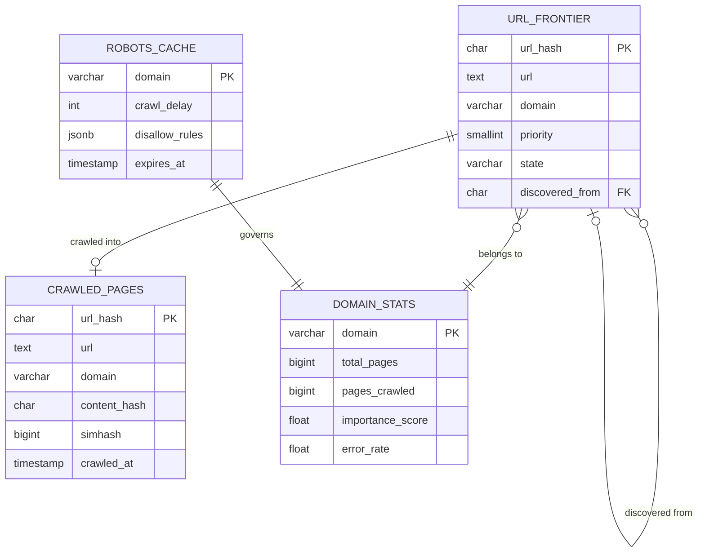
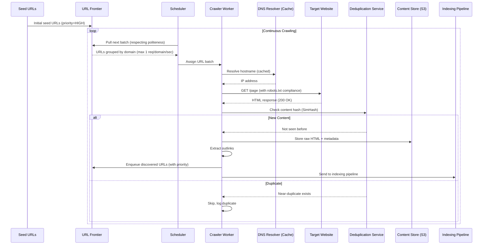
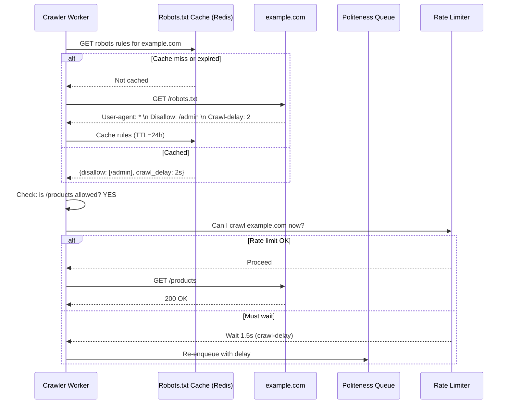
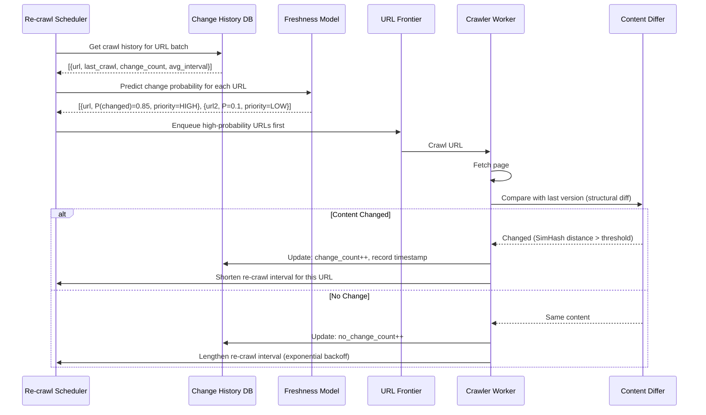

# Web Crawler System Design

## 1. Problem Statement

Design a distributed web crawler that discovers, fetches, and processes 10 billion web pages per month. The system must respect robots.txt, handle politeness constraints, detect near-duplicate content, prioritize important pages, and support incremental re-crawling with change detection.

---

## 2. Functional Requirements

| ID | Requirement | Description |
|----|-------------|-------------|
| FR1 | URL Discovery | Extract and follow hyperlinks from crawled pages |
| FR2 | Robots.txt | Respect robots.txt directives and crawl-delay |
| FR3 | Priority Scheduling | Crawl important/popular pages more frequently |
| FR4 | Content Fetching | Download HTML, PDF, images with proper HTTP handling |
| FR5 | Deduplication | Detect duplicate and near-duplicate content |
| FR6 | Incremental Crawl | Re-crawl pages based on change frequency |
| FR7 | Change Detection | Identify what changed between crawls |
| FR8 | URL Normalization | Canonicalize URLs to avoid redundant crawls |
| FR9 | Trap Detection | Detect and avoid crawler traps (infinite URLs) |
| FR10 | Multi-format | Handle HTML, PDF, DOC, images, video metadata |

## 3. Non-Functional Requirements

| ID | Requirement | Target |
|----|-------------|--------|
| NFR1 | Throughput | 10 billion pages/month (~3,800 pages/second) |
| NFR2 | Politeness | Max 1 request/second per domain by default |
| NFR3 | Scalability | Horizontally scale crawl workers |
| NFR4 | Fault Tolerance | Resume from failure without re-crawling |
| NFR5 | Freshness | Top 1M sites re-crawled within 1 hour |
| NFR6 | Storage | Efficiently store page content + metadata |
| NFR7 | Bandwidth | Optimize with compression, conditional GETs |
| NFR8 | Legality | Comply with robots.txt, copyright, rate limits |

---

## 4. Capacity Estimation

### Throughput
```
Target:                    10 billion pages/month
Pages per day:             10B / 30 = 333 million
Pages per second:          333M / 86400 ≈ 3,858 pages/second
With parallelism:          ~4000 concurrent HTTP connections
Average page fetch time:   500ms (including DNS + TCP + download)
Workers needed:            4000 pages/s × 0.5s = 2000 concurrent fetches
```

### Storage
```
Average page size:         100KB (raw HTML)
Compressed page size:      20KB (gzip ~5:1 ratio)
Monthly raw data:          10B × 100KB = 1 PB (raw)
Monthly compressed:        10B × 20KB = 200 TB
Metadata per page:         500 bytes (URL, timestamps, hashes, headers)
Metadata store:            10B × 500 bytes = 5 TB
URL frontier size:         50 billion URLs × 100 bytes = 5 TB
Content fingerprints:      10B × 16 bytes (128-bit hash) = 160 GB
```

### Bandwidth
```
Download bandwidth:        3858 pages/s × 100KB = 386 MB/s ≈ 3.1 Gbps
DNS queries:               ~2000/s (after caching, ~50% cache hit)
robots.txt fetches:        ~100/s (cached per domain for 24h)
```

### Infrastructure
```
Crawler workers:           500 machines (8 concurrent fetches each)
URL frontier (Redis/DB):   20 nodes
DNS resolver cache:        10 nodes
Content store (HDFS/S3):   Distributed, ~200 TB/month
Dedup service:             50 nodes (in-memory fingerprint store)
```

---

## 5. Data Modeling

### Entity-Relationship Diagram



### URL Entry (Frontier)
```sql
CREATE TABLE url_frontier (
    url_hash         CHAR(64) PRIMARY KEY,    -- SHA-256 of normalized URL
    url              TEXT NOT NULL,
    domain           VARCHAR(255) NOT NULL,
    priority         SMALLINT DEFAULT 5,       -- 1 (highest) to 10 (lowest)
    state            VARCHAR(20) DEFAULT 'pending', -- pending/in_progress/done/failed
    last_crawled     TIMESTAMP,
    next_crawl_after TIMESTAMP,               -- Politeness + schedule
    crawl_count      INT DEFAULT 0,
    last_http_status SMALLINT,
    last_etag        VARCHAR(200),            -- For conditional GET
    last_modified    VARCHAR(100),            -- If-Modified-Since header
    change_frequency INTERVAL,               -- Estimated change rate
    depth            SMALLINT DEFAULT 0,      -- Hops from seed URL
    discovered_from  CHAR(64),               -- Parent URL hash
    created_at       TIMESTAMP DEFAULT NOW()
) PARTITION BY HASH(domain);

CREATE INDEX idx_frontier_schedule ON url_frontier(state, next_crawl_after, priority);
CREATE INDEX idx_frontier_domain ON url_frontier(domain, state);
```

### Crawled Page
```sql
CREATE TABLE crawled_pages (
    url_hash         CHAR(64) PRIMARY KEY,
    url              TEXT NOT NULL,
    domain           VARCHAR(255),
    http_status      SMALLINT,
    content_type     VARCHAR(100),
    content_hash     CHAR(64),               -- SHA-256 of body
    simhash          BIGINT,                 -- 64-bit SimHash for near-dedup
    content_length   INT,
    title            TEXT,
    language         CHAR(5),
    outlinks_count   INT,
    crawled_at       TIMESTAMP NOT NULL,
    response_time_ms INT,
    headers          JSONB,                  -- Response headers
    content_path     TEXT                    -- Path in object store (S3/HDFS)
);
```

### Robots.txt Cache
```sql
CREATE TABLE robots_cache (
    domain           VARCHAR(255) PRIMARY KEY,
    robots_content   TEXT,
    crawl_delay      INT,                    -- Seconds between requests
    disallow_rules   JSONB,                  -- Parsed rules
    allow_rules      JSONB,
    sitemap_urls     TEXT[],
    fetched_at       TIMESTAMP,
    expires_at       TIMESTAMP               -- Re-fetch after this
);
```

### Domain Statistics
```sql
CREATE TABLE domain_stats (
    domain           VARCHAR(255) PRIMARY KEY,
    total_pages      BIGINT,
    pages_crawled    BIGINT,
    avg_page_size    INT,
    avg_response_ms  INT,
    last_crawled     TIMESTAMP,
    crawl_rate       FLOAT,                  -- Pages/minute we're allowed
    error_rate       FLOAT,                  -- Fraction of failed fetches
    importance_score FLOAT,                  -- Domain authority / PageRank
    change_rate      FLOAT                   -- How often pages change
);
```

---

## 6. High-Level Design (HLD)

```
┌─────────────────────────────────────────────────────────────────────────────┐
│                        WEB CRAWLER ARCHITECTURE                               │
└─────────────────────────────────────────────────────────────────────────────┘

┌────────────┐     ┌──────────────────────────────────────────────────────┐
│   Seed     │────▶│              URL FRONTIER                             │
│   URLs     │     │  ┌────────────┐  ┌────────────┐  ┌────────────┐     │
└────────────┘     │  │ Priority   │  │ Politeness │  │ Back Queue │     │
                   │  │ Queues     │  │ Enforcer   │  │ (per-domain│     │
                   │  │ (by score) │  │ (rate limit│  │  FIFO)     │     │
                   │  └─────┬──────┘  └─────┬──────┘  └─────┬──────┘     │
                   └────────┼───────────────┼────────────────┼────────────┘
                            │               │                │
                            └───────────────┼────────────────┘
                                            │
                                    ┌───────▼───────┐
                                    │   Scheduler   │
                                    │ (Pick next    │
                                    │  URL to crawl)│
                                    └───────┬───────┘
                                            │
                         ┌──────────────────┼──────────────────┐
                         │                  │                  │
                  ┌──────▼──────┐   ┌──────▼──────┐   ┌──────▼──────┐
                  │  Crawler    │   │  Crawler    │   │  Crawler    │
                  │  Worker 1   │   │  Worker 2   │   │  Worker N   │
                  └──────┬──────┘   └──────┬──────┘   └──────┬──────┘
                         │                  │                  │
                         │          ┌───────▼───────┐          │
                         └─────────▶│   DNS Cache   │◀─────────┘
                                    └───────────────┘
                                            │
                         ┌──────────────────┼──────────────────┐
                         │                  │                  │
                  ┌──────▼──────┐   ┌──────▼──────┐   ┌──────▼──────┐
                  │  Content    │   │  Dedup      │   │  Link       │
                  │  Store      │   │  Service    │   │  Extractor  │
                  │  (S3/HDFS)  │   │  (SimHash)  │   │             │
                  └─────────────┘   └─────────────┘   └──────┬──────┘
                                                             │
                                                     ┌───────▼───────┐
                                                     │ URL Filter &  │
                                                     │ Normalizer    │
                                                     └───────┬───────┘
                                                             │
                                                             ▼
                                                    (Back to URL Frontier)

═══════════════════ SUPPORTING SERVICES ════════════════════════

┌─────────────┐  ┌─────────────┐  ┌─────────────┐  ┌─────────────┐
│  Robots.txt │  │  Trap       │  │  Change     │  │  Monitoring │
│  Service    │  │  Detector   │  │  Detector   │  │  & Alerts   │
└─────────────┘  └─────────────┘  └─────────────┘  └─────────────┘
```

### Component Responsibilities

| Component | Role |
|-----------|------|
| URL Frontier | Manages all discovered URLs awaiting crawl, with priority + politeness |
| Priority Queues | Order URLs by importance (PageRank, freshness need, depth) |
| Politeness Enforcer | Ensure max 1 req/s per domain (or as robots.txt specifies) |
| Scheduler | Select next URL respecting both priority and politeness |
| Crawler Workers | Fetch pages via HTTP, handle redirects/errors/timeouts |
| DNS Cache | Local DNS resolver cache to avoid DNS bottleneck |
| Content Store | Persist raw HTML/content to distributed storage |
| Dedup Service | Check if content already seen (exact + near-duplicate) |
| Link Extractor | Parse HTML, extract outgoing URLs |
| URL Normalizer | Canonicalize URLs (lowercase, remove fragments, resolve relative) |
| Robots.txt Service | Fetch, parse, cache robots.txt per domain |
| Trap Detector | Identify infinite URL patterns (calendars, session IDs) |
| Change Detector | Compare new vs old content to detect meaningful changes |

---

## 7. Low-Level Design (LLD) - APIs

### Crawler Worker Interface
```protobuf
service CrawlerService {
    rpc FetchURL(FetchRequest) returns (FetchResponse);
    rpc GetWorkerStatus(Empty) returns (WorkerStatus);
    rpc PauseWorker(PauseRequest) returns (Status);
}

message FetchRequest {
    string url = 1;
    string domain = 2;
    map<string, string> headers = 3;  // If-Modified-Since, If-None-Match
    int32 timeout_ms = 4;
    int32 max_size_bytes = 5;
    bool follow_redirects = 6;
}

message FetchResponse {
    int32 http_status = 1;
    bytes content = 2;
    map<string, string> response_headers = 3;
    string final_url = 4;           // After redirects
    int32 response_time_ms = 5;
    string content_type = 6;
    int64 content_length = 7;
}
```

### Frontier API
```protobuf
service FrontierService {
    rpc GetNextBatch(BatchRequest) returns (URLBatch);
    rpc ReportResult(CrawlResult) returns (Status);
    rpc AddURLs(URLList) returns (AddResult);
    rpc GetStats(Empty) returns (FrontierStats);
}

message BatchRequest {
    int32 batch_size = 1;            // How many URLs to fetch
    string worker_id = 2;
    repeated string preferred_domains = 3;  // For locality
}

message URLBatch {
    repeated URLEntry urls = 1;
}

message URLEntry {
    string url = 1;
    string domain = 2;
    int32 priority = 3;
    string etag = 4;
    string last_modified = 5;
}

message CrawlResult {
    string url = 1;
    int32 http_status = 2;
    string content_hash = 3;
    int64 simhash = 4;
    repeated string discovered_urls = 5;
    bool content_changed = 6;
    int32 response_time_ms = 7;
}
```

### Deduplication API
```
POST /v1/dedup/check
{
    "url_hash": "abc123...",
    "content_hash": "def456...",     // Exact dedup
    "simhash": 1234567890,           // Near-dedup
    "content_sample": "first 1KB..." // For MinHash if needed
}

Response 200:
{
    "is_duplicate": true,
    "duplicate_type": "near",        // "exact" or "near"
    "similar_to": "xyz789...",       // URL hash of canonical version
    "similarity": 0.94               // Jaccard similarity
}
```

---

## 8. Deep Dive: URL Frontier Design

```python
import heapq
import time
from collections import defaultdict
from dataclasses import dataclass, field
from threading import Lock
from typing import Optional


@dataclass(order=True)
class URLEntry:
    priority: float              # Lower = higher priority (for min-heap)
    url: str = field(compare=False)
    domain: str = field(compare=False)
    depth: int = field(compare=False, default=0)
    etag: str = field(compare=False, default="")
    last_modified: str = field(compare=False, default="")


class URLFrontier:
    """
    Two-level queue design:
    
    Front Queues (Priority-based):
    - Multiple priority queues (e.g., 10 levels)
    - URLs assigned priority based on PageRank, freshness need, depth
    - Biased selector picks from higher priority queues more often
    
    Back Queues (Politeness-based):
    - One FIFO queue per domain
    - Ensures at most 1 request per domain at a time
    - Heap tracks when each domain is next available
    
    Flow: Front Queue → Domain Router → Back Queue → Worker
    """
    
    NUM_PRIORITY_LEVELS = 10
    DEFAULT_CRAWL_DELAY = 1.0  # 1 second between requests to same domain
    
    def __init__(self, max_size: int = 100_000_000):
        # Front queues: priority-based
        self.front_queues = [[] for _ in range(self.NUM_PRIORITY_LEVELS)]
        self.front_locks = [Lock() for _ in range(self.NUM_PRIORITY_LEVELS)]
        
        # Back queues: per-domain FIFO
        self.back_queues = defaultdict(list)  # domain → [URLEntry]
        self.back_lock = Lock()
        
        # Domain timing: when each domain is next available
        self.domain_available_at = {}  # domain → timestamp
        self.domain_heap = []  # Min-heap of (available_time, domain)
        
        # Seen URLs (Bloom filter in production)
        self.seen_urls = set()
        self.max_size = max_size
        
        # Domain crawl delays (from robots.txt)
        self.crawl_delays = {}  # domain → delay_seconds
    
    def add_url(self, url: str, domain: str, priority: int = 5, depth: int = 0):
        """
        Add URL to frontier if not seen before.
        Priority assignment:
        - Priority 1-2: Seed URLs, top PageRank pages
        - Priority 3-4: Pages from high-authority domains
        - Priority 5-6: Normal pages within depth limit
        - Priority 7-8: Low-priority pages
        - Priority 9-10: Speculative/deep pages
        """
        url_hash = hash(url)  # In production: SHA-256
        
        if url_hash in self.seen_urls:
            return False
        
        if len(self.seen_urls) >= self.max_size:
            return False  # Frontier full
        
        self.seen_urls.add(url_hash)
        entry = URLEntry(priority=priority, url=url, domain=domain, depth=depth)
        
        # Add to appropriate front queue
        queue_idx = min(priority - 1, self.NUM_PRIORITY_LEVELS - 1)
        with self.front_locks[queue_idx]:
            heapq.heappush(self.front_queues[queue_idx], entry)
        
        return True
    
    def get_next_url(self) -> Optional[URLEntry]:
        """
        Get next URL to crawl, respecting both priority and politeness.
        
        Algorithm:
        1. Select front queue using biased random (higher priority = more likely)
        2. Pop URL from selected queue
        3. Check if domain is available (politeness)
        4. If not available, put in back queue and try next
        5. If available, return URL and mark domain as busy
        """
        # Step 1: Biased front queue selection
        # Probability weights: [10, 9, 8, 7, 6, 5, 4, 3, 2, 1]
        import random
        weights = list(range(self.NUM_PRIORITY_LEVELS, 0, -1))
        
        # Try multiple queues until we find an available domain
        attempted_queues = set()
        
        while len(attempted_queues) < self.NUM_PRIORITY_LEVELS:
            # Weighted random selection
            available_queues = [i for i in range(self.NUM_PRIORITY_LEVELS) 
                              if i not in attempted_queues and self.front_queues[i]]
            
            if not available_queues:
                break
            
            q_weights = [weights[i] for i in available_queues]
            total = sum(q_weights)
            q_idx = random.choices(available_queues, weights=q_weights, k=1)[0]
            
            with self.front_locks[q_idx]:
                if not self.front_queues[q_idx]:
                    attempted_queues.add(q_idx)
                    continue
                
                entry = heapq.heappop(self.front_queues[q_idx])
            
            # Step 3: Check domain politeness
            now = time.time()
            domain_ready = self.domain_available_at.get(entry.domain, 0)
            
            if now >= domain_ready:
                # Domain available - mark as busy
                delay = self.crawl_delays.get(entry.domain, self.DEFAULT_CRAWL_DELAY)
                self.domain_available_at[entry.domain] = now + delay
                return entry
            else:
                # Domain not ready - put in back queue
                with self.back_lock:
                    self.back_queues[entry.domain].append(entry)
                attempted_queues.add(q_idx)
        
        # Check back queues for domains that are now available
        return self._check_back_queues()
    
    def _check_back_queues(self) -> Optional[URLEntry]:
        """Check if any back-queued domain is now available"""
        now = time.time()
        
        with self.back_lock:
            for domain in list(self.back_queues.keys()):
                if self.domain_available_at.get(domain, 0) <= now:
                    if self.back_queues[domain]:
                        entry = self.back_queues[domain].pop(0)
                        delay = self.crawl_delays.get(domain, self.DEFAULT_CRAWL_DELAY)
                        self.domain_available_at[domain] = now + delay
                        
                        if not self.back_queues[domain]:
                            del self.back_queues[domain]
                        
                        return entry
        
        return None
    
    def set_crawl_delay(self, domain: str, delay_seconds: float):
        """Set crawl delay from robots.txt"""
        self.crawl_delays[domain] = max(delay_seconds, 0.5)  # Min 0.5s
    
    def report_crawl_complete(self, url: str, domain: str, 
                              discovered_urls: list[tuple[str, str, int]]):
        """
        After crawling a page, report results and add discovered URLs.
        discovered_urls: [(url, domain, estimated_priority), ...]
        """
        for new_url, new_domain, priority in discovered_urls:
            self.add_url(new_url, new_domain, priority)
    
    def compute_priority(self, url: str, domain: str, 
                        parent_priority: int, depth: int,
                        domain_authority: float) -> int:
        """
        Priority scoring for newly discovered URLs:
        - Domain authority: high-authority domains get priority 1-3
        - Depth: shallow pages preferred (priority += depth/2)
        - URL structure: shorter URLs often more important
        - Parent priority: inherit some priority from parent
        """
        base_priority = 5
        
        # Domain authority boost
        if domain_authority > 0.8:
            base_priority = 2
        elif domain_authority > 0.5:
            base_priority = 3
        
        # Depth penalty
        depth_penalty = min(depth // 3, 3)  # +1 priority per 3 levels deep
        
        # URL length penalty (longer URLs usually less important)
        if len(url) > 200:
            depth_penalty += 1
        
        # Parent influence
        parent_influence = max(0, (parent_priority - 5) // 2)
        
        final = base_priority + depth_penalty + parent_influence
        return min(max(final, 1), 10)  # Clamp to [1, 10]
```

---

## 9. Deep Dive: Content Deduplication (SimHash/MinHash)

```python
import hashlib
import struct
from typing import Set


class SimHash:
    """
    SimHash for near-duplicate detection.
    
    Locality-Sensitive Hash: similar documents have similar hashes.
    Hamming distance between SimHashes ≈ content dissimilarity.
    
    Documents with hamming distance ≤ 3 (out of 64 bits) are near-duplicates.
    
    Algorithm:
    1. Tokenize document into features (shingles/n-grams)
    2. Hash each feature to 64-bit value
    3. For each bit position, sum +1 (if bit=1) or -1 (if bit=0) weighted by feature importance
    4. Final hash: bit[i] = 1 if sum[i] > 0, else 0
    """
    
    HASH_BITS = 64
    NEAR_DUP_THRESHOLD = 3  # Hamming distance threshold
    
    def compute_simhash(self, text: str, shingle_size: int = 3) -> int:
        """
        Compute 64-bit SimHash of text content.
        
        Args:
            text: Document text (pre-processed: lowercase, stripped HTML)
            shingle_size: Number of words per shingle
        
        Returns:
            64-bit integer SimHash
        """
        # Step 1: Generate word-level shingles
        words = text.lower().split()
        shingles = set()
        for i in range(len(words) - shingle_size + 1):
            shingle = ' '.join(words[i:i + shingle_size])
            shingles.add(shingle)
        
        if not shingles:
            return 0
        
        # Step 2: Initialize bit counters
        bit_counts = [0] * self.HASH_BITS
        
        # Step 3: For each shingle, hash and accumulate
        for shingle in shingles:
            # Hash shingle to 64-bit value
            h = self._hash_feature(shingle)
            
            # Update bit counters
            for i in range(self.HASH_BITS):
                if h & (1 << i):
                    bit_counts[i] += 1
                else:
                    bit_counts[i] -= 1
        
        # Step 4: Generate final hash
        simhash = 0
        for i in range(self.HASH_BITS):
            if bit_counts[i] > 0:
                simhash |= (1 << i)
        
        return simhash
    
    def hamming_distance(self, hash1: int, hash2: int) -> int:
        """Count differing bits between two SimHashes"""
        xor = hash1 ^ hash2
        return bin(xor).count('1')
    
    def is_near_duplicate(self, hash1: int, hash2: int) -> bool:
        """Check if two documents are near-duplicates"""
        return self.hamming_distance(hash1, hash2) <= self.NEAR_DUP_THRESHOLD
    
    def _hash_feature(self, feature: str) -> int:
        """Hash a feature string to 64-bit integer"""
        md5 = hashlib.md5(feature.encode('utf-8')).digest()
        return struct.unpack('<Q', md5[:8])[0]


class SimHashIndex:
    """
    Index for fast near-duplicate lookup using bit-sampling.
    
    Problem: Checking all pairs is O(n²) - infeasible for 10B documents.
    Solution: Split 64-bit hash into blocks, use table lookup.
    
    With k=4 blocks of 16 bits each:
    - Two hashes with hamming ≤ 3 MUST match in at least one block
    - Build 4 hash tables, one per block
    - Lookup in all 4 tables, check candidates
    
    This reduces O(n) comparison to O(1) amortized lookup.
    """
    
    NUM_BLOCKS = 4
    BITS_PER_BLOCK = 16  # 64 / 4
    
    def __init__(self):
        # 4 hash tables: block_value → set of (simhash, doc_id)
        self.tables = [defaultdict(set) for _ in range(self.NUM_BLOCKS)]
        self.total_docs = 0
    
    def insert(self, simhash: int, doc_id: str):
        """Insert a document's SimHash into the index"""
        for i in range(self.NUM_BLOCKS):
            block_value = self._get_block(simhash, i)
            self.tables[i][block_value].add((simhash, doc_id))
        self.total_docs += 1
    
    def find_near_duplicates(self, simhash: int, threshold: int = 3) -> list[str]:
        """
        Find all documents within hamming distance threshold.
        
        Guaranteed to find all matches with hamming ≤ threshold
        when threshold ≤ NUM_BLOCKS - 1 (pigeonhole principle).
        """
        candidates = set()
        
        # Check all block tables
        for i in range(self.NUM_BLOCKS):
            block_value = self._get_block(simhash, i)
            if block_value in self.tables[i]:
                candidates.update(self.tables[i][block_value])
        
        # Verify candidates with actual hamming distance
        results = []
        for candidate_hash, doc_id in candidates:
            if self._hamming_distance(simhash, candidate_hash) <= threshold:
                results.append(doc_id)
        
        return results
    
    def _get_block(self, simhash: int, block_index: int) -> int:
        """Extract the i-th 16-bit block from SimHash"""
        shift = block_index * self.BITS_PER_BLOCK
        mask = (1 << self.BITS_PER_BLOCK) - 1
        return (simhash >> shift) & mask
    
    def _hamming_distance(self, h1: int, h2: int) -> int:
        return bin(h1 ^ h2).count('1')


class MinHash:
    """
    MinHash for Jaccard similarity estimation.
    
    Used when SimHash gives borderline results and we need more accurate
    similarity measurement.
    
    Properties:
    - P(MinHash(A) == MinHash(B)) = Jaccard(A, B)
    - Use k hash functions → estimate Jaccard as fraction of matching mins
    - Error: O(1/√k) - with k=200, error ≈ 7%
    """
    
    NUM_HASHES = 200  # Number of hash functions
    
    def __init__(self, num_hashes: int = 200):
        self.num_hashes = num_hashes
        # Generate random hash function parameters
        import random
        self.hash_params = [(random.randint(1, 2**31), random.randint(0, 2**31)) 
                          for _ in range(num_hashes)]
        self.LARGE_PRIME = 2**31 - 1
    
    def compute_signature(self, shingles: Set[str]) -> list[int]:
        """
        Compute MinHash signature (k minimum hash values).
        
        For each of k hash functions:
        - Hash all shingles
        - Keep the minimum value
        """
        signature = [float('inf')] * self.num_hashes
        
        for shingle in shingles:
            # Hash shingle to integer
            shingle_hash = hash(shingle) & 0xFFFFFFFF
            
            # Apply each hash function, keep minimum
            for i, (a, b) in enumerate(self.hash_params):
                h = (a * shingle_hash + b) % self.LARGE_PRIME
                signature[i] = min(signature[i], h)
        
        return signature
    
    def estimate_jaccard(self, sig1: list[int], sig2: list[int]) -> float:
        """Estimate Jaccard similarity from two MinHash signatures"""
        matches = sum(1 for a, b in zip(sig1, sig2) if a == b)
        return matches / self.num_hashes
    
    def lsh_bands(self, signature: list[int], num_bands: int = 20) -> list[int]:
        """
        Locality-Sensitive Hashing with banding.
        
        Split signature into bands of r rows each.
        Hash each band → bucket.
        Two documents are candidates if they share ANY band bucket.
        
        With b=20 bands, r=10 rows per band:
        - P(candidate | Jaccard=0.8) ≈ 0.99 (almost certainly found)
        - P(candidate | Jaccard=0.3) ≈ 0.02 (almost certainly not)
        """
        rows_per_band = self.num_hashes // num_bands
        band_hashes = []
        
        for band in range(num_bands):
            start = band * rows_per_band
            end = start + rows_per_band
            band_slice = tuple(signature[start:end])
            band_hashes.append(hash(band_slice))
        
        return band_hashes
```

---

## 10. Deep Dive: Distributed Coordination

```python
class CrawlerCoordinator:
    """
    Coordinates distributed crawl workers to ensure:
    1. No two workers crawl the same domain simultaneously
    2. Global politeness is maintained
    3. Work is distributed evenly
    4. Failed workers' tasks are reassigned
    """
    
    def __init__(self, num_workers: int, zookeeper_client):
        self.num_workers = num_workers
        self.zk = zookeeper_client
        self.worker_assignments = {}  # worker_id → set of domains
        self.domain_locks = {}        # domain → worker_id
    
    def assign_domains_to_workers(self, domains: list[str]):
        """
        Consistent hashing for domain → worker assignment.
        Ensures same domain always goes to same worker (politeness guarantee).
        
        Benefits:
        - Adding/removing workers only reassigns ~1/N domains
        - Each worker maintains its own politeness timers
        - No distributed lock needed for same-domain requests
        """
        import hashlib
        
        # Build consistent hash ring with virtual nodes
        ring = {}
        for worker_id in range(self.num_workers):
            for vnode in range(150):  # 150 virtual nodes per worker
                key = f"worker-{worker_id}-vnode-{vnode}"
                hash_val = int(hashlib.md5(key.encode()).hexdigest(), 16)
                ring[hash_val] = worker_id
        
        sorted_keys = sorted(ring.keys())
        
        # Assign each domain to a worker via consistent hashing
        for domain in domains:
            domain_hash = int(hashlib.md5(domain.encode()).hexdigest(), 16)
            # Find first ring position >= domain_hash
            import bisect
            idx = bisect.bisect_left(sorted_keys, domain_hash)
            if idx >= len(sorted_keys):
                idx = 0
            
            worker_id = ring[sorted_keys[idx]]
            if worker_id not in self.worker_assignments:
                self.worker_assignments[worker_id] = set()
            self.worker_assignments[worker_id].add(domain)
    
    def handle_worker_failure(self, failed_worker_id: int):
        """
        When a worker dies:
        1. Detect via heartbeat timeout (ZooKeeper ephemeral node)
        2. Reassign its domains to other workers
        3. Re-queue any in-progress URLs
        """
        # Get domains assigned to failed worker
        failed_domains = self.worker_assignments.get(failed_worker_id, set())
        
        # Redistribute to remaining workers (round-robin for simplicity)
        remaining_workers = [w for w in range(self.num_workers) if w != failed_worker_id]
        
        for i, domain in enumerate(failed_domains):
            new_worker = remaining_workers[i % len(remaining_workers)]
            self.worker_assignments.setdefault(new_worker, set()).add(domain)
        
        # Clean up failed worker
        del self.worker_assignments[failed_worker_id]
        
        # Re-queue in-progress URLs (mark as pending in frontier)
        self._requeue_inflight_urls(failed_worker_id)


class RobotsHandler:
    """
    Robots.txt fetching, parsing, and enforcement.
    """
    
    def __init__(self, cache_ttl_hours: int = 24):
        self.cache = {}  # domain → (rules, expires_at)
        self.cache_ttl = cache_ttl_hours * 3600
    
    def is_allowed(self, url: str, domain: str, user_agent: str = "GoogleBot") -> bool:
        """Check if URL is allowed by robots.txt"""
        rules = self._get_rules(domain)
        if rules is None:
            return True  # No robots.txt = everything allowed
        
        path = self._extract_path(url)
        
        # Check user-agent specific rules first, then *
        for agent_rules in [rules.get(user_agent.lower(), []), rules.get('*', [])]:
            for rule_type, pattern in agent_rules:
                if self._path_matches(path, pattern):
                    return rule_type == 'allow'
        
        return True  # Default: allowed
    
    def get_crawl_delay(self, domain: str, user_agent: str = "GoogleBot") -> float:
        """Get crawl-delay from robots.txt, default 1.0s"""
        rules = self._get_rules(domain)
        if rules and 'crawl-delay' in rules:
            return float(rules['crawl-delay'])
        return 1.0
    
    def get_sitemaps(self, domain: str) -> list[str]:
        """Extract sitemap URLs from robots.txt"""
        rules = self._get_rules(domain)
        if rules and 'sitemaps' in rules:
            return rules['sitemaps']
        return []


class CrawlerTrapDetector:
    """
    Detect and avoid crawler traps:
    - Infinite calendars (next month, next month, ...)
    - Session ID in URLs (each visit creates new URL)
    - URL length explosion (deeply nested paths)
    - Duplicate content at different URLs
    """
    
    MAX_URL_LENGTH = 2000
    MAX_DEPTH = 15
    MAX_PAGES_PER_DOMAIN = 1_000_000
    
    def is_trap(self, url: str, domain: str, depth: int, 
                domain_page_count: int) -> tuple[bool, str]:
        """
        Returns (is_trap, reason)
        """
        # URL too long
        if len(url) > self.MAX_URL_LENGTH:
            return True, "url_too_long"
        
        # Too deep
        if depth > self.MAX_DEPTH:
            return True, "too_deep"
        
        # Too many pages from one domain
        if domain_page_count > self.MAX_PAGES_PER_DOMAIN:
            return True, "domain_limit_reached"
        
        # Repeating path patterns (e.g., /a/b/a/b/a/b)
        if self._has_repeating_pattern(url):
            return True, "repeating_pattern"
        
        # Calendar trap detection
        if self._is_calendar_trap(url):
            return True, "calendar_trap"
        
        # Session ID detection
        if self._has_session_id(url):
            return True, "session_id"
        
        return False, "clean"
    
    def _has_repeating_pattern(self, url: str) -> bool:
        """Detect repeating path segments"""
        from urllib.parse import urlparse
        path = urlparse(url).path
        segments = [s for s in path.split('/') if s]
        
        if len(segments) < 4:
            return False
        
        # Check for repeating subsequence of length 1-3
        for pattern_len in range(1, 4):
            for start in range(len(segments) - pattern_len * 2 + 1):
                pattern = segments[start:start + pattern_len]
                repetitions = 1
                pos = start + pattern_len
                while pos + pattern_len <= len(segments):
                    if segments[pos:pos + pattern_len] == pattern:
                        repetitions += 1
                    else:
                        break
                    pos += pattern_len
                
                if repetitions >= 3:
                    return True
        
        return False
    
    def _is_calendar_trap(self, url: str) -> bool:
        """Detect calendar-like URL patterns"""
        import re
        # Pattern: /2024/01, /2024/02, ... with dates far in future/past
        date_pattern = re.compile(r'/(\d{4})/(\d{1,2})')
        match = date_pattern.search(url)
        if match:
            year = int(match.group(1))
            current_year = 2024
            if abs(year - current_year) > 5:
                return True
        return False
    
    def _has_session_id(self, url: str) -> bool:
        """Detect session IDs in URL parameters"""
        import re
        session_patterns = [
            r'[?&](session_?id|sid|jsession|phpsessid)=',
            r'[?&][a-f0-9]{32}',  # MD5-like parameter values
        ]
        for pattern in session_patterns:
            if re.search(pattern, url, re.IGNORECASE):
                return True
        return False
```

---

## 11. Change Detection & Incremental Crawling

```python
class ChangeDetector:
    """
    Determine if a page has changed meaningfully since last crawl.
    Strategies:
    1. HTTP conditional GET (If-Modified-Since / If-None-Match)
    2. Content hash comparison
    3. Structural diff (meaningful content vs boilerplate)
    """
    
    def should_recrawl(self, domain: str, url_hash: str, 
                      last_crawled: float, change_history: list) -> bool:
        """
        Adaptive recrawl scheduling based on historical change rate.
        
        Uses Poisson process model:
        - Estimate λ (change rate) from history
        - Schedule next crawl at time where P(changed) > threshold
        """
        if not change_history:
            # No history: recrawl after default interval
            return time.time() - last_crawled > 86400  # 24 hours
        
        # Estimate change rate (λ)
        total_time = change_history[-1]['time'] - change_history[0]['time']
        num_changes = sum(1 for h in change_history if h['changed'])
        
        if total_time == 0 or num_changes == 0:
            return time.time() - last_crawled > 604800  # 7 days if rarely changes
        
        lambda_rate = num_changes / total_time  # Changes per second
        
        # P(at least one change) = 1 - e^(-λt)
        time_since_crawl = time.time() - last_crawled
        import math
        p_changed = 1 - math.exp(-lambda_rate * time_since_crawl)
        
        # Recrawl when P(changed) > 0.5
        return p_changed > 0.5
    
    def detect_meaningful_change(self, old_content: str, new_content: str) -> dict:
        """
        Determine if content change is meaningful (not just ads/timestamps).
        
        Returns:
        {
            "changed": bool,
            "change_ratio": float,        # 0-1 fraction of content changed
            "change_type": str,           # "content", "boilerplate", "minor"
            "new_links": [str],           # Newly added outlinks
            "removed_links": [str]
        }
        """
        # Extract main content (strip boilerplate)
        old_main = self._extract_main_content(old_content)
        new_main = self._extract_main_content(new_content)
        
        if old_main == new_main:
            return {"changed": False, "change_ratio": 0.0, "change_type": "none"}
        
        # Compute change ratio using token-level diff
        old_tokens = set(old_main.split())
        new_tokens = set(new_main.split())
        
        added = new_tokens - old_tokens
        removed = old_tokens - new_tokens
        total = len(old_tokens | new_tokens)
        
        change_ratio = (len(added) + len(removed)) / max(total, 1)
        
        # Classify change type
        if change_ratio < 0.05:
            change_type = "minor"
        elif change_ratio < 0.3:
            change_type = "content"
        else:
            change_type = "major"
        
        # Extract link changes
        old_links = set(self._extract_links(old_content))
        new_links = set(self._extract_links(new_content))
        
        return {
            "changed": change_ratio > 0.01,
            "change_ratio": change_ratio,
            "change_type": change_type,
            "new_links": list(new_links - old_links),
            "removed_links": list(old_links - new_links)
        }
```

---

## 12. Observability

### Key Metrics
```yaml
throughput:
  - pages_crawled_per_second: target 3800+
  - urls_discovered_per_second: newly found URLs
  - frontier_size: total URLs pending
  - frontier_drain_rate: URLs leaving frontier

quality:
  - duplicate_rate: fraction detected as duplicate
  - error_rate_4xx: client errors (broken links)
  - error_rate_5xx: server errors
  - trap_detection_rate: URLs classified as traps
  - content_change_rate: fraction that actually changed on re-crawl

politeness:
  - robots_violations: should be 0
  - avg_crawl_delay_per_domain: actual vs configured
  - domains_being_crawled: concurrent unique domains
  - requests_per_domain_per_minute: must respect limits

infrastructure:
  - worker_utilization: fraction of time actively fetching
  - dns_cache_hit_rate: target > 80%
  - bandwidth_utilization: actual vs capacity
  - storage_growth_rate: GB/hour of new content
  - frontier_memory_usage: per frontier node

freshness:
  - avg_page_age: time since last crawl for indexed pages
  - top_1m_refresh_rate: how often top sites are re-crawled
  - stale_page_count: pages not crawled in > 30 days
```

### Alerting
```yaml
alerts:
  - name: crawl_throughput_drop
    condition: pages_crawled_per_second < 2000 for 10 minutes
    severity: critical

  - name: robots_violation
    condition: robots_violations > 0
    severity: critical
    action: immediately pause domain

  - name: frontier_growth
    condition: frontier_size growing > 10M/hour sustained
    severity: warning
    
  - name: worker_failure
    condition: worker heartbeat missed > 30 seconds
    severity: high
    action: reassign domains
```

---

## 13. Considerations & Trade-offs

### Breadth vs Depth
```
Trade-off: Crawl many domains shallowly or few domains deeply?
Decision: Hybrid approach
- Top 1M domains: crawl deeply (up to depth 10)
- Long tail: crawl shallowly (depth 3-5), focus on entry pages
- Use PageRank/authority to decide depth per domain
```

### Freshness vs Politeness
```
Trade-off: Re-crawl frequently for freshness vs respect server resources
Decision: 
- Adaptive scheduling based on change rate
- High-change sites (news): every 5-15 minutes
- Medium-change: daily
- Low-change: weekly
- Always respect robots.txt crawl-delay
```

### Completeness vs Quality
```
Trade-off: Crawl everything vs focus on quality content
Decision:
- Use quality signals to prioritize (domain authority, PageRank)
- Set per-domain page limits to prevent spending resources on low-quality sites
- Skip very large file downloads (> 10MB) unless high priority
```

### Centralized vs Distributed Frontier
```
Trade-off: Single frontier (consistent) vs distributed (scalable)
Decision: Distributed with domain-based partitioning
- Partition frontier by domain hash
- Each frontier node owns specific domain ranges
- Eliminates need for distributed locks on domain politeness
- Consistent hashing for rebalancing
```

---

## 15. Sequence Diagrams

### 15.1 URL Crawl Lifecycle



### 15.2 Politeness & robots.txt Enforcement



### 15.3 Adaptive Re-crawl Scheduling



---

## 16. Deep Dive: Crawling Algorithms

### 16.1 URL Frontier Priority Queue

**Multi-queue architecture:**
```
┌─────────────────────────────────────────────────────────────┐
│                      URL FRONTIER                            │
├─────────────────────────────────────────────────────────────┤
│                                                             │
│  FRONT QUEUES (Priority-based):                            │
│  ┌──────────┐ ┌──────────┐ ┌──────────┐ ┌──────────┐     │
│  │Priority 0│ │Priority 1│ │Priority 2│ │Priority 3│     │
│  │(Critical)│ │ (High)   │ │(Medium)  │ │  (Low)   │     │
│  │News sites│ │ Popular  │ │ Normal   │ │ Long-tail│     │
│  │Fresh disc│ │ Changed  │ │ Re-crawl │ │ Archive  │     │
│  └────┬─────┘ └────┬─────┘ └────┬─────┘ └────┬─────┘     │
│       │             │            │             │            │
│       └──────┬──────┴─────┬──────┴──────┬──────┘            │
│              ▼            ▼             ▼                    │
│  ┌─────────────────────────────────────────────────┐       │
│  │           PRIORITY SELECTOR                      │       │
│  │  Weighted random: P0=50%, P1=30%, P2=15%, P3=5% │       │
│  └──────────────────────┬──────────────────────────┘       │
│                         ▼                                    │
│  BACK QUEUES (Politeness-based, one per domain):            │
│  ┌──────────┐ ┌──────────┐ ┌──────────┐ ┌─────────┐      │
│  │cnn.com   │ │wiki.org  │ │amazon.com│ │...10K+  │      │
│  │ url1     │ │ url1     │ │ url1     │ │ domains │      │
│  │ url2     │ │ url2     │ │ url2     │ │         │      │
│  │ url3     │ │ url3     │ │          │ │         │      │
│  └────┬─────┘ └────┬─────┘ └────┬─────┘ └────┬────┘      │
│       │             │            │             │            │
│  last_access:   last_access: last_access:                   │
│  +1s (delay)    +5s (delay)  +2s (delay)                   │
│                                                             │
└─────────────────────────────────────────────────────────────┘
```

**Priority assignment:**
```python
def compute_priority(url, metadata):
    score = 0

    # PageRank-based importance
    score += pagerank_bucket(url) * 40  # 0-40 points

    # Freshness: how often does this page change?
    change_rate = metadata.get('changes_per_day', 0)
    score += min(change_rate * 10, 30)  # 0-30 points

    # Discovery: newly found URLs get a boost
    if metadata.get('first_seen_seconds_ago', 0) < 3600:
        score += 20

    # Depth penalty: deeper pages less important
    depth = url.count('/') - 2
    score -= depth * 3

    # Map to priority bucket
    if score > 70: return 0  # Critical
    if score > 45: return 1  # High
    if score > 20: return 2  # Medium
    return 3                  # Low
```

---

### 16.2 SimHash / MinHash for Deduplication

**SimHash Step-by-Step Computation:**

```
Goal: Create a 64-bit fingerprint such that similar documents 
      have similar fingerprints (small Hamming distance)

Input document: "The quick brown fox jumps over the lazy dog"

Step 1: Extract features (shingles/n-grams)
  3-grams: ["The quick brown", "quick brown fox", "brown fox jumps", 
            "fox jumps over", "jumps over the", "over the lazy", "the lazy dog"]

Step 2: Hash each feature to 64-bit value
  hash("The quick brown") = 1001...0110 (64 bits)
  hash("quick brown fox") = 0110...1001
  hash("brown fox jumps") = 1100...0011
  ...

Step 3: Initialize 64-dimensional vector V = [0, 0, 0, ..., 0]

Step 4: For each feature hash:
  - For each bit position i:
    - If bit[i] = 1: V[i] += weight (usually 1)
    - If bit[i] = 0: V[i] -= weight

  After "The quick brown" (1001...0110):
    V = [+1, -1, -1, +1, ..., +1, +1, -1]
  
  After "quick brown fox" (0110...1001):
    V = [+1-1, -1+1, -1+1, +1-1, ..., +1-1, +1-1, -1+1]
    V = [0, 0, 0, 0, ..., 0, 0, 0]  (simplified)
  
  ... accumulate all features

Step 5: Final fingerprint: for each dimension i:
  - If V[i] > 0: bit[i] = 1
  - If V[i] ≤ 0: bit[i] = 0

Result: SimHash = 1001011101...0110 (64 bits)
```

**Hamming distance threshold:**
```python
def is_near_duplicate(hash1, hash2, threshold=3):
    """
    Documents with Hamming distance ≤ 3 (out of 64 bits) are near-duplicates.
    This means they share ~95% of their content.
    """
    xor = hash1 ^ hash2
    hamming_distance = bin(xor).count('1')
    return hamming_distance <= threshold

# Efficient lookup: partition 64 bits into 4 blocks of 16 bits
# Store in 4 hash tables. Near-duplicate must match in at least 1 block.
# Reduces lookup from O(n) to O(n/65536) per table × 4 tables
```

**MinHash for Jaccard Similarity:**
```python
import hashlib

def minhash_signature(document_shingles, num_hashes=128):
    """
    Create a MinHash signature that estimates Jaccard similarity.
    P(minhash_A[i] == minhash_B[i]) = Jaccard(A, B)
    """
    signature = []

    for i in range(num_hashes):
        min_hash = float('inf')
        for shingle in document_shingles:
            # Different hash function per i (use seed)
            h = hash_with_seed(shingle, seed=i)
            min_hash = min(min_hash, h)
        signature.append(min_hash)

    return signature

def estimate_jaccard(sig_a, sig_b):
    """Estimate Jaccard similarity from MinHash signatures"""
    matches = sum(1 for a, b in zip(sig_a, sig_b) if a == b)
    return matches / len(sig_a)

# Jaccard > 0.8 → near-duplicate (80% overlap in content shingles)
```

---

### 16.3 Consistent Hashing for URL Distribution

**How to distribute URLs across crawler nodes:**
```
Problem: 500 crawler workers, billions of URLs
- Same domain should go to same worker (politeness)
- Even load distribution
- Graceful handling when workers join/leave

Solution: Hash ring with domain-based assignment

┌────────────────────────────────────────┐
│            Hash Ring (0 to 2^32)        │
│                                        │
│           Worker A (3 vnodes)          │
│    ●─────────●                         │
│   ╱           ╲        Worker B        │
│  ●             ●───────●              │
│  │              │       │              │
│  │   Worker C   │       │              │
│  ●───●───●      │       ●              │
│   ╲       ╲     │      ╱              │
│    ●       ●────●─────●               │
│     ╲                 ╱                │
│      ●───────────────●                 │
│                                        │
└────────────────────────────────────────┘

hash("cnn.com") → lands between Worker A's vnodes → assigned to A
hash("bbc.co.uk") → lands between Worker C's vnodes → assigned to C
```

```python
import hashlib
from sortedcontainers import SortedList

class ConsistentHashRing:
    def __init__(self, virtual_nodes=150):
        self.ring = SortedList()  # sorted positions
        self.node_map = {}  # position → worker_id
        self.vnodes = virtual_nodes

    def add_worker(self, worker_id):
        for i in range(self.vnodes):
            key = f"{worker_id}:vnode{i}"
            position = self._hash(key)
            self.ring.add(position)
            self.node_map[position] = worker_id

    def remove_worker(self, worker_id):
        for i in range(self.vnodes):
            key = f"{worker_id}:vnode{i}"
            position = self._hash(key)
            self.ring.remove(position)
            del self.node_map[position]

    def get_worker(self, domain):
        """Which worker handles this domain?"""
        position = self._hash(domain)
        # Find first node position >= domain's position
        idx = self.ring.bisect_left(position)
        if idx >= len(self.ring):
            idx = 0  # Wrap around
        return self.node_map[self.ring[idx]]

    def _hash(self, key):
        return int(hashlib.md5(key.encode()).hexdigest(), 16) % (2**32)
```

**Rebalancing when nodes join/leave:**
- When Worker X dies: its domains automatically map to the next worker on the ring
- Only ~1/N of total domains need reassignment (not all)
- Virtual nodes ensure even distribution (150 vnodes per worker → <10% std deviation in load)
- Domain-based hashing ensures politeness: same domain always hits same worker

---

## 17. Caching Strategy

### 17.1 Multi-Level Cache Architecture

| Layer | What's Cached | TTL | Size |
|-------|--------------|-----|------|
| DNS Cache | hostname → IP | 1 hour | 10M entries |
| robots.txt Cache | domain → rules | 24 hours | 500K entries |
| Content Hash Cache | URL → SimHash | Permanent | Bloom filter (10GB) |
| Crawl State Cache | URL → {last_crawl, etag, status} | Permanent | 50GB Redis cluster |
| Rendered DOM Cache | JS-heavy pages → rendered HTML | 1 hour | 100GB |

### 17.2 DNS Caching (Critical for Performance)

```python
# Without DNS cache: 50-200ms per resolution × millions of fetches = bottleneck
# With local DNS cache: <1ms for repeat domains

class DNSCache:
    def __init__(self):
        self.cache = {}  # domain → (ip, expiry)
        self.negative_cache = {}  # domain → expiry (NXDOMAIN)

    def resolve(self, domain):
        if domain in self.cache:
            ip, expiry = self.cache[domain]
            if time.time() < expiry:
                return ip

        ip = dns.resolve(domain)
        self.cache[domain] = (ip, time.time() + 3600)
        return ip
```

---

## 18. Infrastructure Components

### 18.1 Deployment Architecture

```
┌─────────────────────────────────────────────────────────────────┐
│                    Crawler Infrastructure                         │
├─────────────────────────────────────────────────────────────────┤
│                                                                   │
│  Control Plane:                                                   │
│  ┌─────────────┐ ┌──────────────┐ ┌─────────────────────┐      │
│  │ Scheduler   │ │ Frontier DB  │ │ Monitoring (Grafana) │      │
│  │ (3 replicas)│ │ (Redis Cluster│ │ - Pages/sec          │      │
│  │             │ │  64 shards)  │ │ - Error rates         │      │
│  └─────────────┘ └──────────────┘ │ - Queue depths        │      │
│                                    └─────────────────────┘      │
│  Data Plane (500 workers across 5 regions):                      │
│  ┌──────────────────────────────────────────────────────────┐   │
│  │ Worker Pod (Kubernetes):                                   │   │
│  │  - Fetcher (async HTTP client, 100 concurrent connections)│   │
│  │  - Parser (HTML → links + text extraction)                │   │
│  │  - Dedup checker (SimHash against Bloom filter)           │   │
│  │  - Link extractor → enqueue to Frontier                   │   │
│  └──────────────────────────────────────────────────────────┘   │
│                                                                   │
│  Storage:                                                         │
│  ┌─────────────┐ ┌──────────────┐ ┌─────────────────────┐      │
│  │ S3 (raw     │ │ Kafka (event │ │ PostgreSQL (crawl   │      │
│  │  HTML)      │ │  bus)        │ │  metadata, history) │      │
│  │ 50TB/month  │ │ 30 partitions│ │  10TB               │      │
│  └─────────────┘ └──────────────┘ └─────────────────────┘      │
└─────────────────────────────────────────────────────────────────┘
```

### 18.2 Failure Recovery

- **Worker crash:** Heartbeat timeout (30s) → reassign domains to other workers via consistent hash ring
- **Frontier Redis failure:** Redis Cluster with 3 replicas per shard; failover in <10s
- **S3 write failure:** Retry with exponential backoff; buffer locally up to 1GB
- **Kafka lag:** Back-pressure mechanism reduces crawl rate; alert at >5 min lag

---

## 14. Summary

| Dimension | Approach |
|-----------|----------|
| Architecture | Distributed workers + centralized frontier (domain-partitioned) |
| Scheduling | Two-level: priority queues + per-domain politeness queues |
| Deduplication | SimHash (O(1) lookup) + MinHash (verification) |
| Politeness | robots.txt + crawl-delay + consistent hash domain assignment |
| Change Detection | Adaptive Poisson model + structural content diff |
| Trap Avoidance | Pattern detection + depth/length limits + domain caps |
| Scale | 500 workers, 10B pages/month, ~4000 pages/second |
| Fault Tolerance | Heartbeat + domain reassignment + checkpoint/resume |
