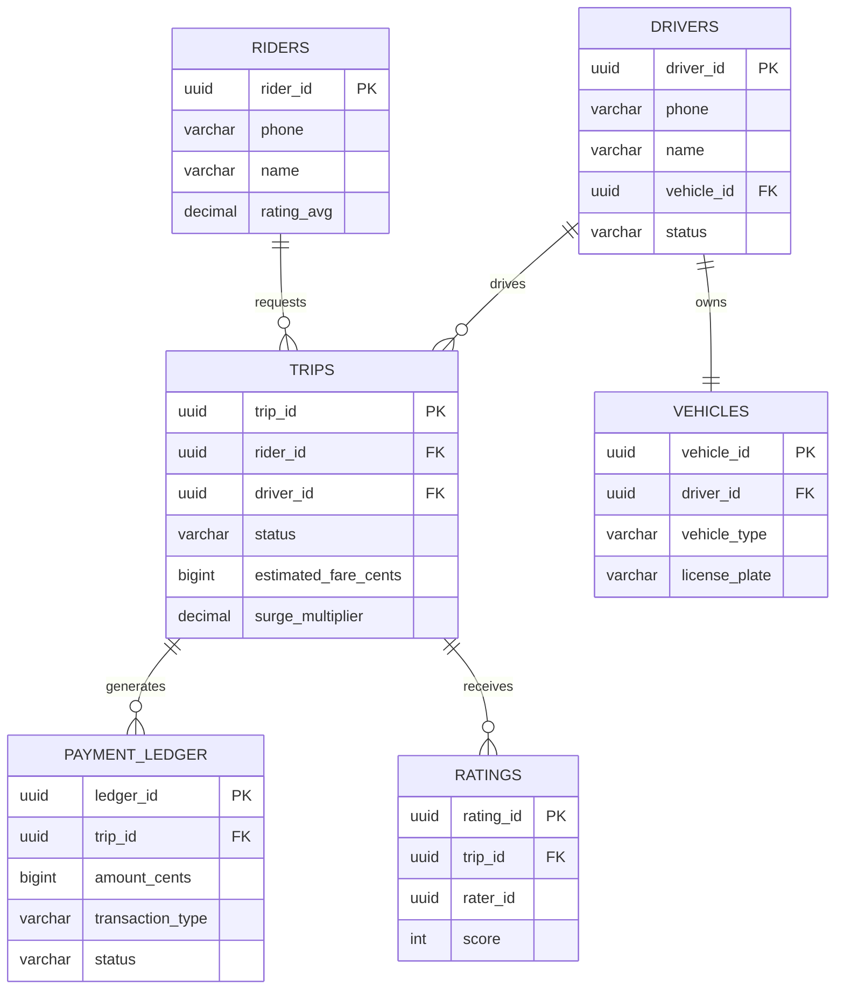
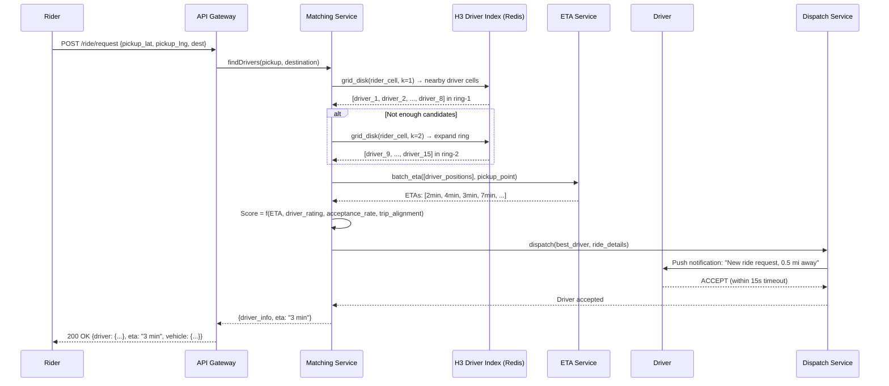
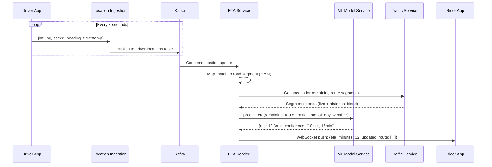
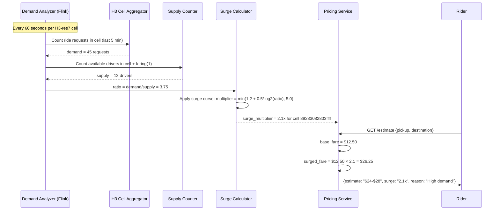

# Design Uber/Lyft Ride Sharing Platform

## 1. Requirements

### 1.1 Functional Requirements
- **Rider request ride**: Pickup/dropoff, vehicle type selection
- **Driver matching**: Optimal driver-rider pairing based on proximity, ETA, rating
- **Real-time location tracking**: Live driver/rider position updates
- **ETA calculation**: Accurate estimated time of arrival
- **Surge pricing**: Dynamic pricing based on supply/demand
- **Trip management**: Start, progress, end trip lifecycle
- **Payments**: Fare calculation, split payments, driver payouts
- **Ratings**: Bidirectional rider/driver ratings post-trip
- **Ride pooling**: Shared rides with route optimization

### 1.2 Non-Functional Requirements
- **Availability**: 99.99% uptime
- **Matching latency**: Driver match within 10 seconds
- **Location freshness**: Update propagation < 1 second
- **Scale**: 1M+ concurrent active rides
- **Consistency**: Payment ledger strictly consistent
- **Durability**: Zero lost trips or payments

## 2. Capacity Estimation

### 2.1 Traffic
- 20M rides/day → ~230 rides/sec average, ~1000 rides/sec peak
- 5M active drivers sending location every 4s → 1.25M location updates/sec
- 1M concurrent rides × 2 participants = 2M active tracking sessions

### 2.2 Storage
- Location updates: 1.25M/sec × 50 bytes = 62.5 MB/sec = 5.4 TB/day
- Trip records: 20M/day × 2KB = 40 GB/day
- Payment records: 20M/day × 500B = 10 GB/day
- Driver index (hot): 5M drivers × 100 bytes = 500 MB in Redis

### 2.3 Bandwidth
- Location ingestion: 62.5 MB/sec inbound
- Map/routing responses: ~500 GB/day outbound
- WebSocket connections: 7M concurrent (5M drivers + 2M active riders)

## 3. Data Modeling

### Entity-Relationship Diagram



### 3.1 PostgreSQL - Core Entities

```sql
-- Riders table
CREATE TABLE riders (
    rider_id UUID PRIMARY KEY DEFAULT gen_random_uuid(),
    phone VARCHAR(20) UNIQUE NOT NULL,
    email VARCHAR(255) UNIQUE,
    name VARCHAR(100) NOT NULL,
    profile_photo_url TEXT,
    rating_avg DECIMAL(3,2) DEFAULT 5.00,
    rating_count INT DEFAULT 0,
    payment_customer_id VARCHAR(100), -- Stripe customer ID
    created_at TIMESTAMPTZ DEFAULT NOW(),
    updated_at TIMESTAMPTZ DEFAULT NOW()
);

CREATE INDEX idx_riders_phone ON riders(phone);
CREATE INDEX idx_riders_email ON riders(email);

-- Drivers table
CREATE TABLE drivers (
    driver_id UUID PRIMARY KEY DEFAULT gen_random_uuid(),
    phone VARCHAR(20) UNIQUE NOT NULL,
    email VARCHAR(255) UNIQUE,
    name VARCHAR(100) NOT NULL,
    license_number VARCHAR(50) NOT NULL,
    vehicle_id UUID REFERENCES vehicles(vehicle_id),
    rating_avg DECIMAL(3,2) DEFAULT 5.00,
    rating_count INT DEFAULT 0,
    status VARCHAR(20) DEFAULT 'offline', -- offline, available, en_route, on_trip
    current_city_id INT REFERENCES cities(city_id),
    surge_multiplier_accepted DECIMAL(3,2) DEFAULT 1.0,
    created_at TIMESTAMPTZ DEFAULT NOW(),
    updated_at TIMESTAMPTZ DEFAULT NOW()
);

CREATE INDEX idx_drivers_status ON drivers(status, current_city_id);
CREATE INDEX idx_drivers_phone ON drivers(phone);

-- Vehicles table
CREATE TABLE vehicles (
    vehicle_id UUID PRIMARY KEY DEFAULT gen_random_uuid(),
    driver_id UUID REFERENCES drivers(driver_id),
    make VARCHAR(50),
    model VARCHAR(50),
    year INT,
    color VARCHAR(30),
    license_plate VARCHAR(20) NOT NULL,
    vehicle_type VARCHAR(20) NOT NULL, -- economy, comfort, premium, xl, pool
    capacity INT DEFAULT 4,
    created_at TIMESTAMPTZ DEFAULT NOW()
);

CREATE INDEX idx_vehicles_driver ON vehicles(driver_id);
CREATE INDEX idx_vehicles_type ON vehicles(vehicle_type);

-- Trips table
CREATE TABLE trips (
    trip_id UUID PRIMARY KEY DEFAULT gen_random_uuid(),
    rider_id UUID REFERENCES riders(rider_id),
    driver_id UUID REFERENCES drivers(driver_id),
    vehicle_type VARCHAR(20) NOT NULL,
    status VARCHAR(30) NOT NULL, -- requested, matching, driver_assigned, en_route_pickup, arrived, in_progress, completed, cancelled
    pickup_lat DECIMAL(10,7),
    pickup_lng DECIMAL(10,7),
    pickup_address TEXT,
    dropoff_lat DECIMAL(10,7),
    dropoff_lng DECIMAL(10,7),
    dropoff_address TEXT,
    estimated_fare_cents BIGINT,
    actual_fare_cents BIGINT,
    surge_multiplier DECIMAL(3,2) DEFAULT 1.0,
    distance_meters INT,
    duration_seconds INT,
    route_polyline TEXT,
    requested_at TIMESTAMPTZ DEFAULT NOW(),
    matched_at TIMESTAMPTZ,
    pickup_at TIMESTAMPTZ,
    dropoff_at TIMESTAMPTZ,
    cancelled_at TIMESTAMPTZ,
    cancellation_reason TEXT,
    pool_id UUID, -- NULL if not pooled
    created_at TIMESTAMPTZ DEFAULT NOW()
);

CREATE INDEX idx_trips_rider ON trips(rider_id, created_at DESC);
CREATE INDEX idx_trips_driver ON trips(driver_id, created_at DESC);
CREATE INDEX idx_trips_status ON trips(status);
CREATE INDEX idx_trips_pool ON trips(pool_id) WHERE pool_id IS NOT NULL;

-- Payment ledger (append-only)
CREATE TABLE payment_ledger (
    ledger_id UUID PRIMARY KEY DEFAULT gen_random_uuid(),
    trip_id UUID REFERENCES trips(trip_id),
    payer_type VARCHAR(10) NOT NULL, -- rider, platform
    payer_id UUID NOT NULL,
    payee_type VARCHAR(10) NOT NULL, -- driver, platform
    payee_id UUID NOT NULL,
    amount_cents BIGINT NOT NULL,
    currency VARCHAR(3) DEFAULT 'USD',
    transaction_type VARCHAR(30) NOT NULL, -- fare, commission, tip, refund, bonus
    status VARCHAR(20) DEFAULT 'pending', -- pending, completed, failed, refunded
    stripe_payment_id VARCHAR(100),
    created_at TIMESTAMPTZ DEFAULT NOW()
);

CREATE INDEX idx_ledger_trip ON payment_ledger(trip_id);
CREATE INDEX idx_ledger_payer ON payment_ledger(payer_type, payer_id, created_at DESC);
CREATE INDEX idx_ledger_payee ON payment_ledger(payee_type, payee_id, created_at DESC);

-- Ratings
CREATE TABLE ratings (
    rating_id UUID PRIMARY KEY DEFAULT gen_random_uuid(),
    trip_id UUID REFERENCES trips(trip_id),
    rater_type VARCHAR(10) NOT NULL, -- rider, driver
    rater_id UUID NOT NULL,
    ratee_type VARCHAR(10) NOT NULL,
    ratee_id UUID NOT NULL,
    score INT CHECK (score >= 1 AND score <= 5),
    comment TEXT,
    created_at TIMESTAMPTZ DEFAULT NOW()
);

CREATE UNIQUE INDEX idx_ratings_trip_rater ON ratings(trip_id, rater_type, rater_id);
```

### 3.2 Redis - Real-time State

```redis
# Driver location geospatial index (per city)
# GEOADD drivers:city:{city_id} longitude latitude driver_id
GEOADD drivers:city:1 -73.9857 40.7484 driver_123
GEOADD drivers:city:1 -73.9712 40.7831 driver_456

# Query nearby drivers within 3km radius
GEOSEARCH drivers:city:1 FROMLONLAT -73.9857 40.7484 BYRADIUS 3 km ASC COUNT 20

# Driver state hash
HSET driver:state:driver_123 status available lat 40.7484 lng -73.9857 heading 180 speed 25 updated_at 1700000000 vehicle_type economy capacity 4

# Active trip state
HSET trip:active:trip_789 status in_progress rider_id rider_001 driver_id driver_123 pickup_lat 40.7484 pickup_lng -73.9857

# Surge pricing per H3 hex cell (resolution 7)
HSET surge:city:1 872a1072fffffff 1.5
HSET surge:city:1 872a1073fffffff 2.3

# Driver earnings today
INCRBY driver:earnings:driver_123:2024-01-15 2500
```

### 3.3 Cassandra - Location History

```cql
CREATE TABLE driver_locations (
    driver_id UUID,
    day DATE,
    timestamp TIMESTAMP,
    lat DOUBLE,
    lng DOUBLE,
    heading SMALLINT,
    speed FLOAT,
    accuracy FLOAT,
    PRIMARY KEY ((driver_id, day), timestamp)
) WITH CLUSTERING ORDER BY (timestamp DESC)
  AND default_time_to_live = 2592000; -- 30 days TTL

CREATE TABLE trip_route_points (
    trip_id UUID,
    timestamp TIMESTAMP,
    lat DOUBLE,
    lng DOUBLE,
    speed FLOAT,
    PRIMARY KEY (trip_id, timestamp)
) WITH CLUSTERING ORDER BY (timestamp ASC);
```

## 4. High-Level Design

### 4.1 Architecture Diagram

```
┌─────────────────────────────────────────────────────────────────────────────┐
│                              CLIENTS                                         │
│   ┌──────────────┐    ┌──────────────┐    ┌──────────────┐                 │
│   │  Rider App   │    │  Driver App  │    │  Admin Panel │                 │
│   └──────┬───────┘    └──────┬───────┘    └──────┬───────┘                 │
└──────────┼───────────────────┼───────────────────┼──────────────────────────┘
           │                   │                   │
           ▼                   ▼                   ▼
┌──────────────────────────────────────────────────────────────────────────────┐
│                          API GATEWAY (Kong/Envoy)                             │
│  ┌─────────────┐  ┌────────────────┐  ┌────────────────┐                   │
│  │   Auth/JWT  │  │  Rate Limiting │  │  Load Balancer │                   │
│  └─────────────┘  └────────────────┘  └────────────────┘                   │
└──────────┬───────────────────┬───────────────────┬──────────────────────────┘
           │                   │                   │
     ┌─────┼─────┬─────┬──────┼──────┬────────────┼──────┐
     ▼     ▼     ▼     ▼      ▼      ▼            ▼      ▼
┌────────┐┌────────┐┌────────┐┌────────┐┌────────┐┌────────┐┌────────┐
│Matching││Location││  Trip  ││Payment ││ Surge  ││ Rating ││  Pool  │
│Service ││Service ││Service ││Service ││Pricing ││Service ││Service │
└───┬────┘└───┬────┘└───┬────┘└───┬────┘└───┬────┘└───┬────┘└───┬────┘
    │         │         │         │         │         │         │
    ▼         ▼         ▼         ▼         ▼         ▼         ▼
┌──────────────────────────────────────────────────────────────────────────────┐
│                           MESSAGE BUS (Kafka)                                 │
│  ┌──────────────┐  ┌───────────────┐  ┌──────────────┐  ┌───────────────┐  │
│  │location.updates│ │trip.events    │  │payment.events│  │surge.updates  │  │
│  └──────────────┘  └───────────────┘  └──────────────┘  └───────────────┘  │
└──────────────────────────────────────────────────────────────────────────────┘
           │                   │                   │
     ┌─────┼─────┬─────┬──────┼──────┐            │
     ▼     ▼     ▼     ▼      ▼      ▼            ▼
┌────────┐┌────────┐┌────────┐┌────────┐┌────────┐┌────────┐
│ Redis  ││Postgres││Cassan- ││  Flink ││  OSRM  ││ Stripe │
│Cluster ││Cluster ││  dra   ││Cluster ││Routing ││  API   │
└────────┘└────────┘└────────┘└────────┘└────────┘└────────┘
```

### 4.2 WebSocket Infrastructure

```
┌───────────────┐         ┌──────────────────────┐
│  Driver App   │◄──WS───►│  WebSocket Gateway   │
│  (4s heartbeat)│         │  (Connection Manager)│
└───────────────┘         └──────────┬───────────┘
                                     │
┌───────────────┐                    ▼
│  Rider App    │◄──WS───►┌──────────────────────┐
│  (trip updates)│         │    Pub/Sub Router    │
└───────────────┘         │  (Redis Pub/Sub)     │
                          └──────────────────────┘
```

## 5. Low-Level Design - APIs

### 5.1 Ride Request API

```
POST /api/v1/rides/request
Authorization: Bearer {rider_token}

Request:
{
  "pickup": {
    "lat": 40.7484,
    "lng": -73.9857,
    "address": "350 5th Ave, New York, NY"
  },
  "dropoff": {
    "lat": 40.7580,
    "lng": -73.9855,
    "address": "Times Square, New York, NY"
  },
  "vehicle_type": "economy",
  "payment_method_id": "pm_stripe_123",
  "pool": false
}

Response 200:
{
  "trip_id": "trip_789",
  "status": "matching",
  "estimated_fare": {
    "min_cents": 1200,
    "max_cents": 1800,
    "currency": "USD",
    "surge_multiplier": 1.5
  },
  "estimated_pickup_eta_seconds": 180,
  "estimated_trip_duration_seconds": 720
}
```

### 5.2 Driver Location Update API

```
POST /api/v1/drivers/location
Authorization: Bearer {driver_token}

Request:
{
  "lat": 40.7484,
  "lng": -73.9857,
  "heading": 180,
  "speed": 25.5,
  "accuracy": 5.0,
  "timestamp": 1700000000000
}

Response 200:
{
  "ack": true,
  "server_timestamp": 1700000000050
}
```

### 5.3 Trip Status Update API

```
PATCH /api/v1/trips/{trip_id}/status
Authorization: Bearer {driver_token}

Request:
{
  "status": "arrived",  // en_route_pickup, arrived, in_progress, completed
  "lat": 40.7484,
  "lng": -73.9857,
  "odometer_meters": 0
}

Response 200:
{
  "trip_id": "trip_789",
  "status": "arrived",
  "updated_at": "2024-01-15T10:30:00Z",
  "next_actions": ["start_trip", "cancel"]
}
```

### 5.4 Fare Estimate API

```
GET /api/v1/rides/estimate?pickup_lat=40.7484&pickup_lng=-73.9857&dropoff_lat=40.7580&dropoff_lng=-73.9855&vehicle_type=economy

Response 200:
{
  "estimates": [
    {
      "vehicle_type": "economy",
      "fare_min_cents": 1200,
      "fare_max_cents": 1800,
      "surge_multiplier": 1.5,
      "eta_seconds": 180,
      "trip_duration_seconds": 720,
      "distance_meters": 2400
    },
    {
      "vehicle_type": "comfort",
      "fare_min_cents": 1800,
      "fare_max_cents": 2500,
      "surge_multiplier": 1.2,
      "eta_seconds": 240,
      "trip_duration_seconds": 720,
      "distance_meters": 2400
    }
  ]
}
```

### 5.5 Rating API

```
POST /api/v1/trips/{trip_id}/rate
Authorization: Bearer {token}

Request:
{
  "score": 5,
  "comment": "Great driver, smooth ride",
  "tip_cents": 300
}

Response 200:
{
  "rating_id": "rating_001",
  "trip_id": "trip_789",
  "acknowledged": true
}
```

## 6. Deep Dive: Driver Matching Algorithm

### 6.1 S2 Cell-Based Geospatial Indexing

```python
import s2geometry as s2

class DriverIndex:
    """
    Uses Google S2 cells for geospatial indexing of driver locations.
    S2 cells provide hierarchical spatial partitioning of the Earth's surface.
    Level 16 cells ≈ 150m × 150m, Level 14 ≈ 600m × 600m
    """
    
    def __init__(self, redis_client):
        self.redis = redis_client
        self.SEARCH_LEVEL = 14  # ~600m cells for search
        self.INDEX_LEVEL = 16   # ~150m cells for indexing
    
    def update_driver_location(self, driver_id: str, lat: float, lng: float, 
                                heading: int, speed: float, vehicle_type: str):
        """Update driver position in geospatial index."""
        latlng = s2.S2LatLng.FromDegrees(lat, lng)
        cell_id = s2.S2CellId(latlng).parent(self.INDEX_LEVEL)
        
        # Remove from old cell
        old_cell = self.redis.hget(f"driver:cell:{driver_id}", "cell_id")
        if old_cell and old_cell != str(cell_id.id()):
            self.redis.srem(f"cell:drivers:{old_cell}", driver_id)
        
        # Add to new cell
        pipe = self.redis.pipeline()
        pipe.sadd(f"cell:drivers:{cell_id.id()}", driver_id)
        pipe.hset(f"driver:cell:{driver_id}", mapping={
            "cell_id": str(cell_id.id()),
            "lat": lat,
            "lng": lng,
            "heading": heading,
            "speed": speed,
            "vehicle_type": vehicle_type,
            "updated_at": int(time.time())
        })
        # Also update Redis GEO for radius queries
        pipe.geoadd(f"drivers:geo:{vehicle_type}", lng, lat, driver_id)
        pipe.execute()
    
    def find_nearby_drivers(self, lat: float, lng: float, radius_km: float,
                           vehicle_type: str, max_results: int = 20) -> list:
        """Find available drivers within radius using S2 cell covering."""
        center = s2.S2LatLng.FromDegrees(lat, lng)
        
        # Create a cap (circular region) for the search area
        earth_radius_km = 6371.0
        cap_angle = s2.S1Angle.Radians(radius_km / earth_radius_km)
        cap = s2.S2Cap(center.ToPoint(), cap_angle)
        
        # Get covering cells at search level
        coverer = s2.S2RegionCoverer()
        coverer.set_min_level(self.SEARCH_LEVEL)
        coverer.set_max_level(self.SEARCH_LEVEL)
        coverer.set_max_cells(20)
        covering = coverer.GetCovering(cap)
        
        # Collect drivers from all covering cells
        candidate_drivers = []
        for cell_id in covering:
            # Get all index-level children of search-level cell
            child_begin = cell_id.child_begin(self.INDEX_LEVEL)
            child_end = cell_id.child_end(self.INDEX_LEVEL)
            
            # In practice, use Redis GEO for the final filtering
            drivers = self.redis.geosearch(
                f"drivers:geo:{vehicle_type}",
                longitude=lng, latitude=lat,
                radius=radius_km, unit="km",
                sort="ASC", count=max_results
            )
            candidate_drivers.extend(drivers)
        
        return candidate_drivers[:max_results]


class MatchingService:
    """
    Orchestrates driver-rider matching with multi-factor scoring.
    """
    
    def __init__(self, driver_index, routing_service, surge_service):
        self.driver_index = driver_index
        self.routing = routing_service
        self.surge = surge_service
        self.INITIAL_RADIUS_KM = 2.0
        self.MAX_RADIUS_KM = 8.0
        self.RADIUS_EXPANSION_STEP = 1.5
        self.MATCH_TIMEOUT_SEC = 30
    
    def match_rider(self, trip_request) -> dict:
        """
        Main matching algorithm:
        1. Find nearby available drivers
        2. Score candidates (ETA, rating, acceptance rate, heading)
        3. Offer to best candidate
        4. Expand radius if no acceptance
        """
        radius = self.INITIAL_RADIUS_KM
        start_time = time.time()
        
        while radius <= self.MAX_RADIUS_KM:
            if time.time() - start_time > self.MATCH_TIMEOUT_SEC:
                return {"status": "no_match", "reason": "timeout"}
            
            candidates = self.driver_index.find_nearby_drivers(
                lat=trip_request.pickup_lat,
                lng=trip_request.pickup_lng,
                radius_km=radius,
                vehicle_type=trip_request.vehicle_type
            )
            
            if not candidates:
                radius *= self.RADIUS_EXPANSION_STEP
                continue
            
            # Score and rank candidates
            scored = self.score_candidates(candidates, trip_request)
            
            # Offer to top candidate
            for candidate in scored:
                offer_result = self.offer_to_driver(candidate, trip_request)
                if offer_result["accepted"]:
                    return {
                        "status": "matched",
                        "driver_id": candidate["driver_id"],
                        "eta_seconds": candidate["eta_seconds"]
                    }
            
            # All rejected, expand radius
            radius *= self.RADIUS_EXPANSION_STEP
        
        return {"status": "no_match", "reason": "no_available_drivers"}
    
    def score_candidates(self, candidates: list, trip_request) -> list:
        """
        Multi-factor scoring for driver ranking.
        
        Score = w1 * ETA_score + w2 * rating_score + w3 * heading_score 
                + w4 * acceptance_score + w5 * earnings_fairness
        """
        WEIGHTS = {
            "eta": 0.40,
            "rating": 0.15,
            "heading": 0.10,
            "acceptance_rate": 0.15,
            "earnings_fairness": 0.20
        }
        
        scored = []
        for driver in candidates:
            # ETA score (lower is better, normalized to 0-1)
            eta = self.routing.get_eta(
                driver["lat"], driver["lng"],
                trip_request.pickup_lat, trip_request.pickup_lng
            )
            eta_score = max(0, 1 - (eta / 600))  # 10 min max
            
            # Rating score (normalized)
            rating_score = (driver["rating"] - 3.0) / 2.0  # 3-5 → 0-1
            
            # Heading score (is driver heading toward pickup?)
            bearing = calculate_bearing(
                driver["lat"], driver["lng"],
                trip_request.pickup_lat, trip_request.pickup_lng
            )
            heading_diff = abs(driver["heading"] - bearing)
            heading_score = max(0, 1 - (heading_diff / 180))
            
            # Acceptance rate
            acceptance_score = driver.get("acceptance_rate", 0.8)
            
            # Earnings fairness (drivers with fewer trips today get priority)
            trips_today = driver.get("trips_today", 0)
            earnings_score = max(0, 1 - (trips_today / 20))
            
            total_score = (
                WEIGHTS["eta"] * eta_score +
                WEIGHTS["rating"] * rating_score +
                WEIGHTS["heading"] * heading_score +
                WEIGHTS["acceptance_rate"] * acceptance_score +
                WEIGHTS["earnings_fairness"] * earnings_score
            )
            
            scored.append({
                **driver,
                "score": total_score,
                "eta_seconds": eta
            })
        
        return sorted(scored, key=lambda x: x["score"], reverse=True)
    
    def offer_to_driver(self, driver: dict, trip_request) -> dict:
        """Send ride offer to driver via WebSocket, wait for response."""
        offer = {
            "type": "ride_offer",
            "trip_id": trip_request.trip_id,
            "pickup": {"lat": trip_request.pickup_lat, "lng": trip_request.pickup_lng},
            "dropoff": {"lat": trip_request.dropoff_lat, "lng": trip_request.dropoff_lng},
            "estimated_fare": trip_request.estimated_fare,
            "surge": trip_request.surge_multiplier,
            "timeout_seconds": 15
        }
        
        # Push offer via WebSocket and wait
        response = self.websocket.send_and_wait(
            driver["driver_id"], offer, timeout=15
        )
        return {"accepted": response.get("action") == "accept"}
```

### 6.2 Hungarian Algorithm for Pool Matching

```python
from scipy.optimize import linear_sum_assignment
import numpy as np

class PoolMatchingService:
    """
    Matches multiple riders to shared rides using assignment optimization.
    Uses Hungarian algorithm for optimal pairing of riders with similar routes.
    """
    
    def match_pool_riders(self, pending_requests: list, available_pools: list) -> list:
        """
        Create cost matrix and solve assignment problem.
        Cost = detour_time + wait_time - discount_savings
        """
        n_requests = len(pending_requests)
        n_pools = len(available_pools)
        
        if n_requests == 0 or n_pools == 0:
            return []
        
        # Build cost matrix: rows=requests, cols=pools
        cost_matrix = np.full((n_requests, n_pools), fill_value=1e9)
        
        for i, request in enumerate(pending_requests):
            for j, pool in enumerate(available_pools):
                # Check capacity
                if pool.current_riders >= pool.max_capacity:
                    continue
                
                # Calculate detour for existing riders
                detour = self.calculate_detour(pool, request)
                
                # Max acceptable detour: 10 minutes
                if detour > 600:
                    continue
                
                # Calculate wait time for new rider
                wait_time = self.calculate_pickup_eta(pool, request)
                
                # Route similarity score (higher = better match)
                similarity = self.route_overlap_score(pool.route, request)
                
                # Cost function
                cost = (
                    detour * 2.0 +          # Penalize detour heavily
                    wait_time * 1.0 +       # Wait time cost
                    (1 - similarity) * 300   # Route dissimilarity penalty
                )
                
                cost_matrix[i][j] = cost
        
        # Solve assignment problem (Hungarian algorithm)
        row_indices, col_indices = linear_sum_assignment(cost_matrix)
        
        assignments = []
        for i, j in zip(row_indices, col_indices):
            if cost_matrix[i][j] < 1e9:  # Valid assignment
                assignments.append({
                    "request": pending_requests[i],
                    "pool": available_pools[j],
                    "cost": cost_matrix[i][j]
                })
        
        return assignments
    
    def calculate_detour(self, pool, new_request) -> int:
        """Calculate additional seconds added to existing riders' trips."""
        # Get current optimal route
        current_route = self.routing.get_route(pool.waypoints)
        
        # Insert new pickup/dropoff at optimal position
        new_waypoints = self.find_optimal_insertion(
            pool.waypoints, 
            new_request.pickup, 
            new_request.dropoff
        )
        new_route = self.routing.get_route(new_waypoints)
        
        return new_route.duration - current_route.duration
    
    def find_optimal_insertion(self, waypoints, pickup, dropoff):
        """Try all valid insertion positions, return minimum detour."""
        best_waypoints = None
        best_duration = float('inf')
        
        n = len(waypoints)
        for i in range(n + 1):
            for j in range(i + 1, n + 2):
                candidate = waypoints[:i] + [pickup] + waypoints[i:j-1] + [dropoff] + waypoints[j-1:]
                duration = self.routing.estimate_duration(candidate)
                if duration < best_duration:
                    best_duration = duration
                    best_waypoints = candidate
        
        return best_waypoints
```

## 7. Deep Dive: Real-Time Location Tracking

### 7.1 Location Pipeline Architecture

```
Driver App (4s intervals)
       │
       ▼
┌─────────────────┐     ┌──────────────────┐     ┌──────────────────┐
│  WebSocket GW   │────►│  Kafka Topic     │────►│  Flink Consumer  │
│  (validates,    │     │  location.raw    │     │  (dedup, smooth, │
│   batches)      │     │  partitioned by  │     │   filter noise)  │
└─────────────────┘     │  driver_id)      │     └────────┬─────────┘
                        └──────────────────┘              │
                                                          ▼
                        ┌──────────────────┐     ┌──────────────────┐
                        │  Redis GEO       │◄────│  Location Service│
                        │  (driver index)  │     │  (geo-index      │
                        └──────────────────┘     │   update)        │
                                                 └────────┬─────────┘
                                                          │
                        ┌──────────────────┐              │
                        │  Cassandra       │◄─────────────┘
                        │  (history)       │
                        └──────────────────┘
```

### 7.2 Location Processing Pipeline

```python
class LocationProcessor:
    """
    Flink-based stream processor for driver location updates.
    Handles deduplication, noise filtering, smoothing, and geo-index updates.
    """
    
    def __init__(self):
        self.kalman_filters = {}  # Per-driver Kalman filter state
        self.SPEED_THRESHOLD_MPS = 55  # ~200 km/h max realistic speed
        self.ACCURACY_THRESHOLD_M = 100  # Discard if accuracy > 100m
        self.STALE_THRESHOLD_SEC = 30
    
    def process_location_event(self, event: dict) -> dict:
        """
        Pipeline stages:
        1. Validate & deduplicate
        2. Noise filter (GPS jitter removal)
        3. Kalman filter smoothing
        4. Speed/bearing derivation
        5. Emit processed location
        """
        driver_id = event["driver_id"]
        
        # Stage 1: Validation
        if not self.validate(event):
            return None
        
        # Stage 2: Deduplication (same timestamp)
        if self.is_duplicate(driver_id, event):
            return None
        
        # Stage 3: Noise filtering
        if event.get("accuracy", 0) > self.ACCURACY_THRESHOLD_M:
            return None
        
        # Stage 4: Kalman filter smoothing
        smoothed = self.apply_kalman_filter(driver_id, event)
        
        # Stage 5: Derive speed and check sanity
        speed = self.calculate_speed(driver_id, smoothed)
        if speed > self.SPEED_THRESHOLD_MPS:
            # Likely GPS jump, discard
            return None
        
        smoothed["derived_speed"] = speed
        smoothed["derived_heading"] = self.calculate_bearing_from_history(driver_id)
        
        return smoothed
    
    def apply_kalman_filter(self, driver_id: str, measurement: dict) -> dict:
        """
        1D Kalman filter for lat/lng independently.
        Reduces GPS noise while maintaining responsiveness.
        """
        if driver_id not in self.kalman_filters:
            self.kalman_filters[driver_id] = {
                "lat": KalmanFilter1D(process_variance=1e-5, measurement_variance=1e-4),
                "lng": KalmanFilter1D(process_variance=1e-5, measurement_variance=1e-4)
            }
        
        kf = self.kalman_filters[driver_id]
        smoothed_lat = kf["lat"].update(measurement["lat"])
        smoothed_lng = kf["lng"].update(measurement["lng"])
        
        return {
            **measurement,
            "lat": smoothed_lat,
            "lng": smoothed_lng,
            "raw_lat": measurement["lat"],
            "raw_lng": measurement["lng"]
        }


class KalmanFilter1D:
    """Simple 1D Kalman filter for coordinate smoothing."""
    
    def __init__(self, process_variance=1e-5, measurement_variance=1e-4):
        self.process_variance = process_variance
        self.measurement_variance = measurement_variance
        self.estimate = None
        self.error_estimate = 1.0
    
    def update(self, measurement: float) -> float:
        if self.estimate is None:
            self.estimate = measurement
            return measurement
        
        # Prediction step
        prediction = self.estimate
        prediction_error = self.error_estimate + self.process_variance
        
        # Update step
        kalman_gain = prediction_error / (prediction_error + self.measurement_variance)
        self.estimate = prediction + kalman_gain * (measurement - prediction)
        self.error_estimate = (1 - kalman_gain) * prediction_error
        
        return self.estimate
```

### 7.3 Client-Side Dead Reckoning

```python
class ClientDeadReckoning:
    """
    Client-side position interpolation between server updates.
    Provides smooth animation even with 4-second update intervals.
    """
    
    def interpolate_position(self, last_known: dict, elapsed_ms: int) -> dict:
        """
        Predict current position based on last known state.
        Uses constant velocity model with road snapping.
        """
        elapsed_sec = elapsed_ms / 1000.0
        
        # Simple dead reckoning
        speed_mps = last_known["speed"]  # meters per second
        heading_rad = math.radians(last_known["heading"])
        
        # Project forward
        distance = speed_mps * elapsed_sec
        delta_lat = (distance * math.cos(heading_rad)) / 111320
        delta_lng = (distance * math.sin(heading_rad)) / (111320 * math.cos(math.radians(last_known["lat"])))
        
        predicted = {
            "lat": last_known["lat"] + delta_lat,
            "lng": last_known["lng"] + delta_lng,
            "confidence": max(0.5, 1.0 - (elapsed_sec / 10.0))  # Decays with time
        }
        
        return predicted
```

## 8. Deep Dive: Surge Pricing

### 8.1 Supply-Demand Engine

```python
import h3

class SurgePricingEngine:
    """
    Dynamic pricing based on supply/demand ratio per H3 hexagonal cell.
    Uses H3 resolution 7 (~5.16 km² per hex) for pricing zones.
    """
    
    H3_RESOLUTION = 7
    SMOOTHING_WINDOW_SEC = 300  # 5-minute rolling window
    MIN_SURGE = 1.0
    MAX_SURGE = 5.0
    
    def __init__(self, redis_client, flink_metrics):
        self.redis = redis_client
        self.metrics = flink_metrics
    
    def calculate_surge(self, city_id: int, lat: float, lng: float) -> float:
        """
        Calculate surge multiplier for a given location.
        
        Algorithm:
        1. Identify H3 hex cell
        2. Count supply (available drivers) in cell + neighbors
        3. Count demand (ride requests) in rolling window
        4. Apply surge formula with smoothing
        """
        hex_id = h3.latlng_to_cell(lat, lng, self.H3_RESOLUTION)
        
        # Get supply and demand for hex + ring-1 neighbors
        hex_ring = h3.grid_disk(hex_id, 1)  # Center + 6 neighbors
        
        total_supply = 0
        total_demand = 0
        
        for h in hex_ring:
            supply = int(self.redis.hget(f"supply:city:{city_id}", h) or 0)
            demand = int(self.redis.hget(f"demand:city:{city_id}", h) or 0)
            
            # Weight center hex more than neighbors
            weight = 1.0 if h == hex_id else 0.5
            total_supply += supply * weight
            total_demand += demand * weight
        
        # Calculate raw surge ratio
        if total_supply == 0:
            raw_surge = self.MAX_SURGE
        else:
            demand_supply_ratio = total_demand / total_supply
            raw_surge = self.demand_to_surge(demand_supply_ratio)
        
        # Apply temporal smoothing (prevent sudden jumps)
        previous_surge = float(self.redis.hget(f"surge:city:{city_id}", hex_id) or 1.0)
        smoothed_surge = self.smooth_surge(previous_surge, raw_surge)
        
        # Clamp to bounds
        final_surge = max(self.MIN_SURGE, min(self.MAX_SURGE, smoothed_surge))
        
        # Store updated surge
        self.redis.hset(f"surge:city:{city_id}", hex_id, str(final_surge))
        
        return final_surge
    
    def demand_to_surge(self, ratio: float) -> float:
        """
        Piecewise linear surge function with price elasticity.
        
        ratio < 1.0  → surge = 1.0 (oversupply)
        1.0-1.5      → surge = 1.0-1.5 (mild)
        1.5-2.5      → surge = 1.5-2.5 (moderate)
        2.5+         → surge = 2.5-5.0 (heavy, with dampening)
        """
        if ratio <= 1.0:
            return 1.0
        elif ratio <= 1.5:
            return 1.0 + (ratio - 1.0) * 1.0
        elif ratio <= 2.5:
            return 1.5 + (ratio - 1.5) * 1.0
        else:
            # Logarithmic dampening for extreme demand
            return 2.5 + math.log(ratio - 1.5) * 1.0
    
    def smooth_surge(self, previous: float, current: float) -> float:
        """
        Exponential moving average for smooth transitions.
        Surge increases fast, decreases slowly (rider protection).
        """
        if current > previous:
            alpha = 0.6  # Increase quickly
        else:
            alpha = 0.3  # Decrease slowly
        
        return alpha * current + (1 - alpha) * previous
    
    def update_supply_demand_counts(self, city_id: int):
        """
        Called by Flink every 30 seconds.
        Counts available drivers and recent requests per hex.
        """
        # Supply: count available drivers per hex
        available_drivers = self.get_available_drivers(city_id)
        supply_counts = {}
        for driver in available_drivers:
            hex_id = h3.latlng_to_cell(driver["lat"], driver["lng"], self.H3_RESOLUTION)
            supply_counts[hex_id] = supply_counts.get(hex_id, 0) + 1
        
        # Demand: count ride requests in last 5 minutes per hex
        demand_counts = self.get_recent_demand(city_id, window_sec=self.SMOOTHING_WINDOW_SEC)
        
        # Update Redis
        pipe = self.redis.pipeline()
        pipe.delete(f"supply:city:{city_id}")
        pipe.delete(f"demand:city:{city_id}")
        if supply_counts:
            pipe.hset(f"supply:city:{city_id}", mapping=supply_counts)
        if demand_counts:
            pipe.hset(f"demand:city:{city_id}", mapping=demand_counts)
        pipe.execute()
```

### 8.2 Price Elasticity Model

```python
class PriceElasticityModel:
    """
    Models how surge pricing affects rider demand and driver supply.
    Used to find optimal surge multiplier that maximizes completed rides.
    """
    
    def estimate_demand_at_surge(self, base_demand: int, surge: float) -> int:
        """
        Demand decreases as price increases.
        Elasticity varies by time/location (rush hour = less elastic).
        """
        # Price elasticity of demand (typically -0.5 to -1.5)
        elasticity = -0.7  # Average
        
        price_change_pct = (surge - 1.0)
        demand_change_pct = elasticity * price_change_pct
        
        adjusted_demand = base_demand * (1 + demand_change_pct)
        return max(0, int(adjusted_demand))
    
    def estimate_supply_at_surge(self, base_supply: int, surge: float) -> int:
        """
        Supply increases with surge (drivers move toward high-surge areas).
        """
        # Supply elasticity (positive - higher prices attract drivers)
        elasticity = 0.4
        
        price_change_pct = (surge - 1.0)
        supply_change_pct = elasticity * price_change_pct
        
        adjusted_supply = base_supply * (1 + supply_change_pct)
        return int(adjusted_supply)
    
    def find_optimal_surge(self, base_demand: int, base_supply: int) -> float:
        """
        Find surge multiplier that maximizes completed rides.
        Completed rides = min(adjusted_demand, adjusted_supply)
        """
        best_surge = 1.0
        best_completed = 0
        
        for surge in [x * 0.1 for x in range(10, 51)]:  # 1.0 to 5.0
            demand = self.estimate_demand_at_surge(base_demand, surge)
            supply = self.estimate_supply_at_surge(base_supply, surge)
            completed = min(demand, supply)
            
            if completed > best_completed:
                best_completed = completed
                best_surge = surge
        
        return best_surge
```

## 9. Component Configuration

### 9.1 Kafka Configuration

```yaml
# Location updates topic - high throughput
location.raw:
  partitions: 256
  replication_factor: 3
  retention_ms: 3600000  # 1 hour
  segment_bytes: 536870912  # 512MB
  compression_type: lz4
  min_insync_replicas: 2

# Trip events topic
trip.events:
  partitions: 64
  replication_factor: 3
  retention_ms: 604800000  # 7 days
  cleanup_policy: compact,delete
  min_insync_replicas: 2

# Surge updates topic
surge.updates:
  partitions: 32
  replication_factor: 3
  retention_ms: 3600000  # 1 hour

# Consumer configs
consumer:
  location_processor:
    group_id: location-processor
    max_poll_records: 1000
    fetch_max_bytes: 10485760  # 10MB
    auto_offset_reset: latest  # Skip old locations on restart
```

### 9.2 Redis Cluster Configuration

```yaml
redis_cluster:
  nodes: 12  # 6 primary + 6 replica
  max_memory: 64GB per node
  eviction_policy: volatile-lru
  
  # Keyspace allocation
  geo_index:
    memory_budget: 40%  # Driver geospatial index
    key_pattern: "drivers:geo:*"
    
  driver_state:
    memory_budget: 25%
    key_pattern: "driver:state:*"
    ttl: 120s  # Auto-expire stale drivers
    
  trip_state:
    memory_budget: 20%
    key_pattern: "trip:active:*"
    
  surge_data:
    memory_budget: 15%
    key_pattern: "surge:*"
    ttl: 300s
```

### 9.3 Flink Job Configuration

```yaml
flink_jobs:
  location_aggregator:
    parallelism: 64
    checkpoint_interval: 10000  # 10s
    state_backend: rocksdb
    watermark_strategy: bounded_out_of_orderness(5s)
    
  surge_calculator:
    parallelism: 16
    window_size: 30s
    trigger: every 30s
    
  metrics_aggregator:
    parallelism: 32
    window_size: 60s
    late_data_handling: allow_lateness(30s)
```

## 10. Observability

### 10.1 Key Metrics

```yaml
business_metrics:
  - ride_requests_per_second (by city, vehicle_type)
  - match_success_rate (target: >95%)
  - average_match_time_seconds (target: <10s)
  - average_eta_accuracy_percent
  - surge_multiplier_distribution
  - cancellation_rate (target: <5%)
  - driver_utilization_percent

system_metrics:
  - location_update_lag_ms (p50, p95, p99)
  - geo_index_size (drivers per city)
  - kafka_consumer_lag
  - websocket_connection_count
  - matching_algorithm_latency_ms
  - redis_memory_usage_percent
  - routing_api_latency_ms

alerts:
  - match_time_p99 > 15s → page on-call
  - location_lag_p99 > 5s → warn
  - kafka_consumer_lag > 100K → critical
  - redis_memory > 85% → warn
  - payment_failure_rate > 2% → page
```

### 10.2 Distributed Tracing

```
Ride Request Flow:
[Rider App] → [API GW: 2ms] → [Trip Service: 5ms] → [Surge Service: 3ms]
     → [Matching Service: 800ms] → [Driver Index Query: 15ms]
     → [ETA Calculation: 50ms] → [Offer to Driver: 12000ms]
     → [Trip Confirmed: 5ms] → [Notify Rider: 20ms]

Total P50: 2.5s | P95: 8s | P99: 15s
```

## 11. Trade-offs and Considerations

### 11.1 Matching Accuracy vs Speed
- **Batch matching** (wait 5s, match optimally) → better matches, higher rider wait
- **Greedy matching** (first available driver) → faster, suboptimal globally
- **Chosen**: Hybrid - short batch window (2-3s) with greedy fallback

### 11.2 Location Update Frequency
- **Higher frequency (1s)**: Better accuracy, 4× more bandwidth/processing
- **Lower frequency (10s)**: Less resource usage, stale positions
- **Chosen**: 4s base with adaptive (faster during active trips, slower when idle)

### 11.3 Surge Pricing Granularity
- **Coarse (city-level)**: Simple, unfair to neighborhoods
- **Fine (block-level)**: Precise, complex, gaming risk
- **Chosen**: H3 resolution 7 (~5km²) with neighbor smoothing

### 11.4 Pool Matching Complexity
- **Exact optimal (NP-hard)**: Perfect routes, too slow at scale
- **Greedy heuristic**: Fast, 85% of optimal
- **Chosen**: Hungarian algorithm for batches of 20-50 requests (polynomial)

### 11.5 Consistency Model
- **Payments**: Strong consistency (PostgreSQL + Stripe idempotency)
- **Location**: Eventual consistency (acceptable staleness 1-4s)
- **Trip state**: Causal consistency (state machine transitions ordered)
- **Surge**: Eventual consistency (30s refresh acceptable)

### 11.6 Failure Modes
- **Matching timeout**: Expand radius, offer surge incentive to drivers
- **Location service down**: Use last-known positions, client dead reckoning
- **Payment failure**: Complete trip, queue retry, don't block user
- **Kafka lag**: Back-pressure, shed non-critical events (analytics)

---

## 12. Sequence Diagrams

### 12.1 Driver Matching Flow



### 12.2 Real-time ETA Update During Trip



### 12.3 Surge Pricing Calculation



---

## 13. Deep Dive: ETA Prediction & Spatial Matching

### 13.1 H3 Hexagonal Index for Driver Matching

**How driver positions are indexed:**
```python
import h3
import redis

r = redis.Redis()
RESOLUTION = 9  # ~174m edge length, good for urban matching

def update_driver_position(driver_id, lat, lng):
    """Called every 4 seconds per active driver"""
    new_cell = h3.latlng_to_cell(lat, lng, RESOLUTION)
    old_cell = r.get(f"driver:{driver_id}:cell")

    if old_cell and old_cell != new_cell:
        r.srem(f"cell:{old_cell}:drivers", driver_id)

    r.sadd(f"cell:{new_cell}:drivers", driver_id)
    r.set(f"driver:{driver_id}:cell", new_cell)
    r.set(f"driver:{driver_id}:pos", f"{lat},{lng}")
    r.expire(f"cell:{new_cell}:drivers", 30)  # Auto-cleanup stale

def find_nearby_drivers(rider_lat, rider_lng, min_candidates=10, max_k=6):
    """K-ring expansion until enough candidates found"""
    rider_cell = h3.latlng_to_cell(rider_lat, rider_lng, RESOLUTION)
    candidates = []

    for k in range(0, max_k + 1):
        ring_cells = h3.grid_disk(rider_cell, k)
        keys = [f"cell:{c}:drivers" for c in ring_cells]
        driver_ids = r.sunion(keys)

        candidates = [
            d for d in driver_ids
            if is_available(d) and not is_on_trip(d)
        ]

        if len(candidates) >= min_candidates:
            break

    return candidates
```

**K-ring expansion visualization:**
```
k=0: Just rider's cell (1 cell)
     ⬡

k=1: Immediate neighbors (7 cells, ~350m radius)
    ⬡ ⬡
   ⬡ ● ⬡
    ⬡ ⬡

k=2: Two rings out (19 cells, ~700m radius)
   ⬡ ⬡ ⬡
  ⬡ ⬡ ⬡ ⬡
 ⬡ ⬡ ● ⬡ ⬡
  ⬡ ⬡ ⬡ ⬡
   ⬡ ⬡ ⬡

k=3: (37 cells, ~1km radius) - typical urban match
k=5: (91 cells, ~1.7km radius) - suburban areas
```

**Why hexagons avoid corner-case distance errors:**
- In a square grid, a point at the corner of a cell is √2 × cell_width from the center
- Adjacent square cells can have points that are 2× further apart than expected
- Hexagons: maximum distance from center to any edge = edge_length
- All 6 neighbors are equidistant → consistent distance estimation

---

### 13.2 ETA Prediction Pipeline

**Architecture:**
```
┌─────────────────────────────────────────────────────────┐
│                    ETA Prediction Pipeline               │
├─────────────────────────────────────────────────────────┤
│                                                         │
│  ┌──────────┐   ┌──────────────┐   ┌───────────────┐  │
│  │ Route    │──▶│ Segment-Level │──▶│ ML Adjustment │  │
│  │ Planning │   │ ETA (sum)    │   │ (correction)  │  │
│  └──────────┘   └──────────────┘   └───────────────┘  │
│       │                │                    │           │
│       ▼                ▼                    ▼           │
│  CH shortest     Per-segment speed:    Features:       │
│  path + traffic  - Historical avg      - Time of day   │
│  aware edges     - Live traffic        - Day of week   │
│                  - Time-of-day         - Weather        │
│                    adjustment          - Events         │
│                                        - Road type      │
│                                        - # traffic      │
│                                          signals       │
└─────────────────────────────────────────────────────────┘
```

**Historical speed data by road segment + time of day:**
```python
# Speed profiles stored per segment per time bucket
# Table: segment_speeds
# Columns: segment_id | day_of_week | hour | avg_speed_kmh | p25 | p75 | sample_count

# Example: Highway 101 segment near SF, Monday 8AM
# segment_id=HWY101_0042, day=MON, hour=8, avg=35kmh, p25=22, p75=48, samples=12000

def get_segment_eta(segment_id, length_m, departure_time):
    dow = departure_time.weekday()
    hour = departure_time.hour

    # 1. Get historical baseline
    historical = db.query(
        "SELECT avg_speed, p25, p75 FROM segment_speeds WHERE segment_id=%s AND day=%s AND hour=%s",
        segment_id, dow, hour
    )

    # 2. Get real-time speed (if available, < 5 min old)
    live_speed = redis.get(f"live_speed:{segment_id}")

    # 3. Blend: weight live data higher when fresh and high confidence
    if live_speed and live_speed.sample_count > 5:
        blended_speed = 0.7 * live_speed.value + 0.3 * historical.avg_speed
    else:
        blended_speed = historical.avg_speed

    eta_seconds = (length_m / 1000) / blended_speed * 3600
    confidence_low = (length_m / 1000) / historical.p75 * 3600
    confidence_high = (length_m / 1000) / historical.p25 * 3600

    return eta_seconds, (confidence_low, confidence_high)
```

**ML Model: Graph Neural Network on road graph:**
```
Input features per road segment:
- Historical speed (for this time/day)
- Current live speed
- Speed trend (accelerating/decelerating)
- Distance to traffic signals
- Road functional class (highway/arterial/residential)
- Number of lanes
- Is there construction?
- Weather (rain reduces speed ~15%, snow ~30%)
- Special events nearby

Model architecture:
1. GNN propagates information along road graph (traffic jams propagate)
2. Temporal attention: recent observations weighted higher
3. Output: predicted speed per segment for next 30 minutes
4. Trained on billions of historical trips

Result: Reduces ETA error from ±25% (historical only) to ±11% (ML model)
```

**Why Uber/Lyft show ranges ("12-18 min") not point estimates:**
```
Confidence intervals account for:
1. Traffic signal timing (red vs green = ±2 min on a 10-min trip)
2. Potential incidents on route
3. Driver behavior variance
4. Pickup time uncertainty (driver finds parking, rider walks)

Display logic:
- If confidence interval < 3 min: show point estimate ("15 min")
- If confidence interval 3-8 min: show range ("12-18 min")
- If confidence interval > 8 min: show "~15-25 min" with hedge language
```

---

### 13.3 Map Matching with Hidden Markov Model

**Problem:** GPS points are noisy (±5-50m). Which road is the driver actually on?

```
GPS points (noisy):          Actual road network:
    •                        ═══════════╗
      •                                 ║
   •     •                   ═══════════╝
     •
```

**HMM approach:**
```python
def map_match_hmm(gps_points, road_network):
    """
    States: candidate road segments for each GPS point
    Observations: GPS positions
    Emission probability: P(GPS point | on segment) ∝ exp(-dist²/2σ²)
    Transition probability: P(seg_j | seg_i) ∝ exp(-|route_dist - great_circle_dist|)
    """
    candidates = []
    for point in gps_points:
        nearby_segments = road_network.find_within(point, radius=50m)
        candidates.append(nearby_segments)

    # Viterbi algorithm to find most likely sequence
    # Emission: closer GPS point to road = higher probability
    # Transition: route distance between consecutive matches
    #             should be similar to GPS distance

    path = viterbi(candidates, emission_prob, transition_prob)
    return path  # Sequence of road segments
```

**Why this matters for ETA:**
- Wrong road → wrong speed data → wrong ETA
- Parallel roads (highway vs service road) have very different speeds
- U-turns and one-way streets must be respected
