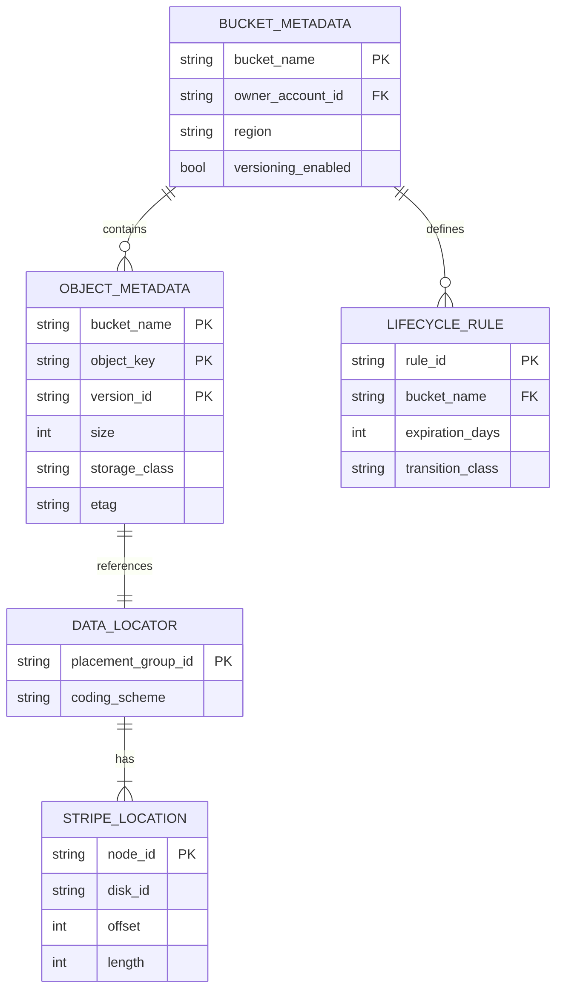
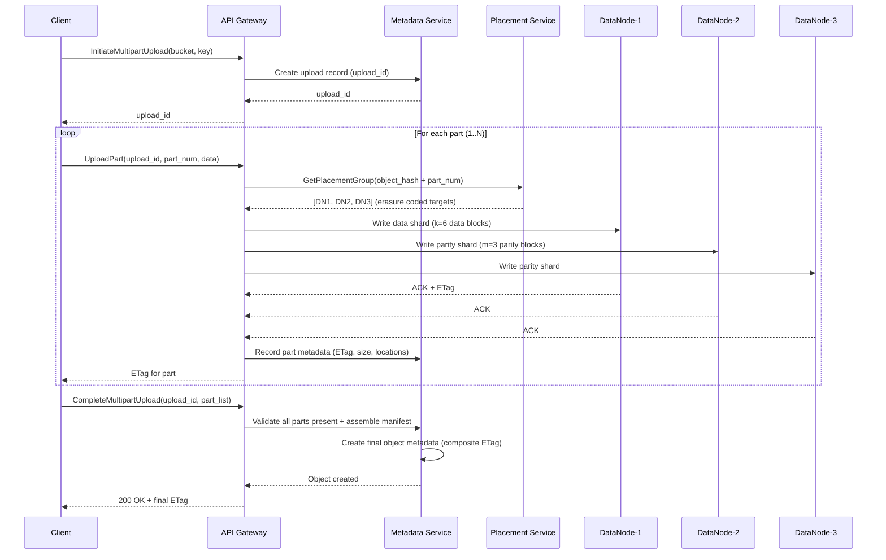
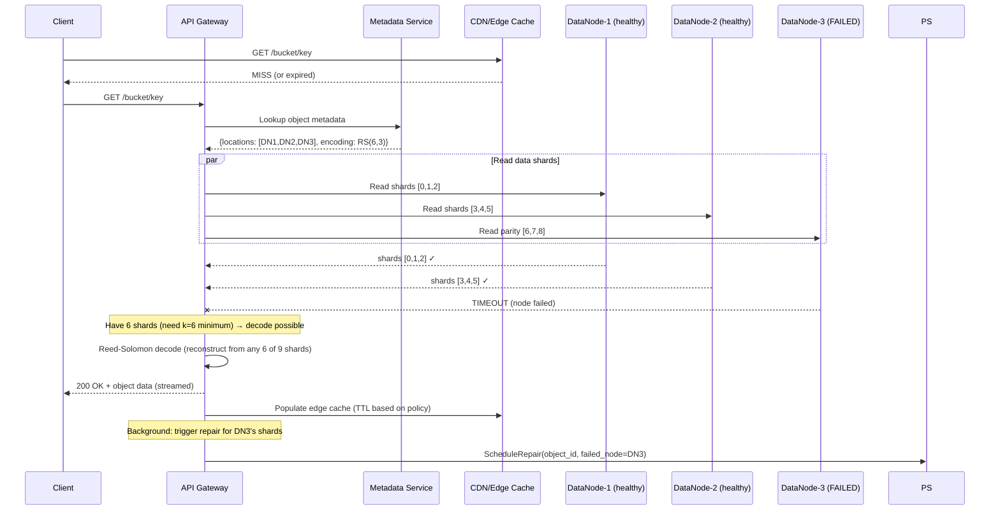
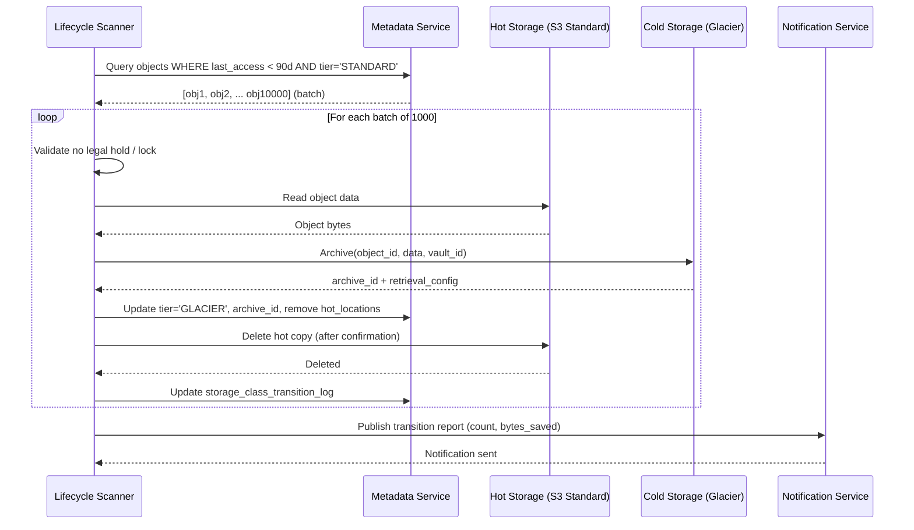

# S3-like Object Storage System Design

## 1. Requirements

### Functional Requirements
1. **PUT/GET/DELETE objects** - CRUD operations on arbitrary binary objects
2. **Buckets/Namespaces** - Logical containers with unique global names
3. **Versioning** - Optional per-bucket version history for all objects
4. **Lifecycle Policies** - Auto-transition between storage classes, auto-delete
5. **Multipart Upload** - Upload large objects in parallel parts
6. **Presigned URLs** - Time-limited access without credentials
7. **Event Notifications** - Trigger on object create/delete/transition
8. **Cross-Region Replication** - Async replication to other regions
9. **Storage Classes** - Standard, Infrequent Access, Archive, Deep Archive

### Non-Functional Requirements
| Requirement | Target |
|-------------|--------|
| Durability | 99.999999999% (11 nines) |
| Availability | 99.99% |
| Scale | Unlimited objects, exabytes of data |
| Consistency | Strong read-after-write |
| Max object size | 5 TB |
| Max PUT size (single) | 5 GB |
| Request rate | Millions/sec per prefix |

## 2. Capacity Estimation

### Scale
```
Total objects: 200+ trillion
Total storage: 100+ exabytes
PUT requests/sec: 10 million
GET requests/sec: 50 million
Metadata entries: 200 trillion
Average object size: 500 KB (highly variable: 1 byte - 5 TB)
```

### Storage Infrastructure
```
Storage nodes: 1,000,000+ servers
Disks per node: 36 × 16TB HDD = 576 TB raw per node
Usable per node (erasure coded): ~400 TB
Total raw capacity: 576 PB per 1000 nodes
Metadata storage: 200T × 500 bytes = 100 PB
Network: 25 Gbps per node, 100 Gbps spine
```

### Request Processing
```
API Gateway nodes: 10,000 (each handles 6000 req/s)
Metadata nodes: 50,000 (each handles 100K lookups/s)
Placement/routing nodes: 5,000
Index partitions: 1,000,000+
```

## 3. Data Modeling

### Entity-Relationship Diagram



### Object Metadata (Distributed KV Store)

```python
@dataclass
class ObjectMetadata:
    """Stored in distributed LSM-tree based KV store."""
    bucket_name: str            # Partition key level 1
    object_key: str             # Partition key level 2 (full path)
    version_id: str             # Unique version identifier
    
    # Object properties
    size: int                   # Object size in bytes
    etag: str                   # MD5 or multipart ETag
    content_type: str           # MIME type
    storage_class: str          # STANDARD, IA, ARCHIVE, etc.
    
    # Data location
    data_locator: DataLocator   # Points to actual data chunks
    
    # Metadata
    user_metadata: Dict[str, str]  # x-amz-meta-* headers
    system_metadata: Dict[str, str]
    
    # Timestamps
    created_at: int             # Unix timestamp (ms)
    last_modified: int
    expiration: Optional[int]   # TTL if set
    
    # Versioning
    is_latest: bool
    is_delete_marker: bool
    
    # Encryption
    encryption_algo: str        # AES-256, SSE-KMS
    encryption_key_id: str      # KMS key reference


@dataclass
class DataLocator:
    """Points to physical storage locations of object data."""
    placement_group_id: str     # Which erasure coding group
    stripe_locations: List[StripeLocation]  # Individual stripe locations
    coding_scheme: str          # e.g., "8+3" (8 data + 3 parity)
    
@dataclass
class StripeLocation:
    node_id: str               # Storage node
    disk_id: str               # Specific disk on node
    offset: int                # Byte offset on disk
    length: int                # Stripe length


@dataclass
class BucketMetadata:
    bucket_name: str            # Globally unique
    owner_account_id: str
    region: str
    created_at: int
    
    # Configuration
    versioning_enabled: bool
    lifecycle_rules: List[LifecycleRule]
    replication_config: Optional[ReplicationConfig]
    encryption_config: EncryptionConfig
    notification_config: List[NotificationRule]
    
    # Access
    acl: BucketACL
    policy: Optional[str]       # IAM policy JSON
    cors_rules: List[CORSRule]
    
    # Quotas
    object_lock_config: Optional[ObjectLockConfig]


@dataclass
class LifecycleRule:
    rule_id: str
    prefix_filter: str
    tag_filter: Dict[str, str]
    transitions: List[Transition]       # Move between storage classes
    expiration_days: Optional[int]      # Auto-delete after N days
    noncurrent_expiration_days: Optional[int]
    abort_incomplete_multipart_days: int

@dataclass
class Transition:
    days: int
    storage_class: str  # Target class
```

### Physical Storage Layout

```
Disk Layout per Storage Node:
┌─────────────────────────────────────────────┐
│ Disk Header (4KB)                           │
│ - Magic number, version, disk_id            │
│ - Node ID, rack ID, AZ                      │
├─────────────────────────────────────────────┤
│ Superblock (64KB)                           │
│ - Free space bitmap                         │
│ - Allocation table pointer                  │
├─────────────────────────────────────────────┤
│ Data Region (99.9% of disk)                 │
│ ┌─────────────────────────────────────────┐ │
│ │ Stripe 0: [data][checksum][header]      │ │
│ │ Stripe 1: [data][checksum][header]      │ │
│ │ Stripe 2: [data][checksum][header]      │ │
│ │ ...                                     │ │
│ └─────────────────────────────────────────┘ │
├─────────────────────────────────────────────┤
│ Journal (write-ahead log, 1GB)              │
└─────────────────────────────────────────────┘

Stripe Header (256 bytes):
- Object reference (bucket + key hash)
- Stripe index within object
- CRC-32C checksum
- Timestamp
- Erasure coding parameters
```

## 4. High-Level Design

```
┌─────────────────────────────────────────────────────────────────────────────────┐
│                              CLIENT SDK                                           │
│  (Retry logic, multipart orchestration, checksums, presigned URL generation)     │
└──────────────────────────────────────┬──────────────────────────────────────────┘
                                       │ HTTPS
                                       ▼
┌─────────────────────────────────────────────────────────────────────────────────┐
│                           API GATEWAY LAYER                                       │
│                                                                                   │
│  ┌────────────────┐  ┌────────────────┐  ┌────────────────┐                    │
│  │  TLS Termination│  │  Auth (SigV4)  │  │  Rate Limiting │                    │
│  └────────────────┘  └────────────────┘  └────────────────┘                    │
│  ┌────────────────┐  ┌────────────────┐  ┌────────────────┐                    │
│  │  Request Router │  │  Load Balancer │  │  Admission Ctrl│                    │
│  └────────────────┘  └────────────────┘  └────────────────┘                    │
└──────────────────────────────────────┬──────────────────────────────────────────┘
                                       │
              ┌────────────────────────┼────────────────────────┐
              │                        │                        │
              ▼                        ▼                        ▼
┌──────────────────────┐  ┌──────────────────────┐  ┌──────────────────────┐
│   METADATA SERVICE   │  │   DATA PLACEMENT     │  │   INDEX SERVICE      │
│                      │  │   SERVICE            │  │                      │
│ • Object lookup      │  │                      │  │ • Listing operations │
│ • Version management │  │ • Erasure coding     │  │ • Prefix queries     │
│ • ACL evaluation     │  │ • Node selection     │  │ • Continuation tokens│
│ • Consistency coord  │  │ • Failure domain     │  │ • Sorted iteration   │
│                      │  │   awareness          │  │                      │
│ [Paxos/Raft for     │  │ • Rebalancing        │  │ [LSM-tree based      │
│  strong consistency] │  │                      │  │  distributed index]  │
└──────────┬───────────┘  └──────────┬───────────┘  └──────────────────────┘
           │                         │
           ▼                         ▼
┌─────────────────────────────────────────────────────────────────────────────────┐
│                        STORAGE NODE LAYER                                         │
│                                                                                   │
│  ┌─────────────┐  ┌─────────────┐  ┌─────────────┐  ┌─────────────┐           │
│  │ Storage Node│  │ Storage Node│  │ Storage Node│  │ Storage Node│  ...       │
│  │             │  │             │  │             │  │             │           │
│  │ 36× HDD    │  │ 36× HDD    │  │ 36× HDD    │  │ 36× HDD    │           │
│  │ Write cache │  │ Write cache │  │ Write cache │  │ Write cache │           │
│  │ (NVMe SSD) │  │ (NVMe SSD) │  │ (NVMe SSD) │  │ (NVMe SSD) │           │
│  └─────────────┘  └─────────────┘  └─────────────┘  └─────────────┘           │
│                                                                                   │
│  Organized by: Rack → AZ → Region (failure domains)                              │
└─────────────────────────────────────────────────────────────────────────────────┘
           │
           ▼
┌─────────────────────────────────────────────────────────────────────────────────┐
│                     BACKGROUND SERVICES                                           │
│                                                                                   │
│  ┌──────────────┐  ┌──────────────┐  ┌──────────────┐  ┌──────────────┐        │
│  │  Lifecycle   │  │  Replication  │  │  Integrity   │  │  Garbage     │        │
│  │  Manager     │  │  Engine       │  │  Checker     │  │  Collector   │        │
│  │              │  │              │  │              │  │              │        │
│  │ • Transition │  │ • Cross-region│  │ • Bit-rot    │  │ • Delete     │        │
│  │ • Expiration │  │ • Async copy │  │   detection  │  │   markers    │        │
│  │ • Abort MPU  │  │ • Conflict   │  │ • Repair     │  │ • Orphan     │        │
│  │              │  │   resolution │  │ • Audit      │  │   cleanup    │        │
│  └──────────────┘  └──────────────┘  └──────────────┘  └──────────────┘        │
└─────────────────────────────────────────────────────────────────────────────────┘
```

## 5. Low-Level Design - APIs

### PUT Object

```http
PUT /bucket-name/path/to/object.dat HTTP/1.1
Host: s3.region.example.com
Authorization: AWS4-HMAC-SHA256 Credential=...
Content-Length: 10485760
Content-MD5: pUKnGe60/mlGoJvLTMFRCA==
Content-Type: application/octet-stream
x-amz-storage-class: STANDARD
x-amz-server-side-encryption: AES256
x-amz-meta-custom-key: custom-value

<binary data>

Response 200:
HTTP/1.1 200 OK
ETag: "d41d8cd98f00b204e9800998ecf8427e"
x-amz-version-id: 3HL4kqtJlcpXrN8YEW.x7wN9Gg50dwT2
x-amz-request-id: tx00000000000000a79e0b-...
```

### GET Object

```http
GET /bucket-name/path/to/object.dat HTTP/1.1
Host: s3.region.example.com
Authorization: AWS4-HMAC-SHA256 Credential=...
Range: bytes=0-1048575
If-None-Match: "old-etag"

Response 206:
HTTP/1.1 206 Partial Content
Content-Range: bytes 0-1048575/10485760
Content-Length: 1048576
ETag: "d41d8cd98f00b204e9800998ecf8427e"
Last-Modified: Thu, 15 Jan 2024 10:30:00 GMT
x-amz-version-id: 3HL4kqtJlcpXrN8YEW.x7wN9Gg50dwT2

<binary data>
```

### List Objects (with pagination)

```http
GET /bucket-name?prefix=photos/2024/&delimiter=/&max-keys=1000&continuation-token=token123
Host: s3.region.example.com

Response 200:
<?xml version="1.0" encoding="UTF-8"?>
<ListBucketResult>
    <Name>bucket-name</Name>
    <Prefix>photos/2024/</Prefix>
    <Delimiter>/</Delimiter>
    <MaxKeys>1000</MaxKeys>
    <IsTruncated>true</IsTruncated>
    <NextContinuationToken>token456</NextContinuationToken>
    <CommonPrefixes>
        <Prefix>photos/2024/january/</Prefix>
        <Prefix>photos/2024/february/</Prefix>
    </CommonPrefixes>
    <Contents>
        <Key>photos/2024/cover.jpg</Key>
        <LastModified>2024-01-15T10:30:00.000Z</LastModified>
        <ETag>"abc123..."</ETag>
        <Size>2048576</Size>
        <StorageClass>STANDARD</StorageClass>
    </Contents>
</ListBucketResult>
```

### Multipart Upload APIs

```http
# 1. Initiate
POST /bucket/large-file.zip?uploads
Response: <UploadId>upload-id-123</UploadId>

# 2. Upload Part (can be parallel)
PUT /bucket/large-file.zip?partNumber=1&uploadId=upload-id-123
Content-Length: 104857600
<100MB of data>
Response: ETag: "part1-etag"

# 3. Complete
POST /bucket/large-file.zip?uploadId=upload-id-123
<CompleteMultipartUpload>
    <Part><PartNumber>1</PartNumber><ETag>"part1-etag"</ETag></Part>
    <Part><PartNumber>2</PartNumber><ETag>"part2-etag"</ETag></Part>
    ...
</CompleteMultipartUpload>

Response: 
<CompleteMultipartUploadResult>
    <Location>https://s3.region.example.com/bucket/large-file.zip</Location>
    <ETag>"final-composite-etag"</ETag>
</CompleteMultipartUploadResult>
```

## 6. Deep Dive: Data Durability (Erasure Coding)

### Reed-Solomon Erasure Coding

```python
import numpy as np
from typing import List, Tuple

class ReedSolomonCoder:
    """
    Reed-Solomon erasure coding for 11-nines durability.
    Scheme: 8 data shards + 3 parity shards = 11 total
    Can tolerate loss of any 3 shards.
    """
    
    # Galois Field GF(2^8) operations
    GF_SIZE = 256
    PRIMITIVE_POLY = 0x11d  # x^8 + x^4 + x^3 + x^2 + 1
    
    def __init__(self, data_shards: int = 8, parity_shards: int = 3):
        self.data_shards = data_shards
        self.parity_shards = parity_shards
        self.total_shards = data_shards + parity_shards
        
        # Build Galois Field lookup tables
        self._build_gf_tables()
        # Build encoding matrix (Vandermonde)
        self.encoding_matrix = self._build_encoding_matrix()
    
    def _build_gf_tables(self):
        """Build GF(2^8) exp and log tables for fast arithmetic."""
        self.gf_exp = [0] * 512
        self.gf_log = [0] * 256
        
        x = 1
        for i in range(255):
            self.gf_exp[i] = x
            self.gf_log[x] = i
            x <<= 1
            if x >= 256:
                x ^= self.PRIMITIVE_POLY
        
        for i in range(255, 512):
            self.gf_exp[i] = self.gf_exp[i - 255]
    
    def _gf_mul(self, a: int, b: int) -> int:
        """Multiply in GF(2^8)."""
        if a == 0 or b == 0:
            return 0
        return self.gf_exp[self.gf_log[a] + self.gf_log[b]]
    
    def _build_encoding_matrix(self) -> List[List[int]]:
        """Build Vandermonde encoding matrix."""
        matrix = []
        for i in range(self.total_shards):
            row = []
            for j in range(self.data_shards):
                if i < self.data_shards:
                    # Identity matrix for data shards
                    row.append(1 if i == j else 0)
                else:
                    # Vandermonde rows for parity
                    row.append(self.gf_exp[((i - self.data_shards) * j) % 255])
            matrix.append(row)
        return matrix
    
    def encode(self, data: bytes) -> List[bytes]:
        """
        Encode data into data_shards + parity_shards shards.
        
        Input: Raw object data
        Output: List of 11 shards (8 data + 3 parity)
        """
        # Pad data to be divisible by data_shards
        shard_size = (len(data) + self.data_shards - 1) // self.data_shards
        padded = data.ljust(shard_size * self.data_shards, b'\x00')
        
        # Split into data shards
        data_shards = [
            padded[i * shard_size:(i + 1) * shard_size]
            for i in range(self.data_shards)
        ]
        
        # Compute parity shards
        parity_shards = []
        for p in range(self.parity_shards):
            parity = bytearray(shard_size)
            for byte_idx in range(shard_size):
                val = 0
                for d in range(self.data_shards):
                    coeff = self.encoding_matrix[self.data_shards + p][d]
                    val ^= self._gf_mul(coeff, data_shards[d][byte_idx])
                parity[byte_idx] = val
            parity_shards.append(bytes(parity))
        
        return data_shards + parity_shards
    
    def decode(self, shards: List[bytes], available: List[int]) -> bytes:
        """
        Reconstruct original data from any data_shards available shards.
        
        shards: All shards (None for missing ones)
        available: Indices of available shards
        """
        if len(available) < self.data_shards:
            raise ValueError(f"Need at least {self.data_shards} shards, have {len(available)}")
        
        # Select data_shards shards to use
        selected = available[:self.data_shards]
        
        # Build sub-matrix from encoding matrix for selected shards
        sub_matrix = [self.encoding_matrix[i] for i in selected]
        
        # Invert the sub-matrix in GF(2^8)
        inverse = self._gf_matrix_inverse(sub_matrix)
        
        # Multiply inverse by available shards to get original data
        shard_size = len(shards[selected[0]])
        result_shards = []
        
        for d in range(self.data_shards):
            result = bytearray(shard_size)
            for byte_idx in range(shard_size):
                val = 0
                for s_idx, s in enumerate(selected):
                    val ^= self._gf_mul(inverse[d][s_idx], shards[s][byte_idx])
                result[byte_idx] = val
            result_shards.append(bytes(result))
        
        return b''.join(result_shards)
    
    def _gf_matrix_inverse(self, matrix):
        """Invert matrix in GF(2^8) using Gaussian elimination."""
        n = len(matrix)
        # Augment with identity
        aug = [row[:] + [1 if i == j else 0 for j in range(n)] for i, row in enumerate(matrix)]
        
        for col in range(n):
            # Find pivot
            pivot_row = None
            for row in range(col, n):
                if aug[row][col] != 0:
                    pivot_row = row
                    break
            if pivot_row is None:
                raise ValueError("Matrix is singular")
            
            aug[col], aug[pivot_row] = aug[pivot_row], aug[col]
            
            # Scale pivot row
            scale = self.gf_exp[255 - self.gf_log[aug[col][col]]] if aug[col][col] != 0 else 0
            for j in range(2 * n):
                aug[col][j] = self._gf_mul(aug[col][j], scale)
            
            # Eliminate
            for row in range(n):
                if row != col and aug[row][col] != 0:
                    factor = aug[row][col]
                    for j in range(2 * n):
                        aug[row][j] ^= self._gf_mul(factor, aug[col][j])
        
        return [row[n:] for row in aug]


class DataPlacementService:
    """
    Places erasure-coded shards across failure domains.
    Ensures no two shards of same object share a failure domain.
    """
    
    def __init__(self, topology: 'ClusterTopology'):
        self.topology = topology
    
    def place_shards(self, object_id: str, num_shards: int) -> List[dict]:
        """
        Select storage locations across failure domains.
        
        Placement rules:
        1. No two shards on same storage node
        2. No more than 2 shards in same rack
        3. Shards spread across at least 3 AZs
        4. Consider disk utilization for balance
        """
        placements = []
        used_nodes = set()
        rack_counts = {}
        az_counts = {}
        
        # Sort candidate nodes by available capacity (least loaded first with jitter)
        candidates = self.topology.get_healthy_nodes()
        candidates.sort(key=lambda n: n.utilization + hash(object_id + n.id) % 5)
        
        for node in candidates:
            if len(placements) >= num_shards:
                break
            
            # Check constraints
            if node.id in used_nodes:
                continue
            if rack_counts.get(node.rack_id, 0) >= 2:
                continue
            
            placements.append({
                'node_id': node.id,
                'disk_id': node.least_utilized_disk(),
                'rack_id': node.rack_id,
                'az': node.az,
                'region': node.region
            })
            used_nodes.add(node.id)
            rack_counts[node.rack_id] = rack_counts.get(node.rack_id, 0) + 1
            az_counts[node.az] = az_counts.get(node.az, 0) + 1
        
        # Verify AZ spread
        if len(az_counts) < 3 and self.topology.num_azs >= 3:
            # Re-place to ensure AZ diversity
            placements = self._rebalance_az(placements, object_id, num_shards)
        
        return placements


class ConsistencyCoordinator:
    """
    Strong read-after-write consistency using Paxos for metadata.
    """
    
    def __init__(self, metadata_replicas: List['MetadataNode']):
        self.replicas = metadata_replicas
        self.quorum_size = len(metadata_replicas) // 2 + 1
    
    async def write_metadata(self, key: str, value: dict) -> bool:
        """
        Write metadata with Paxos consensus.
        Guarantees subsequent reads see this write.
        """
        proposal_id = self._generate_proposal_id()
        
        # Phase 1: Prepare
        promises = []
        for replica in self.replicas:
            promise = await replica.prepare(proposal_id, key)
            if promise.accepted:
                promises.append(promise)
        
        if len(promises) < self.quorum_size:
            return False  # Failed to get quorum
        
        # Check if any replica has a higher-numbered accepted value
        highest_accepted = max(
            (p for p in promises if p.accepted_value is not None),
            key=lambda p: p.accepted_id,
            default=None
        )
        
        final_value = highest_accepted.accepted_value if highest_accepted else value
        
        # Phase 2: Accept
        accepts = []
        for replica in self.replicas:
            accept = await replica.accept(proposal_id, key, final_value)
            if accept.accepted:
                accepts.append(accept)
        
        if len(accepts) < self.quorum_size:
            return False
        
        # Phase 3: Commit (learn)
        for replica in self.replicas:
            await replica.commit(proposal_id, key, final_value)
        
        return True
    
    async def read_metadata(self, key: str) -> dict:
        """
        Strongly consistent read - reads from quorum.
        """
        responses = []
        for replica in self.replicas:
            resp = await replica.read(key)
            if resp is not None:
                responses.append(resp)
            if len(responses) >= self.quorum_size:
                break
        
        if len(responses) < self.quorum_size:
            raise Exception("Cannot achieve read quorum")
        
        # Return the value with highest version/proposal_id
        return max(responses, key=lambda r: r['version'])
```

### Durability Analysis

```
Erasure Coding 8+3:
- Tolerate 3 simultaneous shard losses
- Shard failure probability: 0.1% per year (per disk)
- Probability of 4+ failures in same stripe: 
  C(11,4) × (0.001)^4 × (0.999)^7 ≈ 3.3 × 10^-13
- Annual durability: 1 - 3.3×10^-13 ≈ 99.99999999967% (>11 nines)

Storage overhead comparison:
| Method          | Overhead | Durability | Repair Speed |
|-----------------|----------|------------|--------------|
| 3× Replication  | 200%     | ~99.9999%  | Fast         |
| RS(6,3)         | 50%      | 11 nines   | Medium       |
| RS(8,3)         | 37.5%    | 11 nines   | Medium       |
| RS(12,4)        | 33%      | 13 nines   | Slow         |
```

## 7. Deep Dive: Metadata Indexing at Scale

### LSM-Tree Based Distributed KV Store

```python
import bisect
import struct
import hashlib
from typing import Optional, Iterator, Tuple

class MemTable:
    """
    In-memory sorted structure (skip list) for recent writes.
    Flushed to SSTable when size threshold reached.
    """
    
    MAX_SIZE = 64 * 1024 * 1024  # 64MB before flush
    
    def __init__(self):
        self.entries = {}  # Simplified; real impl uses skip list
        self.size_bytes = 0
        self.wal = WriteAheadLog()
    
    def put(self, key: str, value: bytes) -> bool:
        """Write to memtable with WAL."""
        # Write to WAL first for durability
        self.wal.append('PUT', key, value)
        
        self.entries[key] = value
        self.size_bytes += len(key) + len(value)
        
        return self.size_bytes >= self.MAX_SIZE  # Signal flush needed
    
    def get(self, key: str) -> Optional[bytes]:
        return self.entries.get(key)
    
    def scan(self, start_key: str, end_key: str) -> Iterator[Tuple[str, bytes]]:
        """Range scan over memtable entries."""
        for k in sorted(self.entries.keys()):
            if k >= start_key and k <= end_key:
                yield (k, self.entries[k])


class SSTable:
    """
    Sorted String Table - immutable on-disk sorted key-value file.
    
    File format:
    [Data Blocks][Meta Block][Index Block][Footer]
    
    Data Block (default 4KB):
    [shared_prefix_len|unshared_len|value_len|unshared_key|value] × N
    [restart_points] [num_restarts]
    
    Index Block:
    [last_key_in_block → block_offset] for each data block
    
    Filter Block (Bloom filter):
    [bloom_filter_bits] for each data block
    """
    
    BLOCK_SIZE = 4096
    
    def __init__(self, file_path: str):
        self.file_path = file_path
        self.index = None
        self.bloom_filter = None
        self._load_index()
    
    def _load_index(self):
        """Load index block and bloom filter into memory."""
        # Read footer to find index and filter block offsets
        with open(self.file_path, 'rb') as f:
            f.seek(-48, 2)  # Footer is last 48 bytes
            footer = f.read(48)
            index_offset = struct.unpack('<Q', footer[0:8])[0]
            index_size = struct.unpack('<Q', footer[8:16])[0]
            filter_offset = struct.unpack('<Q', footer[16:24])[0]
            filter_size = struct.unpack('<Q', footer[24:32])[0]
            
            # Load index
            f.seek(index_offset)
            self.index = self._parse_index(f.read(index_size))
            
            # Load bloom filter
            f.seek(filter_offset)
            self.bloom_filter = BloomFilter.from_bytes(f.read(filter_size))
    
    def get(self, key: str) -> Optional[bytes]:
        """Point lookup with bloom filter optimization."""
        # Check bloom filter first (avoid disk read if key definitely absent)
        if not self.bloom_filter.might_contain(key):
            return None
        
        # Binary search index to find candidate block
        block_offset = self._find_block(key)
        if block_offset is None:
            return None
        
        # Read and search the data block
        block = self._read_block(block_offset)
        return self._search_block(block, key)
    
    def scan(self, start_key: str, end_key: str) -> Iterator[Tuple[str, bytes]]:
        """Range scan across multiple blocks."""
        start_block = self._find_block(start_key)
        
        for block_offset in self._blocks_from(start_block):
            block = self._read_block(block_offset)
            for key, value in self._iterate_block(block):
                if key > end_key:
                    return
                if key >= start_key:
                    yield (key, value)


class MetadataPartitioner:
    """
    Partition metadata across nodes using prefix-based partitioning.
    
    Key format: {bucket_name}/{object_key}
    Partition by: hash(bucket_name) for bucket operations
                  hash(bucket_name + prefix) for listing
    """
    
    def __init__(self, partition_count: int = 1_000_000):
        self.partition_count = partition_count
        self.partition_map = {}  # partition_id → node_id
    
    def get_partition(self, bucket: str, key: str) -> int:
        """Determine which partition owns this key."""
        # Hash the bucket + first-level prefix for locality
        prefix = key.split('/')[0] if '/' in key else ''
        partition_key = f"{bucket}/{prefix}"
        return int(hashlib.md5(partition_key.encode()).hexdigest(), 16) % self.partition_count
    
    def list_objects(self, bucket: str, prefix: str, 
                     continuation_token: Optional[str] = None,
                     max_keys: int = 1000) -> dict:
        """
        Listing with continuation tokens for pagination.
        
        Challenge: Objects are spread across partitions.
        Solution: Prefix-based partitioning ensures listing locality.
        """
        partition_id = self.get_partition(bucket, prefix)
        node = self.partition_map[partition_id]
        
        # Construct scan range
        start_key = continuation_token if continuation_token else prefix
        end_key = self._prefix_successor(prefix)  # prefix + 1 lexicographically
        
        results = node.scan(
            start_key=f"{bucket}/{start_key}",
            end_key=f"{bucket}/{end_key}",
            limit=max_keys + 1
        )
        
        objects = results[:max_keys]
        is_truncated = len(results) > max_keys
        next_token = objects[-1]['key'] if is_truncated else None
        
        return {
            'objects': objects,
            'is_truncated': is_truncated,
            'next_continuation_token': next_token
        }
    
    def _prefix_successor(self, prefix: str) -> str:
        """Get the lexicographic successor of a prefix."""
        if not prefix:
            return '\xff'
        return prefix[:-1] + chr(ord(prefix[-1]) + 1)


class BloomFilter:
    """Bloom filter for SSTable - reduces unnecessary disk reads."""
    
    def __init__(self, capacity: int, error_rate: float = 0.01):
        self.size = self._optimal_size(capacity, error_rate)
        self.hash_count = self._optimal_hashes(self.size, capacity)
        self.bits = bytearray(self.size // 8 + 1)
    
    def add(self, key: str):
        for i in range(self.hash_count):
            idx = self._hash(key, i) % self.size
            self.bits[idx // 8] |= (1 << (idx % 8))
    
    def might_contain(self, key: str) -> bool:
        for i in range(self.hash_count):
            idx = self._hash(key, i) % self.size
            if not (self.bits[idx // 8] & (1 << (idx % 8))):
                return False
        return True
    
    def _hash(self, key: str, seed: int) -> int:
        return int(hashlib.md5(f"{key}:{seed}".encode()).hexdigest(), 16)
    
    @staticmethod
    def _optimal_size(n: int, p: float) -> int:
        import math
        return int(-n * math.log(p) / (math.log(2) ** 2))
    
    @staticmethod
    def _optimal_hashes(m: int, n: int) -> int:
        import math
        return max(1, int(m / n * math.log(2)))
```

## 8. Deep Dive: Multipart Upload

### Implementation

```python
import asyncio
import time
from enum import Enum
from typing import Dict, List, Optional

class MultipartUploadState(Enum):
    INITIATED = "initiated"
    IN_PROGRESS = "in_progress"
    COMPLETING = "completing"
    COMPLETED = "completed"
    ABORTED = "aborted"

class MultipartUploadManager:
    """
    Manages multipart uploads: initiate → upload parts → complete/abort.
    
    Design decisions:
    - Parts can be uploaded in any order
    - Parts can be uploaded in parallel
    - Each part: 5MB minimum (except last), 5GB maximum
    - Max 10,000 parts per upload
    - Incomplete uploads garbage collected after configurable timeout
    """
    
    def __init__(self, metadata_db, storage_service, gc_service):
        self.metadata_db = metadata_db
        self.storage = storage_service
        self.gc = gc_service
    
    async def initiate(self, bucket: str, key: str, 
                       metadata: dict) -> dict:
        """
        Initiate multipart upload. Returns upload_id.
        """
        upload_id = self._generate_upload_id()
        
        await self.metadata_db.create_multipart_upload({
            'upload_id': upload_id,
            'bucket': bucket,
            'key': key,
            'state': MultipartUploadState.INITIATED.value,
            'initiated_at': int(time.time() * 1000),
            'metadata': metadata,
            'parts': {}
        })
        
        return {
            'upload_id': upload_id,
            'bucket': bucket,
            'key': key
        }
    
    async def upload_part(self, upload_id: str, part_number: int,
                          data: bytes, content_md5: str) -> dict:
        """
        Upload a single part. Parts can arrive out of order.
        """
        # Validate
        upload = await self.metadata_db.get_multipart_upload(upload_id)
        if not upload:
            raise ValueError("Upload not found")
        if part_number < 1 or part_number > 10000:
            raise ValueError("Part number must be 1-10000")
        if len(data) > 5 * 1024 * 1024 * 1024:
            raise ValueError("Part exceeds 5GB limit")
        
        # Store part data
        part_key = f"multipart/{upload_id}/part-{part_number:05d}"
        etag = hashlib.md5(data).hexdigest()
        
        # Verify content integrity
        if content_md5 and content_md5 != etag:
            raise ValueError("Content MD5 mismatch")
        
        await self.storage.put_object(part_key, data)
        
        # Record part metadata
        await self.metadata_db.record_part({
            'upload_id': upload_id,
            'part_number': part_number,
            'etag': etag,
            'size': len(data),
            'storage_key': part_key
        })
        
        return {
            'part_number': part_number,
            'etag': f'"{etag}"'
        }
    
    async def complete(self, upload_id: str, 
                       parts_manifest: List[dict]) -> dict:
        """
        Complete multipart upload: assemble parts into final object.
        
        Steps:
        1. Validate all parts exist and ETags match
        2. Concatenate parts into final object (logical, not physical copy)
        3. Write final object metadata
        4. Clean up multipart state
        """
        upload = await self.metadata_db.get_multipart_upload(upload_id)
        if not upload:
            raise ValueError("Upload not found")
        
        # Validate parts
        total_size = 0
        part_locators = []
        
        for i, part_info in enumerate(parts_manifest):
            stored_part = await self.metadata_db.get_part(
                upload_id, part_info['part_number']
            )
            if not stored_part:
                raise ValueError(f"Part {part_info['part_number']} not found")
            if stored_part['etag'] != part_info['etag'].strip('"'):
                raise ValueError(f"ETag mismatch for part {part_info['part_number']}")
            
            # Validate minimum size (5MB except last part)
            if i < len(parts_manifest) - 1 and stored_part['size'] < 5 * 1024 * 1024:
                raise ValueError(f"Part {part_info['part_number']} below 5MB minimum")
            
            total_size += stored_part['size']
            part_locators.append(stored_part['storage_key'])
        
        # Create composite object (zero-copy: just reference parts)
        composite_etag = self._compute_multipart_etag(parts_manifest)
        
        final_metadata = ObjectMetadata(
            bucket_name=upload['bucket'],
            object_key=upload['key'],
            version_id=self._generate_version_id(),
            size=total_size,
            etag=composite_etag,
            content_type=upload['metadata'].get('content_type', 'application/octet-stream'),
            storage_class=upload['metadata'].get('storage_class', 'STANDARD'),
            data_locator=self._create_composite_locator(part_locators),
            user_metadata=upload['metadata'].get('user_metadata', {}),
            system_metadata={},
            created_at=int(time.time() * 1000),
            last_modified=int(time.time() * 1000),
            expiration=None,
            is_latest=True,
            is_delete_marker=False,
            encryption_algo='AES256',
            encryption_key_id=''
        )
        
        await self.metadata_db.put_object_metadata(final_metadata)
        
        # Mark upload as completed
        await self.metadata_db.update_multipart_state(
            upload_id, MultipartUploadState.COMPLETED.value
        )
        
        # Schedule cleanup of temporary part storage
        await self.gc.schedule_cleanup(upload_id, part_locators)
        
        return {
            'location': f"https://s3.example.com/{upload['bucket']}/{upload['key']}",
            'bucket': upload['bucket'],
            'key': upload['key'],
            'etag': f'"{composite_etag}"'
        }
    
    def _compute_multipart_etag(self, parts: List[dict]) -> str:
        """Compute composite ETag: md5(concat(part_md5s))-num_parts"""
        md5s = b''
        for part in parts:
            md5s += bytes.fromhex(part['etag'].strip('"'))
        final_hash = hashlib.md5(md5s).hexdigest()
        return f"{final_hash}-{len(parts)}"


class MultipartGarbageCollector:
    """
    Clean up incomplete multipart uploads.
    Runs periodically to reclaim storage from abandoned uploads.
    """
    
    def __init__(self, metadata_db, storage_service, 
                 default_ttl_days: int = 7):
        self.metadata_db = metadata_db
        self.storage = storage_service
        self.default_ttl_days = default_ttl_days
    
    async def run_gc_cycle(self):
        """Find and clean up expired incomplete uploads."""
        cutoff = int(time.time() * 1000) - (self.default_ttl_days * 86400 * 1000)
        
        expired_uploads = await self.metadata_db.find_expired_uploads(
            states=[MultipartUploadState.INITIATED.value, 
                    MultipartUploadState.IN_PROGRESS.value],
            initiated_before=cutoff,
            limit=1000
        )
        
        for upload in expired_uploads:
            await self._cleanup_upload(upload)
    
    async def _cleanup_upload(self, upload: dict):
        """Delete all parts and metadata for an abandoned upload."""
        parts = await self.metadata_db.list_parts(upload['upload_id'])
        
        # Delete part data from storage
        for part in parts:
            await self.storage.delete_object(part['storage_key'])
        
        # Delete metadata
        await self.metadata_db.delete_multipart_upload(upload['upload_id'])
        
        print(f"GC: Cleaned upload {upload['upload_id']}, "
              f"reclaimed {sum(p['size'] for p in parts)} bytes")
```

## 9. Component Optimization

### Storage Tiering
```
Standard (Hot):
- Erasure coding 8+3, all HDD
- 4 copies of metadata
- Target: first 30 days access pattern

Infrequent Access:
- Erasure coding 8+3, same physical storage
- Minimum storage charge: 30 days
- Higher retrieval cost, lower storage cost

Archive (Cold):
- Erasure coding 12+4 on high-density drives
- Metadata remains online (for listing)
- Data requires "restore" operation (minutes to hours)
- Tape-backed option for deep archive
```

### Request Processing Pipeline
```
1. TLS termination (dedicated hardware)
2. SigV4 signature verification (cached credentials)
3. Bucket/IAM policy evaluation (cached 5min)
4. Rate limiting (token bucket per prefix)
5. Route to appropriate storage partition
6. Parallel data I/O to storage nodes
7. Consistency verification
8. Response with ETags and version IDs
```

## 10. Observability

### Key Metrics
```yaml
Availability:
  - request_success_rate (target: 99.99%)
  - 5xx_error_rate
  - first_byte_latency_p50_p99

Durability:
  - bit_rot_detected_per_day
  - shards_in_degraded_state
  - repair_queue_depth
  - data_loss_events (target: 0)

Performance:
  - put_latency_by_size_bucket
  - get_latency_by_size_bucket
  - list_latency
  - multipart_completion_time

Capacity:
  - total_bytes_stored_by_class
  - disk_utilization_per_node
  - requests_per_second_per_partition
```

## 11. Performance Benchmarks

| Operation | Size | P50 | P95 | P99 |
|-----------|------|-----|-----|-----|
| PUT | 1 KB | 15ms | 50ms | 100ms |
| PUT | 1 MB | 50ms | 150ms | 300ms |
| PUT | 100 MB | 2s | 5s | 10s |
| GET | 1 KB | 10ms | 30ms | 80ms |
| GET | 1 MB | 30ms | 100ms | 200ms |
| GET | 100 MB | 1.5s | 3s | 6s |
| HEAD | any | 5ms | 15ms | 40ms |
| LIST (1000) | - | 50ms | 150ms | 300ms |
| DELETE | any | 10ms | 30ms | 60ms |

## 12. Trade-off Analysis

| Decision | Option A | Option B | Choice & Rationale |
|----------|----------|----------|-------------------|
| Durability method | 3× replication | Erasure coding | **EC** - 11 nines at 37.5% overhead vs 200% |
| Consistency | Eventual | Strong read-after-write | **Strong** - user expectation, worth the latency |
| Metadata store | SQL | Custom LSM KV | **LSM KV** - optimized for write-heavy, scales better |
| Index partitioning | Hash-based | Prefix-based | **Prefix** - locality for LIST operations |
| Part assembly | Physical copy | Logical reference | **Logical** - zero-copy completion |

## 13. Considerations

- **Consistency at scale**: Paxos per-partition limits metadata write throughput; batching helps
- **Hot partitions**: Single key receiving millions of req/s needs automatic partition splitting
- **Cross-region replication lag**: Async replication means temporary inconsistency across regions
- **Cost of erasure coding repairs**: Network-intensive; schedule during off-peak
- **Encryption key management**: Customer-managed keys add complexity but required for compliance

---

## Sequence Diagrams

### PUT Object - Multipart Upload Flow



### GET Object with Erasure Code Reconstruction



### Lifecycle Transition to Glacier



## Caching Strategy

| Layer | Technology | What's Cached | TTL | Eviction |
|-------|-----------|---------------|-----|----------|
| Edge/CDN | CloudFront/Akamai | Immutable objects (versioned keys) | 24h-365d | Version change invalidation |
| API Gateway | Local LRU | Auth tokens, bucket policies | 5 min | LRU + policy change event |
| Metadata | Redis Cluster | Object metadata (key→location mapping) | 1h | Write-through on PUT/DELETE |
| Block cache | Local NVMe on DataNodes | Hot data blocks (read amplification) | LFU-based | Size-bounded (10% of node) |
| Client-side | SDK in-memory | ListObjects results, HEAD responses | 60s | TTL expiry |

**Cache Invalidation Strategy:**
- Versioned objects: Cache forever (immutable content-addressable)
- Non-versioned: Event-driven invalidation via SQS on PUT/DELETE
- Metadata: Write-through ensures consistency; async propagation to edge (50ms p99)
- Negative caching: Cache 404s for 5s to prevent repeated NameNode lookups on non-existent keys

## Algorithm Deep Dive: Erasure Coding (Reed-Solomon)

### What is Erasure Coding?

Erasure coding splits data into `k` data fragments and generates `m` parity (redundancy) fragments such that the original data can be reconstructed from **any k of (k+m)** fragments. This provides fault tolerance equivalent to `m` replica failures with far less storage overhead than full replication.

### Why 6+3 (RS(6,3)) Encoding for Object Storage?

| Strategy | Storage Overhead | Tolerates | Durability (annual) |
|----------|-----------------|-----------|---------------------|
| 3x Replication | 200% | 2 failures | 99.99% |
| RS(6,3) | 50% | 3 failures | 99.999999% (8 nines) |
| RS(10,4) | 40% | 4 failures | 99.9999999999% |

RS(6,3) is the sweet spot: 50% overhead (vs 200% for 3x replication) while tolerating 3 simultaneous failures with higher durability.

### Step-by-Step Reed-Solomon Encoding

**Example: Encoding a 6-byte data block `[D0, D1, D2, D3, D4, D5]`**

**Step 1: Represent data as a polynomial over GF(2^8)**

Each byte becomes a coefficient in a polynomial of degree k-1:
```
f(x) = D0 + D1·x + D2·x² + D3·x³ + D4·x⁴ + D5·x⁵
```

All arithmetic is in Galois Field GF(2^8) — addition = XOR, multiplication via lookup tables.

**Step 2: Generate encoding matrix (Vandermonde or Cauchy)**

```
Encoding Matrix (9×6):
┌ 1  0  0  0  0  0 ┐   ← Identity (data shards pass through)
│ 0  1  0  0  0  0 │
│ 0  0  1  0  0  0 │
│ 0  0  0  1  0  0 │
│ 0  0  0  0  1  0 │
│ 0  0  0  0  0  1 │
│ 1  1  1  1  1  1 │   ← Parity row 1: evaluate f(1)
│ 1  2  4  8  16 32│   ← Parity row 2: evaluate f(2) [powers of 2 in GF]
└ 1  3  5  15 17 51┘   ← Parity row 3: evaluate f(3) [powers of 3 in GF]
```

**Step 3: Matrix multiplication → produce 9 shards**

```
[S0..S8] = EncodingMatrix × [D0..D5]

S0-S5 = D0-D5 (data shards, unchanged)
S6 = D0 ⊕ D1 ⊕ D2 ⊕ D3 ⊕ D4 ⊕ D5 (simple XOR parity)
S7 = Σ Di·2^i in GF(2^8)
S8 = Σ Di·3^i in GF(2^8)
```

**Step 4: Distribute shards across nodes**

```
Shard 0 → Node A (Rack 1)
Shard 1 → Node B (Rack 1)
Shard 2 → Node C (Rack 2)
Shard 3 → Node D (Rack 2)
Shard 4 → Node E (Rack 3)
Shard 5 → Node F (Rack 3)
Shard 6 → Node G (Rack 1)  [parity]
Shard 7 → Node H (Rack 2)  [parity]
Shard 8 → Node I (Rack 3)  [parity]
```

### Data Recovery (Decoding)

**Scenario: Nodes C, F, and I fail (shards 2, 5, 8 lost)**

**Step 1:** Identify surviving shards: {S0, S1, S3, S4, S6, S7} (6 shards — exactly k)

**Step 2:** Extract corresponding rows from encoding matrix:
```
Sub-matrix (6×6):
Row 0: [1, 0, 0, 0, 0, 0]  (for S0)
Row 1: [0, 1, 0, 0, 0, 0]  (for S1)
Row 3: [0, 0, 0, 1, 0, 0]  (for S3)
Row 4: [0, 0, 0, 0, 1, 0]  (for S4)
Row 6: [1, 1, 1, 1, 1, 1]  (for S6)
Row 7: [1, 2, 4, 8, 16, 32] (for S7)
```

**Step 3:** Compute inverse of sub-matrix in GF(2^8) using Gaussian elimination

**Step 4:** Multiply inverse by surviving shards to recover original data:
```
[D0..D5] = SubMatrix⁻¹ × [S0, S1, S3, S4, S6, S7]
```

**Complexity Analysis:**
- Encoding: O(k × m × block_size) — parallelizable per stripe
- Decoding: O(k² + k × block_size) — matrix inversion O(k²) dominates for small blocks
- In practice: SIMD-optimized GF multiplication → 2-4 GB/s per core

### Consistent Hashing for Object Placement

**Problem:** Distribute billions of objects across thousands of nodes with minimal redistribution when nodes join/leave.

**Step 1: Hash Ring Construction**

```
Ring space: 0 to 2^128 - 1 (MD5 or SHA-based)

Physical Nodes: A, B, C, D (4 nodes)
Virtual Nodes per physical: 150 (total 600 points on ring)

A_001 → hash("A_001") = 0x0A3F...  → position 423
A_002 → hash("A_002") = 0x7B21...  → position 31521
...
B_001 → hash("B_001") = 0x1C8E...  → position 7310
```

**Step 2: Object Placement**

```
object_key = "photos/user123/vacation.jpg"
hash(object_key) = 0x4E7A... → position 20090

Walk clockwise → first virtual node encountered = B_042 → Physical Node B
Continue clockwise for replicas: next distinct physical = C_017, then A_089
Placement: [B, C, A]
```

**Step 3: Node Addition (Node E joins)**

```
Before: Objects in range (D_last, A_first] → all go to A
After:  E's virtual nodes land between D and A
        Only objects in (D_last, E_first] move from A to E
        
Result: ~1/N of data moves (only from adjacent nodes)
        With 150 vnodes, load variance < 5%
```

**Step 4: Weighted Placement**

```
Node with 8TB disk → 200 virtual nodes
Node with 4TB disk → 100 virtual nodes
New SSD node (fast) → 250 virtual nodes (higher weight)
```

**Why 150 virtual nodes?**
- <50: Uneven distribution (>20% variance)
- 150: Good balance (~5% variance, manageable memory)
- >500: Memory overhead for ring state becomes significant at 10K+ nodes
