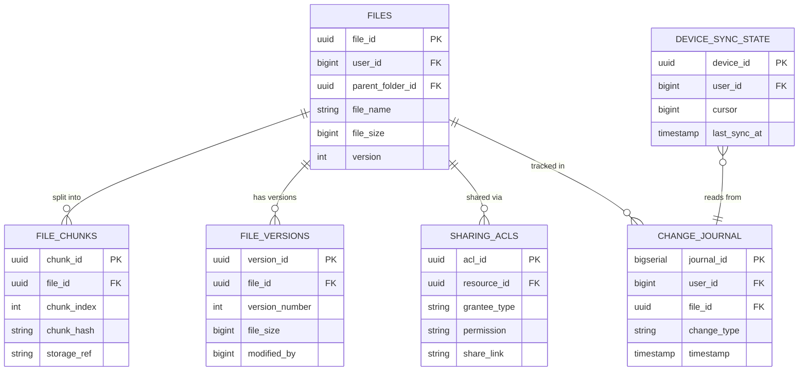
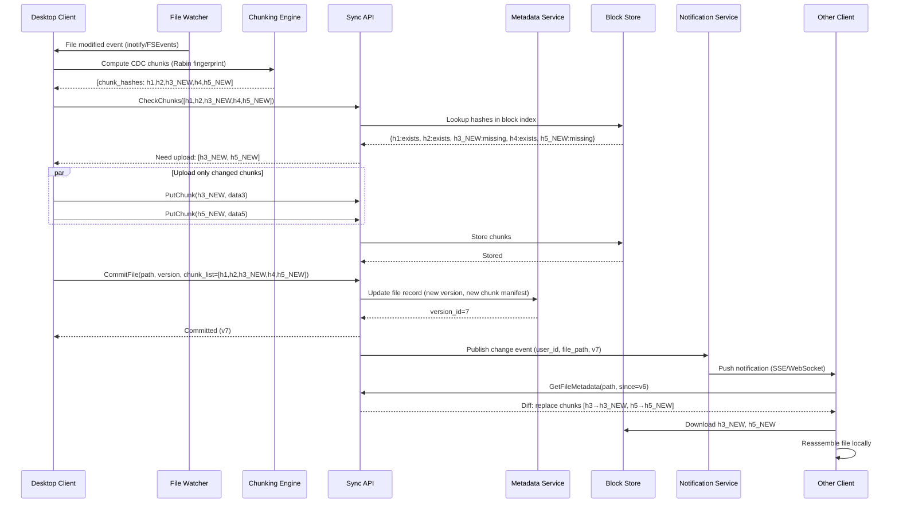
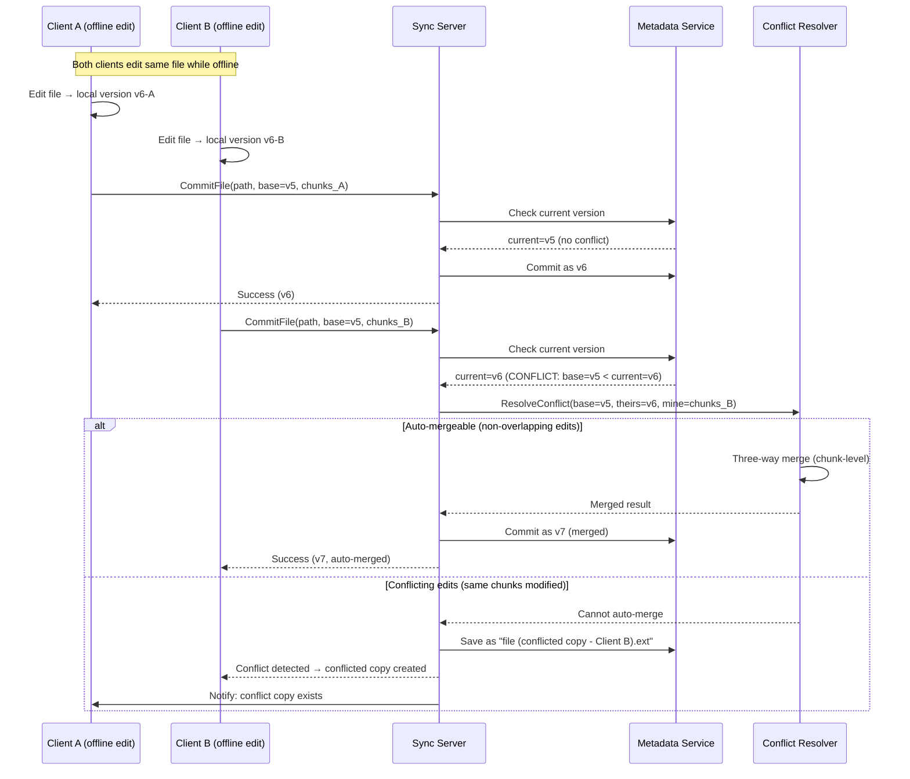
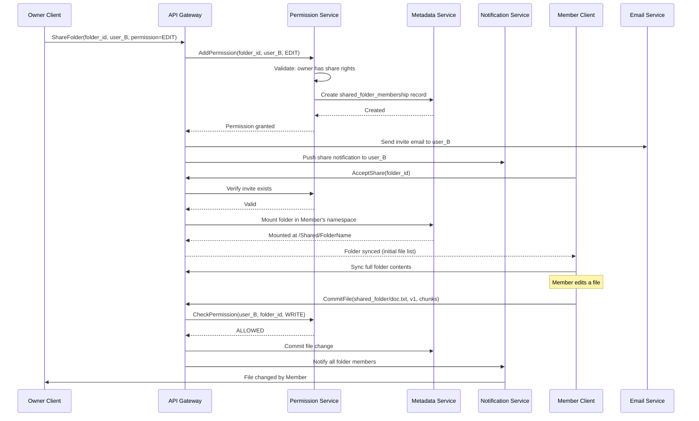

# Dropbox / Google Drive - Cloud File Storage & Sync System Design

## 1. Requirements

### Functional Requirements
1. **File Upload/Download** - Upload files of any size; download files with resume capability
2. **Sync Across Devices** - Real-time synchronization across all connected devices
3. **Versioning** - Maintain file history with ability to restore previous versions
4. **Sharing with Permissions** - Share files/folders with read/write/comment permissions
5. **Conflict Resolution** - Handle simultaneous edits gracefully
6. **Selective Sync** - Choose which folders sync to which devices
7. **Offline Access** - Mark files for offline availability; queue changes for sync
8. **Search** - Full-text search across file names and contents

### Non-Functional Requirements
| Requirement | Target |
|-------------|--------|
| Availability | 99.99% (52 min downtime/year) |
| Sync Latency | < 5 seconds for metadata propagation |
| Max File Size | 100 GB |
| Total Users | 700 million |
| DAU | 100 million |
| Storage per user | 2 TB max |
| Concurrent connections | 50 million |

## 2. Capacity Estimation

### Traffic
```
DAU: 100M users
Avg files synced/user/day: 10
Total sync operations/day: 1 billion
Peak QPS: 1B / 86400 * 3 (peak factor) ≈ 35,000 ops/sec
Upload traffic: 100M * 2 files * 5MB avg = 1 PB/day
Download traffic: 100M * 5 files * 5MB avg = 2.5 PB/day
```

### Storage
```
Total users: 700M
Avg storage/user: 10 GB
Total storage: 7 EB (exabytes)
With replication (3x): 21 EB
Daily new data: 1 PB
Metadata per file: ~1 KB
Avg files per user: 2000
Total file metadata: 700M * 2000 * 1KB = 1.4 PB
```

### Bandwidth
```
Upload: 1 PB / 86400 = ~12 GB/s sustained
Download: 2.5 PB / 86400 = ~30 GB/s sustained
Peak bandwidth: ~120 GB/s
```

## 3. Data Modeling

### Entity-Relationship Diagram



### File Metadata (PostgreSQL with Sharding)

```sql
-- Sharded by user_id
CREATE TABLE files (
    file_id         UUID PRIMARY KEY,
    user_id         BIGINT NOT NULL,          -- shard key
    parent_folder_id UUID,
    file_name       VARCHAR(255) NOT NULL,
    file_size       BIGINT NOT NULL,
    mime_type       VARCHAR(128),
    checksum_sha256 CHAR(64) NOT NULL,
    version         INTEGER DEFAULT 1,
    is_deleted      BOOLEAN DEFAULT FALSE,
    created_at      TIMESTAMP WITH TIME ZONE,
    modified_at     TIMESTAMP WITH TIME ZONE,
    modified_by     BIGINT,
    CONSTRAINT fk_parent FOREIGN KEY (parent_folder_id) REFERENCES files(file_id)
);

CREATE INDEX idx_files_user_parent ON files(user_id, parent_folder_id);
CREATE INDEX idx_files_checksum ON files(checksum_sha256);

-- File chunks for deduplication
CREATE TABLE file_chunks (
    chunk_id        UUID PRIMARY KEY,
    file_id         UUID NOT NULL,
    chunk_index     INTEGER NOT NULL,
    chunk_hash      CHAR(64) NOT NULL,        -- SHA-256 of chunk content
    chunk_size      INTEGER NOT NULL,
    storage_ref     VARCHAR(512) NOT NULL,     -- S3 key
    CONSTRAINT fk_file FOREIGN KEY (file_id) REFERENCES files(file_id)
);

CREATE INDEX idx_chunks_file ON file_chunks(file_id, chunk_index);
CREATE INDEX idx_chunks_hash ON file_chunks(chunk_hash);

-- Version history
CREATE TABLE file_versions (
    version_id      UUID PRIMARY KEY,
    file_id         UUID NOT NULL,
    version_number  INTEGER NOT NULL,
    chunk_manifest  JSONB NOT NULL,           -- ordered list of chunk_ids
    file_size       BIGINT NOT NULL,
    modified_by     BIGINT NOT NULL,
    modified_at     TIMESTAMP WITH TIME ZONE,
    change_description TEXT,
    UNIQUE(file_id, version_number)
);

-- Sharing ACLs
CREATE TABLE sharing_acls (
    acl_id          UUID PRIMARY KEY,
    resource_id     UUID NOT NULL,            -- file_id or folder_id
    resource_type   VARCHAR(10) NOT NULL,     -- 'file' or 'folder'
    grantee_id      BIGINT,                   -- user_id or NULL for link sharing
    grantee_type    VARCHAR(20) NOT NULL,     -- 'user', 'group', 'anyone_with_link'
    permission      VARCHAR(20) NOT NULL,     -- 'read', 'write', 'comment', 'owner'
    share_link      VARCHAR(128),
    expires_at      TIMESTAMP WITH TIME ZONE,
    created_at      TIMESTAMP WITH TIME ZONE,
    created_by      BIGINT NOT NULL
);

CREATE INDEX idx_acl_resource ON sharing_acls(resource_id);
CREATE INDEX idx_acl_grantee ON sharing_acls(grantee_id);

-- Sync state per device
CREATE TABLE device_sync_state (
    device_id       UUID NOT NULL,
    user_id         BIGINT NOT NULL,
    cursor          BIGINT NOT NULL,          -- journal position
    last_sync_at    TIMESTAMP WITH TIME ZONE,
    selective_sync  JSONB,                    -- folder IDs to sync
    device_name     VARCHAR(255),
    device_type     VARCHAR(50),
    PRIMARY KEY (device_id)
);

-- Change journal (append-only log)
CREATE TABLE change_journal (
    journal_id      BIGSERIAL PRIMARY KEY,
    user_id         BIGINT NOT NULL,
    file_id         UUID NOT NULL,
    change_type     VARCHAR(20) NOT NULL,     -- 'create','modify','delete','move','rename'
    change_data     JSONB NOT NULL,
    timestamp       TIMESTAMP WITH TIME ZONE DEFAULT NOW()
);

CREATE INDEX idx_journal_user_cursor ON change_journal(user_id, journal_id);
```

### Block Storage Schema (S3/GCS)

```
Bucket: user-file-chunks
Key pattern: /{chunk_hash_prefix}/{chunk_hash}
Example: /ab/abcdef1234567890...

Bucket: user-file-thumbnails
Key pattern: /{user_id}/{file_id}/{size}.jpg

Deduplication: Same chunk_hash → same storage object
Reference counting for garbage collection
```

## 4. High-Level Design

```
┌─────────────────────────────────────────────────────────────────────────────────┐
│                              CLIENT LAYER                                         │
├─────────────────────────────────────────────────────────────────────────────────┤
│                                                                                   │
│  ┌──────────────┐  ┌──────────────┐  ┌──────────────┐  ┌──────────────┐        │
│  │ Desktop App  │  │  Mobile App  │  │   Web App    │  │   CLI Tool   │        │
│  │              │  │              │  │              │  │              │        │
│  │ ┌──────────┐ │  │ ┌──────────┐ │  │              │  │              │        │
│  │ │Local Watcher│ │  │ │Local Cache│ │  │              │  │              │        │
│  │ │Chunk Engine│ │  │ │Sync Agent│ │  │              │  │              │        │
│  │ │Sync DB    │ │  │ │          │ │  │              │  │              │        │
│  │ └──────────┘ │  │ └──────────┘ │  │              │  │              │        │
│  └──────┬───────┘  └──────┬───────┘  └──────┬───────┘  └──────┬───────┘        │
│         │                  │                  │                  │                │
└─────────┼──────────────────┼──────────────────┼──────────────────┼────────────────┘
          │                  │                  │                  │
          ▼                  ▼                  ▼                  ▼
┌─────────────────────────────────────────────────────────────────────────────────┐
│                           API GATEWAY / LOAD BALANCER                             │
│                    (Rate Limiting, Auth, TLS Termination)                         │
└────────────┬──────────────────────┬──────────────────────┬──────────────────────┘
             │                      │                      │
             ▼                      ▼                      ▼
┌────────────────────┐  ┌────────────────────┐  ┌────────────────────┐
│   SYNC SERVICE     │  │  UPLOAD SERVICE    │  │  SHARING SERVICE   │
│                    │  │                    │  │                    │
│ • Change detection │  │ • Chunked upload   │  │ • ACL management   │
│ • Journal mgmt    │  │ • Deduplication    │  │ • Link generation  │
│ • Cursor tracking │  │ • Resumable upload │  │ • Permission check │
│ • Conflict resolve │  │ • Virus scanning  │  │ • Notifications    │
└────────┬───────────┘  └────────┬───────────┘  └────────┬───────────┘
         │                       │                       │
         ▼                       ▼                       ▼
┌─────────────────────────────────────────────────────────────────────────────────┐
│                           DATA LAYER                                              │
├─────────────────────────────────────────────────────────────────────────────────┤
│                                                                                   │
│  ┌──────────────────┐  ┌──────────────────┐  ┌──────────────────┐               │
│  │  Metadata DB     │  │  Block Storage   │  │  Search Index    │               │
│  │  (PostgreSQL     │  │  (S3/GCS)        │  │  (Elasticsearch) │               │
│  │   Sharded)       │  │                  │  │                  │               │
│  │                  │  │  • File chunks   │  │  • File names    │               │
│  │  • File tree     │  │  • Deduplicated  │  │  • Content index │               │
│  │  • Versions      │  │  • Encrypted     │  │  • Permissions   │               │
│  │  • ACLs          │  │  • Replicated    │  │                  │               │
│  │  • Journal       │  │                  │  │                  │               │
│  └──────────────────┘  └──────────────────┘  └──────────────────┘               │
│                                                                                   │
│  ┌──────────────────┐  ┌──────────────────┐  ┌──────────────────┐               │
│  │  Redis Cluster   │  │  Kafka Cluster   │  │  CDN (CloudFront)│               │
│  │                  │  │                  │  │                  │               │
│  │  • Session state │  │  • Change events │  │  • Download accel│               │
│  │  • Online status │  │  • Notifications │  │  • Thumbnail     │               │
│  │  • Rate limits   │  │  • Audit log     │  │  • Preview cache │               │
│  │  • Lock manager  │  │  • Index updates │  │                  │               │
│  └──────────────────┘  └──────────────────┘  └──────────────────┘               │
│                                                                                   │
└─────────────────────────────────────────────────────────────────────────────────┘
          │
          ▼
┌─────────────────────────────────────────────────────────────────────────────────┐
│                        NOTIFICATION SERVICE                                       │
│                                                                                   │
│  ┌──────────────────┐  ┌──────────────────┐  ┌──────────────────┐               │
│  │  WebSocket Hub   │  │  Push Notifier   │  │  Email Service   │               │
│  │  (Long-polling   │  │  (APNs/FCM)      │  │  (Sharing alerts)│               │
│  │   fallback)      │  │                  │  │                  │               │
│  └──────────────────┘  └──────────────────┘  └──────────────────┘               │
└─────────────────────────────────────────────────────────────────────────────────┘
```

## 5. Low-Level Design - APIs

### Upload API

```http
POST /api/v1/files/upload/init
Authorization: Bearer {token}
Content-Type: application/json

{
    "file_name": "presentation.pptx",
    "file_size": 52428800,
    "parent_folder_id": "uuid-folder-123",
    "checksum_sha256": "abc123...",
    "chunk_checksums": [
        {"index": 0, "hash": "chunk_hash_0", "size": 4194304},
        {"index": 1, "hash": "chunk_hash_1", "size": 4194304},
        ...
    ]
}

Response 200:
{
    "upload_id": "upload-uuid-456",
    "file_id": "file-uuid-789",
    "chunks_needed": [0, 2, 5, 7],   // Only chunks not already stored (dedup!)
    "upload_urls": {
        "0": "https://upload.storage.com/presigned-url-chunk-0",
        "2": "https://upload.storage.com/presigned-url-chunk-2",
        ...
    },
    "expires_at": "2024-01-15T12:00:00Z"
}
```

### Upload Chunk

```http
PUT /api/v1/files/upload/{upload_id}/chunk/{chunk_index}
Content-Type: application/octet-stream
Content-Length: 4194304
X-Chunk-Checksum: sha256:abcdef...

<binary chunk data>

Response 200:
{
    "chunk_index": 0,
    "status": "uploaded",
    "chunks_remaining": 3
}
```

### Complete Upload

```http
POST /api/v1/files/upload/{upload_id}/complete
{
    "chunk_count": 13,
    "final_checksum": "full_file_sha256..."
}

Response 200:
{
    "file_id": "file-uuid-789",
    "version": 1,
    "size": 52428800,
    "created_at": "2024-01-15T10:30:00Z"
}
```

### Download API

```http
GET /api/v1/files/{file_id}/download?version=2
Authorization: Bearer {token}

Response 200:
{
    "download_url": "https://cdn.storage.com/signed-url...",
    "file_name": "presentation.pptx",
    "file_size": 52428800,
    "checksum_sha256": "abc123...",
    "expires_at": "2024-01-15T12:00:00Z"
}
```

### Sync API (Delta Sync)

```http
POST /api/v1/sync/delta
Authorization: Bearer {token}
{
    "device_id": "device-uuid-111",
    "cursor": 1584230,
    "selective_paths": ["/Documents", "/Photos"],
    "limit": 500
}

Response 200:
{
    "entries": [
        {
            "journal_id": 1584231,
            "change_type": "modify",
            "file_id": "file-uuid-789",
            "path": "/Documents/presentation.pptx",
            "version": 3,
            "size": 53477376,
            "checksum": "newchecksum...",
            "modified_at": "2024-01-15T10:35:00Z",
            "modified_by": "user-456"
        },
        ...
    ],
    "cursor": 1584731,
    "has_more": false
}
```

### Share API

```http
POST /api/v1/files/{file_id}/share
Authorization: Bearer {token}
{
    "shares": [
        {
            "grantee_email": "colleague@company.com",
            "permission": "write",
            "message": "Please review this document"
        }
    ],
    "link_settings": {
        "enabled": true,
        "permission": "read",
        "expires_in_days": 7,
        "password": "optional-pass"
    }
}

Response 200:
{
    "shares": [
        {
            "acl_id": "acl-uuid-1",
            "grantee": "colleague@company.com",
            "permission": "write",
            "status": "pending"
        }
    ],
    "share_link": "https://drive.example.com/s/Xk9mP2qR"
}
```

### Search API

```http
GET /api/v1/search?q=quarterly+report&type=file&modified_after=2024-01-01
Authorization: Bearer {token}

Response 200:
{
    "results": [
        {
            "file_id": "file-uuid-321",
            "file_name": "Q4 Quarterly Report.docx",
            "path": "/Documents/Reports/Q4 Quarterly Report.docx",
            "snippet": "...revenue grew 15% in the <em>quarterly</em> <em>report</em>...",
            "modified_at": "2024-01-10T09:00:00Z",
            "score": 0.95
        }
    ],
    "total_results": 12,
    "next_page_token": "token..."
}
```

## 6. Deep Dive: Chunked Upload with Deduplication

### Content-Defined Chunking (Rabin Fingerprint)

```python
import hashlib
from collections import deque

class RabinChunker:
    """
    Content-defined chunking using Rabin fingerprint.
    Produces variable-size chunks with boundaries determined by content,
    enabling deduplication even when insertions shift data.
    """
    
    PRIME = 31
    MOD = (1 << 31) - 1  # Mersenne prime
    WINDOW_SIZE = 48       # Sliding window size in bytes
    
    # Chunk size parameters
    MIN_CHUNK = 256 * 1024      # 256 KB minimum
    MAX_CHUNK = 8 * 1024 * 1024  # 8 MB maximum
    AVG_CHUNK = 4 * 1024 * 1024  # 4 MB target average
    
    # Mask for boundary detection (determines average chunk size)
    # Number of trailing zeros ≈ log2(AVG_CHUNK)
    MASK = 0x003FFFFF  # ~4MB average chunks
    
    def __init__(self):
        self.window = deque(maxlen=self.WINDOW_SIZE)
        self.fingerprint = 0
        self._precompute_remove_factor()
    
    def _precompute_remove_factor(self):
        """Precompute PRIME^WINDOW_SIZE mod MOD for sliding window removal."""
        self.remove_factor = pow(self.PRIME, self.WINDOW_SIZE, self.MOD)
    
    def _slide_byte(self, new_byte: int, old_byte: int) -> int:
        """Slide the window: remove oldest byte, add new byte."""
        fp = self.fingerprint
        fp = (fp * self.PRIME + new_byte) % self.MOD
        fp = (fp - old_byte * self.remove_factor) % self.MOD
        return fp
    
    def _is_boundary(self, fingerprint: int) -> bool:
        """Check if current position is a chunk boundary."""
        return (fingerprint & self.MASK) == 0
    
    def chunk_file(self, file_path: str):
        """
        Chunk a file using content-defined boundaries.
        Yields (chunk_data, chunk_hash, chunk_offset, chunk_size) tuples.
        """
        chunks = []
        
        with open(file_path, 'rb') as f:
            chunk_start = 0
            current_chunk = bytearray()
            position = 0
            
            while True:
                byte = f.read(1)
                if not byte:
                    # End of file - emit remaining data as final chunk
                    if current_chunk:
                        chunk_hash = hashlib.sha256(current_chunk).hexdigest()
                        chunks.append({
                            'data': bytes(current_chunk),
                            'hash': chunk_hash,
                            'offset': chunk_start,
                            'size': len(current_chunk)
                        })
                    break
                
                b = byte[0]
                current_chunk.append(b)
                position += 1
                chunk_size = len(current_chunk)
                
                # Update sliding window
                old_byte = self.window[0] if len(self.window) == self.WINDOW_SIZE else 0
                self.window.append(b)
                self.fingerprint = self._slide_byte(b, old_byte)
                
                # Check boundary conditions
                if chunk_size >= self.MIN_CHUNK:
                    if chunk_size >= self.MAX_CHUNK or self._is_boundary(self.fingerprint):
                        chunk_hash = hashlib.sha256(current_chunk).hexdigest()
                        chunks.append({
                            'data': bytes(current_chunk),
                            'hash': chunk_hash,
                            'offset': chunk_start,
                            'size': chunk_size
                        })
                        current_chunk = bytearray()
                        chunk_start = position
                        self.fingerprint = 0
                        self.window.clear()
        
        return chunks


class DeduplicationEngine:
    """
    Cross-user deduplication at chunk level.
    Uses reference counting for garbage collection.
    """
    
    def __init__(self, metadata_db, block_store):
        self.metadata_db = metadata_db
        self.block_store = block_store
    
    def upload_with_dedup(self, user_id: str, file_id: str, chunks: list) -> dict:
        """
        Upload file chunks with deduplication.
        Returns manifest of chunk references.
        """
        manifest = []
        chunks_to_upload = []
        bytes_saved = 0
        
        for chunk in chunks:
            # Check if chunk already exists in global store
            existing = self.metadata_db.get_chunk_by_hash(chunk['hash'])
            
            if existing:
                # Chunk already stored - just add reference
                self.metadata_db.increment_ref_count(chunk['hash'])
                manifest.append({
                    'index': chunk['offset'],
                    'hash': chunk['hash'],
                    'size': chunk['size'],
                    'storage_ref': existing['storage_ref'],
                    'deduplicated': True
                })
                bytes_saved += chunk['size']
            else:
                # New chunk - need to upload
                chunks_to_upload.append(chunk)
                storage_ref = f"chunks/{chunk['hash'][:2]}/{chunk['hash']}"
                manifest.append({
                    'index': chunk['offset'],
                    'hash': chunk['hash'],
                    'size': chunk['size'],
                    'storage_ref': storage_ref,
                    'deduplicated': False
                })
        
        # Upload only new chunks
        for chunk in chunks_to_upload:
            encrypted_data = self._encrypt_chunk(chunk['data'])
            self.block_store.put(chunk['storage_ref'], encrypted_data)
            self.metadata_db.register_chunk(chunk['hash'], chunk['storage_ref'], chunk['size'])
        
        return {
            'file_id': file_id,
            'manifest': manifest,
            'total_size': sum(c['size'] for c in chunks),
            'bytes_saved': bytes_saved,
            'dedup_ratio': bytes_saved / sum(c['size'] for c in chunks) if chunks else 0
        }
    
    def _encrypt_chunk(self, data: bytes) -> bytes:
        """Encrypt chunk with convergent encryption (hash-based key)."""
        # Convergent encryption: key = hash(plaintext)
        # Enables dedup on encrypted data
        key = hashlib.sha256(data).digest()
        # AES-256-GCM encryption with derived key
        # (simplified - real impl uses cryptography library)
        return data  # placeholder


class DeltaSyncEngine:
    """
    Delta sync: only transfer changed chunks when file is modified.
    """
    
    def compute_delta(self, old_manifest: list, new_chunks: list) -> dict:
        """
        Compare old and new chunk manifests to find minimal transfer set.
        """
        old_hashes = {chunk['hash'] for chunk in old_manifest}
        new_hashes = {chunk['hash'] for chunk in new_chunks}
        
        # Chunks that are new (not in old version)
        added = [c for c in new_chunks if c['hash'] not in old_hashes]
        # Chunks removed (in old but not new)
        removed = [c for c in old_manifest if c['hash'] not in new_hashes]
        # Chunks unchanged
        unchanged = [c for c in new_chunks if c['hash'] in old_hashes]
        
        return {
            'added_chunks': added,       # Need to upload these
            'removed_chunks': removed,   # Can decrement ref count
            'unchanged_chunks': unchanged,
            'transfer_size': sum(c['size'] for c in added),
            'total_size': sum(c['size'] for c in new_chunks),
            'savings_percent': (1 - sum(c['size'] for c in added) / 
                               sum(c['size'] for c in new_chunks)) * 100
        }
```

### Deduplication Statistics (Real-World)

| Scenario | Dedup Ratio | Bandwidth Saved |
|----------|-------------|-----------------|
| Same file uploaded by multiple users | 100% (after first) | ~95% |
| Small edit to large document | 85-95% | Only changed chunks |
| Photo library (unique photos) | 0-5% | Minimal |
| Code repositories | 40-60% | Moderate |
| VM images/backups | 70-90% | Significant |

## 7. Deep Dive: Conflict Resolution

### Vector Clock Implementation

```python
from dataclasses import dataclass, field
from typing import Dict, Optional
from enum import Enum
import time
import uuid

class ConflictType(Enum):
    NO_CONFLICT = "no_conflict"
    CONCURRENT_EDIT = "concurrent_edit"
    DELETE_EDIT = "delete_edit"
    MOVE_CONFLICT = "move_conflict"

@dataclass
class VectorClock:
    """
    Vector clock for tracking causality across devices.
    Each device maintains its own counter.
    """
    clocks: Dict[str, int] = field(default_factory=dict)
    
    def increment(self, device_id: str) -> 'VectorClock':
        """Increment clock for a device (local event)."""
        new_clocks = self.clocks.copy()
        new_clocks[device_id] = new_clocks.get(device_id, 0) + 1
        return VectorClock(clocks=new_clocks)
    
    def merge(self, other: 'VectorClock') -> 'VectorClock':
        """Merge two vector clocks (take max of each component)."""
        merged = self.clocks.copy()
        for device_id, counter in other.clocks.items():
            merged[device_id] = max(merged.get(device_id, 0), counter)
        return VectorClock(clocks=merged)
    
    def compare(self, other: 'VectorClock') -> str:
        """
        Compare two vector clocks.
        Returns: 'before', 'after', 'concurrent', or 'equal'
        """
        all_keys = set(self.clocks.keys()) | set(other.clocks.keys())
        
        self_greater = False
        other_greater = False
        
        for key in all_keys:
            self_val = self.clocks.get(key, 0)
            other_val = other.clocks.get(key, 0)
            
            if self_val > other_val:
                self_greater = True
            elif other_val > self_val:
                other_greater = True
        
        if self_greater and other_greater:
            return 'concurrent'
        elif self_greater:
            return 'after'
        elif other_greater:
            return 'before'
        else:
            return 'equal'


class ConflictResolver:
    """
    Multi-strategy conflict resolution for file sync.
    """
    
    def __init__(self, metadata_db, notification_service):
        self.metadata_db = metadata_db
        self.notification_service = notification_service
    
    def detect_conflict(self, incoming_change, server_state) -> ConflictType:
        """Detect if incoming change conflicts with server state."""
        incoming_vc = VectorClock(clocks=incoming_change['vector_clock'])
        server_vc = VectorClock(clocks=server_state['vector_clock'])
        
        relationship = incoming_vc.compare(server_vc)
        
        if relationship == 'after':
            return ConflictType.NO_CONFLICT  # Normal sequential update
        elif relationship == 'before':
            return ConflictType.NO_CONFLICT  # Stale update, reject
        elif relationship == 'concurrent':
            # Check specific conflict types
            if incoming_change['type'] == 'delete' or server_state['last_change'] == 'delete':
                return ConflictType.DELETE_EDIT
            if incoming_change.get('new_parent') != server_state.get('parent_id'):
                return ConflictType.MOVE_CONFLICT
            return ConflictType.CONCURRENT_EDIT
        
        return ConflictType.NO_CONFLICT
    
    def resolve_conflict(self, file_id: str, incoming_change: dict, 
                         server_state: dict, conflict_type: ConflictType) -> dict:
        """
        Resolve conflict using appropriate strategy.
        Strategy priority:
        1. Auto-merge if possible (non-overlapping edits)
        2. Fork (create conflict copy) for binary files
        3. Last-writer-wins with notification for simple cases
        """
        if conflict_type == ConflictType.CONCURRENT_EDIT:
            return self._resolve_concurrent_edit(file_id, incoming_change, server_state)
        elif conflict_type == ConflictType.DELETE_EDIT:
            return self._resolve_delete_edit(file_id, incoming_change, server_state)
        elif conflict_type == ConflictType.MOVE_CONFLICT:
            return self._resolve_move_conflict(file_id, incoming_change, server_state)
    
    def _resolve_concurrent_edit(self, file_id, incoming, server) -> dict:
        """
        For concurrent edits:
        - Text files: attempt operational transform merge
        - Binary files: create conflict copy
        """
        mime_type = server.get('mime_type', '')
        
        if self._is_mergeable(mime_type):
            # Attempt auto-merge using operational transform
            merged = self._attempt_auto_merge(file_id, incoming, server)
            if merged['success']:
                return {
                    'resolution': 'auto_merged',
                    'result': merged['result'],
                    'notify_users': True
                }
        
        # Cannot auto-merge: create conflict copy
        conflict_name = self._generate_conflict_name(
            server['file_name'],
            incoming['device_name'],
            incoming['timestamp']
        )
        
        return {
            'resolution': 'conflict_copy',
            'original_file_id': file_id,
            'conflict_file': {
                'file_name': conflict_name,
                'data': incoming['data'],
                'version_clock': incoming['vector_clock']
            },
            'notify_users': True,
            'notification': {
                'type': 'conflict_detected',
                'message': f"Conflicting changes to {server['file_name']}. "
                          f"A copy was created: {conflict_name}"
            }
        }
    
    def _resolve_delete_edit(self, file_id, incoming, server) -> dict:
        """Edit wins over delete - restore file with edit applied."""
        return {
            'resolution': 'restore_with_edit',
            'action': 'undelete_and_apply',
            'notify_users': True
        }
    
    def _resolve_move_conflict(self, file_id, incoming, server) -> dict:
        """First move wins, second move becomes no-op with notification."""
        return {
            'resolution': 'first_wins',
            'action': 'reject_move',
            'notify_users': True
        }
    
    def _generate_conflict_name(self, original_name: str, device: str, 
                                 timestamp: str) -> str:
        """Generate conflict copy filename."""
        name_parts = original_name.rsplit('.', 1)
        base = name_parts[0]
        ext = f".{name_parts[1]}" if len(name_parts) > 1 else ""
        date_str = timestamp[:10]
        return f"{base} ({device}'s conflicted copy {date_str}){ext}"
    
    def _is_mergeable(self, mime_type: str) -> bool:
        """Check if file type supports auto-merge."""
        mergeable_types = ['text/plain', 'text/markdown', 'application/json']
        return mime_type in mergeable_types
    
    def _attempt_auto_merge(self, file_id, incoming, server) -> dict:
        """Three-way merge using common ancestor."""
        ancestor = self.metadata_db.get_common_ancestor(
            file_id, incoming['base_version'], server['version']
        )
        # Operational transform / three-way merge logic
        # Returns merged result or failure
        return {'success': False}  # Simplified
```

## 8. Deep Dive: Sync Protocol

### Journal-Based Sync with Long-Polling

```python
import asyncio
import json
from typing import AsyncGenerator
from dataclasses import dataclass

@dataclass
class SyncCursor:
    """Represents a device's position in the change journal."""
    journal_position: int
    device_id: str
    user_id: str

class SyncService:
    """
    Journal-based sync protocol with real-time notifications.
    """
    
    def __init__(self, metadata_db, redis_client, kafka_producer):
        self.metadata_db = metadata_db
        self.redis = redis_client
        self.kafka = kafka_producer
        self.active_connections = {}  # device_id -> websocket
    
    async def long_poll_changes(self, device_id: str, cursor: int, 
                                 timeout: int = 60) -> dict:
        """
        Long-polling endpoint for change notifications.
        Holds connection open until changes available or timeout.
        """
        user_id = await self._get_user_for_device(device_id)
        
        # Check if there are already pending changes
        changes = await self._get_changes_since(user_id, cursor, limit=100)
        if changes:
            return self._format_sync_response(changes, has_more=len(changes) == 100)
        
        # No immediate changes - wait for notification
        channel = f"sync:{user_id}"
        try:
            notification = await asyncio.wait_for(
                self.redis.subscribe_once(channel),
                timeout=timeout
            )
            # Got notification - fetch changes
            changes = await self._get_changes_since(user_id, cursor, limit=100)
            return self._format_sync_response(changes, has_more=len(changes) == 100)
        except asyncio.TimeoutError:
            # Timeout - return empty response, client will reconnect
            return {'entries': [], 'cursor': cursor, 'has_more': False}
    
    async def websocket_sync(self, websocket, device_id: str, cursor: int):
        """
        WebSocket-based real-time sync (preferred over long-polling).
        """
        user_id = await self._get_user_for_device(device_id)
        self.active_connections[device_id] = websocket
        
        try:
            # Subscribe to user's change channel
            channel = f"sync:{user_id}"
            pubsub = self.redis.pubsub()
            await pubsub.subscribe(channel)
            
            # Send any pending changes immediately
            changes = await self._get_changes_since(user_id, cursor, limit=500)
            if changes:
                await websocket.send(json.dumps({
                    'type': 'sync_batch',
                    'entries': changes,
                    'cursor': changes[-1]['journal_id']
                }))
                cursor = changes[-1]['journal_id']
            
            # Listen for real-time changes
            async for message in pubsub.listen():
                if message['type'] == 'message':
                    changes = await self._get_changes_since(user_id, cursor, limit=100)
                    if changes:
                        await websocket.send(json.dumps({
                            'type': 'sync_batch',
                            'entries': changes,
                            'cursor': changes[-1]['journal_id']
                        }))
                        cursor = changes[-1]['journal_id']
        finally:
            del self.active_connections[device_id]
            await pubsub.unsubscribe(channel)
    
    async def process_client_change(self, device_id: str, change: dict) -> dict:
        """
        Process a change reported by a client device.
        """
        user_id = await self._get_user_for_device(device_id)
        
        # 1. Validate change
        validation = await self._validate_change(change)
        if not validation['valid']:
            return {'status': 'rejected', 'reason': validation['reason']}
        
        # 2. Check for conflicts
        server_state = await self.metadata_db.get_file_state(change['file_id'])
        if server_state:
            conflict = self._detect_conflict(change, server_state)
            if conflict != ConflictType.NO_CONFLICT:
                resolution = await self._resolve_conflict(change, server_state, conflict)
                return resolution
        
        # 3. Apply change to metadata
        journal_entry = await self._apply_change(user_id, device_id, change)
        
        # 4. Publish notification for other devices
        await self.kafka.produce('file-changes', {
            'user_id': user_id,
            'journal_id': journal_entry['journal_id'],
            'file_id': change['file_id'],
            'change_type': change['type'],
            'device_id': device_id
        })
        
        # 5. Notify via Redis pub/sub for real-time push
        await self.redis.publish(f"sync:{user_id}", json.dumps({
            'journal_id': journal_entry['journal_id'],
            'source_device': device_id
        }))
        
        return {
            'status': 'accepted',
            'journal_id': journal_entry['journal_id'],
            'server_version': journal_entry['version']
        }
    
    async def _get_changes_since(self, user_id: str, cursor: int, limit: int) -> list:
        """Fetch journal entries after cursor position."""
        return await self.metadata_db.query(
            """SELECT * FROM change_journal 
               WHERE user_id = %s AND journal_id > %s 
               ORDER BY journal_id LIMIT %s""",
            (user_id, cursor, limit)
        )
    
    def _format_sync_response(self, changes: list, has_more: bool) -> dict:
        return {
            'entries': changes,
            'cursor': changes[-1]['journal_id'] if changes else 0,
            'has_more': has_more
        }


class BatchedMetadataUpdater:
    """
    Batches multiple metadata updates for efficiency.
    Reduces database round-trips during bulk operations.
    """
    
    def __init__(self, metadata_db, batch_size=50, flush_interval_ms=100):
        self.metadata_db = metadata_db
        self.batch_size = batch_size
        self.flush_interval_ms = flush_interval_ms
        self.pending_updates = []
        self._flush_task = None
    
    async def add_update(self, update: dict):
        """Add update to batch. Auto-flushes when batch is full."""
        self.pending_updates.append(update)
        
        if len(self.pending_updates) >= self.batch_size:
            await self._flush()
        elif not self._flush_task:
            self._flush_task = asyncio.create_task(self._delayed_flush())
    
    async def _delayed_flush(self):
        """Flush after interval if batch not yet full."""
        await asyncio.sleep(self.flush_interval_ms / 1000)
        await self._flush()
    
    async def _flush(self):
        """Execute batched updates in single transaction."""
        if not self.pending_updates:
            return
        
        batch = self.pending_updates[:self.batch_size]
        self.pending_updates = self.pending_updates[self.batch_size:]
        
        async with self.metadata_db.transaction() as tx:
            for update in batch:
                await tx.execute(update['sql'], update['params'])
        
        if self._flush_task:
            self._flush_task.cancel()
            self._flush_task = None
```

## 9. Component Optimization

### Storage Layer (S3)
- **Tiered storage**: Hot (frequent access) → Warm (30 days) → Cold (90 days) → Archive
- **Erasure coding**: 6+3 scheme for cold data (saves 50% vs 3x replication)
- **Regional placement**: Store chunks nearest to user's primary location

### Caching Layer (Redis)
```
Active sessions: Redis Cluster (50M concurrent devices)
- Key: device:{device_id}:state → {cursor, last_seen, sync_status}
- TTL: 5 minutes (refreshed on activity)
- Memory: ~500 bytes/device → 25 GB total

File metadata cache:
- Key: file:{file_id}:meta → {name, size, version, parent}
- TTL: 1 hour
- Hit rate target: 95%+

Lock manager for write conflicts:
- Key: lock:{file_id} → {device_id, expires}
- TTL: 30 seconds with renewal
```

### Message Queue (Kafka)
```
Topics:
- file-changes: All file mutations (partitioned by user_id)
- sync-notifications: Real-time sync triggers
- index-updates: Elasticsearch indexing pipeline
- audit-log: Compliance and audit trail

Retention: 7 days for sync topics, 90 days for audit
Partitions: 256 per topic for parallelism
```

### CDN for Downloads
- Pre-warm popular shared files
- Signed URLs with 1-hour expiry
- Regional edge caches for frequently accessed files
- Bandwidth: offload 70% of download traffic

## 10. Performance Benchmarks

| Operation | P50 | P95 | P99 |
|-----------|-----|-----|-----|
| Metadata lookup | 2ms | 8ms | 25ms |
| Small file upload (<1MB) | 150ms | 400ms | 800ms |
| Large file upload (1GB) | 45s | 90s | 180s |
| Sync notification delivery | 500ms | 2s | 5s |
| Delta sync (10 changes) | 50ms | 150ms | 300ms |
| Search query | 100ms | 300ms | 800ms |
| Share permission check | 5ms | 15ms | 40ms |

## 11. Observability

### Key Metrics
```yaml
Business Metrics:
  - sync_operations_per_second
  - files_uploaded_per_minute
  - deduplication_ratio
  - active_devices_count
  - storage_utilization_per_tier

Performance Metrics:
  - sync_latency_p50_p95_p99
  - upload_throughput_bytes_per_sec
  - chunk_dedup_hit_rate
  - conflict_rate_per_1000_syncs
  - websocket_connection_count

Reliability Metrics:
  - sync_failure_rate
  - upload_retry_rate
  - data_loss_incidents (target: 0)
  - metadata_db_replication_lag
```

### Alerting Rules
```yaml
Critical:
  - sync_latency_p99 > 30s for 5min
  - upload_failure_rate > 5% for 2min
  - metadata_db_lag > 10s
  - storage_node_unreachable

Warning:
  - sync_latency_p95 > 10s for 10min
  - dedup_ratio < 20% (unexpected)
  - kafka_consumer_lag > 100000
```

## 12. Trade-off Analysis

| Decision | Option A | Option B | Choice |
|----------|----------|----------|--------|
| Chunking | Fixed-size | Content-defined (Rabin) | **Rabin** - better dedup across edits |
| Sync model | Polling | WebSocket + long-poll fallback | **WebSocket** - lower latency |
| Conflict resolution | LWW only | Vector clocks + fork | **Vector clocks** - preserves user work |
| Storage | Single blob | Chunked + deduplicated | **Chunked** - bandwidth savings |
| Metadata DB | NoSQL | Sharded PostgreSQL | **PostgreSQL** - ACID for file tree |
| Encryption | Server-side | Convergent (client-side) | **Convergent** - enables dedup on encrypted |

## 13. Considerations

### Security
- End-to-end encryption option (disables server-side dedup)
- Zero-knowledge proof for shared files
- Audit logging for compliance (GDPR, SOC2)

### Scalability Limits
- Metadata sharding by user_id limits cross-user queries
- Global dedup index is a scaling bottleneck → Bloom filter hierarchy
- WebSocket connection limits → connection multiplexing

### Failure Modes
- Split-brain during network partition → detect via vector clocks
- Metadata DB failure → read replica promotion
- Block storage failure → erasure coding recovery
- Client crash during upload → resume from last confirmed chunk

---

## Sequence Diagrams

### File Sync with Delta Upload



### Conflict Resolution



### Shared Folder Collaboration



## Algorithm Deep Dive: Content-Defined Chunking (CDC) with Rabin Fingerprint

### Problem

Fixed-size chunking (e.g., 4MB blocks) causes cascading changes: inserting 1 byte at offset 0 shifts ALL chunk boundaries, forcing re-upload of the entire file.

### Solution: Rabin Fingerprint Rolling Hash

Content-Defined Chunking uses a rolling hash to find chunk boundaries based on **content patterns** rather than fixed positions. Inserting data only affects the chunk where the insertion occurs.

### Step-by-Step Algorithm

**Step 1: Configure Parameters**

```
Window size (w): 48 bytes (sliding window for fingerprint)
Target chunk size: 8 KB (average)
Min chunk size: 2 KB (prevent tiny chunks)
Max chunk size: 64 KB (bound worst case)
Mask: 0x0000000000001FFF (13 low bits = 1 → average 2^13 = 8KB chunks)
```

**Step 2: Rabin Fingerprint Computation**

The Rabin fingerprint is a polynomial hash over GF(2):
```
fp(B[0..w-1]) = (B[0]·x^(w-1) + B[1]·x^(w-2) + ... + B[w-1]) mod P

Where P is an irreducible polynomial (e.g., degree-64 polynomial)
```

**Rolling property (O(1) per byte):**
```
When window slides from B[i..i+w-1] to B[i+1..i+w]:
fp_new = (fp_old · x - B[i] · x^w + B[i+w]) mod P

Key insight: Only need to subtract outgoing byte's contribution and add incoming byte
```

**Step 3: Chunk Boundary Detection**

```python
def find_chunks(data):
    chunks = []
    chunk_start = 0
    fp = 0  # rolling fingerprint
    
    for i in range(len(data)):
        fp = roll_fingerprint(fp, data, i, window=48)
        chunk_len = i - chunk_start
        
        if chunk_len < MIN_CHUNK:
            continue  # enforce minimum
        
        if chunk_len >= MAX_CHUNK:
            # Force boundary at max size
            chunks.append(data[chunk_start:i])
            chunk_start = i
            fp = 0
            continue
            
        if (fp & MASK) == 0:  # 13 low bits all zero → boundary!
            chunks.append(data[chunk_start:i])
            chunk_start = i
            fp = 0
    
    chunks.append(data[chunk_start:])  # final chunk
    return chunks
```

**Step 4: Example**

```
File: "The quick brown fox jumps over the lazy dog..."
                                  ^
                          Insert "very " here

BEFORE insertion:
  Chunk boundaries at positions: [0, 8234, 16501, 24889, ...]
  
AFTER insertion ("...over the very lazy dog..."):
  Position 8234 boundary: UNCHANGED (content before hasn't changed)
  Near insertion: one chunk boundary shifts
  Position 16501+5 boundary: UNCHANGED (same content pattern)
  
Result: Only 1-2 chunks change → upload ~16KB instead of entire file
```

### Complexity Analysis

| Operation | Complexity | Notes |
|-----------|-----------|-------|
| Initial chunking | O(n) | Single pass, O(1) per byte with rolling hash |
| Rolling hash update | O(1) | Subtract old byte, add new byte |
| Chunk hash (SHA-256) | O(chunk_size) | ~8KB average |
| Dedup lookup | O(1) | Hash table / Bloom filter |
| Total for n-byte file | O(n) | Linear in file size |

### Delta Sync Algorithm

After CDC identifies changed chunks, delta sync minimizes transfer:

```
1. Client computes: new_chunks = CDC(modified_file)
2. Client sends: chunk_hashes to server
3. Server responds: "already_have" vs "need_upload"
4. Client uploads: only new/modified chunks (typically 1-5% of file)
5. Server stores: new chunk manifest [h1, h2, h3_NEW, h4, h5_NEW]

Bandwidth saving: For a 100MB file with 1KB edit → upload ~8-16KB (0.01%)
```
