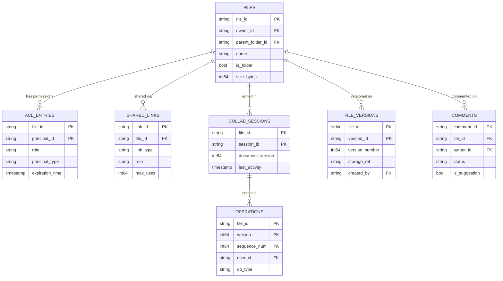
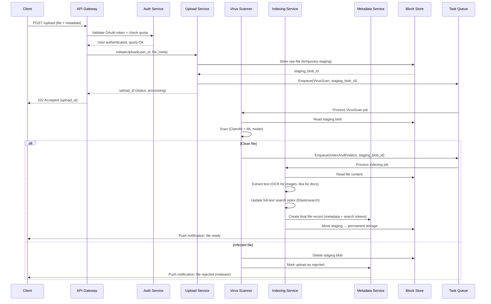
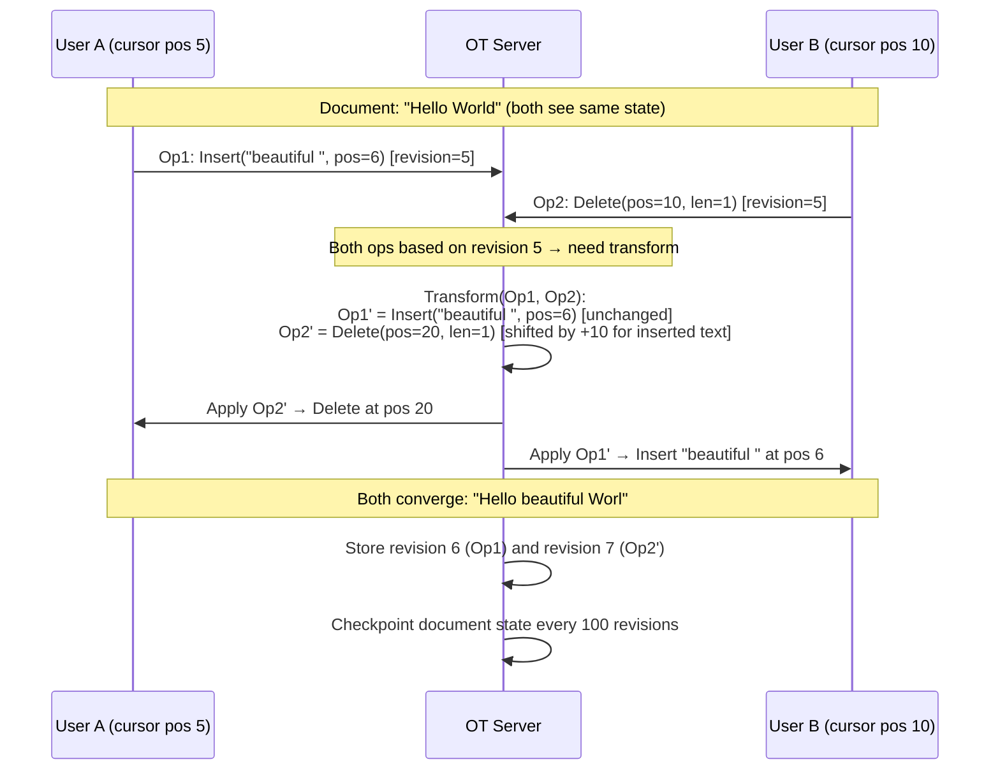
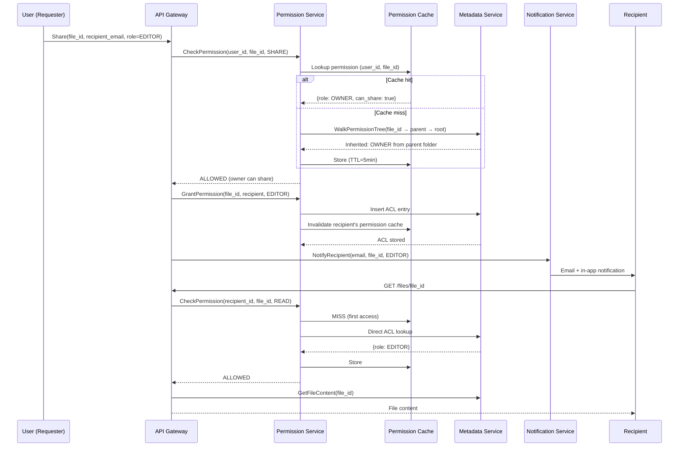

# Google Drive - System Design

## 1. Requirements

### Functional Requirements
1. File storage and synchronization across devices
2. Real-time collaboration on Docs/Sheets/Slides (multiple cursors, live edits)
3. Sharing with fine-grained permissions (viewer/commenter/editor/owner)
4. Comments, suggestions, and threaded discussions
5. Version history with named versions and auto-save
6. Offline editing with conflict resolution on reconnect
7. Full-text search across all file types
8. Google Workspace integration (Gmail attachments, Calendar, Meet)

### Non-Functional Requirements
- Availability: 99.99% (52 min downtime/year)
- Sync latency: <3 seconds for file changes propagation
- Max file size: 100GB uploads
- Scale: 2B+ users, 10B+ files stored
- Durability: 99.999999999% (11 nines)
- Collaboration: Support 100 concurrent editors per document

## 2. Capacity Estimation

| Metric | Value |
|--------|-------|
| Total users | 2B |
| DAU | 500M |
| Avg files per user | 500 |
| Total files | 1T |
| Avg file size | 2MB |
| Total storage | 2 EB |
| Writes/day | 5B (uploads + edits) |
| Reads/day | 20B |
| Peak QPS (writes) | 115K |
| Peak QPS (reads) | 460K |
| Collaboration sessions/day | 200M |
| OT operations/sec (peak) | 50M |

### Storage Breakdown
- File content (Colossus): 2 EB replicated 3x = 6 EB raw
- Metadata (Spanner): ~50TB (1KB per file × 1T files)
- Version history: ~500 PB (avg 5 versions × delta storage)
- Collaboration logs: ~10 PB/year
- Search index: ~100 TB

## 3. Data Modeling

### Entity-Relationship Diagram



### File Metadata (Spanner)
```sql
CREATE TABLE files (
    file_id         STRING(36) NOT NULL,
    owner_id        STRING(36) NOT NULL,
    parent_folder_id STRING(36),
    name            STRING(1024) NOT NULL,
    mime_type       STRING(256),
    size_bytes      INT64,
    content_hash    STRING(64),  -- SHA-256
    storage_location STRING(512),
    is_folder       BOOL DEFAULT FALSE,
    is_trashed      BOOL DEFAULT FALSE,
    starred         BOOL DEFAULT FALSE,
    shared          BOOL DEFAULT FALSE,
    created_at      TIMESTAMP NOT NULL,
    modified_at     TIMESTAMP NOT NULL,
    modified_by     STRING(36),
    version_count   INT64 DEFAULT 1,
    workspace_type  STRING(20),  -- doc, sheet, slide, null for binary
) PRIMARY KEY (file_id),
  INTERLEAVE IN PARENT users ON DELETE CASCADE;

CREATE INDEX idx_files_parent ON files(parent_folder_id, name);
CREATE INDEX idx_files_owner ON files(owner_id, modified_at DESC);
CREATE INDEX idx_files_trashed ON files(owner_id, is_trashed) STORING (name, modified_at);
CREATE NULL_FILTERED INDEX idx_files_shared ON files(shared) STORING (owner_id, name);
```

### Access Control Lists (Spanner)
```sql
CREATE TABLE acl_entries (
    file_id         STRING(36) NOT NULL,
    principal_id    STRING(36) NOT NULL,  -- user_id, group_id, or 'anyone'
    principal_type  STRING(20) NOT NULL,  -- user, group, domain, anyone
    role            STRING(20) NOT NULL,  -- owner, editor, commenter, viewer
    inherited_from  STRING(36),           -- parent folder if inherited
    expiration_time TIMESTAMP,
    allow_discovery BOOL DEFAULT FALSE,
    created_at      TIMESTAMP NOT NULL,
    created_by      STRING(36) NOT NULL,
) PRIMARY KEY (file_id, principal_id);

CREATE INDEX idx_acl_principal ON acl_entries(principal_id, role);
CREATE INDEX idx_acl_expiration ON acl_entries(expiration_time)
    WHERE expiration_time IS NOT NULL;
```

### Link Sharing (Spanner)
```sql
CREATE TABLE shared_links (
    link_id         STRING(36) NOT NULL,
    file_id         STRING(36) NOT NULL,
    link_type       STRING(20) NOT NULL,  -- restricted, domain, anyone
    role            STRING(20) NOT NULL,
    password_hash   STRING(128),
    expiration_time TIMESTAMP,
    max_uses        INT64,
    current_uses    INT64 DEFAULT 0,
    domain_restrict STRING(256),
    created_at      TIMESTAMP NOT NULL,
    created_by      STRING(36) NOT NULL,
) PRIMARY KEY (link_id);

CREATE INDEX idx_links_file ON shared_links(file_id);
```

### Collaboration Sessions (Bigtable)
```sql
-- Row key: file_id#session_id
CREATE TABLE collab_sessions (
    file_id         STRING(36) NOT NULL,
    session_id      STRING(36) NOT NULL,
    document_version INT64 NOT NULL,
    active_users    ARRAY<STRING>,
    started_at      TIMESTAMP NOT NULL,
    last_activity   TIMESTAMP NOT NULL,
    operation_count INT64 DEFAULT 0,
) PRIMARY KEY (file_id, session_id);
```

### Operations Log (Bigtable - for OT)
```sql
-- Row key: file_id#version#sequence
CREATE TABLE operations (
    file_id         STRING(36) NOT NULL,
    version         INT64 NOT NULL,
    sequence_num    INT64 NOT NULL,
    user_id         STRING(36) NOT NULL,
    op_type         STRING(20) NOT NULL,  -- insert, delete, retain, format
    position        INT64 NOT NULL,
    content         BYTES(MAX),
    attributes      STRING(MAX),  -- JSON formatting
    timestamp       TIMESTAMP NOT NULL,
) PRIMARY KEY (file_id, version, sequence_num);
```

### Version History (Spanner + Colossus)
```sql
CREATE TABLE file_versions (
    file_id         STRING(36) NOT NULL,
    version_id      STRING(36) NOT NULL,
    version_number  INT64 NOT NULL,
    content_hash    STRING(64),
    delta_from      STRING(36),  -- previous version for delta storage
    storage_ref     STRING(512),
    size_bytes      INT64,
    is_named        BOOL DEFAULT FALSE,
    version_name    STRING(256),
    created_at      TIMESTAMP NOT NULL,
    created_by      STRING(36) NOT NULL,
    keep_forever    BOOL DEFAULT FALSE,
) PRIMARY KEY (file_id, version_id),
  INTERLEAVE IN PARENT files ON DELETE CASCADE;

CREATE INDEX idx_versions_file_num ON file_versions(file_id, version_number DESC);
```

### Comments (Spanner)
```sql
CREATE TABLE comments (
    comment_id      STRING(36) NOT NULL,
    file_id         STRING(36) NOT NULL,
    anchor_data     STRING(MAX),  -- JSON: position, range, cell ref
    author_id       STRING(36) NOT NULL,
    content         STRING(MAX) NOT NULL,
    is_suggestion   BOOL DEFAULT FALSE,
    suggestion_data STRING(MAX),  -- proposed change content
    status          STRING(20) DEFAULT 'open',  -- open, resolved, accepted, rejected
    parent_comment_id STRING(36),  -- for threads
    created_at      TIMESTAMP NOT NULL,
    modified_at     TIMESTAMP NOT NULL,
    resolved_by     STRING(36),
    resolved_at     TIMESTAMP,
) PRIMARY KEY (file_id, comment_id),
  INTERLEAVE IN PARENT files ON DELETE CASCADE;

CREATE INDEX idx_comments_anchor ON comments(file_id, status);
CREATE INDEX idx_comments_author ON comments(author_id, created_at DESC);
```

## 4. High-Level Design

```
┌─────────────────────────────────────────────────────────────────────────────────┐
│                              CLIENT LAYER                                         │
│  ┌──────────┐  ┌──────────┐  ┌──────────┐  ┌──────────┐  ┌──────────┐         │
│  │  Web App │  │ Desktop  │  │ Mobile   │  │  API     │  │ Workspace│         │
│  │  (React) │  │  Sync    │  │  Apps    │  │ Clients  │  │ Add-ons  │         │
│  └────┬─────┘  └────┬─────┘  └────┬─────┘  └────┬─────┘  └────┬─────┘         │
└───────┼──────────────┼──────────────┼──────────────┼──────────────┼─────────────┘
        │              │              │              │              │
┌───────┼──────────────┼──────────────┼──────────────┼──────────────┼─────────────┐
│       ▼              ▼              ▼              ▼              ▼              │
│  ┌─────────────────────────────────────────────────────────────────────┐        │
│  │                    Global Load Balancer (Envoy)                      │        │
│  └─────────────────────────────┬───────────────────────────────────────┘        │
│                                │                                                 │
│  ┌─────────────┬───────────────┼───────────────┬───────────────────┐            │
│  ▼             ▼               ▼               ▼                   ▼            │
│ ┌────────┐ ┌─────────┐ ┌────────────┐ ┌────────────┐ ┌──────────────┐         │
│ │ File   │ │ Collab  │ │ Permission │ │  Search    │ │  Notification│         │
│ │ Service│ │ Service │ │  Service   │ │  Service   │ │  Service     │         │
│ │        │ │ (OT/WS) │ │            │ │            │ │              │         │
│ └───┬────┘ └────┬────┘ └─────┬──────┘ └─────┬──────┘ └──────┬───────┘         │
│     │           │            │               │               │                  │
│  ┌──┼───────────┼────────────┼───────────────┼───────────────┼───────┐          │
│  │  ▼           ▼            ▼               ▼               ▼       │          │
│  │ ┌─────────────────────────────────────────────────────────────┐   │          │
│  │ │              Internal Service Mesh (gRPC)                    │   │          │
│  │ └─────────────────────────────────────────────────────────────┘   │          │
│  │                                                                    │          │
│  │  ┌──────────┐ ┌──────────┐ ┌──────────┐ ┌──────────┐            │          │
│  │  │ Version  │ │ Comment  │ │  Quota   │ │  Audit   │            │          │
│  │  │ Service  │ │ Service  │ │  Service │ │  Service │            │          │
│  │  └──────────┘ └──────────┘ └──────────┘ └──────────┘            │          │
│  └────────────────────────────────────────────────────────────────────┘          │
│                                                                                  │
│  ┌─────────────────────────────────────────────────────────────────────┐        │
│  │                        DATA LAYER                                    │        │
│  │                                                                      │        │
│  │  ┌──────────┐ ┌──────────┐ ┌──────────┐ ┌──────────┐ ┌─────────┐  │        │
│  │  │ Spanner  │ │ Bigtable │ │ Colossus │ │ Pub/Sub  │ │ Redis   │  │        │
│  │  │(Metadata)│ │(OT Logs) │ │(Files)   │ │(Events)  │ │(Cache)  │  │        │
│  │  └──────────┘ └──────────┘ └──────────┘ └──────────┘ └─────────┘  │        │
│  │                                                                      │        │
│  │  ┌──────────┐ ┌──────────┐ ┌──────────┐                            │        │
│  │  │Memorystore│ │ Search  │ │ Cloud    │                            │        │
│  │  │(Sessions)│ │(Elastic) │ │  CDN     │                            │        │
│  │  └──────────┘ └──────────┘ └──────────┘                            │        │
│  └─────────────────────────────────────────────────────────────────────┘        │
└──────────────────────────────────────────────────────────────────────────────────┘
```

## 5. API Design

### File Operations
```
POST /drive/v3/files
  Body: { name, mimeType, parents[], description, properties{} }
  Response: { id, name, mimeType, webViewLink, ... }

PUT /drive/v3/files/{fileId}/upload?uploadType=resumable
  Headers: Content-Range: bytes 0-524287/2000000
  Body: <binary chunk>

GET /drive/v3/files/{fileId}?fields=*
  Response: { id, name, size, owners[], permissions[], version, ... }

PATCH /drive/v3/files/{fileId}
  Body: { name?, parents?, description?, trashed? }

DELETE /drive/v3/files/{fileId}

GET /drive/v3/files?q=<query>&orderBy=modifiedTime+desc&pageSize=100
  Query language: "name contains 'report' and mimeType='application/pdf'"
```

### Permissions
```
POST /drive/v3/files/{fileId}/permissions
  Body: {
    role: "editor",
    type: "user",
    emailAddress: "user@example.com",
    sendNotification: true,
    expirationTime: "2025-12-31T00:00:00Z"
  }

DELETE /drive/v3/files/{fileId}/permissions/{permissionId}

PATCH /drive/v3/files/{fileId}/permissions/{permissionId}
  Body: { role: "viewer" }
```

### Real-time Collaboration (WebSocket)
```
// Client → Server
{ type: "operation", version: 12, ops: [
    { retain: 5 },
    { insert: "Hello", attributes: { bold: true } },
    { delete: 3 }
]}

{ type: "cursor", position: 42, selectionEnd: 50, color: "#FF5733" }

{ type: "presence", status: "active", displayName: "Alice" }

// Server → Client
{ type: "ack", version: 13, transformedOps: [...] }

{ type: "remote_op", userId: "bob", version: 13, ops: [...] }

{ type: "presence_update", users: [
    { id: "bob", cursor: 15, color: "#33FF57", name: "Bob" }
]}
```

### Comments
```
POST /drive/v3/files/{fileId}/comments
  Body: {
    content: "This paragraph needs revision",
    anchor: { type: "range", startOffset: 100, endOffset: 200 },
    quotedContent: "original text here"
  }

POST /drive/v3/files/{fileId}/comments/{commentId}/replies
  Body: { content: "Done, updated." }

PATCH /drive/v3/files/{fileId}/comments/{commentId}
  Body: { resolved: true }
```

### Version History
```
GET /drive/v3/files/{fileId}/revisions?pageSize=50
  Response: { revisions: [{ id, modifiedTime, lastModifyingUser, size }] }

GET /drive/v3/files/{fileId}/revisions/{revisionId}?alt=media
  → Downloads that version's content

PATCH /drive/v3/files/{fileId}/revisions/{revisionId}
  Body: { keepForever: true, publishedLabel: "v2.0" }
```

## 6. Deep Dive: Real-Time Collaboration Infrastructure

### Operational Transformation (OT) Architecture

```
┌──────────┐         ┌──────────┐         ┌──────────┐
│ Client A │         │  OT      │         │ Client B │
│          │◄───WS──►│  Server  │◄───WS──►│          │
└──────────┘         └─────┬────┘         └──────────┘
                           │
                    ┌──────▼──────┐
                    │  Operation  │
                    │    Log      │
                    │  (Bigtable) │
                    └─────────────┘
```

### OT Algorithm Implementation

```python
class OTServer:
    """Server-side Operational Transformation engine."""
    
    def __init__(self, document_id: str):
        self.document_id = document_id
        self.version = 0
        self.history = []  # List of (version, operation, user_id)
        self.lock = asyncio.Lock()
    
    async def receive_operation(self, client_version: int, operation: Operation, user_id: str):
        """Process incoming operation from client."""
        async with self.lock:
            # Transform against all operations since client's version
            concurrent_ops = self.history[client_version:]
            
            transformed_op = operation
            for _, past_op, _ in concurrent_ops:
                transformed_op = self.transform(transformed_op, past_op)
            
            # Apply to document
            self.version += 1
            self.history.append((self.version, transformed_op, user_id))
            
            # Persist to Bigtable
            await self.persist_operation(self.version, transformed_op, user_id)
            
            # Broadcast to other clients
            await self.broadcast(transformed_op, user_id, self.version)
            
            return self.version, transformed_op
    
    def transform(self, op_a: Operation, op_b: Operation) -> Operation:
        """Transform op_a against op_b (Jupiter OT algorithm)."""
        result = []
        i, j = 0, 0
        ops_a, ops_b = op_a.components, op_b.components
        
        while i < len(ops_a) or j < len(ops_b):
            if i < len(ops_a) and ops_a[i].type == 'insert':
                result.append(ops_a[i])
                i += 1
            elif j < len(ops_b) and ops_b[j].type == 'insert':
                result.append(Retain(ops_b[j].length))
                j += 1
            else:
                # Both are retain or delete
                a_comp = ops_a[i] if i < len(ops_a) else None
                b_comp = ops_b[j] if j < len(ops_b) else None
                
                if a_comp and b_comp:
                    min_len = min(a_comp.length, b_comp.length)
                    
                    if a_comp.type == 'retain' and b_comp.type == 'retain':
                        result.append(Retain(min_len))
                    elif a_comp.type == 'delete' and b_comp.type == 'retain':
                        result.append(Delete(min_len))
                    elif a_comp.type == 'retain' and b_comp.type == 'delete':
                        # b already deleted, skip
                        pass
                    elif a_comp.type == 'delete' and b_comp.type == 'delete':
                        # both delete same content, skip
                        pass
                    
                    # Advance cursors
                    self._advance(ops_a, i, ops_b, j, min_len)
                    i, j = self._next_index(ops_a, i, ops_b, j, min_len)
        
        return Operation(result)


class CRDTDocument:
    """CRDT-based document for conflict-free collaboration (alternative to OT)."""
    
    def __init__(self):
        self.nodes = SortedList()  # RGA (Replicated Growable Array)
        self.tombstones = set()
    
    def insert(self, position: int, char: str, site_id: str, clock: int):
        """Insert character using RGA CRDT."""
        # Generate unique ID: (clock, site_id)
        char_id = (clock, site_id)
        
        # Find reference node (node at position - 1)
        visible_nodes = [n for n in self.nodes if n.id not in self.tombstones]
        ref_node = visible_nodes[position - 1] if position > 0 else None
        
        # Create new node with reference
        new_node = CRDTNode(
            id=char_id,
            char=char,
            left_ref=ref_node.id if ref_node else None
        )
        
        # Insert in correct position (after ref, before next with lower priority)
        insert_idx = self._find_insert_position(new_node)
        self.nodes.insert(insert_idx, new_node)
        
        return new_node
    
    def delete(self, position: int):
        """Tombstone deletion for CRDT."""
        visible_nodes = [n for n in self.nodes if n.id not in self.tombstones]
        target = visible_nodes[position]
        self.tombstones.add(target.id)
```

### Presence and Cursor Tracking

```python
class PresenceManager:
    """Manages user presence and cursor positions in collaborative documents."""
    
    def __init__(self, redis_client):
        self.redis = redis_client
        self.PRESENCE_TTL = 30  # seconds
    
    async def update_cursor(self, doc_id: str, user_id: str, cursor_data: dict):
        """Update user's cursor position with TTL-based presence."""
        key = f"presence:{doc_id}"
        data = {
            "user_id": user_id,
            "cursor_position": cursor_data["position"],
            "selection_start": cursor_data.get("selection_start"),
            "selection_end": cursor_data.get("selection_end"),
            "color": self._assign_color(user_id),
            "display_name": cursor_data["display_name"],
            "timestamp": time.time()
        }
        
        # Store in Redis hash with TTL
        await self.redis.hset(key, user_id, json.dumps(data))
        await self.redis.expire(key, self.PRESENCE_TTL)
        
        # Broadcast to other users via Pub/Sub
        await self.redis.publish(f"cursor:{doc_id}", json.dumps(data))
    
    async def get_active_users(self, doc_id: str) -> list:
        """Get all active users in a document session."""
        key = f"presence:{doc_id}"
        all_presence = await self.redis.hgetall(key)
        
        active = []
        now = time.time()
        for user_id, data_str in all_presence.items():
            data = json.loads(data_str)
            if now - data["timestamp"] < self.PRESENCE_TTL:
                active.append(data)
        
        return active
    
    async def heartbeat(self, doc_id: str, user_id: str):
        """Extend presence TTL."""
        key = f"presence:{doc_id}"
        data = await self.redis.hget(key, user_id)
        if data:
            parsed = json.loads(data)
            parsed["timestamp"] = time.time()
            await self.redis.hset(key, user_id, json.dumps(parsed))
```

### Suggestion Mode Implementation

```python
class SuggestionEngine:
    """Handles suggestion mode where edits are tracked as proposals."""
    
    def __init__(self):
        self.suggestions = {}  # suggestion_id → SuggestionData
    
    def create_suggestion(self, doc_id: str, user_id: str, 
                         original_range: Range, new_content: str) -> str:
        """Create a new suggestion (tracked change)."""
        suggestion_id = generate_uuid()
        
        suggestion = {
            "id": suggestion_id,
            "doc_id": doc_id,
            "author_id": user_id,
            "original_range": original_range,
            "original_content": self._extract_content(doc_id, original_range),
            "suggested_content": new_content,
            "status": "pending",  # pending, accepted, rejected
            "created_at": datetime.utcnow(),
            "formatting_changes": self._compute_format_diff(original_range, new_content)
        }
        
        self.suggestions[suggestion_id] = suggestion
        
        # Render as inline markup in document
        self._inject_suggestion_markers(doc_id, suggestion)
        
        return suggestion_id
    
    def accept_suggestion(self, suggestion_id: str, reviewer_id: str):
        """Accept and apply suggestion to document."""
        suggestion = self.suggestions[suggestion_id]
        
        # Apply the edit as a regular operation
        op = Operation([
            Retain(suggestion["original_range"].start),
            Delete(suggestion["original_range"].length),
            Insert(suggestion["suggested_content"]),
            Retain(remaining_length)
        ])
        
        # Remove suggestion markers
        self._remove_suggestion_markers(suggestion["doc_id"], suggestion_id)
        
        suggestion["status"] = "accepted"
        suggestion["resolved_by"] = reviewer_id
        suggestion["resolved_at"] = datetime.utcnow()
```

## 7. Deep Dive: Permission Model

### Hierarchical ACL with Inheritance

```python
class PermissionEngine:
    """Google Drive permission model with inheritance and link sharing."""
    
    # Permission hierarchy (higher includes lower)
    ROLE_HIERARCHY = {
        "owner": 4,
        "organizer": 3,  # Shared drives only
        "editor": 2,
        "commenter": 1,
        "viewer": 0
    }
    
    async def check_permission(self, user_id: str, file_id: str, 
                               required_role: str) -> bool:
        """Check if user has required permission level."""
        # 1. Check direct ACL
        effective_role = await self._get_effective_role(user_id, file_id)
        
        if effective_role and self.ROLE_HIERARCHY[effective_role] >= \
           self.ROLE_HIERARCHY[required_role]:
            return True
        
        return False
    
    async def _get_effective_role(self, user_id: str, file_id: str) -> str:
        """Compute effective role considering inheritance."""
        # Check cache first
        cache_key = f"perm:{user_id}:{file_id}"
        cached = await self.cache.get(cache_key)
        if cached:
            return cached
        
        # Check direct permission
        direct = await self.db.query(
            "SELECT role FROM acl_entries WHERE file_id = @file_id "
            "AND principal_id = @user_id AND "
            "(expiration_time IS NULL OR expiration_time > CURRENT_TIMESTAMP())",
            {"file_id": file_id, "user_id": user_id}
        )
        
        if direct:
            await self.cache.set(cache_key, direct.role, ttl=300)
            return direct.role
        
        # Check group memberships
        user_groups = await self.get_user_groups(user_id)
        group_role = await self.db.query(
            "SELECT MAX(role) FROM acl_entries WHERE file_id = @file_id "
            "AND principal_id IN UNNEST(@groups)",
            {"file_id": file_id, "groups": user_groups}
        )
        
        if group_role:
            await self.cache.set(cache_key, group_role, ttl=300)
            return group_role
        
        # Check domain-wide sharing
        user_domain = self._extract_domain(user_id)
        domain_role = await self.db.query(
            "SELECT role FROM acl_entries WHERE file_id = @file_id "
            "AND principal_type = 'domain' AND principal_id = @domain",
            {"file_id": file_id, "domain": user_domain}
        )
        
        if domain_role:
            return domain_role
        
        # Check 'anyone' permission
        anyone_role = await self.db.query(
            "SELECT role FROM acl_entries WHERE file_id = @file_id "
            "AND principal_id = 'anyone'",
            {"file_id": file_id}
        )
        
        if anyone_role:
            return anyone_role
        
        # Inherit from parent folder
        parent_id = await self._get_parent(file_id)
        if parent_id:
            inherited = await self._get_effective_role(user_id, parent_id)
            if inherited:
                await self.cache.set(cache_key, inherited, ttl=300)
                return inherited
        
        return None
    
    async def propagate_permission(self, folder_id: str, acl_entry: dict):
        """Propagate permission change to all descendants."""
        # Use BFS to traverse folder tree
        queue = [folder_id]
        batch = []
        
        while queue:
            current = queue.pop(0)
            children = await self.db.query(
                "SELECT file_id, is_folder FROM files WHERE parent_folder_id = @id",
                {"id": current}
            )
            
            for child in children:
                # Create inherited ACL entry
                inherited_entry = {
                    **acl_entry,
                    "file_id": child.file_id,
                    "inherited_from": folder_id
                }
                batch.append(inherited_entry)
                
                if child.is_folder:
                    queue.append(child.file_id)
            
            # Batch write every 1000 entries
            if len(batch) >= 1000:
                await self.db.batch_insert("acl_entries", batch)
                batch = []
                # Invalidate cache for affected files
                await self._invalidate_permission_cache(batch)
        
        if batch:
            await self.db.batch_insert("acl_entries", batch)


class DomainPolicy:
    """Domain-level sharing policies for Google Workspace admins."""
    
    POLICIES = {
        "sharing_outside_domain": "allowed|warn|blocked",
        "link_sharing_default": "restricted|domain|anyone",
        "download_restriction": "allow_all|editors_only|disabled",
        "copy_restriction": "allow_all|editors_only|disabled",
        "file_expiration_max_days": 365,
        "require_2fa_for_sensitive": True,
    }
    
    async def enforce_policy(self, org_id: str, sharing_request: dict) -> PolicyResult:
        """Enforce organizational sharing policies."""
        policy = await self.get_org_policy(org_id)
        
        # Check external sharing
        if sharing_request["target_domain"] != self._get_org_domain(org_id):
            if policy["sharing_outside_domain"] == "blocked":
                return PolicyResult(allowed=False, 
                    reason="External sharing disabled by admin")
            elif policy["sharing_outside_domain"] == "warn":
                return PolicyResult(allowed=True, warning=True,
                    message="You're sharing outside your organization")
        
        # Enforce expiration limits
        if sharing_request.get("expiration_days"):
            max_days = policy.get("file_expiration_max_days", 365)
            if sharing_request["expiration_days"] > max_days:
                return PolicyResult(allowed=False,
                    reason=f"Max sharing duration is {max_days} days")
        
        return PolicyResult(allowed=True)
```

## 8. Component Optimization

### Storage Architecture
```
┌─────────────────────────────────────────────────────────┐
│                    Colossus (GFS2)                        │
│                                                          │
│  ┌──────────────┐  ┌──────────────┐  ┌──────────────┐  │
│  │   Hot Tier   │  │  Warm Tier   │  │  Cold Tier   │  │
│  │  (SSD, <7d)  │  │  (HDD, <90d) │  │ (Tape, >90d) │  │
│  └──────────────┘  └──────────────┘  └──────────────┘  │
│                                                          │
│  Reed-Solomon erasure coding: 8+3 for durability        │
│  Chunk size: 64MB for large files, 1MB for docs         │
└─────────────────────────────────────────────────────────┘
```

### Sync Protocol Optimization
```python
class SyncEngine:
    """Client-side sync engine for Desktop app."""
    
    async def sync_changes(self):
        """Efficient delta sync using change tokens."""
        # Use server-side change token (opaque cursor)
        changes = await self.api.changes_list(
            page_token=self.last_sync_token,
            spaces="drive",
            fields="nextPageToken,changes(fileId,removed,file(id,name,md5Checksum))"
        )
        
        for change in changes:
            if change.removed:
                await self.local_db.mark_deleted(change.file_id)
            else:
                local_file = await self.local_db.get(change.file_id)
                if not local_file or local_file.md5 != change.file.md5:
                    # Download only changed blocks using rsync-like algorithm
                    await self._sync_file_blocks(change.file)
        
        self.last_sync_token = changes.next_page_token
    
    async def _sync_file_blocks(self, remote_file):
        """Block-level sync using rolling checksum (rsync algorithm)."""
        local_path = self.get_local_path(remote_file.id)
        
        if os.path.exists(local_path):
            # Compute block signatures for local file
            block_sigs = compute_rolling_checksums(local_path, block_size=4096)
            
            # Server compares and sends only different blocks
            diff = await self.api.get_file_diff(
                remote_file.id, 
                block_signatures=block_sigs
            )
            
            # Apply diff to local file
            apply_block_diff(local_path, diff)
        else:
            # Full download
            await self.api.download_file(remote_file.id, local_path)
```

### Pub/Sub Change Notification Pipeline
```python
class ChangeNotificationService:
    """Real-time change propagation via Cloud Pub/Sub."""
    
    TOPICS = {
        "file_changes": "projects/drive/topics/file-changes",
        "permission_changes": "projects/drive/topics/perm-changes",
        "comment_events": "projects/drive/topics/comments",
    }
    
    async def publish_change(self, event_type: str, file_id: str, 
                            user_id: str, change_data: dict):
        """Publish change event for real-time sync."""
        message = {
            "event_type": event_type,
            "file_id": file_id,
            "user_id": user_id,
            "timestamp": datetime.utcnow().isoformat(),
            "change_data": change_data
        }
        
        # Determine affected users for targeted notification
        affected_users = await self.permission_service.get_file_viewers(file_id)
        
        # Publish with ordering key for per-file ordering
        await self.pubsub.publish(
            self.TOPICS["file_changes"],
            data=json.dumps(message).encode(),
            ordering_key=file_id,
            attributes={"affected_users": ",".join(affected_users[:100])}
        )
    
    async def handle_notification(self, message):
        """Process incoming change notification."""
        # Fan-out to connected WebSocket clients
        affected_users = message.attributes["affected_users"].split(",")
        
        for user_id in affected_users:
            ws_connections = await self.connection_manager.get_connections(user_id)
            for ws in ws_connections:
                await ws.send_json({
                    "type": "file_change",
                    "file_id": message.data["file_id"],
                    "change_type": message.data["event_type"]
                })
```

## 9. Observability

### Key Metrics
| Metric | Target | Alert Threshold |
|--------|--------|-----------------|
| Sync latency (p99) | <3s | >5s |
| OT operation latency (p99) | <100ms | >500ms |
| Collaboration session errors | <0.01% | >0.1% |
| Permission check latency (p99) | <10ms | >50ms |
| Upload success rate | >99.9% | <99.5% |
| Search query latency (p50) | <200ms | >500ms |

### Distributed Tracing
```
[Client] → [LB] → [File Service] → [Spanner] → [Colossus]
                                   → [Permission Check] → [Cache/DB]
                                   → [Pub/Sub Notify]
                                   → [Search Index Update]
```

## 10. Considerations & Trade-offs

| Decision | Choice | Trade-off |
|----------|--------|-----------|
| OT vs CRDT | OT for Docs, CRDT experiments | OT simpler but requires central server; CRDT allows P2P but complex |
| Spanner vs Bigtable | Spanner for metadata, Bigtable for ops log | Spanner: strong consistency + SQL; Bigtable: higher write throughput |
| Permission inheritance | Lazy evaluation with cache | Fast writes but complex cache invalidation on folder permission changes |
| Sync protocol | Change token + block-level delta | Reduces bandwidth 90% but complex client implementation |
| Version storage | Reverse deltas with periodic snapshots | Saves storage but reading old versions requires chain reconstruction |
| Offline mode | Last-write-wins with conflict markers | Simple but may lose edits in rare concurrent offline edit scenarios |
| Search indexing | Async with eventual consistency | Search may lag 30s behind edits but doesn't block writes |

---

## Sequence Diagrams

### File Upload + Virus Scan + Indexing



### Real-Time Collaboration via Operational Transform (OT)



### Permission Check + Sharing Flow



## Caching Strategy

| Layer | Technology | What's Cached | TTL | Invalidation |
|-------|-----------|---------------|-----|--------------|
| Client | Local SQLite | File tree structure, recent metadata | Until sync | Server push via WebSocket |
| CDN | Google Edge | Static thumbnails, exported PDFs | 7 days | Purge on file update |
| Permission cache | Memcached | ACL evaluation results | 5 min | Event-driven on share/unshare |
| Metadata | Bigtable cell cache | File metadata, folder listings | 1 min | Write-through |
| Collaboration | In-memory (OT server) | Active document state, cursor positions | Session lifetime | Checkpoint to disk every 30s |
| Search | Elasticsearch cache | Query results for common searches | 30s | Index refresh interval |

**Key Design Decisions:**
- Permission cache short TTL (5 min) balances performance vs. security (revoked access propagates quickly)
- OT server keeps document state in memory for active sessions; cold documents loaded from checkpoint on demand
- Folder listing cache critical for large shared drives (10K+ files) — invalidate on any child change
