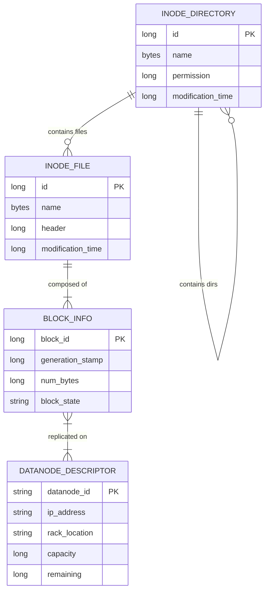
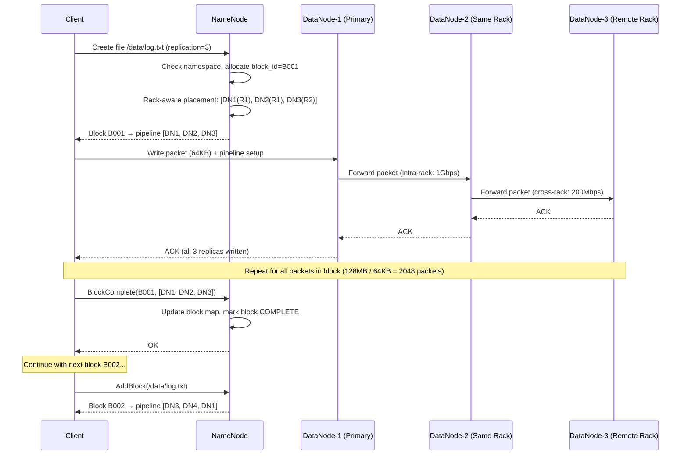
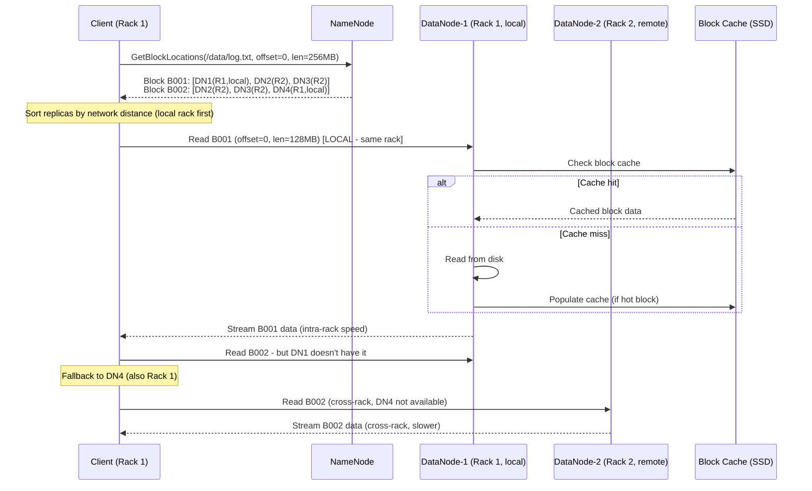
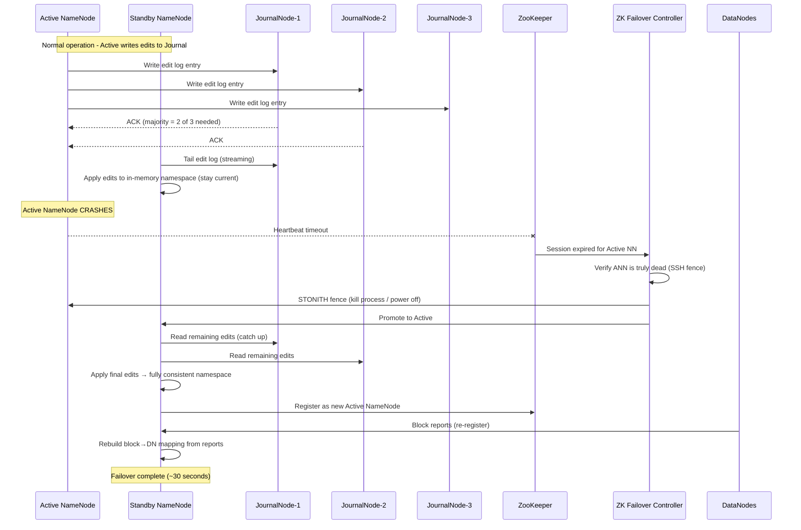

# Distributed File System (HDFS/GFS) System Design

## 1. Requirements

### Functional Requirements
1. **Create/Read/Write/Delete files** - Full file lifecycle management
2. **Append Support** - Efficient append-only writes (primary write pattern)
3. **Large File Optimization** - Optimized for files > 64MB (not small files)
4. **Namespace Management** - Hierarchical directory structure
5. **Snapshots** - Point-in-time consistent snapshots of directory trees
6. **Rack-Aware Replication** - Intelligent replica placement across failure domains
7. **File Concatenation** - Merge multiple files without data movement
8. **Trash/Undelete** - Soft delete with configurable retention

### Non-Functional Requirements
| Requirement | Target |
|-------------|--------|
| Availability | 99.99% |
| Aggregate Throughput | >100 GB/s across cluster |
| Storage Capacity | Petabytes (10-100 PB) |
| Concurrent Clients | Thousands simultaneously |
| Block Size | 128 MB (configurable) |
| Replication Factor | 3 (configurable) |
| File Count | Hundreds of millions |
| NameNode Memory | 1 GB per ~1M files |

## 2. Capacity Estimation

### Storage
```
Cluster size: 10,000 DataNodes
Disks per DataNode: 12 × 12TB = 144 TB raw per node
Total raw: 10,000 × 144 TB = 1.44 EB
Usable (3× replication): 1.44 EB / 3 = 480 PB
Block size: 128 MB
Total blocks: 480 PB / 128 MB = ~3.75 billion blocks
Metadata per block: ~150 bytes in NameNode
NameNode memory for blocks: 3.75B × 150B = ~562 GB
```

### Throughput
```
Disk throughput per DataNode: 12 disks × 200 MB/s = 2.4 GB/s
Network per DataNode: 10 Gbps = 1.25 GB/s (bottleneck)
Aggregate read throughput: 10,000 × 1.25 GB/s = 12.5 TB/s (theoretical)
Practical aggregate: ~100-500 GB/s (limited by locality)
```

### NameNode Operations
```
File system operations: ~100,000 ops/sec
Block reports from DataNodes: 10,000 nodes × 1 report/hr = ~3 reports/sec
Heartbeats: 10,000 nodes × 1/3sec = ~3,333/sec
```

## 3. Data Modeling

### Entity-Relationship Diagram



### NameNode In-Memory Data Structures

```java
/**
 * INode tree representing the file system namespace.
 * Stored entirely in NameNode memory for fast lookups.
 */
public class INodeDirectory extends INode {
    private final Map<byte[], INode> children;  // name → child INode
    private DirectorySnapshottableFeature snapshotFeature;
    private AclFeature aclFeature;
    
    // Memory optimization: use byte[] instead of String for names
    // Average INodeDirectory: ~150 bytes
}

public class INodeFile extends INode {
    private long header;           // replication + block_size packed
    private BlockInfo[] blocks;    // array of block references
    private FileUnderConstructionFeature ucFeature;  // if being written
    
    // Average INodeFile: ~120 bytes + 8 bytes per block
}

public class INode {
    private long id;               // unique inode ID
    private byte[] name;           // local name (not full path)
    private INodeDirectory parent;
    private long permission;       // encoded: user:group:mode
    private long modificationTime;
    private long accessTime;
}

/**
 * Block metadata maintained by NameNode.
 */
public class BlockInfo {
    private long blockId;
    private long generationStamp;     // version for stale detection
    private long numBytes;
    
    // Triplets: DataNode references for each replica
    private DatanodeStorageInfo[] storages;  // where replicas live
    
    // Block state
    private BlockUCState blockUCState;  // UNDER_CONSTRUCTION, COMMITTED, COMPLETE
}

/**
 * DataNode descriptor in NameNode memory.
 */
public class DatanodeDescriptor {
    private String datanodeId;
    private String ipAddress;
    private int port;
    private String rackLocation;     // /rack1/node1
    
    private long capacity;
    private long remaining;
    private long blockPoolUsed;
    private int xceiverCount;        // active data transfers
    
    private long lastHeartbeat;
    private AdminStates adminState;  // NORMAL, DECOMMISSIONING, DECOMMISSIONED
    
    // Blocks stored on this node (for block report reconciliation)
    private final BlockList blockList;
}
```

### Edit Log & Checkpoint Format

```python
class EditLogEntry:
    """
    Edit log records every namespace-modifying operation.
    Stored on persistent storage (JournalNodes).
    """
    
    # Operation types
    OP_ADD = 0          # Create file
    OP_CLOSE = 1        # Close file (finalize)
    OP_RENAME = 2       # Rename file/directory
    OP_DELETE = 3       # Delete file/directory
    OP_MKDIR = 4        # Create directory
    OP_SET_REPLICATION = 5
    OP_SET_PERMISSIONS = 6
    OP_ADD_BLOCK = 7    # Allocate new block
    OP_SET_OWNER = 8
    OP_CONCAT_DELETE = 9
    OP_TRUNCATE = 10
    
    def __init__(self, op_code, txid, timestamp):
        self.op_code = op_code
        self.txid = txid              # Monotonically increasing transaction ID
        self.timestamp = timestamp
        self.data = {}                # Operation-specific data

    def serialize(self) -> bytes:
        """Serialize to binary format for WAL."""
        header = struct.pack('<BQQ', self.op_code, self.txid, self.timestamp)
        payload = json.dumps(self.data).encode()
        length = struct.pack('<I', len(payload))
        checksum = zlib.crc32(header + length + payload)
        return header + length + payload + struct.pack('<I', checksum)


class FsImage:
    """
    Checkpoint of entire namespace state.
    Periodically merged: FsImage + EditLog → New FsImage
    """
    
    def __init__(self):
        self.last_txid = 0
        self.namespace_tree = {}   # Full INode tree serialized
        self.block_map = {}        # blockId → INodeFile mapping
    
    def save(self, path: str):
        """Save checkpoint to file."""
        with open(path, 'wb') as f:
            # Header
            f.write(struct.pack('<4sQQ', b'HDFS', 1, self.last_txid))
            # Serialize namespace tree (depth-first)
            self._serialize_tree(f, self.namespace_tree)
    
    def load(self, path: str):
        """Load checkpoint from file."""
        with open(path, 'rb') as f:
            magic, version, self.last_txid = struct.unpack('<4sQQ', f.read(20))
            self.namespace_tree = self._deserialize_tree(f)
```

### DataNode Block Report

```python
class BlockReport:
    """
    Periodic report from DataNode to NameNode listing all blocks stored.
    Used for replica verification and reconstruction.
    """
    
    def __init__(self, datanode_id: str, storage_id: str):
        self.datanode_id = datanode_id
        self.storage_id = storage_id
        self.blocks = []  # List of (block_id, gen_stamp, num_bytes, state)
        self.report_id = 0
    
    def generate(self, block_pool_dir: str) -> 'BlockReport':
        """Scan local storage and generate report."""
        for block_file in self._scan_block_pool(block_pool_dir):
            self.blocks.append({
                'block_id': block_file.block_id,
                'generation_stamp': block_file.gen_stamp,
                'num_bytes': block_file.size,
                'state': 'FINALIZED' if block_file.is_finalized else 'RBW'
            })
        return self
    
    def incremental_report(self, changes_since_last: list) -> dict:
        """Send only changes since last full report (optimization)."""
        return {
            'datanode_id': self.datanode_id,
            'added_blocks': [b for b in changes_since_last if b['action'] == 'add'],
            'deleted_blocks': [b for b in changes_since_last if b['action'] == 'delete']
        }
```

## 4. High-Level Design

```
┌─────────────────────────────────────────────────────────────────────────────────┐
│                            CLIENT LIBRARY (DFSClient)                             │
│                                                                                   │
│  ┌──────────────┐  ┌──────────────┐  ┌──────────────┐  ┌──────────────┐        │
│  │  NameNode    │  │  Block       │  │  Packet      │  │  Checksum    │        │
│  │  Protocol    │  │  Reader      │  │  Sender      │  │  Verifier    │        │
│  └──────────────┘  └──────────────┘  └──────────────┘  └──────────────┘        │
└─────────┬────────────────────────────────────────┬──────────────────────────────┘
          │ RPC (metadata ops)                     │ TCP (data transfer)
          ▼                                        ▼
┌──────────────────────────┐         ┌────────────────────────────────────────────┐
│       NAMENODE           │         │              DATANODES                       │
│   (Active + Standby)    │         │                                              │
│                          │         │  ┌──────────┐ ┌──────────┐ ┌──────────┐   │
│  ┌────────────────────┐ │         │  │DataNode 1│ │DataNode 2│ │DataNode 3│   │
│  │  Namespace (INodes) │ │         │  │          │ │          │ │          │   │
│  │  Block Map          │ │  ◄────► │  │ /rack1   │ │ /rack1   │ │ /rack2   │   │
│  │  DataNode Manager   │ │heartbeat│  │          │ │          │ │          │   │
│  │  Block Manager      │ │ + block │  │ [blk_1]  │ │ [blk_1]  │ │ [blk_1]  │   │
│  │  Lease Manager      │ │ reports │  │ [blk_4]  │ │ [blk_2]  │ │ [blk_3]  │   │
│  │  Snapshot Manager   │ │         │  │ [blk_7]  │ │ [blk_5]  │ │ [blk_6]  │   │
│  └────────────────────┘ │         │  └──────────┘ └──────────┘ └──────────┘   │
│                          │         │                                              │
│  ┌────────────────────┐ │         │  Pipeline Write:                             │
│  │  Edit Log (WAL)    │ │         │  Client → DN1 → DN2 → DN3 (chained)        │
│  │  → JournalNodes    │ │         │                                              │
│  └────────────────────┘ │         └────────────────────────────────────────────┘
│                          │
│  ┌────────────────────┐ │         ┌────────────────────────────────────────────┐
│  │  Standby NameNode  │ │         │           JOURNAL NODES                     │
│  │  (Hot standby)     │ │         │   (Shared Edit Log - Paxos/QJM)            │
│  │                    │◄├─────────│                                              │
│  │  Tails edit log    │ │         │  ┌────────┐ ┌────────┐ ┌────────┐          │
│  │  Maintains fsimage │ │         │  │  JN 1  │ │  JN 2  │ │  JN 3  │          │
│  └────────────────────┘ │         │  └────────┘ └────────┘ └────────┘          │
│                          │         └────────────────────────────────────────────┘
└──────────────────────────┘
          │
          ▼
┌──────────────────────────┐
│     ZOOKEEPER ENSEMBLE   │
│                          │
│  • Active NN election    │
│  • Fencing (prevent      │
│    split-brain)          │
│  • Health monitoring     │
└──────────────────────────┘
```

## 5. Low-Level Design - APIs

### Client-NameNode Protocol

```python
class ClientProtocol:
    """RPC interface between DFS Client and NameNode."""
    
    def create(self, path: str, permission: int, 
               replication: int, block_size: int,
               create_parent: bool = False) -> 'HdfsFileStatus':
        """
        Create a new file. NameNode:
        1. Check permissions
        2. Create INodeFile in namespace
        3. Write to edit log
        4. Return file status (no blocks allocated yet)
        """
        pass
    
    def add_block(self, path: str, client_name: str,
                  previous_block: 'ExtendedBlock',
                  excluded_nodes: List[str]) -> 'LocatedBlock':
        """
        Allocate a new block for writing.
        NameNode selects DataNodes based on placement policy.
        Returns: block ID + list of DataNode locations for pipeline.
        """
        pass
    
    def complete(self, path: str, client_name: str,
                 last_block: 'ExtendedBlock') -> bool:
        """
        Client signals file write is complete.
        NameNode transitions file from UNDER_CONSTRUCTION to COMPLETE.
        """
        pass
    
    def get_block_locations(self, path: str, offset: int, 
                            length: int) -> 'LocatedBlocks':
        """
        Get DataNode locations for reading file blocks.
        Returns blocks sorted by proximity to client.
        """
        pass
    
    def rename(self, src: str, dst: str) -> bool:
        pass
    
    def delete(self, path: str, recursive: bool) -> bool:
        pass
    
    def mkdirs(self, path: str, permission: int) -> bool:
        pass
    
    def get_listing(self, path: str, start_after: bytes,
                    need_location: bool) -> 'DirectoryListing':
        pass
    
    def set_replication(self, path: str, replication: int) -> bool:
        pass
    
    def renew_lease(self, client_name: str) -> None:
        """Renew write lease to prevent timeout."""
        pass


# API Request/Response Examples

class LocatedBlock:
    """Response from add_block - tells client where to write."""
    block_id: int           # e.g., 1073741825
    generation_stamp: int   # e.g., 1001
    num_bytes: int          # 0 (empty, about to be written)
    locations: List[DatanodeInfo]  # Ordered pipeline
    # Example:
    # locations = [
    #   DatanodeInfo(ip="10.0.1.5", rack="/rack1"),   # Primary
    #   DatanodeInfo(ip="10.0.1.12", rack="/rack1"),  # Same rack
    #   DatanodeInfo(ip="10.0.2.8", rack="/rack2"),   # Different rack
    # ]
```

### DataNode Protocol

```python
class DataNodeProtocol:
    """Communication between DataNodes and NameNode."""
    
    def send_heartbeat(self, datanode_id: str, 
                       capacity: int, used: int,
                       xceiver_count: int) -> 'HeartbeatResponse':
        """
        Periodic heartbeat (every 3 seconds).
        Response may contain commands:
        - Replicate block X to node Y
        - Delete block Z
        - Invalidate stale blocks
        - Shutdown (decommission)
        """
        pass
    
    def block_report(self, datanode_id: str,
                     blocks: List['BlockReport']) -> 'BlockCommand':
        """
        Full block report (every 6 hours by default).
        NameNode reconciles with its block map.
        Returns commands for any discrepancies.
        """
        pass
    
    def incremental_block_report(self, datanode_id: str,
                                  received: List[int],
                                  deleted: List[int]) -> None:
        """Immediate report of block changes (received/deleted)."""
        pass


class DataTransferProtocol:
    """Client-DataNode and DataNode-DataNode data transfer."""
    
    def write_block(self, block_id: int, generation_stamp: int,
                    pipeline_size: int, targets: List[DatanodeInfo],
                    source: str, stage: str) -> 'BlockOpResponse':
        """
        Write block via pipeline.
        Packets: [header(25B) | checksum(varies) | data(512B chunks)]
        """
        pass
    
    def read_block(self, block_id: int, generation_stamp: int,
                   offset: int, length: int,
                   client_name: str) -> 'BlockReader':
        """
        Read block data. Checksums verified on read.
        Supports short-circuit read (local block bypass network).
        """
        pass
    
    def transfer_block(self, block_id: int, 
                       target: DatanodeInfo) -> None:
        """DataNode-to-DataNode block copy (for replication)."""
        pass
```

## 6. Deep Dive: Write Pipeline

### Pipeline Architecture

```python
class WritePipeline:
    """
    HDFS write pipeline: Client → DN1 → DN2 → DN3
    
    Data flows downstream, ACKs flow upstream.
    Packets are 64KB by default (configurable).
    
    Pipeline stages:
    1. PIPELINE_SETUP_CREATE: Initial pipeline setup
    2. DATA_STREAMING: Normal data flow
    3. PIPELINE_CLOSE: Finalize block
    """
    
    PACKET_SIZE = 64 * 1024        # 64KB data per packet
    CHUNK_SIZE = 512               # Checksum computed per 512 bytes
    CHECKSUM_SIZE = 4              # CRC-32C per chunk
    
    def __init__(self, block: 'LocatedBlock', client_name: str):
        self.block = block
        self.client_name = client_name
        self.pipeline_nodes = block.locations
        self.packet_queue = []     # Packets waiting to be sent
        self.ack_queue = []        # Packets awaiting ACK
        self.seq_num = 0
        self.bytes_written = 0
    
    async def setup_pipeline(self) -> bool:
        """
        Establish pipeline connection through all DataNodes.
        Client connects to first DN, which connects to second, etc.
        """
        # Connect to first DataNode
        self.connection = await self._connect(self.pipeline_nodes[0])
        
        # Send pipeline setup request
        # First DN forwards to second, second to third
        setup_request = {
            'op': 'WRITE_BLOCK',
            'block_id': self.block.block_id,
            'generation_stamp': self.block.generation_stamp,
            'pipeline_size': len(self.pipeline_nodes),
            'targets': self.pipeline_nodes[1:],  # Downstream nodes
            'stage': 'PIPELINE_SETUP_CREATE',
            'client_name': self.client_name
        }
        
        await self.connection.send(setup_request)
        
        # Wait for ACK from all nodes in pipeline
        response = await self.connection.receive()
        if response.status != 'SUCCESS':
            return False
        
        # Start ACK receiver thread
        self._start_ack_receiver()
        return True
    
    async def write_packet(self, data: bytes) -> None:
        """
        Write a packet of data through the pipeline.
        
        Packet format:
        ┌──────────────────────────────────────────────┐
        │ Packet Header (25 bytes)                     │
        │ - packet_length (4B)                         │
        │ - offset_in_block (8B)                       │
        │ - sequence_number (8B)                       │
        │ - is_last_packet (1B)                        │
        │ - data_length (4B)                           │
        ├──────────────────────────────────────────────┤
        │ Checksums (4 bytes per 512-byte chunk)       │
        │ - CRC32C for chunk 0                         │
        │ - CRC32C for chunk 1                         │
        │ - ...                                        │
        ├──────────────────────────────────────────────┤
        │ Data (up to 64KB)                            │
        └──────────────────────────────────────────────┘
        """
        # Compute checksums
        checksums = []
        for i in range(0, len(data), self.CHUNK_SIZE):
            chunk = data[i:i + self.CHUNK_SIZE]
            checksums.append(self._crc32c(chunk))
        
        packet = {
            'seq_num': self.seq_num,
            'offset': self.bytes_written,
            'data': data,
            'checksums': checksums,
            'is_last': False
        }
        
        # Add to ack queue before sending
        self.ack_queue.append(packet)
        
        # Send to first DataNode in pipeline
        await self.connection.send_packet(packet)
        
        self.seq_num += 1
        self.bytes_written += len(data)
    
    async def handle_node_failure(self, failed_node_index: int):
        """
        Handle DataNode failure during pipeline write.
        
        Recovery steps:
        1. Close current pipeline
        2. Remove failed node
        3. Get new DataNode from NameNode (replacement)
        4. Rebuild pipeline with remaining + new node
        5. Set new generation stamp (invalidates old partial writes)
        6. Re-send packets in ack_queue
        """
        # 1. Notify NameNode of failure
        new_gen_stamp = await self._update_generation_stamp()
        
        # 2. Get replacement DataNode
        replacement = await self._get_replacement_node(
            exclude=[self.pipeline_nodes[failed_node_index]]
        )
        
        # 3. Build new pipeline (remove failed, add replacement at end)
        new_pipeline = [n for i, n in enumerate(self.pipeline_nodes) 
                       if i != failed_node_index]
        new_pipeline.append(replacement)
        
        self.pipeline_nodes = new_pipeline
        self.block.generation_stamp = new_gen_stamp
        
        # 4. Re-setup pipeline
        await self.setup_pipeline()
        
        # 5. Re-send unacknowledged packets
        for packet in self.ack_queue:
            await self.connection.send_packet(packet)
    
    async def close_pipeline(self):
        """
        Close the pipeline after all data written.
        Send empty last packet to signal end.
        """
        # Send last empty packet
        last_packet = {
            'seq_num': self.seq_num,
            'offset': self.bytes_written,
            'data': b'',
            'checksums': [],
            'is_last': True
        }
        await self.connection.send_packet(last_packet)
        
        # Wait for all ACKs
        while self.ack_queue:
            await asyncio.sleep(0.01)
        
        await self.connection.close()
    
    def _crc32c(self, data: bytes) -> int:
        """Compute CRC-32C (Castagnoli) checksum."""
        import struct
        # Hardware CRC32C on modern CPUs (SSE 4.2)
        crc = 0xFFFFFFFF
        for byte in data:
            crc = (crc >> 8) ^ self.CRC_TABLE[(crc ^ byte) & 0xFF]
        return crc ^ 0xFFFFFFFF


class PipelineAckReceiver:
    """
    Receives ACKs from pipeline (flows upstream: DN3 → DN2 → DN1 → Client).
    Each ACK confirms all downstream nodes received the packet.
    """
    
    def __init__(self, pipeline: WritePipeline):
        self.pipeline = pipeline
        self.running = True
    
    async def run(self):
        while self.running:
            ack = await self.pipeline.connection.receive_ack()
            
            if ack.status == 'SUCCESS':
                # Remove from ack queue
                self.pipeline.ack_queue = [
                    p for p in self.pipeline.ack_queue 
                    if p['seq_num'] != ack.seq_num
                ]
            elif ack.status == 'ERROR':
                # Handle failure
                await self.pipeline.handle_node_failure(ack.failed_node_index)
```

## 7. Deep Dive: NameNode High Availability

### Active/Standby Architecture

```python
class NameNodeHA:
    """
    NameNode High Availability using:
    1. Shared Edit Log via JournalNodes (QJM - Quorum Journal Manager)
    2. Active/Standby with automatic failover
    3. ZooKeeper for leader election and fencing
    """
    
    def __init__(self, config):
        self.config = config
        self.state = 'STANDBY'  # or 'ACTIVE'
        self.journal_nodes = config['journal_nodes']  # Odd number (3 or 5)
        self.zk_client = ZookeeperClient(config['zk_ensemble'])
        self.edit_log = None
        self.fsimage = None
    
    async def start(self):
        """Start NameNode and participate in leader election."""
        # Load latest FsImage
        self.fsimage = await self._load_latest_fsimage()
        
        # Participate in ZooKeeper election
        await self.zk_client.create_ephemeral_sequential(
            '/hdfs/nn/election/node_',
            data=self._get_node_info()
        )
        
        # Check if we're the leader
        if await self._am_i_leader():
            await self._become_active()
        else:
            await self._become_standby()
    
    async def _become_active(self):
        """Transition to active state."""
        # Fencing: ensure old active is truly dead
        await self._fence_old_active()
        
        # Recover: replay any edit log entries after last checkpoint
        await self._replay_edit_log()
        
        # Start serving
        self.state = 'ACTIVE'
        self.edit_log = EditLogWriter(self.journal_nodes)
        
        # Start services
        await self._start_block_manager()
        await self._start_datanode_manager()
        await self._start_lease_manager()
    
    async def _become_standby(self):
        """Transition to standby state - tail edit log continuously."""
        self.state = 'STANDBY'
        
        # Continuously read edit log from JournalNodes and apply
        self._edit_log_tailer = EditLogTailer(
            journal_nodes=self.journal_nodes,
            apply_callback=self._apply_edit_to_namespace
        )
        await self._edit_log_tailer.start()
        
        # Periodically create checkpoints
        self._checkpointer = Checkpointer(
            interval_seconds=3600,  # Every hour
            namespace=self.fsimage,
            edit_log_tailer=self._edit_log_tailer
        )
        await self._checkpointer.start()
    
    async def _fence_old_active(self):
        """
        Fencing: Prevent split-brain by ensuring old active cannot write.
        
        Methods:
        1. SSH fence: kill the old NameNode process
        2. Shell fence: run custom fencing script
        3. Journal fence: QJM epoch-based fencing
        """
        # QJM fencing: new writer gets new epoch number
        # JournalNodes reject writes from old epoch
        new_epoch = await self._advance_journal_epoch()
        
        # Additionally try to kill old NN
        try:
            old_nn_address = await self.zk_client.get('/hdfs/nn/active_address')
            await self._ssh_kill(old_nn_address)
        except Exception:
            pass  # QJM epoch fencing is sufficient
    
    async def _replay_edit_log(self):
        """Replay edit log entries from last checkpoint to current."""
        last_txid = self.fsimage.last_txid
        
        # Read from JournalNodes
        entries = await self._read_edits_from_journals(start_txid=last_txid + 1)
        
        for entry in entries:
            self._apply_edit_to_namespace(entry)
        
        print(f"Replayed {len(entries)} edits, namespace up to txid {entries[-1].txid}")


class QuorumJournalManager:
    """
    Quorum Journal Manager: Shared edit log across multiple JournalNodes.
    
    Write: Must succeed on majority (N/2 + 1) of JournalNodes
    Read: Read from majority to get latest committed entries
    Epoch-based fencing: Only one writer (active NN) per epoch
    """
    
    def __init__(self, journal_nodes: List[str]):
        self.journal_nodes = journal_nodes
        self.quorum_size = len(journal_nodes) // 2 + 1
        self.current_epoch = 0
        self.current_txid = 0
    
    async def new_epoch(self) -> int:
        """
        Start new epoch (when becoming active).
        Fences out old writer.
        """
        self.current_epoch += 1
        
        # Send newEpoch to all JournalNodes
        responses = await asyncio.gather(*[
            jn.new_epoch(self.current_epoch) 
            for jn in self.journal_nodes
        ], return_exceptions=True)
        
        successful = [r for r in responses if not isinstance(r, Exception)]
        if len(successful) < self.quorum_size:
            raise Exception("Cannot establish new epoch - no quorum")
        
        # Get the highest txid from responses (for recovery)
        self.current_txid = max(r.last_txid for r in successful)
        return self.current_epoch
    
    async def write_edits(self, edits: List[EditLogEntry]) -> bool:
        """Write batch of edits to quorum of JournalNodes."""
        first_txid = edits[0].txid
        last_txid = edits[-1].txid
        data = b''.join(e.serialize() for e in edits)
        
        # Write to all, wait for quorum
        responses = await asyncio.gather(*[
            jn.journal(self.current_epoch, first_txid, last_txid, data)
            for jn in self.journal_nodes
        ], return_exceptions=True)
        
        successful = [r for r in responses if not isinstance(r, Exception)]
        
        if len(successful) >= self.quorum_size:
            self.current_txid = last_txid
            return True
        
        raise Exception(f"Write failed: only {len(successful)}/{self.quorum_size} acks")


class Checkpointer:
    """
    Periodically merges FsImage + EditLog → New FsImage.
    Runs on Standby NameNode.
    Prevents edit log from growing unbounded.
    """
    
    def __init__(self, interval_seconds, namespace, edit_log_tailer):
        self.interval = interval_seconds
        self.namespace = namespace
        self.tailer = edit_log_tailer
    
    async def create_checkpoint(self):
        """
        Create new FsImage checkpoint.
        1. Ensure edit log is caught up
        2. Serialize current namespace to file
        3. Upload to shared storage / transfer to Active NN
        4. Active NN can now purge old edit log segments
        """
        await self.tailer.catch_up()
        
        checkpoint_txid = self.tailer.current_txid
        checkpoint_path = f"/nn/checkpoints/fsimage_{checkpoint_txid:020d}"
        
        await self.namespace.save(checkpoint_path)
        
        # Notify active NN of new checkpoint
        await self._notify_active(checkpoint_txid, checkpoint_path)
```

## 8. Deep Dive: Block Placement Policy

### Rack-Aware Placement

```python
class BlockPlacementPolicy:
    """
    Default HDFS block placement policy (rack-aware):
    
    For replication factor 3:
    - 1st replica: on the writer node (or random node if external client)
    - 2nd replica: on a DIFFERENT rack (random node)
    - 3rd replica: on the SAME rack as 2nd (different node)
    
    Rationale:
    - 2 racks provides rack-level fault tolerance
    - 2 copies on same rack provides fast local reads
    - Limits cross-rack write traffic to 1 copy
    """
    
    def __init__(self, cluster_topology: 'NetworkTopology'):
        self.topology = cluster_topology
    
    def choose_targets(self, writer: 'DatanodeDescriptor',
                       num_replicas: int,
                       excluded: List['DatanodeDescriptor'] = None,
                       block_size: int = 128 * 1024 * 1024) -> List['DatanodeDescriptor']:
        """
        Select DataNodes for new block replicas.
        """
        excluded = excluded or []
        targets = []
        
        if num_replicas == 0:
            return targets
        
        # 1st replica: prefer local (writer's node)
        if writer and writer not in excluded and self._is_good_target(writer, block_size):
            targets.append(writer)
        else:
            # Choose random node in writer's rack (or any rack if external)
            node = self._choose_random_node(
                exclude=excluded,
                prefer_rack=writer.rack_location if writer else None,
                block_size=block_size
            )
            targets.append(node)
        
        if num_replicas == 1:
            return targets
        
        # 2nd replica: DIFFERENT rack
        first_rack = targets[0].rack_location
        node2 = self._choose_from_different_rack(
            exclude=excluded + targets,
            avoid_rack=first_rack,
            block_size=block_size
        )
        targets.append(node2)
        
        if num_replicas == 2:
            return targets
        
        # 3rd replica: SAME rack as 2nd (different node)
        second_rack = targets[1].rack_location
        node3 = self._choose_from_rack(
            rack=second_rack,
            exclude=excluded + targets,
            block_size=block_size
        )
        targets.append(node3)
        
        # Additional replicas: random placement
        for _ in range(num_replicas - 3):
            node = self._choose_random_node(
                exclude=excluded + targets,
                block_size=block_size
            )
            targets.append(node)
        
        return targets
    
    def _is_good_target(self, node: 'DatanodeDescriptor', block_size: int) -> bool:
        """Check if node is suitable for block placement."""
        return (
            node.admin_state == 'NORMAL' and
            node.remaining > block_size and
            node.xceiver_count < node.max_xceivers and
            time.time() - node.last_heartbeat < 30 and  # Alive
            node.utilization < 0.95  # Not too full
        )
    
    def verify_block_placement(self, block: 'BlockInfo') -> dict:
        """
        Verify existing block placement meets policy.
        Used by block scanner to detect mis-replicated blocks.
        """
        locations = block.storages
        racks = set(loc.datanode.rack_location for loc in locations)
        
        is_rack_diverse = len(racks) >= 2
        has_enough_replicas = len(locations) >= block.replication
        
        return {
            'well_placed': is_rack_diverse and has_enough_replicas,
            'rack_count': len(racks),
            'replica_count': len(locations),
            'target_replication': block.replication,
            'action_needed': 'none' if (is_rack_diverse and has_enough_replicas) 
                           else 'replicate' if not has_enough_replicas
                           else 'rebalance'
        }


class Balancer:
    """
    Cluster balancer: moves blocks from over-utilized to under-utilized nodes.
    Maintains rack-awareness during rebalancing.
    """
    
    THRESHOLD = 10  # Percentage deviation from average
    
    def __init__(self, namenode_client, bandwidth_limit_mb=100):
        self.nn = namenode_client
        self.bandwidth_limit = bandwidth_limit_mb * 1024 * 1024  # bytes/sec
    
    def compute_plan(self) -> List[dict]:
        """Compute block movement plan to balance cluster."""
        nodes = self.nn.get_datanode_report()
        
        avg_util = sum(n.utilization for n in nodes) / len(nodes)
        
        over_utilized = [n for n in nodes if n.utilization > avg_util + self.THRESHOLD]
        under_utilized = [n for n in nodes if n.utilization < avg_util - self.THRESHOLD]
        
        moves = []
        for source in sorted(over_utilized, key=lambda n: -n.utilization):
            for target in sorted(under_utilized, key=lambda n: n.utilization):
                # Calculate bytes to move
                bytes_to_move = min(
                    (source.utilization - avg_util) / 100 * source.capacity,
                    (avg_util - target.utilization) / 100 * target.capacity
                )
                
                if bytes_to_move > 0:
                    moves.append({
                        'source': source,
                        'target': target,
                        'bytes': int(bytes_to_move),
                        'prefer_same_rack': source.rack_location == target.rack_location
                    })
        
        return moves
```

## 9. Component Optimization

### NameNode Optimization
```
Memory management:
- INode references use 8-byte IDs instead of object pointers
- Byte arrays for names (not Java Strings - saves ~40 bytes each)
- Block arrays allocated exactly (no ArrayList overhead)
- Target: 1GB heap per 1 million files

Edit log batching:
- Batch multiple edits per fsync (group commit)
- Reduces disk I/O from per-operation to per-batch
- Typical batch: 100-1000 operations per fsync

Lock optimization:
- Global read-write lock on namespace
- Read operations (getBlockLocations) don't block each other
- Write operations serialized (but fast - in-memory only)
- Block reports processed with fine-grained per-block locks
```

### DataNode Optimization
```
Disk I/O:
- Round-robin across disks for new block placement
- Async disk writes with OS page cache
- Direct I/O option for read-heavy workloads (bypass cache)

Network:
- Zero-copy sendfile() for reads (no user-space buffer copy)
- Pipeline write batching (multiple packets before flush)
- Short-circuit local reads (client reads block file directly)

Block scanner:
- Background CRC verification of all blocks
- Scan period: ~3 weeks for full verification cycle
- Report corrupted blocks to NameNode for re-replication
```

## 10. Performance Benchmarks

| Operation | Latency | Throughput |
|-----------|---------|------------|
| Create file (NameNode) | 5-10ms | ~10,000/sec |
| Add block (NameNode) | 3-5ms | ~20,000/sec |
| getBlockLocations | 1-2ms | ~100,000/sec |
| Sequential read | 2ms first byte | 1-2 GB/s per client |
| Sequential write | 10ms first byte | 500 MB/s per client |
| Block report (10K blocks) | 500ms | N/A |
| Failover time | 30-60 seconds | N/A |

## 11. Observability

```yaml
NameNode Metrics:
  - operations_per_second_by_type
  - edit_log_sync_time_ms
  - block_report_processing_time
  - under_replicated_blocks
  - missing_blocks (CRITICAL)
  - total_files_and_directories
  - heap_memory_used

DataNode Metrics:
  - blocks_read_per_second
  - blocks_written_per_second
  - disk_utilization_per_volume
  - failed_volumes_count
  - xceivers_active
  - bandwidth_used

Cluster Health:
  - live_datanodes_count
  - dead_datanodes_count
  - decommissioning_nodes
  - capacity_total_vs_used
  - corrupt_blocks_count
```

## 12. Trade-off Analysis

| Decision | Option A | Option B | Choice & Rationale |
|----------|----------|----------|-------------------|
| Metadata storage | Distributed | Single master (in-memory) | **Single master** - simpler, faster ops; HA via standby |
| Block size | Small (4KB-1MB) | Large (64MB-256MB) | **Large (128MB)** - reduces metadata, optimal for batch |
| Write model | Random write | Append-only | **Append-only** - simplifies consistency, matches workload |
| Replication | Erasure coding | 3× replication | **3× replication** - faster writes/reads, simpler recovery |
| Consistency | Eventual | Strong (single writer) | **Strong** - lease-based single writer per file |

## 13. Considerations

- **Small files problem**: Millions of small files waste NameNode memory; use HAR archives or SequenceFile
- **NameNode scalability ceiling**: Single namespace limits to ~400M files; Federation splits into multiple namespaces
- **Cross-rack bandwidth**: Pipeline replication uses cross-rack bandwidth; EC can reduce this for cold data
- **Recovery time**: NameNode restart requires loading FsImage + replaying edits (can take minutes for large clusters)
- **Hot spots**: Popular files create DataNode hot spots; use caching tier or increase replication

---

## Sequence Diagrams

### Write Pipeline - Chunk Replication



### Read with Data Locality



### NameNode Failover (HA with Journal Nodes)



## Caching Strategy

| Layer | Technology | What's Cached | TTL | Eviction |
|-------|-----------|---------------|-----|----------|
| Client | OS page cache | Recently read blocks | Until memory pressure | LRU by OS |
| DataNode | SSD block cache | Hot blocks (MapReduce input) | Configurable per-path | LFU with pinning |
| NameNode | In-memory (heap) | Entire namespace + block map | Permanent | N/A (must fit in RAM) |
| Short-circuit | Unix domain socket | Local reads bypass TCP | Session-based | Connection close |
| Centralized cache | HDFS CacheDirective | Explicitly pinned datasets | Until uncached | Manual / TTL-based |

**Design Decisions:**
- NameNode metadata must fit in RAM (~150 bytes/file → 200GB heap for 1B files)
- Short-circuit local reads: client reads directly from DataNode's disk file via shared memory (no network hop)
- Centralized cache management lets admins pin hot datasets (e.g., dimension tables for joins)

## Async Processing

| Operation | Queue/Mechanism | Workers | SLA |
|-----------|----------------|---------|-----|
| Block replication (under-replicated) | NameNode replication monitor | DataNode-to-DataNode | 10 min to restore |
| Balancer (disk utilization evening) | Standalone balancer process | Throttled transfers | Hours (background) |
| Trash deletion | Checkpoint thread | NameNode | 6h default retention |
| Audit log shipping | Kafka topic | Log aggregator | Near real-time |
| Erasure coding conversion | EC policy worker | DataNode compute | Batch overnight |

## Infrastructure Components

```
┌─────────────────────────────────────────────────────────────────┐
│                      HDFS Cluster Layout                         │
├─────────────────────────────────────────────────────────────────┤
│ Management Plane:                                                │
│   2× NameNodes (Active/Standby) - 256GB RAM, 32 cores          │
│   3× JournalNodes - SSD for edit log durability                 │
│   3× ZooKeeper nodes - Leader election + fencing                │
│                                                                  │
│ Data Plane:                                                      │
│   1000× DataNodes across 50 racks                               │
│   Each: 12× 16TB HDD, 2× 1TB NVMe (cache), 25Gbps NIC        │
│   Total raw: ~192 PB, usable ~64 PB (3x replication)           │
│                                                                  │
│ Network:                                                         │
│   Intra-rack: 25 Gbps (leaf switch)                             │
│   Inter-rack: 100 Gbps spine (2:1 oversubscription)             │
│   Cross-DC: 10 Gbps dedicated links                             │
│                                                                  │
│ Monitoring:                                                      │
│   Prometheus + Grafana (metrics)                                 │
│   HDFS Audit Log → Kafka → Elasticsearch                        │
│   Alerting: DataNode death, under-replication, NN heap pressure │
└─────────────────────────────────────────────────────────────────┘
```

## Algorithm Deep Dive: Block Placement Policy (Rack-Aware Replication)

### Problem

Place `r` replicas of each block to maximize:
1. **Fault tolerance** (survive rack failure)
2. **Write performance** (minimize cross-rack hops in pipeline)
3. **Read locality** (place near likely readers)

### HDFS Default Policy (r=3)

```
Replica 1: Same node as writer (data locality for MapReduce)
            If writer is not a DataNode → random node in writer's rack
            
Replica 2: A node in a DIFFERENT rack (survive rack failure)

Replica 3: A different node in the SAME rack as Replica 2
            (one cross-rack hop in pipeline, not two)
```

**Why this specific arrangement?**

```
Writer's Rack (R1)         Remote Rack (R2)
┌──────────────────┐      ┌──────────────────┐
│  [DN-A: Rep1] ───────────▶ [DN-C: Rep2]    │
│                  │      │       │           │
│                  │      │       ▼           │
│                  │      │  [DN-D: Rep3]     │
└──────────────────┘      └──────────────────┘

Pipeline: Client → DN-A → DN-C → DN-D
Cross-rack hops: 1 (A→C only; C→D is intra-rack)
Rack failure tolerance: Lose R1 → still have Rep2+Rep3 in R2
                        Lose R2 → still have Rep1 in R1
```

### GFS/HDFS Write Pipeline Step-by-Step

**Scenario:** Client writes a 128MB block with 64KB packets, replication factor 3.

```
Step 1: Client asks NameNode for block allocation
        NN returns ordered pipeline: [DN-A, DN-C, DN-D]

Step 2: Client connects to DN-A, sends pipeline setup:
        "Pipeline: [DN-A, DN-C, DN-D], Block: B001"
        DN-A connects to DN-C, DN-C connects to DN-D
        
Step 3: Pipeline ready ACK propagates back:
        DN-D → DN-C → DN-A → Client: "Pipeline established"

Step 4: Client streams packets (64KB each):
        
        Packet #1: Client → DN-A buffer
        DN-A: Write to local disk + forward to DN-C
        DN-C: Write to local disk + forward to DN-D  
        DN-D: Write to local disk
        
        ACK #1: DN-D → DN-C → DN-A → Client
        
        Note: Pipelining! Client sends Packet #2 before ACK #1 returns
        (window of outstanding packets, typically 80 = 5MB)

Step 5: After all 2048 packets (128MB / 64KB):
        Client sends "EndBlock" marker
        All DataNodes finalize block (fsync)
        Final ACK propagates back

Step 6: Client reports to NameNode:
        "Block B001 complete at [DN-A, DN-C, DN-D]"
        NameNode updates block map

Performance:
  Intra-rack throughput: ~1 GB/s per pipeline
  Cross-rack bottleneck: depends on spine bandwidth
  Effective write speed: min(disk_write, network_bottleneck)
  With 3 replicas: ~300 MB/s effective write speed typical
```

### Complexity Analysis

| Operation | Time Complexity | Network Cost |
|-----------|----------------|--------------|
| Block placement decision | O(r × racks) | None (NN local) |
| Pipeline setup | O(r) round trips | r-1 connections |
| Write 128MB block | O(block_size) | block_size × r bytes total |
| Effective cross-rack | O(block_size) | block_size × 1 (pipelining) |
| NameNode block report | O(blocks_per_DN) | Periodic (hourly) |
