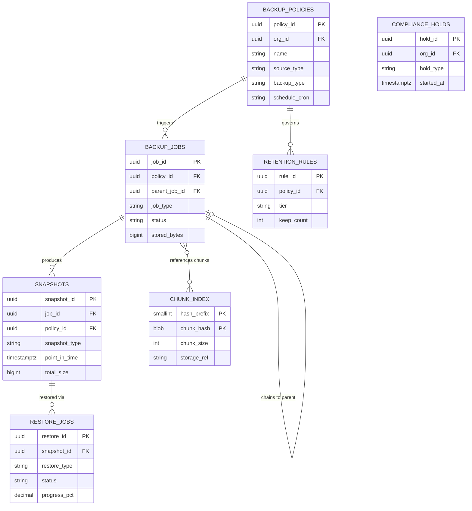
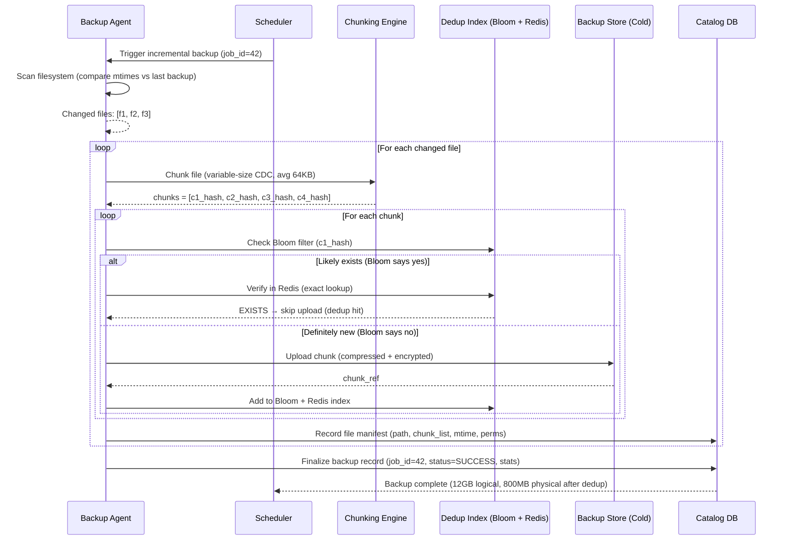
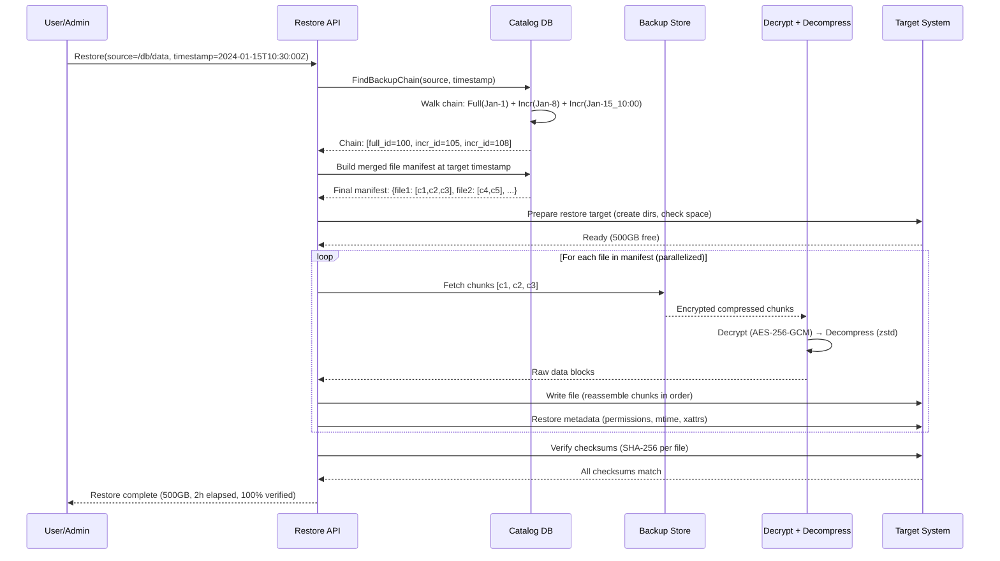

# Backup and Restore Platform - System Design

## 1. Requirements

### Functional Requirements
1. Scheduled backups: full, incremental, and differential
2. Point-in-time recovery (PITR) for databases
3. Cross-region replication for disaster recovery
4. Configurable retention policies (daily/weekly/monthly/yearly)
5. Backup verification and integrity checks
6. Global deduplication across all backup sources
7. Encryption at rest (AES-256) and in transit (TLS 1.3)
8. Multi-source support: databases, file systems, VMs, SaaS apps, containers

### Non-Functional Requirements
- Backup success rate: 99.999%
- RPO (Recovery Point Objective): <15 minutes
- RTO (Recovery Time Objective): <1 hour
- Scale: Exabyte-level total managed storage
- Throughput: 100 GB/s aggregate ingest rate
- Concurrent jobs: 100K+ simultaneous backup operations

## 2. Capacity Estimation

| Metric | Value |
|--------|-------|
| Total managed data | 5 EB |
| Daily change rate | 3% (150 PB/day new data) |
| After dedup (3:1 ratio) | 50 PB/day stored |
| Backup jobs/day | 10M |
| Concurrent jobs (peak) | 150K |
| Restore operations/day | 50K |
| Retention average | 90 days |
| Total stored (with retention) | 2 EB (deduped + compressed) |
| Chunk index entries | 50T (avg 100KB chunks) |
| Metadata store size | 500 TB |

### Storage Tier Distribution
- Hot (SSD, <7 days): 350 PB
- Warm (HDD, 7-30 days): 500 PB
- Cold (S3 Glacier, 30-365 days): 800 PB
- Archive (Deep Archive/Tape, >1yr): 350 PB

## 3. Data Modeling

### Entity-Relationship Diagram



### Backup Jobs (PostgreSQL)
```sql
CREATE TABLE backup_policies (
    policy_id       UUID PRIMARY KEY DEFAULT gen_random_uuid(),
    org_id          UUID NOT NULL REFERENCES organizations(org_id),
    name            VARCHAR(256) NOT NULL,
    source_type     VARCHAR(50) NOT NULL,  -- database, filesystem, vm, saas, container
    source_config   JSONB NOT NULL,        -- connection details, paths, filters
    schedule_cron   VARCHAR(128) NOT NULL,  -- cron expression
    backup_type     VARCHAR(20) NOT NULL,   -- full, incremental, differential
    full_schedule   VARCHAR(128),           -- when to do synthetic full
    retention       JSONB NOT NULL,         -- { daily: 7, weekly: 4, monthly: 12, yearly: 3 }
    encryption_key_id VARCHAR(256) NOT NULL,
    compression     VARCHAR(20) DEFAULT 'zstd',
    dedup_enabled   BOOL DEFAULT TRUE,
    bandwidth_limit_mbps INT,
    target_regions  TEXT[] NOT NULL,        -- ['us-east-1', 'eu-west-1']
    enabled         BOOL DEFAULT TRUE,
    created_at      TIMESTAMPTZ DEFAULT NOW(),
    updated_at      TIMESTAMPTZ DEFAULT NOW()
);

CREATE INDEX idx_policies_org ON backup_policies(org_id);
CREATE INDEX idx_policies_schedule ON backup_policies(enabled, schedule_cron);

CREATE TABLE backup_jobs (
    job_id          UUID PRIMARY KEY DEFAULT gen_random_uuid(),
    policy_id       UUID NOT NULL REFERENCES backup_policies(policy_id),
    parent_job_id   UUID REFERENCES backup_jobs(job_id),  -- for incremental chains
    job_type        VARCHAR(20) NOT NULL,  -- full, incremental, differential, synthetic_full
    status          VARCHAR(30) NOT NULL DEFAULT 'queued',
    -- queued, running, verifying, replicating, completed, failed, cancelled
    started_at      TIMESTAMPTZ,
    completed_at    TIMESTAMPTZ,
    source_bytes    BIGINT,        -- original data size
    stored_bytes    BIGINT,        -- after dedup + compression
    dedup_ratio     DECIMAL(5,2),
    chunk_count     BIGINT,
    new_chunks      BIGINT,        -- chunks not found in dedup index
    error_message   TEXT,
    retry_count     INT DEFAULT 0,
    checkpoint      JSONB,         -- for resumable backups
    verification_status VARCHAR(20),  -- pending, passed, failed
    expires_at      TIMESTAMPTZ NOT NULL,
    created_at      TIMESTAMPTZ DEFAULT NOW()
);

CREATE INDEX idx_jobs_policy_status ON backup_jobs(policy_id, status);
CREATE INDEX idx_jobs_status ON backup_jobs(status) WHERE status IN ('queued', 'running');
CREATE INDEX idx_jobs_expiry ON backup_jobs(expires_at) WHERE status = 'completed';
CREATE INDEX idx_jobs_chain ON backup_jobs(parent_job_id);
```

### Snapshots and Restore Points (PostgreSQL)
```sql
CREATE TABLE snapshots (
    snapshot_id     UUID PRIMARY KEY DEFAULT gen_random_uuid(),
    job_id          UUID NOT NULL REFERENCES backup_jobs(job_id),
    policy_id       UUID NOT NULL,
    snapshot_type   VARCHAR(20) NOT NULL,  -- full, incremental, synthetic_full
    point_in_time   TIMESTAMPTZ NOT NULL,
    source_metadata JSONB NOT NULL,  -- DB schema version, VM config, etc.
    manifest_ref    VARCHAR(512) NOT NULL,  -- pointer to chunk manifest in object store
    total_size      BIGINT NOT NULL,
    is_consistent   BOOL DEFAULT TRUE,
    consistency_check_at TIMESTAMPTZ,
    retention_tier  VARCHAR(20) DEFAULT 'standard',
    locked_until    TIMESTAMPTZ,  -- compliance lock
    created_at      TIMESTAMPTZ DEFAULT NOW()
);

CREATE INDEX idx_snapshots_policy_time ON snapshots(policy_id, point_in_time DESC);
CREATE INDEX idx_snapshots_locked ON snapshots(locked_until) WHERE locked_until IS NOT NULL;

CREATE TABLE restore_jobs (
    restore_id      UUID PRIMARY KEY DEFAULT gen_random_uuid(),
    snapshot_id     UUID NOT NULL REFERENCES snapshots(snapshot_id),
    target_config   JSONB NOT NULL,  -- where to restore
    restore_type    VARCHAR(30) NOT NULL,  -- full, granular, pitr
    pitr_target     TIMESTAMPTZ,    -- for point-in-time recovery
    status          VARCHAR(30) NOT NULL DEFAULT 'queued',
    progress_pct    DECIMAL(5,2) DEFAULT 0,
    bytes_restored  BIGINT DEFAULT 0,
    started_at      TIMESTAMPTZ,
    completed_at    TIMESTAMPTZ,
    error_message   TEXT,
    created_at      TIMESTAMPTZ DEFAULT NOW()
);
```

### Dedup Chunk Index (ScyllaDB / Cassandra)
```sql
-- Distributed chunk fingerprint index
-- Partition by first 2 bytes of hash for even distribution
CREATE TABLE chunk_index (
    hash_prefix     SMALLINT,              -- first 2 bytes of SHA-256
    chunk_hash      BLOB,                  -- full SHA-256 (32 bytes)
    chunk_size      INT,
    storage_ref     TEXT,                   -- object store path
    ref_count       COUNTER,               -- reference counting for GC
    compression     TEXT,                   -- algorithm used
    storage_tier    TEXT,                   -- hot/warm/cold/archive
    created_at      TIMESTAMP,
    last_accessed   TIMESTAMP,
    PRIMARY KEY ((hash_prefix), chunk_hash)
) WITH compaction = {'class': 'LeveledCompactionStrategy'}
  AND compression = {'sstable_compression': 'ZstdCompressor'};

-- Bloom filter: 10 bits per element, ~1% FPR
-- For 50T entries: ~60TB bloom filter distributed across nodes
```

### Retention Policies (PostgreSQL)
```sql
CREATE TABLE retention_rules (
    rule_id         UUID PRIMARY KEY DEFAULT gen_random_uuid(),
    policy_id       UUID NOT NULL REFERENCES backup_policies(policy_id),
    tier            VARCHAR(20) NOT NULL,  -- daily, weekly, monthly, yearly
    keep_count      INT NOT NULL,
    keep_days       INT,
    transition_to   VARCHAR(20),  -- storage tier to move to after N days
    transition_days INT,
    compliance_lock BOOL DEFAULT FALSE,
    created_at      TIMESTAMPTZ DEFAULT NOW()
);

CREATE TABLE compliance_holds (
    hold_id         UUID PRIMARY KEY DEFAULT gen_random_uuid(),
    org_id          UUID NOT NULL,
    hold_name       VARCHAR(256) NOT NULL,
    hold_type       VARCHAR(30) NOT NULL,  -- legal_hold, regulatory, custom
    query_filter    JSONB NOT NULL,  -- which backups are covered
    started_at      TIMESTAMPTZ NOT NULL,
    expires_at      TIMESTAMPTZ,     -- NULL = indefinite
    created_by      VARCHAR(256) NOT NULL,
    created_at      TIMESTAMPTZ DEFAULT NOW()
);
```

## 4. High-Level Design

```
┌─────────────────────────────────────────────────────────────────────────────────┐
│                            BACKUP SOURCES                                         │
│  ┌─────────┐  ┌─────────┐  ┌─────────┐  ┌─────────┐  ┌─────────┐             │
│  │Databases│  │  File   │  │  VMs /  │  │  SaaS   │  │Container│             │
│  │(PG,MySQL│  │ Systems │  │  Images │  │(O365,GW)│  │ Volumes │             │
│  │ Mongo)  │  │(NFS,EBS)│  │(VMware) │  │         │  │  (K8s)  │             │
│  └────┬────┘  └────┬────┘  └────┬────┘  └────┬────┘  └────┬────┘             │
│       │             │            │             │             │                   │
│  ┌────▼─────────────▼────────────▼─────────────▼─────────────▼────┐             │
│  │                    Backup Agents (per-source)                    │             │
│  │  • Change tracking (CDC/CBT/rsync)                              │             │
│  │  • Block-level reads                                            │             │
│  │  • Application-consistent snapshots                             │             │
│  └────────────────────────────────┬───────────────────────────────┘             │
└───────────────────────────────────┼─────────────────────────────────────────────┘
                                    │
┌───────────────────────────────────┼─────────────────────────────────────────────┐
│                                   ▼                                              │
│  ┌──────────────────────────────────────────────────────────────────┐           │
│  │                    CONTROL PLANE                                   │           │
│  │                                                                    │           │
│  │  ┌────────────┐  ┌────────────┐  ┌────────────┐  ┌───────────┐  │           │
│  │  │  Scheduler │  │   Job      │  │  Policy    │  │  Restore  │  │           │
│  │  │  Service   │  │ Orchestrator│  │  Engine    │  │  Manager  │  │           │
│  │  │ (Cron+Kafka│  │  (Kafka    │  │            │  │           │  │           │
│  │  │  triggers) │  │  Streams)  │  │            │  │           │  │           │
│  │  └─────┬──────┘  └─────┬──────┘  └─────┬──────┘  └─────┬─────┘  │           │
│  │        │                │               │               │         │           │
│  └────────┼────────────────┼───────────────┼───────────────┼─────────┘           │
│           │                │               │               │                     │
│  ┌────────▼────────────────▼───────────────▼───────────────▼─────────┐           │
│  │                    DATA PLANE                                       │           │
│  │                                                                     │           │
│  │  ┌────────────┐  ┌────────────┐  ┌────────────┐  ┌────────────┐  │           │
│  │  │   Backup   │  │   Dedup    │  │ Compression│  │ Encryption │  │           │
│  │  │   Engine   │  │   Engine   │  │   Engine   │  │   Engine   │  │           │
│  │  │            │◄─┤            │◄─┤            │◄─┤            │  │           │
│  │  └─────┬──────┘  └─────┬──────┘  └────────────┘  └────────────┘  │           │
│  │        │                │                                          │           │
│  │  ┌─────▼──────┐  ┌─────▼──────┐                                  │           │
│  │  │  Chunk     │  │  Chunk     │                                   │           │
│  │  │  Assembler │  │  Index     │                                   │           │
│  │  │            │  │ (ScyllaDB) │                                   │           │
│  │  └─────┬──────┘  └────────────┘                                   │           │
│  │        │                                                           │           │
│  └────────┼───────────────────────────────────────────────────────────┘           │
│           │                                                                       │
│  ┌────────▼───────────────────────────────────────────────────────────┐           │
│  │                    STORAGE LAYER                                     │           │
│  │                                                                      │           │
│  │  ┌──────────┐  ┌──────────┐  ┌──────────┐  ┌──────────┐          │           │
│  │  │   Hot    │  │   Warm   │  │   Cold   │  │ Archive  │          │           │
│  │  │  (SSD)   │  │  (HDD)   │  │(S3 Glac.)│  │(Deep Arc)│          │           │
│  │  │  <7 days │  │ 7-30 days│  │30-365 day│  │  >1 year │          │           │
│  │  └──────────┘  └──────────┘  └──────────┘  └──────────┘          │           │
│  │                                                                      │           │
│  │  ┌────────────────────────────────────────────────────────────┐    │           │
│  │  │         Cross-Region Replication (async)                    │    │           │
│  │  │    Primary ──────► Secondary ──────► Tertiary               │    │           │
│  │  └────────────────────────────────────────────────────────────┘    │           │
│  └──────────────────────────────────────────────────────────────────────┘           │
│                                                                                     │
│  ┌──────────────────────────────────────────────────────────────────────┐           │
│  │  VERIFICATION LAYER                                                   │           │
│  │  • Integrity checks (SHA-256 per chunk)                               │           │
│  │  • Restore testing (automated sandbox restore)                        │           │
│  │  • Consistency validation (DB checksums, file counts)                 │           │
│  └──────────────────────────────────────────────────────────────────────┘           │
└─────────────────────────────────────────────────────────────────────────────────────┘
```

## 5. API Design

### Backup Policy Management
```
POST /api/v1/policies
  Body: {
    name: "Production DB Daily",
    source_type: "database",
    source_config: {
      engine: "postgresql",
      host: "prod-db.internal",
      port: 5432,
      databases: ["app_main", "app_analytics"],
      ssl: true
    },
    schedule: "0 2 * * *",
    backup_type: "incremental",
    full_schedule: "0 2 * * 0",  // weekly full
    retention: { daily: 7, weekly: 4, monthly: 12, yearly: 3 },
    encryption_key_id: "arn:aws:kms:...",
    target_regions: ["us-east-1", "eu-west-1"],
    dedup_enabled: true,
    bandwidth_limit_mbps: 500
  }

GET /api/v1/policies/{policyId}/jobs?status=completed&limit=50

DELETE /api/v1/policies/{policyId}
```

### Backup Operations
```
POST /api/v1/backups/trigger
  Body: { policy_id: "uuid", type: "incremental", priority: "high" }
  Response: { job_id: "uuid", status: "queued", estimated_duration_sec: 3600 }

GET /api/v1/backups/{jobId}/status
  Response: {
    job_id: "uuid",
    status: "running",
    progress: { bytes_processed: 1073741824, total_bytes: 10737418240, pct: 10.0 },
    dedup_stats: { chunks_processed: 50000, new_chunks: 5000, ratio: 3.2 },
    throughput_mbps: 850,
    eta_seconds: 1800
  }

POST /api/v1/backups/{jobId}/cancel
```

### Restore Operations
```
POST /api/v1/restore
  Body: {
    snapshot_id: "uuid",
    restore_type: "pitr",
    pitr_target: "2025-01-15T10:30:00Z",
    target: {
      type: "database",
      host: "restore-target.internal",
      port: 5432,
      database: "app_main_restored"
    },
    options: { parallel_streams: 8, verify_after_restore: true }
  }
  Response: { restore_id: "uuid", status: "queued", estimated_rto_min: 45 }

GET /api/v1/restore/{restoreId}/status
  Response: {
    status: "running",
    phase: "applying_wal_logs",  // phases: downloading, assembling, applying_wal_logs, verifying
    progress_pct: 72.5,
    bytes_restored: 8589934592,
    current_pitr: "2025-01-15T10:28:45Z"
  }
```

### Retention and Compliance
```
POST /api/v1/compliance/holds
  Body: {
    name: "Legal Hold - Case #12345",
    hold_type: "legal_hold",
    query_filter: {
      org_id: "uuid",
      source_types: ["database", "filesystem"],
      date_range: { start: "2024-01-01", end: "2024-12-31" }
    }
  }

GET /api/v1/retention/report
  Response: {
    total_managed: "2.1 EB",
    by_tier: { hot: "350 PB", warm: "500 PB", cold: "800 PB", archive: "350 PB" },
    pending_expiration: { next_24h: "5 PB", next_7d: "20 PB" },
    compliance_locked: "50 PB"
  }
```

## 6. Deep Dive: Incremental Forever with Synthetic Full

### Block-Level Change Tracking

```python
class IncrementalForeverEngine:
    """Implements incremental-forever backup with synthetic full assembly."""
    
    def __init__(self, chunk_size=256*1024):  # 256KB default block
        self.chunk_size = chunk_size
        self.change_tracker = ChangeBlockTracker()
    
    async def perform_incremental_backup(self, source, last_backup_snapshot):
        """Track only changed blocks since last backup."""
        
        # Get changed blocks using source-native change tracking
        changed_blocks = await self._get_changed_blocks(source, last_backup_snapshot)
        
        job_manifest = BackupManifest(
            type="incremental",
            parent_snapshot=last_backup_snapshot.id,
            timestamp=datetime.utcnow()
        )
        
        for block_range in changed_blocks:
            # Read changed data
            data = await source.read_blocks(block_range.start, block_range.length)
            
            # Chunk the data using content-defined chunking
            chunks = self.content_defined_chunking(data)
            
            for chunk in chunks:
                chunk_hash = hashlib.sha256(chunk.data).digest()
                
                # Check dedup index
                existing = await self.dedup_index.lookup(chunk_hash)
                
                if existing:
                    # Reference existing chunk
                    job_manifest.add_chunk_ref(block_range.offset, chunk_hash, existing.storage_ref)
                    await self.dedup_index.increment_ref(chunk_hash)
                else:
                    # Store new chunk
                    compressed = zstd.compress(chunk.data, level=3)
                    encrypted = self.encrypt(compressed)
                    storage_ref = await self.storage.write(encrypted)
                    
                    await self.dedup_index.insert(chunk_hash, storage_ref, len(chunk.data))
                    job_manifest.add_chunk_ref(block_range.offset, chunk_hash, storage_ref)
        
        return job_manifest
    
    async def _get_changed_blocks(self, source, last_snapshot):
        """Get changed blocks using source-native CBT."""
        if source.type == "vm":
            # VMware CBT (Changed Block Tracking)
            return await source.query_changed_disk_areas(
                snapshot_id=last_snapshot.source_metadata["vm_snapshot_id"],
                change_id=last_snapshot.source_metadata["change_id"]
            )
        elif source.type == "database":
            # PostgreSQL WAL-based tracking
            return await source.get_wal_changes_since(
                lsn=last_snapshot.source_metadata["wal_lsn"]
            )
        elif source.type == "filesystem":
            # Use filesystem journal or file modification times
            return await source.scan_modified_blocks(
                since=last_snapshot.point_in_time,
                use_journal=True
            )
    
    async def assemble_synthetic_full(self, policy_id: str, target_time: datetime):
        """
        Create a synthetic full backup by combining the last full + all incrementals.
        No need to re-read source data - purely server-side operation.
        """
        # Find the backup chain
        chain = await self._get_backup_chain(policy_id, target_time)
        # chain = [full_manifest, incr_1, incr_2, ..., incr_n]
        
        # Start with full backup manifest as base
        synthetic_manifest = BackupManifest(
            type="synthetic_full",
            timestamp=target_time
        )
        
        # Build block map from full backup
        block_map = {}  # offset → chunk_ref
        for chunk_ref in chain[0].chunks:
            block_map[chunk_ref.offset] = chunk_ref
        
        # Apply incrementals in order (later overwrites earlier)
        for incremental in chain[1:]:
            for chunk_ref in incremental.chunks:
                block_map[chunk_ref.offset] = chunk_ref
        
        # The block_map now represents the complete state at target_time
        for offset in sorted(block_map.keys()):
            synthetic_manifest.add_chunk_ref(
                offset, 
                block_map[offset].chunk_hash,
                block_map[offset].storage_ref
            )
        
        # Store manifest (no data movement needed!)
        await self.store_manifest(synthetic_manifest)
        
        # Update reference counts
        for chunk_ref in synthetic_manifest.chunks:
            await self.dedup_index.increment_ref(chunk_ref.chunk_hash)
        
        return synthetic_manifest
    
    async def _get_backup_chain(self, policy_id, target_time):
        """Walk the incremental chain back to the last full."""
        chain = []
        current = await self.db.query(
            "SELECT * FROM backup_jobs WHERE policy_id = %s "
            "AND completed_at <= %s AND status = 'completed' "
            "ORDER BY completed_at DESC LIMIT 1",
            (policy_id, target_time)
        )
        
        while current:
            chain.insert(0, await self.load_manifest(current.job_id))
            if current.job_type in ('full', 'synthetic_full'):
                break
            current = await self.db.get(current.parent_job_id)
        
        return chain


class BackupChainManager:
    """Manages incremental chains and prevents chain degradation."""
    
    MAX_CHAIN_LENGTH = 14  # Max incrementals before synthetic full
    MAX_CHAIN_AGE_DAYS = 30
    
    async def evaluate_chain_health(self, policy_id: str) -> ChainHealth:
        """Determine if synthetic full is needed."""
        chain = await self._get_current_chain(policy_id)
        
        health = ChainHealth(
            chain_length=len(chain),
            oldest_full_age=(datetime.utcnow() - chain[0].timestamp).days,
            total_chain_size=sum(m.size for m in chain),
            restore_time_estimate=self._estimate_restore_time(chain)
        )
        
        # Trigger synthetic full if chain is too long or old
        if (health.chain_length > self.MAX_CHAIN_LENGTH or
            health.oldest_full_age > self.MAX_CHAIN_AGE_DAYS):
            health.needs_synthetic_full = True
        
        return health
    
    def _estimate_restore_time(self, chain) -> int:
        """Estimate restore time in seconds based on chain length."""
        # Each link in chain adds ~30s overhead for manifest processing
        # Plus actual data transfer time
        overhead = len(chain) * 30
        data_time = chain[0].size / (500 * 1024 * 1024)  # 500 MB/s restore speed
        return int(overhead + data_time)
```

## 7. Deep Dive: Global Deduplication

### Variable-Length Content-Defined Chunking

```python
class ContentDefinedChunker:
    """Rabin fingerprint-based variable-length chunking for deduplication."""
    
    WINDOW_SIZE = 48          # Sliding window bytes
    MIN_CHUNK = 32 * 1024     # 32 KB minimum
    MAX_CHUNK = 512 * 1024    # 512 KB maximum
    AVG_CHUNK = 128 * 1024    # 128 KB average target
    
    # Rabin polynomial for rolling hash
    POLYNOMIAL = 0x3DA3358B4DC173
    MASK = (1 << 17) - 1      # Determines avg chunk size (~128KB)
    
    def __init__(self):
        self.rabin = RabinFingerprint(self.POLYNOMIAL, self.WINDOW_SIZE)
    
    def chunk_stream(self, data_stream) -> Iterator[Chunk]:
        """Split data stream into content-defined variable-length chunks."""
        buffer = bytearray()
        offset = 0
        chunk_start = 0
        
        for block in data_stream:
            buffer.extend(block)
            
            while offset < len(buffer):
                self.rabin.slide(buffer[offset])
                offset += 1
                chunk_length = offset - chunk_start
                
                # Check boundary conditions
                if chunk_length < self.MIN_CHUNK:
                    continue
                
                if chunk_length >= self.MAX_CHUNK:
                    # Force boundary at max size
                    yield Chunk(
                        data=bytes(buffer[chunk_start:offset]),
                        offset=chunk_start,
                        length=chunk_length
                    )
                    chunk_start = offset
                    self.rabin.reset()
                    continue
                
                # Check if Rabin fingerprint matches boundary pattern
                if (self.rabin.fingerprint & self.MASK) == 0:
                    yield Chunk(
                        data=bytes(buffer[chunk_start:offset]),
                        offset=chunk_start,
                        length=chunk_length
                    )
                    chunk_start = offset
                    self.rabin.reset()
        
        # Emit final chunk
        if chunk_start < len(buffer):
            yield Chunk(
                data=bytes(buffer[chunk_start:]),
                offset=chunk_start,
                length=len(buffer) - chunk_start
            )


class DistributedDedupIndex:
    """
    Distributed dedup index using:
    - Bloom filter (in-memory) for fast negative lookups
    - SSD tier for hot chunk hashes
    - ScyllaDB for full index
    """
    
    def __init__(self, scylla_client, redis_client):
        self.scylla = scylla_client
        self.redis = redis_client
        # Distributed bloom filter: 10 bits/element, 1% FPR
        # For 50T chunks: ~60TB, partitioned across nodes
        self.bloom_partitions = 1024  # Each partition ~60GB
    
    async def lookup(self, chunk_hash: bytes) -> Optional[ChunkRef]:
        """Three-tier lookup: Bloom → Redis cache → ScyllaDB."""
        
        # Tier 1: Bloom filter (sub-microsecond, in-memory)
        partition = int.from_bytes(chunk_hash[:2], 'big') % self.bloom_partitions
        if not await self._bloom_might_contain(partition, chunk_hash):
            return None  # Definitely not present
        
        # Tier 2: Redis cache (hot chunks, sub-millisecond)
        cache_key = f"chunk:{chunk_hash.hex()}"
        cached = await self.redis.get(cache_key)
        if cached:
            return ChunkRef.from_bytes(cached)
        
        # Tier 3: ScyllaDB (full index, ~5ms)
        hash_prefix = int.from_bytes(chunk_hash[:2], 'big')
        result = await self.scylla.execute(
            "SELECT storage_ref, chunk_size, storage_tier FROM chunk_index "
            "WHERE hash_prefix = ? AND chunk_hash = ?",
            (hash_prefix, chunk_hash)
        )
        
        if result:
            ref = ChunkRef(
                storage_ref=result.storage_ref,
                size=result.chunk_size,
                tier=result.storage_tier
            )
            # Promote to cache
            await self.redis.setex(cache_key, 3600, ref.to_bytes())
            return ref
        
        return None
    
    async def insert(self, chunk_hash: bytes, storage_ref: str, size: int):
        """Insert new chunk into dedup index."""
        hash_prefix = int.from_bytes(chunk_hash[:2], 'big')
        
        # Insert into ScyllaDB
        await self.scylla.execute(
            "INSERT INTO chunk_index (hash_prefix, chunk_hash, chunk_size, "
            "storage_ref, storage_tier, created_at) VALUES (?, ?, ?, ?, ?, ?)",
            (hash_prefix, chunk_hash, size, storage_ref, 'hot', datetime.utcnow())
        )
        
        # Update bloom filter
        partition = hash_prefix % self.bloom_partitions
        await self._bloom_add(partition, chunk_hash)
        
        # Add to Redis cache
        cache_key = f"chunk:{chunk_hash.hex()}"
        ref = ChunkRef(storage_ref=storage_ref, size=size, tier='hot')
        await self.redis.setex(cache_key, 3600, ref.to_bytes())
    
    async def garbage_collect(self):
        """Remove chunks with zero references."""
        # Scan for zero-ref chunks older than 7 days (grace period)
        expired = await self.scylla.execute(
            "SELECT chunk_hash, storage_ref FROM chunk_index "
            "WHERE ref_count = 0 AND created_at < ?",
            (datetime.utcnow() - timedelta(days=7),)
        )
        
        for chunk in expired:
            await self.storage.delete(chunk.storage_ref)
            await self.scylla.execute(
                "DELETE FROM chunk_index WHERE hash_prefix = ? AND chunk_hash = ?",
                (int.from_bytes(chunk.chunk_hash[:2], 'big'), chunk.chunk_hash)
            )


class InlineDedupPipeline:
    """
    Inline dedup: check during backup (saves storage immediately)
    vs Post-process: store first, dedup later (faster backup, more temp storage)
    
    We use INLINE for databases (high dedup ratio, consistent data)
    and POST-PROCESS for VMs (large blocks, speed matters more).
    """
    
    async def process_chunk_inline(self, chunk: Chunk, job_context: BackupJobContext):
        """Inline dedup: check and store atomically."""
        chunk_hash = hashlib.sha256(chunk.data).digest()
        
        existing = await self.dedup_index.lookup(chunk_hash)
        
        if existing:
            # Dedup hit - just reference existing chunk
            job_context.manifest.add_chunk_ref(chunk.offset, chunk_hash, existing.storage_ref)
            job_context.stats.dedup_hits += 1
            job_context.stats.bytes_saved += chunk.length
        else:
            # New unique chunk - compress, encrypt, store
            compressed = zstd.compress(chunk.data, level=3)
            encrypted = self.kms.encrypt(compressed, job_context.encryption_key)
            storage_ref = await self.storage.write_chunk(encrypted)
            
            await self.dedup_index.insert(chunk_hash, storage_ref, chunk.length)
            job_context.manifest.add_chunk_ref(chunk.offset, chunk_hash, storage_ref)
            job_context.stats.new_chunks += 1
    
    async def process_chunk_postprocess(self, chunk: Chunk, job_context: BackupJobContext):
        """Post-process dedup: store immediately, dedup later in batch."""
        # Store to temp location without dedup check
        compressed = zstd.compress(chunk.data, level=1)  # Fast compression
        temp_ref = await self.temp_storage.write(compressed)
        
        # Queue for post-process dedup
        await self.dedup_queue.enqueue({
            "chunk_hash": hashlib.sha256(chunk.data).digest().hex(),
            "temp_ref": temp_ref,
            "size": chunk.length,
            "job_id": job_context.job_id,
            "offset": chunk.offset
        })
```

## 8. Component Optimization

### Kafka for Job Orchestration
```python
class BackupJobOrchestrator:
    """Kafka-based distributed job orchestration."""
    
    TOPICS = {
        "backup_scheduled": "backup.jobs.scheduled",
        "backup_running": "backup.jobs.running",
        "backup_chunks": "backup.chunks.process",
        "backup_completed": "backup.jobs.completed",
        "backup_failed": "backup.jobs.failed",
    }
    
    async def schedule_job(self, policy: BackupPolicy):
        """Produce backup job to Kafka for distributed processing."""
        job = BackupJob(
            policy_id=policy.id,
            type=self._determine_backup_type(policy),
            priority=policy.priority,
            source_config=policy.source_config
        )
        
        await self.kafka.produce(
            topic=self.TOPICS["backup_scheduled"],
            key=policy.id.encode(),
            value=job.serialize(),
            headers={"priority": str(job.priority)}
        )
    
    async def process_job(self, job: BackupJob):
        """Consumer: process a backup job."""
        try:
            # Update status
            await self.update_status(job.id, "running")
            
            # Execute backup based on source type
            engine = self.get_engine(job.source_config["type"])
            manifest = await engine.run_backup(job)
            
            # Verify backup
            await self.verify_backup(manifest)
            
            # Trigger replication
            await self.kafka.produce(
                topic="backup.replication.pending",
                value=manifest.serialize()
            )
            
            await self.update_status(job.id, "completed")
            
        except Exception as e:
            if job.retry_count < 3:
                await self.retry_with_backoff(job)
            else:
                await self.update_status(job.id, "failed", error=str(e))
```

### Backup Verification
```python
class BackupVerifier:
    """Automated backup verification via sandbox restore."""
    
    async def verify_backup(self, snapshot: Snapshot) -> VerificationResult:
        """Multi-level verification."""
        results = []
        
        # Level 1: Chunk integrity (always)
        chunk_result = await self._verify_chunk_integrity(snapshot)
        results.append(chunk_result)
        
        # Level 2: Manifest consistency (always)
        manifest_result = await self._verify_manifest(snapshot)
        results.append(manifest_result)
        
        # Level 3: Sandbox restore (periodic, sampling)
        if self._should_do_restore_test(snapshot):
            restore_result = await self._sandbox_restore_test(snapshot)
            results.append(restore_result)
        
        return VerificationResult(
            snapshot_id=snapshot.id,
            passed=all(r.passed for r in results),
            checks=results
        )
    
    async def _verify_chunk_integrity(self, snapshot):
        """Verify SHA-256 of random sample of chunks."""
        manifest = await self.load_manifest(snapshot)
        sample_size = min(1000, len(manifest.chunks))
        sample = random.sample(manifest.chunks, sample_size)
        
        for chunk_ref in sample:
            data = await self.storage.read(chunk_ref.storage_ref)
            decrypted = self.kms.decrypt(data)
            decompressed = zstd.decompress(decrypted)
            actual_hash = hashlib.sha256(decompressed).digest()
            
            if actual_hash != chunk_ref.chunk_hash:
                return CheckResult(passed=False, error=f"Chunk {chunk_ref} corrupted")
        
        return CheckResult(passed=True, message=f"Verified {sample_size} chunks")
```

## 9. Observability

### Key Metrics
| Metric | Target | Alert |
|--------|--------|-------|
| Backup success rate | 99.999% | <99.99% |
| Backup throughput | >500 MB/s per stream | <100 MB/s |
| Dedup ratio | >3:1 | <2:1 (unusual data) |
| Chain length | <14 | >20 |
| Restore success rate | 99.99% | <99.9% |
| RPO compliance | 100% | Any miss |
| Chunk index lookup p99 | <10ms | >50ms |
| Verification pass rate | 100% | Any failure |

### Dashboard Panels
- Active jobs by status (real-time)
- Storage growth by tier (daily)
- Dedup savings trend (weekly)
- RPO/RTO compliance heat map
- Failed job root cause breakdown
- Cross-region replication lag

## 10. Considerations & Trade-offs

| Decision | Choice | Trade-off |
|----------|--------|-----------|
| Inline vs post-process dedup | Hybrid (inline for DB, post for VM) | Inline saves storage immediately but slows backup; post-process faster ingest but needs temp space |
| Fixed vs variable chunking | Variable (Rabin) | Better dedup for insertions but CPU overhead and complex boundary detection |
| Synthetic full vs actual full | Synthetic every 30 days | No source re-read needed but chain walk on restore; periodic actual full for safety |
| Encryption scope | Per-chunk | Enables dedup before encryption (hash plaintext) but requires secure hash transport |
| Chunk index storage | ScyllaDB + Bloom + Redis | 3-tier gives sub-ms hot lookups but complex to maintain consistency |
| Replication strategy | Async cross-region | Low impact on backup speed but RPO for secondary region is higher |
| Retention enforcement | Lazy deletion with grace period | Prevents accidental permanent deletion but uses more storage short-term |

---

## Sequence Diagrams

### Incremental Backup with Deduplication



### Point-in-Time Restore



## Database Optimization

**Catalog DB Schema Optimization for Chain Walks:**

```sql
-- Covering index for backup chain traversal
CREATE INDEX idx_backup_chain ON backups(source_path, timestamp DESC) 
  INCLUDE (backup_type, parent_id, manifest_ref);

-- Chunk reference counting for garbage collection
CREATE INDEX idx_chunk_refcount ON chunk_refs(chunk_hash) 
  INCLUDE (ref_count, last_referenced);

-- Partition by time for efficient retention enforcement
ALTER TABLE backups PARTITION BY RANGE (timestamp);
```

**Query patterns optimized:**
- Chain walk: Single index scan (no joins) to find Full + all Incrementals
- Dedup ratio: Pre-computed in backup record (avoid counting at query time)
- Retention scan: Partition pruning drops old partitions instantly (no row-by-row delete)
