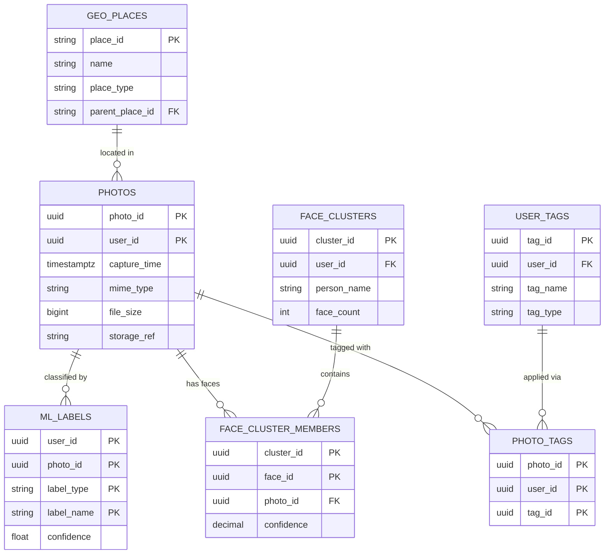
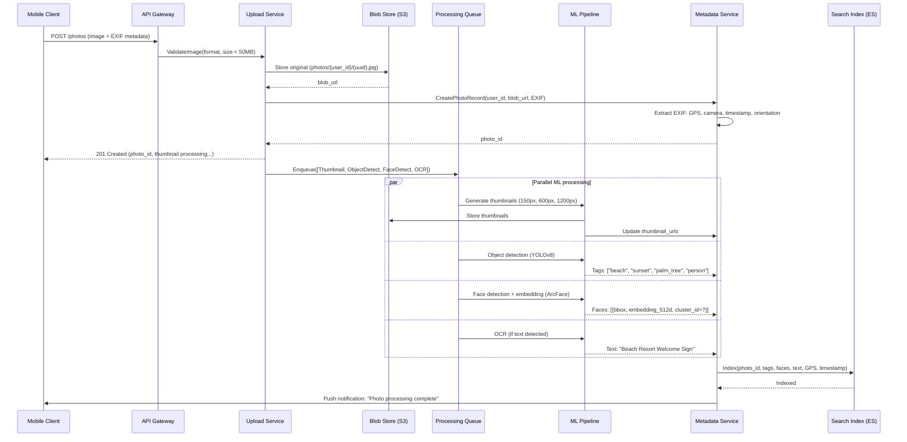
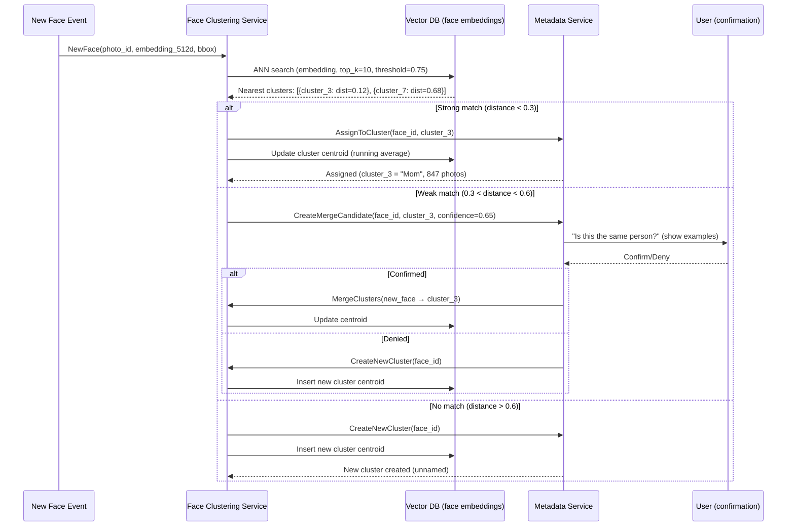

# Photo/File Metadata Service - System Design

## 1. Requirements

### Functional Requirements
1. EXIF/XMP/IPTC metadata extraction from photos and videos
2. Auto-tagging with ML: faces, objects, scenes, locations, activities
3. Custom metadata and user-defined tags
4. Full metadata search with faceted filtering
5. Reverse geocoding (GPS coordinates → place names)
6. Timeline and memories (auto-generated "On This Day", trips, events)
7. Duplicate detection (perceptual hashing)
8. Content-based similarity search

### Non-Functional Requirements
- Availability: 99.99%
- Extraction latency: <2 seconds per photo
- Search latency: <100ms
- Scale: 100B+ photos indexed
- ML inference throughput: 10K photos/sec
- Storage: Efficient for 100B metadata records

## 2. Capacity Estimation

| Metric | Value |
|--------|-------|
| Total photos indexed | 100B |
| New photos/day | 500M |
| Avg metadata size per photo | 5 KB (structured) |
| Face embeddings per photo | 2.5 avg × 512 bytes = 1.25 KB |
| Total metadata storage | 500 TB |
| Total face embeddings | 250B vectors × 512D = 500 TB |
| Search queries/day | 2B |
| Peak search QPS | 50K |
| ML inference jobs/sec (peak) | 15K |
| Reverse geocoding calls/day | 500M |

### Storage Breakdown
- PostgreSQL (photo metadata): 100 TB
- Elasticsearch (search index): 150 TB
- Vector DB - Milvus (face embeddings): 500 TB
- Redis (hot metadata cache): 20 TB
- Cassandra (ML labels): 200 TB
- Geo index: 5 TB

## 3. Data Modeling

### Entity-Relationship Diagram



### Photo Metadata (PostgreSQL - partitioned by user)
```sql
CREATE TABLE photos (
    photo_id        UUID NOT NULL,
    user_id         UUID NOT NULL,
    upload_time     TIMESTAMPTZ NOT NULL DEFAULT NOW(),
    capture_time    TIMESTAMPTZ,           -- from EXIF
    file_name       VARCHAR(512),
    mime_type       VARCHAR(100) NOT NULL,
    file_size       BIGINT NOT NULL,
    width           INT,
    height          INT,
    orientation     SMALLINT,
    storage_ref     VARCHAR(512) NOT NULL,
    thumbnail_ref   VARCHAR(512),
    
    -- EXIF data
    camera_make     VARCHAR(128),
    camera_model    VARCHAR(128),
    lens_model      VARCHAR(256),
    focal_length    DECIMAL(6,2),
    aperture        DECIMAL(4,2),
    shutter_speed   VARCHAR(20),
    iso             INT,
    flash_used      BOOL,
    
    -- Location
    latitude        DECIMAL(10,7),
    longitude       DECIMAL(10,7),
    altitude        DECIMAL(8,2),
    gps_accuracy    DECIMAL(6,2),
    place_id        VARCHAR(128),          -- resolved location
    country         VARCHAR(100),
    state           VARCHAR(100),
    city            VARCHAR(100),
    neighborhood    VARCHAR(200),
    
    -- Computed
    perceptual_hash BIGINT,                -- pHash for duplicate detection
    avg_color       INT,                   -- dominant color (RGB packed)
    quality_score   DECIMAL(3,2),          -- blur/noise detection
    is_screenshot   BOOL DEFAULT FALSE,
    is_duplicate    BOOL DEFAULT FALSE,
    duplicate_of    UUID,
    
    -- Processing state
    extraction_status VARCHAR(20) DEFAULT 'pending',
    ml_status       VARCHAR(20) DEFAULT 'pending',
    
    PRIMARY KEY (user_id, photo_id)
) PARTITION BY HASH (user_id);

CREATE INDEX idx_photos_capture_time ON photos(user_id, capture_time DESC);
CREATE INDEX idx_photos_location ON photos USING GIST (
    ST_MakePoint(longitude, latitude)
) WHERE latitude IS NOT NULL;
CREATE INDEX idx_photos_phash ON photos(perceptual_hash);
CREATE INDEX idx_photos_pending ON photos(extraction_status) 
    WHERE extraction_status = 'pending';
CREATE INDEX idx_photos_camera ON photos(camera_make, camera_model);
```

### ML Labels (Cassandra - high write throughput)
```sql
CREATE TABLE ml_labels (
    photo_id        UUID,
    user_id         UUID,
    label_type      TEXT,       -- object, scene, activity, text, nsfw
    label_name      TEXT,
    confidence      FLOAT,
    bounding_box    TEXT,       -- JSON: {x, y, width, height} normalized
    model_version   TEXT,
    created_at      TIMESTAMP,
    PRIMARY KEY ((user_id, photo_id), label_type, label_name)
) WITH CLUSTERING ORDER BY (label_type ASC, label_name ASC);

-- Reverse index: label → photos
CREATE TABLE photos_by_label (
    user_id         UUID,
    label_name      TEXT,
    confidence      FLOAT,
    photo_id        UUID,
    capture_time    TIMESTAMP,
    PRIMARY KEY ((user_id, label_name), confidence, photo_id)
) WITH CLUSTERING ORDER BY (confidence DESC, photo_id DESC);

CREATE TABLE photo_text (
    photo_id        UUID,
    user_id         UUID,
    ocr_text        TEXT,       -- full extracted text
    language        TEXT,
    confidence      FLOAT,
    text_regions    TEXT,       -- JSON array of {bbox, text, confidence}
    PRIMARY KEY ((user_id, photo_id))
);
```

### Face Embeddings (Milvus/Pinecone)
```python
# Milvus collection schema
face_collection = Collection(
    name="face_embeddings",
    schema=CollectionSchema(
        fields=[
            FieldSchema("face_id", DataType.VARCHAR, max_length=36, is_primary=True),
            FieldSchema("user_id", DataType.VARCHAR, max_length=36),
            FieldSchema("photo_id", DataType.VARCHAR, max_length=36),
            FieldSchema("embedding", DataType.FLOAT_VECTOR, dim=512),  # ArcFace
            FieldSchema("bbox_x", DataType.FLOAT),
            FieldSchema("bbox_y", DataType.FLOAT),
            FieldSchema("bbox_w", DataType.FLOAT),
            FieldSchema("bbox_h", DataType.FLOAT),
            FieldSchema("cluster_id", DataType.VARCHAR, max_length=36),  # person ID
            FieldSchema("quality_score", DataType.FLOAT),
            FieldSchema("capture_time", DataType.INT64),
        ],
        description="Face embeddings for recognition and clustering"
    )
)

# Index: IVF_PQ for billion-scale approximate nearest neighbor
face_collection.create_index(
    field_name="embedding",
    index_params={
        "index_type": "IVF_PQ",
        "metric_type": "COSINE",
        "params": {"nlist": 16384, "m": 64, "nbits": 8}
    }
)

# Partition by user_id for efficient per-user search
face_collection.create_partition(partition_name=user_id)
```

### Face Clusters / People (PostgreSQL)
```sql
CREATE TABLE face_clusters (
    cluster_id      UUID PRIMARY KEY DEFAULT gen_random_uuid(),
    user_id         UUID NOT NULL,
    person_name     VARCHAR(256),          -- user-assigned name
    is_named        BOOL DEFAULT FALSE,
    representative_face_id UUID,           -- best quality face
    face_count      INT DEFAULT 0,
    centroid        VECTOR(512),           -- cluster centroid
    first_seen      TIMESTAMPTZ,
    last_seen       TIMESTAMPTZ,
    is_hidden       BOOL DEFAULT FALSE,    -- user can hide people
    created_at      TIMESTAMPTZ DEFAULT NOW(),
    updated_at      TIMESTAMPTZ DEFAULT NOW()
);

CREATE INDEX idx_clusters_user ON face_clusters(user_id, face_count DESC);
CREATE INDEX idx_clusters_named ON face_clusters(user_id) WHERE is_named = TRUE;

CREATE TABLE face_cluster_members (
    cluster_id      UUID NOT NULL REFERENCES face_clusters(cluster_id),
    face_id         UUID NOT NULL,
    photo_id        UUID NOT NULL,
    confidence      DECIMAL(4,3) NOT NULL,  -- similarity to centroid
    added_at        TIMESTAMPTZ DEFAULT NOW(),
    PRIMARY KEY (cluster_id, face_id)
);

CREATE INDEX idx_cluster_members_photo ON face_cluster_members(photo_id);
```

### Custom Tags and Albums (PostgreSQL)
```sql
CREATE TABLE user_tags (
    tag_id          UUID PRIMARY KEY DEFAULT gen_random_uuid(),
    user_id         UUID NOT NULL,
    tag_name        VARCHAR(256) NOT NULL,
    tag_type        VARCHAR(20) DEFAULT 'custom',  -- custom, auto_album, memory
    photo_count     INT DEFAULT 0,
    cover_photo_id  UUID,
    created_at      TIMESTAMPTZ DEFAULT NOW(),
    UNIQUE (user_id, tag_name)
);

CREATE TABLE photo_tags (
    photo_id        UUID NOT NULL,
    user_id         UUID NOT NULL,
    tag_id          UUID NOT NULL REFERENCES user_tags(tag_id),
    tagged_at       TIMESTAMPTZ DEFAULT NOW(),
    PRIMARY KEY (user_id, photo_id, tag_id)
);

CREATE INDEX idx_photo_tags_tag ON photo_tags(tag_id, tagged_at DESC);
```

### Geo Index (PostGIS + Redis)
```sql
CREATE TABLE geo_places (
    place_id        VARCHAR(128) PRIMARY KEY,
    name            VARCHAR(512) NOT NULL,
    place_type      VARCHAR(50),  -- country, state, city, neighborhood, poi
    parent_place_id VARCHAR(128),
    latitude        DECIMAL(10,7) NOT NULL,
    longitude       DECIMAL(10,7) NOT NULL,
    bounds          GEOMETRY(POLYGON, 4326),
    population      BIGINT,
    timezone        VARCHAR(64)
);

CREATE INDEX idx_geo_places_location ON geo_places USING GIST(bounds);
CREATE INDEX idx_geo_places_parent ON geo_places(parent_place_id);
```

## 4. High-Level Design

```
┌─────────────────────────────────────────────────────────────────────────────┐
│                         CLIENT APPLICATIONS                                  │
│  ┌──────────┐  ┌──────────┐  ┌──────────┐  ┌──────────┐                   │
│  │  Mobile  │  │   Web    │  │  Desktop │  │  API     │                   │
│  │   App    │  │   App    │  │   App    │  │ Clients  │                   │
│  └────┬─────┘  └────┬─────┘  └────┬─────┘  └────┬─────┘                   │
└───────┼──────────────┼──────────────┼──────────────┼───────────────────────┘
        │              │              │              │
┌───────▼──────────────▼──────────────▼──────────────▼───────────────────────┐
│                    API Gateway (Rate Limiting, Auth)                         │
└───────────────────────────────┬─────────────────────────────────────────────┘
                                │
┌───────────────────────────────┼─────────────────────────────────────────────┐
│                               ▼                                              │
│  ┌─────────────┐  ┌─────────────┐  ┌─────────────┐  ┌─────────────┐      │
│  │  Metadata   │  │   Search    │  │   People    │  │  Memories   │      │
│  │  Service    │  │   Service   │  │   Service   │  │  Service    │      │
│  │(CRUD, EXIF) │  │(ES queries) │  │(Face clust.)│  │(Timelines)  │      │
│  └──────┬──────┘  └──────┬──────┘  └──────┬──────┘  └──────┬──────┘      │
│         │                 │                 │                 │              │
│  ┌──────┼─────────────────┼─────────────────┼─────────────────┼──────┐      │
│  │      ▼                 ▼                 ▼                 ▼      │      │
│  │  ┌──────────────────────────────────────────────────────────┐    │      │
│  │  │              Event Bus (Kafka)                             │    │      │
│  │  └───────────────────────┬──────────────────────────────────┘    │      │
│  │                          │                                        │      │
│  │  ┌───────────────────────▼──────────────────────────────────┐    │      │
│  │  │              ML PIPELINE                                   │    │      │
│  │  │                                                            │    │      │
│  │  │  ┌──────────┐ ┌──────────┐ ┌──────────┐ ┌──────────┐   │    │      │
│  │  │  │  Object  │ │  Scene   │ │   Face   │ │   OCR    │   │    │      │
│  │  │  │Detection │ │Classific.│ │  Detect  │ │  Engine  │   │    │      │
│  │  │  │ (YOLOv8) │ │(ResNet)  │ │(RetinaF.)│ │(PaddleOCR│   │    │      │
│  │  │  └──────────┘ └──────────┘ └────┬─────┘ └──────────┘   │    │      │
│  │  │                                  │                        │    │      │
│  │  │                           ┌──────▼──────┐                │    │      │
│  │  │                           │    Face     │                │    │      │
│  │  │                           │  Embedding  │                │    │      │
│  │  │                           │  (ArcFace)  │                │    │      │
│  │  │                           └──────┬──────┘                │    │      │
│  │  │                                  │                        │    │      │
│  │  │                           ┌──────▼──────┐                │    │      │
│  │  │                           │    Face     │                │    │      │
│  │  │                           │  Clustering │                │    │      │
│  │  │                           │(Chinese Wh.)│                │    │      │
│  │  │                           └─────────────┘                │    │      │
│  │  └──────────────────────────────────────────────────────────┘    │      │
│  └───────────────────────────────────────────────────────────────────┘      │
│                                                                              │
│  ┌───────────────────────────────────────────────────────────────────┐      │
│  │                         DATA LAYER                                 │      │
│  │                                                                    │      │
│  │  ┌──────────┐ ┌──────────┐ ┌──────────┐ ┌──────────┐ ┌────────┐│      │
│  │  │PostgreSQL│ │Cassandra │ │  Milvus  │ │Elastic-  │ │ Redis  ││      │
│  │  │(Metadata)│ │(ML Labels│ │(Vectors) │ │ search   │ │(Cache) ││      │
│  │  │          │ │ Geo Data)│ │          │ │(Search)  │ │        ││      │
│  │  └──────────┘ └──────────┘ └──────────┘ └──────────┘ └────────┘│      │
│  └───────────────────────────────────────────────────────────────────┘      │
└──────────────────────────────────────────────────────────────────────────────┘
```

## 5. API Design

### Metadata Extraction & Retrieval
```
POST /api/v1/photos/{photoId}/extract
  Headers: X-Priority: high|normal|low
  Response: { 
    status: "processing",
    job_id: "uuid",
    estimated_completion_ms: 1500
  }

GET /api/v1/photos/{photoId}/metadata
  Response: {
    photo_id: "uuid",
    capture_time: "2025-06-15T14:30:00Z",
    camera: { make: "Canon", model: "EOS R5", lens: "RF 24-70mm f/2.8" },
    settings: { focal_length: 35, aperture: 2.8, shutter: "1/500", iso: 400 },
    location: {
      lat: 37.7749, lng: -122.4194,
      place: "Golden Gate Park, San Francisco, CA, USA",
      place_hierarchy: ["USA", "California", "San Francisco", "Golden Gate Park"]
    },
    dimensions: { width: 8192, height: 5464, orientation: 1 },
    file: { size: 45000000, mime: "image/jpeg", name: "IMG_2345.jpg" }
  }
```

### ML Labels
```
GET /api/v1/photos/{photoId}/labels
  Response: {
    objects: [
      { name: "dog", confidence: 0.97, bbox: {x: 0.1, y: 0.2, w: 0.3, h: 0.4} },
      { name: "frisbee", confidence: 0.89, bbox: {x: 0.5, y: 0.1, w: 0.15, h: 0.15} }
    ],
    scenes: [
      { name: "park", confidence: 0.95 },
      { name: "outdoor", confidence: 0.99 }
    ],
    activities: [{ name: "playing", confidence: 0.82 }],
    text: [{ content: "Keep Off Grass", bbox: {...}, confidence: 0.91 }],
    faces: [
      { face_id: "uuid", person_name: "Alice", bbox: {...}, confidence: 0.96 }
    ]
  }
```

### Search
```
POST /api/v1/search
  Body: {
    query: "dog at the beach sunset",
    filters: {
      date_range: { start: "2024-01-01", end: "2025-01-01" },
      people: ["Alice", "Bob"],
      location: { city: "San Francisco" },
      camera: { make: "Canon" }
    },
    sort: "relevance",
    limit: 50,
    offset: 0
  }
  Response: {
    total: 234,
    results: [
      { photo_id: "uuid", score: 0.95, thumbnail_url: "...", capture_time: "..." }
    ],
    facets: {
      locations: [{ name: "Baker Beach", count: 15 }],
      people: [{ name: "Alice", count: 8 }],
      years: [{ year: 2024, count: 150 }]
    }
  }
```

### People / Faces
```
GET /api/v1/people
  Response: {
    people: [
      { cluster_id: "uuid", name: "Alice", photo_count: 2340, 
        representative_photo: "url", first_seen: "2020-01-15" }
    ]
  }

POST /api/v1/people/{clusterId}/name
  Body: { name: "Alice Smith" }

POST /api/v1/people/merge
  Body: { source_cluster_ids: ["uuid1", "uuid2"], target_cluster_id: "uuid1" }

GET /api/v1/people/{clusterId}/photos?limit=50&offset=0
```

### Memories / Timeline
```
GET /api/v1/memories/today
  Response: {
    memories: [
      { type: "on_this_day", year: 2022, photos: [...], title: "3 years ago" },
      { type: "trip", title: "Paris 2023", date_range: {...}, photo_count: 234, cover: "url" }
    ]
  }

GET /api/v1/timeline?year=2024&month=6
  Response: {
    groups: [
      { date: "2024-06-15", location: "San Francisco", count: 45, highlights: [...] },
      { date: "2024-06-14", location: "Home", count: 3, highlights: [...] }
    ]
  }
```

## 6. Deep Dive: ML Auto-Tagging Pipeline

### Processing Architecture

```python
class MLTaggingPipeline:
    """Async ML pipeline for photo analysis with priority queue."""
    
    def __init__(self):
        self.models = {
            'object_detection': YOLOv8('yolov8x.pt'),       # 80 COCO classes
            'scene_classification': ResNet152('places365.pt'), # 365 scene categories
            'face_detection': RetinaFace('retinaface_r50.pt'),
            'face_embedding': ArcFace('arcface_r100.pt'),     # 512-dim embeddings
            'ocr': PaddleOCR(lang='en'),
            'nsfw': NSFWClassifier('nsfw_mobilenet.pt'),
            'quality': IQA('musiq.pt'),                       # image quality assessment
        }
        self.gpu_pool = GPUPool(num_gpus=8, batch_scheduler=True)
    
    async def process_photo(self, photo_id: str, image_bytes: bytes, priority: str):
        """Full ML analysis pipeline for a single photo."""
        # Decode and preprocess
        image = self._decode_and_preprocess(image_bytes)
        
        results = {}
        
        # Stage 1: Parallel independent models (batched on GPU)
        stage1_tasks = [
            self._run_object_detection(image),
            self._run_scene_classification(image),
            self._run_face_detection(image),
            self._run_ocr(image),
            self._run_nsfw_check(image),
            self._run_quality_assessment(image),
        ]
        
        stage1_results = await asyncio.gather(*stage1_tasks)
        results['objects'] = stage1_results[0]
        results['scenes'] = stage1_results[1]
        results['faces_detected'] = stage1_results[2]
        results['text'] = stage1_results[3]
        results['nsfw_score'] = stage1_results[4]
        results['quality_score'] = stage1_results[5]
        
        # Stage 2: Face embedding (depends on face detection)
        if results['faces_detected']:
            face_embeddings = await self._run_face_embeddings(
                image, results['faces_detected']
            )
            results['face_embeddings'] = face_embeddings
        
        # Stage 3: Store results
        await self._store_labels(photo_id, results)
        
        # Stage 4: Trigger face clustering update (async)
        if results.get('face_embeddings'):
            await self.event_bus.publish('face.new_embeddings', {
                'photo_id': photo_id,
                'user_id': self._get_user(photo_id),
                'embeddings': results['face_embeddings']
            })
        
        return results
    
    async def _run_object_detection(self, image) -> list:
        """YOLOv8 object detection with NMS."""
        # Batch with other images for GPU efficiency
        detections = await self.gpu_pool.infer(
            model='object_detection',
            input=image,
            conf_threshold=0.5,
            iou_threshold=0.45
        )
        
        return [
            {
                'name': self.coco_classes[d.class_id],
                'confidence': float(d.confidence),
                'bbox': {
                    'x': float(d.x1 / image.width),
                    'y': float(d.y1 / image.height),
                    'w': float((d.x2 - d.x1) / image.width),
                    'h': float((d.y2 - d.y1) / image.height)
                }
            }
            for d in detections
        ]
    
    async def _run_face_embeddings(self, image, face_detections) -> list:
        """Extract ArcFace embeddings for each detected face."""
        embeddings = []
        
        for face in face_detections:
            # Align face using 5-point landmarks
            aligned = self._align_face(image, face.landmarks)
            
            # Get 512-dim embedding
            embedding = await self.gpu_pool.infer(
                model='face_embedding',
                input=aligned
            )
            
            # Normalize to unit vector
            embedding = embedding / np.linalg.norm(embedding)
            
            embeddings.append({
                'face_id': str(uuid4()),
                'embedding': embedding.tolist(),
                'bbox': face.bbox,
                'quality': self._face_quality_score(face),
                'landmarks': face.landmarks
            })
        
        return embeddings


class BatchGPUScheduler:
    """Batches inference requests across photos for GPU efficiency."""
    
    def __init__(self, max_batch_size=32, max_wait_ms=50):
        self.max_batch_size = max_batch_size
        self.max_wait_ms = max_wait_ms
        self.queues = {}  # model_name → asyncio.Queue
    
    async def infer(self, model: str, input_tensor, **kwargs):
        """Add to batch queue and wait for result."""
        future = asyncio.Future()
        await self.queues[model].put((input_tensor, kwargs, future))
        return await future
    
    async def _batch_worker(self, model_name: str, model):
        """Continuously collect and process batches."""
        while True:
            batch = []
            # Collect up to max_batch_size or wait max_wait_ms
            try:
                first = await asyncio.wait_for(
                    self.queues[model_name].get(), timeout=0.1
                )
                batch.append(first)
                
                deadline = time.time() + self.max_wait_ms / 1000
                while len(batch) < self.max_batch_size and time.time() < deadline:
                    try:
                        item = await asyncio.wait_for(
                            self.queues[model_name].get(), 
                            timeout=deadline - time.time()
                        )
                        batch.append(item)
                    except asyncio.TimeoutError:
                        break
            except asyncio.TimeoutError:
                continue
            
            # Run batch inference
            inputs = torch.stack([item[0] for item in batch])
            outputs = model(inputs)
            
            # Distribute results
            for i, (_, _, future) in enumerate(batch):
                future.set_result(outputs[i])
```

## 7. Deep Dive: Face Clustering

### ArcFace + Chinese Whispers Clustering

```python
class FaceClusteringService:
    """
    Face clustering pipeline:
    1. ArcFace embeddings (512-dim, cosine similarity)
    2. Chinese Whispers graph clustering (scalable, no k required)
    3. Incremental updates when new photos arrive
    """
    
    SIMILARITY_THRESHOLD = 0.65  # Cosine similarity threshold for same person
    MERGE_THRESHOLD = 0.72      # Higher threshold for merging clusters
    
    async def cluster_user_faces(self, user_id: str) -> list:
        """Full clustering for a user's face library."""
        # Load all face embeddings for user
        embeddings = await self.vector_db.query(
            collection="face_embeddings",
            partition=user_id,
            output_fields=["face_id", "embedding", "photo_id", "quality_score"]
        )
        
        if len(embeddings) < 2:
            return []
        
        # Build similarity graph
        graph = self._build_similarity_graph(embeddings)
        
        # Run Chinese Whispers clustering
        clusters = self._chinese_whispers(graph, iterations=20)
        
        # Post-process: merge small clusters, assign representatives
        clusters = self._post_process_clusters(clusters, embeddings)
        
        # Persist clusters
        await self._save_clusters(user_id, clusters)
        
        return clusters
    
    def _build_similarity_graph(self, embeddings: list) -> dict:
        """Build weighted graph where edges = face similarity > threshold."""
        n = len(embeddings)
        graph = {i: [] for i in range(n)}
        
        # Use FAISS for efficient similarity search
        index = faiss.IndexFlatIP(512)  # Inner product (cosine on normalized vecs)
        vectors = np.array([e['embedding'] for e in embeddings], dtype='float32')
        faiss.normalize_L2(vectors)
        index.add(vectors)
        
        # For each face, find top-k similar faces
        k = min(50, n)
        distances, indices = index.search(vectors, k)
        
        for i in range(n):
            for j_idx in range(k):
                j = indices[i][j_idx]
                sim = distances[i][j_idx]
                
                if i != j and sim >= self.SIMILARITY_THRESHOLD:
                    graph[i].append((j, sim))
        
        return graph
    
    def _chinese_whispers(self, graph: dict, iterations: int = 20) -> dict:
        """
        Chinese Whispers: randomized graph clustering.
        Each node starts with unique label, then adopts the most common
        label among its neighbors (weighted by edge strength).
        """
        # Initialize: each node gets unique label
        labels = {node: node for node in graph}
        nodes = list(graph.keys())
        
        for _ in range(iterations):
            random.shuffle(nodes)
            changed = False
            
            for node in nodes:
                if not graph[node]:
                    continue
                
                # Count weighted votes from neighbors
                label_weights = defaultdict(float)
                for neighbor, weight in graph[node]:
                    label_weights[labels[neighbor]] += weight
                
                # Adopt highest-weight label
                best_label = max(label_weights, key=label_weights.get)
                if labels[node] != best_label:
                    labels[node] = best_label
                    changed = True
            
            if not changed:
                break  # Converged
        
        # Group by label
        clusters = defaultdict(list)
        for node, label in labels.items():
            clusters[label].append(node)
        
        return dict(clusters)
    
    async def incremental_update(self, user_id: str, new_faces: list):
        """
        Incrementally update clusters when new photos are added.
        Avoids full re-clustering for efficiency.
        """
        # Load existing cluster centroids
        existing_clusters = await self.db.query(
            "SELECT cluster_id, centroid FROM face_clusters WHERE user_id = %s",
            (user_id,)
        )
        
        for face in new_faces:
            embedding = np.array(face['embedding'], dtype='float32')
            
            # Find nearest cluster centroid
            best_cluster = None
            best_similarity = 0
            
            for cluster in existing_clusters:
                centroid = np.array(cluster['centroid'], dtype='float32')
                similarity = np.dot(embedding, centroid)
                
                if similarity > best_similarity:
                    best_similarity = similarity
                    best_cluster = cluster
            
            if best_similarity >= self.SIMILARITY_THRESHOLD:
                # Add to existing cluster
                await self._add_to_cluster(
                    best_cluster['cluster_id'], face, best_similarity
                )
                # Update centroid (running average)
                await self._update_centroid(best_cluster['cluster_id'], embedding)
            else:
                # Create new cluster
                new_cluster_id = await self._create_cluster(user_id, face)
                existing_clusters.append({
                    'cluster_id': new_cluster_id,
                    'centroid': embedding
                })
        
        # Periodically check if clusters should be merged
        if random.random() < 0.1:  # 10% chance per update
            await self._check_cluster_merges(user_id)
    
    async def _check_cluster_merges(self, user_id: str):
        """Check if any clusters should be merged (same person split)."""
        clusters = await self.db.query(
            "SELECT cluster_id, centroid, face_count FROM face_clusters "
            "WHERE user_id = %s AND face_count > 0 ORDER BY face_count DESC",
            (user_id,)
        )
        
        merge_pairs = []
        for i in range(len(clusters)):
            for j in range(i + 1, len(clusters)):
                c_i = np.array(clusters[i]['centroid'])
                c_j = np.array(clusters[j]['centroid'])
                sim = np.dot(c_i, c_j)
                
                if sim >= self.MERGE_THRESHOLD:
                    merge_pairs.append((clusters[i]['cluster_id'], 
                                       clusters[j]['cluster_id'], sim))
        
        # Execute merges (larger cluster absorbs smaller)
        for cluster_a, cluster_b, _ in merge_pairs:
            await self._merge_clusters(cluster_a, cluster_b)
```

### Duplicate Detection with Perceptual Hashing

```python
class DuplicateDetector:
    """Detect duplicate and near-duplicate photos using perceptual hashing."""
    
    async def compute_phash(self, image_bytes: bytes) -> int:
        """Compute 64-bit perceptual hash."""
        img = Image.open(io.BytesIO(image_bytes))
        
        # Resize to 32x32, convert to grayscale
        img = img.resize((32, 32)).convert('L')
        pixels = np.array(img, dtype=float)
        
        # DCT (Discrete Cosine Transform)
        dct = scipy.fft.dct(scipy.fft.dct(pixels.T, norm='ortho').T, norm='ortho')
        
        # Keep top-left 8x8 (low frequencies)
        dct_low = dct[:8, :8]
        
        # Compute median and create hash
        median = np.median(dct_low)
        hash_bits = (dct_low > median).flatten()
        
        # Convert to 64-bit integer
        phash = int(''.join(['1' if b else '0' for b in hash_bits]), 2)
        return phash
    
    async def find_duplicates(self, user_id: str, phash: int, threshold: int = 5):
        """Find photos with Hamming distance ≤ threshold."""
        # Query using BK-tree index or bit manipulation
        candidates = await self.db.query(
            "SELECT photo_id, perceptual_hash FROM photos "
            "WHERE user_id = %s AND BIT_COUNT(perceptual_hash # %s) <= %s",
            (user_id, phash, threshold)
        )
        
        return [c for c in candidates if self._hamming_distance(phash, c['perceptual_hash']) <= threshold]
```

## 8. Component Optimization

### Elasticsearch Search Index
```json
{
  "mappings": {
    "properties": {
      "user_id": { "type": "keyword" },
      "capture_time": { "type": "date" },
      "location": { "type": "geo_point" },
      "place_name": { "type": "text", "analyzer": "standard" },
      "labels": { "type": "keyword" },
      "scene": { "type": "keyword" },
      "people": { "type": "keyword" },
      "ocr_text": { "type": "text", "analyzer": "standard" },
      "camera_model": { "type": "keyword" },
      "custom_tags": { "type": "keyword" },
      "quality_score": { "type": "float" },
      "file_name": { "type": "text" }
    }
  },
  "settings": {
    "number_of_shards": 100,
    "number_of_replicas": 2,
    "routing": { "allocation": { "include": { "_tier_preference": "data_hot" } } }
  }
}
```

### Reverse Geocoding Cache
```python
class ReverseGeocodingService:
    """Convert GPS coordinates to place names with aggressive caching."""
    
    PRECISION_LEVELS = [5, 6, 7]  # Geohash precision (city, neighborhood, block)
    
    async def reverse_geocode(self, lat: float, lng: float) -> dict:
        # Check cache at decreasing precision
        for precision in reversed(self.PRECISION_LEVELS):
            geohash = self._compute_geohash(lat, lng, precision)
            cached = await self.redis.get(f"geo:{geohash}")
            if cached:
                return json.loads(cached)
        
        # Cache miss - query PostGIS
        result = await self.db.query(
            "SELECT place_id, name, place_type FROM geo_places "
            "WHERE ST_Contains(bounds, ST_MakePoint(%s, %s)) "
            "ORDER BY ST_Area(bounds) ASC LIMIT 5",
            (lng, lat)
        )
        
        place_info = self._build_place_hierarchy(result)
        
        # Cache at all precision levels
        for precision in self.PRECISION_LEVELS:
            geohash = self._compute_geohash(lat, lng, precision)
            await self.redis.setex(f"geo:{geohash}", 86400, json.dumps(place_info))
        
        return place_info
```

## 9. Observability

### Key Metrics
| Metric | Target | Alert |
|--------|--------|-------|
| Extraction latency p99 | <2s | >5s |
| ML inference latency p99 | <500ms | >2s |
| Search latency p50 | <100ms | >300ms |
| Face clustering accuracy | >95% | <90% |
| GPU utilization | >80% | <50% (underutilized) |
| Processing queue depth | <10K | >100K |
| Duplicate detection precision | >99% | <95% |

## 10. Considerations & Trade-offs

| Decision | Choice | Trade-off |
|----------|--------|-----------|
| Face clustering algo | Chinese Whispers | No k needed, but non-deterministic; DBSCAN alternative is deterministic but needs epsilon tuning |
| Embedding model | ArcFace (512-dim) | High accuracy but large vectors; FaceNet (128-dim) smaller but slightly less accurate |
| Vector index | IVF_PQ | Fast search at billion scale but ~95% recall vs exact; accept small accuracy loss |
| Object detection | YOLOv8-X | Best accuracy but heavier; YOLOv8-N for mobile/edge, X for server |
| Search engine | Elasticsearch | Powerful text search + geo but expensive at scale; alternative: Meilisearch for simpler needs |
| Processing mode | Async with priority | Users don't wait but fresh photos may lack labels for ~2s; VIP queue for premium users |
| Duplicate detection | Perceptual hash | Works for near-duplicates but misses crops/edits; could add CNN embedding comparison at higher cost |

---

## Sequence Diagrams

### Photo Upload + ML Tagging Pipeline



### Face Cluster Merge



## Infrastructure Components

```
┌─────────────────────────────────────────────────────────────────┐
│                Photo Metadata Service Infrastructure             │
├─────────────────────────────────────────────────────────────────┤
│ Ingest Layer:                                                    │
│   API Gateway (rate limit: 100 uploads/min/user)                │
│   Upload workers: 20 pods, auto-scale on queue depth            │
│                                                                  │
│ Storage:                                                         │
│   S3: Original photos + thumbnails (lifecycle to Glacier 1yr)   │
│   PostgreSQL (RDS): Photo metadata, albums, sharing             │
│   Elasticsearch: Full-text + geo search                          │
│   Milvus/Pinecone: Face embeddings (512d, HNSW index)           │
│   Redis: Session cache, rate limiting, recent uploads           │
│                                                                  │
│ ML Pipeline:                                                     │
│   GPU nodes: 4× A100 (object detection + face embedding)        │
│   CPU nodes: 16× (thumbnail generation, OCR)                    │
│   Model serving: Triton Inference Server                        │
│   Queue: SQS FIFO (ordered per-user processing)                 │
│                                                                  │
│ Monitoring:                                                      │
│   Processing latency p99 < 5s (thumbnail), < 30s (full ML)     │
│   Face clustering accuracy: 97% precision, 94% recall           │
│   Storage cost optimization: auto-tier based on access patterns │
└─────────────────────────────────────────────────────────────────┘
```
