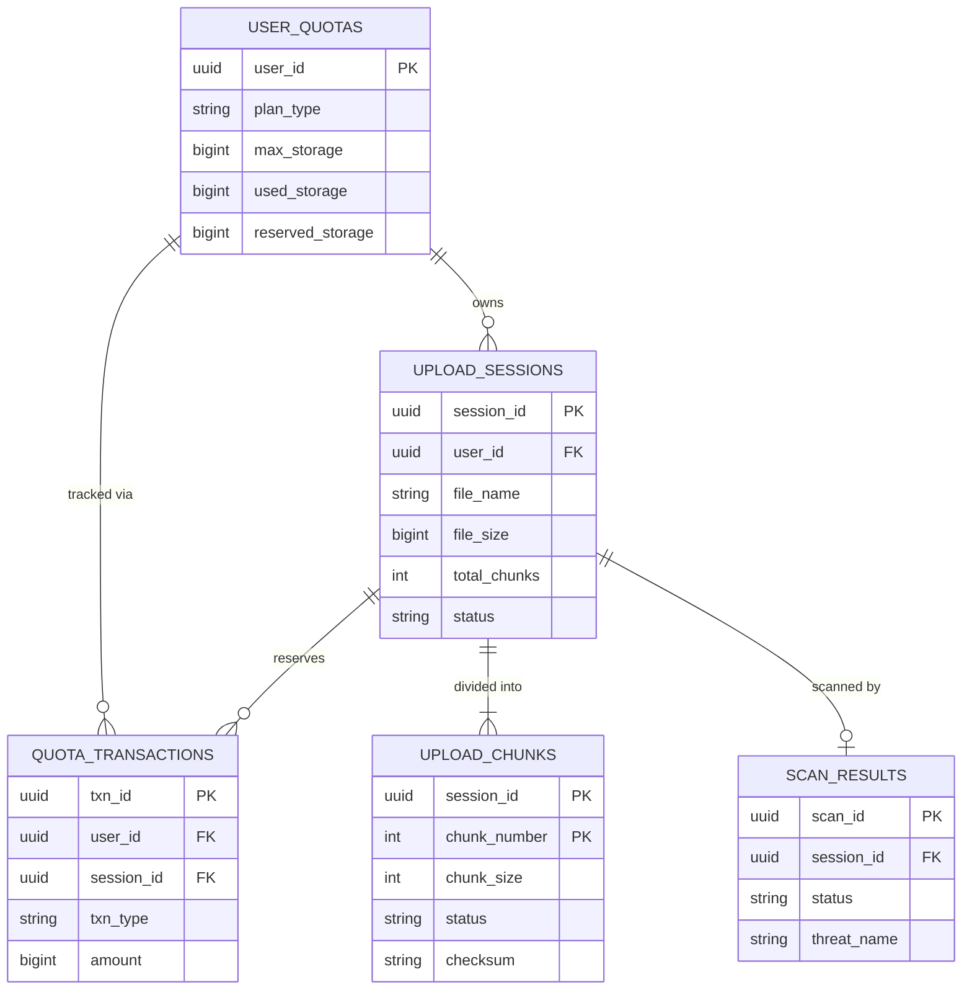
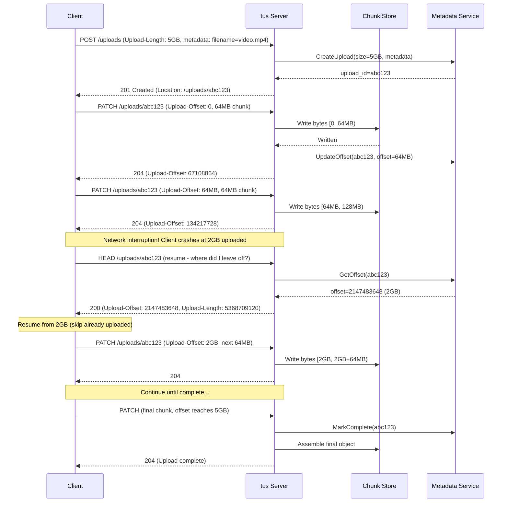
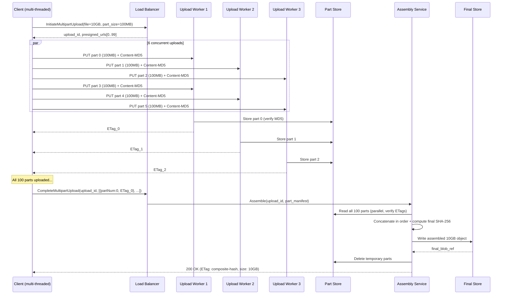

# File Upload Service for Large Files - System Design

## 1. Requirements

### Functional Requirements
1. Resumable uploads (survive network failures without restarting)
2. Chunked upload with parallel parts
3. Real-time progress tracking
4. Integrity verification (checksums per chunk and final file)
5. Upload from URL (server-side fetch)
6. Pre-signed URLs for direct-to-storage uploads
7. Virus/malware scanning before finalization
8. Quota management and enforcement

### Non-Functional Requirements
- Availability: 99.99%
- Max file size: 5 TB
- Resume after network failure: from last successful chunk
- Concurrent uploads: 100K simultaneous
- Upload throughput: saturate client bandwidth (1 Gbps+)
- Chunk completion: exactly-once semantics
- Temp storage cleanup: orphaned uploads after 7 days

## 2. Capacity Estimation

| Metric | Value |
|--------|-------|
| Concurrent uploads (peak) | 100K |
| New uploads initiated/day | 5M |
| Avg file size | 500 MB |
| Large files (>1GB) | 20% of uploads |
| Daily ingest | 2.5 PB |
| Avg chunks per upload | 50 (10MB chunks) |
| Chunk operations/sec (peak) | 500K |
| Temp storage (in-flight) | 50 TB |
| Session metadata | 5M × 2KB = 10 GB |
| Bandwidth (peak) | 500 Gbps aggregate |

### Storage Breakdown
- Temp chunk storage (S3): 50 TB (7-day TTL)
- Final storage (S3): petabyte-scale (downstream)
- Session state (Redis cluster): 50 GB
- Metadata DB (PostgreSQL): 100 GB
- Virus scan queue: 5M files/day

## 3. Data Modeling

### Entity-Relationship Diagram



### Upload Sessions (PostgreSQL)
```sql
CREATE TABLE upload_sessions (
    session_id      UUID PRIMARY KEY DEFAULT gen_random_uuid(),
    user_id         UUID NOT NULL,
    file_name       VARCHAR(1024) NOT NULL,
    file_size       BIGINT NOT NULL,
    mime_type       VARCHAR(256),
    chunk_size      INT NOT NULL DEFAULT 10485760,  -- 10 MB default
    total_chunks    INT NOT NULL,
    upload_type     VARCHAR(20) NOT NULL DEFAULT 'chunked',  -- chunked, single, url
    status          VARCHAR(30) NOT NULL DEFAULT 'initiated',
    -- initiated, uploading, assembling, scanning, completed, failed, expired
    
    -- Integrity
    client_checksum VARCHAR(128),          -- expected final SHA-256
    checksum_algo   VARCHAR(20) DEFAULT 'sha256',
    
    -- Storage
    temp_bucket     VARCHAR(256) NOT NULL,
    temp_prefix     VARCHAR(512) NOT NULL,  -- s3://temp/uploads/{session_id}/
    final_bucket    VARCHAR(256),
    final_key       VARCHAR(1024),
    
    -- Tracking
    bytes_uploaded  BIGINT DEFAULT 0,
    chunks_completed INT DEFAULT 0,
    upload_offset   BIGINT DEFAULT 0,      -- for tus protocol
    
    -- Metadata
    custom_metadata JSONB,
    source_url      VARCHAR(2048),         -- for URL uploads
    
    -- Lifecycle
    created_at      TIMESTAMPTZ DEFAULT NOW(),
    updated_at      TIMESTAMPTZ DEFAULT NOW(),
    expires_at      TIMESTAMPTZ NOT NULL,  -- auto-cleanup
    completed_at    TIMESTAMPTZ,
    
    -- Quota
    quota_reserved  BIGINT NOT NULL        -- pre-reserved quota
);

CREATE INDEX idx_sessions_user ON upload_sessions(user_id, status);
CREATE INDEX idx_sessions_status ON upload_sessions(status) 
    WHERE status IN ('initiated', 'uploading', 'assembling');
CREATE INDEX idx_sessions_expiry ON upload_sessions(expires_at) 
    WHERE status NOT IN ('completed', 'failed');
CREATE INDEX idx_sessions_created ON upload_sessions(created_at DESC);
```

### Chunk Tracking (Redis + PostgreSQL for durability)
```sql
CREATE TABLE upload_chunks (
    session_id      UUID NOT NULL REFERENCES upload_sessions(session_id),
    chunk_number    INT NOT NULL,
    chunk_size      INT NOT NULL,
    chunk_offset    BIGINT NOT NULL,       -- byte offset in original file
    status          VARCHAR(20) NOT NULL DEFAULT 'pending',
    -- pending, uploading, uploaded, verified, failed
    etag            VARCHAR(128),          -- S3 ETag for multipart
    checksum        VARCHAR(128),          -- SHA-256 of chunk
    storage_ref     VARCHAR(512),          -- temp location
    attempts        INT DEFAULT 0,
    uploaded_at     TIMESTAMPTZ,
    verified_at     TIMESTAMPTZ,
    PRIMARY KEY (session_id, chunk_number)
);

CREATE INDEX idx_chunks_session_status ON upload_chunks(session_id, status);
```

### Quotas (PostgreSQL)
```sql
CREATE TABLE user_quotas (
    user_id         UUID PRIMARY KEY,
    plan_type       VARCHAR(30) NOT NULL DEFAULT 'free',
    max_storage     BIGINT NOT NULL,           -- bytes
    used_storage    BIGINT NOT NULL DEFAULT 0,
    reserved_storage BIGINT NOT NULL DEFAULT 0, -- in-flight uploads
    max_file_size   BIGINT NOT NULL,           -- per-file limit
    max_bandwidth_day BIGINT,                  -- daily upload bandwidth limit
    bandwidth_used_today BIGINT DEFAULT 0,
    bandwidth_reset_at TIMESTAMPTZ,
    updated_at      TIMESTAMPTZ DEFAULT NOW()
);

CREATE TABLE quota_transactions (
    txn_id          UUID PRIMARY KEY DEFAULT gen_random_uuid(),
    user_id         UUID NOT NULL,
    session_id      UUID,
    txn_type        VARCHAR(20) NOT NULL,  -- reserve, commit, release
    amount          BIGINT NOT NULL,       -- positive = consume, negative = release
    created_at      TIMESTAMPTZ DEFAULT NOW()
);

CREATE INDEX idx_quota_txn_user ON quota_transactions(user_id, created_at DESC);
```

### Virus Scan Results (PostgreSQL)
```sql
CREATE TABLE scan_results (
    scan_id         UUID PRIMARY KEY DEFAULT gen_random_uuid(),
    session_id      UUID NOT NULL,
    scanner_version VARCHAR(50) NOT NULL,
    status          VARCHAR(20) NOT NULL,  -- clean, infected, error
    threat_name     VARCHAR(256),
    scan_duration_ms INT,
    file_hash       VARCHAR(128),
    scanned_at      TIMESTAMPTZ DEFAULT NOW()
);
```

## 4. High-Level Design

```
┌─────────────────────────────────────────────────────────────────────────────────┐
│                              CLIENT LAYER                                         │
│                                                                                  │
│  ┌──────────────────────────────────────────────────────────────────────┐       │
│  │                    Upload Client SDK                                   │       │
│  │                                                                        │       │
│  │  ┌──────────┐  ┌──────────┐  ┌──────────┐  ┌──────────┐            │       │
│  │  │   File   │  │  Chunk   │  │ Parallel │  │ Checksum │            │       │
│  │  │ Splitter │─►│  Queue   │─►│ Uploader │  │  Compute │            │       │
│  │  │          │  │          │  │ (N conns) │  │ (SHA-256)│            │       │
│  │  └──────────┘  └──────────┘  └──────────┘  └──────────┘            │       │
│  │                                                                        │       │
│  │  ┌──────────┐  ┌──────────┐  ┌──────────┐                           │       │
│  │  │ Progress │  │  Retry   │  │ Resumable│                           │       │
│  │  │ Tracker  │  │  Logic   │  │  State   │                           │       │
│  │  └──────────┘  └──────────┘  └──────────┘                           │       │
│  └──────────────────────────────────────────────────────────────────────┘       │
│                                    │                                             │
└────────────────────────────────────┼─────────────────────────────────────────────┘
                                     │ HTTPS (parallel connections)
┌────────────────────────────────────┼─────────────────────────────────────────────┐
│                                    ▼                                              │
│  ┌──────────────────────────────────────────────────────────────────────┐       │
│  │          CDN / Edge Ingestion (CloudFront, Cloudflare)                │       │
│  │          • TLS termination                                            │       │
│  │          • Edge POP closest to client                                 │       │
│  │          • Early validation (auth, content-type)                      │       │
│  └───────────────────────────────┬──────────────────────────────────────┘       │
│                                  │                                                │
│  ┌───────────────────────────────▼──────────────────────────────────────┐       │
│  │                    Upload API Service (Stateless)                      │       │
│  │                                                                        │       │
│  │  ┌──────────┐  ┌──────────┐  ┌──────────┐  ┌──────────┐            │       │
│  │  │ Session  │  │  Chunk   │  │  Quota   │  │ Pre-sign │            │       │
│  │  │ Manager  │  │  Router  │  │ Enforcer │  │ Generator│            │       │
│  │  └──────────┘  └──────────┘  └──────────┘  └──────────┘            │       │
│  └───────────────────────────────┬──────────────────────────────────────┘       │
│                                  │                                                │
│  ┌───────────┬───────────────────┼───────────────────┬───────────────────┐      │
│  │           │                   │                   │                    │      │
│  │   ┌───────▼──────┐   ┌───────▼──────┐   ┌───────▼──────┐           │      │
│  │   │    Redis     │   │  Temp Object │   │   PostgreSQL │           │      │
│  │   │  (Session    │   │   Storage    │   │  (Durable    │           │      │
│  │   │   State,     │   │  (S3 Multi-  │   │   Session    │           │      │
│  │   │   Progress)  │   │   part)      │   │   Records)   │           │      │
│  │   └──────────────┘   └───────┬──────┘   └──────────────┘           │      │
│  │                               │                                      │      │
│  │                       ┌───────▼──────┐                               │      │
│  │                       │  Assembler   │                               │      │
│  │                       │  Service     │                               │      │
│  │                       │ (Complete    │                               │      │
│  │                       │  multipart)  │                               │      │
│  │                       └───────┬──────┘                               │      │
│  │                               │                                      │      │
│  │                       ┌───────▼──────┐                               │      │
│  │                       │ Virus Scan   │                               │      │
│  │                       │  Service     │                               │      │
│  │                       │ (ClamAV +    │                               │      │
│  │                       │  commercial) │                               │      │
│  │                       └───────┬──────┘                               │      │
│  │                               │                                      │      │
│  │                       ┌───────▼──────┐                               │      │
│  │                       │ Final Object │                               │      │
│  │                       │   Storage    │                               │      │
│  │                       │  (S3 Prod)   │                               │      │
│  │                       └──────────────┘                               │      │
│  └──────────────────────────────────────────────────────────────────────┘      │
│                                                                                  │
│  ┌──────────────────────────────────────────────────────────────────────┐       │
│  │  BACKGROUND SERVICES                                                  │       │
│  │  ┌─────────────┐  ┌─────────────┐  ┌─────────────┐                  │       │
│  │  │  Expiry     │  │  Quota      │  │  URL Fetch  │                  │       │
│  │  │  Cleanup    │  │  Reconciler │  │  Worker     │                  │       │
│  │  │  (cron)     │  │  (async)    │  │  (async)    │                  │       │
│  │  └─────────────┘  └─────────────┘  └─────────────┘                  │       │
│  └──────────────────────────────────────────────────────────────────────┘       │
└──────────────────────────────────────────────────────────────────────────────────┘
```

## 5. API Design

### Initiate Upload
```
POST /api/v1/uploads
  Headers:
    Upload-Length: 5368709120       # 5 GB
    Upload-Metadata: filename base64_name, content-type base64_mime
    Upload-Checksum: sha256 base64_hash
  Body: {
    file_name: "large-video.mp4",
    file_size: 5368709120,
    mime_type: "video/mp4",
    chunk_size: 10485760,           # 10 MB (optional, server may adjust)
    checksum: "sha256:abc123...",
    parallel_parts: 6,             # desired concurrency
    metadata: { "project": "alpha" }
  }
  Response: 201 Created
  {
    session_id: "uuid",
    upload_url: "https://upload.example.com/api/v1/uploads/{session_id}",
    chunk_size: 10485760,
    total_chunks: 512,
    chunk_urls: [                   # pre-signed URLs for parallel upload
      { chunk: 0, url: "https://s3.../part0?X-Amz-Signature=...", expires_in: 3600 },
      { chunk: 1, url: "https://s3.../part1?X-Amz-Signature=...", expires_in: 3600 },
      ...
    ],
    expires_at: "2025-02-01T00:00:00Z"
  }
```

### Upload Chunk (tus-compatible)
```
PATCH /api/v1/uploads/{sessionId}
  Headers:
    Upload-Offset: 104857600       # byte offset (chunk 10 start)
    Content-Type: application/offset+octet-stream
    Content-Length: 10485760
    Upload-Checksum: sha256 base64_chunk_hash
  Body: <binary chunk data>
  
  Response: 204 No Content
  Headers:
    Upload-Offset: 115343360       # new offset after this chunk
    Upload-Expires: "2025-02-01T00:00:00Z"
```

### Upload Part (S3-style parallel)
```
PUT /api/v1/uploads/{sessionId}/parts/{partNumber}
  Headers:
    Content-Length: 10485760
    Content-MD5: base64_md5
  Body: <binary chunk data>
  
  Response: 200 OK
  {
    part_number: 10,
    etag: "\"a1b2c3d4...\"",
    checksum_verified: true
  }
```

### Get Upload Status
```
HEAD /api/v1/uploads/{sessionId}
  Response: 200 OK
  Headers:
    Upload-Offset: 3221225472      # bytes received so far
    Upload-Length: 5368709120       # total file size
    Upload-Status: uploading
    Upload-Chunks-Completed: 307/512
    Upload-Expires: "2025-02-01T00:00:00Z"

GET /api/v1/uploads/{sessionId}/status
  Response: {
    session_id: "uuid",
    status: "uploading",
    file_size: 5368709120,
    bytes_uploaded: 3221225472,
    progress_pct: 60.0,
    chunks: { total: 512, completed: 307, failed: 0, in_progress: 5 },
    throughput_mbps: 450,
    eta_seconds: 38,
    failed_chunks: []              # list of chunk numbers to retry
  }
```

### Complete Upload
```
POST /api/v1/uploads/{sessionId}/complete
  Body: {
    parts: [
      { part_number: 1, etag: "\"a1b2...\"" },
      { part_number: 2, etag: "\"c3d4...\"" },
      ...
    ],
    final_checksum: "sha256:full_file_hash"
  }
  Response: 200 OK
  {
    session_id: "uuid",
    status: "assembling",
    file_id: "uuid",
    estimated_completion_sec: 30
  }
```

### Abort Upload
```
DELETE /api/v1/uploads/{sessionId}
  Response: 204 No Content
  # Releases quota, deletes temp chunks
```

### Upload from URL
```
POST /api/v1/uploads/from-url
  Body: {
    source_url: "https://example.com/large-file.zip",
    file_name: "large-file.zip",
    expected_size: 2147483648,
    expected_checksum: "sha256:abc..."
  }
  Response: 202 Accepted
  {
    session_id: "uuid",
    status: "fetching",
    poll_url: "/api/v1/uploads/{session_id}/status"
  }
```

### Pre-signed URL for Direct Upload
```
POST /api/v1/uploads/presigned
  Body: {
    file_name: "document.pdf",
    file_size: 52428800,
    mime_type: "application/pdf",
    expires_in: 3600
  }
  Response: {
    upload_url: "https://s3.amazonaws.com/bucket/key?X-Amz-Algorithm=AWS4-HMAC-SHA256&...",
    method: "PUT",
    headers: { "Content-Type": "application/pdf", "x-amz-meta-session": "uuid" },
    expires_at: "2025-01-20T15:00:00Z",
    callback_url: "/api/v1/uploads/presigned/{session_id}/confirm"
  }
```

## 6. Deep Dive: Resumable Upload Protocol (tus)

### Server-Side Implementation

```python
class TusUploadHandler:
    """
    Implementation of the tus resumable upload protocol (v1.0.0).
    https://tus.io/protocols/resumable-upload
    
    Key principles:
    - Server tracks upload offset
    - Client resumes from last acknowledged offset
    - Checksum verification per chunk prevents corruption
    - Idempotent - safe to retry
    """
    
    def __init__(self, redis_client, s3_client, db):
        self.redis = redis_client
        self.s3 = s3_client
        self.db = db
        self.MAX_CHUNK_SIZE = 100 * 1024 * 1024  # 100 MB max per request
    
    async def create_upload(self, request) -> UploadSession:
        """Handle POST - create new upload session."""
        file_size = int(request.headers['Upload-Length'])
        metadata = self._parse_metadata(request.headers.get('Upload-Metadata', ''))
        
        # Quota check
        user_id = request.user_id
        quota_ok = await self._check_and_reserve_quota(user_id, file_size)
        if not quota_ok:
            raise QuotaExceededError(f"Insufficient quota for {file_size} bytes")
        
        # Create session
        session = UploadSession(
            user_id=user_id,
            file_name=metadata.get('filename', 'unnamed'),
            file_size=file_size,
            mime_type=metadata.get('content-type', 'application/octet-stream'),
            chunk_size=self._optimal_chunk_size(file_size),
            total_chunks=math.ceil(file_size / self._optimal_chunk_size(file_size)),
            expires_at=datetime.utcnow() + timedelta(days=7),
            quota_reserved=file_size
        )
        
        # Persist to DB
        await self.db.insert_session(session)
        
        # Initialize Redis state for fast offset tracking
        await self.redis.hset(f"upload:{session.id}", mapping={
            "offset": 0,
            "file_size": file_size,
            "status": "initiated",
            "created_at": datetime.utcnow().isoformat()
        })
        
        # Initialize S3 multipart upload
        multipart = await self.s3.create_multipart_upload(
            Bucket=session.temp_bucket,
            Key=f"uploads/{session.id}/file",
            ContentType=session.mime_type,
            Metadata={"session_id": str(session.id)}
        )
        
        await self.redis.hset(f"upload:{session.id}", "multipart_id", multipart['UploadId'])
        
        return session
    
    async def handle_patch(self, session_id: str, request) -> int:
        """Handle PATCH - receive chunk data."""
        # Validate offset
        client_offset = int(request.headers['Upload-Offset'])
        server_offset = int(await self.redis.hget(f"upload:{session_id}", "offset"))
        
        if client_offset != server_offset:
            raise OffsetMismatchError(
                f"Expected offset {server_offset}, got {client_offset}"
            )
        
        content_length = int(request.headers['Content-Length'])
        
        if content_length > self.MAX_CHUNK_SIZE:
            raise ChunkTooLargeError(f"Max chunk size is {self.MAX_CHUNK_SIZE}")
        
        # Read chunk data
        chunk_data = await request.body()
        
        # Verify checksum if provided
        checksum_header = request.headers.get('Upload-Checksum')
        if checksum_header:
            algo, expected = checksum_header.split(' ', 1)
            actual = self._compute_checksum(chunk_data, algo)
            if actual != expected:
                raise ChecksumMismatchError(
                    f"Checksum mismatch: expected {expected}, got {actual}"
                )
        
        # Determine part number for S3 multipart
        chunk_size = int(await self.redis.hget(f"upload:{session_id}", "chunk_size") or 10485760)
        part_number = (client_offset // chunk_size) + 1
        
        # Upload to S3
        multipart_id = await self.redis.hget(f"upload:{session_id}", "multipart_id")
        
        response = await self.s3.upload_part(
            Bucket=self._get_temp_bucket(session_id),
            Key=f"uploads/{session_id}/file",
            PartNumber=part_number,
            UploadId=multipart_id,
            Body=chunk_data,
            ContentLength=content_length
        )
        
        # Update offset atomically
        new_offset = client_offset + content_length
        await self.redis.hset(f"upload:{session_id}", mapping={
            "offset": new_offset,
            "status": "uploading",
            "last_chunk_at": datetime.utcnow().isoformat()
        })
        
        # Store part ETag for completion
        await self.redis.rpush(
            f"upload:{session_id}:parts",
            json.dumps({"PartNumber": part_number, "ETag": response['ETag']})
        )
        
        # Update progress in DB (batched, every 10 chunks)
        if part_number % 10 == 0:
            await self.db.update_progress(session_id, new_offset, part_number)
        
        # Check if upload is complete
        file_size = int(await self.redis.hget(f"upload:{session_id}", "file_size"))
        if new_offset >= file_size:
            await self._trigger_completion(session_id)
        
        return new_offset
    
    async def handle_head(self, session_id: str) -> dict:
        """Handle HEAD - return current offset for resume."""
        state = await self.redis.hgetall(f"upload:{session_id}")
        
        if not state:
            # Fallback to DB
            session = await self.db.get_session(session_id)
            if not session:
                raise NotFoundError(f"Upload {session_id} not found")
            return {
                "offset": session.upload_offset,
                "length": session.file_size,
                "status": session.status
            }
        
        return {
            "offset": int(state["offset"]),
            "length": int(state["file_size"]),
            "status": state["status"]
        }
    
    def _optimal_chunk_size(self, file_size: int) -> int:
        """Determine optimal chunk size based on file size."""
        if file_size < 100 * 1024 * 1024:        # <100MB
            return 5 * 1024 * 1024                 # 5 MB chunks
        elif file_size < 1024 * 1024 * 1024:      # <1GB
            return 10 * 1024 * 1024                # 10 MB chunks
        elif file_size < 10 * 1024 * 1024 * 1024: # <10GB
            return 50 * 1024 * 1024                # 50 MB chunks
        else:
            return 100 * 1024 * 1024               # 100 MB chunks
    
    async def _trigger_completion(self, session_id: str):
        """Trigger async completion workflow."""
        await self.redis.hset(f"upload:{session_id}", "status", "assembling")
        
        # Publish completion event
        await self.event_bus.publish("upload.completion_pending", {
            "session_id": session_id,
            "timestamp": datetime.utcnow().isoformat()
        })


class RetryWithBackoff:
    """Client-side retry logic for chunk uploads."""
    
    BASE_DELAY = 1.0   # seconds
    MAX_DELAY = 60.0   # seconds
    MAX_RETRIES = 10
    JITTER = 0.3       # 30% jitter
    
    async def upload_chunk_with_retry(self, session_id: str, chunk_data: bytes,
                                       offset: int) -> bool:
        """Upload a single chunk with exponential backoff retry."""
        for attempt in range(self.MAX_RETRIES):
            try:
                response = await self.http.patch(
                    f"{self.base_url}/uploads/{session_id}",
                    headers={
                        "Upload-Offset": str(offset),
                        "Content-Type": "application/offset+octet-stream",
                        "Content-Length": str(len(chunk_data)),
                        "Upload-Checksum": f"sha256 {self._sha256_b64(chunk_data)}"
                    },
                    data=chunk_data,
                    timeout=300  # 5 min timeout for large chunks
                )
                
                if response.status == 204:
                    return True
                elif response.status == 409:
                    # Offset mismatch - query server for current offset
                    head = await self.http.head(f"{self.base_url}/uploads/{session_id}")
                    server_offset = int(head.headers["Upload-Offset"])
                    if server_offset > offset:
                        return True  # Server already has this chunk
                    raise UploadError("Unexpected offset conflict")
                    
            except (ConnectionError, TimeoutError) as e:
                delay = min(
                    self.BASE_DELAY * (2 ** attempt),
                    self.MAX_DELAY
                )
                jitter = delay * self.JITTER * random.random()
                await asyncio.sleep(delay + jitter)
        
        return False
```

## 7. Deep Dive: Parallel Multipart Upload

### Client-Side File Splitting and Parallel Upload

```python
class ParallelUploadClient:
    """
    Client SDK for parallel multipart upload.
    Splits file into parts, uploads concurrently, handles ordering.
    """
    
    def __init__(self, api_url: str, max_concurrency: int = 6):
        self.api_url = api_url
        self.max_concurrency = max_concurrency
        self.semaphore = asyncio.Semaphore(max_concurrency)
        self.progress = UploadProgress()
    
    async def upload_file(self, file_path: str, 
                          on_progress: Callable = None) -> UploadResult:
        """Upload a large file using parallel multipart upload."""
        
        file_size = os.path.getsize(file_path)
        
        # Step 1: Compute file checksum (streaming)
        file_hash = await self._compute_file_hash(file_path)
        
        # Step 2: Initiate upload session
        session = await self._initiate_upload(file_path, file_size, file_hash)
        chunk_size = session['chunk_size']
        total_chunks = session['total_chunks']
        
        self.progress.initialize(total_chunks, file_size)
        
        # Step 3: Check for resume (any previously uploaded chunks?)
        completed_chunks = await self._get_completed_chunks(session['session_id'])
        pending_chunks = [i for i in range(total_chunks) if i not in completed_chunks]
        
        # Step 4: Upload chunks in parallel
        tasks = []
        for chunk_num in pending_chunks:
            offset = chunk_num * chunk_size
            size = min(chunk_size, file_size - offset)
            
            task = asyncio.create_task(
                self._upload_chunk_controlled(
                    session['session_id'], file_path, 
                    chunk_num, offset, size,
                    session.get('chunk_urls', {}).get(chunk_num)
                )
            )
            tasks.append(task)
        
        # Wait for all with progress reporting
        results = []
        for coro in asyncio.as_completed(tasks):
            result = await coro
            results.append(result)
            self.progress.chunk_completed(result.chunk_number, result.size)
            if on_progress:
                on_progress(self.progress)
        
        # Step 5: Verify all chunks succeeded
        failed = [r for r in results if not r.success]
        if failed:
            raise UploadError(f"{len(failed)} chunks failed: {failed}")
        
        # Step 6: Complete upload
        parts = sorted(
            [{"part_number": r.chunk_number + 1, "etag": r.etag} for r in results],
            key=lambda p: p["part_number"]
        )
        
        completion = await self._complete_upload(session['session_id'], parts, file_hash)
        
        return UploadResult(
            file_id=completion['file_id'],
            session_id=session['session_id'],
            size=file_size,
            checksum=file_hash,
            duration=self.progress.elapsed()
        )
    
    async def _upload_chunk_controlled(self, session_id: str, file_path: str,
                                        chunk_num: int, offset: int, size: int,
                                        presigned_url: str = None) -> ChunkResult:
        """Upload single chunk with concurrency control."""
        async with self.semaphore:
            # Read chunk from file
            chunk_data = await self._read_chunk(file_path, offset, size)
            
            # Compute chunk checksum
            chunk_hash = hashlib.sha256(chunk_data).hexdigest()
            
            if presigned_url:
                # Direct-to-S3 upload via pre-signed URL
                result = await self._upload_to_presigned(presigned_url, chunk_data)
            else:
                # Upload through our API
                result = await self._upload_through_api(
                    session_id, chunk_num, chunk_data, chunk_hash
                )
            
            return ChunkResult(
                chunk_number=chunk_num,
                size=size,
                etag=result['etag'],
                checksum=chunk_hash,
                success=True
            )
    
    async def _compute_file_hash(self, file_path: str) -> str:
        """Stream compute SHA-256 of entire file."""
        sha256 = hashlib.sha256()
        
        async with aiofiles.open(file_path, 'rb') as f:
            while True:
                chunk = await f.read(1024 * 1024)  # 1MB reads
                if not chunk:
                    break
                sha256.update(chunk)
        
        return sha256.hexdigest()


class ServerSideAssembler:
    """
    Assembles uploaded parts into final file.
    Handles out-of-order arrivals and integrity verification.
    """
    
    async def assemble_upload(self, session_id: str):
        """Complete multipart upload and verify integrity."""
        session = await self.db.get_session(session_id)
        
        # Get all uploaded parts (ordered)
        parts_raw = await self.redis.lrange(f"upload:{session_id}:parts", 0, -1)
        parts = sorted(
            [json.loads(p) for p in parts_raw],
            key=lambda p: p['PartNumber']
        )
        
        # Verify we have all parts
        expected_parts = session.total_chunks
        if len(parts) != expected_parts:
            missing = set(range(1, expected_parts + 1)) - {p['PartNumber'] for p in parts}
            raise IncompleteUploadError(f"Missing parts: {missing}")
        
        # Complete S3 multipart upload
        multipart_id = await self.redis.hget(f"upload:{session_id}", "multipart_id")
        
        result = await self.s3.complete_multipart_upload(
            Bucket=session.temp_bucket,
            Key=f"uploads/{session_id}/file",
            UploadId=multipart_id,
            MultipartUpload={"Parts": parts}
        )
        
        # Verify final file integrity (SHA-256)
        if session.client_checksum:
            actual_hash = await self._compute_object_hash(
                session.temp_bucket, f"uploads/{session_id}/file"
            )
            if actual_hash != session.client_checksum:
                raise IntegrityError(
                    f"File checksum mismatch: expected {session.client_checksum}, "
                    f"got {actual_hash}"
                )
        
        # Trigger virus scan
        await self._trigger_virus_scan(session_id, session)
    
    async def _compute_object_hash(self, bucket: str, key: str) -> str:
        """Stream compute SHA-256 of S3 object."""
        sha256 = hashlib.sha256()
        
        response = await self.s3.get_object(Bucket=bucket, Key=key)
        async for chunk in response['Body'].iter_chunks(1024 * 1024):
            sha256.update(chunk)
        
        return sha256.hexdigest()
    
    async def _trigger_virus_scan(self, session_id: str, session):
        """Queue file for virus scanning before finalization."""
        await self.scan_queue.enqueue({
            "session_id": session_id,
            "bucket": session.temp_bucket,
            "key": f"uploads/{session_id}/file",
            "file_size": session.file_size,
            "mime_type": session.mime_type,
            "callback_topic": "upload.scan_complete"
        })
        
        await self.db.update_status(session_id, "scanning")
    
    async def handle_scan_complete(self, event: dict):
        """Handle virus scan result."""
        session_id = event['session_id']
        
        if event['status'] == 'clean':
            # Move to final storage
            await self._move_to_final_storage(session_id)
            await self.db.update_status(session_id, "completed")
            
            # Commit quota (convert reserved → used)
            await self._commit_quota(session_id)
            
            # Cleanup temp
            await self._cleanup_temp(session_id)
            
        elif event['status'] == 'infected':
            # Delete infected file, release quota
            await self.s3.delete_object(
                Bucket=event['bucket'], Key=event['key']
            )
            await self.db.update_status(session_id, "failed",
                error=f"Malware detected: {event.get('threat_name')}")
            await self._release_quota(session_id)
```

## 8. Component Optimization

### CDN Edge Ingestion
```python
class EdgeIngestionOptimizer:
    """Use CDN edge POPs for upload acceleration."""
    
    async def get_optimal_upload_endpoint(self, client_ip: str) -> str:
        """Select nearest edge POP for upload."""
        # Geo-locate client
        location = await self.geoip.lookup(client_ip)
        
        # Select nearest healthy edge
        edges = await self.edge_registry.get_healthy_edges(location.region)
        nearest = min(edges, key=lambda e: self._distance(location, e.location))
        
        return f"https://{nearest.hostname}/upload"
    
    async def configure_cloudfront_upload(self) -> dict:
        """CloudFront configuration for upload acceleration."""
        return {
            "Origins": [{
                "DomainName": "upload-api.internal",
                "CustomOriginConfig": {
                    "OriginProtocolPolicy": "https-only",
                    "OriginReadTimeout": 60,
                    "OriginKeepaliveTimeout": 5
                }
            }],
            "CacheBehaviors": [{
                "PathPattern": "/api/v1/uploads/*",
                "AllowedMethods": ["GET", "HEAD", "OPTIONS", "PUT", "PATCH", "POST", "DELETE"],
                "CachedMethods": ["GET", "HEAD"],
                "DefaultTTL": 0,
                "ForwardedValues": {"Headers": ["*"], "QueryString": True},
                "ViewerProtocolPolicy": "https-only"
            }]
        }
```

### Redis Session State Design
```python
class UploadSessionRedis:
    """Redis data structures for upload session management."""
    
    # Key patterns:
    # upload:{session_id}          → Hash (session metadata + offset)
    # upload:{session_id}:parts    → List (ordered ETags)
    # upload:{session_id}:lock     → String (distributed lock for completion)
    # upload:active:{user_id}      → Set (active session IDs)
    # upload:expiry                 → Sorted Set (session_id, expiry timestamp)
    
    async def acquire_completion_lock(self, session_id: str) -> bool:
        """Prevent duplicate completion processing."""
        return await self.redis.set(
            f"upload:{session_id}:lock",
            "locked",
            nx=True,  # Only if not exists
            ex=300    # 5 min TTL
        )
    
    async def cleanup_expired(self):
        """Background job: cleanup expired upload sessions."""
        now = time.time()
        expired = await self.redis.zrangebyscore(
            "upload:expiry", "-inf", now, start=0, num=1000
        )
        
        for session_id in expired:
            # Abort S3 multipart
            multipart_id = await self.redis.hget(f"upload:{session_id}", "multipart_id")
            if multipart_id:
                await self.s3.abort_multipart_upload(
                    Bucket=self._get_bucket(session_id),
                    Key=f"uploads/{session_id}/file",
                    UploadId=multipart_id
                )
            
            # Release quota
            await self._release_quota(session_id)
            
            # Cleanup Redis keys
            await self.redis.delete(
                f"upload:{session_id}",
                f"upload:{session_id}:parts",
                f"upload:{session_id}:lock"
            )
            await self.redis.zrem("upload:expiry", session_id)
            
            # Update DB status
            await self.db.update_status(session_id, "expired")
```

## 9. Observability

### Key Metrics
| Metric | Target | Alert |
|--------|--------|-------|
| Upload success rate | >99.9% | <99.5% |
| Chunk upload latency p99 | <5s (10MB chunk) | >15s |
| Assembly latency p99 | <60s | >300s |
| Concurrent uploads | <100K | >90K (scaling) |
| Temp storage usage | <50 TB | >80 TB |
| Orphaned upload cleanup | Daily | Backlog >7 days |
| Virus scan latency p99 | <30s | >120s |
| Quota accuracy | 100% | Any negative quota |

### Progress WebSocket
```python
class ProgressWebSocket:
    """Real-time upload progress via WebSocket."""
    
    async def stream_progress(self, ws, session_id: str):
        """Push progress updates to client."""
        pubsub = self.redis.pubsub()
        await pubsub.subscribe(f"progress:{session_id}")
        
        async for message in pubsub.listen():
            if message['type'] == 'message':
                await ws.send_json(json.loads(message['data']))
```

## 10. Considerations & Trade-offs

| Decision | Choice | Trade-off |
|----------|--------|-----------|
| Protocol | tus + S3 multipart hybrid | tus is standard/resumable but S3 multipart is faster for parallel; support both |
| Chunk size | Dynamic (5-100MB) | Smaller = more requests but better resume granularity; larger = fewer requests but more re-upload on failure |
| Temp storage | Same S3 as final | Simpler but multipart parts count against storage; could use separate bucket |
| Concurrency | 6 parallel parts default | More = faster on fast networks but overwhelms slow connections; client-adaptive ideal |
| Checksum | SHA-256 per chunk + final | Ensures integrity but adds CPU cost; MD5 faster but collision-prone |
| Virus scan | Post-assembly, pre-finalize | Adds latency before file available but prevents malware distribution |
| Quota enforcement | Reserve on initiate, commit on complete | Prevents over-subscription but holds quota during long uploads |
| Edge upload | CDN edge POPs | Reduces latency for first byte but adds CDN cost and complexity |

---

## Sequence Diagrams

### Resumable Upload with tus Protocol



### Parallel Multipart Assembly



## Caching Strategy

| Layer | What's Cached | Technology | TTL | Purpose |
|-------|---------------|-----------|-----|---------|
| Upload offset | Last confirmed offset per upload_id | Redis | 7 days (upload expiry) | Instant resume without scanning storage |
| Part ETags | Computed checksums for uploaded parts | Redis Hash | Until complete/abort | Avoid re-reading parts during assembly |
| Presigned URLs | Pre-generated upload URLs | In-memory LRU | 1 hour | Avoid re-signing for retries |
| Rate limit state | Per-user upload bandwidth/count | Redis sliding window | Rolling 1 min | Enforce fair usage |
| Virus scan results | Scan verdict per content hash | Redis | 24h | Skip re-scan for duplicate uploads |

**Key Insight:** Upload offset caching is critical — without it, resume requires scanning storage to find the last written byte (expensive for multi-TB uploads on cold storage).
