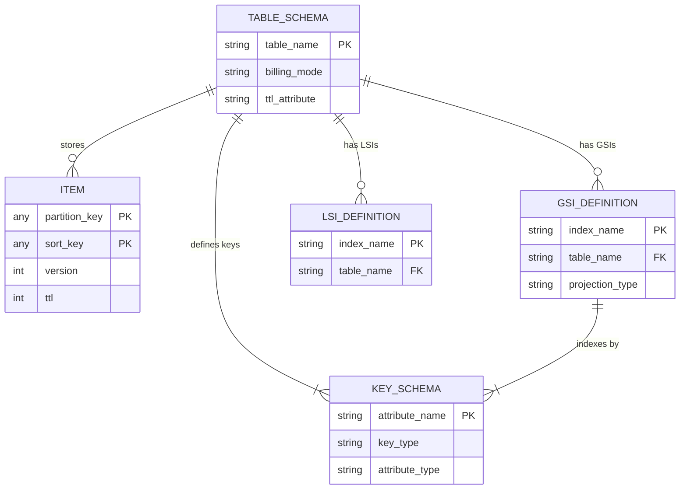
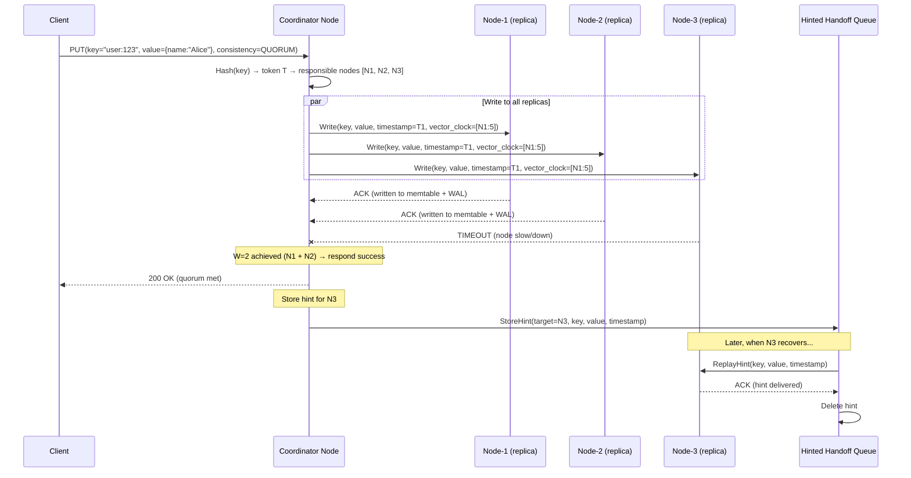
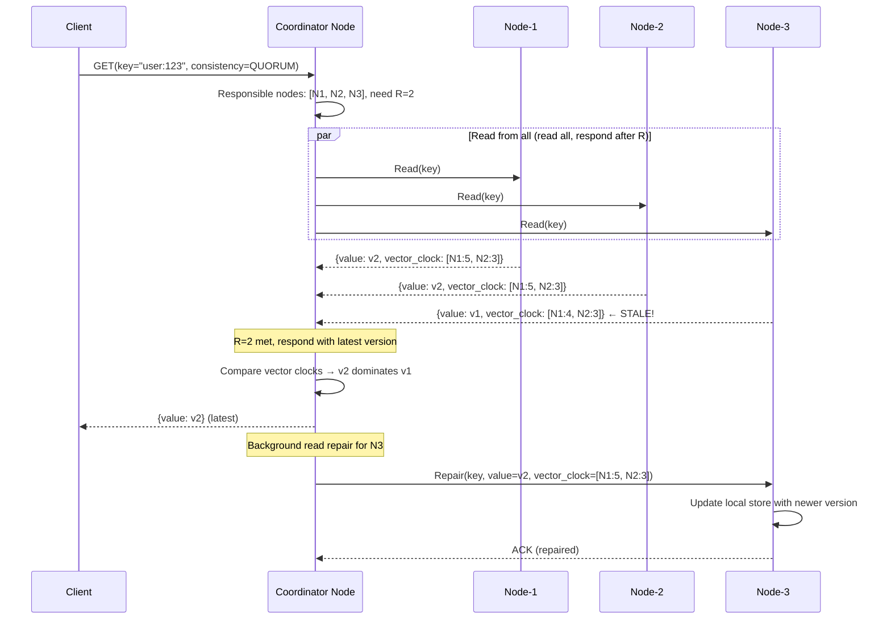
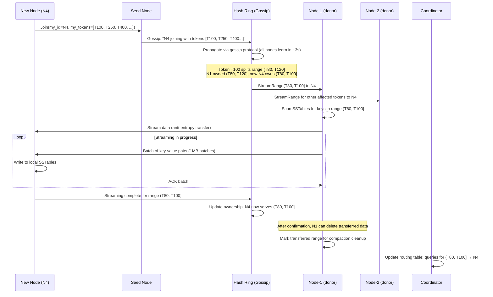

# Key-Value Store (DynamoDB) System Design

## 1. Requirements

### Functional Requirements
1. **Get/Put/Delete by Key** - Single-item CRUD with partition key
2. **Conditional Writes** - Write only if condition met (optimistic locking)
3. **Batch Operations** - BatchGetItem, BatchWriteItem (up to 25 items)
4. **Transactions** - TransactWriteItems, TransactGetItems (ACID across items)
5. **TTL** - Auto-expire items after specified timestamp
6. **Streams/CDC** - Ordered change data capture per partition
7. **Secondary Indexes** - Global Secondary Index (GSI), Local Secondary Index (LSI)
8. **Auto-Scaling** - Automatic throughput adjustment based on traffic

### Non-Functional Requirements
| Requirement | Target |
|-------------|--------|
| Availability | 99.99% (99.999% for global tables) |
| Read Latency | <5ms P50, <10ms P99 |
| Write Latency | <10ms P50, <20ms P99 |
| Throughput | Unlimited (with provisioned capacity) |
| Consistency | Strong or eventual (configurable per read) |
| Max Item Size | 400 KB |
| Max Partition Throughput | 3000 RCU, 1000 WCU per partition |

## 2. Capacity Estimation

### Scale
```
Tables: Millions across all customers
Total storage: Hundreds of petabytes
Requests/sec: Tens of millions (peak: 100M+)
Partitions: Billions
Storage nodes: Hundreds of thousands
Items: Trillions
```

### Per-Table Example (Large Customer)
```
Table size: 10 TB
Items: 5 billion (avg 2KB each)
Partitions: 10 TB / 10 GB per partition = 1000 partitions
Read capacity: 500,000 RCU (eventually consistent)
Write capacity: 100,000 WCU
Traffic: 500K reads/s + 100K writes/s = 600K ops/s
```

### Single Partition Limits
```
Data: 10 GB max per partition
Read: 3000 RCU (3000 × 4KB = 12 MB/s strongly consistent)
Write: 1000 WCU (1000 × 1KB = 1 MB/s)
With burst: 3000 × 300 / 300 = instantaneous burst up to 5× for 5min
```

## 3. Data Modeling

### Entity-Relationship Diagram



### Partition Key Routing

```python
from dataclasses import dataclass
from typing import Optional, Dict, List, Any
import hashlib
import struct

@dataclass
class TableSchema:
    """DynamoDB table schema definition."""
    table_name: str
    partition_key: KeySchema       # Hash key (required)
    sort_key: Optional[KeySchema]  # Range key (optional)
    attributes: Dict[str, str]     # attribute_name → type (S, N, B)
    gsi_definitions: List['GSIDefinition']
    lsi_definitions: List['LSIDefinition']
    billing_mode: str              # 'PROVISIONED' or 'PAY_PER_REQUEST'
    provisioned_throughput: Optional['Throughput']
    stream_specification: Optional['StreamSpec']
    ttl_attribute: Optional[str]

@dataclass
class KeySchema:
    attribute_name: str
    key_type: str  # 'HASH' or 'RANGE'
    attribute_type: str  # 'S' (String), 'N' (Number), 'B' (Binary)

@dataclass
class Item:
    """A single DynamoDB item (row)."""
    partition_key: Any
    sort_key: Optional[Any]
    attributes: Dict[str, Any]
    version: int                   # For optimistic locking
    ttl: Optional[int]            # Unix timestamp for expiry
    size_bytes: int               # Item size for capacity calculation
    
    def compute_size(self) -> int:
        """Calculate item size for RCU/WCU billing."""
        size = 0
        # Key sizes
        size += len(str(self.partition_key).encode())
        if self.sort_key:
            size += len(str(self.sort_key).encode())
        # Attribute sizes
        for name, value in self.attributes.items():
            size += len(name.encode()) + self._attribute_size(value)
        return size
    
    def _attribute_size(self, value) -> int:
        if isinstance(value, str):
            return len(value.encode())
        elif isinstance(value, (int, float)):
            return 8  # DynamoDB number representation
        elif isinstance(value, bytes):
            return len(value)
        elif isinstance(value, dict):
            return sum(len(k) + self._attribute_size(v) for k, v in value.items())
        elif isinstance(value, list):
            return sum(self._attribute_size(v) for v in value)
        return 0


@dataclass
class GSIDefinition:
    """Global Secondary Index - separate partition space."""
    index_name: str
    partition_key: KeySchema
    sort_key: Optional[KeySchema]
    projection_type: str           # 'ALL', 'KEYS_ONLY', 'INCLUDE'
    projected_attributes: List[str]
    provisioned_throughput: Optional['Throughput']

@dataclass  
class LSIDefinition:
    """Local Secondary Index - same partition, different sort key."""
    index_name: str
    sort_key: KeySchema
    projection_type: str
    projected_attributes: List[str]
    # LSI shares partition key and throughput with base table


class PartitionRouter:
    """
    Routes requests to correct partition based on partition key hash.
    Uses consistent hashing with virtual nodes.
    """
    
    def __init__(self, table_name: str, partition_count: int):
        self.table_name = table_name
        self.partition_count = partition_count
    
    def get_partition(self, partition_key: Any) -> int:
        """Hash partition key to determine target partition."""
        key_bytes = self._serialize_key(partition_key)
        # Use consistent hash (MD5 for uniform distribution)
        hash_bytes = hashlib.md5(key_bytes).digest()
        hash_int = struct.unpack('<Q', hash_bytes[:8])[0]
        return hash_int % self.partition_count
    
    def _serialize_key(self, key: Any) -> bytes:
        """Serialize key value for hashing."""
        if isinstance(key, str):
            return key.encode('utf-8')
        elif isinstance(key, (int, float)):
            return str(key).encode('utf-8')
        elif isinstance(key, bytes):
            return key
        raise ValueError(f"Unsupported key type: {type(key)}")
```

### Sort Key for Range Queries

```python
class ItemCollection:
    """
    An item collection = all items with same partition key.
    Sort key enables efficient range queries within a partition.
    
    Example: User orders table
    PK: user_id
    SK: order_date#order_id
    
    Enables: "Get all orders for user X between date A and B"
    """
    
    def __init__(self, partition_key: Any):
        self.partition_key = partition_key
        self.items = []  # Stored sorted by sort_key in B-tree
    
    def query(self, key_condition: dict) -> List[Item]:
        """
        Query within item collection using sort key conditions.
        
        Supported operators:
        - EQ: sort_key = value
        - LT/LE/GT/GE: sort_key < value, etc.
        - BETWEEN: sort_key BETWEEN val1 AND val2
        - BEGINS_WITH: sort_key starts with prefix
        """
        operator = key_condition.get('operator')
        value = key_condition.get('value')
        
        if operator == 'EQ':
            return [i for i in self.items if i.sort_key == value]
        elif operator == 'BETWEEN':
            low, high = value
            return [i for i in self.items if low <= i.sort_key <= high]
        elif operator == 'BEGINS_WITH':
            return [i for i in self.items if str(i.sort_key).startswith(str(value))]
        elif operator == 'GT':
            return [i for i in self.items if i.sort_key > value]
        # ... etc
```

## 4. High-Level Design

```
┌─────────────────────────────────────────────────────────────────────────────────┐
│                              CLIENT SDK                                           │
│                                                                                   │
│  ┌──────────────┐  ┌──────────────┐  ┌──────────────┐  ┌──────────────┐        │
│  │  Retry Logic │  │  Marshalling │  │  Auth (SigV4)│  │  Connection  │        │
│  │  (Exp backoff│  │  (JSON/CBOR) │  │              │  │  Pool        │        │
│  │   + jitter)  │  │              │  │              │  │              │        │
│  └──────────────┘  └──────────────┘  └──────────────┘  └──────────────┘        │
└──────────────────────────────────────┬──────────────────────────────────────────┘
                                       │
                                       ▼
┌─────────────────────────────────────────────────────────────────────────────────┐
│                          REQUEST ROUTER FLEET                                     │
│                                                                                   │
│  ┌────────────────────────────────────────────────────────────────────────────┐  │
│  │  • Stateless (thousands of routers)                                        │  │
│  │  • Authentication & authorization                                          │  │
│  │  • Request validation                                                      │  │
│  │  • Partition key → storage node mapping (cached routing table)             │  │
│  │  • Admission control & rate limiting                                       │  │
│  │  • Scatter-gather for batch/transaction operations                         │  │
│  └────────────────────────────────────────────────────────────────────────────┘  │
└──────────┬─────────────────────────┬──────────────────────────┬─────────────────┘
           │                         │                          │
           ▼                         ▼                          ▼
┌────────────────────┐  ┌────────────────────┐  ┌────────────────────┐
│  STORAGE NODE      │  │  STORAGE NODE      │  │  STORAGE NODE      │
│  (Partition Leader)│  │  (Partition Leader)│  │  (Partition Leader)│
│                    │  │                    │  │                    │
│ ┌────────────────┐ │  │ ┌────────────────┐ │  │ ┌────────────────┐ │
│ │ B-Tree Engine  │ │  │ │ B-Tree Engine  │ │  │ │ B-Tree Engine  │ │
│ │ (Partition Data)│ │  │ │ (Partition Data)│ │  │ │ (Partition Data)│ │
│ ├────────────────┤ │  │ ├────────────────┤ │  │ ├────────────────┤ │
│ │ WAL (Durability)│ │  │ │ WAL (Durability)│ │  │ │ WAL (Durability)│ │
│ ├────────────────┤ │  │ ├────────────────┤ │  │ ├────────────────┤ │
│ │ Paxos (Repl)  │ │  │ │ Paxos (Repl)  │ │  │ │ Paxos (Repl)  │ │
│ └────────────────┘ │  │ └────────────────┘ │  │ └────────────────┘ │
│                    │  │                    │  │                    │
│ Replica Group:     │  │ Replica Group:     │  │ Replica Group:     │
│ [Leader][F1][F2]   │  │ [Leader][F1][F2]   │  │ [Leader][F1][F2]   │
└────────────────────┘  └────────────────────┘  └────────────────────┘
           │                         │                          │
           ▼                         ▼                          ▼
┌─────────────────────────────────────────────────────────────────────────────────┐
│                         SUPPORTING SERVICES                                       │
│                                                                                   │
│  ┌──────────────┐  ┌──────────────┐  ┌──────────────┐  ┌──────────────┐        │
│  │  Auto-Scaler │  │  GSI Service │  │  Streams     │  │  TTL Sweeper │        │
│  │              │  │              │  │  (CDC)       │  │              │        │
│  │ • Monitor    │  │ • Async      │  │              │  │ • Scan       │        │
│  │   throughput │  │   propagation│  │ • Ordered    │  │   expired    │        │
│  │ • Split hot  │  │ • Eventual   │  │   per-shard  │  │ • Batch      │        │
│  │   partitions │  │   consistency│  │ • 24hr retain│  │   delete     │        │
│  │ • Merge cold │  │ • Backfill   │  │ • Lambda     │  │              │        │
│  │   partitions │  │              │  │   triggers   │  │              │        │
│  └──────────────┘  └──────────────┘  └──────────────┘  └──────────────┘        │
│                                                                                   │
│  ┌──────────────┐  ┌──────────────┐                                             │
│  │  Table Mgmt  │  │  Backup &    │                                             │
│  │  Service     │  │  Restore     │                                             │
│  │              │  │              │                                             │
│  │ • Create/Del │  │ • PITR       │                                             │
│  │ • Schema     │  │ • On-demand  │                                             │
│  │ • GSI CRUD   │  │ • Export     │                                             │
│  └──────────────┘  └──────────────┘                                             │
└─────────────────────────────────────────────────────────────────────────────────┘
```

## 5. Low-Level Design - APIs

### PutItem

```http
POST / HTTP/1.1
Host: dynamodb.us-east-1.amazonaws.com
X-Amz-Target: DynamoDB_20120810.PutItem
Content-Type: application/x-amz-json-1.0
Authorization: AWS4-HMAC-SHA256 ...

{
    "TableName": "Orders",
    "Item": {
        "user_id": {"S": "user-123"},
        "order_id": {"S": "2024-01-15#order-456"},
        "total": {"N": "99.99"},
        "items": {"L": [
            {"M": {"product_id": {"S": "prod-1"}, "qty": {"N": "2"}}}
        ]},
        "status": {"S": "PENDING"},
        "created_at": {"N": "1705312200"},
        "ttl": {"N": "1708000000"}
    },
    "ConditionExpression": "attribute_not_exists(user_id)",
    "ReturnValues": "NONE"
}

Response 200:
{
    "ConsumedCapacity": {
        "TableName": "Orders",
        "CapacityUnits": 5.0
    }
}
```

### GetItem

```http
POST / HTTP/1.1
X-Amz-Target: DynamoDB_20120810.GetItem

{
    "TableName": "Orders",
    "Key": {
        "user_id": {"S": "user-123"},
        "order_id": {"S": "2024-01-15#order-456"}
    },
    "ConsistentRead": true,
    "ProjectionExpression": "user_id, order_id, total, #s",
    "ExpressionAttributeNames": {"#s": "status"}
}

Response 200:
{
    "Item": {
        "user_id": {"S": "user-123"},
        "order_id": {"S": "2024-01-15#order-456"},
        "total": {"N": "99.99"},
        "status": {"S": "PENDING"}
    },
    "ConsumedCapacity": {
        "TableName": "Orders",
        "CapacityUnits": 1.0
    }
}
```

### Query (Range on Sort Key)

```http
POST / HTTP/1.1
X-Amz-Target: DynamoDB_20120810.Query

{
    "TableName": "Orders",
    "KeyConditionExpression": "user_id = :uid AND order_id BETWEEN :start AND :end",
    "ExpressionAttributeValues": {
        ":uid": {"S": "user-123"},
        ":start": {"S": "2024-01-01"},
        ":end": {"S": "2024-01-31"}
    },
    "FilterExpression": "#s = :status",
    "ExpressionAttributeNames": {"#s": "status"},
    "ExpressionAttributeValues": {":status": {"S": "DELIVERED"}},
    "ScanIndexForward": false,
    "Limit": 20
}

Response 200:
{
    "Items": [...],
    "Count": 15,
    "ScannedCount": 20,
    "LastEvaluatedKey": {"user_id": {"S": "user-123"}, "order_id": {"S": "2024-01-08#order-111"}},
    "ConsumedCapacity": {"CapacityUnits": 5.5}
}
```

### TransactWriteItems

```http
POST / HTTP/1.1
X-Amz-Target: DynamoDB_20120810.TransactWriteItems

{
    "TransactItems": [
        {
            "Update": {
                "TableName": "Accounts",
                "Key": {"account_id": {"S": "acct-A"}},
                "UpdateExpression": "SET balance = balance - :amount",
                "ConditionExpression": "balance >= :amount",
                "ExpressionAttributeValues": {":amount": {"N": "100"}}
            }
        },
        {
            "Update": {
                "TableName": "Accounts",
                "Key": {"account_id": {"S": "acct-B"}},
                "UpdateExpression": "SET balance = balance + :amount",
                "ExpressionAttributeValues": {":amount": {"N": "100"}}
            }
        },
        {
            "Put": {
                "TableName": "Transactions",
                "Item": {
                    "txn_id": {"S": "txn-789"},
                    "from": {"S": "acct-A"},
                    "to": {"S": "acct-B"},
                    "amount": {"N": "100"},
                    "timestamp": {"N": "1705312200"}
                }
            }
        }
    ]
}

Response 200:
{
    "ConsumedCapacity": [...]
}
```

## 6. Deep Dive: Consistent Hashing with Virtual Nodes

```python
import hashlib
import bisect
from typing import List, Optional, Dict, Set
from dataclasses import dataclass

@dataclass
class StorageNode:
    node_id: str
    ip_address: str
    rack: str
    az: str
    capacity_gb: int
    status: str  # 'ACTIVE', 'DRAINING', 'DEAD'

class ConsistentHashRing:
    """
    Consistent hashing with virtual nodes for partition assignment.
    
    Key properties:
    - Adding/removing node only affects neighboring partitions
    - Virtual nodes ensure even distribution
    - Preference list provides replication targets
    """
    
    VIRTUAL_NODES_PER_PHYSICAL = 256  # More vnodes = better distribution
    REPLICATION_FACTOR = 3
    
    def __init__(self):
        self.ring = []              # Sorted list of (hash_point, node_id, vnode_idx)
        self.nodes = {}             # node_id → StorageNode
        self.partition_map = {}     # partition_id → leader_node_id
    
    def add_node(self, node: StorageNode):
        """Add node to ring with virtual nodes."""
        self.nodes[node.node_id] = node
        
        for i in range(self.VIRTUAL_NODES_PER_PHYSICAL):
            # Generate hash point for each virtual node
            vnode_key = f"{node.node_id}:vnode_{i}"
            hash_point = self._hash(vnode_key)
            bisect.insort(self.ring, (hash_point, node.node_id, i))
        
        # Trigger rebalancing
        self._rebalance()
    
    def remove_node(self, node_id: str):
        """Remove node from ring (graceful decommission)."""
        # Mark as draining
        self.nodes[node_id].status = 'DRAINING'
        
        # Remove virtual nodes from ring
        self.ring = [(h, nid, v) for h, nid, v in self.ring if nid != node_id]
        
        # Trigger rebalancing (affected partitions move to next node)
        self._rebalance()
        
        # After all data migrated, remove completely
        del self.nodes[node_id]
    
    def get_node_for_key(self, key: str) -> str:
        """Find which node owns a given key."""
        hash_point = self._hash(key)
        
        # Find first ring position >= hash_point
        idx = bisect.bisect_left(
            [h for h, _, _ in self.ring], hash_point
        )
        
        # Wrap around
        if idx >= len(self.ring):
            idx = 0
        
        return self.ring[idx][1]  # node_id
    
    def get_preference_list(self, key: str) -> List[str]:
        """
        Get preference list: ordered list of N nodes for replication.
        
        Rules:
        1. Start from key's position on ring, walk clockwise
        2. Skip virtual nodes of same physical node
        3. Prefer nodes in different racks/AZs for fault tolerance
        """
        hash_point = self._hash(key)
        idx = bisect.bisect_left([h for h, _, _ in self.ring], hash_point)
        
        preference_list = []
        seen_nodes = set()
        seen_racks = set()
        
        ring_size = len(self.ring)
        for i in range(ring_size):
            pos = (idx + i) % ring_size
            _, node_id, _ = self.ring[pos]
            
            if node_id in seen_nodes:
                continue
            
            node = self.nodes[node_id]
            if node.status != 'ACTIVE':
                continue
            
            preference_list.append(node_id)
            seen_nodes.add(node_id)
            seen_racks.add(node.rack)
            
            if len(preference_list) >= self.REPLICATION_FACTOR:
                break
        
        # Verify rack diversity
        if len(seen_racks) < min(2, self.REPLICATION_FACTOR):
            # Re-arrange to ensure rack diversity
            preference_list = self._ensure_rack_diversity(preference_list, key)
        
        return preference_list
    
    def _rebalance(self):
        """
        Rebalance partitions after topology change.
        Minimal data movement: only affected key ranges move.
        """
        # Calculate which partitions need to move
        moves = []
        for partition_id, current_owner in list(self.partition_map.items()):
            new_owner = self.get_node_for_key(partition_id)
            if new_owner != current_owner:
                moves.append({
                    'partition': partition_id,
                    'from': current_owner,
                    'to': new_owner,
                    'status': 'PENDING'
                })
        
        return moves
    
    def _hash(self, key: str) -> int:
        """Consistent hash function (MD5 for uniform distribution)."""
        return int(hashlib.md5(key.encode()).hexdigest(), 16)
    
    def _ensure_rack_diversity(self, nodes: List[str], key: str) -> List[str]:
        """Swap nodes to ensure replicas span multiple racks."""
        racks_used = set()
        diverse_list = []
        fallback = []
        
        for nid in nodes:
            node = self.nodes[nid]
            if node.rack not in racks_used:
                diverse_list.append(nid)
                racks_used.add(node.rack)
            else:
                fallback.append(nid)
        
        # Fill remaining from fallback
        while len(diverse_list) < self.REPLICATION_FACTOR and fallback:
            diverse_list.append(fallback.pop(0))
        
        return diverse_list
```

## 7. Deep Dive: Conflict Resolution and Consistency

```python
from enum import Enum
from typing import Tuple
import time

class ConsistencyLevel(Enum):
    EVENTUAL = "eventual"         # Read from any replica
    STRONG = "strong"             # Read from leader (after Paxos commit)

class QuorumConfig:
    """
    Quorum-based consistency: W + R > N ensures overlap.
    
    DynamoDB's approach:
    - N = 3 (replication factor)
    - W = 2 (write quorum: leader + 1 follower via Paxos)
    - R = 2 for strong reads (must include leader)
    - R = 1 for eventual reads (any replica)
    """
    N = 3  # Total replicas
    W = 2  # Write quorum
    R_STRONG = 2  # Read quorum for strong consistency
    R_EVENTUAL = 1  # Read from any replica


class PaxosReplicationGroup:
    """
    Paxos-based replication for a single partition.
    
    Each partition has a replica group of 3 nodes:
    - 1 Leader (accepts writes, serves strong reads)
    - 2 Followers (replicate via Paxos log)
    
    Leader election via Paxos when current leader fails.
    """
    
    def __init__(self, partition_id: str, replicas: List[str]):
        self.partition_id = partition_id
        self.replicas = replicas
        self.leader = replicas[0]
        self.log = []                    # Paxos log entries
        self.committed_index = 0
        self.current_term = 0
    
    async def write(self, item: Item, condition: Optional[dict] = None) -> dict:
        """
        Write with Paxos consensus.
        
        Steps:
        1. Leader evaluates condition expression
        2. Leader proposes write via Paxos
        3. Wait for majority ACK (2/3)
        4. Apply to local B-tree storage
        5. Return success to client
        """
        if not self._am_i_leader():
            raise Exception("Not leader, redirect to " + self.leader)
        
        # 1. Evaluate condition (optimistic locking)
        if condition:
            current = await self._local_read(item.partition_key, item.sort_key)
            if not self._evaluate_condition(current, condition):
                return {'status': 'CONDITION_FAILED', 'current_item': current}
        
        # 2. Paxos propose
        log_entry = PaxosLogEntry(
            term=self.current_term,
            index=len(self.log),
            operation='PUT',
            item=item,
            timestamp=int(time.time() * 1000)
        )
        
        # 3. Replicate to followers (need 1 more ACK)
        acks = await self._replicate_to_followers(log_entry)
        
        if acks < QuorumConfig.W - 1:  # Need W-1 follower acks (leader counts as 1)
            return {'status': 'WRITE_FAILED', 'reason': 'quorum_not_reached'}
        
        # 4. Commit: apply to local storage
        self.committed_index = log_entry.index
        await self._apply_to_storage(log_entry)
        
        # 5. Notify followers to commit
        await self._send_commit_notification(log_entry.index)
        
        return {
            'status': 'SUCCESS',
            'consumed_capacity': self._calculate_wcu(item)
        }
    
    async def read(self, partition_key: Any, sort_key: Optional[Any],
                   consistency: ConsistencyLevel) -> Optional[Item]:
        """
        Read with configurable consistency.
        
        Strong: Must read from leader (ensures latest committed value)
        Eventual: Can read from any replica (faster, may be stale)
        """
        if consistency == ConsistencyLevel.STRONG:
            if not self._am_i_leader():
                raise Exception("Redirect to leader for strong read")
            # Verify we're still leader (lease check)
            if not await self._verify_leadership():
                raise Exception("Leadership lost")
            return await self._local_read(partition_key, sort_key)
        
        else:  # Eventual consistency
            # Read from local replica (may be slightly behind)
            return await self._local_read(partition_key, sort_key)
    
    async def _replicate_to_followers(self, entry: 'PaxosLogEntry') -> int:
        """Send log entry to followers, return ACK count."""
        import asyncio
        acks = 0
        
        tasks = []
        for replica in self.replicas:
            if replica != self.leader:
                tasks.append(self._send_append_entry(replica, entry))
        
        results = await asyncio.gather(*tasks, return_exceptions=True)
        acks = sum(1 for r in results if r is True)
        
        return acks
    
    def _evaluate_condition(self, current_item: Optional[Item], 
                           condition: dict) -> bool:
        """
        Evaluate condition expression for conditional writes.
        
        Supports:
        - attribute_exists(attr)
        - attribute_not_exists(attr)
        - attr = :value
        - attr <> :value
        - attr BETWEEN :low AND :high
        - size(attr) > :size
        """
        if condition['type'] == 'attribute_not_exists':
            return current_item is None or condition['attribute'] not in current_item.attributes
        elif condition['type'] == 'attribute_exists':
            return current_item is not None and condition['attribute'] in current_item.attributes
        elif condition['type'] == 'equals':
            if current_item is None:
                return False
            return current_item.attributes.get(condition['attribute']) == condition['value']
        elif condition['type'] == 'version_check':
            if current_item is None:
                return condition['expected_version'] == 0
            return current_item.version == condition['expected_version']
        return True


class VectorClock:
    """
    Vector clock for conflict detection in multi-region replication.
    Used in DynamoDB Global Tables for conflict resolution.
    """
    
    def __init__(self, clocks: Dict[str, int] = None):
        self.clocks = clocks or {}
    
    def increment(self, region: str) -> 'VectorClock':
        new_clocks = self.clocks.copy()
        new_clocks[region] = new_clocks.get(region, 0) + 1
        return VectorClock(new_clocks)
    
    def merge(self, other: 'VectorClock') -> 'VectorClock':
        merged = self.clocks.copy()
        for region, ts in other.clocks.items():
            merged[region] = max(merged.get(region, 0), ts)
        return VectorClock(merged)
    
    def is_concurrent(self, other: 'VectorClock') -> bool:
        """Check if two versions are concurrent (conflict)."""
        self_newer = any(
            self.clocks.get(k, 0) > other.clocks.get(k, 0) 
            for k in set(self.clocks) | set(other.clocks)
        )
        other_newer = any(
            other.clocks.get(k, 0) > self.clocks.get(k, 0) 
            for k in set(self.clocks) | set(other.clocks)
        )
        return self_newer and other_newer  # Both have unseen updates


class LastWriterWinsResolver:
    """
    DynamoDB Global Tables uses Last-Writer-Wins (LWW) for conflicts.
    Timestamp-based: highest timestamp wins.
    """
    
    def resolve(self, versions: List[Tuple[Item, int]]) -> Item:
        """
        Given multiple concurrent versions, pick the one with latest timestamp.
        Deterministic: if timestamps equal, use region name as tiebreaker.
        """
        return max(versions, key=lambda v: (v[1], v[0].attributes.get('_region', '')))[0]
```

## 8. Deep Dive: Auto-Scaling and Partition Splitting

```python
class AdaptiveCapacityManager:
    """
    DynamoDB's adaptive capacity and auto-scaling system.
    
    Features:
    1. Burst capacity: Token bucket per partition
    2. Adaptive capacity: Redistribute unused capacity to hot partitions
    3. Partition splitting: Split when single partition is consistently hot
    """
    
    def __init__(self):
        self.partition_metrics = {}  # partition_id → usage metrics
        self.table_capacity = {}    # table_name → provisioned capacity
        self.token_buckets = {}     # partition_id → TokenBucket
    
    def check_and_adapt(self, table_name: str):
        """
        Periodic check (every 5 seconds):
        1. Identify hot partitions exceeding their fair share
        2. Redistribute unused capacity from cold partitions
        3. If still insufficient, trigger partition split
        """
        table_partitions = self._get_partitions(table_name)
        total_capacity = self.table_capacity[table_name]
        fair_share = total_capacity / len(table_partitions)
        
        hot_partitions = []
        cold_partitions = []
        unused_capacity = 0
        
        for pid in table_partitions:
            metrics = self.partition_metrics[pid]
            if metrics.consumed > fair_share * 0.9:
                hot_partitions.append(pid)
            else:
                cold_partitions.append(pid)
                unused_capacity += fair_share - metrics.consumed
        
        # Redistribute unused capacity to hot partitions
        if hot_partitions and unused_capacity > 0:
            boost_per_partition = unused_capacity / len(hot_partitions)
            for pid in hot_partitions:
                self._boost_partition(pid, boost_per_partition)
        
        # If partition consistently at limit, trigger split
        for pid in hot_partitions:
            if self._is_split_candidate(pid):
                self._split_partition(pid)
    
    def _is_split_candidate(self, partition_id: str) -> bool:
        """
        Partition should split if:
        1. Consistently at capacity limit (>90%) for 15+ minutes
        2. Has enough items to split meaningfully
        3. Key distribution allows effective split
        """
        metrics = self.partition_metrics[partition_id]
        return (
            metrics.utilization_p99 > 0.9 and
            metrics.sustained_hot_minutes >= 15 and
            metrics.item_count > 1000
        )
    
    def _split_partition(self, partition_id: str):
        """
        Split a hot partition into two.
        
        Process:
        1. Find median key in partition (split point)
        2. Create new partition for upper half
        3. Copy data to new partition (background)
        4. Update routing table atomically
        5. Both partitions get full capacity allocation
        """
        split_key = self._find_split_point(partition_id)
        
        new_partition_id = f"{partition_id}_split_{int(time.time())}"
        
        # Create new partition on available storage node
        new_node = self._select_node_for_new_partition()
        
        split_plan = {
            'source_partition': partition_id,
            'new_partition': new_partition_id,
            'split_key': split_key,
            'target_node': new_node,
            'status': 'IN_PROGRESS'
        }
        
        # Background data migration
        self._migrate_data_async(split_plan)
        
        return split_plan
    
    def _find_split_point(self, partition_id: str) -> bytes:
        """
        Find optimal split point based on key distribution.
        Target: 50/50 split of request volume (not just data volume).
        """
        # Sample recent requests to find hot key ranges
        samples = self._get_request_samples(partition_id, count=10000)
        
        # Sort by key and find median by request count
        samples.sort(key=lambda s: s.key)
        mid_idx = len(samples) // 2
        return samples[mid_idx].key


class TokenBucket:
    """
    Token bucket for burst capacity per partition.
    
    DynamoDB allows 300 seconds of burst:
    - Partition capacity: 3000 RCU, 1000 WCU
    - Burst bucket: 3000 × 300 = 900,000 read tokens
    - Burst bucket: 1000 × 300 = 300,000 write tokens
    """
    
    def __init__(self, rate: float, burst_capacity: int):
        self.rate = rate                  # Tokens per second
        self.burst_capacity = burst_capacity
        self.tokens = burst_capacity       # Start full
        self.last_refill = time.time()
    
    def consume(self, tokens: int) -> bool:
        """Try to consume tokens. Returns False if throttled."""
        self._refill()
        
        if self.tokens >= tokens:
            self.tokens -= tokens
            return True
        return False  # Throttled
    
    def _refill(self):
        """Add tokens based on elapsed time."""
        now = time.time()
        elapsed = now - self.last_refill
        new_tokens = elapsed * self.rate
        self.tokens = min(self.burst_capacity, self.tokens + new_tokens)
        self.last_refill = now


class GSIBackfillManager:
    """
    Manage GSI creation and backfill process.
    
    When a new GSI is created on existing table:
    1. Start accepting writes to GSI immediately (for new writes)
    2. Background scan entire table to backfill existing items
    3. GSI status: CREATING → BACKFILLING → ACTIVE
    """
    
    def __init__(self, table_service, gsi_service):
        self.table_service = table_service
        self.gsi_service = gsi_service
    
    async def create_gsi(self, table_name: str, gsi_def: GSIDefinition):
        """Create new GSI with background backfill."""
        # 1. Register GSI (starts accepting new writes)
        await self.gsi_service.register(table_name, gsi_def)
        
        # 2. Begin backfill scan
        backfill_state = {
            'table_name': table_name,
            'gsi_name': gsi_def.index_name,
            'status': 'BACKFILLING',
            'last_evaluated_key': None,
            'items_processed': 0,
            'started_at': int(time.time())
        }
        
        await self._backfill_scan(backfill_state, gsi_def)
    
    async def _backfill_scan(self, state: dict, gsi_def: GSIDefinition):
        """
        Scan base table and project items to GSI.
        Rate-limited to not impact table performance.
        """
        while True:
            # Scan batch from base table
            result = await self.table_service.scan(
                table_name=state['table_name'],
                exclusive_start_key=state['last_evaluated_key'],
                limit=25,  # Small batches to limit impact
                rate_limit_rcu=1000  # Cap backfill throughput
            )
            
            # Project items to GSI
            for item in result['items']:
                gsi_item = self._project_item(item, gsi_def)
                if gsi_item:  # Item has GSI key attributes
                    await self.gsi_service.put_item(
                        state['gsi_name'], gsi_item
                    )
            
            state['items_processed'] += len(result['items'])
            state['last_evaluated_key'] = result.get('last_evaluated_key')
            
            if not result.get('last_evaluated_key'):
                # Backfill complete
                state['status'] = 'ACTIVE'
                break
            
            # Rate limiting: sleep between batches
            await asyncio.sleep(0.1)
    
    def _project_item(self, item: Item, gsi_def: GSIDefinition) -> Optional[Item]:
        """Project base table item to GSI format."""
        # GSI partition key must exist in item
        pk_attr = gsi_def.partition_key.attribute_name
        if pk_attr not in item.attributes and pk_attr != item.partition_key:
            return None
        
        projected = Item(
            partition_key=item.attributes.get(pk_attr, item.partition_key),
            sort_key=item.attributes.get(gsi_def.sort_key.attribute_name) if gsi_def.sort_key else None,
            attributes={},
            version=item.version,
            ttl=item.ttl,
            size_bytes=0
        )
        
        # Project attributes based on projection type
        if gsi_def.projection_type == 'ALL':
            projected.attributes = item.attributes.copy()
        elif gsi_def.projection_type == 'KEYS_ONLY':
            pass  # Only keys
        elif gsi_def.projection_type == 'INCLUDE':
            projected.attributes = {
                k: v for k, v in item.attributes.items()
                if k in gsi_def.projected_attributes
            }
        
        return projected
```

## 9. Component Optimization

### Storage Engine (B-Tree per Partition)
```
Each partition stores data in a B-tree:
- Sorted by [partition_key, sort_key]
- Page size: 8KB
- Write-ahead log per replica group
- Point reads: O(log N) with ~3-4 disk reads (top levels cached)
- Range scans: Sequential leaf page traversal
- Compaction: Online B-tree reorganization
```

### Admission Control
```python
class AdmissionController:
    """
    Multi-level admission control:
    1. Account-level: total provisioned capacity
    2. Table-level: per-table capacity
    3. Partition-level: per-partition with burst
    4. Request-level: single item size limits
    """
    
    def admit(self, request) -> Tuple[bool, Optional[str]]:
        # Check account limits
        if self.account_limiter.is_exceeded(request.account_id):
            return False, "AccountThroughputExceeded"
        
        # Check table limits
        if self.table_limiter.is_exceeded(request.table_name):
            return False, "ProvisionedThroughputExceeded"
        
        # Check partition burst bucket
        partition = self.get_partition(request)
        tokens_needed = self.calculate_capacity_units(request)
        
        if not partition.token_bucket.consume(tokens_needed):
            # Try adaptive capacity
            if not self.adaptive_capacity.borrow(partition, tokens_needed):
                return False, "ThrottlingException"
        
        return True, None
```

### WAL and Durability
```
Write path durability:
1. Client sends write to Request Router
2. Router forwards to partition leader
3. Leader writes to local WAL (fsync)
4. Leader replicates via Paxos to 1+ followers
5. Follower writes to WAL (fsync)
6. Follower ACKs leader
7. Leader commits and responds to client

Durability: Data on 2+ nodes before ACK
Latency: ~5-10ms (2 fsyncs + network RTT)
```

## 10. Performance Benchmarks

| Operation | P50 | P95 | P99 | P99.9 |
|-----------|-----|-----|-----|-------|
| GetItem (1KB, eventual) | 2ms | 5ms | 8ms | 15ms |
| GetItem (1KB, strong) | 3ms | 7ms | 12ms | 20ms |
| PutItem (1KB) | 5ms | 10ms | 15ms | 30ms |
| PutItem (conditional) | 6ms | 12ms | 18ms | 35ms |
| Query (10 items) | 8ms | 15ms | 25ms | 50ms |
| TransactWrite (3 items) | 20ms | 40ms | 60ms | 100ms |
| BatchGet (25 items) | 15ms | 30ms | 50ms | 80ms |

## 11. Observability

```yaml
Table Metrics:
  - consumed_read_capacity_units
  - consumed_write_capacity_units
  - throttled_requests_count
  - successful_request_latency
  - system_errors_count
  - user_errors_count (validation, condition failures)

Partition Metrics:
  - max_provisioned_partition_throughput
  - partition_count
  - hot_partition_detected

Replication Metrics:
  - replication_lag_ms (for global tables)
  - paxos_commit_latency
  - leader_elections_count

Stream Metrics:
  - stream_records_per_second
  - iterator_age_ms (consumer lag)

Operational:
  - gsi_backfill_progress_percent
  - ttl_deletions_per_second
  - partition_split_count
```

## 12. Trade-off Analysis

| Decision | Option A | Option B | Choice & Rationale |
|----------|----------|----------|-------------------|
| Replication | Quorum (Dynamo) | Paxos (leader-based) | **Paxos** - enables strong consistency |
| Storage engine | LSM-tree | B-tree | **B-tree** - predictable read latency |
| Consistency model | Eventual only | Configurable (strong/eventual) | **Configurable** - flexibility |
| Scaling | Manual sharding | Auto-split | **Auto-split** - no user burden |
| Conflict resolution | Vector clocks + merge | Last-writer-wins | **LWW** - simpler, good enough for most |
| Secondary indexes | Synchronous | Async propagation | **Async (GSI)** - doesn't impact base table writes |

## 13. Considerations

- **Hot partition problem**: Single popular key can exhaust partition capacity; adaptive capacity helps but has limits
- **GSI consistency**: GSI updates are async; reads from GSI may not reflect latest base table writes
- **Transaction limitations**: Max 100 items, all in same region, 4MB total size
- **Scan cost**: Full table scan consumes RCU for every item scanned, even if filtered out
- **Item size limit**: 400KB max forces denormalization strategies; large items need S3 + pointer pattern
- **Cost at scale**: Pay-per-request can be expensive for predictable workloads; provisioned + auto-scale is cheaper

---

## Sequence Diagrams

### Write with Quorum (W=2, N=3)



### Read Repair



### Node Join + Data Rebalancing



## Caching Strategy

| Layer | Technology | What's Cached | TTL | Eviction |
|-------|-----------|---------------|-----|----------|
| Client SDK | Local LRU | Hot keys read by this client | Configurable (1-60s) | TTL + size-bounded |
| Row cache | On-heap (node-local) | Frequently read rows | Access-based | LRU, size-limited (10% heap) |
| Key cache | Off-heap | Partition index entries | Long-lived | LRU per SSTable |
| Block cache | OS page cache | SSTable data blocks | Until evicted | OS LRU |
| Bloom filter | Memory-mapped | Negative lookups (key NOT in SSTable) | Permanent per SSTable | Rebuilt on compaction |

**DAX-style caching (DynamoDB Accelerator pattern):**
- Write-through: writes go to cache + store simultaneously
- Read: check cache first → on miss, read from store + populate cache
- Invalidation: item-level (not partition-level) for precision
- Consistency: cache entries carry vector clock → stale entries rejected

## Infrastructure Components

```
┌─────────────────────────────────────────────────────────────────┐
│              Distributed KV Store Infrastructure                  │
├─────────────────────────────────────────────────────────────────┤
│ Cluster Topology:                                                │
│   12 nodes across 3 AZs (4 per AZ)                             │
│   Each: 64 cores, 256GB RAM, 8× 4TB NVMe SSD                  │
│   Replication factor: 3 (one replica per AZ)                    │
│   Virtual nodes: 256 per physical node                          │
│                                                                  │
│ Storage Engine (per node):                                       │
│   Memtable: 2GB (flush at 1GB)                                  │
│   WAL: Dedicated SSD partition                                   │
│   SSTables: Leveled compaction (L0→L6)                          │
│   Bloom filters: 10 bits/key (1% FPR)                           │
│                                                                  │
│ Network:                                                         │
│   Intra-AZ: 25 Gbps                                            │
│   Cross-AZ: 5 Gbps (gossip + replication)                      │
│   Client-facing: 10 Gbps (with connection pooling)              │
│                                                                  │
│ Operations:                                                      │
│   Repair: Weekly anti-entropy (Merkle tree comparison)           │
│   Compaction: Continuous (rate-limited to 50MB/s)               │
│   Backup: Incremental snapshot to S3 every 6h                   │
│   Monitoring: Per-node latency histograms, compaction debt      │
└─────────────────────────────────────────────────────────────────┘
```

## Algorithm Deep Dive: Consistent Hashing with Virtual Nodes

### Problem

Distribute data across N nodes such that:
1. Load is balanced (each node gets ~1/N of data)
2. Adding/removing a node moves only ~1/N of data
3. Heterogeneous nodes get proportional load

### Naive Consistent Hashing Problems

With only N points on the ring (one per node):
- Standard deviation of load: O(1/√N) — with 10 nodes, expect 30%+ variance
- When a node dies, its entire range goes to ONE neighbor (2x load spike)

### Virtual Nodes Solution

**Step 1: Assign V virtual nodes per physical node**

```
Physical Node A (8TB) → 200 virtual tokens:
  hash("A-0")   = 0x0012... → position 18
  hash("A-1")   = 0x04A3... → position 1187
  hash("A-2")   = 0x0891... → position 2193
  ...
  hash("A-199") = 0xFF01... → position 65281

Physical Node B (4TB) → 100 virtual tokens:
  hash("B-0")   = 0x0234... → position 564
  ...
```

**Step 2: Ring Lookup (O(log V×N) with sorted token list)**

```
key = "user:12345"
token = hash(key) = 0x3F7A... → position 16250

Binary search in sorted token list:
  → First token >= 16250 is "A-47" at position 16301
  → Key maps to Physical Node A

For replication (RF=3):
  Continue clockwise, skip same physical node:
  → Next distinct physical: Node C at position 16555
  → Next distinct physical: Node B at position 16820
  → Preference list: [A, C, B]
```

**Step 3: Load Distribution Analysis**

```
With V virtual nodes per physical node:
  Expected load per node: 1/N of total keys
  Standard deviation: O(1/√(V×N))
  
  V=1:   stddev ≈ 30% (terrible)
  V=50:  stddev ≈ 5%  (acceptable)
  V=150: stddev ≈ 3%  (good)
  V=256: stddev ≈ 2%  (excellent)
  
Memory overhead: V×N×(token_size + pointer) = 256×100×16B = 400KB (negligible)
```

**Step 4: Node Addition with Minimal Data Movement**

```
Before (3 nodes, V=256 each, 768 total tokens):
  Each node owns ~1/3 of ring

Add Node D (V=256 new tokens):
  New tokens land between existing tokens
  Each new token "steals" a small range from its clockwise neighbor
  
  Data moved: exactly 1/4 of total (the new node's fair share)
  Each existing node gives up: 1/4 of its data to D
  
  Compare to modulo hashing (hash % N):
  - Modulo: changing N remaps ~(N-1)/N = 75% of all keys!
  - Consistent hashing: remaps only 1/N = 25%
```

## Algorithm Deep Dive: LSM Tree vs B-Tree

### LSM Tree (Log-Structured Merge Tree)

Used by: Cassandra, RocksDB, LevelDB, HBase, ScyllaDB

```
Write Path:
  1. Append to WAL (sequential I/O) → durability
  2. Insert into Memtable (in-memory sorted structure, e.g., skip list)
  3. When Memtable full → flush to disk as immutable SSTable (sorted)
  4. Background compaction merges SSTables

Read Path:
  1. Check Memtable (in-memory)
  2. Check Bloom filters for each SSTable level
  3. Binary search within candidate SSTables
  4. Return most recent version found

Level Structure:
  L0: 4 SSTables (each ~64MB, may overlap)
  L1: 10 SSTables (non-overlapping, ~640MB total)
  L2: 100 SSTables (~6.4GB)
  L3: 1000 SSTables (~64GB)
  ...
  
  Size ratio (fanout): 10× per level
  Max levels for 1TB: 4-5 levels
```

### B-Tree

Used by: PostgreSQL, MySQL/InnoDB, SQLite, MongoDB (WiredTiger)

```
Write Path:
  1. Find leaf page containing key (traverse from root)
  2. If page has space: insert in-place
  3. If page full: split into two pages, update parent
  4. Write-Ahead Log for crash recovery

Read Path:
  1. Traverse from root → internal nodes → leaf (O(log_B N) I/Os)
  2. Each level = one page read (typically cached above leaf level)
```

### Detailed Comparison

| Dimension | LSM Tree | B-Tree |
|-----------|----------|--------|
| Write amplification | 10-30× (compaction rewrites data) | 2-3× (WAL + page write) |
| Read amplification | 1-5× (check multiple levels) | 1× (direct traversal) |
| Space amplification | 10-20% (temporary duplicates during compaction) | ~33% (page fill factor ~67%) |
| Write throughput | Very high (sequential I/O only) | Moderate (random I/O for page updates) |
| Read latency (point) | Higher (Bloom + multi-level) | Lower (direct path) |
| Range scan | Efficient (sorted SSTables) | Very efficient (leaf page links) |
| Space reclamation | Compaction (background CPU) | In-place (immediate) |
| Write stalls | Yes (compaction backpressure) | Rare (page splits are fast) |
| Compression | Excellent (sorted blocks compress well) | Good (per-page) |
| Concurrency | Lock-free reads (immutable SSTables) | Page-level locking needed |

### When to Choose What

```
Choose LSM when:
  ✓ Write-heavy workload (>80% writes)
  ✓ Keys are written once, rarely updated
  ✓ Need high sustained write throughput
  ✓ SSD storage (random reads are fast)
  ✓ Can tolerate write amplification (SSD endurance)
  
Choose B-Tree when:
  ✓ Read-heavy or mixed workload
  ✓ Need predictable latency (no compaction stalls)
  ✓ Frequent updates to existing keys
  ✓ Transaction-heavy (row-level locking)
  ✓ HDD storage (sequential advantage less relevant on SSD)
```

## Algorithm Deep Dive: Vector Clocks for Conflict Resolution

### Problem

In an eventually consistent system with concurrent writes to the same key on different nodes, how do we detect conflicts vs. causal ordering?

### Vector Clock Structure

```
Vector clock = map of {node_id → logical_counter}

Example: VC = {A:3, B:1, C:2}
Meaning: "This version has seen 3 events from A, 1 from B, 2 from C"
```

### Step-by-Step Example

```
Initial state: key "user:123" doesn't exist

Step 1: Client writes via Node A
  A receives: PUT("user:123", {name:"Alice"})
  A increments own counter: VC = {A:1}
  Stored: (value={name:"Alice"}, VC={A:1})
  Replicate to B, C

Step 2: Client reads from A, then writes via Node A
  Read: (value={name:"Alice"}, VC={A:1})
  Write: PUT("user:123", {name:"Alice", age:30}, context=VC{A:1})
  A increments: VC = {A:2}
  Stored: (value={name:"Alice",age:30}, VC={A:2})

Step 3: CONCURRENT write via Node B (hasn't seen Step 2 yet!)
  B still has: (value={name:"Alice"}, VC={A:1})
  Client writes via B: PUT("user:123", {name:"Alice", city:"NYC"}, context=VC{A:1})
  B increments own counter: VC = {A:1, B:1}
  Stored: (value={name:"Alice",city:"NYC"}, VC={A:1, B:1})
```

### Conflict Detection Rules

```
Comparing VC1={A:2} and VC2={A:1, B:1}:

VC1 dominates VC2? ∀ node: VC1[node] >= VC2[node]?
  A: 2 >= 1 ✓
  B: 0 >= 1 ✗  → NO

VC2 dominates VC1?
  A: 1 >= 2 ✗  → NO

Neither dominates → CONFLICT (concurrent writes)
```

### Resolution Strategies

```
Strategy 1: Last-Writer-Wins (LWW)
  Use wall-clock timestamp as tiebreaker
  Simple but LOSES DATA (one write silently discarded)
  Used by: Cassandra (default)

Strategy 2: Sibling Storage (client resolves)
  Store BOTH values as "siblings"
  On next read, return both + vector clocks to client
  Client merges (e.g., set union: {name:"Alice", age:30, city:"NYC"})
  Client writes merged value with combined context
  Used by: Riak, Dynamo

Strategy 3: CRDTs (Conflict-free Replicated Data Types)
  Design data structure to be automatically mergeable
  Example: G-Counter, OR-Set, LWW-Register
  No conflicts possible by construction
  Used by: Redis (CRDT mode), Riak (data types)
```

### Vector Clock Limitations and Solutions

```
Problem: Vector clocks grow unboundedly (one entry per writing node)
  With 1000 nodes: each value carries 1000-entry vector clock!

Solution 1: Timestamp-based pruning
  Remove entries older than T (e.g., 7 days)
  Risk: may incorrectly merge concurrent writes as causal

Solution 2: Dotted Version Vectors (Riak 2.0+)
  Track only the latest dot per node, not full history
  Space: O(N) where N = nodes that wrote THIS key (typically 3)

Solution 3: Hybrid Logical Clocks (HLC)
  Combine physical time + logical counter
  Single scalar (not vector) but preserves causality within bounded clock skew
  Used by: CockroachDB, YugabyteDB
```

### Complexity

| Operation | Time | Space |
|-----------|------|-------|
| Increment | O(1) | - |
| Compare (dominance) | O(N) where N = distinct nodes | - |
| Merge | O(N) | O(N) per key |
| Storage overhead | - | O(N × keys) total |
