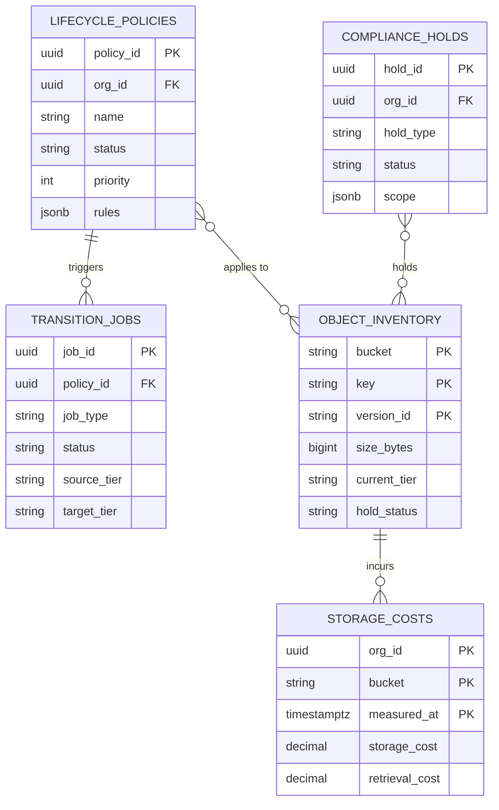
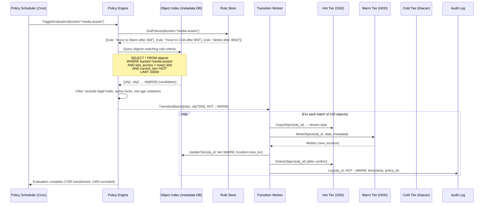
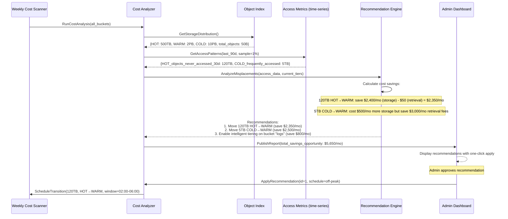

# Blob Storage Lifecycle Manager - System Design

## 1. Requirements

### Functional Requirements
1. Policy-based tier transitions: hot → warm → cold → archive
2. Automatic expiration and deletion based on rules
3. Cost optimization recommendations based on access patterns
4. Compliance/legal hold (prevent deletion of held objects)
5. Tag-based policy matching (flexible rule targeting)
6. Bulk operations (move millions of objects in batch)
7. Simulation mode (dry-run to preview policy effects)
8. Multi-cloud support (S3, GCS, Azure Blob)

### Non-Functional Requirements
- Availability: 99.99%
- Policy evaluation: process 1B+ objects/day
- Transition lag: <24 hours from policy trigger to completion
- Zero data loss during transitions
- Audit: complete trail of all lifecycle actions
- Cost: reduce storage costs by 40-60% vs all-hot

## 2. Capacity Estimation

| Metric | Value |
|--------|-------|
| Total managed objects | 50B |
| New objects/day | 500M |
| Avg object size | 1 MB |
| Total managed storage | 50 PB |
| Active policies | 500K |
| Policy evaluations/day | 1B+ |
| Transitions/day | 200M |
| Deletions/day | 50M |
| Cost savings target | 45% |
| Legal holds active | 50K |

### Storage Distribution Target
- Hot (frequent access): 20% → 10 PB
- Warm (infrequent): 30% → 15 PB
- Cold (rare access): 35% → 17.5 PB
- Archive (compliance only): 15% → 7.5 PB

## 3. Data Modeling

### Entity-Relationship Diagram



### Lifecycle Policies (PostgreSQL)
```sql
CREATE TABLE lifecycle_policies (
    policy_id       UUID PRIMARY KEY DEFAULT gen_random_uuid(),
    org_id          UUID NOT NULL,
    name            VARCHAR(256) NOT NULL,
    description     TEXT,
    status          VARCHAR(20) DEFAULT 'active',  -- active, paused, draft
    priority        INT DEFAULT 100,               -- lower = higher priority
    
    -- Scope: which objects this policy applies to
    scope           JSONB NOT NULL,
    -- {
    --   "buckets": ["prod-*", "staging-data"],
    --   "prefixes": ["logs/", "backups/archive/"],
    --   "tags": {"environment": "production", "team": "data"},
    --   "mime_types": ["application/json", "text/*"],
    --   "size_range": {"min_bytes": 0, "max_bytes": 1073741824}
    -- }
    
    -- Rules (ordered list of actions)
    rules           JSONB NOT NULL,
    -- [
    --   { "action": "transition", "to_tier": "warm", "after_days": 30 },
    --   { "action": "transition", "to_tier": "cold", "after_days": 90 },
    --   { "action": "transition", "to_tier": "archive", "after_days": 365 },
    --   { "action": "delete", "after_days": 730 }
    -- ]
    
    -- Conditions
    conditions      JSONB,
    -- {
    --   "last_accessed_before": "30d",
    --   "created_after": "2024-01-01",
    --   "version_count_gt": 3,
    --   "not_tagged": ["do-not-delete", "legal-hold"]
    -- }
    
    created_by      UUID NOT NULL,
    created_at      TIMESTAMPTZ DEFAULT NOW(),
    updated_at      TIMESTAMPTZ DEFAULT NOW(),
    last_evaluated  TIMESTAMPTZ,
    
    UNIQUE (org_id, name)
);

CREATE INDEX idx_policies_org ON lifecycle_policies(org_id, status);
CREATE INDEX idx_policies_status ON lifecycle_policies(status, priority);
CREATE INDEX idx_policies_scope ON lifecycle_policies USING GIN(scope);
```

### Object Inventory (Partitioned by bucket + prefix)
```sql
-- Managed in Spark/Iceberg for billion-scale analytics
-- This is the logical schema; physically stored in Parquet on S3
CREATE TABLE object_inventory (
    bucket          VARCHAR(256) NOT NULL,
    key             VARCHAR(2048) NOT NULL,
    version_id      VARCHAR(128),
    
    -- Object properties
    size_bytes      BIGINT NOT NULL,
    storage_class   VARCHAR(30) NOT NULL,   -- STANDARD, IA, GLACIER, DEEP_ARCHIVE
    etag            VARCHAR(128),
    content_type    VARCHAR(256),
    
    -- Timestamps
    created_at      TIMESTAMPTZ NOT NULL,
    last_modified   TIMESTAMPTZ NOT NULL,
    last_accessed   TIMESTAMPTZ,           -- from access logs
    
    -- Tags and metadata
    tags            MAP<VARCHAR, VARCHAR>,
    user_metadata   MAP<VARCHAR, VARCHAR>,
    
    -- Lifecycle state
    current_tier    VARCHAR(30) NOT NULL,
    transition_date TIMESTAMPTZ,           -- when moved to current tier
    eligible_for    VARCHAR(30),           -- next tier eligible
    eligible_at     TIMESTAMPTZ,
    hold_status     VARCHAR(20),           -- none, legal_hold, governance
    
    -- Access patterns (aggregated daily)
    access_count_7d  INT DEFAULT 0,
    access_count_30d INT DEFAULT 0,
    access_count_90d INT DEFAULT 0,
    
    PRIMARY KEY (bucket, key, version_id)
) PARTITIONED BY (bucket, date_trunc('month', created_at));

-- Indexes for policy evaluation
CREATE INDEX idx_inventory_tier ON object_inventory(current_tier, last_accessed);
CREATE INDEX idx_inventory_eligible ON object_inventory(eligible_at) 
    WHERE eligible_at IS NOT NULL;
CREATE INDEX idx_inventory_tags ON object_inventory USING GIN(tags);
CREATE INDEX idx_inventory_hold ON object_inventory(hold_status) 
    WHERE hold_status != 'none';
```

### Transition Jobs (PostgreSQL)
```sql
CREATE TABLE transition_jobs (
    job_id          UUID PRIMARY KEY DEFAULT gen_random_uuid(),
    policy_id       UUID NOT NULL REFERENCES lifecycle_policies(policy_id),
    job_type        VARCHAR(30) NOT NULL,  -- transition, delete, restore
    status          VARCHAR(30) DEFAULT 'queued',
    -- queued, scanning, executing, verifying, completed, failed, cancelled
    
    -- Scope
    source_tier     VARCHAR(30),
    target_tier     VARCHAR(30),
    bucket_filter   TEXT,
    prefix_filter   TEXT,
    
    -- Progress
    total_objects   BIGINT,
    processed       BIGINT DEFAULT 0,
    succeeded       BIGINT DEFAULT 0,
    failed          BIGINT DEFAULT 0,
    skipped         BIGINT DEFAULT 0,      -- held objects
    bytes_processed BIGINT DEFAULT 0,
    
    -- Execution
    worker_count    INT DEFAULT 10,
    batch_size      INT DEFAULT 1000,
    started_at      TIMESTAMPTZ,
    completed_at    TIMESTAMPTZ,
    error_summary   JSONB,
    
    -- Simulation
    is_simulation   BOOL DEFAULT FALSE,
    simulation_result JSONB,               -- { estimated_objects, estimated_cost_change }
    
    created_at      TIMESTAMPTZ DEFAULT NOW()
);

CREATE INDEX idx_transition_status ON transition_jobs(status) 
    WHERE status IN ('queued', 'scanning', 'executing');
CREATE INDEX idx_transition_policy ON transition_jobs(policy_id, created_at DESC);
```

### Compliance Holds (PostgreSQL)
```sql
CREATE TABLE compliance_holds (
    hold_id         UUID PRIMARY KEY DEFAULT gen_random_uuid(),
    org_id          UUID NOT NULL,
    hold_name       VARCHAR(256) NOT NULL,
    hold_type       VARCHAR(30) NOT NULL,  -- legal_hold, governance, regulatory
    reason          TEXT NOT NULL,
    
    -- Scope (which objects are held)
    scope           JSONB NOT NULL,
    -- {
    --   "buckets": ["evidence-*"],
    --   "prefixes": ["case-12345/"],
    --   "tags": {"case_id": "12345"},
    --   "date_range": {"start": "2024-01-01", "end": "2024-12-31"}
    -- }
    
    -- Lifecycle
    status          VARCHAR(20) DEFAULT 'active',  -- active, released
    placed_at       TIMESTAMPTZ DEFAULT NOW(),
    placed_by       UUID NOT NULL,
    released_at     TIMESTAMPTZ,
    released_by     UUID,
    release_reason  TEXT,
    
    -- Counts (updated periodically)
    object_count    BIGINT DEFAULT 0,
    total_size      BIGINT DEFAULT 0
);

CREATE INDEX idx_holds_org ON compliance_holds(org_id, status);
CREATE INDEX idx_holds_active ON compliance_holds(status) WHERE status = 'active';
```

### Cost Tracking (TimescaleDB)
```sql
CREATE TABLE storage_costs (
    org_id          UUID NOT NULL,
    bucket          VARCHAR(256) NOT NULL,
    measured_at     TIMESTAMPTZ NOT NULL,
    
    -- Storage by tier
    hot_bytes       BIGINT DEFAULT 0,
    warm_bytes      BIGINT DEFAULT 0,
    cold_bytes      BIGINT DEFAULT 0,
    archive_bytes   BIGINT DEFAULT 0,
    
    -- Costs (USD)
    storage_cost    DECIMAL(12,4),
    retrieval_cost  DECIMAL(12,4),
    transition_cost DECIMAL(12,4),
    total_cost      DECIMAL(12,4),
    
    -- Savings
    cost_without_lifecycle DECIMAL(12,4),
    savings         DECIMAL(12,4),
    savings_pct     DECIMAL(5,2),
    
    PRIMARY KEY (org_id, bucket, measured_at)
);

SELECT create_hypertable('storage_costs', 'measured_at');
CREATE INDEX idx_costs_org ON storage_costs(org_id, measured_at DESC);
```

## 4. High-Level Design

```
┌─────────────────────────────────────────────────────────────────────────────────┐
│                            MANAGEMENT PLANE                                      │
│  ┌──────────┐  ┌──────────┐  ┌──────────┐  ┌──────────┐                      │
│  │   Web    │  │   CLI    │  │ Terraform│  │   API    │                      │
│  │ Console  │  │  Tool    │  │ Provider │  │ Clients  │                      │
│  └────┬─────┘  └────┬─────┘  └────┬─────┘  └────┬─────┘                      │
└───────┼──────────────┼──────────────┼──────────────┼──────────────────────────┘
        │              │              │              │
┌───────▼──────────────▼──────────────▼──────────────▼──────────────────────────┐
│                         API Gateway                                             │
└──────────────────────────────┬─────────────────────────────────────────────────┘
                               │
┌──────────────────────────────┼─────────────────────────────────────────────────┐
│                              ▼                                                  │
│  ┌─────────────────────────────────────────────────────────────────────┐      │
│  │                      POLICY ENGINE                                    │      │
│  │                                                                       │      │
│  │  ┌────────────┐  ┌────────────┐  ┌────────────┐  ┌────────────┐   │      │
│  │  │  Policy    │  │  Policy    │  │ Simulation │  │  Hold       │   │      │
│  │  │  CRUD      │  │  Evaluator │  │  Engine    │  │  Manager    │   │      │
│  │  │            │  │ (per-object│  │ (dry-run)  │  │             │   │      │
│  │  │            │  │  matching) │  │            │  │             │   │      │
│  │  └────────────┘  └─────┬──────┘  └────────────┘  └────────────┘   │      │
│  └─────────────────────────┼─────────────────────────────────────────────┘      │
│                            │                                                     │
│  ┌─────────────────────────▼─────────────────────────────────────────────┐      │
│  │                  INVENTORY SCANNER                                      │      │
│  │                                                                         │      │
│  │  ┌────────────┐  ┌────────────┐  ┌────────────┐                      │      │
│  │  │ Full Scan  │  │ Change Feed│  │  Access    │                      │      │
│  │  │ (Spark,    │  │ Processor  │  │  Pattern   │                      │      │
│  │  │  daily)    │  │ (real-time)│  │  Analyzer  │                      │      │
│  │  └────────────┘  └────────────┘  └────────────┘                      │      │
│  └───────────────────────────┬───────────────────────────────────────────┘      │
│                              │                                                   │
│  ┌───────────────────────────▼───────────────────────────────────────────┐      │
│  │                  TRANSITION SCHEDULER                                   │      │
│  │                                                                         │      │
│  │  ┌────────────┐  ┌────────────┐  ┌────────────┐  ┌────────────┐    │      │
│  │  │   Job      │  │  Priority  │  │   Rate     │  │   Retry    │    │      │
│  │  │  Creator   │  │   Queue    │  │  Limiter   │  │   Handler  │    │      │
│  │  │            │  │ (Kafka)    │  │  (per-API) │  │            │    │      │
│  │  └────────────┘  └────────────┘  └────────────┘  └────────────┘    │      │
│  └───────────────────────────┬───────────────────────────────────────────┘      │
│                              │                                                   │
│  ┌───────────────────────────▼───────────────────────────────────────────┐      │
│  │                  EXECUTION WORKERS                                      │      │
│  │                                                                         │      │
│  │  ┌────────────┐  ┌────────────┐  ┌────────────┐  ┌────────────┐    │      │
│  │  │ Transition │  │  Deletion  │  │  Restore   │  │Verification│    │      │
│  │  │  Workers   │  │  Workers   │  │  Workers   │  │  Workers   │    │      │
│  │  │ (S3 API)   │  │            │  │            │  │            │    │      │
│  │  └────────────┘  └────────────┘  └────────────┘  └────────────┘    │      │
│  └───────────────────────────┬───────────────────────────────────────────┘      │
│                              │                                                   │
│  ┌───────────────────────────▼───────────────────────────────────────────┐      │
│  │                  STORAGE BACKENDS                                       │      │
│  │                                                                         │      │
│  │  ┌────────────┐  ┌────────────┐  ┌────────────┐  ┌────────────┐    │      │
│  │  │  AWS S3    │  │  GCS       │  │Azure Blob  │  │  MinIO     │    │      │
│  │  │(Standard,  │  │(Standard,  │  │(Hot, Cool, │  │(on-prem)   │    │      │
│  │  │ IA, Glacier│  │ Nearline,  │  │ Archive)   │  │            │    │      │
│  │  │ Deep Arch.)│  │ Coldline)  │  │            │  │            │    │      │
│  │  └────────────┘  └────────────┘  └────────────┘  └────────────┘    │      │
│  └───────────────────────────────────────────────────────────────────────┘      │
│                                                                                  │
│  ┌───────────────────────────────────────────────────────────────────────┐      │
│  │  OBSERVABILITY                                                         │      │
│  │  ┌────────────┐  ┌────────────┐  ┌────────────┐  ┌────────────┐    │      │
│  │  │ Audit Log  │  │  Cost      │  │   Alert    │  │ Dashboard  │    │      │
│  │  │(immutable) │  │  Tracker   │  │   Engine   │  │   (Grafana)│    │      │
│  │  └────────────┘  └────────────┘  └────────────┘  └────────────┘    │      │
│  └───────────────────────────────────────────────────────────────────────┘      │
└──────────────────────────────────────────────────────────────────────────────────┘
```

## 5. API Design

### Policy Management
```
POST /api/v1/policies
  Body: {
    name: "Production logs lifecycle",
    scope: {
      buckets: ["prod-logs-*"],
      prefixes: ["application/"],
      tags: { "environment": "production" }
    },
    rules: [
      { action: "transition", to_tier: "warm", after_days: 7 },
      { action: "transition", to_tier: "cold", after_days: 30 },
      { action: "transition", to_tier: "archive", after_days: 90 },
      { action: "delete", after_days: 365, unless_tagged: ["audit-required"] }
    ],
    conditions: {
      min_object_size: 1024,
      exclude_tags: ["do-not-lifecycle"]
    }
  }
  Response: { policy_id, status: "active", estimated_objects_matched: 150000000 }

GET /api/v1/policies?org_id={orgId}&status=active
PATCH /api/v1/policies/{policyId}
  Body: { status: "paused" }
DELETE /api/v1/policies/{policyId}
```

### Simulation (Dry Run)
```
POST /api/v1/policies/{policyId}/simulate
  Body: {
    time_horizon_days: 90,
    sample_size: 100000
  }
  Response: {
    simulation_id: "uuid",
    results: {
      objects_affected: 150000000,
      transitions: {
        hot_to_warm: { count: 80000000, size_bytes: 80000000000000 },
        warm_to_cold: { count: 50000000, size_bytes: 50000000000000 },
        cold_to_archive: { count: 20000000, size_bytes: 20000000000000 }
      },
      deletions: { count: 5000000, size_bytes: 5000000000000 },
      cost_impact: {
        current_monthly: 450000.00,
        projected_monthly: 250000.00,
        savings_monthly: 200000.00,
        savings_pct: 44.4,
        transition_one_time_cost: 15000.00
      },
      compliance_blocked: { count: 500000, reason: "legal_hold" }
    }
  }
```

### Transition Jobs
```
POST /api/v1/jobs/transition
  Body: {
    policy_id: "uuid",
    priority: "normal",
    max_rate: 10000,       # objects/sec
    worker_count: 20
  }
  Response: { job_id, status: "queued", estimated_duration_hours: 4 }

GET /api/v1/jobs/{jobId}/status
  Response: {
    status: "executing",
    progress: { total: 150000000, processed: 75000000, pct: 50.0 },
    throughput: { objects_per_sec: 8500, bytes_per_sec: 8500000000 },
    errors: { count: 150, last_error: "AccessDenied on bucket-x/key-y" },
    eta_hours: 2.4
  }

POST /api/v1/jobs/{jobId}/cancel
```

### Compliance Holds
```
POST /api/v1/holds
  Body: {
    name: "Legal Hold - Investigation #789",
    hold_type: "legal_hold",
    reason: "Preservation for ongoing litigation",
    scope: {
      buckets: ["user-data-*"],
      tags: { "user_id": "12345" },
      date_range: { start: "2024-01-01", end: "2024-06-30" }
    }
  }
  Response: { hold_id, objects_held: 50000, total_size: "500 GB" }

DELETE /api/v1/holds/{holdId}
  Body: { reason: "Case dismissed", released_by: "legal@company.com" }
```

### Cost Optimization
```
GET /api/v1/recommendations?org_id={orgId}
  Response: {
    recommendations: [
      {
        type: "tier_transition",
        description: "Move 5TB of logs not accessed in 60+ days to cold storage",
        bucket: "application-logs",
        prefix: "2024/Q1/",
        current_cost_monthly: 115.00,
        projected_cost_monthly: 12.50,
        savings_monthly: 102.50,
        confidence: 0.95,
        risk: "low"
      },
      {
        type: "delete_expired",
        description: "Delete 2TB of temp files older than 90 days",
        savings_monthly: 46.00,
        confidence: 0.99,
        risk: "medium"
      }
    ],
    total_potential_savings_monthly: 25000.00
  }
```

## 6. Deep Dive: Efficient Policy Evaluation at Scale

### Parallel Evaluation with MapReduce (Spark)

```python
class PolicyEvaluationEngine:
    """
    Evaluates lifecycle policies against billion-scale object inventory.
    
    Strategy:
    - Full scan: Daily Spark job processes entire inventory
    - Change feed: Real-time evaluation for new/modified objects
    - Incremental: Only re-evaluate objects whose eligibility date passed
    """
    
    def __init__(self, spark_session, policy_cache):
        self.spark = spark_session
        self.policy_cache = policy_cache
    
    def run_full_evaluation(self, org_id: str) -> DataFrame:
        """
        Spark job: evaluate all policies against full inventory.
        Partitioned by bucket prefix for parallelism.
        """
        # Load inventory (Iceberg table, partitioned)
        inventory = self.spark.read.format("iceberg").load("s3://data-lake/object_inventory")
        
        # Load active policies
        policies = self.spark.read.jdbc(
            url=PG_URL,
            table="lifecycle_policies",
            predicates=[f"org_id = '{org_id}' AND status = 'active'"]
        ).collect()  # Policies fit in memory
        
        # Broadcast policies to all workers
        policies_bc = self.spark.sparkContext.broadcast(policies)
        
        # Evaluate each object against all policies
        @udf(returnType=ArrayType(StructType([
            StructField("policy_id", StringType()),
            StructField("action", StringType()),
            StructField("target_tier", StringType()),
            StructField("eligible_at", TimestampType())
        ])))
        def evaluate_policies(bucket, key, size, tags, storage_class, 
                            created_at, last_accessed, hold_status):
            """UDF: evaluate all policies for a single object."""
            if hold_status and hold_status != 'none':
                return []  # Held objects skip lifecycle
            
            matching_actions = []
            for policy in policies_bc.value:
                if not matches_scope(policy, bucket, key, size, tags):
                    continue
                
                for rule in policy['rules']:
                    eligible_date = compute_eligibility(
                        rule, created_at, last_accessed
                    )
                    
                    if eligible_date and eligible_date <= datetime.utcnow():
                        if rule['action'] == 'transition' and \
                           storage_class != rule['to_tier']:
                            matching_actions.append({
                                'policy_id': policy['policy_id'],
                                'action': 'transition',
                                'target_tier': rule['to_tier'],
                                'eligible_at': eligible_date
                            })
                        elif rule['action'] == 'delete':
                            matching_actions.append({
                                'policy_id': policy['policy_id'],
                                'action': 'delete',
                                'target_tier': None,
                                'eligible_at': eligible_date
                            })
                        break  # First matching rule wins
            
            return matching_actions
        
        # Apply evaluation (distributed across Spark executors)
        results = inventory.withColumn(
            "actions",
            evaluate_policies(
                col("bucket"), col("key"), col("size_bytes"),
                col("tags"), col("storage_class"),
                col("created_at"), col("last_accessed"), col("hold_status")
            )
        ).filter(size(col("actions")) > 0)
        
        # Write results to action queue
        results.select(
            col("bucket"), col("key"), col("version_id"),
            explode(col("actions")).alias("action")
        ).write.format("kafka").option(
            "kafka.bootstrap.servers", KAFKA_BROKERS
        ).option("topic", "lifecycle.actions.pending").save()
        
        return results
    
    async def evaluate_incremental(self):
        """
        Process objects that became eligible since last evaluation.
        Uses eligibility index for efficient lookup.
        """
        now = datetime.utcnow()
        
        # Query objects with eligibility date in the past
        newly_eligible = await self.db.query(
            "SELECT bucket, key, version_id, eligible_for, eligible_at "
            "FROM object_inventory "
            "WHERE eligible_at <= %s AND eligible_at > %s "
            "ORDER BY eligible_at "
            "LIMIT 100000",
            (now, now - timedelta(hours=1))
        )
        
        for obj in newly_eligible:
            # Check hold status
            if await self._is_held(obj['bucket'], obj['key']):
                continue
            
            # Queue transition
            await self.kafka.produce(
                topic="lifecycle.actions.pending",
                key=f"{obj['bucket']}/{obj['key']}".encode(),
                value=json.dumps({
                    "bucket": obj["bucket"],
                    "key": obj["key"],
                    "action": "transition",
                    "target_tier": obj["eligible_for"],
                    "policy_evaluation_time": now.isoformat()
                }).encode()
            )


class ChangeFeedProcessor:
    """Process real-time object changes for immediate policy evaluation."""
    
    async def process_s3_event(self, event: dict):
        """Handle S3 event notification (create/delete/tag change)."""
        bucket = event['detail']['bucket']['name']
        key = event['detail']['object']['key']
        event_type = event['detail']['reason']
        
        if event_type in ('PutObject', 'CopyObject', 'CompleteMultipartUpload'):
            # New object - evaluate policies immediately
            obj_metadata = await self.s3.head_object(Bucket=bucket, Key=key)
            
            matching_policy = await self._find_matching_policy(
                bucket, key, obj_metadata
            )
            
            if matching_policy:
                # Compute eligibility and update inventory
                eligibility = self._compute_next_eligibility(
                    matching_policy, obj_metadata
                )
                await self._update_inventory_eligibility(
                    bucket, key, eligibility
                )
        
        elif event_type == 'DeleteObject':
            # Remove from inventory
            await self._remove_from_inventory(bucket, key)
    
    async def _find_matching_policy(self, bucket: str, key: str, 
                                    metadata: dict) -> dict:
        """Find highest-priority policy matching this object."""
        # Check Redis policy cache (prefix-indexed)
        policies = await self.policy_cache.get_policies_for_prefix(bucket, key)
        
        for policy in sorted(policies, key=lambda p: p['priority']):
            if self._matches_conditions(policy, metadata):
                return policy
        
        return None
```

### Prefix-Based Policy Partitioning
```python
class PolicyCache:
    """Redis-based policy cache with prefix-tree indexing."""
    
    async def build_prefix_index(self, org_id: str):
        """Build prefix tree for fast policy lookup."""
        policies = await self.db.get_active_policies(org_id)
        
        for policy in policies:
            scope = policy['scope']
            
            # Index by bucket
            for bucket_pattern in scope.get('buckets', ['*']):
                # Index by prefix
                for prefix in scope.get('prefixes', ['']):
                    cache_key = f"policy_idx:{bucket_pattern}:{prefix}"
                    await self.redis.sadd(cache_key, json.dumps(policy))
                    await self.redis.expire(cache_key, 3600)
    
    async def get_policies_for_prefix(self, bucket: str, key: str) -> list:
        """Look up policies that might match this object."""
        policies = set()
        
        # Check exact bucket match
        exact_key = f"policy_idx:{bucket}:"
        policies.update(await self.redis.smembers(exact_key))
        
        # Check wildcard bucket patterns
        for pattern_key in await self.redis.keys(f"policy_idx:*:"):
            pattern = pattern_key.split(':')[1]
            if fnmatch.fnmatch(bucket, pattern):
                policies.update(await self.redis.smembers(pattern_key))
        
        # Check prefix matches
        key_parts = key.split('/')
        for i in range(len(key_parts)):
            prefix = '/'.join(key_parts[:i+1]) + '/'
            prefix_key = f"policy_idx:{bucket}:{prefix}"
            members = await self.redis.smembers(prefix_key)
            policies.update(members)
        
        return [json.loads(p) for p in policies]
```

## 7. Deep Dive: Cost Optimization Engine

### Access Pattern Analysis

```python
class CostOptimizationEngine:
    """
    Analyzes access patterns and recommends optimal storage tier placement.
    
    Pricing model (simplified AWS S3):
    - Standard: $0.023/GB/month, $0.0004/1K requests
    - IA: $0.0125/GB/month, $0.01/1K retrievals
    - Glacier: $0.004/GB/month, $0.03/retrieval + 3-5hr latency
    - Deep Archive: $0.00099/GB/month, $0.05/retrieval + 12hr latency
    """
    
    PRICING = {
        'hot': {'storage_gb_month': 0.023, 'retrieval_per_1k': 0.0004, 'transition_per_1k': 0.0},
        'warm': {'storage_gb_month': 0.0125, 'retrieval_per_1k': 0.01, 'transition_per_1k': 0.01},
        'cold': {'storage_gb_month': 0.004, 'retrieval_per_1k': 30.0, 'transition_per_1k': 0.025},
        'archive': {'storage_gb_month': 0.00099, 'retrieval_per_1k': 50.0, 'transition_per_1k': 0.05}
    }
    
    MIN_STORAGE_DURATION = {
        'warm': 30,      # 30-day minimum
        'cold': 90,      # 90-day minimum
        'archive': 180   # 180-day minimum
    }
    
    async def analyze_and_recommend(self, org_id: str, bucket: str) -> list:
        """Generate cost optimization recommendations."""
        
        # Get access pattern data (aggregated from CloudTrail/access logs)
        access_patterns = await self._get_access_patterns(org_id, bucket)
        
        recommendations = []
        
        for prefix_group in access_patterns:
            current_tier = prefix_group['current_tier']
            current_cost = self._calculate_current_cost(prefix_group)
            
            # Evaluate each alternative tier
            best_tier = current_tier
            best_cost = current_cost
            
            for candidate_tier in ['warm', 'cold', 'archive']:
                projected_cost = self._project_cost(prefix_group, candidate_tier)
                
                # Include transition cost
                transition_cost = self._transition_cost(
                    prefix_group['total_objects'],
                    prefix_group['total_size_gb'],
                    candidate_tier
                )
                
                # Amortize transition cost over 12 months
                monthly_cost_with_transition = projected_cost + (transition_cost / 12)
                
                if monthly_cost_with_transition < best_cost * 0.8:  # >20% savings threshold
                    best_tier = candidate_tier
                    best_cost = monthly_cost_with_transition
            
            if best_tier != current_tier:
                recommendations.append({
                    'bucket': bucket,
                    'prefix': prefix_group['prefix'],
                    'current_tier': current_tier,
                    'recommended_tier': best_tier,
                    'object_count': prefix_group['total_objects'],
                    'size_gb': prefix_group['total_size_gb'],
                    'current_monthly_cost': current_cost,
                    'projected_monthly_cost': best_cost,
                    'savings_monthly': current_cost - best_cost,
                    'savings_pct': ((current_cost - best_cost) / current_cost) * 100,
                    'confidence': self._confidence_score(prefix_group),
                    'risk': self._assess_risk(prefix_group, best_tier),
                    'reasoning': self._generate_reasoning(prefix_group, best_tier)
                })
        
        return sorted(recommendations, key=lambda r: r['savings_monthly'], reverse=True)
    
    def _project_cost(self, pattern: dict, tier: str) -> float:
        """Project monthly cost if objects were in candidate tier."""
        size_gb = pattern['total_size_gb']
        monthly_retrievals = pattern['avg_retrievals_per_month']
        
        storage_cost = size_gb * self.PRICING[tier]['storage_gb_month']
        retrieval_cost = (monthly_retrievals / 1000) * self.PRICING[tier]['retrieval_per_1k']
        
        # Penalty for early deletion if access pattern changes
        min_duration = self.MIN_STORAGE_DURATION.get(tier, 0)
        if pattern['avg_object_age_days'] < min_duration:
            # Early deletion penalty
            remaining_days = min_duration - pattern['avg_object_age_days']
            penalty = (remaining_days / 30) * storage_cost
            retrieval_cost += penalty
        
        return storage_cost + retrieval_cost
    
    def _confidence_score(self, pattern: dict) -> float:
        """How confident are we in this recommendation?"""
        factors = []
        
        # More history = more confidence
        history_days = pattern.get('observation_days', 0)
        factors.append(min(1.0, history_days / 90))
        
        # Consistent access pattern = higher confidence
        access_variance = pattern.get('access_variance', 1.0)
        factors.append(1.0 / (1.0 + access_variance))
        
        # More objects = more statistical significance
        object_count = pattern.get('total_objects', 0)
        factors.append(min(1.0, object_count / 10000))
        
        return sum(factors) / len(factors)
    
    async def what_if_simulation(self, policy_id: str, 
                                 time_horizon_days: int = 90) -> SimulationResult:
        """Simulate policy effect without applying changes."""
        policy = await self.db.get_policy(policy_id)
        
        # Sample inventory (1% sample for speed)
        sample = await self._get_inventory_sample(policy['scope'], sample_rate=0.01)
        
        # Simulate day-by-day
        daily_costs = []
        transitions_by_day = []
        
        current_state = {obj['key']: obj['storage_class'] for obj in sample}
        
        for day in range(time_horizon_days):
            sim_date = datetime.utcnow() + timedelta(days=day)
            day_transitions = []
            
            for obj in sample:
                current_tier = current_state[obj['key']]
                
                for rule in policy['rules']:
                    obj_age = (sim_date - obj['created_at']).days
                    
                    if rule['action'] == 'transition' and obj_age >= rule['after_days']:
                        if current_tier != rule['to_tier']:
                            day_transitions.append({
                                'key': obj['key'],
                                'from': current_tier,
                                'to': rule['to_tier'],
                                'size': obj['size_bytes']
                            })
                            current_state[obj['key']] = rule['to_tier']
                        break
            
            transitions_by_day.append(day_transitions)
            daily_costs.append(self._calculate_daily_cost(current_state, sample))
        
        # Extrapolate from sample to full inventory
        scale_factor = 100  # 1% sample → 100x
        
        return SimulationResult(
            total_transitions=sum(len(t) for t in transitions_by_day) * scale_factor,
            cost_trajectory=[c * scale_factor for c in daily_costs],
            total_savings=(daily_costs[0] - daily_costs[-1]) * 30 * scale_factor,
            transitions_by_tier={
                'hot_to_warm': sum(1 for day in transitions_by_day 
                                  for t in day if t['to'] == 'warm') * scale_factor,
                'warm_to_cold': sum(1 for day in transitions_by_day 
                                   for t in day if t['to'] == 'cold') * scale_factor,
            }
        )
```

## 8. Component Optimization

### Kafka for Real-Time Transitions
```python
class TransitionOrchestrator:
    """Kafka-based distributed transition execution."""
    
    TOPICS = {
        "actions_pending": "lifecycle.actions.pending",     # Policy evaluator output
        "actions_executing": "lifecycle.actions.executing", # Being processed
        "actions_completed": "lifecycle.actions.completed", # Done
        "actions_failed": "lifecycle.actions.failed",       # Need retry
    }
    
    async def process_transition_batch(self, messages: list):
        """Consumer: process batch of transition actions."""
        # Group by bucket for efficient batching
        by_bucket = defaultdict(list)
        for msg in messages:
            action = json.loads(msg.value)
            by_bucket[action['bucket']].append(action)
        
        for bucket, actions in by_bucket.items():
            # Filter out held objects
            filtered = await self._filter_held_objects(bucket, actions)
            
            # Rate limit per S3 API limits (3,500 PUT/s per prefix)
            for batch in self._rate_limited_batches(filtered, batch_size=1000):
                try:
                    await self._execute_transitions(bucket, batch)
                    
                    # Record success
                    for action in batch:
                        await self.kafka.produce(
                            self.TOPICS["actions_completed"],
                            value=json.dumps({**action, "completed_at": datetime.utcnow().isoformat()})
                        )
                except Exception as e:
                    # Send to failed topic for retry
                    for action in batch:
                        action['error'] = str(e)
                        action['retry_count'] = action.get('retry_count', 0) + 1
                        await self.kafka.produce(
                            self.TOPICS["actions_failed"],
                            value=json.dumps(action)
                        )
    
    async def _execute_transitions(self, bucket: str, actions: list):
        """Execute S3 storage class transitions."""
        for action in actions:
            if action['action'] == 'transition':
                # S3 CopyObject with new StorageClass
                await self.s3.copy_object(
                    Bucket=bucket,
                    Key=action['key'],
                    CopySource={'Bucket': bucket, 'Key': action['key']},
                    StorageClass=self._map_tier_to_s3_class(action['target_tier']),
                    MetadataDirective='COPY'
                )
            elif action['action'] == 'delete':
                await self.s3.delete_object(Bucket=bucket, Key=action['key'])
            
            # Update inventory
            await self._update_inventory(bucket, action)
            
            # Audit log
            await self._audit_log(action)
```

### Audit Log (Immutable)
```python
class AuditLogger:
    """Immutable audit trail for all lifecycle actions."""
    
    async def log_action(self, action: dict):
        """Write to append-only audit log (Kafka + S3)."""
        audit_entry = {
            "timestamp": datetime.utcnow().isoformat(),
            "action_type": action["action"],
            "bucket": action["bucket"],
            "key": action["key"],
            "from_tier": action.get("current_tier"),
            "to_tier": action.get("target_tier"),
            "policy_id": action.get("policy_id"),
            "size_bytes": action.get("size_bytes"),
            "hold_checked": True,
            "operator": "system"  # or user ID for manual actions
        }
        
        # Write to Kafka (real-time consumers)
        await self.kafka.produce("lifecycle.audit", json.dumps(audit_entry))
        
        # Also write to immutable S3 with Object Lock
        # Batched every 5 minutes into Parquet files
```

## 9. Observability

### Key Metrics
| Metric | Target | Alert |
|--------|--------|-------|
| Policy evaluation throughput | 1B objects/day | <500M |
| Transition success rate | >99.99% | <99.9% |
| Transition lag (eligible → moved) | <24h | >48h |
| Cost savings achieved | >40% | <30% |
| Hold compliance | 100% | Any held object modified |
| Evaluation queue depth | <10M | >50M |
| S3 API error rate | <0.1% | >1% |
| Inventory freshness | <1 hour | >6 hours |

### Dashboard Panels
- Storage distribution by tier (pie chart, real-time)
- Daily transitions (stacked bar, by source→target tier)
- Cost trend (line chart, actual vs projected)
- Policy evaluation backlog (queue depth)
- Savings by policy (table, sorted by $)
- Hold coverage (% of objects under hold)

## 10. Considerations & Trade-offs

| Decision | Choice | Trade-off |
|----------|--------|-----------|
| Full scan vs change feed | Hybrid (daily full + real-time change feed) | Full scan catches missed events but expensive; change feed alone may miss S3 eventual consistency gaps |
| Policy evaluation | Spark batch + Kafka streaming | Spark handles billions efficiently but has latency; Kafka gives real-time for new objects |
| Inventory source | S3 Inventory reports + access logs | Inventory reports are daily/eventual; access logs are near-real-time but voluminous |
| Transition execution | Copy-in-place (S3 CopyObject) | Simple but creates API load; S3 Lifecycle rules are native but less flexible |
| Hold enforcement | Check before every action | Safest but adds latency; could pre-filter but risks race conditions |
| Cost modeling | Per-prefix aggregation | Useful granularity for recommendations; per-object too expensive at scale |
| Simulation accuracy | 1% sampling extrapolated | Fast but may miss edge cases; full simulation accurate but takes hours |
| Multi-cloud | Abstract storage interface | Flexibility but LCD of features across clouds; could optimize per-cloud but complex |

---

## Sequence Diagrams

### Policy Evaluation + Tier Transition



### Cost Optimization Scan



## Caching Strategy

| Layer | What's Cached | Technology | TTL | Purpose |
|-------|---------------|-----------|-----|---------|
| Policy rules | Parsed policy definitions | In-memory (per worker) | 5 min | Avoid DB round-trip per object evaluation |
| Object metadata | Tier, size, last_access, holds | Redis | 1 hour | Fast policy evaluation without index scan |
| Legal hold status | Hold flags per object/bucket | Redis bitmap | 1 min (short!) | Safety: prevent accidental transitions |
| Cost rates | Per-tier pricing, API costs | Config cache | 24h | Cost calculations |
| Transition state | In-progress transitions | Redis | Until complete | Prevent duplicate transitions, resume on crash |

**Critical safety invariant:** Legal hold cache has 1-min TTL — if a hold is placed, worst case the object could be in-flight for transition. Solution: double-check hold status before final delete of source copy.
