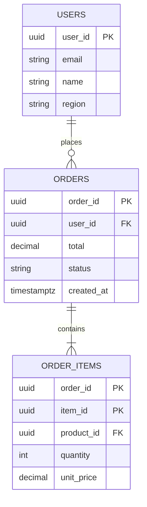
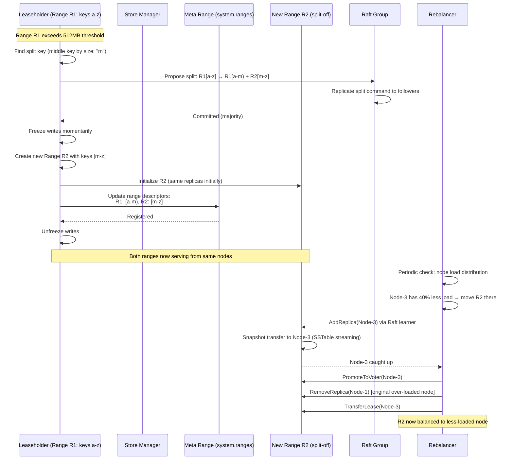
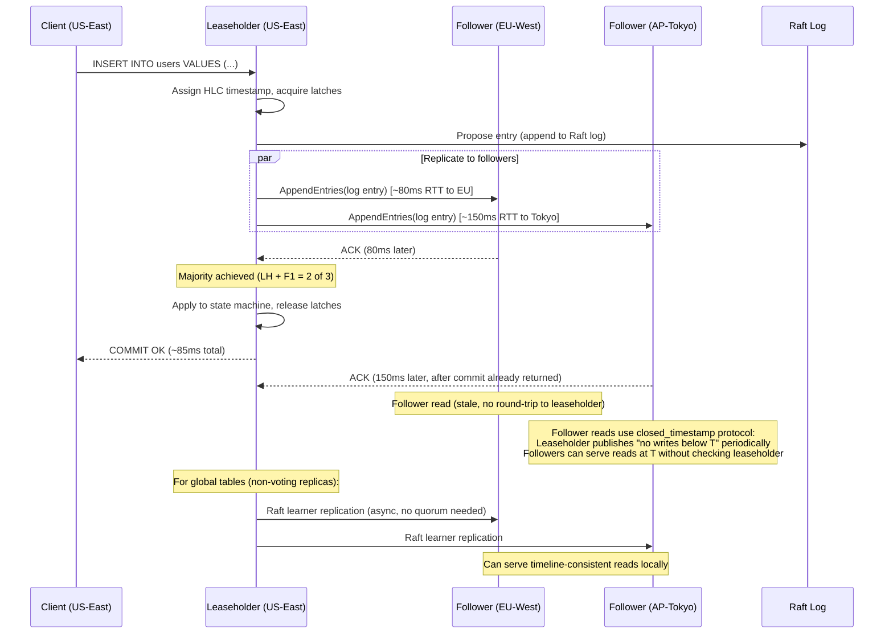

# Distributed SQL Database (Spanner/CockroachDB)

## 1. Functional Requirements

### Core Features
- **Full SQL Interface**: ANSI SQL with joins, aggregations, subqueries, CTEs, window functions
- **Distributed Transactions**: ACID with serializable isolation across shards
- **Automatic Sharding**: Range-based partitioning with automatic split/merge
- **Rebalancing**: Automatic data movement based on load, size, and locality
- **Geo-Partitioning**: Pin data to specific regions for compliance/latency
- **Online Schema Changes**: Non-blocking DDL operations on live tables
- **Point-in-Time Recovery**: Restore to any timestamp within retention window
- **Follower Reads**: Read from any replica with bounded staleness

### User Stories
1. Application executes distributed transaction spanning multiple ranges → serializable guarantee
2. Range grows too large → system automatically splits and rebalances
3. DBA adds column to billion-row table → zero-downtime schema migration
4. Compliance requires EU data in EU → geo-partition table by region column
5. Analytics query needs consistent snapshot → follower read at timestamp T
6. Region fails → automatic failover of all affected range leases within seconds

---

## 2. Non-Functional Requirements

| Metric | Target |
|--------|--------|
| Availability | 99.999% |
| Read Latency (in-region) | <10ms p99 |
| Write Latency (in-region) | <50ms p99 (single-range), <100ms (distributed txn) |
| Consistency | Linearizable (external consistency) |
| Scale | Petabyte storage, 10K+ nodes |
| Throughput | 1M+ read QPS, 100K+ write TPS |
| Recovery | RPO=0, RTO<10s (per range) |
| Schema Change | Zero-downtime, <1 hour for billion-row table |

---

## 3. Capacity Estimation

### Data Model
```
Storage per node: 2TB effective (4TB raw with 2x overhead for LSM)
Nodes: 1000 (scales to 10K+)
Total capacity: 2PB effective
Ranges: 2PB / 512MB per range = ~4M ranges
Raft groups: 4M (one per range, 3 replicas each = 12M range replicas)

Queries:
  Point reads: 500K QPS (distributed across leaseholders)
  Range scans: 200K QPS
  Writes: 100K TPS (each may touch 1-5 ranges)
  Distributed txns: 30K TPS (require 2PC + Paxos)
  
Network:
  Intra-range replication: 100K writes × 1KB × 3 replicas = 300MB/s
  Cross-range txn coordination: 30K × 5 round trips × 200B = 30MB/s
  Rebalancing: 50MB/s background (adaptive)
```

### Resource per Node
```
CPU: 32 cores (16 for SQL, 8 for Raft, 4 for storage, 4 for misc)
RAM: 128GB (64GB block cache, 32GB Raft log, 16GB connection, 16GB other)
Storage: 2× 4TB NVMe SSD (data + WAL separation)
Network: 25Gbps
Ranges per node: ~4000 (replicas including leaseholders)
Raft groups per node: ~4000
```

---

## 4. Data Modeling

### Entity-Relationship Diagram



### Range Descriptor
```protobuf
message RangeDescriptor {
  int64 range_id = 1;
  bytes start_key = 2;           // Inclusive
  bytes end_key = 3;             // Exclusive
  
  repeated ReplicaDescriptor replicas = 4;
  
  // Leaseholder (serves reads/coordinates writes)
  int32 leaseholder_node_id = 5;
  Timestamp lease_expiration = 6;
  
  // Generation (incremented on split/merge)
  int64 generation = 7;
  
  // Geo-partition constraint
  repeated Constraint constraints = 8;
}

message ReplicaDescriptor {
  int32 node_id = 1;
  int32 store_id = 2;
  ReplicaType type = 3;  // VOTER_FULL, VOTER_INCOMING, LEARNER, NON_VOTER
}

message Constraint {
  enum Type {
    REQUIRED = 0;     // Must have replica in this locality
    PROHIBITED = 1;   // Must NOT have replica here
  }
  Type type = 1;
  string key = 2;     // e.g., "region"
  string value = 3;   // e.g., "eu-west"
}
```

### Transaction Record
```protobuf
message TransactionRecord {
  bytes txn_id = 1;               // UUID
  TransactionStatus status = 2;   // PENDING, STAGING, COMMITTED, ABORTED
  
  Timestamp write_timestamp = 3;  // Commit timestamp (TrueTime/HLC)
  Timestamp read_timestamp = 4;   // Snapshot for reads
  
  // Intents written (for cleanup)
  repeated Intent intents = 5;
  
  // 2PC coordinator info
  int64 coordinator_range_id = 6;
  
  // Heartbeat (liveness detection)
  Timestamp last_heartbeat = 7;
  Duration heartbeat_timeout = 8;
  
  // Priority for deadlock resolution
  int32 priority = 9;
  
  // Epoch (incremented on restart/recovery)
  int32 epoch = 10;
}

message Intent {
  bytes key = 1;
  bytes value = 2;
  int64 range_id = 3;
  IntentType type = 4;  // WRITE, DELETE
}

enum TransactionStatus {
  PENDING = 0;
  STAGING = 1;    // All intents written, checking commit condition
  COMMITTED = 2;
  ABORTED = 3;
}
```

### Key Encoding (Range Key Space)
```
Key format: /<table_id>/<index_id>/<encoded_pk_columns>/<column_family>/<column>/<timestamp>

Example for table 'users' with PK (user_id):
  /52/1/\x89user123/0/name/1705312000.000000001
  
  52 = table ID
  1 = primary index ID
  \x89user123 = encoded user_id (ordered encoding)
  0 = column family
  name = column name
  1705312000.000000001 = MVCC timestamp

Range split point: at a key boundary
  Range [/52/1/A, /52/1/M)  → users A-L
  Range [/52/1/M, /52/1/Z)  → users M-Z

Secondary index encoding:
  /52/2/<indexed_columns>/<pk_columns>  (unique index)
  /52/3/<indexed_columns>/<pk_columns>  (non-unique index)
```

### MVCC Storage (LSM-Tree Based)
```
┌─────────────────────────────────────────────────────────────┐
│                     MVCC KEY-VALUE STORE                      │
│                                                             │
│  Key: /table/index/pk_value/col @ timestamp                 │
│  Value: encoded column value                                │
│                                                             │
│  Example (user "alice" history):                            │
│                                                             │
│  /users/1/alice/name @ T=100  →  "Alice Smith"             │
│  /users/1/alice/name @ T=50   →  "Alice Johnson"           │
│  /users/1/alice/email @ T=100 →  "alice@new.com"           │
│  /users/1/alice/email @ T=30  →  "alice@old.com"           │
│                                                             │
│  Read at T=80: sees name="Alice Johnson", email="alice@old" │
│  Read at T=100: sees name="Alice Smith", email="alice@new"  │
│                                                             │
│  Garbage collection: remove versions older than retention    │
│  (default 25 hours for PITR, configurable)                  │
└─────────────────────────────────────────────────────────────┘
```

### SQL Schema Example
```sql
CREATE TABLE users (
    user_id UUID PRIMARY KEY DEFAULT gen_random_uuid(),
    email STRING UNIQUE NOT NULL,
    name STRING NOT NULL,
    region STRING NOT NULL,
    created_at TIMESTAMPTZ DEFAULT now(),
    
    INDEX idx_region (region)
) LOCALITY REGIONAL BY ROW;  -- Geo-partition by region column

CREATE TABLE orders (
    order_id UUID PRIMARY KEY DEFAULT gen_random_uuid(),
    user_id UUID NOT NULL REFERENCES users(user_id),
    total DECIMAL(12,2) NOT NULL,
    status STRING NOT NULL DEFAULT 'pending',
    created_at TIMESTAMPTZ DEFAULT now(),
    
    INDEX idx_user_orders (user_id, created_at DESC),
    INDEX idx_status (status) STORING (user_id, total)
) PARTITION BY RANGE (created_at) (
    PARTITION p_current VALUES FROM (now() - INTERVAL '30 days') TO (MAXVALUE),
    PARTITION p_archive VALUES FROM (MINVALUE) TO (now() - INTERVAL '30 days')
);

CREATE TABLE order_items (
    order_id UUID NOT NULL REFERENCES orders(order_id),
    item_id UUID DEFAULT gen_random_uuid(),
    product_id UUID NOT NULL,
    quantity INT NOT NULL,
    unit_price DECIMAL(10,2) NOT NULL,
    
    PRIMARY KEY (order_id, item_id),
    INDEX idx_product (product_id)
);
```

---

## 5. High-Level Design (HLD)

### Architecture Diagram
```
┌────────────────────────────────────────────────────────────────────────┐
│                           SQL LAYER                                     │
│                                                                        │
│  ┌──────────────┐  ┌──────────────┐  ┌──────────────┐                │
│  │   SQL Node   │  │   SQL Node   │  │   SQL Node   │  (stateless)   │
│  │              │  │              │  │              │                │
│  │ ┌──────────┐ │  │ ┌──────────┐ │  │ ┌──────────┐ │                │
│  │ │  Parser  │ │  │ │  Parser  │ │  │ │  Parser  │ │                │
│  │ ├──────────┤ │  │ ├──────────┤ │  │ ├──────────┤ │                │
│  │ │Optimizer │ │  │ │Optimizer │ │  │ │Optimizer │ │                │
│  │ ├──────────┤ │  │ ├──────────┤ │  │ ├──────────┤ │                │
│  │ │Executor  │ │  │ │Executor  │ │  │ │Executor  │ │                │
│  │ ├──────────┤ │  │ ├──────────┤ │  │ ├──────────┤ │                │
│  │ │DistSQL   │ │  │ │DistSQL   │ │  │ │DistSQL   │ │                │
│  │ ├──────────┤ │  │ ├──────────┤ │  │ ├──────────┤ │                │
│  │ │Txn Coord │ │  │ │Txn Coord │ │  │ │Txn Coord │ │                │
│  │ └──────────┘ │  │ └──────────┘ │  │ └──────────┘ │                │
│  └──────┬───────┘  └──────┬───────┘  └──────┬───────┘                │
└─────────┼──────────────────┼──────────────────┼───────────────────────┘
          │                  │                  │
          │        KV API (BatchRequest)        │
          │                  │                  │
┌─────────▼──────────────────▼──────────────────▼───────────────────────┐
│                        TRANSACTIONAL KV LAYER                          │
│                                                                        │
│  ┌────────────────────────────────────────────────────────────────┐   │
│  │                  TRANSACTION MANAGER                            │   │
│  │  - Begin/Commit/Abort                                          │   │
│  │  - Intent resolution                                           │   │
│  │  - Deadlock detection (wait-for graph)                         │   │
│  │  - Timestamp management (TrueTime/HLC)                         │   │
│  └────────────────────────────────────────────────────────────────┘   │
│                                                                        │
│  ┌────────────────────────────────────────────────────────────────┐   │
│  │                  RANGE ROUTING                                  │   │
│  │  - Route key → range → leaseholder node                        │   │
│  │  - Cache range descriptors locally                             │   │
│  │  - Refresh on RoutingError                                     │   │
│  └────────────────────────────────────────────────────────────────┘   │
└───────────────────────────────┬────────────────────────────────────────┘
                                │
┌───────────────────────────────▼────────────────────────────────────────┐
│                        REPLICATION LAYER (Raft)                         │
│                                                                        │
│  ┌──────────────┐  ┌──────────────┐  ┌──────────────┐               │
│  │  Raft Group  │  │  Raft Group  │  │  Raft Group  │  ...×4M      │
│  │  (Range 1)   │  │  (Range 2)   │  │  (Range 3)   │               │
│  │              │  │              │  │              │               │
│  │  Leader ─┐   │  │  Leader ─┐   │  │  Leader ─┐   │               │
│  │  Follow  │   │  │  Follow  │   │  │  Follow  │   │               │
│  │  Follow  │   │  │  Follow  │   │  │  Follow  │   │               │
│  └──────────┼───┘  └──────────┼───┘  └──────────┼───┘               │
│             │                  │                  │                    │
└─────────────┼──────────────────┼──────────────────┼───────────────────┘
              │                  │                  │
┌─────────────▼──────────────────▼──────────────────▼───────────────────┐
│                        STORAGE LAYER (LSM-Tree)                        │
│                                                                        │
│  ┌────────────────────────────────────────────────────────────────┐   │
│  │  Per-Node Storage Engine (Pebble/RocksDB)                      │   │
│  │                                                                │   │
│  │  MemTable (active writes)                                      │   │
│  │     │                                                          │   │
│  │     ▼ flush                                                    │   │
│  │  L0 SST files (unsorted, recent)                              │   │
│  │     │                                                          │   │
│  │     ▼ compaction                                               │   │
│  │  L1-L6 SST files (sorted, size-tiered)                        │   │
│  │                                                                │   │
│  │  Block Cache (64GB RAM) ← hot data                            │   │
│  │  Write-Ahead Log (separate disk)                              │   │
│  └────────────────────────────────────────────────────────────────┘   │
└────────────────────────────────────────────────────────────────────────┘
```

### Distributed Transaction Flow
```
Client: BEGIN; UPDATE accounts SET balance=balance-100 WHERE id=1;
        UPDATE accounts SET balance=balance+100 WHERE id=2; COMMIT;

Assume: id=1 in Range A (Node 1), id=2 in Range B (Node 3)

┌────────┐    ┌────────┐    ┌────────┐    ┌────────┐
│ Client │    │ SQL GW │    │ Node 1 │    │ Node 3 │
│        │    │(TxnCrd)│    │(RangeA)│    │(RangeB)│
└───┬────┘    └───┬────┘    └───┬────┘    └───┬────┘
    │             │             │             │
    │ BEGIN       │             │             │
    │────────────>│             │             │
    │             │ Alloc txn   │             │
    │             │ timestamp   │             │
    │             │             │             │
    │ UPDATE id=1 │             │             │
    │────────────>│             │             │
    │             │ Write intent│             │
    │             │────────────>│             │
    │             │  (key=id:1, │             │
    │             │   val=-100, │             │
    │             │   txn_id=X) │             │
    │             │<────────────│             │
    │             │             │             │
    │ UPDATE id=2 │             │             │
    │────────────>│             │             │
    │             │ Write intent│             │
    │             │─────────────────────────->│
    │             │  (key=id:2, │             │
    │             │   val=+100, │             │
    │             │   txn_id=X) │             │
    │             │<─────────────────────────│
    │             │             │             │
    │ COMMIT      │             │             │
    │────────────>│             │             │
    │             │             │             │
    │             │── PARALLEL COMMIT ────────│
    │             │ Stage intent│             │
    │             │────────────>│             │
    │             │ Stage intent│             │
    │             │─────────────────────────->│
    │             │<────────────│             │
    │             │<─────────────────────────│
    │             │             │             │
    │             │ Write txn   │             │
    │             │ record:     │             │
    │             │ COMMITTED   │             │
    │             │────────────>│(coordinator │
    │             │             │ range)      │
    │             │             │             │
    │ OK (committed)            │             │
    │<────────────│             │             │
    │             │             │             │
    │             │── ASYNC: resolve intents──│
    │             │ (convert intents to       │
    │             │  regular MVCC values)     │
```

---

## 6. Low-Level Design (LLD) - APIs

### KV API (Internal)
```protobuf
service InternalKV {
  rpc Batch(BatchRequest) returns (BatchResponse);
}

message BatchRequest {
  Header header = 1;
  repeated RequestUnion requests = 2;
  Transaction txn = 3;
}

message RequestUnion {
  oneof value {
    GetRequest get = 1;
    PutRequest put = 2;
    ConditionalPutRequest cput = 3;
    DeleteRequest delete = 4;
    ScanRequest scan = 5;
    EndTxnRequest end_txn = 6;
    HeartbeatTxnRequest heartbeat = 7;
    PushTxnRequest push_txn = 8;
    ResolveIntentRequest resolve_intent = 9;
  }
}

message PutRequest {
  bytes key = 1;
  bytes value = 2;
  bool blind = 3;  // Skip read-before-write check
}

message ScanRequest {
  bytes start_key = 1;
  bytes end_key = 2;
  int64 max_results = 3;
  Timestamp read_timestamp = 4;
  ScanFormat format = 5;  // KEY_VALUE or BATCH_RESPONSE
}

message EndTxnRequest {
  bool commit = 1;
  repeated Intent in_flight_writes = 2;
  Timestamp deadline = 3;
}
```

### SQL Execution API
```sql
-- Standard PostgreSQL wire protocol (pgwire compatible)
-- Connection string: postgresql://root@node1:26257/mydb?sslmode=verify-full

-- Distributed transaction example
BEGIN;
  SELECT balance FROM accounts WHERE id = 1 FOR UPDATE;
  UPDATE accounts SET balance = balance - 100 WHERE id = 1;
  UPDATE accounts SET balance = balance + 100 WHERE id = 2;
COMMIT;

-- Follower read (bounded staleness)
SELECT * FROM orders 
WHERE user_id = 'abc' 
AS OF SYSTEM TIME '-5s';  -- Read data as of 5 seconds ago

-- Geo-partitioned table
ALTER TABLE users SET LOCALITY REGIONAL BY ROW;
-- Rows automatically placed in region matching crdb_region column

-- Online schema change
ALTER TABLE orders ADD COLUMN priority INT DEFAULT 0;
-- Non-blocking: uses schema change job running in background

-- Point-in-time recovery
BACKUP DATABASE mydb TO 's3://bucket/backup' AS OF SYSTEM TIME '-1h';
RESTORE DATABASE mydb FROM 's3://bucket/backup';
```

### Admin/Operations API
```protobuf
service Admin {
  rpc RangeStatus(RangeStatusRequest) returns (RangeStatusResponse);
  rpc MoveRange(MoveRangeRequest) returns (MoveRangeResponse);
  rpc SplitRange(SplitRangeRequest) returns (SplitRangeResponse);
  rpc MergeRange(MergeRangeRequest) returns (MergeRangeResponse);
  rpc Decommission(DecommissionRequest) returns (DecommissionResponse);
}

message SplitRangeRequest {
  int64 range_id = 1;
  bytes split_key = 2;         // Where to split (auto-chosen if empty)
  bool manual = 3;             // Manual override vs automatic
}

message MoveRangeRequest {
  int64 range_id = 1;
  int32 from_node = 2;
  int32 to_node = 3;
  string reason = 4;          // "rebalance", "decommission", "locality"
}
```

---

## 7. Deep Dives

### Deep Dive 1: Distributed Transactions

#### Transaction Protocol (Parallel Commits)
```
Standard 2PC has 2 round trips after writes:
  1. Prepare (write intents) → all participants
  2. Commit (write txn record) → coordinator
  3. Resolve intents → all participants (async)

Optimization: Parallel Commits (CockroachDB)
  - Combine step 2 with step 1's ACK
  - Client returns "committed" as soon as all intents staged
  - Transaction record written asynchronously
  - Readers encountering staged intents can determine commit status
    by checking if ALL intents are present (implicit commit)

Result: 1 round trip for commit (not 2)
```

#### TrueTime / HLC for Commit Timestamps
```python
class TrueTime:
    """Google Spanner's TrueTime (requires atomic clocks + GPS)."""
    
    def now(self) -> TimeInterval:
        """Returns [earliest, latest] bounds on real time."""
        # Hardware: atomic clocks + GPS receivers per datacenter
        # Uncertainty: typically 1-7ms
        return TimeInterval(earliest=t - epsilon, latest=t + epsilon)
    
    def after(self, t: Timestamp) -> bool:
        """True if t is definitely in the past."""
        return self.now().earliest > t
    
    def before(self, t: Timestamp) -> bool:
        """True if t is definitely in the future."""
        return self.now().latest < t


class CommitTimestampAssignment:
    """Assign commit timestamps ensuring linearizability."""
    
    def assign_commit_timestamp(self, txn):
        """
        Rules for commit timestamp (s):
        1. s > any timestamp read by this transaction
        2. s > any previously committed timestamp on touched keys
        3. s within TrueTime uncertainty window
        
        To ensure external consistency (linearizability):
        - If Txn1 commits before Txn2 starts, then s1 < s2
        - Achieved by "commit wait": wait until TrueTime.after(s)
        """
        tt = TrueTime()
        s = tt.now().latest  # Commit at latest possible time
        
        # Commit wait: ensure real time has passed commit timestamp
        while not tt.after(s):
            sleep(tt.now().latest - s)  # Typically 1-7ms
        
        return s


class HybridLogicalClockForDB:
    """Alternative to TrueTime (CockroachDB approach)."""
    
    def __init__(self, max_offset=500):  # ms
        self.max_offset = max_offset  # Max clock skew across nodes
    
    def assign_commit_timestamp(self, txn):
        """
        Without TrueTime, use HLC + uncertainty interval.
        
        Trade-off: Cannot guarantee linearizability for 
        causally unrelated transactions (no commit wait).
        
        Solution: "Uncertainty interval" - if read encounters
        value in [read_ts, read_ts + max_offset], restart txn
        at higher timestamp.
        """
        hlc = self.clock.now()
        
        # Read restart: if we read a key with timestamp in our
        # uncertainty window, bump our read timestamp forward
        # This is the "read uncertainty" mechanism
        return hlc
```

#### Deadlock Detection
```python
class WaitForGraph:
    """Distributed deadlock detection."""
    
    def __init__(self):
        # Local wait-for edges: txn_a waits for txn_b
        self.edges = defaultdict(set)  # txn_id → set of txn_ids it waits for
    
    def add_wait(self, waiter_txn: bytes, blocker_txn: bytes):
        self.edges[waiter_txn].add(blocker_txn)
        
        # Check for cycle
        if self.has_cycle(waiter_txn):
            # Abort lower-priority transaction
            victim = self.choose_victim(waiter_txn)
            self.abort_transaction(victim)
    
    def has_cycle(self, start: bytes) -> bool:
        """DFS cycle detection."""
        visited = set()
        stack = [start]
        
        while stack:
            node = stack.pop()
            if node in visited:
                return True
            visited.add(node)
            stack.extend(self.edges.get(node, set()))
        
        return False
    
    def choose_victim(self, cycle_member: bytes) -> bytes:
        """Choose transaction to abort (lowest priority or youngest)."""
        cycle = self.find_cycle(cycle_member)
        # Abort the one with lowest priority (or youngest if equal)
        return min(cycle, key=lambda t: (self.get_priority(t), 
                                          self.get_start_time(t)))
```

#### Intent Resolution
```
When a reader encounters an intent (uncommitted write):

1. Check transaction record status:
   a. COMMITTED → resolve intent (write final value), continue read
   b. ABORTED → resolve intent (delete), continue read
   c. PENDING → 
      - If intent timestamp < reader timestamp: reader must wait
        (or push the transaction's timestamp forward)
      - If intent timestamp > reader timestamp: reader can ignore
   d. STAGING (parallel commit) →
      - Check if ALL intents present → implicitly committed
      - If any intent missing → still pending

2. Push mechanism (avoid waiting):
   - Reader with higher priority can push writer's timestamp forward
   - Writer will need to restart at higher timestamp
   - Prevents readers from blocking on slow writers
```

### Deep Dive 2: Range-Based Sharding

#### Automatic Split/Merge
```python
class RangeSplitManager:
    """Manages automatic range splits based on size and load."""
    
    SPLIT_SIZE = 512 * 1024 * 1024  # 512MB
    MERGE_SIZE = 128 * 1024 * 1024  # 128MB (below this, consider merge)
    SPLIT_LOAD_QPS = 10000          # QPS threshold for load-based split
    
    async def evaluate_range(self, range_id: int):
        """Periodically evaluate if range needs split or merge."""
        stats = await self.get_range_stats(range_id)
        
        # Size-based split
        if stats.size_bytes > self.SPLIT_SIZE:
            split_key = await self.find_split_key(range_id, strategy='size')
            await self.split_range(range_id, split_key)
            return
        
        # Load-based split
        if stats.qps > self.SPLIT_LOAD_QPS:
            split_key = await self.find_split_key(range_id, strategy='load')
            await self.split_range(range_id, split_key)
            return
        
        # Merge (if adjacent range also small)
        if stats.size_bytes < self.MERGE_SIZE:
            adjacent = await self.get_adjacent_range(range_id)
            if adjacent and adjacent.size_bytes < self.MERGE_SIZE:
                await self.merge_ranges(range_id, adjacent.range_id)
    
    async def find_split_key(self, range_id: int, strategy: str) -> bytes:
        """Find optimal split point."""
        if strategy == 'size':
            # Split at approximate midpoint by data size
            # Sample keys, find median by cumulative size
            samples = await self.sample_keys(range_id, count=100)
            return samples[len(samples) // 2]
        
        elif strategy == 'load':
            # Split at load hotspot boundary
            # Use request key histogram
            histogram = await self.get_key_histogram(range_id)
            # Find key where cumulative load reaches 50%
            cumulative = 0
            for key, load in histogram:
                cumulative += load
                if cumulative >= histogram.total / 2:
                    return key
    
    async def split_range(self, range_id: int, split_key: bytes):
        """Execute range split via Raft proposal."""
        # Propose split through Raft (ensures all replicas agree)
        proposal = SplitProposal(
            range_id=range_id,
            split_key=split_key,
            new_range_id=self.alloc_range_id()
        )
        await self.raft_propose(range_id, proposal)
        
        # After Raft commit:
        # 1. Left range: [start_key, split_key)
        # 2. Right range: [split_key, end_key)
        # 3. Both initially on same nodes (replicas identical)
        # 4. Rebalancer will move right range replicas over time
```

#### Leaseholder Placement
```python
class LeaseManager:
    """Manages range leases for read serving."""
    
    LEASE_DURATION = 9  # seconds
    LEASE_RENEWAL = 4.5  # renew at half-life
    
    def acquire_lease(self, range_id: int, node_id: int) -> Lease:
        """
        Lease = right to serve reads for a range.
        Only leaseholder can serve consistent reads.
        Lease transfer for locality optimization.
        """
        lease = Lease(
            range_id=range_id,
            holder_node_id=node_id,
            start=now(),
            expiration=now() + self.LEASE_DURATION,
            epoch=self.current_epoch
        )
        # Propose through Raft (all replicas must agree on lease)
        self.raft_propose(range_id, LeaseRequest(lease))
        return lease
    
    def transfer_lease(self, range_id: int, to_node: int):
        """Transfer lease to node closer to the workload."""
        # Used for locality: move lease to region with most reads
        # Used for rebalancing: distribute lease load across nodes
        pass
    
    def should_transfer(self, range_id: int) -> Optional[int]:
        """Determine if lease should be transferred."""
        stats = self.get_range_stats(range_id)
        
        # If most reads come from a different locality
        top_reader_locality = stats.top_reader_locality()
        current_locality = self.get_node_locality(stats.leaseholder)
        
        if top_reader_locality != current_locality:
            # Find a replica in the reader's locality
            target = self.find_replica_in_locality(
                range_id, top_reader_locality)
            if target:
                return target.node_id
        
        return None
```

#### Rebalancing Algorithm
```python
class Rebalancer:
    """Multi-dimensional rebalancing considering load, size, locality."""
    
    def compute_rebalancing_actions(self) -> list:
        """Compute moves to balance the cluster."""
        actions = []
        
        # Score each node
        node_scores = {}
        for node in self.cluster.nodes:
            node_scores[node.id] = self.compute_score(node)
        
        # Find overloaded and underloaded nodes
        mean_score = statistics.mean(node_scores.values())
        overloaded = [n for n, s in node_scores.items() 
                     if s > mean_score * 1.15]  # 15% above mean
        underloaded = [n for n, s in node_scores.items() 
                      if s < mean_score * 0.85]  # 15% below mean
        
        for over_node in overloaded:
            # Find ranges to move off this node
            ranges = self.get_ranges_on_node(over_node)
            ranges.sort(key=lambda r: self.move_benefit(r, over_node),
                       reverse=True)
            
            for range_info in ranges:
                if node_scores[over_node] <= mean_score:
                    break
                
                # Find best destination
                dest = self.find_best_destination(
                    range_info, underloaded, node_scores)
                
                if dest and self.is_valid_move(range_info, over_node, dest):
                    actions.append(MoveAction(
                        range_id=range_info.range_id,
                        from_node=over_node,
                        to_node=dest
                    ))
                    # Update scores
                    node_scores[over_node] -= range_info.load_contribution
                    node_scores[dest] += range_info.load_contribution
        
        return actions
    
    def compute_score(self, node) -> float:
        """Multi-dimensional node score (higher = more loaded)."""
        return (
            0.4 * (node.qps / node.max_qps) +           # CPU load
            0.3 * (node.disk_usage / node.disk_capacity) + # Disk
            0.2 * (node.range_count / self.avg_ranges) +   # Range count
            0.1 * (node.network_bytes / node.network_cap)  # Network
        )
    
    def is_valid_move(self, range_info, from_node, to_node) -> bool:
        """Check constraints before moving."""
        descriptor = range_info.descriptor
        
        # Check locality constraints (geo-partition)
        for constraint in descriptor.constraints:
            if constraint.type == REQUIRED:
                if not self.node_has_locality(to_node, 
                    constraint.key, constraint.value):
                    return False
            elif constraint.type == PROHIBITED:
                if self.node_has_locality(to_node,
                    constraint.key, constraint.value):
                    return False
        
        # Check diversity (don't put all replicas on same rack)
        existing_replicas = descriptor.replicas
        for r in existing_replicas:
            if r.node_id != from_node:
                if self.same_failure_domain(r.node_id, to_node):
                    return False
        
        return True
```

### Deep Dive 3: SQL Query Planning

#### Distributed Query Optimizer
```python
class DistributedQueryOptimizer:
    """Cost-based optimizer accounting for network hops."""
    
    def optimize(self, logical_plan: LogicalPlan) -> PhysicalPlan:
        """Transform logical plan to distributed physical plan."""
        
        # 1. Predicate pushdown
        plan = self.push_predicates_to_scan(logical_plan)
        
        # 2. Choose join strategies
        plan = self.optimize_joins(plan)
        
        # 3. Determine data distribution (which ranges hold what)
        plan = self.assign_ranges(plan)
        
        # 4. Insert exchange operators (shuffles)
        plan = self.plan_distribution(plan)
        
        # 5. Cost comparison of alternatives
        return self.choose_lowest_cost(plan)
    
    def optimize_joins(self, plan) -> PhysicalPlan:
        """Choose join algorithm based on data distribution."""
        for join in plan.joins:
            left_ranges = self.get_ranges(join.left_table, join.left_predicate)
            right_ranges = self.get_ranges(join.right_table, join.right_predicate)
            
            # Lookup join: if right side is point lookup (PK/unique index)
            if self.is_point_lookup(join.right_predicate):
                join.strategy = LookupJoin(
                    # For each row from left, do point lookup on right
                    batch_size=100  # Batch lookups to same range
                )
                join.cost = self.cost_lookup_join(left_ranges, right_ranges)
            
            # Hash join: for equi-joins on non-indexed columns
            elif self.is_equi_join(join.condition) and right_ranges.total_size < 128_MB:
                join.strategy = HashJoin(
                    build_side='right',  # Smaller table builds hash
                    hash_columns=join.equi_columns
                )
                join.cost = self.cost_hash_join(left_ranges, right_ranges)
            
            # Merge join: both sides ordered by join key
            elif self.both_ordered(join):
                join.strategy = MergeJoin()
                join.cost = self.cost_merge_join(left_ranges, right_ranges)
            
            # Distributed hash join: large tables, need shuffle
            else:
                join.strategy = DistributedHashJoin(
                    partition_columns=join.equi_columns,
                    # Shuffle both sides by hash(join_key)
                    target_nodes=self.compute_target_nodes(left_ranges, right_ranges)
                )
                join.cost = self.cost_distributed_hash_join(left_ranges, right_ranges)
    
    def cost_model(self, plan) -> Cost:
        """Cost model accounting for network hops."""
        cost = Cost()
        
        for op in plan.operators:
            cost.cpu += op.estimated_rows * op.per_row_cpu
            cost.io += op.disk_reads * DISK_READ_COST
            
            # Network cost: data shuffled between nodes
            if op.requires_network:
                cost.network += (op.bytes_transferred * NETWORK_COST_PER_BYTE +
                                op.network_round_trips * NETWORK_RTT_COST)
        
        # Total cost weights
        return (cost.cpu * CPU_WEIGHT + 
                cost.io * IO_WEIGHT + 
                cost.network * NETWORK_WEIGHT)
```

#### DistSQL Execution
```
Example: SELECT o.*, u.name FROM orders o JOIN users u ON o.user_id = u.user_id
         WHERE o.created_at > '2024-01-01' AND u.region = 'us-east'

Distributed execution plan:

┌─────────────────────────────────────────────────────┐
│ Gateway Node (SQL coordinator)                       │
│                                                     │
│  Final: Collect results from all processors         │
│                                                     │
│  ┌───────────────────────────────────────────────┐  │
│  │         Hash Join (on user_id)                │  │
│  │         Build: users (filtered)               │  │
│  │         Probe: orders (filtered)              │  │
│  └─────────────────┬─────────────────────────────┘  │
│                    │                                 │
└────────────────────┼─────────────────────────────────┘
                     │
    ┌────────────────┴──────────────────┐
    │                                   │
    ▼                                   ▼
┌──────────────────────┐    ┌──────────────────────┐
│ Node 2 (has orders   │    │ Node 5 (has users    │
│ ranges for 2024)     │    │ ranges for us-east)  │
│                      │    │                      │
│ TableReader:         │    │ TableReader:         │
│  Scan: orders        │    │  Scan: users         │
│  Filter: created_at  │    │  Filter: region =    │
│         > 2024-01-01 │    │         'us-east'    │
│  Columns: *, user_id │    │  Columns: user_id,   │
│                      │    │           name       │
│  → Stream to gateway │    │  → Stream to gateway │
└──────────────────────┘    └──────────────────────┘
```

### LSM-Tree Storage Engine Details
```
┌─────────────────────────────────────────────────────────────┐
│                    LSM-TREE STRUCTURE                         │
│                                                             │
│  WRITE PATH:                                                │
│    1. Write to WAL (sequential, fsync)                      │
│    2. Insert into MemTable (skiplist, in-memory)            │
│    3. When MemTable full (64MB) → flush to L0 SST          │
│                                                             │
│  READ PATH:                                                 │
│    1. Check MemTable (current + immutable)                  │
│    2. Check L0 (may check all L0 files - overlapping)       │
│    3. Check L1-L6 (binary search, non-overlapping per level)│
│    4. Bloom filter eliminates most negative lookups         │
│                                                             │
│  COMPACTION:                                                │
│    L0 → L1: merge all overlapping L0 files                 │
│    Ln → Ln+1: pick file, merge with overlapping Ln+1 files │
│    Removes deleted keys, merges MVCC versions              │
│                                                             │
│  Level sizes (10x multiplier):                              │
│    L0: 64MB × 4 files = 256MB                              │
│    L1: 256MB                                                │
│    L2: 2.5GB                                                │
│    L3: 25GB                                                 │
│    L4: 250GB                                                │
│    L5: 2.5TB                                                │
│    L6: 25TB                                                 │
│                                                             │
│  SST FILE INTERNALS:                                        │
│  ┌──────────────────────────────────────────┐              │
│  │ Data Block 1 (4KB, compressed)           │              │
│  │ Data Block 2 (4KB, compressed)           │              │
│  │ ...                                      │              │
│  │ Meta Block (bloom filter, ~10 bits/key)  │              │
│  │ Index Block (block offsets, prefix-comp) │              │
│  │ Footer (magic, version, index pointers)  │              │
│  └──────────────────────────────────────────┘              │
└─────────────────────────────────────────────────────────────┘
```

### Online Schema Change
```
Algorithm (inspired by Google F1 / CockroachDB):

Phase 1: DELETE_ONLY
  - New column/index exists in schema but invisible to reads
  - Writes update new structure (to avoid missing data)
  - Reads use old schema only
  - Duration: propagation time (ensure all nodes see new schema)

Phase 2: DELETE_AND_WRITE_ONLY  
  - New structure written on all DML operations
  - Still invisible to reads
  - Background backfill job starts:
    - Scan existing data in batches (1000 rows)
    - Write to new index/column
    - Respect transaction boundaries (no phantom reads)
  
Phase 3: PUBLIC
  - New column/index fully visible
  - All reads and writes use it
  - Old entries cleaned up

Key properties:
  - At most 2 adjacent schema versions active simultaneously
  - No version can see corrupt/partial state
  - Backfill respects MVCC (consistent snapshot)
  - Can be paused/resumed without data loss

Timeline for adding index on 1B row table:
  Phase 1: ~1 minute (schema propagation)
  Phase 2: ~30-60 minutes (backfill at 500K rows/sec)
  Phase 3: ~1 minute (schema propagation)
  Total: <1 hour, ZERO downtime
```

---

## 8. Component Optimization

### Read Optimization
```
1. Leaseholder reads (default):
   - Single round trip to leaseholder
   - No Raft required (lease guarantees no other writes)
   - <10ms for in-region reads

2. Follower reads (bounded staleness):
   - Read from any replica (closest)
   - Accept data up to N seconds stale
   - Reduces cross-region latency dramatically
   - Use: analytics, dashboards, non-critical reads
   
   Implementation:
     - Follower tracks "closed timestamp" (no future writes below this)
     - If read_ts < closed_timestamp → safe to serve locally
     - Closed timestamp propagated from leaseholder every 200ms

3. Read-only transactions:
   - Choose timestamp, read from any replica with data ≥ that timestamp
   - No locks, no intents, no coordination
   - Can read from follower replicas

4. Block cache:
   - 64GB per node for hot SST blocks
   - LRU with frequency-based promotion
   - Separate cache for index blocks (always cached)
   - Cache hit rate target: >95%
```

### Write Optimization
```
1. Pipelining Raft proposals:
   - Don't wait for Raft commit before starting next operation
   - Pipeline: propose → propose → propose → collect ACKs
   - Reduces effective latency for batch operations

2. Raft log batching:
   - Batch multiple proposals into single Raft entry
   - Single fsync for entire batch
   - Trade-off: ~1ms delay for better throughput

3. Parallel commits:
   - Write intents + stage in single round trip
   - Transaction committed without separate commit record write
   - 1 RTT instead of 2 for distributed transactions

4. Intent resolution:
   - Background async resolution after commit
   - Reader encountering resolved-but-not-cleaned intent → skip
   - Batch resolve intents for same transaction

5. Write pipelining within transaction:
   - Don't wait for intent ACK before next write
   - Pipeline: write1 → write2 → write3 → commit
   - All writes in flight simultaneously
   - Only wait at commit for all ACKs
```

---

## 9. Observability

### Key Metrics
```yaml
cluster_metrics:
  - name: sql_query_latency_ms
    type: histogram
    labels: [statement_type, database, success]
    buckets: [1, 5, 10, 25, 50, 100, 250, 500, 1000]
    
  - name: sql_txn_commits_total
    type: counter
    labels: [database, success]
    
  - name: sql_txn_retries_total
    type: counter
    labels: [database, retry_reason]
    # retry_reason: write_too_old, serializable_restart, deadlock
    
  - name: kv_range_count
    type: gauge
    labels: [node_id, store_id]
    
  - name: kv_range_splits_total
    type: counter
    labels: [reason]  # size, load, manual
    
  - name: raft_apply_latency_ms
    type: histogram
    labels: [node_id]
    
  - name: raft_leader_elections_total
    type: counter
    labels: [range_id]
    
  - name: liveness_heartbeat_latency_ms
    type: histogram
    
  - name: rebalancing_moves_total
    type: counter
    labels: [reason]  # load, size, locality, decommission
    
  - name: storage_compaction_duration_ms
    type: histogram
    labels: [level]
    
  - name: intent_resolution_latency_ms
    type: histogram
    labels: [resolution_type]  # committed, aborted, pushed

  - name: follower_read_ratio
    type: gauge
    labels: [database]
    # Higher = less load on leaseholders
```

### Query Execution Tracing
```sql
-- Built-in statement tracing
EXPLAIN ANALYZE SELECT * FROM orders WHERE user_id = 'abc';

-- Output includes:
-- • Physical plan with actual row counts
-- • Network bytes transferred between nodes
-- • KV operations (gets, scans, puts)
-- • Time breakdown (SQL parsing, planning, execution, network)
-- • Range boundaries crossed
-- • Whether follower read was used

-- Hot range detection
SELECT range_id, qps, size_mb, leaseholder_node
FROM crdb_internal.ranges
WHERE qps > 5000
ORDER BY qps DESC;
```

### Alerting
```yaml
alerts:
  - name: HighTransactionRetryRate
    expr: rate(sql_txn_retries_total[5m]) / rate(sql_txn_commits_total[5m]) > 0.1
    severity: warning
    
  - name: RangeUnavailable
    expr: ranges_unavailable > 0
    severity: critical
    # Range has no quorum (majority of replicas down)
    
  - name: NodeLivenessFailure
    expr: liveness_heartbeat_failures > 3
    severity: critical
    
  - name: HighReplicationLag
    expr: raft_log_behind > 1000
    severity: warning
    
  - name: SchemaChangeStalled
    expr: schema_change_duration_hours > 4
    severity: warning
```

---

## 10. Failure Scenarios & Mitigations

| Scenario | Impact | Detection | Mitigation | RTO |
|----------|--------|-----------|------------|-----|
| Node failure | Ranges lose 1 replica | Liveness heartbeat (5s) | Raft leader election, up-replicate | <10s (reads), <30s (new replica) |
| Network partition | Some ranges lose quorum | Raft leader timeout | Ranges on majority side continue; minority stalls | <10s for majority |
| Range leader failure | Range temporarily unavailable | Raft election timeout (3s) | New leader elected, lease transferred | <5s |
| Disk failure | Node's data lost | Disk health monitoring | Decommission node, rebuild replicas | Minutes (background) |
| Clock skew | Transaction anomalies | Clock offset monitoring | Alert if >80% of max offset; uncertain reads restart | N/A (prevented) |
| Hot range | Single range bottleneck | QPS monitoring | Auto-split by load + manual intervention | <1min (split) |
| Transaction deadlock | Queries stuck | Wait-for graph cycle detection | Abort lowest-priority txn | <1s |
| Schema change failure | Partial schema state | Job monitoring | Resume/rollback schema change | <5min |
| Full disk | Node rejects writes | Disk usage monitoring | Rebalance away, add capacity | <5min |
| Region failure | All nodes in region down | Health checks | Cross-region replicas serve (elevated latency) | <30s |

---

## 11. Considerations & Trade-offs

| Decision | Options | Chosen | Rationale |
|----------|---------|--------|-----------|
| Consensus protocol | Paxos vs Raft | Raft (per range) | Simpler, well-understood, proven at scale |
| Storage engine | B-tree vs LSM-tree | LSM-tree (Pebble) | Better write throughput, space efficiency with compression |
| Sharding | Hash vs Range | Range-based | Supports range scans, ordered access, geo-partition |
| Timestamp source | TrueTime vs HLC | HLC (with max offset) | No special hardware needed; slight trade-off on external consistency |
| SQL compatibility | Custom vs PostgreSQL | PostgreSQL wire protocol | Ecosystem compatibility (drivers, ORMs, tools) |
| Transaction model | 2PC vs Calvin | 2PC with Raft TM | Better for interactive transactions; Calvin better for batch |
| Replication factor | 3 vs 5 | 3 (configurable) | Balance between durability and write cost |

### CAP Analysis
```
CockroachDB/Spanner: CP system (Consistency + Partition tolerance)

During network partition:
  - Majority partition: continues serving (has quorum)
  - Minority partition: STALLS (cannot achieve quorum)
  - No split-brain: Raft guarantees single leader per range

Trade-off accepted:
  - Availability sacrifice during partition
  - Justified: financial/transactional data needs consistency
  - Mitigated: 3+ replicas across failure domains, fast failover

For better availability (AP-like behavior):
  - Follower reads with bounded staleness
  - Survive single-region failure with 3-region deployment
  - Zone-aware placement: survive AZ failure without unavailability
```

### Production Configuration
```yaml
# CockroachDB-style cluster settings
cluster_settings:
  kv.range_max_bytes: 536870912        # 512MB
  kv.range_min_bytes: 134217728        # 128MB
  kv.snapshot_rebalance.max_rate: 32MB  # Rebalance throttle
  kv.raft_log.truncation_threshold: 16MB
  
  server.time.max_offset: 500ms        # Max clock skew
  
  sql.defaults.distsql: auto           # Auto-choose local vs distributed
  sql.stats.automatic_collection: true
  
  admission.enabled: true              # Admission control under load
  admission.sql_sql_response.enabled: true
  
  changefeed.enabled: true             # CDC support
  backup.enabled: true
  
  # Geo-partition example
  zone_configs:
    - target: "DATABASE mydb"
      constraints: ["+region=us-east", "+region=eu-west", "+region=ap-tokyo"]
      num_replicas: 5
      lease_preferences: [["+region=us-east"]]
```

---

## Sequence Diagrams

### Distributed Transaction - Two-Phase Commit (2PC)

```mermaid
sequenceDiagram
    participant C as Client
    participant GW as Gateway/Coordinator
    participant TM as Transaction Manager
    participant R1 as Range-1 (Leaseholder, accounts)
    participant R2 as Range-2 (Leaseholder, orders)
    participant R1F as Range-1 Followers
    participant R2F as Range-2 Followers

    C->>GW: BEGIN; UPDATE accounts SET balance-=100 WHERE id=1; INSERT INTO orders(...); COMMIT;
    GW->>TM: StartTransaction(txn_id=T1, timestamp=HLC_now)
    
    GW->>R1: Write Intent(key=account:1, value=balance-100, txn=T1)
    R1->>R1: Acquire write lock, write intent record
    R1->>R1F: Replicate intent via Raft
    R1F-->>R1: Majority ACK
    R1-->>GW: Intent written

    GW->>R2: Write Intent(key=order:new, value={...}, txn=T1)
    R2->>R2: Acquire write lock, write intent record
    R2->>R2F: Replicate intent via Raft
    R2F-->>R2: Majority ACK
    R2-->>GW: Intent written

    Note over GW: Phase 1 complete: all intents written

    GW->>TM: CommitTransaction(T1)
    TM->>TM: Write transaction record: COMMITTED (single Raft write)
    TM-->>GW: Committed at timestamp T1

    Note over GW: Phase 2: resolve intents (async, best-effort)
    par Resolve intents
        GW->>R1: ResolveIntent(account:1, T1, COMMITTED)
        R1->>R1: Convert intent → committed value, release lock
    and
        GW->>R2: ResolveIntent(order:new, T1, COMMITTED)
        R2->>R2: Convert intent → committed value, release lock
    end

    GW-->>C: COMMIT OK (timestamp: T1)
```

### Range Split + Rebalancing



### Cross-Region Replication



## Caching Strategy

| Layer | Technology | What's Cached | TTL | Invalidation |
|-------|-----------|---------------|-----|--------------|
| SQL plan cache | In-process LRU | Prepared statement plans | 5 min | Schema change DDL |
| Range cache | In-process | Range descriptor → node mapping | Until lease transfer | Gossip update |
| Timestamp cache | Per-range in-memory | Recent read timestamps (for write conflicts) | Lease duration | Lease transfer clears |
| Block cache | RocksDB block cache | SSTable data + index blocks | LRU | Compaction |
| Table statistics | System tables | Row counts, histograms for optimizer | 1 hour | ANALYZE TABLE |
| Lease cache (client) | Connection-level | Which node holds lease for range | Until redirect | RPC returns NotLeaseholder |

## Async Processing

| Operation | Mechanism | SLA | Impact |
|-----------|-----------|-----|--------|
| Intent resolution | Async after commit | < 100ms typical | Stale intents slow concurrent readers |
| Garbage collection | Per-range GC queue | Hours | Old MVCC versions accumulate |
| Compaction | RocksDB background | Continuous | Write amplification, space reclaim |
| Stats collection | Background job | Every 5 min | Optimizer accuracy |
| Changefeed emission | Rangefeed protocol | < 1s lag | CDC consumers |
| Schema changes | Online DDL (backfill) | Minutes to hours | Non-blocking, uses temporary indexes |

## Infrastructure Components

```
┌─────────────────────────────────────────────────────────────────┐
│         Distributed Database (CockroachDB-style) Infra          │
├─────────────────────────────────────────────────────────────────┤
│ Regions: US-East, EU-West, AP-Tokyo                             │
│                                                                  │
│ Per-Region:                                                      │
│   3 nodes (minimum for Raft quorum within region)               │
│   Each: 32 cores, 128GB RAM, 4× 2TB NVMe SSD                  │
│   RocksDB: 32GB block cache, 4GB memtable budget               │
│                                                                  │
│ Global:                                                          │
│   9 nodes total (3 regions × 3 nodes)                           │
│   Meta ranges: 5 replicas across all 3 regions                  │
│   Default: 3 replicas (one per region for survival tables)      │
│   Regional tables: 3 replicas within single region (lower lat.) │
│                                                                  │
│ Network:                                                         │
│   Intra-region: < 1ms RTT                                       │
│   Cross-region: 80-150ms RTT (determines commit latency)        │
│   Dedicated inter-region links (10 Gbps)                        │
│                                                                  │
│ Time Synchronization:                                            │
│   NTP with multiple sources (Google, Amazon, internal)          │
│   Max clock skew tolerance: 500ms (default)                     │
│   HLC ensures causality despite skew                            │
│                                                                  │
│ Monitoring:                                                      │
│   p50/p99 SQL latency, range count per node, LSM health        │
│   Replication lag, intent age, GC queue depth                   │
│   Alerting: leaseholder imbalance, clock skew > 300ms           │
└─────────────────────────────────────────────────────────────────┘
```

## Algorithm Deep Dive: Raft Consensus

### What Raft Solves

Raft ensures that a group of nodes (typically 3 or 5) agree on a sequence of operations (replicated log) even if some nodes crash. It provides **linearizable** consistency.

### Key Roles

```
LEADER:    Accepts client writes, replicates to followers, decides commit
FOLLOWER:  Receives replicated entries, votes in elections
CANDIDATE: Temporarily during election (follower that timed out)
```

### Leader Election Step-by-Step

```
Initial state: 3 nodes [A, B, C], all FOLLOWER, term=1, leader=A

Step 1: Leader A crashes (stops sending heartbeats)

Step 2: Node B's election timeout fires (randomized 150-300ms)
  B transitions: FOLLOWER → CANDIDATE
  B increments term: term=2
  B votes for itself: votes={B}
  B sends RequestVote(term=2, lastLogIndex=10, lastLogTerm=1) to [A, C]

Step 3: Node C receives RequestVote
  C checks: term=2 > my_term=1? YES → update term
  C checks: B's log at least as up-to-date as mine? 
    B: (lastLogIndex=10, lastLogTerm=1)
    C: (lastLogIndex=10, lastLogTerm=1)
    → Yes (equal is sufficient)
  C grants vote to B
  C resets election timer (won't start own election)

Step 4: B receives vote from C
  votes = {B, C} = 2/3 = MAJORITY
  B transitions: CANDIDATE → LEADER (term=2)
  B immediately sends heartbeats to all nodes

Step 5: Node A recovers (comes back online)
  A receives heartbeat from B with term=2
  A's term=1 < 2 → A accepts B as leader
  A transitions to FOLLOWER, updates term=2

Election safety: 
  - Only ONE leader per term (each node votes once per term)
  - Randomized timeouts prevent split votes (150-300ms range)
  - Log completeness: candidate must have all committed entries
```

### Log Replication Step-by-Step

```
Leader B, term=2, followers: [A, C]
Log state: [1:SET x=1 | 2:SET y=2 | 3:SET x=3 | ...]
             ↑ committed up to index 3

Step 1: Client sends: SET z=5
  Leader B appends to local log: index=4, term=2, cmd="SET z=5"
  Log: [1:SET x=1 | 2:SET y=2 | 3:SET x=3 | 4:SET z=5]
                                               ↑ uncommitted

Step 2: Leader sends AppendEntries to followers
  AppendEntries(
    term=2,
    prevLogIndex=3, prevLogTerm=1,  ← for consistency check
    entries=[{index:4, term:2, cmd:"SET z=5"}],
    leaderCommit=3
  )

Step 3: Follower A receives AppendEntries
  A checks: do I have entry at prevLogIndex=3 with term=1? YES
  A appends entry 4 to local log
  A responds: success=true, matchIndex=4

Step 4: Follower C receives and appends similarly
  C responds: success=true, matchIndex=4

Step 5: Leader B receives ACKs
  matchIndex: {B:4, A:4, C:4}
  Majority (2/3) have index 4 → COMMIT index 4
  Leader updates commitIndex=4
  Leader applies "SET z=5" to state machine
  Leader responds to client: OK

Step 6: Next AppendEntries (or heartbeat) includes leaderCommit=4
  Followers update their commitIndex=4
  Followers apply "SET z=5" to their state machines
```

### Commit Rule

```
An entry at index I is committed when:
  1. It's stored on majority of nodes, AND
  2. At least one entry from the CURRENT term is committed at index >= I
     (This prevents the "figure 8" problem from the Raft paper)

Example of safety:
  Term 2 leader replicates entry but crashes before majority
  Term 3 leader CANNOT commit term-2 entries by counting replicas alone
  Term 3 leader must first commit a term-3 entry → then all prior entries 
  are implicitly committed
```

### Log Compaction (Snapshots)

```
Problem: Log grows forever → new nodes take forever to catch up

Solution: Periodic snapshots
  1. State machine serializes current state at commitIndex=1000
  2. Write snapshot to disk: {lastIncludedIndex:1000, lastIncludedTerm:5, state_data}
  3. Discard log entries [1..1000]
  4. Keep log from 1001 onwards

For slow followers:
  If follower is too far behind (needs entries already discarded):
  Leader sends InstallSnapshot RPC with full state
  Follower loads snapshot, discards its entire log, continues from there
```

### Complexity Analysis

| Operation | Messages | Latency | Disk I/O |
|-----------|----------|---------|----------|
| Leader election | O(N) RPCs | 150-300ms (timeout) + 1 RTT | 1 (persist vote) |
| Log replication | O(N) RPCs per entry | 1 RTT (parallel sends) | 1 (WAL append) |
| Commit | 0 (piggyback) | Same as replication | 0 |
| Read (leader lease) | 0 RPCs | Local | Local read |
| Read (linearizable) | O(N) RPCs (heartbeat round) | 1 RTT | 0 |

## Algorithm Deep Dive: TrueTime and Hybrid Logical Clocks (HLC)

### The Clock Problem in Distributed Systems

```
Problem: Two nodes assign timestamps to transactions
  Node A: T1 happens at physical_clock = 100
  Node B: T2 happens at physical_clock = 99
  
  But causally: T1 happened BEFORE T2 (T1 → T2)
  Physical clocks say: T2 < T1 (WRONG ORDER!)
  
  Result: Violations of external consistency (real-time ordering)
```

### Google TrueTime (Spanner's approach)

```
TrueTime API:
  TT.now() → returns interval [earliest, latest]
  TT.after(t) → true if t is definitely in the past
  TT.before(t) → true if t is definitely in the future

Uncertainty bound (ε): typically 1-7ms
  Sources: GPS receivers + atomic clocks in every datacenter
  
Commit protocol (commit-wait):
  1. Transaction acquires locks, does writes
  2. Assign commit timestamp s = TT.now().latest
  3. WAIT until TT.after(s) is true (wait out uncertainty)
     Wait time: ~2ε ≈ 2-14ms
  4. Release locks, make writes visible at timestamp s
  
  Guarantee: If T1 committed before T2 started (real time),
             then s1 < s2 (timestamp order matches real-time order)
  
  Cost: Every commit pays ~7ms latency (the wait)
  Benefit: Globally consistent snapshots, lock-free reads at any timestamp
```

### Hybrid Logical Clocks (HLC) - CockroachDB's approach

```
HLC = (physical_time, logical_counter)
  physical_time: wall clock (with bounded skew)
  logical_counter: breaks ties when physical clocks are equal

Rules:
  Send/local event:
    hlc.physical = max(hlc.physical, wall_clock)
    hlc.logical = 0 (if physical advanced) or hlc.logical + 1

  Receive message with timestamp msg_hlc:
    hlc.physical = max(hlc.physical, msg_hlc.physical, wall_clock)
    if hlc.physical == old_physical and == msg_hlc.physical:
      hlc.logical = max(hlc.logical, msg_hlc.logical) + 1
    elif hlc.physical == old_physical:
      hlc.logical = hlc.logical + 1
    elif hlc.physical == msg_hlc.physical:
      hlc.logical = msg_hlc.logical + 1
    else:
      hlc.logical = 0

Example:
  Node A: wall=100, HLC=(100, 0)
  Node A event: HLC=(100, 1)
  Node A sends message to B
  
  Node B: wall=98 (clock behind!), receives msg with (100, 1)
  Node B: HLC = (max(98, 100), ...) = (100, 2)
  
  Causality preserved: A's event (100,1) < B's event (100,2)
```

### HLC vs TrueTime Comparison

| Aspect | TrueTime (Spanner) | HLC (CockroachDB) |
|--------|-------------------|---------------------|
| Hardware | GPS + atomic clocks required | Standard NTP |
| Uncertainty | Known, bounded (1-7ms) | Unknown (assumed < 500ms) |
| Commit latency | +2ε (commit-wait) | No wait (optimistic) |
| Correctness | Always correct | Correct if clock skew < max_offset |
| Read staleness | Can read any past timestamp | Closed timestamp protocol (~2s lag for follower reads) |
| Cost | Expensive hardware | Standard servers |
| Failure mode | Graceful (ε grows if GPS lost) | Possible linearizability violation if skew exceeds bound |

### CockroachDB's Clock Skew Handling

```
Max offset: 500ms (configurable)
If detected skew > 80% of max_offset → node self-quarantines

Read uncertainty interval:
  When Node A reads key at timestamp T:
  If key has version in range [T, T + max_offset]:
    → "uncertain" — could be concurrent
    → Retry read at higher timestamp (push the read forward)
    → At most one retry per node in the read's uncertainty window

Write serialization:
  Writes acquire latches (locks) on key ranges
  Timestamp cache tracks: "key X was read at timestamp T"
  If write at T' < T → write pushed forward to T+1 (write-write conflict)
  
  This guarantees single-key linearizability without TrueTime
  Cross-key (serializable) relies on 2PC + locking
```
