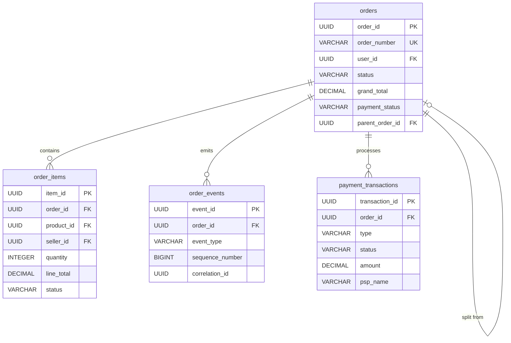
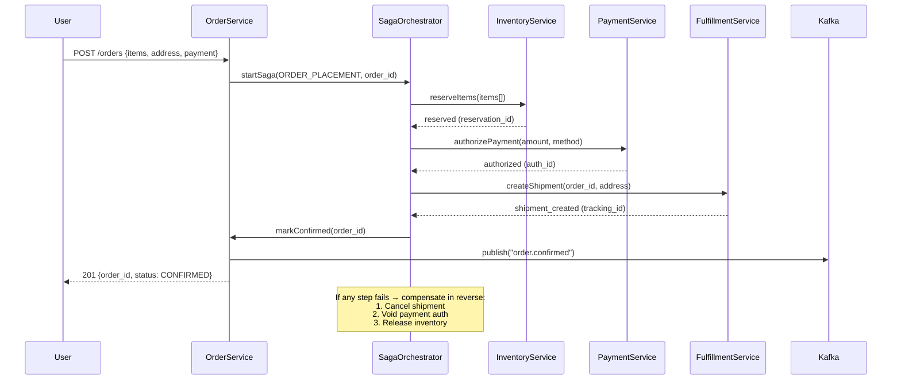
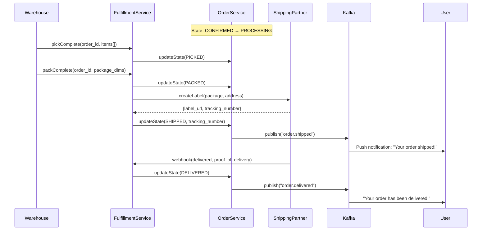
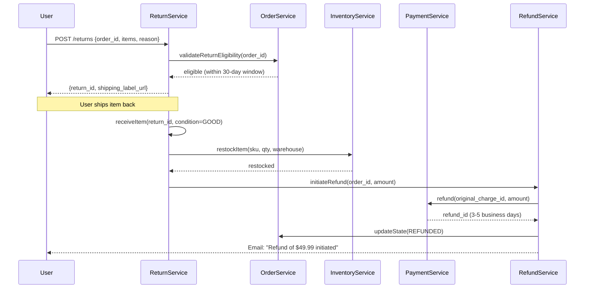

# Order Management System (OMS) - System Design

## 1. Functional Requirements

### Core Features
- **Order Creation**: Convert checkout cart into an order with payment authorization
- **Payment Orchestration**: Multi-PSP support, retry logic, partial payments
- **Order State Machine**: Full lifecycle management (placed → confirmed → picking → shipped → delivered → completed)
- **Split Orders**: Multi-seller/multi-warehouse order splitting and independent tracking
- **Returns & Refunds**: Return initiation, approval workflow, refund processing
- **Order Tracking**: Real-time shipment tracking with carrier integration
- **Notifications**: Email/push/SMS at every state transition
- **Order History**: Searchable history with filtering and reorder capability

### Order State Machine
```
                    ┌─────────────┐
                    │   PLACED    │ ← Order submitted
                    └──────┬──────┘
                           │ Payment authorized
                    ┌──────▼──────┐
              ┌─────│  CONFIRMED  │─────┐
              │     └──────┬──────┘     │
              │            │ Inventory picked │ Payment failed
              │     ┌──────▼──────┐     │
              │     │   PICKING   │     │
              │     └──────┬──────┘     │
              │            │ Handed to carrier  ┌──────▼──────┐
              │     ┌──────▼──────┐     │      │  CANCELLED  │
              │     │   SHIPPED   │     │      └─────────────┘
              │     └──────┬──────┘     │
              │            │ Carrier delivered
              │     ┌──────▼──────┐
              │     │  DELIVERED  │
              │     └──────┬──────┘
              │            │ Return window expired / confirmed
              │     ┌──────▼──────┐
              └────►│  COMPLETED  │
                    └─────────────┘
                           │
                    ┌──────▼──────┐
                    │  RETURNED   │ (partial or full)
                    └─────────────┘
```

## 2. Non-Functional Requirements

| Requirement | Target |
|---|---|
| Order Placement Latency (P99) | < 2s (end-to-end) |
| Order Read Latency (P99) | < 100ms |
| Order Write QPS | 50K |
| Order Read QPS | 200K |
| Availability | 99.99% |
| Data Durability | 99.9999999% (orders are financial records) |
| Payment Processing SLA | < 5s |
| Notification Delivery | < 30s after state change |
| State Consistency | Strong (no lost/duplicate transitions) |
| Idempotency | All mutations idempotent |

## 3. Capacity Estimation

### Storage
- **Orders**: 1B orders/year × 5KB = 5 TB/year
- **Order Items**: 1B orders × 3 items avg × 1KB = 3 TB/year
- **Order Events (Event Source)**: 1B orders × 8 events avg × 500B = 4 TB/year
- **Shipment Tracking**: 1B shipments × 20 updates × 200B = 4 TB/year
- **Total Active (3 years)**: ~50 TB

### Compute
- **Order Service**: 250K QPS total / 5K per instance = 50 instances
- **Payment Orchestrator**: 50K TPS / 2K per instance = 25 instances
- **Notification Service**: 50K orders × 5 notifications = 250K msg/day peak

### Bandwidth
- **Inbound**: 50K orders/sec × 5KB = 250 MB/s (peak during sales)
- **Event Stream**: 50K × 8 events × 500B = 200 MB/s
- **Outbound**: 200K reads/sec × 3KB = 600 MB/s

## 4. Data Modeling

### Entity-Relationship Diagram



### Order Schema (PostgreSQL - Partitioned by created_at month)
```sql
CREATE TABLE orders (
    order_id            UUID PRIMARY KEY DEFAULT gen_random_uuid(),
    order_number        VARCHAR(20) UNIQUE NOT NULL, -- Human-readable: ORD-2024-ABC123
    user_id             UUID NOT NULL,
    
    -- Status
    status              VARCHAR(20) NOT NULL DEFAULT 'PLACED',
    sub_status          VARCHAR(30), -- e.g., 'PAYMENT_PENDING', 'AWAITING_PICKUP'
    
    -- Financial
    currency            VARCHAR(3) NOT NULL,
    subtotal            DECIMAL(12,2) NOT NULL,
    shipping_total      DECIMAL(12,2) DEFAULT 0,
    tax_total           DECIMAL(12,2) DEFAULT 0,
    discount_total      DECIMAL(12,2) DEFAULT 0,
    grand_total         DECIMAL(12,2) NOT NULL,
    
    -- Payment
    payment_method_id   UUID NOT NULL,
    payment_status      VARCHAR(20) DEFAULT 'PENDING', -- PENDING, AUTHORIZED, CAPTURED, FAILED, REFUNDED
    payment_reference   VARCHAR(100),
    
    -- Shipping
    shipping_address    JSONB NOT NULL,
    billing_address     JSONB NOT NULL,
    shipping_method     VARCHAR(50),
    
    -- Split order info
    parent_order_id     UUID REFERENCES orders(order_id), -- NULL if not split
    is_split            BOOLEAN DEFAULT FALSE,
    split_count         INTEGER DEFAULT 1,
    
    -- Tracking
    estimated_delivery  DATE,
    actual_delivery     TIMESTAMP,
    
    -- Metadata
    source              VARCHAR(20), -- WEB, MOBILE_APP, API
    ip_address          INET,
    cart_id             UUID,
    idempotency_key     VARCHAR(64) UNIQUE, -- For duplicate order prevention
    
    -- Timestamps
    placed_at           TIMESTAMP NOT NULL DEFAULT NOW(),
    confirmed_at        TIMESTAMP,
    shipped_at          TIMESTAMP,
    delivered_at        TIMESTAMP,
    completed_at        TIMESTAMP,
    cancelled_at        TIMESTAMP,
    
    created_at          TIMESTAMP DEFAULT NOW(),
    updated_at          TIMESTAMP DEFAULT NOW(),
    version             INTEGER DEFAULT 1
) PARTITION BY RANGE (created_at);

CREATE INDEX idx_orders_user ON orders(user_id, created_at DESC);
CREATE INDEX idx_orders_status ON orders(status, created_at DESC);
CREATE INDEX idx_orders_number ON orders(order_number);
CREATE INDEX idx_orders_parent ON orders(parent_order_id) WHERE parent_order_id IS NOT NULL;
CREATE INDEX idx_orders_payment_status ON orders(payment_status) WHERE payment_status IN ('PENDING', 'AUTHORIZED');
```

### Order Items Schema
```sql
CREATE TABLE order_items (
    item_id             UUID PRIMARY KEY DEFAULT gen_random_uuid(),
    order_id            UUID NOT NULL REFERENCES orders(order_id),
    
    -- Product info (snapshot at time of order - immutable)
    product_id          UUID NOT NULL,
    variant_id          UUID,
    seller_id           UUID NOT NULL,
    sku                 VARCHAR(50) NOT NULL,
    title               VARCHAR(500) NOT NULL,
    image_url           TEXT,
    
    -- Pricing (immutable snapshot)
    quantity            INTEGER NOT NULL CHECK(quantity > 0),
    unit_price          DECIMAL(12,2) NOT NULL,
    discount_amount     DECIMAL(12,2) DEFAULT 0,
    tax_amount          DECIMAL(12,2) DEFAULT 0,
    line_total          DECIMAL(12,2) NOT NULL,
    
    -- Fulfillment
    fulfillment_type    VARCHAR(10) NOT NULL, -- FBA, FBM
    warehouse_id        UUID,
    status              VARCHAR(20) DEFAULT 'PENDING', -- PENDING, PICKING, PACKED, SHIPPED, DELIVERED, RETURNED
    
    -- Tracking per item (for split shipments)
    tracking_number     VARCHAR(100),
    carrier             VARCHAR(50),
    
    -- Return info
    return_eligible     BOOLEAN DEFAULT TRUE,
    return_deadline     DATE,
    returned_quantity   INTEGER DEFAULT 0,
    
    created_at          TIMESTAMP DEFAULT NOW(),
    updated_at          TIMESTAMP DEFAULT NOW()
);

CREATE INDEX idx_order_items_order ON order_items(order_id);
CREATE INDEX idx_order_items_seller ON order_items(seller_id, status);
CREATE INDEX idx_order_items_product ON order_items(product_id);
CREATE INDEX idx_order_items_fulfillment ON order_items(warehouse_id, status) WHERE status = 'PENDING';
```

### Order Events Schema (Event Sourcing)
```sql
CREATE TABLE order_events (
    event_id            UUID PRIMARY KEY DEFAULT gen_random_uuid(),
    order_id            UUID NOT NULL,
    sequence_number     BIGINT NOT NULL,
    
    event_type          VARCHAR(50) NOT NULL,
    -- ORDER_PLACED, PAYMENT_AUTHORIZED, PAYMENT_CAPTURED, PAYMENT_FAILED,
    -- ORDER_CONFIRMED, INVENTORY_RESERVED, ITEMS_PICKING, ITEMS_PACKED,
    -- SHIPMENT_CREATED, SHIPPED, OUT_FOR_DELIVERY, DELIVERED,
    -- RETURN_REQUESTED, RETURN_APPROVED, REFUND_INITIATED, REFUND_COMPLETED,
    -- ORDER_CANCELLED, CANCELLATION_REFUNDED
    
    event_data          JSONB NOT NULL,
    -- Polymorphic: contains event-specific data
    
    -- Actor
    actor_type          VARCHAR(20) NOT NULL, -- SYSTEM, USER, SELLER, ADMIN
    actor_id            UUID,
    
    -- Causation
    caused_by_event_id  UUID REFERENCES order_events(event_id),
    correlation_id      UUID NOT NULL, -- Groups related events across services
    
    created_at          TIMESTAMP DEFAULT NOW(),
    
    UNIQUE(order_id, sequence_number)
) PARTITION BY RANGE (created_at);

CREATE INDEX idx_order_events_order ON order_events(order_id, sequence_number);
CREATE INDEX idx_order_events_type ON order_events(event_type, created_at);
CREATE INDEX idx_order_events_correlation ON order_events(correlation_id);
```

### Payment Transactions Schema
```sql
CREATE TABLE payment_transactions (
    transaction_id      UUID PRIMARY KEY DEFAULT gen_random_uuid(),
    order_id            UUID NOT NULL REFERENCES orders(order_id),
    
    -- Transaction details
    type                VARCHAR(20) NOT NULL, -- AUTHORIZATION, CAPTURE, REFUND, VOID
    status              VARCHAR(20) NOT NULL, -- PENDING, SUCCESS, FAILED, TIMEOUT
    
    amount              DECIMAL(12,2) NOT NULL,
    currency            VARCHAR(3) NOT NULL,
    
    -- PSP info
    psp_name            VARCHAR(50) NOT NULL, -- STRIPE, ADYEN, PAYPAL
    psp_transaction_id  VARCHAR(200),
    psp_response_code   VARCHAR(20),
    psp_response_data   JSONB,
    
    -- Payment method
    payment_method_type VARCHAR(20), -- CARD, WALLET, BANK_TRANSFER
    payment_method_last4 VARCHAR(4),
    
    -- Retry tracking
    attempt_number      INTEGER DEFAULT 1,
    idempotency_key     VARCHAR(100) UNIQUE,
    
    -- Timing
    initiated_at        TIMESTAMP DEFAULT NOW(),
    completed_at        TIMESTAMP,
    
    created_at          TIMESTAMP DEFAULT NOW()
);

CREATE INDEX idx_payment_order ON payment_transactions(order_id, type);
CREATE INDEX idx_payment_status ON payment_transactions(status, type) WHERE status = 'PENDING';
CREATE INDEX idx_payment_psp ON payment_transactions(psp_name, psp_transaction_id);
```

### Return & Refund Schema
```sql
CREATE TABLE returns (
    return_id           UUID PRIMARY KEY DEFAULT gen_random_uuid(),
    order_id            UUID NOT NULL REFERENCES orders(order_id),
    user_id             UUID NOT NULL,
    
    status              VARCHAR(20) DEFAULT 'REQUESTED',
    -- REQUESTED, APPROVED, LABEL_GENERATED, SHIPPED_BACK, RECEIVED, INSPECTED, 
    -- REFUNDED, REJECTED, CLOSED
    
    return_reason       VARCHAR(50) NOT NULL,
    return_notes        TEXT,
    
    -- Items being returned
    items               JSONB NOT NULL,
    -- [{"item_id": "...", "quantity": 1, "reason": "DEFECTIVE"}]
    
    -- Refund
    refund_amount       DECIMAL(12,2),
    refund_method       VARCHAR(20), -- ORIGINAL_PAYMENT, STORE_CREDIT
    refund_status       VARCHAR(20), -- PENDING, PROCESSED, FAILED
    
    -- Shipping
    return_label_url    TEXT,
    return_tracking     VARCHAR(100),
    return_carrier      VARCHAR(50),
    
    -- Dates
    requested_at        TIMESTAMP DEFAULT NOW(),
    approved_at         TIMESTAMP,
    received_at         TIMESTAMP,
    refunded_at         TIMESTAMP,
    
    created_at          TIMESTAMP DEFAULT NOW(),
    updated_at          TIMESTAMP DEFAULT NOW()
);

CREATE INDEX idx_returns_order ON returns(order_id);
CREATE INDEX idx_returns_user ON returns(user_id, created_at DESC);
CREATE INDEX idx_returns_status ON returns(status, created_at);
```

## 5. High-Level Design (HLD)

```
┌──────────────────────────────────────────────────────────────────────────────────────┐
│                                  CLIENT LAYER                                         │
│  ┌──────────┐  ┌──────────┐  ┌───────────┐  ┌──────────────┐  ┌───────────────┐    │
│  │  Buyer   │  │  Seller  │  │  Admin    │  │  Warehouse   │  │ Carrier API   │    │
│  │  App     │  │  Portal  │  │  Panel    │  │  System      │  │ (Webhooks)    │    │
│  └────┬─────┘  └────┬─────┘  └─────┬─────┘  └──────┬───────┘  └───────┬───────┘    │
└───────┼──────────────┼──────────────┼────────────────┼──────────────────┼────────────┘
        │              │              │                │                  │
┌───────▼──────────────▼──────────────▼────────────────▼──────────────────▼────────────┐
│                           API Gateway + Load Balancer                                  │
└──────────────────────────────────┬───────────────────────────────────────────────────┘
                                   │
┌──────────────────────────────────┼───────────────────────────────────────────────────┐
│                                  ▼              SERVICE LAYER                          │
│                                                                                       │
│  ┌─────────────────────────┐  ┌──────────────────────────┐  ┌────────────────────┐  │
│  │   Order Orchestrator    │  │   Payment Orchestrator   │  │  Notification Svc  │  │
│  │   (Saga Coordinator)    │  │   (Multi-PSP Router)     │  │  (Email/Push/SMS)  │  │
│  │                         │  │                          │  │                    │  │
│  │  - Coordinates saga     │  │  - PSP selection         │  │  - Template engine │  │
│  │  - Handles compensation │  │  - Auth/Capture/Refund   │  │  - Channel routing │  │
│  │  - Timeout management   │  │  - Retry with backoff    │  │  - Delivery tracking│  │
│  └───────────┬─────────────┘  └────────────┬─────────────┘  └─────────┬──────────┘  │
│              │                              │                           │              │
│  ┌───────────▼─────────────┐  ┌────────────▼─────────────┐  ┌────────▼───────────┐  │
│  │   Order Core Service    │  │   Inventory Service      │  │  Fulfillment Svc   │  │
│  │                         │  │                          │  │                    │  │
│  │  - CRUD operations      │  │  - Reserve/Release       │  │  - Warehouse route │  │
│  │  - State transitions    │  │  - Stock management      │  │  - Pick/Pack/Ship  │  │
│  │  - Event sourcing       │  │  - Oversell protection   │  │  - Label generation│  │
│  └───────────┬─────────────┘  └──────────────────────────┘  └────────────────────┘  │
│              │                                                                         │
│  ┌───────────▼─────────────┐  ┌──────────────────────────┐  ┌────────────────────┐  │
│  │   Split Order Service   │  │   Return & Refund Svc    │  │  Tracking Service  │  │
│  │                         │  │                          │  │                    │  │
│  │  - Multi-seller split   │  │  - Return workflow       │  │  - Carrier polling │  │
│  │  - Warehouse routing    │  │  - Refund calculation    │  │  - Status mapping  │  │
│  │  - Optimization algo    │  │  - Store credit          │  │  - Push updates    │  │
│  └─────────────────────────┘  └──────────────────────────┘  └────────────────────┘  │
└───────────────────────────────────────────────────────────────────────────────────────┘
                                   │
┌──────────────────────────────────┼───────────────────────────────────────────────────┐
│                                  ▼              DATA LAYER                             │
│                                                                                       │
│  ┌───────────────┐  ┌───────────────┐  ┌───────────────┐  ┌─────────────────────┐   │
│  │ PostgreSQL    │  │ Apache Kafka  │  │ Redis Cluster │  │ Elasticsearch       │   │
│  │ (Orders +    │  │ (Event Bus +  │  │ (Order Cache +│  │ (Order Search)      │   │
│  │  Events +    │  │  Saga State)  │  │  Idempotency) │  │                     │   │
│  │  Payments)   │  │               │  │               │  │                     │   │
│  └───────────────┘  └───────────────┘  └───────────────┘  └─────────────────────┘   │
│                                                                                       │
│  ┌───────────────┐  ┌───────────────┐                                                │
│  │ Apache Flink  │  │ S3            │                                                │
│  │ (Projections +│  │ (Invoices +   │                                                │
│  │  Analytics)   │  │  Documents)   │                                                │
│  └───────────────┘  └───────────────┘                                                │
└───────────────────────────────────────────────────────────────────────────────────────┘
```

## 6. Low-Level Design (LLD) - APIs

### Place Order
```
POST /api/v1/orders
Headers:
  Authorization: Bearer <token>
  Idempotency-Key: idem_abc123xyz

Request:
{
    "cart_id": "cart_uuid_001",
    "payment": {
        "method_id": "pm_visa_4242",
        "billing_address": {
            "name": "John Doe",
            "line1": "123 Main St",
            "city": "Seattle",
            "state": "WA",
            "zip": "98101",
            "country": "US"
        }
    },
    "shipping": {
        "address": {
            "name": "John Doe",
            "line1": "123 Main St",
            "city": "Seattle",
            "state": "WA",
            "zip": "98101",
            "country": "US"
        },
        "method": "STANDARD" // STANDARD, EXPRESS, SAME_DAY
    },
    "applied_coupons": ["SAVE10"],
    "gift_options": {
        "is_gift": false
    },
    "metadata": {
        "source": "WEB",
        "session_id": "sess_xyz789"
    }
}

Response (202 Accepted):
{
    "order_id": "ord_uuid_001",
    "order_number": "ORD-2024-7F3A9B",
    "status": "PLACED",
    "payment_status": "PENDING",
    "items": [
        {
            "item_id": "item_001",
            "title": "Sony WH-1000XM5",
            "quantity": 2,
            "unit_price": 278.00,
            "line_total": 556.00,
            "seller": "Amazon.com",
            "estimated_delivery": "2024-01-18"
        }
    ],
    "totals": {
        "subtotal": 568.99,
        "shipping": 0.00,
        "tax": 45.52,
        "discount": -55.60,
        "grand_total": 558.91
    },
    "tracking_url": "https://orders.example.com/track/ORD-2024-7F3A9B",
    "created_at": "2024-01-14T16:00:00Z"
}
```

### Get Order Details
```
GET /api/v1/orders/{order_id}

Response:
{
    "order_id": "ord_uuid_001",
    "order_number": "ORD-2024-7F3A9B",
    "status": "SHIPPED",
    "sub_status": "IN_TRANSIT",
    "user_id": "usr_abc123",
    "items": [...],
    "totals": {...},
    "payment": {
        "method": "Visa ending 4242",
        "status": "CAPTURED",
        "captured_at": "2024-01-14T16:02:00Z"
    },
    "shipping": {
        "address": {...},
        "method": "STANDARD",
        "carrier": "UPS",
        "tracking_number": "1Z999AA10123456784",
        "tracking_url": "https://ups.com/track/1Z999AA10123456784",
        "estimated_delivery": "2024-01-18",
        "shipped_at": "2024-01-15T09:00:00Z"
    },
    "timeline": [
        {"event": "Order Placed", "timestamp": "2024-01-14T16:00:00Z", "status": "PLACED"},
        {"event": "Payment Confirmed", "timestamp": "2024-01-14T16:02:00Z", "status": "CONFIRMED"},
        {"event": "Shipped", "timestamp": "2024-01-15T09:00:00Z", "status": "SHIPPED", "details": "UPS tracking: 1Z999..."}
    ],
    "split_orders": null,
    "return_eligible": true,
    "return_deadline": "2024-02-17"
}
```

### Cancel Order
```
POST /api/v1/orders/{order_id}/cancel
Request:
{
    "reason": "CHANGED_MIND",
    "items": null  // null = cancel all, or list specific item_ids for partial
}

Response:
{
    "order_id": "ord_uuid_001",
    "cancellation_status": "PROCESSING",
    "refund": {
        "amount": 558.91,
        "method": "ORIGINAL_PAYMENT",
        "estimated_days": "3-5 business days"
    }
}
```

## 7. Deep Dives

### Deep Dive 1: Distributed Saga for Order Placement

**Saga Steps**:
```
1. Validate Cart → 2. Reserve Inventory → 3. Authorize Payment → 4. Confirm Order
                         ↓ (on failure)         ↓ (on failure)
                   Release Inventory      Release Inventory + Void Payment
```

**Implementation (Orchestrator Pattern)**:
```python
import asyncio
from enum import Enum
from dataclasses import dataclass, field
from typing import Optional
import uuid
import json

class SagaStep(Enum):
    VALIDATE_CART = "VALIDATE_CART"
    RESERVE_INVENTORY = "RESERVE_INVENTORY"
    AUTHORIZE_PAYMENT = "AUTHORIZE_PAYMENT"
    CONFIRM_ORDER = "CONFIRM_ORDER"

class SagaStatus(Enum):
    RUNNING = "RUNNING"
    COMPLETED = "COMPLETED"
    COMPENSATING = "COMPENSATING"
    FAILED = "FAILED"

@dataclass
class SagaState:
    saga_id: str
    order_id: str
    status: SagaStatus = SagaStatus.RUNNING
    current_step: Optional[SagaStep] = None
    completed_steps: list = field(default_factory=list)
    compensation_data: dict = field(default_factory=dict)
    error: Optional[str] = None
    started_at: str = ""
    
class OrderPlacementSaga:
    """
    Orchestrates the order placement saga with compensation on failure.
    State is persisted to Kafka for crash recovery.
    """
    
    STEP_TIMEOUT = 10  # seconds per step
    SAGA_TIMEOUT = 30  # total saga timeout
    
    def __init__(self):
        self.inventory_service = InventoryServiceClient()
        self.payment_service = PaymentServiceClient()
        self.order_service = OrderServiceClient()
        self.kafka_producer = KafkaProducer()
    
    async def execute(self, order_request: dict) -> dict:
        """Execute the full order placement saga."""
        saga_id = str(uuid.uuid4())
        order_id = str(uuid.uuid4())
        
        state = SagaState(
            saga_id=saga_id,
            order_id=order_id,
            started_at=datetime.utcnow().isoformat()
        )
        
        try:
            # Step 1: Validate cart and create pending order
            state.current_step = SagaStep.VALIDATE_CART
            await self._persist_state(state)
            
            order = await asyncio.wait_for(
                self.order_service.create_pending_order(order_id, order_request),
                timeout=self.STEP_TIMEOUT
            )
            state.completed_steps.append(SagaStep.VALIDATE_CART)
            
            # Step 2: Reserve inventory
            state.current_step = SagaStep.RESERVE_INVENTORY
            await self._persist_state(state)
            
            reservation = await asyncio.wait_for(
                self.inventory_service.reserve(
                    items=order['items'],
                    reservation_id=f"saga:{saga_id}",
                    ttl_seconds=300  # 5 min hold
                ),
                timeout=self.STEP_TIMEOUT
            )
            state.completed_steps.append(SagaStep.RESERVE_INVENTORY)
            state.compensation_data['reservation_id'] = reservation['reservation_id']
            
            # Step 3: Authorize payment
            state.current_step = SagaStep.AUTHORIZE_PAYMENT
            await self._persist_state(state)
            
            payment = await asyncio.wait_for(
                self.payment_service.authorize(
                    order_id=order_id,
                    amount=order['grand_total'],
                    currency=order['currency'],
                    payment_method_id=order_request['payment']['method_id'],
                    idempotency_key=f"auth:{saga_id}"
                ),
                timeout=self.STEP_TIMEOUT
            )
            
            if payment['status'] != 'AUTHORIZED':
                raise PaymentFailedError(payment.get('decline_reason', 'Unknown'))
            
            state.completed_steps.append(SagaStep.AUTHORIZE_PAYMENT)
            state.compensation_data['payment_auth_id'] = payment['authorization_id']
            
            # Step 4: Confirm order (convert reservation to hard hold)
            state.current_step = SagaStep.CONFIRM_ORDER
            await self._persist_state(state)
            
            await self.order_service.confirm_order(order_id, {
                'payment_reference': payment['authorization_id'],
                'reservation_id': reservation['reservation_id']
            })
            await self.inventory_service.convert_to_hard_hold(
                reservation['reservation_id']
            )
            
            state.completed_steps.append(SagaStep.CONFIRM_ORDER)
            state.status = SagaStatus.COMPLETED
            await self._persist_state(state)
            
            # Emit success event
            await self._emit_event('ORDER_CONFIRMED', {
                'order_id': order_id,
                'saga_id': saga_id
            })
            
            return {'order_id': order_id, 'status': 'CONFIRMED'}
            
        except Exception as e:
            state.status = SagaStatus.COMPENSATING
            state.error = str(e)
            await self._persist_state(state)
            
            # Execute compensating transactions in reverse
            await self._compensate(state)
            
            state.status = SagaStatus.FAILED
            await self._persist_state(state)
            
            raise OrderPlacementFailed(str(e), saga_id=saga_id)
    
    async def _compensate(self, state: SagaState):
        """Execute compensating transactions for completed steps (reverse order)."""
        for step in reversed(state.completed_steps):
            try:
                if step == SagaStep.AUTHORIZE_PAYMENT:
                    auth_id = state.compensation_data.get('payment_auth_id')
                    if auth_id:
                        await self.payment_service.void_authorization(auth_id)
                
                elif step == SagaStep.RESERVE_INVENTORY:
                    res_id = state.compensation_data.get('reservation_id')
                    if res_id:
                        await self.inventory_service.release_reservation(res_id)
                
                elif step == SagaStep.VALIDATE_CART:
                    await self.order_service.mark_order_failed(
                        state.order_id, state.error
                    )
                    
            except Exception as comp_error:
                # Compensation failed - log for manual intervention
                logger.critical(
                    f"Saga {state.saga_id} compensation failed at {step}: {comp_error}"
                )
                await self._alert_ops_team(state, step, comp_error)
    
    async def _persist_state(self, state: SagaState):
        """Persist saga state to Kafka for crash recovery."""
        self.kafka_producer.produce(
            topic='order.saga.state',
            key=state.saga_id.encode(),
            value=json.dumps(asdict(state), default=str).encode()
        )
    
    async def _emit_event(self, event_type: str, data: dict):
        self.kafka_producer.produce(
            topic='order.events',
            key=data['order_id'].encode(),
            value=json.dumps({'type': event_type, **data}).encode()
        )
```

**Saga Recovery (On Service Restart)**:
```python
class SagaRecoveryWorker:
    """Recovers in-flight sagas after crash/restart."""
    
    async def recover_pending_sagas(self):
        """Read saga state topic and resume/compensate incomplete sagas."""
        consumer = KafkaConsumer('order.saga.state', group_id='saga-recovery')
        
        # Build state from compacted topic
        pending_sagas = {}
        for msg in consumer.poll_all():
            state = SagaState(**json.loads(msg.value))
            if state.status in (SagaStatus.RUNNING, SagaStatus.COMPENSATING):
                pending_sagas[state.saga_id] = state
        
        for saga_id, state in pending_sagas.items():
            age = (datetime.utcnow() - parse(state.started_at)).total_seconds()
            
            if age > self.SAGA_TIMEOUT:
                # Timed out - compensate
                logger.warning(f"Recovering timed-out saga: {saga_id}")
                await self._compensate(state)
            elif state.status == SagaStatus.COMPENSATING:
                # Was already compensating - retry
                await self._compensate(state)
```

### Deep Dive 2: Event-Sourced Order State Machine

```python
from typing import List
from abc import ABC, abstractmethod

class OrderEvent(ABC):
    """Base class for all order events."""
    def __init__(self, order_id: str, timestamp: str, actor_id: str):
        self.event_id = str(uuid.uuid4())
        self.order_id = order_id
        self.timestamp = timestamp
        self.actor_id = actor_id

class OrderPlaced(OrderEvent):
    def __init__(self, order_id, timestamp, actor_id, items, totals, shipping):
        super().__init__(order_id, timestamp, actor_id)
        self.items = items
        self.totals = totals
        self.shipping = shipping

class PaymentAuthorized(OrderEvent):
    def __init__(self, order_id, timestamp, actor_id, payment_ref, amount):
        super().__init__(order_id, timestamp, actor_id)
        self.payment_ref = payment_ref
        self.amount = amount

class OrderConfirmed(OrderEvent): pass
class ItemsPicked(OrderEvent): pass
class OrderShipped(OrderEvent):
    def __init__(self, order_id, timestamp, actor_id, tracking_number, carrier):
        super().__init__(order_id, timestamp, actor_id)
        self.tracking_number = tracking_number
        self.carrier = carrier

class OrderDelivered(OrderEvent): pass
class OrderCancelled(OrderEvent):
    def __init__(self, order_id, timestamp, actor_id, reason):
        super().__init__(order_id, timestamp, actor_id)
        self.reason = reason


class OrderAggregate:
    """Event-sourced order aggregate."""
    
    VALID_TRANSITIONS = {
        'PLACED': ['CONFIRMED', 'CANCELLED'],
        'CONFIRMED': ['PICKING', 'CANCELLED'],
        'PICKING': ['SHIPPED', 'CANCELLED'],
        'SHIPPED': ['DELIVERED'],
        'DELIVERED': ['COMPLETED', 'RETURN_REQUESTED'],
        'COMPLETED': [],
        'CANCELLED': [],
    }
    
    def __init__(self, order_id: str):
        self.order_id = order_id
        self.status = None
        self.items = []
        self.totals = {}
        self.version = 0
        self.events: List[OrderEvent] = []
    
    def apply(self, event: OrderEvent):
        """Apply event to aggregate state."""
        handler = getattr(self, f'_apply_{type(event).__name__}', None)
        if handler:
            handler(event)
        self.version += 1
        self.events.append(event)
    
    def _apply_OrderPlaced(self, event: OrderPlaced):
        self.status = 'PLACED'
        self.items = event.items
        self.totals = event.totals
    
    def _apply_OrderConfirmed(self, event):
        self._validate_transition('CONFIRMED')
        self.status = 'CONFIRMED'
    
    def _apply_OrderShipped(self, event: OrderShipped):
        self._validate_transition('SHIPPED')
        self.status = 'SHIPPED'
        self.tracking_number = event.tracking_number
        self.carrier = event.carrier
    
    def _apply_OrderDelivered(self, event):
        self._validate_transition('DELIVERED')
        self.status = 'DELIVERED'
    
    def _apply_OrderCancelled(self, event: OrderCancelled):
        self._validate_transition('CANCELLED')
        self.status = 'CANCELLED'
        self.cancellation_reason = event.reason
    
    def _validate_transition(self, target_status: str):
        valid = self.VALID_TRANSITIONS.get(self.status, [])
        if target_status not in valid:
            raise InvalidStateTransitionError(
                f"Cannot transition from {self.status} to {target_status}"
            )
    
    @classmethod
    def load_from_events(cls, order_id: str, events: List[OrderEvent]):
        """Reconstitute aggregate from event history."""
        aggregate = cls(order_id)
        for event in events:
            aggregate.apply(event)
        return aggregate


class OrderProjection:
    """Builds read-optimized views from order events."""
    
    def __init__(self):
        self.db = PostgresClient()
        self.cache = RedisClient()
        self.search = ElasticsearchClient()
    
    async def process_event(self, event: OrderEvent):
        """Update all projections when an event occurs."""
        
        # 1. Update main orders table (materialized view)
        await self._update_order_table(event)
        
        # 2. Update cache
        await self._invalidate_cache(event.order_id)
        
        # 3. Update search index
        await self._update_search_index(event)
        
        # 4. Update analytics
        await self._emit_analytics(event)
    
    async def _update_order_table(self, event: OrderEvent):
        """Maintain the orders table as a projection of events."""
        if isinstance(event, OrderPlaced):
            await self.db.execute("""
                INSERT INTO orders (order_id, user_id, status, grand_total, placed_at)
                VALUES (:oid, :uid, 'PLACED', :total, :ts)
            """, oid=event.order_id, uid=event.actor_id, 
                total=event.totals['grand_total'], ts=event.timestamp)
        
        elif isinstance(event, OrderShipped):
            await self.db.execute("""
                UPDATE orders SET status = 'SHIPPED', shipped_at = :ts,
                    updated_at = NOW(), version = version + 1
                WHERE order_id = :oid
            """, oid=event.order_id, ts=event.timestamp)
```

### Deep Dive 3: Split Order Routing (Optimal Warehouse Selection)

```python
from dataclasses import dataclass
from typing import List, Dict, Tuple
import heapq

@dataclass
class Warehouse:
    warehouse_id: str
    location: Tuple[float, float]  # lat, lng
    available_stock: Dict[str, int]  # product_id → quantity
    current_load: float  # 0.0 to 1.0 (capacity utilization)
    shipping_speed: Dict[str, int]  # zone → days

@dataclass
class OrderItem:
    product_id: str
    quantity: int
    seller_id: str

class SplitOrderRouter:
    """
    Determines optimal warehouse assignment for order items.
    Objectives (weighted):
    1. Minimize delivery time (40%)
    2. Minimize shipping cost (30%)  
    3. Minimize number of shipments/packages (20%)
    4. Balance warehouse load (10%)
    """
    
    WEIGHT_DELIVERY_TIME = 0.4
    WEIGHT_SHIPPING_COST = 0.3
    WEIGHT_PACKAGE_COUNT = 0.2
    WEIGHT_LOAD_BALANCE = 0.1
    
    def route_order(self, items: List[OrderItem], 
                    destination: Tuple[float, float],
                    warehouses: List[Warehouse]) -> Dict[str, List[OrderItem]]:
        """
        Assign items to warehouses optimally.
        Returns: {warehouse_id: [items]}
        """
        
        # First: find warehouses that CAN fulfill each item
        item_warehouse_options = {}
        for item in items:
            eligible = [
                w for w in warehouses
                if w.available_stock.get(item.product_id, 0) >= item.quantity
                and w.current_load < 0.95  # Don't use overloaded warehouses
            ]
            if not eligible:
                raise InsufficientInventoryError(item.product_id)
            item_warehouse_options[item.product_id] = eligible
        
        # Try single-warehouse fulfillment first (minimize splits)
        single_wh = self._try_single_warehouse(items, warehouses, destination)
        if single_wh:
            return single_wh
        
        # Multi-warehouse: use greedy optimization
        return self._optimize_split(items, item_warehouse_options, destination)
    
    def _try_single_warehouse(self, items, warehouses, destination):
        """Check if any single warehouse can fulfill entire order."""
        candidates = []
        
        for wh in warehouses:
            can_fulfill_all = all(
                wh.available_stock.get(item.product_id, 0) >= item.quantity
                for item in items
            )
            if can_fulfill_all:
                score = self._score_warehouse(wh, destination, len(items))
                candidates.append((score, wh))
        
        if candidates:
            best = min(candidates, key=lambda x: x[0])
            return {best[1].warehouse_id: items}
        return None
    
    def _optimize_split(self, items, options, destination):
        """Greedy assignment minimizing total cost."""
        assignment = {}  # warehouse_id → [items]
        
        # Sort items by number of eligible warehouses (most constrained first)
        sorted_items = sorted(items, key=lambda i: len(options[i.product_id]))
        
        for item in sorted_items:
            eligible = options[item.product_id]
            
            # Score each warehouse for this item
            best_wh = min(eligible, key=lambda wh: self._item_assignment_cost(
                wh, item, destination, assignment
            ))
            
            if best_wh.warehouse_id not in assignment:
                assignment[best_wh.warehouse_id] = []
            assignment[best_wh.warehouse_id].append(item)
        
        return assignment
    
    def _item_assignment_cost(self, warehouse, item, destination, current_assignment):
        """Cost of assigning this item to this warehouse."""
        distance = self._haversine(warehouse.location, destination)
        delivery_days = self._estimate_delivery(distance)
        shipping_cost = self._estimate_shipping_cost(distance, item)
        
        # Bonus for co-locating with existing items (fewer packages)
        co_location_bonus = -0.5 if warehouse.warehouse_id in current_assignment else 0
        
        # Load penalty
        load_penalty = warehouse.current_load * 2
        
        return (
            self.WEIGHT_DELIVERY_TIME * delivery_days +
            self.WEIGHT_SHIPPING_COST * shipping_cost +
            self.WEIGHT_PACKAGE_COUNT * co_location_bonus +
            self.WEIGHT_LOAD_BALANCE * load_penalty
        )
    
    def _haversine(self, p1, p2):
        """Calculate distance between two lat/lng points in km."""
        from math import radians, cos, sin, asin, sqrt
        lat1, lon1 = map(radians, p1)
        lat2, lon2 = map(radians, p2)
        dlat = lat2 - lat1
        dlon = lon2 - lon1
        a = sin(dlat/2)**2 + cos(lat1) * cos(lat2) * sin(dlon/2)**2
        return 2 * 6371 * asin(sqrt(a))
```

## 8. Component Optimization

### Order Read Path Optimization
```python
# Multi-layer caching for order reads
class OrderReadService:
    CACHE_TTL_ACTIVE = 60    # Active orders: 1 min (status changes)
    CACHE_TTL_COMPLETED = 3600  # Completed orders: 1 hour (stable)
    
    async def get_order(self, order_id: str) -> dict:
        # L1: Redis cache
        cached = await self.redis.get(f"order:{order_id}")
        if cached:
            return json.loads(cached)
        
        # L2: Database read replica
        order = await self.db_replica.fetch_order(order_id)
        
        # Cache with appropriate TTL
        ttl = self.CACHE_TTL_COMPLETED if order['status'] in ('COMPLETED', 'CANCELLED') \
              else self.CACHE_TTL_ACTIVE
        await self.redis.setex(f"order:{order_id}", ttl, json.dumps(order))
        
        return order
```

### Kafka Configuration
```yaml
# Order events topic
topics:
  order.events:
    partitions: 64
    replication_factor: 3
    retention_ms: 2592000000  # 30 days
    min_insync_replicas: 2
    compression_type: lz4
    # Partition by order_id for per-order ordering
    
  order.saga.state:
    partitions: 32
    replication_factor: 3
    cleanup_policy: compact  # Keep latest state per saga
    min_insync_replicas: 2
    
  order.notifications:
    partitions: 16
    replication_factor: 3
    retention_ms: 86400000  # 1 day
```

### Idempotency Layer
```python
class IdempotencyMiddleware:
    """Prevents duplicate order creation."""
    
    async def check_and_lock(self, idempotency_key: str, ttl: int = 86400) -> Optional[dict]:
        """
        Returns cached response if key exists, otherwise locks for processing.
        Uses Redis SET NX with TTL.
        """
        # Try to set lock
        locked = await self.redis.set(
            f"idem:{idempotency_key}",
            json.dumps({'status': 'PROCESSING', 'locked_at': time.time()}),
            nx=True,
            ex=ttl
        )
        
        if locked:
            return None  # First time - proceed with processing
        
        # Key exists - check if completed
        existing = await self.redis.get(f"idem:{idempotency_key}")
        data = json.loads(existing)
        
        if data['status'] == 'COMPLETED':
            return data['response']  # Return cached response
        
        if data['status'] == 'PROCESSING':
            # Another request is processing - wait briefly
            await asyncio.sleep(1)
            return await self.check_and_lock(idempotency_key, ttl)
        
        return None
    
    async def store_result(self, idempotency_key: str, response: dict):
        """Store completed response for idempotency."""
        await self.redis.set(
            f"idem:{idempotency_key}",
            json.dumps({'status': 'COMPLETED', 'response': response}),
            ex=86400
        )
```

## 9. Observability

### Key Metrics
```yaml
metrics:
  # Order lifecycle
  - name: order_placed_total
    type: counter
    labels: [source, payment_method, shipping_method]
  
  - name: order_state_transitions_total
    type: counter
    labels: [from_status, to_status]
  
  - name: order_placement_duration_seconds
    type: histogram
    buckets: [0.5, 1, 2, 5, 10, 30]
  
  # Saga health
  - name: saga_step_duration_seconds
    type: histogram
    labels: [step]
    buckets: [0.1, 0.5, 1, 2, 5, 10]
  
  - name: saga_failures_total
    type: counter
    labels: [failed_step, error_type]
  
  - name: saga_compensations_total
    type: counter
    labels: [step]
  
  # Payment
  - name: payment_authorization_duration_seconds
    type: histogram
    labels: [psp, payment_method]
  
  - name: payment_failures_total
    type: counter
    labels: [psp, failure_reason]
  
  # Split orders
  - name: order_split_count
    type: histogram
    labels: [reason]  # multi_seller, multi_warehouse
    buckets: [1, 2, 3, 4, 5]
  
  # Fulfillment
  - name: time_to_ship_hours
    type: histogram
    buckets: [2, 4, 8, 12, 24, 48, 72]
  
  - name: delivery_sla_breaches_total
    type: counter
    labels: [carrier, shipping_method]
```

### Alerting
```yaml
alerts:
  - name: SagaFailureRateHigh
    expr: rate(saga_failures_total[5m]) / rate(order_placed_total[5m]) > 0.05
    for: 3m
    severity: critical
    
  - name: PaymentAuthorizationSlow
    expr: histogram_quantile(0.99, payment_authorization_duration_seconds) > 8
    for: 5m
    severity: warning
    
  - name: OrderStuckInState
    expr: count(orders_in_state{status="CONFIRMED"} > 3600) > 100
    for: 10m
    severity: warning
    annotation: "Orders stuck in CONFIRMED for >1hr (not progressing to PICKING)"
```

## 10. Failure Scenarios & Considerations

### Payment Service Down
- **Detection**: Circuit breaker trips after 5 consecutive failures
- **Handling**: Queue order, return "PAYMENT_PENDING" status, retry asynchronously
- **User Impact**: "Order placed, payment processing" - order confirmed once payment succeeds
- **Timeout**: If not resolved in 30 min, notify user and release inventory hold

### Split Between Payment Auth and Capture
- **Problem**: Payment authorized but order service crashes before confirming
- **Solution**: Saga recovery worker detects orphaned authorizations, voids after timeout
- **Prevention**: Idempotency keys ensure retry doesn't double-charge

### Inventory Oversell
- **Problem**: Concurrent reservations exceed actual stock
- **Prevention**: Redis atomic decrement with Lua script (check-and-decrement)
- **Handling**: If detected post-order, notify user immediately with options (wait for restock / cancel / substitute)

### Event Store Ordering
- **Problem**: Events arrive out of order due to network partitions
- **Solution**: Sequence numbers per aggregate, reject out-of-order events, buffer and replay

## 11. Technology Choices

| Component | Technology | Rationale |
|---|---|---|
| Order DB | PostgreSQL (partitioned) | ACID for financial data, event sourcing |
| Cache | Redis Cluster | Low-latency order lookups, idempotency |
| Event Bus | Apache Kafka | Durable, ordered events, saga state |
| Stream Processing | Apache Flink | Event projections, analytics |
| Search | Elasticsearch | Order history search and filtering |
| Object Storage | S3 | Invoices, shipping labels |
| Payment Gateway | Multi-PSP (Stripe/Adyen) | Redundancy, routing optimization |
| Notifications | SQS + Lambda | Async, scalable notification delivery |
| Monitoring | Datadog | APM + distributed tracing for sagas |

---

## 12. Sequence Diagrams

### 12.1 Place Order Saga



### 12.2 Order Fulfillment State Machine



### 12.3 Return & Refund Flow


