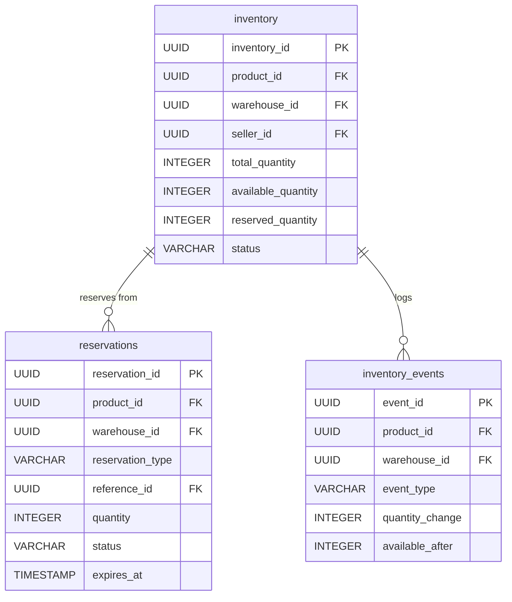
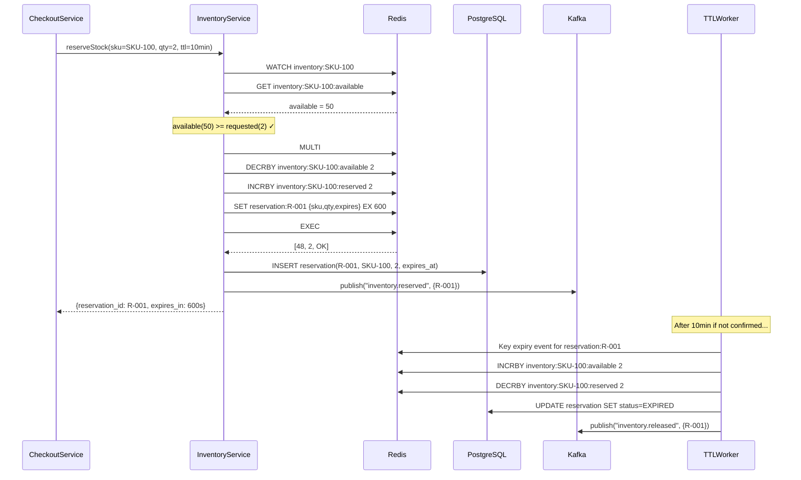
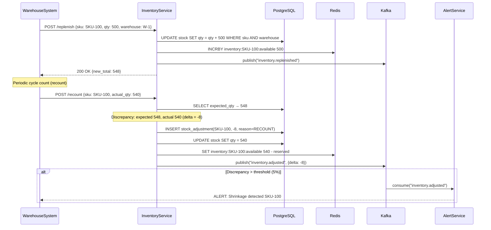

# Inventory Reservation System - System Design

## 1. Functional Requirements

### Core Features
- **Real-Time Stock Tracking**: Track available, reserved, and committed quantities per product per warehouse
- **Soft Reservation (Cart Hold)**: Temporary inventory hold with TTL when item enters checkout
- **Hard Reservation (Payment Confirmed)**: Permanent hold after payment, released only by shipment or cancellation
- **Multi-Warehouse Inventory**: Aggregate view across multiple fulfillment centers
- **Oversell Protection**: Atomic operations to prevent selling more than available stock
- **Stock Replenishment Alerts**: Notify when stock drops below thresholds
- **Batch Updates**: Process bulk inventory updates from Warehouse Management Systems (WMS)

### Inventory States
```
Total Stock (Physical)
├── Available = Total - Reserved - Committed - Damaged
├── Soft Reserved (TTL-based, cart/checkout holds)
├── Hard Reserved / Committed (payment confirmed, awaiting pick)
├── In-Transit (between warehouses)
└── Damaged / Quarantined
```

## 2. Non-Functional Requirements

| Requirement | Target |
|---|---|
| Stock Check Latency (P99) | < 10ms |
| Reservation Latency (P99) | < 50ms |
| Write QPS (reservations) | 100K |
| Read QPS (availability checks) | 1M |
| Availability | 99.99% |
| Consistency (same product) | Linearizable for writes |
| Consistency (global view) | Eventually consistent (< 5s) |
| Oversell Rate | < 0.01% |
| Reservation TTL Accuracy | ± 1 second |
| Batch Update Throughput | 1M records/min |

## 3. Capacity Estimation

### Storage
- **Product-Warehouse Inventory**: 100M products × 5 warehouses avg × 100B = 50 GB
- **Reservation Records**: 10M active reservations × 200B = 2 GB
- **Inventory Events**: 50M events/day × 200B = 10 GB/day
- **Historical (1 year)**: ~4 TB
- **Redis (Hot Data)**: 100M products × 200B = 20 GB + 10M reservations × 200B = 2 GB = ~25 GB

### Compute
- **Inventory Service**: 1.1M QPS / 20K per instance = 55 instances
- **Redis Cluster**: 25 GB, 1.1M ops/sec → 15 nodes (32GB each)
- **Reservation TTL Workers**: 10M reservations, avg TTL 15min → ~11K expirations/sec → 5 workers
- **Batch Processor**: 1M/min = 17K/sec → 10 Flink task managers

### Bandwidth
- **Inbound**: 100K writes/sec × 200B = 20 MB/s
- **Outbound**: 1M reads/sec × 100B = 100 MB/s
- **WMS Batch**: 1M records × 200B = 200 MB per batch (several times/day)

## 4. Data Modeling

### Entity-Relationship Diagram



### Inventory Schema (PostgreSQL - Source of Truth)
```sql
CREATE TABLE inventory (
    inventory_id        UUID PRIMARY KEY DEFAULT gen_random_uuid(),
    product_id          UUID NOT NULL,
    variant_id          UUID,
    warehouse_id        UUID NOT NULL,
    seller_id           UUID NOT NULL,
    
    -- Stock levels
    total_quantity      INTEGER NOT NULL DEFAULT 0 CHECK(total_quantity >= 0),
    available_quantity  INTEGER NOT NULL DEFAULT 0 CHECK(available_quantity >= 0),
    reserved_quantity   INTEGER NOT NULL DEFAULT 0 CHECK(reserved_quantity >= 0),
    committed_quantity  INTEGER NOT NULL DEFAULT 0 CHECK(committed_quantity >= 0),
    damaged_quantity    INTEGER NOT NULL DEFAULT 0 CHECK(damaged_quantity >= 0),
    
    -- Constraints
    CONSTRAINT ck_inventory_balance CHECK (
        total_quantity = available_quantity + reserved_quantity + 
                         committed_quantity + damaged_quantity
    ),
    
    -- Thresholds
    reorder_point       INTEGER DEFAULT 10,
    safety_stock        INTEGER DEFAULT 5,
    max_stock           INTEGER DEFAULT 10000,
    
    -- Location within warehouse
    bin_location        VARCHAR(50),
    zone               VARCHAR(20),
    
    -- Status
    status              VARCHAR(20) DEFAULT 'ACTIVE', -- ACTIVE, DISCONTINUED, OUT_OF_STOCK
    last_restock_at     TIMESTAMP,
    last_sold_at        TIMESTAMP,
    
    -- Optimistic locking
    version             BIGINT DEFAULT 1,
    
    created_at          TIMESTAMP DEFAULT NOW(),
    updated_at          TIMESTAMP DEFAULT NOW(),
    
    UNIQUE(product_id, variant_id, warehouse_id, seller_id)
);

CREATE INDEX idx_inventory_product ON inventory(product_id, warehouse_id, status);
CREATE INDEX idx_inventory_warehouse ON inventory(warehouse_id, status);
CREATE INDEX idx_inventory_low_stock ON inventory(available_quantity, reorder_point) 
    WHERE available_quantity <= reorder_point AND status = 'ACTIVE';
CREATE INDEX idx_inventory_seller ON inventory(seller_id, product_id);
```

### Reservation Schema
```sql
CREATE TABLE reservations (
    reservation_id      UUID PRIMARY KEY DEFAULT gen_random_uuid(),
    
    -- What is reserved
    product_id          UUID NOT NULL,
    variant_id          UUID,
    warehouse_id        UUID NOT NULL,
    seller_id           UUID NOT NULL,
    quantity            INTEGER NOT NULL CHECK(quantity > 0),
    
    -- Who/why
    reservation_type    VARCHAR(20) NOT NULL, -- 'SOFT' (cart), 'HARD' (payment confirmed)
    reference_type      VARCHAR(20) NOT NULL, -- 'CART', 'ORDER', 'TRANSFER'
    reference_id        UUID NOT NULL, -- cart_id or order_id
    user_id             UUID,
    
    -- Lifecycle
    status              VARCHAR(20) DEFAULT 'ACTIVE', -- ACTIVE, RELEASED, CONVERTED, EXPIRED
    
    -- TTL management (for soft reservations)
    expires_at          TIMESTAMP, -- NULL for hard reservations
    
    -- Audit
    created_at          TIMESTAMP DEFAULT NOW(),
    released_at         TIMESTAMP,
    converted_at        TIMESTAMP, -- When soft → hard
    
    CONSTRAINT ck_soft_has_expiry CHECK (
        (reservation_type = 'SOFT' AND expires_at IS NOT NULL) OR
        reservation_type = 'HARD'
    )
);

CREATE INDEX idx_reservations_product ON reservations(product_id, warehouse_id, status);
CREATE INDEX idx_reservations_reference ON reservations(reference_id, reference_type);
CREATE INDEX idx_reservations_expiry ON reservations(expires_at, status) 
    WHERE status = 'ACTIVE' AND reservation_type = 'SOFT';
CREATE INDEX idx_reservations_user ON reservations(user_id, status);
```

### Inventory Events (Append-Only Log)
```sql
CREATE TABLE inventory_events (
    event_id            UUID PRIMARY KEY DEFAULT gen_random_uuid(),
    product_id          UUID NOT NULL,
    warehouse_id        UUID NOT NULL,
    
    event_type          VARCHAR(30) NOT NULL,
    -- STOCK_RECEIVED, STOCK_ADJUSTED, RESERVED_SOFT, RESERVED_HARD,
    -- RESERVATION_RELEASED, RESERVATION_EXPIRED, COMMITTED_TO_ORDER,
    -- SHIPPED, RETURNED, DAMAGED, TRANSFER_OUT, TRANSFER_IN
    
    quantity_change     INTEGER NOT NULL, -- positive or negative
    
    -- Resulting state
    available_after     INTEGER NOT NULL,
    reserved_after      INTEGER NOT NULL,
    committed_after     INTEGER NOT NULL,
    
    -- Reference
    reference_type      VARCHAR(20),
    reference_id        UUID,
    
    -- Metadata
    actor_type          VARCHAR(20), -- SYSTEM, USER, WMS, ADMIN
    actor_id            VARCHAR(100),
    reason              TEXT,
    batch_id            UUID, -- For batch operations
    
    created_at          TIMESTAMP DEFAULT NOW()
) PARTITION BY RANGE (created_at);

CREATE INDEX idx_inv_events_product ON inventory_events(product_id, warehouse_id, created_at DESC);
CREATE INDEX idx_inv_events_batch ON inventory_events(batch_id) WHERE batch_id IS NOT NULL;
```

### Redis Data Structures
```
# Available quantity per product per warehouse (atomic counter)
Key: inv:{product_id}:{warehouse_id}:available
Type: String (integer)
Value: "150"

# Global available (sum across warehouses) - updated async
Key: inv:{product_id}:total_available
Type: String (integer)
Value: "450"

# Active reservations sorted set (score = expiry timestamp)
Key: inv:{product_id}:{warehouse_id}:reservations
Type: Sorted Set
Score: Unix timestamp of expiry (Inf for hard reservations)
Member: reservation_id

# Reservation details hash
Key: res:{reservation_id}
Type: Hash
Fields:
  product_id → "prod_001"
  warehouse_id → "wh_west_1"
  quantity → "2"
  type → "SOFT"
  reference_id → "cart_001"
  expires_at → "1705300800"
  created_at → "1705299900"

# Low stock alerts (products below reorder point)
Key: inv:low_stock_alerts
Type: Set
Members: product_id values
```

## 5. High-Level Design (HLD)

```
┌──────────────────────────────────────────────────────────────────────────────────────┐
│                              CONSUMERS                                                 │
│  ┌──────────┐  ┌──────────┐  ┌───────────┐  ┌──────────┐  ┌──────────────────┐     │
│  │  Cart    │  │  Order   │  │  Search   │  │  WMS     │  │  Admin/Ops       │     │
│  │  Service │  │  Service │  │  Service  │  │  (Batch) │  │  Dashboard       │     │
│  └────┬─────┘  └────┬─────┘  └─────┬─────┘  └────┬─────┘  └────────┬─────────┘     │
└───────┼──────────────┼──────────────┼──────────────┼─────────────────┼───────────────┘
        │              │              │              │                  │
┌───────▼──────────────▼──────────────▼──────────────▼──────────────────▼───────────────┐
│                           API Gateway / Service Mesh                                    │
└──────────────────────────────────┬────────────────────────────────────────────────────┘
                                   │
┌──────────────────────────────────┼────────────────────────────────────────────────────┐
│                                  ▼          SERVICE LAYER                               │
│                                                                                        │
│  ┌─────────────────────────────────────────────────────────────────────────────────┐  │
│  │                        Inventory Service (Core)                                  │  │
│  │                                                                                  │  │
│  │  ┌─────────────────┐  ┌──────────────────┐  ┌────────────────────────────────┐ │  │
│  │  │ Availability API│  │ Reservation API  │  │ Stock Management API           │ │  │
│  │  │ - Check stock   │  │ - Create (soft)  │  │ - Receive stock                │ │  │
│  │  │ - Batch check   │  │ - Convert (hard) │  │ - Adjust stock                 │ │  │
│  │  │ - Subscribe     │  │ - Release        │  │ - Transfer between warehouses  │ │  │
│  │  └────────┬────────┘  └────────┬─────────┘  └──────────────┬─────────────────┘ │  │
│  │           │                    │                             │                    │  │
│  └───────────┼────────────────────┼─────────────────────────────┼────────────────────┘  │
│              │                    │                             │                        │
│  ┌───────────▼────────────────────▼─────────────────────────────▼────────────────────┐  │
│  │                    Inventory Domain Logic                                          │  │
│  │  - Atomic reserve/release (Redis Lua scripts)                                     │  │
│  │  - Oversell protection (check-and-decrement)                                      │  │
│  │  - Multi-warehouse aggregation                                                     │  │
│  │  - Reorder point monitoring                                                        │  │
│  └──────────────────────────────────┬────────────────────────────────────────────────┘  │
│                                     │                                                    │
│  ┌──────────────────────────────────▼────────────────────────────────────────────────┐  │
│  │              TTL Expiration Worker (Reservation Timeout Service)                    │  │
│  │  - Polls Redis sorted sets for expired reservations                                │  │
│  │  - Releases expired soft holds                                                     │  │
│  │  - Restores available quantity                                                      │  │
│  └───────────────────────────────────────────────────────────────────────────────────┘  │
│                                                                                          │
│  ┌───────────────────────────────────────────────────────────────────────────────────┐  │
│  │              Batch Ingestion Worker (WMS Integration)                               │  │
│  │  - Processes bulk stock updates from warehouse management systems                  │  │
│  │  - Reconciliation between physical and logical counts                              │  │
│  └───────────────────────────────────────────────────────────────────────────────────┘  │
└──────────────────────────────────────────────────────────────────────────────────────────┘
                                   │
┌──────────────────────────────────┼────────────────────────────────────────────────────┐
│                                  ▼          DATA LAYER                                  │
│                                                                                        │
│  ┌───────────────┐  ┌───────────────┐  ┌───────────────┐  ┌─────────────────────┐   │
│  │ Redis Cluster │  │  PostgreSQL   │  │  Apache Kafka │  │  Apache Flink       │   │
│  │               │  │               │  │               │  │                     │   │
│  │ - Counters    │  │ - Source of   │  │ - Inventory   │  │ - Aggregate stock   │   │
│  │ - Reservations│  │   truth       │  │   events      │  │ - Low stock detect  │   │
│  │ - Sorted sets │  │ - Event log   │  │ - CDC stream  │  │ - Reconciliation    │   │
│  │   (TTL expiry)│  │ - History     │  │ - Batch ingest│  │   jobs              │   │
│  └───────────────┘  └───────────────┘  └───────────────┘  └─────────────────────┘   │
└──────────────────────────────────────────────────────────────────────────────────────┘
```

## 6. Low-Level Design (LLD) - APIs

### Check Availability
```
GET /api/v1/inventory/{product_id}/availability?warehouse_ids=wh1,wh2

Response (200 OK):
{
    "product_id": "prod_001",
    "total_available": 450,
    "warehouses": [
        {
            "warehouse_id": "wh_west_1",
            "available": 200,
            "reserved": 30,
            "committed": 20,
            "estimated_restock": null
        },
        {
            "warehouse_id": "wh_east_1",
            "available": 250,
            "reserved": 45,
            "committed": 35,
            "estimated_restock": null
        }
    ],
    "in_stock": true,
    "low_stock": false,
    "checked_at": "2024-01-14T16:00:00.123Z"
}
```

### Batch Availability Check
```
POST /api/v1/inventory/batch-availability
Request:
{
    "product_ids": ["prod_001", "prod_002", "prod_003"],
    "warehouse_id": "wh_west_1"  // optional, null = all warehouses
}

Response:
{
    "results": {
        "prod_001": {"available": 200, "in_stock": true},
        "prod_002": {"available": 0, "in_stock": false, "estimated_restock": "2024-01-20"},
        "prod_003": {"available": 5, "in_stock": true, "low_stock": true}
    },
    "checked_at": "2024-01-14T16:00:00.456Z"
}
```

### Create Soft Reservation
```
POST /api/v1/inventory/reservations
Headers:
  Idempotency-Key: res_cart001_prod001

Request:
{
    "product_id": "prod_001",
    "variant_id": "var_001",
    "warehouse_id": "wh_west_1",  // null = auto-select best warehouse
    "quantity": 2,
    "reservation_type": "SOFT",
    "ttl_seconds": 900,  // 15 minutes
    "reference": {
        "type": "CART",
        "id": "cart_001"
    },
    "user_id": "usr_abc123"
}

Response (201 Created):
{
    "reservation_id": "res_uuid_001",
    "product_id": "prod_001",
    "warehouse_id": "wh_west_1",
    "quantity": 2,
    "type": "SOFT",
    "status": "ACTIVE",
    "expires_at": "2024-01-14T16:15:00Z",
    "available_after_reservation": 198
}

Error (409 Conflict - Insufficient Stock):
{
    "error": "INSUFFICIENT_STOCK",
    "product_id": "prod_001",
    "requested": 2,
    "available": 1,
    "alternatives": [
        {"warehouse_id": "wh_east_1", "available": 50}
    ]
}
```

### Convert Soft to Hard Reservation
```
POST /api/v1/inventory/reservations/{reservation_id}/convert
Request:
{
    "reference": {
        "type": "ORDER",
        "id": "ord_001"
    }
}

Response (200 OK):
{
    "reservation_id": "res_uuid_001",
    "type": "HARD",
    "status": "ACTIVE",
    "expires_at": null,  // Hard reservations don't expire
    "converted_at": "2024-01-14T16:02:00Z"
}
```

### Release Reservation
```
DELETE /api/v1/inventory/reservations/{reservation_id}
Request:
{
    "reason": "ORDER_CANCELLED"  // CART_EXPIRED, ORDER_CANCELLED, MANUAL_RELEASE
}

Response (200 OK):
{
    "reservation_id": "res_uuid_001",
    "status": "RELEASED",
    "quantity_restored": 2,
    "available_after_release": 200
}
```

### Receive Stock (from WMS)
```
POST /api/v1/inventory/receive
Request:
{
    "warehouse_id": "wh_west_1",
    "batch_id": "batch_20240114_001",
    "items": [
        {"product_id": "prod_001", "quantity": 500, "bin_location": "A-12-3"},
        {"product_id": "prod_002", "quantity": 200, "bin_location": "B-05-1"},
        {"product_id": "prod_003", "quantity": 1000, "bin_location": "C-01-7"}
    ],
    "source": "PURCHASE_ORDER",
    "po_number": "PO-2024-5678"
}

Response (202 Accepted):
{
    "batch_id": "batch_20240114_001",
    "status": "PROCESSING",
    "items_count": 3,
    "total_quantity": 1700,
    "estimated_completion": "2024-01-14T16:05:00Z"
}
```

## 7. Deep Dives

### Deep Dive 1: Distributed Inventory Counter (Redis Atomic Ops + Async DB Sync)

**Core Challenge**: Need sub-10ms stock checks at 1M QPS while preventing oversell.

**Solution**: Redis as the authoritative real-time counter, async synced to PostgreSQL.

```python
import redis
import time
import json
from typing import Optional, Tuple

class DistributedInventoryCounter:
    """
    Uses Redis Lua scripts for atomic check-and-decrement.
    PostgreSQL is kept in sync asynchronously (write-behind).
    
    Architecture:
    - Redis: Real-time source of truth for available counts
    - PostgreSQL: Durable store, reconciliation, analytics
    - Kafka: Event log for all changes (enables replay)
    """
    
    def __init__(self):
        self.redis = redis.RedisCluster(
            startup_nodes=[
                {"host": "redis-1", "port": 6379},
                {"host": "redis-2", "port": 6379},
                {"host": "redis-3", "port": 6379},
            ],
            decode_responses=True
        )
        self.kafka_producer = KafkaProducer()
        
        # Register Lua scripts
        self._register_scripts()
    
    def _register_scripts(self):
        """Pre-load Lua scripts for atomic operations."""
        
        # Atomic reserve: check available >= requested, decrement, return new value
        self.reserve_script = self.redis.register_script("""
            local available_key = KEYS[1]
            local reservation_set_key = KEYS[2]
            local reservation_detail_key = KEYS[3]
            
            local requested_qty = tonumber(ARGV[1])
            local reservation_id = ARGV[2]
            local expires_at = tonumber(ARGV[3])
            local reservation_data = ARGV[4]
            
            -- Atomic check-and-decrement
            local available = tonumber(redis.call('GET', available_key) or '0')
            
            if available < requested_qty then
                return {0, available}  -- Insufficient stock
            end
            
            -- Decrement available
            local new_available = redis.call('DECRBY', available_key, requested_qty)
            
            -- Add to reservations sorted set (score = expiry time)
            redis.call('ZADD', reservation_set_key, expires_at, reservation_id)
            
            -- Store reservation details
            redis.call('HSET', reservation_detail_key, 
                'product_id', cjson.decode(reservation_data).product_id,
                'quantity', requested_qty,
                'type', 'SOFT',
                'expires_at', expires_at,
                'created_at', ARGV[5])
            redis.call('EXPIRE', reservation_detail_key, expires_at - tonumber(ARGV[5]) + 60)
            
            return {1, new_available}  -- Success
        """)
        
        # Atomic release: restore available quantity
        self.release_script = self.redis.register_script("""
            local available_key = KEYS[1]
            local reservation_set_key = KEYS[2]
            local reservation_detail_key = KEYS[3]
            
            local reservation_id = ARGV[1]
            
            -- Get reservation details
            local qty = tonumber(redis.call('HGET', reservation_detail_key, 'quantity') or '0')
            
            if qty == 0 then
                return {0, 0}  -- Already released or doesn't exist
            end
            
            -- Restore available quantity
            local new_available = redis.call('INCRBY', available_key, qty)
            
            -- Remove from sorted set
            redis.call('ZREM', reservation_set_key, reservation_id)
            
            -- Mark reservation as released
            redis.call('HSET', reservation_detail_key, 'status', 'RELEASED')
            redis.call('EXPIRE', reservation_detail_key, 3600)  -- Keep 1hr for audit
            
            return {1, new_available}
        """)
    
    def check_availability(self, product_id: str, warehouse_id: str) -> int:
        """Fast availability check - single Redis GET."""
        key = f"inv:{product_id}:{warehouse_id}:available"
        value = self.redis.get(key)
        return int(value) if value else 0
    
    def check_availability_all_warehouses(self, product_id: str) -> int:
        """Check total available across all warehouses."""
        # Use pre-computed aggregate (updated by Flink)
        key = f"inv:{product_id}:total_available"
        value = self.redis.get(key)
        return int(value) if value else 0
    
    def reserve(self, product_id: str, warehouse_id: str, 
                quantity: int, reservation_id: str,
                ttl_seconds: int = 900) -> Tuple[bool, int]:
        """
        Atomically reserve inventory. Returns (success, available_after).
        Uses Lua script for atomic check-and-decrement.
        """
        now = int(time.time())
        expires_at = now + ttl_seconds
        
        available_key = f"inv:{product_id}:{warehouse_id}:available"
        reservation_set_key = f"inv:{product_id}:{warehouse_id}:reservations"
        reservation_detail_key = f"res:{reservation_id}"
        
        reservation_data = json.dumps({
            'product_id': product_id,
            'warehouse_id': warehouse_id,
            'quantity': quantity
        })
        
        result = self.reserve_script(
            keys=[available_key, reservation_set_key, reservation_detail_key],
            args=[quantity, reservation_id, expires_at, reservation_data, now]
        )
        
        success = bool(result[0])
        available_after = int(result[1])
        
        if success:
            # Emit event to Kafka (async - don't block the reserve)
            self.kafka_producer.produce_async(
                topic='inventory.events',
                key=f"{product_id}:{warehouse_id}",
                value={
                    'event_type': 'RESERVED_SOFT',
                    'product_id': product_id,
                    'warehouse_id': warehouse_id,
                    'quantity': -quantity,
                    'reservation_id': reservation_id,
                    'available_after': available_after,
                    'expires_at': expires_at,
                    'timestamp': now
                }
            )
        
        return success, available_after
    
    def release(self, reservation_id: str, product_id: str, 
                warehouse_id: str) -> Tuple[bool, int]:
        """Release a reservation, restoring available quantity."""
        available_key = f"inv:{product_id}:{warehouse_id}:available"
        reservation_set_key = f"inv:{product_id}:{warehouse_id}:reservations"
        reservation_detail_key = f"res:{reservation_id}"
        
        result = self.release_script(
            keys=[available_key, reservation_set_key, reservation_detail_key],
            args=[reservation_id]
        )
        
        success = bool(result[0])
        available_after = int(result[1])
        
        if success:
            self.kafka_producer.produce_async(
                topic='inventory.events',
                key=f"{product_id}:{warehouse_id}",
                value={
                    'event_type': 'RESERVATION_RELEASED',
                    'product_id': product_id,
                    'warehouse_id': warehouse_id,
                    'reservation_id': reservation_id,
                    'available_after': available_after,
                    'timestamp': int(time.time())
                }
            )
        
        return success, available_after


class NetworkPartitionHandler:
    """
    Handles Redis cluster partitions and node failures.
    Strategy: Fail-closed for reservations, fail-open for reads.
    """
    
    def reserve_with_fallback(self, product_id: str, warehouse_id: str,
                              quantity: int, reservation_id: str) -> Tuple[bool, int]:
        """Reserve with partition handling."""
        try:
            return self.counter.reserve(product_id, warehouse_id, quantity, reservation_id)
        except redis.ConnectionError:
            # Redis unreachable - FAIL CLOSED (don't allow reservation)
            # This prevents oversell during partition
            logger.error(f"Redis partition detected during reserve for {product_id}")
            raise InventoryServiceUnavailableError(
                "Unable to process reservation. Please retry."
            )
        except redis.ClusterDownError:
            # Entire cluster down - fall back to DB with pessimistic lock
            return self._reserve_via_db(product_id, warehouse_id, quantity, reservation_id)
    
    def check_with_fallback(self, product_id: str, warehouse_id: str) -> int:
        """Check availability with partition handling."""
        try:
            return self.counter.check_availability(product_id, warehouse_id)
        except (redis.ConnectionError, redis.ClusterDownError):
            # Redis unreachable - FAIL OPEN (serve from DB/cache)
            # May be slightly stale but user can still browse
            logger.warning(f"Redis partition detected during read for {product_id}")
            return self._read_from_db_replica(product_id, warehouse_id)
    
    def _reserve_via_db(self, product_id, warehouse_id, quantity, reservation_id):
        """Fallback: Use PostgreSQL with SELECT FOR UPDATE."""
        with self.db.transaction(isolation='SERIALIZABLE'):
            row = self.db.execute("""
                SELECT available_quantity, version FROM inventory 
                WHERE product_id = %s AND warehouse_id = %s
                FOR UPDATE
            """, (product_id, warehouse_id)).fetchone()
            
            if row['available_quantity'] < quantity:
                return False, row['available_quantity']
            
            self.db.execute("""
                UPDATE inventory 
                SET available_quantity = available_quantity - %s,
                    reserved_quantity = reserved_quantity + %s,
                    version = version + 1
                WHERE product_id = %s AND warehouse_id = %s AND version = %s
            """, (quantity, quantity, product_id, warehouse_id, row['version']))
            
            return True, row['available_quantity'] - quantity
```

### Deep Dive 2: Reservation Timeout and Release (Delayed Queue for TTL Expiry)

```python
import asyncio
import time
from typing import List

class ReservationExpirationService:
    """
    Monitors and releases expired soft reservations.
    
    Strategy: Use Redis sorted sets (score = expiry timestamp).
    Poll every second for expired entries.
    
    Why not Redis keyspace notifications?
    - Keyspace notifications are not reliable (can miss events under load)
    - Not persisted across restarts
    - Our sorted set approach is deterministic and crash-safe
    """
    
    def __init__(self):
        self.redis = redis.RedisCluster(...)
        self.counter = DistributedInventoryCounter()
        self.batch_size = 100
        self.poll_interval = 1.0  # seconds
    
    async def run(self):
        """Main loop: poll for expired reservations and release them."""
        while True:
            try:
                expired_count = await self._process_expired_reservations()
                if expired_count == 0:
                    await asyncio.sleep(self.poll_interval)
                # If we found expired entries, immediately check again (backlog)
            except Exception as e:
                logger.error(f"Expiration worker error: {e}")
                await asyncio.sleep(5)  # Back off on error
    
    async def _process_expired_reservations(self) -> int:
        """Find and release expired reservations across all product keys."""
        now = int(time.time())
        total_expired = 0
        
        # Scan all reservation sorted sets
        # In practice, maintain a global sorted set of all reservations for efficiency
        global_key = "inv:all_reservations"
        
        # Get expired entries (score <= now)
        expired = self.redis.zrangebyscore(
            global_key, '-inf', now, start=0, num=self.batch_size
        )
        
        if not expired:
            return 0
        
        for reservation_id in expired:
            await self._expire_reservation(reservation_id)
            total_expired += 1
        
        return total_expired
    
    async def _expire_reservation(self, reservation_id: str):
        """Release a single expired reservation."""
        # Get reservation details
        details = self.redis.hgetall(f"res:{reservation_id}")
        
        if not details:
            # Already cleaned up
            self.redis.zrem("inv:all_reservations", reservation_id)
            return
        
        status = details.get('status', 'ACTIVE')
        if status != 'ACTIVE':
            # Already released/converted - just clean up sorted set
            self.redis.zrem("inv:all_reservations", reservation_id)
            return
        
        product_id = details['product_id']
        warehouse_id = details['warehouse_id']
        
        # Atomically release
        success, available_after = self.counter.release(
            reservation_id, product_id, warehouse_id
        )
        
        if success:
            # Remove from global sorted set
            self.redis.zrem("inv:all_reservations", reservation_id)
            
            # Emit event
            self.kafka_producer.produce_async(
                topic='inventory.events',
                key=f"{product_id}:{warehouse_id}",
                value={
                    'event_type': 'RESERVATION_EXPIRED',
                    'reservation_id': reservation_id,
                    'product_id': product_id,
                    'warehouse_id': warehouse_id,
                    'available_after': available_after,
                    'timestamp': int(time.time())
                }
            )
            
            logger.info(
                f"Expired reservation {reservation_id} for {product_id}, "
                f"restored stock. Available: {available_after}"
            )


class ReservationExtensionService:
    """Allows extending reservation TTL (e.g., user still actively in checkout)."""
    
    def extend_reservation(self, reservation_id: str, 
                           additional_seconds: int = 300) -> bool:
        """Extend a soft reservation's TTL. Max total: 30 minutes."""
        details = self.redis.hgetall(f"res:{reservation_id}")
        
        if not details or details.get('status') != 'ACTIVE':
            return False
        
        current_expiry = int(details['expires_at'])
        created_at = int(details['created_at'])
        max_expiry = created_at + 1800  # Max 30 min total
        
        new_expiry = min(current_expiry + additional_seconds, max_expiry)
        
        if new_expiry <= current_expiry:
            return False  # Already at max
        
        # Update expiry atomically
        pipe = self.redis.pipeline()
        pipe.hset(f"res:{reservation_id}", 'expires_at', str(new_expiry))
        
        product_id = details['product_id']
        warehouse_id = details['warehouse_id']
        pipe.zadd(f"inv:{product_id}:{warehouse_id}:reservations", 
                  {reservation_id: new_expiry})
        pipe.zadd("inv:all_reservations", {reservation_id: new_expiry})
        pipe.execute()
        
        return True
```

### Deep Dive 3: Consistency Guarantees

```python
class ConsistencyManager:
    """
    Consistency model:
    - Read-your-writes: Same user sees their own reservation immediately
    - Linearizable writes: Reservations are atomic (Lua scripts)
    - Eventually consistent global view: Total available may lag by ~5s
    
    Implementation:
    - Single Redis key per (product, warehouse) ensures linearizability
    - Global aggregate updated by Flink with ~5s delay
    - User-specific reads always go to the primary shard
    """
    
    def get_availability_for_user(self, product_id: str, user_id: str) -> dict:
        """
        Read-your-writes consistency: If user just reserved, they see updated stock.
        For user's own operations, always read from primary.
        """
        # Check if user has active reservation (their own data)
        user_reservations = self.redis.smembers(f"user:{user_id}:reservations")
        
        # Get available from primary (not replica) for read-your-writes
        total_available = 0
        warehouses = self._get_warehouses_for_product(product_id)
        
        for wh_id in warehouses:
            available = int(self.redis.get(f"inv:{product_id}:{wh_id}:available") or 0)
            total_available += available
        
        return {
            'available': total_available,
            'user_has_reservation': len(user_reservations) > 0
        }
    
    def get_availability_for_display(self, product_id: str) -> dict:
        """
        Eventually consistent read: For search results, PDP display.
        Uses pre-aggregated value (may be up to 5s stale).
        Acceptable because this is informational only.
        """
        total = self.redis.get(f"inv:{product_id}:total_available")
        return {
            'available': int(total) if total else 0,
            'consistency': 'eventual',
            'staleness_max_ms': 5000
        }


class InventoryReconciliation:
    """
    Periodic reconciliation between Redis and PostgreSQL.
    Handles drift from network issues, bugs, or missed events.
    """
    
    async def reconcile(self, product_id: str, warehouse_id: str):
        """Compare Redis counter to DB and fix drift."""
        
        # Read from both sources
        redis_available = int(self.redis.get(
            f"inv:{product_id}:{warehouse_id}:available") or 0)
        
        db_row = await self.db.fetchone("""
            SELECT available_quantity, reserved_quantity, version
            FROM inventory 
            WHERE product_id = %s AND warehouse_id = %s
        """, (product_id, warehouse_id))
        
        if not db_row:
            return
        
        db_available = db_row['available_quantity']
        
        drift = redis_available - db_available
        
        if abs(drift) > 0:
            logger.warning(
                f"Inventory drift detected: product={product_id}, "
                f"warehouse={warehouse_id}, redis={redis_available}, "
                f"db={db_available}, drift={drift}"
            )
            
            # Count active reservations in Redis
            active_res_count = self.redis.zcard(
                f"inv:{product_id}:{warehouse_id}:reservations"
            )
            
            # DB reserved_quantity should match active reservation sum
            if drift != 0:
                # Redis is authoritative for real-time, sync DB to match
                await self.db.execute("""
                    UPDATE inventory 
                    SET available_quantity = %s,
                        updated_at = NOW(),
                        version = version + 1
                    WHERE product_id = %s AND warehouse_id = %s
                """, (redis_available, product_id, warehouse_id))
                
                # Emit reconciliation event
                self.metrics.increment('inventory_reconciliation_fixes', 
                                       tags={'direction': 'redis_wins'})
    
    async def full_reconciliation_job(self):
        """Run nightly full reconciliation."""
        cursor = '0'
        while True:
            cursor, keys = self.redis.scan(cursor, match='inv:*:*:available', count=1000)
            
            for key in keys:
                parts = key.split(':')
                product_id = parts[1]
                warehouse_id = parts[2]
                await self.reconcile(product_id, warehouse_id)
            
            if cursor == '0':
                break
```

## 8. Component Optimization

### Redis Cluster Configuration
```yaml
cluster:
  nodes: 15
  shards: 8
  replicas_per_shard: 1
  memory_per_node: 32GB
  
  # Performance tuning
  maxmemory_policy: noeviction  # Never evict inventory data!
  hz: 100  # Higher frequency for expiry checks
  tcp_keepalive: 60
  timeout: 0
  
  # Persistence (for crash recovery)
  appendonly: yes
  appendfsync: everysec
  auto_aof_rewrite_percentage: 100
  
  # Replication
  min_slaves_to_write: 1  # At least 1 replica must ACK
  min_slaves_max_lag: 10  # Max replication lag seconds
```

### Kafka Configuration
```yaml
topics:
  inventory.events:
    partitions: 64
    replication_factor: 3
    retention_ms: 604800000  # 7 days
    min_insync_replicas: 2
    compression_type: lz4
    # Partition by product_id:warehouse_id for ordering
    
  inventory.batch_updates:
    partitions: 32
    replication_factor: 3
    retention_ms: 86400000
    max_message_bytes: 10485760  # 10MB for batch payloads
    
  inventory.alerts:
    partitions: 8
    replication_factor: 3
    retention_ms: 86400000
```

### Flink Aggregation Job
```python
class InventoryAggregator:
    """
    Flink job that maintains global available quantity across warehouses.
    Updates Redis aggregate key every 5 seconds.
    """
    
    def build_pipeline(self, env):
        inventory_events = env.from_source(
            KafkaSource.builder()
            .set_topics("inventory.events")
            .set_group_id("inventory-aggregator")
            .build()
        )
        
        # Window by product_id, tumbling 5s windows
        aggregated = (
            inventory_events
            .key_by(lambda e: e['product_id'])
            .window(TumblingProcessingTimeWindows.of(Time.seconds(5)))
            .process(AggregateAvailableFunction())
        )
        
        # Sink to Redis (update total_available)
        aggregated.add_sink(RedisSink(
            key_template="inv:{product_id}:total_available",
            command="SET"
        ))
```

## 9. Observability

### Key Metrics
```yaml
metrics:
  # Core inventory
  - name: inventory_available_gauge
    type: gauge
    labels: [product_id, warehouse_id]
    # Sampled - only track top 10K products
  
  - name: inventory_operations_total
    type: counter
    labels: [operation, status]  # reserve/release/check, success/failure/insufficient
  
  - name: inventory_operation_latency_ms
    type: histogram
    labels: [operation]
    buckets: [1, 2, 5, 10, 25, 50, 100]
  
  # Reservations
  - name: reservations_active_gauge
    type: gauge
    labels: [type, warehouse_id]
  
  - name: reservations_expired_total
    type: counter
    labels: [warehouse_id]
  
  - name: reservation_ttl_remaining_seconds
    type: histogram
    buckets: [0, 60, 120, 300, 600, 900]
  
  # Oversell
  - name: oversell_attempts_total
    type: counter
    labels: [product_id, warehouse_id]
  
  - name: oversell_actual_total
    type: counter
    labels: [severity]  # Should always be 0!
  
  # Consistency
  - name: redis_db_drift_gauge
    type: gauge
    labels: [warehouse_id]
  
  - name: reconciliation_fixes_total
    type: counter
    labels: [direction]
  
  # Stock health
  - name: products_out_of_stock_gauge
    type: gauge
    labels: [category, warehouse_id]
  
  - name: products_low_stock_gauge
    type: gauge
    labels: [category, warehouse_id]
  
  - name: stock_replenishment_alerts_total
    type: counter
    labels: [priority]
```

### Alerting
```yaml
alerts:
  - name: OversellDetected
    expr: increase(oversell_actual_total[5m]) > 0
    for: 0m
    severity: critical
    runbook: "Check Redis Lua script atomicity, check for race conditions"
    
  - name: HighReservationExpiryRate
    expr: rate(reservations_expired_total[10m]) / rate(inventory_operations_total{operation="reserve"}[10m]) > 0.5
    for: 15m
    severity: warning
    annotation: "50%+ reservations expiring - checkout funnel issue?"
    
  - name: RedisDBDriftHigh
    expr: abs(redis_db_drift_gauge) > 10
    for: 5m
    severity: warning
    
  - name: InventoryWriteLatencyHigh
    expr: histogram_quantile(0.99, inventory_operation_latency_ms{operation="reserve"}) > 50
    for: 3m
    severity: critical
```

## 10. Failure Scenarios & Considerations

### Redis Node Failure During Reservation
- **Scenario**: Lua script partially executes, then node crashes
- **Mitigation**: Redis AOF ensures script is atomic; on failover, replica has consistent state
- **If both primary + replica fail**: Rebuild from PostgreSQL + replay Kafka events since last sync

### Stale Aggregate After Partition
- **Scenario**: Flink aggregator loses connectivity, global available becomes stale
- **Impact**: Search may show items as available that aren't (user sees error at checkout)
- **Mitigation**: Mark aggregate as stale (add timestamp), fall back to per-warehouse checks

### Thundering Herd (Flash Sale)
- **Scenario**: 100K users try to buy 100 units simultaneously
- **Solution**:
  1. Pre-allocated "lottery" slots via Redis sorted set
  2. Virtual queue with random delay (0-5s jitter)
  3. Return "SOLD_OUT" early via cached OOS flag

### Batch Update Conflicts
- **Scenario**: WMS sends batch while reservations are active
- **Solution**: Batch only updates `total_quantity`; `available` is derived:
  `available = total - reserved - committed - damaged`
  Reservation operations only touch reserved/available, batch only touches total.

### Double-Release Bug
- **Prevention**: Lua script checks status before releasing (idempotent)
- **Detection**: Release returns 0 quantity if already released
- **Monitoring**: Alert if release attempts exceed creates (indicates bug)

## 11. Technology Choices

| Component | Technology | Rationale |
|---|---|---|
| Real-time Counter | Redis Cluster | Atomic Lua scripts, sub-ms latency |
| Durable Store | PostgreSQL | ACID, complex queries for analytics |
| Event Bus | Apache Kafka | Durable, ordered, enables replay |
| Stream Processing | Apache Flink | Stateful aggregation, windowing |
| TTL Management | Custom worker + Redis ZRANGEBYSCORE | More reliable than keyspace notifications |
| Monitoring | Prometheus + Grafana | Real-time alerting on oversell |
| Batch Processing | Kafka + Flink | High-throughput WMS integration |
| Service Framework | Go | Low-latency, high-concurrency |

---

## 12. Sequence Diagrams

### 12.1 Reserve Stock + TTL Hold



### 12.2 Stock Replenishment + Recount



## 13. Infrastructure & Deployment

### 13.1 Compute & Storage
| Layer | Technology | Spec |
|-------|-----------|------|
| Application | EKS on AWS | 3 AZs, c6i.2xlarge nodes |
| Primary DB | PostgreSQL (RDS) | Multi-AZ, db.r6g.2xlarge, 1TB gp3 |
| Cache/Locks | Redis Cluster | 6 shards, r6g.xlarge, cluster mode |
| Event Bus | MSK (Kafka) | 6 brokers, m5.2xlarge, 7-day retention |
| Time-series | TimescaleDB | Stock level history for analytics |

### 13.2 Networking
- **Private subnets** for all data stores (no public internet access)
- **VPC Endpoints** for S3, DynamoDB, SQS (avoid NAT costs)
- **NLB** for internal gRPC between services (low latency)
- **mTLS** between all services via service mesh (Istio)

### 13.3 Auto-Scaling & Performance
- **Redis**: Cluster mode resharding at 75% memory; read replicas for analytics
- **PostgreSQL**: Read replicas for reporting queries; pgbouncer for connection pooling
- **Application**: HPA targeting p95 latency < 50ms, scale at 60% CPU
- **Kafka consumers**: Scale consumer group members based on lag

### 13.4 Disaster Recovery
- **RPO**: 0 for Redis (sync replication), < 1s for PostgreSQL (sync standby)
- **RTO**: < 15s Redis sentinel, < 60s PostgreSQL failover
- **Cross-region**: Async replication to DR region, manual failover
- **Backup**: Hourly snapshots for Redis, continuous WAL archiving for PostgreSQL
