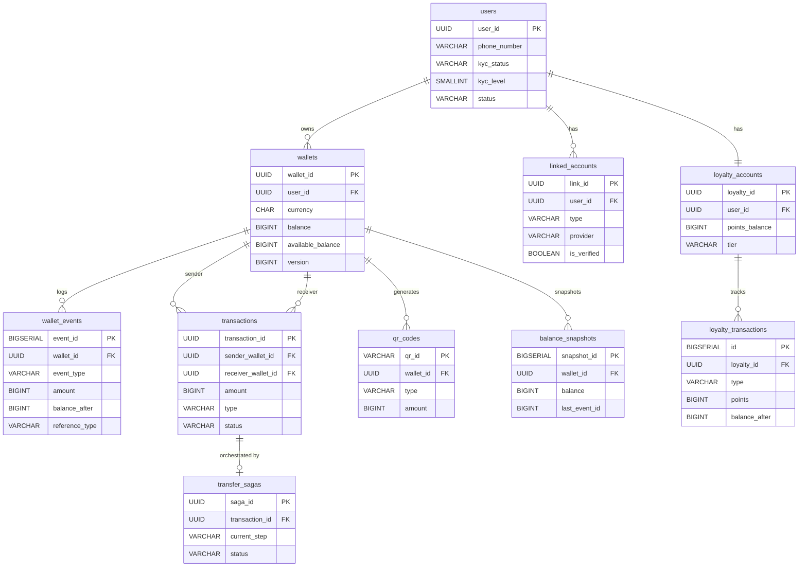
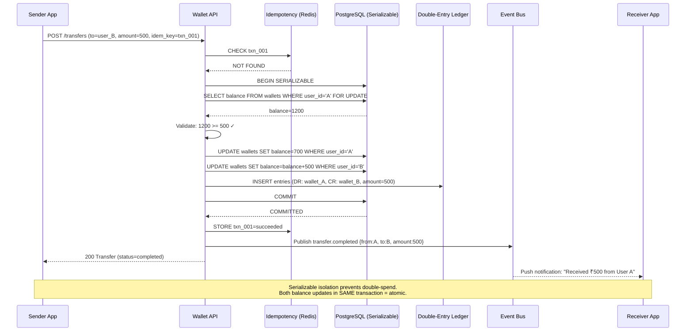
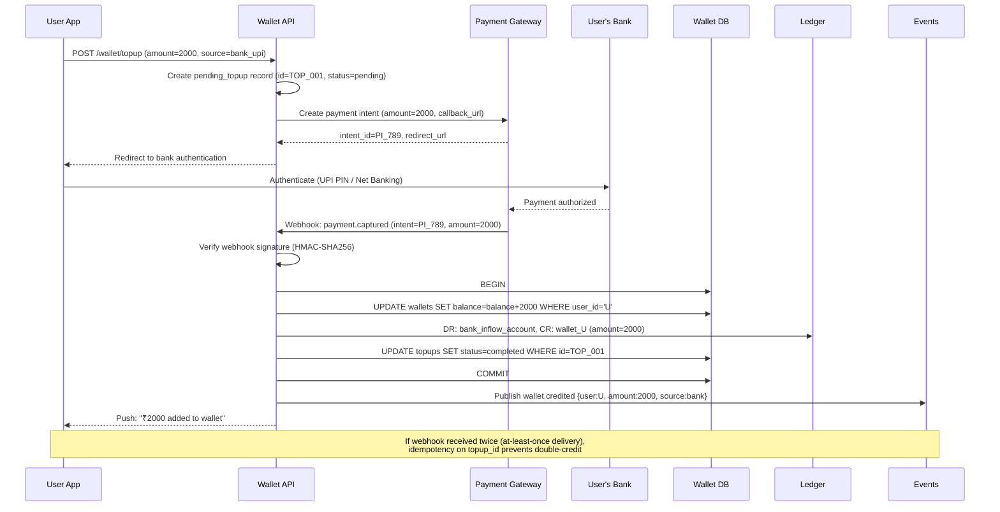
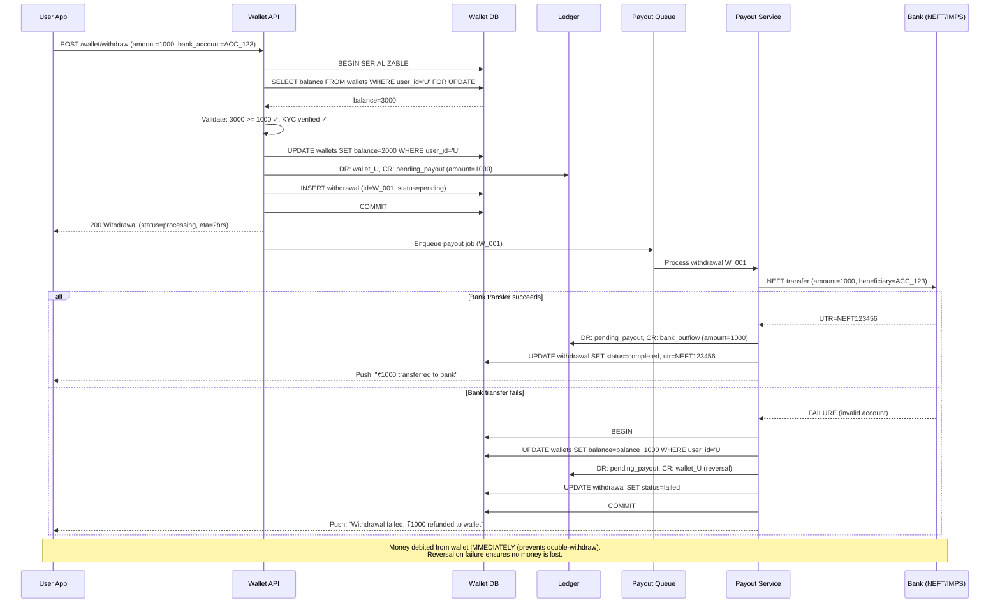

# Digital Wallet (PayTM/Apple Pay-like) — System Design

## 1. Functional Requirements

1. **Balance Management**: Credit/debit operations with real-time balance
2. **P2P Transfers**: Send money to other wallet users instantly
3. **Top-Up from Bank/Card**: Load wallet from linked bank accounts or cards
4. **Withdraw to Bank**: Cash out wallet balance to bank account
5. **Transaction History**: Complete audit trail with search/filter
6. **Spending Analytics**: Category-wise spending, monthly summaries
7. **Loyalty Points**: Earn/redeem points on transactions
8. **QR Code Payments**: Merchant/P2P payments via QR scan
9. **NFC Contactless**: Tap-to-pay at POS terminals
10. **Multi-Currency Wallets**: Hold and convert between currencies

## 2. Non-Functional Requirements

| Requirement | Target |
|-------------|--------|
| Availability | 99.99% (52 min downtime/year) |
| Latency (p99) | < 500ms for balance ops, < 200ms for reads |
| Throughput | 100K TPS peak (festival sales) |
| Consistency | Strong consistency for balance (no double-spend) |
| Durability | Zero data loss for financial transactions |
| Scalability | 500M users, 1B daily transactions |
| Compliance | PCI-DSS, RBI/local regulations, AML/KYC |

## 3. Capacity Estimation

```
Users: 500M registered, 50M DAU
Daily transactions: 1B
Average transaction size: $15
Daily volume: $15B
Peak TPS: 100K (10x average during flash sales)
Average TPS: ~11,500

Storage:
- User profiles: 500M × 2KB = 1TB
- Transactions: 1B/day × 500B = 500GB/day = 182TB/year
- Balance snapshots: 500M × 100B = 50GB
- Event store: 1B events/day × 300B = 300GB/day

Network:
- Inbound: 100K req/s × 1KB = 100MB/s
- Outbound: 100K resp/s × 2KB = 200MB/s

Cache:
- Hot wallets (top 10%): 50M × 200B = 10GB (fits in Redis cluster)
```

## 4. Data Modeling — Full Schemas

### Entity-Relationship Diagram



```sql
-- User & Wallet Schema
CREATE TABLE users (
    user_id             UUID PRIMARY KEY DEFAULT gen_random_uuid(),
    phone_number        VARCHAR(15) NOT NULL UNIQUE,
    email               VARCHAR(255),
    full_name           VARCHAR(200) NOT NULL,
    kyc_status          VARCHAR(20) DEFAULT 'basic', -- basic/enhanced/full
    kyc_level           SMALLINT DEFAULT 1,  -- determines limits
    device_id           VARCHAR(64),
    biometric_enabled   BOOLEAN DEFAULT FALSE,
    pin_hash            VARCHAR(128) NOT NULL,
    status              VARCHAR(20) DEFAULT 'active',
    created_at          TIMESTAMPTZ NOT NULL DEFAULT NOW(),
    updated_at          TIMESTAMPTZ NOT NULL DEFAULT NOW()
);
CREATE INDEX idx_users_phone ON users(phone_number);

CREATE TABLE wallets (
    wallet_id           UUID PRIMARY KEY DEFAULT gen_random_uuid(),
    user_id             UUID NOT NULL REFERENCES users(user_id),
    currency            CHAR(3) NOT NULL DEFAULT 'INR',
    balance             BIGINT NOT NULL DEFAULT 0,  -- in smallest unit (paise)
    available_balance   BIGINT NOT NULL DEFAULT 0,  -- balance - holds
    locked_balance      BIGINT NOT NULL DEFAULT 0,  -- regulatory/dispute holds
    daily_limit         BIGINT NOT NULL DEFAULT 10000000,  -- 1 lakh paise
    monthly_limit       BIGINT NOT NULL DEFAULT 100000000,
    version             BIGINT NOT NULL DEFAULT 0,  -- optimistic locking
    status              VARCHAR(20) DEFAULT 'active',
    created_at          TIMESTAMPTZ NOT NULL DEFAULT NOW(),
    updated_at          TIMESTAMPTZ NOT NULL DEFAULT NOW(),
    UNIQUE(user_id, currency),
    CONSTRAINT positive_balance CHECK (balance >= 0),
    CONSTRAINT positive_available CHECK (available_balance >= 0)
);
CREATE INDEX idx_wallets_user ON wallets(user_id);

-- Event-Sourced Transaction Log (append-only)
CREATE TABLE wallet_events (
    event_id            BIGSERIAL PRIMARY KEY,
    wallet_id           UUID NOT NULL,
    event_type          VARCHAR(30) NOT NULL,
    -- credit, debit, hold, release_hold, reversal
    amount              BIGINT NOT NULL,
    currency            CHAR(3) NOT NULL,
    balance_after       BIGINT NOT NULL,
    reference_type      VARCHAR(30) NOT NULL,  -- p2p, topup, withdraw, purchase, refund
    reference_id        UUID NOT NULL,
    idempotency_key     VARCHAR(255),
    metadata            JSONB DEFAULT '{}',
    created_at          TIMESTAMPTZ NOT NULL DEFAULT NOW()
);
CREATE INDEX idx_wallet_events_wallet ON wallet_events(wallet_id, created_at);
CREATE INDEX idx_wallet_events_ref ON wallet_events(reference_type, reference_id);
CREATE UNIQUE INDEX idx_wallet_events_idemp ON wallet_events(wallet_id, idempotency_key);

-- Transactions (user-facing)
CREATE TABLE transactions (
    transaction_id      UUID PRIMARY KEY DEFAULT gen_random_uuid(),
    sender_wallet_id    UUID,
    receiver_wallet_id  UUID,
    amount              BIGINT NOT NULL,
    currency            CHAR(3) NOT NULL,
    type                VARCHAR(20) NOT NULL,  -- p2p, topup, withdraw, purchase, refund
    status              VARCHAR(20) NOT NULL,  -- initiated, processing, completed, failed, reversed
    description         TEXT,
    category            VARCHAR(30),  -- food, transport, shopping, utilities
    merchant_id         UUID,
    qr_code_id          VARCHAR(64),
    fee_amount          BIGINT DEFAULT 0,
    exchange_rate       DECIMAL(12,6),
    failure_reason      VARCHAR(100),
    initiated_at        TIMESTAMPTZ NOT NULL DEFAULT NOW(),
    completed_at        TIMESTAMPTZ,
    metadata            JSONB DEFAULT '{}'
);
CREATE INDEX idx_txn_sender ON transactions(sender_wallet_id, initiated_at DESC);
CREATE INDEX idx_txn_receiver ON transactions(receiver_wallet_id, initiated_at DESC);
CREATE INDEX idx_txn_status ON transactions(status) WHERE status IN ('initiated', 'processing');

-- P2P Transfer Saga
CREATE TABLE transfer_sagas (
    saga_id             UUID PRIMARY KEY DEFAULT gen_random_uuid(),
    transaction_id      UUID NOT NULL REFERENCES transactions(transaction_id),
    sender_wallet_id    UUID NOT NULL,
    receiver_wallet_id  UUID NOT NULL,
    amount              BIGINT NOT NULL,
    currency            CHAR(3) NOT NULL,
    current_step        VARCHAR(30) NOT NULL,
    -- steps: debit_sender, credit_receiver, notify, complete
    status              VARCHAR(20) NOT NULL,  -- running, completed, compensating, failed
    debit_event_id      BIGINT,
    credit_event_id     BIGINT,
    retry_count         SMALLINT DEFAULT 0,
    last_error          TEXT,
    created_at          TIMESTAMPTZ NOT NULL DEFAULT NOW(),
    updated_at          TIMESTAMPTZ NOT NULL DEFAULT NOW()
);
CREATE INDEX idx_saga_status ON transfer_sagas(status) WHERE status IN ('running', 'compensating');

-- Linked Payment Methods
CREATE TABLE linked_accounts (
    link_id             UUID PRIMARY KEY DEFAULT gen_random_uuid(),
    user_id             UUID NOT NULL REFERENCES users(user_id),
    type                VARCHAR(20) NOT NULL,  -- bank_account, credit_card, debit_card
    provider            VARCHAR(50) NOT NULL,  -- HDFC, SBI, etc.
    account_token       VARCHAR(255) NOT NULL, -- tokenized reference
    account_last4       CHAR(4),
    account_name        VARCHAR(100),
    is_default          BOOLEAN DEFAULT FALSE,
    is_verified         BOOLEAN DEFAULT FALSE,
    created_at          TIMESTAMPTZ NOT NULL DEFAULT NOW()
);
CREATE INDEX idx_linked_user ON linked_accounts(user_id);

-- Loyalty Points
CREATE TABLE loyalty_accounts (
    loyalty_id          UUID PRIMARY KEY DEFAULT gen_random_uuid(),
    user_id             UUID NOT NULL REFERENCES users(user_id) UNIQUE,
    points_balance      BIGINT NOT NULL DEFAULT 0,
    lifetime_earned     BIGINT NOT NULL DEFAULT 0,
    tier                VARCHAR(20) DEFAULT 'bronze', -- bronze, silver, gold, platinum
    version             BIGINT NOT NULL DEFAULT 0,
    created_at          TIMESTAMPTZ NOT NULL DEFAULT NOW()
);

CREATE TABLE loyalty_transactions (
    id                  BIGSERIAL PRIMARY KEY,
    loyalty_id          UUID NOT NULL REFERENCES loyalty_accounts(loyalty_id),
    type                VARCHAR(10) NOT NULL,  -- earn, redeem, expire
    points              BIGINT NOT NULL,
    balance_after       BIGINT NOT NULL,
    reference_txn_id    UUID,
    description         VARCHAR(200),
    expires_at          TIMESTAMPTZ,
    created_at          TIMESTAMPTZ NOT NULL DEFAULT NOW()
);
CREATE INDEX idx_loyalty_txn ON loyalty_transactions(loyalty_id, created_at DESC);

-- QR Code Registry
CREATE TABLE qr_codes (
    qr_id               VARCHAR(64) PRIMARY KEY,
    type                VARCHAR(20) NOT NULL,  -- static_merchant, dynamic_payment
    wallet_id           UUID NOT NULL,
    merchant_id         UUID,
    amount              BIGINT,  -- NULL for static QR (any amount)
    currency            CHAR(3),
    status              VARCHAR(20) DEFAULT 'active',
    expires_at          TIMESTAMPTZ,
    created_at          TIMESTAMPTZ NOT NULL DEFAULT NOW()
);

-- Balance Snapshots (for event sourcing rebuild optimization)
CREATE TABLE balance_snapshots (
    snapshot_id         BIGSERIAL PRIMARY KEY,
    wallet_id           UUID NOT NULL,
    balance             BIGINT NOT NULL,
    available_balance   BIGINT NOT NULL,
    locked_balance      BIGINT NOT NULL,
    last_event_id       BIGINT NOT NULL,
    snapshot_at         TIMESTAMPTZ NOT NULL DEFAULT NOW()
);
CREATE INDEX idx_snapshots_wallet ON balance_snapshots(wallet_id, snapshot_at DESC);

-- Spending Analytics (pre-aggregated)
CREATE TABLE spending_aggregates (
    user_id             UUID NOT NULL,
    period              DATE NOT NULL,  -- first day of month
    category            VARCHAR(30) NOT NULL,
    total_amount        BIGINT NOT NULL DEFAULT 0,
    transaction_count   INTEGER NOT NULL DEFAULT 0,
    PRIMARY KEY (user_id, period, category)
);
```

## 5. High-Level Design — ASCII Architecture

```
┌─────────────────────────────────────────────────────────────────────────┐
│                     DIGITAL WALLET ARCHITECTURE                          │
└─────────────────────────────────────────────────────────────────────────┘

  ┌──────────┐   ┌──────────┐   ┌──────────┐   ┌───────────┐
  │ Mobile   │   │ POS      │   │ Web      │   │ Partner   │
  │ App      │   │ Terminal │   │ App      │   │ APIs      │
  └────┬─────┘   └────┬─────┘   └────┬─────┘   └─────┬─────┘
       │               │               │               │
       └───────────────┼───────────────┼───────────────┘
                       │ HTTPS + mTLS
                       ▼
          ┌──────────────────────────────┐
          │       API Gateway            │
          │  (Rate Limit, Auth, Route)   │
          │  + Anti-Replay (nonce check) │
          └──────────────┬───────────────┘
                         │
        ┌────────────────┼───────────────────────────┐
        │                │                           │
        ▼                ▼                           ▼
┌──────────────┐  ┌──────────────┐         ┌──────────────────┐
│  Wallet      │  │  Transfer    │         │  Payment         │
│  Service     │  │  Service     │         │  Service         │
│  (Balance)   │  │  (P2P/Saga)  │         │  (QR/NFC/Online) │
└──────┬───────┘  └──────┬───────┘         └────────┬─────────┘
       │                  │                          │
       │         ┌────────┴──────────┐              │
       │         │                   │              │
       ▼         ▼                   ▼              ▼
┌────────────────────────────────────────────────────────┐
│              Balance Engine (Core)                      │
│  ┌──────────────────────────────────────────────────┐  │
│  │  Serializable Isolation + Pessimistic Locking    │  │
│  │  Event-Sourced Balance with Snapshots            │  │
│  └──────────────────────────────────────────────────┘  │
└───────────────────────┬────────────────────────────────┘
                        │
         ┌──────────────┼──────────────────┐
         │              │                  │
         ▼              ▼                  ▼
  ┌────────────┐ ┌────────────┐    ┌────────────────┐
  │ PostgreSQL │ │   Redis    │    │     Kafka      │
  │ (Primary)  │ │  (Cache +  │    │  (Events +     │
  │ + Replicas │ │   Locks)   │    │   Saga Steps)  │
  └────────────┘ └────────────┘    └───────┬────────┘
                                           │
                        ┌──────────────────┼──────────────┐
                        │                  │              │
                        ▼                  ▼              ▼
                 ┌────────────┐   ┌──────────────┐ ┌──────────┐
                 │ Notification│   │  Analytics   │ │  Loyalty │
                 │ Service    │   │  Service     │ │  Service │
                 │(Push/SMS)  │   │ (Flink)      │ │          │
                 └────────────┘   └──────────────┘ └──────────┘
                                         │
                                         ▼
                                  ┌──────────────┐
                                  │ ClickHouse   │
                                  │ (Analytics)  │
                                  └──────────────┘

External Integrations:
┌────────────────────────────────────────────────────┐
│  ┌─────────┐  ┌─────────┐  ┌─────────┐  ┌──────┐│
│  │  Bank   │  │  Card   │  │  UPI    │  │ NFC  ││
│  │  APIs   │  │  Network│  │  Switch │  │ TSM  ││
│  └─────────┘  └─────────┘  └─────────┘  └──────┘│
└────────────────────────────────────────────────────┘
```

## 6. Low-Level Design — APIs

### Get Wallet Balance
```http
GET /v1/wallet/balance
Authorization: Bearer <jwt_token>
X-Device-Id: device_abc123
```

**Response:**
```json
{
  "wallet_id": "w_abc123",
  "currency": "INR",
  "balance": 1500000,
  "available_balance": 1450000,
  "locked_balance": 50000,
  "formatted": {
    "balance": "₹15,000.00",
    "available": "₹14,500.00"
  },
  "daily_remaining_limit": 8500000,
  "monthly_remaining_limit": 85000000
}
```

### P2P Transfer
```http
POST /v1/transfers/p2p
Authorization: Bearer <jwt_token>
Idempotency-Key: txn_unique_123
X-Device-Id: device_abc123

{
  "recipient_phone": "+919876543210",
  "amount": 50000,
  "currency": "INR",
  "pin": "encrypted_pin_payload",
  "note": "Dinner split"
}
```

**Response (202 Accepted):**
```json
{
  "transaction_id": "txn_7f3a9b2c",
  "status": "processing",
  "amount": 50000,
  "currency": "INR",
  "recipient": {
    "name": "Ra***a K",
    "phone": "+91****3210"
  },
  "estimated_completion": "instant"
}
```

### Top-Up from Bank
```http
POST /v1/wallet/topup
Authorization: Bearer <jwt_token>
Idempotency-Key: topup_unique_456

{
  "amount": 500000,
  "currency": "INR",
  "source": {
    "type": "bank_account",
    "link_id": "link_hdfc_123"
  },
  "pin": "encrypted_pin_payload"
}
```

### QR Code Payment
```http
POST /v1/payments/qr
Authorization: Bearer <jwt_token>

{
  "qr_data": "upi://pay?pa=merchant@upi&pn=CoffeeShop&am=15000&cu=INR",
  "amount": 15000,
  "pin": "encrypted_pin_payload"
}
```

### Transaction History
```http
GET /v1/transactions?limit=20&cursor=txn_abc&type=p2p&from=2024-01-01
Authorization: Bearer <jwt_token>
```

**Response:**
```json
{
  "transactions": [
    {
      "transaction_id": "txn_7f3a9b2c",
      "type": "p2p",
      "direction": "debit",
      "amount": 50000,
      "currency": "INR",
      "counterparty": {"name": "Rahul K", "phone": "+91****3210"},
      "status": "completed",
      "category": "transfers",
      "timestamp": "2024-01-15T10:30:00Z"
    }
  ],
  "cursor": "txn_next_def",
  "has_more": true
}
```

## 7. Deep Dives

### Deep Dive 1: Balance Consistency — Preventing Double-Spend

**Problem**: Concurrent debit requests can overdraw a wallet if not properly serialized.

**Solution: Pessimistic Locking with Serializable Isolation**

```python
class BalanceEngine:
    """
    Core balance operations with strong consistency guarantees.
    Uses SELECT ... FOR UPDATE to serialize concurrent modifications.
    """

    async def debit(self, wallet_id: str, amount: int,
                    idempotency_key: str, reference: dict) -> WalletEvent:
        async with self.db.transaction(isolation='SERIALIZABLE') as txn:
            # 1. Idempotency check
            existing = await txn.fetchone("""
                SELECT event_id, balance_after FROM wallet_events
                WHERE wallet_id = $1 AND idempotency_key = $2
            """, wallet_id, idempotency_key)
            if existing:
                return existing  # Already processed

            # 2. Lock wallet row (prevents concurrent modifications)
            wallet = await txn.fetchone("""
                SELECT wallet_id, balance, available_balance, version
                FROM wallets
                WHERE wallet_id = $1
                FOR UPDATE
            """, wallet_id)

            if not wallet:
                raise WalletNotFoundError(wallet_id)

            # 3. Validate sufficient balance
            if wallet.available_balance < amount:
                raise InsufficientBalanceError(
                    available=wallet.available_balance, requested=amount
                )

            # 4. Check daily/monthly limits
            await self._check_limits(txn, wallet_id, amount)

            # 5. Update balance atomically
            new_balance = wallet.balance - amount
            new_available = wallet.available_balance - amount

            await txn.execute("""
                UPDATE wallets
                SET balance = $2, available_balance = $3,
                    version = version + 1, updated_at = NOW()
                WHERE wallet_id = $1 AND version = $4
            """, wallet_id, new_balance, new_available, wallet.version)

            # 6. Append event (immutable log)
            event = await txn.fetchone("""
                INSERT INTO wallet_events
                    (wallet_id, event_type, amount, currency, balance_after,
                     reference_type, reference_id, idempotency_key)
                VALUES ($1, 'debit', $2, $3, $4, $5, $6, $7)
                RETURNING event_id, balance_after
            """, wallet_id, amount, wallet.currency, new_balance,
                reference['type'], reference['id'], idempotency_key)

            return event

    async def credit(self, wallet_id: str, amount: int,
                     idempotency_key: str, reference: dict) -> WalletEvent:
        async with self.db.transaction(isolation='SERIALIZABLE') as txn:
            # Idempotency check
            existing = await txn.fetchone("""
                SELECT event_id FROM wallet_events
                WHERE wallet_id = $1 AND idempotency_key = $2
            """, wallet_id, idempotency_key)
            if existing:
                return existing

            # Lock and credit
            wallet = await txn.fetchone("""
                SELECT * FROM wallets WHERE wallet_id = $1 FOR UPDATE
            """, wallet_id)

            new_balance = wallet.balance + amount
            new_available = wallet.available_balance + amount

            await txn.execute("""
                UPDATE wallets
                SET balance = $2, available_balance = $3,
                    version = version + 1, updated_at = NOW()
                WHERE wallet_id = $1
            """, wallet_id, new_balance, new_available)

            event = await txn.fetchone("""
                INSERT INTO wallet_events
                    (wallet_id, event_type, amount, currency, balance_after,
                     reference_type, reference_id, idempotency_key)
                VALUES ($1, 'credit', $2, $3, $4, $5, $6, $7)
                RETURNING event_id, balance_after
            """, wallet_id, amount, wallet.currency, new_balance,
                reference['type'], reference['id'], idempotency_key)

            return event
```

**Event-Sourced Balance with Snapshots**:
```python
class EventSourcedBalance:
    """
    Balance is derived from events. Snapshots every 1000 events for performance.
    Used for audit/reconciliation and disaster recovery.
    """
    SNAPSHOT_INTERVAL = 1000

    async def rebuild_balance(self, wallet_id: str) -> int:
        # Find latest snapshot
        snapshot = await self.db.fetchone("""
            SELECT balance, last_event_id FROM balance_snapshots
            WHERE wallet_id = $1 ORDER BY snapshot_at DESC LIMIT 1
        """, wallet_id)

        start_event_id = snapshot.last_event_id if snapshot else 0
        balance = snapshot.balance if snapshot else 0

        # Replay events since snapshot
        events = await self.db.fetch("""
            SELECT event_type, amount FROM wallet_events
            WHERE wallet_id = $1 AND event_id > $2
            ORDER BY event_id ASC
        """, wallet_id, start_event_id)

        for event in events:
            if event.event_type == 'credit':
                balance += event.amount
            elif event.event_type == 'debit':
                balance -= event.amount
            elif event.event_type == 'hold':
                pass  # doesn't affect balance, only available_balance

        return balance

    async def create_snapshot_if_needed(self, wallet_id: str, event_id: int):
        """Create snapshot every N events."""
        count = await self.db.fetchval("""
            SELECT COUNT(*) FROM wallet_events
            WHERE wallet_id = $1 AND event_id > (
                SELECT COALESCE(MAX(last_event_id), 0)
                FROM balance_snapshots WHERE wallet_id = $1
            )
        """, wallet_id)

        if count >= self.SNAPSHOT_INTERVAL:
            wallet = await self.db.fetchone(
                "SELECT balance, available_balance, locked_balance FROM wallets WHERE wallet_id=$1",
                wallet_id
            )
            await self.db.execute("""
                INSERT INTO balance_snapshots
                    (wallet_id, balance, available_balance, locked_balance, last_event_id)
                VALUES ($1, $2, $3, $4, $5)
            """, wallet_id, wallet.balance, wallet.available_balance,
                wallet.locked_balance, event_id)
```

### Deep Dive 2: P2P Transfer Saga with Compensation

**Problem**: Transferring between two wallets requires atomic debit+credit. If credit fails after debit, we must compensate.

**Saga State Machine**:
```
┌────────────┐     ┌─────────────┐     ┌───────────────┐     ┌──────────┐
│  INITIATED │────▶│ DEBIT_SENDER│────▶│CREDIT_RECEIVER│────▶│ COMPLETE │
└────────────┘     └──────┬──────┘     └───────┬───────┘     └──────────┘
                          │                     │
                          │ fail                │ fail
                          ▼                     ▼
                   ┌────────────┐      ┌─────────────────┐
                   │   FAILED   │      │  COMPENSATING   │
                   │ (no action │      │ (reverse debit) │
                   │  needed)   │      └────────┬────────┘
                   └────────────┘               │
                                                ▼
                                         ┌────────────┐
                                         │  REVERSED  │
                                         └────────────┘
```

```python
class P2PTransferSaga:
    MAX_RETRIES = 3
    RETRY_DELAYS = [1, 5, 15]  # seconds

    async def execute(self, saga_id: str):
        saga = await self.load_saga(saga_id)

        try:
            if saga.current_step == 'debit_sender':
                await self._debit_sender(saga)

            if saga.current_step == 'credit_receiver':
                await self._credit_receiver(saga)

            if saga.current_step == 'notify':
                await self._send_notifications(saga)

            await self._complete(saga)

        except InsufficientBalanceError:
            await self._fail_saga(saga, "Insufficient balance")
        except Exception as e:
            if saga.retry_count < self.MAX_RETRIES:
                await self._schedule_retry(saga)
            else:
                await self._compensate(saga, str(e))

    async def _debit_sender(self, saga):
        event = await self.balance_engine.debit(
            wallet_id=saga.sender_wallet_id,
            amount=saga.amount,
            idempotency_key=f"saga_{saga.saga_id}_debit",
            reference={'type': 'p2p', 'id': saga.transaction_id}
        )
        saga.debit_event_id = event.event_id
        saga.current_step = 'credit_receiver'
        await self._save_saga(saga)

    async def _credit_receiver(self, saga):
        event = await self.balance_engine.credit(
            wallet_id=saga.receiver_wallet_id,
            amount=saga.amount,
            idempotency_key=f"saga_{saga.saga_id}_credit",
            reference={'type': 'p2p', 'id': saga.transaction_id}
        )
        saga.credit_event_id = event.event_id
        saga.current_step = 'notify'
        await self._save_saga(saga)

    async def _compensate(self, saga, error: str):
        """Reverse the debit if credit failed."""
        saga.status = 'compensating'
        await self._save_saga(saga)

        if saga.debit_event_id:
            # Credit back the sender
            await self.balance_engine.credit(
                wallet_id=saga.sender_wallet_id,
                amount=saga.amount,
                idempotency_key=f"saga_{saga.saga_id}_compensate",
                reference={'type': 'reversal', 'id': saga.transaction_id}
            )

        saga.status = 'failed'
        saga.last_error = error
        await self._save_saga(saga)

        # Update transaction status
        await self.db.execute("""
            UPDATE transactions SET status='failed', failure_reason=$2
            WHERE transaction_id=$1
        """, saga.transaction_id, error)

        # Notify sender of failure
        await self.notification_service.send(
            saga.sender_wallet_id,
            f"Transfer of {saga.amount} failed. Amount refunded."
        )
```

### Deep Dive 3: Float Management

**Problem**: Aggregate wallet balances represent "float" — funds held that can be invested for returns.

```python
class FloatManager:
    """
    Manages the aggregate float (sum of all wallet balances).
    Float is invested in overnight money market funds for returns.
    """

    async def calculate_daily_float(self, date: date) -> dict:
        """Calculate end-of-day float across all currencies."""
        result = await self.db.fetch("""
            SELECT currency, SUM(balance) as total_float,
                   COUNT(*) as wallet_count
            FROM wallets
            WHERE status = 'active'
            GROUP BY currency
        """)
        return {row.currency: row.total_float for row in result}

    async def calculate_interest(self, date: date):
        """
        Calculate daily interest earned on float.
        Interest = Float × Annual Rate / 365
        """
        floats = await self.calculate_daily_float(date)
        rates = {
            'INR': 0.065,   # 6.5% overnight rate
            'USD': 0.052,   # 5.2% overnight rate
        }

        for currency, total_float in floats.items():
            rate = rates.get(currency, 0.03)
            daily_interest = int(total_float * rate / 365)

            await self.db.execute("""
                INSERT INTO float_interest_log
                    (date, currency, float_amount, rate, interest_earned)
                VALUES ($1, $2, $3, $4, $5)
            """, date, currency, total_float, rate, daily_interest)

    async def get_float_velocity(self, currency: str, window_hours: int = 24) -> dict:
        """Track inflows/outflows to predict float levels."""
        stats = await self.db.fetchone("""
            SELECT
                SUM(CASE WHEN event_type='credit' THEN amount ELSE 0 END) as inflows,
                SUM(CASE WHEN event_type='debit' THEN amount ELSE 0 END) as outflows
            FROM wallet_events
            WHERE currency = $1
            AND created_at > NOW() - INTERVAL '%s hours'
        """ % window_hours, currency)

        return {
            'inflows': stats.inflows,
            'outflows': stats.outflows,
            'net_flow': stats.inflows - stats.outflows,
            'velocity_ratio': stats.outflows / stats.inflows if stats.inflows > 0 else 0
        }
```

## 8. Component Optimization

### Redis Configuration
```yaml
redis:
  cluster:
    nodes: 6 (3 masters + 3 replicas)
    max_memory: 32GB per node
  use_cases:
    balance_cache:
      key_pattern: "wallet:bal:{wallet_id}"
      ttl: 60s  # short TTL, write-through on mutation
      serialization: msgpack
    rate_limiting:
      key_pattern: "rate:{user_id}:{window}"
      algorithm: sliding_window_log
    distributed_locks:
      key_pattern: "lock:wallet:{wallet_id}"
      algorithm: redlock
      ttl: 10s
    session:
      key_pattern: "sess:{token}"
      ttl: 3600s
  maxmemory-policy: allkeys-lru
```

### Kafka Configuration
```yaml
kafka:
  cluster_size: 12 brokers
  topics:
    wallet.events:
      partitions: 128  # partition by wallet_id for ordering
      replication_factor: 3
      retention_ms: 604800000  # 7 days
      min.insync.replicas: 2
      partition_strategy: hash(wallet_id) % 128
    transfer.saga:
      partitions: 64
      replication_factor: 3
      retention_ms: 86400000  # 1 day
    wallet.notifications:
      partitions: 32
      replication_factor: 2
  producer:
    acks: all
    enable.idempotence: true
    compression.type: lz4
  consumer:
    enable.auto.commit: false
    max.poll.records: 500
```

### Flink Configuration (Analytics)
```yaml
flink:
  job: spending_analytics
  parallelism: 32
  checkpointing:
    interval: 60s
    mode: exactly_once
    storage: s3://flink-checkpoints/
  source:
    topic: wallet.events
    startup_mode: group-offsets
  windowing:
    type: tumbling
    size: 1_hour
  sink:
    clickhouse:
      batch_size: 10000
      flush_interval: 5s
```

### Database Optimization
```sql
-- Partition wallet_events by month (high-velocity table)
CREATE TABLE wallet_events (
    ...
) PARTITION BY RANGE (created_at);

-- Hot partition (current month) on fast SSD
-- Cold partitions compressed and moved to cheaper storage

-- Connection pool: PgBouncer
-- Mode: transaction
-- Pool size: 200 (matches CPU cores × 4)
-- Prepared statements: enabled

-- Read replicas for:
-- 1. Transaction history queries
-- 2. Analytics aggregations
-- 3. Spending reports

-- Indexes tuned for write-heavy workload:
-- Partial indexes to reduce index bloat
CREATE INDEX idx_active_sagas ON transfer_sagas(saga_id)
    WHERE status IN ('running', 'compensating');
```

## 9. Observability

### Key Metrics
```yaml
metrics:
  business:
    - wallet_balance_total{currency}         # gauge: total float
    - transaction_volume_total{type,status}   # counter
    - p2p_transfer_amount_total{currency}     # counter
    - topup_amount_total{source_type}         # counter
    - withdrawal_amount_total{currency}       # counter

  performance:
    - balance_operation_duration_ms{op}       # histogram: debit/credit
    - saga_completion_duration_ms             # histogram
    - saga_compensation_total                 # counter (failures)
    - api_request_duration_ms{endpoint}       # histogram

  reliability:
    - double_spend_attempts_total             # counter (caught by locks)
    - insufficient_balance_total              # counter
    - saga_retry_total{step}                  # counter
    - balance_mismatch_total                  # counter (reconciliation)

alerts:
  - alert: HighSagaFailureRate
    expr: rate(saga_compensation_total[5m]) > 10
    for: 2m
  - alert: BalanceMismatch
    expr: balance_mismatch_total > 0
    for: 0m  # immediate — critical
  - alert: FloatDropAnomaly
    expr: delta(wallet_balance_total[1h]) < -1000000000  # >10M drop
    for: 5m
```

### Distributed Tracing
```
Trace: P2P Transfer
├── api-gateway.authenticate (3ms)
├── transfer-service.initiate (5ms)
│   ├── validate-recipient (10ms)
│   │   └── user-service.lookup-by-phone (8ms)
│   ├── fraud-check (25ms)
│   └── kafka.produce-saga-event (2ms)
├── saga-executor.process (150ms)
│   ├── balance-engine.debit-sender (45ms)
│   │   ├── redis.acquire-lock (1ms)
│   │   ├── pg.select-for-update (5ms)
│   │   ├── pg.update-balance (3ms)
│   │   └── pg.insert-event (2ms)
│   ├── balance-engine.credit-receiver (40ms)
│   │   └── [similar to debit]
│   └── notification-service.send (15ms)
│       ├── push.sender (5ms)
│       └── push.receiver (5ms)
└── total: ~165ms
```

## 10. Considerations

### Double-Spend Prevention Layers
| Layer | Mechanism | Handles |
|-------|-----------|---------|
| 1 | Idempotency key | Duplicate requests |
| 2 | Redis distributed lock | Concurrent requests |
| 3 | SELECT FOR UPDATE | DB-level serialization |
| 4 | CHECK constraint | Balance >= 0 at DB level |
| 5 | Version column | Optimistic concurrency fallback |

### Regulatory Compliance
- **KYC Tiers**: Limit transactions based on verification level
- **AML**: Suspicious transaction reporting for amounts > threshold
- **Data Localization**: Store data in-country (India: RBI mandate)
- **Transaction Limits**: Daily/monthly caps per KYC level

### Failure Scenarios
| Failure | Impact | Mitigation |
|---------|--------|------------|
| DB primary down | Balance ops halt | Synchronous replica promotion (< 30s) |
| Redis down | Lock acquisition fails | Fallback to DB advisory locks |
| Kafka down | Saga events delayed | Write-ahead log to DB, replay |
| Credit step fails | Money in limbo | Saga compensation (auto-reversal) |
| Network partition | Split-brain risk | Fencing tokens + epoch-based locking |

### Scaling Strategy
- **Shard by user_id**: Each wallet lives on one shard
- **Hot wallets** (merchants): Dedicated shard group with higher resources
- **Read path**: Serve from Redis cache + read replicas
- **Write path**: Shard primary only, serialized per wallet
- **Analytics**: Async via Kafka → Flink → ClickHouse (no impact on OLTP)

---

## 12. Sequence Diagrams

### Diagram 1: P2P Transfer with Double-Entry



### Diagram 2: Top-Up from Bank (Add Money)



### Diagram 3: Withdrawal to Bank


