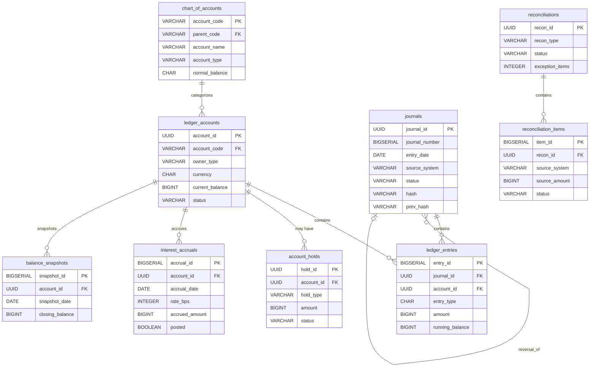
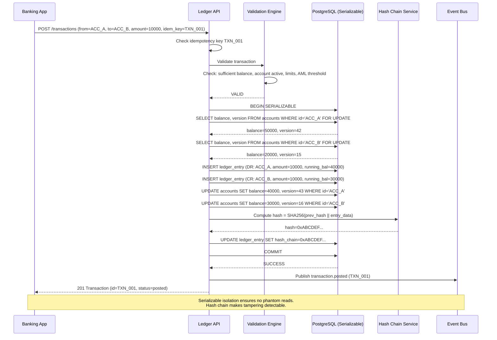
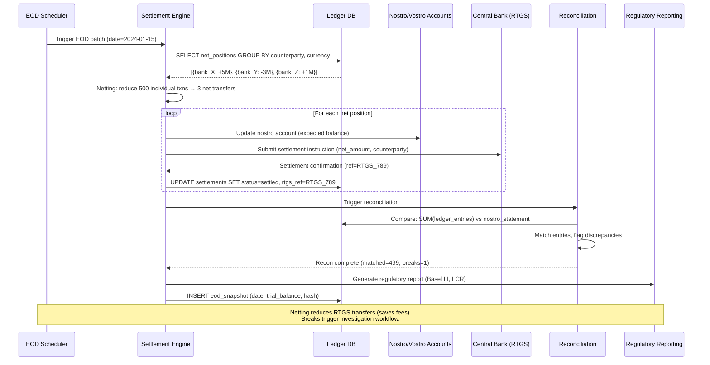
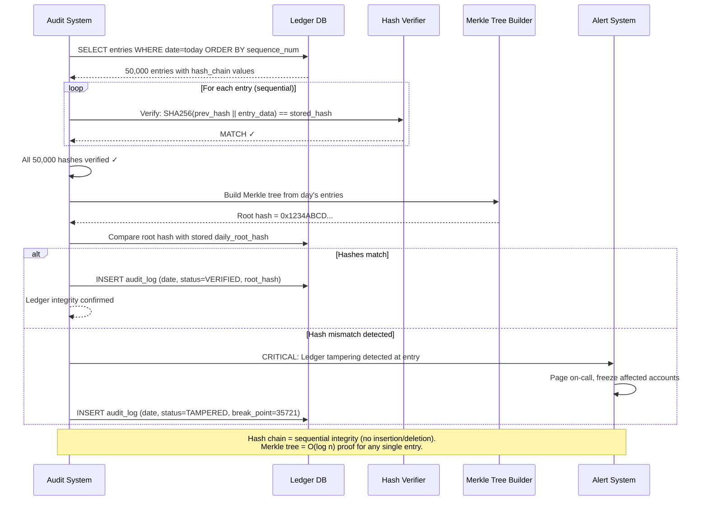

# Banking Ledger — System Design

## 1. Functional Requirements

1. **Double-Entry Bookkeeping**: Every transaction creates balanced debit + credit entries
2. **Chart of Accounts**: Hierarchical account structure (assets, liabilities, equity, revenue, expenses)
3. **Journal Entries**: Atomic multi-leg entries with audit trail
4. **Balance Computation**: Real-time balance queries and batch period-end computation
5. **Multi-Currency**: Support 150+ currencies with exchange rate management
6. **Regulatory Holds**: Place/release holds on accounts (legal, compliance, fraud)
7. **Interest Accrual**: Daily interest calculation on savings/loan accounts
8. **Statement Generation**: Monthly/quarterly statements with PDF export
9. **Audit Trail**: Immutable, tamper-evident record of all changes
10. **Sub-Ledger Reconciliation**: Reconcile sub-ledgers (AP, AR, GL) with general ledger

## 2. Non-Functional Requirements

| Requirement | Target |
|-------------|--------|
| Availability | 99.999% (banking-grade) |
| Consistency | Strict serializability (no phantom reads) |
| Throughput | 500K journal entries/sec peak |
| Latency (balance) | < 50ms real-time balance query |
| Durability | Zero data loss (RPO=0) |
| Immutability | No UPDATE/DELETE on ledger (append-only) |
| Auditability | Cryptographic proof of tamper-free history |
| Retention | 7+ years (regulatory) |
| Scalability | 1B accounts, 100B entries/year |

## 3. Capacity Estimation

```
Accounts: 1B (checking, savings, loans, internal)
Daily journal entries: 500M
Average entry size: 400 bytes
Daily storage: 500M × 400B = 200GB/day
Annual storage: 73TB/year (raw), ~25TB compressed
7-year retention: ~175TB compressed

Balance queries: 10M/day (customer-facing)
Peak balance QPS: 5,000
Peak write TPS: 500,000 journal entries/sec

Interest accrual batch: 1B accounts × 100B per calc = 100GB batch/day
Statement generation: 100M statements/month × 500KB avg = 50TB/month

Hash chain: 500M entries/day × 32B hash = 16GB/day
Snapshot store: Daily snapshots × 1B accounts × 50B = 50GB/snapshot
```

## 4. Data Modeling — Full Schemas

### Entity-Relationship Diagram



```sql
-- Chart of Accounts (hierarchical)
CREATE TABLE chart_of_accounts (
    account_code        VARCHAR(20) PRIMARY KEY,  -- e.g., '1000', '1000.100'
    parent_code         VARCHAR(20) REFERENCES chart_of_accounts(account_code),
    account_name        VARCHAR(200) NOT NULL,
    account_type        VARCHAR(20) NOT NULL,
    -- asset, liability, equity, revenue, expense, contra
    normal_balance      CHAR(1) NOT NULL,  -- 'D' (debit) or 'C' (credit)
    currency            CHAR(3),  -- NULL for multi-currency accounts
    is_header           BOOLEAN DEFAULT FALSE,  -- grouping account (no postings)
    is_active           BOOLEAN DEFAULT TRUE,
    level               SMALLINT NOT NULL,  -- hierarchy depth
    created_at          TIMESTAMPTZ NOT NULL DEFAULT NOW()
);
CREATE INDEX idx_coa_parent ON chart_of_accounts(parent_code);
CREATE INDEX idx_coa_type ON chart_of_accounts(account_type);

-- Ledger Accounts (individual account instances)
CREATE TABLE ledger_accounts (
    account_id          UUID PRIMARY KEY DEFAULT gen_random_uuid(),
    account_code        VARCHAR(20) NOT NULL REFERENCES chart_of_accounts(account_code),
    account_name        VARCHAR(200) NOT NULL,
    owner_type          VARCHAR(20),  -- customer, internal, partner
    owner_id            UUID,
    currency            CHAR(3) NOT NULL,
    status              VARCHAR(20) DEFAULT 'active',
    -- active, frozen, closed, dormant
    opening_date        DATE NOT NULL DEFAULT CURRENT_DATE,
    closing_date        DATE,
    current_balance     BIGINT NOT NULL DEFAULT 0,  -- denormalized for fast reads
    available_balance   BIGINT NOT NULL DEFAULT 0,
    pending_balance     BIGINT NOT NULL DEFAULT 0,
    hold_amount         BIGINT NOT NULL DEFAULT 0,
    last_entry_id       BIGINT,  -- pointer to latest entry
    last_entry_at       TIMESTAMPTZ,
    version             BIGINT NOT NULL DEFAULT 0,
    metadata            JSONB DEFAULT '{}',
    created_at          TIMESTAMPTZ NOT NULL DEFAULT NOW(),
    updated_at          TIMESTAMPTZ NOT NULL DEFAULT NOW()
);
CREATE INDEX idx_la_owner ON ledger_accounts(owner_type, owner_id);
CREATE INDEX idx_la_code ON ledger_accounts(account_code);
CREATE INDEX idx_la_status ON ledger_accounts(status) WHERE status = 'active';

-- Journal Entries (immutable, append-only)
CREATE TABLE journals (
    journal_id          UUID PRIMARY KEY DEFAULT gen_random_uuid(),
    journal_number      BIGSERIAL UNIQUE,  -- sequential for audit
    entry_date          DATE NOT NULL,
    effective_date      DATE NOT NULL,
    description         TEXT NOT NULL,
    source_system       VARCHAR(50) NOT NULL,  -- payments, loans, treasury, manual
    source_reference    VARCHAR(100),
    entry_type          VARCHAR(30) NOT NULL,
    -- normal, adjusting, closing, reversing, accrual
    status              VARCHAR(20) NOT NULL DEFAULT 'posted',
    -- pending, posted, reversed
    reversal_of         UUID REFERENCES journals(journal_id),
    reversed_by         UUID,
    total_amount        BIGINT NOT NULL,  -- sum of debits (= sum of credits)
    currency            CHAR(3) NOT NULL,
    fx_rate             DECIMAL(18,8),
    fx_rate_date        DATE,
    posted_by           VARCHAR(100) NOT NULL,
    approved_by         VARCHAR(100),
    hash                VARCHAR(64) NOT NULL,  -- SHA-256 of entry content
    prev_hash           VARCHAR(64) NOT NULL,  -- previous journal's hash (chain)
    created_at          TIMESTAMPTZ NOT NULL DEFAULT NOW()
);
CREATE INDEX idx_journals_date ON journals(entry_date);
CREATE INDEX idx_journals_source ON journals(source_system, source_reference);
CREATE INDEX idx_journals_status ON journals(status);

-- Ledger Entries (individual debit/credit lines)
CREATE TABLE ledger_entries (
    entry_id            BIGSERIAL PRIMARY KEY,
    journal_id          UUID NOT NULL REFERENCES journals(journal_id),
    account_id          UUID NOT NULL REFERENCES ledger_accounts(account_id),
    entry_type          CHAR(1) NOT NULL,  -- 'D' or 'C'
    amount              BIGINT NOT NULL CHECK (amount > 0),
    currency            CHAR(3) NOT NULL,
    local_amount        BIGINT,  -- amount in account's home currency
    fx_rate             DECIMAL(18,8),
    description         TEXT,
    running_balance     BIGINT NOT NULL,  -- balance after this entry
    sequence_in_account BIGINT NOT NULL,  -- per-account sequence number
    created_at          TIMESTAMPTZ NOT NULL DEFAULT NOW()
);
CREATE INDEX idx_le_account_seq ON ledger_entries(account_id, sequence_in_account DESC);
CREATE INDEX idx_le_journal ON ledger_entries(journal_id);
CREATE INDEX idx_le_account_date ON ledger_entries(account_id, created_at DESC);

-- Regulatory Holds
CREATE TABLE account_holds (
    hold_id             UUID PRIMARY KEY DEFAULT gen_random_uuid(),
    account_id          UUID NOT NULL REFERENCES ledger_accounts(account_id),
    hold_type           VARCHAR(30) NOT NULL,
    -- legal, fraud, compliance, dispute, collateral
    amount              BIGINT NOT NULL,
    reason              TEXT NOT NULL,
    placed_by           VARCHAR(100) NOT NULL,
    reference_id        VARCHAR(100),  -- court order number, case ID, etc.
    status              VARCHAR(20) DEFAULT 'active',  -- active, released, expired
    placed_at           TIMESTAMPTZ NOT NULL DEFAULT NOW(),
    expires_at          TIMESTAMPTZ,
    released_at         TIMESTAMPTZ,
    released_by         VARCHAR(100)
);
CREATE INDEX idx_holds_account ON account_holds(account_id, status);

-- Interest Accrual
CREATE TABLE interest_accruals (
    accrual_id          BIGSERIAL PRIMARY KEY,
    account_id          UUID NOT NULL,
    accrual_date        DATE NOT NULL,
    principal_balance   BIGINT NOT NULL,
    rate_bps            INTEGER NOT NULL,  -- annual rate in basis points
    day_count_convention VARCHAR(10) NOT NULL,  -- ACT/360, ACT/365, 30/360
    accrued_amount      BIGINT NOT NULL,  -- daily interest
    cumulative_accrued  BIGINT NOT NULL,  -- MTD accrued (not yet posted)
    posted              BOOLEAN DEFAULT FALSE,
    journal_id          UUID,  -- set when posted to ledger
    created_at          TIMESTAMPTZ NOT NULL DEFAULT NOW(),
    UNIQUE(account_id, accrual_date)
);
CREATE INDEX idx_accruals_unposted ON interest_accruals(posted, accrual_date)
    WHERE posted = FALSE;

-- Exchange Rates
CREATE TABLE exchange_rates (
    rate_id             BIGSERIAL PRIMARY KEY,
    from_currency       CHAR(3) NOT NULL,
    to_currency         CHAR(3) NOT NULL,
    rate                DECIMAL(18,8) NOT NULL,
    rate_type           VARCHAR(20) NOT NULL,  -- spot, mid, buy, sell
    effective_date      DATE NOT NULL,
    source              VARCHAR(50) NOT NULL,  -- reuters, ecb, internal
    created_at          TIMESTAMPTZ NOT NULL DEFAULT NOW(),
    UNIQUE(from_currency, to_currency, rate_type, effective_date)
);
CREATE INDEX idx_rates_lookup ON exchange_rates(from_currency, to_currency, effective_date DESC);

-- Balance Snapshots (for efficient historical balance queries)
CREATE TABLE balance_snapshots (
    snapshot_id         BIGSERIAL PRIMARY KEY,
    account_id          UUID NOT NULL,
    snapshot_date       DATE NOT NULL,
    opening_balance     BIGINT NOT NULL,
    total_debits        BIGINT NOT NULL DEFAULT 0,
    total_credits       BIGINT NOT NULL DEFAULT 0,
    closing_balance     BIGINT NOT NULL,
    entry_count         INTEGER NOT NULL DEFAULT 0,
    last_entry_id       BIGINT,
    UNIQUE(account_id, snapshot_date)
);
CREATE INDEX idx_snapshots_lookup ON balance_snapshots(account_id, snapshot_date DESC);

-- Reconciliation Records
CREATE TABLE reconciliations (
    recon_id            UUID PRIMARY KEY DEFAULT gen_random_uuid(),
    recon_type          VARCHAR(30) NOT NULL,  -- subledger_gl, bank_statement, intercompany
    period_start        DATE NOT NULL,
    period_end          DATE NOT NULL,
    status              VARCHAR(20) NOT NULL,  -- in_progress, matched, exceptions
    total_items         INTEGER NOT NULL DEFAULT 0,
    matched_items       INTEGER NOT NULL DEFAULT 0,
    exception_items     INTEGER NOT NULL DEFAULT 0,
    net_difference      BIGINT NOT NULL DEFAULT 0,
    run_by              VARCHAR(100),
    completed_at        TIMESTAMPTZ,
    created_at          TIMESTAMPTZ NOT NULL DEFAULT NOW()
);

CREATE TABLE reconciliation_items (
    item_id             BIGSERIAL PRIMARY KEY,
    recon_id            UUID NOT NULL REFERENCES reconciliations(recon_id),
    source_system       VARCHAR(30) NOT NULL,
    source_reference    VARCHAR(100) NOT NULL,
    source_amount       BIGINT NOT NULL,
    matched_reference   VARCHAR(100),
    matched_amount      BIGINT,
    difference          BIGINT,
    status              VARCHAR(20) NOT NULL,  -- matched, unmatched, partial, exception
    resolution          TEXT,
    created_at          TIMESTAMPTZ NOT NULL DEFAULT NOW()
);
CREATE INDEX idx_recon_items ON reconciliation_items(recon_id, status);

-- Audit Log (every action on the system)
CREATE TABLE audit_log (
    audit_id            BIGSERIAL PRIMARY KEY,
    timestamp           TIMESTAMPTZ NOT NULL DEFAULT NOW(),
    actor               VARCHAR(100) NOT NULL,
    action              VARCHAR(50) NOT NULL,
    resource_type       VARCHAR(30) NOT NULL,
    resource_id         VARCHAR(100) NOT NULL,
    details             JSONB,
    ip_address          INET,
    hash                VARCHAR(64) NOT NULL,  -- tamper detection
    prev_hash           VARCHAR(64) NOT NULL
);
CREATE INDEX idx_audit_resource ON audit_log(resource_type, resource_id);
CREATE INDEX idx_audit_actor ON audit_log(actor, timestamp DESC);
```

## 5. High-Level Design — ASCII Architecture

```
┌─────────────────────────────────────────────────────────────────────────────┐
│                      BANKING LEDGER ARCHITECTURE                             │
└─────────────────────────────────────────────────────────────────────────────┘

  ┌──────────┐   ┌──────────┐   ┌──────────┐   ┌───────────┐
  │ Core     │   │ Loan     │   │ Treasury │   │ Manual    │
  │ Banking  │   │ System   │   │ System   │   │ Entries   │
  └────┬─────┘   └────┬─────┘   └────┬─────┘   └─────┬─────┘
       │               │               │               │
       └───────────────┼───────────────┼───────────────┘
                       │
                       ▼
          ┌──────────────────────────────┐
          │      Journal Entry API       │
          │  (Validation + Balancing)    │
          └──────────────┬───────────────┘
                         │
                         ▼
          ┌──────────────────────────────┐
          │    Entry Validation Engine   │
          │  ┌────────────────────────┐  │
          │  │ • Debits == Credits    │  │
          │  │ • Account exists/active│  │
          │  │ • Currency match       │  │
          │  │ • Limits check         │  │
          │  │ • Hold verification    │  │
          │  └────────────────────────┘  │
          └──────────────┬───────────────┘
                         │
                         ▼
┌─────────────────────────────────────────────────────────────────┐
│                   IMMUTABLE LEDGER CORE                          │
│                                                                 │
│  ┌───────────────────────────────────────────────────────────┐  │
│  │  Append-Only Write Path                                   │  │
│  │  ┌──────┐   ┌──────────┐   ┌───────────┐   ┌─────────┐  │  │
│  │  │Assign│──▶│Compute   │──▶│Hash Chain │──▶│  Write  │  │  │
│  │  │Seq # │   │Running   │   │(prev_hash)│   │  WAL    │  │  │
│  │  │      │   │Balance   │   │           │   │         │  │  │
│  │  └──────┘   └──────────┘   └───────────┘   └─────────┘  │  │
│  └───────────────────────────────────────────────────────────┘  │
│                                                                 │
│  ┌───────────────────────┐   ┌───────────────────────────────┐  │
│  │  PostgreSQL Primary   │   │   Event Store (Kafka)         │  │
│  │  (Serializable Txns)  │   │   (Immutable Event Log)       │  │
│  └───────────┬───────────┘   └───────────────┬───────────────┘  │
│              │                                │                  │
└──────────────┼────────────────────────────────┼──────────────────┘
               │                                │
    ┌──────────┼────────────┐     ┌─────────────┼──────────┐
    │          │            │     │             │          │
    ▼          ▼            ▼     ▼             ▼          ▼
┌────────┐┌────────┐┌─────────┐┌─────────┐┌──────────┐┌────────┐
│Sync    ││Read    ││Snapshot ││Interest ││Reconcil- ││State-  │
│Replica ││Replica ││Service  ││Accrual  ││iation    ││ment    │
│(HA)    ││(Query) ││(Daily)  ││(Batch)  ││Engine    ││Gen     │
└────────┘└────────┘└─────────┘└─────────┘└──────────┘└────────┘
                         │           │          │
                         ▼           ▼          ▼
                   ┌─────────────────────────────────┐
                   │      Materialized Views          │
                   │  (Real-time Balance + Analytics) │
                   └─────────────────────────────────┘

External:
┌───────────────────────────────────────────────────────┐
│  ┌──────────┐  ┌──────────┐  ┌──────────┐  ┌──────┐ │
│  │ Regulator│  │  Auditor │  │ Tax Auth │  │ SWIFT│ │
│  │ Reporting│  │  Access  │  │ Reports  │  │ /ACH │ │
│  └──────────┘  └──────────┘  └──────────┘  └──────┘ │
└───────────────────────────────────────────────────────┘
```

## 6. Low-Level Design — APIs

### Post Journal Entry
```http
POST /v1/journals
Authorization: Bearer <service_token>
Idempotency-Key: jrnl_20240115_payment_12345

{
  "entry_date": "2024-01-15",
  "effective_date": "2024-01-15",
  "description": "Customer payment received - Invoice #12345",
  "source_system": "payments",
  "source_reference": "pmt_abc123",
  "entry_type": "normal",
  "entries": [
    {
      "account_id": "acc_cash_operating",
      "entry_type": "D",
      "amount": 100000,
      "currency": "USD",
      "description": "Cash received"
    },
    {
      "account_id": "acc_ar_customer_xyz",
      "entry_type": "C",
      "amount": 100000,
      "currency": "USD",
      "description": "AR settled"
    }
  ]
}
```

**Response (201 Created):**
```json
{
  "journal_id": "jrnl_8f2a3b4c",
  "journal_number": 1000234,
  "status": "posted",
  "entry_date": "2024-01-15",
  "total_amount": 100000,
  "entries": [
    {
      "entry_id": 50000001,
      "account_id": "acc_cash_operating",
      "entry_type": "D",
      "amount": 100000,
      "running_balance": 5250000,
      "sequence_in_account": 1523
    },
    {
      "entry_id": 50000002,
      "account_id": "acc_ar_customer_xyz",
      "entry_type": "C",
      "amount": 100000,
      "running_balance": 0,
      "sequence_in_account": 87
    }
  ],
  "hash": "a3f2b8c1d4e5f6..."
}
```

### Query Account Balance
```http
GET /v1/accounts/acc_cash_operating/balance?as_of=2024-01-15
Authorization: Bearer <service_token>
```

**Response:**
```json
{
  "account_id": "acc_cash_operating",
  "account_name": "Operating Cash Account",
  "currency": "USD",
  "balance": {
    "current": 5250000,
    "available": 5100000,
    "hold": 150000,
    "pending": 50000
  },
  "as_of": "2024-01-15T23:59:59Z",
  "last_entry_id": 50000001,
  "last_entry_at": "2024-01-15T14:30:00Z"
}
```

### Trial Balance
```http
GET /v1/reports/trial-balance?period=2024-01
Authorization: Bearer <service_token>
```

**Response:**
```json
{
  "period": "2024-01",
  "generated_at": "2024-02-01T00:05:00Z",
  "balanced": true,
  "total_debits": 150000000000,
  "total_credits": 150000000000,
  "accounts": [
    {
      "account_code": "1000",
      "account_name": "Cash and Equivalents",
      "debit_balance": 52500000,
      "credit_balance": 0
    },
    {
      "account_code": "2000",
      "account_name": "Accounts Payable",
      "debit_balance": 0,
      "credit_balance": 31200000
    }
  ]
}
```

### Place Hold
```http
POST /v1/accounts/acc_checking_12345/holds
Authorization: Bearer <service_token>

{
  "amount": 500000,
  "hold_type": "legal",
  "reason": "Court order #CO-2024-789",
  "reference_id": "CO-2024-789",
  "expires_at": "2024-06-15T00:00:00Z"
}
```

## 7. Deep Dives

### Deep Dive 1: Immutable Append-Only Ledger with Cryptographic Chaining

**Problem**: Financial ledgers must be tamper-evident. No one should be able to modify historical entries without detection.

**Solution: Hash Chain (Blockchain-inspired)**

```python
import hashlib
import json
from datetime import datetime

class ImmutableLedger:
    """
    Append-only ledger with cryptographic chaining.
    Each journal entry's hash includes the previous entry's hash,
    creating a tamper-evident chain.
    """

    async def post_journal(self, journal_data: dict) -> Journal:
        async with self.db.transaction(isolation='SERIALIZABLE') as txn:
            # 1. Validate entries balance
            total_debits = sum(e['amount'] for e in journal_data['entries']
                             if e['entry_type'] == 'D')
            total_credits = sum(e['amount'] for e in journal_data['entries']
                              if e['entry_type'] == 'C')
            if total_debits != total_credits:
                raise UnbalancedEntryError(
                    f"Debits ({total_debits}) != Credits ({total_credits})"
                )

            # 2. Get previous hash (head of chain)
            prev = await txn.fetchone("""
                SELECT hash FROM journals
                ORDER BY journal_number DESC LIMIT 1
                FOR UPDATE  -- lock to serialize chain
            """)
            prev_hash = prev.hash if prev else '0' * 64

            # 3. Compute hash of this entry
            entry_hash = self._compute_hash(journal_data, prev_hash)

            # 4. Assign sequential number and insert
            journal = await txn.fetchone("""
                INSERT INTO journals
                    (entry_date, effective_date, description, source_system,
                     source_reference, entry_type, total_amount, currency,
                     posted_by, hash, prev_hash, status)
                VALUES ($1,$2,$3,$4,$5,$6,$7,$8,$9,$10,$11,'posted')
                RETURNING journal_id, journal_number
            """, journal_data['entry_date'], journal_data['effective_date'],
                journal_data['description'], journal_data['source_system'],
                journal_data.get('source_reference'), journal_data['entry_type'],
                total_debits, journal_data['currency'],
                journal_data['posted_by'], entry_hash, prev_hash)

            # 5. Insert individual entries with running balance
            for entry_data in journal_data['entries']:
                # Get current balance and lock account
                account = await txn.fetchone("""
                    SELECT account_id, current_balance, last_entry_id
                    FROM ledger_accounts
                    WHERE account_id = $1 FOR UPDATE
                """, entry_data['account_id'])

                # Compute new running balance
                if entry_data['entry_type'] == 'D':
                    new_balance = account.current_balance + entry_data['amount']
                else:
                    new_balance = account.current_balance - entry_data['amount']

                # Get next sequence for this account
                seq = await txn.fetchval("""
                    SELECT COALESCE(MAX(sequence_in_account), 0) + 1
                    FROM ledger_entries WHERE account_id = $1
                """, entry_data['account_id'])

                # Insert entry
                await txn.execute("""
                    INSERT INTO ledger_entries
                        (journal_id, account_id, entry_type, amount, currency,
                         running_balance, sequence_in_account)
                    VALUES ($1,$2,$3,$4,$5,$6,$7)
                """, journal.journal_id, entry_data['account_id'],
                    entry_data['entry_type'], entry_data['amount'],
                    entry_data.get('currency', journal_data['currency']),
                    new_balance, seq)

                # Update denormalized balance
                await txn.execute("""
                    UPDATE ledger_accounts
                    SET current_balance = $2, version = version + 1,
                        last_entry_at = NOW(), updated_at = NOW()
                    WHERE account_id = $1
                """, entry_data['account_id'], new_balance)

            # 6. Publish event
            await self.kafka.produce('ledger.entries', {
                'journal_id': str(journal.journal_id),
                'journal_number': journal.journal_number,
                'entry_date': str(journal_data['entry_date']),
                'hash': entry_hash
            })

            return journal

    def _compute_hash(self, journal_data: dict, prev_hash: str) -> str:
        """SHA-256 hash including previous hash for chain integrity."""
        content = json.dumps({
            'prev_hash': prev_hash,
            'entry_date': str(journal_data['entry_date']),
            'description': journal_data['description'],
            'source_system': journal_data['source_system'],
            'entries': sorted(journal_data['entries'],
                            key=lambda e: e['account_id']),
            'timestamp': datetime.utcnow().isoformat()
        }, sort_keys=True)
        return hashlib.sha256(content.encode()).hexdigest()

    async def verify_chain_integrity(self, start_number: int, end_number: int) -> bool:
        """Verify hash chain hasn't been tampered with."""
        journals = await self.db.fetch("""
            SELECT journal_number, hash, prev_hash
            FROM journals
            WHERE journal_number BETWEEN $1 AND $2
            ORDER BY journal_number ASC
        """, start_number, end_number)

        for i in range(1, len(journals)):
            if journals[i].prev_hash != journals[i-1].hash:
                raise TamperDetectedError(
                    f"Chain broken at journal #{journals[i].journal_number}"
                )
        return True
```

**Reversal (not deletion)**:
```python
async def reverse_journal(self, journal_id: UUID, reason: str, reversed_by: str):
    """To 'undo' an entry, create a new reversing entry (never delete)."""
    original = await self.db.fetchone(
        "SELECT * FROM journals WHERE journal_id = $1", journal_id
    )
    if original.status == 'reversed':
        raise AlreadyReversedError()

    # Create mirror entries (swap D/C)
    original_entries = await self.db.fetch(
        "SELECT * FROM ledger_entries WHERE journal_id = $1", journal_id
    )
    reversal_entries = [{
        'account_id': e.account_id,
        'entry_type': 'C' if e.entry_type == 'D' else 'D',
        'amount': e.amount,
        'currency': e.currency,
        'description': f"Reversal: {reason}"
    } for e in original_entries]

    reversal = await self.post_journal({
        'entry_date': date.today(),
        'effective_date': date.today(),
        'description': f"Reversal of journal #{original.journal_number}: {reason}",
        'source_system': 'manual',
        'entry_type': 'reversing',
        'currency': original.currency,
        'posted_by': reversed_by,
        'entries': reversal_entries,
        'reversal_of': journal_id
    })

    # Mark original as reversed (metadata only, no data change)
    await self.db.execute("""
        UPDATE journals SET reversed_by = $2 WHERE journal_id = $1
    """, journal_id, reversal.journal_id)
```

### Deep Dive 2: Real-Time Balance Calculation

**Problem**: Computing balance from all historical entries is O(n). High-velocity accounts (millions of daily entries) need sub-50ms balance queries.

**Solution: Materialized Balance with Incremental Updates**

```
Strategy Comparison:
─────────────────────────────────────────────────────────────
│ Approach          │ Read Latency │ Write Cost │ Consistency │
├───────────────────┼──────────────┼────────────┼─────────────┤
│ Full aggregation  │ O(n) — slow  │ O(1)       │ Perfect     │
│ Denormalized col  │ O(1) — fast  │ O(1) + upd │ Strong*     │
│ Snapshot + delta  │ O(k) — fast  │ O(1)       │ Eventual    │
│ CQRS materialized │ O(1) — fast  │ O(1) + evt │ Eventual    │
─────────────────────────────────────────────────────────────
* Strong if updated in same transaction as entry
```

**Chosen Approach: Denormalized balance (updated atomically with entry) + Daily snapshots**

```python
class BalanceService:
    """
    Real-time balance via denormalized column.
    Historical balance via snapshots + delta replay.
    """

    async def get_balance_realtime(self, account_id: str) -> Balance:
        """O(1) read from denormalized column. Updated in write txn."""
        row = await self.db.fetchone("""
            SELECT current_balance, available_balance, hold_amount,
                   pending_balance, last_entry_at
            FROM ledger_accounts
            WHERE account_id = $1
        """, account_id)
        # Optionally verify from cache
        cached = await self.redis.get(f"bal:{account_id}")
        if cached and int(cached) != row.current_balance:
            # Log discrepancy for investigation (shouldn't happen)
            await self.alert("balance_cache_mismatch", account_id)
        return Balance(**row)

    async def get_balance_as_of(self, account_id: str, as_of_date: date) -> int:
        """Historical balance: find nearest snapshot + replay entries."""
        # Find closest snapshot before or on the date
        snapshot = await self.db.fetchone("""
            SELECT closing_balance, snapshot_date, last_entry_id
            FROM balance_snapshots
            WHERE account_id = $1 AND snapshot_date <= $2
            ORDER BY snapshot_date DESC LIMIT 1
        """, account_id, as_of_date)

        if snapshot and snapshot.snapshot_date == as_of_date:
            return snapshot.closing_balance

        # Start from snapshot (or 0 if no snapshot)
        base_balance = snapshot.closing_balance if snapshot else 0
        start_entry_id = snapshot.last_entry_id if snapshot else 0

        # Replay entries from snapshot to as_of_date
        entries = await self.db.fetch("""
            SELECT entry_type, amount
            FROM ledger_entries
            WHERE account_id = $1
            AND entry_id > $2
            AND created_at <= ($3::date + INTERVAL '1 day')
            ORDER BY entry_id ASC
        """, account_id, start_entry_id, as_of_date)

        balance = base_balance
        for entry in entries:
            if entry.entry_type == 'D':
                balance += entry.amount
            else:
                balance -= entry.amount
        return balance

    async def create_daily_snapshots(self, snapshot_date: date):
        """Batch job: create snapshots for all active accounts."""
        await self.db.execute("""
            INSERT INTO balance_snapshots
                (account_id, snapshot_date, opening_balance,
                 total_debits, total_credits, closing_balance,
                 entry_count, last_entry_id)
            SELECT
                la.account_id,
                $1,
                COALESCE(prev.closing_balance, 0),
                COALESCE(SUM(CASE WHEN le.entry_type='D' THEN le.amount END), 0),
                COALESCE(SUM(CASE WHEN le.entry_type='C' THEN le.amount END), 0),
                la.current_balance,
                COUNT(le.entry_id),
                MAX(le.entry_id)
            FROM ledger_accounts la
            LEFT JOIN balance_snapshots prev ON prev.account_id = la.account_id
                AND prev.snapshot_date = $1 - INTERVAL '1 day'
            LEFT JOIN ledger_entries le ON le.account_id = la.account_id
                AND le.created_at >= $1 AND le.created_at < $1 + INTERVAL '1 day'
            WHERE la.status = 'active'
            GROUP BY la.account_id, la.current_balance, prev.closing_balance
            ON CONFLICT (account_id, snapshot_date) DO NOTHING
        """, snapshot_date)
```

### Deep Dive 3: Month-End Close Process

**Problem**: Financial institutions must "close" books at period end — ensuring all entries are posted, balances reconciled, and trial balance is zero.

```python
class MonthEndClose:
    """
    Automated month-end close process.
    Steps: Cutoff → Accruals → Adjustments → Reconciliation → Trial Balance → Lock
    """

    async def execute_close(self, period: date) -> CloseResult:
        period_end = period.replace(day=1) + timedelta(days=32)
        period_end = period_end.replace(day=1) - timedelta(days=1)

        steps = [
            ("cutoff", self._enforce_cutoff),
            ("accrue_interest", self._post_accrued_interest),
            ("fx_revaluation", self._fx_revaluation),
            ("reconciliation", self._run_reconciliations),
            ("trial_balance", self._verify_trial_balance),
            ("lock_period", self._lock_period),
        ]

        results = {}
        for step_name, step_fn in steps:
            result = await step_fn(period, period_end)
            results[step_name] = result
            if not result.success:
                return CloseResult(success=False, failed_step=step_name,
                                  results=results)
        return CloseResult(success=True, results=results)

    async def _enforce_cutoff(self, period_start, period_end):
        """Prevent new entries in the closing period."""
        # Set period status to 'closing' — rejects new postings
        await self.db.execute("""
            INSERT INTO period_status (period, status)
            VALUES ($1, 'closing')
            ON CONFLICT (period) DO UPDATE SET status = 'closing'
        """, period_start)
        # Wait for in-flight transactions to complete
        await asyncio.sleep(5)
        return StepResult(success=True)

    async def _post_accrued_interest(self, period_start, period_end):
        """Post all unposted interest accruals for the period."""
        unposted = await self.db.fetch("""
            SELECT account_id, SUM(accrued_amount) as total_accrued
            FROM interest_accruals
            WHERE accrual_date BETWEEN $1 AND $2
            AND posted = FALSE
            GROUP BY account_id
        """, period_start, period_end)

        for accrual in unposted:
            await self.ledger.post_journal({
                'entry_date': period_end,
                'effective_date': period_end,
                'description': f"Interest accrual for period {period_start}",
                'source_system': 'interest',
                'entry_type': 'accrual',
                'currency': 'USD',
                'posted_by': 'system_close',
                'entries': [
                    {'account_id': accrual.account_id,
                     'entry_type': 'C', 'amount': accrual.total_accrued},
                    {'account_id': 'interest_expense',
                     'entry_type': 'D', 'amount': accrual.total_accrued},
                ]
            })
            await self.db.execute("""
                UPDATE interest_accruals SET posted = TRUE
                WHERE account_id = $1 AND accrual_date BETWEEN $2 AND $3
            """, accrual.account_id, period_start, period_end)

        return StepResult(success=True, detail=f"Posted {len(unposted)} accruals")

    async def _verify_trial_balance(self, period_start, period_end):
        """Verify sum of all debits equals sum of all credits."""
        result = await self.db.fetchone("""
            SELECT
                SUM(CASE WHEN entry_type='D' THEN amount ELSE 0 END) as total_debits,
                SUM(CASE WHEN entry_type='C' THEN amount ELSE 0 END) as total_credits
            FROM ledger_entries le
            JOIN journals j ON j.journal_id = le.journal_id
            WHERE j.entry_date BETWEEN $1 AND $2
            AND j.status = 'posted'
        """, period_start, period_end)

        balanced = result.total_debits == result.total_credits
        if not balanced:
            diff = result.total_debits - result.total_credits
            await self.alert("trial_balance_imbalance",
                           f"Difference: {diff} for period {period_start}")
        return StepResult(success=balanced,
                         detail=f"D={result.total_debits}, C={result.total_credits}")

    async def _lock_period(self, period_start, period_end):
        """Lock period — no more entries allowed."""
        await self.db.execute("""
            UPDATE period_status SET status = 'closed', closed_at = NOW()
            WHERE period = $1
        """, period_start)
        return StepResult(success=True)
```

## 8. Component Optimization

### Kafka Configuration
```yaml
kafka:
  topics:
    ledger.entries:
      partitions: 128
      replication_factor: 3
      retention_ms: 2592000000  # 30 days
      min.insync.replicas: 2
      cleanup.policy: compact,delete
    ledger.balances:
      partitions: 64
      replication_factor: 3
      cleanup.policy: compact  # keep latest balance per key
    ledger.reconciliation:
      partitions: 16
      replication_factor: 3
  producer:
    acks: all
    enable.idempotence: true
    linger.ms: 5  # batch for throughput
    batch.size: 65536
```

### Redis Configuration
```yaml
redis:
  cluster:
    nodes: 6
    max_memory: 64GB per node
  use_cases:
    balance_cache:
      pattern: "bal:{account_id}"
      strategy: write-through
      ttl: 300s
    rate_limiting:
      pattern: "rl:{source_system}"
      max_entries_per_second: 50000
    hash_chain_head:
      pattern: "chain:head"
      # Latest hash for chain validation
```

### Database Optimization
```sql
-- Partition ledger_entries by month
CREATE TABLE ledger_entries (...) PARTITION BY RANGE (created_at);

-- Current month: uncompressed, fast SSD
CREATE TABLE ledger_entries_2024_01 PARTITION OF ledger_entries
    FOR VALUES FROM ('2024-01-01') TO ('2024-02-01')
    TABLESPACE fast_ssd;

-- Older months: compressed, cheaper storage
ALTER TABLE ledger_entries_2023_12 SET (
    toast_tuple_target = 128,
    fillfactor = 100  -- no updates, pack tight
);

-- Parallel query for aggregations
SET max_parallel_workers_per_gather = 8;

-- Prevent UPDATE/DELETE via trigger (enforce immutability)
CREATE OR REPLACE FUNCTION prevent_mutation() RETURNS TRIGGER AS $$
BEGIN
    RAISE EXCEPTION 'Ledger entries are immutable. Use reversing entries.';
END;
$$ LANGUAGE plpgsql;

CREATE TRIGGER no_update_ledger BEFORE UPDATE OR DELETE ON ledger_entries
    FOR EACH ROW EXECUTE FUNCTION prevent_mutation();
CREATE TRIGGER no_update_journals BEFORE UPDATE ON journals
    FOR EACH ROW WHEN (OLD.status = 'posted' AND NEW.status != OLD.status
                       AND NEW.status != 'reversed')
    EXECUTE FUNCTION prevent_mutation();
```

## 9. Observability

### Key Metrics
```yaml
metrics:
  business:
    - journal_entries_posted_total{source_system}
    - trial_balance_difference{period}  # should always be 0
    - accounts_total{type,status}
    - holds_active_amount{hold_type,currency}
    - interest_accrued_total{currency}

  performance:
    - journal_post_duration_ms  # histogram
    - balance_query_duration_ms{method}  # realtime vs historical
    - snapshot_creation_duration_ms
    - chain_verification_duration_ms
    - reconciliation_duration_ms{type}

  integrity:
    - hash_chain_verified_total
    - hash_chain_broken_total  # CRITICAL: should be 0
    - unbalanced_entry_rejected_total
    - period_close_duration_hours
    - reconciliation_exceptions_total{type}

alerts:
  - alert: HashChainBroken
    expr: hash_chain_broken_total > 0
    severity: critical  # immediate investigation
  - alert: TrialBalanceImbalance
    expr: trial_balance_difference != 0
    severity: critical
  - alert: HighWriteLatency
    expr: histogram_quantile(0.99, journal_post_duration_ms) > 500
    for: 5m
```

### Audit Trace Example
```
Trace: Journal Entry Post
├── api.validate-request (2ms)
├── validation-engine.check-balance (1ms)
├── validation-engine.check-accounts (5ms)
│   └── db.fetch-accounts-for-update (4ms)
├── ledger-core.compute-hash (0.5ms)
├── ledger-core.get-prev-hash (2ms)
│   └── redis.get-chain-head (0.3ms)
├── db.insert-journal (8ms)
├── db.insert-entries (12ms)  ◀── bulk insert
├── db.update-balances (6ms)
├── redis.update-balance-cache (1ms)
├── kafka.produce-event (3ms)
└── total: ~40ms
```

## 10. Considerations

### Immutability Enforcement
- **Database triggers** prevent UPDATE/DELETE on ledger tables
- **Application layer** rejects mutation requests
- **Hash chain** detects any tampering retroactively
- **Replication** to separate audit system (read-only copy)
- **Daily integrity checks** verify entire chain

### Regulatory Requirements
| Regulation | Requirement | Implementation |
|-----------|-------------|----------------|
| SOX | Audit trail | Immutable ledger + audit_log table |
| GAAP/IFRS | Double-entry | Validation engine (debits=credits) |
| Basel III | Capital adequacy | Real-time balance monitoring |
| AML | Suspicious activity | Threshold-based alerts on entries |
| Data retention | 7 years minimum | Cold storage tiering with immutability |

### Scaling Strategy
- **Write scaling**: Shard by account_id using Citus/Vitess
- **Read scaling**: Read replicas + Redis balance cache
- **Historical queries**: Snapshot-based with delta replay
- **Archive**: Compress + move to S3/Glacier after 1 year
- **Chain verification**: Parallel verification of chain segments
- **High-velocity accounts**: Dedicated partition with pre-allocated sequences

### Disaster Recovery
```
RPO = 0 (synchronous replication)
RTO < 30 seconds (automatic failover)

Backup strategy:
- Continuous WAL archiving to S3
- Daily full backup (pg_basebackup)
- Cross-region async replica (DR site)
- Hash chain enables verification of restored data integrity
```

---

## 12. Sequence Diagrams

### Diagram 1: Double-Entry Transaction Posting



### Diagram 2: End-of-Day Settlement



### Diagram 3: Audit Trail Verification



## 13. Caching Strategy

### Balance & Account Caching

```
BANKING LEDGER CACHING — EXTREME CAUTION REQUIRED

1. ACCOUNT BALANCE CACHE (Write-Through, NEVER cache-aside)
   Key: account:{id}:balance
   Pattern: Write-through ONLY (update cache IN SAME transaction as DB)
   TTL: None (explicit invalidation only)
   CRITICAL: Stale balance = incorrect available funds = overdraft risk
   
   On every transaction:
     BEGIN TRANSACTION
       UPDATE balance in DB
       UPDATE balance in Redis (MULTI/EXEC for atomicity)
     COMMIT
   
   On cache miss: Read from PRIMARY (never replica!)

2. ACCOUNT METADATA CACHE (Read-through, safe to cache)
   Key: account:{id}:meta
   TTL: 5 minutes
   Content: account_type, status, owner, limits
   Safe because: metadata changes are rare, not financially sensitive

3. INTEREST RATE / FEE SCHEDULE CACHE
   Key: rates:{product_type}:{effective_date}
   TTL: 1 hour (rates change infrequently, always have effective_date)
   Source: Rates table with effective_date (never delete, only supersede)
   
4. RUNNING BALANCE vs COMPUTED BALANCE
   Cache stores RUNNING balance (updated on each txn)
   Nightly batch RECOMPUTES from all entries (SUM) to verify
   Discrepancy = immediate investigation

WHY EVENTUAL CONSISTENCY IS UNACCEPTABLE:
- Balance query returns stale (higher) value → user initiates transfer → overdraft
- Two concurrent transfers both see "sufficient balance" → double-spend
- Interest calculation on stale balance → regulatory violation

WHERE EVENTUAL CONSISTENCY IS ACCEPTABLE:
- Statement generation (can be seconds behind)
- Analytics/reporting dashboards
- Notification delivery
```

### Infrastructure Components

```
┌─────────────────────────────────────────────────────────────┐
│ BANKING LEDGER INFRASTRUCTURE                                │
├─────────────────────────────────────────────────────────────┤
│                                                              │
│ COMPUTE:                                                     │
│ ├── Kubernetes (EKS) — 3 AZs, dedicated node groups         │
│ ├── Ledger API: 12 pods (4 CPU, 8GB each) — write-heavy     │
│ ├── Query API: 8 pods (2 CPU, 4GB) — read from replicas     │
│ └── Batch processors: Spot instances for EOD jobs            │
│                                                              │
│ DATABASE:                                                     │
│ ├── PostgreSQL 15 (RDS Multi-AZ) — Primary for writes        │
│ ├── 3 Read Replicas (sync within AZ, async cross-region)     │
│ ├── Partitioning: Range by posting_date (monthly)            │
│ ├── Connection pool: PgBouncer (transaction mode, 500 conns) │
│ └── WAL archiving to S3 (point-in-time recovery)             │
│                                                              │
│ CACHING:                                                     │
│ ├── Redis Cluster (6 nodes, 3 primary + 3 replica)           │
│ ├── Dedicated cluster for balance cache (no eviction!)       │
│ └── Separate cluster for session/rate data (LRU eviction OK) │
│                                                              │
│ MESSAGING:                                                    │
│ ├── Kafka (6 brokers, replication=3, min.isr=2)              │
│ ├── Topics: transactions, settlements, audit-events          │
│ └── Retention: 30 days (compliance requirement)              │
│                                                              │
│ SECURITY:                                                     │
│ ├── HSM (CloudHSM) — signing keys for hash chains            │
│ ├── Vault — DB credentials, API keys rotation                │
│ ├── mTLS between all services                                │
│ └── Encryption at rest (AES-256) + in transit (TLS 1.3)      │
│                                                              │
│ OBSERVABILITY:                                                │
│ ├── Prometheus + Grafana (metrics)                            │
│ ├── Jaeger (distributed tracing)                             │
│ ├── ELK stack (structured logs, 90-day retention)            │
│ └── PagerDuty (balance discrepancy = P1 alert)               │
│                                                              │
└─────────────────────────────────────────────────────────────┘
```

## 14. Algorithm Deep Dives

### Deep Dive: Immutable Ledger with Cryptographic Chaining

```
HASH CHAIN — Sequential Integrity Guarantee

Each ledger entry stores: hash = SHA256(previous_entry_hash || entry_data)

Entry #1: hash_1 = SHA256("GENESIS" || "DR:ACC_A,CR:ACC_B,amt:1000,ts:T1")
Entry #2: hash_2 = SHA256(hash_1 || "DR:ACC_C,CR:ACC_D,amt:500,ts:T2")
Entry #3: hash_3 = SHA256(hash_2 || "DR:ACC_A,CR:ACC_E,amt:2000,ts:T3")

TAMPER DETECTION:
If someone modifies Entry #2:
  - Recomputing hash_2' gives different value
  - hash_3 = SHA256(hash_2 || ...) ≠ SHA256(hash_2' || ...)
  - Chain broken from Entry #2 onwards → tamper detected at O(n) verification

MERKLE TREE — Efficient Proof for Any Entry

For a day's entries [E1, E2, E3, E4, E5, E6, E7, E8]:

              ROOT
            /      \
        H(1-4)     H(5-8)
        /   \       /   \
    H(1-2) H(3-4) H(5-6) H(7-8)
    /  \   /  \   /  \   /  \
   E1  E2 E3  E4 E5  E6 E7  E8

To PROVE E3 is unmodified, provide:
  - E3 itself
  - H(E4)     (sibling)
  - H(1-2)    (uncle)
  - H(5-8)    (uncle)
  
Verifier computes: H(E3) → H(3-4) → H(1-4) → ROOT
Compare with stored ROOT → verified in O(log n) steps

USE CASES:
1. Regulatory audit: "Prove this specific transaction existed and is unmodified"
2. Cross-system reconciliation: Compare root hashes (one hash = entire day's integrity)
3. Disaster recovery: Verify restored backup integrity without scanning all entries
```

### Deep Dive: Balance Computation Strategies

```
STRATEGY 1: RUNNING BALANCE (Maintained per entry)
┌────────┬────────┬────────┬─────────────────┐
│ Entry# │ Type   │ Amount │ Running Balance │
├────────┼────────┼────────┼─────────────────┤
│ 1      │ CR     │ +5000  │ 5000            │
│ 2      │ DR     │ -1000  │ 4000            │
│ 3      │ CR     │ +2000  │ 6000            │
│ 4      │ DR     │ -500   │ 5500            │
└────────┴────────┴────────┴─────────────────┘

Pros: O(1) balance lookup (just read latest entry's running_balance)
Cons: Concurrent transactions must serialize (each needs previous balance)
      Insert in middle (backdated entry) requires recomputing all subsequent

STRATEGY 2: COMPUTED BALANCE (SUM on read)
  SELECT SUM(CASE WHEN type='CR' THEN amount ELSE -amount END) 
  FROM entries WHERE account_id = 'ACC_A';

Pros: No serialization needed on write, backdated entries trivial
Cons: O(n) read, scales poorly with history (1M+ entries per account)

STRATEGY 3: HYBRID (Running + Periodic Snapshots) ← RECOMMENDED
  - Maintain running balance in accounts table (fast reads)
  - Update atomically with each entry (serialized per account)
  - Nightly: recompute from scratch, compare with running balance
  - Monthly: take balance snapshots (optimization for historical queries)
  
  Historical balance query:
    SELECT snapshot_balance + SUM(entries after snapshot)
    FROM snapshots, entries
    WHERE snapshot_date <= target_date

  This bounds the SUM to at most ~30 days of entries instead of full history.

CONCURRENCY CONTROL:
  - Optimistic: version column, retry on conflict (good for low contention)
  - Pessimistic: SELECT FOR UPDATE (good for hot accounts)
  - Advisory locks: pg_advisory_xact_lock(account_id) — per-account serialization
  
  For banking: Pessimistic locks on hot accounts, optimistic for normal accounts
  Threshold: > 100 txns/minute → pessimistic; else → optimistic with 3 retries
```
