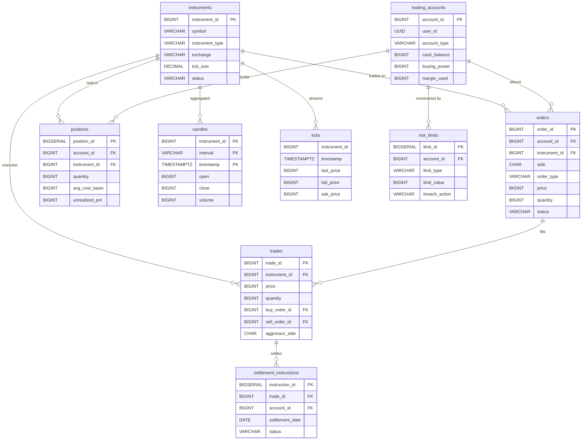
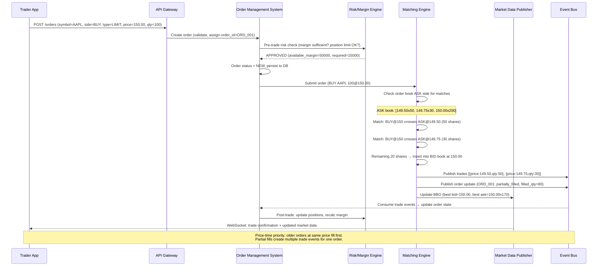
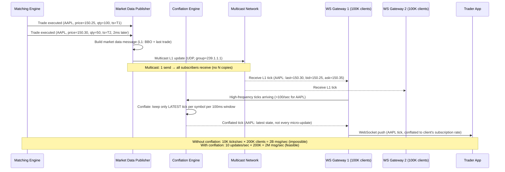
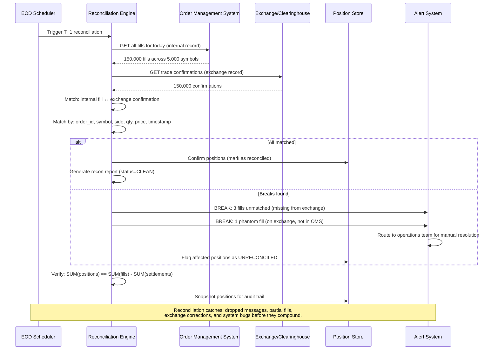

# Trading Platform (Stock Exchange) — System Design

## 1. Functional Requirements

1. **Order Book Management**: Maintain order books for limit/market/stop/stop-limit orders
2. **Matching Engine**: Price-time priority matching with partial fills
3. **Market Data Feed**: Real-time L1 (best bid/ask) and L2 (full depth) quotes
4. **Position Management**: Track holdings, P&L, margin requirements
5. **Risk Checks**: Pre-trade risk validation (margin, position limits, circuit breakers)
6. **Settlement**: T+1/T+2 settlement with DTCC/clearing house integration
7. **Historical Data**: Tick data, OHLCV candles, trade history
8. **Charting**: Real-time and historical price charts
9. **Order Types**: Limit, market, stop, stop-limit, iceberg, FOK, IOC, GTC
10. **Account Management**: Funding, withdrawals, margin calls

## 2. Non-Functional Requirements

| Requirement | Target |
|-------------|--------|
| Matching Latency | < 10μs per match (internal), < 1ms order-to-ack |
| Market Data Latency | < 100μs internal multicast, < 5ms WebSocket |
| Throughput | 1M orders/sec peak, 100K matches/sec |
| Availability | 99.99% during market hours |
| Determinism | Matching must be deterministic and reproducible |
| Fairness | Strict price-time priority (no front-running) |
| Durability | Zero order loss (WAL before matching) |
| Recovery | < 5 min replay from WAL to rebuild state |

## 3. Capacity Estimation

```
Active instruments: 10,000 (stocks, options, futures)
Daily orders: 500M
Daily trades (matches): 50M
Peak orders/sec: 1,000,000
Peak matches/sec: 100,000

Order book depth (per instrument):
- Average levels: 100 price levels per side
- Average orders per level: 50
- Hot instruments: 1000 levels, 200 orders/level
- Memory per book: ~5MB per instrument
- Total book memory: 10K × 5MB = 50GB

Market data:
- L1 updates: 500K/sec (all instruments)
- L2 updates: 5M/sec (all levels)
- Tick data storage: 50M trades × 100B = 5GB/day = 1.8TB/year

Network:
- Multicast bandwidth: 10 Gbps (internal market data)
- Client WebSocket connections: 5M concurrent
- Market data fan-out: 500K updates/sec × 5M clients (conflated)
```

## 4. Data Modeling — Full Schemas

### Entity-Relationship Diagram



```sql
-- Instruments/Securities
CREATE TABLE instruments (
    instrument_id       BIGINT PRIMARY KEY,
    symbol              VARCHAR(20) NOT NULL UNIQUE,
    name                VARCHAR(200) NOT NULL,
    instrument_type     VARCHAR(20) NOT NULL,  -- equity, option, future, etf
    exchange            VARCHAR(10) NOT NULL,
    currency            CHAR(3) NOT NULL,
    lot_size            INTEGER NOT NULL DEFAULT 1,
    tick_size           DECIMAL(10,6) NOT NULL,  -- minimum price increment
    status              VARCHAR(20) DEFAULT 'active',  -- active, halted, delisted
    circuit_breaker_pct DECIMAL(5,2) DEFAULT 20.00,
    margin_requirement  DECIMAL(5,4) DEFAULT 0.5,  -- 50% initial margin
    prev_close          BIGINT,  -- in ticks (fixed-point)
    open_price          BIGINT,
    created_at          TIMESTAMPTZ NOT NULL DEFAULT NOW()
);

-- Orders
CREATE TABLE orders (
    order_id            BIGINT PRIMARY KEY,  -- monotonic, assigned by gateway
    client_order_id     VARCHAR(64) NOT NULL,
    account_id          BIGINT NOT NULL,
    instrument_id       BIGINT NOT NULL,
    side                CHAR(1) NOT NULL,  -- 'B' buy, 'S' sell
    order_type          VARCHAR(10) NOT NULL,
    -- limit, market, stop, stop_limit, iceberg
    time_in_force       VARCHAR(3) NOT NULL,
    -- GTC (good-till-cancel), DAY, IOC (immediate-or-cancel),
    -- FOK (fill-or-kill), GTD (good-till-date)
    price               BIGINT,  -- limit price in ticks (NULL for market)
    stop_price          BIGINT,  -- trigger price for stop orders
    quantity            BIGINT NOT NULL,
    filled_quantity     BIGINT NOT NULL DEFAULT 0,
    remaining_quantity  BIGINT NOT NULL,
    displayed_quantity  BIGINT,  -- for iceberg orders (visible portion)
    avg_fill_price      BIGINT DEFAULT 0,
    status              VARCHAR(20) NOT NULL DEFAULT 'new',
    -- new, partially_filled, filled, canceled, rejected, expired
    reject_reason       VARCHAR(100),
    created_at          TIMESTAMPTZ NOT NULL DEFAULT NOW(),
    updated_at          TIMESTAMPTZ NOT NULL DEFAULT NOW(),
    expires_at          TIMESTAMPTZ
);
CREATE INDEX idx_orders_account ON orders(account_id, created_at DESC);
CREATE INDEX idx_orders_instrument_status ON orders(instrument_id, status)
    WHERE status IN ('new', 'partially_filled');
CREATE INDEX idx_orders_client ON orders(account_id, client_order_id);

-- Trades (executions/fills)
CREATE TABLE trades (
    trade_id            BIGINT PRIMARY KEY,  -- exchange-assigned
    instrument_id       BIGINT NOT NULL,
    price               BIGINT NOT NULL,  -- execution price in ticks
    quantity            BIGINT NOT NULL,
    buy_order_id        BIGINT NOT NULL,
    sell_order_id       BIGINT NOT NULL,
    buy_account_id      BIGINT NOT NULL,
    sell_account_id     BIGINT NOT NULL,
    aggressor_side      CHAR(1) NOT NULL,  -- 'B' or 'S' (taker side)
    trade_time          TIMESTAMPTZ NOT NULL DEFAULT NOW(),
    settlement_date     DATE NOT NULL,
    trade_flags         INTEGER DEFAULT 0  -- bitmask: cross, block, etc.
);
CREATE INDEX idx_trades_instrument_time ON trades(instrument_id, trade_time DESC);
CREATE INDEX idx_trades_account ON trades(buy_account_id, trade_time DESC);
-- Also index sell_account_id

-- Positions
CREATE TABLE positions (
    position_id         BIGSERIAL PRIMARY KEY,
    account_id          BIGINT NOT NULL,
    instrument_id       BIGINT NOT NULL,
    quantity            BIGINT NOT NULL,  -- positive=long, negative=short
    avg_cost_basis      BIGINT NOT NULL,  -- average entry price (ticks)
    realized_pnl       BIGINT NOT NULL DEFAULT 0,
    unrealized_pnl     BIGINT NOT NULL DEFAULT 0,
    market_value        BIGINT NOT NULL DEFAULT 0,
    last_updated        TIMESTAMPTZ NOT NULL DEFAULT NOW(),
    UNIQUE(account_id, instrument_id)
);
CREATE INDEX idx_positions_account ON positions(account_id);

-- Accounts
CREATE TABLE trading_accounts (
    account_id          BIGINT PRIMARY KEY,
    user_id             UUID NOT NULL,
    account_type        VARCHAR(20) NOT NULL,  -- cash, margin, institutional
    currency            CHAR(3) NOT NULL DEFAULT 'USD',
    cash_balance        BIGINT NOT NULL DEFAULT 0,
    buying_power        BIGINT NOT NULL DEFAULT 0,
    margin_used         BIGINT NOT NULL DEFAULT 0,
    equity              BIGINT NOT NULL DEFAULT 0,
    maintenance_margin  BIGINT NOT NULL DEFAULT 0,
    status              VARCHAR(20) DEFAULT 'active',
    risk_tier           VARCHAR(10) DEFAULT 'standard',
    max_order_size      BIGINT DEFAULT 100000,
    max_position_value  BIGINT DEFAULT 10000000000,  -- $100M
    created_at          TIMESTAMPTZ NOT NULL DEFAULT NOW()
);

-- Order Book Snapshots (for recovery)
CREATE TABLE order_book_snapshots (
    snapshot_id         BIGSERIAL PRIMARY KEY,
    instrument_id       BIGINT NOT NULL,
    snapshot_time       TIMESTAMPTZ NOT NULL,
    bids                JSONB NOT NULL,  -- [{price, qty, order_count}]
    asks                JSONB NOT NULL,
    last_order_id       BIGINT NOT NULL,  -- for replay point
    sequence_number     BIGINT NOT NULL
);
CREATE INDEX idx_obs_instrument ON order_book_snapshots(instrument_id, snapshot_time DESC);

-- OHLCV Candles (pre-aggregated)
CREATE TABLE candles (
    instrument_id       BIGINT NOT NULL,
    interval            VARCHAR(5) NOT NULL,  -- 1m, 5m, 15m, 1h, 1d
    timestamp           TIMESTAMPTZ NOT NULL,
    open                BIGINT NOT NULL,
    high                BIGINT NOT NULL,
    low                 BIGINT NOT NULL,
    close               BIGINT NOT NULL,
    volume              BIGINT NOT NULL,
    trade_count         INTEGER NOT NULL,
    vwap                BIGINT NOT NULL,
    PRIMARY KEY (instrument_id, interval, timestamp)
);

-- Market Data Tick Store (TimescaleDB hypertable)
CREATE TABLE ticks (
    instrument_id       BIGINT NOT NULL,
    timestamp           TIMESTAMPTZ NOT NULL,
    bid_price           BIGINT,
    ask_price           BIGINT,
    bid_size            BIGINT,
    ask_size            BIGINT,
    last_price          BIGINT,
    last_size           BIGINT,
    sequence            BIGINT NOT NULL
);
-- TimescaleDB: SELECT create_hypertable('ticks', 'timestamp');
CREATE INDEX idx_ticks_instrument ON ticks(instrument_id, timestamp DESC);

-- Risk Limits
CREATE TABLE risk_limits (
    limit_id            BIGSERIAL PRIMARY KEY,
    account_id          BIGINT NOT NULL,
    limit_type          VARCHAR(30) NOT NULL,
    -- max_order_value, max_position, max_daily_loss, max_orders_per_sec
    limit_value         BIGINT NOT NULL,
    current_usage       BIGINT NOT NULL DEFAULT 0,
    breach_action       VARCHAR(20) NOT NULL,  -- reject, alert, liquidate
    is_active           BOOLEAN DEFAULT TRUE
);
CREATE INDEX idx_risk_account ON risk_limits(account_id, limit_type);

-- Settlement Instructions
CREATE TABLE settlement_instructions (
    instruction_id      BIGSERIAL PRIMARY KEY,
    trade_id            BIGINT NOT NULL REFERENCES trades(trade_id),
    account_id          BIGINT NOT NULL,
    side                CHAR(1) NOT NULL,  -- 'D' deliver, 'R' receive
    instrument_id       BIGINT NOT NULL,
    quantity            BIGINT NOT NULL,
    cash_amount         BIGINT NOT NULL,
    settlement_date     DATE NOT NULL,
    status              VARCHAR(20) DEFAULT 'pending',
    -- pending, matched, settled, failed
    counterparty_id     VARCHAR(50),
    clearing_ref        VARCHAR(100),
    created_at          TIMESTAMPTZ NOT NULL DEFAULT NOW()
);
CREATE INDEX idx_settlement_date ON settlement_instructions(settlement_date, status);
```

## 5. High-Level Design — ASCII Architecture

```
┌─────────────────────────────────────────────────────────────────────────────┐
│                     TRADING PLATFORM ARCHITECTURE                            │
└─────────────────────────────────────────────────────────────────────────────┘

  ┌──────────┐   ┌──────────┐   ┌───────────┐   ┌───────────────┐
  │ Retail   │   │ Algo     │   │ Market   │   │ Institutional │
  │ Traders  │   │ Traders  │   │ Makers   │   │ (FIX 4.4)    │
  │(WebSocket│   │(FIX/REST)│   │(Co-lo)   │   │              │
  └────┬─────┘   └────┬─────┘   └────┬─────┘   └──────┬───────┘
       │               │               │                │
       └───────────────┼───────────────┼────────────────┘
                       │
         ┌─────────────┼─────────────────────┐
         │             │                     │
         ▼             ▼                     ▼
┌──────────────┐ ┌──────────────┐    ┌──────────────┐
│  WebSocket   │ │  FIX        │    │   Co-Lo      │
│  Gateway     │ │  Gateway    │    │   Gateway    │
│  (retail)    │ │  (inst.)    │    │   (kernel    │
│              │ │              │    │    bypass)   │
└──────┬───────┘ └──────┬───────┘    └──────┬───────┘
       │                 │                   │
       └─────────────────┼───────────────────┘
                         │
                         ▼
            ┌──────────────────────────┐
            │    Order Router          │
            │  (Sequence + Validate)   │
            └────────────┬─────────────┘
                         │
              ┌──────────┼──────────┐
              │          │          │
              ▼          ▼          ▼
        ┌──────────┐ ┌──────────┐ ┌──────────┐
        │Pre-Trade │ │  WAL     │ │  Order   │
        │Risk Check│ │ (Write   │ │  Manager │
        │(margin,  │ │  Ahead   │ │  (state) │
        │limits)   │ │  Log)    │ │          │
        └──────────┘ └──────────┘ └──────────┘
                         │
                         ▼
┌─────────────────────────────────────────────────────────┐
│                  MATCHING ENGINE                          │
│  ┌───────────────────────────────────────────────────┐  │
│  │  Per-Instrument Order Book                        │  │
│  │  ┌─────────────────┐  ┌────────────────────────┐ │  │
│  │  │   BID Side       │  │    ASK Side            │ │  │
│  │  │  Price│Qty│Orders│  │  Price│Qty│Orders     │ │  │
│  │  │  100.5│500│ [o1] │  │  100.6│300│ [o5,o6]  │ │  │
│  │  │  100.4│800│[o2,3]│  │  100.7│600│ [o7]     │ │  │
│  │  │  100.3│200│ [o4] │  │  100.8│1000│[o8,o9]  │ │  │
│  │  └─────────────────┘  └────────────────────────┘ │  │
│  │                                                   │  │
│  │  Algorithm: Price-Time Priority (FIFO)           │  │
│  │  Single-threaded per instrument (deterministic)  │  │
│  └───────────────────────────────────────────────────┘  │
└──────────────────────────┬──────────────────────────────┘
                           │
              ┌────────────┼────────────────┐
              │            │                │
              ▼            ▼                ▼
     ┌─────────────┐ ┌──────────┐  ┌──────────────────┐
     │ Trade       │ │ Market   │  │  Position &      │
     │ Reporter    │ │ Data     │  │  Settlement      │
     │(executions) │ │ Publisher│  │  Engine           │
     └─────────────┘ └─────┬────┘  └──────────────────┘
                           │
              ┌────────────┼──────────┐
              │            │          │
              ▼            ▼          ▼
     ┌──────────────┐ ┌────────┐ ┌──────────┐
     │  Multicast   │ │Kafka   │ │WebSocket │
     │  (Internal   │ │(Hist.) │ │(Retail   │
     │   Co-Lo)     │ │        │ │ clients) │
     └──────────────┘ └────────┘ └──────────┘
```

## 6. Low-Level Design — APIs

### Place Order
```http
POST /v1/orders
Authorization: Bearer <jwt_token>
X-Request-Id: req_abc123

{
  "client_order_id": "my_order_001",
  "instrument": "AAPL",
  "side": "buy",
  "order_type": "limit",
  "quantity": 100,
  "price": 185.50,
  "time_in_force": "GTC",
  "displayed_quantity": 50
}
```

**Response (201 Created — within 1ms):**
```json
{
  "order_id": 1000000234,
  "client_order_id": "my_order_001",
  "instrument": "AAPL",
  "side": "buy",
  "order_type": "limit",
  "status": "new",
  "quantity": 100,
  "filled_quantity": 0,
  "remaining_quantity": 100,
  "price": 185.50,
  "time_in_force": "GTC",
  "created_at": "2024-01-15T14:30:00.001234Z",
  "sequence": 50000001
}
```

### WebSocket Market Data Stream
```json
// Subscribe
{"type": "subscribe", "channels": ["orderbook.AAPL", "trades.AAPL"]}

// L2 Order Book Update
{
  "type": "orderbook",
  "symbol": "AAPL",
  "sequence": 50000100,
  "bids": [
    [185.50, 500, 3],
    [185.49, 800, 5],
    [185.48, 1200, 8]
  ],
  "asks": [
    [185.51, 300, 2],
    [185.52, 600, 4],
    [185.53, 1000, 6]
  ],
  "timestamp": "2024-01-15T14:30:00.000123Z"
}

// Trade (execution)
{
  "type": "trade",
  "symbol": "AAPL",
  "trade_id": 9000001,
  "price": 185.51,
  "quantity": 100,
  "aggressor": "buy",
  "timestamp": "2024-01-15T14:30:00.000456Z"
}

// Execution Report (private)
{
  "type": "execution",
  "order_id": 1000000234,
  "client_order_id": "my_order_001",
  "status": "partially_filled",
  "filled_quantity": 50,
  "remaining_quantity": 50,
  "last_fill_price": 185.50,
  "last_fill_quantity": 50,
  "avg_fill_price": 185.50
}
```

### FIX 4.4 New Order Single
```
8=FIX.4.4|9=176|35=D|49=CLIENT01|56=EXCHANGE|34=12|52=20240115-14:30:00.001|
11=my_order_001|55=AAPL|54=1|38=100|40=2|44=185.50|59=1|60=20240115-14:30:00|
10=234|
```

## 7. Deep Dives

### Deep Dive 1: Matching Engine — Order Book Data Structure

**Data Structure: Sorted Price Levels with FIFO Queues**

```cpp
#include <map>
#include <deque>
#include <memory>
#include <cstdint>

// Fixed-point price representation (avoid floating point)
using Price = int64_t;  // price × 10000 (4 decimal places)
using Quantity = int64_t;
using OrderId = int64_t;

struct Order {
    OrderId order_id;
    int64_t account_id;
    Price price;
    Quantity quantity;
    Quantity remaining;
    Quantity displayed;   // for iceberg
    Quantity hidden;      // iceberg hidden portion
    uint64_t timestamp;   // nanosecond precision
    uint8_t side;         // 0=buy, 1=sell
    uint8_t type;         // limit, market, etc.
    uint8_t tif;          // time in force
};

struct PriceLevel {
    Price price;
    Quantity total_quantity;
    int order_count;
    std::deque<Order*> orders;  // FIFO queue

    void add_order(Order* order) {
        orders.push_back(order);
        total_quantity += order->displayed;
        order_count++;
    }

    void remove_order(Order* order) {
        // O(n) but price levels are typically small
        orders.erase(std::find(orders.begin(), orders.end(), order));
        total_quantity -= order->displayed;
        order_count--;
    }
};

class OrderBook {
    // Bids: sorted descending (highest price first)
    std::map<Price, PriceLevel, std::greater<Price>> bids_;
    // Asks: sorted ascending (lowest price first)
    std::map<Price, PriceLevel, std::less<Price>> asks_;

    // Order lookup for cancel/modify: O(1)
    std::unordered_map<OrderId, Order*> order_map_;

    // Pre-allocated memory pool
    ObjectPool<Order> order_pool_;

    int64_t instrument_id_;
    int64_t sequence_;
    Price last_trade_price_;

public:
    struct MatchResult {
        std::vector<Trade> trades;
        Order* remaining_order;  // NULL if fully filled
    };

    MatchResult add_order(Order* new_order) {
        MatchResult result;

        if (new_order->type == OrderType::MARKET ||
            new_order->type == OrderType::LIMIT) {
            // Try to match against opposite side
            match(new_order, result);
        }

        // If order has remaining quantity and is not IOC/FOK
        if (new_order->remaining > 0) {
            if (new_order->tif == TIF::IOC) {
                cancel_remaining(new_order);
            } else if (new_order->tif == TIF::FOK && result.trades.empty()) {
                // Fill-or-Kill: cancel entirely if not fully filled
                // (actually shouldn't have matched partially — check before)
            } else if (new_order->type == OrderType::LIMIT) {
                // Rest on book
                insert_to_book(new_order);
            }
        }
        return result;
    }

private:
    void match(Order* aggressor, MatchResult& result) {
        auto& passive_side = (aggressor->side == Side::BUY) ? asks_ : bids_;

        while (aggressor->remaining > 0 && !passive_side.empty()) {
            auto& [level_price, level] = *passive_side.begin();

            // Price check for limit orders
            if (aggressor->type == OrderType::LIMIT) {
                if (aggressor->side == Side::BUY && level_price > aggressor->price)
                    break;
                if (aggressor->side == Side::SELL && level_price < aggressor->price)
                    break;
            }

            // Match against orders at this price level (FIFO)
            while (aggressor->remaining > 0 && !level.orders.empty()) {
                Order* passive = level.orders.front();
                Quantity fill_qty = std::min(aggressor->remaining, passive->displayed);

                // Create trade
                Trade trade;
                trade.trade_id = ++sequence_;
                trade.price = level_price;
                trade.quantity = fill_qty;
                trade.buy_order_id = (aggressor->side == Side::BUY) ?
                    aggressor->order_id : passive->order_id;
                trade.sell_order_id = (aggressor->side == Side::SELL) ?
                    aggressor->order_id : passive->order_id;
                trade.aggressor_side = aggressor->side;
                result.trades.push_back(trade);

                // Update quantities
                aggressor->remaining -= fill_qty;
                passive->displayed -= fill_qty;
                passive->remaining -= fill_qty;
                level.total_quantity -= fill_qty;

                // Handle iceberg: refill displayed from hidden
                if (passive->displayed == 0 && passive->hidden > 0) {
                    Quantity refill = std::min(passive->hidden,
                                             passive->quantity / 10); // 10% visible
                    passive->displayed = refill;
                    passive->hidden -= refill;
                    level.total_quantity += refill;
                    // Move to back of queue (loses time priority)
                    level.orders.pop_front();
                    level.orders.push_back(passive);
                } else if (passive->remaining == 0) {
                    // Fully filled — remove from book
                    level.orders.pop_front();
                    level.order_count--;
                    order_map_.erase(passive->order_id);
                    order_pool_.release(passive);
                }
            }

            // Remove empty price level
            if (level.orders.empty()) {
                passive_side.erase(passive_side.begin());
            }
        }

        last_trade_price_ = result.trades.empty() ?
            last_trade_price_ : result.trades.back().price;
    }

    void insert_to_book(Order* order) {
        auto& side = (order->side == Side::BUY) ? bids_ : asks_;
        auto& level = side[order->price];
        level.price = order->price;
        level.add_order(order);
        order_map_[order->order_id] = order;
    }
};
```

### Deep Dive 2: Ultra-Low Latency Architecture

**Problem**: Competitive exchanges need sub-10μs matching latency. Standard networking/OS adds milliseconds.

**Techniques**:

```
┌─────────────────────────────────────────────────────────┐
│              LOW-LATENCY STACK                           │
├─────────────────────────────────────────────────────────┤
│                                                         │
│  Layer 1: Kernel Bypass (DPDK/Solarflare OpenOnload)   │
│  ┌─────────────────────────────────────────────────┐   │
│  │ • Bypass kernel TCP/IP stack                    │   │
│  │ • User-space networking: NIC → App directly     │   │
│  │ • Zero-copy DMA from NIC to app memory          │   │
│  │ • Busy-polling (no interrupts, no context switch)│   │
│  │ • Result: ~2μs network latency vs ~50μs kernel  │   │
│  └─────────────────────────────────────────────────┘   │
│                                                         │
│  Layer 2: Lock-Free Data Structures                    │
│  ┌─────────────────────────────────────────────────┐   │
│  │ • Single-writer principle (one thread per book)  │   │
│  │ • SPSC ring buffers for inter-thread comms      │   │
│  │ • No mutexes, no syscalls in hot path           │   │
│  │ • CAS-based atomic counters only                │   │
│  └─────────────────────────────────────────────────┘   │
│                                                         │
│  Layer 3: Memory Management                            │
│  ┌─────────────────────────────────────────────────┐   │
│  │ • Pre-allocated object pools (no malloc in hot) │   │
│  │ • Huge pages (2MB) — reduce TLB misses          │   │
│  │ • NUMA-aware allocation (pin to local node)     │   │
│  │ • Cache-line aligned structures (64 bytes)      │   │
│  │ • Avoid false sharing between threads           │   │
│  └─────────────────────────────────────────────────┘   │
│                                                         │
│  Layer 4: CPU Optimization                             │
│  ┌─────────────────────────────────────────────────┐   │
│  │ • CPU pinning (isolcpus for matching threads)   │   │
│  │ • Disable hyperthreading on critical cores      │   │
│  │ • Disable C-states (no CPU sleep)               │   │
│  │ • Real-time scheduling (SCHED_FIFO)            │   │
│  │ • Prefetch data for predictable access patterns │   │
│  └─────────────────────────────────────────────────┘   │
│                                                         │
│  Layer 5: JIT/AOT Compilation                          │
│  ┌─────────────────────────────────────────────────┐   │
│  │ • C++ with -O3 -march=native                    │   │
│  │ • Branch prediction hints (likely/unlikely)     │   │
│  │ • Inline critical path functions                │   │
│  │ • Profile-guided optimization (PGO)             │   │
│  └─────────────────────────────────────────────────┘   │
└─────────────────────────────────────────────────────────┘
```

**Lock-Free Ring Buffer (SPSC)**:
```cpp
template<typename T, size_t SIZE>
class SPSCRingBuffer {
    // SIZE must be power of 2
    static_assert((SIZE & (SIZE - 1)) == 0);

    alignas(64) std::atomic<uint64_t> write_idx_{0};
    alignas(64) std::atomic<uint64_t> read_idx_{0};
    alignas(64) T buffer_[SIZE];

public:
    bool try_push(const T& item) {
        uint64_t write = write_idx_.load(std::memory_order_relaxed);
        uint64_t read = read_idx_.load(std::memory_order_acquire);

        if (write - read >= SIZE) return false;  // full

        buffer_[write & (SIZE - 1)] = item;
        write_idx_.store(write + 1, std::memory_order_release);
        return true;
    }

    bool try_pop(T& item) {
        uint64_t read = read_idx_.load(std::memory_order_relaxed);
        uint64_t write = write_idx_.load(std::memory_order_acquire);

        if (read >= write) return false;  // empty

        item = buffer_[read & (SIZE - 1)];
        read_idx_.store(read + 1, std::memory_order_release);
        return true;
    }
};
```

### Deep Dive 3: Market Data Distribution

**Problem**: Distribute millions of updates/second to diverse consumers with different speed requirements.

```
┌───────────────────────────────────────────────────────────────┐
│               MARKET DATA DISTRIBUTION                        │
├───────────────────────────────────────────────────────────────┤
│                                                               │
│  Matching Engine ──▶ Market Data Publisher                    │
│                          │                                    │
│        ┌─────────────────┼─────────────────────┐             │
│        │                 │                     │             │
│        ▼                 ▼                     ▼             │
│  ┌──────────┐    ┌──────────────┐    ┌──────────────────┐   │
│  │ Multicast│    │   Kafka      │    │  WebSocket       │   │
│  │ (UDP)    │    │   (Durable)  │    │  Fan-Out         │   │
│  │          │    │              │    │                  │   │
│  │ Latency: │    │ Latency:     │    │ Latency:         │   │
│  │  <100μs  │    │  <10ms       │    │  <50ms           │   │
│  │          │    │              │    │                  │   │
│  │ Audience:│    │ Audience:    │    │ Audience:        │   │
│  │ Co-lo HFT│    │ Internal     │    │ Retail (5M)      │   │
│  │ Market   │    │ Services,    │    │                  │   │
│  │ Makers   │    │ Analytics    │    │ Conflation:      │   │
│  │          │    │              │    │ Max 10 updates/s │   │
│  └──────────┘    └──────────────┘    └──────────────────┘   │
│                                                               │
└───────────────────────────────────────────────────────────────┘
```

**Conflation for Slow Consumers**:
```python
class MarketDataConflator:
    """
    For retail WebSocket clients that can't handle full speed,
    conflate (merge) updates — always send latest state.
    """

    def __init__(self, max_rate_per_sec=10):
        self.max_rate = max_rate_per_sec
        self.interval = 1.0 / max_rate_per_sec
        self.pending: dict[str, dict] = {}  # symbol -> latest update
        self.last_sent: dict[str, float] = {}

    async def on_market_data(self, symbol: str, update: dict):
        """Called on every market data update. Conflates for slow consumers."""
        self.pending[symbol] = update  # Always overwrite with latest

    async def flush_loop(self):
        """Periodic flush: send conflated state to client."""
        while True:
            await asyncio.sleep(self.interval)
            to_send = self.pending.copy()
            self.pending.clear()

            for symbol, update in to_send.items():
                await self.send_to_client(symbol, update)

    async def send_to_client(self, symbol: str, update: dict):
        """Send latest conflated update."""
        message = {
            "type": "orderbook",
            "symbol": symbol,
            "bids": update['bids'][:5],  # Top 5 levels for retail
            "asks": update['asks'][:5],
            "timestamp": update['timestamp'],
            "conflated": True
        }
        await self.ws.send(json.dumps(message))
```

## 8. Component Optimization

### Kafka Configuration
```yaml
kafka:
  topics:
    exchange.orders:
      partitions: 256  # partition by instrument_id
      replication_factor: 3
      retention_ms: 86400000  # 1 day (orders journal)
      min.insync.replicas: 2
    exchange.trades:
      partitions: 128
      replication_factor: 3
      retention_ms: 2592000000  # 30 days
    market.data.l2:
      partitions: 64
      replication_factor: 2
      retention_ms: 3600000  # 1 hour (real-time only)
      cleanup.policy: delete
  producer:
    acks: 1  # fast ack for market data (replicated async)
    linger.ms: 0  # no batching for latency
    compression.type: none  # speed over size
    buffer.memory: 268435456  # 256MB
```

### Redis Configuration
```yaml
redis:
  cluster:
    nodes: 6
    max_memory: 32GB per node
  use_cases:
    order_state_cache:
      pattern: "order:{order_id}"
      ttl: 86400  # 1 day
    position_cache:
      pattern: "pos:{account_id}:{instrument_id}"
      strategy: write-through
    rate_limiter:
      pattern: "rl:orders:{account_id}"
      limit: 100/sec
    instrument_status:
      pattern: "inst:{instrument_id}:status"
      # halted, circuit_breaker, etc.
```

### Network Optimization
```
Hardware:
- Solarflare X2522 NICs (kernel bypass capable)
- Mellanox ConnectX-6 (25/100 GbE)
- FPGA for order validation offload (Xilinx)
- Bare metal servers (no virtualization overhead)
- Co-location in exchange data center

OS Tuning:
- isolcpus=4-15 (reserve cores for matching)
- nohz_full=4-15 (tickless for isolated cores)
- transparent_hugepage=always
- vm.swappiness=0
- net.core.busy_read=50
- net.core.busy_poll=50
```

## 9. Observability

### Key Metrics
```yaml
metrics:
  matching_engine:
    - match_latency_ns{instrument}  # histogram (nanoseconds!)
    - orders_per_second{side,type}
    - matches_per_second{instrument}
    - book_depth{instrument,side}  # number of price levels
    - spread_bps{instrument}  # bid-ask spread

  market_data:
    - market_data_latency_us{channel}  # multicast, kafka, websocket
    - conflation_ratio{client_tier}
    - websocket_connections_total
    - messages_published_per_second

  risk:
    - risk_check_latency_us
    - risk_rejections_total{reason}
    - margin_utilization_pct{account_tier}
    - circuit_breaker_triggers_total{instrument}

  settlement:
    - settlement_pending_total{date}
    - settlement_fails_total
    - position_breaks_total  # mismatch between expected and actual

alerts:
  - alert: MatchingLatencySpike
    expr: histogram_quantile(0.999, match_latency_ns) > 100000  # >100μs
    for: 1m
  - alert: OrderBookEmpty
    expr: book_depth == 0
    for: 30s  # possible market halt needed
  - alert: CircuitBreakerTriggered
    expr: increase(circuit_breaker_triggers_total[1m]) > 0
    for: 0s  # immediate notification
```

### Latency Measurement
```
Critical path timing (hardware timestamping):
──────────────────────────────────────────────
NIC ingress         → t0
Parse order         → t0 + 0.5μs
Risk check          → t0 + 2μs
WAL write           → t0 + 3μs
Match               → t0 + 5μs
Execution report    → t0 + 7μs
Market data publish → t0 + 8μs
NIC egress          → t0 + 9μs
──────────────────────────────────────────────
Total wire-to-wire: ~10μs (co-located)
```

## 10. Considerations

### Fairness & Regulation
- **Sequence number assignment** at gateway (deterministic ordering)
- **No special access** — same matching rules for all participants
- **Circuit breakers**: Halt trading if price moves > X% in Y seconds
- **Market surveillance**: Detect wash trading, spoofing, layering
- **Audit trail**: Complete order lifecycle with nanosecond timestamps

### Failure Modes
| Failure | Impact | Mitigation |
|---------|--------|------------|
| Matching engine crash | Trading halted | WAL replay < 5 min, hot standby |
| Network partition | Split-brain | Fencing + epoch-based leader election |
| Market data loss | Stale quotes | Sequence gaps detected, snapshot resync |
| Risk engine slow | Order rejection | Cached pre-computed limits, fallback |
| Settlement failure | T+2 breach | Manual resolution + penalty |

### Recovery Procedure
```
1. Matching engine crash detected (heartbeat timeout)
2. Standby promoted (< 1 second)
3. Halt accepting new orders
4. Load latest order book snapshot
5. Replay WAL from snapshot point
6. Verify state matches (hash comparison)
7. Resume accepting orders
8. Publish recovery message to all clients
Total RTO: < 5 minutes (regulatory requirement < 30 min)
```

### Scalability
- **Horizontal by instrument**: Each order book runs on dedicated core
- **Sharding**: Instruments distributed across matching engines
- **Market data**: Multicast eliminates N×M fan-out problem
- **Historical data**: TimescaleDB with automatic compression + retention
- **Client connections**: WebSocket servers scale independently from matching

---

## 12. Sequence Diagrams

### Diagram 1: Limit Order Placement + Matching



### Diagram 2: Market Data Tick Distribution



### Diagram 3: Position Reconciliation



## 13. Caching Strategy

### Rate/Pricing & Order Book Caching

```
TRADING PLATFORM CACHING

1. ORDER BOOK — IN-MEMORY (Not cached, it IS the primary store)
   The matching engine's order book lives in RAM on dedicated cores.
   NOT a cache — it IS the authoritative state.
   Persisted: async snapshots every 1s + WAL of all order events
   Recovery: replay WAL from last snapshot

2. MARKET DATA CACHE (L1/L2 quotes)
   Key: md:{symbol}:l1
   Storage: Redis (for API queries) + local memory (for WebSocket gateways)
   TTL: None (overwritten on every tick, ~10-100/sec per active symbol)
   Staleness: Acceptable up to 1 second for retail; <1ms for co-located
   
3. REFERENCE DATA CACHE
   Key: ref:{symbol}:info
   Content: lot_size, tick_size, trading_hours, circuit_limits
   TTL: Until market open (refreshed daily pre-market)
   Source: Exchange reference data feed
   
4. POSITION CACHE (Write-through)
   Key: pos:{account}:{symbol}
   Updated: On every fill (within same Redis MULTI as position DB update)
   Used for: Real-time P&L display, margin calculation
   CRITICAL: Stale position → wrong margin → risk breach
   
5. MARGIN/RISK CACHE
   Key: margin:{account}:available
   TTL: None (updated on every trade + every price tick for marked-to-market)
   Pattern: Write-through on trade, periodic refresh on tick

WHY EVENTUAL CONSISTENCY IS DANGEROUS:
- Stale margin → allow order that should be rejected → naked exposure
- Stale position → wrong P&L → trader makes bad decisions
- Stale order book → crossed book → arbitrage opportunity

WHERE EVENTUAL CONSISTENCY IS ACCEPTABLE:
- Historical trade queries (seconds of lag OK)
- P&L reporting (end-of-day exact, intraday approximate is fine)
- Client portfolio view (1-2 second delay acceptable for retail)
```

## 14. Algorithm Deep Dive: Order Book Matching Engine

### Price-Time Priority Matching (Step-by-Step)

```
ORDER BOOK MATCHING ENGINE — CONTINUOUS DOUBLE AUCTION

DATA STRUCTURE:
  BID side (buy orders):  Max-heap by price, FIFO within same price
  ASK side (sell orders): Min-heap by price, FIFO within same price

┌─────────────────────────────────────────────────────────────┐
│ INITIAL ORDER BOOK STATE (AAPL)                              │
├─────────────────────────────────────────────────────────────┤
│ BID (buyers)              │ ASK (sellers)                    │
│ Price    Qty   Time       │ Price    Qty   Time              │
│ ─────────────────────     │ ─────────────────────            │
│ 150.00   200   09:30:01   │ 150.25   100   09:30:00         │
│ 150.00   100   09:30:05   │ 150.25   50    09:30:03         │
│ 149.95   300   09:29:50   │ 150.50   500   09:29:55         │
│ 149.90   150   09:29:45   │ 151.00   200   09:29:40         │
├─────────────────────────────────────────────────────────────┤
│ Best Bid: 150.00 (300 total)  │  Best Ask: 150.25 (150 total)│
│ Spread: $0.25                                                │
└─────────────────────────────────────────────────────────────┘

INCOMING ORDER: BUY 200 shares @ LIMIT 150.50

MATCHING ALGORITHM:
  Step 1: Compare order price (150.50) with best ask (150.25)
          150.50 >= 150.25 → MATCH possible (buyer willing to pay ask price)
  
  Step 2: Fill against ASK@150.25, time priority:
          - Fill 100 shares @ 150.25 from order at 09:30:00 (oldest first)
          - Fill 50 shares @ 150.25 from order at 09:30:03
          - Total filled at 150.25: 150 shares
          - Remaining to fill: 200 - 150 = 50 shares
  
  Step 3: Move to next price level. Best ask now = 150.50
          150.50 >= 150.50 → MATCH possible
          - Fill 50 shares @ 150.50 (from the 500-share order)
          - Remaining to fill: 0 shares → ORDER FULLY FILLED
  
  TRADE REPORT:
    Trade 1: BUY 100 AAPL @ 150.25 (aggressive order gets price improvement!)
    Trade 2: BUY 50 AAPL @ 150.25
    Trade 3: BUY 50 AAPL @ 150.50
    Average fill price: (100×150.25 + 50×150.25 + 50×150.50) / 200 = $150.3125

  RESULTING ORDER BOOK:
  │ BID (buyers)              │ ASK (sellers)                    │
  │ 150.00   200   09:30:01   │ 150.50   450   09:29:55         │
  │ 150.00   100   09:30:05   │ 151.00   200   09:29:40         │
  │ 149.95   300   09:29:50   │                                  │
  │ 149.90   150   09:29:45   │                                  │
  
  New spread: 150.00 / 150.50 = $0.50 (wider, liquidity consumed)

IMPLEMENTATION (simplified):
```

```python
from sortedcontainers import SortedList
from collections import deque
from dataclasses import dataclass
import time

@dataclass
class Order:
    id: str
    side: str       # "BUY" or "SELL"
    price: float
    quantity: int
    timestamp: float
    remaining: int = None
    
    def __post_init__(self):
        self.remaining = self.remaining or self.quantity

class OrderBook:
    def __init__(self, symbol: str):
        self.symbol = symbol
        # price -> deque of orders (FIFO within price level)
        self.bids: dict[float, deque] = {}  # sorted desc by price
        self.asks: dict[float, deque] = {}  # sorted asc by price
        self.bid_prices = SortedList()      # sorted descending
        self.ask_prices = SortedList()      # sorted ascending
        self.trades = []
    
    def add_order(self, order: Order) -> list:
        """Returns list of trades generated"""
        trades = []
        
        if order.side == "BUY":
            trades = self._match_buy(order)
            if order.remaining > 0:
                self._insert_bid(order)
        else:
            trades = self._match_sell(order)
            if order.remaining > 0:
                self._insert_ask(order)
        
        return trades
    
    def _match_buy(self, order: Order) -> list:
        """Match incoming buy against ask side"""
        trades = []
        
        while order.remaining > 0 and self.ask_prices:
            best_ask_price = self.ask_prices[0]
            
            # Check if buy price >= best ask (willing to pay)
            if order.price < best_ask_price:
                break  # No more matches possible
            
            # Fill against orders at this price level (FIFO)
            level = self.asks[best_ask_price]
            while order.remaining > 0 and level:
                resting_order = level[0]
                fill_qty = min(order.remaining, resting_order.remaining)
                
                # Execute trade at RESTING order's price (price improvement for aggressor)
                trade = {
                    "symbol": self.symbol,
                    "price": best_ask_price,
                    "quantity": fill_qty,
                    "buyer_order": order.id,
                    "seller_order": resting_order.id,
                    "timestamp": time.time()
                }
                trades.append(trade)
                
                order.remaining -= fill_qty
                resting_order.remaining -= fill_qty
                
                if resting_order.remaining == 0:
                    level.popleft()  # Remove fully filled order
            
            # Remove empty price level
            if not level:
                del self.asks[best_ask_price]
                self.ask_prices.remove(best_ask_price)
        
        return trades
    
    def _insert_bid(self, order: Order):
        """Insert unfilled remainder into bid book"""
        if order.price not in self.bids:
            self.bids[order.price] = deque()
            self.bid_prices.add(-order.price)  # Negative for desc sort
        self.bids[order.price].append(order)
```

```
PERFORMANCE CHARACTERISTICS:
- Match single order: O(1) best case, O(levels × orders_per_level) worst case
- In practice: >99% of matches hit only 1-2 price levels
- Insert (no match): O(log P) where P = number of distinct price levels
- Cancel: O(1) with order_id → order lookup hash map

LATENCY BUDGET:
- Receive order from network: ~5μs
- Deserialize: ~2μs
- Match + generate trades: ~1-3μs
- Publish trades to multicast: ~5μs
- Total: <20μs per order (single-threaded, pinned to CPU core)

WHY SINGLE-THREADED:
- No locking overhead (lock-free by design)
- CPU cache locality (entire book fits in L3)
- Deterministic replay (important for audit + disaster recovery)
- Each symbol's book runs on its own dedicated core
```
