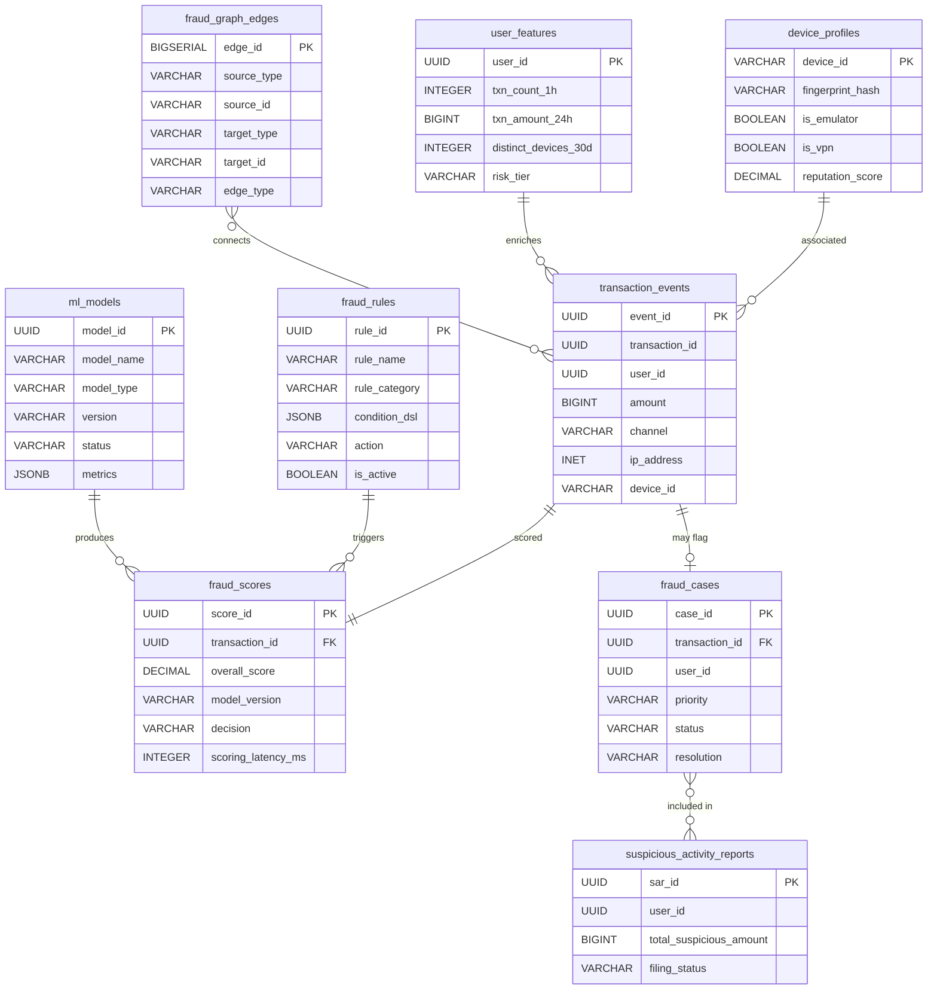
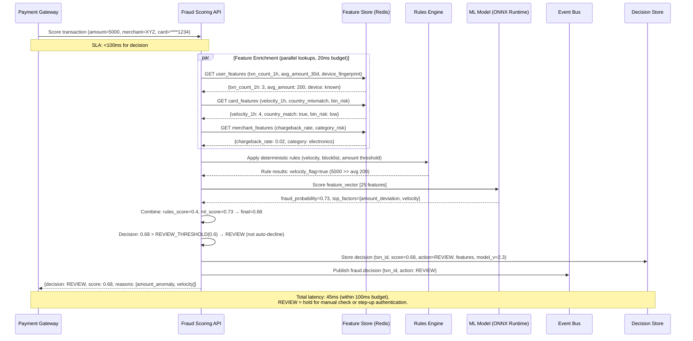
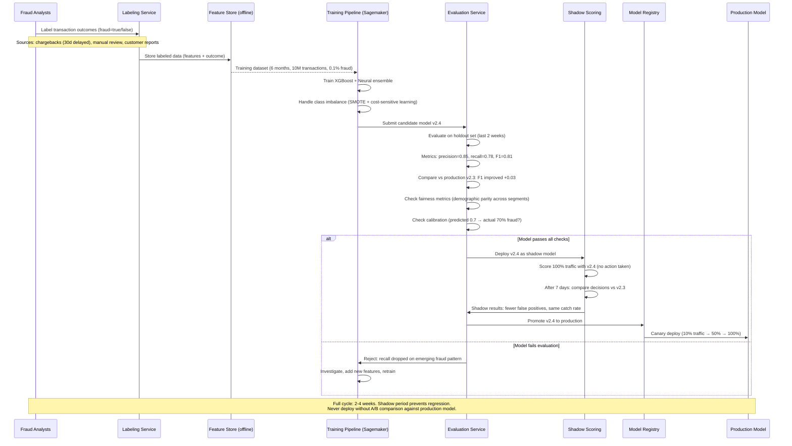

# Fraud Detection Platform — System Design

## 1. Functional Requirements

1. **Real-Time Transaction Scoring**: Score every transaction within 100ms with fraud probability
2. **Rule Engine**: Configurable rules (velocity, geo-anomaly, device fingerprint, amount thresholds)
3. **ML Models**: Supervised classification + unsupervised anomaly detection
4. **Case Management**: Analyst workflow for investigating flagged transactions
5. **Feedback Loop**: Analyst decisions feed back into model training
6. **False Positive Management**: Minimize customer friction from false blocks
7. **Network/Graph Analysis**: Detect fraud rings via transaction graph patterns
8. **Regulatory Reporting**: Suspicious Activity Reports (SAR) generation
9. **Device Intelligence**: Fingerprinting, reputation scoring, emulator detection
10. **Real-Time Alerting**: Instant alerts on high-confidence fraud patterns

## 2. Non-Functional Requirements

| Requirement | Target |
|-------------|--------|
| Scoring Latency (p99) | < 100ms (inline with payment flow) |
| Throughput | 100K transactions/sec |
| Availability | 99.99% (fraud system down = money lost) |
| Model Accuracy | > 95% precision at > 80% recall |
| False Positive Rate | < 0.5% of legitimate transactions |
| Feature Freshness | < 1 second for velocity features |
| Model Update | < 4 hours from label to retrained model |
| Data Retention | 5 years (regulatory) |

## 3. Capacity Estimation

```
Daily transactions: 500M
Transactions requiring deep scoring: 50M (10% — risk-flagged)
Real-time features computed: 500M × 200 features = 100B feature computations/day
Peak TPS: 100K

Feature store:
- 200M users × 500 features × 8B = 800GB (hot features in Redis)
- Historical features (cold): 50TB (data lake)

ML model:
- GBT model size: 500MB
- Neural network: 2GB
- Inference: 100K predictions/sec (GPU cluster)

Graph database:
- Nodes: 500M (users, devices, merchants, cards)
- Edges: 5B (transactions, connections)
- Graph queries: 50K/sec

Alert volume:
- Flagged transactions: 500K/day (0.1% flag rate)
- Analyst reviews: 50K/day
- Confirmed fraud: 5K/day
```

## 4. Data Modeling — Full Schemas

### Entity-Relationship Diagram



```sql
-- Transaction Events (source of truth for scoring)
CREATE TABLE transaction_events (
    event_id            UUID PRIMARY KEY,
    transaction_id      UUID NOT NULL,
    user_id             UUID NOT NULL,
    merchant_id         UUID,
    amount              BIGINT NOT NULL,
    currency            CHAR(3) NOT NULL,
    transaction_type    VARCHAR(20) NOT NULL,  -- purchase, transfer, withdrawal
    channel             VARCHAR(20) NOT NULL,  -- online, pos, atm, mobile
    card_token          VARCHAR(64),
    device_id           VARCHAR(128),
    ip_address          INET,
    geo_lat             DECIMAL(9,6),
    geo_lng             DECIMAL(9,6),
    country_code        CHAR(2),
    merchant_category   CHAR(4),  -- MCC
    is_international    BOOLEAN,
    event_time          TIMESTAMPTZ NOT NULL,
    received_at         TIMESTAMPTZ NOT NULL DEFAULT NOW()
);
CREATE INDEX idx_txn_events_user ON transaction_events(user_id, event_time DESC);
CREATE INDEX idx_txn_events_time ON transaction_events(event_time DESC);

-- Fraud Scores
CREATE TABLE fraud_scores (
    score_id            UUID PRIMARY KEY DEFAULT gen_random_uuid(),
    transaction_id      UUID NOT NULL,
    event_id            UUID NOT NULL,
    overall_score       DECIMAL(5,4) NOT NULL,  -- 0.0000 to 1.0000
    model_version       VARCHAR(20) NOT NULL,
    rule_score          DECIMAL(5,4),
    ml_score            DECIMAL(5,4),
    graph_score         DECIMAL(5,4),
    decision            VARCHAR(20) NOT NULL,  -- approve, review, block
    decision_reason     VARCHAR(100),
    rules_triggered     JSONB DEFAULT '[]',
    feature_values      JSONB,  -- key features used for explainability
    scoring_latency_ms  INTEGER NOT NULL,
    scored_at           TIMESTAMPTZ NOT NULL DEFAULT NOW()
);
CREATE INDEX idx_scores_txn ON fraud_scores(transaction_id);
CREATE INDEX idx_scores_decision ON fraud_scores(decision, scored_at);

-- Rules Configuration
CREATE TABLE fraud_rules (
    rule_id             UUID PRIMARY KEY DEFAULT gen_random_uuid(),
    rule_name           VARCHAR(100) NOT NULL UNIQUE,
    rule_category       VARCHAR(30) NOT NULL,
    -- velocity, geo, amount, device, pattern, blacklist
    description         TEXT,
    condition_dsl       JSONB NOT NULL,  -- rule definition (DSL)
    action              VARCHAR(20) NOT NULL,  -- flag, block, score_boost
    score_impact        DECIMAL(3,2),  -- how much to add/multiply
    priority            INTEGER DEFAULT 100,
    is_active           BOOLEAN DEFAULT TRUE,
    created_by          VARCHAR(100),
    created_at          TIMESTAMPTZ NOT NULL DEFAULT NOW(),
    updated_at          TIMESTAMPTZ NOT NULL DEFAULT NOW()
);

-- Example rule DSL:
-- {"type": "velocity", "metric": "txn_count", "window": "1h",
--  "threshold": 10, "comparison": "gt"}
-- {"type": "geo_velocity", "max_speed_kmh": 900,
--  "min_time_between_txns_min": 5}

-- Cases (analyst investigation queue)
CREATE TABLE fraud_cases (
    case_id             UUID PRIMARY KEY DEFAULT gen_random_uuid(),
    transaction_id      UUID NOT NULL,
    user_id             UUID NOT NULL,
    score               DECIMAL(5,4) NOT NULL,
    priority            VARCHAR(10) NOT NULL,  -- critical, high, medium, low
    status              VARCHAR(20) NOT NULL DEFAULT 'open',
    -- open, assigned, investigating, resolved
    assigned_to         VARCHAR(100),
    resolution          VARCHAR(20),
    -- confirmed_fraud, false_positive, inconclusive
    resolution_notes    TEXT,
    sla_deadline        TIMESTAMPTZ,
    created_at          TIMESTAMPTZ NOT NULL DEFAULT NOW(),
    resolved_at         TIMESTAMPTZ,
    resolution_time_min INTEGER  -- time from creation to resolution
);
CREATE INDEX idx_cases_status ON fraud_cases(status, priority, created_at);
CREATE INDEX idx_cases_analyst ON fraud_cases(assigned_to, status);
CREATE INDEX idx_cases_user ON fraud_cases(user_id);

-- Feature Store (real-time features)
CREATE TABLE user_features (
    user_id             UUID PRIMARY KEY,
    -- Velocity features (updated in real-time via Flink)
    txn_count_1h        INTEGER DEFAULT 0,
    txn_count_24h       INTEGER DEFAULT 0,
    txn_count_7d        INTEGER DEFAULT 0,
    txn_amount_1h       BIGINT DEFAULT 0,
    txn_amount_24h      BIGINT DEFAULT 0,
    txn_amount_7d       BIGINT DEFAULT 0,
    distinct_merchants_24h INTEGER DEFAULT 0,
    distinct_countries_7d  INTEGER DEFAULT 0,
    avg_txn_amount_30d  BIGINT DEFAULT 0,
    max_txn_amount_30d  BIGINT DEFAULT 0,
    -- Device features
    distinct_devices_30d INTEGER DEFAULT 0,
    new_device_flag     BOOLEAN DEFAULT FALSE,
    -- Behavioral
    typical_txn_hour    SMALLINT,  -- most common hour (0-23)
    typical_mcc_codes   CHAR(4)[],
    last_txn_country    CHAR(2),
    last_txn_time       TIMESTAMPTZ,
    last_txn_geo_lat    DECIMAL(9,6),
    last_txn_geo_lng    DECIMAL(9,6),
    -- Account features
    account_age_days    INTEGER,
    kyc_level           SMALLINT,
    chargeback_count_90d INTEGER DEFAULT 0,
    -- Model outputs (cached)
    risk_tier           VARCHAR(10),  -- low, medium, high
    updated_at          TIMESTAMPTZ DEFAULT NOW()
);

-- Device Intelligence
CREATE TABLE device_profiles (
    device_id           VARCHAR(128) PRIMARY KEY,
    fingerprint_hash    VARCHAR(64) NOT NULL,
    device_type         VARCHAR(20),  -- mobile, desktop, tablet
    os                  VARCHAR(50),
    browser             VARCHAR(50),
    screen_resolution   VARCHAR(20),
    timezone            VARCHAR(50),
    language            VARCHAR(10),
    is_emulator         BOOLEAN DEFAULT FALSE,
    is_rooted           BOOLEAN DEFAULT FALSE,
    is_vpn              BOOLEAN DEFAULT FALSE,
    reputation_score    DECIMAL(5,4) DEFAULT 0.5,
    first_seen          TIMESTAMPTZ NOT NULL DEFAULT NOW(),
    last_seen           TIMESTAMPTZ NOT NULL DEFAULT NOW(),
    associated_users    UUID[] DEFAULT '{}',
    fraud_association_count INTEGER DEFAULT 0
);
CREATE INDEX idx_device_fingerprint ON device_profiles(fingerprint_hash);
CREATE INDEX idx_device_reputation ON device_profiles(reputation_score)
    WHERE reputation_score < 0.3;

-- Graph Edges (for network analysis)
CREATE TABLE fraud_graph_edges (
    edge_id             BIGSERIAL PRIMARY KEY,
    source_type         VARCHAR(20) NOT NULL,  -- user, device, card, merchant, ip
    source_id           VARCHAR(128) NOT NULL,
    target_type         VARCHAR(20) NOT NULL,
    target_id           VARCHAR(128) NOT NULL,
    edge_type           VARCHAR(30) NOT NULL,  -- transacted_with, used_device, shared_ip
    weight              DECIMAL(5,4) DEFAULT 1.0,
    first_seen          TIMESTAMPTZ NOT NULL DEFAULT NOW(),
    last_seen           TIMESTAMPTZ NOT NULL DEFAULT NOW(),
    transaction_count   INTEGER DEFAULT 1
);
CREATE INDEX idx_graph_source ON fraud_graph_edges(source_type, source_id);
CREATE INDEX idx_graph_target ON fraud_graph_edges(target_type, target_id);

-- Model Registry
CREATE TABLE ml_models (
    model_id            UUID PRIMARY KEY DEFAULT gen_random_uuid(),
    model_name          VARCHAR(100) NOT NULL,
    model_type          VARCHAR(30) NOT NULL,  -- gbt, neural_network, ensemble
    version             VARCHAR(20) NOT NULL,
    status              VARCHAR(20) DEFAULT 'staging',  -- staging, champion, retired
    metrics             JSONB NOT NULL,
    -- {"precision": 0.96, "recall": 0.82, "auc": 0.98, "f1": 0.88}
    training_data_range JSONB,
    artifact_path       VARCHAR(500) NOT NULL,
    deployed_at         TIMESTAMPTZ,
    created_at          TIMESTAMPTZ NOT NULL DEFAULT NOW(),
    UNIQUE(model_name, version)
);

-- SAR (Suspicious Activity Reports)
CREATE TABLE suspicious_activity_reports (
    sar_id              UUID PRIMARY KEY DEFAULT gen_random_uuid(),
    user_id             UUID NOT NULL,
    case_ids            UUID[] NOT NULL,
    total_suspicious_amount BIGINT NOT NULL,
    currency            CHAR(3) NOT NULL,
    activity_period_start DATE NOT NULL,
    activity_period_end DATE NOT NULL,
    narrative           TEXT NOT NULL,
    filing_status       VARCHAR(20) DEFAULT 'draft',  -- draft, submitted, acknowledged
    submitted_at        TIMESTAMPTZ,
    regulator_ref       VARCHAR(100),
    created_by          VARCHAR(100),
    created_at          TIMESTAMPTZ NOT NULL DEFAULT NOW()
);
```

## 5. High-Level Design — ASCII Architecture

```
┌─────────────────────────────────────────────────────────────────────────────┐
│                    FRAUD DETECTION PLATFORM                                   │
└─────────────────────────────────────────────────────────────────────────────┘

  ┌──────────────┐
  │  Payment     │
  │  Gateway     │──── Synchronous scoring request (< 100ms budget)
  └──────┬───────┘
         │
         ▼
┌─────────────────────────────────────────────────────────────────────┐
│                    FRAUD SCORING ENGINE                               │
│                                                                      │
│  ┌────────────┐   ┌──────────────┐   ┌────────────────────────┐    │
│  │  Feature   │   │  Rule Engine │   │   ML Model Serving     │    │
│  │  Enrichment│   │  (Velocity,  │   │                        │    │
│  │            │   │   Geo, Amt)  │   │  ┌─────┐  ┌────────┐  │    │
│  │ Redis      │   │              │   │  │ GBT │  │ Neural │  │    │
│  │ Feature    │   │ 200+ rules   │   │  │     │  │ Net    │  │    │
│  │ Store      │   │ Priority     │   │  └──┬──┘  └───┬────┘  │    │
│  │ (< 5ms)   │   │ chain        │   │     └────┬────┘       │    │
│  └────────────┘   └──────────────┘   │     Ensemble          │    │
│                                       └────────────────────────┘    │
│         │                │                      │                   │
│         └────────────────┼──────────────────────┘                   │
│                          ▼                                          │
│                ┌──────────────────┐                                 │
│                │  Score Combiner  │                                 │
│                │  + Decision      │──── approve / review / block    │
│                └──────────────────┘                                 │
└─────────────────────────────┬───────────────────────────────────────┘
                              │
                              │ Async
                              ▼
         ┌────────────────────────────────────────┐
         │              Kafka                      │
         │  ┌──────────────┐ ┌─────────────────┐  │
         │  │ txn.scored   │ │ txn.flagged     │  │
         │  └──────┬───────┘ └────────┬────────┘  │
         └─────────┼──────────────────┼────────────┘
                   │                  │
      ┌────────────┼──────────┐      │
      │            │          │      │
      ▼            ▼          ▼      ▼
┌──────────┐ ┌─────────┐ ┌──────┐ ┌──────────────┐
│  Flink   │ │  Graph  │ │Model │ │    Case      │
│  Feature │ │  Engine │ │Train │ │  Management  │
│  Pipeline│ │(Neo4j)  │ │(MLOps│ │  (Analysts)  │
│          │ │         │ │      │ │              │
│ Compute  │ │ Detect  │ │ Re-  │ │ Investigate  │
│ real-time│ │ fraud   │ │train │ │ Resolve      │
│ features │ │ rings   │ │daily │ │ Feedback     │
└──────────┘ └─────────┘ └──────┘ └──────────────┘
      │            │          │           │
      ▼            │          │           ▼
┌──────────┐       │          │    ┌──────────────┐
│  Redis   │       │          │    │  SAR         │
│  Feature │       │          │    │  Reporting   │
│  Store   │◄──────┘          │    │  (FinCEN)    │
└──────────┘                  │    └──────────────┘
                              ▼
                       ┌──────────────┐
                       │  Model       │
                       │  Registry    │
                       │  (MLflow)    │
                       └──────────────┘
```

## 6. Low-Level Design — APIs

### Score Transaction (Synchronous — inline with payment)
```http
POST /v1/fraud/score
Authorization: Bearer <internal_service_token>
X-Timeout-Ms: 100

{
  "transaction_id": "txn_abc123",
  "user_id": "usr_xyz789",
  "amount": 50000,
  "currency": "USD",
  "merchant_id": "mch_coffee123",
  "merchant_category": "5812",
  "channel": "online",
  "card_token": "tok_visa_4242",
  "device": {
    "device_id": "dev_abc",
    "fingerprint": "fp_sha256_hash",
    "ip": "203.0.113.42",
    "user_agent": "Mozilla/5.0...",
    "is_mobile": true
  },
  "geo": {
    "lat": 37.7749,
    "lng": -122.4194,
    "country": "US"
  }
}
```

**Response (< 100ms):**
```json
{
  "score_id": "sc_def456",
  "transaction_id": "txn_abc123",
  "score": 0.0234,
  "decision": "approve",
  "risk_level": "low",
  "rules_triggered": [],
  "model_version": "gbt_v3.2.1",
  "latency_ms": 45,
  "features_used": {
    "txn_count_1h": 2,
    "amount_vs_avg_ratio": 1.2,
    "device_reputation": 0.95,
    "geo_consistent": true
  }
}
```

**Response (flagged):**
```json
{
  "score_id": "sc_ghi789",
  "transaction_id": "txn_def456",
  "score": 0.8765,
  "decision": "block",
  "risk_level": "critical",
  "rules_triggered": [
    {"rule": "velocity_high", "detail": "15 txns in 1 hour (threshold: 10)"},
    {"rule": "geo_impossible_travel", "detail": "NYC→London in 2 hours"},
    {"rule": "new_device", "detail": "First seen 5 minutes ago"}
  ],
  "model_version": "gbt_v3.2.1",
  "latency_ms": 62
}
```

### Case Management
```http
GET /v1/fraud/cases?status=open&priority=high&limit=20
Authorization: Bearer <analyst_token>
```

```http
PATCH /v1/fraud/cases/case_abc123
Authorization: Bearer <analyst_token>

{
  "resolution": "confirmed_fraud",
  "resolution_notes": "Card stolen. User confirmed unauthorized transactions.",
  "block_user": true,
  "block_device": true
}
```

## 7. Deep Dives

### Deep Dive 1: Real-Time Feature Computation (Flink Streaming)

**Problem**: Features like "transaction count in last 1 hour" must be computed in real-time (< 1 second freshness) for 100K TPS.

**Architecture: Flink Streaming Pipeline**

```python
# Flink Streaming Job (PyFlink)
from pyflink.datastream import StreamExecutionEnvironment
from pyflink.table import StreamTableEnvironment

class FraudFeaturePipeline:
    """
    Computes real-time features from transaction stream.
    Updates Redis feature store with sub-second latency.
    """

    def build_pipeline(self):
        env = StreamExecutionEnvironment.get_execution_environment()
        env.set_parallelism(64)
        env.enable_checkpointing(60000)  # 60s checkpoints

        # Source: Kafka transactions topic
        txn_stream = env.add_source(
            KafkaSource.builder()
            .set_topics("transactions.events")
            .set_group_id("fraud-features")
            .set_starting_offsets(OffsetsInitializer.latest())
            .build()
        )

        # Feature computation windows
        self._compute_velocity_features(txn_stream)
        self._compute_geo_features(txn_stream)
        self._compute_amount_features(txn_stream)

    def _compute_velocity_features(self, stream):
        """Sliding window velocity counts."""
        # 1-hour sliding window, updated every event
        stream \
            .key_by(lambda txn: txn['user_id']) \
            .window(SlidingEventTimeWindows.of(Time.hours(1), Time.seconds(10))) \
            .aggregate(VelocityAggregator()) \
            .add_sink(RedisSink('user_features'))

    def _compute_geo_features(self, stream):
        """Detect impossible travel."""
        stream \
            .key_by(lambda txn: txn['user_id']) \
            .process(ImpossibleTravelDetector())


class ImpossibleTravelDetector(KeyedProcessFunction):
    """
    Detects if user transacted from two locations faster than physically possible.
    """
    def __init__(self):
        self.last_location = None  # ValueState

    def process_element(self, txn, ctx):
        last = self.last_location.value()
        if last:
            distance_km = haversine(
                last['lat'], last['lng'],
                txn['geo_lat'], txn['geo_lng']
            )
            time_diff_hours = (txn['event_time'] - last['time']).total_seconds() / 3600
            if time_diff_hours > 0:
                speed_kmh = distance_km / time_diff_hours
                if speed_kmh > 900:  # faster than commercial flight
                    yield FraudSignal(
                        user_id=txn['user_id'],
                        signal='impossible_travel',
                        speed_kmh=speed_kmh,
                        distance_km=distance_km
                    )

        # Update state
        self.last_location.update({
            'lat': txn['geo_lat'],
            'lng': txn['geo_lng'],
            'time': txn['event_time']
        })


class VelocityAggregator:
    """Maintains running counts and sums for sliding windows."""

    def create_accumulator(self):
        return {'count': 0, 'sum': 0, 'distinct_merchants': set()}

    def add(self, acc, txn):
        acc['count'] += 1
        acc['sum'] += txn['amount']
        acc['distinct_merchants'].add(txn['merchant_id'])
        return acc

    def get_result(self, acc):
        return {
            'txn_count_1h': acc['count'],
            'txn_amount_1h': acc['sum'],
            'distinct_merchants_1h': len(acc['distinct_merchants'])
        }
```

**Feature Store Update (Redis)**:
```python
class FeatureStoreWriter:
    """Writes computed features to Redis with pipeline batching."""

    def __init__(self, redis_cluster):
        self.redis = redis_cluster

    async def update_features(self, user_id: str, features: dict):
        pipe = self.redis.pipeline()
        key = f"fraud:features:{user_id}"

        for feature_name, value in features.items():
            pipe.hset(key, feature_name, value)

        pipe.hset(key, "updated_at", int(time.time() * 1000))
        pipe.expire(key, 86400 * 30)  # 30 day TTL
        await pipe.execute()

    async def get_features(self, user_id: str) -> dict:
        """Retrieve all features for scoring (< 2ms)."""
        key = f"fraud:features:{user_id}"
        features = await self.redis.hgetall(key)
        return {k.decode(): self._parse_value(v) for k, v in features.items()}
```

### Deep Dive 2: ML Model Architecture — Ensemble Scoring

**Problem**: Single models have weaknesses. GBT is fast but misses complex patterns. Neural nets capture complexity but are slower.

**Solution: Ensemble with Champion/Challenger**

```python
import numpy as np
from dataclasses import dataclass

@dataclass
class ModelPrediction:
    model_name: str
    score: float
    latency_ms: float
    features_used: list

class FraudEnsemble:
    """
    Ensemble combining GBT (speed) + Neural Network (depth).
    Champion/Challenger framework for safe model deployment.
    """

    def __init__(self):
        self.champion_gbt = self.load_model("gbt_champion")
        self.champion_nn = self.load_model("nn_champion")
        self.challenger_gbt = self.load_model("gbt_challenger")  # shadow mode
        self.calibrator = IsotonicRegression()  # calibrate to true probabilities

    async def predict(self, features: dict, timeout_ms: int = 80) -> float:
        """
        Ensemble prediction within latency budget.
        GBT: always runs (fast, <10ms)
        NN: runs if budget allows (<40ms)
        """
        # Phase 1: GBT prediction (always, <10ms)
        gbt_features = self._prepare_gbt_features(features)
        gbt_start = time.monotonic_ns()
        gbt_score = self.champion_gbt.predict_proba(gbt_features)[0][1]
        gbt_latency = (time.monotonic_ns() - gbt_start) / 1e6

        # Phase 2: NN prediction (if budget allows)
        remaining_budget = timeout_ms - gbt_latency - 10  # 10ms safety margin
        nn_score = None

        if remaining_budget > 30:  # NN needs at least 30ms
            try:
                nn_features = self._prepare_nn_features(features)
                nn_score = await asyncio.wait_for(
                    self._nn_predict(nn_features),
                    timeout=remaining_budget / 1000
                )
            except asyncio.TimeoutError:
                pass  # Fall back to GBT only

        # Phase 3: Combine scores
        if nn_score is not None:
            # Weighted ensemble: GBT 0.6, NN 0.4
            raw_score = 0.6 * gbt_score + 0.4 * nn_score
        else:
            raw_score = gbt_score

        # Phase 4: Calibrate to true probability
        calibrated_score = self.calibrator.predict([raw_score])[0]

        # Shadow: run challenger in background (no impact on decision)
        asyncio.create_task(self._shadow_predict(features, calibrated_score))

        return calibrated_score

    async def _shadow_predict(self, features, champion_score):
        """Run challenger model in shadow mode for comparison."""
        try:
            challenger_score = self.challenger_gbt.predict_proba(
                self._prepare_gbt_features(features)
            )[0][1]
            # Log for comparison (champion vs challenger)
            await self.metrics.record_champion_challenger(
                champion_score, challenger_score
            )
        except Exception:
            pass  # Shadow failures are non-critical

    def _prepare_gbt_features(self, raw: dict) -> np.ndarray:
        """Convert raw features to GBT input vector."""
        feature_order = [
            'txn_count_1h', 'txn_count_24h', 'txn_amount_1h',
            'amount_vs_avg_ratio', 'distinct_merchants_24h',
            'device_reputation', 'account_age_days', 'is_new_device',
            'hour_of_day', 'is_international', 'geo_speed_kmh',
            'mcc_risk_score', 'txn_amount_7d', 'chargeback_count_90d',
            # ... 200+ features
        ]
        return np.array([[raw.get(f, 0) for f in feature_order]])
```

### Deep Dive 3: Graph-Based Fraud Detection

**Problem**: Individual transaction scoring misses coordinated fraud rings (multiple accounts working together).

**Solution: Transaction graph with community detection**

```python
from neo4j import AsyncGraphDatabase

class FraudGraphEngine:
    """
    Builds and queries a transaction graph to detect fraud networks.
    Nodes: users, devices, cards, merchants, IPs
    Edges: transactions, shared attributes
    """

    def __init__(self, neo4j_uri, neo4j_auth):
        self.driver = AsyncGraphDatabase.driver(neo4j_uri, auth=neo4j_auth)

    async def compute_graph_risk(self, user_id: str) -> float:
        """
        Compute fraud risk based on graph neighborhood.
        Factors: proximity to known fraud, community structure, shared devices.
        """
        async with self.driver.session() as session:
            # 1. Count fraud connections within 2 hops
            fraud_proximity = await session.run("""
                MATCH (u:User {id: $user_id})-[*1..2]-(fraud:User {is_fraud: true})
                RETURN COUNT(DISTINCT fraud) as fraud_neighbors,
                       MIN(LENGTH(shortestPath((u)-[*]-(fraud)))) as min_distance
            """, user_id=user_id)

            # 2. Shared device analysis
            shared_devices = await session.run("""
                MATCH (u:User {id: $user_id})-[:USED_DEVICE]->(d:Device)
                      <-[:USED_DEVICE]-(other:User)
                WHERE other.id <> $user_id
                RETURN COUNT(DISTINCT other) as shared_device_users,
                       SUM(CASE WHEN other.is_fraud THEN 1 ELSE 0 END) as fraud_device_users
            """, user_id=user_id)

            # 3. Community detection (pre-computed, stored as property)
            community = await session.run("""
                MATCH (u:User {id: $user_id})
                RETURN u.community_id as community,
                       u.community_fraud_rate as community_fraud_rate
            """, user_id=user_id)

            # 4. Compute composite graph score
            score = self._compute_graph_score(
                fraud_proximity, shared_devices, community
            )
            return score

    def _compute_graph_score(self, proximity, devices, community) -> float:
        score = 0.0
        # Direct connection to known fraudster: high risk
        if proximity['fraud_neighbors'] > 0:
            score += 0.3 * min(proximity['fraud_neighbors'] / 5, 1.0)
            if proximity['min_distance'] == 1:
                score += 0.2  # Direct connection
        # Shared device with fraudster
        if devices['fraud_device_users'] > 0:
            score += 0.3 * min(devices['fraud_device_users'] / 3, 1.0)
        # High-fraud community
        if community['community_fraud_rate'] > 0.1:
            score += 0.2 * min(community['community_fraud_rate'], 1.0)
        return min(score, 1.0)

    async def detect_fraud_rings(self):
        """
        Batch job: run community detection to find fraud rings.
        Uses Louvain algorithm for community detection.
        """
        async with self.driver.session() as session:
            # Run Louvain community detection
            await session.run("""
                CALL gds.louvain.write({
                    nodeProjection: 'User',
                    relationshipProjection: {
                        TRANSACTED_WITH: {type: 'TRANSACTED_WITH', orientation: 'UNDIRECTED'}
                    },
                    writeProperty: 'community_id'
                })
            """)

            # Compute fraud rate per community
            await session.run("""
                MATCH (u:User)
                WITH u.community_id as community,
                     COUNT(*) as total,
                     SUM(CASE WHEN u.is_fraud THEN 1 ELSE 0 END) as fraud_count
                WITH community, total, fraud_count,
                     toFloat(fraud_count) / total as fraud_rate
                WHERE total > 5  -- minimum community size
                MATCH (u:User {community_id: community})
                SET u.community_fraud_rate = fraud_rate
            """)

            # Alert on new high-fraud communities
            results = await session.run("""
                MATCH (u:User)
                WITH u.community_id as community,
                     COUNT(*) as size,
                     toFloat(SUM(CASE WHEN u.is_fraud THEN 1 ELSE 0 END)) / COUNT(*) as rate
                WHERE rate > 0.3 AND size > 10
                RETURN community, size, rate
                ORDER BY rate DESC
            """)
            for record in results:
                await self.alert_fraud_ring(record)
```

## 8. Component Optimization

### Kafka Configuration
```yaml
kafka:
  topics:
    transactions.events:
      partitions: 256
      replication_factor: 3
      retention_ms: 604800000  # 7 days
    transactions.scored:
      partitions: 128
      replication_factor: 3
    transactions.flagged:
      partitions: 32
      replication_factor: 3
    model.predictions:
      partitions: 64
      retention_ms: 2592000000  # 30 days (for model eval)
  producer:
    acks: 1  # speed over durability for scoring events
    linger.ms: 5
    compression.type: lz4
```

### Redis Configuration (Feature Store)
```yaml
redis:
  cluster:
    nodes: 12 (6 masters + 6 replicas)
    max_memory: 128GB per node  # total 768GB for features
  configuration:
    maxmemory-policy: volatile-lru
    hz: 100  # higher frequency for expiry precision
  data_model:
    user_features:
      type: hash
      key: "fraud:features:{user_id}"
      fields: 200+ features
      ttl: 2592000  # 30 days
    device_reputation:
      type: hash
      key: "fraud:device:{device_id}"
      ttl: 7776000  # 90 days
    velocity_counters:
      type: sorted_set
      key: "fraud:velocity:{user_id}:txns"
      # score=timestamp, member=txn_id
      # ZRANGEBYSCORE for windowed counts
```

### Flink Configuration
```yaml
flink:
  cluster:
    task_managers: 32
    slots_per_tm: 4
    total_parallelism: 128
  jobs:
    feature_computation:
      parallelism: 64
      checkpointing: 30s
      state_backend: rocksdb
      incremental_checkpoints: true
    graph_edge_builder:
      parallelism: 32
      checkpointing: 60s
  memory:
    task_manager_heap: 8GB
    managed_memory: 4GB
    network_buffers: 2GB
```

## 9. Observability

### Key Metrics
```yaml
metrics:
  scoring:
    - scoring_latency_ms{model,decision}  # histogram
    - scoring_throughput_total{decision}
    - model_score_distribution{model}  # histogram of scores
    - decision_total{decision}  # approve/review/block counts
    - timeout_total  # scoring didn't complete in budget

  features:
    - feature_staleness_ms{feature}  # time since last update
    - feature_miss_total{feature}  # feature not available at scoring time
    - flink_lag_records{job}

  model_quality:
    - precision{model,threshold}
    - recall{model,threshold}
    - false_positive_rate
    - champion_vs_challenger_agreement_pct

  operations:
    - cases_open_total{priority}
    - case_resolution_time_hours{priority}
    - analyst_throughput{analyst}
    - sar_filed_total{month}

alerts:
  - alert: ScoringLatencyHigh
    expr: histogram_quantile(0.99, scoring_latency_ms) > 100
    for: 2m
  - alert: FraudRateSpikeAnomaly
    expr: rate(decision_total{decision="block"}[5m]) > 3 * avg_over_time(...)
    for: 5m
  - alert: ModelDrift
    expr: abs(champion_vs_challenger_agreement_pct - 1) > 0.1
    for: 1h
  - alert: FeatureStale
    expr: max(feature_staleness_ms) > 60000  # 1 min stale
    for: 5m
```

### Trace: Transaction Scoring
```
Trace: Fraud Score Request (total: 45ms)
├── api.receive-request (0.5ms)
├── feature-enrichment (8ms)
│   ├── redis.get-user-features (2ms)
│   ├── redis.get-device-profile (1.5ms)
│   └── compute-derived-features (4.5ms)
├── rule-engine.evaluate (5ms)
│   ├── velocity-rules (2ms)
│   ├── geo-rules (1.5ms)
│   └── amount-rules (1.5ms)
├── ml-scoring (25ms)
│   ├── gbt.predict (8ms)
│   ├── nn.predict (15ms)
│   └── ensemble.combine (2ms)
├── decision-engine (2ms)
└── response (0.5ms)
```

## 10. Considerations

### Latency Budget Allocation (100ms total)
| Component | Budget | Actual (p99) |
|-----------|--------|--------------|
| Network | 5ms | 2ms |
| Feature Fetch (Redis) | 10ms | 5ms |
| Rule Engine | 15ms | 8ms |
| ML GBT | 15ms | 10ms |
| ML Neural Net | 40ms | 30ms |
| Decision + Response | 15ms | 5ms |
| **Total** | **100ms** | **60ms** |

### Model Monitoring & Drift Detection
- **Feature drift**: Monitor input distribution shifts (KL divergence)
- **Prediction drift**: Track score distribution changes over time
- **Concept drift**: Fraud patterns evolve; retrain weekly
- **A/B testing**: Champion/Challenger with statistical significance

### Cold Start Problem
- New users have no features → use population-based defaults
- New devices → higher base risk score
- Gradually lower risk as behavior history builds

### Regulatory Compliance
| Requirement | Implementation |
|-------------|----------------|
| GDPR (right to explanation) | Feature importance per prediction (SHAP values) |
| BSA/AML | SAR auto-generation from confirmed fraud cases |
| Model governance | Full audit trail: model version, features, decision |
| Fair lending | Bias monitoring across protected classes |
| Data retention | 5-year retention with encryption at rest |

---

## 12. Sequence Diagrams

### Diagram 1: Real-Time Transaction Scoring



### Diagram 2: ML Model Retraining with Feedback Loop



### Infrastructure Components

```
┌─────────────────────────────────────────────────────────────┐
│ FRAUD DETECTION INFRASTRUCTURE                               │
├─────────────────────────────────────────────────────────────┤
│                                                              │
│ REAL-TIME SCORING PATH (<100ms):                             │
│ ├── Scoring API: 20 pods (4 CPU, 8GB) — CPU-bound inference │
│ ├── ONNX Runtime: GPU-free inference (quantized INT8 model)  │
│ ├── Feature Store: Redis Cluster (12 nodes, 200GB total)     │
│ │   └── Pre-computed features updated by Flink (real-time)   │
│ ├── Rules Engine: Drools/custom (in-process, <5ms)           │
│ └── Circuit breaker: Default APPROVE if scoring unavailable  │
│                                                              │
│ STREAM PROCESSING:                                           │
│ ├── Apache Flink (8 task managers, 32GB each)                │
│ ├── Jobs: velocity computation, device graph, feature update │
│ ├── Windows: Sliding (1min, 1hr, 24hr) per entity            │
│ └── State backend: RocksDB (survives restart)                │
│                                                              │
│ ML PLATFORM:                                                 │
│ ├── SageMaker: Training (GPU instances, spot for cost)       │
│ ├── MLflow: Experiment tracking, model registry              │
│ ├── Feature Store (offline): S3 + Athena for training data   │
│ └── A/B framework: Shadow mode + canary deployment           │
│                                                              │
│ GRAPH DATABASE:                                              │
│ ├── Neo4j/Neptune: Entity relationships (device→user→card)   │
│ ├── Use: Ring detection, account takeover patterns           │
│ └── Updated: Near-real-time from Kafka events                │
│                                                              │
│ CASE MANAGEMENT:                                             │
│ ├── Internal tool for fraud analysts                         │
│ ├── Queue: prioritized by score × amount                     │
│ └── Feedback: analyst decisions → labeling → retraining      │
│                                                              │
└─────────────────────────────────────────────────────────────┘
```
