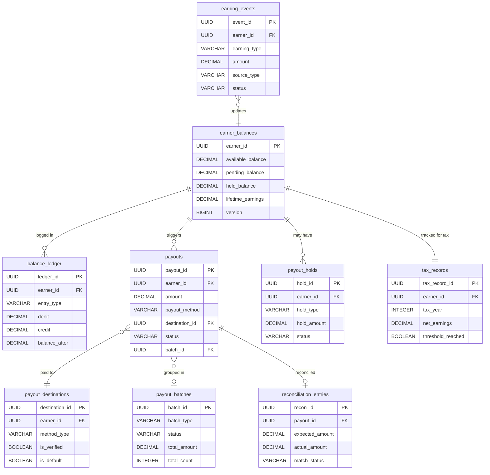
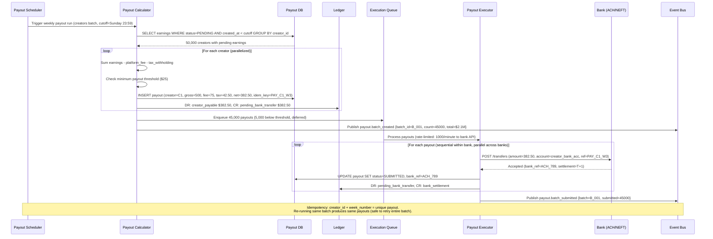
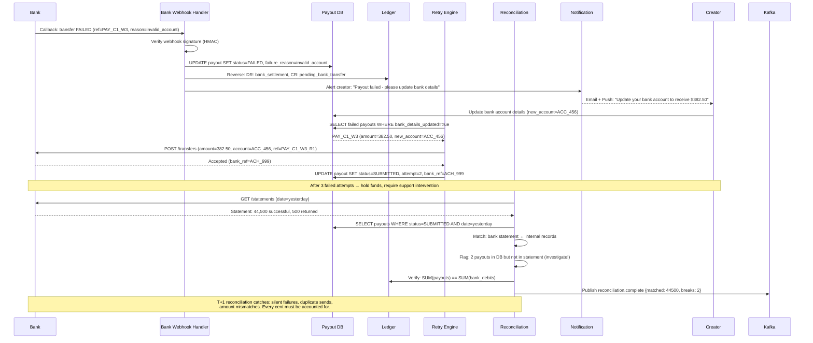

# Payout System for Creators/Drivers

## 1. Functional Requirements

### Core Features
- **Earnings Calculation**: Real-time aggregation of earning events (rides, deliveries, content views, tips)
- **Payout Scheduling**: Configurable frequency (instant, daily, weekly, bi-weekly)
- **Multi-Method Payouts**: Bank transfer (ACH), PayPal, Venmo, check, crypto wallet
- **Tax Withholding**: Automatic 1099 threshold tracking, backup withholding
- **Payout Holds**: Freeze payouts for fraud/disputes/policy violations
- **Minimum Payout Threshold**: Configurable minimum ($1-$100)
- **Currency Conversion**: Multi-currency earnings with preferred payout currency
- **Batch Processing**: Efficient bulk ACH/wire processing
- **Reconciliation**: Three-way match (earnings vs payouts vs bank confirmations)
- **Self-Service Dashboard**: Earnings history, payout status, tax documents

### User Flows
1. Creator earns → Event recorded → Balance updated → Scheduled payout → Funds deposited
2. Driver completes ride → Instant payout requested → Risk check → Push to debit card
3. Month-end → Batch ACH generation → Bank submission → Confirmation → Reconciliation
4. Year-end → 1099 generation → Tax filing → Creator notification

## 2. Non-Functional Requirements

| Metric | Target |
|--------|--------|
| Earnings event processing | < 500ms end-to-end |
| Instant payout | < 30 seconds to card |
| Batch payout processing | < 2 hours for 1M payouts |
| Availability | 99.99% (financial system) |
| Data consistency | Zero-loss (exactly-once semantics) |
| Reconciliation accuracy | 99.999% |
| Throughput | 50K earning events/second peak |
| API latency (p99) | < 150ms for balance queries |

## 3. Capacity Estimation

### Assumptions
- 5M active earners (creators + drivers)
- Average 10 earning events/earner/day = 50M events/day
- Peak: 5x average = 250M events/day = ~2900 events/sec avg, 14.5K/sec peak
- 2M payouts/week (mix of weekly batch + instant)
- Average payout: $150

### Storage
- Earning events: 50M/day × 500B = 25GB/day = 9TB/year
- Payout records: 2M/week × 1KB = 2GB/week = 100GB/year
- Balance snapshots: 5M earners × 200B = 1GB (updated continuously)
- Tax records: 5M × 5KB = 25GB/year
- Total: ~10TB/year

### Compute
- Flink cluster: 50 nodes for real-time aggregation
- Batch processing: 1M payouts in 2 hours = 140 payouts/sec
- ACH file generation: 50K records per file, 20 files per batch

### Money Flow
- Monthly payout volume: 5M × $150 × 4 = $3B/month
- Float management: $100M average in transit

## 4. Data Modeling

### Entity-Relationship Diagram



### Full Database Schemas

```sql
-- Earning events (append-only, partitioned by date)
CREATE TABLE earning_events (
    event_id UUID PRIMARY KEY DEFAULT gen_random_uuid(),
    earner_id UUID NOT NULL,
    earning_type VARCHAR(30) NOT NULL,
    -- RIDE_FARE, DELIVERY_FEE, TIP, CONTENT_VIEW, SUBSCRIPTION_SHARE, BONUS, REFERRAL
    amount DECIMAL(12, 4) NOT NULL,
    currency VARCHAR(3) NOT NULL DEFAULT 'USD',
    source_id VARCHAR(100) NOT NULL, -- ride_id, order_id, video_id
    source_type VARCHAR(30) NOT NULL,
    metadata JSONB, -- {ride_miles, surge_multiplier, content_id, etc}
    status VARCHAR(20) DEFAULT 'CONFIRMED',
    -- PENDING, CONFIRMED, ADJUSTED, CLAWED_BACK
    adjustment_reason TEXT,
    original_event_id UUID, -- For adjustments/clawbacks
    occurred_at TIMESTAMP NOT NULL,
    processed_at TIMESTAMP DEFAULT NOW(),
    partition_date DATE NOT NULL DEFAULT CURRENT_DATE
) PARTITION BY RANGE (partition_date);

CREATE INDEX idx_earnings_earner_date ON earning_events(earner_id, occurred_at DESC);
CREATE INDEX idx_earnings_source ON earning_events(source_type, source_id);
CREATE INDEX idx_earnings_status ON earning_events(status, processed_at);

-- Running balance (materialized from events)
CREATE TABLE earner_balances (
    earner_id UUID PRIMARY KEY,
    available_balance DECIMAL(12, 4) NOT NULL DEFAULT 0,
    pending_balance DECIMAL(12, 4) NOT NULL DEFAULT 0,
    held_balance DECIMAL(12, 4) NOT NULL DEFAULT 0,
    lifetime_earnings DECIMAL(14, 4) NOT NULL DEFAULT 0,
    lifetime_payouts DECIMAL(14, 4) NOT NULL DEFAULT 0,
    currency VARCHAR(3) NOT NULL DEFAULT 'USD',
    last_earning_at TIMESTAMP,
    last_payout_at TIMESTAMP,
    updated_at TIMESTAMP DEFAULT NOW(),
    version BIGINT NOT NULL DEFAULT 0 -- Optimistic locking
);

-- Balance ledger entries (double-entry)
CREATE TABLE balance_ledger (
    ledger_id UUID PRIMARY KEY DEFAULT gen_random_uuid(),
    earner_id UUID NOT NULL,
    entry_type VARCHAR(30) NOT NULL,
    -- EARNING, ADJUSTMENT, CLAWBACK, PAYOUT_DEBIT, HOLD, RELEASE, FX_GAIN_LOSS
    debit DECIMAL(12, 4) DEFAULT 0,
    credit DECIMAL(12, 4) DEFAULT 0,
    balance_after DECIMAL(12, 4) NOT NULL,
    reference_type VARCHAR(30),
    reference_id UUID,
    description TEXT,
    created_at TIMESTAMP DEFAULT NOW()
);

CREATE INDEX idx_ledger_earner ON balance_ledger(earner_id, created_at DESC);

-- Payout requests
CREATE TABLE payouts (
    payout_id UUID PRIMARY KEY DEFAULT gen_random_uuid(),
    earner_id UUID NOT NULL,
    amount DECIMAL(12, 4) NOT NULL,
    currency VARCHAR(3) NOT NULL,
    payout_method VARCHAR(20) NOT NULL,
    -- ACH, WIRE, PAYPAL, VENMO, CHECK, INSTANT_CARD, CRYPTO
    destination_id UUID REFERENCES payout_destinations(destination_id),
    status VARCHAR(20) NOT NULL DEFAULT 'PENDING',
    -- PENDING, RISK_CHECK, APPROVED, PROCESSING, SUBMITTED, CONFIRMED, FAILED, REVERSED
    schedule_type VARCHAR(20), -- INSTANT, DAILY, WEEKLY, BIWEEKLY
    batch_id UUID REFERENCES payout_batches(batch_id),
    fee_amount DECIMAL(8, 4) DEFAULT 0,
    fx_rate DECIMAL(12, 8),
    fx_converted_amount DECIMAL(12, 4),
    risk_score DECIMAL(3, 2),
    failure_reason TEXT,
    submitted_at TIMESTAMP,
    confirmed_at TIMESTAMP,
    bank_reference VARCHAR(100),
    created_at TIMESTAMP DEFAULT NOW(),
    updated_at TIMESTAMP DEFAULT NOW()
);

CREATE INDEX idx_payouts_earner ON payouts(earner_id, created_at DESC);
CREATE INDEX idx_payouts_status ON payouts(status, created_at);
CREATE INDEX idx_payouts_batch ON payouts(batch_id);
CREATE INDEX idx_payouts_reconcile ON payouts(status, submitted_at) WHERE status IN ('SUBMITTED', 'PROCESSING');

-- Payout destinations (bank accounts, wallets)
CREATE TABLE payout_destinations (
    destination_id UUID PRIMARY KEY DEFAULT gen_random_uuid(),
    earner_id UUID NOT NULL,
    method_type VARCHAR(20) NOT NULL,
    is_default BOOLEAN DEFAULT FALSE,
    is_verified BOOLEAN DEFAULT FALSE,
    -- Bank details (encrypted)
    bank_routing_number_enc BYTEA,
    bank_account_number_enc BYTEA,
    bank_name VARCHAR(100),
    account_holder_name VARCHAR(200),
    -- PayPal/Venmo
    email_address VARCHAR(255),
    -- Instant card
    card_token VARCHAR(255),
    card_last_four VARCHAR(4),
    -- Crypto
    wallet_address VARCHAR(100),
    network VARCHAR(20),
    -- Verification
    micro_deposit_status VARCHAR(20),
    verified_at TIMESTAMP,
    created_at TIMESTAMP DEFAULT NOW()
);

CREATE INDEX idx_destinations_earner ON payout_destinations(earner_id);

-- Payout batches (ACH/wire grouping)
CREATE TABLE payout_batches (
    batch_id UUID PRIMARY KEY DEFAULT gen_random_uuid(),
    batch_type VARCHAR(20) NOT NULL, -- ACH, WIRE, PAYPAL_MASS
    status VARCHAR(20) NOT NULL DEFAULT 'CREATED',
    -- CREATED, GENERATING, SUBMITTED, ACKNOWLEDGED, SETTLED, PARTIALLY_FAILED
    total_amount DECIMAL(14, 4),
    total_count INT,
    success_count INT DEFAULT 0,
    failure_count INT DEFAULT 0,
    bank_file_reference VARCHAR(100),
    submitted_at TIMESTAMP,
    acknowledged_at TIMESTAMP,
    settled_at TIMESTAMP,
    created_at TIMESTAMP DEFAULT NOW()
);

-- Payout holds
CREATE TABLE payout_holds (
    hold_id UUID PRIMARY KEY DEFAULT gen_random_uuid(),
    earner_id UUID NOT NULL,
    hold_type VARCHAR(30) NOT NULL, -- FRAUD, DISPUTE, POLICY, CHARGEBACK, MANUAL
    hold_amount DECIMAL(12, 4), -- NULL = hold all
    reason TEXT NOT NULL,
    reference_id UUID, -- dispute_id, fraud_case_id
    status VARCHAR(20) DEFAULT 'ACTIVE', -- ACTIVE, RELEASED, EXPIRED
    expires_at TIMESTAMP,
    released_at TIMESTAMP,
    released_by UUID,
    created_at TIMESTAMP DEFAULT NOW()
);

CREATE INDEX idx_holds_earner ON payout_holds(earner_id, status);

-- Tax tracking (1099)
CREATE TABLE tax_records (
    tax_record_id UUID PRIMARY KEY DEFAULT gen_random_uuid(),
    earner_id UUID NOT NULL,
    tax_year INT NOT NULL,
    country VARCHAR(2) DEFAULT 'US',
    total_earnings DECIMAL(14, 4) NOT NULL DEFAULT 0,
    total_adjustments DECIMAL(14, 4) NOT NULL DEFAULT 0,
    net_earnings DECIMAL(14, 4) NOT NULL DEFAULT 0,
    backup_withholding_amount DECIMAL(12, 4) DEFAULT 0,
    threshold_reached BOOLEAN DEFAULT FALSE, -- $600 for 1099-NEC
    form_generated BOOLEAN DEFAULT FALSE,
    form_url TEXT,
    tin_on_file BOOLEAN DEFAULT FALSE,
    w9_received_at TIMESTAMP,
    updated_at TIMESTAMP DEFAULT NOW(),
    UNIQUE(earner_id, tax_year)
);

-- Reconciliation records
CREATE TABLE reconciliation_entries (
    recon_id UUID PRIMARY KEY DEFAULT gen_random_uuid(),
    batch_id UUID REFERENCES payout_batches(batch_id),
    payout_id UUID REFERENCES payouts(payout_id),
    expected_amount DECIMAL(12, 4),
    actual_amount DECIMAL(12, 4),
    bank_reference VARCHAR(100),
    bank_status VARCHAR(20),
    match_status VARCHAR(20), -- MATCHED, MISMATCHED, MISSING, EXTRA
    discrepancy_amount DECIMAL(12, 4),
    resolved BOOLEAN DEFAULT FALSE,
    resolved_at TIMESTAMP,
    notes TEXT,
    created_at TIMESTAMP DEFAULT NOW()
);

CREATE INDEX idx_recon_batch ON reconciliation_entries(batch_id);
CREATE INDEX idx_recon_unresolved ON reconciliation_entries(match_status) WHERE NOT resolved;
```

## 5. High-Level Design (HLD)

```
┌──────────────────────────────────────────────────────────────────────────────────┐
│                          PAYOUT SYSTEM ARCHITECTURE                                │
├──────────────────────────────────────────────────────────────────────────────────┤
│                                                                                    │
│  ┌──────────┐  ┌──────────┐  ┌──────────┐  ┌──────────┐                         │
│  │  Ride    │  │ Delivery │  │ Content  │  │  Tips/   │   [Earning Sources]      │
│  │ Service  │  │ Service  │  │ Platform │  │  Bonus   │                          │
│  └────┬─────┘  └────┬─────┘  └────┬─────┘  └────┬─────┘                         │
│       │              │              │              │                               │
│       └──────────────┴──────────────┴──────────────┘                               │
│                              │                                                     │
│                    ┌─────────▼──────────┐                                         │
│                    │   Kafka            │                                         │
│                    │   earning.events   │                                         │
│                    └─────────┬──────────┘                                         │
│                              │                                                     │
│              ┌───────────────┼───────────────┐                                    │
│              │               │               │                                    │
│     ┌────────▼───────┐ ┌────▼─────┐ ┌──────▼──────┐                             │
│     │  Flink         │ │  Tax     │ │  Fraud      │                             │
│     │  Earnings      │ │ Tracker  │ │  Detection  │                             │
│     │  Aggregator    │ │          │ │             │                             │
│     └────────┬───────┘ └──────────┘ └─────────────┘                             │
│              │                                                                     │
│     ┌────────▼───────┐                                                            │
│     │  Balance       │◄──── Redis (hot balance cache)                            │
│     │  Service       │                                                            │
│     └────────┬───────┘                                                            │
│              │                                                                     │
│     ┌────────▼───────┐                                                            │
│     │  Payout        │                                                            │
│     │  Scheduler     │  (Cron: daily/weekly triggers)                            │
│     └────────┬───────┘                                                            │
│              │                                                                     │
│     ┌────────▼───────┐                                                            │
│     │  Payout        │                                                            │
│     │  Orchestrator  │                                                            │
│     └───┬────┬───┬───┘                                                            │
│         │    │   │                                                                 │
│    ┌────▼┐ ┌▼───▼┐ ┌──────┐                                                     │
│    │Inst-│ │Batch│ │PayPal│   [Payment Processors]                               │
│    │ant  │ │ACH  │ │/Venmo│                                                      │
│    │Card │ │     │ │      │                                                      │
│    └──┬──┘ └──┬──┘ └──┬───┘                                                     │
│       │       │       │                                                           │
│    ┌──▼───────▼───────▼──┐                                                       │
│    │  Bank Network        │                                                       │
│    │  (Visa Direct/ACH/   │                                                       │
│    │   SWIFT/PayPal API)  │                                                       │
│    └──────────┬───────────┘                                                       │
│               │                                                                    │
│    ┌──────────▼───────────┐                                                       │
│    │  Reconciliation      │  (Bank confirmations → match with payouts)           │
│    │  Engine              │                                                       │
│    └──────────────────────┘                                                       │
│                                                                                    │
│  ┌─────────────┐  ┌──────────┐  ┌───────────┐  ┌──────────────┐                 │
│  │ PostgreSQL  │  │  Redis   │  │   S3      │  │ TimescaleDB  │                 │
│  │ (Ledger +   │  │ (Balance │  │ (ACH files│  │ (Analytics)  │                 │
│  │  Payouts)   │  │  Cache)  │  │  + Tax)   │  │              │                 │
│  └─────────────┘  └──────────┘  └───────────┘  └──────────────┘                 │
└──────────────────────────────────────────────────────────────────────────────────┘
```

## 6. Low-Level Design (LLD) - APIs

### Record Earning Event
```http
POST /api/v1/earnings/events
Content-Type: application/json
X-Idempotency-Key: ride-12345-fare

{
  "earner_id": "earner-uuid-001",
  "earning_type": "RIDE_FARE",
  "amount": 23.50,
  "currency": "USD",
  "source_type": "RIDE",
  "source_id": "ride-12345",
  "metadata": {
    "distance_miles": 8.3,
    "duration_minutes": 22,
    "surge_multiplier": 1.5,
    "base_fare": 15.67,
    "surge_amount": 7.83
  },
  "occurred_at": "2024-01-15T14:30:00Z"
}

Response 202:
{
  "event_id": "evt-uuid-789",
  "status": "CONFIRMED",
  "balance_update": {
    "available_balance": 1245.75,
    "pending_balance": 0.00
  }
}
```

### Get Balance
```http
GET /api/v1/earners/{earner_id}/balance
Authorization: Bearer <token>

Response 200:
{
  "earner_id": "earner-uuid-001",
  "available_balance": 1245.75,
  "pending_balance": 23.50,
  "held_balance": 0.00,
  "total_balance": 1269.25,
  "currency": "USD",
  "next_scheduled_payout": {
    "date": "2024-01-19",
    "estimated_amount": 1245.75,
    "method": "ACH"
  },
  "instant_payout_eligible": true,
  "instant_payout_fee": 0.50,
  "minimum_payout_threshold": 5.00,
  "as_of": "2024-01-15T14:30:05Z"
}
```

### Request Instant Payout
```http
POST /api/v1/payouts/instant
Authorization: Bearer <earner_token>

{
  "amount": 100.00,
  "destination_id": "dest-uuid-card-001"
}

Response 202:
{
  "payout_id": "pay-uuid-456",
  "status": "RISK_CHECK",
  "amount": 100.00,
  "fee": 0.50,
  "net_amount": 99.50,
  "estimated_arrival": "2024-01-15T14:31:00Z",
  "tracking_url": "/api/v1/payouts/pay-uuid-456/status"
}
```

### Payout Status Webhook
```http
POST <earner_webhook_url>
{
  "event": "payout.completed",
  "payout_id": "pay-uuid-456",
  "status": "CONFIRMED",
  "amount": 99.50,
  "bank_reference": "VD-2024011523456",
  "confirmed_at": "2024-01-15T14:30:45Z"
}
```

### Clawback/Adjustment
```http
POST /api/v1/earnings/adjustments
Authorization: Bearer <admin_token>

{
  "earner_id": "earner-uuid-001",
  "original_event_id": "evt-uuid-789",
  "adjustment_type": "CLAWBACK",
  "amount": -23.50,
  "reason": "Rider disputed fare - ride not completed",
  "reference_id": "dispute-001"
}

Response 200:
{
  "adjustment_id": "adj-uuid-111",
  "new_available_balance": 1222.25,
  "hold_placed": false
}
```

## 7. Deep Dives

### Deep Dive 1: Earnings Aggregation (Flink Pipeline)

```
┌──────────────┐     ┌──────────────┐     ┌──────────────┐     ┌──────────────┐
│   Earning    │     │    Flink     │     │   Balance    │     │   Balance    │
│   Events     │────▶│  Processor   │────▶│   Update     │────▶│   Store      │
│   (Kafka)    │     │              │     │   (Kafka)    │     │  (PG+Redis)  │
└──────────────┘     └──────────────┘     └──────────────┘     └──────────────┘
```

```java
// Flink earnings aggregation job
public class EarningsAggregationJob {
    
    public static void main(String[] args) throws Exception {
        StreamExecutionEnvironment env = StreamExecutionEnvironment.getExecutionEnvironment();
        env.setParallelism(50);
        env.enableCheckpointing(10000, CheckpointingMode.EXACTLY_ONCE);
        env.setStateBackend(new RocksDBStateBackend("s3://flink-state/earnings"));
        
        // Source: Kafka earning events
        KafkaSource<EarningEvent> source = KafkaSource.<EarningEvent>builder()
            .setBootstrapServers("kafka:9092")
            .setTopics("earning.events")
            .setGroupId("earnings-aggregator")
            .setDeserializer(new EarningEventDeserializer())
            .setStartingOffsets(OffsetsInitializer.committedOffsets())
            .build();
        
        DataStream<EarningEvent> events = env.fromSource(source, 
            WatermarkStrategy.<EarningEvent>forBoundedOutOfOrderness(Duration.ofSeconds(5))
                .withTimestampAssigner((event, ts) -> event.getOccurredAt().toEpochMilli()),
            "EarningEvents");
        
        // Process: Keyed by earner_id
        DataStream<BalanceUpdate> balanceUpdates = events
            .keyBy(EarningEvent::getEarnerId)
            .process(new EarningsProcessor())
            .name("EarningsProcessor");
        
        // Sink: Balance updates to Kafka (for downstream consumers)
        balanceUpdates.sinkTo(KafkaSink.<BalanceUpdate>builder()
            .setBootstrapServers("kafka:9092")
            .setRecordSerializer(new BalanceUpdateSerializer("balance.updates"))
            .setDeliveryGuarantee(DeliveryGuarantee.EXACTLY_ONCE)
            .build());
        
        env.execute("Earnings Aggregation");
    }
}

// Stateful processor handling running balance
public class EarningsProcessor extends KeyedProcessFunction<String, EarningEvent, BalanceUpdate> {
    
    // State: running balance per earner
    private ValueState<EarnerBalance> balanceState;
    // State: deduplication (idempotency)
    private MapState<String, Boolean> processedEvents;
    
    @Override
    public void open(Configuration params) {
        balanceState = getRuntimeContext().getState(
            new ValueStateDescriptor<>("balance", EarnerBalance.class));
        processedEvents = getRuntimeContext().getMapState(
            new MapStateDescriptor<>("processed", String.class, Boolean.class));
    }
    
    @Override
    public void processElement(EarningEvent event, Context ctx, Collector<BalanceUpdate> out) throws Exception {
        // Idempotency check
        if (processedEvents.contains(event.getEventId())) {
            return;
        }
        
        EarnerBalance balance = balanceState.value();
        if (balance == null) {
            balance = new EarnerBalance(event.getEarnerId(), BigDecimal.ZERO, BigDecimal.ZERO);
        }
        
        // Apply event to balance
        switch (event.getStatus()) {
            case "CONFIRMED":
                balance.addAvailable(event.getAmount());
                balance.addLifetimeEarnings(event.getAmount());
                break;
            case "PENDING":
                balance.addPending(event.getAmount());
                break;
            case "CLAWED_BACK":
                balance.subtractAvailable(event.getAmount().abs());
                break;
            case "ADJUSTED":
                balance.addAvailable(event.getAmount()); // Can be negative
                break;
        }
        
        // Update state
        balanceState.update(balance);
        processedEvents.put(event.getEventId(), true);
        
        // Register cleanup timer (remove processed event IDs after 24h)
        ctx.timerService().registerEventTimeTimer(
            ctx.timestamp() + Duration.ofHours(24).toMillis());
        
        // Emit balance update
        out.collect(new BalanceUpdate(
            event.getEarnerId(),
            balance.getAvailable(),
            balance.getPending(),
            event.getEventId(),
            Instant.now()
        ));
    }
    
    @Override
    public void onTimer(long timestamp, OnTimerContext ctx, Collector<BalanceUpdate> out) {
        // Cleanup old processed event IDs to manage state size
        // In practice, use TTL state descriptors
    }
}
```

#### Handling Adjustments and Clawbacks
```python
class AdjustmentProcessor:
    """Handles clawbacks when available balance may be insufficient."""
    
    async def process_clawback(self, earner_id: str, amount: Decimal, reason: str) -> dict:
        async with self.db.transaction() as txn:
            balance = await txn.fetch_one(
                "SELECT * FROM earner_balances WHERE earner_id = $1 FOR UPDATE",
                earner_id
            )
            
            if balance.available_balance >= amount:
                # Simple case: deduct from available
                new_balance = balance.available_balance - amount
                await txn.execute(
                    "UPDATE earner_balances SET available_balance = $1, version = version + 1 WHERE earner_id = $2",
                    new_balance, earner_id
                )
                return {"status": "DEDUCTED", "remaining": new_balance}
            else:
                # Insufficient balance: deduct what's available, place hold for remainder
                shortfall = amount - balance.available_balance
                await txn.execute(
                    "UPDATE earner_balances SET available_balance = 0, held_balance = held_balance + $1 WHERE earner_id = $2",
                    shortfall, earner_id
                )
                # Create hold - future earnings will be captured
                await txn.execute("""
                    INSERT INTO payout_holds (earner_id, hold_type, hold_amount, reason, status)
                    VALUES ($1, 'CLAWBACK', $2, $3, 'ACTIVE')
                """, earner_id, shortfall, reason)
                
                return {"status": "PARTIAL_HOLD", "deducted": balance.available_balance, "held": shortfall}
```

### Deep Dive 2: Batch Payout Optimization

#### ACH Batch Generation
```python
import nacha  # ACH file format library
from datetime import datetime, timedelta
from collections import defaultdict

class ACHBatchProcessor:
    """Generates optimized ACH batch files grouped by receiving bank."""
    
    MAX_ENTRIES_PER_FILE = 50000
    MAX_AMOUNT_PER_FILE = Decimal('50000000.00')  # $50M
    
    async def generate_batch(self, payout_date: date) -> list[str]:
        """Generate ACH files for all pending payouts."""
        
        # 1. Fetch eligible payouts
        payouts = await self.db.fetch_all("""
            SELECT p.*, d.bank_routing_number_enc, d.bank_account_number_enc,
                   d.account_holder_name, d.bank_name
            FROM payouts p
            JOIN payout_destinations d ON p.destination_id = d.destination_id
            WHERE p.status = 'APPROVED' 
            AND p.payout_method = 'ACH'
            AND p.scheduled_date <= $1
            ORDER BY d.bank_routing_number_enc  -- Group by receiving bank
        """, payout_date)
        
        # 2. Group by routing number for ODFI optimization
        grouped = defaultdict(list)
        for payout in payouts:
            routing = self.decrypt(payout.bank_routing_number_enc)
            grouped[routing].append(payout)
        
        # 3. Generate NACHA files
        files = []
        current_entries = []
        current_amount = Decimal('0')
        batch_num = 1
        
        for routing, routing_payouts in grouped.items():
            for payout in routing_payouts:
                if (len(current_entries) >= self.MAX_ENTRIES_PER_FILE or 
                    current_amount + payout.amount > self.MAX_AMOUNT_PER_FILE):
                    # Flush current file
                    file_ref = await self._write_ach_file(current_entries, batch_num)
                    files.append(file_ref)
                    current_entries = []
                    current_amount = Decimal('0')
                    batch_num += 1
                
                current_entries.append(payout)
                current_amount += payout.amount
        
        # Flush remaining
        if current_entries:
            file_ref = await self._write_ach_file(current_entries, batch_num)
            files.append(file_ref)
        
        # 4. Update payout statuses
        payout_ids = [p.payout_id for p in payouts]
        await self.db.execute("""
            UPDATE payouts SET status = 'SUBMITTED', submitted_at = NOW()
            WHERE payout_id = ANY($1)
        """, payout_ids)
        
        return files
    
    async def _write_ach_file(self, entries: list, batch_num: int) -> str:
        """Generate NACHA-compliant ACH file."""
        file = nacha.NachaFile()
        file.header.immediate_destination = '021000021'  # Fed routing
        file.header.immediate_origin = self.company_routing
        file.header.file_creation_date = datetime.now()
        
        batch = nacha.Batch()
        batch.header.service_class_code = '220'  # Credits only
        batch.header.company_name = 'PLATFORM INC'
        batch.header.company_id = self.company_ein
        batch.header.effective_entry_date = datetime.now() + timedelta(days=1)
        
        for entry in entries:
            record = nacha.EntryDetail()
            record.transaction_code = '22'  # Checking credit
            record.rdfi_routing = self.decrypt(entry.bank_routing_number_enc)
            record.dfi_account = self.decrypt(entry.bank_account_number_enc)
            record.amount = int(entry.amount * 100)  # Cents
            record.individual_name = entry.account_holder_name[:22]
            record.trace_number = f"{self.company_routing}{entry.payout_id[:7]}"
            batch.entries.append(record)
        
        file.batches.append(batch)
        
        # Upload to S3 + submit to bank
        content = file.render()
        s3_key = f"ach-files/{datetime.now():%Y/%m/%d}/batch-{batch_num}.ach"
        await self.s3.put_object(Bucket='payout-files', Key=s3_key, Body=content)
        
        return s3_key

class FXOptimizer:
    """Optimize foreign exchange conversion timing."""
    
    async def optimize_fx_batch(self, payouts: list) -> dict:
        """Group payouts by target currency and find optimal conversion time."""
        
        by_currency = defaultdict(list)
        for p in payouts:
            if p.currency != 'USD':
                by_currency[p.currency].append(p)
        
        conversions = {}
        for currency, currency_payouts in by_currency.items():
            total_amount = sum(p.amount for p in currency_payouts)
            
            # Get rate quotes from multiple providers
            quotes = await asyncio.gather(
                self.get_rate('wise', 'USD', currency, total_amount),
                self.get_rate('currencycloud', 'USD', currency, total_amount),
                self.get_rate('ofx', 'USD', currency, total_amount),
            )
            
            best_quote = min(quotes, key=lambda q: q.total_cost)
            
            conversions[currency] = {
                'provider': best_quote.provider,
                'rate': best_quote.rate,
                'total_usd': total_amount,
                'total_target': total_amount * best_quote.rate,
                'fee': best_quote.fee,
                'payout_count': len(currency_payouts)
            }
        
        return conversions
```

#### Handling Partial Failures in Batch
```python
class BatchFailureHandler:
    """Handle partial failures in ACH batch processing."""
    
    async def process_return_file(self, return_file_content: str):
        """Process ACH return/NOC file from bank."""
        
        returns = nacha.parse_return_file(return_file_content)
        
        for return_entry in returns:
            payout = await self.db.fetch_one(
                "SELECT * FROM payouts WHERE bank_reference = $1",
                return_entry.trace_number
            )
            
            if not payout:
                await self.alert("Unmatched ACH return", return_entry)
                continue
            
            return_code = return_entry.return_reason_code
            
            if return_code in ('R01', 'R02', 'R03', 'R04'):  # Account issues
                # Mark failed, credit back to balance
                await self._handle_permanent_failure(payout, return_code)
            elif return_code in ('R06', 'R07', 'R08'):  # Returned by RDFI
                await self._handle_bank_rejection(payout, return_code)
            elif return_code == 'R09':  # Uncollected funds
                # Retry after 2 business days
                await self._schedule_retry(payout, days=2)
            
    async def _handle_permanent_failure(self, payout, reason_code):
        """Reverse the payout and credit back earner balance."""
        async with self.db.transaction() as txn:
            # Update payout status
            await txn.execute("""
                UPDATE payouts SET status = 'FAILED', failure_reason = $1, updated_at = NOW()
                WHERE payout_id = $2
            """, f"ACH_RETURN_{reason_code}", payout.payout_id)
            
            # Credit back to earner balance
            await txn.execute("""
                UPDATE earner_balances 
                SET available_balance = available_balance + $1, version = version + 1
                WHERE earner_id = $2
            """, payout.amount, payout.earner_id)
            
            # Ledger entry
            await txn.execute("""
                INSERT INTO balance_ledger (earner_id, entry_type, credit, balance_after, reference_id, description)
                VALUES ($1, 'PAYOUT_REVERSAL', $2, 
                    (SELECT available_balance FROM earner_balances WHERE earner_id = $1),
                    $3, $4)
            """, payout.earner_id, payout.amount, payout.payout_id, f"ACH return: {reason_code}")
            
            # Notify earner
            await self.notification_service.send(payout.earner_id, 
                "payout_failed", {"amount": payout.amount, "reason": reason_code})
```

### Deep Dive 3: Reconciliation (Three-Way Match)

```python
class ReconciliationEngine:
    """Three-way match: Earnings → Payouts → Bank Confirmations."""
    
    async def run_daily_reconciliation(self, date: date):
        """
        Match three data sources:
        1. Internal earnings ledger (what we owe)
        2. Payout records (what we sent)
        3. Bank statements (what actually moved)
        """
        
        # Source 1: Sum of all earnings minus payouts per earner
        expected_balances = await self.db.fetch_all("""
            SELECT earner_id,
                   SUM(CASE WHEN entry_type IN ('EARNING', 'ADJUSTMENT') THEN credit - debit ELSE 0 END) as total_earned,
                   SUM(CASE WHEN entry_type = 'PAYOUT_DEBIT' THEN debit ELSE 0 END) as total_paid
            FROM balance_ledger
            WHERE created_at::date <= $1
            GROUP BY earner_id
        """, date)
        
        # Source 2: Confirmed payouts
        confirmed_payouts = await self.db.fetch_all("""
            SELECT earner_id, SUM(amount) as total_confirmed
            FROM payouts
            WHERE status = 'CONFIRMED' AND confirmed_at::date <= $1
            GROUP BY earner_id
        """, date)
        
        # Source 3: Bank statement entries (ingested from bank feeds)
        bank_entries = await self.db.fetch_all("""
            SELECT reference_id, amount, status, bank_date
            FROM bank_statement_entries
            WHERE bank_date = $1 AND entry_type = 'DEBIT'
        """, date)
        
        # Three-way match
        discrepancies = []
        
        # Match 1: Ledger balance vs actual balance table
        for eb in expected_balances:
            expected_remaining = eb.total_earned - eb.total_paid
            actual = await self.db.fetch_val(
                "SELECT available_balance + pending_balance + held_balance FROM earner_balances WHERE earner_id = $1",
                eb.earner_id
            )
            if abs(expected_remaining - actual) > Decimal('0.01'):
                discrepancies.append({
                    'type': 'LEDGER_BALANCE_MISMATCH',
                    'earner_id': eb.earner_id,
                    'expected': expected_remaining,
                    'actual': actual,
                    'diff': expected_remaining - actual
                })
        
        # Match 2: Submitted payouts vs bank confirmations
        submitted = await self.db.fetch_all("""
            SELECT payout_id, amount, bank_reference 
            FROM payouts WHERE status = 'SUBMITTED' AND submitted_at::date < $1
        """, date)
        
        bank_refs = {e.reference_id: e for e in bank_entries}
        
        for payout in submitted:
            if payout.bank_reference in bank_refs:
                bank_entry = bank_refs[payout.bank_reference]
                if abs(payout.amount - bank_entry.amount) > Decimal('0.01'):
                    discrepancies.append({
                        'type': 'AMOUNT_MISMATCH',
                        'payout_id': payout.payout_id,
                        'our_amount': payout.amount,
                        'bank_amount': bank_entry.amount
                    })
                else:
                    # Mark as confirmed
                    await self.db.execute("""
                        UPDATE payouts SET status = 'CONFIRMED', confirmed_at = NOW()
                        WHERE payout_id = $1
                    """, payout.payout_id)
            else:
                # Missing from bank - might be delayed
                days_since = (date - payout.submitted_at.date()).days
                if days_since > 3:
                    discrepancies.append({
                        'type': 'MISSING_BANK_CONFIRMATION',
                        'payout_id': payout.payout_id,
                        'submitted_days_ago': days_since
                    })
        
        # Report
        if discrepancies:
            await self.alert_finance_team(discrepancies)
            await self._store_discrepancies(discrepancies, date)
        
        return {
            'date': date,
            'earners_checked': len(expected_balances),
            'payouts_matched': len(submitted) - len([d for d in discrepancies if d['type'] != 'LEDGER_BALANCE_MISMATCH']),
            'discrepancies': len(discrepancies),
            'total_payout_volume': sum(p.amount for p in submitted)
        }
```

## 8. Component Optimization

### Kafka Configuration
```yaml
# Earning events - high throughput
earning.events:
  partitions: 64  # High parallelism for Flink
  replication-factor: 3
  retention.ms: 604800000  # 7 days
  min.insync.replicas: 2
  partition-key: earner_id  # All events for an earner go to same partition
  compression.type: lz4
  batch.size: 65536
  linger.ms: 5

# Balance updates - downstream consumers
balance.updates:
  partitions: 32
  replication-factor: 3
  retention.ms: 86400000  # 1 day

# Payout commands
payout.commands:
  partitions: 16
  replication-factor: 3
  retention.ms: 604800000
  min.insync.replicas: 2
  # Exactly-once delivery
  enable.idempotence: true
  transactional.id: payout-processor
```

### Redis Configuration
```yaml
redis:
  cluster: 6 nodes
  maxmemory: 64GB total
  
  # Hot balance cache
  balance-cache:
    key: "bal:{earner_id}"
    type: hash  # {available, pending, held, version}
    ttl: none  # Always fresh (write-through)
    
  # Rate limiting for instant payouts
  instant-payout-limit:
    key: "instant:{earner_id}:{date}"
    type: string  # counter
    ttl: 86400
    max: 3  # Max 3 instant payouts per day
    
  # Distributed locks for balance updates
  balance-lock:
    key: "lock:bal:{earner_id}"
    ttl: 5000ms
    retry: 3 times with 100ms backoff
    
  # Idempotency keys
  idempotency:
    key: "idem:{idempotency_key}"
    ttl: 86400  # 24h
    type: string  # response JSON
```

### Flink Tuning
```yaml
flink:
  parallelism: 50
  checkpointing:
    interval: 10s
    mode: EXACTLY_ONCE
    timeout: 60s
    min-pause: 5s
  state-backend: rocksdb
  rocksdb:
    block-cache-size: 256MB
    write-buffer-size: 64MB
  watermark:
    max-out-of-orderness: 5s
  restart-strategy:
    type: exponential-delay
    initial-backoff: 1s
    max-backoff: 60s
```

## 9. Observability

### Metrics
```yaml
metrics:
  # Financial accuracy (MOST CRITICAL)
  - name: balance_discrepancy_count
    type: gauge
    labels: [discrepancy_type]
    alert_threshold: 0  # Any discrepancy is critical
  
  - name: payout_total_amount
    type: counter
    labels: [method, currency, status]
  
  # Latency
  - name: earning_event_processing_lag_ms
    type: histogram
    labels: [earning_type]
    buckets: [50, 100, 200, 500, 1000, 5000]
  
  - name: instant_payout_duration_seconds
    type: histogram
    labels: [provider]
    buckets: [5, 10, 15, 30, 60, 120]
  
  # Throughput
  - name: earning_events_per_second
    type: gauge
    labels: [source_type]
  
  - name: batch_payout_processing_duration_minutes
    type: histogram
    labels: [batch_type]
  
  # Failures
  - name: payout_failure_rate
    type: gauge
    labels: [method, failure_reason]
    alert_threshold: 0.02  # > 2% failure rate
  
  - name: ach_return_count
    type: counter
    labels: [return_code]

alerts:
  - name: BalanceDiscrepancyDetected
    expr: balance_discrepancy_count > 0
    severity: critical
    runbook: "Immediately freeze affected payouts, investigate ledger entries"
    
  - name: FlinkConsumerLag
    expr: flink_kafka_consumer_lag > 100000
    severity: warning
    
  - name: PayoutFailureSpike
    expr: rate(payout_failure_rate[5m]) > 0.05
    severity: critical
    action: "Halt batch processing, investigate bank connectivity"
```

## 10. Failure Modes & Considerations

### Critical Failure Scenarios
| Scenario | Impact | Mitigation |
|----------|--------|------------|
| Double payout | Financial loss | Idempotency keys + unique constraints + reconciliation |
| Missing earnings | Earner underpaid | Event sourcing with replay, Flink exactly-once |
| Bank API timeout | Payout stuck | Timeout → query status → retry or reverse |
| Flink checkpoint failure | Balance drift | Automatic restart from last checkpoint |
| FX rate stale | Over/underpayment | Rate staleness check, max slippage tolerance |

### Consistency Guarantees
- **Earning events**: At-least-once delivery + idempotent processing = exactly-once semantics
- **Balance updates**: Optimistic locking with version counter
- **Payouts**: State machine with idempotent transitions
- **Reconciliation**: Daily automated + weekly manual review

### Money Safety
- No payout exceeds available_balance (enforced at DB level with CHECK constraint)
- All balance mutations through ledger entries (audit trail)
- Dual-control for manual payouts > $10,000
- Daily settlement file must balance to zero

## 11. Trade-offs & Alternatives

| Decision | Choice | Alternative | Why |
|----------|--------|-------------|-----|
| Balance store | PostgreSQL + Redis cache | Pure event sourcing | Need fast reads + strong consistency |
| Stream processing | Apache Flink | Kafka Streams | Better exactly-once, state management at scale |
| ACH processing | Custom NACHA generator | Third-party (Dwolla) | Control over timing, lower per-txn cost at scale |
| Instant payouts | Visa Direct / Mastercard Send | Internal ledger transfer | Real card push for actual bank deposit |
| FX | Multi-provider routing | Single provider | Better rates through competition |
| Idempotency | Redis + DB unique constraint | DB-only | Speed of check without DB roundtrip |

---

## 12. Sequence Diagrams

### Diagram 1: Batch Payout Calculation + Execution



### Diagram 2: Failed Payout Retry + Reconciliation



### Caching Strategy

```
PAYOUT SYSTEM CACHING

1. CREATOR BALANCE CACHE (Write-through)
   Key: creator:{id}:pending_balance
   Updated: On every earning event (ride completed, content monetized)
   Pattern: Increment in Redis MULTI + DB in same transaction
   Used for: Dashboard "available balance" display
   CRITICAL: Stale balance → creator expects payout they can't receive

2. BANK ACCOUNT VALIDATION CACHE
   Key: bank_valid:{routing}:{account_hash}
   TTL: 30 days (bank accounts don't change often)
   Content: validation_result, last_successful_transfer
   Saves: Redundant bank API validation calls

3. FX RATE CACHE (for international payouts)
   Key: fx:{from}:{to}:rate
   TTL: 30 seconds (rates are volatile)
   DANGER: Stale rate on large batch = significant loss
   Mitigation: Lock rate at batch start, hard-fail if rate changes >1%

4. PAYOUT STATUS CACHE
   Key: payout:{id}:status
   TTL: Until terminal state (succeeded/failed)
   Used for: Creator checking "where's my money" (high-frequency polling)

WHERE EVENTUAL CONSISTENCY IS DANGEROUS:
- Balance → creator sees higher amount → upset when payout is less
- FX rate → wrong conversion → platform absorbs loss or creator shortchanged
WHERE ACCEPTABLE:
- Dashboard analytics (total earned this month) — seconds of lag fine
- Payout history list — eventual consistency OK
```

### Infrastructure Components

```
┌─────────────────────────────────────────────────────────────┐
│ PAYOUT SYSTEM INFRASTRUCTURE                                 │
├─────────────────────────────────────────────────────────────┤
│                                                              │
│ COMPUTE:                                                     │
│ ├── Payout Calculator: Batch jobs (high-CPU, runs weekly)    │
│ ├── Payout Executor: Rate-limited workers (bank API limits)  │
│ ├── Webhook receivers: Highly available (bank callbacks)     │
│ └── Reconciliation: Daily batch (compare bank ↔ internal)    │
│                                                              │
│ DATABASE:                                                     │
│ ├── PostgreSQL: Payouts, earnings, creator accounts          │
│ ├── Partitioned by payout_date (monthly)                     │
│ └── Strong consistency (serializable for balance operations) │
│                                                              │
│ QUEUE/MESSAGING:                                             │
│ ├── Kafka: Events (earning.created, payout.submitted, etc.)  │
│ ├── SQS/Redis Queue: Payout execution queue (rate-limited)   │
│ └── Dead letter queue: Failed payouts for investigation      │
│                                                              │
│ BANKING INTEGRATIONS:                                        │
│ ├── ACH (US): NACHA file generation, batch submission        │
│ ├── NEFT/IMPS (India): Real-time + batch                     │
│ ├── SEPA (EU): XML ISO 20022 format                          │
│ ├── Visa Direct / Mastercard Send: Instant (card push)       │
│ └── Multi-provider routing: cheapest rail per destination     │
│                                                              │
│ MONITORING:                                                   │
│ ├── Payout success rate by bank/rail (alert < 95%)           │
│ ├── Reconciliation breaks dashboard                          │
│ ├── Creator complaint correlation with failed payouts        │
│ └── Cost per payout by rail (optimize routing)               │
│                                                              │
└─────────────────────────────────────────────────────────────┘
```
