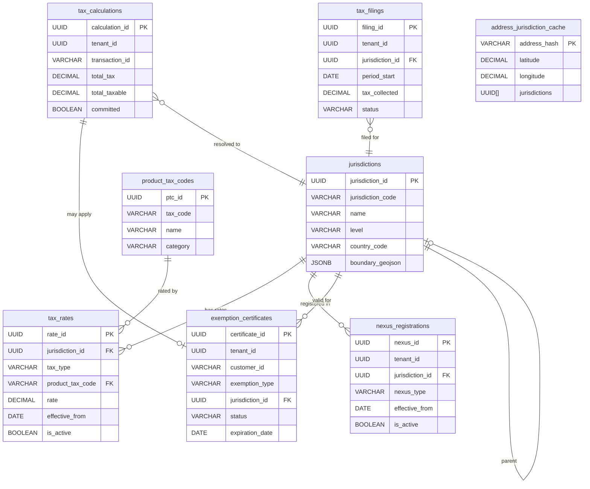
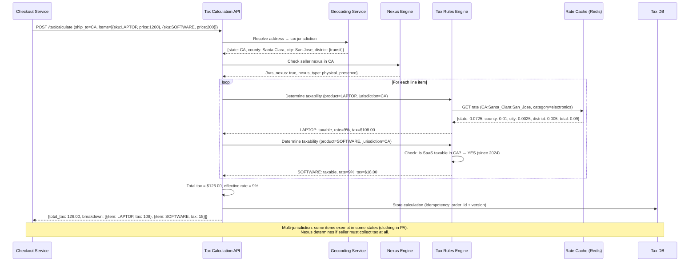
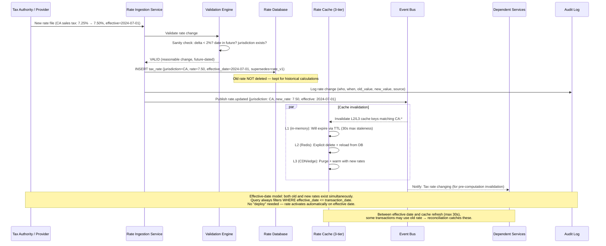

# Tax Calculation Service

## 1. Functional Requirements

### Core Features
- **Real-Time Tax Calculation**: Calculate tax for any transaction within 50ms
- **Jurisdiction Determination**: Resolve exact taxing jurisdictions from addresses (nexus rules)
- **Product Taxability**: Classify products with tax codes (exempt, reduced rate, standard)
- **Tax Rate Lookup**: Multi-level stacking rates (state + county + city + district)
- **Exemption Certificates**: Manage and validate tax exemption certificates
- **Cross-Border VAT/GST**: International tax calculation (EU VAT, AU GST, etc.)
- **Tax Filing/Reporting**: Generate returns, remittance files per jurisdiction
- **Audit Trail**: Complete calculation history for compliance audits

### Use Cases
1. E-commerce checkout → Calculate sales tax for cart → Display to buyer
2. Marketplace transaction → Determine marketplace facilitator obligation
3. B2B sale → Validate exemption certificate → Zero-rate transaction
4. SaaS subscription → Determine digital services tax (EU MOSS)
5. Monthly filing → Aggregate transactions → Generate return per jurisdiction

## 2. Non-Functional Requirements

| Metric | Target |
|--------|--------|
| Calculation latency (p99) | < 50ms |
| Throughput | 100K calculations/second |
| Availability | 99.99% |
| Rate data freshness | < 24 hours |
| Accuracy | 100% (legal requirement) |
| Jurisdiction coverage | 14,000+ US jurisdictions |
| API uptime SLA | 99.99% with < 1s failover |

## 3. Capacity Estimation

### Assumptions
- 10,000 merchant tenants
- Average 1000 transactions/merchant/day = 10M calculations/day
- Peak: 10x during holidays = 100M/day = ~1150/sec avg, 11.5K/sec peak
- Rate table: 14,000 jurisdictions × 500 product categories = 7M rate entries
- Historical calculations: 10M/day × 365 = 3.65B/year

### Storage
- Rate tables: 7M entries × 200B = 1.4GB (fits in memory)
- Transaction history: 10M/day × 500B = 5GB/day = 1.8TB/year
- Exemption certificates: 1M docs × 500KB = 500GB
- Jurisdiction boundaries: 14K polygons × 50KB = 700MB

### Compute
- Calculation: 11.5K/sec × 5ms CPU = 58 cores minimum
- With 3x headroom: 20 nodes × 8 cores
- Geocoding: Cache-heavy, 1K unique addresses/sec peak

## 4. Data Modeling

### Entity-Relationship Diagram



### Full Database Schemas

```sql
-- Jurisdictions (taxing authorities)
CREATE TABLE jurisdictions (
    jurisdiction_id UUID PRIMARY KEY DEFAULT gen_random_uuid(),
    jurisdiction_code VARCHAR(20) NOT NULL UNIQUE, -- e.g., US-CA-LA-001
    name VARCHAR(200) NOT NULL,
    level VARCHAR(20) NOT NULL, -- COUNTRY, STATE, COUNTY, CITY, DISTRICT
    parent_jurisdiction_id UUID REFERENCES jurisdictions(jurisdiction_id),
    country_code VARCHAR(2) NOT NULL,
    state_code VARCHAR(5),
    fips_code VARCHAR(10),
    boundary_geojson JSONB, -- GeoJSON polygon for geocoding
    has_nexus_rules BOOLEAN DEFAULT FALSE,
    filing_frequency VARCHAR(20), -- MONTHLY, QUARTERLY, ANNUAL
    created_at TIMESTAMP DEFAULT NOW(),
    updated_at TIMESTAMP DEFAULT NOW()
);

CREATE INDEX idx_jurisdictions_code ON jurisdictions(jurisdiction_code);
CREATE INDEX idx_jurisdictions_parent ON jurisdictions(parent_jurisdiction_id);
CREATE INDEX idx_jurisdictions_geo ON jurisdictions USING GIST (
    ST_GeomFromGeoJSON(boundary_geojson::text)
);

-- Tax rates (with effective dates)
CREATE TABLE tax_rates (
    rate_id UUID PRIMARY KEY DEFAULT gen_random_uuid(),
    jurisdiction_id UUID NOT NULL REFERENCES jurisdictions(jurisdiction_id),
    tax_type VARCHAR(30) NOT NULL, -- SALES, USE, VAT, GST, EXCISE
    product_tax_code VARCHAR(20) NOT NULL, -- PTC mapping
    rate DECIMAL(8, 6) NOT NULL, -- e.g., 0.082500 for 8.25%
    rate_type VARCHAR(20) NOT NULL DEFAULT 'PERCENTAGE', -- PERCENTAGE, FLAT, TIERED
    tier_config JSONB, -- For tiered rates: [{from: 0, to: 110, rate: 0}, {from: 110, rate: 0.0825}]
    effective_from DATE NOT NULL,
    effective_to DATE, -- NULL = still active
    is_active BOOLEAN DEFAULT TRUE,
    source VARCHAR(50), -- STATE_DOR, MANUAL, PROVIDER_FEED
    last_verified_at TIMESTAMP,
    created_at TIMESTAMP DEFAULT NOW()
);

CREATE INDEX idx_rates_jurisdiction ON tax_rates(jurisdiction_id, product_tax_code, effective_from);
CREATE INDEX idx_rates_active ON tax_rates(jurisdiction_id, is_active, effective_from DESC);
CREATE UNIQUE INDEX idx_rates_unique_active ON tax_rates(jurisdiction_id, product_tax_code, effective_from) WHERE is_active = TRUE;

-- Product tax codes
CREATE TABLE product_tax_codes (
    ptc_id UUID PRIMARY KEY DEFAULT gen_random_uuid(),
    tax_code VARCHAR(20) NOT NULL UNIQUE, -- e.g., PC040100 (clothing)
    name VARCHAR(200) NOT NULL,
    description TEXT,
    category VARCHAR(50), -- PHYSICAL_GOOD, DIGITAL_GOOD, SERVICE, FOOD, CLOTHING
    parent_code VARCHAR(20),
    taxability_rules JSONB, -- Per-jurisdiction overrides
    created_at TIMESTAMP DEFAULT NOW()
);

-- Nexus registrations (where merchant has tax obligation)
CREATE TABLE nexus_registrations (
    nexus_id UUID PRIMARY KEY DEFAULT gen_random_uuid(),
    tenant_id UUID NOT NULL,
    jurisdiction_id UUID NOT NULL REFERENCES jurisdictions(jurisdiction_id),
    nexus_type VARCHAR(30) NOT NULL, -- PHYSICAL, ECONOMIC, MARKETPLACE, VOLUNTARY
    registration_number VARCHAR(50),
    effective_from DATE NOT NULL,
    effective_to DATE,
    filing_frequency VARCHAR(20),
    is_active BOOLEAN DEFAULT TRUE,
    created_at TIMESTAMP DEFAULT NOW(),
    UNIQUE(tenant_id, jurisdiction_id, nexus_type)
);

CREATE INDEX idx_nexus_tenant ON nexus_registrations(tenant_id, is_active);

-- Exemption certificates
CREATE TABLE exemption_certificates (
    certificate_id UUID PRIMARY KEY DEFAULT gen_random_uuid(),
    tenant_id UUID NOT NULL,
    customer_id VARCHAR(100) NOT NULL,
    certificate_number VARCHAR(100),
    exemption_type VARCHAR(30), -- RESALE, GOVERNMENT, NONPROFIT, AGRICULTURAL
    jurisdiction_id UUID REFERENCES jurisdictions(jurisdiction_id),
    product_tax_codes VARCHAR(20)[], -- Exempt for specific PTCs, NULL = all
    document_url TEXT,
    issued_date DATE NOT NULL,
    expiration_date DATE,
    status VARCHAR(20) DEFAULT 'ACTIVE', -- ACTIVE, EXPIRED, REVOKED, PENDING_REVIEW
    verified_at TIMESTAMP,
    created_at TIMESTAMP DEFAULT NOW()
);

CREATE INDEX idx_exemptions_lookup ON exemption_certificates(tenant_id, customer_id, status);
CREATE INDEX idx_exemptions_expiry ON exemption_certificates(expiration_date) WHERE status = 'ACTIVE';

-- Tax calculations (audit trail)
CREATE TABLE tax_calculations (
    calculation_id UUID PRIMARY KEY DEFAULT gen_random_uuid(),
    tenant_id UUID NOT NULL,
    transaction_id VARCHAR(100) NOT NULL,
    transaction_type VARCHAR(20), -- SALE, REFUND, EXCHANGE
    customer_id VARCHAR(100),
    ship_from_address_hash VARCHAR(64),
    ship_to_address_hash VARCHAR(64),
    resolved_jurisdictions JSONB, -- [{jurisdiction_id, name, level}]
    line_items JSONB NOT NULL,
    -- [{item_id, ptc, amount, taxable_amount, exempt_amount, tax_amount, rate, jurisdiction_breakdown}]
    total_amount DECIMAL(14, 4) NOT NULL,
    total_taxable DECIMAL(14, 4) NOT NULL,
    total_exempt DECIMAL(14, 4) NOT NULL,
    total_tax DECIMAL(14, 4) NOT NULL,
    exemption_applied UUID REFERENCES exemption_certificates(certificate_id),
    calculation_date DATE NOT NULL,
    committed BOOLEAN DEFAULT FALSE, -- Committed = included in filing
    voided BOOLEAN DEFAULT FALSE,
    metadata JSONB,
    calculated_at TIMESTAMP DEFAULT NOW(),
    committed_at TIMESTAMP
);

CREATE INDEX idx_calculations_tenant_txn ON tax_calculations(tenant_id, transaction_id);
CREATE INDEX idx_calculations_filing ON tax_calculations(tenant_id, calculation_date, committed) WHERE NOT voided;

-- Address cache (geocoded addresses → jurisdictions)
CREATE TABLE address_jurisdiction_cache (
    address_hash VARCHAR(64) PRIMARY KEY,
    normalized_address JSONB,
    latitude DECIMAL(10, 7),
    longitude DECIMAL(10, 7),
    jurisdictions UUID[] NOT NULL, -- Ordered: country, state, county, city, district(s)
    confidence DECIMAL(3, 2),
    geocode_source VARCHAR(30),
    cached_at TIMESTAMP DEFAULT NOW(),
    expires_at TIMESTAMP DEFAULT NOW() + INTERVAL '90 days'
);

-- Tax filing periods
CREATE TABLE tax_filings (
    filing_id UUID PRIMARY KEY DEFAULT gen_random_uuid(),
    tenant_id UUID NOT NULL,
    jurisdiction_id UUID NOT NULL,
    period_start DATE NOT NULL,
    period_end DATE NOT NULL,
    filing_frequency VARCHAR(20),
    gross_sales DECIMAL(14, 4),
    taxable_sales DECIMAL(14, 4),
    exempt_sales DECIMAL(14, 4),
    tax_collected DECIMAL(14, 4),
    tax_due DECIMAL(14, 4),
    adjustments DECIMAL(14, 4) DEFAULT 0,
    discount_taken DECIMAL(14, 4) DEFAULT 0, -- Early filing discount
    status VARCHAR(20) DEFAULT 'DRAFT', -- DRAFT, READY, FILED, ACCEPTED, AMENDED
    due_date DATE NOT NULL,
    filed_at TIMESTAMP,
    confirmation_number VARCHAR(50),
    created_at TIMESTAMP DEFAULT NOW()
);

CREATE INDEX idx_filings_tenant_period ON tax_filings(tenant_id, jurisdiction_id, period_start);
```

## 5. High-Level Design (HLD)

```
┌──────────────────────────────────────────────────────────────────────────────┐
│                        TAX CALCULATION SERVICE                                 │
├──────────────────────────────────────────────────────────────────────────────┤
│                                                                                │
│  ┌──────────┐  ┌──────────┐  ┌──────────┐  ┌──────────┐                     │
│  │E-Commerce│  │   POS    │  │Marketplace│  │   ERP    │  [Clients]          │
│  │ Platform │  │ Systems  │  │ Platform  │  │ Systems  │                     │
│  └────┬─────┘  └────┬─────┘  └────┬─────┘  └────┬─────┘                     │
│       └──────────────┴──────────────┴──────────────┘                          │
│                              │                                                 │
│                    ┌─────────▼──────────┐                                     │
│                    │    API Gateway     │                                     │
│                    │  (Auth + Rate Limit)│                                     │
│                    └─────────┬──────────┘                                     │
│                              │                                                 │
│          ┌───────────────────┼───────────────────┐                            │
│          │                   │                   │                            │
│  ┌───────▼───────┐  ┌───────▼───────┐  ┌───────▼───────┐                    │
│  │  Calculation  │  │  Exemption   │  │   Filing      │                    │
│  │   Engine      │  │   Service    │  │   Service     │                    │
│  └───────┬───────┘  └──────────────┘  └───────────────┘                    │
│          │                                                                    │
│  ┌───────┴────────────────────────────────────┐                              │
│  │            Calculation Pipeline             │                              │
│  │                                             │                              │
│  │  ┌──────────┐  ┌──────────┐  ┌──────────┐ │                              │
│  │  │ Address  │  │Jurisdic- │  │   Rate   │ │                              │
│  │  │Resolver  │→ │tion      │→ │  Engine  │ │                              │
│  │  │(Geocode) │  │Assignment│  │          │ │                              │
│  │  └──────────┘  └──────────┘  └──────────┘ │                              │
│  │       │              │              │      │                              │
│  │  ┌────▼────┐   ┌────▼────┐   ┌────▼────┐ │                              │
│  │  │ Google  │   │PostGIS  │   │ Redis   │ │                              │
│  │  │Maps/HERE│   │Boundary │   │Rate Cache│ │                              │
│  │  │Geocoder │   │ Lookup  │   │         │ │                              │
│  │  └─────────┘   └─────────┘   └─────────┘ │                              │
│  └────────────────────────────────────────────┘                              │
│                                                                                │
│  ┌─────────────┐  ┌───────────┐  ┌──────────┐  ┌──────────────┐            │
│  │ PostgreSQL  │  │   Redis   │  │   S3     │  │Rate Provider │            │
│  │(Calculations│  │(Rate Cache│  │(Certs +  │  │  Feed Ingest │            │
│  │ + Filings)  │  │+ Addr Cache)│ │  Filings)│  │(Daily Update)│            │
│  └─────────────┘  └───────────┘  └──────────┘  └──────────────┘            │
└──────────────────────────────────────────────────────────────────────────────┘
```

## 6. Low-Level Design (LLD) - APIs

### Calculate Tax
```http
POST /api/v2/tax/calculate
Content-Type: application/json
X-API-Key: <merchant_key>

{
  "transaction_id": "order-12345",
  "transaction_date": "2024-01-15",
  "customer_id": "cust-789",
  "currency": "USD",
  "ship_from": {
    "street": "100 Main St",
    "city": "San Francisco",
    "state": "CA",
    "zip": "94105",
    "country": "US"
  },
  "ship_to": {
    "street": "456 Oak Ave",
    "city": "Los Angeles",
    "state": "CA",
    "zip": "90001",
    "country": "US"
  },
  "line_items": [
    {
      "item_id": "item-1",
      "product_tax_code": "PC040100",
      "description": "Cotton T-Shirt",
      "quantity": 2,
      "unit_price": 29.99,
      "amount": 59.98,
      "discount": 5.00
    },
    {
      "item_id": "item-2",
      "product_tax_code": "PD060200",
      "description": "Streaming Subscription (1mo)",
      "quantity": 1,
      "unit_price": 14.99,
      "amount": 14.99
    }
  ],
  "exemption_certificate": null,
  "commit": false
}

Response 200:
{
  "calculation_id": "calc-uuid-001",
  "transaction_id": "order-12345",
  "total_amount": 74.97,
  "total_taxable": 69.97,
  "total_exempt": 0.00,
  "total_tax": 6.87,
  "effective_rate": 0.0917,
  "jurisdictions": [
    {"name": "California", "level": "STATE", "rate": 0.0600, "tax": 4.20},
    {"name": "Los Angeles County", "level": "COUNTY", "rate": 0.0025, "tax": 0.17},
    {"name": "Los Angeles City", "level": "CITY", "rate": 0.0225, "tax": 1.57},
    {"name": "LA Metro District", "level": "DISTRICT", "rate": 0.0075, "tax": 0.52}
  ],
  "line_items": [
    {
      "item_id": "item-1",
      "taxable_amount": 54.98,
      "exempt_amount": 0.00,
      "tax_amount": 5.04,
      "rate": 0.0917,
      "jurisdiction_breakdown": [
        {"jurisdiction": "California", "rate": 0.06, "tax": 3.30},
        {"jurisdiction": "LA County", "rate": 0.0025, "tax": 0.14},
        {"jurisdiction": "LA City", "rate": 0.0225, "tax": 1.24},
        {"jurisdiction": "LA Metro", "rate": 0.0075, "tax": 0.41}
      ]
    },
    {
      "item_id": "item-2",
      "taxable_amount": 14.99,
      "exempt_amount": 0.00,
      "tax_amount": 1.37,
      "rate": 0.0917,
      "jurisdiction_breakdown": [
        {"jurisdiction": "California", "rate": 0.06, "tax": 0.90},
        {"jurisdiction": "LA County", "rate": 0.0025, "tax": 0.04},
        {"jurisdiction": "LA City", "rate": 0.0225, "tax": 0.34},
        {"jurisdiction": "LA Metro", "rate": 0.0075, "tax": 0.11}
      ]
    }
  ],
  "committed": false,
  "calculated_at": "2024-01-15T10:30:00.045Z",
  "cache_hit": true
}
```

### Commit Transaction
```http
POST /api/v2/tax/commit
{
  "calculation_id": "calc-uuid-001",
  "transaction_id": "order-12345",
  "invoice_number": "INV-2024-001",
  "commit_date": "2024-01-15"
}

Response 200:
{
  "calculation_id": "calc-uuid-001",
  "committed": true,
  "filing_period": "2024-01",
  "jurisdictions_filed_to": ["CA", "LA-COUNTY", "LA-CITY", "LA-METRO"]
}
```

## 7. Deep Dives

### Deep Dive 1: Jurisdiction Resolution

```
Address Input → Normalize → Geocode → Point-in-Polygon → Jurisdiction Stack
```

```python
from typing import List, Optional, Tuple
from functools import lru_cache
import hashlib

class JurisdictionResolver:
    """Resolves shipping address to all applicable taxing jurisdictions."""
    
    def __init__(self, geocoder, boundary_service, cache):
        self.geocoder = geocoder
        self.boundary_service = boundary_service
        self.cache = cache  # Redis
    
    async def resolve(self, address: dict) -> List[dict]:
        """Main resolution pipeline."""
        
        # Step 1: Normalize address
        normalized = self._normalize_address(address)
        address_hash = self._hash_address(normalized)
        
        # Step 2: Check cache
        cached = await self.cache.get(f"jurisdiction:{address_hash}")
        if cached:
            return cached
        
        # Step 3: Geocode to lat/lng (rooftop-level accuracy)
        coords = await self._geocode(normalized)
        if not coords:
            # Fallback: ZIP code centroid
            coords = await self._zip_centroid(normalized['zip'])
        
        # Step 4: Point-in-polygon for jurisdiction assignment
        jurisdictions = await self._resolve_jurisdictions(coords, normalized)
        
        # Step 5: Cache result (90 days - boundaries rarely change)
        await self.cache.setex(f"jurisdiction:{address_hash}", 7776000, jurisdictions)
        
        return jurisdictions
    
    def _normalize_address(self, address: dict) -> dict:
        """Standardize address components."""
        return {
            'street': self._normalize_street(address.get('street', '')),
            'city': address.get('city', '').strip().upper(),
            'state': address.get('state', '').strip().upper()[:2],
            'zip': address.get('zip', '').strip()[:5],  # ZIP5
            'country': address.get('country', 'US').strip().upper()[:2],
        }
    
    def _normalize_street(self, street: str) -> str:
        """Standardize street abbreviations."""
        replacements = {
            'STREET': 'ST', 'AVENUE': 'AVE', 'BOULEVARD': 'BLVD',
            'DRIVE': 'DR', 'ROAD': 'RD', 'LANE': 'LN',
            'NORTH': 'N', 'SOUTH': 'S', 'EAST': 'E', 'WEST': 'W',
        }
        result = street.strip().upper()
        for full, abbr in replacements.items():
            result = result.replace(full, abbr)
        return result
    
    async def _geocode(self, normalized: dict) -> Optional[Tuple[float, float]]:
        """Geocode address to rooftop coordinates."""
        # Try primary geocoder (Google Maps)
        try:
            result = await self.geocoder.geocode(
                f"{normalized['street']}, {normalized['city']}, {normalized['state']} {normalized['zip']}"
            )
            if result and result.accuracy == 'ROOFTOP':
                return (result.lat, result.lng)
            elif result and result.accuracy in ('RANGE_INTERPOLATED', 'GEOMETRIC_CENTER'):
                return (result.lat, result.lng)  # Acceptable for tax
        except GeocoderTimeout:
            pass
        
        # Fallback to HERE Maps
        try:
            result = await self.here_geocoder.geocode(normalized)
            if result:
                return (result.lat, result.lng)
        except Exception:
            pass
        
        return None
    
    async def _resolve_jurisdictions(self, coords: Tuple[float, float], address: dict) -> List[dict]:
        """Point-in-polygon lookup against jurisdiction boundaries."""
        lat, lng = coords
        
        # Query PostGIS for all jurisdictions containing this point
        jurisdictions = await self.boundary_service.query("""
            SELECT j.jurisdiction_id, j.jurisdiction_code, j.name, j.level,
                   j.parent_jurisdiction_id
            FROM jurisdictions j
            WHERE ST_Contains(
                ST_GeomFromGeoJSON(j.boundary_geojson::text),
                ST_SetSRID(ST_MakePoint($1, $2), 4326)
            )
            ORDER BY 
                CASE j.level 
                    WHEN 'COUNTRY' THEN 1 
                    WHEN 'STATE' THEN 2 
                    WHEN 'COUNTY' THEN 3 
                    WHEN 'CITY' THEN 4 
                    WHEN 'DISTRICT' THEN 5 
                END
        """, lng, lat)
        
        # Handle overlapping special districts
        # Some addresses fall in multiple special taxing districts
        # (transit district + housing district + tourism district)
        districts = [j for j in jurisdictions if j['level'] == 'DISTRICT']
        if len(districts) > 3:
            # Validate: some districts are mutually exclusive
            districts = self._resolve_district_conflicts(districts)
        
        return jurisdictions
    
    def _resolve_district_conflicts(self, districts: list) -> list:
        """Handle overlapping/conflicting district boundaries."""
        # Priority-based resolution: newer districts supersede older ones
        # for the same tax type (e.g., two transit districts can't both apply)
        seen_types = set()
        resolved = []
        for d in sorted(districts, key=lambda x: x.get('priority', 0), reverse=True):
            district_type = d.get('district_type', 'GENERAL')
            if district_type not in seen_types:
                resolved.append(d)
                seen_types.add(district_type)
        return resolved
```

### Deep Dive 2: Rate Determination Engine

```python
from decimal import Decimal, ROUND_HALF_UP
from datetime import date, datetime
from typing import List, Dict, Optional

class RateEngine:
    """Determines applicable tax rate for a product in a jurisdiction stack."""
    
    def __init__(self, rate_cache, db):
        self.rate_cache = rate_cache  # Redis
        self.db = db
    
    async def calculate_tax(
        self, 
        line_item: dict, 
        jurisdictions: List[dict], 
        transaction_date: date,
        exemption: Optional[dict] = None
    ) -> dict:
        """Calculate tax for a single line item across all jurisdictions."""
        
        ptc = line_item['product_tax_code']
        amount = Decimal(str(line_item['amount']))
        
        # Check exemption
        if exemption and self._is_exempt(exemption, ptc, jurisdictions):
            return {
                'taxable_amount': Decimal('0'),
                'exempt_amount': amount,
                'tax_amount': Decimal('0'),
                'rate': Decimal('0'),
                'exemption_applied': exemption['certificate_id'],
                'jurisdiction_breakdown': []
            }
        
        # Stack rates from all jurisdictions
        total_tax = Decimal('0')
        breakdown = []
        
        for jurisdiction in jurisdictions:
            rate_info = await self._get_rate(
                jurisdiction['jurisdiction_id'], ptc, transaction_date
            )
            
            if rate_info is None or rate_info['rate'] == Decimal('0'):
                continue  # No tax in this jurisdiction for this product
            
            # Check for holiday exemptions
            if await self._is_tax_holiday(jurisdiction, ptc, transaction_date):
                continue
            
            # Calculate tax for this jurisdiction
            rate = rate_info['rate']
            
            if rate_info['rate_type'] == 'PERCENTAGE':
                jurisdiction_tax = (amount * rate).quantize(Decimal('0.01'), ROUND_HALF_UP)
            elif rate_info['rate_type'] == 'TIERED':
                jurisdiction_tax = self._calculate_tiered(amount, rate_info['tier_config'])
            elif rate_info['rate_type'] == 'FLAT':
                jurisdiction_tax = rate  # Flat amount per unit
            
            total_tax += jurisdiction_tax
            breakdown.append({
                'jurisdiction_id': jurisdiction['jurisdiction_id'],
                'jurisdiction_name': jurisdiction['name'],
                'level': jurisdiction['level'],
                'rate': float(rate),
                'tax': float(jurisdiction_tax)
            })
        
        combined_rate = (total_tax / amount) if amount > 0 else Decimal('0')
        
        return {
            'taxable_amount': float(amount),
            'exempt_amount': 0.0,
            'tax_amount': float(total_tax),
            'rate': float(combined_rate),
            'jurisdiction_breakdown': breakdown
        }
    
    async def _get_rate(self, jurisdiction_id: str, ptc: str, txn_date: date) -> Optional[dict]:
        """Get applicable rate with caching."""
        cache_key = f"rate:{jurisdiction_id}:{ptc}:{txn_date.isoformat()}"
        
        # Check Redis cache
        cached = await self.rate_cache.hgetall(cache_key)
        if cached:
            return {
                'rate': Decimal(cached['rate']),
                'rate_type': cached['rate_type'],
                'tier_config': cached.get('tier_config')
            }
        
        # Query DB for effective rate on transaction date
        rate_row = await self.db.fetch_one("""
            SELECT rate, rate_type, tier_config
            FROM tax_rates
            WHERE jurisdiction_id = $1 
            AND product_tax_code = $2
            AND effective_from <= $3
            AND (effective_to IS NULL OR effective_to > $3)
            AND is_active = TRUE
            ORDER BY effective_from DESC
            LIMIT 1
        """, jurisdiction_id, ptc, txn_date)
        
        if rate_row:
            result = {
                'rate': rate_row.rate,
                'rate_type': rate_row.rate_type,
                'tier_config': rate_row.tier_config
            }
            # Cache with TTL (rates valid until next effective date)
            await self.rate_cache.hmset(cache_key, {
                'rate': str(rate_row.rate),
                'rate_type': rate_row.rate_type,
            })
            await self.rate_cache.expire(cache_key, 86400)  # 24h TTL
            return result
        
        return None
    
    async def _is_tax_holiday(self, jurisdiction: dict, ptc: str, txn_date: date) -> bool:
        """Check if a tax holiday applies."""
        cache_key = f"holiday:{jurisdiction['jurisdiction_id']}:{txn_date.isoformat()}"
        holidays = await self.rate_cache.smembers(cache_key)
        return ptc in holidays if holidays else False
    
    def _calculate_tiered(self, amount: Decimal, tiers: list) -> Decimal:
        """Calculate tax for tiered rate structures (e.g., clothing exemption below $110 in NY)."""
        tax = Decimal('0')
        for tier in sorted(tiers, key=lambda t: t['from']):
            tier_from = Decimal(str(tier['from']))
            tier_to = Decimal(str(tier.get('to', '999999999')))
            tier_rate = Decimal(str(tier['rate']))
            
            if amount <= tier_from:
                break
            
            taxable_in_tier = min(amount, tier_to) - tier_from
            tax += (taxable_in_tier * tier_rate).quantize(Decimal('0.01'), ROUND_HALF_UP)
        
        return tax
```

### Deep Dive 3: Performance at Scale

```python
class TaxCalculationService:
    """High-performance tax calculation with multi-layer caching."""
    
    def __init__(self):
        # L1: In-process cache (hot rates, <1ms)
        self.l1_cache = LRUCache(maxsize=100000)
        
        # L2: Redis cluster (shared across instances, <5ms)
        self.l2_cache = RedisCluster(nodes=6)
        
        # L3: PostgreSQL (source of truth, <20ms)
        self.db = ConnectionPool(min=20, max=100)
    
    async def calculate(self, request: dict) -> dict:
        """Optimized calculation path."""
        
        # Fast path: Pre-computed rate for common scenarios
        fast_result = await self._try_fast_path(request)
        if fast_result:
            return fast_result
        
        # Standard path with parallel lookups
        ship_to = request['ship_to']
        
        # Parallel: resolve jurisdiction + check exemption
        jurisdiction_task = self.jurisdiction_resolver.resolve(ship_to)
        exemption_task = self._check_exemption(request) if request.get('customer_id') else None
        
        jurisdictions = await jurisdiction_task
        exemption = await exemption_task if exemption_task else None
        
        # Calculate all line items in parallel
        results = await asyncio.gather(*[
            self.rate_engine.calculate_tax(item, jurisdictions, request['transaction_date'], exemption)
            for item in request['line_items']
        ])
        
        return self._aggregate_results(results, jurisdictions)
    
    async def _try_fast_path(self, request: dict) -> Optional[dict]:
        """Pre-computed rates for common ZIP + product combos."""
        if len(request['line_items']) > 10:
            return None  # Complex orders go through standard path
        
        zip_code = request['ship_to'].get('zip', '')[:5]
        ptcs = tuple(sorted(item['product_tax_code'] for item in request['line_items']))
        
        cache_key = f"precomputed:{zip_code}:{hash(ptcs)}"
        precomputed = self.l1_cache.get(cache_key)
        
        if precomputed:
            # Apply pre-computed combined rate to actual amounts
            return self._apply_precomputed_rate(precomputed, request['line_items'])
        
        return None
    
    # Pre-computation job (runs nightly)
    async def precompute_common_rates(self):
        """Pre-compute rates for top ZIP codes × product categories."""
        
        # Get top 5000 ZIP codes by transaction volume
        top_zips = await self.db.fetch_all("""
            SELECT DISTINCT substring(ship_to_zip, 1, 5) as zip5, count(*) 
            FROM tax_calculations 
            WHERE calculated_at > NOW() - INTERVAL '7 days'
            GROUP BY zip5 ORDER BY count DESC LIMIT 5000
        """)
        
        # Get top 100 product tax codes
        top_ptcs = await self.db.fetch_all("""
            SELECT DISTINCT product_tax_code, count(*)
            FROM tax_calculation_line_items
            WHERE created_at > NOW() - INTERVAL '7 days'
            GROUP BY product_tax_code ORDER BY count DESC LIMIT 100
        """)
        
        # Pre-compute rates for each combination
        for zip_row in top_zips:
            jurisdictions = await self.jurisdiction_resolver.resolve({
                'zip': zip_row.zip5, 'country': 'US'
            })
            for ptc_row in top_ptcs:
                rate = await self.rate_engine._get_combined_rate(
                    jurisdictions, ptc_row.product_tax_code, date.today()
                )
                cache_key = f"precomputed:{zip_row.zip5}:{ptc_row.product_tax_code}"
                self.l1_cache.set(cache_key, rate)
                await self.l2_cache.setex(cache_key, 86400, str(rate))
```

## 8. Component Optimization

### Redis Configuration
```yaml
redis:
  cluster: 6 nodes (3 master + 3 replica)
  maxmemory-policy: allkeys-lru
  
  # Rate cache
  rates:
    pattern: "rate:{jurisdiction}:{ptc}:{date}"
    ttl: 86400  # 24h (rates change daily max)
    estimated-keys: 7M
    memory: ~4GB
  
  # Address → jurisdiction cache
  address-jurisdictions:
    pattern: "jurisdiction:{address_hash}"
    ttl: 7776000  # 90 days
    estimated-keys: 10M
    memory: ~8GB
  
  # Pre-computed combined rates
  precomputed:
    pattern: "precomputed:{zip5}:{ptc}"
    ttl: 86400
    estimated-keys: 500K
    memory: ~500MB
```

### Kafka Configuration
```yaml
tax.calculations:
  partitions: 16
  replication-factor: 3
  retention.ms: 2592000000  # 30 days
  partition-key: tenant_id

tax.rate.updates:
  partitions: 4
  replication-factor: 3
  retention.ms: 604800000  # 7 days
  # Triggers cache invalidation across all nodes
```

## 9. Observability

### Metrics
```yaml
metrics:
  - name: tax_calculation_latency_ms
    type: histogram
    labels: [cache_hit, jurisdiction_count, item_count]
    buckets: [5, 10, 20, 50, 100, 200, 500]
  
  - name: jurisdiction_resolution_latency_ms
    type: histogram
    labels: [source]  # cache, geocoder, zip_fallback
    buckets: [1, 5, 10, 25, 50, 100]
  
  - name: cache_hit_rate
    type: gauge
    labels: [cache_level, data_type]  # L1/L2/L3, rate/jurisdiction/precomputed
  
  - name: rate_staleness_hours
    type: gauge
    labels: [jurisdiction_level]
  
  - name: tax_calculation_total
    type: counter
    labels: [tenant_id, committed]
  
  - name: geocoding_failures_total
    type: counter
    labels: [provider, reason]

alerts:
  - name: CalculationLatencyHigh
    expr: histogram_quantile(0.99, tax_calculation_latency_ms) > 100
    severity: warning
  
  - name: RateDataStale
    expr: rate_staleness_hours > 48
    severity: critical
    
  - name: GeocodeFailureRate
    expr: rate(geocoding_failures_total[5m]) / rate(tax_calculation_total[5m]) > 0.01
    severity: warning
```

## 10. Failure Modes & Considerations

| Failure | Impact | Mitigation |
|---------|--------|------------|
| Geocoder API down | Can't resolve new addresses | Cache (90-day TTL) + ZIP centroid fallback |
| Stale rate data | Incorrect tax charged | Daily rate ingestion with staleness alerts |
| PostGIS overload | Slow jurisdiction lookups | Pre-resolved cache for 95% of addresses |
| Rate ambiguity | Uncertain tax amount | Conservative (charge higher) + flag for review |
| Cross-border complexity | Double taxation | Tax treaty lookup, origin vs destination rules |

### Regulatory Considerations
- **Marketplace facilitator laws**: Platform may be liable for seller's tax
- **Economic nexus**: Track per-state revenue thresholds ($100K/200 transactions)
- **Wayfair ruling**: Remote sellers must collect even without physical presence
- **Digital goods**: Varying taxability by state (some exempt, some taxable)
- **Rate changes**: Average 600+ rate changes per month across US jurisdictions

## 11. Trade-offs & Alternatives

| Decision | Choice | Alternative | Why |
|----------|--------|-------------|-----|
| Geocoding | Google Maps + HERE fallback | USPS address validation | Rooftop accuracy needed for district boundaries |
| Boundary data | PostGIS polygons | Pre-built ZIP-to-jurisdiction table | ZIP codes split across jurisdictions (15% of cases) |
| Rate source | Multi-source (state DOR + providers) | Single provider (Avalara/Vertex) | Independence + cost control |
| Caching | 3-tier (L1/L2/L3) | Single Redis layer | Sub-10ms critical for checkout flow |
| Calculation model | Real-time API | Pre-generated rate tables embedded in client | Accuracy vs offline capability |

---

## 12. Sequence Diagrams

### Diagram 1: Tax Determination for Multi-Jurisdiction Order



### Diagram 2: Tax Rate Update Propagation


