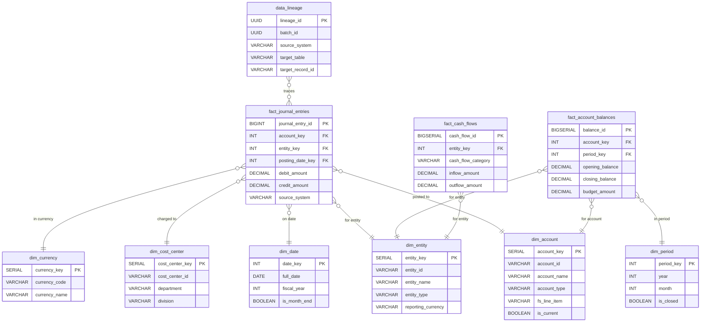
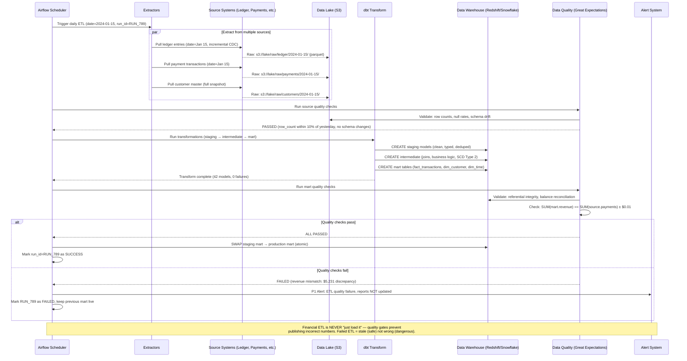
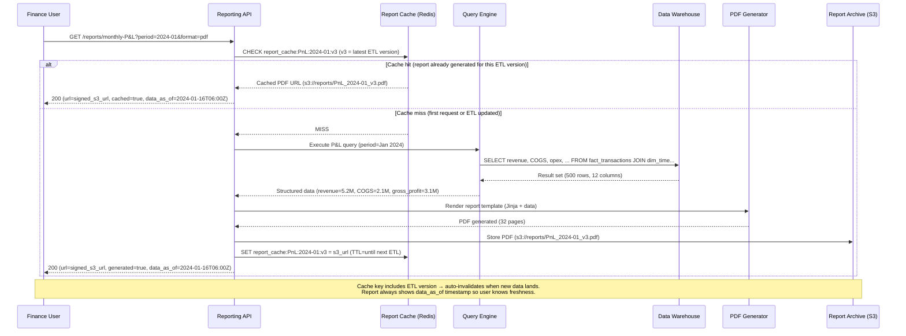

# Financial Reporting Pipeline

## 1. Functional Requirements

### Core Features
- **Multi-Source Data Ingestion**: Ledger, trading systems, payment processors, banking feeds
- **Dimensional Modeling**: Star schema with fact/dimension tables (GAAP-compliant)
- **Standard Reports**: Balance Sheet, P&L (Income Statement), Cash Flow Statement
- **GAAP/IFRS Compliance**: Chart of accounts mapping, revenue recognition, accrual basis
- **Drill-Down Analytics**: From summary → department → transaction level
- **Scheduled Report Generation**: Automated daily/monthly/quarterly runs
- **Regulatory Filings**: SEC (10-K, 10-Q), tax authorities, banking regulators
- **Data Lineage**: Full traceability from report number to source transaction

### Report Types
1. **Operational**: Daily P&L, cash position, aging reports
2. **Management**: Budget vs actual, variance analysis, KPIs
3. **Statutory**: Audited financials, regulatory filings
4. **Ad-Hoc**: Custom queries with dimensional slicing

## 2. Non-Functional Requirements

| Metric | Target |
|--------|--------|
| Data freshness (operational) | < 15 minutes |
| Data freshness (statutory) | T+1 (end of next business day) |
| Report generation (standard) | < 5 minutes |
| Report generation (full GL) | < 30 minutes |
| Query latency (OLAP) | < 10 seconds for 95th percentile |
| Data accuracy | 100% (audit requirement) |
| Historical retention | 10 years |
| Concurrent report users | 500 |

## 3. Capacity Estimation

### Assumptions
- 100M transactions/month across all sources
- 10,000 GL accounts
- 50 cost centers, 200 departments
- 5 legal entities, 10 currencies
- Daily close produces ~5M journal entries

### Storage
- Fact tables: 100M/month × 500B = 50GB/month = 600GB/year
- Dimension tables: ~500MB (slowly changing)
- Aggregated cubes: ~200GB
- Historical (10 years): ~7TB
- Reports (PDF/Excel): ~50GB/year
- Total: ~10TB with compression

### Compute
- ETL batch: 100M records × 5 transformations = 500M operations/day
- OLAP queries: 500 users × 20 queries/day × avg 10s = manageable
- Month-end close: Spike to 10x normal processing

## 4. Data Modeling

## 4. Data Modeling

### Entity-Relationship Diagram



### Dimensional Model (Star Schema)

```sql
-- ═══════════════════════════════════════════════════
-- FACT TABLES
-- ═══════════════════════════════════════════════════

-- Fact: Journal Entries (grain = one debit or credit line)
CREATE TABLE fact_journal_entries (
    journal_entry_id BIGINT NOT NULL,
    line_number INT NOT NULL,
    posting_date_key INT NOT NULL, -- FK to dim_date
    effective_date_key INT NOT NULL,
    account_key INT NOT NULL, -- FK to dim_account
    entity_key INT NOT NULL, -- FK to dim_entity
    cost_center_key INT NOT NULL, -- FK to dim_cost_center
    currency_key INT NOT NULL, -- FK to dim_currency
    department_key INT NOT NULL,
    project_key INT,
    debit_amount DECIMAL(18, 4) DEFAULT 0,
    credit_amount DECIMAL(18, 4) DEFAULT 0,
    base_currency_amount DECIMAL(18, 4), -- Translated to reporting currency
    fx_rate DECIMAL(12, 8),
    transaction_amount DECIMAL(18, 4), -- Original amount
    transaction_currency VARCHAR(3),
    source_system VARCHAR(30) NOT NULL, -- LEDGER, TRADING, PAYMENTS, MANUAL
    source_transaction_id VARCHAR(100),
    batch_id UUID, -- ETL batch tracking
    journal_type VARCHAR(20), -- REGULAR, ADJUSTING, CLOSING, REVERSING
    description TEXT,
    created_at TIMESTAMP DEFAULT NOW(),
    PRIMARY KEY (journal_entry_id, line_number)
) PARTITION BY RANGE (posting_date_key);

-- Create yearly partitions
CREATE TABLE fact_journal_entries_2024 PARTITION OF fact_journal_entries
    FOR VALUES FROM (20240101) TO (20250101);

CREATE INDEX idx_fact_je_account_date ON fact_journal_entries(account_key, posting_date_key);
CREATE INDEX idx_fact_je_entity ON fact_journal_entries(entity_key, posting_date_key);
CREATE INDEX idx_fact_je_source ON fact_journal_entries(source_system, source_transaction_id);

-- Fact: Account Balances (periodic snapshot, grain = account × period)
CREATE TABLE fact_account_balances (
    balance_id BIGSERIAL PRIMARY KEY,
    account_key INT NOT NULL,
    entity_key INT NOT NULL,
    cost_center_key INT NOT NULL,
    currency_key INT NOT NULL,
    period_key INT NOT NULL, -- FK to dim_period (YYYYMM)
    opening_balance DECIMAL(18, 4) NOT NULL,
    period_debits DECIMAL(18, 4) NOT NULL DEFAULT 0,
    period_credits DECIMAL(18, 4) NOT NULL DEFAULT 0,
    closing_balance DECIMAL(18, 4) NOT NULL,
    ytd_balance DECIMAL(18, 4),
    budget_amount DECIMAL(18, 4),
    variance_amount DECIMAL(18, 4),
    variance_pct DECIMAL(8, 4),
    base_currency_balance DECIMAL(18, 4),
    snapshot_at TIMESTAMP DEFAULT NOW(),
    UNIQUE(account_key, entity_key, cost_center_key, currency_key, period_key)
);

CREATE INDEX idx_fact_bal_period ON fact_account_balances(period_key, entity_key);

-- Fact: Cash Flows
CREATE TABLE fact_cash_flows (
    cash_flow_id BIGSERIAL PRIMARY KEY,
    date_key INT NOT NULL,
    entity_key INT NOT NULL,
    account_key INT NOT NULL,
    cash_flow_category VARCHAR(20) NOT NULL, -- OPERATING, INVESTING, FINANCING
    cash_flow_subcategory VARCHAR(50),
    inflow_amount DECIMAL(18, 4) DEFAULT 0,
    outflow_amount DECIMAL(18, 4) DEFAULT 0,
    net_amount DECIMAL(18, 4) NOT NULL,
    base_currency_amount DECIMAL(18, 4),
    source_transaction_id VARCHAR(100),
    classification_method VARCHAR(10) DEFAULT 'DIRECT', -- DIRECT, INDIRECT
    created_at TIMESTAMP DEFAULT NOW()
);

-- ═══════════════════════════════════════════════════
-- DIMENSION TABLES
-- ═══════════════════════════════════════════════════

-- Dim: Chart of Accounts (SCD Type 2)
CREATE TABLE dim_account (
    account_key SERIAL PRIMARY KEY,
    account_id VARCHAR(20) NOT NULL, -- Natural key (GL code)
    account_name VARCHAR(200) NOT NULL,
    account_type VARCHAR(20) NOT NULL, -- ASSET, LIABILITY, EQUITY, REVENUE, EXPENSE
    account_subtype VARCHAR(50),
    parent_account_id VARCHAR(20),
    hierarchy_level INT,
    hierarchy_path TEXT, -- /ASSETS/CURRENT/CASH
    is_control_account BOOLEAN DEFAULT FALSE,
    normal_balance VARCHAR(6), -- DEBIT or CREDIT
    -- GAAP/IFRS mapping
    gaap_classification VARCHAR(50),
    ifrs_classification VARCHAR(50),
    fs_line_item VARCHAR(100), -- Balance Sheet / P&L line
    -- SCD Type 2 columns
    effective_from DATE NOT NULL DEFAULT CURRENT_DATE,
    effective_to DATE DEFAULT '9999-12-31',
    is_current BOOLEAN DEFAULT TRUE,
    version INT DEFAULT 1
);

CREATE INDEX idx_dim_account_current ON dim_account(account_id) WHERE is_current = TRUE;
CREATE INDEX idx_dim_account_type ON dim_account(account_type, is_current);

-- Dim: Date
CREATE TABLE dim_date (
    date_key INT PRIMARY KEY, -- YYYYMMDD
    full_date DATE NOT NULL UNIQUE,
    year INT NOT NULL,
    quarter INT NOT NULL,
    month INT NOT NULL,
    week INT NOT NULL,
    day_of_month INT NOT NULL,
    day_of_week INT NOT NULL,
    day_name VARCHAR(10),
    month_name VARCHAR(10),
    fiscal_year INT,
    fiscal_quarter INT,
    fiscal_month INT,
    is_business_day BOOLEAN,
    is_month_end BOOLEAN,
    is_quarter_end BOOLEAN,
    is_year_end BOOLEAN
);

-- Dim: Legal Entity
CREATE TABLE dim_entity (
    entity_key SERIAL PRIMARY KEY,
    entity_id VARCHAR(20) NOT NULL,
    entity_name VARCHAR(200) NOT NULL,
    entity_type VARCHAR(30), -- PARENT, SUBSIDIARY, BRANCH, JV
    country VARCHAR(2),
    reporting_currency VARCHAR(3),
    parent_entity_id VARCHAR(20),
    consolidation_method VARCHAR(20), -- FULL, PROPORTIONAL, EQUITY
    is_active BOOLEAN DEFAULT TRUE,
    effective_from DATE NOT NULL,
    effective_to DATE DEFAULT '9999-12-31',
    is_current BOOLEAN DEFAULT TRUE
);

-- Dim: Cost Center
CREATE TABLE dim_cost_center (
    cost_center_key SERIAL PRIMARY KEY,
    cost_center_id VARCHAR(20) NOT NULL,
    cost_center_name VARCHAR(200) NOT NULL,
    department VARCHAR(100),
    division VARCHAR(100),
    business_unit VARCHAR(100),
    manager_name VARCHAR(200),
    budget_owner VARCHAR(200),
    is_active BOOLEAN DEFAULT TRUE,
    effective_from DATE NOT NULL,
    effective_to DATE DEFAULT '9999-12-31',
    is_current BOOLEAN DEFAULT TRUE
);

-- Dim: Currency
CREATE TABLE dim_currency (
    currency_key SERIAL PRIMARY KEY,
    currency_code VARCHAR(3) NOT NULL UNIQUE,
    currency_name VARCHAR(100),
    symbol VARCHAR(5),
    decimal_places INT DEFAULT 2,
    is_reporting_currency BOOLEAN DEFAULT FALSE
);

-- Dim: Period (for snapshot facts)
CREATE TABLE dim_period (
    period_key INT PRIMARY KEY, -- YYYYMM
    year INT NOT NULL,
    month INT NOT NULL,
    quarter INT NOT NULL,
    period_start DATE NOT NULL,
    period_end DATE NOT NULL,
    fiscal_year INT,
    fiscal_quarter INT,
    is_closed BOOLEAN DEFAULT FALSE,
    closed_at TIMESTAMP,
    is_audited BOOLEAN DEFAULT FALSE
);

-- ═══════════════════════════════════════════════════
-- ETL & LINEAGE TABLES
-- ═══════════════════════════════════════════════════

-- Data lineage tracking
CREATE TABLE data_lineage (
    lineage_id UUID PRIMARY KEY DEFAULT gen_random_uuid(),
    batch_id UUID NOT NULL,
    source_system VARCHAR(30) NOT NULL,
    source_table VARCHAR(100),
    source_record_id VARCHAR(200),
    target_table VARCHAR(100) NOT NULL,
    target_record_id VARCHAR(200) NOT NULL,
    transformation_rule VARCHAR(100),
    transformation_details JSONB,
    processed_at TIMESTAMP DEFAULT NOW()
);

CREATE INDEX idx_lineage_target ON data_lineage(target_table, target_record_id);
CREATE INDEX idx_lineage_source ON data_lineage(source_system, source_record_id);
CREATE INDEX idx_lineage_batch ON data_lineage(batch_id);

-- Report definitions
CREATE TABLE report_definitions (
    report_id UUID PRIMARY KEY DEFAULT gen_random_uuid(),
    report_name VARCHAR(200) NOT NULL,
    report_type VARCHAR(30), -- BALANCE_SHEET, PNL, CASH_FLOW, CUSTOM
    template_config JSONB NOT NULL, -- Query templates, layout, parameters
    schedule_cron VARCHAR(50),
    parameters JSONB, -- Default parameters
    output_formats TEXT[], -- ['PDF', 'EXCEL', 'CSV']
    signoff_required BOOLEAN DEFAULT FALSE,
    signoff_roles TEXT[],
    created_at TIMESTAMP DEFAULT NOW()
);

-- Report runs (execution history)
CREATE TABLE report_runs (
    run_id UUID PRIMARY KEY DEFAULT gen_random_uuid(),
    report_id UUID REFERENCES report_definitions(report_id),
    parameters JSONB, -- Runtime parameters
    status VARCHAR(20) DEFAULT 'RUNNING', -- RUNNING, COMPLETED, FAILED, SIGNED_OFF
    started_at TIMESTAMP DEFAULT NOW(),
    completed_at TIMESTAMP,
    output_url TEXT,
    row_count INT,
    computation_time_ms INT,
    signed_off_by UUID,
    signed_off_at TIMESTAMP,
    error_message TEXT
);

-- Data quality rules
CREATE TABLE data_quality_rules (
    rule_id UUID PRIMARY KEY DEFAULT gen_random_uuid(),
    rule_name VARCHAR(200) NOT NULL,
    rule_type VARCHAR(30), -- RECONCILIATION, THRESHOLD, COMPLETENESS, CONSISTENCY
    source_query TEXT NOT NULL,
    target_query TEXT,
    comparison_operator VARCHAR(10), -- EQ, LTE, GTE, WITHIN_TOLERANCE
    tolerance DECIMAL(8, 4),
    severity VARCHAR(10) DEFAULT 'ERROR', -- ERROR, WARNING, INFO
    is_active BOOLEAN DEFAULT TRUE
);

-- Data quality results
CREATE TABLE data_quality_results (
    result_id UUID PRIMARY KEY DEFAULT gen_random_uuid(),
    rule_id UUID REFERENCES data_quality_rules(rule_id),
    batch_id UUID,
    period_key INT,
    passed BOOLEAN NOT NULL,
    source_value DECIMAL(18, 4),
    target_value DECIMAL(18, 4),
    discrepancy DECIMAL(18, 4),
    details JSONB,
    checked_at TIMESTAMP DEFAULT NOW()
);

CREATE INDEX idx_dq_results_failed ON data_quality_results(checked_at) WHERE NOT passed;
```

## 5. High-Level Design (HLD)

```
┌──────────────────────────────────────────────────────────────────────────────────┐
│                       FINANCIAL REPORTING PIPELINE                                 │
├──────────────────────────────────────────────────────────────────────────────────┤
│                                                                                    │
│  ┌──────────┐  ┌──────────┐  ┌──────────┐  ┌──────────┐  [SOURCE SYSTEMS]       │
│  │  General │  │ Trading  │  │ Payment  │  │  Banking │                          │
│  │  Ledger  │  │  System  │  │Processor │  │   Feeds  │                          │
│  └────┬─────┘  └────┬─────┘  └────┬─────┘  └────┬─────┘                          │
│       │              │              │              │                               │
│  ─────┴──────────────┴──────────────┴──────────────┴─────── CDC / Batch Extract  │
│                              │                                                     │
│              ┌───────────────▼────────────────┐                                   │
│              │     Ingestion Layer (Kafka)     │                                   │
│              │  [ledger.events] [trade.events] │                                   │
│              │  [payment.events] [bank.feeds]  │                                   │
│              └───────────────┬────────────────┘                                   │
│                              │                                                     │
│              ┌───────────────▼────────────────┐                                   │
│              │    Transformation Layer          │                                   │
│              │    (Apache Spark / dbt)          │                                   │
│              │                                  │                                   │
│              │  ┌─────────┐  ┌──────────────┐  │                                   │
│              │  │Normalize│  │ Dimensional  │  │                                   │
│              │  │& Cleanse│→ │   Modeling   │  │                                   │
│              │  └─────────┘  └──────────────┘  │                                   │
│              │         │              │         │                                   │
│              │  ┌──────▼──┐  ┌───────▼──────┐  │                                   │
│              │  │  Data   │  │  Aggregate   │  │                                   │
│              │  │ Quality │  │   & Cube     │  │                                   │
│              │  │ Checks  │  │  Generation  │  │                                   │
│              │  └─────────┘  └──────────────┘  │                                   │
│              └───────────────┬────────────────┘                                   │
│                              │                                                     │
│              ┌───────────────▼────────────────┐                                   │
│              │      Data Warehouse             │                                   │
│              │      (Snowflake / Redshift)     │                                   │
│              │                                  │                                   │
│              │  ┌──────┐ ┌──────┐ ┌────────┐  │                                   │
│              │  │ Fact │ │ Dim  │ │Aggreg- │  │                                   │
│              │  │Tables│ │Tables│ │ ates   │  │                                   │
│              │  └──────┘ └──────┘ └────────┘  │                                   │
│              └───────────────┬────────────────┘                                   │
│                              │                                                     │
│       ┌──────────────────────┼──────────────────────┐                             │
│       │                      │                      │                             │
│  ┌────▼─────┐  ┌────────────▼────────┐  ┌─────────▼─────┐                       │
│  │  Report  │  │   OLAP / BI Layer   │  │  Regulatory   │                       │
│  │ Generator│  │(Tableau/Looker/Cube) │  │ Filing Engine │                       │
│  └────┬─────┘  └────────────┬────────┘  └───────────────┘                       │
│       │                      │                                                    │
│  ┌────▼─────┐  ┌────────────▼────────┐                                          │
│  │PDF/Excel │  │  Dashboard/Self-Svc │                                          │
│  │Generation│  │      Analytics      │                                          │
│  └──────────┘  └─────────────────────┘                                          │
│                                                                                    │
│  ┌──────────────┐  ┌──────────┐  ┌────────────┐  ┌──────────────────┐           │
│  │  Metadata    │  │  Airflow │  │   Redis    │  │ Data Lineage     │           │
│  │  Catalog     │  │(Orchestr)│  │(Query Cache)│  │ (OpenLineage)    │           │
│  └──────────────┘  └──────────┘  └────────────┘  └──────────────────┘           │
└──────────────────────────────────────────────────────────────────────────────────┘
```

## 6. Low-Level Design (LLD) - APIs

### Generate Report
```http
POST /api/v1/reports/generate
Authorization: Bearer <finance_token>

{
  "report_type": "BALANCE_SHEET",
  "parameters": {
    "entity_id": "CORP-001",
    "as_of_date": "2024-03-31",
    "currency": "USD",
    "comparative_periods": ["2023-12-31", "2023-03-31"],
    "consolidation": true,
    "eliminate_intercompany": true
  },
  "output_formats": ["PDF", "EXCEL"],
  "drill_down_enabled": true
}

Response 202:
{
  "run_id": "run-uuid-001",
  "status": "RUNNING",
  "estimated_completion_seconds": 120,
  "tracking_url": "/api/v1/reports/runs/run-uuid-001"
}
```

### Query Financial Data (OLAP)
```http
POST /api/v1/analytics/query
Authorization: Bearer <analyst_token>

{
  "measures": ["debit_amount", "credit_amount", "net_amount"],
  "dimensions": ["account_type", "department", "period"],
  "filters": [
    {"dimension": "entity", "operator": "eq", "value": "CORP-001"},
    {"dimension": "period", "operator": "between", "value": ["2024-01", "2024-03"]},
    {"dimension": "account_type", "operator": "in", "value": ["REVENUE", "EXPENSE"]}
  ],
  "sort": [{"dimension": "net_amount", "direction": "desc"}],
  "limit": 100
}

Response 200:
{
  "query_id": "q-uuid-001",
  "execution_time_ms": 450,
  "total_rows": 45,
  "data": [
    {
      "account_type": "REVENUE",
      "department": "Product Sales",
      "period": "2024-03",
      "debit_amount": 0,
      "credit_amount": 5420000.00,
      "net_amount": 5420000.00
    }
  ],
  "drill_down_available": true
}
```

### Data Lineage Trace
```http
GET /api/v1/lineage/trace?target_table=fact_journal_entries&target_id=JE-2024-00123&depth=3

Response 200:
{
  "lineage_chain": [
    {
      "level": 0,
      "table": "fact_journal_entries",
      "record_id": "JE-2024-00123",
      "fields": {"debit_amount": 50000.00, "account": "4100-Revenue"}
    },
    {
      "level": 1,
      "table": "stg_payment_transactions",
      "record_id": "PMT-98765",
      "transformation": "payment_to_journal_entry",
      "fields": {"amount": 50000.00, "type": "SETTLEMENT"}
    },
    {
      "level": 2,
      "source_system": "STRIPE",
      "record_id": "pi_3abc123",
      "fields": {"amount": 5000000, "currency": "usd", "status": "succeeded"}
    }
  ]
}
```

## 7. Deep Dives

### Deep Dive 1: Dimensional Modeling (SCD Type 2)

```python
class SCDType2Processor:
    """Handles Slowly Changing Dimension Type 2 for Chart of Accounts."""
    
    async def process_account_change(self, account_id: str, new_attributes: dict):
        """When account attributes change, close old record and create new version."""
        
        today = date.today()
        
        async with self.db.transaction() as txn:
            # Close current record
            current = await txn.fetch_one("""
                SELECT * FROM dim_account 
                WHERE account_id = $1 AND is_current = TRUE
                FOR UPDATE
            """, account_id)
            
            if not current:
                # New account - insert directly
                await txn.execute("""
                    INSERT INTO dim_account (account_id, account_name, account_type, 
                        account_subtype, parent_account_id, hierarchy_level, hierarchy_path,
                        normal_balance, gaap_classification, fs_line_item,
                        effective_from, is_current, version)
                    VALUES ($1, $2, $3, $4, $5, $6, $7, $8, $9, $10, $11, TRUE, 1)
                """, account_id, *new_attributes.values(), today)
                return
            
            # Check if anything actually changed
            if self._attributes_match(current, new_attributes):
                return  # No change needed
            
            # Close old record
            await txn.execute("""
                UPDATE dim_account 
                SET effective_to = $1, is_current = FALSE
                WHERE account_key = $2
            """, today - timedelta(days=1), current.account_key)
            
            # Insert new version
            await txn.execute("""
                INSERT INTO dim_account (account_id, account_name, account_type,
                    account_subtype, parent_account_id, hierarchy_level, hierarchy_path,
                    normal_balance, gaap_classification, fs_line_item,
                    effective_from, is_current, version)
                VALUES ($1, $2, $3, $4, $5, $6, $7, $8, $9, $10, $11, TRUE, $12)
            """, account_id, *new_attributes.values(), today, current.version + 1)
    
    def _attributes_match(self, current, new_attrs: dict) -> bool:
        tracked_fields = ['account_name', 'account_type', 'account_subtype', 
                         'parent_account_id', 'gaap_classification', 'fs_line_item']
        for field in tracked_fields:
            if getattr(current, field) != new_attrs.get(field):
                return False
        return True
```

### Deep Dive 2: Report Generation Engine

```python
class ReportGenerator:
    """Template-based report generation with incremental computation."""
    
    REPORT_TEMPLATES = {
        'BALANCE_SHEET': {
            'sections': [
                {'name': 'ASSETS', 'account_types': ['ASSET'], 'subtotals': ['CURRENT_ASSETS', 'NON_CURRENT_ASSETS']},
                {'name': 'LIABILITIES', 'account_types': ['LIABILITY'], 'subtotals': ['CURRENT_LIABILITIES', 'NON_CURRENT_LIABILITIES']},
                {'name': 'EQUITY', 'account_types': ['EQUITY'], 'subtotals': ['RETAINED_EARNINGS', 'OTHER_EQUITY']},
            ],
            'validation': 'ASSETS = LIABILITIES + EQUITY'
        },
        'PNL': {
            'sections': [
                {'name': 'REVENUE', 'account_types': ['REVENUE']},
                {'name': 'COGS', 'account_types': ['EXPENSE'], 'filter': 'account_subtype = COGS'},
                {'name': 'GROSS_PROFIT', 'computed': 'REVENUE - COGS'},
                {'name': 'OPERATING_EXPENSES', 'account_types': ['EXPENSE'], 'filter': 'account_subtype != COGS'},
                {'name': 'OPERATING_INCOME', 'computed': 'GROSS_PROFIT - OPERATING_EXPENSES'},
                {'name': 'NET_INCOME', 'computed': 'OPERATING_INCOME + OTHER_INCOME - OTHER_EXPENSE - TAX'},
            ]
        }
    }
    
    async def generate(self, report_type: str, params: dict) -> dict:
        template = self.REPORT_TEMPLATES[report_type]
        
        # Check for materialized aggregate (incremental computation)
        cached_aggregate = await self._get_materialized_aggregate(report_type, params)
        if cached_aggregate and not params.get('force_refresh'):
            return self._format_report(cached_aggregate, template, params)
        
        # Full computation
        sections = {}
        for section in template['sections']:
            if 'computed' in section:
                # Derived from other sections
                sections[section['name']] = self._compute_derived(section['computed'], sections)
            else:
                # Query data warehouse
                section_data = await self._query_section(section, params)
                sections[section['name']] = section_data
        
        # Validate (e.g., A = L + E)
        if 'validation' in template:
            self._validate_report(template['validation'], sections)
        
        # Store materialized aggregate
        await self._store_aggregate(report_type, params, sections)
        
        # Generate comparative columns if requested
        if params.get('comparative_periods'):
            for period in params['comparative_periods']:
                comp_params = {**params, 'as_of_date': period}
                comp_sections = await self._generate_comparative(template, comp_params)
                for name, data in comp_sections.items():
                    sections[name][f'comparative_{period}'] = data
        
        return self._format_report(sections, template, params)
    
    async def _query_section(self, section: dict, params: dict) -> dict:
        """Query fact tables for a report section."""
        
        query = """
            SELECT 
                da.account_id,
                da.account_name,
                da.hierarchy_path,
                da.fs_line_item,
                COALESCE(SUM(fab.closing_balance), 0) as balance
            FROM fact_account_balances fab
            JOIN dim_account da ON fab.account_key = da.account_key AND da.is_current = TRUE
            JOIN dim_entity de ON fab.entity_key = de.entity_key AND de.is_current = TRUE
            WHERE da.account_type = ANY($1)
            AND fab.period_key = $2
            AND de.entity_id = $3
        """
        
        if section.get('filter'):
            query += f" AND {section['filter']}"
        
        query += " GROUP BY da.account_id, da.account_name, da.hierarchy_path, da.fs_line_item ORDER BY da.hierarchy_path"
        
        period_key = int(params['as_of_date'].strftime('%Y%m'))
        rows = await self.db.fetch_all(query, section['account_types'], period_key, params['entity_id'])
        
        return {
            'line_items': [dict(r) for r in rows],
            'total': sum(r.balance for r in rows)
        }

    # Sign-off workflow
    async def submit_for_signoff(self, run_id: str, prepared_by: str):
        """Submit generated report for management sign-off."""
        report_run = await self.db.fetch_one(
            "SELECT * FROM report_runs WHERE run_id = $1", run_id
        )
        
        report_def = await self.db.fetch_one(
            "SELECT * FROM report_definitions WHERE report_id = $1", report_run.report_id
        )
        
        if not report_def.signoff_required:
            return {"status": "AUTO_APPROVED"}
        
        # Create sign-off request
        for role in report_def.signoff_roles:
            await self.notification_service.request_signoff(
                run_id=run_id,
                role=role,
                deadline=datetime.now() + timedelta(days=2)
            )
        
        await self.db.execute(
            "UPDATE report_runs SET status = 'PENDING_SIGNOFF' WHERE run_id = $1", run_id
        )
        
        return {"status": "PENDING_SIGNOFF", "approvers": report_def.signoff_roles}
```

### Deep Dive 3: Data Quality Framework

```python
class DataQualityFramework:
    """Reconciliation rules, threshold alerts, lineage-based auditability."""
    
    BUILT_IN_RULES = [
        {
            'name': 'trial_balance_zero',
            'type': 'RECONCILIATION',
            'description': 'Total debits must equal total credits',
            'source_query': "SELECT SUM(debit_amount) - SUM(credit_amount) FROM fact_journal_entries WHERE posting_date_key = {period}",
            'expected': 0,
            'tolerance': 0.01,
            'severity': 'ERROR'
        },
        {
            'name': 'balance_sheet_equation',
            'type': 'RECONCILIATION', 
            'description': 'Assets = Liabilities + Equity',
            'source_query': """
                SELECT 
                    (SELECT SUM(closing_balance) FROM fact_account_balances fab 
                     JOIN dim_account da ON fab.account_key = da.account_key 
                     WHERE da.account_type = 'ASSET' AND fab.period_key = {period}) -
                    (SELECT SUM(closing_balance) FROM fact_account_balances fab 
                     JOIN dim_account da ON fab.account_key = da.account_key 
                     WHERE da.account_type IN ('LIABILITY', 'EQUITY') AND fab.period_key = {period})
            """,
            'expected': 0,
            'tolerance': 0.01,
            'severity': 'ERROR'
        },
        {
            'name': 'source_to_warehouse_count',
            'type': 'COMPLETENESS',
            'description': 'All source transactions must appear in warehouse',
            'source_query': "SELECT COUNT(*) FROM source_ledger_transactions WHERE posting_date = {date}",
            'target_query': "SELECT COUNT(*) FROM fact_journal_entries WHERE posting_date_key = {date_key}",
            'comparison': 'EQ',
            'severity': 'ERROR'
        },
        {
            'name': 'unusual_balance_swing',
            'type': 'THRESHOLD',
            'description': 'Account balance change > 50% month-over-month',
            'source_query': """
                SELECT account_id, 
                    ABS(current_balance - prior_balance) / NULLIF(ABS(prior_balance), 0) as pct_change
                FROM (
                    SELECT da.account_id,
                        MAX(CASE WHEN fab.period_key = {current_period} THEN closing_balance END) as current_balance,
                        MAX(CASE WHEN fab.period_key = {prior_period} THEN closing_balance END) as prior_balance
                    FROM fact_account_balances fab
                    JOIN dim_account da ON fab.account_key = da.account_key
                    GROUP BY da.account_id
                ) t
                WHERE pct_change > 0.5
            """,
            'severity': 'WARNING'
        }
    ]
    
    async def run_quality_checks(self, period_key: int, batch_id: str) -> dict:
        """Execute all active data quality rules."""
        rules = await self.db.fetch_all(
            "SELECT * FROM data_quality_rules WHERE is_active = TRUE"
        )
        
        results = {'passed': 0, 'failed': 0, 'warnings': 0, 'details': []}
        
        for rule in rules:
            result = await self._execute_rule(rule, period_key, batch_id)
            results['details'].append(result)
            
            if result['passed']:
                results['passed'] += 1
            elif rule.severity == 'ERROR':
                results['failed'] += 1
            else:
                results['warnings'] += 1
        
        # Store results
        for detail in results['details']:
            await self.db.execute("""
                INSERT INTO data_quality_results 
                (rule_id, batch_id, period_key, passed, source_value, target_value, discrepancy, details)
                VALUES ($1, $2, $3, $4, $5, $6, $7, $8)
            """, detail['rule_id'], batch_id, period_key, 
                detail['passed'], detail.get('source_value'), 
                detail.get('target_value'), detail.get('discrepancy'), detail)
        
        # Alert if failures
        if results['failed'] > 0:
            await self.alert_service.send_critical(
                "Data Quality Check Failed",
                f"Period {period_key}: {results['failed']} critical failures",
                results['details']
            )
        
        return results
```

## 8. Component Optimization

### Kafka Configuration
```yaml
# Source system CDC events
ledger.events:
  partitions: 32
  replication-factor: 3
  retention.ms: 2592000000  # 30 days (reprocessing window)
  cleanup.policy: compact,delete

# Transformed facts (for streaming aggregates)
financial.facts:
  partitions: 16
  replication-factor: 3
  retention.ms: 604800000  # 7 days

# Exactly-once for financial data
producer:
  enable.idempotence: true
  acks: all
  max.in.flight.requests: 1
```

### Redis Configuration (Query Cache)
```yaml
redis:
  cluster: 3 nodes
  maxmemory: 16GB
  maxmemory-policy: allkeys-lru
  
  # Report query cache
  query-cache:
    key: "report:{hash(query+params)}"
    ttl: 300  # 5 min for operational
    ttl-statutory: 0  # No cache for statutory (always fresh)
  
  # Materialized aggregates
  aggregates:
    key: "agg:{report_type}:{entity}:{period}"
    ttl: 3600  # 1 hour
    invalidate-on: "period.closed" event
```

### Spark/dbt Configuration
```yaml
spark:
  executor-memory: 8g
  executor-cores: 4
  num-executors: 20
  shuffle-partitions: 200
  adaptive-execution: true

dbt:
  models:
    staging:
      materialized: view  # Always fresh
    intermediate:
      materialized: incremental
      incremental_strategy: merge
      unique_key: [journal_entry_id, line_number]
    marts:
      materialized: table
      pre-hook: "ANALYZE ${this}"
```

## 9. Observability

### Metrics
```yaml
metrics:
  - name: etl_records_processed
    type: counter
    labels: [source_system, table, batch_id]
  
  - name: etl_processing_duration_seconds
    type: histogram
    labels: [pipeline_stage]
  
  - name: data_freshness_lag_minutes
    type: gauge
    labels: [source_system]
    alert_threshold: 60  # > 1 hour stale
  
  - name: dq_check_results
    type: gauge
    labels: [rule_name, severity, passed]
  
  - name: report_generation_duration_seconds
    type: histogram
    labels: [report_type]
    buckets: [10, 30, 60, 120, 300, 600]
  
  - name: reconciliation_discrepancy_amount
    type: gauge
    labels: [rule_name]
    alert_threshold: 0.01

alerts:
  - name: TrialBalanceImbalance
    expr: reconciliation_discrepancy_amount{rule_name="trial_balance_zero"} > 0.01
    severity: critical
    
  - name: ETLFreshnessBreach
    expr: data_freshness_lag_minutes > 60
    severity: warning
    
  - name: MonthEndCloseDelayed
    expr: report_generation_duration_seconds{report_type="BALANCE_SHEET"} > 1800
    severity: warning
```

## 10. Failure Modes & Considerations

| Failure | Impact | Mitigation |
|---------|--------|------------|
| Source system unavailable | Stale data | CDC buffering in Kafka, track freshness SLA |
| ETL job failure | Missing transactions | Idempotent loads, automatic retry, dead letter queue |
| Data quality failure | Incorrect reports | Block report generation until resolved |
| Period already closed | Late transactions | Adjustment entries in next period |
| Currency rate missing | Translation fails | Default to prior rate + alert, never skip |

### Audit Requirements
- All transformations logged with lineage
- No direct modification of fact tables (append-only + corrections)
- Period close is irreversible (amendments via adjustment entries)
- SOX 404 compliance: separation of duties (prepare vs approve vs publish)

## 11. Trade-offs & Alternatives

| Decision | Choice | Alternative | Why |
|----------|--------|-------------|-----|
| Data warehouse | Snowflake | Redshift/BigQuery | Separation of storage/compute, time-travel |
| ETL orchestration | Airflow + dbt | Informatica | Cost, flexibility, version control |
| OLAP layer | Materialized views + Redis | Apache Druid/Pinot | Simpler ops, sufficient for financial queries |
| Star schema | Kimball dimensional | Data vault | Finance team familiarity, simpler queries |
| Report output | Templated (Jinja + SQL) | XBRL generators | Flexibility for custom reports |
| SCD handling | Type 2 (full history) | Type 1 (overwrite) | Audit trail required for financial data |

---

## 12. Sequence Diagrams

### Diagram 1: ETL Pipeline Run



### Diagram 2: Report Generation with Caching



### Infrastructure Components

```
┌─────────────────────────────────────────────────────────────┐
│ FINANCIAL REPORTING PIPELINE INFRASTRUCTURE                   │
├─────────────────────────────────────────────────────────────┤
│                                                              │
│ ORCHESTRATION:                                               │
│ ├── Apache Airflow (MWAA): DAG scheduling, dependency mgmt  │
│ ├── dbt Cloud/Core: SQL transformations, lineage, testing    │
│ └── Retry policy: 3 attempts with exponential backoff        │
│                                                              │
│ DATA LAKE:                                                   │
│ ├── S3: Raw zone (immutable source copies)                   │
│ ├── S3: Staging zone (cleaned, partitioned by date)          │
│ ├── Format: Parquet (columnar, compressed)                   │
│ └── Retention: Raw=7 years (regulatory), Staging=2 years     │
│                                                              │
│ DATA WAREHOUSE:                                              │
│ ├── Snowflake/Redshift: Star schema (Kimball dimensional)    │
│ ├── Fact tables: fact_transactions, fact_settlements          │
│ ├── Dimension tables: dim_customer, dim_merchant, dim_time   │
│ └── Materialized views for common aggregations               │
│                                                              │
│ CACHING & SERVING:                                           │
│ ├── Redis: Query result cache (keyed by query_hash + ETL ver)│
│ ├── S3: Generated report archive (PDF, XLSX, XBRL)          │
│ └── CDN: Frequently accessed dashboards                      │
│                                                              │
│ DATA QUALITY:                                                │
│ ├── Great Expectations: Schema, completeness, accuracy tests │
│ ├── dbt tests: unique, not_null, relationships, custom SQL   │
│ ├── Reconciliation: Cross-check totals against source systems│
│ └── Alert: PagerDuty for failed quality gates                │
│                                                              │
│ COMPLIANCE:                                                   │
│ ├── Audit trail: Every report generation logged              │
│ ├── Access control: Row-level security (user sees own BU)    │
│ ├── SOX compliance: Change management on report definitions  │
│ └── Immutable archive: Reports once published cannot change  │
│                                                              │
└─────────────────────────────────────────────────────────────┘
```
