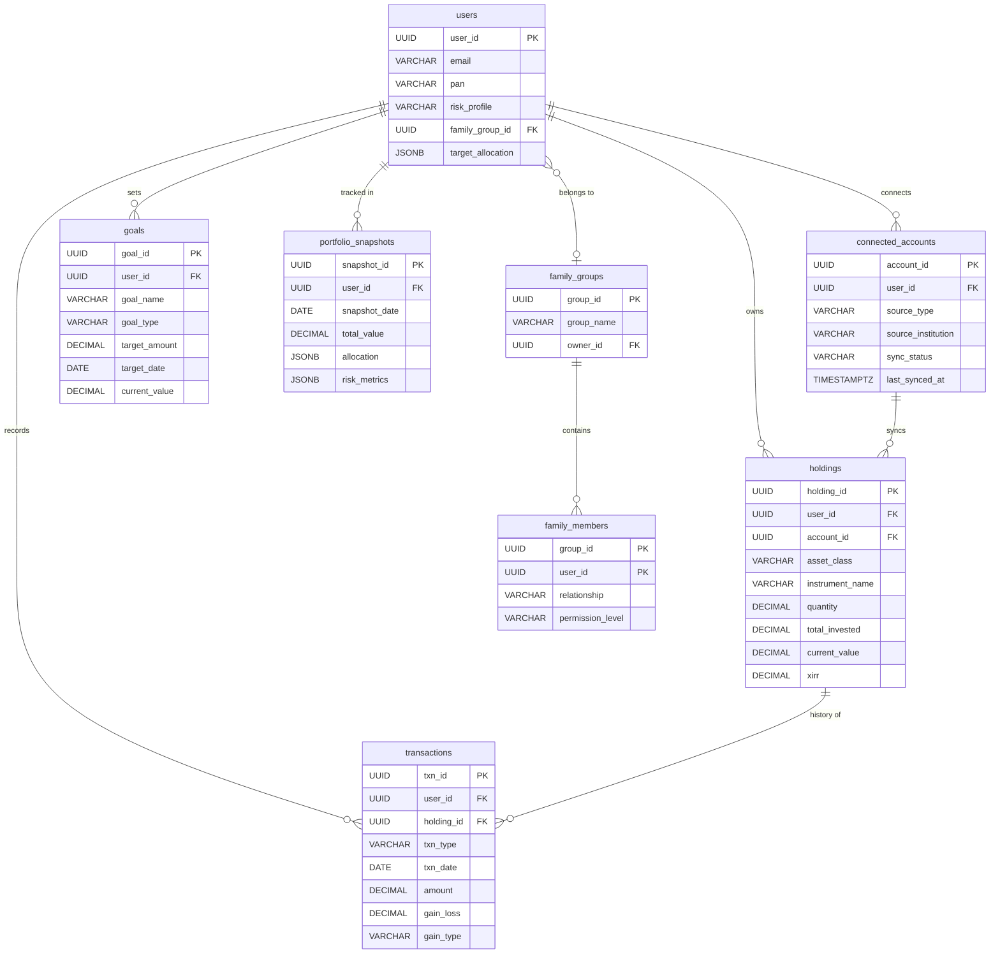
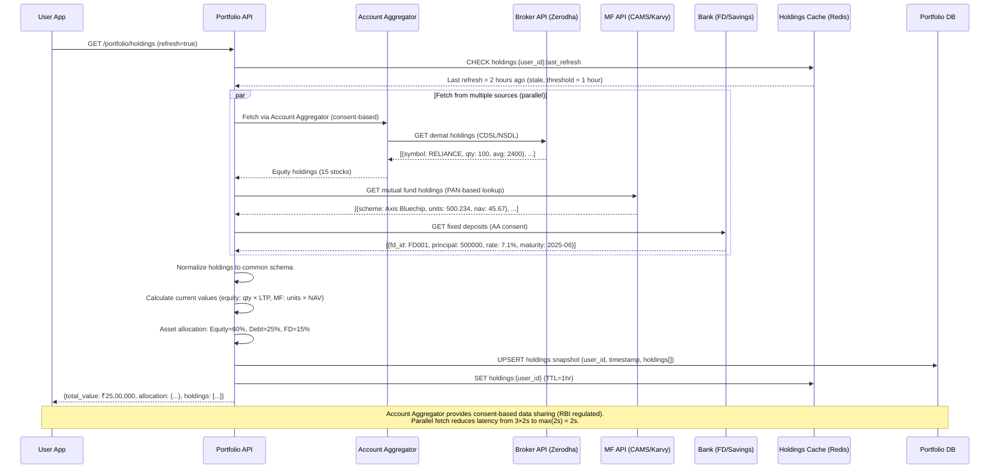
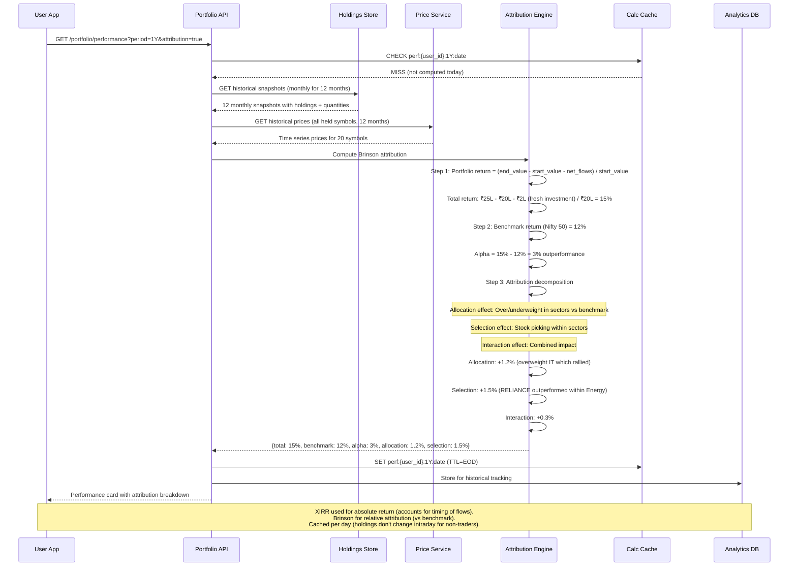

# Portfolio Management & Holdings Aggregation

## 1. Functional Requirements

### Core Features
- **Multi-Asset Support**: Stocks, mutual funds, FDs, real estate, crypto, bonds, gold, NPS
- **Account Aggregation**: Pull data from bank accounts, demat, MF RTAs, crypto exchanges
- **Real-Time Valuation**: Live portfolio value with market data integration
- **Performance Attribution**: Factor-based and Brinson model attribution
- **Rebalancing Recommendations**: Target allocation vs current, tax-efficient suggestions
- **Risk Metrics**: Sharpe ratio, beta, VaR, max drawdown, standard deviation
- **Goal Tracking**: Map investments to goals, track progress vs target
- **Family View**: Aggregate portfolios of family members with permissions

### Data Sources
1. **Account Aggregator (AA)** framework for consent-based bank/demat data
2. **CAMS/KFintech** for mutual fund holdings
3. **Depository (CDSL/NSDL)** for demat holdings
4. **Direct integrations** for crypto, real estate, insurance

## 2. Non-Functional Requirements

| Metric | Target |
|--------|--------|
| Data refresh (market hours) | < 5 minutes |
| Portfolio load time | < 2 seconds |
| Account aggregation sync | < 30 seconds |
| Availability | 99.9% |
| Concurrent users | 200K |
| Data accuracy | 100% (financial data) |
| Historical data | 10 years |
| Attribution calculation | < 10 seconds |

## 3. Capacity Estimation

### Assumptions
- 5M users, 500K DAU
- Average 15 holdings per user across asset classes
- Price updates: 5000 stocks + 10000 MF NAVs = 15000 instruments
- Account aggregation: 500K syncs/day
- Total holdings records: 5M × 15 = 75M

### Storage
- Holdings: 75M × 500B = 37.5GB
- Transaction history: 75M positions × 20 txns × 300B = 450GB
- Market data: 15K instruments × 365 days × 50B = 270MB/year
- Aggregated account data: 5M × 10KB = 50GB
- Total: ~600GB

### Compute
- Real-time valuation: 75M holdings × price update = batch compute every 5 min
- XIRR calculation: O(n×log(n)) per holding, batch for 75M = significant compute
- Risk metrics: Monte Carlo simulations, matrix operations

## 4. Data Modeling

## 4. Data Modeling

### Entity-Relationship Diagram



### Full Database Schemas

```sql
-- Users and family groups
CREATE TABLE users (
    user_id UUID PRIMARY KEY DEFAULT gen_random_uuid(),
    email VARCHAR(255) UNIQUE,
    phone VARCHAR(15),
    name VARCHAR(200) NOT NULL,
    pan VARCHAR(10) UNIQUE,
    risk_profile VARCHAR(20),
    family_group_id UUID REFERENCES family_groups(group_id),
    target_allocation JSONB, -- {equity: 60, debt: 30, gold: 5, real_estate: 5}
    created_at TIMESTAMP DEFAULT NOW()
);

CREATE TABLE family_groups (
    group_id UUID PRIMARY KEY DEFAULT gen_random_uuid(),
    group_name VARCHAR(100),
    owner_id UUID NOT NULL,
    created_at TIMESTAMP DEFAULT NOW()
);

CREATE TABLE family_members (
    group_id UUID REFERENCES family_groups(group_id),
    user_id UUID REFERENCES users(user_id),
    relationship VARCHAR(20),
    permission_level VARCHAR(20) DEFAULT 'VIEW', -- VIEW, MANAGE
    PRIMARY KEY (group_id, user_id)
);

-- Connected accounts (via Account Aggregator)
CREATE TABLE connected_accounts (
    account_id UUID PRIMARY KEY DEFAULT gen_random_uuid(),
    user_id UUID NOT NULL REFERENCES users(user_id),
    source_type VARCHAR(30) NOT NULL, 
    -- ACCOUNT_AGGREGATOR, DIRECT_BROKER, MANUAL, CAMS, KFINTECH, CDSL, CRYPTO_EXCHANGE
    source_institution VARCHAR(100), -- Bank name, broker name
    account_identifier VARCHAR(100), -- Account number (masked)
    consent_id VARCHAR(100), -- AA consent artifact
    consent_status VARCHAR(20), -- ACTIVE, EXPIRED, REVOKED
    consent_expiry TIMESTAMP,
    last_synced_at TIMESTAMP,
    sync_status VARCHAR(20) DEFAULT 'PENDING',
    sync_error TEXT,
    metadata JSONB, -- Institution-specific metadata
    created_at TIMESTAMP DEFAULT NOW()
);

CREATE INDEX idx_accounts_user ON connected_accounts(user_id);
CREATE INDEX idx_accounts_sync ON connected_accounts(sync_status, last_synced_at);

-- Holdings (unified across all asset classes)
CREATE TABLE holdings (
    holding_id UUID PRIMARY KEY DEFAULT gen_random_uuid(),
    user_id UUID NOT NULL,
    account_id UUID REFERENCES connected_accounts(account_id),
    
    -- Asset identification
    asset_class VARCHAR(20) NOT NULL, -- EQUITY, MUTUAL_FUND, FIXED_DEPOSIT, REAL_ESTATE, CRYPTO, GOLD, BOND, NPS
    asset_subclass VARCHAR(30), -- LARGE_CAP, DEBT_FUND, etc.
    instrument_id VARCHAR(50), -- ISIN, symbol, or internal ID
    instrument_name VARCHAR(300) NOT NULL,
    
    -- Quantity and cost
    quantity DECIMAL(16, 6) NOT NULL, -- Supports fractional (crypto, MF units)
    average_cost DECIMAL(14, 4) NOT NULL,
    total_invested DECIMAL(14, 2) NOT NULL,
    
    -- Current valuation
    current_price DECIMAL(14, 4),
    current_value DECIMAL(14, 2),
    unrealized_gain DECIMAL(14, 2),
    unrealized_gain_pct DECIMAL(8, 4),
    day_change DECIMAL(14, 2),
    day_change_pct DECIMAL(8, 4),
    
    -- Performance
    xirr DECIMAL(8, 4),
    absolute_return_pct DECIMAL(8, 4),
    cagr DECIMAL(8, 4),
    
    -- Metadata
    currency VARCHAR(3) DEFAULT 'INR',
    exchange VARCHAR(10),
    folio_number VARCHAR(20), -- For MF
    maturity_date DATE, -- For FD/bonds
    interest_rate DECIMAL(6, 4), -- For FD/bonds
    lock_in_until DATE,
    
    -- Classification
    sector VARCHAR(50),
    market_cap_category VARCHAR(20),
    credit_rating VARCHAR(10),
    
    -- Tracking
    first_investment_date DATE,
    last_transaction_date DATE,
    last_price_update TIMESTAMP,
    is_active BOOLEAN DEFAULT TRUE,
    
    created_at TIMESTAMP DEFAULT NOW(),
    updated_at TIMESTAMP DEFAULT NOW()
);

CREATE INDEX idx_holdings_user ON holdings(user_id, asset_class) WHERE is_active = TRUE;
CREATE INDEX idx_holdings_instrument ON holdings(instrument_id);
CREATE INDEX idx_holdings_valuation ON holdings(user_id) WHERE is_active = TRUE;

-- Transactions (buy/sell/dividend/interest across all assets)
CREATE TABLE transactions (
    txn_id UUID PRIMARY KEY DEFAULT gen_random_uuid(),
    user_id UUID NOT NULL,
    holding_id UUID REFERENCES holdings(holding_id),
    account_id UUID REFERENCES connected_accounts(account_id),
    
    txn_type VARCHAR(20) NOT NULL, -- BUY, SELL, DIVIDEND, INTEREST, SIP, BONUS, SPLIT, RIGHTS, MATURITY
    txn_date DATE NOT NULL,
    
    quantity DECIMAL(16, 6),
    price DECIMAL(14, 4),
    amount DECIMAL(14, 2) NOT NULL,
    charges DECIMAL(10, 2) DEFAULT 0,
    tax_amount DECIMAL(10, 2) DEFAULT 0,
    net_amount DECIMAL(14, 2) NOT NULL,
    
    -- For gain/loss calculation
    cost_basis DECIMAL(14, 2), -- For sell transactions
    gain_loss DECIMAL(14, 2),
    gain_type VARCHAR(10), -- STCG, LTCG
    holding_period_days INT,
    
    source_reference VARCHAR(100), -- External reference
    notes TEXT,
    created_at TIMESTAMP DEFAULT NOW()
);

CREATE INDEX idx_txns_user ON transactions(user_id, txn_date DESC);
CREATE INDEX idx_txns_holding ON transactions(holding_id, txn_date);
CREATE INDEX idx_txns_type ON transactions(user_id, txn_type, txn_date);

-- Goals
CREATE TABLE goals (
    goal_id UUID PRIMARY KEY DEFAULT gen_random_uuid(),
    user_id UUID NOT NULL,
    goal_name VARCHAR(100) NOT NULL,
    goal_type VARCHAR(30), -- RETIREMENT, EDUCATION, HOUSE, EMERGENCY, VACATION, CUSTOM
    target_amount DECIMAL(14, 2) NOT NULL,
    target_date DATE NOT NULL,
    current_value DECIMAL(14, 2) DEFAULT 0,
    monthly_contribution DECIMAL(10, 2),
    expected_return_rate DECIMAL(6, 4),
    on_track BOOLEAN,
    shortfall_amount DECIMAL(14, 2),
    linked_holding_ids UUID[],
    created_at TIMESTAMP DEFAULT NOW()
);

-- Portfolio snapshots (daily)
CREATE TABLE portfolio_snapshots (
    snapshot_id UUID PRIMARY KEY DEFAULT gen_random_uuid(),
    user_id UUID NOT NULL,
    snapshot_date DATE NOT NULL,
    total_value DECIMAL(14, 2) NOT NULL,
    total_invested DECIMAL(14, 2) NOT NULL,
    day_change DECIMAL(14, 2),
    allocation JSONB, -- {equity: {value, pct}, debt: {value, pct}, ...}
    risk_metrics JSONB, -- {sharpe, beta, var_95, max_drawdown, std_dev}
    UNIQUE(user_id, snapshot_date)
);

CREATE INDEX idx_snapshots_user_date ON portfolio_snapshots(user_id, snapshot_date DESC);

-- Benchmark data
CREATE TABLE benchmarks (
    benchmark_id VARCHAR(20) PRIMARY KEY, -- NIFTY50, SENSEX, NIFTY_MIDCAP
    name VARCHAR(100),
    current_value DECIMAL(12, 2),
    returns_1y DECIMAL(8, 4),
    returns_3y DECIMAL(8, 4),
    returns_5y DECIMAL(8, 4)
);

CREATE TABLE benchmark_history (
    benchmark_id VARCHAR(20) REFERENCES benchmarks(benchmark_id),
    date DATE NOT NULL,
    value DECIMAL(12, 2) NOT NULL,
    PRIMARY KEY (benchmark_id, date)
);
```

## 5. High-Level Design (HLD)

```
┌──────────────────────────────────────────────────────────────────────────────────┐
│                 PORTFOLIO MANAGEMENT & AGGREGATION                                 │
├──────────────────────────────────────────────────────────────────────────────────┤
│                                                                                    │
│  ┌──────────┐  ┌──────────┐                                                      │
│  │  Mobile  │  │   Web    │                                                       │
│  │   App    │  │  Portal  │                                                       │
│  └────┬─────┘  └────┬─────┘                                                      │
│       └──────────────┘                                                             │
│              │                                                                     │
│    ┌─────────▼──────────┐                                                         │
│    │    API Gateway     │                                                         │
│    └─────────┬──────────┘                                                         │
│              │                                                                     │
│  ┌───────────┼───────────────────────────────────────────────┐                    │
│  │           │                                                │                    │
│  │  ┌────────▼─────┐  ┌──────────────┐  ┌────────────────┐  │                    │
│  │  │  Portfolio   │  │  Aggregation │  │  Analytics     │  │                    │
│  │  │  Service     │  │   Service    │  │  Engine        │  │                    │
│  │  └──────────────┘  └──────┬───────┘  └──────┬─────────┘  │                    │
│  │                           │                  │             │                    │
│  │  ┌───────────────┐  ┌────▼─────┐  ┌────────▼────────┐   │                    │
│  │  │  Valuation    │  │  Consent │  │  Attribution   │   │                    │
│  │  │  Engine       │  │  Manager │  │  Engine        │   │                    │
│  │  └───────────────┘  └──────────┘  └─────────────────┘   │                    │
│  │                                                           │                    │
│  └───────────────────────────────────────────────────────────┘                    │
│                              │                                                     │
│       ┌──────────────────────┼──────────────────────┐                             │
│       │                      │                      │                             │
│  ┌────▼─────────┐  ┌────────▼─────┐  ┌────────────▼──────┐                      │
│  │ Account      │  │  Market Data │  │  Manual Input     │                      │
│  │ Aggregator   │  │  Providers   │  │  (Real Estate/    │                      │
│  │ (AA/CAMS/    │  │  (NSE/BSE/   │  │   Insurance)      │                      │
│  │  CDSL/Crypto)│  │   Crypto)    │  │                   │                      │
│  └──────────────┘  └──────────────┘  └───────────────────┘                      │
│                                                                                    │
│  ┌─────────────┐  ┌──────────┐  ┌───────────┐  ┌──────────────┐                 │
│  │ PostgreSQL  │  │  Redis   │  │TimescaleDB│  │  S3 (Reports)│                 │
│  │(Holdings)   │  │(Live Vals)│  │(Snapshots)│  │              │                 │
│  └─────────────┘  └──────────┘  └───────────┘  └──────────────┘                 │
└──────────────────────────────────────────────────────────────────────────────────┘
```

## 6. Low-Level Design (LLD) - APIs

### Get Consolidated Portfolio
```http
GET /api/v1/portfolio?include_family=true&group_by=asset_class
Authorization: Bearer <token>

Response 200:
{
  "user_id": "user-001",
  "total_value": 15420000.00,
  "total_invested": 12500000.00,
  "total_gain": 2920000.00,
  "overall_xirr": 14.5,
  "day_change": 45000.00,
  "day_change_pct": 0.29,
  "last_synced": "2024-01-15T10:30:00Z",
  "risk_metrics": {
    "sharpe_ratio": 1.45,
    "beta": 0.92,
    "var_95_daily": -185000,
    "max_drawdown_1y": -12.5,
    "std_dev_annualized": 14.2
  },
  "allocation": {
    "equity": {"value": 9000000, "pct": 58.4, "target": 60},
    "mutual_funds": {"value": 3500000, "pct": 22.7, "target": 20},
    "fixed_deposit": {"value": 1500000, "pct": 9.7, "target": 10},
    "gold": {"value": 800000, "pct": 5.2, "target": 5},
    "real_estate": {"value": 620000, "pct": 4.0, "target": 5}
  },
  "top_gainers": [...],
  "top_losers": [...],
  "family_total": 28500000.00
}
```

### Initiate Account Aggregation
```http
POST /api/v1/aggregation/connect
Authorization: Bearer <token>

{
  "source_type": "ACCOUNT_AGGREGATOR",
  "aa_id": "finvu",
  "fi_types": ["DEPOSIT", "EQUITIES", "MUTUAL_FUNDS"],
  "consent_duration_months": 12
}

Response 202:
{
  "consent_request_id": "cr-uuid-001",
  "redirect_url": "https://finvu.in/consent/cr-uuid-001",
  "status": "CONSENT_PENDING",
  "message": "Redirect user to approve consent"
}
```

## 7. Deep Dives

### Deep Dive 1: Account Aggregation

```python
class AccountAggregationService:
    """Consent-based data pull via Account Aggregator framework."""
    
    async def initiate_consent(self, user_id: str, aa_id: str, fi_types: list) -> dict:
        """Create consent request via AA."""
        
        user = await self.db.fetch_one("SELECT * FROM users WHERE user_id = $1", user_id)
        
        # Build consent artifact per ReBIT spec
        consent_request = {
            "ver": "2.0.0",
            "txnid": str(uuid4()),
            "consentDetail": {
                "consentStart": datetime.now().isoformat(),
                "consentExpiry": (datetime.now() + timedelta(days=365)).isoformat(),
                "Customer": {"id": f"{user.phone}@{aa_id}"},
                "FIDataRange": {
                    "from": (date.today() - timedelta(days=3650)).isoformat(),
                    "to": date.today().isoformat()
                },
                "consentMode": "STORE",
                "fetchType": "PERIODIC",
                "Frequency": {"unit": "DAY", "value": 1},
                "DataLife": {"unit": "MONTH", "value": 12},
                "consentTypes": ["PROFILE", "SUMMARY", "TRANSACTIONS"],
                "fiTypes": fi_types,
                "DataConsumer": {"id": self.our_fiu_id},
                "Purpose": {
                    "code": "101",  # Wealth management
                    "text": "Portfolio aggregation and analytics"
                }
            }
        }
        
        # Submit to AA
        response = await self.aa_client.create_consent(aa_id, consent_request)
        
        # Store consent
        await self.db.execute("""
            INSERT INTO connected_accounts (user_id, source_type, source_institution, consent_id, consent_status)
            VALUES ($1, 'ACCOUNT_AGGREGATOR', $2, $3, 'PENDING')
        """, user_id, aa_id, response.consent_id)
        
        return {"consent_id": response.consent_id, "redirect_url": response.redirect_url}
    
    async def fetch_data_on_consent(self, consent_id: str):
        """Called when user approves consent - fetch financial data."""
        
        account = await self.db.fetch_one(
            "SELECT * FROM connected_accounts WHERE consent_id = $1", consent_id)
        
        # Request data fetch from AA
        session = await self.aa_client.create_fi_request(
            consent_id=consent_id,
            fi_data_range={
                "from": (date.today() - timedelta(days=3650)).isoformat(),
                "to": date.today().isoformat()
            }
        )
        
        # Poll for data (AA fetches from FIP asynchronously)
        fi_data = await self._poll_fi_data(session.session_id, timeout=30)
        
        # Decrypt and normalize data
        for fi_record in fi_data:
            decrypted = self._decrypt_fi_data(fi_record, session.key_material)
            normalized = await self._normalize_data(decrypted, fi_record.fi_type)
            await self._upsert_holdings(account.user_id, account.account_id, normalized)
        
        await self.db.execute("""
            UPDATE connected_accounts SET sync_status = 'SUCCESS', last_synced_at = NOW()
            WHERE account_id = $1
        """, account.account_id)
    
    async def _normalize_data(self, raw_data: dict, fi_type: str) -> list:
        """Normalize institution-specific data into unified holding format."""
        
        if fi_type == 'EQUITIES':
            return [{
                'asset_class': 'EQUITY',
                'instrument_id': holding['isin'],
                'instrument_name': holding['issuerName'],
                'quantity': Decimal(holding['units']),
                'average_cost': Decimal(holding['costValue']) / Decimal(holding['units']),
                'total_invested': Decimal(holding['costValue']),
                'exchange': 'NSE',
            } for holding in raw_data.get('holdings', [])]
        
        elif fi_type == 'MUTUAL_FUNDS':
            return [{
                'asset_class': 'MUTUAL_FUND',
                'instrument_id': holding['isin'],
                'instrument_name': holding['schemeName'],
                'quantity': Decimal(holding['closingUnits']),
                'average_cost': Decimal(holding['costValue']) / Decimal(holding['closingUnits']),
                'total_invested': Decimal(holding['costValue']),
                'folio_number': holding.get('folioNo'),
            } for holding in raw_data.get('holdings', [])]
        
        elif fi_type == 'DEPOSIT':
            return [{
                'asset_class': 'FIXED_DEPOSIT',
                'instrument_id': f"FD-{deposit['accountNumber'][-4:]}",
                'instrument_name': f"FD - {deposit['bankName']}",
                'quantity': Decimal('1'),
                'average_cost': Decimal(deposit['depositAmount']),
                'total_invested': Decimal(deposit['depositAmount']),
                'maturity_date': deposit.get('maturityDate'),
                'interest_rate': Decimal(deposit.get('interestRate', 0)),
                'current_value': Decimal(deposit.get('currentValue', deposit['depositAmount'])),
            } for deposit in raw_data.get('deposits', [])]
        
        return []
```

### Deep Dive 2: Performance Attribution

```python
import numpy as np
from typing import Dict, List

class PerformanceAttributionEngine:
    """Brinson model + factor-based attribution."""
    
    async def brinson_attribution(self, user_id: str, benchmark_id: str, 
                                   start_date: date, end_date: date) -> dict:
        """
        Brinson-Fachler attribution model:
        - Allocation Effect: Over/underweighting sectors vs benchmark
        - Selection Effect: Picking better/worse stocks within sectors
        - Interaction Effect: Combined effect
        """
        
        # Get portfolio weights and returns by sector
        portfolio = await self._get_sector_returns(user_id, start_date, end_date)
        benchmark = await self._get_benchmark_sector_returns(benchmark_id, start_date, end_date)
        
        total_allocation = 0
        total_selection = 0
        total_interaction = 0
        sector_attribution = []
        
        all_sectors = set(portfolio.keys()) | set(benchmark.keys())
        
        benchmark_total_return = sum(
            benchmark.get(s, {}).get('weight', 0) * benchmark.get(s, {}).get('return', 0) 
            for s in all_sectors
        )
        
        for sector in all_sectors:
            wp = portfolio.get(sector, {}).get('weight', 0)  # Portfolio weight
            wb = benchmark.get(sector, {}).get('weight', 0)  # Benchmark weight
            rp = portfolio.get(sector, {}).get('return', 0)  # Portfolio return
            rb = benchmark.get(sector, {}).get('return', 0)  # Benchmark return
            
            # Allocation effect: (wp - wb) × (rb - Rb)
            allocation = (wp - wb) * (rb - benchmark_total_return)
            
            # Selection effect: wb × (rp - rb)
            selection = wb * (rp - rb)
            
            # Interaction effect: (wp - wb) × (rp - rb)
            interaction = (wp - wb) * (rp - rb)
            
            total_allocation += allocation
            total_selection += selection
            total_interaction += interaction
            
            sector_attribution.append({
                'sector': sector,
                'portfolio_weight': round(wp * 100, 2),
                'benchmark_weight': round(wb * 100, 2),
                'portfolio_return': round(rp * 100, 2),
                'benchmark_return': round(rb * 100, 2),
                'allocation_effect': round(allocation * 100, 4),
                'selection_effect': round(selection * 100, 4),
                'interaction_effect': round(interaction * 100, 4),
                'total_effect': round((allocation + selection + interaction) * 100, 4)
            })
        
        portfolio_return = sum(
            portfolio.get(s, {}).get('weight', 0) * portfolio.get(s, {}).get('return', 0)
            for s in all_sectors
        )
        
        return {
            'period': {'start': start_date.isoformat(), 'end': end_date.isoformat()},
            'portfolio_return': round(portfolio_return * 100, 2),
            'benchmark_return': round(benchmark_total_return * 100, 2),
            'excess_return': round((portfolio_return - benchmark_total_return) * 100, 2),
            'attribution': {
                'allocation_effect': round(total_allocation * 100, 4),
                'selection_effect': round(total_selection * 100, 4),
                'interaction_effect': round(total_interaction * 100, 4),
                'total': round((total_allocation + total_selection + total_interaction) * 100, 4)
            },
            'by_sector': sorted(sector_attribution, key=lambda x: abs(x['total_effect']), reverse=True)
        }
    
    def calculate_time_weighted_return(self, cashflows: List[dict]) -> float:
        """TWR: Eliminates impact of cash flows (standard for fund comparison)."""
        
        # Split into sub-periods at each cash flow
        sub_period_returns = []
        
        for i in range(len(cashflows) - 1):
            start_value = cashflows[i]['portfolio_value']
            end_value = cashflows[i + 1]['portfolio_value']
            cashflow = cashflows[i + 1].get('cashflow', 0)  # External flow at end
            
            # Sub-period return = (End - Cashflow) / Start - 1
            if start_value > 0:
                sub_return = (end_value - cashflow) / start_value - 1
                sub_period_returns.append(sub_return)
        
        # TWR = Product of (1 + sub_period_returns) - 1
        twr = np.prod([1 + r for r in sub_period_returns]) - 1
        return round(twr * 100, 4)

    def calculate_risk_metrics(self, daily_returns: np.ndarray, risk_free_rate: float = 0.065) -> dict:
        """Calculate comprehensive risk metrics."""
        
        daily_rf = (1 + risk_free_rate) ** (1/252) - 1
        excess_returns = daily_returns - daily_rf
        
        annualized_return = np.mean(daily_returns) * 252
        annualized_std = np.std(daily_returns) * np.sqrt(252)
        
        # Sharpe Ratio
        sharpe = (annualized_return - risk_free_rate) / annualized_std if annualized_std > 0 else 0
        
        # Sortino Ratio (downside deviation only)
        downside_returns = daily_returns[daily_returns < daily_rf]
        downside_std = np.std(downside_returns) * np.sqrt(252) if len(downside_returns) > 0 else 0
        sortino = (annualized_return - risk_free_rate) / downside_std if downside_std > 0 else 0
        
        # VaR (95% confidence)
        var_95 = np.percentile(daily_returns, 5)
        
        # Max Drawdown
        cumulative = np.cumprod(1 + daily_returns)
        running_max = np.maximum.accumulate(cumulative)
        drawdowns = (cumulative - running_max) / running_max
        max_drawdown = np.min(drawdowns)
        
        return {
            'sharpe_ratio': round(sharpe, 4),
            'sortino_ratio': round(sortino, 4),
            'var_95_daily_pct': round(var_95 * 100, 4),
            'max_drawdown_pct': round(max_drawdown * 100, 4),
            'annualized_volatility_pct': round(annualized_std * 100, 4),
            'annualized_return_pct': round(annualized_return * 100, 4)
        }
```

### Deep Dive 3: Rebalancing Engine

```python
class RebalancingEngine:
    """Generate tax-efficient rebalancing recommendations."""
    
    async def generate_recommendations(self, user_id: str) -> dict:
        """Generate rebalancing trades to align with target allocation."""
        
        user = await self.db.fetch_one("SELECT * FROM users WHERE user_id = $1", user_id)
        target = user.target_allocation  # {equity: 60, debt: 30, gold: 5, ...}
        
        # Get current allocation
        holdings = await self.db.fetch_all("""
            SELECT h.*, h.current_value, h.asset_class, h.unrealized_gain,
                   h.first_investment_date, t.gain_type
            FROM holdings h
            LEFT JOIN LATERAL (
                SELECT CASE WHEN (CURRENT_DATE - h.first_investment_date) > 365 
                       THEN 'LTCG' ELSE 'STCG' END as gain_type
            ) t ON TRUE
            WHERE h.user_id = $1 AND h.is_active = TRUE
        """, user_id)
        
        total_value = sum(h.current_value for h in holdings)
        
        # Current vs target
        current_allocation = {}
        for h in holdings:
            ac = self._map_to_allocation_class(h.asset_class, h.asset_subclass)
            current_allocation[ac] = current_allocation.get(ac, 0) + float(h.current_value)
        
        current_pct = {k: v / float(total_value) * 100 for k, v in current_allocation.items()}
        
        # Calculate rebalancing trades
        trades = []
        for asset_class, target_pct in target.items():
            current = current_pct.get(asset_class, 0)
            diff_pct = target_pct - current
            diff_amount = float(total_value) * diff_pct / 100
            
            if abs(diff_pct) < 2:  # Within 2% tolerance band
                continue
            
            if diff_amount < 0:
                # Need to sell - pick tax-efficient sells
                sell_trades = self._select_sells(holdings, asset_class, abs(diff_amount))
                trades.extend(sell_trades)
            else:
                # Need to buy
                trades.append({
                    'action': 'BUY',
                    'asset_class': asset_class,
                    'amount': round(diff_amount, 2),
                    'suggestion': self._suggest_buy(asset_class, diff_amount)
                })
        
        # Calculate tax impact
        tax_impact = self._calculate_tax_impact(trades)
        
        return {
            'current_allocation': current_pct,
            'target_allocation': target,
            'drift_detected': any(abs(target.get(k, 0) - current_pct.get(k, 0)) > 2 for k in set(target) | set(current_pct)),
            'recommended_trades': trades,
            'estimated_tax_impact': tax_impact,
            'total_portfolio_value': float(total_value)
        }
    
    def _select_sells(self, holdings: list, asset_class: str, amount_needed: float) -> list:
        """Tax-efficient sell selection: prefer LTCG over STCG, losses over gains."""
        
        eligible = [h for h in holdings if self._map_to_allocation_class(h.asset_class, h.asset_subclass) == asset_class]
        
        # Priority: 1) Tax-loss harvesting, 2) LTCG (lower tax), 3) STCG
        eligible.sort(key=lambda h: (
            0 if h.unrealized_gain < 0 else 1,  # Losses first
            0 if h.gain_type == 'LTCG' else 1,  # Then LTCG
            h.unrealized_gain  # Then lowest gain
        ))
        
        sells = []
        remaining = amount_needed
        
        for h in eligible:
            if remaining <= 0:
                break
            
            sell_amount = min(float(h.current_value), remaining)
            sell_pct = sell_amount / float(h.current_value)
            
            sells.append({
                'action': 'SELL',
                'holding_id': h.holding_id,
                'instrument_name': h.instrument_name,
                'amount': round(sell_amount, 2),
                'quantity': round(float(h.quantity) * sell_pct, 4),
                'gain_loss': round(float(h.unrealized_gain) * sell_pct, 2),
                'gain_type': h.gain_type,
                'tax_efficient': h.unrealized_gain < 0 or h.gain_type == 'LTCG'
            })
            
            remaining -= sell_amount
        
        return sells
```

## 8. Component Optimization

### Kafka Configuration
```yaml
portfolio.updates:
  partitions: 16
  replication-factor: 3
  retention.ms: 86400000  # 1 day

aggregation.events:
  partitions: 8
  replication-factor: 3

market.prices:
  partitions: 32
  replication-factor: 2
  retention.ms: 3600000  # 1 hour (just for real-time)
```

### Redis Configuration
```yaml
redis:
  cluster: 6 nodes
  
  # Live portfolio valuation
  portfolio-value:
    key: "pv:{user_id}"
    type: hash
    ttl: 300  # 5 min refresh
  
  # Current prices
  prices:
    key: "price:{instrument_id}"
    type: hash  # {ltp, change, change_pct, updated_at}
    ttl: none  # Always fresh (streaming updates)
  
  # Computed risk metrics (expensive, cache longer)
  risk-metrics:
    key: "risk:{user_id}"
    ttl: 3600  # 1 hour
```

### Flink (Real-Time Valuation)
```yaml
flink:
  job: portfolio-valuation
  parallelism: 20
  # Joins market price stream with holdings
  # Emits updated portfolio values per user
  checkpointing: 30s
  state-backend: rocksdb
```

## 9. Observability

### Metrics
```yaml
metrics:
  - name: aggregation_sync_duration_seconds
    type: histogram
    labels: [source_type, institution]
    
  - name: aggregation_sync_success_rate
    type: gauge
    labels: [source_type]
    
  - name: portfolio_valuation_lag_seconds
    type: gauge
    labels: [asset_class]
    
  - name: attribution_computation_seconds
    type: histogram
    
  - name: holdings_count
    type: gauge
    labels: [asset_class]

alerts:
  - name: AggregationFailures
    expr: aggregation_sync_success_rate < 0.95
    severity: warning
    
  - name: PriceDataStale
    expr: portfolio_valuation_lag_seconds > 600
    severity: warning
```

## 10. Failure Modes & Considerations

| Failure | Impact | Mitigation |
|---------|--------|------------|
| AA consent expired | Data goes stale | Proactive renewal notifications, cache last known |
| Market data feed down | Portfolio value stale | Multiple providers, mark as "last updated X min ago" |
| Institution data format change | Parsing fails | Schema versioning, graceful degradation, alerts |
| Crypto API rate limited | Crypto values stale | Multiple exchange APIs, longer cache |
| Risk calculation timeout | Metrics unavailable | Pre-compute daily, serve from cache |

### Privacy & Consent
- All data access requires active AA consent
- Data encrypted at rest with user-specific keys
- Family view requires explicit member approval
- Right to erasure: delete all holdings data on request
- No data sharing with third parties without consent

## 11. Trade-offs & Alternatives

| Decision | Choice | Alternative | Why |
|----------|--------|-------------|-----|
| Data source | Account Aggregator | Screen scraping | Regulatory compliance, consent framework |
| Valuation | Near real-time (5 min) | True real-time (tick-level) | Cost vs value for portfolio app (not trading) |
| Risk computation | Daily batch + cache | On-demand | Expensive Monte Carlo, acceptable staleness |
| Attribution model | Brinson + Factor | Brinson only | More insightful for multi-asset portfolios |
| Storage | PostgreSQL + TimescaleDB | Pure time-series DB | Relational for holdings + time-series for snapshots |

---

## 12. Sequence Diagrams

### Diagram 1: Holdings Aggregation from Multiple Sources



### Diagram 2: Performance Attribution Calculation


