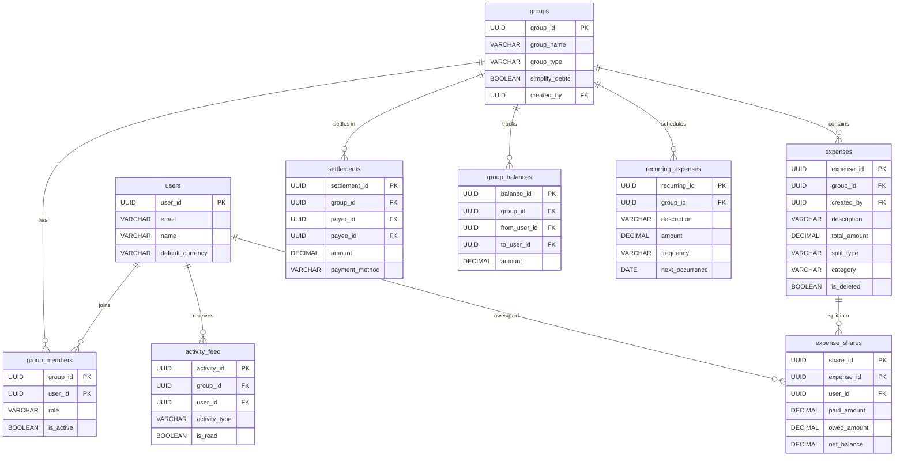
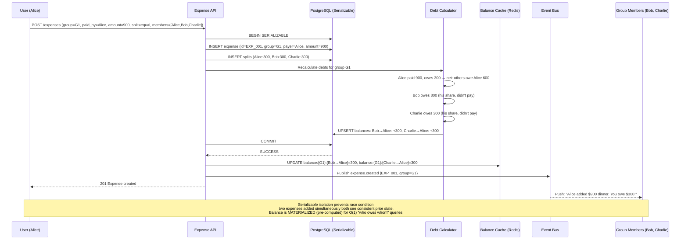
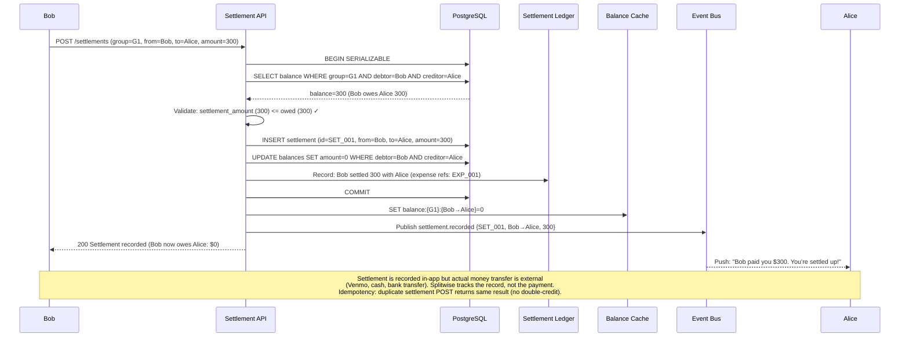
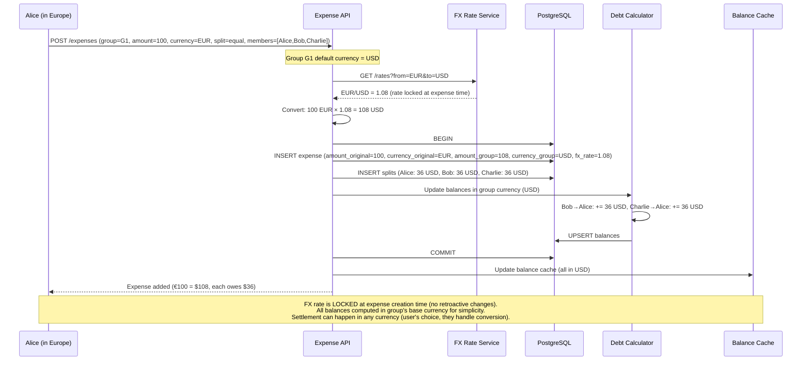

# Splitwise / Expense Sharing System

## 1. Functional Requirements

### Core Features
- **Create Groups**: Trips, households, projects with member management
- **Add Expenses**: Multiple split types (equal, unequal, percentage, shares, exact amounts)
- **Simplify Debts**: Minimize number of transactions to settle all debts
- **Settle Up**: Record payments between members, partial settlements
- **Recurring Expenses**: Auto-add monthly bills (rent, utilities)
- **Multi-Currency**: Expenses in different currencies with conversion
- **Activity Feed**: Real-time updates on group expenses/settlements
- **Reminders**: Nudge friends to settle up
- **Export**: CSV/PDF export for tax purposes

### Split Types
1. **Equal**: Divide equally among selected members
2. **Unequal**: Custom amounts per person
3. **Percentage**: Each person pays a percentage
4. **Shares**: Relative shares (e.g., 2:1:1)
5. **Adjustment**: Only record who owes whom (no expense)

## 2. Non-Functional Requirements

| Metric | Target |
|--------|--------|
| Expense addition latency | < 200ms |
| Debt simplification | < 500ms for groups up to 50 members |
| Balance query | < 100ms |
| Availability | 99.9% |
| Concurrent users | 500K |
| Data consistency | Eventually consistent (< 5 seconds) |
| Offline support | Queue expenses, sync when online |

## 3. Capacity Estimation

### Assumptions
- 50M registered users, 10M MAU
- Average 5 groups per user, 6 members per group
- Average 3 expenses per group per week = 150M groups × 3/week = ~64M expenses/week
- Average expense: $50
- Peak: Friday/Saturday nights, month-end bills

### Storage
- Users: 50M × 500B = 25GB
- Groups: 150M × 1KB = 150GB
- Expenses: 64M/week × 52 × 1KB = 3.3TB/year
- Balances: 150M groups × 15 pairs × 100B = 225GB
- Activity feed: 64M/week × 200B = 670GB/year
- Total: ~5TB/year

### Compute
- Balance recalculation: On every expense add (real-time per group)
- Debt simplification: On-demand (when viewing balances)
- Feed generation: Fan-out on write (6 members per expense)

## 4. Data Modeling

## 4. Data Modeling

### Entity-Relationship Diagram



### Full Database Schemas

```sql
-- Users
CREATE TABLE users (
    user_id UUID PRIMARY KEY DEFAULT gen_random_uuid(),
    email VARCHAR(255) UNIQUE,
    phone VARCHAR(15),
    name VARCHAR(200) NOT NULL,
    avatar_url TEXT,
    default_currency VARCHAR(3) DEFAULT 'USD',
    timezone VARCHAR(50) DEFAULT 'UTC',
    notification_prefs JSONB DEFAULT '{"push": true, "email": true, "reminders": true}',
    created_at TIMESTAMP DEFAULT NOW()
);

-- Groups
CREATE TABLE groups (
    group_id UUID PRIMARY KEY DEFAULT gen_random_uuid(),
    group_name VARCHAR(200) NOT NULL,
    group_type VARCHAR(20) DEFAULT 'OTHER', -- TRIP, HOME, COUPLE, OTHER
    cover_image_url TEXT,
    default_currency VARCHAR(3) DEFAULT 'USD',
    simplify_debts BOOLEAN DEFAULT TRUE,
    created_by UUID NOT NULL REFERENCES users(user_id),
    is_active BOOLEAN DEFAULT TRUE,
    created_at TIMESTAMP DEFAULT NOW(),
    updated_at TIMESTAMP DEFAULT NOW()
);

-- Group membership
CREATE TABLE group_members (
    group_id UUID REFERENCES groups(group_id),
    user_id UUID REFERENCES users(user_id),
    role VARCHAR(10) DEFAULT 'MEMBER', -- ADMIN, MEMBER
    joined_at TIMESTAMP DEFAULT NOW(),
    left_at TIMESTAMP,
    is_active BOOLEAN DEFAULT TRUE,
    PRIMARY KEY (group_id, user_id)
);

CREATE INDEX idx_members_user ON group_members(user_id, is_active);

-- Expenses
CREATE TABLE expenses (
    expense_id UUID PRIMARY KEY DEFAULT gen_random_uuid(),
    group_id UUID NOT NULL REFERENCES groups(group_id),
    created_by UUID NOT NULL REFERENCES users(user_id),
    description VARCHAR(500) NOT NULL,
    total_amount DECIMAL(12, 2) NOT NULL,
    currency VARCHAR(3) NOT NULL DEFAULT 'USD',
    expense_date DATE NOT NULL DEFAULT CURRENT_DATE,
    category VARCHAR(30), -- FOOD, TRANSPORT, HOUSING, UTILITIES, ENTERTAINMENT, OTHER
    split_type VARCHAR(20) NOT NULL, -- EQUAL, UNEQUAL, PERCENTAGE, SHARES
    receipt_url TEXT,
    notes TEXT,
    is_recurring BOOLEAN DEFAULT FALSE,
    recurring_rule JSONB, -- {frequency: 'MONTHLY', day: 1, end_date: null}
    is_deleted BOOLEAN DEFAULT FALSE,
    deleted_at TIMESTAMP,
    created_at TIMESTAMP DEFAULT NOW(),
    updated_at TIMESTAMP DEFAULT NOW()
);

CREATE INDEX idx_expenses_group ON expenses(group_id, expense_date DESC) WHERE NOT is_deleted;
CREATE INDEX idx_expenses_created_by ON expenses(created_by, created_at DESC);

-- Expense shares (who paid and who owes)
CREATE TABLE expense_shares (
    share_id UUID PRIMARY KEY DEFAULT gen_random_uuid(),
    expense_id UUID NOT NULL REFERENCES expenses(expense_id),
    user_id UUID NOT NULL REFERENCES users(user_id),
    paid_amount DECIMAL(12, 2) NOT NULL DEFAULT 0, -- How much this person paid
    owed_amount DECIMAL(12, 2) NOT NULL DEFAULT 0, -- How much this person's share is
    net_balance DECIMAL(12, 2) NOT NULL DEFAULT 0, -- paid - owed (positive = is owed money)
    share_percentage DECIMAL(5, 2), -- For percentage splits
    share_units INT, -- For shares splits
    created_at TIMESTAMP DEFAULT NOW()
);

CREATE INDEX idx_shares_expense ON expense_shares(expense_id);
CREATE INDEX idx_shares_user ON expense_shares(user_id, expense_id);

-- Settlements (payments between members)
CREATE TABLE settlements (
    settlement_id UUID PRIMARY KEY DEFAULT gen_random_uuid(),
    group_id UUID REFERENCES groups(group_id),
    payer_id UUID NOT NULL REFERENCES users(user_id), -- Person paying off debt
    payee_id UUID NOT NULL REFERENCES users(user_id), -- Person receiving payment
    amount DECIMAL(12, 2) NOT NULL,
    currency VARCHAR(3) NOT NULL DEFAULT 'USD',
    payment_method VARCHAR(20), -- CASH, BANK_TRANSFER, PAYPAL, VENMO, UPI
    notes TEXT,
    settled_at TIMESTAMP DEFAULT NOW(),
    created_at TIMESTAMP DEFAULT NOW()
);

CREATE INDEX idx_settlements_group ON settlements(group_id, settled_at DESC);
CREATE INDEX idx_settlements_users ON settlements(payer_id, payee_id);

-- Balances (materialized - updated on every expense/settlement)
CREATE TABLE group_balances (
    balance_id UUID PRIMARY KEY DEFAULT gen_random_uuid(),
    group_id UUID NOT NULL REFERENCES groups(group_id),
    from_user_id UUID NOT NULL REFERENCES users(user_id), -- Debtor
    to_user_id UUID NOT NULL REFERENCES users(user_id), -- Creditor  
    amount DECIMAL(12, 2) NOT NULL DEFAULT 0, -- Positive = from_user owes to_user
    currency VARCHAR(3) NOT NULL DEFAULT 'USD',
    last_updated_at TIMESTAMP DEFAULT NOW(),
    UNIQUE(group_id, from_user_id, to_user_id)
);

CREATE INDEX idx_balances_group ON group_balances(group_id) WHERE amount != 0;
CREATE INDEX idx_balances_user ON group_balances(from_user_id);

-- Overall balances (across all groups, per user pair)
CREATE TABLE overall_balances (
    from_user_id UUID NOT NULL REFERENCES users(user_id),
    to_user_id UUID NOT NULL REFERENCES users(user_id),
    amount DECIMAL(12, 2) NOT NULL DEFAULT 0,
    currency VARCHAR(3) NOT NULL DEFAULT 'USD',
    last_updated_at TIMESTAMP DEFAULT NOW(),
    PRIMARY KEY (from_user_id, to_user_id, currency)
);

-- Activity feed
CREATE TABLE activity_feed (
    activity_id UUID PRIMARY KEY DEFAULT gen_random_uuid(),
    group_id UUID NOT NULL,
    user_id UUID NOT NULL, -- Target user for feed
    actor_id UUID NOT NULL, -- Who performed action
    activity_type VARCHAR(30) NOT NULL, -- EXPENSE_ADDED, EXPENSE_UPDATED, SETTLEMENT, MEMBER_JOINED
    reference_type VARCHAR(20), -- EXPENSE, SETTLEMENT, GROUP
    reference_id UUID,
    message TEXT,
    is_read BOOLEAN DEFAULT FALSE,
    created_at TIMESTAMP DEFAULT NOW()
);

CREATE INDEX idx_feed_user ON activity_feed(user_id, created_at DESC);
CREATE INDEX idx_feed_unread ON activity_feed(user_id, is_read) WHERE NOT is_read;

-- Exchange rates (for multi-currency)
CREATE TABLE exchange_rates (
    from_currency VARCHAR(3) NOT NULL,
    to_currency VARCHAR(3) NOT NULL,
    rate DECIMAL(12, 8) NOT NULL,
    source VARCHAR(20) DEFAULT 'OPENEXCHANGE',
    fetched_at TIMESTAMP DEFAULT NOW(),
    PRIMARY KEY (from_currency, to_currency)
);

-- Recurring expense templates
CREATE TABLE recurring_expenses (
    recurring_id UUID PRIMARY KEY DEFAULT gen_random_uuid(),
    group_id UUID NOT NULL REFERENCES groups(group_id),
    created_by UUID NOT NULL,
    description VARCHAR(500) NOT NULL,
    amount DECIMAL(12, 2) NOT NULL,
    currency VARCHAR(3) DEFAULT 'USD',
    split_type VARCHAR(20) NOT NULL,
    split_config JSONB, -- Shares configuration
    frequency VARCHAR(20) NOT NULL, -- WEEKLY, MONTHLY, YEARLY
    day_of_month INT,
    day_of_week INT,
    next_occurrence DATE,
    end_date DATE,
    is_active BOOLEAN DEFAULT TRUE,
    last_created_at TIMESTAMP,
    created_at TIMESTAMP DEFAULT NOW()
);

CREATE INDEX idx_recurring_next ON recurring_expenses(next_occurrence, is_active) WHERE is_active = TRUE;
```

## 5. High-Level Design (HLD)

```
┌──────────────────────────────────────────────────────────────────────────────────┐
│                        EXPENSE SHARING SYSTEM                                      │
├──────────────────────────────────────────────────────────────────────────────────┤
│                                                                                    │
│  ┌──────────┐  ┌──────────┐  ┌──────────┐                                       │
│  │  Mobile  │  │   Web    │  │  Watch   │                                        │
│  │   App    │  │  Portal  │  │   App    │                                        │
│  └────┬─────┘  └────┬─────┘  └────┬─────┘                                        │
│       └──────────────┴──────────────┘                                              │
│                      │                                                             │
│         ┌────────────┼────────────┐                                               │
│         │  REST API  │  WebSocket │                                               │
│         │  Gateway   │  (Real-time)│                                              │
│         └─────┬──────┘  └────┬────┘                                               │
│               │              │                                                     │
│  ┌────────────┼──────────────┼─────────────────────────────┐                      │
│  │            │              │                              │                      │
│  │  ┌────────▼────┐  ┌──────▼──────┐  ┌───────────────┐  │                      │
│  │  │  Expense    │  │  Balance    │  │  Settlement   │  │                      │
│  │  │  Service    │  │  Service    │  │  Service      │  │                      │
│  │  └─────┬───────┘  └──────┬──────┘  └───────────────┘  │                      │
│  │        │                  │                             │                      │
│  │  ┌─────▼──────┐  ┌──────▼──────┐  ┌───────────────┐  │                      │
│  │  │  Split     │  │  Debt       │  │  Notification │  │                      │
│  │  │  Calculator│  │  Simplifier │  │  Service      │  │                      │
│  │  └────────────┘  └─────────────┘  └───────────────┘  │                      │
│  │                                                        │                      │
│  └────────────────────────────────────────────────────────┘                      │
│                              │                                                    │
│              ┌───────────────▼────────────────┐                                  │
│              │         Kafka Event Bus         │                                  │
│              │  [expense.added] [settled]       │                                  │
│              │  [balance.updated]               │                                  │
│              └───────────────┬────────────────┘                                  │
│                              │                                                    │
│  ┌─────────────┐  ┌─────────▼──┐  ┌──────────┐  ┌──────────────┐              │
│  │ PostgreSQL  │  │   Redis    │  │  S3      │  │ Elasticsearch│              │
│  │ (Expenses + │  │ (Balances  │  │(Receipts)│  │ (Search)     │              │
│  │  Balances)  │  │  + Cache)  │  │          │  │              │              │
│  └─────────────┘  └────────────┘  └──────────┘  └──────────────┘              │
└──────────────────────────────────────────────────────────────────────────────────┘
```

## 6. Low-Level Design (LLD) - APIs

### Add Expense
```http
POST /api/v1/groups/{group_id}/expenses
Authorization: Bearer <token>

{
  "description": "Dinner at Italian restaurant",
  "total_amount": 120.00,
  "currency": "USD",
  "expense_date": "2024-01-15",
  "category": "FOOD",
  "split_type": "UNEQUAL",
  "paid_by": [
    {"user_id": "user-alice", "amount": 120.00}
  ],
  "split_among": [
    {"user_id": "user-alice", "amount": 45.00},
    {"user_id": "user-bob", "amount": 40.00},
    {"user_id": "user-charlie", "amount": 35.00}
  ]
}

Response 201:
{
  "expense_id": "exp-uuid-001",
  "description": "Dinner at Italian restaurant",
  "total_amount": 120.00,
  "balances_impact": [
    {"from": "user-bob", "to": "user-alice", "amount": 40.00},
    {"from": "user-charlie", "to": "user-alice", "amount": 35.00}
  ],
  "group_balances_after": {
    "user-bob → user-alice": 40.00,
    "user-charlie → user-alice": 35.00
  }
}
```

### Get Group Balances (Simplified)
```http
GET /api/v1/groups/{group_id}/balances?simplify=true
Authorization: Bearer <token>

Response 200:
{
  "group_id": "grp-uuid-001",
  "total_expenses": 2450.00,
  "balances": [
    {"from": "user-bob", "to": "user-alice", "amount": 125.50},
    {"from": "user-charlie", "to": "user-alice", "amount": 45.00},
    {"from": "user-charlie", "to": "user-dave", "amount": 30.25}
  ],
  "simplified_from": 5,
  "simplified_to": 3,
  "savings": "2 fewer transactions needed"
}
```

### Settle Up
```http
POST /api/v1/settlements
Authorization: Bearer <token>

{
  "group_id": "grp-uuid-001",
  "payee_id": "user-alice",
  "amount": 125.50,
  "payment_method": "VENMO",
  "notes": "Settling dinner + groceries"
}

Response 201:
{
  "settlement_id": "set-uuid-001",
  "remaining_balance": 0.00,
  "message": "You're all settled up with Alice in this group!"
}
```

### Get Overall Balances (Across All Groups)
```http
GET /api/v1/balances/overall
Authorization: Bearer <token>

Response 200:
{
  "you_owe": [
    {"user": {"id": "user-alice", "name": "Alice"}, "amount": 125.50, "currency": "USD"},
    {"user": {"id": "user-eve", "name": "Eve"}, "amount": 45.00, "currency": "EUR"}
  ],
  "you_are_owed": [
    {"user": {"id": "user-charlie", "name": "Charlie"}, "amount": 75.25, "currency": "USD"}
  ],
  "total_you_owe": 170.50,
  "total_owed_to_you": 75.25,
  "net_balance": -95.25
}
```

## 7. Deep Dives

### Deep Dive 1: Debt Simplification Algorithm

```python
from typing import List, Dict, Tuple
from collections import defaultdict
from decimal import Decimal
import heapq

class DebtSimplifier:
    """
    Minimize number of transactions to settle all debts.
    
    Problem: Given a directed graph of debts, find minimum transactions.
    Optimal solution is NP-hard (subset sum variant).
    We use greedy net-balance approach (near-optimal for most cases).
    """
    
    def simplify_greedy(self, balances: List[Dict]) -> List[Dict]:
        """
        Greedy algorithm: Match largest creditor with largest debtor.
        Time: O(n log n), Space: O(n)
        Not always optimal but handles 95%+ cases optimally.
        """
        
        # Step 1: Calculate net balance for each person
        net_balance = defaultdict(Decimal)
        for balance in balances:
            net_balance[balance['from_user']] -= Decimal(str(balance['amount']))
            net_balance[balance['to_user']] += Decimal(str(balance['amount']))
        
        # Remove zero balances
        net_balance = {k: v for k, v in net_balance.items() if abs(v) > Decimal('0.01')}
        
        # Step 2: Separate into creditors (positive) and debtors (negative)
        # Use max-heaps for both
        creditors = []  # (amount, user_id) - max heap
        debtors = []    # (amount, user_id) - max heap (store absolute values)
        
        for user, balance in net_balance.items():
            if balance > 0:
                heapq.heappush(creditors, (-float(balance), user))  # Negate for max-heap
            elif balance < 0:
                heapq.heappush(debtors, (-float(abs(balance)), user))
        
        # Step 3: Greedily match largest creditor with largest debtor
        simplified_transactions = []
        
        while creditors and debtors:
            credit_amount, creditor = heapq.heappop(creditors)
            debit_amount, debtor = heapq.heappop(debtors)
            
            credit_amount = -credit_amount  # Restore positive
            debit_amount = -debit_amount
            
            settle_amount = min(credit_amount, debit_amount)
            
            simplified_transactions.append({
                'from': debtor,
                'to': creditor,
                'amount': round(settle_amount, 2)
            })
            
            # Push back remainder
            remainder_credit = credit_amount - settle_amount
            remainder_debit = debit_amount - settle_amount
            
            if remainder_credit > 0.01:
                heapq.heappush(creditors, (-remainder_credit, creditor))
            if remainder_debit > 0.01:
                heapq.heappush(debtors, (-remainder_debit, debtor))
        
        return simplified_transactions
    
    def simplify_optimal(self, balances: List[Dict], max_members: int = 10) -> List[Dict]:
        """
        Optimal solution using subset matching (only for small groups).
        Finds subsets that sum to zero → each subset can be settled internally.
        More subsets = fewer transactions needed.
        
        For groups > 10 members, falls back to greedy.
        """
        
        # Calculate net balances
        net_balance = defaultdict(Decimal)
        for balance in balances:
            net_balance[balance['from_user']] -= Decimal(str(balance['amount']))
            net_balance[balance['to_user']] += Decimal(str(balance['amount']))
        
        # Filter non-zero
        participants = [(user, float(balance)) for user, balance in net_balance.items() 
                       if abs(balance) > 0.01]
        
        if len(participants) > max_members:
            return self.simplify_greedy(balances)
        
        # Find maximum number of zero-sum subsets
        n = len(participants)
        amounts = [p[1] for p in participants]
        
        # DP with bitmask: find subsets that sum to zero
        # dp[mask] = True if subset represented by mask sums to zero
        zero_subsets = []
        for mask in range(1, 1 << n):
            subset_sum = sum(amounts[i] for i in range(n) if mask & (1 << i))
            if abs(subset_sum) < 0.01:
                zero_subsets.append(mask)
        
        # Find maximum partition into zero-sum subsets
        # Each subset of k members needs (k-1) transactions
        # More subsets = fewer total transactions
        
        # Greedy: find non-overlapping zero-sum subsets
        used = 0
        selected_subsets = []
        # Sort by size (smaller subsets first = more partitions)
        zero_subsets.sort(key=lambda m: bin(m).count('1'))
        
        for subset in zero_subsets:
            if subset & used == 0:  # No overlap
                selected_subsets.append(subset)
                used |= subset
        
        # Generate transactions within each subset
        transactions = []
        for subset_mask in selected_subsets:
            subset_members = [(participants[i][0], participants[i][1]) 
                            for i in range(n) if subset_mask & (1 << i)]
            # Within subset, use greedy to generate transactions
            sub_balances = []
            for user, amount in subset_members:
                if amount < 0:
                    # Find a creditor in same subset
                    pass
            # Simplified: just use greedy within subset
            sub_credits = [(user, amt) for user, amt in subset_members if amt > 0]
            sub_debits = [(user, -amt) for user, amt in subset_members if amt < 0]
            
            # Match within subset
            ci, di = 0, 0
            while ci < len(sub_credits) and di < len(sub_debits):
                creditor, c_amt = sub_credits[ci]
                debtor, d_amt = sub_debits[di]
                settle = min(c_amt, d_amt)
                
                transactions.append({'from': debtor, 'to': creditor, 'amount': round(settle, 2)})
                
                sub_credits[ci] = (creditor, c_amt - settle)
                sub_debits[di] = (debtor, d_amt - settle)
                
                if sub_credits[ci][1] < 0.01: ci += 1
                if sub_debits[di][1] < 0.01: di += 1
        
        # Handle any remaining (not in zero-sum subsets)
        remaining = [(participants[i][0], participants[i][1]) 
                    for i in range(n) if not (used & (1 << i))]
        if remaining:
            remaining_balances = [{'from_user': u, 'to_user': u, 'amount': abs(a)} 
                                 for u, a in remaining]
            # Fall back to greedy for remainder
            # ... (simplified for brevity)
        
        return transactions
    
    def validate_simplification(self, original: List[Dict], simplified: List[Dict]) -> bool:
        """Verify that simplified transactions produce same net balances."""
        
        def compute_net(transactions):
            net = defaultdict(float)
            for t in transactions:
                net[t['from']] -= t['amount']
                net[t['to']] += t['amount']
            return {k: round(v, 2) for k, v in net.items() if abs(v) > 0.01}
        
        original_net = compute_net(original)
        simplified_net = compute_net(simplified)
        
        return original_net == simplified_net
```

### Deep Dive 2: Multi-Currency Handling

```python
class MultiCurrencyExpenseHandler:
    """Handle expenses in different currencies within same group."""
    
    async def add_multi_currency_expense(self, expense: dict, group: dict) -> dict:
        """
        Expense in foreign currency → convert to group's settlement currency.
        Track original amount for display, settlement in group currency.
        """
        
        expense_currency = expense['currency']
        group_currency = group['default_currency']
        
        if expense_currency == group_currency:
            return await self._add_expense_simple(expense)
        
        # Get exchange rate at time of expense
        rate = await self._get_rate(expense_currency, group_currency, expense['expense_date'])
        
        # Convert total amount
        converted_amount = expense['total_amount'] * rate
        
        # Store both original and converted
        expense_record = {
            **expense,
            'original_amount': expense['total_amount'],
            'original_currency': expense_currency,
            'total_amount': converted_amount,
            'currency': group_currency,
            'fx_rate': rate,
            'fx_rate_date': expense['expense_date']
        }
        
        # Calculate shares in group currency
        for share in expense['split_among']:
            if 'amount' in share:
                share['amount'] = share['amount'] * rate
        for paid in expense['paid_by']:
            paid['amount'] = paid['amount'] * rate
        
        return await self._add_expense_simple(expense_record)
    
    async def calculate_settlement_with_fx(self, from_user: str, to_user: str, 
                                           balances_by_currency: dict) -> dict:
        """
        When users have balances in multiple currencies,
        calculate settlement in preferred currency.
        """
        
        # Get user's preferred settlement currency
        user_pref = await self.db.fetch_one(
            "SELECT default_currency FROM users WHERE user_id = $1", from_user)
        settle_currency = user_pref.default_currency
        
        total_in_settle_currency = Decimal('0')
        breakdown = []
        
        for currency, amount in balances_by_currency.items():
            if currency == settle_currency:
                total_in_settle_currency += amount
                breakdown.append({'currency': currency, 'amount': amount, 'rate': 1.0})
            else:
                rate = await self._get_rate(currency, settle_currency)
                converted = amount * rate
                total_in_settle_currency += converted
                breakdown.append({'currency': currency, 'amount': amount, 
                                 'converted': converted, 'rate': rate})
        
        return {
            'settle_amount': total_in_settle_currency,
            'settle_currency': settle_currency,
            'breakdown': breakdown,
            'rate_valid_until': datetime.now() + timedelta(minutes=15)
        }
```

### Deep Dive 3: Consistency (Concurrent Expense Additions)

```python
class BalanceConsistencyManager:
    """Handle concurrent expense additions without balance corruption."""
    
    async def add_expense_with_balance_update(self, expense: dict) -> dict:
        """
        Atomic expense creation + balance update.
        Uses optimistic locking on group balances.
        """
        
        group_id = expense['group_id']
        
        # Calculate net impact of this expense
        impacts = self._calculate_impacts(expense)
        # impacts = [{'from': 'bob', 'to': 'alice', 'delta': 40.00}, ...]
        
        max_retries = 3
        for attempt in range(max_retries):
            try:
                async with self.db.transaction(isolation='SERIALIZABLE') as txn:
                    # Insert expense
                    expense_id = await txn.fetch_val("""
                        INSERT INTO expenses (group_id, created_by, description, total_amount, 
                            currency, expense_date, category, split_type)
                        VALUES ($1, $2, $3, $4, $5, $6, $7, $8)
                        RETURNING expense_id
                    """, group_id, expense['created_by'], expense['description'],
                        expense['total_amount'], expense['currency'], expense['expense_date'],
                        expense.get('category'), expense['split_type'])
                    
                    # Insert shares
                    for share in expense['shares']:
                        await txn.execute("""
                            INSERT INTO expense_shares (expense_id, user_id, paid_amount, owed_amount, net_balance)
                            VALUES ($1, $2, $3, $4, $5)
                        """, expense_id, share['user_id'], share['paid'], share['owed'],
                            share['paid'] - share['owed'])
                    
                    # Update group balances (UPSERT)
                    for impact in impacts:
                        await txn.execute("""
                            INSERT INTO group_balances (group_id, from_user_id, to_user_id, amount, currency)
                            VALUES ($1, $2, $3, $4, $5)
                            ON CONFLICT (group_id, from_user_id, to_user_id)
                            DO UPDATE SET amount = group_balances.amount + $4,
                                         last_updated_at = NOW()
                        """, group_id, impact['from'], impact['to'], impact['delta'], expense['currency'])
                    
                    # Update overall balances
                    for impact in impacts:
                        await txn.execute("""
                            INSERT INTO overall_balances (from_user_id, to_user_id, amount, currency)
                            VALUES ($1, $2, $3, $4)
                            ON CONFLICT (from_user_id, to_user_id, currency)
                            DO UPDATE SET amount = overall_balances.amount + $3,
                                         last_updated_at = NOW()
                        """, impact['from'], impact['to'], impact['delta'], expense['currency'])
                    
                    return {'expense_id': expense_id, 'impacts': impacts}
                    
            except SerializationError:
                if attempt == max_retries - 1:
                    raise
                await asyncio.sleep(0.1 * (attempt + 1))  # Backoff
    
    def _calculate_impacts(self, expense: dict) -> list:
        """Calculate who owes whom from expense shares."""
        
        # Net per person: paid - owed
        net_per_person = {}
        for share in expense['shares']:
            net = share['paid'] - share['owed']
            if abs(net) > 0.01:
                net_per_person[share['user_id']] = net
        
        # Convert to directed edges (debtor → creditor)
        creditors = [(uid, amt) for uid, amt in net_per_person.items() if amt > 0]
        debtors = [(uid, -amt) for uid, amt in net_per_person.items() if amt < 0]
        
        impacts = []
        ci, di = 0, 0
        while ci < len(creditors) and di < len(debtors):
            creditor, c_amt = creditors[ci]
            debtor, d_amt = debtors[di]
            settle = min(c_amt, d_amt)
            
            impacts.append({'from': debtor, 'to': creditor, 'delta': round(settle, 2)})
            
            creditors[ci] = (creditor, c_amt - settle)
            debtors[di] = (debtor, d_amt - settle)
            
            if creditors[ci][1] < 0.01: ci += 1
            if debtors[di][1] < 0.01: di += 1
        
        return impacts
    
    async def handle_conflict_resolution(self, group_id: str):
        """
        For eventually consistent systems: periodic reconciliation.
        Recompute balances from expense history.
        """
        
        # Recompute all balances from expense_shares
        recomputed = await self.db.fetch_all("""
            SELECT 
                from_user_id, to_user_id, 
                SUM(amount) as total_owed
            FROM (
                -- From expenses: who owes whom
                SELECT 
                    es1.user_id as from_user_id,
                    es2.user_id as to_user_id,
                    LEAST(es1.owed_amount, es2.paid_amount - es2.owed_amount) as amount
                FROM expense_shares es1
                JOIN expense_shares es2 ON es1.expense_id = es2.expense_id
                JOIN expenses e ON e.expense_id = es1.expense_id
                WHERE e.group_id = $1 AND NOT e.is_deleted
                AND es1.net_balance < 0  -- Debtor
                AND es2.net_balance > 0  -- Creditor
                AND es1.user_id != es2.user_id
            ) sub
            GROUP BY from_user_id, to_user_id
            HAVING SUM(amount) > 0.01
        """, group_id)
        
        # Also subtract settlements
        # ... (subtract settled amounts)
        
        # Compare with stored balances and fix discrepancies
        # ...
```

## 8. Component Optimization

### Kafka Configuration
```yaml
expense.events:
  partitions: 16
  replication-factor: 3
  retention.ms: 604800000  # 7 days
  partition-key: group_id  # Group locality

activity.feed:
  partitions: 32
  replication-factor: 3
  retention.ms: 259200000  # 3 days

balance.updates:
  partitions: 8
  replication-factor: 3
```

### Redis Configuration
```yaml
redis:
  cluster: 6 nodes
  
  # Group balances (hot data)
  group-balances:
    key: "bal:{group_id}"
    type: hash  # field = "user1:user2", value = amount
    ttl: 3600  # Refresh from DB hourly
    write-through: true  # Update Redis + DB atomically
  
  # User's overall balance summary
  user-summary:
    key: "summary:{user_id}"
    type: hash  # {total_owe, total_owed, net}
    ttl: 300  # 5 min
  
  # Activity feed cache
  feed:
    key: "feed:{user_id}"
    type: sorted-set  # Score = timestamp
    max-size: 100  # Last 100 activities
```

## 9. Observability

### Metrics
```yaml
metrics:
  - name: expense_addition_latency_ms
    type: histogram
    labels: [split_type, group_size]
    buckets: [50, 100, 200, 500, 1000]
  
  - name: debt_simplification_latency_ms
    type: histogram
    labels: [algorithm, member_count]
    
  - name: simplification_savings
    type: histogram  # How many transactions saved
    labels: [group_size]
    
  - name: balance_reconciliation_drift
    type: gauge
    alert_threshold: 0.01
  
  - name: settlement_rate
    type: gauge  # % of debts settled within 7 days

alerts:
  - name: BalanceDrift
    expr: balance_reconciliation_drift > 0.01
    severity: critical
    
  - name: HighExpenseLatency
    expr: histogram_quantile(0.99, expense_addition_latency_ms) > 1000
    severity: warning
```

## 10. Failure Modes & Considerations

| Failure | Impact | Mitigation |
|---------|--------|------------|
| Concurrent expense + settlement | Balance race condition | Serializable transactions, optimistic locking |
| Expense deleted after settlement | Balance inconsistency | Recalculate balance on delete, warn if settled |
| FX rate stale | Wrong conversion | Rate cache 15 min max, show rate used |
| Group with many members | Slow simplification | Greedy O(n log n) for large groups |
| Offline expense added | Merge conflicts | Timestamp-based ordering, conflict UI |

### Eventual Consistency Strategy
- Balance updates are strongly consistent within a transaction
- Cross-group overall balances are eventually consistent (< 5s lag)
- Activity feed uses fan-out-on-write (eventual, < 2s)
- Periodic reconciliation job verifies computed vs stored balances

## 11. Trade-offs & Alternatives

| Decision | Choice | Alternative | Why |
|----------|--------|-------------|-----|
| Debt simplification | Greedy (O(n log n)) | Optimal (NP-hard) | Fast enough, near-optimal for typical groups (5-10 people) |
| Balance storage | Materialized (pre-computed) | Computed on read | Read-heavy workload (view balance >> add expense) |
| Consistency | Serializable transactions | Eventual + reconciliation | Small groups, low contention makes serializable viable |
| Multi-currency | Convert at expense time | Settle in original currencies | Simpler user experience, single balance per pair |
| Feed | Fan-out on write | Fan-out on read | Small groups (6 members), write amplification acceptable |
| Offline | Queue + sync | CRDT | Conflicts rare, queue simpler to implement |

---

## 12. Sequence Diagrams

### Diagram 1: Add Expense + Debt Recalculation



### Diagram 2: Group Settlement



### Diagram 3: Multi-Currency Expense Conversion



### Caching Strategy

```
SPLITWISE CACHING

1. GROUP BALANCE CACHE (Write-through)
   Key: balance:{group_id}:{debtor}:{creditor}
   Updated: On every expense/settlement (in same transaction)
   Used for: "Balances" screen (most viewed page)
   Pattern: Materialized balance + cache = O(1) read
   CRITICAL: Stale balance → user thinks they owe different amount

2. SIMPLIFIED DEBTS CACHE
   Key: simplified:{group_id}:version
   TTL: Invalidated on any expense/settlement in group
   Content: Minimum transactions needed to settle all debts
   Computed: On-demand (triggered by viewing "settle up" screen)
   Expensive: O(N²) computation, cache is essential

3. GROUP ACTIVITY FEED CACHE
   Key: feed:{group_id}:page:{n}
   TTL: Invalidated on new activity
   Pattern: Fan-out on write (small groups, 6 members avg)

4. USER TOTAL BALANCE CACHE
   Key: user:{id}:total_owed (across all groups)
   Updated: On any expense in any group user belongs to
   Used for: Home screen "You owe $X overall"

WHERE EVENTUAL CONSISTENCY IS ACCEPTABLE:
- Activity feed (1-2s delay is fine)
- Monthly spending analytics
- Friend suggestions
WHERE IT'S DANGEROUS:
- Balance display (users compare and argue!)
- Settlement amount validation (must be current)
```

### Infrastructure Components

```
┌─────────────────────────────────────────────────────────────┐
│ SPLITWISE-LIKE INFRASTRUCTURE                                │
├─────────────────────────────────────────────────────────────┤
│                                                              │
│ COMPUTE:                                                     │
│ ├── API servers: 8 pods (most operations are simple CRUD)    │
│ ├── Debt simplification: Async workers (CPU-intensive)       │
│ └── Push notifications: Dedicated service (fan-out)          │
│                                                              │
│ DATABASE:                                                     │
│ ├── PostgreSQL: Groups, expenses, splits, balances           │
│ ├── Sharding: By group_id (all group data co-located)        │
│ ├── Serializable isolation (low contention: avg 6 members)   │
│ └── Read replicas for activity feed / history queries        │
│                                                              │
│ CACHING:                                                     │
│ ├── Redis: Balance cache, simplified debts, rate limiting    │
│ └── Local cache: FX rates (30s TTL)                          │
│                                                              │
│ MESSAGING:                                                   │
│ ├── Kafka: expense.created, settlement.recorded events       │
│ ├── Push: FCM/APNs for real-time notifications               │
│ └── Email: Weekly summary digests                            │
│                                                              │
│ EXTERNAL:                                                    │
│ ├── FX rate provider (for multi-currency groups)             │
│ ├── OCR service (receipt scanning for expense entry)         │
│ └── Payment links (settle via UPI/Venmo - optional)          │
│                                                              │
└─────────────────────────────────────────────────────────────┘
```

## 13. Algorithm Deep Dive: Debt Simplification

### Minimum Transactions to Settle All Debts

```
PROBLEM: Given N people with various debts between them, find the minimum
number of transactions to settle everyone to zero.

This is NP-hard in general, but practical for small groups (Splitwise groups avg 6 people).

STEP-BY-STEP EXAMPLE WITH 5 PEOPLE:

Initial debt graph (who owes whom):
  Alice → Bob: $40
  Alice → Charlie: $20
  Bob → Dave: $30
  Charlie → Dave: $10
  Charlie → Eve: $20
  Dave → Eve: $10

Without simplification: 6 transactions needed.

ALGORITHM: Net Balance Approach

Step 1: Compute net balance for each person
  Alice:   -40 - 20          = -60  (net debtor)
  Bob:     +40 - 30          = +10  (net creditor)
  Charlie: +20 - 10 - 20     = -10  (net debtor)
  Dave:    +30 + 10 - 10     = +30  (net creditor)
  Eve:     +20 + 10          = +30  (net creditor — wait, let me recalculate)
  
  Actually: Eve receives 20 + 10 = +30 (net creditor? No...)
  Let me redo:
  Alice:   owes 40+20 = -60
  Bob:     receives 40, owes 30 = +10  
  Charlie: receives 20, owes 10+20 = -10
  Dave:    receives 30+10, owes 10 = +30
  Eve:     receives 20+10 = +30
  
  Verify: sum = -60 + 10 + (-10) + 30 + 30 = 0 ✓

Step 2: Separate into debtors and creditors
  Debtors:  Alice(-60), Charlie(-10)
  Creditors: Bob(+10), Dave(+30), Eve(+30)

Step 3: Greedy matching (match largest debtor with largest creditor)
  
  Transaction 1: Alice pays Eve $30
    Alice: -60 + 30 = -30
    Eve: +30 - 30 = 0 (settled!)
  
  Transaction 2: Alice pays Dave $30
    Alice: -30 + 30 = 0 (settled!)
    Dave: +30 - 30 = 0 (settled!)
  
  Transaction 3: Charlie pays Bob $10
    Charlie: -10 + 10 = 0 (settled!)
    Bob: +10 - 10 = 0 (settled!)

RESULT: 3 transactions instead of 6! (50% reduction)

IMPLEMENTATION:
```

```python
def simplify_debts(debts: list[tuple[str, str, float]]) -> list[tuple[str, str, float]]:
    """
    Input: list of (debtor, creditor, amount) tuples
    Output: minimum transactions to settle all debts
    
    Algorithm: Compute net balances, then greedily match debtors to creditors.
    Greedy is optimal when we can match amounts exactly or partially.
    For true minimum (NP-hard), use subset-sum optimization for small N.
    """
    from collections import defaultdict
    import heapq
    
    # Step 1: Compute net balance for each person
    balance = defaultdict(float)
    for debtor, creditor, amount in debts:
        balance[debtor] -= amount
        balance[creditor] += amount
    
    # Step 2: Separate into debtors (negative) and creditors (positive)
    # Use heaps for efficient max extraction
    debtors = []   # max-heap (by absolute value)
    creditors = [] # max-heap (by value)
    
    for person, bal in balance.items():
        if bal < -0.01:  # Debtor (owes money)
            heapq.heappush(debtors, (bal, person))  # min-heap of negatives = max by magnitude
        elif bal > 0.01:  # Creditor (owed money)
            heapq.heappush(creditors, (-bal, person))  # negate for max-heap
    
    # Step 3: Greedily match largest debtor with largest creditor
    transactions = []
    
    while debtors and creditors:
        debt_amount, debtor = heapq.heappop(debtors)      # most negative
        credit_amount, creditor = heapq.heappop(creditors)  # most positive (negated)
        
        debt_abs = -debt_amount
        credit_abs = -credit_amount
        
        settle_amount = min(debt_abs, credit_abs)
        transactions.append((debtor, creditor, round(settle_amount, 2)))
        
        # Update remainders
        remaining_debt = debt_abs - settle_amount
        remaining_credit = credit_abs - settle_amount
        
        if remaining_debt > 0.01:
            heapq.heappush(debtors, (-remaining_debt, debtor))
        if remaining_credit > 0.01:
            heapq.heappush(creditors, (-remaining_credit, creditor))
    
    return transactions


# Example usage:
debts = [
    ("Alice", "Bob", 40),
    ("Alice", "Charlie", 20),
    ("Bob", "Dave", 30),
    ("Charlie", "Dave", 10),
    ("Charlie", "Eve", 20),
    ("Dave", "Eve", 10),
]

result = simplify_debts(debts)
# Output: [("Alice", "Eve", 30), ("Alice", "Dave", 30), ("Charlie", "Bob", 10)]
# 3 transactions instead of 6!
```

```
COMPLEXITY:
- Time: O(N log N) where N = number of people (heap operations)
- Space: O(N) for balance map and heaps
- For Splitwise groups (avg 6 people): essentially O(1)

OPTIMALITY NOTE:
- Greedy gives optimal results for most practical cases
- True minimum is NP-hard (reducible to subset-sum)
- For N ≤ 20 (typical Splitwise group), brute-force optimal is feasible
- Splitwise uses greedy (good enough, much simpler)

EDGE CASES:
- Circular debts: A→B→C→A automatically resolved by net balance
- Self-debt: Filtered out (net balance handles it)
- Zero balances: Skip (person is already settled)
- Floating point: Round to 2 decimal places, verify sum still = 0
```
