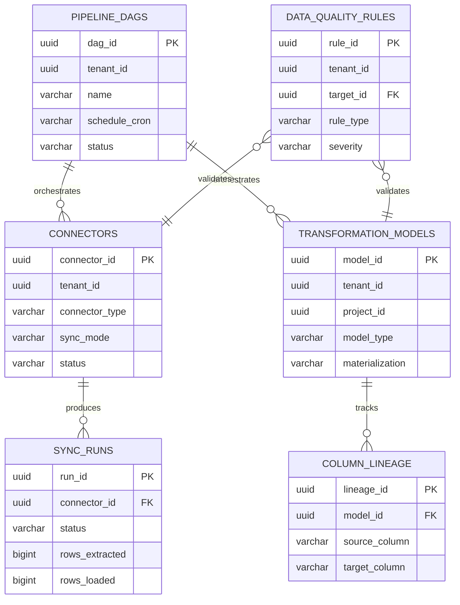
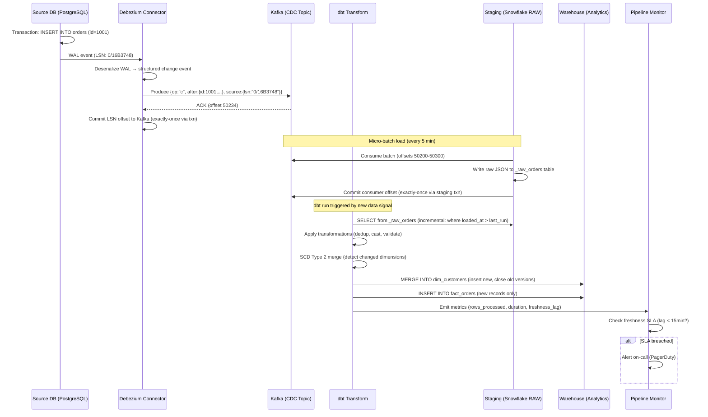
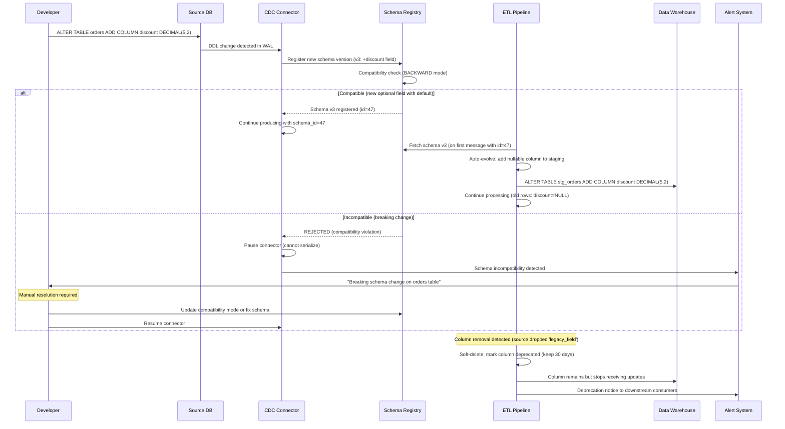

# Design: ETL/ELT Pipeline Platform (Fivetran/dbt)

## 1. Functional Requirements

- **Connector Management**: 100+ pre-built source connectors (databases, SaaS APIs, files)
- **CDC-Based Incremental Sync**: Log-based change data capture for minimal latency
- **Schema Mapping/Transformation**: Auto-map source schemas, apply transformations
- **Data Quality Checks**: Assertions, anomaly detection, circuit breakers at each stage
- **Pipeline Orchestration**: DAG-based scheduling with dependencies, retries, SLAs
- **Lineage Tracking**: Column-level lineage from source to consumption
- **Cost Management**: Track compute/storage costs per pipeline, optimize resource usage
- **Self-Service Configuration**: UI-driven connector setup, no-code transformations
- **Schema Evolution Handling**: Auto-detect and propagate source schema changes
- **Incremental Models**: State-tracked incremental processing with merge semantics

## 2. Non-Functional Requirements

| Requirement | Target |
|---|---|
| Sync Latency (CDC) | < 5 minutes source-to-warehouse |
| Sync Latency (API) | < 15 minutes |
| Connector Reliability | 99.5% successful syncs |
| Transformation SLA | < 30 min for full DAG execution |
| Data Freshness | Configurable per pipeline (1min - 24hr) |
| Throughput | 100K records/sec per connector |
| Concurrent Pipelines | 10,000+ active pipelines |
| Schema Change Detection | < 1 sync cycle |
| Cost Efficiency | < $0.01 per million rows synced |
| Recovery Time | < 5 min auto-recovery from transient failures |

## 3. Capacity Estimation

```
Active Connectors: 50,000 configured connections
Active Pipelines: 10,000 DAGs
Daily Sync Volume: 50 billion rows/day
Daily Transformation Runs: 100,000 model executions/day
Average Sync Frequency: Every 15 minutes
Peak Concurrent Syncs: 5,000
CDC Events/Second: 500,000 across all sources
API Calls/Day: 100M (to source SaaS APIs)
Storage (staging): 100 TB (transient, 7-day retention)
Metadata Store: 500 GB (lineage, run history, configs)

Compute Resources:
- Extraction workers: 500 containers (auto-scaling)
- Transformation engine: 200 Spark/SQL executors
- Orchestrator: 10 nodes (HA)
- CDC processors: 100 Debezium connectors
```

## 4. Data Modeling

### Entity-Relationship Diagram



### Connector Configuration Schema
```sql
CREATE TABLE connectors (
    connector_id        UUID PRIMARY KEY,
    tenant_id           UUID NOT NULL,
    connector_type      VARCHAR(100) NOT NULL,  -- 'postgres_cdc','salesforce_api','s3_files'
    name                VARCHAR(255) NOT NULL,
    status              VARCHAR(50) DEFAULT 'active', -- 'active','paused','error','setup'
    -- Source Configuration (encrypted)
    source_config       JSONB NOT NULL,
    /*
    source_config examples:
    PostgreSQL: {"host":"db.example.com","port":5432,"database":"prod",
                 "replication_slot":"fivetran_slot","publication":"fivetran_pub"}
    Salesforce: {"instance_url":"https://na1.salesforce.com",
                 "client_id":"...","refresh_token_encrypted":"..."}
    */
    -- Destination Configuration
    destination_schema  VARCHAR(255) NOT NULL,
    destination_prefix  VARCHAR(255),
    -- Sync Settings
    sync_frequency      INTERVAL NOT NULL DEFAULT '15 minutes',
    sync_mode           VARCHAR(50) NOT NULL,  -- 'cdc','incremental','full_refresh'
    cursor_field        VARCHAR(255),  -- for incremental: e.g., 'updated_at'
    -- Schema
    schema_config       JSONB,  -- column selections, type overrides
    schema_change_handling VARCHAR(50) DEFAULT 'allow_all',
    -- Timestamps
    created_at          TIMESTAMP DEFAULT NOW(),
    updated_at          TIMESTAMP DEFAULT NOW(),
    last_sync_at        TIMESTAMP,
    last_sync_status    VARCHAR(50),
    UNIQUE(tenant_id, name)
);

CREATE INDEX idx_connectors_tenant ON connectors(tenant_id, status);
CREATE INDEX idx_connectors_type ON connectors(connector_type);
CREATE INDEX idx_connectors_next_sync ON connectors(status, last_sync_at) 
    WHERE status = 'active';
```

### Sync Run History Schema
```sql
CREATE TABLE sync_runs (
    run_id              UUID PRIMARY KEY,
    connector_id        UUID NOT NULL REFERENCES connectors(connector_id),
    run_type            VARCHAR(50) NOT NULL,  -- 'scheduled','manual','backfill'
    status              VARCHAR(50) NOT NULL,  -- 'running','success','failed','cancelled'
    -- Timing
    started_at          TIMESTAMP NOT NULL,
    completed_at        TIMESTAMP,
    duration_seconds    INT,
    -- Metrics
    rows_extracted      BIGINT DEFAULT 0,
    rows_loaded         BIGINT DEFAULT 0,
    rows_rejected       BIGINT DEFAULT 0,
    bytes_transferred   BIGINT DEFAULT 0,
    -- CDC Position
    cdc_position        JSONB,  -- {"lsn": "0/16B3748", "txid": 12345}
    -- Error Info
    error_code          VARCHAR(100),
    error_message       TEXT,
    error_stack         TEXT,
    retry_count         INT DEFAULT 0,
    -- Schema Changes Detected
    schema_changes      JSONB,
    /*
    [{"type":"column_added","table":"users","column":"phone","data_type":"varchar"},
     {"type":"column_type_changed","table":"orders","column":"amount","from":"int","to":"decimal"}]
    */
    -- Cost
    compute_cost_cents  INT DEFAULT 0,
    PRIMARY KEY (run_id)
);

CREATE INDEX idx_sync_runs_connector ON sync_runs(connector_id, started_at DESC);
CREATE INDEX idx_sync_runs_status ON sync_runs(status) WHERE status = 'running';
CREATE INDEX idx_sync_runs_time ON sync_runs(started_at DESC);
```

### Transformation Model Schema
```sql
CREATE TABLE transformation_models (
    model_id            UUID PRIMARY KEY,
    tenant_id           UUID NOT NULL,
    project_id          UUID NOT NULL,
    name                VARCHAR(255) NOT NULL,
    -- Model Definition
    model_type          VARCHAR(50) NOT NULL,  -- 'table','view','incremental','ephemeral'
    materialization     VARCHAR(50) NOT NULL,
    sql_content         TEXT NOT NULL,
    -- Incremental Config
    incremental_strategy VARCHAR(50),  -- 'merge','append','delete+insert'
    unique_key          TEXT[],
    updated_at_field    VARCHAR(255),
    -- Dependencies
    depends_on          UUID[],  -- other model_ids
    source_tables       TEXT[],  -- raw source tables referenced
    -- Schema
    output_columns      JSONB,
    /*
    [{"name":"user_id","type":"BIGINT","description":"Primary key"},
     {"name":"total_orders","type":"INT","description":"Lifetime order count"}]
    */
    -- Testing
    tests               JSONB,
    /*
    [{"type":"not_null","column":"user_id"},
     {"type":"unique","column":"user_id"},
     {"type":"accepted_values","column":"status","values":["active","inactive"]},
     {"type":"relationships","column":"user_id","to":"ref('users')","field":"id"}]
    */
    -- Tags and metadata
    tags                TEXT[],
    description         TEXT,
    owner               VARCHAR(255),
    -- Execution
    last_run_at         TIMESTAMP,
    last_run_status     VARCHAR(50),
    avg_duration_seconds INT,
    created_at          TIMESTAMP DEFAULT NOW(),
    updated_at          TIMESTAMP DEFAULT NOW(),
    UNIQUE(tenant_id, project_id, name)
);

CREATE INDEX idx_models_project ON transformation_models(tenant_id, project_id);
CREATE INDEX idx_models_deps ON transformation_models USING GIN(depends_on);
CREATE INDEX idx_models_tags ON transformation_models USING GIN(tags);
```

### Data Quality Rules Schema
```sql
CREATE TABLE data_quality_rules (
    rule_id             UUID PRIMARY KEY,
    tenant_id           UUID NOT NULL,
    target_type         VARCHAR(50) NOT NULL,  -- 'connector','model','table'
    target_id           UUID NOT NULL,
    -- Rule Definition
    rule_type           VARCHAR(50) NOT NULL,
    -- 'row_count_anomaly','null_rate','freshness','custom_sql','schema_drift'
    rule_config         JSONB NOT NULL,
    /*
    row_count_anomaly: {"min_rows":1000,"max_deviation_pct":50,"lookback_runs":10}
    null_rate: {"column":"email","max_null_pct":5.0}
    freshness: {"column":"updated_at","max_age_hours":24}
    custom_sql: {"sql":"SELECT COUNT(*) FROM {table} WHERE amount < 0","threshold":0}
    */
    severity            VARCHAR(20) NOT NULL,  -- 'warn','error','critical'
    action_on_failure   VARCHAR(50) DEFAULT 'alert',  -- 'alert','block','circuit_break'
    -- Status
    enabled             BOOLEAN DEFAULT TRUE,
    last_check_at       TIMESTAMP,
    last_check_result   VARCHAR(20),  -- 'pass','fail'
    consecutive_failures INT DEFAULT 0,
    created_at          TIMESTAMP DEFAULT NOW()
);

CREATE INDEX idx_dq_target ON data_quality_rules(target_type, target_id);
CREATE INDEX idx_dq_tenant ON data_quality_rules(tenant_id, enabled);
```

### Pipeline DAG Schema
```sql
CREATE TABLE pipeline_dags (
    dag_id              UUID PRIMARY KEY,
    tenant_id           UUID NOT NULL,
    name                VARCHAR(255) NOT NULL,
    description         TEXT,
    -- Schedule
    schedule_cron       VARCHAR(100),
    schedule_interval   INTERVAL,
    timezone            VARCHAR(50) DEFAULT 'UTC',
    -- Configuration
    max_concurrent_tasks INT DEFAULT 16,
    retry_policy        JSONB DEFAULT '{"max_retries":3,"backoff_seconds":60}',
    timeout_seconds     INT DEFAULT 7200,
    sla_seconds         INT,
    -- DAG Definition
    tasks               JSONB NOT NULL,
    /*
    [
      {"id":"extract_users","type":"sync","connector_id":"...","depends_on":[]},
      {"id":"extract_orders","type":"sync","connector_id":"...","depends_on":[]},
      {"id":"transform_user_orders","type":"model","model_id":"...","depends_on":["extract_users","extract_orders"]},
      {"id":"quality_check","type":"dq","rules":["..."],"depends_on":["transform_user_orders"]},
      {"id":"publish","type":"notify","channel":"slack","depends_on":["quality_check"]}
    ]
    */
    -- Status
    status              VARCHAR(50) DEFAULT 'active',
    last_run_at         TIMESTAMP,
    next_run_at         TIMESTAMP,
    created_at          TIMESTAMP DEFAULT NOW(),
    updated_at          TIMESTAMP DEFAULT NOW()
);

CREATE INDEX idx_dags_tenant ON pipeline_dags(tenant_id, status);
CREATE INDEX idx_dags_schedule ON pipeline_dags(next_run_at) WHERE status = 'active';
```

### Column Lineage Schema
```sql
CREATE TABLE column_lineage (
    lineage_id          UUID PRIMARY KEY,
    tenant_id           UUID NOT NULL,
    -- Source
    source_table        VARCHAR(500) NOT NULL,
    source_column       VARCHAR(255) NOT NULL,
    -- Target
    target_table        VARCHAR(500) NOT NULL,
    target_column       VARCHAR(255) NOT NULL,
    -- Transformation
    transformation_expr TEXT,  -- SQL expression applied
    model_id            UUID REFERENCES transformation_models(model_id),
    -- Metadata
    confidence          FLOAT DEFAULT 1.0,  -- 1.0=deterministic, <1.0=inferred
    is_direct           BOOLEAN DEFAULT TRUE,
    created_at          TIMESTAMP DEFAULT NOW(),
    updated_at          TIMESTAMP DEFAULT NOW()
);

CREATE INDEX idx_lineage_source ON column_lineage(source_table, source_column);
CREATE INDEX idx_lineage_target ON column_lineage(target_table, target_column);
CREATE INDEX idx_lineage_model ON column_lineage(model_id);
```

## 5. High-Level Design (HLD)

```
┌─────────────────────────────────────────────────────────────────────────────────┐
│                        ETL/ELT PIPELINE PLATFORM                                 │
├─────────────────────────────────────────────────────────────────────────────────┤
│                                                                                   │
│  DATA SOURCES                                                                    │
│  ┌────────┐  ┌────────┐  ┌────────┐  ┌────────┐  ┌────────┐                   │
│  │Postgres│  │MySQL   │  │Salesforce│ │Stripe  │  │S3 Files│                   │
│  │(CDC)   │  │(CDC)   │  │(API)    │  │(API)   │  │(Batch) │                   │
│  └───┬────┘  └───┬────┘  └───┬────┘  └───┬────┘  └───┬────┘                   │
│      │           │           │           │           │                           │
│      ▼           ▼           ▼           ▼           ▼                           │
│  ┌─────────────────────────────────────────────────────────────────────┐        │
│  │                    EXTRACTION LAYER                                   │        │
│  │  ┌──────────────┐  ┌──────────────┐  ┌──────────────┐              │        │
│  │  │  Debezium    │  │  API Poller  │  │  File        │              │        │
│  │  │  CDC Engine  │  │  (Watermark) │  │  Watcher     │              │        │
│  │  └──────┬───────┘  └──────┬───────┘  └──────┬───────┘              │        │
│  └─────────┼─────────────────┼─────────────────┼──────────────────────┘        │
│            │                  │                  │                                │
│            ▼                  ▼                  ▼                                │
│  ┌─────────────────────────────────────────────────────────────────────┐        │
│  │                    KAFKA (Staging Buffer)                             │        │
│  │   CDC streams │ API responses │ File events │ Schema changes         │        │
│  └────────────────────────────────┬────────────────────────────────────┘        │
│                                   │                                              │
│                                   ▼                                              │
│  ┌─────────────────────────────────────────────────────────────────────┐        │
│  │                    LOADING LAYER                                      │        │
│  │   Micro-batch writer │ Schema evolution │ Type mapping │ Staging     │        │
│  └────────────────────────────────┬────────────────────────────────────┘        │
│                                   │                                              │
│                                   ▼                                              │
│  ┌─────────────────────────────────────────────────────────────────────┐        │
│  │                    DATA WAREHOUSE (Raw/Staging)                       │        │
│  │   Snowflake │ BigQuery │ Redshift │ Databricks                       │        │
│  └────────────────────────────────┬────────────────────────────────────┘        │
│                                   │                                              │
│                                   ▼                                              │
│  ┌─────────────────────────────────────────────────────────────────────┐        │
│  │                 TRANSFORMATION LAYER (dbt/SQL Engine)                 │        │
│  │  ┌───────────┐  ┌───────────┐  ┌───────────┐  ┌───────────┐       │        │
│  │  │  DAG      │  │  SQL       │  │  Testing  │  │  Lineage  │       │        │
│  │  │  Resolver │  │  Compiler  │  │  Framework│  │  Parser   │       │        │
│  │  └───────────┘  └───────────┘  └───────────┘  └───────────┘       │        │
│  └────────────────────────────────┬────────────────────────────────────┘        │
│                                   │                                              │
│                                   ▼                                              │
│  ┌─────────────────────────────────────────────────────────────────────┐        │
│  │                    DATA WAREHOUSE (Transformed)                       │        │
│  │   Marts │ Aggregates │ Feature tables │ Reporting views              │        │
│  └─────────────────────────────────────────────────────────────────────┘        │
│                                                                                   │
│  ┌──────────────────────────┐  ┌──────────────────────────────────────┐         │
│  │  ORCHESTRATOR            │  │  OBSERVABILITY                        │         │
│  │  DAG scheduling          │  │  Data quality │ Freshness │ Costs    │         │
│  │  Dependency tracking     │  │  Anomaly detection │ Alerting        │         │
│  │  Retry/recovery          │  │  Lineage graph │ Impact analysis     │         │
│  └──────────────────────────┘  └──────────────────────────────────────┘         │
│                                                                                   │
└─────────────────────────────────────────────────────────────────────────────────┘
```

## 6. Low-Level Design (LLD) - APIs

### Connector CRUD API
```python
# POST /api/v1/connectors
{
    "name": "Production PostgreSQL",
    "connector_type": "postgres_cdc",
    "source_config": {
        "host": "prod-db.internal.example.com",
        "port": 5432,
        "database": "production",
        "username": "fivetran_replication",
        "password_secret_ref": "vault://secrets/prod-pg-password",
        "schemas": ["public", "billing"],
        "tables": ["users", "orders", "payments"],
        "replication_method": "logical_replication",
        "publication_name": "fivetran_pub"
    },
    "destination_schema": "raw_production",
    "sync_frequency": "PT5M",
    "sync_mode": "cdc",
    "schema_change_handling": "allow_columns"
}

# Response 201
{
    "connector_id": "conn-abc123",
    "status": "setup",
    "setup_steps": [
        {"step": "test_connection", "status": "pending"},
        {"step": "create_replication_slot", "status": "pending"},
        {"step": "initial_snapshot", "status": "pending"}
    ],
    "estimated_initial_sync_hours": 4
}
```

### Sync Trigger API
```python
# POST /api/v1/connectors/{connector_id}/sync
{
    "sync_type": "incremental",
    "priority": "high",
    "tables": ["users", "orders"]  # optional: specific tables only
}

# Response 202
{
    "run_id": "run-xyz789",
    "status": "queued",
    "position_in_queue": 3,
    "estimated_start": "2024-01-15T10:01:00Z"
}
```

### Transformation Execution API
```python
# POST /api/v1/transformations/run
{
    "project_id": "proj-001",
    "models": ["dim_users", "fct_orders", "agg_daily_revenue"],
    "full_refresh": false,
    "vars": {
        "start_date": "2024-01-01",
        "end_date": "2024-01-15"
    },
    "defer_to": "prod"  # compare against production artifacts for state
}

# Response 202
{
    "execution_id": "exec-456",
    "dag": {
        "nodes": 3,
        "edges": 2,
        "execution_order": [
            ["dim_users", "fct_orders"],  # parallel batch 1
            ["agg_daily_revenue"]          # batch 2 (depends on both)
        ]
    },
    "estimated_duration_seconds": 180
}

# GET /api/v1/transformations/executions/{execution_id}
# Response 200
{
    "execution_id": "exec-456",
    "status": "completed",
    "models": [
        {
            "name": "dim_users",
            "status": "success",
            "duration_seconds": 45,
            "rows_affected": 150000,
            "bytes_processed": 2147483648
        },
        {
            "name": "fct_orders",
            "status": "success",
            "duration_seconds": 120,
            "rows_affected": 5000000,
            "bytes_processed": 10737418240
        },
        {
            "name": "agg_daily_revenue",
            "status": "success",
            "duration_seconds": 30,
            "rows_affected": 15,
            "bytes_processed": 5368709120
        }
    ],
    "tests_run": 12,
    "tests_passed": 12,
    "tests_failed": 0
}
```

### Data Quality API
```python
# POST /api/v1/quality/check
{
    "target_table": "production.analytics.fct_orders",
    "rules": [
        {
            "type": "row_count_anomaly",
            "config": {"min_rows": 10000, "max_deviation_pct": 30}
        },
        {
            "type": "null_rate",
            "config": {"column": "user_id", "max_null_pct": 0.0}
        },
        {
            "type": "freshness",
            "config": {"column": "updated_at", "max_age_hours": 2}
        },
        {
            "type": "custom_sql",
            "config": {
                "sql": "SELECT COUNT(*) FROM {{table}} WHERE amount < 0",
                "operator": "eq",
                "threshold": 0
            }
        }
    ]
}

# Response 200
{
    "check_id": "chk-789",
    "overall_status": "fail",
    "results": [
        {"rule": "row_count_anomaly", "status": "pass", "value": 52000, "expected_range": [40000, 60000]},
        {"rule": "null_rate(user_id)", "status": "pass", "value": 0.0, "threshold": 0.0},
        {"rule": "freshness(updated_at)", "status": "fail", "value": 3.5, "threshold": 2.0,
         "message": "Data is 3.5 hours stale, exceeds 2h threshold"},
        {"rule": "custom_sql", "status": "pass", "value": 0, "threshold": 0}
    ],
    "action_taken": "alert_sent",
    "alert_channels": ["slack:#data-quality", "pagerduty:team-data"]
}
```

### Lineage Query API
```python
# GET /api/v1/lineage/column?table=analytics.dim_users&column=lifetime_value
# Response 200
{
    "target": {"table": "analytics.dim_users", "column": "lifetime_value"},
    "upstream": [
        {
            "table": "raw_production.orders",
            "column": "amount",
            "transformation": "SUM(amount)",
            "hops": 2,
            "path": [
                {"table": "staging.stg_orders", "column": "order_amount", "expr": "CAST(amount AS DECIMAL(18,2))"},
                {"table": "analytics.dim_users", "column": "lifetime_value", "expr": "SUM(order_amount)"}
            ]
        }
    ],
    "downstream": [
        {
            "table": "reporting.user_segments",
            "column": "value_tier",
            "transformation": "CASE WHEN lifetime_value > 1000 THEN 'high' ...",
            "consumers": ["tableau_dashboard:user_overview", "ml_model:churn_predictor"]
        }
    ]
}
```

## 7. Deep Dives

### Deep Dive 1: CDC Implementation

```
┌─────────────────────────────────────────────────────────────────────────┐
│                    CDC IMPLEMENTATION ARCHITECTURE                        │
├─────────────────────────────────────────────────────────────────────────┤
│                                                                           │
│  DATABASE (PostgreSQL)              DEBEZIUM CONNECTOR                    │
│  ┌───────────────────┐            ┌─────────────────────────┐           │
│  │  WAL (Write-Ahead │            │  1. Read replication slot│           │
│  │  Log)             │───────────▶│  2. Decode logical       │           │
│  │                   │            │     changes (pgoutput)   │           │
│  │  Logical          │            │  3. Apply transforms     │           │
│  │  Replication Slot │            │  4. Emit to Kafka        │           │
│  │  "fivetran_slot"  │            │                         │           │
│  └───────────────────┘            │  Tracks: LSN position   │           │
│                                   │  Handles: transactions   │           │
│                                   │  Preserves: ordering     │           │
│                                   └───────────┬─────────────┘           │
│                                               │                          │
│                                               ▼                          │
│  ┌─────────────────────────────────────────────────────────────┐        │
│  │                    KAFKA (Change Events)                      │        │
│  │                                                               │        │
│  │  Topic: cdc.production.public.users                          │        │
│  │  Key: {"user_id": 12345}                                    │        │
│  │  Value: {                                                    │        │
│  │    "before": {"user_id":12345,"name":"John","email":"old@"}, │        │
│  │    "after":  {"user_id":12345,"name":"John","email":"new@"}, │        │
│  │    "source": {"version":"2.4","connector":"pg","ts_ms":...}, │        │
│  │    "op": "u",  // c=create, u=update, d=delete              │        │
│  │    "ts_ms": 1705312800000                                    │        │
│  │  }                                                           │        │
│  └──────────────────────────────────┬──────────────────────────┘        │
│                                     │                                    │
│                                     ▼                                    │
│  ┌─────────────────────────────────────────────────────────────┐        │
│  │                    SINK PROCESSOR                             │        │
│  │  • Micro-batch accumulation (5s windows)                     │        │
│  │  • Schema evolution detection                                │        │
│  │  • Deduplication (exactly-once via txn ID)                   │        │
│  │  • MERGE INTO warehouse table                                │        │
│  └─────────────────────────────────────────────────────────────┘        │
│                                                                           │
│  SCHEMA CHANGE HANDLING:                                                 │
│  ┌─────────────────────────────────────────────────────────────┐        │
│  │  1. Debezium detects new column in WAL                       │        │
│  │  2. Emits schema change event to schema-changes topic        │        │
│  │  3. Schema Registry validates compatibility                  │        │
│  │  4. Sink processor: ALTER TABLE ADD COLUMN                   │        │
│  │  5. Resume processing with new schema                        │        │
│  │  Policy: allow_add | allow_all | block_and_notify            │        │
│  └─────────────────────────────────────────────────────────────┘        │
│                                                                           │
└─────────────────────────────────────────────────────────────────────────┘
```

```python
class CDCConnector:
    """
    Log-based CDC connector for PostgreSQL using logical replication.
    Handles schema changes, transaction boundaries, and exactly-once delivery.
    """
    
    def __init__(self, config: dict, kafka_producer, schema_registry):
        self.config = config
        self.producer = kafka_producer
        self.schema_registry = schema_registry
        self.slot_name = config["replication_slot"]
        self.publication = config["publication_name"]
        self.current_lsn = None
    
    def start_replication(self):
        """
        Start streaming changes from PostgreSQL logical replication slot.
        """
        conn = psycopg2.connect(
            **self.config,
            connection_factory=LogicalReplicationConnection
        )
        cursor = conn.cursor()
        
        # Create replication slot if not exists
        try:
            cursor.create_replication_slot(
                self.slot_name,
                output_plugin='pgoutput'
            )
        except psycopg2.errors.DuplicateObject:
            pass  # Slot already exists (resuming)
        
        # Start streaming
        cursor.start_replication(
            slot_name=self.slot_name,
            options={
                'proto_version': '1',
                'publication_names': self.publication
            }
        )
        
        # Process messages
        cursor.consume_stream(self._process_message)
    
    def _process_message(self, msg):
        """Process a single logical replication message."""
        # Decode pgoutput format
        payload = self._decode_pgoutput(msg.payload)
        
        if payload['type'] == 'BEGIN':
            self._current_txn = {
                'xid': payload['xid'],
                'timestamp': payload['timestamp'],
                'events': []
            }
        
        elif payload['type'] == 'RELATION':
            # Schema information - detect changes
            self._handle_schema_event(payload)
        
        elif payload['type'] in ('INSERT', 'UPDATE', 'DELETE'):
            change_event = self._build_change_event(payload)
            self._current_txn['events'].append(change_event)
        
        elif payload['type'] == 'COMMIT':
            # Emit all events in transaction atomically
            self._emit_transaction(self._current_txn)
            # Acknowledge LSN (advances slot)
            msg.cursor.send_feedback(flush_lsn=msg.data_start)
            self.current_lsn = msg.data_start
    
    def _handle_schema_event(self, payload):
        """Detect and handle schema changes."""
        table_name = payload['relation_name']
        new_columns = payload['columns']
        
        current_schema = self.schema_registry.get_latest(
            f"cdc.{self.config['database']}.{table_name}"
        )
        
        if current_schema and self._schema_changed(current_schema, new_columns):
            changes = self._compute_schema_diff(current_schema, new_columns)
            
            # Emit schema change event
            self.producer.send(
                'schema-changes',
                key=table_name,
                value={
                    'connector_id': self.config['connector_id'],
                    'table': table_name,
                    'changes': changes,
                    'new_schema': new_columns,
                    'detected_at': datetime.utcnow().isoformat()
                }
            )
            
            # Register new schema version
            self.schema_registry.register(
                f"cdc.{self.config['database']}.{table_name}",
                self._columns_to_avro(new_columns)
            )
    
    def _build_change_event(self, payload) -> dict:
        """Build Debezium-compatible change event."""
        return {
            "before": payload.get('old_tuple'),
            "after": payload.get('new_tuple'),
            "source": {
                "version": "2.4.0",
                "connector": "postgresql",
                "name": self.config['connector_id'],
                "ts_ms": int(self._current_txn['timestamp'].timestamp() * 1000),
                "db": self.config['database'],
                "schema": payload.get('schema', 'public'),
                "table": payload['relation_name'],
                "txId": self._current_txn['xid'],
                "lsn": self.current_lsn
            },
            "op": {"INSERT": "c", "UPDATE": "u", "DELETE": "d"}[payload['type']],
            "ts_ms": int(time.time() * 1000)
        }


class APIPollerConnector:
    """
    API-based incremental sync for SaaS sources (Salesforce, Stripe, etc.).
    Uses watermark-based polling with cursor pagination.
    """
    
    def __init__(self, config: dict, state_store, kafka_producer):
        self.config = config
        self.state = state_store
        self.producer = kafka_producer
        self.rate_limiter = AdaptiveRateLimiter(
            initial_rps=config.get('rate_limit', 10)
        )
    
    def sync_incremental(self, table: str):
        """Poll API for changes since last watermark."""
        watermark = self.state.get_watermark(self.config['connector_id'], table)
        
        cursor = None
        total_records = 0
        
        while True:
            # Rate-limited API call
            self.rate_limiter.acquire()
            
            response = self._api_request(
                endpoint=self._get_endpoint(table),
                params={
                    'updated_since': watermark,
                    'cursor': cursor,
                    'limit': 200
                }
            )
            
            if response.status_code == 429:
                retry_after = int(response.headers.get('Retry-After', 60))
                time.sleep(retry_after)
                self.rate_limiter.reduce_rate()
                continue
            
            records = response.json()['data']
            cursor = response.json().get('next_cursor')
            
            # Emit records to Kafka
            for record in records:
                self.producer.send(
                    f"api.{self.config['connector_id']}.{table}",
                    key=str(record['id']),
                    value={
                        "after": record,
                        "op": "r",  # read (snapshot/poll)
                        "ts_ms": int(time.time() * 1000),
                        "source": {"table": table, "connector": self.config['connector_id']}
                    }
                )
                total_records += 1
                
                # Update watermark to latest record's timestamp
                record_ts = record.get(self.config['cursor_field'], watermark)
                if record_ts > watermark:
                    watermark = record_ts
            
            if not cursor:
                break  # No more pages
        
        # Persist watermark
        self.state.set_watermark(self.config['connector_id'], table, watermark)
        return total_records
```

### Deep Dive 2: Transformation Engine (DAG Resolution)

```python
class TransformationEngine:
    """
    SQL-based transformation engine with DAG dependency resolution,
    incremental state tracking, and built-in testing framework.
    """
    
    def __init__(self, warehouse_client, metadata_store):
        self.warehouse = warehouse_client
        self.metadata = metadata_store
    
    def execute_dag(self, project_id: str, selected_models: list = None,
                    full_refresh: bool = False) -> dict:
        """
        Execute transformation DAG with proper dependency ordering.
        """
        # 1. Build DAG
        all_models = self.metadata.get_models(project_id)
        dag = self._build_dag(all_models)
        
        # 2. Filter to selected models + upstream deps
        if selected_models:
            dag = self._filter_dag(dag, selected_models)
        
        # 3. Topological sort → execution batches (parallelizable groups)
        batches = self._topological_batch_sort(dag)
        
        # 4. Execute batch by batch
        results = []
        for batch in batches:
            batch_results = self._execute_batch_parallel(batch, full_refresh)
            results.extend(batch_results)
            
            # Check for failures - abort downstream if critical
            failures = [r for r in batch_results if r['status'] == 'failed']
            if failures:
                # Mark all downstream models as skipped
                self._mark_downstream_skipped(dag, [f['model_id'] for f in failures])
                break
        
        return {"results": results, "batches": len(batches)}
    
    def _build_dag(self, models: list) -> dict:
        """Parse SQL to extract dependencies and build DAG."""
        dag = {}
        for model in models:
            deps = self._parse_refs(model['sql_content'])
            dag[model['model_id']] = {
                'model': model,
                'dependencies': deps,
                'dependents': []
            }
        
        # Build reverse edges
        for model_id, node in dag.items():
            for dep_id in node['dependencies']:
                if dep_id in dag:
                    dag[dep_id]['dependents'].append(model_id)
        
        return dag
    
    def _topological_batch_sort(self, dag: dict) -> list:
        """
        Group models into parallel execution batches.
        Models within a batch have no inter-dependencies.
        """
        in_degree = {k: len(v['dependencies']) for k, v in dag.items()}
        batches = []
        remaining = set(dag.keys())
        
        while remaining:
            # Find all nodes with no remaining dependencies
            batch = [n for n in remaining if in_degree[n] == 0]
            if not batch:
                raise CyclicDependencyError("DAG has cycles")
            
            batches.append(batch)
            remaining -= set(batch)
            
            # Reduce in-degree of dependents
            for node in batch:
                for dependent in dag[node]['dependents']:
                    if dependent in remaining:
                        in_degree[dependent] -= 1
        
        return batches
    
    def _execute_model(self, model: dict, full_refresh: bool) -> dict:
        """Execute a single transformation model."""
        start_time = time.time()
        
        try:
            if model['model_type'] == 'incremental' and not full_refresh:
                sql = self._compile_incremental(model)
            else:
                sql = self._compile_full_refresh(model)
            
            # Execute
            result = self.warehouse.execute(sql)
            
            # Run tests
            test_results = self._run_model_tests(model)
            
            duration = time.time() - start_time
            return {
                'model_id': model['model_id'],
                'name': model['name'],
                'status': 'success' if all(t['passed'] for t in test_results) else 'test_failure',
                'duration_seconds': duration,
                'rows_affected': result.rows_affected,
                'tests': test_results
            }
        except Exception as e:
            return {
                'model_id': model['model_id'],
                'name': model['name'],
                'status': 'failed',
                'error': str(e),
                'duration_seconds': time.time() - start_time
            }
    
    def _compile_incremental(self, model: dict) -> str:
        """
        Compile incremental model to MERGE SQL.
        Only processes records newer than last run.
        """
        target_table = f"{model['destination_schema']}.{model['name']}"
        unique_key = model['unique_key']
        updated_at = model['updated_at_field']
        
        # Get last processed timestamp
        last_run_ts = self.metadata.get_incremental_state(model['model_id'])
        
        # Build source query with filter
        source_sql = model['sql_content'].replace(
            '{{ this }}', target_table
        )
        
        if model['incremental_strategy'] == 'merge':
            merge_key_condition = " AND ".join(
                [f"target.{k} = source.{k}" for k in unique_key]
            )
            
            return f"""
            MERGE INTO {target_table} AS target
            USING (
                {source_sql}
                WHERE {updated_at} > '{last_run_ts}'
            ) AS source
            ON {merge_key_condition}
            WHEN MATCHED THEN UPDATE SET *
            WHEN NOT MATCHED THEN INSERT *
            """
        
        elif model['incremental_strategy'] == 'append':
            return f"""
            INSERT INTO {target_table}
            {source_sql}
            WHERE {updated_at} > '{last_run_ts}'
            """
    
    def _run_model_tests(self, model: dict) -> list:
        """Run data tests defined on model."""
        results = []
        for test in model.get('tests', []):
            if test['type'] == 'not_null':
                sql = f"SELECT COUNT(*) FROM {model['name']} WHERE {test['column']} IS NULL"
                count = self.warehouse.execute(sql).scalar()
                results.append({'test': f"not_null_{test['column']}", 'passed': count == 0, 'value': count})
            
            elif test['type'] == 'unique':
                sql = f"""SELECT COUNT(*) FROM (
                    SELECT {test['column']}, COUNT(*) 
                    FROM {model['name']} 
                    GROUP BY {test['column']} HAVING COUNT(*) > 1
                )"""
                count = self.warehouse.execute(sql).scalar()
                results.append({'test': f"unique_{test['column']}", 'passed': count == 0, 'value': count})
            
            elif test['type'] == 'accepted_values':
                values_str = ",".join([f"'{v}'" for v in test['values']])
                sql = f"SELECT COUNT(*) FROM {model['name']} WHERE {test['column']} NOT IN ({values_str})"
                count = self.warehouse.execute(sql).scalar()
                results.append({'test': f"accepted_values_{test['column']}", 'passed': count == 0, 'value': count})
        
        return results
```

### Deep Dive 3: Data Quality & Circuit Breaker

```python
class DataQualityEngine:
    """
    Data quality checking with anomaly detection and circuit breaker pattern.
    Prevents bad data from propagating downstream.
    """
    
    def __init__(self, warehouse_client, metrics_store, alert_service):
        self.warehouse = warehouse_client
        self.metrics = metrics_store
        self.alerts = alert_service
        self.circuit_breaker_state = {}  # connector_id -> state
    
    def run_quality_checks(self, connector_id: str, table: str, 
                           run_id: str) -> QualityResult:
        """Run all quality rules for a given sync run."""
        rules = self.metadata.get_rules(connector_id, table)
        results = []
        
        for rule in rules:
            result = self._evaluate_rule(rule, table, run_id)
            results.append(result)
            
            # Record metric for trend analysis
            self.metrics.record(
                f"dq.{rule['rule_type']}.{table}.{rule.get('column', 'table')}",
                result['value'],
                tags={'run_id': run_id, 'status': result['status']}
            )
        
        # Determine overall status
        failures = [r for r in results if r['status'] == 'fail']
        critical_failures = [r for r in failures if r['severity'] == 'critical']
        
        # Circuit breaker logic
        if critical_failures:
            self._trip_circuit_breaker(connector_id, critical_failures)
        
        overall_status = 'pass' if not failures else ('critical' if critical_failures else 'warn')
        
        return QualityResult(
            status=overall_status,
            checks=results,
            action_taken=self._determine_action(overall_status, connector_id)
        )
    
    def _evaluate_rule(self, rule: dict, table: str, run_id: str) -> dict:
        """Evaluate a single quality rule."""
        rule_type = rule['rule_type']
        config = rule['rule_config']
        
        if rule_type == 'row_count_anomaly':
            return self._check_row_count_anomaly(table, config, run_id)
        elif rule_type == 'null_rate':
            return self._check_null_rate(table, config)
        elif rule_type == 'freshness':
            return self._check_freshness(table, config)
        elif rule_type == 'custom_sql':
            return self._check_custom_sql(table, config)
        elif rule_type == 'schema_drift':
            return self._check_schema_drift(table, config)
    
    def _check_row_count_anomaly(self, table: str, config: dict, run_id: str) -> dict:
        """
        Detect anomalous row counts using historical data.
        Uses IQR method for outlier detection.
        """
        current_count = self.warehouse.execute(
            f"SELECT COUNT(*) FROM {table}"
        ).scalar()
        
        # Get historical counts
        history = self.metrics.get_history(
            f"dq.row_count.{table}",
            lookback=config.get('lookback_runs', 10)
        )
        
        if len(history) < 3:
            # Not enough history, use absolute thresholds
            min_rows = config.get('min_rows', 0)
            passed = current_count >= min_rows
        else:
            # IQR-based anomaly detection
            values = sorted(history)
            q1 = values[len(values) // 4]
            q3 = values[3 * len(values) // 4]
            iqr = q3 - q1
            lower_bound = q1 - 1.5 * iqr
            upper_bound = q3 + 1.5 * iqr
            
            deviation_pct = config.get('max_deviation_pct', 50)
            median = values[len(values) // 2]
            lower_bound = max(lower_bound, median * (1 - deviation_pct / 100))
            upper_bound = min(upper_bound, median * (1 + deviation_pct / 100))
            
            passed = lower_bound <= current_count <= upper_bound
        
        return {
            'rule_type': 'row_count_anomaly',
            'status': 'pass' if passed else 'fail',
            'value': current_count,
            'expected_range': [lower_bound, upper_bound] if len(history) >= 3 else [min_rows, None],
            'severity': config.get('severity', 'warn')
        }
    
    def _trip_circuit_breaker(self, connector_id: str, failures: list):
        """
        Trip circuit breaker to stop data propagation.
        Downstream transformations will be blocked.
        """
        self.circuit_breaker_state[connector_id] = {
            'state': 'OPEN',
            'tripped_at': datetime.utcnow(),
            'reason': failures,
            'cooldown_seconds': 300  # 5 min before retry
        }
        
        # Pause connector
        self.metadata.update_connector_status(connector_id, 'paused_quality')
        
        # Alert
        self.alerts.send_critical(
            channel='data-quality',
            title=f"Circuit Breaker Tripped: {connector_id}",
            details={
                'failures': failures,
                'action': 'Pipeline paused. Manual review required.',
                'runbook': 'https://wiki/runbooks/dq-circuit-breaker'
            }
        )
    
    def check_circuit_breaker(self, connector_id: str) -> bool:
        """Check if pipeline can proceed (circuit closed)."""
        state = self.circuit_breaker_state.get(connector_id)
        if not state:
            return True  # No breaker, proceed
        
        if state['state'] == 'OPEN':
            elapsed = (datetime.utcnow() - state['tripped_at']).seconds
            if elapsed > state['cooldown_seconds']:
                # Move to half-open: allow one sync attempt
                state['state'] = 'HALF_OPEN'
                return True
            return False
        
        return state['state'] == 'CLOSED'
```

## 8. Component Optimization

### Kafka Configuration
```yaml
kafka:
  brokers: "kafka-01:9092,kafka-02:9092,kafka-03:9092"
  
  topics:
    cdc-events:
      partitions: 128
      replication_factor: 3
      retention_ms: 259200000  # 3 days
      compression_type: "zstd"
      cleanup_policy: "delete"
    
    schema-changes:
      partitions: 16
      replication_factor: 3
      retention_ms: 2592000000  # 30 days
      cleanup_policy: "compact"
    
    dead-letter:
      partitions: 32
      replication_factor: 3
      retention_ms: 604800000  # 7 days
  
  connect:
    group_id: "etl-connectors"
    config_storage_topic: "connect-configs"
    offset_storage_topic: "connect-offsets"
    status_storage_topic: "connect-status"
    key_converter: "org.apache.kafka.connect.json.JsonConverter"
    value_converter: "io.confluent.connect.avro.AvroConverter"
```

### Redis Configuration
```yaml
redis:
  cluster:
    nodes: ["redis-01:6379", "redis-02:6379", "redis-03:6379"]
  
  caches:
    connector_state:
      prefix: "etl:state:"
      ttl: 0  # No expiry - persistent state
      max_memory: "4gb"
    
    watermarks:
      prefix: "etl:watermark:"
      ttl: 0
    
    rate_limits:
      prefix: "etl:ratelimit:"
      ttl: 60
      max_memory: "1gb"
    
    dag_execution:
      prefix: "etl:dag:"
      ttl: 86400  # 24h
      max_memory: "2gb"
```

### Flink Configuration (Stream Processing)
```yaml
flink:
  job_manager:
    heap_size: "8g"
    high_availability: "zookeeper"
  
  task_manager:
    heap_size: "16g"
    num_task_slots: 8
    network_memory: "2gb"
  
  checkpointing:
    interval: 30000  # 30s
    mode: "EXACTLY_ONCE"
    min_pause: 10000
    timeout: 120000
  
  state_backend: "rocksdb"
  
  jobs:
    cdc_sink:
      parallelism: 64
      max_buffered_records: 100000
      flush_interval_ms: 5000
      batch_size: 10000
```

## 9. Observability

```yaml
monitoring:
  metrics:
    - name: "sync_rows_extracted_total"
      type: counter
      labels: [connector_id, table, sync_mode]
    - name: "sync_duration_seconds"
      type: histogram
      labels: [connector_id, sync_mode]
      buckets: [10, 30, 60, 120, 300, 600, 1800, 3600]
    - name: "sync_lag_seconds"
      type: gauge
      labels: [connector_id]
      description: "Time since last successful sync completion"
    - name: "cdc_replication_lag_bytes"
      type: gauge
      labels: [connector_id, slot_name]
    - name: "transformation_duration_seconds"
      type: histogram
      labels: [project_id, model_name]
    - name: "dq_check_result"
      type: counter
      labels: [connector_id, table, rule_type, status]
    - name: "circuit_breaker_trips_total"
      type: counter
      labels: [connector_id]
    - name: "api_rate_limit_hits_total"
      type: counter
      labels: [connector_id, source_type]
    - name: "schema_changes_detected_total"
      type: counter
      labels: [connector_id, change_type]

  alerts:
    - name: "SyncFailedRepeatedly"
      expr: "sync_consecutive_failures > 3"
      severity: critical
    - name: "CDCLagHigh"
      expr: "cdc_replication_lag_bytes > 1073741824"  # 1GB
      severity: warning
    - name: "DataFreshnessViolation"
      expr: "sync_lag_seconds > sla_seconds"
      severity: critical
    - name: "CircuitBreakerOpen"
      expr: "circuit_breaker_state == 'OPEN'"
      severity: critical
    - name: "TransformationSLABreach"
      expr: "transformation_duration_seconds > dag_sla_seconds"
      severity: warning

  dashboards:
    - pipeline_health: "Sync success rate, latency, throughput by connector"
    - data_freshness: "Time since last successful load per table"
    - cost_attribution: "Compute costs per pipeline/connector"
    - lineage_graph: "Interactive lineage visualization"
```

## 10. Considerations

### Trade-offs
| Decision | Chosen | Alternative | Rationale |
|---|---|---|---|
| CDC Method | Log-based (Debezium) | Trigger-based / Query-based | No performance impact on source DB |
| Sync Buffer | Kafka | Direct write | Decouples extraction from loading, handles backpressure |
| Transformation | SQL (dbt-style) | Python/Spark | Lower barrier, warehouse-native optimization |
| Incremental Strategy | Merge (upsert) | Append + deduplicate | Correct semantics for mutable sources |
| Orchestration | Custom DAG | Airflow | Tighter integration, simpler model-aware scheduling |
| Schema Changes | Auto-allow adds | Block all changes | Reduce operational burden for common cases |

### Failure Modes
- **Source DB replication slot growth**: Monitor WAL retention, alert at threshold, force sync
- **API rate limiting**: Adaptive backoff, credential rotation, request spreading
- **Schema incompatible change**: Block sync, alert user, require manual resolution
- **Transformation failure**: Retry with exponential backoff, skip downstream, alert
- **Warehouse unavailable**: Buffer in Kafka, replay on recovery (exactly-once via txn IDs)
- **Data quality failure**: Circuit breaker stops propagation, quarantine bad data

### Security
- Source credentials encrypted with per-tenant KMS keys (never stored in plaintext)
- Network isolation: connectors run in customer VPC or via SSH tunnel / PrivateLink
- Principle of least privilege: read-only access to source, write-only to staging
- PII detection: auto-classify columns, apply masking rules
- Audit trail: every configuration change, every sync run logged

### Cost Optimization
- Incremental sync reduces warehouse compute by 90%+ vs full refresh
- Micro-batch loading (vs row-by-row) for 10x throughput improvement
- Connector pooling: share connections across tables from same source
- Transformation caching: skip unchanged models via content hash comparison
- Auto-pause idle connectors after configurable inactivity period

---

## 12. Sequence Diagrams

### Diagram 1: CDC Capture + Transformation + Load



### Diagram 2: Schema Evolution Handling



### Caching Strategy

| Layer | Cached Data | Strategy | Benefit |
|-------|------------|----------|---------|
| Connector state | LSN/offset checkpoints | Persistent in Kafka | Exactly-once resume |
| Schema cache | Deserialized schemas | Local LRU per worker | Avoid registry calls per message |
| Transformation cache | dbt model content hash | Skip unchanged models | 80% faster incremental runs |
| Lookup tables | Dimension snapshots for enrichment | Redis with 5min TTL | Avoid warehouse queries during transform |
| Query results | Freshness metadata | In-memory per connector | Fast SLA checks without DB round-trips |

### Infrastructure Components

```
┌──────────────────────────────────────────────────────────┐
│ Source Connectivity                                        │
│  ├── Debezium connectors (Kafka Connect cluster, 6 nodes)│
│  ├── REST API extractors (containerized, auto-scaling)   │
│  ├── File watchers (S3 event notifications → Lambda)     │
│  └── SSH tunnels / PrivateLink (secure source access)    │
├──────────────────────────────────────────────────────────┤
│ Streaming / Buffering                                     │
│  ├── Kafka cluster (6 brokers, 3 AZ, 7-day retention)   │
│  ├── Schema Registry (3-node, HA)                        │
│  └── Dead Letter Queue (per connector)                   │
├──────────────────────────────────────────────────────────┤
│ Compute / Transform                                       │
│  ├── dbt Cloud / dbt-core on Kubernetes                  │
│  ├── Spark for heavy transformations (EMR/Dataproc)      │
│  └── Airflow (DAG orchestration, 3 schedulers)           │
├──────────────────────────────────────────────────────────┤
│ Destination                                               │
│  ├── Snowflake / BigQuery / Redshift (warehouse)         │
│  ├── Delta Lake (lakehouse for raw + transformed)        │
│  └── Elasticsearch (for operational search use cases)    │
├──────────────────────────────────────────────────────────┤
│ Observability                                             │
│  ├── Datadog (metrics, logs, traces)                     │
│  ├── Monte Carlo / Great Expectations (data quality)     │
│  └── PagerDuty (alerting on SLA breach)                  │
└──────────────────────────────────────────────────────────┘
```

