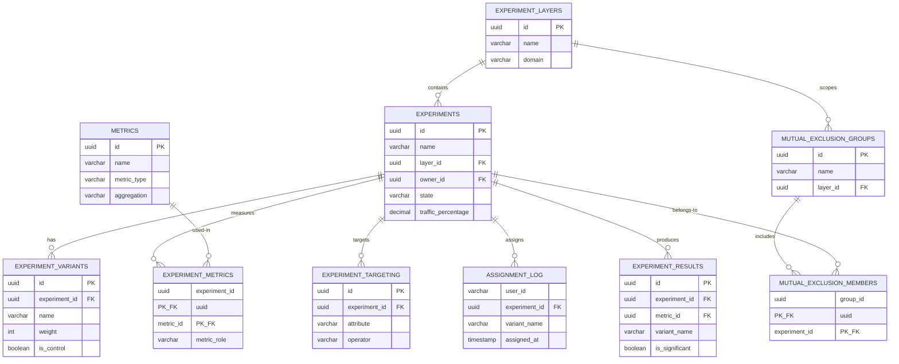
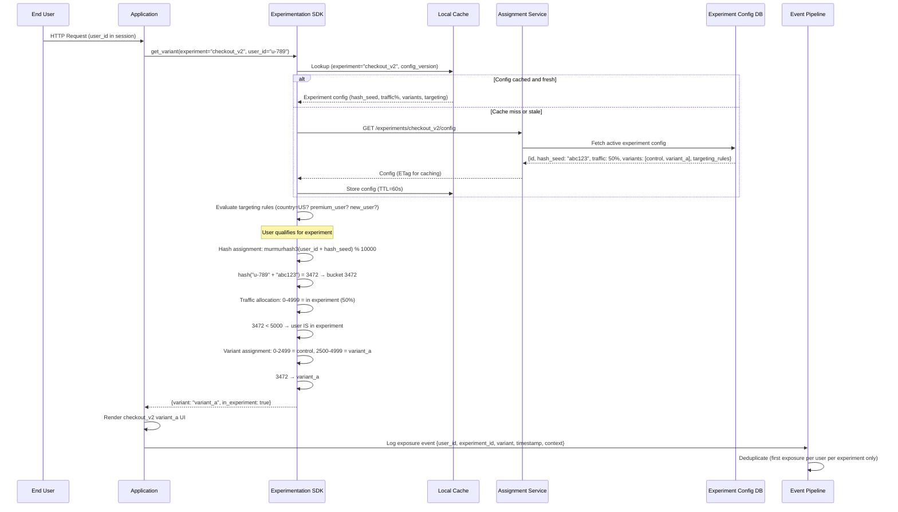
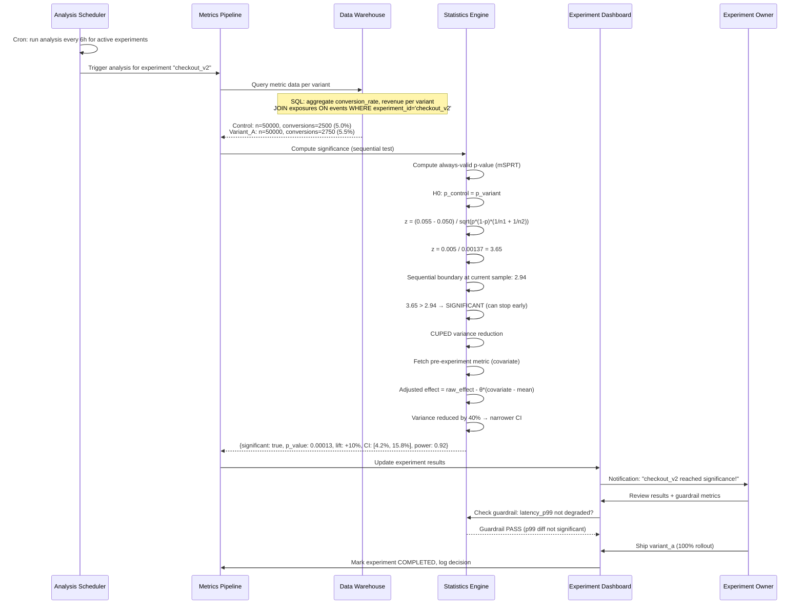

# Solution 121: A/B Testing & Experimentation Platform

## 1. Requirements Clarification

### Functional Requirements
- **Experiment Creation**: Define experiments with variants, traffic allocation, targeting rules
- **Assignment Service**: Deterministic, consistent user-to-variant mapping at sub-ms latency
- **Metric Pipeline**: Compute guardrail, primary, and secondary metrics in near-real-time
- **Statistical Analysis**: Significance testing, confidence intervals, power analysis
- **Multi-layer Design**: Run 1000+ concurrent non-interfering experiments
- **Sequential Testing**: Continuous monitoring with valid early stopping
- **Experiment Lifecycle**: Draft → Running → Analyzing → Concluded → Archived

### Non-Functional Requirements
- **Latency**: <1ms for assignment (on hot path of every request)
- **Throughput**: 1M+ assignments/second
- **Scale**: 1B+ users, 1000+ concurrent experiments
- **Consistency**: Same user always sees same variant (deterministic)
- **Freshness**: Metrics available within 5 minutes of event
- **Accuracy**: Statistical guarantees (type-1 error < 5%, power > 80%)

### Out of Scope
- Feature flag management (separate but adjacent system)
- ML model experimentation (different statistical framework)
- Multi-armed bandit (optimization, not experimentation)

## 2. Capacity Estimation

### Traffic
- 1B daily active users
- Average 10 experiments per user = 10B assignments/day
- Peak: 200K assignments/second
- Event volume: 50B metric events/day (50K events/sec average, 200K peak)

### Storage
- Assignment logs: 10B/day × 50 bytes = 500 GB/day
- Metric events: 50B/day × 200 bytes = 10 TB/day
- Aggregated metrics: 1000 experiments × 100 metrics × 1000 segments = 100M rows/day
- Hot storage (30 days): 300 TB
- Cold storage (2 years): 7 PB

### Compute
- Assignment: CPU-bound hashing, 200K/sec needs ~50 cores
- Metric aggregation: Stream processing, ~500 cores for Flink cluster
- Statistical computation: Batch, ~200 cores for nightly analysis
- Real-time statistics: ~100 cores for sequential testing

## 3. High-Level Architecture

```
┌─────────────────────────────────────────────────────────────────────────────────┐
│                        EXPERIMENTATION PLATFORM                                   │
├─────────────────────────────────────────────────────────────────────────────────┤
│                                                                                   │
│  ┌──────────────┐    ┌──────────────┐    ┌──────────────────┐                   │
│  │  Experiment  │    │  Assignment  │    │   Metric Event   │                   │
│  │  Management  │    │   Service    │    │   Collectors     │                   │
│  │     API      │    │  (Hot Path)  │    │                  │                   │
│  └──────┬───────┘    └──────┬───────┘    └────────┬─────────┘                   │
│         │                   │                      │                             │
│         ▼                   ▼                      ▼                             │
│  ┌──────────────┐    ┌──────────────┐    ┌──────────────────┐                   │
│  │  Experiment  │    │  Assignment  │    │   Kafka Event    │                   │
│  │   Config DB  │    │     Cache    │    │     Stream       │                   │
│  │  (Postgres)  │    │   (Redis)    │    │                  │                   │
│  └──────┬───────┘    └──────────────┘    └────────┬─────────┘                   │
│         │                                          │                             │
│         ▼                                          ▼                             │
│  ┌──────────────┐                        ┌──────────────────┐                   │
│  │   Config     │                        │  Flink Metric    │                   │
│  │  Propagation │                        │  Aggregation     │                   │
│  │  (CDC/Push)  │                        │  Pipeline        │                   │
│  └──────────────┘                        └────────┬─────────┘                   │
│                                                    │                             │
│                                                    ▼                             │
│                                           ┌──────────────────┐                   │
│                                           │  Statistical     │                   │
│                                           │  Engine          │                   │
│                                           │  (Sequential +   │                   │
│                                           │   Fixed-horizon) │                   │
│                                           └────────┬─────────┘                   │
│                                                    │                             │
│                                                    ▼                             │
│                                           ┌──────────────────┐                   │
│                                           │  Results Store   │                   │
│                                           │  (ClickHouse)    │                   │
│                                           └──────────────────┘                   │
│                                                                                   │
│  ┌──────────────────────────────────────────────────────────────────────────┐   │
│  │                      Experiment Dashboard (React)                         │   │
│  └──────────────────────────────────────────────────────────────────────────┘   │
└─────────────────────────────────────────────────────────────────────────────────┘
```

### Component Overview
1. **Assignment Service** - Deterministic hashing for variant assignment
2. **Experiment Config Store** - Experiment definitions, layers, targeting
3. **Event Ingestion** - High-throughput metric event collection
4. **Metric Pipeline** - Stream + batch processing for metric computation
5. **Statistical Engine** - Significance testing, sequential analysis
6. **Results API** - Serving computed results to dashboards
7. **Multi-Layer System** - Orthogonal experiment isolation

## 4. Detailed Design

### 4.1 Assignment Algorithm (Deterministic Hashing)

The core of any experimentation platform is deterministic assignment:

```python
import hashlib
import struct

class ExperimentAssigner:
    """
    Deterministic experiment assignment using MurmurHash3.
    Same user + experiment always yields same variant.
    """
    
    def __init__(self, config_store):
        self.config_store = config_store
    
    def get_assignment(self, user_id: str, experiment_id: str) -> dict:
        """
        Assign user to variant deterministically.
        
        Algorithm:
        1. Hash(user_id + experiment_salt) → uniform [0, 10000)
        2. Check if hash falls in experiment's traffic allocation
        3. If in traffic, map to variant based on variant weights
        """
        experiment = self.config_store.get_experiment(experiment_id)
        
        # Step 1: Compute hash bucket [0, 10000)
        hash_input = f"{user_id}.{experiment.salt}"
        bucket = self._murmurhash3(hash_input) % 10000
        
        # Step 2: Check layer allocation (multi-layer system)
        layer = self.config_store.get_layer(experiment.layer_id)
        if not self._is_in_layer_allocation(bucket, experiment, layer):
            return {"variant": None, "in_experiment": False}
        
        # Step 3: Check targeting rules
        if not self._passes_targeting(user_id, experiment.targeting_rules):
            return {"variant": None, "in_experiment": False}
        
        # Step 4: Assign to variant
        variant = self._assign_variant(bucket, experiment.variants)
        
        return {
            "variant": variant.name,
            "in_experiment": True,
            "experiment_id": experiment_id,
            "bucket": bucket
        }
    
    def _murmurhash3(self, key: str) -> int:
        """MurmurHash3 for uniform distribution."""
        data = key.encode('utf-8')
        h = 0x12345678
        for i in range(0, len(data), 4):
            chunk = data[i:i+4].ljust(4, b'\x00')
            k = struct.unpack('<I', chunk)[0]
            k = (k * 0xcc9e2d51) & 0xFFFFFFFF
            k = ((k << 15) | (k >> 17)) & 0xFFFFFFFF
            k = (k * 0x1b873593) & 0xFFFFFFFF
            h ^= k
            h = ((h << 13) | (h >> 19)) & 0xFFFFFFFF
            h = (h * 5 + 0xe6546b64) & 0xFFFFFFFF
        h ^= len(data)
        h ^= (h >> 16)
        h = (h * 0x85ebca6b) & 0xFFFFFFFF
        h ^= (h >> 13)
        h = (h * 0xc2b2ae35) & 0xFFFFFFFF
        h ^= (h >> 16)
        return h
    
    def _assign_variant(self, bucket: int, variants: list) -> object:
        """Map bucket to variant based on cumulative weights."""
        # Remap bucket within experiment's allocation range
        cumulative = 0
        for variant in variants:
            cumulative += variant.weight  # weight in basis points (out of 10000)
            if bucket < cumulative:
                return variant
        return variants[-1]  # fallback


class MultiLayerAssigner:
    """
    Multi-layer experiment system for orthogonal experiments.
    
    Traffic → Layer → Experiment → Variant
    
    Each layer uses DIFFERENT hash salt, so experiments in
    different layers are statistically independent.
    """
    
    def __init__(self, config_store):
        self.config_store = config_store
        self.assigner = ExperimentAssigner(config_store)
    
    def get_all_assignments(self, user_id: str) -> dict:
        """Get all experiment assignments for a user."""
        assignments = {}
        layers = self.config_store.get_active_layers()
        
        for layer in layers:
            # Each layer has its own hash salt for orthogonality
            layer_bucket = self._get_layer_bucket(user_id, layer.salt)
            
            # Find which experiment in this layer owns this bucket
            experiment = self._find_experiment_for_bucket(layer, layer_bucket)
            if experiment:
                assignment = self.assigner.get_assignment(user_id, experiment.id)
                if assignment["in_experiment"]:
                    assignments[experiment.id] = assignment
        
        return assignments
    
    def _get_layer_bucket(self, user_id: str, layer_salt: str) -> int:
        hash_input = f"{user_id}.{layer_salt}"
        return self.assigner._murmurhash3(hash_input) % 10000
    
    def _find_experiment_for_bucket(self, layer, bucket: int) -> object:
        """Each experiment in a layer owns a range of buckets."""
        for experiment in layer.experiments:
            if experiment.bucket_start <= bucket < experiment.bucket_end:
                return experiment
        return None
```

### 4.2 Metric Pipeline Architecture

```python
# Flink Job: Real-time metric aggregation
class MetricAggregationJob:
    """
    Flink streaming job that:
    1. Joins events with experiment assignments
    2. Computes per-variant metric aggregates
    3. Outputs to statistical engine
    """
    
    def process(self):
        # Source: Kafka topic with user events
        events = self.env.from_source(
            KafkaSource.builder()
            .set_topics("user-events")
            .set_group_id("metric-aggregation")
            .build()
        )
        
        # Source: Assignment log (which user is in which experiment)
        assignments = self.env.from_source(
            KafkaSource.builder()
            .set_topics("experiment-assignments")
            .build()
        )
        
        # Join events with assignments
        enriched = events \
            .key_by(lambda e: e.user_id) \
            .connect(assignments.key_by(lambda a: a.user_id)) \
            .process(AssignmentEnrichmentFunction())
        
        # Aggregate per (experiment, variant, metric) with tumbling windows
        aggregated = enriched \
            .key_by(lambda e: (e.experiment_id, e.variant, e.metric_name)) \
            .window(TumblingEventTimeWindows.of(Time.minutes(5))) \
            .aggregate(MetricAggregator())
        
        # Output aggregated stats
        aggregated.sink_to(
            ClickHouseSink(table="experiment_metric_aggregates")
        )


class MetricAggregator:
    """
    Computes sufficient statistics for each metric:
    - count, sum, sum_of_squares (for mean + variance)
    - For ratio metrics: numerator_sum, denominator_sum
    - For percentiles: t-digest sketch
    """
    
    def create_accumulator(self):
        return {
            "count": 0,
            "sum": 0.0,
            "sum_sq": 0.0,
            "min": float('inf'),
            "max": float('-inf')
        }
    
    def add(self, acc, value):
        acc["count"] += 1
        acc["sum"] += value
        acc["sum_sq"] += value * value
        acc["min"] = min(acc["min"], value)
        acc["max"] = max(acc["max"], value)
        return acc
    
    def get_result(self, acc):
        n = acc["count"]
        mean = acc["sum"] / n if n > 0 else 0
        variance = (acc["sum_sq"] / n - mean * mean) if n > 1 else 0
        return {
            "count": n,
            "mean": mean,
            "variance": variance,
            "sum": acc["sum"],
            "sum_sq": acc["sum_sq"]
        }
```

### 4.3 Statistical Engine

```python
import math
from scipy import stats
import numpy as np

class StatisticalEngine:
    """
    Computes statistical significance for experiments.
    Supports:
    - Fixed-horizon t-test
    - Sequential testing (mSPRT)
    - CUPED variance reduction
    """
    
    def compute_fixed_horizon(self, control_stats, treatment_stats, alpha=0.05):
        """
        Two-sample t-test for difference in means.
        
        Returns: p-value, confidence interval, effect size
        """
        n_c, mean_c, var_c = control_stats["count"], control_stats["mean"], control_stats["variance"]
        n_t, mean_t, var_t = treatment_stats["count"], treatment_stats["mean"], treatment_stats["variance"]
        
        # Welch's t-test (unequal variances)
        diff = mean_t - mean_c
        se = math.sqrt(var_c / n_c + var_t / n_t)
        
        if se == 0:
            return {"significant": False, "p_value": 1.0}
        
        t_stat = diff / se
        
        # Welch-Satterthwaite degrees of freedom
        df_num = (var_c / n_c + var_t / n_t) ** 2
        df_den = (var_c / n_c) ** 2 / (n_c - 1) + (var_t / n_t) ** 2 / (n_t - 1)
        df = df_num / df_den
        
        p_value = 2 * (1 - stats.t.cdf(abs(t_stat), df))
        
        # Confidence interval
        t_crit = stats.t.ppf(1 - alpha / 2, df)
        ci_lower = diff - t_crit * se
        ci_upper = diff + t_crit * se
        
        # Relative effect
        relative_effect = diff / mean_c if mean_c != 0 else 0
        
        return {
            "significant": p_value < alpha,
            "p_value": p_value,
            "effect": diff,
            "relative_effect": relative_effect,
            "ci_lower": ci_lower,
            "ci_upper": ci_upper,
            "se": se,
            "t_stat": t_stat,
            "power": self._compute_power(diff, se, n_c, n_t, alpha)
        }
    
    def compute_sequential(self, control_stats, treatment_stats, 
                           tau=0.01, alpha=0.05):
        """
        mSPRT (mixture Sequential Probability Ratio Test).
        
        Always-valid p-values that allow continuous monitoring
        without inflating type-1 error.
        
        tau: mixing parameter (prior variance on effect size)
        """
        n_c = control_stats["count"]
        n_t = treatment_stats["count"]
        n = min(n_c, n_t)  # effective sample size
        
        diff = treatment_stats["mean"] - control_stats["mean"]
        var_c = control_stats["variance"]
        var_t = treatment_stats["variance"]
        
        # Variance of the difference
        sigma_sq = var_c / n_c + var_t / n_t
        
        if sigma_sq == 0:
            return {"reject": False, "msprt_stat": 0}
        
        # mSPRT statistic (likelihood ratio with mixture)
        V_n = sigma_sq  # variance of Z_n
        
        # Mixture likelihood ratio
        lambda_n = math.sqrt(V_n / (V_n + tau)) * math.exp(
            (tau * diff ** 2) / (2 * V_n * (V_n + tau))
        )
        
        # Reject if lambda exceeds 1/alpha threshold
        reject = lambda_n >= (1 / alpha)
        
        # Always-valid p-value
        p_value = min(1.0, 1.0 / lambda_n) if lambda_n > 0 else 1.0
        
        return {
            "reject": reject,
            "msprt_stat": lambda_n,
            "p_value": p_value,
            "effect": diff,
            "n_control": n_c,
            "n_treatment": n_t
        }
    
    def cuped_variance_reduction(self, metric_values, covariate_values):
        """
        CUPED (Controlled-experiment Using Pre-Experiment Data).
        
        Reduces variance by adjusting for pre-experiment covariates.
        Can reduce required sample size by 50%+.
        
        adjusted_metric = metric - theta * (covariate - E[covariate])
        where theta = Cov(metric, covariate) / Var(covariate)
        """
        metric = np.array(metric_values)
        covariate = np.array(covariate_values)
        
        # Compute optimal theta
        cov_matrix = np.cov(metric, covariate)
        theta = cov_matrix[0, 1] / cov_matrix[1, 1]
        
        # Adjusted metric
        adjusted = metric - theta * (covariate - np.mean(covariate))
        
        # Variance reduction ratio
        original_var = np.var(metric)
        adjusted_var = np.var(adjusted)
        reduction = 1 - adjusted_var / original_var
        
        return {
            "adjusted_values": adjusted.tolist(),
            "theta": theta,
            "variance_reduction": reduction,
            "original_variance": original_var,
            "adjusted_variance": adjusted_var
        }
    
    def _compute_power(self, effect, se, n_c, n_t, alpha):
        """Post-hoc power analysis."""
        z_alpha = stats.norm.ppf(1 - alpha / 2)
        z_power = abs(effect) / se - z_alpha
        return stats.norm.cdf(z_power)
    
    def multiple_comparison_correction(self, p_values, method="benjamini-hochberg"):
        """
        Correct for multiple comparisons.
        BH procedure controls False Discovery Rate.
        """
        n = len(p_values)
        sorted_indices = np.argsort(p_values)
        sorted_p = np.array(p_values)[sorted_indices]
        
        if method == "benjamini-hochberg":
            adjusted = np.zeros(n)
            for i in range(n - 1, -1, -1):
                if i == n - 1:
                    adjusted[i] = sorted_p[i]
                else:
                    adjusted[i] = min(adjusted[i + 1], sorted_p[i] * n / (i + 1))
            
            result = np.zeros(n)
            result[sorted_indices] = adjusted
            return result.tolist()
        
        elif method == "bonferroni":
            return [min(1.0, p * n) for p in p_values]
```

### 4.4 Experiment State Machine

```python
from enum import Enum
from datetime import datetime

class ExperimentState(Enum):
    DRAFT = "draft"
    READY = "ready"          # Configured, awaiting launch
    RAMPING = "ramping"      # Gradually increasing traffic
    RUNNING = "running"      # Full traffic, collecting data
    ANALYZING = "analyzing"  # Stopped, computing final results
    CONCLUDED = "concluded"  # Decision made
    ARCHIVED = "archived"    # Historical record

class ExperimentStateMachine:
    VALID_TRANSITIONS = {
        ExperimentState.DRAFT: [ExperimentState.READY],
        ExperimentState.READY: [ExperimentState.RAMPING, ExperimentState.RUNNING, ExperimentState.DRAFT],
        ExperimentState.RAMPING: [ExperimentState.RUNNING, ExperimentState.ANALYZING],
        ExperimentState.RUNNING: [ExperimentState.ANALYZING],
        ExperimentState.ANALYZING: [ExperimentState.CONCLUDED, ExperimentState.RUNNING],
        ExperimentState.CONCLUDED: [ExperimentState.ARCHIVED],
    }
    
    def transition(self, experiment, new_state: ExperimentState, actor: str):
        current = experiment.state
        if new_state not in self.VALID_TRANSITIONS.get(current, []):
            raise InvalidTransitionError(f"Cannot go from {current} to {new_state}")
        
        # Pre-transition validations
        if new_state == ExperimentState.READY:
            self._validate_ready(experiment)
        elif new_state == ExperimentState.RUNNING:
            self._validate_launch(experiment)
        
        experiment.state = new_state
        experiment.state_changed_at = datetime.utcnow()
        experiment.state_changed_by = actor
        
        # Post-transition actions
        if new_state == ExperimentState.RUNNING:
            self._start_metric_collection(experiment)
        elif new_state == ExperimentState.ANALYZING:
            self._stop_assignment(experiment)
            self._trigger_final_analysis(experiment)
    
    def _validate_ready(self, experiment):
        assert experiment.variants, "Must have at least 2 variants"
        assert experiment.primary_metrics, "Must define primary metrics"
        assert experiment.layer_id, "Must be assigned to a layer"
    
    def _validate_launch(self, experiment):
        assert experiment.sample_size_target, "Must have sample size target"
        assert experiment.guardrail_metrics, "Must define guardrail metrics"
```

## 5. Data Model

### Entity-Relationship Diagram



### Database Schema (PostgreSQL)

```sql
-- Experiment definitions
CREATE TABLE experiments (
    id UUID PRIMARY KEY DEFAULT gen_random_uuid(),
    name VARCHAR(255) NOT NULL,
    description TEXT,
    hypothesis TEXT,
    owner_id UUID NOT NULL REFERENCES users(id),
    team_id UUID NOT NULL REFERENCES teams(id),
    layer_id UUID NOT NULL REFERENCES experiment_layers(id),
    state VARCHAR(50) NOT NULL DEFAULT 'draft',
    salt VARCHAR(64) NOT NULL DEFAULT gen_random_uuid()::text,
    
    -- Traffic allocation within layer (basis points 0-10000)
    bucket_start INT NOT NULL DEFAULT 0,
    bucket_end INT NOT NULL DEFAULT 10000,
    traffic_percentage DECIMAL(5,2) NOT NULL DEFAULT 100.0,
    
    -- Timing
    start_date TIMESTAMP,
    end_date TIMESTAMP,
    target_duration_days INT,
    
    -- Statistical config
    significance_level DECIMAL(4,3) DEFAULT 0.05,
    power_target DECIMAL(4,3) DEFAULT 0.80,
    mde DECIMAL(10,6),  -- minimum detectable effect
    
    -- State tracking
    state_changed_at TIMESTAMP DEFAULT NOW(),
    state_changed_by UUID REFERENCES users(id),
    created_at TIMESTAMP DEFAULT NOW(),
    updated_at TIMESTAMP DEFAULT NOW(),
    
    CONSTRAINT valid_buckets CHECK (bucket_start >= 0 AND bucket_end <= 10000 AND bucket_start < bucket_end)
);

CREATE INDEX idx_experiments_state ON experiments(state) WHERE state IN ('running', 'ramping');
CREATE INDEX idx_experiments_layer ON experiments(layer_id, state);
CREATE INDEX idx_experiments_team ON experiments(team_id, state);

-- Experiment layers for orthogonality
CREATE TABLE experiment_layers (
    id UUID PRIMARY KEY DEFAULT gen_random_uuid(),
    name VARCHAR(255) NOT NULL,
    salt VARCHAR(64) NOT NULL DEFAULT gen_random_uuid()::text,
    description TEXT,
    domain VARCHAR(100),  -- e.g., 'search', 'recommendations', 'ui'
    created_at TIMESTAMP DEFAULT NOW()
);

-- Variants within experiments
CREATE TABLE experiment_variants (
    id UUID PRIMARY KEY DEFAULT gen_random_uuid(),
    experiment_id UUID NOT NULL REFERENCES experiments(id) ON DELETE CASCADE,
    name VARCHAR(100) NOT NULL,
    description TEXT,
    weight INT NOT NULL DEFAULT 5000,  -- basis points within experiment
    is_control BOOLEAN DEFAULT FALSE,
    config JSONB,  -- variant-specific configuration/parameters
    
    UNIQUE(experiment_id, name)
);

CREATE INDEX idx_variants_experiment ON experiment_variants(experiment_id);

-- Metric definitions
CREATE TABLE metrics (
    id UUID PRIMARY KEY DEFAULT gen_random_uuid(),
    name VARCHAR(255) NOT NULL UNIQUE,
    display_name VARCHAR(255),
    description TEXT,
    metric_type VARCHAR(50) NOT NULL,  -- 'mean', 'proportion', 'ratio', 'quantile'
    event_name VARCHAR(255) NOT NULL,
    aggregation VARCHAR(50) NOT NULL,  -- 'sum', 'count', 'avg', 'p50', 'p99'
    numerator_event VARCHAR(255),      -- for ratio metrics
    denominator_event VARCHAR(255),    -- for ratio metrics
    unit VARCHAR(50),
    higher_is_better BOOLEAN DEFAULT TRUE,
    owner_team_id UUID REFERENCES teams(id),
    created_at TIMESTAMP DEFAULT NOW()
);

-- Experiment-metric associations
CREATE TABLE experiment_metrics (
    experiment_id UUID REFERENCES experiments(id) ON DELETE CASCADE,
    metric_id UUID REFERENCES metrics(id),
    metric_role VARCHAR(20) NOT NULL,  -- 'primary', 'secondary', 'guardrail'
    guardrail_threshold DECIMAL(10,4), -- max acceptable degradation for guardrails
    PRIMARY KEY (experiment_id, metric_id)
);

-- Targeting rules
CREATE TABLE experiment_targeting (
    id UUID PRIMARY KEY DEFAULT gen_random_uuid(),
    experiment_id UUID NOT NULL REFERENCES experiments(id) ON DELETE CASCADE,
    attribute VARCHAR(100) NOT NULL,   -- 'country', 'platform', 'user_segment'
    operator VARCHAR(20) NOT NULL,     -- 'in', 'not_in', 'equals', 'regex'
    values JSONB NOT NULL
);

-- Mutual exclusion groups
CREATE TABLE mutual_exclusion_groups (
    id UUID PRIMARY KEY DEFAULT gen_random_uuid(),
    name VARCHAR(255) NOT NULL,
    layer_id UUID NOT NULL REFERENCES experiment_layers(id),
    description TEXT
);

CREATE TABLE mutual_exclusion_members (
    group_id UUID REFERENCES mutual_exclusion_groups(id),
    experiment_id UUID REFERENCES experiments(id),
    PRIMARY KEY (group_id, experiment_id)
);

-- Assignment log (high-volume, partitioned)
CREATE TABLE assignment_log (
    user_id VARCHAR(64) NOT NULL,
    experiment_id UUID NOT NULL,
    variant_name VARCHAR(100) NOT NULL,
    bucket INT NOT NULL,
    assigned_at TIMESTAMP NOT NULL DEFAULT NOW(),
    context JSONB  -- device, country, etc.
) PARTITION BY RANGE (assigned_at);

-- Create monthly partitions
CREATE TABLE assignment_log_2024_01 PARTITION OF assignment_log
    FOR VALUES FROM ('2024-01-01') TO ('2024-02-01');

-- Experiment results (computed by statistical engine)
CREATE TABLE experiment_results (
    id UUID PRIMARY KEY DEFAULT gen_random_uuid(),
    experiment_id UUID NOT NULL REFERENCES experiments(id),
    metric_id UUID NOT NULL REFERENCES metrics(id),
    variant_name VARCHAR(100) NOT NULL,
    
    -- Statistics
    sample_size BIGINT NOT NULL,
    mean DOUBLE PRECISION,
    variance DOUBLE PRECISION,
    
    -- vs control
    effect DOUBLE PRECISION,
    relative_effect DOUBLE PRECISION,
    ci_lower DOUBLE PRECISION,
    ci_upper DOUBLE PRECISION,
    p_value DOUBLE PRECISION,
    is_significant BOOLEAN,
    
    -- Sequential testing
    msprt_statistic DOUBLE PRECISION,
    sequential_p_value DOUBLE PRECISION,
    
    -- Metadata
    computed_at TIMESTAMP DEFAULT NOW(),
    computation_type VARCHAR(20),  -- 'sequential', 'fixed_horizon'
    
    UNIQUE(experiment_id, metric_id, variant_name, computed_at)
);

CREATE INDEX idx_results_experiment ON experiment_results(experiment_id, computed_at DESC);
```

### ClickHouse Schema (Metric Aggregates)

```sql
CREATE TABLE experiment_metric_aggregates (
    experiment_id UUID,
    variant_name String,
    metric_name String,
    window_start DateTime,
    window_end DateTime,
    
    -- Sufficient statistics
    user_count UInt64,
    event_count UInt64,
    sum Float64,
    sum_of_squares Float64,
    min_value Float64,
    max_value Float64,
    
    -- For ratio metrics
    numerator_sum Float64,
    denominator_sum Float64,
    
    -- Segmentation
    segment_key String DEFAULT '',
    segment_value String DEFAULT ''
) ENGINE = MergeTree()
PARTITION BY toYYYYMM(window_start)
ORDER BY (experiment_id, variant_name, metric_name, window_start)
TTL window_start + INTERVAL 90 DAY;
```

## 6. API Design

### Assignment API (Hot Path)

```
POST /v1/assignments
Content-Type: application/json

Request:
{
    "user_id": "user_abc123",
    "context": {
        "country": "US",
        "platform": "ios",
        "app_version": "5.2.1",
        "user_segment": "power_user"
    }
}

Response (200 OK):
{
    "assignments": {
        "exp_search_ranking_v2": {
            "variant": "treatment_b",
            "experiment_id": "550e8400-e29b-41d4-a716-446655440001",
            "parameters": {
                "ranking_model": "model_v3",
                "num_results": 20
            }
        },
        "exp_checkout_flow": {
            "variant": "control",
            "experiment_id": "550e8400-e29b-41d4-a716-446655440002",
            "parameters": {}
        }
    },
    "request_id": "req_xyz789"
}
```

### Experiment Management API

```
POST /v1/experiments
Authorization: Bearer <token>

Request:
{
    "name": "Search Ranking V2",
    "description": "Test new ML ranking model",
    "hypothesis": "New model increases CTR by 2%+",
    "layer_id": "layer_search",
    "team_id": "team_search",
    "variants": [
        {"name": "control", "weight": 5000, "is_control": true, "config": {}},
        {"name": "treatment", "weight": 5000, "config": {"model": "v3"}}
    ],
    "metrics": {
        "primary": ["search_ctr", "clicks_per_session"],
        "secondary": ["time_to_click", "sessions_per_user"],
        "guardrail": [
            {"metric": "p99_latency", "threshold": 0.10},
            {"metric": "error_rate", "threshold": 0.01}
        ]
    },
    "targeting": {
        "country": {"in": ["US", "CA", "GB"]},
        "platform": {"in": ["ios", "android"]}
    },
    "statistical_config": {
        "significance_level": 0.05,
        "power": 0.80,
        "mde": 0.02,
        "testing_method": "sequential"
    }
}

Response (201 Created):
{
    "id": "550e8400-e29b-41d4-a716-446655440001",
    "state": "draft",
    "estimated_duration_days": 14,
    "required_sample_size": 250000,
    "created_at": "2024-01-15T10:30:00Z"
}
```

### Results API

```
GET /v1/experiments/{id}/results?metric=search_ctr

Response (200 OK):
{
    "experiment_id": "550e8400-e29b-41d4-a716-446655440001",
    "state": "running",
    "days_running": 7,
    "results": {
        "search_ctr": {
            "control": {
                "sample_size": 125432,
                "mean": 0.342,
                "ci": [0.338, 0.346]
            },
            "treatment": {
                "sample_size": 124891,
                "mean": 0.358,
                "ci": [0.354, 0.362]
            },
            "comparison": {
                "absolute_effect": 0.016,
                "relative_effect": 0.047,
                "ci_lower": 0.008,
                "ci_upper": 0.024,
                "p_value": 0.0003,
                "is_significant": true,
                "sequential_p_value": 0.0012,
                "recommended_action": "ship_treatment"
            }
        }
    },
    "guardrails": {
        "p99_latency": {"status": "pass", "degradation": 0.02},
        "error_rate": {"status": "pass", "degradation": -0.001}
    }
}
```

## 7. Scalability & Performance

### Assignment Service Performance
- **Caching**: Experiment configs cached in-memory (refresh every 30s via CDC)
- **No network call**: Hashing is pure computation, no DB lookup needed
- **Batch assignment**: Return all experiment assignments in single call
- **Edge deployment**: Assignment service runs at CDN edge for <1ms latency

### Metric Pipeline Scaling
- **Kafka partitioning**: By user_id for ordered processing per user
- **Flink parallelism**: Scale to 500+ task slots for peak load
- **Pre-aggregation**: 5-minute windows reduce data volume 1000x before stats
- **Tiered storage**: Hot (ClickHouse) → Warm (S3 Parquet) → Cold (Glacier)

### Multi-Layer System for 1000+ Experiments
- Traffic divided into layers by domain (search, reco, UI, backend)
- Each layer supports ~100 experiments via bucket allocation
- 10 layers × 100 experiments = 1000 concurrent experiments
- Layers are statistically independent (different hash salts)

## 8. Reliability & Fault Tolerance

### Assignment Service HA
- Stateless service, horizontally scalable
- Config pushed to local cache (survives config DB outage)
- Fallback: if no config, return control variant
- Circuit breaker on config refresh

### Metric Pipeline Reliability
- Kafka replication factor 3, min.insync.replicas=2
- Flink checkpointing every 60s to S3
- Exactly-once semantics with Kafka transactions
- Dead letter queue for unparseable events
- Backfill capability from raw event archive

### Statistical Engine Correctness
- Results are idempotent (recomputable from raw aggregates)
- Dual-computation: sequential + fixed-horizon for cross-validation
- Automated SRM (Sample Ratio Mismatch) detection
- Alert on assignment imbalance > 1%

## 9. Monitoring & Observability

### Key Metrics
| Metric | Target | Alert Threshold |
|--------|--------|-----------------|
| Assignment latency p99 | <1ms | >5ms |
| Metric pipeline lag | <5min | >15min |
| SRM detection rate | <1% experiments | >5% |
| Config propagation time | <30s | >2min |
| Assignment QPS | baseline ±20% | ±50% |

### Dashboards
- **Experiment Health**: Active experiments, SRM checks, guardrail violations
- **Pipeline Health**: Kafka lag, Flink throughput, ClickHouse query latency
- **Assignment Quality**: Hash distribution uniformity, targeting accuracy

### Alerting
- SRM detected (assignment ratio deviates from expected)
- Guardrail metric breach (automatic experiment pause)
- Pipeline delay exceeding 15 minutes
- Statistical engine computation failures

## 10. Trade-offs & Alternatives

| Decision | Chosen | Alternative | Rationale |
|----------|--------|-------------|-----------|
| Assignment method | Deterministic hash | Random with storage | Hash needs no DB, consistent across services |
| Statistical method | Sequential (mSPRT) | Fixed-horizon only | Allows valid early stopping, saves time |
| Metric processing | Streaming (Flink) | Batch (Spark) | 5-min freshness vs daily |
| Results storage | ClickHouse | PostgreSQL | Columnar better for aggregation queries |
| Variance reduction | CUPED | None | 50%+ sample size reduction |
| Multi-experiment | Layered design | Mutual exclusion only | Layers allow more concurrent experiments |
| Config distribution | Push (CDC) | Pull (polling) | Faster propagation, less load |

### Key Trade-offs
1. **Consistency vs Speed**: Deterministic hashing means no DB call but config changes take 30s to propagate
2. **Sequential vs Fixed-horizon**: Sequential allows peeking but requires larger sample for same power
3. **Real-time vs Accuracy**: 5-min windows may miss short-lived effects but reduce compute cost
4. **Layer orthogonality vs Interaction detection**: Orthogonal layers assume no interaction (validated periodically)

## 11. Unique Considerations

### Network Effects
For social/marketplace experiments where users influence each other:
- Cluster-randomized assignment (randomize by graph clusters)
- Ego-network analysis for spillover estimation
- Switchback designs for marketplace experiments

### Interaction Detection
```python
def detect_interaction(experiment_a_results, experiment_b_results, combined_results):
    """
    Test if experiments A and B interact.
    If interaction exists, effect of A differs by B assignment.
    """
    # 2x2 factorial analysis
    # Cell means: (A_control, B_control), (A_treat, B_control), 
    #             (A_control, B_treat), (A_treat, B_treat)
    
    interaction_effect = (
        combined_results["treat_treat"] - combined_results["treat_control"]
        - combined_results["control_treat"] + combined_results["control_control"]
    )
    
    # Test if interaction effect is significant
    se_interaction = compute_interaction_se(combined_results)
    z_stat = interaction_effect / se_interaction
    p_value = 2 * (1 - stats.norm.cdf(abs(z_stat)))
    
    return {
        "interaction_detected": p_value < 0.05,
        "interaction_effect": interaction_effect,
        "p_value": p_value
    }
```

### Guardrail Automation
- Automatic experiment pause if guardrail metric degrades beyond threshold
- Grace period (24h) to avoid false alarms from variance
- Escalation: warn owner → pause experiment → force stop
- Post-mortem generation for stopped experiments

### Assignment Debugging
- Every assignment logged with full context for auditing
- "Why was I assigned?" tool for debugging unexpected behavior
- Hash bucket visualization for uniformity verification
- Assignment replay capability for debugging metric discrepancies

---

## 12. Sequence Diagrams

### Diagram 1: Experiment Assignment + Bucketing



### Diagram 2: Results Analysis + Significance Check



## 13. Algorithm Deep Dives

### Deep Dive: Statistical Significance in A/B Testing

#### Problem
Traditional fixed-horizon tests require waiting until predetermined sample size. Business pressure to "peek" at results causes inflated false-positive rates (up to 30% instead of 5%).

#### Solution 1: Sequential Testing (Always-Valid P-Values)

**mSPRT (Mixture Sequential Probability Ratio Test):**

```
At any time t, compute the likelihood ratio:
  Λ_t = ∫ L(data | θ) × H(θ) dθ / L(data | θ=0)

Where:
  - L(data | θ) = likelihood under effect size θ
  - H(θ) = mixing distribution (prior over plausible effects)
  - θ=0 = null hypothesis (no effect)

Reject H0 when: Λ_t > 1/α (e.g., > 20 for α=0.05)

The p-value at any time: p_t = 1/Λ_t (always valid regardless of peeking)
```

**Step-by-step example:**
```
Experiment: checkout button color (blue vs green)
Metric: conversion rate
MDE (minimum detectable effect): 2% relative lift
α = 0.05, mixing distribution: N(0, τ²) where τ = MDE/2

Day 1: n=1000/variant, conv_control=5.0%, conv_variant=5.8%
  z = 0.008 / SE = 0.008 / 0.0097 = 0.82
  Λ_1 = 1.4 → p = 0.71 → NOT significant (need Λ > 20)

Day 3: n=5000/variant, conv_control=5.1%, conv_variant=5.6%
  z = 0.005 / 0.0044 = 1.14
  Λ_3 = 2.8 → p = 0.36 → NOT significant

Day 7: n=15000/variant, conv_control=5.0%, conv_variant=5.5%
  z = 0.005 / 0.0025 = 2.0
  Λ_7 = 8.2 → p = 0.12 → NOT significant (but trending)

Day 10: n=25000/variant, conv_control=5.0%, conv_variant=5.5%
  z = 0.005 / 0.0019 = 2.58
  Λ_10 = 22.1 → p = 0.045 → SIGNIFICANT! (Λ > 20)
  
  Can stop experiment now with valid Type I error control.
  A fixed-horizon test would have required n=32000 per variant.
  Sequential test saved 7000 samples (22% faster).
```

#### Solution 2: CUPED (Controlled-experiment Using Pre-Experiment Data)

**Problem**: High variance in metrics means experiments need large sample sizes.

**Insight**: Use pre-experiment behavior as a covariate to reduce variance.

```python
def cuped_estimate(metric_values, pre_experiment_values):
    """
    metric_values: conversion rate per user during experiment
    pre_experiment_values: conversion rate per user BEFORE experiment (covariate)
    """
    # Compute optimal adjustment coefficient
    theta = np.cov(metric_values, pre_experiment_values)[0,1] / np.var(pre_experiment_values)
    
    # Adjusted metric (variance reduced)
    adjusted = metric_values - theta * (pre_experiment_values - np.mean(pre_experiment_values))
    
    # Variance reduction factor
    r_squared = np.corrcoef(metric_values, pre_experiment_values)[0,1] ** 2
    # If correlation = 0.6, variance reduced by 36%!
    # Equivalent to having 56% more samples for free
    
    return adjusted, r_squared

# Example:
# User bought 3 items last month, 4 items during experiment
# Without CUPED: variance(purchases) = 5.2
# With CUPED (θ=0.7, r²=0.4): variance reduced to 3.1
# Required sample size reduced by 40%!
```

**When CUPED helps most:**
- Metrics with high user-level variance (revenue, engagement time)
- When pre-experiment behavior correlates with experiment-period behavior
- Typically reduces required sample size by 30-50%

#### Solution 3: Guardrail Metrics with Bonferroni Correction

```
Problem: Checking 5 guardrail metrics inflates false-positive rate
  P(at least one false alarm) = 1 - (1-0.05)^5 = 23%

Solution: Adjusted significance threshold
  Per-metric α = 0.05 / 5 = 0.01 (Bonferroni)
  
  Or better: Holm-Bonferroni (step-down, more power)
  1. Sort p-values: p₁ ≤ p₂ ≤ ... ≤ p₅
  2. Compare p₁ with α/5 = 0.01
  3. Compare p₂ with α/4 = 0.0125
  4. Compare p₃ with α/3 = 0.0167
  5. Stop at first non-rejection
```

#### Architecture Implications

| Statistical Requirement | System Design Impact |
|------------------------|---------------------|
| Sequential testing | Must store running sufficient statistics, not just final counts |
| CUPED | Need 2-4 weeks of pre-experiment data accessible at analysis time |
| Always-valid p-values | Analysis pipeline can run at any frequency without inflation |
| Guardrail monitoring | Real-time metric aggregation per variant needed |
| Power analysis | Pre-experiment: need historical metric variance estimates |
| Sample ratio mismatch | Real-time check: flag if variant sizes diverge >1% from expected |

