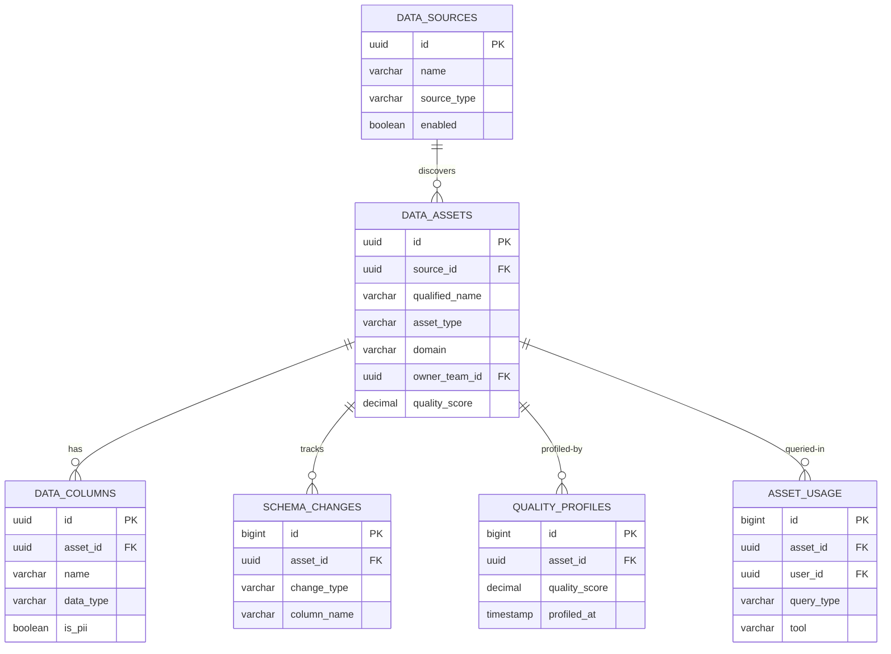
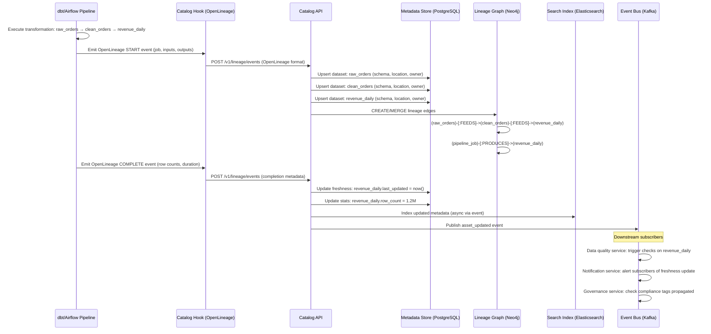
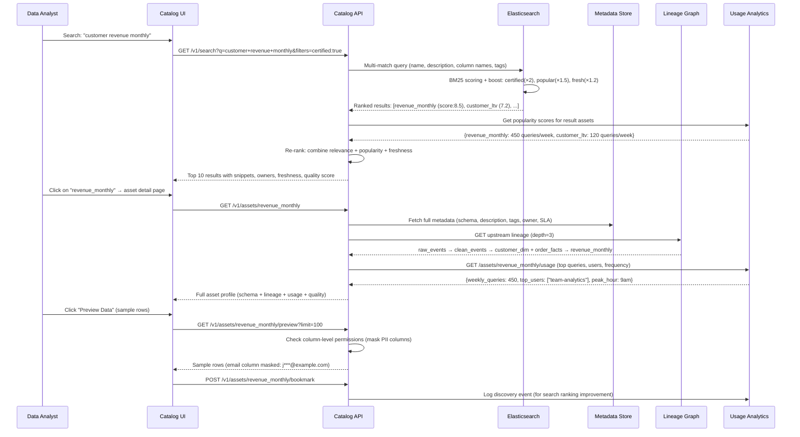

# Solution 125: Data Catalog & Discovery Platform

## 1. Requirements Clarification

### Functional Requirements
- **Metadata Ingestion**: Auto-discover and ingest metadata from databases, warehouses, lakes, streams
- **Search & Discovery**: Full-text and faceted search across all data assets
- **Data Lineage**: Column-level lineage tracking with impact analysis
- **Data Quality**: Profiling, freshness monitoring, quality score computation
- **Governance**: PII detection, ownership assignment, access policy tracking
- **Usage Analytics**: Track who queries what, popularity, cost attribution

### Non-Functional Requirements
- **Scale**: Millions of datasets, billions of column-level metadata entries
- **Freshness**: Metadata updated within minutes of source changes
- **Search Latency**: <200ms for search queries
- **Lineage Depth**: Support 20+ hop lineage chains
- **Availability**: 99.9% (not on critical data path, but important for trust)

### Out of Scope
- Data access layer (query engines)
- Data pipeline orchestration (Airflow, dbt—we integrate with them)
- Data transformation / ETL execution

## 2. Capacity Estimation

### Metadata Volume
- 5M tables/datasets across all sources
- 50M columns (average 10 columns per table)
- 100M lineage edges (column-to-column)
- 500M usage records per month (query logs)
- 10K data sources (databases, warehouses, lakes, APIs)

### Storage
- Metadata graph: 5M nodes × 2KB + 100M edges × 200B = 30GB (graph DB)
- Search index: 5M documents × 5KB = 25GB (Elasticsearch)
- Usage analytics: 500M records/month × 200B = 100GB/month
- Lineage graph: 100M edges × 200B = 20GB
- Quality profiles: 50M columns × 1KB = 50GB
- Total active: ~300GB

### Compute
- Metadata ingestion: 20 connector workers
- Search cluster: 5 nodes (Elasticsearch)
- Graph database: 3 nodes (Neo4j/JanusGraph)
- Lineage computation: 10 nodes (batch + streaming)
- Quality profiling: 30 nodes (samples data from sources)

## 3. High-Level Architecture

```
┌──────────────────────────────────────────────────────────────────────────────┐
│                    DATA CATALOG & DISCOVERY PLATFORM                           │
├──────────────────────────────────────────────────────────────────────────────┤
│                                                                                │
│  ┌──────────────────────────────────────────────────────────────────┐        │
│  │                    DATA SOURCES                                    │        │
│  │  ┌────────┐ ┌────────┐ ┌────────┐ ┌────────┐ ┌────────┐       │        │
│  │  │Postgres│ │Snowflake│ │  S3/   │ │ Kafka  │ │Airflow │       │        │
│  │  │ MySQL  │ │BigQuery │ │  Lake  │ │Streams │ │  dbt   │       │        │
│  │  └────────┘ └────────┘ └────────┘ └────────┘ └────────┘       │        │
│  └───────────────────────────────┬──────────────────────────────────┘        │
│                                  │                                            │
│                                  ▼                                            │
│  ┌──────────────────────────────────────────────────────────────────┐        │
│  │              INGESTION FRAMEWORK                                   │        │
│  │  ┌─────────────┐  ┌──────────────┐  ┌─────────────────┐        │        │
│  │  │  Connector  │  │   Change     │  │   Lineage       │        │        │
│  │  │  Framework  │  │   Detection  │  │   Extractor     │        │        │
│  │  └─────────────┘  └──────────────┘  └─────────────────┘        │        │
│  └───────────────────────────────┬──────────────────────────────────┘        │
│                                  │                                            │
│                                  ▼                                            │
│  ┌──────────────────────────────────────────────────────────────────┐        │
│  │                METADATA STORE                                      │        │
│  │  ┌──────────────┐  ┌──────────────┐  ┌──────────────────┐      │        │
│  │  │  Graph DB    │  │ Elasticsearch │  │   PostgreSQL     │      │        │
│  │  │  (Lineage +  │  │  (Search +    │  │  (Configs +      │      │        │
│  │  │   Relations) │  │   Discovery)  │  │   Ownership)     │      │        │
│  │  └──────────────┘  └──────────────┘  └──────────────────┘      │        │
│  └──────────────────────────────────────────────────────────────────┘        │
│                                  │                                            │
│              ┌───────────────────┼──────────────────┐                        │
│              ▼                   ▼                   ▼                        │
│  ┌──────────────┐    ┌──────────────┐    ┌──────────────┐                   │
│  │   Quality    │    │    PII       │    │   Usage      │                   │
│  │   Engine     │    │  Classifier  │    │  Analytics   │                   │
│  └──────────────┘    └──────────────┘    └──────────────┘                   │
│                                                                                │
│  ┌──────────────────────────────────────────────────────────────────┐        │
│  │              CATALOG UI + API                                      │        │
│  │  [Search] [Browse] [Lineage Viz] [Quality] [Governance]          │        │
│  └──────────────────────────────────────────────────────────────────┘        │
│                                                                                │
└──────────────────────────────────────────────────────────────────────────────┘
```

## 4. Detailed Design

### 4.1 Metadata Ingestion Framework

```python
from abc import ABC, abstractmethod
from dataclasses import dataclass, field
from typing import List, Dict, Optional, Generator
from datetime import datetime
import hashlib

@dataclass
class ColumnMetadata:
    name: str
    data_type: str
    description: Optional[str] = None
    nullable: bool = True
    is_primary_key: bool = False
    is_partition_key: bool = False
    default_value: Optional[str] = None
    tags: List[str] = field(default_factory=list)

@dataclass
class TableMetadata:
    """Unified metadata representation for any data asset."""
    source_type: str          # 'postgres', 'snowflake', 's3', 'kafka'
    database: str
    schema: str
    name: str
    
    # Identity
    qualified_name: str = ""  # Unique: source://database.schema.table
    
    # Schema
    columns: List[ColumnMetadata] = field(default_factory=list)
    
    # Metadata
    description: Optional[str] = None
    owner: Optional[str] = None
    tags: List[str] = field(default_factory=list)
    
    # Stats
    row_count: Optional[int] = None
    size_bytes: Optional[int] = None
    created_at: Optional[datetime] = None
    updated_at: Optional[datetime] = None
    last_accessed_at: Optional[datetime] = None
    
    # Quality
    freshness_slo_hours: Optional[int] = None
    
    def compute_fingerprint(self) -> str:
        """Hash of schema for change detection."""
        schema_str = "|".join(
            f"{c.name}:{c.data_type}:{c.nullable}" for c in self.columns
        )
        return hashlib.sha256(schema_str.encode()).hexdigest()[:16]


class MetadataConnector(ABC):
    """Base class for metadata source connectors."""
    
    @abstractmethod
    def source_type(self) -> str:
        pass
    
    @abstractmethod
    def connect(self, config: dict):
        pass
    
    @abstractmethod
    def extract_tables(self) -> Generator[TableMetadata, None, None]:
        """Yield table metadata from source."""
        pass
    
    @abstractmethod
    def extract_lineage(self) -> Generator['LineageEdge', None, None]:
        """Yield lineage edges if available from this source."""
        pass
    
    def incremental_extract(self, last_sync: datetime) -> Generator[TableMetadata, None, None]:
        """Extract only changed tables since last sync. Default: full extract."""
        return self.extract_tables()


class PostgresConnector(MetadataConnector):
    """Extract metadata from PostgreSQL via information_schema."""
    
    def source_type(self) -> str:
        return "postgres"
    
    def connect(self, config: dict):
        import psycopg2
        self.conn = psycopg2.connect(
            host=config["host"],
            port=config.get("port", 5432),
            database=config["database"],
            user=config["user"],
            password=config["password"]
        )
    
    def extract_tables(self) -> Generator[TableMetadata, None, None]:
        cursor = self.conn.cursor()
        
        # Get all tables
        cursor.execute("""
            SELECT 
                t.table_schema,
                t.table_name,
                obj_description((t.table_schema || '.' || t.table_name)::regclass) as description,
                pg_total_relation_size((t.table_schema || '.' || t.table_name)::regclass) as size_bytes,
                (SELECT reltuples::bigint FROM pg_class 
                 WHERE oid = (t.table_schema || '.' || t.table_name)::regclass) as row_count
            FROM information_schema.tables t
            WHERE t.table_schema NOT IN ('pg_catalog', 'information_schema')
                AND t.table_type = 'BASE TABLE'
        """)
        
        for row in cursor.fetchall():
            schema, table_name, description, size_bytes, row_count = row
            
            # Get columns
            cursor.execute("""
                SELECT 
                    c.column_name,
                    c.data_type,
                    c.is_nullable,
                    c.column_default,
                    col_description((c.table_schema || '.' || c.table_name)::regclass, 
                                   c.ordinal_position) as description,
                    CASE WHEN pk.column_name IS NOT NULL THEN true ELSE false END as is_pk
                FROM information_schema.columns c
                LEFT JOIN (
                    SELECT ku.column_name
                    FROM information_schema.table_constraints tc
                    JOIN information_schema.key_column_usage ku 
                        ON tc.constraint_name = ku.constraint_name
                    WHERE tc.constraint_type = 'PRIMARY KEY'
                        AND tc.table_schema = %s AND tc.table_name = %s
                ) pk ON pk.column_name = c.column_name
                WHERE c.table_schema = %s AND c.table_name = %s
                ORDER BY c.ordinal_position
            """, (schema, table_name, schema, table_name))
            
            columns = [
                ColumnMetadata(
                    name=col[0],
                    data_type=col[1],
                    nullable=col[2] == 'YES',
                    default_value=col[3],
                    description=col[4],
                    is_primary_key=col[5]
                )
                for col in cursor.fetchall()
            ]
            
            yield TableMetadata(
                source_type="postgres",
                database=self.conn.info.dbname,
                schema=schema,
                name=table_name,
                qualified_name=f"postgres://{self.conn.info.host}/{self.conn.info.dbname}.{schema}.{table_name}",
                columns=columns,
                description=description,
                row_count=int(row_count) if row_count else None,
                size_bytes=size_bytes
            )


class SnowflakeConnector(MetadataConnector):
    """Extract metadata from Snowflake using INFORMATION_SCHEMA."""
    
    def source_type(self) -> str:
        return "snowflake"
    
    def connect(self, config: dict):
        import snowflake.connector
        self.conn = snowflake.connector.connect(
            account=config["account"],
            user=config["user"],
            password=config["password"],
            warehouse=config.get("warehouse", "COMPUTE_WH")
        )
    
    def extract_tables(self) -> Generator[TableMetadata, None, None]:
        cursor = self.conn.cursor()
        
        # Get all databases and schemas
        cursor.execute("SHOW DATABASES")
        databases = [row[1] for row in cursor.fetchall()]
        
        for db in databases:
            cursor.execute(f"""
                SELECT 
                    TABLE_CATALOG, TABLE_SCHEMA, TABLE_NAME, 
                    ROW_COUNT, BYTES, COMMENT, LAST_ALTERED
                FROM {db}.INFORMATION_SCHEMA.TABLES 
                WHERE TABLE_SCHEMA != 'INFORMATION_SCHEMA'
            """)
            
            for row in cursor.fetchall():
                catalog, schema, name, rows, bytes_, comment, last_altered = row
                
                # Get columns
                cursor.execute(f"""
                    SELECT COLUMN_NAME, DATA_TYPE, IS_NULLABLE, 
                           COLUMN_DEFAULT, COMMENT
                    FROM {db}.INFORMATION_SCHEMA.COLUMNS
                    WHERE TABLE_SCHEMA = '{schema}' AND TABLE_NAME = '{name}'
                    ORDER BY ORDINAL_POSITION
                """)
                
                columns = [
                    ColumnMetadata(
                        name=col[0], data_type=col[1],
                        nullable=col[2] == 'YES',
                        default_value=col[3], description=col[4]
                    )
                    for col in cursor.fetchall()
                ]
                
                yield TableMetadata(
                    source_type="snowflake",
                    database=db,
                    schema=schema,
                    name=name,
                    qualified_name=f"snowflake://{db}.{schema}.{name}",
                    columns=columns,
                    description=comment,
                    row_count=rows,
                    size_bytes=bytes_,
                    updated_at=last_altered
                )


class DbtManifestConnector(MetadataConnector):
    """
    Extract metadata and lineage from dbt manifest.json.
    dbt provides rich lineage information between models.
    """
    
    def source_type(self) -> str:
        return "dbt"
    
    def connect(self, config: dict):
        import json
        with open(config["manifest_path"]) as f:
            self.manifest = json.load(f)
    
    def extract_tables(self) -> Generator[TableMetadata, None, None]:
        for node_id, node in self.manifest.get("nodes", {}).items():
            if node["resource_type"] in ("model", "seed", "snapshot"):
                columns = [
                    ColumnMetadata(
                        name=col_name,
                        data_type=col_info.get("data_type", "unknown"),
                        description=col_info.get("description")
                    )
                    for col_name, col_info in node.get("columns", {}).items()
                ]
                
                yield TableMetadata(
                    source_type="dbt",
                    database=node.get("database", ""),
                    schema=node.get("schema", ""),
                    name=node["name"],
                    qualified_name=f"dbt://{node['unique_id']}",
                    columns=columns,
                    description=node.get("description"),
                    tags=node.get("tags", []),
                    owner=node.get("meta", {}).get("owner")
                )
    
    def extract_lineage(self) -> Generator['LineageEdge', None, None]:
        """Extract model-level lineage from dbt dependency graph."""
        for node_id, node in self.manifest.get("nodes", {}).items():
            for dep_id in node.get("depends_on", {}).get("nodes", []):
                yield LineageEdge(
                    source_qualified_name=f"dbt://{dep_id}",
                    target_qualified_name=f"dbt://{node_id}",
                    edge_type="dbt_dependency",
                    transformation_type="dbt_model"
                )


class IngestionOrchestrator:
    """
    Orchestrates metadata ingestion from all configured sources.
    Handles scheduling, change detection, and metadata graph updates.
    """
    
    def __init__(self, metadata_store, search_indexer, lineage_store):
        self.metadata_store = metadata_store
        self.search_indexer = search_indexer
        self.lineage_store = lineage_store
        self.connectors = {}
    
    def register_connector(self, source_id: str, connector: MetadataConnector, config: dict):
        self.connectors[source_id] = (connector, config)
    
    async def run_ingestion(self, source_id: str, full_sync: bool = False):
        """Run ingestion for a specific source."""
        connector, config = self.connectors[source_id]
        connector.connect(config)
        
        last_sync = None if full_sync else await self.metadata_store.get_last_sync(source_id)
        
        ingested = 0
        changed = 0
        
        # Extract and upsert metadata
        if last_sync and not full_sync:
            tables = connector.incremental_extract(last_sync)
        else:
            tables = connector.extract_tables()
        
        for table in tables:
            ingested += 1
            
            # Check if schema changed
            existing = await self.metadata_store.get_by_qualified_name(table.qualified_name)
            if existing:
                old_fingerprint = existing.compute_fingerprint()
                new_fingerprint = table.compute_fingerprint()
                
                if old_fingerprint != new_fingerprint:
                    changed += 1
                    await self._handle_schema_change(existing, table)
            
            # Upsert metadata
            await self.metadata_store.upsert(table)
            
            # Update search index
            await self.search_indexer.index_table(table)
        
        # Extract lineage
        for edge in connector.extract_lineage():
            await self.lineage_store.upsert_edge(edge)
        
        # Record sync
        await self.metadata_store.record_sync(source_id, ingested, changed)
    
    async def _handle_schema_change(self, old: TableMetadata, new: TableMetadata):
        """Detect and record schema changes."""
        old_cols = {c.name: c for c in old.columns}
        new_cols = {c.name: c for c in new.columns}
        
        changes = []
        
        # Removed columns
        for name in old_cols:
            if name not in new_cols:
                changes.append({"type": "column_removed", "column": name})
        
        # Added columns
        for name in new_cols:
            if name not in old_cols:
                changes.append({"type": "column_added", "column": name, 
                              "data_type": new_cols[name].data_type})
        
        # Type changes
        for name in old_cols:
            if name in new_cols and old_cols[name].data_type != new_cols[name].data_type:
                changes.append({"type": "type_changed", "column": name,
                              "old_type": old_cols[name].data_type,
                              "new_type": new_cols[name].data_type})
        
        if changes:
            await self.metadata_store.record_schema_change(
                qualified_name=old.qualified_name,
                changes=changes,
                timestamp=datetime.utcnow()
            )
            
            # Trigger impact analysis
            await self._notify_downstream_owners(old.qualified_name, changes)
```

### 4.2 Search & Discovery Engine

```python
from elasticsearch import AsyncElasticsearch

class CatalogSearchEngine:
    """
    Elasticsearch-based search with custom relevance ranking.
    
    Ranking factors:
    - Query relevance (BM25 text match)
    - Popularity (query count in last 30 days)
    - Freshness (recently updated datasets rank higher)
    - Quality score (higher quality = more trustworthy)
    - Ownership (datasets owned by querier's team rank higher)
    """
    
    def __init__(self, es_client: AsyncElasticsearch):
        self.es = es_client
        self.index_name = "data_catalog"
    
    async def create_index(self):
        """Create Elasticsearch index with custom mappings."""
        mapping = {
            "settings": {
                "number_of_shards": 5,
                "number_of_replicas": 1,
                "analysis": {
                    "analyzer": {
                        "catalog_analyzer": {
                            "type": "custom",
                            "tokenizer": "standard",
                            "filter": ["lowercase", "snowball", "synonym_filter"]
                        },
                        "column_analyzer": {
                            "type": "custom",
                            "tokenizer": "standard",
                            "filter": ["lowercase", "camel_case_split"]
                        }
                    },
                    "filter": {
                        "synonym_filter": {
                            "type": "synonym",
                            "synonyms": [
                                "user,customer,account",
                                "order,purchase,transaction",
                                "revenue,income,earnings"
                            ]
                        },
                        "camel_case_split": {
                            "type": "word_delimiter",
                            "split_on_case_change": True
                        }
                    }
                }
            },
            "mappings": {
                "properties": {
                    "qualified_name": {"type": "keyword"},
                    "name": {
                        "type": "text",
                        "analyzer": "catalog_analyzer",
                        "fields": {"keyword": {"type": "keyword"}}
                    },
                    "description": {"type": "text", "analyzer": "catalog_analyzer"},
                    "source_type": {"type": "keyword"},
                    "database": {"type": "keyword"},
                    "schema": {"type": "keyword"},
                    "owner": {"type": "keyword"},
                    "team": {"type": "keyword"},
                    "tags": {"type": "keyword"},
                    "columns": {
                        "type": "nested",
                        "properties": {
                            "name": {"type": "text", "analyzer": "column_analyzer"},
                            "data_type": {"type": "keyword"},
                            "description": {"type": "text"}
                        }
                    },
                    
                    # Ranking signals
                    "popularity_score": {"type": "float"},
                    "quality_score": {"type": "float"},
                    "freshness_timestamp": {"type": "date"},
                    "query_count_30d": {"type": "integer"},
                    
                    # Governance
                    "has_pii": {"type": "boolean"},
                    "classification": {"type": "keyword"},
                    "domain": {"type": "keyword"}
                }
            }
        }
        await self.es.indices.create(index=self.index_name, body=mapping)
    
    async def search(self, query: str, filters: dict = None, 
                     user_context: dict = None, page: int = 0, 
                     size: int = 20) -> dict:
        """
        Search with custom ranking that combines relevance with business signals.
        """
        
        # Build multi-match query
        must_clauses = [{
            "multi_match": {
                "query": query,
                "fields": [
                    "name^5",
                    "name.keyword^10",
                    "description^2",
                    "columns.name^3",
                    "columns.description",
                    "tags^4",
                    "owner^2"
                ],
                "type": "best_fields",
                "fuzziness": "AUTO"
            }
        }]
        
        # Apply filters
        filter_clauses = []
        if filters:
            if filters.get("source_type"):
                filter_clauses.append({"term": {"source_type": filters["source_type"]}})
            if filters.get("owner"):
                filter_clauses.append({"term": {"owner": filters["owner"]}})
            if filters.get("domain"):
                filter_clauses.append({"term": {"domain": filters["domain"]}})
            if filters.get("has_pii") is not None:
                filter_clauses.append({"term": {"has_pii": filters["has_pii"]}})
            if filters.get("min_quality"):
                filter_clauses.append({"range": {"quality_score": {"gte": filters["min_quality"]}}})
            if filters.get("tags"):
                filter_clauses.append({"terms": {"tags": filters["tags"]}})
        
        # Custom scoring: combine text relevance with business signals
        search_body = {
            "query": {
                "function_score": {
                    "query": {
                        "bool": {
                            "must": must_clauses,
                            "filter": filter_clauses
                        }
                    },
                    "functions": [
                        # Popularity boost
                        {
                            "field_value_factor": {
                                "field": "popularity_score",
                                "factor": 1.5,
                                "modifier": "log1p",
                                "missing": 0
                            },
                            "weight": 2
                        },
                        # Quality boost
                        {
                            "field_value_factor": {
                                "field": "quality_score",
                                "factor": 1.0,
                                "modifier": "none",
                                "missing": 0.5
                            },
                            "weight": 1.5
                        },
                        # Freshness decay
                        {
                            "gauss": {
                                "freshness_timestamp": {
                                    "origin": "now",
                                    "scale": "7d",
                                    "decay": 0.5
                                }
                            },
                            "weight": 1
                        },
                        # Team affinity (boost results from user's team)
                        *([{
                            "filter": {"term": {"team": user_context["team"]}},
                            "weight": 1.5
                        }] if user_context and user_context.get("team") else [])
                    ],
                    "score_mode": "sum",
                    "boost_mode": "multiply"
                }
            },
            "from": page * size,
            "size": size,
            "highlight": {
                "fields": {
                    "name": {},
                    "description": {},
                    "columns.name": {}
                }
            },
            "aggs": {
                "by_source": {"terms": {"field": "source_type"}},
                "by_domain": {"terms": {"field": "domain"}},
                "by_owner": {"terms": {"field": "owner", "size": 10}},
                "quality_distribution": {
                    "histogram": {"field": "quality_score", "interval": 0.2}
                }
            }
        }
        
        result = await self.es.search(index=self.index_name, body=search_body)
        
        return {
            "total": result["hits"]["total"]["value"],
            "results": [
                {
                    "qualified_name": hit["_source"]["qualified_name"],
                    "name": hit["_source"]["name"],
                    "description": hit["_source"].get("description"),
                    "source_type": hit["_source"]["source_type"],
                    "owner": hit["_source"].get("owner"),
                    "quality_score": hit["_source"].get("quality_score"),
                    "popularity_score": hit["_source"].get("popularity_score"),
                    "tags": hit["_source"].get("tags", []),
                    "has_pii": hit["_source"].get("has_pii", False),
                    "highlight": hit.get("highlight", {}),
                    "score": hit["_score"]
                }
                for hit in result["hits"]["hits"]
            ],
            "facets": {
                "sources": result["aggregations"]["by_source"]["buckets"],
                "domains": result["aggregations"]["by_domain"]["buckets"],
                "owners": result["aggregations"]["by_owner"]["buckets"]
            }
        }
```

### 4.3 Column-Level Lineage Engine

```python
import sqlglot
from sqlglot import exp
from typing import Set, Tuple

@dataclass
class LineageEdge:
    source_qualified_name: str
    source_column: Optional[str]
    target_qualified_name: str
    target_column: Optional[str]
    edge_type: str  # 'direct', 'transform', 'aggregation', 'filter'
    transformation: Optional[str] = None  # SQL expression
    pipeline_name: Optional[str] = None

class SQLLineageExtractor:
    """
    Extract column-level lineage from SQL queries using sqlglot AST parsing.
    
    Handles:
    - SELECT with column mappings
    - JOINs
    - Subqueries and CTEs
    - Aggregations
    - Window functions
    - INSERT INTO ... SELECT
    """
    
    def __init__(self, dialect: str = "snowflake"):
        self.dialect = dialect
    
    def extract_lineage(self, sql: str, target_table: str = None) -> List[LineageEdge]:
        """Parse SQL and extract column-level lineage."""
        
        try:
            parsed = sqlglot.parse(sql, dialect=self.dialect)
        except Exception:
            return []  # Can't parse, skip
        
        edges = []
        
        for statement in parsed:
            if isinstance(statement, exp.Insert):
                target = self._resolve_table(statement.this)
                select = statement.expression
                if select:
                    edges.extend(self._extract_select_lineage(select, target))
            
            elif isinstance(statement, exp.Create):
                target = self._resolve_table(statement.this)
                select = statement.expression
                if select:
                    edges.extend(self._extract_select_lineage(select, target))
            
            elif isinstance(statement, exp.Select) and target_table:
                edges.extend(self._extract_select_lineage(statement, target_table))
        
        return edges
    
    def _extract_select_lineage(self, select: exp.Select, 
                                 target_table: str) -> List[LineageEdge]:
        """Extract lineage from a SELECT statement."""
        edges = []
        
        # Resolve CTEs first
        cte_map = {}
        for cte in select.find_all(exp.CTE):
            cte_name = cte.alias
            cte_map[cte_name] = cte.this
        
        # Get source tables
        source_tables = self._get_source_tables(select)
        
        # Analyze each selected column
        for i, projection in enumerate(select.expressions):
            target_column = self._get_alias_or_name(projection)
            
            # Find source columns referenced in this projection
            source_columns = self._find_source_columns(projection)
            
            for source_table, source_col in source_columns:
                # Resolve table aliases
                resolved_table = self._resolve_alias(source_table, select) or source_table
                
                edge_type = self._classify_transformation(projection)
                
                edges.append(LineageEdge(
                    source_qualified_name=resolved_table,
                    source_column=source_col,
                    target_qualified_name=target_table,
                    target_column=target_column,
                    edge_type=edge_type,
                    transformation=projection.sql(dialect=self.dialect)
                ))
        
        return edges
    
    def _find_source_columns(self, expression) -> Set[Tuple[str, str]]:
        """Find all column references in an expression."""
        columns = set()
        
        for col in expression.find_all(exp.Column):
            table = col.table or ""
            column_name = col.name
            columns.add((table, column_name))
        
        return columns
    
    def _classify_transformation(self, expression) -> str:
        """Classify the type of transformation."""
        if expression.find(exp.AggFunc):
            return "aggregation"
        elif expression.find(exp.Window):
            return "window_function"
        elif expression.find(exp.Case):
            return "conditional"
        elif isinstance(expression, exp.Column):
            return "direct"
        else:
            return "transform"
    
    def _get_source_tables(self, select) -> List[str]:
        """Get all source tables from FROM and JOIN clauses."""
        tables = []
        for table in select.find_all(exp.Table):
            tables.append(self._resolve_table(table))
        return tables
    
    def _resolve_table(self, table_expr) -> str:
        """Convert table expression to qualified name."""
        parts = []
        if hasattr(table_expr, 'catalog') and table_expr.catalog:
            parts.append(table_expr.catalog)
        if hasattr(table_expr, 'db') and table_expr.db:
            parts.append(table_expr.db)
        if hasattr(table_expr, 'name'):
            parts.append(table_expr.name)
        return ".".join(parts) if parts else str(table_expr)


class LineageStore:
    """
    Graph-based lineage storage using Neo4j.
    Supports traversal, impact analysis, and visualization.
    """
    
    def __init__(self, neo4j_driver):
        self.driver = neo4j_driver
    
    async def upsert_edge(self, edge: LineageEdge):
        """Create or update a lineage edge in the graph."""
        query = """
        MERGE (source:DataAsset {qualified_name: $source_qn})
        MERGE (target:DataAsset {qualified_name: $target_qn})
        MERGE (source)-[r:LINEAGE {
            source_column: $source_col,
            target_column: $target_col
        }]->(target)
        SET r.edge_type = $edge_type,
            r.transformation = $transformation,
            r.pipeline = $pipeline,
            r.updated_at = datetime()
        """
        async with self.driver.session() as session:
            await session.run(query, {
                "source_qn": edge.source_qualified_name,
                "target_qn": edge.target_qualified_name,
                "source_col": edge.source_column,
                "target_col": edge.target_column,
                "edge_type": edge.edge_type,
                "transformation": edge.transformation,
                "pipeline": edge.pipeline_name
            })
    
    async def get_upstream_lineage(self, qualified_name: str, 
                                    column: str = None, 
                                    max_depth: int = 10) -> dict:
        """Get all upstream dependencies (what feeds this dataset)."""
        
        if column:
            query = """
            MATCH path = (target:DataAsset {qualified_name: $qn})
                <-[:LINEAGE*1..$depth {target_column: $column}]-(upstream)
            RETURN path
            """
            params = {"qn": qualified_name, "column": column, "depth": max_depth}
        else:
            query = """
            MATCH path = (target:DataAsset {qualified_name: $qn})
                <-[:LINEAGE*1..$depth]-(upstream)
            RETURN path
            """
            params = {"qn": qualified_name, "depth": max_depth}
        
        async with self.driver.session() as session:
            result = await session.run(query, params)
            return await self._paths_to_graph(result)
    
    async def get_downstream_impact(self, qualified_name: str, 
                                     column: str = None) -> dict:
        """
        Impact analysis: what would break if this dataset/column changes?
        Critical for schema change safety.
        """
        if column:
            query = """
            MATCH path = (source:DataAsset {qualified_name: $qn})
                -[:LINEAGE*1..20 {source_column: $column}]->(downstream)
            RETURN downstream.qualified_name as affected,
                   length(path) as distance,
                   [r in relationships(path) | r.target_column] as affected_columns
            ORDER BY distance
            """
            params = {"qn": qualified_name, "column": column}
        else:
            query = """
            MATCH path = (source:DataAsset {qualified_name: $qn})
                -[:LINEAGE*1..20]->(downstream)
            RETURN downstream.qualified_name as affected,
                   length(path) as distance
            ORDER BY distance
            """
            params = {"qn": qualified_name}
        
        async with self.driver.session() as session:
            result = await session.run(query, params)
            records = [record async for record in result]
            
            return {
                "source": qualified_name,
                "column": column,
                "affected_count": len(records),
                "affected_assets": [
                    {
                        "qualified_name": r["affected"],
                        "distance": r["distance"],
                        "affected_columns": r.get("affected_columns", [])
                    }
                    for r in records
                ]
            }
```

### 4.4 Data Quality Engine

```python
class DataQualityEngine:
    """
    Automated data quality profiling and scoring.
    
    Quality dimensions:
    - Completeness (null rates)
    - Freshness (time since last update)
    - Uniqueness (duplicate rates)
    - Validity (format/range conformance)
    - Consistency (cross-dataset checks)
    """
    
    def __init__(self, source_connections, metadata_store):
        self.connections = source_connections
        self.metadata_store = metadata_store
    
    async def profile_table(self, qualified_name: str) -> dict:
        """Run profiling on a table, compute quality metrics."""
        
        table = await self.metadata_store.get_by_qualified_name(qualified_name)
        conn = self.connections.get(table.source_type)
        
        # Sample-based profiling (don't scan full table)
        sample_query = f"""
            SELECT * FROM {table.schema}.{table.name} 
            TABLESAMPLE SYSTEM (1)  -- 1% sample
            LIMIT 100000
        """
        
        profile = {}
        for column in table.columns:
            col_profile = await self._profile_column(conn, table, column)
            profile[column.name] = col_profile
        
        # Compute overall quality score
        quality_score = self._compute_quality_score(profile, table)
        
        return {
            "qualified_name": qualified_name,
            "profiled_at": datetime.utcnow().isoformat(),
            "row_count": table.row_count,
            "column_profiles": profile,
            "quality_score": quality_score
        }
    
    async def _profile_column(self, conn, table, column) -> dict:
        """Profile a single column."""
        
        query = f"""
            SELECT
                COUNT(*) as total,
                COUNT({column.name}) as non_null,
                COUNT(DISTINCT {column.name}) as distinct_count,
                MIN({column.name}::text) as min_val,
                MAX({column.name}::text) as max_val
            FROM {table.schema}.{table.name}
        """
        
        # Add numeric stats if applicable
        if column.data_type in ('integer', 'bigint', 'float', 'double', 'decimal', 'numeric'):
            query = f"""
                SELECT
                    COUNT(*) as total,
                    COUNT({column.name}) as non_null,
                    COUNT(DISTINCT {column.name}) as distinct_count,
                    MIN({column.name}) as min_val,
                    MAX({column.name}) as max_val,
                    AVG({column.name}) as mean,
                    STDDEV({column.name}) as stddev,
                    PERCENTILE_CONT(0.5) WITHIN GROUP (ORDER BY {column.name}) as median
                FROM {table.schema}.{table.name}
            """
        
        result = await conn.execute(query)
        row = result[0]
        
        total = row['total']
        non_null = row['non_null']
        
        return {
            "total_count": total,
            "null_count": total - non_null,
            "null_rate": (total - non_null) / total if total > 0 else 0,
            "distinct_count": row['distinct_count'],
            "uniqueness": row['distinct_count'] / non_null if non_null > 0 else 0,
            "min": row.get('min_val'),
            "max": row.get('max_val'),
            "mean": row.get('mean'),
            "stddev": row.get('stddev'),
            "median": row.get('median')
        }
    
    def _compute_quality_score(self, profile: dict, table: TableMetadata) -> float:
        """
        Compute overall quality score (0.0 to 1.0).
        
        Weighted combination of:
        - Completeness: 30% (low null rates)
        - Freshness: 25% (recently updated)
        - Documentation: 20% (has description, column descriptions)
        - Uniqueness: 15% (appropriate uniqueness for PKs)
        - Validity: 10% (values in expected range)
        """
        scores = {}
        
        # Completeness (average non-null rate across columns)
        null_rates = [p["null_rate"] for p in profile.values()]
        scores["completeness"] = 1 - (sum(null_rates) / len(null_rates)) if null_rates else 1
        
        # Freshness
        if table.updated_at:
            hours_since_update = (datetime.utcnow() - table.updated_at).total_seconds() / 3600
            slo_hours = table.freshness_slo_hours or 24
            scores["freshness"] = max(0, 1 - (hours_since_update / (slo_hours * 3)))
        else:
            scores["freshness"] = 0.5  # Unknown
        
        # Documentation
        has_description = 1 if table.description else 0
        cols_with_desc = sum(1 for c in table.columns if c.description) / max(1, len(table.columns))
        scores["documentation"] = (has_description + cols_with_desc) / 2
        
        # Uniqueness (check PK columns are actually unique)
        pk_cols = [c for c in table.columns if c.is_primary_key]
        if pk_cols:
            pk_uniqueness = [profile.get(c.name, {}).get("uniqueness", 0) for c in pk_cols]
            scores["uniqueness"] = sum(pk_uniqueness) / len(pk_uniqueness)
        else:
            scores["uniqueness"] = 0.7  # No PK defined, neutral
        
        # Validity (placeholder - would check against defined rules)
        scores["validity"] = 0.8  # Default
        
        # Weighted average
        weights = {
            "completeness": 0.30,
            "freshness": 0.25,
            "documentation": 0.20,
            "uniqueness": 0.15,
            "validity": 0.10
        }
        
        total_score = sum(scores[k] * weights[k] for k in weights)
        return round(total_score, 3)


class PIIClassifier:
    """
    ML-based PII detection for data governance.
    Uses column names, sample values, and patterns to classify.
    """
    
    # Pattern-based rules (fast, high precision)
    PII_PATTERNS = {
        "email": r'^[a-zA-Z0-9._%+-]+@[a-zA-Z0-9.-]+\.[a-zA-Z]{2,}$',
        "phone": r'^\+?[1-9]\d{1,14}$',
        "ssn": r'^\d{3}-\d{2}-\d{4}$',
        "credit_card": r'^\d{4}[\s-]?\d{4}[\s-]?\d{4}[\s-]?\d{4}$',
        "ip_address": r'^\d{1,3}\.\d{1,3}\.\d{1,3}\.\d{1,3}$',
    }
    
    # Column name heuristics
    PII_COLUMN_NAMES = {
        "email": ["email", "email_address", "user_email", "contact_email"],
        "phone": ["phone", "phone_number", "mobile", "cell"],
        "name": ["first_name", "last_name", "full_name", "name"],
        "address": ["address", "street", "city", "zip", "postal_code"],
        "ssn": ["ssn", "social_security", "sin"],
        "dob": ["date_of_birth", "dob", "birth_date", "birthday"],
    }
    
    def classify_column(self, column_name: str, data_type: str, 
                        sample_values: List[str] = None) -> dict:
        """Classify a column for PII content."""
        
        classifications = []
        confidence = 0.0
        
        # Rule 1: Column name matching
        col_lower = column_name.lower()
        for pii_type, patterns in self.PII_COLUMN_NAMES.items():
            if col_lower in patterns or any(p in col_lower for p in patterns):
                classifications.append(pii_type)
                confidence = max(confidence, 0.7)
        
        # Rule 2: Value pattern matching (if samples available)
        if sample_values:
            for pii_type, pattern in self.PII_PATTERNS.items():
                import re
                matches = sum(1 for v in sample_values if v and re.match(pattern, str(v)))
                match_rate = matches / len(sample_values) if sample_values else 0
                
                if match_rate > 0.5:
                    if pii_type not in classifications:
                        classifications.append(pii_type)
                    confidence = max(confidence, min(0.95, match_rate))
        
        return {
            "is_pii": len(classifications) > 0,
            "pii_types": classifications,
            "confidence": confidence,
            "column_name": column_name
        }
```

## 5. Data Model

### Entity-Relationship Diagram



### PostgreSQL Schema (Core Metadata)

```sql
-- Data sources (connectors)
CREATE TABLE data_sources (
    id UUID PRIMARY KEY DEFAULT gen_random_uuid(),
    name VARCHAR(255) NOT NULL,
    source_type VARCHAR(50) NOT NULL,  -- 'postgres', 'snowflake', 'dbt', 's3', 'kafka'
    connection_config JSONB NOT NULL,  -- encrypted
    
    -- Sync config
    sync_schedule VARCHAR(50),  -- cron expression
    last_sync_at TIMESTAMP,
    last_sync_status VARCHAR(20),
    tables_discovered INT DEFAULT 0,
    
    enabled BOOLEAN DEFAULT TRUE,
    created_at TIMESTAMP DEFAULT NOW()
);

-- Data assets (tables, views, topics, files)
CREATE TABLE data_assets (
    id UUID PRIMARY KEY DEFAULT gen_random_uuid(),
    qualified_name VARCHAR(1000) NOT NULL UNIQUE,
    
    source_id UUID REFERENCES data_sources(id),
    source_type VARCHAR(50) NOT NULL,
    database_name VARCHAR(255),
    schema_name VARCHAR(255),
    asset_name VARCHAR(255) NOT NULL,
    asset_type VARCHAR(50) DEFAULT 'table',  -- 'table', 'view', 'topic', 'file'
    
    -- Metadata
    description TEXT,
    tags TEXT[] DEFAULT '{}',
    domain VARCHAR(100),
    
    -- Ownership
    owner_id UUID REFERENCES users(id),
    owner_team_id UUID REFERENCES teams(id),
    steward_id UUID REFERENCES users(id),
    
    -- Stats
    row_count BIGINT,
    size_bytes BIGINT,
    column_count INT,
    
    -- Quality
    quality_score DECIMAL(4,3),
    last_profiled_at TIMESTAMP,
    freshness_slo_hours INT,
    
    -- PII
    has_pii BOOLEAN DEFAULT FALSE,
    pii_classification JSONB,
    
    -- Popularity
    query_count_30d INT DEFAULT 0,
    unique_users_30d INT DEFAULT 0,
    popularity_score DECIMAL(4,3) DEFAULT 0,
    
    -- Schema fingerprint for change detection
    schema_fingerprint VARCHAR(32),
    
    -- Timestamps
    source_created_at TIMESTAMP,
    source_updated_at TIMESTAMP,
    last_accessed_at TIMESTAMP,
    cataloged_at TIMESTAMP DEFAULT NOW(),
    updated_at TIMESTAMP DEFAULT NOW()
);

CREATE INDEX idx_assets_source ON data_assets(source_id);
CREATE INDEX idx_assets_qualified ON data_assets(qualified_name);
CREATE INDEX idx_assets_domain ON data_assets(domain);
CREATE INDEX idx_assets_owner ON data_assets(owner_team_id);
CREATE INDEX idx_assets_quality ON data_assets(quality_score);
CREATE INDEX idx_assets_popularity ON data_assets(popularity_score DESC);

-- Columns
CREATE TABLE data_columns (
    id UUID PRIMARY KEY DEFAULT gen_random_uuid(),
    asset_id UUID NOT NULL REFERENCES data_assets(id) ON DELETE CASCADE,
    
    name VARCHAR(255) NOT NULL,
    data_type VARCHAR(100),
    description TEXT,
    ordinal_position INT,
    
    nullable BOOLEAN DEFAULT TRUE,
    is_primary_key BOOLEAN DEFAULT FALSE,
    is_partition_key BOOLEAN DEFAULT FALSE,
    
    -- Quality
    null_rate DECIMAL(5,4),
    distinct_count BIGINT,
    uniqueness DECIMAL(5,4),
    
    -- PII
    is_pii BOOLEAN DEFAULT FALSE,
    pii_type VARCHAR(50),
    pii_confidence DECIMAL(3,2),
    
    -- Tags
    tags TEXT[] DEFAULT '{}',
    
    UNIQUE(asset_id, name)
);

CREATE INDEX idx_columns_asset ON data_columns(asset_id);
CREATE INDEX idx_columns_pii ON data_columns(is_pii) WHERE is_pii = TRUE;

-- Schema change history
CREATE TABLE schema_changes (
    id BIGSERIAL PRIMARY KEY,
    asset_id UUID NOT NULL REFERENCES data_assets(id),
    qualified_name VARCHAR(1000) NOT NULL,
    
    change_type VARCHAR(50) NOT NULL,  -- 'column_added', 'column_removed', 'type_changed'
    column_name VARCHAR(255),
    details JSONB,
    
    detected_at TIMESTAMP DEFAULT NOW()
);

CREATE INDEX idx_schema_changes_asset ON schema_changes(asset_id, detected_at DESC);

-- Quality profiles
CREATE TABLE quality_profiles (
    id BIGSERIAL PRIMARY KEY,
    asset_id UUID NOT NULL REFERENCES data_assets(id),
    
    quality_score DECIMAL(4,3),
    completeness_score DECIMAL(4,3),
    freshness_score DECIMAL(4,3),
    documentation_score DECIMAL(4,3),
    uniqueness_score DECIMAL(4,3),
    
    column_profiles JSONB,
    
    profiled_at TIMESTAMP DEFAULT NOW()
);

CREATE INDEX idx_quality_asset ON quality_profiles(asset_id, profiled_at DESC);

-- Usage tracking
CREATE TABLE asset_usage (
    id BIGSERIAL PRIMARY KEY,
    asset_id UUID NOT NULL REFERENCES data_assets(id),
    user_id UUID REFERENCES users(id),
    
    query_type VARCHAR(20),  -- 'select', 'insert', 'dashboard', 'notebook'
    tool VARCHAR(50),        -- 'snowflake_ui', 'tableau', 'dbt', 'notebook'
    
    queried_at TIMESTAMP DEFAULT NOW()
) PARTITION BY RANGE (queried_at);

CREATE INDEX idx_usage_asset ON asset_usage(asset_id, queried_at DESC);
CREATE INDEX idx_usage_user ON asset_usage(user_id, queried_at DESC);
```

## 6. API Design

### Search API

```
GET /v1/search?q=user+orders&source_type=snowflake&domain=ecommerce&page=0&size=20
Authorization: Bearer <token>

Response (200 OK):
{
    "total": 47,
    "results": [
        {
            "qualified_name": "snowflake://analytics.ecommerce.user_orders",
            "name": "user_orders",
            "description": "Aggregated user order history with lifetime metrics",
            "source_type": "snowflake",
            "database": "analytics",
            "schema": "ecommerce",
            "owner": "data-eng-team",
            "quality_score": 0.92,
            "popularity_score": 0.85,
            "tags": ["gold", "production", "pii"],
            "has_pii": true,
            "column_count": 15,
            "last_updated": "2024-01-15T08:30:00Z",
            "highlight": {
                "name": ["<em>user</em>_<em>orders</em>"],
                "description": ["Aggregated <em>user</em> <em>order</em> history"]
            }
        }
    ],
    "facets": {
        "sources": [{"key": "snowflake", "count": 30}, {"key": "postgres", "count": 17}],
        "domains": [{"key": "ecommerce", "count": 25}, {"key": "analytics", "count": 22}]
    }
}
```

### Lineage API

```
GET /v1/lineage/snowflake://analytics.ecommerce.user_orders?direction=upstream&column=total_revenue&depth=5

Response (200 OK):
{
    "root": "snowflake://analytics.ecommerce.user_orders",
    "column": "total_revenue",
    "direction": "upstream",
    "nodes": [
        {
            "qualified_name": "snowflake://analytics.ecommerce.user_orders",
            "column": "total_revenue",
            "level": 0
        },
        {
            "qualified_name": "snowflake://staging.ecommerce.stg_orders",
            "column": "order_total",
            "level": 1,
            "transformation": "SUM(order_total)",
            "edge_type": "aggregation"
        },
        {
            "qualified_name": "postgres://prod.public.orders",
            "column": "total_amount",
            "level": 2,
            "transformation": "CAST(total_amount AS DECIMAL(10,2))",
            "edge_type": "transform"
        }
    ],
    "edges": [
        {
            "source": "postgres://prod.public.orders:total_amount",
            "target": "snowflake://staging.ecommerce.stg_orders:order_total",
            "pipeline": "dbt_staging_orders"
        },
        {
            "source": "snowflake://staging.ecommerce.stg_orders:order_total",
            "target": "snowflake://analytics.ecommerce.user_orders:total_revenue",
            "pipeline": "dbt_user_orders_agg"
        }
    ]
}
```

### Impact Analysis API

```
POST /v1/lineage/impact-analysis
Authorization: Bearer <token>

Request:
{
    "qualified_name": "postgres://prod.public.orders",
    "change": {
        "type": "column_removed",
        "column": "discount_code"
    }
}

Response (200 OK):
{
    "change": {
        "source": "postgres://prod.public.orders",
        "column": "discount_code",
        "type": "column_removed"
    },
    "impact": {
        "total_affected_assets": 8,
        "total_affected_columns": 12,
        "affected": [
            {
                "qualified_name": "snowflake://staging.ecommerce.stg_orders",
                "affected_columns": ["discount_code", "discount_amount"],
                "distance": 1,
                "owner": "data-eng-team",
                "severity": "high"
            },
            {
                "qualified_name": "snowflake://analytics.ecommerce.order_metrics",
                "affected_columns": ["avg_discount"],
                "distance": 2,
                "owner": "analytics-team",
                "severity": "medium"
            }
        ]
    },
    "recommendation": "Contact 3 teams before making this change. 2 critical pipelines affected."
}
```

### Quality API

```
GET /v1/quality/snowflake://analytics.ecommerce.user_orders

Response (200 OK):
{
    "qualified_name": "snowflake://analytics.ecommerce.user_orders",
    "quality_score": 0.92,
    "scores": {
        "completeness": 0.96,
        "freshness": 0.95,
        "documentation": 0.85,
        "uniqueness": 1.0,
        "validity": 0.88
    },
    "column_profiles": {
        "user_id": {"null_rate": 0.0, "uniqueness": 1.0, "is_pii": false},
        "email": {"null_rate": 0.02, "uniqueness": 0.99, "is_pii": true, "pii_type": "email"},
        "total_revenue": {"null_rate": 0.0, "min": 0.0, "max": 152847.50, "mean": 342.17}
    },
    "freshness": {
        "last_updated": "2024-01-15T08:30:00Z",
        "slo_hours": 24,
        "status": "passing",
        "hours_since_update": 2.5
    },
    "trend": {
        "7d_avg_score": 0.91,
        "30d_avg_score": 0.89,
        "direction": "improving"
    }
}
```

## 7. Scalability & Performance

### Search Performance
- Elasticsearch with 5 shards for parallel search
- Custom scoring function runs in <50ms for 5M documents
- Result caching (Redis) for popular queries (TTL 5min)
- Typeahead uses completion suggester (sub-10ms)

### Ingestion Scaling
- Connector workers scale horizontally (Kubernetes Jobs)
- Incremental ingestion reduces load by 90% vs full sync
- Change detection via schema fingerprints avoids unnecessary processing
- Parallel ingestion across sources (independent workers)

### Graph Queries
- Neo4j with hot data in RAM (30GB graph fits in memory)
- Lineage depth limited to 20 hops (prevent runaway traversals)
- Pre-computed popular lineage paths cached in Redis
- Materialized impact counts for frequently-accessed assets

## 8. Reliability & Fault Tolerance

### Ingestion Resilience
- Failed ingestion retries with exponential backoff
- Partial success: ingest what we can, log failures
- Source unavailable: serve stale metadata (mark as stale)
- Dead letter queue for unparseable metadata

### Search HA
- Elasticsearch replica shards (1 replica per shard)
- Cross-AZ deployment for ES cluster
- Fallback to PostgreSQL full-text search if ES is down

### Data Consistency
- Metadata store is eventually consistent (ingestion lag 5-15 min)
- Lineage may lag behind actual queries (batch extraction)
- Quality scores computed async (don't block catalog serving)

## 9. Monitoring & Observability

### Key Metrics
| Metric | Target | Alert |
|--------|--------|-------|
| Search latency p99 | <200ms | >500ms |
| Ingestion lag | <15min | >60min |
| Catalog completeness | >95% assets cataloged | <90% |
| Quality score coverage | >80% assets profiled | <70% |
| Lineage coverage | >70% assets with lineage | <50% |

### Kafka Configuration

```properties
# Metadata change events
metadata.changes.topic=catalog-metadata-changes
metadata.changes.partitions=12
metadata.changes.replication.factor=3
metadata.changes.retention.ms=604800000  # 7 days

# Usage events (from query log ingestion)
catalog.usage.topic=catalog-usage-events
catalog.usage.partitions=24
catalog.usage.replication.factor=3
catalog.usage.retention.ms=2592000000  # 30 days
```

### Redis Configuration

```
# Search result cache + popular lineage
maxmemory 4gb
maxmemory-policy allkeys-lru

# Key patterns:
# search:{query_hash} - cached search results (TTL 5min)
# lineage:{qualified_name}:upstream - cached lineage (TTL 15min)
# popularity:{qualified_name} - usage counter (TTL 30d)
# asset:{qualified_name}:meta - asset metadata cache (TTL 10min)
```

## 10. Trade-offs & Alternatives

| Decision | Chosen | Alternative | Rationale |
|----------|--------|-------------|-----------|
| Graph DB | Neo4j | JanusGraph/Neptune | Better Cypher query ergonomics, good for lineage scale |
| Search | Elasticsearch | Solr / Typesense | Mature, handles custom scoring well |
| Lineage extraction | sqlglot parsing | Runtime instrumentation | Works without modifying pipelines |
| Quality profiling | Sampling (1%) | Full scan | 100x faster, statistically valid |
| PII detection | Rules + heuristics | Full ML model | Faster, lower infra, 90%+ accuracy |
| Metadata model | Property graph | Relational only | Natural fit for lineage relationships |

### Key Trade-offs
1. **Coverage vs Freshness**: Full sync catches everything but is slow; incremental is fast but may miss deletes
2. **Parsing vs Runtime Lineage**: SQL parsing is passive but imprecise; runtime is accurate but requires instrumentation
3. **Centralized vs Federated**: Central catalog is simpler but becomes bottleneck; federated is complex but scales
4. **Automated vs Manual Ownership**: Auto-assignment (from git/query logs) may be wrong; manual is accurate but requires effort

## 11. Unique Considerations

### Ownership Propagation Algorithm
```python
def compute_ownership(asset, lineage_graph, usage_data):
    """
    Determine most likely owner using multiple signals:
    1. Explicit assignment (highest priority)
    2. Git blame on dbt/pipeline code
    3. Most frequent querier
    4. Upstream asset owner (inherited)
    """
    if asset.owner_id:
        return asset.owner_id  # Explicitly assigned
    
    # Check pipeline code ownership
    pipeline = lineage_graph.get_producing_pipeline(asset)
    if pipeline and pipeline.git_repo:
        git_owner = get_git_blame_owner(pipeline.git_repo, pipeline.file_path)
        if git_owner:
            return git_owner
    
    # Most frequent power user
    top_users = usage_data.get_top_users(asset.qualified_name, days=30)
    if top_users and top_users[0].query_count > 50:
        return top_users[0].user_id
    
    # Inherit from upstream
    upstream = lineage_graph.get_direct_upstream(asset)
    if upstream and len(upstream) == 1:
        return upstream[0].owner_id
    
    return None  # Unowned - flag for stewardship assignment
```

### Cost Attribution
- Track compute cost per query (from warehouse billing APIs)
- Attribute cost to datasets based on query lineage
- Surface "expensive datasets" in catalog (high compute cost relative to usage)
- Help teams identify unused expensive materializations

### Federated Search Across Catalogs
- For organizations with multiple catalog instances
- GraphQL federation layer across catalogs
- Unified search with source attribution
- Cross-catalog lineage stitching

### Data Contracts
- Schema-as-code definitions (like protobuf for data)
- Contract validation on schema changes (CI/CD gate)
- Consumer-producer agreements on data quality SLOs
- Breaking change detection and notification workflow

---

## 12. Sequence Diagrams

### Diagram 1: Asset Registration + Lineage Tracking



### Diagram 2: Metadata Search + Discovery



### Deep Dive: Async Event-Driven Architecture

The catalog uses an event-driven architecture for loose coupling between subsystems:

```
Event Types:
  asset_created → triggers: search indexing, governance check, notification
  asset_updated → triggers: search re-index, freshness update, downstream alerts
  schema_changed → triggers: compatibility check, consumer notification, contract validation
  lineage_updated → triggers: impact analysis recalculation, tag propagation
  quality_check_failed → triggers: alert owner, update trust score, pause downstream

Processing Guarantees:
  - Events published to Kafka (partitioned by asset_id for ordering)
  - Each consumer maintains its own offset (independent processing speeds)
  - Idempotent consumers (re-processing same event is safe)
  - Dead letter queue for events that fail after 3 retries

Async Workflows:
  1. Tag Propagation: when a table is tagged "PII", propagate to all downstream
     tables in lineage graph (BFS traversal, async per-hop)
  2. Search Re-indexing: batch updates every 5s (coalesce multiple changes to same asset)
  3. Popularity Decay: daily job recalculates popularity scores (exponential decay, half-life=7 days)
  4. Freshness Monitoring: async check every 5min, compare last_updated vs SLA threshold
```

