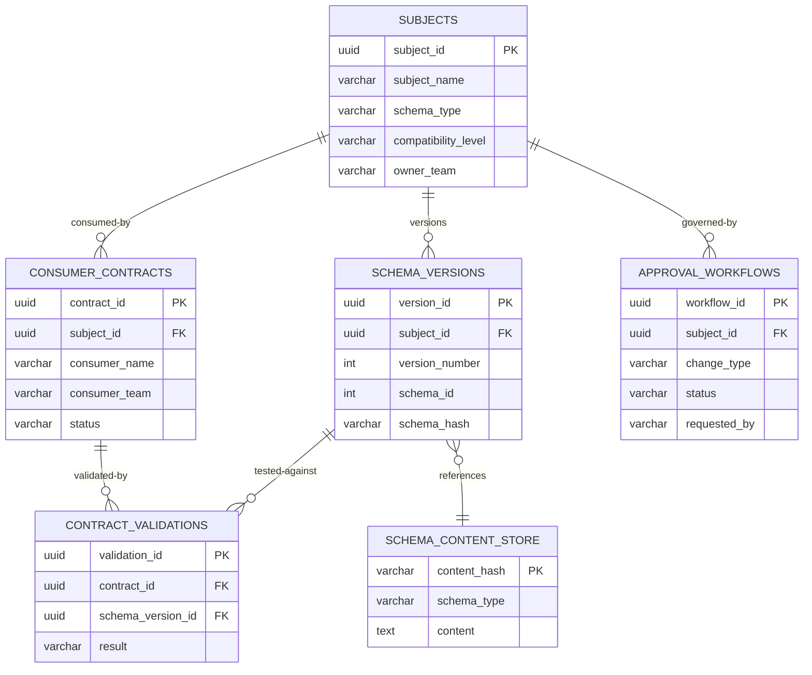
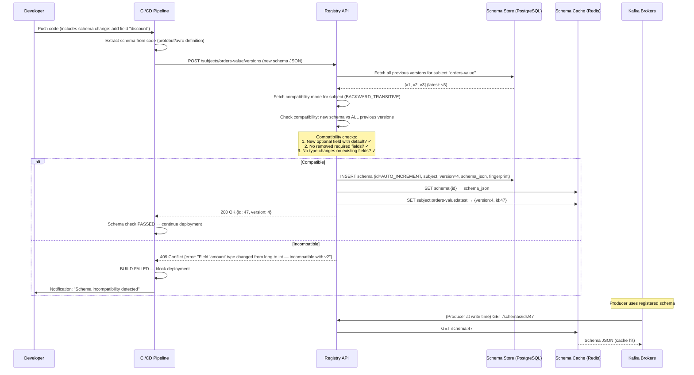
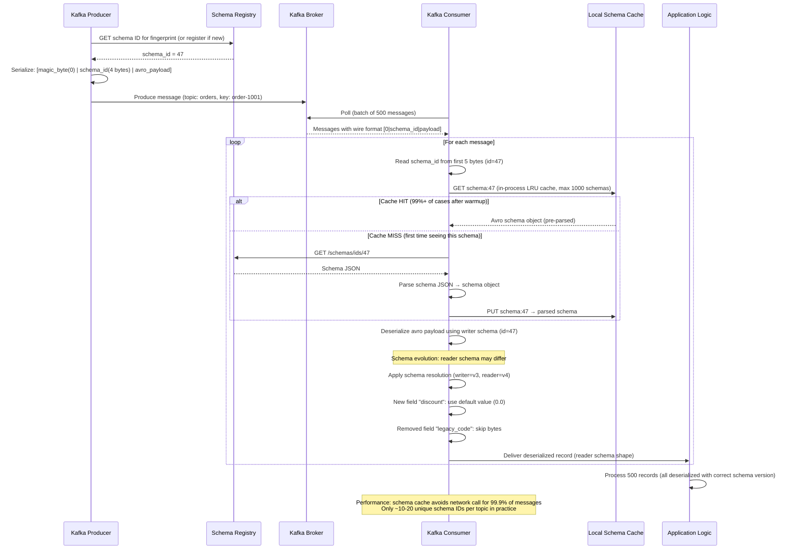

# Schema Registry & Contract Testing Platform

## 1. Functional Requirements

| # | Requirement | Details |
|---|-------------|---------|
| FR-1 | Schema Registration | Register schemas (Avro, Protobuf, JSON Schema) with versioning per subject |
| FR-2 | Compatibility Checking | Backward, forward, full, transitive compatibility validation |
| FR-3 | Schema Normalization & Fingerprinting | Canonical form + SHA-256 fingerprint for content-addressable dedup |
| FR-4 | Producer-Consumer Contract Validation | Consumers declare expected schema subsets; validate against producer changes |
| FR-5 | Breaking Change Detection | Identify incompatible changes with impact analysis across consumers |
| FR-6 | Governance Workflow | Approval-based registration for breaking changes with DRI sign-off |
| FR-7 | Integration with Kafka/gRPC/REST | Native serializer/deserializer SDKs; gRPC descriptor registry; OpenAPI schema |
| FR-8 | Dead Letter Routing | Automatic DLQ routing for deserialization failures with error metadata |
| FR-9 | Schema Evolution History | Full version history with diff visualization |
| FR-10 | Schema Search & Discovery | Full-text search across all schemas and their documentation |

## 2. Non-Functional Requirements

| Requirement | Target |
|-------------|--------|
| Availability | 99.99% |
| Schema Lookup Latency | < 5ms (cached), < 20ms (uncached) |
| Compatibility Check | < 50ms |
| Schema Scale | 100K+ schemas, 1M+ versions |
| Serialization Lookups | 1M+ lookups/sec |
| Registration Throughput | 1000 schemas/sec |
| SDK Cache Staleness | < 5 seconds |

## 3. Capacity Estimation

```
Schemas:
  - 100K subjects × avg 10 versions = 1M schema versions
  - Average schema size: 2 KB → 2 GB total schema storage
  - With dedup (content-addressable): ~500K unique schemas → 1 GB

Lookups:
  - 1M lookups/sec (schema ID → schema)
  - 99.5% cache hit in SDK → 5K actual registry calls/sec
  - Each lookup: ~2 KB response → 10 MB/sec bandwidth

Contracts:
  - 50K consumer contracts
  - Each contract: ~500 bytes → 25 MB
  - Validation runs: 1000/day (CI/CD pipelines)

Kafka Integration:
  - 10K topics × avg 100 producers × 500 consumers
  - Message throughput: 5M messages/sec requiring schema lookup
  - SDK cache handles 99.5% → 25K registry calls/sec peak

Storage:
  - PostgreSQL: 5 GB (schemas + metadata + contracts)
  - Redis cache: 2 GB (hot schemas)
  - Audit logs: 50 GB/year
```

## 4. Data Modeling

### Entity-Relationship Diagram



### 4.1 Subjects and Schema Versions

```sql
CREATE TABLE subjects (
    subject_id          UUID PRIMARY KEY DEFAULT gen_random_uuid(),
    subject_name        VARCHAR(500) NOT NULL UNIQUE,  -- "com.example.events.UserCreated-value"
    schema_type         VARCHAR(20) NOT NULL,          -- 'AVRO', 'PROTOBUF', 'JSON_SCHEMA'
    compatibility_level VARCHAR(30) NOT NULL DEFAULT 'BACKWARD',
    -- 'BACKWARD', 'FORWARD', 'FULL', 'BACKWARD_TRANSITIVE', 'FORWARD_TRANSITIVE', 'FULL_TRANSITIVE', 'NONE'
    description         TEXT,
    owner_team          VARCHAR(100),
    tags                JSONB DEFAULT '[]',
    governance_required BOOLEAN DEFAULT FALSE,
    deprecated          BOOLEAN DEFAULT FALSE,
    deprecated_at       TIMESTAMPTZ,
    created_at          TIMESTAMPTZ NOT NULL DEFAULT NOW(),
    updated_at          TIMESTAMPTZ NOT NULL DEFAULT NOW()
);

CREATE INDEX idx_subjects_name ON subjects(subject_name);
CREATE INDEX idx_subjects_team ON subjects(owner_team);
CREATE INDEX idx_subjects_type ON subjects(schema_type);
CREATE INDEX idx_subjects_tags ON subjects USING GIN(tags);

CREATE TABLE schema_versions (
    version_id          UUID PRIMARY KEY DEFAULT gen_random_uuid(),
    subject_id          UUID NOT NULL REFERENCES subjects(subject_id),
    version_number      INTEGER NOT NULL,
    schema_id           INTEGER NOT NULL UNIQUE,       -- global sequential ID (wire protocol)
    schema_content      TEXT NOT NULL,                 -- raw schema definition
    schema_hash         VARCHAR(64) NOT NULL,          -- SHA-256 of normalized schema
    fingerprint         VARCHAR(64) NOT NULL,          -- canonical fingerprint for dedup
    references          JSONB DEFAULT '[]',            -- schema references (imports)
    metadata            JSONB DEFAULT '{}',
    registered_by       VARCHAR(100) NOT NULL,
    status              VARCHAR(20) NOT NULL DEFAULT 'active',  -- 'active', 'deprecated', 'deleted'
    created_at          TIMESTAMPTZ NOT NULL DEFAULT NOW(),
    UNIQUE(subject_id, version_number)
);

CREATE INDEX idx_versions_subject ON schema_versions(subject_id, version_number DESC);
CREATE INDEX idx_versions_schema_id ON schema_versions(schema_id);
CREATE INDEX idx_versions_hash ON schema_versions(schema_hash);
CREATE INDEX idx_versions_fingerprint ON schema_versions(fingerprint);

-- Content-addressable schema storage (dedup)
CREATE TABLE schema_content_store (
    content_hash        VARCHAR(64) PRIMARY KEY,  -- SHA-256
    schema_type         VARCHAR(20) NOT NULL,
    content             TEXT NOT NULL,
    normalized_content  TEXT NOT NULL,
    parsed_fields       JSONB NOT NULL,           -- extracted field inventory
    created_at          TIMESTAMPTZ NOT NULL DEFAULT NOW()
);
```

### 4.2 Contracts

```sql
CREATE TABLE consumer_contracts (
    contract_id         UUID PRIMARY KEY DEFAULT gen_random_uuid(),
    consumer_name       VARCHAR(200) NOT NULL,        -- "order-service"
    consumer_team       VARCHAR(100) NOT NULL,
    subject_id          UUID NOT NULL REFERENCES subjects(subject_id),
    contract_schema     TEXT NOT NULL,                 -- schema subset consumer expects
    required_fields     JSONB NOT NULL,               -- ["user_id", "email", "event_type"]
    optional_fields     JSONB DEFAULT '[]',
    field_constraints   JSONB DEFAULT '{}',           -- {"user_id": {"type": "string", "format": "uuid"}}
    status              VARCHAR(20) NOT NULL DEFAULT 'active',
    environment         VARCHAR(20) DEFAULT 'production',
    notification_config JSONB NOT NULL,               -- how to notify on breaking changes
    created_at          TIMESTAMPTZ NOT NULL DEFAULT NOW(),
    updated_at          TIMESTAMPTZ NOT NULL DEFAULT NOW()
);

CREATE INDEX idx_contracts_subject ON consumer_contracts(subject_id, status);
CREATE INDEX idx_contracts_consumer ON consumer_contracts(consumer_name);
CREATE INDEX idx_contracts_team ON consumer_contracts(consumer_team);

CREATE TABLE contract_validations (
    validation_id       UUID PRIMARY KEY DEFAULT gen_random_uuid(),
    contract_id         UUID NOT NULL REFERENCES consumer_contracts(contract_id),
    schema_version_id   UUID NOT NULL REFERENCES schema_versions(version_id),
    result              VARCHAR(20) NOT NULL,  -- 'compatible', 'breaking', 'warning'
    breaking_changes    JSONB DEFAULT '[]',    -- list of incompatible changes
    warnings            JSONB DEFAULT '[]',
    validated_at        TIMESTAMPTZ NOT NULL DEFAULT NOW()
);

CREATE INDEX idx_validations_contract ON contract_validations(contract_id, validated_at DESC);
CREATE INDEX idx_validations_version ON contract_validations(schema_version_id);
```

### 4.3 Governance Workflows

```sql
CREATE TABLE approval_workflows (
    workflow_id         UUID PRIMARY KEY DEFAULT gen_random_uuid(),
    subject_id          UUID NOT NULL REFERENCES subjects(subject_id),
    proposed_schema     TEXT NOT NULL,
    proposed_version    INTEGER NOT NULL,
    change_type         VARCHAR(30) NOT NULL,  -- 'backward_compatible', 'breaking', 'new_field'
    breaking_changes    JSONB DEFAULT '[]',
    impacted_consumers  JSONB DEFAULT '[]',
    requested_by        VARCHAR(100) NOT NULL,
    status              VARCHAR(20) NOT NULL DEFAULT 'pending',  -- 'pending', 'approved', 'rejected', 'expired'
    approvers_required  JSONB NOT NULL,
    approvals_received  JSONB DEFAULT '[]',
    rejection_reason    TEXT,
    expires_at          TIMESTAMPTZ NOT NULL,
    created_at          TIMESTAMPTZ NOT NULL DEFAULT NOW(),
    resolved_at         TIMESTAMPTZ
);

CREATE INDEX idx_workflow_subject ON approval_workflows(subject_id, status);
CREATE INDEX idx_workflow_status ON approval_workflows(status, expires_at);
CREATE INDEX idx_workflow_requester ON approval_workflows(requested_by, created_at DESC);
```

## 5. High-Level Design (HLD)

```
┌─────────────────────────────────────────────────────────────────────────────────────────┐
│                      SCHEMA REGISTRY & CONTRACT TESTING PLATFORM                         │
├─────────────────────────────────────────────────────────────────────────────────────────┤
│                                                                                         │
│  PRODUCER SIDE                           CONSUMER SIDE                                  │
│  ┌──────────────┐                        ┌──────────────┐                              │
│  │  Producer    │                        │  Consumer    │                              │
│  │  Application │                        │  Application │                              │
│  └──────┬───────┘                        └──────┬───────┘                              │
│         │                                       │                                       │
│  ┌──────▼───────┐                        ┌──────▼───────┐                              │
│  │  Serializer  │                        │ Deserializer │                              │
│  │  SDK         │                        │  SDK         │                              │
│  │ ┌─────────┐  │                        │ ┌─────────┐  │                              │
│  │ │Local    │  │                        │ │Local    │  │                              │
│  │ │Schema   │  │                        │ │Schema   │  │                              │
│  │ │Cache    │  │                        │ │Cache    │  │                              │
│  │ └────┬────┘  │                        │ └────┬────┘  │                              │
│  └──────┼───────┘                        └──────┼───────┘                              │
│         │  cache miss                           │  cache miss                           │
│         │                                       │                                       │
│  ┌──────▼───────────────────────────────────────▼──────────────────────────────────┐   │
│  │                         SCHEMA REGISTRY API CLUSTER                              │   │
│  │                    (3+ nodes, load-balanced, stateless)                          │   │
│  │                                                                                  │   │
│  │  ┌────────────────┐  ┌──────────────────┐  ┌─────────────────────────────────┐  │   │
│  │  │  Registration  │  │  Compatibility   │  │  Contract Validation            │  │   │
│  │  │  Service       │  │  Checker         │  │  Engine                         │  │   │
│  │  └───────┬────────┘  └────────┬─────────┘  └────────────┬────────────────────┘  │   │
│  │          │                    │                          │                        │   │
│  │  ┌───────▼────────────────────▼──────────────────────────▼────────────────────┐  │   │
│  │  │                         REDIS CACHE                                         │  │   │
│  │  │         schema_id → schema │ subject → latest_version                      │  │   │
│  │  └───────────────────────────────────────────────────────────────┬────────────┘  │   │
│  │                                                                   │              │   │
│  │  ┌───────────────────────────────────────────────────────────────▼────────────┐  │   │
│  │  │                      POSTGRESQL (Primary Store)                             │  │   │
│  │  │     subjects │ schema_versions │ contracts │ workflows │ audit             │  │   │
│  │  └────────────────────────────────────────────────────────────────────────────┘  │   │
│  └─────────────────────────────────────────────────────────────────────────────────┘   │
│                                    │                                                    │
│  ┌─────────────────────────────────▼───────────────────────────────────────────────┐   │
│  │                         KAFKA (Change Notifications)                             │   │
│  │  Topics: _schemas (internal) │ schema.changes │ contract.violations             │   │
│  └─────────────────────────────────────────────────────────────────────────────────┘   │
│                                    │                                                    │
│  ┌─────────────────────────────────▼───────────────────────────────────────────────┐   │
│  │                         CI/CD INTEGRATION                                        │   │
│  │  ┌──────────────┐  ┌──────────────┐  ┌──────────────┐  ┌──────────────────┐    │   │
│  │  │  Contract    │  │  Schema      │  │  Breaking    │  │  Governance      │    │   │
│  │  │  Test Runner │  │  Linter      │  │  Change Gate │  │  Approval Bot    │    │   │
│  │  └──────────────┘  └──────────────┘  └──────────────┘  └──────────────────┘    │   │
│  └─────────────────────────────────────────────────────────────────────────────────┘   │
└─────────────────────────────────────────────────────────────────────────────────────────┘
```

## 6. Low-Level Design (LLD) – APIs

### 6.1 Schema Registration

```
POST /subjects/{subject}/versions
Request:
{
    "schema": "{\"type\":\"record\",\"name\":\"UserCreated\",\"namespace\":\"com.example.events\",\"fields\":[{\"name\":\"user_id\",\"type\":\"string\"},{\"name\":\"email\",\"type\":\"string\"},{\"name\":\"created_at\",\"type\":{\"type\":\"long\",\"logicalType\":\"timestamp-millis\"}},{\"name\":\"source\",\"type\":[\"null\",\"string\"],\"default\":null}]}",
    "schemaType": "AVRO",
    "references": [],
    "metadata": {
        "owner": "user-service-team",
        "description": "Emitted when a new user registers"
    }
}
Response (200):
{
    "id": 42,                    // global schema ID (used in wire protocol)
    "version": 3,
    "schema_hash": "sha256:a1b2c3d4...",
    "fingerprint": "sha256:e5f6g7h8...",
    "compatibility": "BACKWARD_COMPATIBLE",
    "subject": "com.example.events.UserCreated-value"
}

// If incompatible:
Response (409):
{
    "error_code": 409,
    "message": "Schema is not backward compatible",
    "incompatibilities": [
        {
            "type": "FIELD_REMOVED",
            "field": "email",
            "message": "Removing field 'email' without default breaks backward compatibility",
            "severity": "ERROR"
        }
    ]
}
```

### 6.2 Compatibility Check

```
POST /compatibility/subjects/{subject}/versions/latest
Request:
{
    "schema": "{...new schema...}",
    "schemaType": "AVRO"
}
Response (200):
{
    "is_compatible": true,
    "compatibility_level": "BACKWARD_TRANSITIVE",
    "checked_against_versions": [1, 2, 3],
    "details": [
        {"version": 3, "compatible": true, "changes": [
            {"type": "FIELD_ADDED", "field": "phone", "has_default": true, "severity": "INFO"}
        ]}
    ]
}
```

### 6.3 Schema Lookup (Wire Protocol)

```
GET /schemas/ids/42
Response (200):
{
    "schema": "{\"type\":\"record\",...}",
    "schemaType": "AVRO",
    "references": [],
    "subject": "com.example.events.UserCreated-value",
    "version": 3
}
```

### 6.4 Contract Registration

```
POST /contracts
Request:
{
    "consumer_name": "order-service",
    "consumer_team": "order-team",
    "subject": "com.example.events.UserCreated-value",
    "required_fields": ["user_id", "email", "created_at"],
    "optional_fields": ["source"],
    "field_constraints": {
        "user_id": {"type": "string", "format": "uuid"},
        "email": {"type": "string", "format": "email"}
    },
    "notification_config": {
        "slack_channel": "#order-team-alerts",
        "email": "order-team@example.com",
        "block_ci": true
    }
}
Response (201):
{
    "contract_id": "contract-uuid-123",
    "status": "active",
    "current_compatibility": "compatible",
    "validated_against_version": 3
}
```

### 6.5 Contract Validation (CI/CD)

```
POST /contracts/validate
Request:
{
    "subject": "com.example.events.UserCreated-value",
    "proposed_schema": "{...}",
    "check_all_contracts": true
}
Response (200):
{
    "result": "breaking",
    "contracts_checked": 5,
    "compatible": 3,
    "breaking": 2,
    "details": [
        {
            "contract_id": "contract-uuid-123",
            "consumer": "order-service",
            "result": "breaking",
            "issues": [
                {
                    "field": "email",
                    "issue": "REQUIRED_FIELD_REMOVED",
                    "message": "Consumer requires 'email' but proposed schema removes it"
                }
            ]
        },
        {
            "contract_id": "contract-uuid-456",
            "consumer": "notification-service",
            "result": "breaking",
            "issues": [
                {
                    "field": "email",
                    "issue": "REQUIRED_FIELD_REMOVED",
                    "message": "Consumer requires 'email' for notification routing"
                }
            ]
        }
    ],
    "recommendation": "Coordinate with order-service and notification-service before removing 'email' field"
}
```

## 7. Deep Dives

### 7.1 Compatibility Algorithm Implementation

```python
class CompatibilityChecker:
    """Schema compatibility validation engine"""
    
    PROMOTION_RULES = {
        # Avro type promotions (safe widening)
        "int": {"long", "float", "double"},
        "long": {"float", "double"},
        "float": {"double"},
        "string": {"bytes"},  # Avro allows string↔bytes
        "bytes": {"string"},
    }
    
    def check_backward_compatibility(self, new_schema, old_schema) -> CompatResult:
        """
        BACKWARD: new schema can read data written by old schema
        Rules:
        - New field MUST have default (old data won't have it)
        - Removed field: OK (new reader ignores it)
        - Type change: only safe promotions allowed
        """
        issues = []
        
        old_fields = {f["name"]: f for f in old_schema["fields"]}
        new_fields = {f["name"]: f for f in new_schema["fields"]}
        
        # Check added fields (must have defaults)
        for name, field in new_fields.items():
            if name not in old_fields:
                if "default" not in field:
                    issues.append(IncompatibleChange(
                        type="FIELD_ADDED_NO_DEFAULT",
                        field=name,
                        severity="ERROR",
                        message=f"New field '{name}' has no default; old data can't be read"
                    ))
        
        # Check type changes
        for name in set(old_fields) & set(new_fields):
            old_type = self._resolve_type(old_fields[name]["type"])
            new_type = self._resolve_type(new_fields[name]["type"])
            
            if old_type != new_type:
                if not self._is_promotable(old_type, new_type):
                    issues.append(IncompatibleChange(
                        type="TYPE_CHANGE_INCOMPATIBLE",
                        field=name,
                        severity="ERROR",
                        message=f"Type changed from {old_type} to {new_type}; not a safe promotion"
                    ))
        
        # Check union evolution
        for name in set(old_fields) & set(new_fields):
            old_union = self._get_union_types(old_fields[name]["type"])
            new_union = self._get_union_types(new_fields[name]["type"])
            if old_union and new_union:
                # All old union types must be in new union (for backward compat)
                removed = old_union - new_union
                if removed:
                    issues.append(IncompatibleChange(
                        type="UNION_TYPE_REMOVED",
                        field=name,
                        severity="ERROR",
                        message=f"Union types removed: {removed}; old data with these types can't be read"
                    ))
        
        return CompatResult(
            compatible=len([i for i in issues if i.severity == "ERROR"]) == 0,
            issues=issues
        )
    
    def check_forward_compatibility(self, new_schema, old_schema) -> CompatResult:
        """
        FORWARD: old schema can read data written by new schema
        Rules:
        - Removed field MUST have had default (old reader needs default for missing field)
        - New field: OK (old reader ignores unknown fields)
        - Type change: reverse promotion rules
        """
        # Forward compat = backward compat checked in reverse
        return self.check_backward_compatibility(old_schema, new_schema)
    
    def check_full_compatibility(self, new_schema, old_schema) -> CompatResult:
        """FULL: both backward AND forward compatible"""
        backward = self.check_backward_compatibility(new_schema, old_schema)
        forward = self.check_forward_compatibility(new_schema, old_schema)
        
        return CompatResult(
            compatible=backward.compatible and forward.compatible,
            issues=backward.issues + forward.issues
        )
    
    def check_transitive(self, new_schema, all_previous_schemas, compat_type) -> CompatResult:
        """TRANSITIVE: compatible with ALL previous versions, not just latest"""
        all_issues = []
        for old_schema in all_previous_schemas:
            if compat_type == "BACKWARD_TRANSITIVE":
                result = self.check_backward_compatibility(new_schema, old_schema)
            elif compat_type == "FORWARD_TRANSITIVE":
                result = self.check_forward_compatibility(new_schema, old_schema)
            else:
                result = self.check_full_compatibility(new_schema, old_schema)
            all_issues.extend(result.issues)
        
        return CompatResult(
            compatible=len([i for i in all_issues if i.severity == "ERROR"]) == 0,
            issues=all_issues
        )
    
    def check_protobuf_compatibility(self, new_desc, old_desc) -> CompatResult:
        """Protobuf-specific rules"""
        issues = []
        
        # Field number reuse is ALWAYS breaking
        old_numbers = {f.number: f for f in old_desc.fields}
        new_numbers = {f.number: f for f in new_desc.fields}
        
        for num in set(old_numbers) & set(new_numbers):
            if old_numbers[num].name != new_numbers[num].name:
                issues.append(IncompatibleChange(
                    type="FIELD_NUMBER_REUSED",
                    field=f"#{num}",
                    severity="ERROR",
                    message=f"Field number {num} changed name: {old_numbers[num].name} → {new_numbers[num].name}"
                ))
            if old_numbers[num].type != new_numbers[num].type:
                if not self._proto_type_compatible(old_numbers[num].type, new_numbers[num].type):
                    issues.append(IncompatibleChange(
                        type="FIELD_TYPE_CHANGED",
                        field=f"#{num} ({new_numbers[num].name})",
                        severity="ERROR"
                    ))
        
        # Reserved field numbers
        for num in set(old_numbers) - set(new_numbers):
            if num not in new_desc.reserved_numbers:
                issues.append(IncompatibleChange(
                    type="REMOVED_FIELD_NOT_RESERVED",
                    field=f"#{num} ({old_numbers[num].name})",
                    severity="WARNING",
                    message="Removed fields should be reserved to prevent reuse"
                ))
        
        return CompatResult(compatible=len([i for i in issues if i.severity == "ERROR"]) == 0, issues=issues)
    
    def _is_promotable(self, from_type: str, to_type: str) -> bool:
        return to_type in self.PROMOTION_RULES.get(from_type, set())
```

### 7.2 Consumer-Driven Contract Testing

```python
class ContractTestEngine:
    """Validates producer schema changes against consumer contracts"""
    
    def validate_all_contracts(self, subject_id: str, proposed_schema: dict) -> ContractReport:
        contracts = self.db.get_active_contracts(subject_id)
        results = []
        
        for contract in contracts:
            result = self._validate_contract(contract, proposed_schema)
            results.append(result)
            
            if result.status == "breaking":
                # Notify contract owner immediately
                self._notify_breaking_change(contract, result)
        
        return ContractReport(
            total_contracts=len(contracts),
            compatible=len([r for r in results if r.status == "compatible"]),
            breaking=len([r for r in results if r.status == "breaking"]),
            details=results
        )
    
    def _validate_contract(self, contract, proposed_schema) -> ContractResult:
        issues = []
        proposed_fields = {f["name"]: f for f in proposed_schema.get("fields", [])}
        
        # Check required fields exist
        for field_name in contract.required_fields:
            if field_name not in proposed_fields:
                issues.append({
                    "field": field_name,
                    "issue": "REQUIRED_FIELD_MISSING",
                    "severity": "ERROR"
                })
            else:
                # Check type constraints
                if field_name in contract.field_constraints:
                    constraint = contract.field_constraints[field_name]
                    actual_type = self._resolve_type(proposed_fields[field_name]["type"])
                    if constraint.get("type") and actual_type != constraint["type"]:
                        issues.append({
                            "field": field_name,
                            "issue": "TYPE_MISMATCH",
                            "expected": constraint["type"],
                            "actual": actual_type,
                            "severity": "ERROR"
                        })
        
        # Check optional fields (warn if removed)
        for field_name in contract.optional_fields:
            if field_name not in proposed_fields:
                issues.append({
                    "field": field_name,
                    "issue": "OPTIONAL_FIELD_REMOVED",
                    "severity": "WARNING"
                })
        
        status = "breaking" if any(i["severity"] == "ERROR" for i in issues) else "compatible"
        return ContractResult(contract_id=contract.contract_id, consumer=contract.consumer_name, status=status, issues=issues)
    
    def impact_analysis(self, subject_id: str, field_name: str) -> ImpactReport:
        """What breaks if we remove field X?"""
        contracts = self.db.get_active_contracts(subject_id)
        
        impacted = []
        for contract in contracts:
            if field_name in contract.required_fields:
                impacted.append({
                    "consumer": contract.consumer_name,
                    "team": contract.consumer_team,
                    "impact": "BREAKING",
                    "reason": f"Field '{field_name}' is required by this consumer"
                })
            elif field_name in contract.optional_fields:
                impacted.append({
                    "consumer": contract.consumer_name,
                    "team": contract.consumer_team,
                    "impact": "DEGRADED",
                    "reason": f"Field '{field_name}' is optional but used"
                })
        
        return ImpactReport(
            field=field_name,
            total_consumers=len(contracts),
            impacted_consumers=len(impacted),
            details=impacted
        )

# CI/CD Integration (GitHub Action / GitLab CI)
"""
# .github/workflows/schema-check.yml
name: Schema Compatibility Check
on: [pull_request]
jobs:
  schema-check:
    runs-on: ubuntu-latest
    steps:
      - uses: actions/checkout@v4
      - name: Check Schema Compatibility
        run: |
          schema-registry-cli check \
            --subject ${{ env.SUBJECT }} \
            --schema-file ./schemas/user-created.avsc \
            --registry-url ${{ secrets.REGISTRY_URL }} \
            --check-contracts \
            --fail-on-breaking
"""
```

### 7.3 Integration with Kafka Streaming

```
┌─────────────────────────────────────────────────────────────────────┐
│              KAFKA WIRE PROTOCOL WITH SCHEMA REGISTRY                │
├─────────────────────────────────────────────────────────────────────┤
│                                                                     │
│  MESSAGE FORMAT (Confluent wire format):                           │
│  ┌────────┬──────────────┬──────────────────────────────────────┐  │
│  │ Magic  │  Schema ID   │           Payload                    │  │
│  │ Byte   │  (4 bytes)   │      (Avro/Protobuf/JSON)           │  │
│  │ 0x00   │  big-endian  │      serialized with schema         │  │
│  │(1 byte)│  uint32      │                                     │  │
│  └────────┴──────────────┴──────────────────────────────────────┘  │
│  │← 1B  →│←   4 bytes  →│←  variable length                  →│  │
│                                                                     │
│  SERIALIZATION FLOW:                                               │
│  ┌──────────┐    ┌──────────────┐    ┌──────────────────────┐     │
│  │ Producer │───▶│ Serializer   │───▶│ Kafka Broker         │     │
│  │ record   │    │ 1.Register   │    │ (stores raw bytes)   │     │
│  │          │    │   schema     │    │                      │     │
│  │          │    │ 2.Get ID     │    │                      │     │
│  │          │    │ 3.Prefix msg │    │                      │     │
│  │          │    │   with ID    │    │                      │     │
│  └──────────┘    └──────────────┘    └──────────────────────┘     │
│                                                                     │
│  DESERIALIZATION FLOW:                                             │
│  ┌──────────────────────┐    ┌──────────────┐    ┌──────────┐    │
│  │ Kafka Broker         │───▶│ Deserializer │───▶│ Consumer │    │
│  │ (raw bytes)          │    │ 1.Read magic │    │ record   │    │
│  │                      │    │ 2.Extract ID │    │          │    │
│  │                      │    │ 3.Fetch      │    │          │    │
│  │                      │    │   schema     │    │          │    │
│  │                      │    │ 4.Deserialize│    │          │    │
│  └──────────────────────┘    └──────────────┘    └──────────┘    │
│                                                                     │
│  DEAD LETTER ROUTING (on schema mismatch):                         │
│  ┌──────────────────────────────────────────────────────────────┐  │
│  │  if deserialization fails:                                    │  │
│  │    → Route message to DLQ topic: {topic}.dead-letter         │  │
│  │    → Include error headers:                                   │  │
│  │      x-error-type: SCHEMA_MISMATCH                           │  │
│  │      x-schema-id: 42                                         │  │
│  │      x-expected-schema-id: 38                                │  │
│  │      x-error-message: "Field 'email' type mismatch"         │  │
│  │      x-original-topic: user-events                           │  │
│  │      x-original-partition: 7                                 │  │
│  │      x-original-offset: 1234567                              │  │
│  │    → Emit metric: schema_deserialization_failures_total       │  │
│  └──────────────────────────────────────────────────────────────┘  │
└─────────────────────────────────────────────────────────────────────┘
```

```python
class SchemaAwareDeserializer:
    MAGIC_BYTE = 0x00
    
    def __init__(self, registry_client, local_cache_size=1000):
        self.registry = registry_client
        self.cache = LRUCache(maxsize=local_cache_size)  # schema_id → parsed schema
    
    def deserialize(self, topic: str, data: bytes) -> tuple:
        """Deserialize message with schema registry lookup"""
        if data is None:
            return None
        
        if data[0] != self.MAGIC_BYTE:
            raise SerializationError("Invalid magic byte")
        
        # Extract schema ID (bytes 1-4, big-endian)
        schema_id = struct.unpack('>I', data[1:5])[0]
        payload = data[5:]
        
        # Get schema (from cache or registry)
        schema = self._get_schema(schema_id)
        
        try:
            # Deserialize payload using schema
            if schema.schema_type == "AVRO":
                reader = DatumReader(schema.parsed)
                decoder = BinaryDecoder(io.BytesIO(payload))
                return reader.read(decoder)
            elif schema.schema_type == "PROTOBUF":
                msg_class = schema.get_message_class()
                return msg_class.FromString(payload)
            elif schema.schema_type == "JSON_SCHEMA":
                return json.loads(payload)
        except Exception as e:
            # Route to dead letter topic
            self._route_to_dlq(topic, data, schema_id, str(e))
            raise
    
    def _get_schema(self, schema_id: int):
        if schema_id in self.cache:
            return self.cache[schema_id]
        
        schema = self.registry.get_schema_by_id(schema_id)
        self.cache[schema_id] = schema
        return schema
    
    def _route_to_dlq(self, topic: str, raw_data: bytes, schema_id: int, error: str):
        dlq_topic = f"{topic}.dead-letter"
        headers = [
            ("x-error-type", b"SCHEMA_MISMATCH"),
            ("x-schema-id", str(schema_id).encode()),
            ("x-error-message", error.encode()),
            ("x-original-topic", topic.encode()),
            ("x-timestamp", str(int(time.time())).encode()),
        ]
        self.dlq_producer.send(dlq_topic, value=raw_data, headers=headers)
        metrics.increment("schema_deserialization_failures_total", tags={"topic": topic})
```

## 8. Component Optimization

### Redis Cache Strategy

```yaml
redis:
  cluster: true
  nodes: 3 primary + 3 replica
  memory: 8GB per node
  
  caching_strategy:
    # Hot path: schema ID lookups (1M/sec)
    schema_by_id:
      key: "schema:{id}"
      value: "serialized schema JSON"
      ttl: 3600  # 1 hour (schemas are immutable once registered)
      # Immutable content = infinite logical TTL, TTL just for memory management
    
    # Subject → latest version mapping
    subject_latest:
      key: "subject:{name}:latest"
      value: "{version_number}:{schema_id}"
      ttl: 60  # 1 minute (can change on new registration)
    
    # Compatibility cache
    compat_result:
      key: "compat:{subject}:{hash_new}:{hash_old}"
      value: "compatible|incompatible"
      ttl: 86400  # 24h (deterministic result for same inputs)
  
  invalidation:
    # On new schema registration:
    - delete "subject:{name}:latest"
    - publish to "schema.changes" channel
    # Schema by ID never invalidated (immutable)
```

### PostgreSQL Optimization

```yaml
postgresql:
  version: 15
  instances: primary + 2 read replicas
  
  # Read replicas handle all GET requests (schema lookups)
  # Primary handles writes (registrations, contracts)
  
  connection_pool:
    min: 20
    max: 100
    idle_timeout: 300s
  
  # Content-addressable dedup saves ~50% storage
  # Same schema content registered under different subjects → stored once
  
  indexes:
    # schema_id lookups (most critical): B-tree on sequential ID
    # fingerprint lookups (dedup check): hash index
    # subject + version (range scan for transitive compat): composite B-tree
  
  partitioning:
    # contract_validations: range partition by validated_at (monthly)
    # Keeps recent validations fast, archives old ones
```

### Kafka Configuration

```yaml
kafka:
  topics:
    _schemas:
      # Internal compacted topic (source of truth for HA)
      partitions: 1  # single partition for ordering
      replication: 3
      cleanup_policy: compact
      # Used for leader election and schema replication across nodes
    
    schema_changes:
      partitions: 8
      replication: 3
      retention: 7d
      # Notifications to consumers about new schemas
    
    contract_violations:
      partitions: 4
      replication: 3
      retention: 30d
      # Alerts for breaking changes detected in CI
```

## 9. Observability

### Metrics

```yaml
metrics:
  registry:
    - schema_registrations_total{subject, schema_type, result}
    - schema_lookups_total{cache_hit}
    - schema_lookup_latency_ms{cache_hit}
    - compatibility_checks_total{level, result}
    - compatibility_check_latency_ms{level}
    - schemas_total{type, status}
    - subjects_total
  
  contracts:
    - contract_validations_total{result}
    - contracts_active_total{team}
    - breaking_changes_detected_total{subject}
    - contract_notification_sent_total{channel}
  
  kafka_integration:
    - serialization_latency_ms{schema_type}
    - deserialization_failures_total{topic, error_type}
    - dlq_messages_total{topic}
    - sdk_cache_hit_ratio{service}
  
  governance:
    - approval_workflows_total{status}
    - approval_time_hours{team}

alerts:
  - name: HighDeserializationFailures
    condition: rate(deserialization_failures_total[5m]) > 100
    severity: critical
  
  - name: RegistryLatencyHigh
    condition: schema_lookup_latency_ms{p99} > 50
    severity: warning
  
  - name: CacheHitRatioLow
    condition: sdk_cache_hit_ratio < 0.95
    severity: warning
  
  - name: BreakingChangeDeployed
    condition: breaking_changes_detected_total increase > 0
    severity: warning
```

### Distributed Tracing

```
Schema Registration Trace:
  API Request → Normalize Schema → Compute Fingerprint → Check Dedup
  → Compatibility Check (against N versions) → Store in PostgreSQL
  → Invalidate Redis Cache → Publish to Kafka → Return Schema ID

Deserialization Trace (per message):
  Read Message → Extract Magic Byte → Extract Schema ID
  → Cache Lookup (hit: 0.1ms / miss: → Registry API: 5ms)
  → Deserialize Payload → Return Record
  (failure path: → DLQ Routing → Metric Emit → Error Log)
```

## 10. Failure Analysis & Considerations

### Failure Scenarios

| Scenario | Impact | Mitigation |
|----------|--------|------------|
| Registry unavailable | SDK uses local cache; new schemas can't register | Multi-node HA; SDK caches all used schemas locally |
| Redis cache failure | Increased load on PostgreSQL | Read replicas handle load; SDK local cache |
| Incompatible schema deployed | Consumer deserialization failures | CI gate blocks merges; DLQ captures failures |
| Schema ID exhaustion | Can't register new schemas | 32-bit ID space (4B schemas); monitor usage |
| PostgreSQL primary failure | Write unavailable (read OK via replicas) | Automatic failover; Kafka _schemas topic as backup |
| Kafka internal topic corruption | Registry cluster loses sync | Rebuild from PostgreSQL (source of truth) |

### Considerations

1. **Schema ID Stability**: Once assigned, a schema ID is immutable and eternal — never reuse IDs
2. **Avro vs Protobuf Differences**: Protobuf uses field numbers (can't rename safely); Avro uses field names (can't reorder)
3. **JSON Schema Limitations**: No efficient binary serialization; compatibility checking more complex (oneOf, anyOf)
4. **Multi-Cluster**: Schema IDs must be globally unique across Kafka clusters for cross-cluster replication
5. **Schema References**: Nested schemas (imports) require dependency resolution and transitive compatibility
6. **Performance at Scale**: Transitive compatibility against 1000 versions requires optimization (diff caching)
7. **Migration Path**: Moving from schema-less to schema-enforced requires gradual rollout with `NONE` compatibility initially
8. **Dead Letter Handling**: DLQ messages need a replay mechanism once schema issues are resolved
9. **Governance Balance**: Too strict → blocks deployments; too loose → runtime failures. Team-configurable.
10. **SDK Versioning**: Registry API must be backward compatible itself; SDK versions in the wild can't be force-upgraded

## 11. References

- Confluent Schema Registry (Apache 2.0)
- Apache Avro Specification 1.11
- Protocol Buffers Language Guide
- Pact (consumer-driven contract testing)
- RFC 7386 (JSON Merge Patch for schema diffs)

---

## 12. Sequence Diagrams

### Diagram 1: Schema Registration + Compatibility Check



### Diagram 2: Consumer Deserialization with Cache



