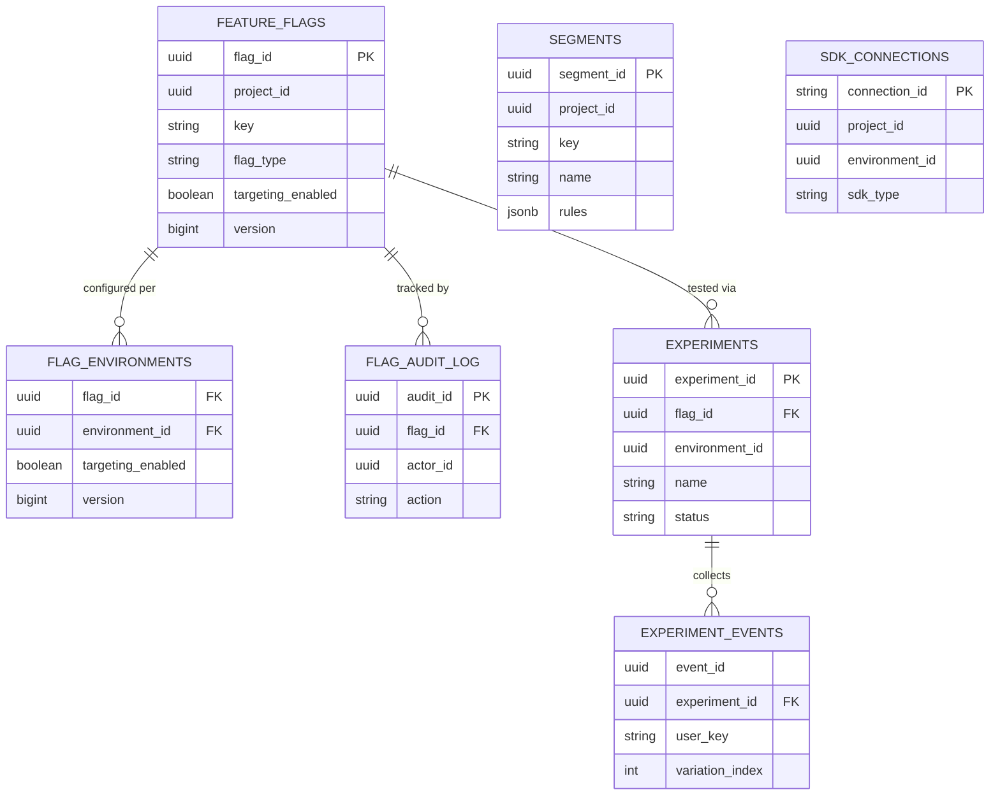
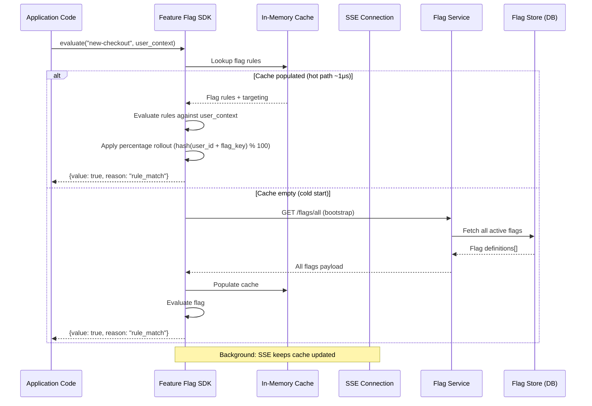
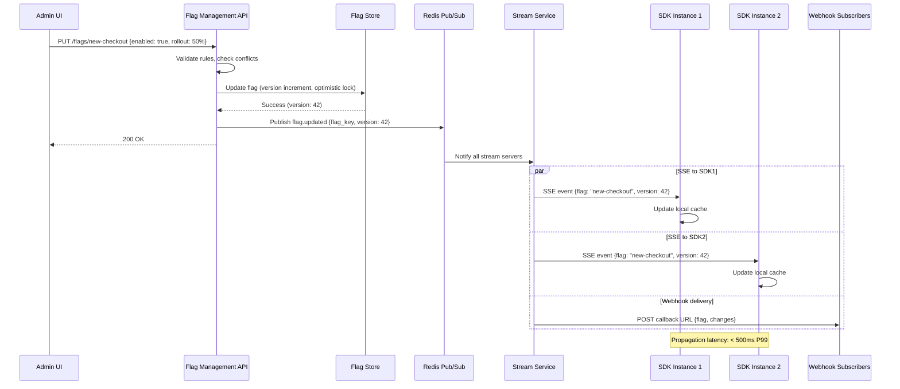

# Feature Flag Platform

## 1. Requirements

### Functional Requirements
- **Flag Management**: Create, update, archive flags with targeting rules
- **Percentage Rollouts**: Gradual rollout to X% of users with deterministic bucketing
- **User Segmentation**: Define segments (beta users, enterprise, geo) for targeting
- **Kill Switch**: Instant flag disable propagating globally in <1 second
- **Flag Dependencies**: Prerequisite flags (flag B requires flag A to be on)
- **Scheduled Activations**: Time-based flag state changes (launch at midnight)
- **A/B Testing Integration**: Flag as experiment treatment, statistical analysis
- **Audit Trail**: Complete history of flag changes with blame
- **SDKs**: Server-side (Go, Java, Python, Node) and client-side (JS, React, iOS, Android)
- **Real-Time Updates**: Instant flag change propagation to all SDKs

### Non-Functional Requirements
- **Availability**: 99.99% (SDK must function offline via cached flags)
- **Latency**: Local evaluation <1ms, flag sync <500ms globally
- **Scale**: 10K flags, 100M evaluations/minute, 50K connected SDKs
- **Consistency**: Eventual consistency OK (bounded staleness <2s)
- **Fault Tolerance**: SDKs work offline with last known state

## 2. Capacity Estimation

### Traffic
- Flag evaluations: 100M/minute = 1.67M QPS (mostly local, not network)
- Flag sync requests: 50K SDKs × 1 update/30s = 1,700 QPS (SSE connections)
- Management API: 10K flag changes/day
- Streaming connections: 50K concurrent SSE/WebSocket

### Storage
- Flag configurations: 10K flags × 10KB avg = 100MB
- Segment definitions: 5K segments × 5KB = 25MB
- Audit log: 10K changes/day × 2KB = 20MB/day
- Experiment data: 1B events/day × 100 bytes = 100GB/day

### Compute
- Flag evaluation (server-side): Done locally in SDK (no server compute)
- SSE fan-out: 50K connections × minimal memory = ~5GB RAM
- Experiment aggregation: 1B events/day batch processing

## 3. Data Modeling

### Entity-Relationship Diagram



### Database Schemas

```sql
-- Feature Flags
CREATE TABLE feature_flags (
    flag_id             UUID PRIMARY KEY DEFAULT gen_random_uuid(),
    project_id          UUID NOT NULL,
    key                 VARCHAR(255) NOT NULL,       -- Flag identifier (e.g., "new-checkout")
    name                VARCHAR(255) NOT NULL,
    description         TEXT,
    flag_type           VARCHAR(20) NOT NULL DEFAULT 'BOOLEAN',  -- BOOLEAN, MULTIVARIATE, JSON
    variations          JSONB NOT NULL,              -- Array of possible values
    default_variation   INT NOT NULL DEFAULT 0,     -- Index into variations (off state)
    targeting_enabled   BOOLEAN DEFAULT false,       -- Master toggle
    targeting_rules     JSONB DEFAULT '[]',          -- Ordered targeting rules
    fallthrough         JSONB NOT NULL,              -- Default when targeting on but no rule matches
    off_variation       INT NOT NULL DEFAULT 0,      -- Variation served when flag off
    prerequisites       JSONB DEFAULT '[]',          -- Prerequisite flags
    scheduled_changes   JSONB DEFAULT '[]',          -- Future state changes
    tags                TEXT[] DEFAULT '{}',
    maintainer_id       UUID,
    environments        JSONB NOT NULL DEFAULT '{"production": {}, "staging": {}, "development": {}}',
    is_archived         BOOLEAN DEFAULT false,
    version             BIGINT NOT NULL DEFAULT 1,
    created_at          TIMESTAMPTZ DEFAULT NOW(),
    updated_at          TIMESTAMPTZ DEFAULT NOW(),
    UNIQUE(project_id, key)
);

CREATE INDEX idx_flags_project ON feature_flags(project_id, is_archived);
CREATE INDEX idx_flags_key ON feature_flags(key);
CREATE INDEX idx_flags_tags ON feature_flags USING GIN(tags);
CREATE INDEX idx_flags_version ON feature_flags(project_id, version);

-- Environment-specific flag configuration
CREATE TABLE flag_environments (
    flag_id             UUID NOT NULL REFERENCES feature_flags(flag_id),
    environment_id      UUID NOT NULL,
    targeting_enabled   BOOLEAN DEFAULT false,
    targeting_rules     JSONB DEFAULT '[]',
    fallthrough         JSONB,
    off_variation       INT,
    prerequisites       JSONB DEFAULT '[]',
    version             BIGINT NOT NULL DEFAULT 1,
    updated_at          TIMESTAMPTZ DEFAULT NOW(),
    PRIMARY KEY (flag_id, environment_id)
);

CREATE INDEX idx_flag_env_version ON flag_environments(environment_id, version);

-- Segments (reusable user groups)
CREATE TABLE segments (
    segment_id          UUID PRIMARY KEY DEFAULT gen_random_uuid(),
    project_id          UUID NOT NULL,
    key                 VARCHAR(255) NOT NULL,
    name                VARCHAR(255) NOT NULL,
    description         TEXT,
    rules               JSONB NOT NULL DEFAULT '[]',   -- Segment membership rules
    included_users      TEXT[] DEFAULT '{}',            -- Explicitly included user keys
    excluded_users      TEXT[] DEFAULT '{}',            -- Explicitly excluded user keys
    version             BIGINT NOT NULL DEFAULT 1,
    created_at          TIMESTAMPTZ DEFAULT NOW(),
    updated_at          TIMESTAMPTZ DEFAULT NOW(),
    UNIQUE(project_id, key)
);

CREATE INDEX idx_segments_project ON segments(project_id);
CREATE INDEX idx_segments_included ON segments USING GIN(included_users);

-- Flag Change Audit Log
CREATE TABLE flag_audit_log (
    audit_id            UUID PRIMARY KEY DEFAULT gen_random_uuid(),
    flag_id             UUID NOT NULL,
    environment_id      UUID,
    actor_id            UUID NOT NULL,
    actor_email         VARCHAR(255),
    action              VARCHAR(50) NOT NULL,       -- CREATED, UPDATED, TOGGLED, ARCHIVED
    previous_state      JSONB,
    new_state           JSONB,
    comment             TEXT,
    created_at          TIMESTAMPTZ DEFAULT NOW()
);

CREATE INDEX idx_audit_flag ON flag_audit_log(flag_id, created_at DESC);
CREATE INDEX idx_audit_actor ON flag_audit_log(actor_id, created_at DESC);

-- Experiments (A/B tests linked to flags)
CREATE TABLE experiments (
    experiment_id       UUID PRIMARY KEY DEFAULT gen_random_uuid(),
    project_id          UUID NOT NULL,
    flag_id             UUID NOT NULL REFERENCES feature_flags(flag_id),
    environment_id      UUID NOT NULL,
    name                VARCHAR(255) NOT NULL,
    hypothesis          TEXT,
    metrics             JSONB NOT NULL,            -- [{metric_key, event_name, aggregation}]
    status              VARCHAR(20) DEFAULT 'DRAFT',
    start_date          TIMESTAMPTZ,
    end_date            TIMESTAMPTZ,
    sample_size_target  INT,
    confidence_level    DECIMAL(3,2) DEFAULT 0.95,
    results             JSONB,                     -- Statistical results when complete
    created_at          TIMESTAMPTZ DEFAULT NOW(),
    CHECK (status IN ('DRAFT','RUNNING','PAUSED','COMPLETED','ABANDONED'))
);

CREATE INDEX idx_experiments_flag ON experiments(flag_id);
CREATE INDEX idx_experiments_status ON experiments(status, project_id);

-- Experiment Events (high-volume, partitioned)
CREATE TABLE experiment_events (
    event_id            UUID DEFAULT gen_random_uuid(),
    experiment_id       UUID NOT NULL,
    user_key            VARCHAR(255) NOT NULL,
    variation_index     INT NOT NULL,
    metric_key          VARCHAR(100) NOT NULL,
    metric_value        DECIMAL(20,6),
    event_time          TIMESTAMPTZ NOT NULL DEFAULT NOW(),
    metadata            JSONB DEFAULT '{}'
) PARTITION BY RANGE (event_time);

CREATE INDEX idx_exp_events_experiment ON experiment_events(experiment_id, metric_key, event_time);

-- SDK Connections (for real-time update tracking)
CREATE TABLE sdk_connections (
    connection_id       VARCHAR(100) PRIMARY KEY,
    project_id          UUID NOT NULL,
    environment_id      UUID NOT NULL,
    sdk_type            VARCHAR(20) NOT NULL,      -- SERVER, CLIENT
    sdk_version         VARCHAR(50),
    last_ping_at        TIMESTAMPTZ DEFAULT NOW(),
    flags_version       BIGINT,                    -- Last synced version
    created_at          TIMESTAMPTZ DEFAULT NOW()
);

CREATE INDEX idx_sdk_project_env ON sdk_connections(project_id, environment_id);
```

### Kafka Topics

```yaml
topics:
  flag-changes:
    partitions: 16
    replication-factor: 3
    retention.ms: 604800000
    cleanup.policy: compact        # Keep latest state per flag

  flag-evaluations:
    partitions: 128               # High throughput for analytics
    replication-factor: 3
    retention.ms: 86400000
    max.message.bytes: 1048576

  experiment-events:
    partitions: 64
    replication-factor: 3
    retention.ms: 2592000000     # 30 days

  flag-sync-notifications:
    partitions: 32
    replication-factor: 3
    retention.ms: 3600000        # 1 hour
```

### Redis Configuration

```yaml
redis:
  flag-store:
    cluster: true
    nodes: 6
    maxmemory: 8gb
    maxmemory-policy: noeviction   # Flags must not be evicted
    data-structures:
      - hash: "flags:{project_id}:{env_id}"      # All flags for project/env
      - hash: "segments:{project_id}"             # All segments
      - string: "flags:version:{project_id}:{env_id}"  # Current version number
      - pubsub: "flag:updates:{project_id}:{env_id}"   # Change notifications

  evaluation-cache:
    cluster: true
    nodes: 3
    maxmemory: 4gb
    maxmemory-policy: allkeys-lfu
    data-structures:
      - string: "eval:{flag_key}:{user_hash}"    # Cached evaluations (optional)
      - sorted-set: "experiments:{exp_id}:users"  # Experiment assignment tracking
```

## 4. High-Level Design

```
┌──────────────────────────────────────────────────────────────────────────────────┐
│                         FEATURE FLAG PLATFORM                                      │
├──────────────────────────────────────────────────────────────────────────────────┤
│                                                                                    │
│  ┌─────────────────────────────────────────────────────────────────────────────┐  │
│  │                        Management Layer                                      │  │
│  │  ┌────────────┐  ┌────────────────┐  ┌────────────────┐  ┌──────────────┐  │  │
│  │  │  Dashboard │  │  Management    │  │  Scheduling    │  │  Experiment  │  │  │
│  │  │  (React)   │  │  API           │  │  Service       │  │  Service     │  │  │
│  │  └────────────┘  └───────┬────────┘  └────────────────┘  └──────────────┘  │  │
│  └──────────────────────────┼──────────────────────────────────────────────────┘  │
│                             │                                                      │
│                             ▼                                                      │
│  ┌─────────────────────────────────────────────────────────────────────────────┐  │
│  │                       Flag Store + Sync Layer                                │  │
│  │  ┌──────────────┐  ┌──────────────────┐  ┌─────────────────────────────┐   │  │
│  │  │  PostgreSQL  │  │  Redis           │  │  Change Propagation          │   │  │
│  │  │  (Source of  │──▶│  (Hot cache +    │──▶│  (Kafka → SSE/WebSocket    │   │  │
│  │  │   truth)     │  │   pub/sub)       │  │   fan-out to SDKs)          │   │  │
│  │  └──────────────┘  └──────────────────┘  └──────────────┬──────────────┘   │  │
│  └──────────────────────────────────────────────────────────┼──────────────────┘  │
│                                                              │                      │
│         ┌────────────────────────────────────────────────────┘                      │
│         │                                                                           │
│         ▼                                                                           │
│  ┌─────────────────────────────────────────────────────────────────────────────┐  │
│  │                        SDK Layer (Evaluation Happens HERE)                    │  │
│  │                                                                               │  │
│  │  Server-Side SDKs:              Client-Side SDKs:                            │  │
│  │  ┌──────────────────────┐       ┌──────────────────────────┐                │  │
│  │  │ • In-memory flag store│       │ • Pre-evaluated flags    │                │  │
│  │  │ • Local evaluation    │       │ • Polling/SSE sync       │                │  │
│  │  │ • SSE streaming sync  │       │ • Offline cache          │                │  │
│  │  │ • Evaluation events → │       │ • Evaluation events →    │                │  │
│  │  │   analytics pipeline  │       │   analytics pipeline     │                │  │
│  │  └──────────────────────┘       └──────────────────────────┘                │  │
│  │                                                                               │  │
│  │  ┌─────────────────────────────────────────────────────┐                     │  │
│  │  │              Evaluation Engine (Embedded in SDK)      │                     │  │
│  │  │  User Context → Prerequisite Check → Segment Match   │                     │  │
│  │  │  → Targeting Rules → Percentage Rollout → Variation  │                     │  │
│  │  └─────────────────────────────────────────────────────┘                     │  │
│  └─────────────────────────────────────────────────────────────────────────────┘  │
│                                                                                    │
│  ┌─────────────────────────────────────────────────────────────────────────────┐  │
│  │                        Analytics + Experimentation                            │  │
│  │  ┌──────────────┐  ┌──────────────────┐  ┌───────────────────────────────┐  │  │
│  │  │ Event Stream │  │ Aggregation      │  │ Statistical Engine            │  │  │
│  │  │ (Kafka)      │──▶│ (Flink/Spark)   │──▶│ (Bayesian/Frequentist)       │  │  │
│  │  └──────────────┘  └──────────────────┘  └───────────────────────────────┘  │  │
│  └─────────────────────────────────────────────────────────────────────────────┘  │
└──────────────────────────────────────────────────────────────────────────────────┘
```

## 5. Low-Level Design (APIs)

### Management APIs

```yaml
# Create Feature Flag
POST /api/v1/projects/{project_id}/flags
Request:
  {
    "key": "new-checkout-flow",
    "name": "New Checkout Flow",
    "description": "Redesigned checkout with single-page experience",
    "flag_type": "BOOLEAN",
    "variations": [
      { "value": false, "name": "Control", "description": "Original checkout" },
      { "value": true, "name": "Treatment", "description": "New single-page checkout" }
    ],
    "tags": ["checkout", "q1-2024"],
    "environments": {
      "development": { "targeting_enabled": true, "fallthrough": { "variation": 1 } },
      "staging": { "targeting_enabled": false },
      "production": { "targeting_enabled": false }
    }
  }
Response: 201
  {
    "flag_id": "flag_a1b2c3",
    "key": "new-checkout-flow",
    "version": 1,
    "created_at": "2024-01-15T10:00:00Z"
  }

# Update Targeting Rules
PATCH /api/v1/projects/{project_id}/flags/{flag_key}/environments/{env_id}
Request:
  {
    "targeting_enabled": true,
    "targeting_rules": [
      {
        "description": "Beta users get new checkout",
        "clauses": [
          { "attribute": "segment", "op": "segmentMatch", "values": ["beta-users"] }
        ],
        "variation": 1
      },
      {
        "description": "Enterprise tier gets new checkout",
        "clauses": [
          { "attribute": "tier", "op": "in", "values": ["enterprise", "professional"] },
          { "attribute": "country", "op": "in", "values": ["US", "CA", "UK"] }
        ],
        "variation": 1
      }
    ],
    "fallthrough": {
      "rollout": {
        "variations": [
          { "variation": 0, "weight": 80000 },
          { "variation": 1, "weight": 20000 }
        ],
        "bucket_by": "user_key",
        "seed": 42
      }
    },
    "comment": "Rolling out to 20% of remaining users after beta + enterprise"
  }
Response: 200
  {
    "flag_id": "flag_a1b2c3",
    "version": 5,
    "previous_version": 4,
    "updated_at": "2024-01-15T14:30:00Z"
  }

# Evaluate Flag (server-to-server, for services without SDK)
POST /api/v1/projects/{project_id}/flags/{flag_key}/evaluate
Request:
  {
    "user": {
      "key": "user-123",
      "attributes": {
        "email": "john@company.com",
        "tier": "enterprise",
        "country": "US",
        "created_at": "2023-01-01"
      }
    },
    "environment": "production"
  }
Response: 200
  {
    "value": true,
    "variation_index": 1,
    "variation_name": "Treatment",
    "reason": {
      "kind": "RULE_MATCH",
      "rule_index": 1,
      "rule_description": "Enterprise tier gets new checkout"
    },
    "prerequisite_results": []
  }

# Get All Flags (SDK initialization)
GET /api/v1/projects/{project_id}/environments/{env_id}/flags?since_version=0
Response: 200
  {
    "flags": [...all flag configurations...],
    "segments": [...all segment definitions...],
    "version": 142,
    "environment": "production"
  }

# SSE Stream for Real-Time Updates
GET /api/v1/projects/{project_id}/environments/{env_id}/stream
Headers: Accept: text/event-stream, Last-Event-ID: 142
Response: 200 (streaming)
  event: flag-updated
  data: {"flag_key": "new-checkout-flow", "version": 6, "patch": {...}}

  event: segment-updated
  data: {"segment_key": "beta-users", "version": 3}

  event: ping
  data: {"timestamp": "2024-01-15T14:30:05Z"}
```

## 6. Deep Dive: Evaluation Engine

### Flag Evaluation Algorithm

```python
import hashlib
import struct
from typing import Any, Optional, List

class FlagEvaluator:
    """
    Core evaluation engine embedded in every SDK.
    Evaluates flags locally without network calls.
    Deterministic: same input always produces same output.
    """
    
    def evaluate(self, flag: FlagConfig, user: UserContext, 
                 all_flags: dict, all_segments: dict) -> EvalResult:
        """
        Evaluation order:
        1. Check if flag is off → return off_variation
        2. Check prerequisites → if any fails, return off_variation
        3. Check targeting rules (ordered) → return matched variation
        4. Fall through to percentage rollout
        """
        # 1. Flag off check
        if not flag.targeting_enabled:
            return EvalResult(
                value=flag.variations[flag.off_variation],
                variation_index=flag.off_variation,
                reason=EvalReason(kind='OFF')
            )
        
        # 2. Prerequisite evaluation
        for prereq in flag.prerequisites:
            prereq_flag = all_flags.get(prereq['flag_key'])
            if not prereq_flag:
                return self._off_result(flag, 'PREREQUISITE_FAILED')
            
            prereq_result = self.evaluate(prereq_flag, user, all_flags, all_segments)
            if prereq_result.variation_index != prereq['variation']:
                return self._off_result(flag, 'PREREQUISITE_FAILED')
        
        # 3. Targeting rules evaluation (order matters!)
        for i, rule in enumerate(flag.targeting_rules):
            if self._evaluate_rule(rule, user, all_segments):
                # Rule matched - determine variation
                if 'variation' in rule:
                    return EvalResult(
                        value=flag.variations[rule['variation']],
                        variation_index=rule['variation'],
                        reason=EvalReason(kind='RULE_MATCH', rule_index=i)
                    )
                elif 'rollout' in rule:
                    variation = self._bucket_user(
                        user, flag.key, rule['rollout'], salt=f"rule-{i}"
                    )
                    return EvalResult(
                        value=flag.variations[variation],
                        variation_index=variation,
                        reason=EvalReason(kind='RULE_MATCH', rule_index=i)
                    )
        
        # 4. Fallthrough
        if 'rollout' in flag.fallthrough:
            variation = self._bucket_user(user, flag.key, flag.fallthrough['rollout'])
            return EvalResult(
                value=flag.variations[variation],
                variation_index=variation,
                reason=EvalReason(kind='FALLTHROUGH')
            )
        else:
            variation = flag.fallthrough.get('variation', flag.off_variation)
            return EvalResult(
                value=flag.variations[variation],
                variation_index=variation,
                reason=EvalReason(kind='FALLTHROUGH')
            )
    
    def _evaluate_rule(self, rule: dict, user: UserContext, segments: dict) -> bool:
        """Evaluate a targeting rule - ALL clauses must match (AND logic)."""
        for clause in rule['clauses']:
            if not self._evaluate_clause(clause, user, segments):
                return False
        return True
    
    def _evaluate_clause(self, clause: dict, user: UserContext, segments: dict) -> bool:
        """Evaluate a single clause against user attributes."""
        attribute = clause['attribute']
        op = clause['op']
        values = clause['values']
        negate = clause.get('negate', False)
        
        # Special: segment membership check
        if op == 'segmentMatch':
            result = any(
                self._is_in_segment(user, segments.get(seg_key))
                for seg_key in values
            )
            return result != negate
        
        # Get user attribute value
        user_value = user.get_attribute(attribute)
        if user_value is None:
            return False
        
        # Evaluate operator
        result = self._evaluate_operator(op, user_value, values)
        return result != negate
    
    def _evaluate_operator(self, op: str, actual: Any, expected: List) -> bool:
        """Supported operators for clause evaluation."""
        operators = {
            'in': lambda a, e: a in e,
            'notIn': lambda a, e: a not in e,
            'startsWith': lambda a, e: any(a.startswith(v) for v in e),
            'endsWith': lambda a, e: any(a.endswith(v) for v in e),
            'contains': lambda a, e: any(v in a for v in e),
            'matches': lambda a, e: any(re.match(v, a) for v in e),
            'lessThan': lambda a, e: float(a) < float(e[0]),
            'greaterThan': lambda a, e: float(a) > float(e[0]),
            'before': lambda a, e: parse_date(a) < parse_date(e[0]),
            'after': lambda a, e: parse_date(a) > parse_date(e[0]),
            'semVerEqual': lambda a, e: semver_compare(a, e[0]) == 0,
            'semVerGreaterThan': lambda a, e: semver_compare(a, e[0]) > 0,
            'semVerLessThan': lambda a, e: semver_compare(a, e[0]) < 0,
        }
        evaluator = operators.get(op)
        if not evaluator:
            return False
        return evaluator(actual, expected)
    
    def _is_in_segment(self, user: UserContext, segment: Optional[dict]) -> bool:
        """Check if user is in a segment."""
        if not segment:
            return False
        
        # Explicit inclusion/exclusion takes priority
        if user.key in segment.get('included_users', []):
            return True
        if user.key in segment.get('excluded_users', []):
            return False
        
        # Evaluate segment rules (OR logic between rules)
        for rule in segment.get('rules', []):
            if self._evaluate_rule(rule, user, {}):
                return True
        
        return False
    
    def _bucket_user(self, user: UserContext, flag_key: str, 
                     rollout: dict, salt: str = "") -> int:
        """
        Deterministic percentage bucketing using MurmurHash3.
        Returns variation index based on user's bucket position.
        
        Key properties:
        - Deterministic: same user always gets same bucket
        - Uniform distribution across buckets
        - Changing flag key or salt re-randomizes assignment
        """
        bucket_by = rollout.get('bucket_by', 'key')
        bucket_value = user.get_attribute(bucket_by) or user.key
        seed = rollout.get('seed', 0)
        
        # Compute bucket: hash(flag_key + salt + bucket_value) % 100000
        hash_input = f"{flag_key}.{salt}.{bucket_value}"
        bucket = self._murmur3_hash(hash_input, seed) % 100000
        
        # Map bucket to variation based on weights
        cumulative = 0
        for v in rollout['variations']:
            cumulative += v['weight']
            if bucket < cumulative:
                return v['variation']
        
        # Fallback to last variation
        return rollout['variations'][-1]['variation']
    
    @staticmethod
    def _murmur3_hash(key: str, seed: int = 0) -> int:
        """
        MurmurHash3 32-bit implementation.
        Used for deterministic, uniform bucket assignment.
        """
        key_bytes = key.encode('utf-8')
        length = len(key_bytes)
        h = seed
        c1 = 0xcc9e2d51
        c2 = 0x1b873593
        
        # Process 4-byte blocks
        nblocks = length // 4
        for i in range(nblocks):
            k = struct.unpack_from('<I', key_bytes, i * 4)[0]
            k = (k * c1) & 0xFFFFFFFF
            k = ((k << 15) | (k >> 17)) & 0xFFFFFFFF
            k = (k * c2) & 0xFFFFFFFF
            h ^= k
            h = ((h << 13) | (h >> 19)) & 0xFFFFFFFF
            h = (h * 5 + 0xe6546b64) & 0xFFFFFFFF
        
        # Process remaining bytes
        tail_index = nblocks * 4
        k = 0
        tail_size = length & 3
        if tail_size >= 3:
            k ^= key_bytes[tail_index + 2] << 16
        if tail_size >= 2:
            k ^= key_bytes[tail_index + 1] << 8
        if tail_size >= 1:
            k ^= key_bytes[tail_index]
            k = (k * c1) & 0xFFFFFFFF
            k = ((k << 15) | (k >> 17)) & 0xFFFFFFFF
            k = (k * c2) & 0xFFFFFFFF
            h ^= k
        
        # Finalization mix
        h ^= length
        h ^= (h >> 16)
        h = (h * 0x85ebca6b) & 0xFFFFFFFF
        h ^= (h >> 13)
        h = (h * 0xc2b2ae35) & 0xFFFFFFFF
        h ^= (h >> 16)
        
        return h
```

## 7. Deep Dive: Real-Time Updates

### SSE Fan-Out Architecture

```python
import asyncio
from typing import Dict, Set

class FlagSyncService:
    """
    Manages real-time flag updates to connected SDKs.
    Uses SSE (Server-Sent Events) for server SDKs,
    with polling fallback for environments without SSE support.
    """
    
    def __init__(self, redis, kafka_consumer):
        self.redis = redis
        self.connections: Dict[str, Set[SSEConnection]] = {}  # env_key → connections
        self.kafka = kafka_consumer
    
    async def start(self):
        """Start consuming flag change events from Kafka."""
        await self.kafka.subscribe(['flag-changes'])
        
        async for message in self.kafka:
            event = json.loads(message.value)
            env_key = f"{event['project_id']}:{event['environment_id']}"
            
            # Fan out to all connected SDKs for this environment
            await self._broadcast(env_key, event)
    
    async def _broadcast(self, env_key: str, event: dict):
        """Broadcast flag change to all SSE connections."""
        connections = self.connections.get(env_key, set())
        
        if not connections:
            return
        
        # Format as SSE event
        sse_data = self._format_sse_event(event)
        
        # Send to all connections (remove dead ones)
        dead_connections = set()
        for conn in connections:
            try:
                await conn.send(sse_data)
            except ConnectionClosed:
                dead_connections.add(conn)
        
        # Cleanup dead connections
        self.connections[env_key] -= dead_connections
    
    def _format_sse_event(self, event: dict) -> str:
        """Format event for SSE protocol."""
        event_type = event.get('type', 'flag-updated')
        data = json.dumps(event['payload'])
        event_id = str(event['version'])
        
        return f"id: {event_id}\nevent: {event_type}\ndata: {data}\n\n"
    
    async def handle_sse_connection(self, request, project_id: str, env_id: str):
        """Handle new SSE connection from SDK."""
        env_key = f"{project_id}:{env_id}"
        last_event_id = request.headers.get('Last-Event-ID')
        
        conn = SSEConnection(request)
        
        # Add to connection pool
        if env_key not in self.connections:
            self.connections[env_key] = set()
        self.connections[env_key].add(conn)
        
        try:
            # Send missed events since last_event_id
            if last_event_id:
                missed = await self._get_missed_events(env_key, int(last_event_id))
                for event in missed:
                    await conn.send(self._format_sse_event(event))
            
            # Keep connection alive with periodic pings
            while True:
                await asyncio.sleep(30)
                await conn.send(f"event: ping\ndata: {{}}\n\n")
                
        except (ConnectionClosed, asyncio.CancelledError):
            pass
        finally:
            self.connections[env_key].discard(conn)


class EdgeCacheLayer:
    """
    Edge-cached flag evaluation for ultra-low-latency client-side SDKs.
    Pre-computes flag values at edge locations.
    """
    
    async def get_client_flags(self, project_id: str, env_id: str, 
                                user_context: dict) -> dict:
        """
        For client-side SDKs: evaluate all flags server-side
        and return pre-computed results (no flag logic exposed to client).
        """
        # Check edge cache
        user_hash = self._hash_context(user_context)
        cache_key = f"client-flags:{project_id}:{env_id}:{user_hash}"
        
        cached = await self.edge_cache.get(cache_key)
        if cached:
            return cached
        
        # Evaluate all flags for this user
        flags = await self.flag_store.get_all(project_id, env_id)
        segments = await self.flag_store.get_segments(project_id)
        user = UserContext.from_dict(user_context)
        
        evaluator = FlagEvaluator()
        results = {}
        
        for flag in flags:
            result = evaluator.evaluate(flag, user, flags, segments)
            results[flag.key] = {
                'value': result.value,
                'variation': result.variation_index
            }
        
        # Cache at edge (short TTL due to targeting)
        await self.edge_cache.set(cache_key, results, ttl=60)
        
        return results
```

### SDK Architecture

```
┌─────────────────────────────────────────────────────────────────┐
│                   Server-Side SDK Architecture                    │
├─────────────────────────────────────────────────────────────────┤
│                                                                   │
│  Application Code                                                │
│       │                                                           │
│       ▼ client.variation("new-checkout", user, default=False)    │
│  ┌─────────────────────────────────────────────────────┐        │
│  │              SDK Client                              │        │
│  │  ┌──────────────────┐  ┌───────────────────────┐   │        │
│  │  │ In-Memory Store  │  │  Evaluation Engine    │   │        │
│  │  │ (all flags +     │──▶│  (local, <1ms)        │   │        │
│  │  │  segments)       │  └───────────────────────┘   │        │
│  │  └────────┬─────────┘                              │        │
│  │           │ Updated by:                             │        │
│  │  ┌────────▼─────────┐                              │        │
│  │  │ Sync Manager     │                              │        │
│  │  │ • SSE streaming  │ ←── Server pushes changes    │        │
│  │  │ • Polling fallback│                              │        │
│  │  │ • Reconnect logic│                              │        │
│  │  └──────────────────┘                              │        │
│  │                                                     │        │
│  │  ┌──────────────────┐                              │        │
│  │  │ Event Processor  │ → Buffers & batches eval     │        │
│  │  │ (analytics)      │   events to analytics        │        │
│  │  └──────────────────┘                              │        │
│  │                                                     │        │
│  │  ┌──────────────────┐                              │        │
│  │  │ Persistent Cache │ → Disk-backed for cold start │        │
│  │  │ (offline mode)   │                              │        │
│  │  └──────────────────┘                              │        │
│  └─────────────────────────────────────────────────────┘        │
└─────────────────────────────────────────────────────────────────┘
```

## 8. Deep Dive: Experimentation Integration

### Statistical Engine

```python
import math
from scipy import stats
import numpy as np

class ExperimentAnalyzer:
    """
    Statistical analysis for A/B tests powered by feature flags.
    Supports both Frequentist (fixed-horizon) and Bayesian (continuous monitoring).
    """
    
    def analyze_experiment(self, experiment: Experiment, data: ExperimentData) -> ExperimentResults:
        """Run statistical analysis on experiment data."""
        control = data.get_variation_data(0)  # Control = variation 0
        treatment = data.get_variation_data(1)  # Treatment = variation 1
        
        results = {}
        for metric in experiment.metrics:
            if metric.type == 'CONVERSION':
                results[metric.key] = self._analyze_proportion(
                    control.get_metric(metric.key),
                    treatment.get_metric(metric.key),
                    experiment.confidence_level
                )
            elif metric.type == 'CONTINUOUS':
                results[metric.key] = self._analyze_continuous(
                    control.get_metric(metric.key),
                    treatment.get_metric(metric.key),
                    experiment.confidence_level
                )
        
        return ExperimentResults(
            metrics=results,
            sample_sizes={'control': len(control), 'treatment': len(treatment)},
            duration_days=(datetime.now() - experiment.start_date).days,
            is_significant=any(r.is_significant for r in results.values()),
            recommendation=self._generate_recommendation(results)
        )
    
    def _analyze_proportion(self, control_data, treatment_data, 
                           confidence: float) -> MetricResult:
        """
        Two-proportion z-test for conversion metrics.
        H0: p_treatment = p_control
        H1: p_treatment ≠ p_control
        """
        n_c = control_data.sample_size
        n_t = treatment_data.sample_size
        x_c = control_data.conversions
        x_t = treatment_data.conversions
        
        p_c = x_c / n_c
        p_t = x_t / n_t
        
        # Pooled proportion
        p_pool = (x_c + x_t) / (n_c + n_t)
        
        # Standard error
        se = math.sqrt(p_pool * (1 - p_pool) * (1/n_c + 1/n_t))
        
        # Z-statistic
        z = (p_t - p_c) / se if se > 0 else 0
        
        # P-value (two-tailed)
        p_value = 2 * (1 - stats.norm.cdf(abs(z)))
        
        # Confidence interval for the difference
        z_crit = stats.norm.ppf(1 - (1 - confidence) / 2)
        se_diff = math.sqrt(p_c * (1-p_c) / n_c + p_t * (1-p_t) / n_t)
        ci_lower = (p_t - p_c) - z_crit * se_diff
        ci_upper = (p_t - p_c) + z_crit * se_diff
        
        # Relative lift
        lift = ((p_t - p_c) / p_c * 100) if p_c > 0 else 0
        
        return MetricResult(
            control_value=p_c,
            treatment_value=p_t,
            absolute_difference=p_t - p_c,
            relative_lift_percent=lift,
            confidence_interval=(ci_lower, ci_upper),
            p_value=p_value,
            is_significant=p_value < (1 - confidence),
            power=self._compute_power(p_c, p_t, n_c, n_t)
        )
    
    def _compute_power(self, p_c, p_t, n_c, n_t, alpha=0.05) -> float:
        """Compute statistical power of the test."""
        effect_size = abs(p_t - p_c)
        se = math.sqrt(p_c * (1-p_c) / n_c + p_t * (1-p_t) / n_t)
        z_alpha = stats.norm.ppf(1 - alpha/2)
        z_power = (effect_size / se) - z_alpha
        return stats.norm.cdf(z_power)
    
    def compute_required_sample_size(self, baseline_rate: float, 
                                      mde: float, power: float = 0.8,
                                      alpha: float = 0.05) -> int:
        """
        Compute minimum sample size per variation.
        mde = minimum detectable effect (relative, e.g., 0.05 for 5% lift)
        """
        p1 = baseline_rate
        p2 = baseline_rate * (1 + mde)
        
        z_alpha = stats.norm.ppf(1 - alpha/2)
        z_beta = stats.norm.ppf(power)
        
        n = ((z_alpha * math.sqrt(2 * p1 * (1-p1)) + 
              z_beta * math.sqrt(p1*(1-p1) + p2*(1-p2))) / (p2 - p1)) ** 2
        
        return int(math.ceil(n))
```

## 9. Component Optimization

### Kill Switch Implementation

```python
class KillSwitch:
    """
    Emergency flag disable with <1s global propagation.
    Bypasses normal update flow for speed.
    """
    
    async def kill(self, project_id: str, flag_key: str, env_id: str, reason: str):
        """Instantly disable a flag across all SDKs."""
        # 1. Update Redis immediately (bypass DB for speed)
        await self.redis.hset(
            f"flags:{project_id}:{env_id}",
            flag_key,
            json.dumps({'targeting_enabled': False, 'killed': True})
        )
        
        # 2. Publish to all edge nodes via Redis pub/sub (fastest path)
        await self.redis.publish(
            f"flag:kill:{project_id}:{env_id}",
            json.dumps({'flag_key': flag_key, 'reason': reason})
        )
        
        # 3. Also publish to Kafka for durability
        await self.kafka.produce('flag-changes', {
            'type': 'FLAG_KILLED',
            'project_id': project_id,
            'environment_id': env_id,
            'flag_key': flag_key,
            'reason': reason,
            'timestamp': datetime.utcnow().isoformat()
        })
        
        # 4. Async: update DB (source of truth)
        asyncio.create_task(self._persist_kill(project_id, flag_key, env_id, reason))
        
        # 5. Notify on-call
        await self.alerting.send(
            channel='pagerduty',
            message=f"Flag '{flag_key}' killed in {env_id}: {reason}"
        )
```

## 10. Observability

### Metrics

```yaml
metrics:
  - flags.evaluations.total:         Counter (tags: flag_key, variation, reason)
  - flags.evaluations.latency_ns:    Histogram (tags: sdk_type)
  - flags.sync.connections_active:   Gauge (tags: environment, sdk_type)
  - flags.sync.latency_ms:           Histogram (propagation time)
  - flags.sync.reconnections:        Counter (tags: reason)
  - flags.changes.total:             Counter (tags: action, environment)
  - flags.kill_switch.activated:     Counter (tags: flag_key)
  - flags.experiments.active:        Gauge (tags: project_id)
  - flags.experiments.significance:  Gauge (tags: experiment_id, metric)
  - flags.sdk.errors:                Counter (tags: sdk_type, error_type)
  - flags.cache.hit_rate:            Gauge (tags: layer)  # edge, memory, disk

alerts:
  - name: FlagSyncLag
    condition: p99(flags.sync.latency_ms) > 2000 for 5m
    severity: warning
  - name: EvaluationErrors
    condition: rate(flags.sdk.errors) > 100/min
    severity: critical
  - name: SSEConnectionDrop
    condition: decrease(flags.sync.connections_active) > 20% in 1m
    severity: critical
```

## 11. Considerations

### Trade-offs
| Decision | Chosen | Alternative | Rationale |
|----------|--------|-------------|-----------|
| Evaluation location | Client-side (in SDK) | Server-side | Sub-ms latency, offline support, no network dependency |
| Sync mechanism | SSE (primary) + polling (fallback) | WebSocket / gRPC | SSE is simpler, HTTP/2 multiplexing, works through proxies |
| Bucketing hash | MurmurHash3 | SHA-256 / CRC32 | Fast, excellent distribution, deterministic, no crypto overhead |
| Flag storage | PostgreSQL + Redis | etcd / DynamoDB | Relational queries for management, Redis for hot path |
| Experiment stats | Frequentist + Bayesian | Only one | Frequentist for simplicity, Bayesian for continuous monitoring |

### SDK Resilience
- Persistent local cache: SDK writes flags to disk on every update
- Cold start: Load from disk cache immediately, sync in background
- Network failure: Continue evaluating with last known flags indefinitely
- Stale detection: Emit metric when flags are >5min stale

### Consistency Guarantees
- Flag changes are eventually consistent (bounded: <2s typical)
- Same user always gets same variation (deterministic hashing)
- Rollout percentage changes are monotonic (user never goes from treatment → control)
- Kill switch: best-effort <1s, guaranteed <5s through polling fallback

### Security
- Server-side SDK keys: full access to all flag configs
- Client-side SDK keys: only receive pre-evaluated results (no targeting rules exposed)
- Management API: OAuth2 with scoped permissions per project/environment
- Audit log: immutable, every change attributed to actor

---

## Sequence Diagrams

### Flag Evaluation at SDK



### Flag Update Propagation to All Clients



## Infrastructure Components

| Component | Technology | Sizing | HA Strategy |
|-----------|-----------|--------|-------------|
| Flag Service API | Go/Node.js | 4 pods, 1 vCPU/2GB | Multi-AZ, stateless |
| Stream Service (SSE) | Go with epoll | 6 pods (10K conns/pod) | Sticky sessions, graceful drain |
| Flag Store | PostgreSQL | db.r6g.xlarge | Multi-AZ RDS, read replicas |
| Pub/Sub | Redis (Pub/Sub mode) | 3-node cluster | Sentinel failover |
| CDN (bootstrap payload) | CloudFront | - | Global edge cache |
| SDK | Client-side library | Embedded | Local cache survives server outage |
| Admin UI | React SPA | S3 + CloudFront | Static, always available |

### Availability Design
- SDK operates fully offline using local cache (flag evaluation never blocks on network)
- SSE reconnection with exponential backoff + jitter
- Bootstrap payload served from CDN (survives origin failure)
- Flag store uses optimistic concurrency (version field) to prevent conflicts
