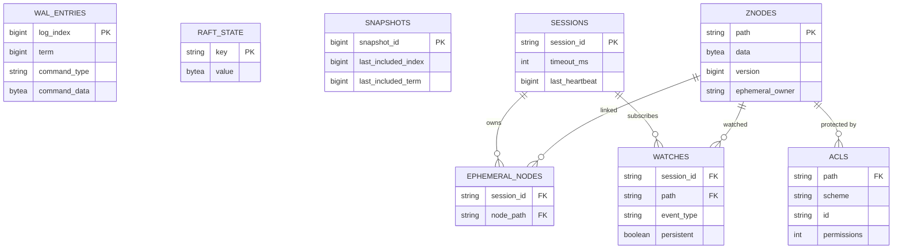
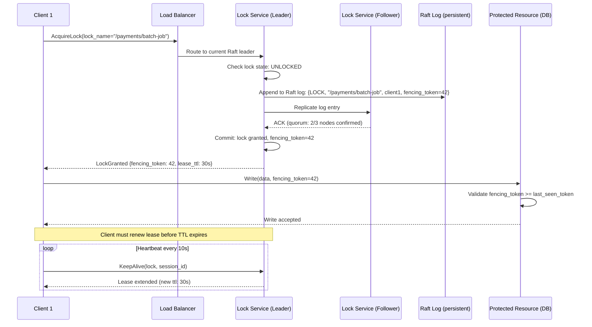
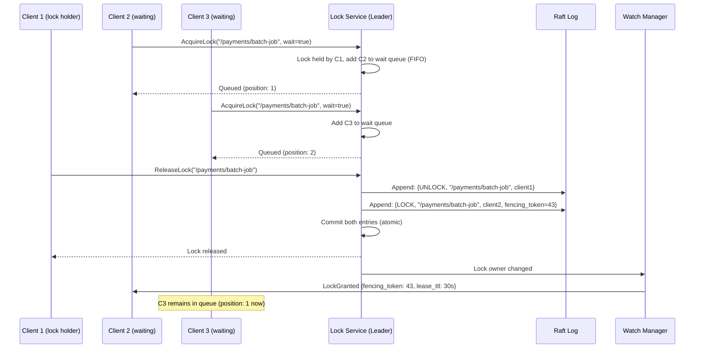
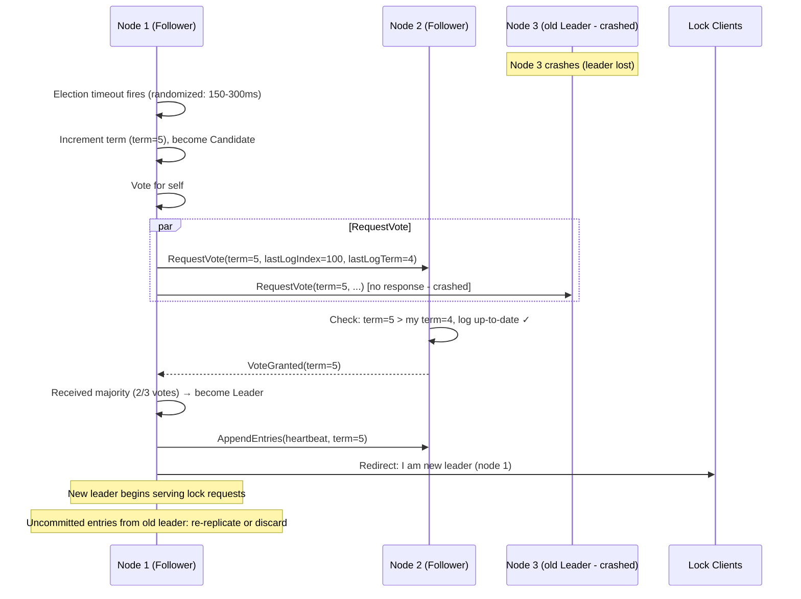

# Distributed Lock Service (like ZooKeeper/Chubby)

## 1. Requirements

### Functional Requirements
- Lock acquisition and release (mutual exclusion)
- Lease-based locks with TTL (auto-release on client failure)
- Read/write locks (shared readers, exclusive writer)
- Lock queuing with fair ordering (FIFO)
- Leader election primitive
- Group membership with failure detection
- Ephemeral nodes (auto-deleted on session expiry)
- Sequential nodes (globally ordered)
- Watches/notifications (event-driven state changes)
- Fencing tokens for correctness in async systems
- Hierarchical namespace (filesystem-like paths)

### Non-Functional Requirements
- Linearizable reads and writes
- Lock acquisition latency < 10ms (no contention)
- Support 100K+ concurrent sessions
- 99.999% availability (5 nines)
- Survive minority node failures (N/2 - 1 failures for N nodes)
- Consistent despite network partitions (CP system)
- Horizontal read scaling with learner nodes

## 2. Core Entities

```
ZNode: path, data, version, cversion, aversion, ephemeral_owner, 
       creation_time, modification_time, children[], acl[]
Session: session_id, timeout_ms, last_heartbeat, ephemeral_nodes[], watches[]
Lock: path, owner_session_id, fencing_token, type (exclusive/shared), 
      created_at, expires_at
Watch: session_id, path, event_types[], one_shot (bool)
Transaction: txn_id, operations[], status, term, log_index
Proposal: proposal_id, term, log_index, command, committed (bool)
ClusterMember: node_id, address, role (leader/follower/learner), term, last_log_index
```

## 3. API Design

### Create Node
```
POST /api/v1/nodes
Authorization: Session <SESSION_ID>

Request:
{
  "path": "/services/payment/leader",
  "data": "node-3.internal:8080",
  "flags": ["EPHEMERAL", "SEQUENTIAL"],
  "acl": [
    { "scheme": "auth", "id": "service-account", "perms": ["READ", "WRITE", "DELETE"] }
  ]
}

Response (201):
{
  "path": "/services/payment/leader/lock-0000000042",
  "version": 0,
  "fencing_token": 42,
  "ephemeral_owner": "sess-abc123",
  "created_at": "2024-01-15T10:00:00.000Z"
}
```

### Acquire Lock
```
POST /api/v1/locks/acquire
Authorization: Session <SESSION_ID>

Request:
{
  "path": "/locks/inventory/item-12345",
  "type": "EXCLUSIVE",
  "timeout_ms": 30000,
  "data": "worker-7: processing order #9876"
}

Response (200 - acquired):
{
  "status": "ACQUIRED",
  "lock_path": "/locks/inventory/item-12345/lock-0000000015",
  "fencing_token": 15,
  "session_id": "sess-abc123",
  "expires_at": "2024-01-15T10:00:30.000Z"
}

Response (200 - queued):
{
  "status": "WAITING",
  "lock_path": "/locks/inventory/item-12345/lock-0000000016",
  "position": 2,
  "watch_path": "/locks/inventory/item-12345/lock-0000000015"
}
```

### Release Lock
```
DELETE /api/v1/locks/release
Authorization: Session <SESSION_ID>

Request:
{
  "lock_path": "/locks/inventory/item-12345/lock-0000000015",
  "fencing_token": 15
}

Response (200):
{
  "status": "RELEASED",
  "path": "/locks/inventory/item-12345/lock-0000000015"
}
```

### Set Watch
```
POST /api/v1/watches
Authorization: Session <SESSION_ID>

Request:
{
  "path": "/services/payment/config",
  "event_types": ["NODE_DATA_CHANGED", "NODE_DELETED"],
  "persistent": true
}

Response (200):
{
  "watch_id": "watch-xyz789",
  "path": "/services/payment/config",
  "current_version": 5
}

// Watch notification (server push via gRPC stream or WebSocket):
{
  "event_type": "NODE_DATA_CHANGED",
  "path": "/services/payment/config",
  "new_version": 6,
  "timestamp": "2024-01-15T10:05:00.000Z"
}
```

### Leader Election
```
POST /api/v1/elections/join
Authorization: Session <SESSION_ID>

Request:
{
  "election_path": "/elections/scheduler",
  "candidate_data": {
    "node_id": "scheduler-3",
    "address": "10.0.1.53:9090",
    "priority": 10
  }
}

Response (200):
{
  "status": "FOLLOWER",
  "leader": {
    "node_id": "scheduler-1",
    "address": "10.0.1.51:9090",
    "elected_at": "2024-01-15T09:00:00.000Z",
    "fencing_token": 7
  },
  "position": 3,
  "participant_count": 5
}
```

### Session Management
```
POST /api/v1/sessions
Request:
{
  "timeout_ms": 30000,
  "auth": { "scheme": "digest", "credential": "service:password123" }
}

Response (201):
{
  "session_id": "sess-abc123",
  "timeout_ms": 30000,
  "server_id": "node-2",
  "password": "session-secret-token"
}

// Heartbeat (sent every timeout/3)
POST /api/v1/sessions/sess-abc123/heartbeat
Response (200): { "session_id": "sess-abc123", "timeout_ms": 30000 }
```

## 4. High-Level Architecture

```
┌──────────────────────────────────────────────────────────────────────────────┐
│                      DISTRIBUTED LOCK SERVICE                                 │
├──────────────────────────────────────────────────────────────────────────────┤
│                                                                              │
│  ┌──────────┐  ┌──────────┐  ┌──────────┐  ┌──────────┐                    │
│  │ Client 1 │  │ Client 2 │  │ Client 3 │  │ Client N │                    │
│  │ (SDK)    │  │ (SDK)    │  │ (SDK)    │  │ (SDK)    │                    │
│  └────┬─────┘  └────┬─────┘  └────┬─────┘  └────┬─────┘                    │
│       │              │              │              │                          │
│       └──────────────┴──────┬───────┴──────────────┘                         │
│                             │  (gRPC / TCP)                                  │
│                             │                                                │
│              ┌──────────────▼───────────────┐                                │
│              │      Client Connection       │                                │
│              │         Router               │                                │
│              │  (Reads → any, Writes → leader)│                              │
│              └──────────────┬───────────────┘                                │
│                             │                                                │
│    ┌────────────────────────┼────────────────────────┐                       │
│    │                        │                        │                       │
│    ▼                        ▼                        ▼                       │
│ ┌──────────┐         ┌──────────┐         ┌──────────┐                      │
│ │  Node 1  │◄───────►│  Node 2  │◄───────►│  Node 3  │                      │
│ │(Follower)│  Raft   │ (LEADER) │  Raft   │(Follower)│                      │
│ │          │ Repl.   │          │ Repl.   │          │                      │
│ ├──────────┤         ├──────────┤         ├──────────┤                      │
│ │ State    │         │ State    │         │ State    │                      │
│ │ Machine  │         │ Machine  │         │ Machine  │                      │
│ ├──────────┤         ├──────────┤         ├──────────┤                      │
│ │ WAL Log  │         │ WAL Log  │         │ WAL Log  │                      │
│ └──────────┘         └──────────┘         └──────────┘                      │
│                             │                                                │
│                      ┌──────▼──────┐                                         │
│                      │  Snapshot   │                                         │
│                      │  Storage    │                                         │
│                      │ (Periodic)  │                                         │
│                      └─────────────┘                                         │
│                                                                              │
│  ┌──────────┐  ┌──────────┐                                                 │
│  │ Learner 1│  │ Learner 2│  (Read-only replicas, don't vote)               │
│  │ (ReadOnly)│ │ (ReadOnly)│                                                │
│  └──────────┘  └──────────┘                                                 │
│                                                                              │
└──────────────────────────────────────────────────────────────────────────────┘
```

## 5. Deep Dive: Consensus Protocol (Raft)

```python
class RaftNode:
    """
    Raft consensus implementation for distributed lock service.
    Provides linearizable state machine replication.
    """
    
    def __init__(self, node_id, peers, state_machine):
        self.node_id = node_id
        self.peers = peers
        self.state_machine = state_machine
        
        # Persistent state (survives restarts)
        self.current_term = 0
        self.voted_for = None
        self.log = RaftLog()  # WAL-backed
        
        # Volatile state
        self.commit_index = 0
        self.last_applied = 0
        self.role = Role.FOLLOWER
        self.leader_id = None
        
        # Leader-only volatile state
        self.next_index = {}   # peer -> next log index to send
        self.match_index = {}  # peer -> highest replicated index
        
        # Timers
        self.election_timeout = self._random_timeout(150, 300)  # ms
        self.heartbeat_interval = 50  # ms
    
    async def handle_client_request(self, command):
        """Handle client write request (only leader can process)."""
        if self.role != Role.LEADER:
            raise NotLeaderError(leader_id=self.leader_id)
        
        # Append to log
        entry = LogEntry(
            term=self.current_term,
            index=self.log.last_index() + 1,
            command=command
        )
        self.log.append(entry)
        
        # Replicate to followers
        future = asyncio.Future()
        self.pending_requests[entry.index] = future
        
        await self._replicate_to_followers()
        
        # Wait for commit (majority acknowledged)
        result = await asyncio.wait_for(future, timeout=5.0)
        return result
    
    async def _replicate_to_followers(self):
        """Send AppendEntries to all followers."""
        for peer_id in self.peers:
            asyncio.create_task(self._send_append_entries(peer_id))
    
    async def _send_append_entries(self, peer_id):
        """Send AppendEntries RPC to a single peer."""
        next_idx = self.next_index[peer_id]
        prev_log_index = next_idx - 1
        prev_log_term = self.log.get_term(prev_log_index) if prev_log_index > 0 else 0
        
        entries = self.log.get_entries_from(next_idx)
        
        request = AppendEntriesRequest(
            term=self.current_term,
            leader_id=self.node_id,
            prev_log_index=prev_log_index,
            prev_log_term=prev_log_term,
            entries=entries,
            leader_commit=self.commit_index
        )
        
        response = await self.rpc_client.append_entries(peer_id, request)
        
        if response.success:
            self.next_index[peer_id] = next_idx + len(entries)
            self.match_index[peer_id] = self.next_index[peer_id] - 1
            self._advance_commit_index()
        else:
            if response.term > self.current_term:
                self._step_down(response.term)
            else:
                # Log inconsistency - back up
                self.next_index[peer_id] = max(1, self.next_index[peer_id] - 1)
                await self._send_append_entries(peer_id)  # Retry
    
    def _advance_commit_index(self):
        """Advance commit index if majority has replicated."""
        for n in range(self.commit_index + 1, self.log.last_index() + 1):
            if self.log.get_term(n) != self.current_term:
                continue
            
            # Count replicas that have this entry
            replication_count = 1  # Self
            for peer_id in self.peers:
                if self.match_index.get(peer_id, 0) >= n:
                    replication_count += 1
            
            # Majority check
            if replication_count > (len(self.peers) + 1) // 2:
                self.commit_index = n
                self._apply_committed_entries()
    
    def _apply_committed_entries(self):
        """Apply committed log entries to state machine."""
        while self.last_applied < self.commit_index:
            self.last_applied += 1
            entry = self.log.get_entry(self.last_applied)
            result = self.state_machine.apply(entry.command)
            
            # Resolve pending client request
            if entry.index in self.pending_requests:
                self.pending_requests[entry.index].set_result(result)
                del self.pending_requests[entry.index]


class RaftElection:
    """Leader election with randomized timeouts."""
    
    async def start_election(self, node):
        """Transition to candidate and request votes."""
        node.current_term += 1
        node.role = Role.CANDIDATE
        node.voted_for = node.node_id
        
        votes_received = 1  # Vote for self
        
        # Request votes from all peers in parallel
        vote_tasks = []
        for peer_id in node.peers:
            task = asyncio.create_task(self._request_vote(node, peer_id))
            vote_tasks.append(task)
        
        results = await asyncio.gather(*vote_tasks, return_exceptions=True)
        
        for result in results:
            if isinstance(result, VoteResponse) and result.vote_granted:
                votes_received += 1
        
        # Check if won election
        majority = (len(node.peers) + 1) // 2 + 1
        if votes_received >= majority and node.role == Role.CANDIDATE:
            node.role = Role.LEADER
            node.leader_id = node.node_id
            self._initialize_leader_state(node)
            await self._send_heartbeats(node)  # Establish authority
    
    async def _request_vote(self, node, peer_id):
        """Send RequestVote RPC."""
        request = RequestVoteRequest(
            term=node.current_term,
            candidate_id=node.node_id,
            last_log_index=node.log.last_index(),
            last_log_term=node.log.last_term()
        )
        return await node.rpc_client.request_vote(peer_id, request)


class JointConsensus:
    """
    Safe cluster membership changes using joint consensus.
    Prevents split-brain during configuration transitions.
    """
    
    async def add_member(self, leader, new_node_id):
        """Add a new member using joint consensus."""
        old_config = leader.cluster_config.copy()
        new_config = old_config + [new_node_id]
        
        # Phase 1: Commit joint configuration C_old,new
        joint_config = JointConfiguration(old=old_config, new=new_config)
        await leader.handle_client_request(
            Command(type='CONFIG_CHANGE', config=joint_config)
        )
        
        # Phase 2: Once joint config committed, commit C_new only
        await leader.handle_client_request(
            Command(type='CONFIG_CHANGE', config=Configuration(members=new_config))
        )
    
    async def remove_member(self, leader, node_id):
        """Remove a member safely."""
        old_config = leader.cluster_config.copy()
        new_config = [n for n in old_config if n != node_id]
        
        # Same two-phase process
        joint_config = JointConfiguration(old=old_config, new=new_config)
        await leader.handle_client_request(
            Command(type='CONFIG_CHANGE', config=joint_config)
        )
        await leader.handle_client_request(
            Command(type='CONFIG_CHANGE', config=Configuration(members=new_config))
        )
        
        # If leader removed itself, step down after commit
        if node_id == leader.node_id:
            leader._step_down(leader.current_term)
```

## 6. Deep Dive: Lock Implementation

```python
class DistributedLockManager:
    """
    Lock implementation using sequential ephemeral nodes.
    Provides fair ordering and automatic cleanup on session expiry.
    """
    
    def __init__(self, state_machine):
        self.state_machine = state_machine
        self.fencing_counter = AtomicCounter()
    
    def acquire_lock(self, session_id, lock_path, lock_type='EXCLUSIVE'):
        """
        Lock acquisition algorithm:
        1. Create sequential ephemeral node under lock_path
        2. Get all children of lock_path
        3. If our node has lowest sequence → lock acquired
        4. Otherwise, watch the predecessor node
        """
        # Create sequential ephemeral child
        sequence = self.state_machine.next_sequence(lock_path)
        node_name = f"lock-{sequence:010d}"
        full_path = f"{lock_path}/{node_name}"
        
        # Create ephemeral node tied to session
        self.state_machine.create_node(
            path=full_path,
            data=f"session:{session_id}",
            flags=['EPHEMERAL', 'SEQUENTIAL'],
            ephemeral_owner=session_id
        )
        
        # Check if we're first (acquired) or need to wait
        children = self.state_machine.get_children(lock_path)
        sorted_children = sorted(children, key=lambda c: self._extract_sequence(c))
        
        our_index = sorted_children.index(node_name)
        
        if lock_type == 'EXCLUSIVE':
            if our_index == 0:
                # We're first - lock acquired
                fencing_token = self.fencing_counter.increment()
                return LockResult(
                    status='ACQUIRED',
                    lock_path=full_path,
                    fencing_token=fencing_token
                )
            else:
                # Watch predecessor
                predecessor = sorted_children[our_index - 1]
                return LockResult(
                    status='WAITING',
                    lock_path=full_path,
                    watch_path=f"{lock_path}/{predecessor}",
                    position=our_index
                )
        
        elif lock_type == 'SHARED':
            # Shared lock: acquired if no write-lock with lower sequence
            write_locks = [c for c in sorted_children[:our_index] 
                         if self._is_write_lock(c)]
            if not write_locks:
                fencing_token = self.fencing_counter.increment()
                return LockResult(status='ACQUIRED', lock_path=full_path, fencing_token=fencing_token)
            else:
                # Watch last write lock before us
                return LockResult(
                    status='WAITING',
                    lock_path=full_path,
                    watch_path=f"{lock_path}/{write_locks[-1]}",
                    position=our_index
                )
    
    def release_lock(self, session_id, lock_path, fencing_token):
        """Release lock by deleting the ephemeral node."""
        node = self.state_machine.get_node(lock_path)
        
        if not node:
            raise LockNotFoundError(lock_path)
        if node.ephemeral_owner != session_id:
            raise NotLockOwnerError(lock_path, session_id)
        
        # Delete node - this triggers watches on waiters
        self.state_machine.delete_node(lock_path)
        
        return LockReleaseResult(status='RELEASED', path=lock_path)


class FencingTokenManager:
    """
    Fencing tokens prevent stale clients from corrupting state.
    Every lock acquisition gets a monotonically increasing token.
    Resources reject operations with tokens lower than what they've seen.
    """
    
    def __init__(self):
        self.counter = 0  # Persisted in state machine
    
    def issue_token(self):
        """Issue next fencing token (monotonically increasing)."""
        self.counter += 1
        return self.counter
    
    def validate_token(self, resource_id, token):
        """
        Validate that a fencing token is current.
        Used by resource servers to reject stale lock holders.
        """
        last_seen = self.resource_tokens.get(resource_id, 0)
        if token < last_seen:
            raise StaleLockError(
                f"Token {token} is stale. Resource has seen token {last_seen}"
            )
        self.resource_tokens[resource_id] = token
        return True


class SessionManager:
    """
    Session management with heartbeat-based failure detection.
    Session expiry triggers cleanup of ephemeral nodes.
    """
    
    def __init__(self, state_machine, min_timeout=4000, max_timeout=40000):
        self.state_machine = state_machine
        self.min_timeout = min_timeout
        self.max_timeout = max_timeout
        self.sessions = {}  # session_id -> Session
    
    def create_session(self, requested_timeout):
        """Create new session with negotiated timeout."""
        timeout = max(self.min_timeout, min(requested_timeout, self.max_timeout))
        session_id = generate_session_id()
        
        session = Session(
            id=session_id,
            timeout_ms=timeout,
            last_heartbeat=time.time(),
            ephemeral_nodes=[],
            watches=[]
        )
        self.sessions[session_id] = session
        return session
    
    def heartbeat(self, session_id):
        """Update session last heartbeat time."""
        if session_id not in self.sessions:
            raise SessionExpiredError(session_id)
        self.sessions[session_id].last_heartbeat = time.time()
    
    def check_expired_sessions(self):
        """
        Called periodically by leader.
        Expire sessions that missed heartbeats beyond timeout.
        """
        now = time.time()
        expired = []
        
        for session_id, session in self.sessions.items():
            if (now - session.last_heartbeat) * 1000 > session.timeout_ms:
                expired.append(session_id)
        
        for session_id in expired:
            self._expire_session(session_id)
    
    def _expire_session(self, session_id):
        """Clean up all ephemeral nodes and watches for expired session."""
        session = self.sessions[session_id]
        
        # Delete all ephemeral nodes (this releases locks!)
        for node_path in session.ephemeral_nodes:
            self.state_machine.delete_node(node_path)
            # Deletion triggers watches → waiters notified → next in queue acquires lock
        
        # Remove all watches
        for watch in session.watches:
            self.state_machine.remove_watch(watch)
        
        del self.sessions[session_id]
```

## 7. Deep Dive: Failure Handling

```python
class FailureHandler:
    """
    Handle various failure scenarios in the distributed lock service.
    """
    
    async def handle_leader_failure(self, cluster):
        """
        Leader failure: followers detect via missed heartbeats.
        Raft election automatically selects new leader.
        """
        # Followers detect leader timeout (election_timeout expires)
        # One follower becomes candidate, wins election
        # New leader:
        # 1. Sends heartbeats to establish authority
        # 2. Commits a no-op entry to commit pending entries from previous term
        # 3. Resumes processing client requests
        # 4. Re-checks session timeouts (may expire sessions)
        pass
    
    async def handle_network_partition(self, cluster):
        """
        Network partition handling:
        - Majority partition: continues operating (has quorum)
        - Minority partition: cannot commit, all writes fail
        - Clients connected to minority: operations timeout
        """
        # Minority side:
        # - Leader steps down if can't reach majority
        # - All nodes become read-only (stale reads allowed with flag)
        # - Client sessions maintained but operations queued
        
        # On heal:
        # - Minority nodes catch up via AppendEntries
        # - Sessions that exceeded timeout are expired
        # - Ephemeral nodes of expired sessions cleaned up
        pass
    
    async def handle_client_session_expiry(self, session_id):
        """
        Client session expired (network issue, client crash).
        Must release all locks held by this session.
        """
        session = self.session_manager.sessions.get(session_id)
        if not session:
            return
        
        # All ephemeral nodes deleted → locks released
        # Watches fire → next waiter in queue gets lock
        # Connected watches notify other clients of state change
        self.session_manager._expire_session(session_id)
    
    def prevent_split_brain(self, node):
        """
        Split-brain prevention using quorum requirement.
        A leader MUST have quorum to serve any requests.
        """
        if node.role == Role.LEADER:
            # Leader lease: only serve reads if heard from majority within lease period
            last_quorum_time = max(
                node.match_index_updated_at.values(), default=0
            )
            if time.time() - last_quorum_time > node.lease_duration:
                # Lost contact with majority - step down
                node._step_down(node.current_term)
                raise NotLeaderError("Lost quorum contact, stepped down")


class ReadOptimizations:
    """
    Optimizations for read-heavy workloads while maintaining linearizability.
    """
    
    async def linearizable_read(self, node, path):
        """
        Linearizable read: confirm leadership before responding.
        Required for correctness but adds latency.
        """
        if node.role != Role.LEADER:
            raise NotLeaderError(node.leader_id)
        
        # Confirm we're still leader by getting heartbeat from majority
        read_index = node.commit_index
        confirmed = await node.confirm_leadership()
        
        if not confirmed:
            raise NotLeaderError("Could not confirm leadership")
        
        # Wait for state machine to catch up
        while node.last_applied < read_index:
            await asyncio.sleep(0.001)
        
        return node.state_machine.get(path)
    
    async def lease_based_read(self, node, path):
        """
        Lease-based read: serve from leader if within lease period.
        Faster but relies on bounded clock drift.
        """
        if node.role != Role.LEADER:
            raise NotLeaderError(node.leader_id)
        
        # Leader lease valid if we received majority acks within lease_duration
        if not node.lease_valid():
            return await self.linearizable_read(node, path)
        
        return node.state_machine.get(path)
    
    async def follower_read(self, node, path, allow_stale=False):
        """
        Read from follower (reduces load on leader).
        Can be stale unless we verify with leader.
        """
        if allow_stale:
            return node.state_machine.get(path)
        
        # Ask leader for current commit index
        leader_commit = await node.rpc_client.get_commit_index(node.leader_id)
        
        # Wait for local apply to catch up
        while node.last_applied < leader_commit:
            await asyncio.sleep(0.001)
        
        return node.state_machine.get(path)
```

## 8. Database Schema

### Entity-Relationship Diagram



### WAL Log Storage (Custom)

```sql
-- Raft WAL entries (append-only, fsync'd)
CREATE TABLE wal_entries (
    log_index       BIGINT PRIMARY KEY,
    term            BIGINT NOT NULL,
    command_type    VARCHAR(32) NOT NULL,
    command_data    BYTEA NOT NULL,
    created_at      TIMESTAMPTZ DEFAULT NOW()
);

-- Raft persistent state
CREATE TABLE raft_state (
    key             VARCHAR(64) PRIMARY KEY,
    value           BYTEA NOT NULL,
    updated_at      TIMESTAMPTZ DEFAULT NOW()
);
-- Keys: 'current_term', 'voted_for', 'commit_index'

-- Snapshots
CREATE TABLE snapshots (
    snapshot_id     BIGINT PRIMARY KEY,
    last_included_index BIGINT NOT NULL,
    last_included_term  BIGINT NOT NULL,
    data            BYTEA NOT NULL,  -- Serialized state machine
    size_bytes      BIGINT NOT NULL,
    created_at      TIMESTAMPTZ DEFAULT NOW()
);
```

### State Machine (In-Memory, Snapshotted)

```sql
-- ZNode tree (logical schema - actual in-memory)
CREATE TABLE znodes (
    path            VARCHAR(2048) PRIMARY KEY,
    data            BYTEA,
    version         BIGINT NOT NULL DEFAULT 0,
    cversion        BIGINT NOT NULL DEFAULT 0,  -- children version
    aversion        BIGINT NOT NULL DEFAULT 0,  -- ACL version
    ephemeral_owner VARCHAR(64),  -- NULL for persistent nodes
    ctime           BIGINT NOT NULL,  -- creation time (zxid)
    mtime           BIGINT NOT NULL,  -- modification time (zxid)
    data_length     INT NOT NULL DEFAULT 0,
    num_children    INT NOT NULL DEFAULT 0
);

-- Session tracking
CREATE TABLE sessions (
    session_id      VARCHAR(64) PRIMARY KEY,
    timeout_ms      INT NOT NULL,
    last_heartbeat  BIGINT NOT NULL,
    created_at      BIGINT NOT NULL
);

-- Ephemeral node ownership (for fast cleanup)
CREATE TABLE ephemeral_nodes (
    session_id      VARCHAR(64) NOT NULL,
    node_path       VARCHAR(2048) NOT NULL,
    PRIMARY KEY (session_id, node_path),
    INDEX idx_path (node_path)
);

-- Watches
CREATE TABLE watches (
    session_id      VARCHAR(64) NOT NULL,
    path            VARCHAR(2048) NOT NULL,
    event_type      VARCHAR(32) NOT NULL,
    persistent      BOOLEAN DEFAULT FALSE,
    PRIMARY KEY (session_id, path, event_type)
);

-- ACLs
CREATE TABLE acls (
    path            VARCHAR(2048) NOT NULL,
    scheme          VARCHAR(32) NOT NULL,
    id              VARCHAR(256) NOT NULL,
    permissions     INT NOT NULL,  -- bitmask: READ=1, WRITE=2, CREATE=4, DELETE=8, ADMIN=16
    PRIMARY KEY (path, scheme, id)
);
```

## 9. Kafka & Redis Configuration

### Note on Architecture
This system does NOT use Kafka/Redis in the critical path (consensus handles replication). However, they're used for:
- Kafka: Audit log streaming, watch notification delivery at scale
- Redis: Client-side caching, connection routing

```yaml
# Kafka - Audit and event streaming (non-critical path)
topics:
  lock-audit-log:
    partitions: 16
    replication_factor: 3
    retention_ms: 2592000000  # 30 days
    cleanup_policy: delete
    compression_type: zstd
    
  watch-notifications:
    partitions: 32
    replication_factor: 3
    retention_ms: 300000  # 5 minutes (transient)
    cleanup_policy: delete

  cluster-events:
    partitions: 8
    replication_factor: 3
    retention_ms: 604800000  # 7 days

producer:
  acks: 1  # Non-critical path
  batch_size: 16384
  linger_ms: 5
  compression_type: snappy

# Redis - Connection routing and caching
redis:
  mode: sentinel  # High availability
  sentinel_nodes: 3
  
  key_patterns:
    # Leader discovery cache (TTL = heartbeat interval)
    leader_addr: "cluster:{cluster_id}:leader"  # TTL: 5s
    
    # Client session routing
    session_node: "session:{session_id}:node"  # Which node owns this session
    
    # Watch delivery queue (pub/sub)
    watch_channel: "watches:{session_id}"
    
    # Rate limiting for new connections
    conn_rate: "conn_rate:{client_ip}"
  
  config:
    maxmemory: 4GB
    maxmemory_policy: volatile-ttl
    tcp_keepalive: 60
```

## 10. Scalability & Performance

### Write Performance
- Single leader handles all writes (bottleneck by design for consistency)
- Batching: Group multiple operations into single Raft log entry
- Pipeline: Leader sends AppendEntries while previous batch commits
- Typical: 10K-50K writes/second depending on payload size

### Read Performance
- Lease-based reads: No network round trip (serve from leader cache)
- Follower reads: Scale reads horizontally with learner nodes
- Watch notifications: Avoid polling, push state changes

### Cluster Sizing
```
Typical deployment:
- 3 nodes: Tolerates 1 failure (production minimum)
- 5 nodes: Tolerates 2 failures (recommended for critical services)
- 7 nodes: Tolerates 3 failures (rare, adds write latency)

Read scaling:
- Add learner nodes (non-voting) for read replicas
- Learners don't participate in elections, don't slow writes
```

### Memory Management
- State machine entirely in memory (fast operations)
- Periodic snapshots to disk (every 100K transactions)
- WAL truncation after snapshot
- Large data values stored off-heap with references

## 11. Failure Handling & Reliability

### Leader Failure Recovery
- Detection: Followers timeout after `election_timeout` (150-300ms)
- Election: Randomized timeout prevents split vote (converges in 1-2 rounds)
- Recovery: New leader commits no-op, then resumes operations
- Total downtime: ~300-600ms

### Session Expiry Guarantees
- Session timeout only checked by leader
- Ephemeral cleanup is atomic (part of state machine)
- Watches fire synchronously during cleanup
- Clients must handle SESSION_EXPIRED and re-establish

### Network Partition
- Majority: Continues operating normally
- Minority: All operations fail with LEADER_UNAVAILABLE
- Heal: Minority catches up, expired sessions cleaned
- No split-brain: Quorum required for all commits

### Disk Failure
- WAL on durable storage (fsync on every commit)
- Snapshot + WAL replay for recovery
- If WAL corrupted: node rebuilds from leader's snapshot

### Consistency Guarantees
- Linearizable writes (all go through Raft)
- Linearizable reads (with leader confirmation or lease)
- Sequential consistency for sessions (FIFO ordering)
- Watches deliver events in commit order

---

## Sequence Diagrams

### Lock Acquire + Fencing Token



### Lock Release + Notify Waiters



### Leader Election via Raft



## Caching Strategy

| Layer | What's Cached | TTL | Invalidation |
|-------|--------------|-----|-------------|
| Client-side lock state | Lock handle + fencing token | Lease duration | Lease expiry / explicit release |
| Leader identity | Current leader address | Until leader change | Watch on leader node |
| Lock metadata | Lock owner, queue position | N/A (authoritative) | Raft log is source of truth |
| Session→locks mapping | Redis (for fast revocation) | Session TTL | Session expiry |

**Important**: Lock state is NEVER cached in a way that could serve stale data. All lock operations go through the Raft leader for linearizability.

## Async Processing

- **Session expiry detection**: Background goroutine checks session heartbeats, expires stale sessions → releases their locks
- **Watch notifications**: Delivered async via streaming gRPC (non-blocking to lock operations)
- **Lock queue fairness**: FIFO queue processing is async but ordered (no starvation)
- **Metrics emission**: Lock acquire/release counters published async to Prometheus
- **Log compaction**: Background snapshots of Raft state machine (prevents unbounded log growth)

## Infrastructure Components

| Component | Technology | Sizing | HA Strategy |
|-----------|-----------|--------|-------------|
| Lock Service | Go + Raft (etcd/custom) | 3 or 5 nodes | Raft consensus (tolerates ⌊(n-1)/2⌋ failures) |
| Raft Log | Local SSD (fsync per entry) | NVMe, 100GB | WAL + periodic snapshots |
| Client Library | Language-specific SDK | Embedded | Session keepalive, auto-reconnect |
| Load Balancer | L4 (TCP) | - | Routes to leader (or any node → redirect) |
| Monitoring | Prometheus + Grafana | - | Alert on leader election frequency |

### Deployment Topology
- **3-node cluster**: Tolerates 1 failure (minimum for production)
- **5-node cluster**: Tolerates 2 failures (recommended for critical locks)
- **Cross-AZ**: Each node in separate AZ (survive AZ failure)
- **NOT cross-region**: Raft latency degrades with geographic distance (use multi-region only with witness nodes)

## Deep Dive: Raft Consensus for Lock Service

### Why Raft for Locks
Locks require **linearizability**: once a lock is granted, all subsequent reads must see it as held. Raft provides this through:
1. Single leader handles all writes (no conflicts)
2. Log replication ensures durability (survives minority failures)
3. Leader completeness: new leaders have ALL committed entries

### Raft Step-by-Step: Lock Acquire

```
Step 1: Client sends AcquireLock to leader
Step 2: Leader creates log entry {term=T, index=I, cmd=LOCK(key, client, token)}
Step 3: Leader appends to local log (not yet committed)
Step 4: Leader sends AppendEntries RPC to all followers:
         {term=T, prevLogIndex=I-1, prevLogTerm=T', entries=[entry], leaderCommit=C}
Step 5: Each follower:
         - Checks prevLogIndex/prevLogTerm match (log consistency check)
         - If match: append entry, reply success
         - If mismatch: reply failure (leader decrements nextIndex, retries)
Step 6: Leader waits for majority (⌊n/2⌋ + 1) success replies
Step 7: Leader advances commitIndex to I
Step 8: Leader applies entry to state machine (lock table)
Step 9: Leader responds to client: LOCK_GRANTED(fencing_token=42)
Step 10: Next heartbeat: followers learn new commitIndex, apply to their state machines
```

### Linearizable Reads (ReadIndex)
```
Problem: Stale reads if leader was deposed but doesn't know yet

Solution (ReadIndex):
  1. Leader records current commitIndex as readIndex
  2. Leader sends heartbeat to confirm it's still leader (majority must respond)
  3. Leader waits until state machine advances past readIndex
  4. Leader serves the read from state machine

Alternative (LeaseRead - faster but less safe):
  - Leader assumes it remains leader for election_timeout/2 after last heartbeat
  - Serves reads without confirming leadership (faster, but clock-dependent)
```

### Split-Brain Prevention
```
Scenario: Network partition splits 5-node cluster into [A,B] and [C,D,E]
- [C,D,E] (majority) elects new leader → continues serving locks
- [A,B] (minority) old leader cannot commit (needs 3/5 ACKs)
  → Any lock operations on old leader will TIMEOUT (not return stale success)
  → Clients detect timeout, reconnect to new leader

Key insight: Raft's majority requirement means AT MOST ONE partition can make progress.
Split-brain is IMPOSSIBLE as long as quorum rules are followed.
```

## Deep Dive: Fencing Tokens

### Why Fencing Tokens Are Necessary

```
Problem: Lock holder pauses (GC, network), lease expires, new holder gets lock.
Old holder resumes, THINKS it still holds lock → writes to resource → CORRUPTION.

Timeline:
  T=0:  Client A acquires lock (fencing_token=42)
  T=25: Client A pauses (long GC)
  T=30: Lease expires, lock auto-released
  T=31: Client B acquires lock (fencing_token=43)
  T=32: Client B writes to DB with token=43
  T=35: Client A resumes, writes to DB with token=42 ← MUST BE REJECTED!
```

### How Fencing Tokens Prevent Split-Brain

```
Fencing token: Monotonically increasing integer assigned with each lock grant.

Resource-side enforcement:
  FUNCTION write_with_fence(data, fencing_token):
    current_max_token = resource.get_max_token(lock_name)
    IF fencing_token < current_max_token:
      REJECT("stale lock holder, token %d < %d", fencing_token, current_max_token)
    ELSE:
      resource.set_max_token(lock_name, fencing_token)
      resource.write(data)
      RETURN success

Key properties:
  1. Tokens are STRICTLY monotonically increasing (never reused)
  2. Resource validates token on EVERY write (not just lock service)
  3. Even if lock service has a bug, resource-side check prevents corruption
  4. Works across network partitions (token is carried with every request)
```

### Implementation Requirements
- Fencing token stored IN the Raft log (survives leader changes)
- Token generation: simple increment (no need for UUID/timestamp)
- Resource MUST participate: if resource doesn't check tokens, fencing is useless
- Token comparison must be on the resource side (not the lock service)
