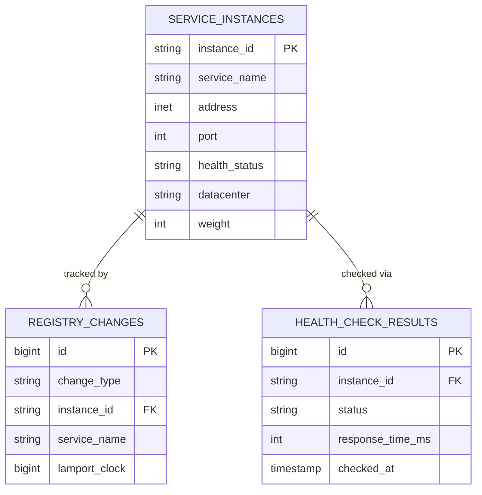
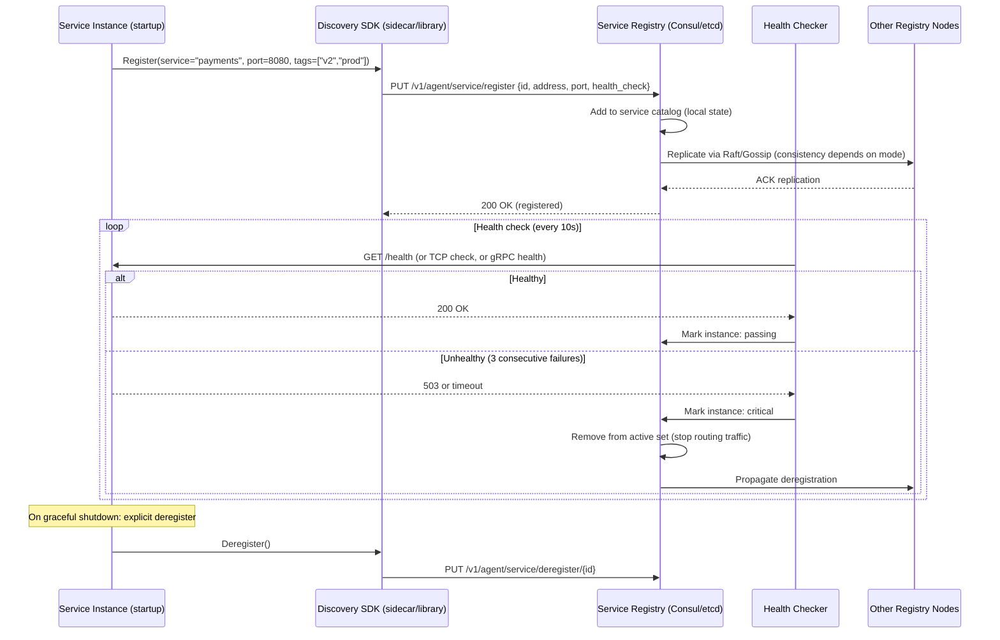
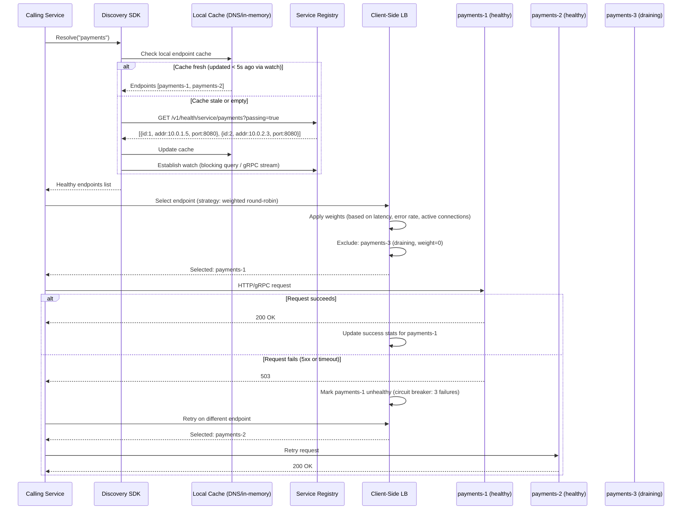

# Solution 123: Service Discovery & Registry

## 1. Requirements Clarification

### Functional Requirements
- **Service Registration**: Register/deregister service instances with metadata
- **Health Checking**: Active and passive health monitoring with configurable probes
- **Service Discovery**: Find healthy instances of a service by name
- **DNS Integration**: DNS-based discovery with SRV/A records
- **Multi-Datacenter**: Cross-DC discovery with locality-aware routing
- **KV Store**: Configuration key-value store for service configuration

### Non-Functional Requirements
- **Availability**: 99.999% (on critical path of every service call)
- **Latency**: <5ms for discovery lookups, <100ms for registration propagation
- **Scale**: 100K+ instances, millions of lookups/sec
- **Consistency**: AP for discovery (prefer availability), CP for leader election
- **Partition Tolerance**: Continue serving stale data during network partitions

### Out of Scope
- Service mesh data plane (Envoy/Linkerd)
- Full configuration management (use dedicated config service)
- Secret management

## 2. Capacity Estimation

### Registration
- 100K service instances
- Average 5 metadata fields per instance (500 bytes)
- Heartbeat every 10 seconds = 10K heartbeats/sec
- Registration changes: ~1000/minute (deploys, scaling, failures)

### Discovery
- 5M lookups/second at peak
- Average response: 5 instances × 100 bytes = 500 bytes
- Read:Write ratio = 5000:1

### Storage
- Registry data: 100K instances × 500 bytes = 50MB (fits in memory)
- Health check state: 100K × 50 bytes = 5MB
- Historical data (24h): 1M change events × 200 bytes = 200MB
- Total active: <1GB (entirely in-memory viable)

### Network
- Gossip protocol: 100K nodes × 100 bytes/update × 10 updates/sec = 100MB/sec aggregate
- DNS queries: 5M/sec × 200 bytes = 1GB/sec
- Client SDK cache refresh: 100K clients × every 30s × 1KB = 3.3MB/sec

## 3. High-Level Architecture

```
┌──────────────────────────────────────────────────────────────────────────────┐
│                    SERVICE DISCOVERY & REGISTRY                                │
├──────────────────────────────────────────────────────────────────────────────┤
│                                                                                │
│  ┌───────────────────────────────────────────────────────────────┐            │
│  │                    CLIENT SDK LAYER                            │            │
│  │  ┌──────────┐  ┌──────────────┐  ┌─────────────────────┐    │            │
│  │  │ Service  │  │ Health Check │  │  Client-side Cache   │    │            │
│  │  │ Register │  │  Reporter    │  │  + Load Balancing    │    │            │
│  │  └──────────┘  └──────────────┘  └─────────────────────┘    │            │
│  └───────────────────────────────────────────────────────────────┘            │
│                              │                                                 │
│                              ▼                                                 │
│  ┌───────────────────────────────────────────────────────────────┐            │
│  │                 DISCOVERY SERVERS (Cluster)                     │            │
│  │                                                                 │            │
│  │  ┌─────────┐    ┌─────────┐    ┌─────────┐    ┌─────────┐   │            │
│  │  │ Server  │◄──►│ Server  │◄──►│ Server  │◄──►│ Server  │   │            │
│  │  │   1     │    │   2     │    │   3     │    │   N     │   │            │
│  │  │(Leader) │    │(Follower│    │(Follower│    │(Follower│   │            │
│  │  └─────────┘    └─────────┘    └─────────┘    └─────────┘   │            │
│  │       │              │              │              │           │            │
│  │       └──────────────┴──────────────┴──────────────┘          │            │
│  │                    Gossip Protocol (Serf)                      │            │
│  └───────────────────────────────────────────────────────────────┘            │
│                              │                                                 │
│              ┌───────────────┼───────────────┐                                │
│              ▼               ▼               ▼                                │
│  ┌──────────────┐  ┌──────────────┐  ┌──────────────┐                        │
│  │    Health    │  │     DNS      │  │    HTTP      │                        │
│  │   Checker   │  │  Interface   │  │    API       │                        │
│  │   Subsystem │  │  (DNS-SD)    │  │              │                        │
│  └──────────────┘  └──────────────┘  └──────────────┘                        │
│                                                                                │
│  ┌───────────────────────────────────────────────────────────────┐            │
│  │                 MULTI-DATACENTER (WAN)                          │            │
│  │  ┌────────┐         ┌────────┐         ┌────────┐            │            │
│  │  │  DC-1  │◄───────►│  DC-2  │◄───────►│  DC-3  │            │            │
│  │  │ (LAN)  │  WAN    │ (LAN)  │  WAN    │ (LAN)  │            │            │
│  │  └────────┘ Gossip  └────────┘ Gossip  └────────┘            │            │
│  └───────────────────────────────────────────────────────────────┘            │
│                                                                                │
└──────────────────────────────────────────────────────────────────────────────┘
```

## 4. Detailed Design

### 4.1 Registration Protocol

```python
import time
import hashlib
import threading
from dataclasses import dataclass, field
from typing import Dict, List, Optional
from enum import Enum

class HealthStatus(Enum):
    PASSING = "passing"
    WARNING = "warning"
    CRITICAL = "critical"
    MAINTENANCE = "maintenance"

@dataclass
class ServiceInstance:
    """A single registered service instance."""
    service_name: str
    instance_id: str
    address: str
    port: int
    
    # Metadata
    tags: List[str] = field(default_factory=list)
    meta: Dict[str, str] = field(default_factory=dict)
    datacenter: str = "dc1"
    zone: str = ""
    
    # Health
    health_status: HealthStatus = HealthStatus.PASSING
    health_check_type: str = "http"  # http, tcp, grpc, ttl
    health_check_endpoint: str = "/health"
    health_check_interval: int = 10  # seconds
    
    # Lease
    lease_ttl: int = 30  # seconds
    last_heartbeat: float = 0.0
    registered_at: float = 0.0
    
    # Weights for load balancing
    weight: int = 100
    
    def is_expired(self) -> bool:
        return time.time() - self.last_heartbeat > self.lease_ttl
    
    def is_in_grace_period(self) -> bool:
        """Grace period = 3x TTL before hard removal."""
        return time.time() - self.last_heartbeat > self.lease_ttl * 3


class ServiceRegistry:
    """
    In-memory service registry with lease-based registration.
    
    Design:
    - All data in memory for fast reads
    - Write-ahead log for durability
    - Gossip for replication across cluster
    """
    
    def __init__(self, node_id: str, gossip_layer):
        self.node_id = node_id
        self.gossip = gossip_layer
        self.services: Dict[str, Dict[str, ServiceInstance]] = {}  # service_name -> {instance_id -> instance}
        self.lock = threading.RWLock()
        self.change_index = 0  # Monotonic counter for blocking queries
        self.watchers = {}  # service_name -> list of waiting clients
    
    def register(self, instance: ServiceInstance) -> dict:
        """Register a service instance with lease."""
        with self.lock.write():
            if instance.service_name not in self.services:
                self.services[instance.service_name] = {}
            
            instance.registered_at = time.time()
            instance.last_heartbeat = time.time()
            self.services[instance.service_name][instance.instance_id] = instance
            
            self.change_index += 1
            
            # Propagate via gossip
            self.gossip.broadcast(GossipEvent(
                type="register",
                instance=instance,
                index=self.change_index,
                source=self.node_id
            ))
            
            # Notify watchers
            self._notify_watchers(instance.service_name)
        
        return {
            "instance_id": instance.instance_id,
            "lease_ttl": instance.lease_ttl,
            "index": self.change_index
        }
    
    def deregister(self, service_name: str, instance_id: str) -> bool:
        """Explicit deregistration (graceful shutdown)."""
        with self.lock.write():
            if service_name in self.services and instance_id in self.services[service_name]:
                del self.services[service_name][instance_id]
                self.change_index += 1
                
                self.gossip.broadcast(GossipEvent(
                    type="deregister",
                    service_name=service_name,
                    instance_id=instance_id,
                    index=self.change_index,
                    source=self.node_id
                ))
                
                self._notify_watchers(service_name)
                return True
        return False
    
    def renew_lease(self, service_name: str, instance_id: str) -> bool:
        """Heartbeat: renew lease to prevent expiry."""
        with self.lock.write():
            instance = self.services.get(service_name, {}).get(instance_id)
            if instance:
                instance.last_heartbeat = time.time()
                if instance.health_status == HealthStatus.CRITICAL:
                    instance.health_status = HealthStatus.PASSING
                return True
        return False
    
    def discover(self, service_name: str, passing_only: bool = True, 
                 datacenter: str = None, tags: List[str] = None) -> List[ServiceInstance]:
        """
        Discover healthy instances of a service.
        Supports filtering by datacenter, tags, health status.
        """
        with self.lock.read():
            instances = list(self.services.get(service_name, {}).values())
        
        # Filter
        if passing_only:
            instances = [i for i in instances if i.health_status == HealthStatus.PASSING]
        
        if datacenter:
            instances = [i for i in instances if i.datacenter == datacenter]
        
        if tags:
            instances = [i for i in instances if all(t in i.tags for t in tags)]
        
        return instances
    
    def discover_blocking(self, service_name: str, last_index: int, 
                          timeout: int = 30) -> tuple:
        """
        Long-poll discovery: block until change or timeout.
        Used by client SDKs for efficient cache invalidation.
        """
        if self.change_index > last_index:
            return self.discover(service_name), self.change_index
        
        # Register watcher and wait
        event = threading.Event()
        self.watchers.setdefault(service_name, []).append(event)
        
        event.wait(timeout=timeout)
        
        return self.discover(service_name), self.change_index
    
    def _notify_watchers(self, service_name: str):
        """Wake up blocking queries for this service."""
        watchers = self.watchers.pop(service_name, [])
        for event in watchers:
            event.set()


class LeaseReaper:
    """
    Background process that expires stale registrations.
    
    Protection against mass expiry during network partitions:
    - If >10% of instances would expire simultaneously, hold off
    - This prevents cascading failures from brief network blips
    """
    
    def __init__(self, registry: ServiceRegistry):
        self.registry = registry
        self.protection_threshold = 0.10  # 10%
    
    def run_reaping_cycle(self):
        """Check for expired leases and remove them."""
        now = time.time()
        expired = []
        total = 0
        
        with self.registry.lock.read():
            for service_name, instances in self.registry.services.items():
                for instance_id, instance in instances.items():
                    total += 1
                    if instance.is_expired():
                        expired.append((service_name, instance_id))
        
        # Mass expiry protection
        if total > 0 and len(expired) / total > self.protection_threshold:
            # Don't expire - likely a network issue, not real failures
            self._alert_mass_expiry(len(expired), total)
            return
        
        # Only remove instances past grace period
        for service_name, instance_id in expired:
            instance = self.registry.services.get(service_name, {}).get(instance_id)
            if instance and instance.is_in_grace_period():
                self.registry.deregister(service_name, instance_id)
            elif instance:
                # Mark critical but don't remove yet
                instance.health_status = HealthStatus.CRITICAL
```

### 4.2 Health Check Subsystem

```python
import asyncio
import aiohttp
import socket

class HealthChecker:
    """
    Active health checking system.
    Runs health probes against registered services.
    
    Supports:
    - HTTP: GET endpoint, check status code
    - TCP: Connection attempt
    - gRPC: grpc.health.v1.Health/Check
    - Script: Execute custom check script
    - TTL: Service self-reports (heartbeat-based)
    """
    
    def __init__(self, registry: ServiceRegistry):
        self.registry = registry
        self.check_results = {}  # instance_id -> HealthCheckResult
    
    async def run_health_checks(self):
        """Continuously run health checks for all registered instances."""
        while True:
            tasks = []
            for service_name, instances in self.registry.services.items():
                for instance_id, instance in instances.items():
                    if instance.health_check_type != "ttl":  # TTL is passive
                        tasks.append(self._check_instance(instance))
            
            # Run checks concurrently (with semaphore to limit concurrency)
            semaphore = asyncio.Semaphore(1000)
            async def bounded_check(instance):
                async with semaphore:
                    return await self._check_instance(instance)
            
            results = await asyncio.gather(*[bounded_check(i) for i in self._get_all_instances()])
            
            # Process results
            for instance, result in results:
                self._update_health(instance, result)
            
            await asyncio.sleep(1)  # Main loop interval
    
    async def _check_instance(self, instance: ServiceInstance) -> tuple:
        """Run appropriate health check for an instance."""
        try:
            if instance.health_check_type == "http":
                result = await self._http_check(instance)
            elif instance.health_check_type == "tcp":
                result = await self._tcp_check(instance)
            elif instance.health_check_type == "grpc":
                result = await self._grpc_check(instance)
            else:
                result = HealthCheckResult(status=HealthStatus.PASSING)
            
            return (instance, result)
        except Exception as e:
            return (instance, HealthCheckResult(
                status=HealthStatus.CRITICAL, 
                error=str(e)
            ))
    
    async def _http_check(self, instance: ServiceInstance) -> 'HealthCheckResult':
        """HTTP health check."""
        url = f"http://{instance.address}:{instance.port}{instance.health_check_endpoint}"
        timeout = aiohttp.ClientTimeout(total=5)
        
        async with aiohttp.ClientSession(timeout=timeout) as session:
            async with session.get(url) as response:
                if 200 <= response.status < 300:
                    return HealthCheckResult(status=HealthStatus.PASSING)
                elif response.status == 429:
                    return HealthCheckResult(status=HealthStatus.WARNING, 
                                           error="Rate limited")
                else:
                    return HealthCheckResult(status=HealthStatus.CRITICAL,
                                           error=f"HTTP {response.status}")
    
    async def _tcp_check(self, instance: ServiceInstance) -> 'HealthCheckResult':
        """TCP connection check."""
        try:
            reader, writer = await asyncio.wait_for(
                asyncio.open_connection(instance.address, instance.port),
                timeout=5.0
            )
            writer.close()
            await writer.wait_closed()
            return HealthCheckResult(status=HealthStatus.PASSING)
        except (asyncio.TimeoutError, ConnectionRefusedError):
            return HealthCheckResult(status=HealthStatus.CRITICAL,
                                   error="Connection failed")
    
    async def _grpc_check(self, instance: ServiceInstance) -> 'HealthCheckResult':
        """gRPC health check using grpc.health.v1."""
        import grpc
        channel = grpc.aio.insecure_channel(f"{instance.address}:{instance.port}")
        try:
            from grpc_health.v1 import health_pb2, health_pb2_grpc
            stub = health_pb2_grpc.HealthStub(channel)
            response = await stub.Check(
                health_pb2.HealthCheckRequest(service=instance.service_name),
                timeout=5
            )
            if response.status == health_pb2.HealthCheckResponse.SERVING:
                return HealthCheckResult(status=HealthStatus.PASSING)
            else:
                return HealthCheckResult(status=HealthStatus.CRITICAL,
                                       error=f"gRPC status: {response.status}")
        finally:
            await channel.close()
    
    def _update_health(self, instance: ServiceInstance, result: 'HealthCheckResult'):
        """
        Update health with hysteresis to avoid flapping.
        Require N consecutive failures before marking critical.
        """
        key = instance.instance_id
        history = self.check_results.setdefault(key, [])
        history.append(result)
        
        # Keep last 5 checks
        if len(history) > 5:
            history.pop(0)
        
        # Require 3 consecutive failures to mark critical
        recent_failures = sum(1 for r in history[-3:] if r.status == HealthStatus.CRITICAL)
        
        if recent_failures >= 3:
            instance.health_status = HealthStatus.CRITICAL
        elif recent_failures >= 1:
            instance.health_status = HealthStatus.WARNING
        else:
            instance.health_status = HealthStatus.PASSING


class CascadingHealthChecker:
    """
    Dependency-aware health checking.
    If a critical dependency is down, mark dependent services as WARNING.
    """
    
    def __init__(self, registry, dependency_graph):
        self.registry = registry
        self.dependency_graph = dependency_graph  # service -> [dependencies]
    
    def evaluate_cascading_health(self, service_name: str) -> HealthStatus:
        """Check if critical dependencies are healthy."""
        dependencies = self.dependency_graph.get(service_name, [])
        
        for dep in dependencies:
            if dep.is_critical:
                dep_instances = self.registry.discover(dep.service_name, passing_only=False)
                healthy = [i for i in dep_instances if i.health_status == HealthStatus.PASSING]
                
                if len(healthy) == 0:
                    return HealthStatus.CRITICAL
                elif len(healthy) < len(dep_instances) * 0.5:
                    return HealthStatus.WARNING
        
        return HealthStatus.PASSING
```

### 4.3 Gossip Protocol Implementation

```python
import random
import json
import socket
import struct
import time
from threading import Thread, Lock
from collections import defaultdict

class GossipProtocol:
    """
    SWIM-based gossip protocol for cluster membership and state propagation.
    
    Properties:
    - O(log N) convergence time
    - Bounded bandwidth per node
    - Tolerant to message loss
    - Detects failures via indirect probing
    """
    
    def __init__(self, node_id: str, bind_addr: str, bind_port: int, 
                 known_peers: list):
        self.node_id = node_id
        self.bind_addr = bind_addr
        self.bind_port = bind_port
        
        # Membership list
        self.members = {}  # node_id -> MemberState
        self.lock = Lock()
        
        # Protocol parameters
        self.gossip_interval = 1.0    # seconds between gossip rounds
        self.gossip_fanout = 3        # nodes to gossip with per round
        self.probe_interval = 1.0     # failure detection probe interval
        self.probe_timeout = 0.5      # seconds to wait for ack
        self.indirect_probes = 3      # indirect probes before suspecting
        self.suspicion_timeout = 5.0  # seconds before confirmed dead
        
        # Event queue for protocol messages
        self.event_queue = []  # Recent events to piggyback on messages
        self.max_event_queue = 1000
        
        # Lamport clock for ordering
        self.lamport_clock = 0
        
        # Initialize with known peers
        for peer in known_peers:
            self.members[peer.node_id] = MemberState(
                node_id=peer.node_id,
                addr=peer.addr,
                port=peer.port,
                status="alive",
                incarnation=0
            )
    
    def start(self):
        """Start gossip protocol threads."""
        Thread(target=self._gossip_loop, daemon=True).start()
        Thread(target=self._probe_loop, daemon=True).start()
        Thread(target=self._listen_loop, daemon=True).start()
    
    def broadcast(self, event: 'GossipEvent'):
        """Queue an event for gossip propagation."""
        self.lamport_clock += 1
        event.lamport_time = self.lamport_clock
        
        with self.lock:
            self.event_queue.append(event)
            if len(self.event_queue) > self.max_event_queue:
                self.event_queue.pop(0)
    
    def _gossip_loop(self):
        """Periodically gossip with random peers."""
        while True:
            time.sleep(self.gossip_interval)
            
            with self.lock:
                alive_members = [m for m in self.members.values() 
                               if m.status == "alive" and m.node_id != self.node_id]
            
            if not alive_members:
                continue
            
            # Select random peers (fanout)
            targets = random.sample(alive_members, 
                                   min(self.gossip_fanout, len(alive_members)))
            
            for target in targets:
                self._send_gossip(target)
    
    def _send_gossip(self, target: 'MemberState'):
        """Send gossip message with piggybacked events."""
        with self.lock:
            # Include recent events and full member state
            message = {
                "type": "gossip",
                "from": self.node_id,
                "members": {nid: m.to_dict() for nid, m in self.members.items()},
                "events": [e.to_dict() for e in self.event_queue[-50:]],  # Last 50 events
                "lamport_clock": self.lamport_clock
            }
        
        self._send_udp(target.addr, target.port, json.dumps(message).encode())
    
    def _handle_gossip(self, message: dict):
        """Merge received gossip with local state."""
        remote_members = message["members"]
        
        with self.lock:
            # Update Lamport clock
            self.lamport_clock = max(self.lamport_clock, message["lamport_clock"]) + 1
            
            for node_id, remote_state in remote_members.items():
                local_state = self.members.get(node_id)
                
                if local_state is None:
                    # New member discovered
                    self.members[node_id] = MemberState.from_dict(remote_state)
                else:
                    # Merge: higher incarnation wins
                    if remote_state["incarnation"] > local_state.incarnation:
                        self.members[node_id] = MemberState.from_dict(remote_state)
                    elif (remote_state["incarnation"] == local_state.incarnation and
                          self._state_priority(remote_state["status"]) > 
                          self._state_priority(local_state.status)):
                        self.members[node_id] = MemberState.from_dict(remote_state)
            
            # Process piggybacked events
            for event in message.get("events", []):
                self._process_event(event)
    
    def _probe_loop(self):
        """SWIM failure detection: probe random member each interval."""
        while True:
            time.sleep(self.probe_interval)
            
            with self.lock:
                alive = [m for m in self.members.values() 
                        if m.status == "alive" and m.node_id != self.node_id]
            
            if not alive:
                continue
            
            target = random.choice(alive)
            
            # Direct probe
            ack = self._send_ping(target, timeout=self.probe_timeout)
            
            if ack:
                continue
            
            # Indirect probe through other members
            indirect_success = False
            others = [m for m in alive if m.node_id != target.node_id]
            probers = random.sample(others, min(self.indirect_probes, len(others)))
            
            for prober in probers:
                if self._send_indirect_ping(prober, target):
                    indirect_success = True
                    break
            
            if not indirect_success:
                # Mark as suspect
                self._suspect_member(target)
    
    def _suspect_member(self, member: 'MemberState'):
        """Mark member as suspected. Start suspicion timer."""
        with self.lock:
            member.status = "suspect"
            member.suspect_time = time.time()
        
        # After timeout, confirm dead
        def confirm_dead():
            time.sleep(self.suspicion_timeout)
            with self.lock:
                if member.status == "suspect":
                    member.status = "dead"
                    self.broadcast(GossipEvent(
                        type="member_dead",
                        node_id=member.node_id
                    ))
        
        Thread(target=confirm_dead, daemon=True).start()
    
    @staticmethod
    def _state_priority(status: str) -> int:
        """Dead > Suspect > Alive (higher priority overrides)."""
        return {"alive": 0, "suspect": 1, "dead": 2}.get(status, 0)


class AntiEntropyReconciliation:
    """
    Periodic full-state sync to fix any inconsistencies.
    Runs less frequently than gossip (every 60s).
    Uses Merkle trees for efficient diff detection.
    """
    
    def __init__(self, registry: ServiceRegistry, gossip: GossipProtocol):
        self.registry = registry
        self.gossip = gossip
    
    def reconcile_with_peer(self, peer_addr: str):
        """Full state reconciliation using Merkle tree comparison."""
        
        # Build local Merkle tree of registry state
        local_tree = self._build_merkle_tree()
        
        # Get peer's Merkle root
        peer_root = self._request_merkle_root(peer_addr)
        
        if local_tree.root_hash == peer_root:
            return  # Already in sync
        
        # Find differing subtrees
        diffs = self._find_diffs(local_tree, peer_addr)
        
        # Resolve diffs (last-write-wins with Lamport timestamps)
        for diff in diffs:
            if diff.peer_timestamp > diff.local_timestamp:
                self.registry.apply_remote_update(diff.peer_state)
            # If local is newer, peer will get it via gossip
    
    def _build_merkle_tree(self):
        """Build Merkle tree from registry state for efficient comparison."""
        leaves = []
        for service_name, instances in sorted(self.registry.services.items()):
            for instance_id, instance in sorted(instances.items()):
                leaf_hash = hashlib.sha256(
                    f"{instance_id}:{instance.last_heartbeat}:{instance.health_status.value}".encode()
                ).hexdigest()
                leaves.append(leaf_hash)
        
        return MerkleTree(leaves)
```

### 4.4 DNS Integration

```python
import struct
from typing import List

class DNSDiscoveryServer:
    """
    DNS interface for service discovery.
    Implements DNS-SD (RFC 6763) with SRV and A records.
    
    Query format:
    - A record: <service>.service.<datacenter>.consul → IP addresses
    - SRV record: <service>.service.<datacenter>.consul → host:port with priority/weight
    - TXT record: metadata
    
    TTL Management:
    - Short TTLs (5-15s) for dynamic environments
    - Clients should respect TTL for cache coherence
    """
    
    def __init__(self, registry: ServiceRegistry, domain: str = "consul"):
        self.registry = registry
        self.domain = domain
        self.default_ttl = 10  # seconds
    
    def handle_query(self, query_name: str, query_type: str) -> 'DNSResponse':
        """Handle incoming DNS query."""
        
        # Parse query: payment-service.service.dc1.consul
        parts = query_name.rstrip('.').split('.')
        
        if len(parts) < 3 or parts[-1] != self.domain:
            return DNSResponse(rcode="NXDOMAIN")
        
        service_name = parts[0]
        record_type = parts[1]  # "service" or "node"
        datacenter = parts[2] if len(parts) > 3 else None
        
        if record_type != "service":
            return DNSResponse(rcode="NXDOMAIN")
        
        # Lookup healthy instances
        instances = self.registry.discover(
            service_name=service_name,
            passing_only=True,
            datacenter=datacenter
        )
        
        if not instances:
            return DNSResponse(rcode="NXDOMAIN")
        
        if query_type == "A":
            return self._build_a_response(instances)
        elif query_type == "SRV":
            return self._build_srv_response(instances)
        elif query_type == "TXT":
            return self._build_txt_response(instances)
        
        return DNSResponse(rcode="NOTIMP")
    
    def _build_a_response(self, instances: List[ServiceInstance]) -> 'DNSResponse':
        """Return A records (just IP addresses)."""
        records = []
        for instance in instances:
            records.append(ARecord(
                address=instance.address,
                ttl=self.default_ttl
            ))
        
        # Shuffle for basic load distribution
        random.shuffle(records)
        return DNSResponse(records=records, rcode="NOERROR")
    
    def _build_srv_response(self, instances: List[ServiceInstance]) -> 'DNSResponse':
        """
        Return SRV records with priority and weight.
        Format: _service._proto.name TTL class SRV priority weight port target
        """
        records = []
        for instance in instances:
            records.append(SRVRecord(
                priority=10,  # Same priority (all equal)
                weight=instance.weight,
                port=instance.port,
                target=f"{instance.instance_id}.node.{instance.datacenter}.{self.domain}",
                ttl=self.default_ttl
            ))
        return DNSResponse(records=records, rcode="NOERROR")
```

### 4.5 Multi-Datacenter Design

```python
class WANGossipFederation:
    """
    Cross-datacenter federation using WAN gossip.
    
    Design:
    - Each DC has a LAN gossip pool (fast, frequent)
    - DC gateways participate in WAN gossip (slower, less frequent)
    - Service lookups can specify DC or use locality-aware routing
    """
    
    def __init__(self, local_dc: str, registry: ServiceRegistry):
        self.local_dc = local_dc
        self.registry = registry
        self.remote_catalogs = {}  # dc -> {service -> [instances]}
        self.wan_gossip = GossipProtocol(
            node_id=f"{local_dc}-gateway",
            bind_addr="0.0.0.0",
            bind_port=8302,  # WAN port
            known_peers=[]
        )
        self.wan_gossip.gossip_interval = 5.0  # Slower for WAN
    
    def federated_discover(self, service_name: str, 
                           preferred_dc: str = None) -> List[ServiceInstance]:
        """
        Discover across datacenters with locality preference.
        
        Priority:
        1. Local DC (if has healthy instances)
        2. Preferred DC (if specified)
        3. Any DC with healthy instances (closest first)
        """
        # Try local first
        local_instances = self.registry.discover(service_name, passing_only=True)
        if local_instances:
            return local_instances
        
        # Try preferred DC
        if preferred_dc and preferred_dc in self.remote_catalogs:
            remote = self.remote_catalogs[preferred_dc].get(service_name, [])
            if remote:
                return remote
        
        # Try any DC (sorted by latency)
        for dc in self._dcs_by_latency():
            if dc in self.remote_catalogs:
                remote = self.remote_catalogs[dc].get(service_name, [])
                if remote:
                    return remote
        
        return []
    
    def sync_catalog_to_wan(self):
        """Periodically push local catalog summary to WAN gossip."""
        while True:
            summary = {}
            for service_name, instances in self.registry.services.items():
                healthy = [i for i in instances.values() 
                          if i.health_status == HealthStatus.PASSING]
                if healthy:
                    summary[service_name] = [{
                        "instance_id": i.instance_id,
                        "address": i.address,
                        "port": i.port,
                        "weight": i.weight,
                        "tags": i.tags
                    } for i in healthy]
            
            self.wan_gossip.broadcast(GossipEvent(
                type="catalog_sync",
                datacenter=self.local_dc,
                catalog=summary
            ))
            
            time.sleep(10)  # Sync every 10 seconds
```

## 5. Data Model

### Entity-Relationship Diagram



### Registry Data (In-Memory + WAL)

```sql
-- PostgreSQL for durable state (backup, not primary read path)
CREATE TABLE service_instances (
    instance_id VARCHAR(128) PRIMARY KEY,
    service_name VARCHAR(255) NOT NULL,
    address INET NOT NULL,
    port INT NOT NULL,
    
    -- Metadata
    tags TEXT[] DEFAULT '{}',
    meta JSONB DEFAULT '{}',
    datacenter VARCHAR(50) NOT NULL,
    zone VARCHAR(50),
    
    -- Health
    health_status VARCHAR(20) NOT NULL DEFAULT 'passing',
    health_check_type VARCHAR(20) NOT NULL DEFAULT 'http',
    health_check_endpoint VARCHAR(255) DEFAULT '/health',
    health_check_interval_seconds INT DEFAULT 10,
    
    -- Lease
    lease_ttl_seconds INT DEFAULT 30,
    last_heartbeat TIMESTAMP NOT NULL DEFAULT NOW(),
    registered_at TIMESTAMP NOT NULL DEFAULT NOW(),
    
    -- Load balancing
    weight INT DEFAULT 100
);

CREATE INDEX idx_instances_service ON service_instances(service_name, health_status);
CREATE INDEX idx_instances_dc ON service_instances(datacenter, service_name);
CREATE INDEX idx_instances_heartbeat ON service_instances(last_heartbeat) 
    WHERE health_status != 'critical';

-- Change log for audit and replication
CREATE TABLE registry_changes (
    id BIGSERIAL PRIMARY KEY,
    change_type VARCHAR(20) NOT NULL,  -- 'register', 'deregister', 'health_change'
    instance_id VARCHAR(128) NOT NULL,
    service_name VARCHAR(255) NOT NULL,
    details JSONB,
    lamport_clock BIGINT NOT NULL,
    source_node VARCHAR(128) NOT NULL,
    created_at TIMESTAMP DEFAULT NOW()
);

CREATE INDEX idx_changes_service ON registry_changes(service_name, id DESC);
CREATE INDEX idx_changes_time ON registry_changes(created_at DESC);

-- Health check results
CREATE TABLE health_check_results (
    id BIGSERIAL PRIMARY KEY,
    instance_id VARCHAR(128) NOT NULL,
    status VARCHAR(20) NOT NULL,
    response_time_ms INT,
    error TEXT,
    checked_at TIMESTAMP DEFAULT NOW()
);

-- Partitioned by time, retain 24h
CREATE INDEX idx_health_instance ON health_check_results(instance_id, checked_at DESC);
```

## 6. API Design

### Registration API

```
PUT /v1/agent/service/register
Content-Type: application/json

Request:
{
    "id": "payment-service-i-abc123",
    "name": "payment-service",
    "address": "10.0.1.45",
    "port": 8080,
    "tags": ["v2.1.0", "canary"],
    "meta": {
        "version": "2.1.0",
        "protocol": "grpc",
        "region": "us-east-1"
    },
    "check": {
        "http": "http://10.0.1.45:8080/health",
        "interval": "10s",
        "timeout": "5s",
        "deregister_critical_service_after": "90s"
    },
    "weights": {
        "passing": 100,
        "warning": 50
    }
}

Response (200 OK):
{
    "instance_id": "payment-service-i-abc123",
    "lease_id": "lease_xyz789",
    "lease_ttl": 30,
    "renew_at": "2024-01-15T10:00:25Z"
}
```

### Discovery API

```
GET /v1/health/service/payment-service?passing=true&dc=dc1&tag=v2.1.0

Response (200 OK):
{
    "index": 45892,
    "instances": [
        {
            "id": "payment-service-i-abc123",
            "service": "payment-service",
            "address": "10.0.1.45",
            "port": 8080,
            "tags": ["v2.1.0", "canary"],
            "meta": {"version": "2.1.0", "protocol": "grpc"},
            "health": "passing",
            "weight": 100,
            "datacenter": "dc1",
            "zone": "us-east-1a"
        },
        {
            "id": "payment-service-i-def456",
            "service": "payment-service",
            "address": "10.0.1.46",
            "port": 8080,
            "tags": ["v2.1.0"],
            "meta": {"version": "2.1.0", "protocol": "grpc"},
            "health": "passing",
            "weight": 100,
            "datacenter": "dc1",
            "zone": "us-east-1b"
        }
    ]
}
```

### Blocking Query (Long-Poll)

```
GET /v1/health/service/payment-service?index=45892&wait=30s

# Blocks until index changes or 30s timeout
# Returns immediately if current index > 45892

Response (200 OK):
{
    "index": 45893,  # New index
    "instances": [...]  # Updated list
}
```

### Heartbeat Renewal

```
PUT /v1/agent/check/pass/payment-service-i-abc123

Response (200 OK):
{
    "renewed": true,
    "next_renewal": "2024-01-15T10:00:35Z"
}
```

## 7. Scalability & Performance

### Read Path Optimization
- **In-memory registry**: All lookups served from memory (<1ms)
- **Client SDK caching**: Clients cache discovery results, refresh via blocking queries
- **DNS caching**: Short TTL (10s) balances freshness with DNS server load
- **Bloom filters**: Quick "service exists?" check before full lookup

### Write Path
- **Batched gossip**: Piggyback multiple events on each gossip message
- **Coalescing**: Multiple heartbeats from same instance coalesced in gossip round
- **Write-ahead log**: Durable writes async (registry can survive process restart)

### Scaling to 100K+ Instances
- 5-node cluster handles 100K instances easily (50MB in-memory)
- Horizontal read scaling: any cluster member can serve reads
- Gossip scales O(log N): 100K nodes converge in ~17 gossip rounds

### DNS Scaling
- Dedicated DNS servers (not co-located with registry writes)
- Response caching with TTL
- EDNS0 for large responses (many instances)

## 8. Reliability & Fault Tolerance

### Consistency Model
- **AP for discovery**: During partition, serve (possibly stale) cached data
- **Eventual consistency**: Gossip ensures convergence within seconds
- **CP option**: For leader election, use Raft consensus subset

### Partition Handling
- Mass expiry protection: Don't expire >10% of instances simultaneously
- Split-brain detection: Monitor cluster size, alert on unexpected shrinkage
- Stale reads allowed: Better to route to possibly-dead instance than return nothing

### Failure Scenarios
| Scenario | Behavior |
|----------|----------|
| Single server dies | Other servers continue, gossip detects and removes |
| Network partition | Each side continues independently, merge on heal |
| Client can't reach registry | Use cached data until registry recovers |
| Mass service crash | Mass expiry protection prevents cascade |
| DNS server down | Client SDK falls back to HTTP API |

## 9. Monitoring & Observability

### Key Metrics
| Metric | Target | Alert |
|--------|--------|-------|
| Discovery latency p99 | <5ms | >20ms |
| Gossip convergence time | <5s | >30s |
| Health check success rate | >99% | <95% |
| Registration propagation | <100ms | >1s |
| Cluster size | expected ±1 | ±3 |
| Stale instances count | 0 | >10 |

### Redis Configuration (Caching Layer)

```
# Client SDK coordination
maxmemory 512mb
maxmemory-policy allkeys-lru

# Service catalog cache
# Key: svc:{service_name}:instances
# Value: JSON list of healthy instances
# TTL: 15 seconds (matches health check interval)
```

### Kafka Configuration (Change Stream)

```properties
# Registry change events (for external consumers)
registry.changes.topic=service-registry-changes
registry.changes.partitions=6
registry.changes.replication.factor=3
registry.changes.retention.ms=86400000  # 24 hours
registry.changes.cleanup.policy=delete
```

## 10. Trade-offs & Alternatives

| Decision | Chosen | Alternative | Rationale |
|----------|--------|-------------|-----------|
| Consistency | AP (gossip) | CP (Raft for all) | Discovery must be available during partitions |
| Data storage | In-memory + WAL | Persistent DB | Sub-ms reads required at scale |
| Replication | Gossip (SWIM) | Raft consensus | Gossip scales better, AP semantics |
| Health checking | Active (server probes) | Passive only (client reports) | Detects issues client SDK may miss |
| DNS integration | Built-in DNS server | External DNS (CoreDNS plugin) | Tighter integration, faster updates |
| Client discovery | SDK with cache | Pure DNS | SDK provides richer features (blocking queries, load balancing) |

### Key Trade-offs
1. **Availability vs Consistency**: Stale reads during partition vs no reads
2. **Freshness vs Load**: More frequent health checks = more accurate but more overhead
3. **Simplicity vs Features**: DNS-only (simple) vs SDK (rich but complex client)
4. **Active vs Passive health**: Active catches more issues but adds probe traffic

## 11. Unique Considerations

### Graceful Shutdown Integration
```python
# Client SDK shutdown hook
import signal

class ServiceRegistryClient:
    def __init__(self, registry_url, instance_config):
        self.registry_url = registry_url
        self.instance = instance_config
        
        # Register shutdown hooks
        signal.signal(signal.SIGTERM, self._graceful_shutdown)
        signal.signal(signal.SIGINT, self._graceful_shutdown)
    
    def _graceful_shutdown(self, signum, frame):
        """Deregister before process exits."""
        # 1. Mark as draining (stop receiving new traffic)
        self._set_health("maintenance")
        
        # 2. Wait for in-flight requests to complete
        time.sleep(self.drain_timeout)
        
        # 3. Deregister
        self._deregister()
        
        # 4. Exit
        sys.exit(0)
```

### Load Balancing Integration
- **Round-robin**: Default, simple rotation through healthy instances
- **Weighted**: Use instance weight field for proportional routing
- **Least-connections**: Client SDK tracks active connections per instance
- **Locality-aware**: Prefer same-zone > same-DC > remote-DC
- **Consistent hashing**: For sticky sessions (hash request key to instance)

### Zero-Downtime Deploys
- Register new version instances before deregistering old
- Tag-based routing: route `canary` tag percentage of traffic
- Graceful drain period before deregistration
- Health check passes before receiving traffic (readiness vs liveness)

---

## Sequence Diagrams

### Service Registration + Health Check



### Service Lookup + Client-Side Load Balancing



## Async Processing

- **Gossip protocol**: Anti-entropy background sync between registry nodes (AP mode)
- **Health check execution**: Async, non-blocking; results batched and flushed every 1s
- **Watch notifications**: Long-poll / streaming push to all subscribers on change
- **Stale instance cleanup**: Background reaper removes instances with expired TTL (no heartbeat for 3x interval)
- **DNS TTL refresh**: Async update of DNS records when service instances change

### Consistency Models
- **CP mode (Raft)**: Strongly consistent reads from leader; used for critical service lookups
- **AP mode (Gossip)**: Eventually consistent; used for non-critical lookups where availability > consistency
- **Client SDK**: Caches last-known-good endpoints; service calls succeed even if registry is temporarily down

## Infrastructure Components

| Component | Technology | Sizing | HA Strategy |
|-----------|-----------|--------|-------------|
| Service Registry | Consul / etcd / Eureka | 3-5 nodes (Raft quorum) | Multi-AZ, Raft consensus |
| Health Checkers | Co-located agents | 1 per node (DaemonSet) | Local checks, no network dependency |
| DNS Interface | Consul DNS / CoreDNS | Embedded | Caching resolver on every node |
| Client SDK | Language-specific library | In-process | Local cache, reconnect with backoff |
| API Gateway | Envoy / Kong | 4 pods | Integrates with registry for routing |
| Control Plane | Custom (config management) | 2 pods | Manages service metadata |

### HA & Failure Modes
- **Registry node failure**: Raft elects new leader (< 5s); clients use cached endpoints during election
- **Network partition**: Minority partition returns stale data (in AP mode) or errors (in CP mode)
- **Health check false positive**: Requires 3 consecutive failures before deregistration (debounce)
- **Thundering herd on recovery**: Rate-limit re-registration; stagger health check intervals

## Deep Dive: Consistency & Protocol Internals

### Gossip Protocol (Serf/SWIM-based)
```
Failure detection via SWIM protocol:
  1. Node A randomly picks node B, sends PING
  2. If B responds: B is alive, done
  3. If no response within timeout:
     A asks K random nodes to PING B (indirect probe)
  4. If any indirect probe succeeds: B is alive (network issue between A and B)
  5. If all indirect probes fail: B is suspected
  6. After suspicion timeout: B is declared dead
  
Properties:
  - Detection time: O(log N) protocol rounds
  - Bandwidth: O(N) per node per protocol period
  - False positive rate: tunable via K (indirect probes) and timeout
```

### Client-Side Load Balancing Algorithms
```
Weighted Round-Robin with Health Feedback:
  FUNCTION select_endpoint(endpoints):
    FOR each endpoint IN endpoints:
      endpoint.effective_weight = endpoint.base_weight * health_score(endpoint)
    
    total_weight = sum(e.effective_weight for e in endpoints)
    random_point = random() * total_weight
    
    cumulative = 0
    FOR each endpoint IN endpoints:
      cumulative += endpoint.effective_weight
      IF cumulative >= random_point:
        RETURN endpoint

  FUNCTION health_score(endpoint):
    // Based on recent request history (sliding window: 30s)
    success_rate = successes / total_requests
    latency_factor = baseline_p50 / endpoint_p50  // slower = lower score
    RETURN success_rate * latency_factor  // Range: [0, 1]
```

### Zone-Aware Routing
```
Prefer same-AZ endpoints to minimize cross-AZ latency:
  1. Filter endpoints in same AZ as caller
  2. If >= 2 healthy same-AZ endpoints: route only within AZ
  3. If < 2 healthy same-AZ: fall back to cross-AZ (with preference weighting)
  4. Never route to endpoints in degraded AZs (informed by registry health)
```
