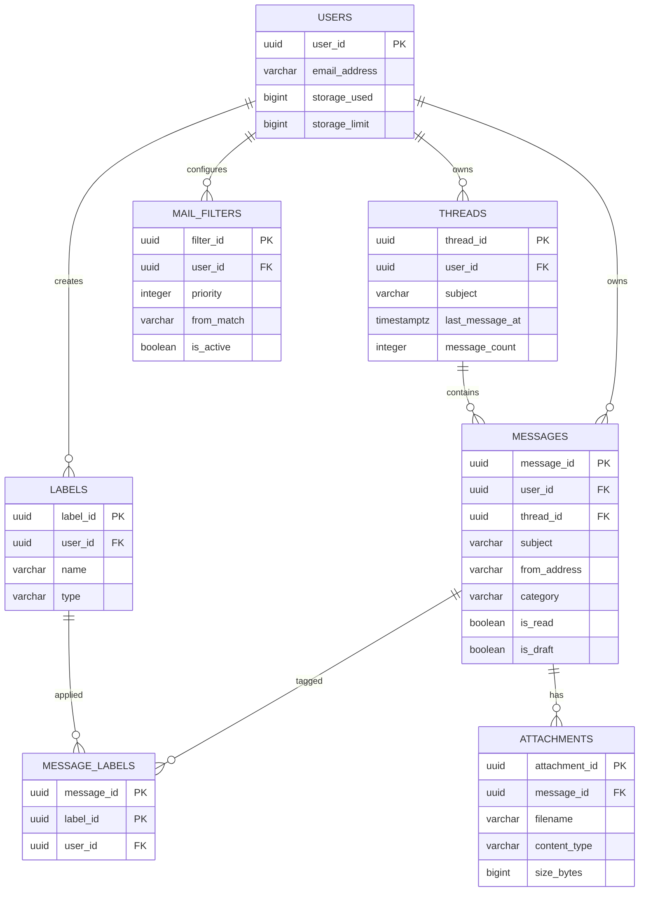
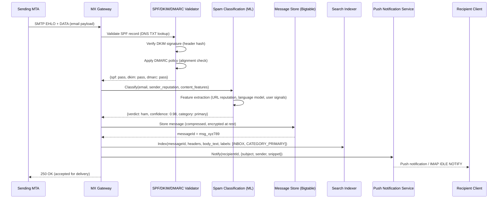
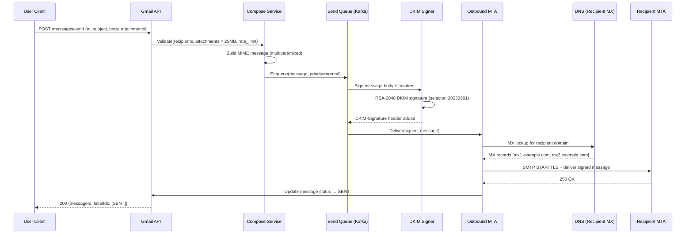
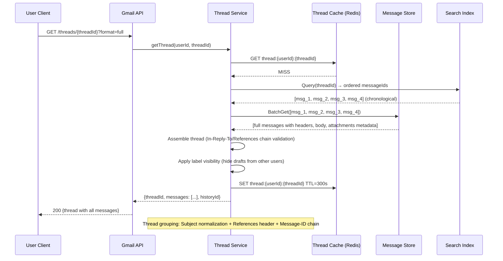

# Gmail / Email System Design

## 1. Functional Requirements

### Core Features
- **Send/Receive Emails**: SMTP outbound, IMAP/POP3 inbound, REST API
- **Mailbox Management**: Labels (multiple per message), folders, archiving, starring
- **Email Threading**: Conversation view grouping related messages
- **Spam Filtering**: ML-based classification, user-reported spam
- **Full-Text Search**: Search across all mail fields with operators
- **Attachments**: Large file support (up to 25MB inline, 50MB via cloud)
- **Priority Inbox**: ML-based categorization (Primary, Social, Promotions, Updates)
- **Filters/Rules**: Auto-label, auto-archive, auto-forward based on conditions
- **Undo Send**: Configurable delay (5-30s) before actual delivery
- **Confidential Mode**: Expiring messages, revoke access, no forwarding

### Out of Scope
- Calendar integration
- Chat/Meet within Gmail
- Google Workspace admin console

## 2. Non-Functional Requirements

| Requirement | Target |
|-------------|--------|
| Availability | 99.99% |
| Send Latency (p99) | <2s for delivery to our own servers |
| Search Latency (p99) | <500ms for single mailbox search |
| Inbox Load (p99) | <200ms |
| Storage per User | 15GB free tier, unlimited for paid |
| Scale | 1.8B users, 300B emails/day sent globally, 500K QPS |
| Spam Detection Accuracy | >99.5% (false positive <0.05%) |
| Delivery Reliability | 99.99% (no lost emails) |
| Consistency | Strong for user's own mailbox |

## 3. Capacity Estimation

### Scale
- 1.8B active users
- 300B emails sent/received per day globally
- Average user: 50 emails/day received, 10 sent
- Average email size: 75KB (including headers, body, small attachments)
- Attachment rate: 20% of emails have attachments, avg attachment: 2MB

### Storage
- Email metadata + body: 1.8B × 50/day × 75KB × 365 days × 3 years = ~3 Exabytes
- Attachments: 300B/day × 20% × 2MB = 120PB/day → deduplicated ~30PB/day
- With deduplication + compression: reduce by 60%
- Active storage: ~1.2 EB, Cold storage: ~2 EB

### Traffic
- Inbound SMTP: 3.5M emails/sec
- API reads (inbox, thread view): 500K QPS
- Search queries: 100K QPS
- Outbound SMTP: 1M emails/sec

### Bandwidth
- Inbound: 3.5M × 75KB = 262GB/s
- Outbound API: 500K × 20KB = 10GB/s
- Search responses: 100K × 5KB = 500MB/s

## 4. Data Modeling

### Entity-Relationship Diagram



### Primary Storage: Bigtable-style (wide column) + PostgreSQL for metadata

```sql
-- User accounts
CREATE TABLE users (
    user_id         UUID PRIMARY KEY,
    email_address   VARCHAR(320) UNIQUE NOT NULL,
    display_name    VARCHAR(255),
    storage_used    BIGINT DEFAULT 0,
    storage_limit   BIGINT DEFAULT 16106127360, -- 15GB
    created_at      TIMESTAMPTZ NOT NULL,
    settings        JSONB DEFAULT '{}',
    is_active       BOOLEAN DEFAULT TRUE
);

-- Labels (system + user-defined)
CREATE TABLE labels (
    label_id        UUID PRIMARY KEY DEFAULT gen_random_uuid(),
    user_id         UUID NOT NULL,
    name            VARCHAR(255) NOT NULL,
    type            VARCHAR(20) NOT NULL, -- system, user
    color           VARCHAR(7),
    visibility      VARCHAR(20) DEFAULT 'show', -- show, hide, showIfUnread
    CONSTRAINT fk_user FOREIGN KEY (user_id) REFERENCES users(user_id),
    CONSTRAINT uq_user_label UNIQUE (user_id, name)
);

-- Messages (core email storage)
CREATE TABLE messages (
    message_id          UUID PRIMARY KEY DEFAULT gen_random_uuid(),
    user_id             UUID NOT NULL,
    thread_id           UUID NOT NULL,
    -- Headers
    message_id_header   VARCHAR(500), -- Message-ID header (RFC 5322)
    in_reply_to         VARCHAR(500),
    references_header   TEXT, -- References header (space-separated message-ids)
    subject             VARCHAR(1000),
    from_address        VARCHAR(320) NOT NULL,
    to_addresses        TEXT[], -- array of recipients
    cc_addresses        TEXT[],
    bcc_addresses       TEXT[],
    reply_to            VARCHAR(320),
    -- Content
    snippet             VARCHAR(500), -- preview text
    body_text           TEXT,
    body_html           TEXT,
    -- Metadata
    internal_date       TIMESTAMPTZ NOT NULL, -- when received by our servers
    size_bytes          INTEGER NOT NULL,
    has_attachments     BOOLEAN DEFAULT FALSE,
    -- Classification
    spam_score          FLOAT DEFAULT 0,
    category            VARCHAR(20) DEFAULT 'primary', -- primary, social, promotions, updates, forums
    importance_score    FLOAT DEFAULT 0.5,
    -- State
    is_read             BOOLEAN DEFAULT FALSE,
    is_starred          BOOLEAN DEFAULT FALSE,
    is_draft            BOOLEAN DEFAULT FALSE,
    is_sent             BOOLEAN DEFAULT FALSE,
    is_trash            BOOLEAN DEFAULT FALSE,
    is_spam             BOOLEAN DEFAULT FALSE,
    is_deleted          BOOLEAN DEFAULT FALSE,
    -- Security
    spf_result          VARCHAR(20),
    dkim_result         VARCHAR(20),
    dmarc_result        VARCHAR(20),
    encryption_type     VARCHAR(20), -- none, tls, e2e
    -- Timestamps
    created_at          TIMESTAMPTZ NOT NULL DEFAULT NOW(),
    trashed_at          TIMESTAMPTZ,
    CONSTRAINT fk_user FOREIGN KEY (user_id) REFERENCES users(user_id)
);

CREATE INDEX idx_messages_user_thread ON messages(user_id, thread_id, internal_date DESC);
CREATE INDEX idx_messages_user_date ON messages(user_id, internal_date DESC) WHERE NOT is_deleted;
CREATE INDEX idx_messages_user_unread ON messages(user_id, internal_date DESC) WHERE NOT is_read AND NOT is_deleted;
CREATE INDEX idx_messages_spam_score ON messages(user_id, spam_score) WHERE spam_score > 0.5;
CREATE INDEX idx_messages_msgid_header ON messages(message_id_header);

-- Message-Label junction (many-to-many)
CREATE TABLE message_labels (
    message_id      UUID NOT NULL,
    label_id        UUID NOT NULL,
    user_id         UUID NOT NULL,
    applied_at      TIMESTAMPTZ DEFAULT NOW(),
    CONSTRAINT pk_message_labels PRIMARY KEY (message_id, label_id),
    CONSTRAINT fk_message FOREIGN KEY (message_id) REFERENCES messages(message_id),
    CONSTRAINT fk_label FOREIGN KEY (label_id) REFERENCES labels(label_id)
);

CREATE INDEX idx_message_labels_user_label ON message_labels(user_id, label_id, applied_at DESC);

-- Threads
CREATE TABLE threads (
    thread_id       UUID PRIMARY KEY DEFAULT gen_random_uuid(),
    user_id         UUID NOT NULL,
    subject         VARCHAR(1000),
    last_message_at TIMESTAMPTZ NOT NULL,
    message_count   INTEGER DEFAULT 1,
    snippet         VARCHAR(500),
    participants    TEXT[],
    has_attachments BOOLEAN DEFAULT FALSE,
    is_read         BOOLEAN DEFAULT FALSE,
    is_important    BOOLEAN DEFAULT FALSE,
    CONSTRAINT fk_user FOREIGN KEY (user_id) REFERENCES users(user_id)
);

CREATE INDEX idx_threads_user_date ON threads(user_id, last_message_at DESC);

-- Attachments
CREATE TABLE attachments (
    attachment_id   UUID PRIMARY KEY DEFAULT gen_random_uuid(),
    message_id      UUID NOT NULL,
    filename        VARCHAR(500) NOT NULL,
    content_type    VARCHAR(255) NOT NULL,
    size_bytes      BIGINT NOT NULL,
    content_hash    VARCHAR(64) NOT NULL, -- SHA-256 for dedup
    storage_path    VARCHAR(1000) NOT NULL, -- GCS/S3 path
    is_inline       BOOLEAN DEFAULT FALSE,
    content_id      VARCHAR(255), -- for inline images
    CONSTRAINT fk_message FOREIGN KEY (message_id) REFERENCES messages(message_id)
);

CREATE INDEX idx_attachments_hash ON attachments(content_hash); -- deduplication
CREATE INDEX idx_attachments_message ON attachments(message_id);

-- Filters/Rules
CREATE TABLE mail_filters (
    filter_id       UUID PRIMARY KEY DEFAULT gen_random_uuid(),
    user_id         UUID NOT NULL,
    priority        INTEGER DEFAULT 0,
    -- Conditions (all must match)
    from_match      VARCHAR(320),
    to_match        VARCHAR(320),
    subject_match   VARCHAR(500),
    has_words       TEXT,
    no_words        TEXT,
    has_attachment   BOOLEAN,
    size_greater    INTEGER,
    -- Actions
    add_label       UUID,
    remove_label    UUID,
    archive         BOOLEAN DEFAULT FALSE,
    mark_read       BOOLEAN DEFAULT FALSE,
    star            BOOLEAN DEFAULT FALSE,
    forward_to      VARCHAR(320),
    delete_it       BOOLEAN DEFAULT FALSE,
    never_spam      BOOLEAN DEFAULT FALSE,
    mark_important  BOOLEAN DEFAULT FALSE,
    categorize_as   VARCHAR(20),
    -- Meta
    is_active       BOOLEAN DEFAULT TRUE,
    created_at      TIMESTAMPTZ NOT NULL DEFAULT NOW(),
    CONSTRAINT fk_user FOREIGN KEY (user_id) REFERENCES users(user_id)
);

-- Send queue (for undo send)
CREATE TABLE send_queue (
    queue_id        UUID PRIMARY KEY DEFAULT gen_random_uuid(),
    user_id         UUID NOT NULL,
    message_id      UUID NOT NULL,
    scheduled_send  TIMESTAMPTZ NOT NULL, -- now + undo_delay
    status          VARCHAR(20) DEFAULT 'pending', -- pending, sent, cancelled
    raw_mime        TEXT NOT NULL, -- complete MIME message
    recipients      TEXT[] NOT NULL,
    created_at      TIMESTAMPTZ NOT NULL DEFAULT NOW()
);

CREATE INDEX idx_send_queue_pending ON send_queue(scheduled_send) WHERE status = 'pending';
```

### Elasticsearch Index Mapping

```json
{
  "email_index": {
    "settings": {
      "number_of_shards": 128,
      "number_of_replicas": 2,
      "analysis": {
        "analyzer": {
          "email_analyzer": {
            "type": "custom",
            "tokenizer": "standard",
            "filter": ["lowercase", "email_domain_split", "ascii_folding"]
          }
        }
      }
    },
    "mappings": {
      "properties": {
        "user_id": {"type": "keyword"},
        "thread_id": {"type": "keyword"},
        "from": {"type": "text", "analyzer": "email_analyzer", "fields": {"raw": {"type": "keyword"}}},
        "to": {"type": "text", "analyzer": "email_analyzer"},
        "subject": {"type": "text", "analyzer": "standard", "fields": {"raw": {"type": "keyword"}}},
        "body": {"type": "text", "analyzer": "standard"},
        "labels": {"type": "keyword"},
        "has_attachment": {"type": "boolean"},
        "attachment_names": {"type": "text"},
        "date": {"type": "date"},
        "size": {"type": "long"},
        "is_read": {"type": "boolean"},
        "is_starred": {"type": "boolean"},
        "category": {"type": "keyword"},
        "spam_score": {"type": "float"}
      }
    }
  }
}
```

### Kafka Topics

```yaml
topics:
  email.inbound.raw:
    partitions: 256
    replication: 3
    retention: 24h
    key: recipient_hash
  email.outbound.queue:
    partitions: 128
    replication: 3
    retention: 48h
    key: sender_id
  email.spam.analysis:
    partitions: 64
    replication: 3
    retention: 7d
    key: message_id
  email.notifications:
    partitions: 128
    replication: 3
    retention: 24h
    key: user_id
  email.indexing:
    partitions: 128
    replication: 3
    retention: 48h
    key: user_id
```

## 5. High-Level Design (HLD)

```
┌─────────────────────────────────────────────────────────────────────────────────────┐
│                              INBOUND EMAIL FLOW                                      │
│                                                                                     │
│  ┌──────────┐    ┌──────────────┐    ┌──────────────┐    ┌──────────────────┐      │
│  │ External │    │  MX Servers  │    │  Spam/Abuse  │    │  Delivery        │      │
│  │  MTA     │───▶│  (SMTP In)   │───▶│  Filter      │───▶│  Pipeline        │      │
│  │          │    │              │    │              │    │                  │      │
│  └──────────┘    │  - TLS       │    │  - SPF/DKIM  │    │  - Threading     │      │
│                  │  - Rate limit │    │  - DMARC     │    │  - Categorize    │      │
│                  │  - MX routing │    │  - ML Model  │    │  - Apply filters │      │
│                  └──────────────┘    │  - URL scan  │    │  - Store         │      │
│                                      └──────────────┘    │  - Index         │      │
│                                                          │  - Notify        │      │
│                                                          └──────────────────┘      │
└─────────────────────────────────────────────────────────────────────────────────────┘

┌─────────────────────────────────────────────────────────────────────────────────────┐
│                              CLIENT / API LAYER                                      │
│                                                                                     │
│  ┌──────────┐  ┌──────────┐  ┌──────────┐  ┌──────────────────┐                   │
│  │  Web     │  │  Mobile  │  │  IMAP    │  │  API Clients     │                   │
│  │  Client  │  │  Apps    │  │  Clients │  │  (3rd party)     │                   │
│  └────┬─────┘  └────┬─────┘  └────┬─────┘  └────────┬─────────┘                   │
└───────┼──────────────┼─────────────┼─────────────────┼──────────────────────────────┘
        │              │             │                  │
        ▼              ▼             ▼                  ▼
┌─────────────────────────────────────────────────────────────────────────────────────┐
│                         API GATEWAY / LOAD BALANCER                                  │
│  ┌─────────────────────────────────────────────────────────────────────────────┐    │
│  │  Auth │ Rate Limit │ Request Route │ IMAP Proxy │ TLS │ Request Coalescing  │    │
│  └─────────────────────────────────────────────────────────────────────────────┘    │
└─────────────────────────────────────────────────────────────────────────────────────┘
        │              │                    │                    │
        ▼              ▼                    ▼                    ▼
┌──────────────┐  ┌──────────────────┐  ┌──────────────────┐  ┌──────────────────┐
│  Mailbox     │  │  Compose/Send    │  │  Search          │  │  Notification    │
│  Service     │  │  Service         │  │  Service         │  │  Service         │
│              │  │                  │  │                  │  │                  │
│  - List msgs │  │  - Draft mgmt   │  │  - Full text     │  │  - Push          │
│  - Thread    │  │  - MIME build    │  │  - Operators     │  │  - Email (fwd)   │
│  - Labels    │  │  - Undo queue   │  │  - Autocomplete  │  │  - Desktop       │
│  - Filters   │  │  - Outbound MTA │  │  - Suggestions   │  │                  │
└──────┬───────┘  └────────┬─────────┘  └────────┬─────────┘  └──────┬───────────┘
       │                   │                      │                    │
       ▼                   ▼                      ▼                    ▼
┌─────────────────────────────────────────────────────────────────────────────────────┐
│                              MESSAGE BUS (Kafka)                                     │
│  ┌────────────┐  ┌──────────────┐  ┌──────────────┐  ┌────────────────────────┐    │
│  │ inbound.*  │  │ outbound.*   │  │ indexing.*   │  │ spam.analysis         │    │
│  └────────────┘  └──────────────┘  └──────────────┘  └────────────────────────┘    │
└─────────────────────────────────────────────────────────────────────────────────────┘
       │                   │                      │                    │
       ▼                   ▼                      ▼                    ▼
┌─────────────────────────────────────────────────────────────────────────────────────┐
│                              DATA LAYER                                              │
│  ┌───────────────┐  ┌──────────────┐  ┌──────────────┐  ┌───────────────────┐      │
│  │  Bigtable /   │  │    Redis     │  │ Elasticsearch│  │  Blob Storage     │      │
│  │  Cassandra    │  │   Cluster    │  │              │  │  (GCS/S3)         │      │
│  │               │  │              │  │              │  │                   │      │
│  │  - Messages   │  │  - Sessions  │  │  - Email     │  │  - Attachments    │      │
│  │  - Threads    │  │  - Counters  │  │    full-text │  │  - Large bodies   │      │
│  │  - Labels     │  │  - Rate lim  │  │  - Facets    │  │  - Exports        │      │
│  │  - Metadata   │  │  - PubSub    │  │              │  │                   │      │
│  └───────────────┘  └──────────────┘  └──────────────┘  └───────────────────┘      │
└─────────────────────────────────────────────────────────────────────────────────────┘
```

## 6. Low-Level Design (LLD) - APIs

### Send Email API

```http
POST /api/v1/messages/send
Content-Type: application/json
Authorization: Bearer {token}

{
  "to": ["alice@example.com", "bob@example.com"],
  "cc": ["carol@example.com"],
  "bcc": [],
  "subject": "Project Update - Q1 Results",
  "body": {
    "text": "Hi team, here are the Q1 results...",
    "html": "<html><body><h1>Q1 Results</h1>...</body></html>"
  },
  "attachments": [
    {
      "filename": "q1-report.pdf",
      "contentType": "application/pdf",
      "data": "base64encodedcontent...",
      "size": 2048576
    }
  ],
  "replyTo": "msg_abc123",
  "threadId": "thread_xyz789",
  "labels": ["label_work"],
  "confidentialMode": {
    "expireTime": "2024-04-18T00:00:00Z",
    "requirePasscode": true
  },
  "sendAt": null,
  "undoDelay": 10
}
```

**Response:**
```json
{
  "messageId": "msg_def456",
  "threadId": "thread_xyz789",
  "labelIds": ["SENT", "label_work"],
  "status": "queued",
  "undoToken": "undo_ghi789",
  "undoExpiresAt": "2024-03-18T10:00:10Z",
  "estimatedDelivery": "2024-03-18T10:00:12Z"
}
```

### Search API

```http
GET /api/v1/messages/search?q=from:alice@example.com+has:attachment+after:2024/01/01+subject:"quarterly report"&maxResults=20&pageToken={token}
Authorization: Bearer {token}
```

**Response:**
```json
{
  "messages": [
    {
      "id": "msg_abc123",
      "threadId": "thread_xyz",
      "snippet": "Hi team, attached is the quarterly report for...",
      "from": {"name": "Alice Smith", "email": "alice@example.com"},
      "subject": "Quarterly Report Q4 2023",
      "date": "2024-01-15T09:30:00Z",
      "labels": ["INBOX", "IMPORTANT"],
      "hasAttachment": true,
      "isRead": true,
      "sizeEstimate": 3145728
    }
  ],
  "resultSizeEstimate": 15,
  "nextPageToken": "token_next_page"
}
```

### Thread View API

```http
GET /api/v1/threads/{thread_id}?format=full
Authorization: Bearer {token}
```

**Response:**
```json
{
  "threadId": "thread_xyz789",
  "subject": "Project Update - Q1 Results",
  "messageCount": 5,
  "messages": [
    {
      "id": "msg_001",
      "from": {"name": "Alice", "email": "alice@example.com"},
      "to": [{"name": "Team", "email": "team@example.com"}],
      "date": "2024-03-15T10:00:00Z",
      "snippet": "Hi team, here are the Q1 results...",
      "body": {"text": "...", "html": "..."},
      "labels": ["INBOX", "IMPORTANT"],
      "isRead": true,
      "attachments": [
        {"id": "att_001", "filename": "report.pdf", "size": 2048576, "mimeType": "application/pdf"}
      ]
    }
  ],
  "participants": ["alice@example.com", "bob@example.com", "carol@example.com"]
}
```

## 7. Deep Dives

### Deep Dive 1: Email Delivery Pipeline (MTA)

```
┌──────────────────────────────────────────────────────────────────────────┐
│                    INBOUND EMAIL DELIVERY PIPELINE                        │
│                                                                          │
│  External MTA                                                            │
│       │                                                                  │
│       ▼                                                                  │
│  ┌─────────────┐   DNS MX lookup resolves to our MX servers             │
│  │ MX Gateway  │   (mx1.gmail.com, mx2.gmail.com, ...)                  │
│  │             │                                                         │
│  │ 1. TCP conn │                                                         │
│  │ 2. STARTTLS │                                                         │
│  │ 3. EHLO     │                                                         │
│  │ 4. MAIL FROM│                                                         │
│  │ 5. RCPT TO  │──▶ Verify recipient exists (quick lookup)              │
│  │ 6. DATA     │                                                         │
│  └──────┬──────┘                                                         │
│         │                                                                │
│         ▼                                                                │
│  ┌─────────────────────────────────────────────┐                         │
│  │         AUTHENTICATION LAYER                 │                         │
│  │                                             │                         │
│  │  ┌─────────┐  ┌─────────┐  ┌─────────────┐ │                         │
│  │  │   SPF   │  │  DKIM   │  │   DMARC     │ │                         │
│  │  │         │  │         │  │             │ │                         │
│  │  │ Check   │  │ Verify  │  │ Policy      │ │                         │
│  │  │ sender  │  │ crypto  │  │ alignment   │ │                         │
│  │  │ IP auth │  │ sig     │  │ + action    │ │                         │
│  │  └─────────┘  └─────────┘  └─────────────┘ │                         │
│  └──────────────────┬──────────────────────────┘                         │
│                     │                                                    │
│                     ▼                                                    │
│  ┌─────────────────────────────────────────────┐                         │
│  │         SPAM SCORING ENGINE                  │                         │
│  │                                             │                         │
│  │  Input features → ML Model → Score [0,1]   │                         │
│  │                                             │                         │
│  │  score < 0.3  → Inbox                       │                         │
│  │  0.3 ≤ score < 0.7 → Promotions/Social     │                         │
│  │  score ≥ 0.7  → Spam folder                 │                         │
│  │  score ≥ 0.95 → Reject (550)               │                         │
│  └──────────────────┬──────────────────────────┘                         │
│                     │                                                    │
│                     ▼                                                    │
│  ┌─────────────────────────────────────────────┐                         │
│  │         DELIVERY & STORAGE                   │                         │
│  │                                             │                         │
│  │  1. Parse MIME → extract parts              │                         │
│  │  2. Thread assignment (see Deep Dive 3)     │                         │
│  │  3. Apply user filters/rules                │                         │
│  │  4. Categorize (Primary/Social/Promo/...)   │                         │
│  │  5. Store message + attachments             │                         │
│  │  6. Update search index (async)             │                         │
│  │  7. Send notification (push/desktop)        │                         │
│  └─────────────────────────────────────────────┘                         │
└──────────────────────────────────────────────────────────────────────────┘
```

#### SMTP Implementation Details

```python
import asyncio
import dns.resolver
from dataclasses import dataclass
from typing import List, Optional
import hashlib
import dkim
import spf

@dataclass
class EmailEnvelope:
    mail_from: str
    rcpt_to: List[str]
    data: bytes  # raw MIME
    source_ip: str
    helo_domain: str
    tls_version: Optional[str]

class InboundMTA:
    """
    Mail Transfer Agent handling inbound SMTP connections.
    Implements RFC 5321 (SMTP), RFC 6376 (DKIM), RFC 7208 (SPF), RFC 7489 (DMARC).
    """
    
    MAX_MESSAGE_SIZE = 35 * 1024 * 1024  # 35MB
    MAX_RECIPIENTS = 100
    CONNECTION_TIMEOUT = 300  # 5 min
    
    async def handle_connection(self, reader, writer):
        """Handle a single SMTP connection."""
        writer.write(b"220 mx.gmail.com ESMTP ready\r\n")
        await writer.drain()
        
        envelope = EmailEnvelope(mail_from="", rcpt_to=[], data=b"", 
                                  source_ip="", helo_domain="", tls_version=None)
        
        while True:
            line = await asyncio.wait_for(reader.readline(), self.CONNECTION_TIMEOUT)
            command = line.decode().strip()
            
            if command.upper().startswith("EHLO"):
                envelope.helo_domain = command.split()[1] if len(command.split()) > 1 else ""
                capabilities = [
                    "250-mx.gmail.com",
                    "250-SIZE 36700160",
                    "250-STARTTLS",
                    "250-8BITMIME",
                    "250 CHUNKING"
                ]
                writer.write(("\r\n".join(capabilities) + "\r\n").encode())
                
            elif command.upper() == "STARTTLS":
                writer.write(b"220 Ready to start TLS\r\n")
                await writer.drain()
                # Upgrade to TLS
                # ssl_context = create_ssl_context()
                # ... TLS handshake
                envelope.tls_version = "TLSv1.3"
                
            elif command.upper().startswith("MAIL FROM:"):
                envelope.mail_from = self._extract_address(command)
                # Rate check
                if await self._is_rate_limited(envelope.source_ip, envelope.mail_from):
                    writer.write(b"421 Too many connections, try again later\r\n")
                    break
                writer.write(b"250 OK\r\n")
                
            elif command.upper().startswith("RCPT TO:"):
                rcpt = self._extract_address(command)
                if not await self._recipient_exists(rcpt):
                    writer.write(b"550 No such user\r\n")
                    continue
                if len(envelope.rcpt_to) >= self.MAX_RECIPIENTS:
                    writer.write(b"452 Too many recipients\r\n")
                    continue
                envelope.rcpt_to.append(rcpt)
                writer.write(b"250 OK\r\n")
                
            elif command.upper() == "DATA":
                writer.write(b"354 Start mail input\r\n")
                await writer.drain()
                data = await self._read_data(reader)
                envelope.data = data
                
                # Process the email
                result = await self._process_email(envelope)
                if result.accepted:
                    writer.write(f"250 OK {result.queue_id}\r\n".encode())
                else:
                    writer.write(f"550 {result.error}\r\n".encode())
                    
            elif command.upper() == "QUIT":
                writer.write(b"221 Bye\r\n")
                break
    
    async def _process_email(self, envelope: EmailEnvelope) -> 'DeliveryResult':
        """Full processing pipeline for received email."""
        
        # Step 1: Authentication
        auth_result = await self._authenticate(envelope)
        
        # Step 2: Spam scoring
        spam_score = await self._compute_spam_score(envelope, auth_result)
        
        # Step 3: Reject if clearly spam
        if spam_score >= 0.95:
            return DeliveryResult(accepted=False, error="Message rejected as spam")
        
        # Step 4: Deliver to each recipient
        for recipient in envelope.rcpt_to:
            await self._deliver_to_mailbox(recipient, envelope, auth_result, spam_score)
        
        return DeliveryResult(accepted=True, queue_id=self._generate_queue_id())
    
    async def _authenticate(self, envelope: EmailEnvelope) -> dict:
        """Run SPF, DKIM, DMARC checks."""
        results = {}
        
        # SPF: Check if source IP is authorized for sender domain
        sender_domain = envelope.mail_from.split("@")[1]
        results['spf'] = spf.check2(
            i=envelope.source_ip, 
            s=envelope.mail_from, 
            h=envelope.helo_domain
        )[0]  # pass, fail, softfail, neutral, none
        
        # DKIM: Verify cryptographic signature
        try:
            results['dkim'] = 'pass' if dkim.verify(envelope.data) else 'fail'
        except Exception:
            results['dkim'] = 'none'
        
        # DMARC: Check alignment
        results['dmarc'] = await self._check_dmarc(
            sender_domain, results['spf'], results['dkim'], envelope
        )
        
        return results


class OutboundMTA:
    """Handles sending emails to external recipients."""
    
    MAX_RETRIES = 5
    RETRY_DELAYS = [60, 300, 1800, 7200, 28800]  # 1m, 5m, 30m, 2h, 8h
    
    async def send(self, message: dict, recipients: List[str]):
        """
        Send email to external recipients.
        Groups by domain for efficiency, handles MX lookup and retry.
        """
        # Group recipients by domain
        by_domain = {}
        for rcpt in recipients:
            domain = rcpt.split("@")[1]
            by_domain.setdefault(domain, []).append(rcpt)
        
        for domain, rcpts in by_domain.items():
            await self._deliver_to_domain(domain, rcpts, message)
    
    async def _deliver_to_domain(self, domain: str, recipients: List[str], message: dict):
        """Deliver to all recipients at a specific domain."""
        # DNS MX lookup with caching
        mx_records = await self._resolve_mx(domain)
        
        for mx in sorted(mx_records, key=lambda x: x.preference):
            try:
                await self._smtp_deliver(mx.exchange, recipients, message)
                return  # Success
            except (ConnectionError, TimeoutError):
                continue  # Try next MX
        
        # All MX failed - queue for retry
        await self._queue_retry(domain, recipients, message, attempt=1)
    
    async def _resolve_mx(self, domain: str) -> list:
        """DNS MX lookup with cache."""
        cache_key = f"mx:{domain}"
        cached = await self.redis.get(cache_key)
        if cached:
            return cached
        
        try:
            answers = dns.resolver.resolve(domain, 'MX')
            mx_list = [(r.preference, str(r.exchange)) for r in answers]
            await self.redis.setex(cache_key, 3600, mx_list)
            return mx_list
        except dns.resolver.NXDOMAIN:
            raise PermanentFailure(f"Domain {domain} does not exist")
```

### Deep Dive 2: Spam/Abuse Detection

```python
import numpy as np
from typing import Dict, List
from dataclasses import dataclass

@dataclass
class SpamFeatures:
    # Sender reputation
    sender_domain_age_days: int
    sender_volume_24h: int
    sender_spam_rate_30d: float
    sender_ip_reputation: float  # 0-1
    
    # Authentication
    spf_pass: bool
    dkim_pass: bool
    dmarc_pass: bool
    
    # Content features
    subject_caps_ratio: float
    body_link_count: int
    body_image_only: bool
    suspicious_url_count: int
    unsubscribe_header: bool
    known_phishing_patterns: int
    
    # Behavioral
    recipient_count: int
    is_bulk: bool
    similar_msgs_sent_1h: int
    bounce_rate_sender: float

class SpamClassifier:
    """
    Multi-layer spam detection combining:
    1. Rule-based pre-filters (fast reject)
    2. Bayesian classifier (token probabilities)
    3. Deep neural network (content + behavioral features)
    4. Reputation scoring (sender/domain/IP history)
    """
    
    def __init__(self, model_path: str):
        self.neural_model = self._load_model(model_path)
        self.bayesian = BayesianFilter()
        self.reputation_db = ReputationDB()
    
    async def score(self, envelope: 'EmailEnvelope', auth_result: dict) -> float:
        """
        Compute spam score in [0, 1].
        Combines multiple signals with weighted ensemble.
        """
        features = await self._extract_features(envelope, auth_result)
        
        # Layer 1: Hard rules (instant reject/accept)
        hard_result = self._apply_hard_rules(features)
        if hard_result is not None:
            return hard_result
        
        # Layer 2: Bayesian score
        bayesian_score = self.bayesian.classify(envelope.data)
        
        # Layer 3: Neural network score
        feature_vector = self._featurize(features)
        nn_score = self.neural_model.predict(feature_vector)[0]
        
        # Layer 4: Reputation score
        rep_score = await self.reputation_db.get_score(
            features.sender_ip_reputation,
            envelope.mail_from.split("@")[1]
        )
        
        # Weighted ensemble
        final_score = (
            0.15 * bayesian_score +
            0.50 * nn_score +
            0.25 * rep_score +
            0.10 * self._auth_penalty(auth_result)
        )
        
        return min(max(final_score, 0.0), 1.0)
    
    def _apply_hard_rules(self, features: SpamFeatures) -> float:
        """Fast path for obvious spam/ham."""
        # Known good: authenticated, low volume, good reputation
        if (features.spf_pass and features.dkim_pass and 
            features.sender_spam_rate_30d < 0.001 and
            features.sender_ip_reputation > 0.95):
            return 0.01  # Almost certainly ham
        
        # Known bad: failed auth + high volume + many bounces
        if (not features.spf_pass and not features.dkim_pass and
            features.sender_volume_24h > 10000 and
            features.bounce_rate_sender > 0.5):
            return 0.99  # Almost certainly spam
        
        return None  # Need ML scoring
    
    def _auth_penalty(self, auth_result: dict) -> float:
        """Penalty for failed authentication."""
        penalty = 0.0
        if auth_result.get('spf') == 'fail':
            penalty += 0.3
        if auth_result.get('dkim') == 'fail':
            penalty += 0.3
        if auth_result.get('dmarc') == 'fail':
            penalty += 0.4
        return penalty


class OutboundAbuseDetector:
    """
    Prevents our platform from being used for spam.
    Rate limits and monitors outbound email patterns.
    """
    
    LIMITS = {
        'free_user': {'per_day': 500, 'per_hour': 100, 'recipients_per_msg': 100},
        'paid_user': {'per_day': 2000, 'per_hour': 500, 'recipients_per_msg': 500},
    }
    
    async def check_outbound(self, user_id: str, message: dict) -> bool:
        """Returns True if message should be allowed."""
        user_tier = await self._get_user_tier(user_id)
        limits = self.LIMITS[user_tier]
        
        # Rate check
        hourly_count = await self.redis.incr(f"outbound:{user_id}:hour")
        if hourly_count > limits['per_hour']:
            await self._flag_user(user_id, "rate_limit_exceeded")
            return False
        
        # Recipient count check
        if len(message['recipients']) > limits['recipients_per_msg']:
            return False
        
        # Content similarity check (catch mass spam)
        content_hash = hashlib.md5(message['body'][:1000].encode()).hexdigest()
        similar_count = await self.redis.incr(f"content_hash:{content_hash}:{user_id}")
        if similar_count > 50:  # Same content to 50+ different recipients
            await self._flag_user(user_id, "bulk_identical_content")
            return False
        
        # Bounce rate check
        bounce_rate = await self._get_bounce_rate(user_id)
        if bounce_rate > 0.1:  # >10% bounces
            await self._throttle_user(user_id)
            return False
        
        return True
```

### Deep Dive 3: Email Threading

```python
from typing import Optional, List, Dict
from dataclasses import dataclass
import re

@dataclass
class ThreadMatch:
    thread_id: str
    confidence: float
    method: str  # "references", "in_reply_to", "subject"

class EmailThreader:
    """
    Groups emails into conversation threads using:
    1. References header (RFC 5322) - highest confidence
    2. In-Reply-To header - high confidence
    3. Subject-based matching - fallback with lower confidence
    
    Gmail's threading algorithm:
    - Same thread if References/In-Reply-To matches any message in thread
    - Subject match (stripped Re:/Fwd:) within 30-day window
    - Sender must overlap with thread participants
    """
    
    SUBJECT_PREFIXES = re.compile(r'^(Re|Fwd|Fw|RE|FW):\s*', re.IGNORECASE)
    THREAD_WINDOW = 30 * 24 * 3600  # 30 days
    
    async def assign_thread(self, message: dict, user_id: str) -> str:
        """
        Assign incoming message to existing thread or create new one.
        Returns thread_id.
        """
        # Method 1: Check References header
        if message.get('references_header'):
            msg_ids = message['references_header'].split()
            for ref_id in reversed(msg_ids):  # Check most recent first
                thread = await self._find_thread_by_message_id(user_id, ref_id)
                if thread:
                    return thread.thread_id
        
        # Method 2: Check In-Reply-To header
        if message.get('in_reply_to'):
            thread = await self._find_thread_by_message_id(user_id, message['in_reply_to'])
            if thread:
                return thread.thread_id
        
        # Method 3: Subject-based matching (fallback)
        clean_subject = self._strip_prefixes(message.get('subject', ''))
        if clean_subject and len(clean_subject) > 3:
            thread = await self._find_thread_by_subject(
                user_id, clean_subject, message['from_address'], 
                message['internal_date']
            )
            if thread and thread.confidence > 0.7:
                return thread.thread_id
        
        # No match - create new thread
        return await self._create_thread(user_id, message)
    
    async def _find_thread_by_message_id(self, user_id: str, message_id: str) -> Optional[ThreadMatch]:
        """Look up thread containing a message with this Message-ID header."""
        result = await self.db.fetchrow("""
            SELECT thread_id FROM messages 
            WHERE user_id = $1 AND message_id_header = $2
            LIMIT 1
        """, user_id, message_id)
        
        if result:
            return ThreadMatch(
                thread_id=result['thread_id'],
                confidence=1.0,
                method="references"
            )
        return None
    
    async def _find_thread_by_subject(self, user_id: str, subject: str, 
                                       sender: str, date: int) -> Optional[ThreadMatch]:
        """
        Find thread with matching subject within time window.
        Additional check: sender must be a participant in the thread.
        """
        window_start = date - self.THREAD_WINDOW
        
        result = await self.db.fetchrow("""
            SELECT t.thread_id, t.participants
            FROM threads t
            WHERE t.user_id = $1 
              AND t.subject = $2
              AND t.last_message_at > to_timestamp($3)
            ORDER BY t.last_message_at DESC
            LIMIT 1
        """, user_id, subject, window_start)
        
        if result:
            # Verify sender overlap
            participants = set(result['participants'])
            sender_domain = sender.split('@')[1]
            
            confidence = 0.8
            if sender in participants:
                confidence = 0.95
            elif any(p.endswith(f"@{sender_domain}") for p in participants):
                confidence = 0.85
            else:
                confidence = 0.6  # Subject match only, no participant overlap
            
            return ThreadMatch(
                thread_id=result['thread_id'],
                confidence=confidence,
                method="subject"
            )
        return None
    
    def _strip_prefixes(self, subject: str) -> str:
        """Remove Re:/Fwd: prefixes recursively."""
        prev = None
        while prev != subject:
            prev = subject
            subject = self.SUBJECT_PREFIXES.sub('', subject).strip()
        return subject
    
    async def _create_thread(self, user_id: str, message: dict) -> str:
        """Create a new thread for this message."""
        thread_id = generate_uuid()
        await self.db.execute("""
            INSERT INTO threads (thread_id, user_id, subject, last_message_at, 
                                 message_count, snippet, participants)
            VALUES ($1, $2, $3, $4, 1, $5, $6)
        """, thread_id, user_id, 
            self._strip_prefixes(message.get('subject', '')),
            message['internal_date'],
            message.get('snippet', ''),
            list(set([message['from_address']] + message.get('to_addresses', [])))
        )
        return thread_id
```

## 8. Component Optimization

### Storage Tiering

```
Hot (SSD): Last 30 days of email → instant access
Warm (HDD): 30 days - 1 year → <500ms access
Cold (Object Storage): >1 year → <5s access (lazy load)

Migration: Background job moves messages between tiers based on age + access patterns
Exception: Starred/important messages stay in hot tier regardless of age
```

### Search Index Optimization

```
Strategy: Per-user index sharding
- Each user's mail indexed in a logical shard
- Shard assignment: hash(user_id) % num_shards
- Index refresh: Near real-time (1s delay) for inbox, 30s for archive

Query optimization:
- Boolean queries (from:X AND has:attachment) → Elasticsearch bool query
- Date-scoped queries → time-based index partitioning
- Autocomplete → edge-ngram tokenizer on contacts

Index size management:
- Attachment content NOT indexed (only filenames)
- Body truncated to first 100KB for indexing
- Old emails: reduced indexing (metadata only after 5 years)
```

### Connection Optimization for IMAP

```yaml
imap_proxy:
  connection_pooling: true
  max_idle_connections: 50000
  keepalive_interval: 30s
  compression: DEFLATE
  
  # IMAP IDLE (push notifications over IMAP)
  idle_timeout: 29m  # RFC recommends <30m
  idle_connections_per_pod: 100000
  
  # Bandwidth optimization
  partial_fetch: true  # BODY.PEEK[HEADER] without full body
  condstore: true  # RFC 7162 - only fetch changes since MODSEQ
```

### Email Deduplication

```python
class AttachmentDeduplicator:
    """
    Content-addressed storage for attachments.
    Same file sent to 1000 recipients stored once.
    """
    
    async def store(self, content: bytes, metadata: dict) -> str:
        content_hash = hashlib.sha256(content).hexdigest()
        storage_path = f"attachments/{content_hash[:2]}/{content_hash[2:4]}/{content_hash}"
        
        # Check if already exists
        if not await self.storage.exists(storage_path):
            await self.storage.upload(storage_path, content)
        
        # Increment reference count
        await self.redis.incr(f"attachment_refs:{content_hash}")
        
        return storage_path
```

## 9. Observability

### Metrics

```yaml
metrics:
  # Delivery pipeline
  - name: email_delivery_duration_seconds
    type: histogram
    labels: [stage, result] # stage: auth, spam, store, notify
    buckets: [0.01, 0.05, 0.1, 0.5, 1.0, 5.0]
  
  - name: email_inbound_total
    type: counter
    labels: [result, spam_category] # result: delivered, rejected, bounced
  
  - name: email_outbound_total
    type: counter
    labels: [result, tls_version]
  
  # Spam metrics
  - name: spam_score_distribution
    type: histogram
    labels: [auth_result]
    buckets: [0.1, 0.2, 0.3, 0.5, 0.7, 0.9, 0.95]
  
  - name: spam_false_positive_reports_total
    type: counter
    labels: [category]
  
  # Search
  - name: email_search_duration_seconds
    type: histogram
    labels: [query_type, result_count_bucket]
  
  # Storage
  - name: mailbox_storage_bytes
    type: gauge
    labels: [tier] # hot, warm, cold
  
  - name: attachment_dedup_ratio
    type: gauge
    
  # SMTP connections
  - name: smtp_connections_active
    type: gauge
    labels: [direction, tls]
  
  - name: smtp_delivery_attempts_total
    type: counter
    labels: [result, retry_count]
```

### Alerting

```yaml
alerts:
  - name: DeliveryLatencyHigh
    expr: histogram_quantile(0.99, email_delivery_duration_seconds{stage="total"}) > 5
    severity: critical
    
  - name: SpamFalsePositiveSpike
    expr: rate(spam_false_positive_reports_total[1h]) > 100
    severity: warning
    description: "Users reporting ham as incorrectly classified spam"
    
  - name: OutboundBounceRateHigh
    expr: rate(email_outbound_total{result="bounced"}[1h]) / rate(email_outbound_total[1h]) > 0.05
    severity: warning
    
  - name: SearchIndexLag
    expr: email_search_index_lag_seconds > 60
    severity: warning
```

## 10. Considerations

### Undo Send Implementation

```
Flow:
1. User clicks "Send" → message saved to send_queue with delay
2. Timer starts (5-30s configurable)
3. During window: user can click "Undo" → status = cancelled
4. After window: worker picks up → actual SMTP delivery
5. UI shows "Message sent" immediately but delivery is deferred

Edge case: Network failure during undo window
  → Client retries cancel request
  → Server checks: if already sent → return error "too late"
```

### Confidential Mode

```
Implementation:
- Message body stored separately with TTL
- Recipients get link, not content
- Access requires authentication (optionally SMS passcode)
- No forwarding: JS disables forward/copy/print in web UI
- Expiry: background job deletes body at expiry time
- Revoke: sender can invalidate access token immediately

Limitation: Cannot prevent screenshots or dedicated recipients
```

### Bounce Handling

```
Bounce types:
- Hard bounce (550): Permanent failure → remove from future sends, notify sender
- Soft bounce (4xx): Temporary → retry with backoff
- NDR (Non-Delivery Report): Parse DSN format, extract original message

Retry strategy:
  Attempt 1: immediate
  Attempt 2: +1 minute
  Attempt 3: +5 minutes
  Attempt 4: +30 minutes
  Attempt 5: +2 hours
  Attempt 6: +8 hours
  Final: after 48h → generate NDR to sender
```

### Data Compliance

```
- GDPR: Right to deletion (cascade through all storage tiers)
- Legal hold: Mark messages as non-deletable during litigation
- Data residency: Store EU users' data in EU regions
- Encryption at rest: AES-256 for all stored messages
- Encryption in transit: TLS 1.3 mandatory for inter-server, opportunistic for external
- Audit log: All access to mailbox by admins logged immutably
```

## 11. Failure Scenarios & Recovery

| Failure | Impact | Mitigation |
|---------|--------|------------|
| MX server down | Inbound email queues at sender | Multiple MX records, DNS failover |
| Spam model corruption | Spam in inbox or ham in spam | Model canary, instant rollback, rule-based fallback |
| Search index corruption | Search returns incomplete results | Rebuild from message store, degraded mode |
| Attachment storage failure | Can't download files | Multi-region replication, fallback to secondary |
| Threading error | Messages in wrong conversation | Allow manual thread splitting, self-healing job |
| Send queue failure | Delayed sending | Replicated queue, at-least-once delivery semantics |

---

---

## 12. Sequence Diagrams

### 12.1 Incoming Email → Spam Check → Inbox Delivery



### 12.2 Email Send with DKIM/SPF Authentication



### 12.3 Thread View Assembly (Conversation Grouping)



### Caching Strategy

| Layer | Technology | Data Cached | TTL | Invalidation |
|-------|-----------|-------------|-----|--------------|
| Client-side | Browser/App cache | Message list, thread snippets | Until historyId changes | Push invalidation via sync |
| CDN/Edge | Regional CDN | Static attachments, profile images | 24h | Cache-Control headers |
| API Gateway | Redis Cluster | Thread views, label counts | 5 min | Event-driven (on new message) |
| Message metadata | Redis | Headers, snippet, labelIds | 30 min | Write-through on label change |
| Search results | Memcached | Recent search query results | 60s | Short TTL (acceptable staleness) |
| Spam model features | Local cache (per node) | Sender reputation scores | 10 min | Periodic refresh from feature store |

**Cache Architecture:**
- **Write-through** for label changes (user moves email → immediate cache update)
- **Write-behind** for read receipts and history tracking (batched)
- **Cache-aside** for thread assembly (expensive join, worth caching)
- **Negative caching** for deleted messages (tombstone with short TTL to prevent store hits)
- **Cache warming** on login: prefetch inbox top-50, priority senders

