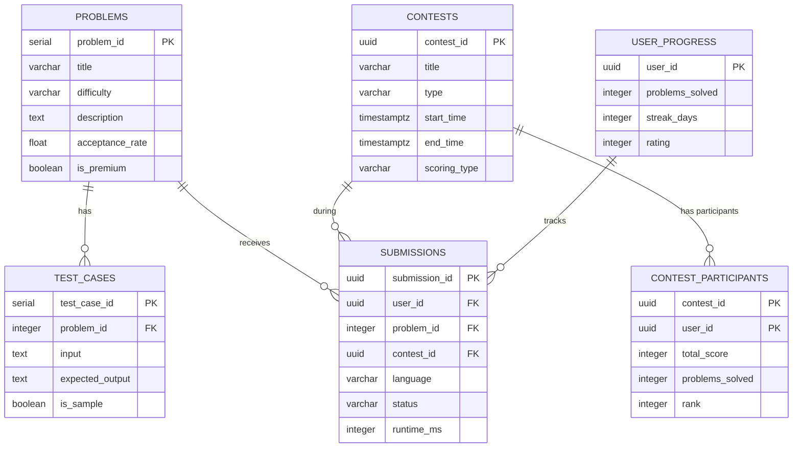
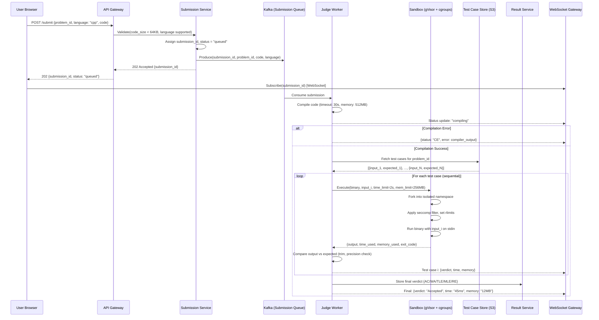
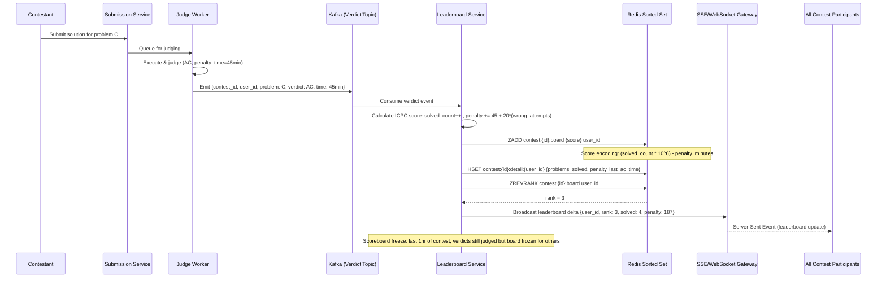
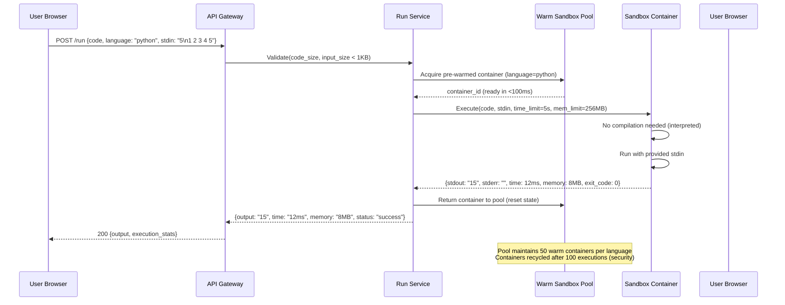

# Online Judge (LeetCode) System Design

## 1. Functional Requirements

### Core Features
- **Problem Catalog**: Browse/search problems with difficulty, tags, companies
- **Code Submission**: Multi-language support (Python, Java, C++, Go, JS, etc.)
- **Sandboxed Execution**: Secure isolated code execution with resource limits
- **Verdicts**: AC (Accepted), WA (Wrong Answer), TLE (Time Limit Exceeded), MLE (Memory Limit Exceeded), RE (Runtime Error), CE (Compilation Error)
- **Contest Mode**: Real-time competitive programming contests
- **Custom Test Cases**: Run code against user-provided inputs before submission
- **User Progress Tracking**: Solve count, streak, skill analysis
- **Editorials & Discussions**: Official solutions, community discussions
- **Plagiarism Detection**: Code similarity detection across submissions

### Out of Scope
- Premium subscription management
- Interview simulation mode
- Video editorial streaming

## 2. Non-Functional Requirements

| Requirement | Target |
|-------------|--------|
| Submission Judging (p99) | <10s for single submission |
| Availability | 99.95% (99.99% during contests) |
| Contest Leaderboard Lag | <3s real-time update |
| Custom Run (p99) | <5s |
| Concurrent Contest Users | 100K simultaneous |
| Total Scale | 20M registered users, 5M MAU |
| Judge Throughput | 10K submissions/min peak (during contests) |
| Sandbox Security | Complete isolation (no escape, no network) |
| Fairness | Identical execution environment across attempts |

## 3. Capacity Estimation

### Users & Submissions
- 20M registered users, 5M MAU, 500K DAU
- Average user: 3 submissions/day
- Peak (contest): 100K users × 5 problems × 3 attempts = 1.5M submissions in 2 hours
- Daily submissions: 1.5M normal + contests
- Custom test runs: 3x submission rate = 4.5M/day

### Storage
- Problems: 3000 problems × 10MB (test cases) = 30GB
- Submissions: 1.5M/day × 5KB code = 7.5GB/day → 2.7TB/year
- User data: 20M × 10KB = 200GB
- Discussion/editorial: 500GB
- Execution logs: 1.5M/day × 2KB = 3GB/day (retained 30 days = 90GB)

### Compute
- Judge workers: peak 1.5M submissions/2h = 208/sec
- Average execution: 3s per submission (compile + run test cases)
- Workers needed: 208 × 3 = 624 concurrent workers (peak)
- Baseline: 100 workers, auto-scale to 800

### Traffic
- API QPS: 50K (problem views, leaderboard, submissions)
- WebSocket connections: 100K during contest (leaderboard + live status)

## 4. Data Modeling

### Entity-Relationship Diagram



```sql
-- Problems
CREATE TABLE problems (
    problem_id      SERIAL PRIMARY KEY,
    title           VARCHAR(255) NOT NULL,
    slug            VARCHAR(255) UNIQUE NOT NULL,
    difficulty      VARCHAR(10) NOT NULL, -- easy, medium, hard
    description     TEXT NOT NULL, -- markdown
    constraints     TEXT,
    hints           JSONB, -- ["hint1", "hint2"]
    -- Code templates
    code_templates  JSONB NOT NULL, -- {"python": "class Solution:...", "java": "..."}
    -- Metadata
    tags            TEXT[], -- ["array", "dynamic-programming", "binary-search"]
    companies       TEXT[], -- ["google", "meta", "amazon"]
    acceptance_rate FLOAT DEFAULT 0,
    submission_count INTEGER DEFAULT 0,
    accepted_count  INTEGER DEFAULT 0,
    likes           INTEGER DEFAULT 0,
    dislikes        INTEGER DEFAULT 0,
    -- Judging config
    time_limit_ms   INTEGER NOT NULL DEFAULT 2000,
    memory_limit_mb INTEGER NOT NULL DEFAULT 256,
    judge_type      VARCHAR(20) DEFAULT 'standard', -- standard, special, interactive
    special_judge   TEXT, -- custom judge code for problems with multiple valid answers
    -- Status
    is_premium      BOOLEAN DEFAULT FALSE,
    is_active       BOOLEAN DEFAULT TRUE,
    created_at      TIMESTAMPTZ NOT NULL DEFAULT NOW(),
    updated_at      TIMESTAMPTZ NOT NULL DEFAULT NOW()
);

CREATE INDEX idx_problems_difficulty ON problems(difficulty, is_active);
CREATE INDEX idx_problems_tags ON problems USING GIN(tags);
CREATE INDEX idx_problems_companies ON problems USING GIN(companies);

-- Test cases (stored separately, potentially large)
CREATE TABLE test_cases (
    test_case_id    SERIAL PRIMARY KEY,
    problem_id      INTEGER NOT NULL,
    input           TEXT NOT NULL,
    expected_output TEXT NOT NULL,
    is_sample       BOOLEAN DEFAULT FALSE, -- visible to user
    order_index     INTEGER NOT NULL,
    -- For weighted scoring
    score_weight    INTEGER DEFAULT 1,
    CONSTRAINT fk_problem FOREIGN KEY (problem_id) REFERENCES problems(problem_id)
);

CREATE INDEX idx_test_cases_problem ON test_cases(problem_id, order_index);

-- Submissions
CREATE TABLE submissions (
    submission_id   UUID PRIMARY KEY DEFAULT gen_random_uuid(),
    user_id         UUID NOT NULL,
    problem_id      INTEGER NOT NULL,
    contest_id      UUID, -- NULL if not during contest
    -- Code
    language        VARCHAR(20) NOT NULL,
    code            TEXT NOT NULL,
    code_hash       VARCHAR(64) NOT NULL, -- for plagiarism detection
    -- Result
    status          VARCHAR(20) NOT NULL DEFAULT 'pending',
    -- pending, judging, accepted, wrong_answer, tle, mle, runtime_error, compile_error
    runtime_ms      INTEGER,
    memory_kb       INTEGER,
    -- Detailed results per test case
    test_results    JSONB, -- [{"id": 1, "status": "AC", "runtime": 5, "memory": 1024}, ...]
    total_tests     INTEGER,
    passed_tests    INTEGER,
    -- Error info
    compile_error   TEXT,
    runtime_error   TEXT,
    -- Metadata
    submitted_at    TIMESTAMPTZ NOT NULL DEFAULT NOW(),
    judged_at       TIMESTAMPTZ,
    judge_worker    VARCHAR(100),
    ip_address      INET,
    CONSTRAINT fk_problem FOREIGN KEY (problem_id) REFERENCES problems(problem_id)
);

CREATE INDEX idx_submissions_user_problem ON submissions(user_id, problem_id, submitted_at DESC);
CREATE INDEX idx_submissions_problem_status ON submissions(problem_id, status, submitted_at DESC);
CREATE INDEX idx_submissions_contest ON submissions(contest_id, problem_id, user_id, submitted_at);
CREATE INDEX idx_submissions_pending ON submissions(submitted_at) WHERE status = 'pending';

-- Contests
CREATE TABLE contests (
    contest_id      UUID PRIMARY KEY DEFAULT gen_random_uuid(),
    title           VARCHAR(255) NOT NULL,
    type            VARCHAR(20) NOT NULL, -- weekly, biweekly, company
    start_time      TIMESTAMPTZ NOT NULL,
    end_time        TIMESTAMPTZ NOT NULL,
    duration_min    INTEGER NOT NULL,
    problems        JSONB NOT NULL, -- [{"problem_id": 1, "score": 100}, ...]
    -- Scoring
    scoring_type    VARCHAR(20) DEFAULT 'icpc', -- icpc (penalty), ioi (partial)
    penalty_minutes INTEGER DEFAULT 5, -- per wrong submission (ICPC style)
    -- Status
    status          VARCHAR(20) DEFAULT 'upcoming', -- upcoming, running, finished
    registered_count INTEGER DEFAULT 0,
    participant_count INTEGER DEFAULT 0,
    created_at      TIMESTAMPTZ NOT NULL DEFAULT NOW()
);

CREATE INDEX idx_contests_status_time ON contests(status, start_time);

-- Contest registrations & scores
CREATE TABLE contest_participants (
    contest_id      UUID NOT NULL,
    user_id         UUID NOT NULL,
    -- Score tracking
    total_score     INTEGER DEFAULT 0,
    penalty_time    INTEGER DEFAULT 0, -- total penalty minutes
    problems_solved INTEGER DEFAULT 0,
    -- Per-problem breakdown
    problem_scores  JSONB DEFAULT '{}',
    -- {"problem_id": {"score": 100, "attempts": 2, "solved_at": "...", "penalty": 10}}
    rank            INTEGER,
    finish_time     TIMESTAMPTZ, -- time of last accepted submission
    registered_at   TIMESTAMPTZ DEFAULT NOW(),
    CONSTRAINT pk_contest_participant PRIMARY KEY (contest_id, user_id)
);

CREATE INDEX idx_contest_leaderboard ON contest_participants(contest_id, total_score DESC, penalty_time ASC);

-- User progress
CREATE TABLE user_progress (
    user_id         UUID PRIMARY KEY,
    problems_solved INTEGER DEFAULT 0,
    easy_solved     INTEGER DEFAULT 0,
    medium_solved   INTEGER DEFAULT 0,
    hard_solved     INTEGER DEFAULT 0,
    streak_days     INTEGER DEFAULT 0,
    max_streak      INTEGER DEFAULT 0,
    last_solved_at  DATE,
    rating          INTEGER DEFAULT 1500, -- ELO-based contest rating
    contests_participated INTEGER DEFAULT 0,
    global_rank     INTEGER,
    solved_problems JSONB DEFAULT '[]', -- [problem_id, ...]
    skill_tags      JSONB DEFAULT '{}' -- {"dp": 15, "greedy": 8, ...}
);

-- Plagiarism detection
CREATE TABLE code_fingerprints (
    submission_id   UUID NOT NULL,
    problem_id      INTEGER NOT NULL,
    contest_id      UUID,
    user_id         UUID NOT NULL,
    language        VARCHAR(20) NOT NULL,
    -- AST-based fingerprint
    ast_hash        VARCHAR(128) NOT NULL,
    structure_hash  VARCHAR(128) NOT NULL, -- normalized structure
    token_sequence  TEXT, -- tokenized representation
    similarity_flags JSONB, -- flagged similar submissions
    CONSTRAINT fk_submission FOREIGN KEY (submission_id) REFERENCES submissions(submission_id)
);

CREATE INDEX idx_fingerprints_ast ON code_fingerprints(problem_id, ast_hash);
CREATE INDEX idx_fingerprints_structure ON code_fingerprints(problem_id, structure_hash);
```

### Redis Schemas

```redis
# Submission queue (priority: contest > normal)
LPUSH judge:queue:high {submission_json}
LPUSH judge:queue:normal {submission_json}

# Real-time contest leaderboard (sorted set)
ZADD contest:leaderboard:{contest_id} {score*1000000 - penalty} {user_id}

# Submission status (for polling/WebSocket updates)
HSET submission:status:{submission_id} status "judging" progress 3 total 15

# Rate limiting per user
SET ratelimit:submit:{user_id} {count} EX 60

# Problem statistics cache
HSET problem:stats:{problem_id} acceptance_rate 0.45 total_submissions 50000

# User session (during contest)
HSET contest:session:{contest_id}:{user_id} last_active {ts} ip {ip}
```

### Kafka Topics

```yaml
topics:
  judge.submissions:
    partitions: 32
    replication: 3
    retention: 24h
    key: submission_id
  judge.results:
    partitions: 32
    replication: 3
    retention: 7d
    key: submission_id
  contest.events:
    partitions: 16
    replication: 3
    retention: 3d
    key: contest_id
  plagiarism.check:
    partitions: 8
    replication: 3
    retention: 7d
    key: problem_id
```

## 5. High-Level Design (HLD)

```
┌─────────────────────────────────────────────────────────────────────────────────────┐
│                              CLIENT LAYER                                            │
│  ┌──────────────┐  ┌──────────────┐  ┌──────────────────────────────────────────┐  │
│  │  Web App     │  │  Mobile App  │  │  WebSocket (contest live updates)        │  │
│  │  (React)     │  │              │  │  - Submission status                     │  │
│  │  + Monaco    │  │              │  │  - Leaderboard changes                   │  │
│  │    Editor    │  │              │  │  - Contest timer                          │  │
│  └──────┬───────┘  └──────┬───────┘  └─────────────────────┬────────────────────┘  │
└─────────┼─────────────────┼──────────────────────────────────┼──────────────────────┘
          │                 │                                   │
          ▼                 ▼                                   ▼
┌─────────────────────────────────────────────────────────────────────────────────────┐
│                         API GATEWAY + LOAD BALANCER                                  │
│  ┌─────────────────────────────────────────────────────────────────────────────┐    │
│  │  Auth │ Rate Limit │ Route │ WebSocket Upgrade │ Contest Auth │ WAF         │    │
│  └─────────────────────────────────────────────────────────────────────────────┘    │
└─────────────────────────────────────────────────────────────────────────────────────┘
          │                 │                    │                    │
          ▼                 ▼                    ▼                    ▼
┌──────────────────┐ ┌──────────────────┐ ┌──────────────────┐ ┌──────────────────┐
│  Problem         │ │  Submission      │ │  Contest         │ │  User            │
│  Service         │ │  Service         │ │  Service         │ │  Service         │
│                  │ │                  │ │                  │ │                  │
│  - CRUD          │ │  - Accept code   │ │  - Registration  │ │  - Progress      │
│  - Search        │ │  - Queue to judge│ │  - Leaderboard   │ │  - Profile       │
│  - Test cases    │ │  - Status track  │ │  - Scoring       │ │  - Rating calc   │
│  - Statistics    │ │  - History       │ │  - Anti-cheat    │ │  - Streaks       │
└────────┬─────────┘ └────────┬─────────┘ └────────┬─────────┘ └────────┬─────────┘
         │                    │                     │                     │
         ▼                    ▼                     ▼                     ▼
┌─────────────────────────────────────────────────────────────────────────────────────┐
│                         MESSAGE QUEUE (Kafka + Redis Queue)                          │
│  ┌─────────────────┐  ┌──────────────────┐  ┌─────────────────────────────────┐    │
│  │ judge.submissions│  │ judge.results    │  │ contest.events                  │    │
│  └─────────────────┘  └──────────────────┘  └─────────────────────────────────┘    │
└─────────────────────────────────────────────────────────────────────────────────────┘
                              │
                              ▼
┌─────────────────────────────────────────────────────────────────────────────────────┐
│                         JUDGE WORKER POOL (Auto-scaling)                             │
│                                                                                     │
│  ┌───────────────┐  ┌───────────────┐  ┌───────────────┐  ┌───────────────┐       │
│  │  Judge Worker │  │  Judge Worker │  │  Judge Worker │  │  Judge Worker │       │
│  │  (Container)  │  │  (Container)  │  │  (Container)  │  │  (Container)  │       │
│  │               │  │               │  │               │  │               │       │
│  │  1. Compile   │  │  1. Compile   │  │  1. Compile   │  │  1. Compile   │       │
│  │  2. Run in    │  │  2. Run in    │  │  2. Run in    │  │  2. Run in    │       │
│  │     sandbox   │  │     sandbox   │  │     sandbox   │  │     sandbox   │       │
│  │  3. Compare   │  │  3. Compare   │  │  3. Compare   │  │  3. Compare   │       │
│  │  4. Report    │  │  4. Report    │  │  4. Report    │  │  4. Report    │       │
│  └───────────────┘  └───────────────┘  └───────────────┘  └───────────────┘       │
└─────────────────────────────────────────────────────────────────────────────────────┘
                              │
                              ▼
┌─────────────────────────────────────────────────────────────────────────────────────┐
│                              DATA LAYER                                              │
│  ┌───────────────┐  ┌──────────────┐  ┌──────────────┐  ┌───────────────────┐      │
│  │  PostgreSQL   │  │    Redis     │  │ Elasticsearch│  │  Object Storage   │      │
│  │               │  │   Cluster    │  │              │  │  (S3/GCS)         │      │
│  │  - Problems   │  │              │  │              │  │                   │      │
│  │  - Submissions│  │  - Queue     │  │  - Problem   │  │  - Test case      │      │
│  │  - Contests   │  │  - Leaderboard│ │    search    │  │    files (large)  │      │
│  │  - Users      │  │  - Status    │  │  - Discussion│  │  - Submission     │      │
│  │               │  │  - Cache     │  │    search    │  │    artifacts      │      │
│  └───────────────┘  └──────────────┘  └──────────────┘  └───────────────────┘      │
└─────────────────────────────────────────────────────────────────────────────────────┘
```

## 6. Low-Level Design (LLD) - APIs

### Submit Code API

```http
POST /api/v1/problems/{problem_id}/submit
Content-Type: application/json
Authorization: Bearer {token}

{
  "language": "python3",
  "code": "class Solution:\n    def twoSum(self, nums, target):\n        seen = {}\n        for i, n in enumerate(nums):\n            comp = target - n\n            if comp in seen:\n                return [seen[comp], i]\n            seen[n] = i\n        return []"
}
```

**Response:**
```json
{
  "submissionId": "sub_abc123",
  "status": "pending",
  "queuePosition": 5,
  "estimatedWait": "3s",
  "statusUrl": "/api/v1/submissions/sub_abc123/status",
  "wsChannel": "ws://judge.leetcode.com/ws/sub_abc123"
}
```

### Submission Status (WebSocket)

```json
// Server → Client messages:
{"type": "status_update", "status": "compiling"}
{"type": "status_update", "status": "running", "progress": {"current": 5, "total": 50}}
{"type": "test_result", "testCase": 5, "status": "passed", "runtime": 2, "memory": 14200}
{"type": "status_update", "status": "running", "progress": {"current": 6, "total": 50}}
{"type": "final_result", "status": "accepted", "runtime": 45, "memory": 14500, "percentile": {"runtime": 85.2, "memory": 62.1}, "passedTests": 50, "totalTests": 50}

// Or failure:
{"type": "final_result", "status": "wrong_answer", "failedTest": 12, "input": "[1,2,3]", "expected": "6", "actual": "5", "passedTests": 11, "totalTests": 50}
```

### Contest Leaderboard API

```http
GET /api/v1/contests/{contest_id}/leaderboard?page=1&pageSize=50
Authorization: Bearer {token}
```

**Response:**
```json
{
  "contestId": "contest_weekly_380",
  "totalParticipants": 25000,
  "lastUpdated": "2024-03-18T10:15:03Z",
  "leaderboard": [
    {
      "rank": 1,
      "userId": "user_001",
      "username": "tourist",
      "score": 400,
      "penalty": 45,
      "problemsSolved": 4,
      "problems": {
        "p1": {"score": 100, "time": "0:03:22", "attempts": 1},
        "p2": {"score": 100, "time": "0:08:15", "attempts": 1},
        "p3": {"score": 100, "time": "0:22:40", "attempts": 2},
        "p4": {"score": 100, "time": "0:45:10", "attempts": 1}
      },
      "finishTime": "0:45:10"
    }
  ],
  "pagination": {"page": 1, "totalPages": 500}
}
```

## 7. Deep Dives

### Deep Dive 1: Sandboxed Code Execution

```
┌─────────────────────────────────────────────────────────────────┐
│                    SANDBOX ARCHITECTURE                           │
│                                                                  │
│  Judge Worker Host                                               │
│  ┌────────────────────────────────────────────────────────────┐ │
│  │  Judge Orchestrator                                         │ │
│  │  - Pulls from submission queue                              │ │
│  │  - Manages container lifecycle                              │ │
│  │  - Reports results                                          │ │
│  └────────────────────────────┬───────────────────────────────┘ │
│                               │                                  │
│                               ▼                                  │
│  ┌────────────────────────────────────────────────────────────┐ │
│  │  Container-per-Submission (gVisor/nsjail)                   │ │
│  │                                                            │ │
│  │  ┌──────────────────────────────────────────────────────┐  │ │
│  │  │  Security layers:                                     │  │ │
│  │  │  1. Linux namespaces (PID, NET, MNT, USER)           │  │ │
│  │  │  2. cgroups v2 (CPU, Memory, PIDs limits)            │  │ │
│  │  │  3. seccomp-bpf (syscall whitelist)                  │  │ │
│  │  │  4. Read-only rootfs + tmpfs for /tmp                │  │ │
│  │  │  5. No network access (NET namespace isolated)       │  │ │
│  │  │  6. ulimit: NPROC, NOFILE, FSIZE                     │  │ │
│  │  └──────────────────────────────────────────────────────┘  │ │
│  │                                                            │ │
│  │  Resource limits:                                           │ │
│  │  - CPU: {time_limit}ms wall clock + 2x for safety         │ │
│  │  - Memory: {memory_limit}MB hard cap                       │ │
│  │  - Disk: 50MB tmpfs                                        │ │
│  │  - PIDs: max 64 processes                                  │ │
│  │  - File descriptors: max 256                               │ │
│  │  - Output size: max 64KB                                   │ │
│  └────────────────────────────────────────────────────────────┘ │
└─────────────────────────────────────────────────────────────────┘
```

#### Sandbox Implementation

```python
import subprocess
import os
import json
import tempfile
import time
from dataclasses import dataclass
from typing import Optional

@dataclass
class SandboxConfig:
    time_limit_ms: int = 2000
    memory_limit_mb: int = 256
    max_processes: int = 64
    max_output_bytes: int = 65536
    max_file_size_mb: int = 50
    network: bool = False

@dataclass
class ExecutionResult:
    exit_code: int
    stdout: str
    stderr: str
    time_ms: int
    memory_kb: int
    status: str  # ok, tle, mle, re, se (system error)

class Sandbox:
    """
    Secure execution sandbox using nsjail + cgroups.
    Each submission runs in an isolated container with strict resource limits.
    """
    
    LANGUAGE_CONFIGS = {
        'python3': {
            'image': 'judge/python:3.11-slim',
            'compile_cmd': None,
            'run_cmd': ['python3', '/submission/solution.py'],
            'file_ext': '.py',
            'extra_time_ms': 500,  # Interpreter overhead
        },
        'cpp': {
            'image': 'judge/gcc:13',
            'compile_cmd': ['g++', '-O2', '-std=c++17', '-o', '/tmp/solution', '/submission/solution.cpp'],
            'run_cmd': ['/tmp/solution'],
            'file_ext': '.cpp',
            'extra_time_ms': 0,
        },
        'java': {
            'image': 'judge/openjdk:17',
            'compile_cmd': ['javac', '/submission/Solution.java', '-d', '/tmp'],
            'run_cmd': ['java', '-cp', '/tmp', '-Xmx{memory}m', 'Solution'],
            'file_ext': '.java',
            'extra_time_ms': 1000,  # JVM startup
        },
    }
    
    def __init__(self, config: SandboxConfig):
        self.config = config
    
    async def execute(self, code: str, language: str, 
                      stdin: str, config: SandboxConfig) -> ExecutionResult:
        """
        Execute user code in sandbox with given input.
        Returns execution result with timing and memory info.
        """
        lang_config = self.LANGUAGE_CONFIGS[language]
        
        # Create temporary directory with code file
        with tempfile.TemporaryDirectory() as tmpdir:
            code_file = os.path.join(tmpdir, f"solution{lang_config['file_ext']}")
            with open(code_file, 'w') as f:
                f.write(code)
            
            # Write input
            input_file = os.path.join(tmpdir, 'input.txt')
            with open(input_file, 'w') as f:
                f.write(stdin)
            
            # Compile (if needed)
            if lang_config['compile_cmd']:
                compile_result = await self._run_in_sandbox(
                    lang_config['compile_cmd'], tmpdir, 
                    timeout_ms=30000, memory_mb=512,
                    stdin_data=""
                )
                if compile_result.exit_code != 0:
                    return ExecutionResult(
                        exit_code=compile_result.exit_code,
                        stdout="", stderr=compile_result.stderr,
                        time_ms=0, memory_kb=0, status='ce'
                    )
            
            # Run with limits
            effective_time = config.time_limit_ms + lang_config['extra_time_ms']
            result = await self._run_in_sandbox(
                lang_config['run_cmd'], tmpdir,
                timeout_ms=effective_time,
                memory_mb=config.memory_limit_mb,
                stdin_data=stdin
            )
            
            return result
    
    async def _run_in_sandbox(self, cmd: list, workdir: str,
                              timeout_ms: int, memory_mb: int,
                              stdin_data: str) -> ExecutionResult:
        """
        Execute command inside nsjail sandbox.
        Uses cgroups for resource tracking and limiting.
        """
        nsjail_cmd = [
            'nsjail',
            '--mode', 'o',  # one-shot mode
            '--time_limit', str(timeout_ms // 1000 + 1),
            '--rlimit_as', str(memory_mb),
            '--rlimit_cpu', str(timeout_ms // 1000 + 1),
            '--rlimit_fsize', str(self.config.max_file_size_mb),
            '--rlimit_nofile', '256',
            '--max_cpus', '1',
            '--cgroup_mem_max', str(memory_mb * 1024 * 1024),
            '--cgroup_pids_max', str(self.config.max_processes),
            # Filesystem
            '--chroot', '/',
            '--bindmount_ro', f'{workdir}:/submission',
            '--tmpfsmount', '/tmp:size=52428800',  # 50MB tmpfs
            # Network isolation
            '--disable_clone_newnet' if self.config.network else '--clone_newnet',
            # Security
            '--seccomp_policy', '/etc/nsjail/default.policy',
            '--',
        ] + cmd
        
        start_time = time.monotonic_ns()
        
        proc = await asyncio.create_subprocess_exec(
            *nsjail_cmd,
            stdin=asyncio.subprocess.PIPE,
            stdout=asyncio.subprocess.PIPE,
            stderr=asyncio.subprocess.PIPE
        )
        
        try:
            stdout, stderr = await asyncio.wait_for(
                proc.communicate(stdin_data.encode()),
                timeout=timeout_ms / 1000 + 2  # Extra buffer
            )
        except asyncio.TimeoutError:
            proc.kill()
            return ExecutionResult(0, "", "", timeout_ms, 0, "tle")
        
        elapsed_ms = (time.monotonic_ns() - start_time) // 1_000_000
        memory_kb = self._read_cgroup_memory(proc.pid)
        
        # Determine status
        if elapsed_ms > timeout_ms:
            status = 'tle'
        elif memory_kb > memory_mb * 1024:
            status = 'mle'
        elif proc.returncode != 0:
            status = 're'
        else:
            status = 'ok'
        
        return ExecutionResult(
            exit_code=proc.returncode,
            stdout=stdout.decode(errors='replace')[:self.config.max_output_bytes],
            stderr=stderr.decode(errors='replace')[:4096],
            time_ms=elapsed_ms,
            memory_kb=memory_kb,
            status=status
        )
```

### Deep Dive 2: Judging Pipeline

```python
class JudgeWorker:
    """
    Complete judging pipeline:
    1. Pull submission from queue
    2. Compile code
    3. Run against test cases (short-circuit on first failure)
    4. Compare output (exact match or special judge)
    5. Report result
    """
    
    def __init__(self, sandbox: Sandbox, redis_client, db_client):
        self.sandbox = sandbox
        self.redis = redis_client
        self.db = db_client
    
    async def judge_submission(self, submission: dict) -> dict:
        """Main judging loop for a submission."""
        problem = await self.db.fetch_problem(submission['problem_id'])
        test_cases = await self.db.fetch_test_cases(submission['problem_id'])
        
        config = SandboxConfig(
            time_limit_ms=problem['time_limit_ms'],
            memory_limit_mb=problem['memory_limit_mb']
        )
        
        results = []
        max_time = 0
        max_memory = 0
        final_status = 'accepted'
        
        for i, tc in enumerate(test_cases):
            # Report progress
            await self.redis.hset(
                f"submission:status:{submission['submission_id']}",
                mapping={'status': 'running', 'progress': i, 'total': len(test_cases)}
            )
            
            # Execute
            exec_result = await self.sandbox.execute(
                code=submission['code'],
                language=submission['language'],
                stdin=tc['input'],
                config=config
            )
            
            # Check result
            if exec_result.status == 'tle':
                final_status = 'time_limit_exceeded'
                results.append({'test': i+1, 'status': 'TLE', 'time': exec_result.time_ms})
                break  # Short-circuit
            elif exec_result.status == 'mle':
                final_status = 'memory_limit_exceeded'
                results.append({'test': i+1, 'status': 'MLE', 'memory': exec_result.memory_kb})
                break
            elif exec_result.status == 're':
                final_status = 'runtime_error'
                results.append({'test': i+1, 'status': 'RE', 'error': exec_result.stderr[:500]})
                break
            else:
                # Compare output
                is_correct = await self._compare_output(
                    exec_result.stdout, tc['expected_output'], problem
                )
                
                if not is_correct:
                    final_status = 'wrong_answer'
                    results.append({
                        'test': i+1, 'status': 'WA',
                        'time': exec_result.time_ms,
                        'memory': exec_result.memory_kb
                    })
                    break  # Short-circuit on first wrong answer
                else:
                    max_time = max(max_time, exec_result.time_ms)
                    max_memory = max(max_memory, exec_result.memory_kb)
                    results.append({
                        'test': i+1, 'status': 'AC',
                        'time': exec_result.time_ms,
                        'memory': exec_result.memory_kb
                    })
        
        return {
            'submission_id': submission['submission_id'],
            'status': final_status,
            'runtime_ms': max_time,
            'memory_kb': max_memory,
            'test_results': results,
            'passed_tests': sum(1 for r in results if r['status'] == 'AC'),
            'total_tests': len(test_cases)
        }
    
    async def _compare_output(self, actual: str, expected: str, problem: dict) -> bool:
        """
        Compare user output with expected.
        Handles: trailing whitespace, trailing newline, floating point tolerance.
        For special judge problems, runs custom checker.
        """
        if problem.get('judge_type') == 'special':
            return await self._run_special_judge(actual, expected, problem)
        
        # Standard comparison: strip trailing whitespace per line
        actual_lines = [line.rstrip() for line in actual.strip().split('\n')]
        expected_lines = [line.rstrip() for line in expected.strip().split('\n')]
        
        return actual_lines == expected_lines
    
    async def _run_special_judge(self, actual: str, expected: str, problem: dict) -> bool:
        """Run custom judge program for problems with multiple valid answers."""
        # Special judge receives: input, expected, actual as arguments
        judge_code = problem['special_judge']
        result = await self.sandbox.execute(
            code=judge_code, language='cpp',
            stdin=f"{actual}\n---\n{expected}",
            config=SandboxConfig(time_limit_ms=5000, memory_limit_mb=256)
        )
        return result.exit_code == 0  # 0 = accepted, non-zero = wrong
```

### Deep Dive 3: Contest System

```python
class ContestEngine:
    """
    Real-time contest management with:
    - Live leaderboard (Redis sorted set)
    - ICPC-style scoring (penalty for wrong submissions)
    - Anti-cheat detection
    - Virtual contest replay
    """
    
    async def process_contest_submission(self, submission: dict, contest: dict):
        """Process a submission during a contest and update leaderboard."""
        contest_id = contest['contest_id']
        user_id = submission['user_id']
        problem_id = submission['problem_id']
        
        # Check if already solved (no re-scoring)
        participant = await self.redis.hgetall(
            f"contest:participant:{contest_id}:{user_id}"
        )
        solved_problems = json.loads(participant.get('solved', '{}'))
        
        if str(problem_id) in solved_problems:
            return  # Already solved, ignore
        
        # Judge the submission
        result = await self.judge_worker.judge_submission(submission)
        
        if result['status'] == 'accepted':
            # Calculate penalty
            contest_start = contest['start_time']
            solve_time = (submission['submitted_at'] - contest_start).total_seconds() // 60
            
            # Get previous wrong attempts for this problem
            wrong_attempts = int(participant.get(f'attempts:{problem_id}', 0))
            penalty = solve_time + (wrong_attempts * contest['penalty_minutes'])
            
            # Update score
            problem_score = self._get_problem_score(contest, problem_id)
            
            # Update participant state
            solved_problems[str(problem_id)] = {
                'score': problem_score,
                'time': solve_time,
                'penalty': penalty,
                'attempts': wrong_attempts + 1
            }
            
            total_score = sum(p['score'] for p in solved_problems.values())
            total_penalty = sum(p['penalty'] for p in solved_problems.values())
            
            # Update Redis leaderboard
            # Score encoding: score * 1000000 - penalty (higher is better)
            leaderboard_score = total_score * 1000000 - total_penalty
            await self.redis.zadd(
                f"contest:leaderboard:{contest_id}",
                {user_id: leaderboard_score}
            )
            
            # Broadcast update via WebSocket
            await self.ws_manager.broadcast(f"contest:{contest_id}", {
                'type': 'leaderboard_update',
                'userId': user_id,
                'problemId': problem_id,
                'newScore': total_score,
                'newRank': await self._get_rank(contest_id, user_id)
            })
        else:
            # Wrong answer: increment attempt counter
            await self.redis.hincrby(
                f"contest:participant:{contest_id}:{user_id}",
                f"attempts:{problem_id}", 1
            )


class PlagiarismDetector:
    """
    Detects code plagiarism using AST fingerprinting.
    
    Approach:
    1. Parse code into AST
    2. Normalize: remove variable names, comments, whitespace
    3. Generate structural fingerprint (hash of normalized AST)
    4. Compare fingerprints across submissions for same problem
    5. Flag pairs with >80% structural similarity
    """
    
    async def fingerprint(self, code: str, language: str) -> dict:
        """Generate AST-based fingerprint for plagiarism detection."""
        # Parse to AST
        ast_tree = self._parse_to_ast(code, language)
        
        # Normalize: replace identifiers with placeholders
        normalized = self._normalize_ast(ast_tree)
        
        # Generate fingerprints at multiple granularities
        # Method-level fingerprints (catches function-level copying)
        method_hashes = [self._hash_subtree(m) for m in normalized.methods]
        
        # Statement-sequence fingerprints (sliding window of 5 statements)
        sequence_hashes = self._winnowing(normalized.statements, window=5)
        
        # Overall structure hash
        structure_hash = self._hash_subtree(normalized)
        
        return {
            'structure_hash': structure_hash,
            'method_hashes': method_hashes,
            'sequence_hashes': sequence_hashes,
            'token_count': len(normalized.tokens)
        }
    
    async def check_similarity(self, submission_fp: dict, problem_id: int, 
                                contest_id: str) -> List[dict]:
        """Check against all submissions for same problem in contest."""
        # Fetch all fingerprints for this problem
        all_fps = await self.db.fetch("""
            SELECT submission_id, user_id, ast_hash, structure_hash 
            FROM code_fingerprints 
            WHERE problem_id = $1 AND contest_id = $2
        """, problem_id, contest_id)
        
        flagged = []
        for other in all_fps:
            similarity = self._compute_similarity(submission_fp, other)
            if similarity > 0.80:
                flagged.append({
                    'other_submission': other['submission_id'],
                    'other_user': other['user_id'],
                    'similarity': similarity
                })
        
        return flagged
    
    def _winnowing(self, statements: list, window: int) -> set:
        """
        Winnowing algorithm for robust fingerprinting.
        Generates a set of representative hashes that survive minor edits.
        """
        if len(statements) < window:
            return {self._hash_sequence(statements)}
        
        hashes = []
        for i in range(len(statements) - window + 1):
            h = self._hash_sequence(statements[i:i+window])
            hashes.append(h)
        
        # Select minimum hash in each window (winnowing)
        selected = set()
        for i in range(len(hashes) - window + 1):
            min_hash = min(hashes[i:i+window])
            selected.add(min_hash)
        
        return selected
```

## 8. Component Optimization

### Judge Worker Auto-Scaling

```yaml
autoscaling:
  metrics:
    - queue_depth: judge:queue:*
    - avg_wait_time_ms: target 2000
  
  scaling_policy:
    min_workers: 50
    max_workers: 1000
    scale_up:
      threshold: queue_depth > 100 OR avg_wait > 5000ms
      cooldown: 30s
      step: +50 workers
    scale_down:
      threshold: queue_depth < 10 AND avg_wait < 1000ms
      cooldown: 300s
      step: -10 workers
  
  # Pre-warm before scheduled contests
  scheduled_scaling:
    - event: contest_start - 10min
      target: estimated_participants / 5  # 1 worker per 5 expected concurrent
```

### Test Case Caching

```
Problem: Loading test cases from storage for every submission is slow.

Solution:
- Hot problems (top 100 by submissions): test cases in Redis
- Warm problems: test cases on local SSD of judge workers
- Cold problems: fetch from S3, cache locally after first access

Cache invalidation: On problem update, broadcast invalidation to all workers
```

### Contest-specific Optimizations

```
1. Dedicated judge pool for contests (isolated from practice submissions)
2. Priority queue: contest submissions > custom runs > practice submissions
3. Pre-compiled language runtimes (avoid download during contest)
4. WebSocket connection limit: 100K concurrent (use Redis PubSub for fan-out)
5. Leaderboard pagination: only recalculate visible ranks
```

## 9. Observability

### Metrics

```yaml
metrics:
  - name: judge_submission_duration_seconds
    type: histogram
    labels: [language, verdict, problem_difficulty]
    buckets: [0.5, 1, 2, 5, 10, 20, 30]
  
  - name: judge_queue_depth
    type: gauge
    labels: [priority] # high (contest), normal, low (custom run)
  
  - name: judge_queue_wait_seconds
    type: histogram
    labels: [priority]
    buckets: [0.5, 1, 2, 5, 10, 30, 60]
  
  - name: submissions_total
    type: counter
    labels: [language, verdict]
  
  - name: sandbox_security_violations_total
    type: counter
    labels: [violation_type] # syscall_blocked, memory_exceeded, timeout_killed
  
  - name: contest_leaderboard_update_latency_ms
    type: histogram
    labels: [contest_id_bucket]
  
  - name: plagiarism_flags_total
    type: counter
    labels: [contest_type, similarity_bucket]
  
  - name: judge_worker_utilization
    type: gauge
    labels: [worker_pool]
```

### Alerting

```yaml
alerts:
  - name: JudgeQueueBacklog
    expr: judge_queue_depth{priority="high"} > 500
    for: 2m
    severity: critical
    description: "Contest submissions backing up"
    
  - name: SandboxEscape
    expr: sandbox_security_violations_total{violation_type="escape_attempt"} > 0
    severity: critical
    runbook: "Immediately isolate affected worker, forensics required"
    
  - name: JudgeLatencyHigh
    expr: histogram_quantile(0.99, judge_submission_duration_seconds) > 15
    severity: warning
    
  - name: WorkerPoolExhausted
    expr: judge_worker_utilization > 0.9
    for: 5m
    severity: warning
```

## 10. Considerations

### Security Hardening

```
Threat model:
1. Code escaping sandbox → execute arbitrary code on host
2. Fork bomb / resource exhaustion → affect other submissions
3. Network access → attack internal services or exfiltrate data
4. Reading test cases → cheating
5. Timing side-channel → inferring test case content

Mitigations:
1. gVisor (user-space kernel) OR nsjail with strict seccomp
2. cgroups hard limits + PID limits (max 64 processes)
3. Network namespace completely isolated (no loopback even)
4. Test cases never written to submission container, piped via stdin
5. Consistent execution environment (no timing leaks)
6. Judge workers are ephemeral (recreated after each submission)
7. Host kernel hardened: no kernel modules, reduced attack surface
```

### Fairness Guarantees

```
Problem: Different runs of same code might have different timing.

Solution:
- Dedicated bare-metal judge machines (no shared tenancy)
- CPU pinning: each submission gets dedicated core(s)
- No turbo boost / frequency scaling (consistent clock)
- Generous time limits (2x expected optimal solution)
- Multiple runs for borderline cases (within 10% of TLE)
```

### Interactive Problems

```
Design: Two processes communicate via pipes
- User process: reads from stdin, writes to stdout
- Interactor process: implements problem protocol

Communication:
  User ──stdin──▶ Interactor
  User ◀──stdout── Interactor

Example (binary search game):
  Interactor sends: "1 1000000" (range)
  User sends: "500000" (guess)
  Interactor sends: "higher"
  User sends: "750000"
  Interactor sends: "correct"

Judging: Interactor validates all user responses and reports verdict
```

## 11. Failure Scenarios & Recovery

| Failure | Impact | Mitigation |
|---------|--------|------------|
| Judge worker crash mid-execution | Submission stuck in "judging" | Timeout watchdog re-queues after 60s |
| Redis (leaderboard) failure | Stale contest scores | PostgreSQL as source of truth, rebuild from submissions |
| Queue broker failure | Submissions not processed | Multi-broker Kafka, dead-letter queue for retries |
| Container escape (security) | Host compromise | gVisor kernel, no sensitive data on judge hosts, auto-rebuild |
| Network partition during contest | Split-brain leaderboard | Single-leader architecture, clients reconnect |
| Test case corruption | Wrong verdicts | Checksum validation, immutable test case versions |

---

---

## 12. Sequence Diagrams

### 12.1 Code Submission → Sandbox Execution → Judging



### 12.2 Contest Leaderboard Real-Time Update



### 12.3 Custom Test Case Execution



## 13. Algorithm Deep Dives

### 13.1 Sandboxed Code Execution: Security Architecture

#### Isolation Layers (Defense in Depth)

```
Layer 1: Container Namespace Isolation
├── PID namespace: Process cannot see/signal host processes
├── Network namespace: No network access (isolated or none)
├── Mount namespace: Read-only rootfs, tmpfs for /tmp only
├── User namespace: Maps to unprivileged user (uid 65534)
└── IPC namespace: No shared memory with host

Layer 2: seccomp-bpf (System Call Filtering)
├── Allowed syscalls (~50 of ~300+):
│   read, write, open (O_RDONLY), close, mmap, mprotect,
│   brk, exit_group, clock_gettime, fstat, lseek
├── Blocked (dangerous):
│   execve (after initial exec), fork/clone (optional per problem),
│   socket, connect, bind, ptrace, mount, chroot,
│   reboot, kexec_load, init_module
└── Action on violation: SECCOMP_RET_KILL (immediate SIGSYS)

Layer 3: cgroups v2 (Resource Limits)
├── memory.max: 256MB (hard limit, OOM kill on exceed)
├── cpu.max: "200000 100000" (2 CPU cores max)
├── pids.max: 64 (prevent fork bombs)
├── io.max: "8:0 wbps=10485760" (10MB/s write cap)
└── cpu.max period: Enforced by CFS scheduler

Layer 4: gVisor (Kernel-Level Sandbox) [Optional, for extra security]
├── Intercepts all syscalls at application kernel boundary
├── Implements Linux syscall interface in userspace (Sentry)
├── File operations through Gofer (separate process)
└── Overhead: ~5-15% CPU, acceptable for judge workloads

Layer 5: Physical Isolation
├── Judge workers run on dedicated hosts (no user data)
├── Ephemeral VMs: destroyed after each contest (Firecracker μVMs)
├── No persistent storage accessible
└── Network: completely disconnected (iptables DROP all)
```

#### Resource Limit Enforcement

```
Implementation (Linux cgroups v2 + rlimit):

Before execution:
  // Create cgroup for this submission
  mkdir /sys/fs/cgroup/judge/{submission_id}
  echo "268435456" > memory.max          // 256 MB
  echo "268435456" > memory.swap.max     // No swap
  echo "200000 100000" > cpu.max         // 2 cores
  echo "64" > pids.max                   // 64 processes
  echo $PID > cgroup.procs              // Move process into cgroup

  // rlimit (per-process, backup to cgroups):
  setrlimit(RLIMIT_CPU, {soft=2, hard=3})       // 2s CPU time
  setrlimit(RLIMIT_FSIZE, {soft=10MB, hard=10MB})  // Output file size
  setrlimit(RLIMIT_NOFILE, {soft=16, hard=16})  // Open file descriptors
  setrlimit(RLIMIT_STACK, {soft=8MB, hard=8MB}) // Stack size

Time measurement:
  - Wall-clock: monitored by external watchdog (kill after TL + 0.5s)
  - CPU time: read from cgroup cpu.stat (user + system)
  - Used for verdict: CPU time (fairer, unaffected by system load)
  
Memory measurement:
  - Peak RSS: read from cgroup memory.peak
  - If memory.peak > limit: verdict = MLE (Memory Limit Exceeded)
  - OOM killer invoked: verdict = MLE (process receives SIGKILL)
```

### 13.2 Judging at Scale: Distributed Test Execution

#### Scaling Challenge

```
Contest scenario: 5,000 users × 10 problems × avg 5 submissions = 250,000 submissions in 5 hours
Peak burst: 10,000 submissions in first 5 minutes after problem unlock
Each submission: 20 test cases × 2s time limit = up to 40s of compute

Required throughput at peak: 10,000 / 300s = 33 submissions/s
With 40s avg execution: 33 × 40 = 1,320 concurrent sandboxes needed
```

#### Architecture for Scale

```
Strategy: Hierarchical queue with test-case-level parallelism

Tier 1: Submission Queue (Kafka, partitioned by problem_id)
  - Ensures test cases from same problem cached on same workers
  - Partition count = number of problems × 3 (for parallelism)

Tier 2: Worker Pool (auto-scaled)
  - Each worker: 8 CPU cores, 32GB RAM → runs 4 sandboxes concurrently
  - Fleet size: 330 workers at peak (1,320 / 4)
  - Scale-up trigger: queue depth > 100 for > 30s
  - Scale-down: 10 min idle → terminate

Test Case Parallel Execution:
  Option A (Standard): Sequential execution, stop on first failure
    - Pros: Minimal resource use, early termination
    - Cons: Slow for AC submissions (must run all N tests)
    
  Option B (Contest mode): Parallel execution across workers
    - Split test cases: [TC1-5] → Worker A, [TC6-10] → Worker B, ...
    - Merge results: All must pass for AC
    - Pros: 4x faster for AC, better user experience
    - Cons: More resource usage, but acceptable during contests

Partial Scoring (IOI-style):
  - Each test case has a point value
  - Score = sum(points for passed test cases) / total_points × 100
  - Subtasks: groups of test cases (all must pass in group for points)
  
  subtask_scoring(test_results, subtask_config):
    total_score = 0
    for subtask in subtask_config:
      if all(test_results[tc] == AC for tc in subtask.test_cases):
        total_score += subtask.points
    return total_score
```

#### Test Case Caching Strategy

```
Problem: Test cases stored in S3, fetching 20 test cases per submission = high latency

Solution: Tiered caching on judge workers
  L1: In-memory LRU cache (per worker, top 50 problems)
      - Hot problems: ~200MB RAM per worker
      - Hit rate during contest: >95%
  
  L2: Local NVMe SSD (all problems for current contest)
      - Pre-loaded before contest starts
      - 10GB budget per worker
  
  L3: S3 (source of truth)
      - Only hit on cache miss or new problem publish
      
Cache invalidation:
  - Problem test cases are immutable after contest starts
  - Version hash on test case sets → compare on startup
  - Between contests: full cache flush + pre-warm
```

